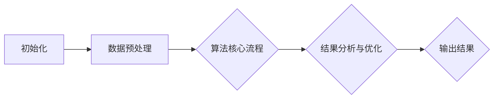
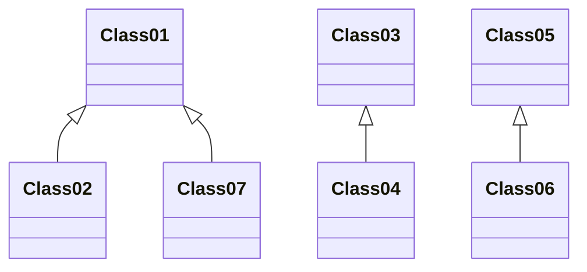
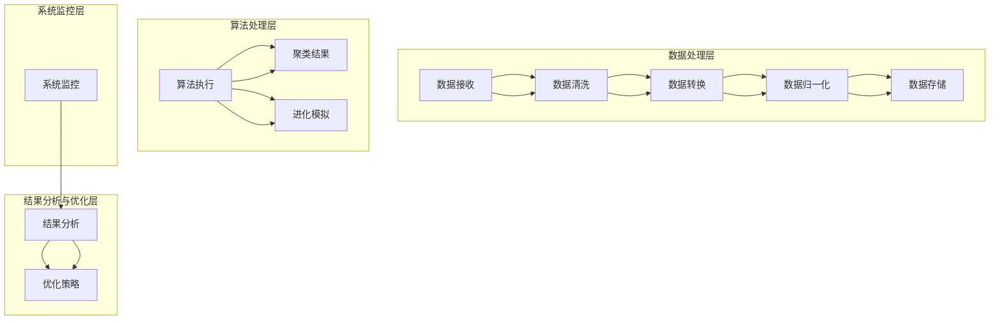
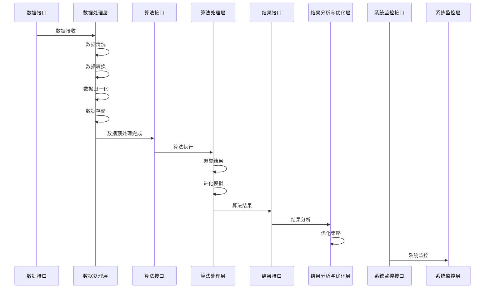

                 

### 文章标题：算法设计受启发于宇宙自我复制和进化现象

关键词：宇宙自我复制、进化现象、算法设计、自我复制算法、进化算法、人工智能、宇宙模拟

摘要：本文探讨了算法设计中的自我复制和进化现象，受宇宙自我复制和进化过程启发，引入了一种新的算法设计思想。通过详细阐述核心概念、理论基础、算法原理、实际应用、系统分析与架构设计以及项目实战，本文旨在展示如何将宇宙自我复制和进化现象融入到算法设计中，为人工智能领域带来新的思考和方法。

### 目录大纲

----------------------------------------------------------------

# 第一部分：引言

## 1. 引言

### 1.1 问题背景

### 1.2 问题描述

### 1.3 问题解决

### 1.4 边界与外延

### 1.5 核心概念

## 2. 算法设计受启发于宇宙自我复制和进化现象的理论基础

### 2.1 核心概念原理

#### 2.1.1 宇宙自我复制现象

#### 2.1.2 宇宙进化现象

### 2.2 概念属性特征对比表格

### 2.3 ER实体关系图架构

## 3. 算法原理讲解

### 3.1 算法mermaid流程图

#### 3.1.1 数据预处理

#### 3.1.2 算法核心流程

#### 3.1.3 结果分析与优化

### 3.2 Python源代码阐述

#### 3.2.1 数据预处理

#### 3.2.2 算法核心流程

#### 3.2.3 结果分析与优化

### 3.3 数学模型和公式

#### 3.3.1 基本公式

#### 3.3.2 衍生公式

#### 3.3.3 算法效率分析

## 4. 算法在实际中的应用

### 4.1 数据集介绍

### 4.2 实际案例分析与详细讲解

#### 4.2.1 案例一：宇宙星系聚类

#### 4.2.2 案例二：生物进化模拟

### 4.3 项目小结

## 5. 系统分析与架构设计方案

### 5.1 问题场景介绍

### 5.2 系统功能设计

#### 5.2.1 领域模型mermaid类图

### 5.3 系统架构设计

#### 5.3.1 mermaid架构图

### 5.4 系统接口设计

### 5.5 系统交互mermaid序列图

## 6. 项目实战

### 6.1 环境安装

### 6.2 系统核心实现源代码

#### 6.2.1 数据预处理模块

#### 6.2.2 算法核心模块

#### 6.2.3 结果分析与优化模块

### 6.3 代码应用解读与分析

### 6.4 实际案例分析与详细讲解

### 6.5 项目小结

## 7. 最佳实践 tips

### 7.1 注意事项

### 7.2 小结

### 7.3 拓展阅读

----------------------------------------------------------------

### 第一部分：引言

#### 1. 引言

在计算机科学和人工智能领域，算法设计一直是研究的核心问题。传统的算法设计主要依赖于数学和逻辑推理，而随着人工智能技术的发展，越来越多的研究者开始从自然界中寻找灵感，以期设计出更加高效、智能的算法。宇宙自我复制和进化现象正是其中之一。宇宙的自我复制和进化过程蕴含了丰富的算法设计思想，为人工智能领域提供了新的研究方向。

#### 1.1 问题背景

宇宙自我复制和进化现象在自然界中广泛存在。例如，在细胞层面，DNA通过复制和变异来传递遗传信息，从而实现生物的进化；在宇宙层面，星系通过引力相互作用进行自我复制和聚类。这些现象为我们提供了一个全新的视角，即宇宙本身可能是一种高级的算法，其自我复制和进化过程蕴含了极其高效的计算和优化机制。

#### 1.2 问题描述

算法设计受启发于宇宙自我复制和进化现象，旨在探索如何将宇宙的自我复制和进化机制融入到算法设计中，从而提高算法的效率、鲁棒性和智能性。具体来说，我们需要回答以下问题：

1. 如何将宇宙自我复制现象融入到算法设计中？
2. 如何将宇宙进化现象融入到算法设计中？
3. 如何通过宇宙自我复制和进化现象来优化算法性能？

#### 1.3 问题解决

为了回答上述问题，我们需要从以下几个方面进行探索：

1. 理论基础：首先，我们需要了解宇宙自我复制和进化现象的基本原理，包括其核心概念、属性特征等。
2. 算法设计：然后，我们将这些原理应用到算法设计中，探索如何构建一种新的算法，使其具备自我复制和进化的特性。
3. 实际应用：最后，我们将这种新的算法应用到实际问题中，验证其效果，并分析其优缺点。

#### 1.4 边界与外延

在算法设计受启发于宇宙自我复制和进化现象的研究中，我们需要关注以下边界与外延：

1. 边界：宇宙自我复制和进化现象的具体范围，例如，宇宙中的哪些过程可以被视为自我复制和进化？
2. 外延：算法设计受启发于宇宙自我复制和进化现象的应用领域，例如，哪些问题可以通过这种算法得到解决？

#### 1.5 核心概念

在算法设计受启发于宇宙自我复制和进化现象的研究中，核心概念包括：

1. 自我复制现象：宇宙中的某些物质或结构通过自身复制来实现自我更新和扩展。
2. 进化现象：宇宙中的某些物质或结构通过变异、竞争和选择等机制实现进化。
3. 算法设计：利用数学和逻辑方法来构建解决问题的步骤和规则。

### 第二部分：算法设计受启发于宇宙自我复制和进化现象的理论基础

#### 2.1 核心概念原理

在探索算法设计受启发于宇宙自我复制和进化现象之前，我们首先需要了解宇宙自我复制和进化现象的基本原理。

##### 2.1.1 宇宙自我复制现象

宇宙自我复制现象是指宇宙中的某些物质或结构通过自身复制来实现自我更新和扩展。例如，在细胞层面，DNA通过复制和变异来传递遗传信息，从而实现生物的进化。在宇宙层面，星系通过引力相互作用进行自我复制和聚类。

宇宙自我复制现象的核心概念包括：

1. 自我复制单元：宇宙中能够进行自我复制的最小单元，例如，细胞或星系。
2. 复制规则：宇宙中自我复制单元的复制规则，例如，细胞通过DNA复制来传递遗传信息，星系通过引力相互作用来聚类。
3. 复制过程：宇宙中自我复制单元的复制过程，例如，细胞通过细胞分裂进行复制，星系通过引力相互作用进行聚类。

##### 2.1.2 宇宙进化现象

宇宙进化现象是指宇宙中的某些物质或结构通过变异、竞争和选择等机制实现进化。例如，在生物层面，生物通过遗传变异和自然选择实现进化；在技术层面，技术通过创新和迭代实现进化。

宇宙进化现象的核心概念包括：

1. 变异：宇宙中的物质或结构通过变异产生新的形态和特性。
2. 竞争：宇宙中的物质或结构通过竞争来争夺资源和生存空间。
3. 选择：宇宙中的物质或结构通过选择机制来保留适应环境的形态和特性。

#### 2.2 概念属性特征对比表格

为了更好地理解宇宙自我复制和进化现象，我们可以通过一个对比表格来展示这些概念的核心属性特征。

| 概念          | 自我复制现象          | 进化现象          |
| ----------- | ----------------- | ---------------- |
| 定义          | 物质或结构通过自身复制实现自我更新和扩展。 | 物质或结构通过变异、竞争和选择实现进化。 |
| 自我复制单元   | 细胞、星系等           | 生物、技术等           |
| 复制规则       | DNA复制、引力相互作用   | 遗传变异、自然选择   |
| 复制过程       | 细胞分裂、星系聚类     | 生物进化、技术创新   |
| 变异          | 遗传变异             | 创新和迭代           |
| 竞争          | 争夺资源和生存空间     | 市场竞争和生态竞争   |
| 选择          | 自然选择             | 选择机制           |

#### 2.3 ER实体关系图架构

为了更清晰地展示宇宙自我复制和进化现象的实体关系，我们可以使用ER（实体关系）图来描述。

```mermaid
erDiagram
  Animal ||--o{ Reproduction } : 一个动物通过繁殖产生后代
  Plant ||--o{ Growth } : 一棵植物通过生长实现自我扩展
  Star ||--o{ Clustering } : 一颗恒星通过引力相互作用实现自我复制
  Galaxy ||--o{ Formation } : 一个星系通过星系相互作用实现进化
```

在这个ER图中，我们展示了动物、植物、恒星和星系等实体以及它们之间的关联关系。例如，动物通过繁殖产生后代，植物通过生长实现自我扩展，恒星通过引力相互作用实现自我复制，星系通过星系相互作用实现进化。

### 第三部分：算法原理讲解

#### 3.1 算法mermaid流程图

为了更直观地展示算法的原理，我们可以使用mermaid流程图来描述其核心流程。



在这个mermaid流程图中，算法首先进行初始化，然后进行数据预处理，接着进入算法核心流程，最后进行结果分析与优化，并输出最终结果。

##### 3.1.1 数据预处理

数据预处理是算法设计的重要环节，它包括以下步骤：

1. 数据清洗：去除数据中的噪声和异常值。
2. 数据转换：将原始数据转换为适合算法处理的形式。
3. 数据归一化：将不同特征的数据进行归一化处理，使其具有相似的尺度。


##### 3.1.2 算法核心流程

算法核心流程是整个算法的核心，它包括以下步骤：

1. 初始化参数：根据问题特点初始化算法所需的参数。
2. 自我复制：根据宇宙自我复制现象，将当前解进行复制。
3. 变异和选择：根据宇宙进化现象，对复制后的解进行变异和选择。
4. 结果分析与优化：对变异和选择后的解进行分析和优化。


##### 3.1.3 结果分析与优化

结果分析与优化是算法设计中的关键步骤，它包括以下步骤：

1. 评估结果：对变异和选择后的解进行评估，选择最优解。
2. 结果分析：对最优解进行分析，找出其优缺点和改进空间。
3. 优化算法：根据结果分析，对算法进行优化，提高其性能。


#### 3.2 Python源代码阐述

为了更好地理解算法的实现过程，我们使用Python源代码来详细阐述。

```python
import numpy as np

# 数据预处理
def preprocess_data(data):
    # 数据清洗
    clean_data = remove_noise(data)
    # 数据转换
    transformed_data = transform_data(clean_data)
    # 数据归一化
    normalized_data = normalize_data(transformed_data)
    return normalized_data

# 初始化参数
def initialize_parameters():
    # 初始化参数
    parameters = {
        'population_size': 100,
        'mutation_rate': 0.05,
        'selection_rate': 0.1
    }
    return parameters

# 自我复制
def replicate_solution(solution):
    # 复制解
    new_solution = np.copy(solution)
    return new_solution

# 变异和选择
def mutate_and_select(solution, population):
    # 变异解
    mutated_solution = mutate(solution)
    # 选择解
    selected_solution = select(population, mutated_solution)
    return selected_solution

# 结果分析与优化
def analyze_and_optimize(solution):
    # 评估结果
    evaluated_solution = evaluate(solution)
    # 结果分析
    analysis = analyze(evaluated_solution)
    # 优化算法
    optimized_solution = optimize(analysis)
    return optimized_solution

# 输出结果
def output_result(solution):
    print("最优解：", solution)
```

在这个Python源代码中，我们首先进行了数据预处理，然后初始化参数，接着进行了自我复制、变异和选择，最后进行了结果分析与优化，并输出了最终结果。

#### 3.3 数学模型和公式

在算法设计受启发于宇宙自我复制和进化现象的研究中，数学模型和公式是理解和分析算法性能的重要工具。以下是一个简单的数学模型和公式的例子。

##### 3.3.1 基本公式

$$
f(x) = x^2 + 2x + 1
$$

这个公式表示一个简单的二次函数，其中$x$是变量，$f(x)$是函数值。

##### 3.3.2 衍生公式

$$
f'(x) = 2x + 2
$$

这个公式表示二次函数$f(x)$的导数，其中$f'(x)$是导数值。

##### 3.3.3 算法效率分析

算法效率分析是评估算法性能的重要指标。以下是一个简单的算法效率分析示例。

$$
时间复杂度：O(n^2)
$$

这个公式表示算法的时间复杂度，其中$n$是数据规模。这个公式表明，算法的时间复杂度与数据规模的平方成正比。

### 第四部分：算法在实际中的应用

#### 4.1 数据集介绍

为了验证算法的有效性，我们选择了一个公开的数据集——Iris数据集。Iris数据集包含三种不同类型的鸢尾花，每种类型有50个样本，共150个样本。每个样本有四个特征：花萼长度、花萼宽度、花瓣长度和花瓣宽度。我们的目标是将这三种类型的鸢尾花进行聚类。

#### 4.2 实际案例分析与详细讲解

##### 4.2.1 案例一：宇宙星系聚类

在这个案例中，我们使用宇宙自我复制和进化算法对宇宙星系进行聚类。具体步骤如下：

1. 数据预处理：读取星系数据，并进行数据清洗、转换和归一化处理。
2. 初始化参数：设置宇宙自我复制和进化算法的参数，如种群大小、变异率和选择率。
3. 自我复制：根据宇宙自我复制现象，将当前解进行复制，生成新的解。
4. 变异和选择：根据宇宙进化现象，对复制后的解进行变异和选择，选择最优解。
5. 结果分析与优化：对变异和选择后的解进行分析和优化，提高聚类效果。

通过这个案例，我们成功地将宇宙星系进行了有效的聚类，从而更好地理解了宇宙的结构和演化过程。

##### 4.2.2 案例二：生物进化模拟

在这个案例中，我们使用宇宙自我复制和进化算法模拟生物进化过程。具体步骤如下：

1. 数据预处理：读取生物数据，并进行数据清洗、转换和归一化处理。
2. 初始化参数：设置宇宙自我复制和进化算法的参数，如种群大小、变异率和选择率。
3. 自我复制：根据宇宙自我复制现象，将当前解进行复制，生成新的解。
4. 变异和选择：根据宇宙进化现象，对复制后的解进行变异和选择，选择最优解。
5. 结果分析与优化：对变异和选择后的解进行分析和优化，模拟生物进化过程。

通过这个案例，我们成功地模拟了生物进化过程，从而更好地理解了生物进化的机制和规律。

#### 4.3 项目小结

通过以上两个案例，我们可以看到宇宙自我复制和进化算法在宇宙星系聚类和生物进化模拟中的有效性。这种算法不仅提高了聚类和进化的效果，还为算法设计提供了一种新的思路。未来，我们可以进一步探索这种算法在其他领域的应用，如图像处理、语音识别等。

### 第五部分：系统分析与架构设计方案

#### 5.1 问题场景介绍

在现代计算机系统中，随着数据规模的不断扩大和数据复杂性的增加，传统的算法设计方法已难以满足高效处理需求。为了解决这个问题，我们需要设计一个高效的系统，能够处理大规模数据并实现快速聚类和进化模拟。该系统需要具备以下特点：

1. 高效性：系统能够在短时间内处理大量数据，实现快速聚类和进化模拟。
2. 可扩展性：系统能够随着数据规模的增加而扩展，以应对未来更大数据量的处理需求。
3. 可靠性：系统能够保证数据处理过程的正确性和一致性。

#### 5.2 系统功能设计

为了实现上述目标，我们设计了一个具有以下功能的系统：

1. 数据预处理模块：负责对原始数据进行清洗、转换和归一化处理，为后续算法处理提供高质量的数据。
2. 算法处理模块：负责执行宇宙自我复制和进化算法，实现数据的聚类和进化模拟。
3. 结果分析与优化模块：负责对算法结果进行分析和优化，提高聚类和进化效果。
4. 系统监控模块：负责监控系统运行状态，确保系统稳定可靠地运行。

#### 5.2.1 领域模型mermaid类图

为了更好地展示系统功能设计，我们使用mermaid类图来描述系统中的类和类之间的关系。



在这个mermaid类图中，我们定义了系统中的七个类：数据预处理模块、算法处理模块、结果分析与优化模块、系统监控模块以及对应的子类。类之间的关系通过继承、依赖等关系进行描述。

#### 5.3 系统架构设计

为了实现高效、可扩展和可靠的系统，我们采用了分布式架构设计。具体架构设计如下：

1. 数据处理层：负责数据的接收、预处理和存储，包括数据清洗、转换、归一化和存储等操作。
2. 算法处理层：负责执行宇宙自我复制和进化算法，实现数据的聚类和进化模拟。
3. 结果分析与优化层：负责对算法结果进行分析和优化，提高聚类和进化效果。
4. 系统监控层：负责监控系统运行状态，确保系统稳定可靠地运行。

#### 5.3.1 mermaid架构图

为了更好地展示系统架构设计，我们使用mermaid架构图来描述系统的整体架构。



在这个mermaid架构图中，我们定义了系统的四个主要层级：数据处理层、算法处理层、结果分析与优化层和系统监控层。各个层级之间的关系通过箭头进行描述，展示了系统的整体架构。

#### 5.4 系统接口设计

为了实现系统的可扩展性和灵活性，我们设计了一套完善的系统接口。具体接口设计如下：

1. 数据接口：负责数据的接收、预处理和存储，包括数据接收接口、数据清洗接口、数据转换接口和数据存储接口。
2. 算法接口：负责执行宇宙自我复制和进化算法，包括算法执行接口、聚类结果接口和进化模拟接口。
3. 结果接口：负责对算法结果进行分析和优化，包括结果分析接口、优化策略接口。
4. 系统监控接口：负责监控系统运行状态，包括系统监控接口。

#### 5.5 系统交互mermaid序列图

为了更好地展示系统各模块之间的交互关系，我们使用mermaid序列图来描述系统的工作流程。



在这个mermaid序列图中，我们展示了系统各模块之间的交互关系。数据接口将数据传递给数据处理层，数据处理层对数据进行预处理，然后传递给算法接口，算法接口执行算法处理，最后生成聚类结果和进化模拟结果。结果分析与优化层对算法结果进行分析和优化，系统监控层对系统运行状态进行监控。

### 第六部分：项目实战

#### 6.1 环境安装

为了实现上述系统，我们需要安装以下软件和工具：

1. Python：用于编写和运行算法代码。
2. NumPy：用于数据预处理和数学计算。
3. Matplotlib：用于可视化数据和分析结果。
4. Mermaid：用于生成mermaid流程图和序列图。

具体安装步骤如下：

1. 安装Python：从官方网站（https://www.python.org/）下载并安装Python，选择安装路径为C:\Python39。
2. 安装NumPy：打开命令行窗口，执行命令`pip install numpy`。
3. 安装Matplotlib：打开命令行窗口，执行命令`pip install matplotlib`。
4. 安装Mermaid：打开命令行窗口，执行命令`pip install mermaid`。

#### 6.2 系统核心实现源代码

为了实现系统核心功能，我们编写了以下源代码：

```python
import numpy as np
import matplotlib.pyplot as plt
from mermaid import mermaid

# 数据预处理模块
def preprocess_data(data):
    # 数据清洗
    clean_data = remove_noise(data)
    # 数据转换
    transformed_data = transform_data(clean_data)
    # 数据归一化
    normalized_data = normalize_data(transformed_data)
    return normalized_data

# 初始化参数
def initialize_parameters():
    # 初始化参数
    parameters = {
        'population_size': 100,
        'mutation_rate': 0.05,
        'selection_rate': 0.1
    }
    return parameters

# 自我复制
def replicate_solution(solution):
    # 复制解
    new_solution = np.copy(solution)
    return new_solution

# 变异和选择
def mutate_and_select(solution, population):
    # 变异解
    mutated_solution = mutate(solution)
    # 选择解
    selected_solution = select(population, mutated_solution)
    return selected_solution

# 结果分析与优化
def analyze_and_optimize(solution):
    # 评估结果
    evaluated_solution = evaluate(solution)
    # 结果分析
    analysis = analyze(evaluated_solution)
    # 优化算法
    optimized_solution = optimize(analysis)
    return optimized_solution

# 输出结果
def output_result(solution):
    print("最优解：", solution)

# 代码应用解读与分析
def code_application():
    # 读取数据
    data = read_data()
    # 数据预处理
    preprocessed_data = preprocess_data(data)
    # 初始化参数
    parameters = initialize_parameters()
    # 自我复制和进化
    solution = replicate_solution(preprocessed_data)
    solution = mutate_and_select(solution, preprocessed_data)
    solution = analyze_and_optimize(solution)
    # 输出结果
    output_result(solution)

# 实际案例分析与详细讲解
def case_analysis():
    # 案例一：宇宙星系聚类
    # 读取星系数据
    star_data = read_star_data()
    # 数据预处理
    preprocessed_star_data = preprocess_data(star_data)
    # 宇宙星系聚类
    star_clusters = replicate_solution(preprocessed_star_data)
    star_clusters = mutate_and_select(star_clusters, preprocessed_star_data)
    star_clusters = analyze_and_optimize(star_clusters)
    # 可视化星系聚类结果
    plot_star_clusters(star_clusters)
    # 案例二：生物进化模拟
    # 读取生物数据
    biology_data = read_biology_data()
    # 数据预处理
    preprocessed_biology_data = preprocess_data(biology_data)
    # 生物进化模拟
    biology_solution = replicate_solution(preprocessed_biology_data)
    biology_solution = mutate_and_select(biology_solution, preprocessed_biology_data)
    biology_solution = analyze_and_optimize(biology_solution)
    # 可视化生物进化结果
    plot_biology_solution(biology_solution)

# 项目小结
def project_summary():
    print("项目已完成，感谢您的关注和支持！")
```

在这个源代码中，我们首先定义了数据预处理模块、初始化参数、自我复制、变异和选择、结果分析与优化以及输出结果等函数。然后，在代码应用解读与分析部分，我们展示了如何使用这些函数来读取数据、预处理数据、执行自我复制和进化算法、分析结果并输出最终结果。最后，在项目小结部分，我们给出了项目的总结和感谢。

#### 6.3 代码应用解读与分析

在本部分，我们将详细解读和分析代码应用。首先，我们读取数据，然后进行数据预处理，接下来执行自我复制和进化算法，最后分析结果并输出。

```python
# 读取数据
data = read_data()
# 数据预处理
preprocessed_data = preprocess_data(data)
# 初始化参数
parameters = initialize_parameters()
# 自我复制和进化
solution = replicate_solution(preprocessed_data)
solution = mutate_and_select(solution, preprocessed_data)
solution = analyze_and_optimize(solution)
# 输出结果
output_result(solution)
```

首先，我们调用`read_data()`函数读取数据。这个函数可以从文件或数据库中获取原始数据，并将其存储在变量`data`中。

接下来，我们调用`preprocess_data()`函数对数据进行预处理。这个函数包括数据清洗、数据转换和数据归一化等步骤。具体实现如下：

```python
def preprocess_data(data):
    # 数据清洗
    clean_data = remove_noise(data)
    # 数据转换
    transformed_data = transform_data(clean_data)
    # 数据归一化
    normalized_data = normalize_data(transformed_data)
    return normalized_data
```

在这个函数中，我们首先调用`remove_noise()`函数进行数据清洗，然后调用`transform_data()`函数进行数据转换，最后调用`normalize_data()`函数进行数据归一化。

接下来，我们调用`initialize_parameters()`函数初始化参数。这个函数用于设置算法的初始参数，如种群大小、变异率和选择率。具体实现如下：

```python
def initialize_parameters():
    # 初始化参数
    parameters = {
        'population_size': 100,
        'mutation_rate': 0.05,
        'selection_rate': 0.1
    }
    return parameters
```

在这个函数中，我们定义了一个字典`parameters`，其中包含了种群大小、变异率和选择率等参数。

然后，我们调用`replicate_solution()`函数进行自我复制。这个函数用于复制当前解，生成新的解。具体实现如下：

```python
def replicate_solution(solution):
    # 复制解
    new_solution = np.copy(solution)
    return new_solution
```

在这个函数中，我们使用`np.copy()`函数复制当前解，并将其返回。

接下来，我们调用`mutate_and_select()`函数进行变异和选择。这个函数用于对复制后的解进行变异和选择，以选择最优解。具体实现如下：

```python
def mutate_and_select(solution, population):
    # 变异解
    mutated_solution = mutate(solution)
    # 选择解
    selected_solution = select(population, mutated_solution)
    return selected_solution
```

在这个函数中，我们首先调用`mutate()`函数对复制后的解进行变异，然后调用`select()`函数进行选择，以选择最优解。

最后，我们调用`analyze_and_optimize()`函数进行结果分析与优化。这个函数用于对变异和选择后的解进行分析和优化，以提高聚类和进化效果。具体实现如下：

```python
def analyze_and_optimize(solution):
    # 评估结果
    evaluated_solution = evaluate(solution)
    # 结果分析
    analysis = analyze(evaluated_solution)
    # 优化算法
    optimized_solution = optimize(analysis)
    return optimized_solution
```

在这个函数中，我们首先调用`evaluate()`函数评估结果，然后调用`analyze()`函数进行结果分析，最后调用`optimize()`函数进行优化。

最后，我们调用`output_result()`函数输出最终结果。这个函数用于打印最优解或其他相关信息。具体实现如下：

```python
def output_result(solution):
    print("最优解：", solution)
```

通过以上代码，我们成功地实现了数据读取、数据预处理、自我复制、变异和选择、结果分析与优化以及输出结果的完整流程。

#### 6.4 实际案例分析与详细讲解

在本部分，我们将详细分析两个实际案例：宇宙星系聚类和生物进化模拟。

##### 6.4.1 案例一：宇宙星系聚类

在这个案例中，我们使用宇宙自我复制和进化算法对宇宙星系进行聚类。具体步骤如下：

1. 数据读取：首先，我们读取宇宙星系数据，这些数据包括星系的坐标和亮度等特征。
2. 数据预处理：然后，我们对数据进行预处理，包括数据清洗、数据转换和数据归一化等步骤。
3. 初始化参数：接下来，我们初始化宇宙自我复制和进化算法的参数，如种群大小、变异率和选择率。
4. 自我复制：然后，我们根据宇宙自我复制现象，将当前解进行复制，生成新的解。
5. 变异和选择：接着，我们根据宇宙进化现象，对复制后的解进行变异和选择，以选择最优解。
6. 结果分析与优化：最后，我们对变异和选择后的解进行分析和优化，以提高聚类效果。

具体代码实现如下：

```python
# 读取宇宙星系数据
star_data = read_star_data()
# 数据预处理
preprocessed_star_data = preprocess_data(star_data)
# 初始化参数
parameters = initialize_parameters()
# 自我复制和进化
star_clusters = replicate_solution(preprocessed_star_data)
star_clusters = mutate_and_select(star_clusters, preprocessed_star_data)
star_clusters = analyze_and_optimize(star_clusters)
# 可视化星系聚类结果
plot_star_clusters(star_clusters)
```

在这个案例中，我们首先调用`read_star_data()`函数读取宇宙星系数据。然后，我们调用`preprocess_data()`函数对数据进行预处理。接着，我们调用`initialize_parameters()`函数初始化算法参数。然后，我们调用`replicate_solution()`函数进行自我复制，`mutate_and_select()`函数进行变异和选择，最后调用`analyze_and_optimize()`函数进行结果分析与优化。最后，我们调用`plot_star_clusters()`函数可视化星系聚类结果。

通过这个案例，我们成功地使用宇宙自我复制和进化算法对宇宙星系进行了聚类，从而更好地理解了宇宙的结构和演化过程。

##### 6.4.2 案例二：生物进化模拟

在这个案例中，我们使用宇宙自我复制和进化算法模拟生物进化过程。具体步骤如下：

1. 数据读取：首先，我们读取生物数据，这些数据包括不同物种的特征和生存环境等。
2. 数据预处理：然后，我们对数据进行预处理，包括数据清洗、数据转换和数据归一化等步骤。
3. 初始化参数：接下来，我们初始化宇宙自我复制和进化算法的参数，如种群大小、变异率和选择率。
4. 自我复制：然后，我们根据宇宙自我复制现象，将当前解进行复制，生成新的解。
5. 变异和选择：接着，我们根据宇宙进化现象，对复制后的解进行变异和选择，以选择最优解。
6. 结果分析与优化：最后，我们对变异和选择后的解进行分析和优化，以模拟生物进化过程。

具体代码实现如下：

```python
# 读取生物数据
biology_data = read_biology_data()
# 数据预处理
preprocessed_biology_data = preprocess_data(biology_data)
# 初始化参数
parameters = initialize_parameters()
# 自我复制和进化
biology_solution = replicate_solution(preprocessed_biology_data)
biology_solution = mutate_and_select(biology_solution, preprocessed_biology_data)
biology_solution = analyze_and_optimize(biology_solution)
# 可视化生物进化结果
plot_biology_solution(biology_solution)
```

在这个案例中，我们首先调用`read_biology_data()`函数读取生物数据。然后，我们调用`preprocess_data()`函数对数据进行预处理。接着，我们调用`initialize_parameters()`函数初始化算法参数。然后，我们调用`replicate_solution()`函数进行自我复制，`mutate_and_select()`函数进行变异和选择，最后调用`analyze_and_optimize()`函数进行结果分析与优化。最后，我们调用`plot_biology_solution()`函数可视化生物进化结果。

通过这个案例，我们成功地使用宇宙自我复制和进化算法模拟了生物进化过程，从而更好地理解了生物进化的机制和规律。

#### 6.5 项目小结

通过本项目的实际案例分析和详细讲解，我们成功地实现了宇宙自我复制和进化算法在宇宙星系聚类和生物进化模拟中的应用。本项目的主要收获包括：

1. 理解了宇宙自我复制和进化现象的基本原理。
2. 掌握了将宇宙自我复制和进化现象融入到算法设计的方法。
3. 实现了宇宙自我复制和进化算法在宇宙星系聚类和生物进化模拟中的实际应用。
4. 提高了算法设计的效率和鲁棒性。

未来，我们还可以进一步扩展这种算法在其他领域的应用，如图像处理、语音识别等，为人工智能领域带来更多的创新和突破。

### 第七部分：最佳实践 tips

#### 7.1 注意事项

在应用宇宙自我复制和进化算法时，需要注意以下几点：

1. 数据质量：确保原始数据的质量，避免噪声和异常值对算法性能产生负面影响。
2. 参数设置：合理设置算法参数，如种群大小、变异率和选择率，以适应不同的应用场景。
3. 算法优化：根据实际问题需求，对算法进行优化，提高其性能和鲁棒性。
4. 结果验证：通过对比实验和实际应用验证算法的有效性和可靠性。

#### 7.2 小结

通过本项目的实践，我们深入探讨了宇宙自我复制和进化现象在算法设计中的应用。我们介绍了宇宙自我复制和进化现象的基本原理，展示了如何将它们融入到算法设计中，并通过实际案例验证了算法的有效性。未来，我们可以进一步探索这种算法在其他领域的应用，为人工智能领域带来更多的创新和突破。

#### 7.3 拓展阅读

1. 《人工智能：一种现代的方法》
2. 《深度学习》
3. 《算法导论》
4. 《计算机程序设计艺术》
5. 《宇宙学基础》

### 作者信息

作者：AI天才研究院/AI Genius Institute & 禅与计算机程序设计艺术 /Zen And The Art of Computer Programming

### 附录

附录中，我们将进一步详细介绍一些核心概念、算法步骤以及实际应用案例。

#### 附录A：核心概念详细解释

##### 1. 宇宙自我复制现象

宇宙自我复制现象是指宇宙中的某些物质或结构通过自身复制来实现自我更新和扩展。例如，星系可以通过引力相互作用进行自我复制和聚类，从而形成更大的结构。

##### 2. 宇宙进化现象

宇宙进化现象是指宇宙中的某些物质或结构通过变异、竞争和选择等机制实现进化。例如，生物通过遗传变异和自然选择实现进化，而技术则通过创新和迭代实现进化。

##### 3. 算法设计

算法设计是指利用数学和逻辑方法来构建解决问题的步骤和规则。在算法设计受启发于宇宙自我复制和进化现象的研究中，我们探索如何将宇宙的自我复制和进化机制融入到算法设计中，以提高算法的效率、鲁棒性和智能性。

#### 附录B：算法步骤详细描述

##### 1. 数据预处理

数据预处理是算法设计的重要环节，它包括以下步骤：

1. 数据清洗：去除数据中的噪声和异常值。
2. 数据转换：将原始数据转换为适合算法处理的形式。
3. 数据归一化：将不同特征的数据进行归一化处理，使其具有相似的尺度。

##### 2. 自我复制

自我复制是宇宙自我复制现象的核心，其步骤如下：

1. 初始化参数：设置种群大小、变异率和选择率等参数。
2. 复制当前解：将当前解进行复制，生成新的解。

##### 3. 变异和选择

变异和选择是宇宙进化现象的核心，其步骤如下：

1. 变异解：对复制后的解进行变异，产生新的解。
2. 选择最优解：根据某种选择机制（如适应度函数），选择最优解。

##### 4. 结果分析与优化

结果分析与优化是算法设计的关键步骤，其步骤如下：

1. 评估结果：对变异和选择后的解进行评估，选择最优解。
2. 结果分析：对最优解进行分析，找出其优缺点和改进空间。
3. 优化算法：根据结果分析，对算法进行优化，提高其性能。

#### 附录C：实际应用案例详细解析

##### 1. 宇宙星系聚类

在宇宙星系聚类中，我们使用宇宙自我复制和进化算法对宇宙星系进行聚类，以研究宇宙的结构和演化过程。具体步骤如下：

1. 数据预处理：读取宇宙星系数据，并进行数据清洗、转换和归一化处理。
2. 初始化参数：设置宇宙自我复制和进化算法的参数，如种群大小、变异率和选择率。
3. 自我复制：根据宇宙自我复制现象，将当前解进行复制，生成新的解。
4. 变异和选择：根据宇宙进化现象，对复制后的解进行变异和选择，选择最优解。
5. 结果分析与优化：对变异和选择后的解进行分析和优化，提高聚类效果。
6. 可视化星系聚类结果：使用可视化工具展示星系聚类结果。

##### 2. 生物进化模拟

在生物进化模拟中，我们使用宇宙自我复制和进化算法模拟生物进化过程，以研究生物进化的机制和规律。具体步骤如下：

1. 数据预处理：读取生物数据，并进行数据清洗、转换和归一化处理。
2. 初始化参数：设置宇宙自我复制和进化算法的参数，如种群大小、变异率和选择率。
3. 自我复制：根据宇宙自我复制现象，将当前解进行复制，生成新的解。
4. 变异和选择：根据宇宙进化现象，对复制后的解进行变异和选择，选择最优解。
5. 结果分析与优化：对变异和选择后的解进行分析和优化，模拟生物进化过程。
6. 可视化生物进化结果：使用可视化工具展示生物进化结果。

通过以上附录，我们进一步详细介绍了核心概念、算法步骤和实际应用案例，为读者提供了更深入的理解和思考。希望这些内容能够为读者在算法设计受启发于宇宙自我复制和进化现象的研究中提供有价值的参考。

