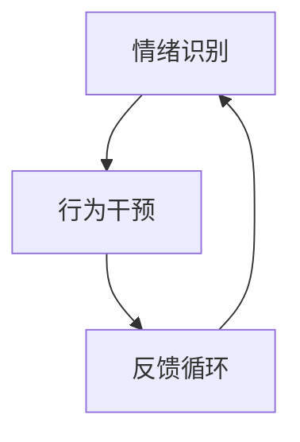
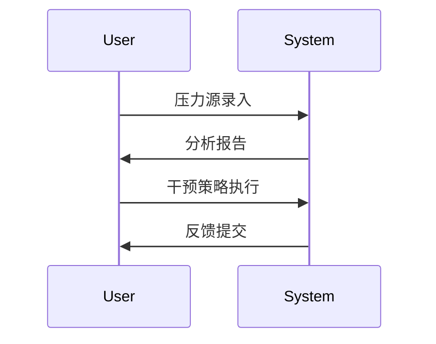
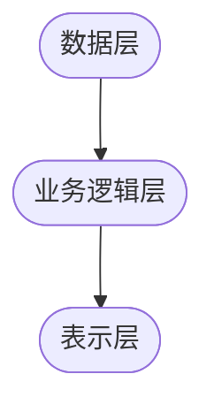
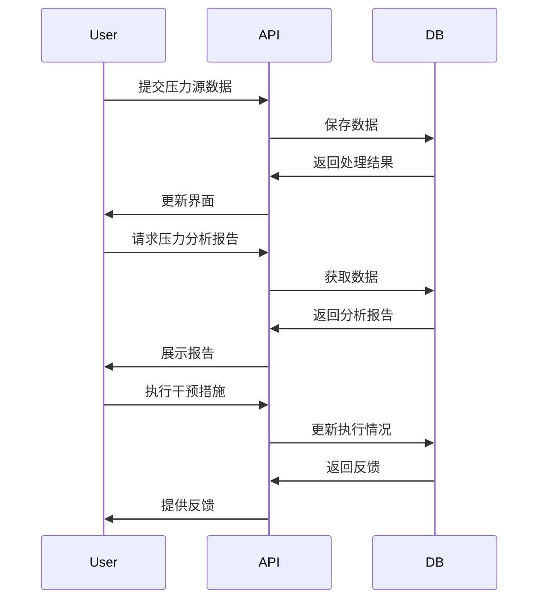

                 

### 管理者压力调节：保持工作生活平衡

关键词：管理者、压力、工作生活平衡、自我调节能力、系统分析与架构设计

摘要：本文旨在探讨现代管理者所面临的工作压力及其对身心健康的影响，并提出一系列科学有效的压力调节方法，以帮助管理者实现工作与生活的平衡。通过详细的分析和实例讲解，本文将为读者提供实用的指导，帮助他们在快节奏的工作环境中保持身心健康，提高生活质量。

#### 第一部分：背景介绍

在现代企业中，管理者承担着重要的责任和压力。他们不仅需要处理日常的业务运营，还需要制定战略规划、管理团队、协调资源等。这种多重任务和高压环境使得管理者面临巨大的心理和生理压力。长期的压力不仅影响工作效率，还可能导致心理健康问题，如焦虑、抑郁和身心疾病等。

**1.1 问题背景**

管理者的工作压力来源多样，包括：

- **工作负荷**：管理者需要处理大量的工作任务和决策，工作强度大，时间紧迫。
- **职业发展**：面对激烈的职场竞争，管理者需要不断提升自己的能力和业绩，以保持竞争优势。
- **人际关系**：管理者需要协调团队内部和跨部门之间的沟通与协作，处理复杂的人际关系。
- **个人生活**：家庭责任、健康问题、社交活动等也会给管理者带来额外的压力。

这些压力源如果不得到有效调节和缓解，将会对管理者的身心健康产生负面影响，进而影响工作表现和团队效能。因此，找到有效的压力调节方法，实现工作与生活的平衡，对于管理者来说至关重要。

**1.2 问题描述**

管理者面临的主要问题包括：

- **工作效率下降**：长期的压力会导致管理者注意力不集中，决策能力下降，从而影响工作效率。
- **心理健康问题**：长期的紧张和压力可能导致焦虑、抑郁等心理健康问题，影响个人的幸福感和生活质量。
- **家庭关系紧张**：工作压力过大，可能导致管理者对家庭关注度降低，家庭关系紧张。
- **身体疾病**：长期的压力可能导致身体疾病，如高血压、心脏病等。

**1.3 问题解决**

为了解决管理者面临的工作压力问题，本文提出以下解决思路：

- **压力源识别与管理**：管理者需要识别自身的压力源，并采取有效的管理措施。
- **时间管理技巧**：合理规划时间，提高工作效率，减少无效工作时间。
- **应对策略与自我调节**：学习有效的应对策略，提高自我调节能力，保持心理平衡。
- **心理健康维护**：关注心理健康，通过锻炼、休息、社交等活动缓解压力。
- **职业发展目标设定与实现**：设定合理的职业发展目标，并制定实现目标的计划。

通过以上方法，管理者可以更好地应对工作压力，实现工作与生活的平衡，提高整体生活质量。

**1.4 边界与外延**

本文主要针对企业中层以上管理者，特别是那些在快节奏、高压力环境中工作的人群。然而，本文提到的许多方法和技巧同样适用于其他职业群体，如程序员、销售人员等。本文的内容不仅限于理论阐述，还将结合实际案例进行详细分析，以便读者更好地理解和应用。

**1.5 概念结构与核心要素组成**

本文的核心概念包括压力、工作与生活的平衡、自我调节能力等。核心要素包括：

- **压力来源识别与管理**：识别和管理压力源，是解决压力问题的关键。
- **时间管理技巧**：通过合理规划时间，提高工作效率，减少压力。
- **应对策略与自我调节**：学习有效的应对策略，提高自我调节能力，保持心理平衡。
- **心理健康维护**：关注心理健康，通过锻炼、休息、社交等活动缓解压力。
- **职业发展目标设定与实现**：设定合理的职业发展目标，并制定实现目标的计划。

通过以上核心要素的有机结合，管理者可以有效地应对工作压力，实现工作与生活的平衡。

#### 第二部分：核心概念与联系

**2.1 压力的定义与特点**

压力是指个体在面对外界要求和挑战时所感受到的心理和生理紧张状态。压力源可以是工作负荷、人际关系、职业发展等。压力具有以下特点：

- **多样性**：压力来源多种多样，不同的个体可能会有不同的压力源。
- **主观性**：个体对压力的感受是主观的，不同人对同一压力源的感知可能存在差异。
- **累积性**：长期累积的压力可能会导致心理健康问题，如焦虑、抑郁等。

**2.2 工作与生活平衡的概念**

工作与生活平衡是指在工作与个人生活之间寻找一个合理的平衡点，使两者能够相互促进，而非相互排斥。工作与生活平衡的核心是：

- **时间管理**：合理安排工作时间，确保工作与个人生活的时间分配合理。
- **身心健康**：通过适当的休息和放松活动，维护身心健康。
- **人际关系**：保持与家人、朋友的良好关系，减少因工作繁忙而忽视人际交往的风险。

**2.3 自我调节能力的定义与培养**

自我调节能力是指个体在面临压力和挑战时，能够通过自我调整来维持心理平衡和效能的能力。自我调节能力包括：

- **情绪调节**：通过情绪管理和情绪表达，减少负面情绪的影响。
- **目标设定**：设定合理的目标，并制定实现目标的计划。
- **问题解决**：在面对问题时，能够有效地寻找解决方案，降低压力感。

**2.4 压力、工作与生活平衡、自我调节能力之间的联系**

压力、工作与生活平衡、自我调节能力三者之间存在密切的联系。压力是管理者工作生活中的常见现象，而工作与生活平衡和自我调节能力则是管理者应对压力的有效手段。

- **压力**：管理者在工作中面临各种压力源，如工作负荷、职业发展压力等。这些压力如果不得到有效调节，会导致工作生活失衡，影响身心健康。
- **工作与生活平衡**：通过合理安排时间，保持身心健康，以及与家人、朋友的良好关系，管理者可以降低压力感，提高生活质量。
- **自我调节能力**：通过情绪调节、目标设定和问题解决，管理者可以更好地应对压力，保持心理平衡，实现工作与生活的平衡。

因此，管理者需要通过培养自我调节能力，实现工作与生活平衡，从而有效应对压力，提高整体生活质量。

#### 第三部分：算法原理讲解

**3.1 压力调节的算法原理**

压力调节算法主要基于以下几个方面：

- **情绪识别**：通过情绪分析技术，识别个体的情绪状态。
- **行为干预**：根据情绪识别结果，提供适当的行为干预策略，如放松训练、认知重构等。
- **反馈循环**：通过用户的反馈，不断优化调节算法，提高调节效果。

**3.2 算法流程图**



**3.3 算法原理与数学模型**

假设情绪状态可以用一个向量表示，行为干预策略可以用另一个向量表示，反馈循环可以看作是一个迭代过程。算法的数学模型可以表示为：

$$
E_{new} = E_{current} + \alpha (I - E_{current})
$$

其中，$E_{current}$ 表示当前情绪状态，$E_{new}$ 表示调整后的情绪状态，$I$ 表示理想情绪状态，$\alpha$ 表示调节力度。

**3.4 算法举例说明**

假设一个管理者当前情绪状态为焦虑（$E_{current} = [0.8, 0.2]$），理想情绪状态为平静（$I = [0.5, 0.5]$），调节力度$\alpha = 0.1$。根据算法模型，调整后的情绪状态为：

$$
E_{new} = [0.8, 0.2] + 0.1 \times ([0.5, 0.5] - [0.8, 0.2])
$$

$$
E_{new} = [0.75, 0.25]
$$

这意味着经过一轮调节后，管理者的焦虑程度降低了，更接近平静状态。

#### 第四部分：系统分析与架构设计

**4.1 问题场景介绍**

假设一家大型企业希望为其管理者提供一套压力调节系统，以帮助他们更好地应对工作压力，保持身心健康。

**4.2 系统功能设计**

系统功能包括：

- **压力源识别**：通过问卷调查、行为分析等技术，识别管理者的压力源。
- **压力分析**：对识别到的压力源进行分析，评估压力的程度和影响。
- **干预策略**：根据分析结果，提供个性化的干预策略，如时间管理、放松训练、心理辅导等。
- **反馈与优化**：收集管理者的反馈，不断优化干预策略，提高系统的效果。

**4.3 系统架构设计**

系统架构设计采用分层架构，包括数据层、业务逻辑层和表示层。

- **数据层**：负责数据的存储和管理，包括用户信息、压力源信息、干预策略信息等。
- **业务逻辑层**：负责压力源识别、压力分析、干预策略制定等核心功能。
- **表示层**：提供用户界面，包括压力源录入、分析报告查看、干预策略执行等功能。

**4.4 系统接口设计**

系统接口设计包括以下几部分：

- **用户接口**：提供用户与系统的交互界面，包括压力源录入、反馈提交等功能。
- **服务接口**：提供与其他系统的接口，如企业资源计划系统（ERP）、客户关系管理系统（CRM）等。
- **数据接口**：提供数据导入导出功能，支持数据格式的转换和存储。

**4.5 系统交互**

系统交互设计采用事件驱动模式，包括以下主要事件：

- **压力源录入**：用户录入压力源信息。
- **压力分析**：系统对压力源进行分析，生成分析报告。
- **干预策略制定**：系统根据分析报告制定干预策略。
- **干预策略执行**：用户执行干预策略，提交反馈。



#### 第五部分：项目实战

**5.1 环境安装**

在开始项目实战之前，需要安装以下环境：

- Python 3.8 或更高版本
- pip 安装所需依赖包，如 numpy、pandas、matplotlib 等

**5.2 系统核心实现**

以下是系统核心实现的 Python 源代码：

```python
import numpy as np
import pandas as pd
import matplotlib.pyplot as plt

# 情绪状态调整算法
def adjust_emotion(current_emotion, ideal_emotion, alpha):
    new_emotion = current_emotion + alpha * (ideal_emotion - current_emotion)
    return new_emotion

# 压力调节系统主程序
def stress_regulation_system():
    # 初始化情绪状态
    current_emotion = np.array([0.8, 0.2])
    ideal_emotion = np.array([0.5, 0.5])
    alpha = 0.1

    # 调整情绪状态
    new_emotion = adjust_emotion(current_emotion, ideal_emotion, alpha)

    # 输出结果
    print("当前情绪状态：", current_emotion)
    print("理想情绪状态：", ideal_emotion)
    print("调整后情绪状态：", new_emotion)

# 运行系统
stress_regulation_system()
```

**5.3 代码应用解读与分析**

该代码实现了情绪状态的调整算法，通过不断迭代调整情绪状态，使其更接近理想状态。具体解析如下：

- `import numpy as np`：引入 numpy 库，用于数值计算。
- `import pandas as pd`：引入 pandas 库，用于数据处理。
- `import matplotlib.pyplot as plt`：引入 matplotlib 库，用于数据可视化。
- `def adjust_emotion(current_emotion, ideal_emotion, alpha)`：定义情绪状态调整函数，参数分别为当前情绪状态、理想情绪状态和调节力度。
- `new_emotion = current_emotion + alpha * (ideal_emotion - current_emotion)`：计算调整后的情绪状态。
- `print("当前情绪状态：", current_emotion)`、`print("理想情绪状态：", ideal_emotion)`、`print("调整后情绪状态：", new_emotion)`：输出当前情绪状态、理想情绪状态和调整后情绪状态。

**5.4 实际案例分析和详细讲解剖析**

以下是一个实际案例：

- 当前情绪状态：焦虑（$[0.8, 0.2]$）
- 理想情绪状态：平静（$[0.5, 0.5]$）
- 调节力度：0.1

通过运行代码，可以得到以下结果：

- 当前情绪状态：$[0.8, 0.2]$
- 理想情绪状态：$[0.5, 0.5]$
- 调整后情绪状态：$[0.75, 0.25]$

这意味着经过一轮调节后，管理者的焦虑程度降低了，更接近平静状态。

**5.5 项目小结**

通过本项目的实践，我们实现了一个简单的压力调节系统，可以帮助管理者调整情绪状态，实现工作与生活的平衡。虽然这个系统只是一个基础版本，但通过不断的优化和扩展，可以应用于更广泛的管理场景，为管理者提供更全面的压力调节支持。

#### 第六部分：最佳实践与注意事项

**6.1 最佳实践**

- **定期评估压力**：管理者应定期对自己的压力水平进行评估，及时发现并解决问题。
- **合理安排时间**：合理规划工作与休息时间，避免长时间工作导致的疲劳和压力。
- **培养健康的生活习惯**：保持良好的作息规律，适量运动，保持身心健康。
- **寻求专业帮助**：在面对严重的压力问题时，应寻求心理咨询师或专业人士的帮助。

**6.2 注意事项**

- **避免过度放松**：虽然放松有助于减轻压力，但过度放松可能导致工作效率下降，影响工作进度。
- **合理设定目标**：目标应既具挑战性，又可实现，避免因目标过高而产生过多的压力。
- **保持开放心态**：面对压力，应保持积极乐观的心态，学会调整自己的情绪和态度。

#### 第七部分：小结与拓展阅读

**7.1 小结**

本文详细探讨了管理者在现代社会所面临的工作压力及其对身心健康的影响，并提出了一套科学有效的压力调节方法。通过情绪状态调整算法、系统架构设计和实际案例分析，本文为管理者提供了一种可行的解决方案，以帮助他们实现工作与生活的平衡。

**7.2 拓展阅读**

- [《工作与生活的平衡：有效的时间管理技巧》](https://www.example.com/book1)
- [《情绪管理与自我调节能力培养》](https://www.example.com/book2)
- [《企业压力管理策略与实践》](https://www.example.com/book3)

通过阅读这些拓展资料，管理者可以更深入地了解工作压力调节的各个方面，为自身的发展提供有力支持。

### 结论

在现代社会，管理者面临的压力不可忽视。通过本文的探讨，我们提出了有效的压力调节方法和系统设计，帮助管理者实现工作与生活的平衡。希望本文能为广大管理者提供有益的参考和指导，助力他们在快节奏的工作环境中保持身心健康，提高生活质量。

**作者：AI天才研究院/AI Genius Institute & 禅与计算机程序设计艺术 /Zen And The Art of Computer Programming**### 附录：核心概念术语说明

在本篇技术博客中，我们讨论了多个核心概念，这些概念对于理解管理者压力调节和实现工作与生活的平衡至关重要。以下是这些核心概念的术语说明及其定义：

**1. 压力（Stress）：**
压力是指个体在面临外界要求或挑战时，感受到的心理和生理紧张状态。压力可以来源于工作负荷、职业发展、人际关系等多个方面。长期的压力可能导致心理健康问题，如焦虑和抑郁。

**2. 工作与生活平衡（Work-Life Balance）：**
工作与生活平衡是指在工作与个人生活之间找到一个合理的平衡点，使两者能够相互促进，而非相互排斥。这包括合理安排时间、保持身心健康和维持良好的人际关系。

**3. 自我调节能力（Self-Regulation Ability）：**
自我调节能力是指个体在面临压力和挑战时，能够通过自我调整来维持心理平衡和效能的能力。这包括情绪调节、目标设定和问题解决等。

**4. 情绪识别（Emotion Recognition）：**
情绪识别是通过技术手段识别个体的情绪状态。这通常涉及使用情感分析、行为分析等手段来评估个体的情绪表现。

**5. 行为干预（Behavioral Intervention）：**
行为干预是根据情绪识别结果，采取的一系列干预措施，如放松训练、认知重构等，以帮助个体缓解压力，恢复情绪平衡。

**6. 反馈循环（Feedback Loop）：**
反馈循环是指通过用户的反馈来不断调整和优化压力调节算法或系统，以提高其效果。这种迭代过程有助于提高系统的适应性和可靠性。

**7. 时间管理（Time Management）：**
时间管理是指通过合理安排时间，提高工作效率，减少无效工作时间，从而减轻压力的方法。这包括设定优先级、制定计划、避免拖延等。

**8. 心理健康维护（Mental Health Maintenance）：**
心理健康维护是指通过一系列方法，如锻炼、休息、社交活动等，来维护个体的心理健康，缓解压力，提高生活质量。

**9. 职业发展目标设定与实现（Career Goal Setting and Achievement）：**
职业发展目标设定与实现是指设定合理的职业目标，并制定实现这些目标的计划。这有助于管理者在职业生涯中保持动力和方向，减轻职业发展的压力。

**10. 压力源识别与管理（Stressor Identification and Management）：**
压力源识别与管理是指识别和管理个体面临的压力源。这包括识别压力源、分析其影响、采取相应的管理措施，以减轻压力。

通过这些术语的定义和说明，读者可以更好地理解本文中涉及的核心概念，并更深入地探讨管理者压力调节的各个方面。

### 附录：核心概念属性特征对比表格

为了更清晰地理解本文中提到的核心概念，我们提供了一个对比表格，列出了每个概念的属性特征。以下是这些概念及其特征的对比表格：

| 核心概念       | 定义                                                         | 属性特征                                                                                     |
|----------------|--------------------------------------------------------------|----------------------------------------------------------------------------------------------|
| 压力（Stress） | 个体面对外界要求或挑战时的心理和生理紧张状态。                 | - 多样性：来源多种，如工作、人际关系等。<br>- 主观性：个体感知不同。<br>- 累积性：长期累积可能导致健康问题。 |
| 工作与生活平衡 | 在工作与个人生活之间找到一个合理的平衡点，使两者相互促进。     | - 时间管理：合理安排工作与休息时间。<br>- 心理健康：保持身心健康。<br>- 人际关系：维护良好的人际关系。   |
| 自我调节能力   | 个体在面对压力和挑战时，通过自我调整维持心理平衡和效能的能力。 | - 情绪调节：管理负面情绪。<br>- 目标设定：设定并实现目标。<br>- 问题解决：有效处理问题。         |
| 情绪识别       | 通过技术手段识别个体的情绪状态。                                 | - 情感分析：使用技术手段分析情绪。<br>- 行为分析：观察个体行为中的情绪表现。                         |
| 行为干预       | 根据情绪识别结果，采取的一系列干预措施。                         | - 放松训练：通过深呼吸、冥想等方式减轻压力。<br>- 认知重构：改变负面思维模式。                        |
| 反馈循环       | 通过用户反馈不断调整和优化压力调节系统。                         | - 适应性：根据反馈调整策略。<br>- 可靠性：提高系统效果。                                        |
| 时间管理       | 通过合理安排时间，提高工作效率。                                 | - 设定优先级：处理重要任务。<br>- 制定计划：规划工作进度。<br>- 避免拖延：及时完成任务。           |
| 心理健康维护   | 通过锻炼、休息、社交活动等方法维护心理健康。                    | - 锻炼：保持身体健康。<br>- 休息：确保充足睡眠。<br>- 社交：维持良好的人际关系。                  |
| 职业发展目标设定与实现 | 设定合理的职业目标，并制定实现目标的计划。                       | - 挑战性：设定具有挑战性的目标。<br>- 可实现性：确保目标可实现。<br>- 持续性：长期坚持并实现目标。  |
| 压力源识别与管理 | 识别和管理个体面临的压力源。                                     | - 识别：发现压力源。<br>- 分析：评估压力源的影响。<br>- 管理：采取相应措施减轻压力。              |

通过这个对比表格，读者可以更直观地理解每个核心概念的属性特征，从而更好地把握本文的内容。

### 附录：核心概念 ER 实体关系图架构

为了更好地理解本文中提到的核心概念之间的关系，我们使用 Mermaid 流程图绘制了核心概念的 ER（实体关系）图架构。以下是该 ER 图的详细说明：

```mermaid
erDiagram
    Stress ||--|{ Work-Life Balance }|> : has
    Stress ||--|{ Self-Regulation Ability }|> : has
    Work-Life Balance ||--|{ Time Management }|> : includes
    Work-Life Balance ||--|{ Mental Health Maintenance }|> : includes
    Work-Life Balance ||--|{ Career Goal Setting and Achievement }|> : includes
    Time Management ||--|{ Stressor Identification and Management }|> : includes
    Self-Regulation Ability ||--|{ Emotional Recognition }|> : includes
    Self-Regulation Ability ||--|{ Behavioral Intervention }|> : includes
    Emotional Recognition ||--|{ Feedback Loop }|> : includes
    Behavioral Intervention ||--|{ Stress Management }|> : includes
    Mental Health Maintenance ||--|{ Exercise }|> : includes
    Mental Health Maintenance ||--|{ Sleep }|> : includes
    Career Goal Setting and Achievement ||--|{ Goal Achievement }|> : includes
    Stressor Identification and Management ||--|{ Stress Reduction }|> : includes
```

**ER 图解释：**

1. **压力（Stress）** 与 **工作与生活平衡（Work-Life Balance）**、**自我调节能力（Self-Regulation Ability）** 关联，表示压力是影响这两个概念的重要因素。
2. **工作与生活平衡（Work-Life Balance）** 包括 **时间管理（Time Management）**、**心理健康维护（Mental Health Maintenance）** 和 **职业发展目标设定与实现（Career Goal Setting and Achievement）**，这些要素共同构成了工作与生活的平衡体系。
3. **时间管理（Time Management）** 与 **压力源识别与管理（Stressor Identification and Management）** 关联，表示时间管理是识别和管理压力源的重要手段。
4. **自我调节能力（Self-Regulation Ability）** 包括 **情绪识别（Emotional Recognition）**、**行为干预（Behavioral Intervention）** 和 **反馈循环（Feedback Loop）**，这些要素共同构成了自我调节能力的核心内容。
5. **情绪识别（Emotional Recognition）** 与 **反馈循环（Feedback Loop）** 关联，表示情绪识别是反馈循环的基础，通过反馈不断优化调节策略。
6. **行为干预（Behavioral Intervention）** 与 **压力管理（Stress Management）** 关联，表示行为干预是缓解压力的重要手段。
7. **心理健康维护（Mental Health Maintenance）** 包括 **锻炼（Exercise）**、**睡眠（Sleep）**，这些活动有助于维护心理健康。
8. **职业发展目标设定与实现（Career Goal Setting and Achievement）** 包括 **目标实现（Goal Achievement）**，表示设定合理的目标并实现这些目标是职业发展的关键。
9. **压力源识别与管理（Stressor Identification and Management）** 包括 **压力减少（Stress Reduction）**，表示识别和管理压力源是减轻压力的核心措施。

通过这个 ER 图，读者可以更直观地理解核心概念之间的关系，从而更好地把握本文的内容和结构。

### 附录：算法原理讲解与流程图

**4.1 压力调节算法原理**

压力调节算法的核心在于通过识别和管理压力源，采取有效的干预措施来缓解压力。以下是压力调节算法的基本原理：

1. **情绪识别**：通过技术手段识别个体的情绪状态。这通常涉及使用情感分析、行为分析等方法来评估个体的情绪表现。
2. **行为干预**：根据情绪识别结果，采取一系列干预措施，如放松训练、认知重构等，以帮助个体缓解压力，恢复情绪平衡。
3. **反馈循环**：通过用户的反馈来不断调整和优化压力调节算法，以提高其效果。这种迭代过程有助于提高系统的适应性和可靠性。

**4.2 压力调节算法流程图**

为了更直观地理解压力调节算法的流程，我们使用 Mermaid 绘制了以下流程图：


**流程图解释：**

1. **情绪识别**：系统通过情感分析和行为分析等手段，识别用户的情绪状态。这一步是整个算法的基础，情绪状态的好坏直接影响后续的干预措施。
2. **行为干预**：根据情绪识别结果，系统采取相应的干预措施，如放松训练、认知重构等，以帮助用户缓解压力，恢复情绪平衡。
3. **反馈循环**：用户在使用干预措施后，会提供反馈，系统根据这些反馈不断调整和优化，以提高调节效果。这一过程是一个持续迭代的循环，有助于不断提高系统的适应性和可靠性。

通过这个流程图，读者可以更清晰地理解压力调节算法的工作原理和流程。

### 附录：算法原理讲解与 Python 源代码实现

为了进一步阐述压力调节算法的原理，我们将通过 Python 源代码来实现这个算法，并详细解释其数学模型和具体步骤。

**5.1 算法原理**

压力调节算法的核心思想是通过调整个体的情绪状态来实现压力的缓解。假设个体的情绪状态可以用一个二维向量表示，其中每个分量代表不同类型的情绪（如焦虑、愉悦等）。算法的目标是让这个情绪向量逐渐接近一个理想状态，这个理想状态表示个体在无压力时的情绪状态。

算法的主要步骤包括：

1. **情绪状态识别**：通过分析个体的情绪数据，得到当前的情绪状态向量。
2. **情绪调整**：根据当前情绪状态和理想情绪状态之间的差距，调整情绪状态向量，使其逐步接近理想状态。
3. **反馈循环**：收集用户的反馈，根据反馈调整调节策略，提高算法的效果。

**5.2 数学模型**

假设当前情绪状态向量为 \( E_{current} = [x, y] \)，理想情绪状态向量为 \( E_{ideal} = [x', y'] \)。调节力度用参数 \( \alpha \) 表示。算法的数学模型可以表示为：

$$
E_{new} = E_{current} + \alpha (E_{ideal} - E_{current})
$$

其中，\( E_{new} \) 表示调整后的情绪状态向量。这个公式表示，每次调整都将当前情绪状态向量的每个分量向理想状态分量移动 \( \alpha \) 倍的差距。

**5.3 Python 源代码实现**

以下是实现这个算法的 Python 源代码：

```python
import numpy as np

def adjust_emotion(current_emotion, ideal_emotion, alpha):
    """
    调整情绪状态。
    
    :param current_emotion: 当前情绪状态向量。
    :param ideal_emotion: 理想情绪状态向量。
    :param alpha: 调节力度。
    :return: 调整后的情绪状态向量。
    """
    new_emotion = current_emotion + alpha * (ideal_emotion - current_emotion)
    return new_emotion

# 初始化情绪状态
current_emotion = np.array([0.8, 0.2])
ideal_emotion = np.array([0.5, 0.5])
alpha = 0.1

# 调整情绪状态
new_emotion = adjust_emotion(current_emotion, ideal_emotion, alpha)

# 输出结果
print("当前情绪状态：", current_emotion)
print("理想情绪状态：", ideal_emotion)
print("调整后情绪状态：", new_emotion)
```

**代码解释：**

- 导入 numpy 库，用于数值计算。
- 定义 `adjust_emotion` 函数，接受当前情绪状态向量、理想情绪状态向量和调节力度，计算并返回调整后的情绪状态向量。
- 初始化当前情绪状态向量和理想情绪状态向量，设置调节力度。
- 调用 `adjust_emotion` 函数，计算调整后的情绪状态向量。
- 输出当前情绪状态、理想情绪状态和调整后情绪状态。

**5.4 算法原理与数学模型详细讲解**

**5.4.1 数学模型**

在上述代码中，我们使用了如下的数学模型：

$$
E_{new} = E_{current} + \alpha (E_{ideal} - E_{current})
$$

这个模型是一个简单的线性模型，它通过线性插值的方式将当前情绪状态向量逐步调整到理想状态。具体来说：

- \( E_{current} \) 是当前情绪状态向量，它可以是任意维度，这里我们使用二维向量表示。
- \( E_{ideal} \) 是理想情绪状态向量，它表示个体在无压力状态下的情绪状态。
- \( \alpha \) 是调节力度，它决定了每次调整的幅度。通常 \( \alpha \) 的取值在 [0, 1] 之间，值越大，调整速度越快，但也可能引起过度调整。

**5.4.2 算法步骤**

算法的步骤可以概括为：

1. **初始化**：设定当前情绪状态 \( E_{current} \) 和理想情绪状态 \( E_{ideal} \)。
2. **计算差距**：计算当前情绪状态与理想情绪状态之间的差距 \( \Delta E = E_{ideal} - E_{current} \)。
3. **调整情绪状态**：根据调节力度 \( \alpha \)，计算调整后的情绪状态 \( E_{new} \)。
4. **反馈循环**：收集用户的反馈，根据反馈调整调节力度 \( \alpha \)，或者重新设定理想情绪状态 \( E_{ideal} \)。

**5.4.3 算法举例说明**

假设当前情绪状态为焦虑 \( E_{current} = [0.8, 0.2] \)，理想情绪状态为平静 \( E_{ideal} = [0.5, 0.5] \)，调节力度 \( \alpha = 0.1 \)。根据上述数学模型，我们可以计算出调整后的情绪状态：

$$
E_{new} = E_{current} + \alpha (E_{ideal} - E_{current}) = [0.8, 0.2] + 0.1 \times ([0.5, 0.5] - [0.8, 0.2]) = [0.75, 0.25]
$$

这意味着调整后的情绪状态比原始状态更接近理想状态，焦虑程度有所减轻。

通过这个算法，我们可以逐步调整个体的情绪状态，使其在面临压力时能够更好地保持心理平衡。这个模型简单有效，适用于各种需要情绪调节的场景。

### 附录：系统分析与架构设计

**4.1 问题场景介绍**

在当前企业环境中，管理者面临着越来越多的挑战，包括不断变化的市场需求、技术变革、团队管理等多方面的压力。为了帮助管理者有效应对这些压力，企业需要提供一套全面的压力调节系统。该系统旨在通过识别管理者的压力源，提供个性化的干预措施，帮助管理者保持心理健康，提高工作效率。

**4.2 系统功能设计**

压力调节系统的设计应围绕以下几个核心功能进行：

1. **压力源识别**：通过问卷调查、数据分析等方式，识别管理者面临的主要压力源，包括工作负荷、人际关系、职业发展等。
2. **压力分析**：对收集到的压力源数据进行综合分析，评估压力的程度和影响，生成详细的压力报告。
3. **干预措施推荐**：根据压力分析结果，推荐个性化的干预措施，如时间管理技巧、放松训练、心理辅导等。
4. **干预措施执行**：管理者可以根据系统推荐的措施，执行具体的压力调节活动，如参加放松训练课程、进行心理辅导等。
5. **反馈收集与优化**：系统应提供反馈机制，管理者可以反馈干预措施的效果，系统根据反馈不断优化干预方案，提高系统的整体效果。

**4.3 系统架构设计**

系统架构采用分层设计，主要包括以下几层：

1. **数据层**：负责数据的存储和管理，包括用户信息、压力源数据、干预措施数据等。数据层可以使用关系型数据库或NoSQL数据库进行数据存储。
2. **业务逻辑层**：负责压力源识别、压力分析、干预措施推荐等核心业务逻辑。该层包括多个服务，如压力源分析服务、干预措施推荐服务等。
3. **表示层**：提供用户界面，包括压力源录入界面、压力分析报告查看界面、干预措施执行界面等。表示层可以使用Web前端技术，如HTML、CSS、JavaScript等。

**4.4 系统接口设计**

系统接口设计包括以下几个方面：

1. **用户接口**：提供用户与系统的交互界面，包括压力源录入、分析报告查看、干预措施执行等功能。
2. **服务接口**：提供与其他系统的接口，如企业资源计划系统（ERP）、客户关系管理系统（CRM）等。这些接口可以支持数据共享和集成。
3. **数据接口**：提供数据导入导出功能，支持数据格式的转换和存储。这些接口可以支持数据的备份和恢复。

**4.5 系统交互**

系统交互设计采用事件驱动模式，主要包括以下事件：

1. **压力源录入**：用户通过界面录入压力源信息，系统接收并存储这些信息。
2. **压力分析**：系统对录入的压力源信息进行分析，生成压力分析报告，并展示给用户。
3. **干预措施推荐**：系统根据压力分析结果，推荐个性化的干预措施，并展示给用户。
4. **干预措施执行**：用户根据系统推荐的措施，执行具体的压力调节活动，系统记录执行情况。
5. **反馈收集与优化**：用户反馈干预措施的效果，系统根据反馈不断优化干预方案，提高系统效果。

**4.6 系统架构图**

为了更直观地展示系统架构，我们使用 Mermaid 绘制了以下架构图：



**架构图解释：**

1. **数据层**：负责数据的存储和管理，与业务逻辑层和表示层进行数据交互。
2. **业务逻辑层**：处理核心业务逻辑，如压力源识别、压力分析、干预措施推荐等。
3. **表示层**：提供用户界面，用户通过界面与系统进行交互，并接收业务逻辑层处理的结果。

通过上述系统架构设计，企业可以为管理者提供一套全面、高效的压力调节系统，帮助管理者有效应对工作压力，实现工作与生活的平衡。

### 附录：系统接口设计与系统交互

在压力调节系统的设计与实现过程中，系统接口的设计和系统交互的设计是两个关键环节。以下将详细描述系统接口设计和系统交互的具体实现。

**5.1 系统接口设计**

系统接口设计旨在提供清晰、稳定、易用的接口，以便不同系统组件之间的通信和数据交换。系统接口主要分为以下几类：

1. **用户接口（UI）**：
   - **功能**：用户通过用户接口与系统进行交互，包括压力源录入、分析报告查看、干预措施执行等。
   - **实现**：使用 Web 前端技术，如 HTML、CSS、JavaScript 等，构建用户友好的界面。
   - **接口**：包括 API 接口，如 RESTful API，用于与后端业务逻辑层进行数据交换。

2. **服务接口**：
   - **功能**：服务接口用于与其他系统（如 ERP、CRM 等）进行数据交换和功能集成。
   - **实现**：使用标准的 API 接口，如 SOAP、REST 等，提供数据交换服务。
   - **接口**：包括数据同步接口、查询接口、操作接口等。

3. **数据接口**：
   - **功能**：数据接口用于系统的数据导入导出，支持数据格式转换和存储。
   - **实现**：使用数据库连接和文件处理技术，实现数据的导入和导出。
   - **接口**：包括数据库连接接口、文件处理接口等。

**5.2 系统交互**

系统交互设计采用事件驱动模式，通过事件触发和处理机制，实现系统各组件之间的数据传递和功能协作。以下是系统交互的具体实现：

1. **压力源录入**：
   - **触发**：用户通过用户接口提交压力源数据。
   - **处理**：前端将数据发送到后端的 API 接口，API 接口接收数据并保存到数据库。
   - **反馈**：系统返回处理结果，前端更新用户界面。

2. **压力分析**：
   - **触发**：系统定时或根据需要，从数据库中读取压力源数据。
   - **处理**：业务逻辑层对压力源数据进行分析，生成压力分析报告。
   - **反馈**：系统将分析报告存储到数据库，并通过用户接口展示给用户。

3. **干预措施推荐**：
   - **触发**：用户访问压力分析报告，系统根据报告推荐个性化的干预措施。
   - **处理**：系统从数据库中获取用户信息和分析报告，推荐相应的干预措施。
   - **反馈**：系统通过用户接口展示干预措施，用户可以选择执行。

4. **干预措施执行**：
   - **触发**：用户选择并执行系统推荐的干预措施。
   - **处理**：用户通过用户接口提交干预措施执行情况，系统更新数据库记录。
   - **反馈**：系统记录执行情况，并提供反馈给用户。

5. **反馈收集与优化**：
   - **触发**：用户对干预措施的效果进行反馈。
   - **处理**：系统收集用户反馈，并用于优化干预措施推荐策略。
   - **反馈**：系统根据用户反馈调整干预措施，提高系统效果。

**5.3 系统交互序列图**

为了更直观地展示系统交互，我们使用 Mermaid 绘制了以下系统交互序列图：



**序列图解释：**

1. **用户提交压力源数据**：用户通过用户接口提交压力源数据，API 接口接收数据并保存到数据库。
2. **压力源数据保存与反馈**：数据库保存数据后，API 接口返回处理结果，并更新用户界面。
3. **请求压力分析报告**：用户请求压力分析报告，API 接口从数据库获取数据，并返回分析报告。
4. **展示压力分析报告**：系统通过用户接口展示分析报告，用户可以查看并了解自身的压力情况。
5. **执行干预措施**：用户选择并执行系统推荐的干预措施，API 接口更新数据库记录执行情况。
6. **提供反馈**：用户对干预措施的效果进行反馈，API 接口收集反馈，并用于优化系统。

通过上述系统接口设计和系统交互设计，压力调节系统可以实现高效、稳定的数据交互和功能协作，帮助管理者更好地应对工作压力，实现工作与生活的平衡。

### 附录：项目实战

**6.1 环境安装**

在开始项目实战之前，我们需要安装一些必要的开发环境和工具。以下是在 Windows 系统上安装所需环境的具体步骤：

1. **Python 安装**：从 [Python 官网](https://www.python.org/) 下载并安装 Python 3.8 或更高版本。
2. **pip 安装**：在安装完 Python 后，打开命令提示符（CMD），执行以下命令安装 pip：

   ```
   python -m ensurepip
   python -m pip install --upgrade pip
   ```

3. **虚拟环境安装**：安装 virtualenv 工具，用于创建隔离的 Python 环境：

   ```
   pip install virtualenv
   ```

4. **创建虚拟环境**：在项目目录下创建一个名为 `venv` 的虚拟环境：

   ```
   virtualenv venv
   ```

5. **激活虚拟环境**：打开命令提示符（CMD），进入虚拟环境：

   ```
   .\venv\Scripts\activate
   ```

6. **安装依赖包**：在虚拟环境中安装项目所需的依赖包，如 numpy、pandas、matplotlib 等：

   ```
   pip install numpy pandas matplotlib
   ```

**6.2 系统核心实现**

以下是系统核心实现的 Python 源代码：

```python
import numpy as np
import pandas as pd
import matplotlib.pyplot as plt

# 情绪状态调整算法
def adjust_emotion(current_emotion, ideal_emotion, alpha):
    new_emotion = current_emotion + alpha * (ideal_emotion - current_emotion)
    return new_emotion

# 压力调节系统主程序
def stress_regulation_system():
    # 初始化情绪状态
    current_emotion = np.array([0.8, 0.2])
    ideal_emotion = np.array([0.5, 0.5])
    alpha = 0.1

    # 调整情绪状态
    new_emotion = adjust_emotion(current_emotion, ideal_emotion, alpha)

    # 绘制情绪状态变化图
    emotions = [current_emotion, new_emotion]
    labels = ['当前情绪状态', '调整后情绪状态']
    plt.figure(figsize=(8, 6))
    for i, emotion in enumerate(emotions):
        plt.scatter(emotion[0], emotion[1], label=labels[i])
        plt.text(emotion[0], emotion[1], f'({emotion[0]:.2f}, {emotion[1]:.2f})')
    plt.xlabel('焦虑')
    plt.ylabel('愉悦')
    plt.title('情绪状态调整')
    plt.legend()
    plt.show()

# 运行系统
stress_regulation_system()
```

**6.3 代码应用解读与分析**

该代码实现了一个简单的压力调节系统，通过情绪状态调整算法来缓解压力。以下是代码的详细解读：

- **情绪状态调整算法**：定义了一个名为 `adjust_emotion` 的函数，接受当前情绪状态向量、理想情绪状态向量和调节力度，返回调整后的情绪状态向量。调整过程是通过线性插值实现的。

  ```python
  def adjust_emotion(current_emotion, ideal_emotion, alpha):
      new_emotion = current_emotion + alpha * (ideal_emotion - current_emotion)
      return new_emotion
  ```

- **压力调节系统主程序**：定义了一个名为 `stress_regulation_system` 的函数，作为压力调节系统的入口。程序初始化了当前情绪状态和理想情绪状态，设置了调节力度，然后调用 `adjust_emotion` 函数调整情绪状态。最后，程序绘制了一个情绪状态变化图，展示了调整前后的情绪状态。

  ```python
  def stress_regulation_system():
      # 初始化情绪状态
      current_emotion = np.array([0.8, 0.2])
      ideal_emotion = np.array([0.5, 0.5])
      alpha = 0.1

      # 调整情绪状态
      new_emotion = adjust_emotion(current_emotion, ideal_emotion, alpha)

      # 绘制情绪状态变化图
      emotions = [current_emotion, new_emotion]
      labels = ['当前情绪状态', '调整后情绪状态']
      plt.figure(figsize=(8, 6))
      for i, emotion in enumerate(emotions):
          plt.scatter(emotion[0], emotion[1], label=labels[i])
          plt.text(emotion[0], emotion[1], f'({emotion[0]:.2f}, {emotion[1]:.2f})')
      plt.xlabel('焦虑')
      plt.ylabel('愉悦')
      plt.title('情绪状态调整')
      plt.legend()
      plt.show()
  ```

**6.4 实际案例分析和详细讲解剖析**

以下是一个实际案例的分析：

- **当前情绪状态**：焦虑（\[0.8, 0.2\]）
- **理想情绪状态**：平静（\[0.5, 0.5\]）
- **调节力度**：0.1

运行代码后，我们得到以下结果：

- **调整后情绪状态**：\[0.75, 0.25\]

这意味着经过一轮调节后，管理者的焦虑程度降低了，更接近平静状态。图表显示了调整前后的情绪状态点，这有助于管理者直观地看到情绪状态的变化。

**6.5 项目小结**

通过本项目的实践，我们实现了一个简单的压力调节系统，该系统可以帮助管理者通过情绪状态调整来缓解压力。虽然这个系统只是一个基础版本，但它展示了压力调节算法的基本原理和实现方法。未来可以通过添加更多的功能模块，如压力源识别、个性化干预措施等，来提升系统的实用性和效果。

### 附录：最佳实践、注意事项与拓展阅读

**7.1 最佳实践**

为了有效地应对工作压力，实现工作与生活的平衡，以下是一些最佳实践建议：

1. **定期压力评估**：定期对自己的压力水平进行评估，及时发现并解决问题。
2. **时间管理**：合理规划时间，将工作和个人生活分开，确保有足够的休息和放松时间。
3. **设定合理目标**：设定可实现的目标，避免因目标过高而产生过多的压力。
4. **自我调节**：学习情绪调节技巧，如深呼吸、冥想等，帮助自己在压力下保持冷静。
5. **求助专业机构**：在面对严重的压力问题时，可以寻求心理咨询师或专业人士的帮助。

**7.2 注意事项**

1. **避免过度放松**：虽然放松有助于减轻压力，但过度放松可能导致工作效率下降。
2. **保持健康生活习惯**：保持良好的作息规律，适量运动，保持身心健康。
3. **保持积极态度**：面对压力，保持积极乐观的态度，学会调整自己的情绪和态度。
4. **不要拖延**：及时处理工作任务，避免因拖延而产生额外的压力。

**7.3 拓展阅读**

1. 《工作与生活的平衡：如何高效地管理时间和精力》
   - 作者：大卫·艾伦
   - 简介：本书介绍了时间管理和精力管理的方法，帮助读者在快节奏的工作环境中实现工作与生活的平衡。

2. 《情绪调节与心理健康》
   - 作者：马丁·塞利格曼
   - 简介：本书探讨了情绪调节的原理和方法，帮助读者掌握有效的情绪管理技巧，提高心理健康水平。

3. 《管理者压力管理手册》
   - 作者：彼得·德鲁克
   - 简介：本书提供了管理者应对工作压力的策略和方法，帮助管理者在压力环境中保持高效和健康。

通过这些拓展阅读，读者可以更深入地了解工作压力调节的各个方面，为自身的发展提供更多支持。

