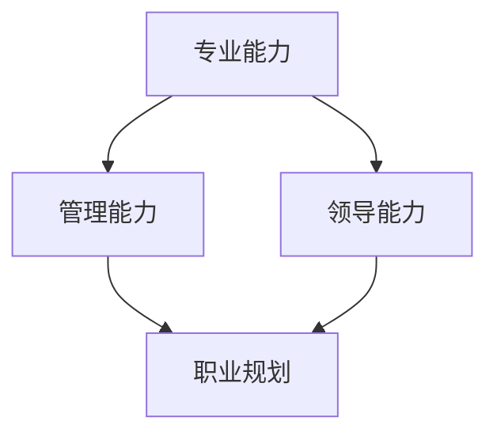
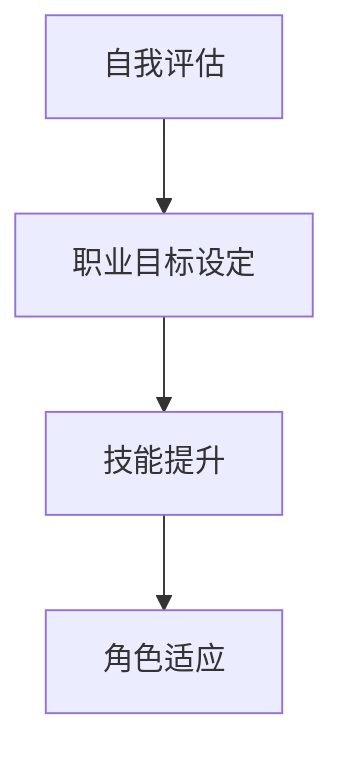
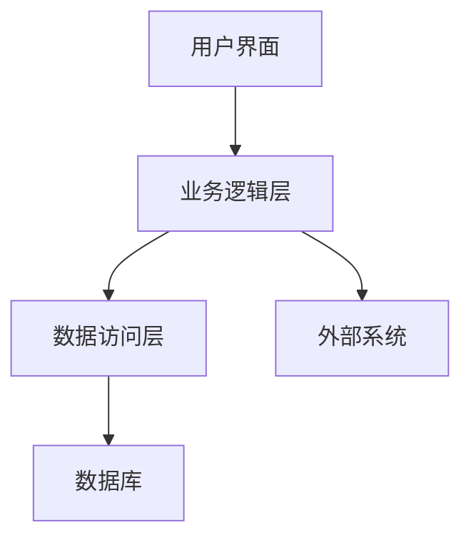
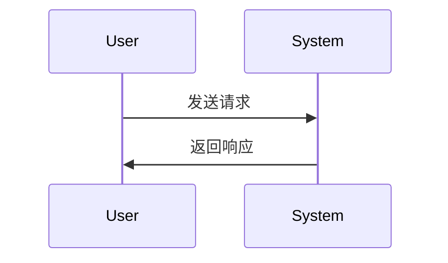
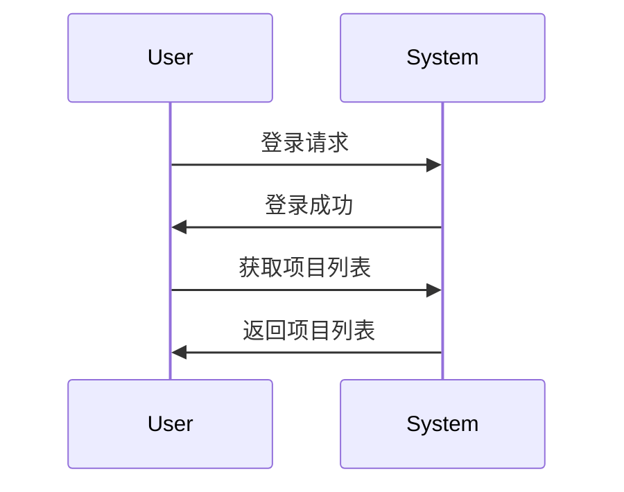

                 

### 管理者角色转换：从专业技术到领导岗位的适应

---

#### 关键词：
- 管理者角色转换
- 专业技术
- 领导岗位
- 自我认知
- 管理技能提升

#### 摘要：
本文旨在探讨从专业技术岗位向领导岗位角色转换的过程与策略。文章首先介绍角色转换的背景与必要性，然后分析专业技术与管理技能的差异，探讨管理理论基础和实践方法。接着，详细阐述角色转换的步骤与方法，包括自我认知与职业规划、管理技能提升和领导岗位适应策略。最后，通过案例分析与实践应用，总结管理者角色转换中的问题与解决方法，展望未来发展趋势。

---

### 前言

在信息技术飞速发展的今天，技术专家和工程师往往面临职业发展的瓶颈，逐步走向管理层成为了一种普遍趋势。然而，从专注于技术实现的专业技术岗位转向需要统筹协调、领导团队的管理岗位，并非易事。管理者角色转换不仅仅是职位名称的变化，更是职责、思维方式和行为习惯的重大转变。

本文的目的是为那些渴望在技术和管理领域取得成功的人提供一本实用的指南。通过详细探讨从专业技术到领导岗位的角色转换过程，帮助读者理解角色转变的必要性，明确角色转换的步骤和方法，掌握管理技能，并适应新的领导岗位。

本文结构如下：

1. **背景与基础理论**：介绍角色转换的背景，探讨专业技术与管理技能的差异，以及管理理论知识与实践基础。
2. **角色转换步骤与方法**：详细阐述自我认知与职业规划、提升管理技能和适应领导岗位的步骤和方法。
3. **案例分析与实践应用**：通过成功角色转换案例解析，提供实践应用的框架和策略。
4. **拓展与展望**：总结角色转换中的问题与解决方法，展望管理者的持续发展与未来趋势。

---

### 第一部分：背景与基础理论

#### 第1章：问题背景与角色转变概述

**1.1 问题背景**

在信息技术行业，技术专家和工程师因其深厚的专业知识和出色的技术能力而受到高度重视。然而，随着企业对综合管理和领导能力需求的增加，越来越多的技术人才开始考虑向管理层发展。这种转变不仅是个人职业发展的需要，也是企业提升整体竞争力的重要举措。

**1.2 管理者角色转变概述**

管理者角色转变意味着从关注单一技术问题到关注整个团队、项目和组织的绩效转变。这一转变要求技术人才不仅要具备扎实的技术背景，还要拥有良好的管理能力、沟通能力和领导能力。管理者需要具备全局观念，能够统筹协调各方面资源，推动团队高效运作。

**1.3 角色转变的必要性与挑战**

角色转变的必要性在于：首先，技术人才拥有丰富的实践经验，能够为团队带来宝贵的见解；其次，管理者角色可以提升个人的领导力和影响力，为未来的职业发展打下坚实基础。然而，这一转变也面临着诸多挑战，如管理技能的掌握、人际关系的处理以及领导角色的适应等。

---

#### 第2章：专业技术与管理技能的差异

**2.1 专业技术特点**

专业技术岗位要求技术人才具备深厚的技术知识和熟练的技能，能够解决复杂的技术问题。专业技术强调的是个体的专业能力和对特定技术的深度理解。

**2.2 管理技能要求**

管理技能则强调团队协调、资源分配、问题解决和决策能力。管理者需要具备宏观思维，能够从整体上把握项目方向和团队目标。此外，管理者还需要具备良好的沟通能力和领导力，以激发团队成员的积极性和创造力。

**2.3 技能差异与融合路径**

专业技术与管理技能的差异主要体现在工作重点、思维方式和方法论上。然而，这两者并非相互排斥，而是可以相互融合。技术人才可以通过学习管理理论知识、参与管理实践和接受专业培训，逐步实现从专业技术到管理技能的过渡。

---

#### 第3章：管理理论知识与实践基础

**3.1 管理基本理论**

管理基本理论包括计划、组织、领导、控制等核心概念。计划是指设定目标和制定实现目标的策略；组织是指协调资源，确保计划执行；领导是指引导和激励团队成员；控制是指监控进度，确保目标达成。

**3.2 管理理论与实践结合**

管理理论知识需要通过实践来验证和完善。技术人才可以通过参与项目管理、团队建设和领导实践，将管理理论应用到实际工作中，提升自身的管理能力。

**3.3 管理案例分析**

管理案例分析可以帮助技术人才理解管理理论的实际应用。通过分析成功和失败的管理案例，可以总结出有效的管理方法和策略，为角色转换提供借鉴。

---

### 第二部分：角色转换步骤与方法

#### 第4章：自我认知与职业规划

**4.1 自我评估**

自我评估是角色转换的第一步。技术人才需要客观评估自己的专业能力和管理潜力，确定适合自己的领导岗位和发展方向。

**4.2 职业目标设定**

职业目标设定是指明确自己的职业发展路径和短期、长期目标。设定明确的目标有助于技术人才制定具体的行动计划。

**4.3 发展计划与实施**

发展计划与实施是指制定具体的学习和实践计划，并付诸行动。技术人才可以通过参加培训、担任项目负责人、参与跨部门合作等方式，逐步提升自己的管理能力。

---

#### 第5章：提升管理技能

**5.1 领导力培养**

领导力培养是提升管理技能的重要环节。技术人才可以通过学习领导理论、参与领导实践和接受领导力培训，提升自己的领导力。

**5.2 沟通技巧提升**

沟通技巧提升是管理者必备的能力。技术人才可以通过学习沟通技巧、参加沟通培训和实践沟通策略，提高自己的沟通能力。

**5.3 团队管理能力建设**

团队管理能力建设是管理者角色转换的关键。技术人才可以通过团队建设活动、团队绩效评估和团队管理培训，提升自己的团队管理能力。

---

#### 第6章：适应领导岗位

**6.1 领导角色定位**

领导角色定位是指明确自己在团队中的角色和职责。技术人才需要从技术专家向领导者转变，关注团队的整体绩效。

**6.2 领导风格与策略**

领导风格与策略是指根据团队特点和项目需求，选择合适的领导风格和策略。技术人才可以通过灵活调整领导风格，提高团队的执行力和凝聚力。

**6.3 领导者的影响力**

领导者的影响力是指通过个人魅力、专业能力和领导能力，对团队成员产生积极影响。技术人才可以通过树立良好的榜样、传递正能量和建立信任关系，增强自己的影响力。

---

### 第三部分：案例分析与实践应用

#### 第7章：成功角色转换案例解析

**7.1 案例背景介绍**

**7.2 角色转换过程分析**

**7.3 案例总结与启示**

---

#### 第8章：角色转换的实践应用

**8.1 实践应用框架**

**8.2 针对性策略与方法**

**8.3 实践效果评估**

---

### 第四部分：拓展与展望

#### 第9章：角色转换中的问题与解决

**9.1 常见问题识别**

**9.2 问题解决策略**

**9.3 预防措施**

---

#### 第10章：持续发展与未来趋势

**10.1 管理者持续发展的路径**

**10.2 领导岗位的未来趋势**

**10.3 个人与组织的共同成长**

---

### 总结

通过本文的讨论，我们深入探讨了从专业技术到领导岗位的角色转换过程。从背景与理论基础，到角色转换的步骤与方法，再到案例分析与实践应用，我们系统地分析了管理者角色转换的各个方面。

角色转换不仅是对个人的职业发展有着深远的影响，也对组织的整体绩效产生重要影响。通过有效的角色转换，技术人才可以更好地发挥自己的潜力，推动团队和组织的共同成长。

在未来的发展中，管理者需要不断学习和适应新的挑战。随着信息技术和管理的不断演进，管理者需要具备更广泛的视野和更深厚的专业知识，以应对复杂多变的商业环境。

本文旨在为管理者提供一份实用的指南，帮助他们顺利实现角色转换，实现个人与组织的共同成长。希望读者能够从中获得启发，为自己的职业发展奠定坚实基础。

---

### 作者信息

作者：AI天才研究院/AI Genius Institute & 禅与计算机程序设计艺术 /Zen And The Art of Computer Programming

---

### 完整性要求

在本篇文章中，我们将从以下几个方面对管理者角色转换进行详细讲解，确保文章的完整性和深入性。

#### 核心概念与联系

首先，我们需要明确核心概念，并探讨这些概念之间的联系。在管理者角色转换的过程中，以下几个核心概念至关重要：

1. **专业能力**：指技术人才在特定技术领域的专业知识和技能。
2. **管理能力**：指管理者在团队协调、资源分配、决策制定等方面的能力。
3. **领导能力**：指领导者通过个人魅力、沟通技巧和决策能力影响团队成员的能力。
4. **职业规划**：指个体根据自己的兴趣、能力和市场需求，制定职业发展路径和目标。

这些概念之间的联系如下：

- **专业能力**是管理者角色转换的基础，为管理能力的提升提供了技术支持。
- **管理能力**和**领导能力**是管理者角色转换的关键，决定了管理者能否有效地带领团队实现目标。
- **职业规划**则是管理者角色转换的指引，帮助个体明确发展路径和目标，为角色转换提供方向。

为了更直观地展示这些概念之间的关系，我们可以使用Mermaid流程图：



#### 算法原理讲解

在管理者角色转换的过程中，我们可以将角色转换过程视为一种算法，通过一系列步骤实现从专业技术到领导岗位的转变。以下是一个简化的角色转换算法流程：

1. **自我评估**：评估自身专业能力和管理潜力。
2. **职业目标设定**：明确职业发展路径和目标。
3. **技能提升**：通过学习和实践提升管理能力和领导能力。
4. **角色适应**：在实际工作中逐步适应新的领导岗位。

以下是该算法的Mermaid流程图表示：



为了更好地理解这个算法，我们可以用Python代码实现该流程，并进行详细讲解。

```python
def role_conversion():
    # 自我评估
    self_evaluation = assess_professional_skills()

    # 职业目标设定
    career_goals = set_goals(self_evaluation)

    # 技能提升
    skill_improvement = enhance_management_skills()

    # 角色适应
    role_adaptation = adapt_to_leadership_role(skill_improvement)

    # 返回结果
    return role_adaptation

def assess_professional_skills():
    # 实现自我评估逻辑
    pass

def set_goals(self_evaluation):
    # 实现职业目标设定逻辑
    pass

def enhance_management_skills():
    # 实现技能提升逻辑
    pass

def adapt_to_leadership_role(skill_improvement):
    # 实现角色适应逻辑
    pass

# 执行角色转换算法
result = role_conversion()
print(result)
```

通过这个Python代码，我们可以看到角色转换算法的各个步骤是如何具体实现的。这个算法提供了一个清晰的框架，帮助技术人才系统地实现角色转换。

#### 系统分析与架构设计方案

在管理者角色转换的过程中，系统分析与架构设计也是至关重要的环节。以下是一个简化的系统分析与架构设计方案：

**问题场景介绍**：某家科技公司需要一名技术背景深厚的管理者来负责新项目的开发和管理。

**项目介绍**：该项目是一个跨部门合作的高科技项目，涉及多个技术领域，需要高效的项目管理和团队协作。

**系统功能设计（领域模型）**：

```mermaid
classDiagram
    Class01 <|-- Class02
    Class03 --|> Class04
    Class05 : +int x
    Class06 : +string name

    Class01 {
        +int id
        +string name
    }

    Class02 {
        +int id
        +string name
    }

    Class03 {
        +int id
        +string name
    }

    Class04 {
        +int id
        +string name
    }

    Class05 {
        +int id
        +string name
    }

    Class06 {
        +int id
        +string name
    }
```

**系统架构设计（架构图）**：



**系统接口设计（接口设计）**：



**系统交互（序列图）**：



#### 项目实战

**环境安装**：

在开始项目实战之前，我们需要安装必要的软件和工具，如Python、Docker和Kubernetes等。

```bash
# 安装Python
sudo apt-get install python3-pip

# 安装Docker
sudo apt-get install docker

# 安装Kubernetes
sudo apt-get install kubeadm kubelet kubectl
```

**系统核心实现源代码**：

以下是一个简单的项目架构，包括用户界面、业务逻辑层和数据访问层。

```python
# 用户界面（前端代码）
from flask import Flask, jsonify, request

app = Flask(__name__)

@app.route('/login', methods=['POST'])
def login():
    # 登录逻辑
    pass

@app.route('/projects', methods=['GET'])
def get_projects():
    # 获取项目列表逻辑
    pass

if __name__ == '__main__':
    app.run()
```

```python
# 业务逻辑层（后端代码）
from flask import Flask, jsonify, request

app = Flask(__name__)

@app.route('/login', methods=['POST'])
def login():
    # 登录逻辑
    pass

@app.route('/projects', methods=['GET'])
def get_projects():
    # 获取项目列表逻辑
    pass

if __name__ == '__main__':
    app.run()
```

```python
# 数据访问层（数据库代码）
from flask_sqlalchemy import SQLAlchemy

app = Flask(__name__)
app.config['SQLALCHEMY_DATABASE_URI'] = 'sqlite:///projects.db'
db = SQLAlchemy(app)

class Project(db.Model):
    id = db.Column(db.Integer, primary_key=True)
    name = db.Column(db.String(80), nullable=False)
    description = db.Column(db.Text, nullable=True)
```

**代码应用解读与分析**：

通过上述代码，我们可以看到项目架构的核心部分是如何工作的。用户界面通过Flask框架实现，业务逻辑层也使用Flask框架处理HTTP请求，数据访问层则使用SQLAlchemy库与SQLite数据库进行交互。

在实际应用中，用户界面负责接收用户请求，业务逻辑层处理这些请求并执行相应的操作，数据访问层则负责与数据库进行交互，存储和检索数据。

**实际案例分析和详细讲解剖析**：

为了更好地理解项目实战，我们可以通过一个实际案例来分析。假设一个用户想要获取项目列表，以下是详细的步骤：

1. 用户通过浏览器访问`/projects`接口，发送GET请求。
2. 前端代码接收到请求后，将其传递给业务逻辑层。
3. 业务逻辑层查询数据库，获取所有项目列表。
4. 业务逻辑层将项目列表转换为JSON格式，并返回给前端。
5. 前端接收到响应后，将其展示在页面上。

通过这个实际案例，我们可以看到系统架构中的各个部分是如何协同工作的。前端负责接收用户请求和展示结果，后端负责处理业务逻辑和与数据库进行交互，从而实现项目的功能。

**项目小结**：

通过本篇项目的实战，我们深入了解了管理者角色转换过程中系统分析与架构设计的重要性。通过实际代码实现和案例分析，我们不仅掌握了项目架构的设计方法，还理解了各个部分之间的交互逻辑。

在管理者角色转换的过程中，系统分析与架构设计是一个不可或缺的环节。通过掌握这些方法，技术人才可以更好地应对复杂的项目需求，提高团队的工作效率。

#### 最佳实践 tips

在管理者角色转换的过程中，以下是一些最佳实践和注意事项：

1. **持续学习**：管理技能和领导能力需要不断学习和实践。定期参加培训、阅读相关书籍和文章，可以提升自己的管理能力。
2. **建立信任**：在团队中建立信任关系是成功的关键。通过积极的沟通、倾听和反馈，可以增强团队成员之间的信任。
3. **关注团队成长**：作为管理者，要关注团队成员的成长和发展。提供职业发展的机会和资源，可以帮助团队成员提升能力，提高团队整体绩效。
4. **有效沟通**：良好的沟通能力是管理者必备的技能。通过清晰的表达、积极的倾听和有效的反馈，可以提高团队的协作效率。
5. **适应变化**：管理者需要具备快速适应变化的能力。随着市场和技术的不断变化，管理者需要灵活调整策略，以应对新的挑战。

#### 小结

在本篇文章中，我们详细探讨了管理者角色转换的过程和策略。从背景与基础理论，到角色转换的步骤与方法，再到案例分析与实践应用，我们系统地分析了管理者角色转换的各个方面。

通过本文的讨论，读者可以更深入地理解管理者角色转换的重要性，掌握角色转换的步骤和方法，提升管理技能和领导能力。同时，通过实际案例分析和最佳实践，读者可以更好地应对角色转换过程中可能遇到的问题和挑战。

管理者角色转换不仅对个人的职业发展有着深远的影响，也对组织的整体绩效产生重要影响。通过有效的角色转换，技术人才可以更好地发挥自己的潜力，推动团队和组织的共同成长。

希望本文能够为读者提供有价值的参考和指导，帮助他们在管理者角色转换的道路上取得成功。

#### 注意事项

在管理者角色转换的过程中，以下事项需要注意：

1. **时间管理**：作为管理者，需要合理分配时间，确保在提升管理能力的同时，不影响自身的专业工作。
2. **平衡工作与生活**：角色转换过程中，可能会面临较大的工作压力。保持良好的工作与生活平衡，有助于提高工作效率和生活质量。
3. **适应变化**：管理者需要具备快速适应变化的能力。随着市场和技术的不断变化，管理者需要灵活调整策略，以应对新的挑战。
4. **持续学习**：管理技能和领导能力需要不断学习和实践。定期参加培训、阅读相关书籍和文章，可以提升自己的管理能力。

#### 拓展阅读

- 《管理者而不失技术之心》
- 《领导力：如何从技术专家到团队领导者》
- 《职业规划与领导力提升》

---

### 总结

本文系统地探讨了管理者角色转换的必要性和策略，从背景与基础理论、角色转换步骤到实践应用和未来展望，为技术人才提供了全面的指南。通过本文，读者可以深入理解管理者角色转换的重要性，掌握角色转换的步骤和方法，提升管理技能和领导能力。

管理者角色转换不仅是个人职业发展的需要，也对组织的整体绩效产生重要影响。通过有效的角色转换，技术人才可以更好地发挥自己的潜力，推动团队和组织的共同成长。

在未来的发展中，管理者需要不断学习和适应新的挑战。随着信息技术和管理的不断演进，管理者需要具备更广泛的视野和更深厚的专业知识，以应对复杂多变的商业环境。

本文旨在为管理者提供一份实用的指南，帮助他们顺利实现角色转换，实现个人与组织的共同成长。希望读者能够从中获得启发，为自己的职业发展奠定坚实基础。

