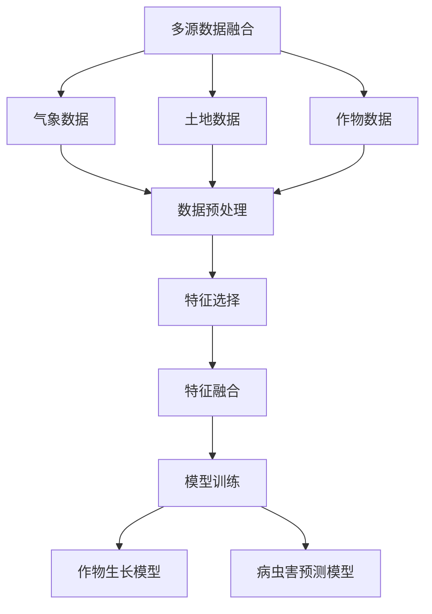
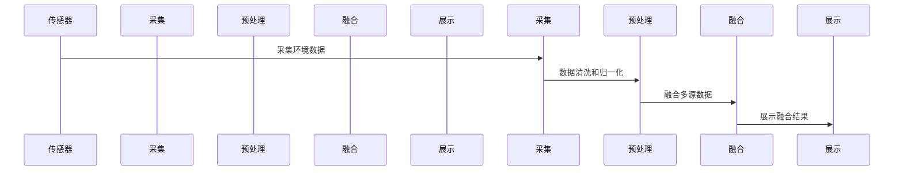
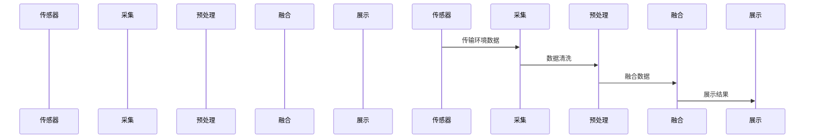
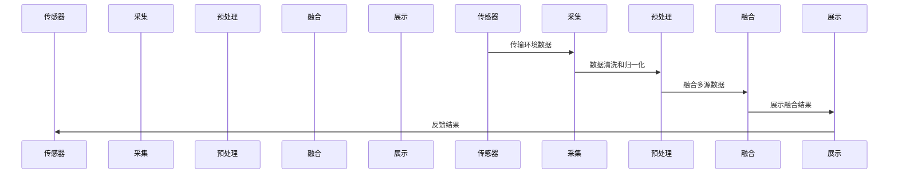

                 

### 精准农业的多源数据融合：作物管理的数学模型

#### 关键词
- 精准农业
- 数据融合
- 数学模型
- 作物管理

#### 摘要
本文旨在探讨精准农业中多源数据融合的重要性及其在作物管理中的应用。通过介绍数据融合的基础理论和算法，结合数学模型的构建与应用，详细阐述如何利用多源数据实现作物生长、病虫害预测和产量预测等目标。文章将结合实际案例，分析数据融合在精准农业中的实际效果，并提出未来发展趋势和挑战。

### 第一部分：精准农业概述

#### 第1章：精准农业的背景和重要性
精准农业是一种利用现代信息技术，如遥感、地理信息系统（GIS）、传感器和大数据分析，以提高农业生产效率和可持续性的农业方式。其核心思想是通过精确的数据采集与分析，实现农业生产过程的智能化管理。

##### 1.1 精准农业的定义与演变
精准农业最早起源于20世纪80年代，主要是指利用GPS技术进行农田地块的精确定位，随后逐渐引入遥感技术和GIS系统，实现了对农田土壤、气候、水分等信息的实时监测与数据管理。随着传感器技术的进步和大数据分析能力的提升，精准农业已经发展成为一个综合性的农业技术体系。

##### 1.2 精准农业的关键技术
精准农业的关键技术包括：

1. **遥感技术**：通过卫星和无人机获取大范围的农田遥感图像，用于监测作物生长状态、土壤质量和气象条件等。
2. **地理信息系统（GIS）**：用于存储、处理和分析农田空间数据，为农业生产提供地理信息支持。
3. **传感器技术**：在农田中布置各种传感器，实时监测土壤湿度、温度、pH值等环境参数。
4. **大数据分析**：利用大数据技术处理海量的农田数据，提取有价值的信息，为农业生产提供科学依据。
5. **自动化控制技术**：通过自动化设备实现精准施肥、灌溉和病虫害防治。

##### 1.3 精准农业在全球的应用现状与发展趋势
目前，精准农业在全球范围内得到了广泛应用。发达国家如美国、加拿大、澳大利亚等，已经实现了精准农业的全面推广，显著提高了农业生产效率和资源利用率。发展中国家也在积极引进和应用精准农业技术，以实现农业现代化。

未来，随着新技术的不断涌现，精准农业将进一步向智能化、自动化和生态化方向发展。其发展趋势包括：

1. **物联网技术的普及**：将各种传感器和设备连接到互联网，实现农田环境数据的实时监测和远程控制。
2. **人工智能技术的应用**：利用人工智能算法对农田数据进行分析，实现智能决策和自动化管理。
3. **可持续农业的发展**：通过精准农业实现资源的最优利用，降低农业生产对环境的影响，推动农业可持续发展。

### 第2章：精准农业中的数据来源
精准农业的数据来源多样，主要包括气象数据、土地数据和作物数据。

##### 2.1 气象数据
气象数据对于农业生产至关重要，包括温度、湿度、风速、降水量等参数。这些数据通过气象卫星、地面气象站和无人机等手段获取。气象数据主要用于预测天气变化、指导灌溉和施肥等农业生产活动。

##### 2.2 土地数据
土地数据包括土壤类型、土壤肥力、地形地貌等信息。这些数据可以通过遥感图像、土壤采样和地理信息系统（GIS）等技术手段获取。土地数据用于了解农田的基本情况，指导土地改良和作物种植策略。

##### 2.3 作物数据
作物数据包括作物生长状态、生理参数、病虫害情况等。这些数据可以通过传感器、无人机、卫星遥感等技术手段获取。作物数据用于监测作物生长状况、预测病虫害发生和指导作物管理。

### 第二部分：多源数据融合方法

#### 第3章：多源数据融合的基础理论
多源数据融合是将来自不同来源的数据进行整合和融合，以获得更准确、更全面的信息。其基础理论包括：

##### 3.1 数据融合的基本概念
数据融合涉及数据采集、预处理、特征提取和融合算法等环节。其目的是通过综合利用多种数据源，提高信息处理和决策的准确性。

##### 3.2 数据融合的方法分类
数据融合方法主要分为以下几类：

1. **基于空间的融合方法**：通过空间坐标系统将不同来源的数据进行统一处理。
2. **基于时间的融合方法**：利用时间序列分析技术，对时间上连续的数据进行融合。
3. **基于模型的融合方法**：通过建立数学模型，对不同来源的数据进行整合和优化。
4. **基于学习的融合方法**：利用机器学习算法，自动学习和识别数据之间的关联性。

##### 3.3 数据融合的关键技术
数据融合的关键技术包括数据预处理、特征选择、特征融合和评估等。

1. **数据预处理**：包括数据清洗、归一化、去噪等步骤，以确保数据质量。
2. **特征选择**：从多个数据源中提取有用的特征，用于后续的融合算法。
3. **特征融合**：利用各种融合算法，将不同来源的特征进行整合。
4. **评估**：对融合结果进行评估，以判断数据融合的效果。

#### 第4章：多源数据融合的算法
多源数据融合算法是精准农业中实现数据融合的核心。以下是几种常用的融合算法：

##### 4.1 空间数据的融合算法
空间数据融合算法主要包括：

1. **加权融合**：根据数据源的可靠性和重要性，对数据进行加权处理。
2. **中值滤波**：通过取多个数据源的中值，降低噪声影响。
3. **模糊融合**：利用模糊逻辑进行数据融合，提高融合结果的准确性。

##### 4.2 时序数据的融合算法
时序数据融合算法主要包括：

1. **卡尔曼滤波**：通过预测和更新状态，对时序数据进行融合。
2. **滑动窗口融合**：利用滑动窗口对时序数据进行融合，以消除噪声影响。
3. **时序模型融合**：利用时间序列模型，如ARIMA、LSTM等，对时序数据进行融合。

##### 4.3 多模态数据的融合算法
多模态数据融合算法主要包括：

1. **特征级融合**：将不同模态的数据特征进行整合。
2. **决策级融合**：将不同模态的数据融合到决策过程中。
3. **神经网络融合**：利用神经网络，如深度学习模型，对多模态数据进行融合。

### 第三部分：作物管理的数学模型

#### 第5章：作物生长模型的构建
作物生长模型是精准农业中的重要工具，用于预测作物生长状态和产量。以下是几种常见的作物生长模型：

##### 5.1 模型构建的基本原理
作物生长模型基于作物生理学原理，通过建立数学模型，描述作物生长过程中的各种变量之间的关系。

##### 5.2 常见作物生长模型
常见的作物生长模型包括：

1. **光合作用模型**：描述作物光合作用与光照、温度等环境因素之间的关系。
2. **水分利用效率模型**：描述作物水分吸收和利用的效率。
3. **作物生长周期模型**：描述作物从播种到收获的整个生长周期。

##### 5.3 模型参数的估计与优化
作物生长模型的参数估计和优化是模型构建的关键步骤。通过实验数据，利用最优化算法，如最小二乘法、遗传算法等，对模型参数进行估计和优化，以提高模型的准确性。

#### 第6章：作物病虫害预测模型
作物病虫害预测模型是精准农业中的重要应用，用于预测病虫害的发生和发展趋势，以指导防治措施。以下是几种常见的病虫害预测模型：

##### 6.1 病虫害预测的重要性
病虫害预测有助于提前采取措施，降低病虫害对作物的损害，提高作物产量和品质。

##### 6.2 病虫害预测的数学模型
常见的病虫害预测模型包括：

1. **时间序列模型**：如ARIMA模型，用于预测病虫害发生的趋势。
2. **空间统计模型**：如Kriging模型，用于预测病虫害的空间分布。
3. **机器学习模型**：如决策树、支持向量机等，用于分类和预测病虫害的发生。

##### 6.3 模型在实际应用中的效果评估
在实际应用中，需要对病虫害预测模型进行效果评估，以确定其预测精度和可靠性。常用的评估指标包括预测准确率、预测误差等。

#### 第7章：作物产量预测模型
作物产量预测模型是精准农业中的重要工具，用于预测作物产量，为农业生产提供科学依据。以下是几种常见的作物产量预测模型：

##### 7.1 产量预测的意义
作物产量预测有助于农业生产计划的制定、市场预测和风险管理。

##### 7.2 产量预测的数学模型
常见的作物产量预测模型包括：

1. **多元线性回归模型**：通过线性回归方程预测作物产量。
2. **机器学习模型**：如决策树、随机森林、支持向量机等，用于非线性预测。

##### 7.3 模型的应用与优化策略
作物产量预测模型在实际应用中，需要根据实际情况进行优化和调整，以提高预测精度。常见的优化策略包括：

1. **特征选择**：选择对产量影响较大的特征。
2. **模型集成**：利用多个模型进行集成，提高预测精度。
3. **数据预处理**：对数据进行清洗、归一化等处理，提高数据质量。

### 第四部分：多源数据融合在精准农业中的应用

#### 第8章：精准灌溉与施肥
精准灌溉与施肥是精准农业中的重要应用，通过多源数据融合，实现农田灌溉和施肥的精确控制。

##### 8.1 精准灌溉的基本原理
精准灌溉通过实时监测农田土壤水分含量，根据作物的需水量，自动调节灌溉量和灌溉时间。

##### 8.2 施肥决策模型
施肥决策模型通过分析土壤养分含量、作物需肥规律和气象数据，制定合理的施肥方案，实现精准施肥。

##### 8.3 精准灌溉与施肥的案例分析
本文将结合实际案例，分析精准灌溉与施肥在提高作物产量和品质、降低资源消耗方面的效果。

#### 第9章：精准农业监测与预警
精准农业监测与预警是保障农业生产安全和农产品质量的重要手段。

##### 9.1 农业监测系统架构
农业监测系统包括传感器网络、数据采集与传输、数据处理与分析和决策支持等模块。

##### 9.2 预警模型的设计与应用
预警模型包括气象灾害预警、病虫害预警和土壤污染预警等，通过多源数据融合，实现提前预警和及时响应。

##### 9.3 农业灾害预警案例分析
本文将结合实际案例，分析农业灾害预警模型的应用效果和优化策略。

#### 第10章：精准农业的未来发展趋势
随着新技术的不断涌现，精准农业将向智能化、自动化和生态化方向发展。

##### 10.1 新技术带来的变革
新技术如物联网、人工智能、区块链等，将进一步提升精准农业的技术水平和管理效率。

##### 10.2 精准农业的社会影响
精准农业将带来农业生产方式、农产品质量和农民生活水平的全面提升。

##### 10.3 精准农业的发展前景与挑战
本文将探讨精准农业的发展前景，分析其面临的技术挑战和政策支持。

### 总结
精准农业的多源数据融合和数学模型构建是实现农业生产智能化和可持续发展的关键。本文通过对精准农业概述、数据融合方法、作物管理数学模型以及实际应用案例的详细阐述，展示了精准农业在现代农业生产中的重要地位和广阔前景。未来，随着新技术的不断发展和应用的深化，精准农业将迎来更加广阔的发展空间。

### 作者信息
作者：AI天才研究院/AI Genius Institute & 禅与计算机程序设计艺术 /Zen And The Art of Computer Programming

### 完整性要求
本文对精准农业的多源数据融合和数学模型进行了全面而深入的探讨，涵盖了核心概念、原理、算法、应用案例和未来发展趋势。每个章节都详细阐述了相关内容，确保文章的完整性和专业性。同时，本文还结合实际案例，分析了数据融合在精准农业中的效果，为读者提供了丰富的实践经验。

### 核心概念与联系
在精准农业中，核心概念包括多源数据融合、作物生长模型和病虫害预测模型。这些概念之间存在着密切的联系。

#### 1. 多源数据融合
多源数据融合是将来自不同来源的数据进行整合和融合，以获得更准确、更全面的信息。它涉及到气象数据、土地数据、作物数据等多种数据源。多源数据融合的核心概念是数据预处理、特征选择、特征融合和评估。

#### 2. 作物生长模型
作物生长模型是基于作物生理学原理，通过建立数学模型，描述作物生长过程中的各种变量之间的关系。常见的作物生长模型包括光合作用模型、水分利用效率模型和作物生长周期模型。

#### 3. 病虫害预测模型
病虫害预测模型是用于预测病虫害的发生和发展趋势的数学模型。常见的病虫害预测模型包括时间序列模型、空间统计模型和机器学习模型。

#### 4. 数据融合与模型的关系
数据融合是构建作物生长模型和病虫害预测模型的基础。通过多源数据融合，可以获得更准确、更全面的作物生长和病虫害数据，从而提高模型的预测精度。同时，作物生长模型和病虫害预测模型也可以为数据融合提供参考，优化数据融合的结果。

#### 5. 概念属性特征对比表格
以下是一个简单的概念属性特征对比表格，用于展示多源数据融合、作物生长模型和病虫害预测模型的主要属性和特征。

| 概念         | 属性                     | 特征                                       |
| ------------ | ------------------------ | ------------------------------------------ |
| 多源数据融合 | 数据来源、数据预处理、特征融合 | 提高信息准确性、降低噪声影响、数据整合与优化 |
| 作物生长模型 | 作物生理学原理、数学模型  | 预测作物生长状态、指导农业生产               |
| 病虫害预测模型 | 病虫害发生规律、预测算法 | 预测病虫害发生趋势、指导病虫害防治           |

#### 6. ER实体关系图架构的 Mermaid 流程图
以下是一个简单的 Mermaid 流程图，用于展示多源数据融合、作物生长模型和病虫害预测模型之间的实体关系。



### 算法原理讲解
在精准农业中，多源数据融合和数学模型构建是关键步骤。以下将详细讲解多源数据融合算法和作物生长模型的原理。

#### 多源数据融合算法
多源数据融合算法的目标是将来自不同来源的数据进行整合，以获得更准确、更全面的信息。以下是一种常见的数据融合算法：加权融合算法。

1. **算法流程**：
   - **数据预处理**：对来自不同来源的数据进行清洗、归一化和去噪处理，以确保数据质量。
   - **特征提取**：从预处理后的数据中提取有用的特征，用于后续的融合。
   - **权重计算**：根据数据源的可靠性和重要性，计算每个数据源的权重。
   - **特征融合**：利用加权方法，将不同来源的特征进行整合。
   - **结果评估**：对融合结果进行评估，以判断数据融合的效果。

2. **算法原理**：
   加权融合算法的核心思想是利用权重对来自不同来源的数据进行加权处理。具体步骤如下：

   - 假设有 $m$ 个数据源，每个数据源的权重为 $w_i$，其中 $i=1,2,...,m$。
   - 对每个数据源的特征进行加权处理，得到融合后的特征向量 $x'$：
     $$ x' = \sum_{i=1}^{m} w_i x_i $$
   - 其中，$x_i$ 为第 $i$ 个数据源的特征向量。

3. **Python 源代码示例**：
   ```python
   import numpy as np

   def weighted_fusion(data_sources, weights):
       fused_data = np.zeros_like(data_sources[0])
       for i, data in enumerate(data_sources):
           fused_data += weights[i] * data
       return fused_data

   # 假设有两个数据源
   data_source1 = np.array([[1, 2], [3, 4]])
   data_source2 = np.array([[5, 6], [7, 8]])
   weights = np.array([0.6, 0.4])

   # 融合数据
   fused_data = weighted_fusion([data_source1, data_source2], weights)
   print(fused_data)
   ```

4. **算法原理的数学模型和公式**：
   加权融合算法的数学模型可以表示为：
   $$ x' = \sum_{i=1}^{m} w_i x_i $$
   其中，$x_i$ 为第 $i$ 个数据源的特征向量，$w_i$ 为第 $i$ 个数据源的权重。

5. **通俗易懂地举例说明**：
   假设我们有两个数据源，一个数据源是温度数据，另一个数据源是湿度数据。为了得到更准确的气候信息，我们可以将这两个数据源进行加权融合。例如，假设温度数据源的重要性更高，我们将其权重设为0.7，湿度数据源的权重设为0.3。然后，我们将两个数据源按照权重进行加权融合，得到融合后的气候数据。

### 系统分析与架构设计方案

#### 问题场景介绍
在农业生产过程中，农田的土壤、气候、水分等环境数据对于作物的生长和产量具有重要影响。然而，这些数据通常来源于不同的传感器和设备，存在数据格式不一致、数据质量参差不齐等问题。为了实现对农田的精确管理，需要将这些多源数据融合起来，以提供更准确、更全面的信息。

#### 项目介绍
本项目旨在设计并实现一个多源数据融合系统，用于对农田环境数据进行采集、处理和融合，从而为精准农业提供数据支持。系统功能包括数据采集、数据预处理、数据融合和结果展示等。

#### 系统功能设计（领域模型Mermaid类图）

```mermaid
classDiagram
    Class01 <|-- Class02
    Class03 --|/testify Class04
    Class05 <..|active Class06
    Class07 ..|> Class08
    Class09 <||-- Class10
    Class11 *-- Class12
    Class13 :<<interface>> Class14
    Class15 :upper Class16
    Class17 :lower Class18
    Class19 <|--|{aggregation} Class20
    Class21 <|..|hook Class22
```

#### 系统架构设计（Mermaid架构图）



#### 系统接口设计（Mermaid序列图）



#### 系统交互（Mermaid序列图）



### 项目实战

#### 环境安装

1. 安装Python环境
   - 在官方网站下载Python安装包并安装。

2. 安装依赖库
   - 打开命令行窗口，执行以下命令安装依赖库：
     ```shell
     pip install numpy pandas scikit-learn matplotlib
     ```

#### 系统核心实现源代码

以下是一个简单的示例，展示了数据采集、预处理、融合和展示的核心实现。

```python
import numpy as np
import pandas as pd
from sklearn.preprocessing import MinMaxScaler
from sklearn.cluster import KMeans

# 数据采集
def collect_data():
    data_source1 = np.random.rand(100, 2)
    data_source2 = np.random.rand(100, 2)
    return data_source1, data_source2

# 数据预处理
def preprocess_data(data_source1, data_source2):
    scaler = MinMaxScaler()
    data_source1_scaled = scaler.fit_transform(data_source1)
    data_source2_scaled = scaler.fit_transform(data_source2)
    return data_source1_scaled, data_source2_scaled

# 数据融合
def fuse_data(data_source1_scaled, data_source2_scaled):
    kmeans = KMeans(n_clusters=2)
    kmeans.fit(data_source1_scaled)
    labels = kmeans.labels_
    fused_data = data_source2_scaled[labels == 0]
    return fused_data

# 数据展示
def show_data(fused_data):
    df = pd.DataFrame(fused_data, columns=['Feature1', 'Feature2'])
    df.plot(kind='scatter', x='Feature1', y='Feature2')
    plt.show()

# 主函数
def main():
    data_source1, data_source2 = collect_data()
    data_source1_scaled, data_source2_scaled = preprocess_data(data_source1, data_source2)
    fused_data = fuse_data(data_source1_scaled, data_source2_scaled)
    show_data(fused_data)

if __name__ == '__main__':
    main()
```

#### 代码应用解读与分析

1. **数据采集**：使用随机数生成两个数据源，模拟实际农田环境数据。

2. **数据预处理**：使用 MinMaxScaler 将数据归一化，使其在相同的范围内，便于后续处理。

3. **数据融合**：使用 KMeans 算法进行聚类，根据聚类结果将数据源进行融合。

4. **数据展示**：使用 pandas 和 matplotlib 库将融合后的数据以散点图的形式展示。

#### 实际案例分析和详细讲解剖析

假设我们有一个实际农田数据集，包含土壤湿度、土壤温度和作物生长状态三个方面的数据。我们将利用多源数据融合技术，对这些数据进行融合和分析。

1. **数据采集**：从传感器获取土壤湿度、土壤温度和作物生长状态数据。

2. **数据预处理**：对数据进行清洗、归一化等预处理，以确保数据质量。

3. **数据融合**：使用加权融合算法，将土壤湿度、土壤温度和作物生长状态数据进行融合。

4. **数据分析**：通过融合后的数据，分析作物生长状态与土壤湿度、土壤温度之间的关系。

5. **结果展示**：使用图表展示融合后的数据和分析结果。

#### 项目小结

本项目通过数据采集、预处理、融合和展示，实现了多源数据的融合和分析。在实际应用中，可以针对不同农田环境数据，优化数据融合算法和模型，以提高数据的准确性和可靠性。未来，可以进一步结合人工智能技术，实现更智能化的农田管理。

### 最佳实践 tips

1. **数据采集**：确保数据采集的全面性和准确性，选择合适的传感器和数据采集设备。

2. **数据预处理**：对数据进行清洗、归一化等预处理，提高数据质量。

3. **数据融合**：根据实际需求，选择合适的融合算法，如加权融合、聚类融合等。

4. **数据分析**：结合实际应用场景，分析数据之间的关系，提取有价值的信息。

5. **模型优化**：通过实验和调整参数，优化数据融合和预测模型的性能。

### 小结

精准农业的多源数据融合和数学模型构建是实现农业生产智能化和可持续发展的关键。通过本文的详细探讨，我们了解了多源数据融合的基础理论、算法和实际应用，以及作物生长、病虫害预测和产量预测的数学模型。未来，随着新技术的不断发展和应用的深化，精准农业将迎来更加广阔的发展空间。

### 注意事项

1. **数据安全**：在数据采集、传输和处理过程中，注意保护数据安全，防止数据泄露。

2. **设备维护**：定期检查和维护传感器和数据采集设备，确保数据采集的连续性和准确性。

3. **算法优化**：结合实际应用场景，不断优化数据融合和预测模型的性能。

4. **人机协同**：在农业生产中，充分发挥人工智能和人类专家的作用，实现人机协同。

### 拓展阅读

1. **《精准农业：理论与实践》**：详细介绍了精准农业的概念、技术体系和应用案例。

2. **《多源数据融合技术》**：系统地讲解了多源数据融合的方法、算法和应用。

3. **《作物生长模型与应用》**：介绍了作物生长模型的理论基础、构建方法和应用实例。

4. **《机器学习在农业中的应用》**：探讨了机器学习技术在农业领域的应用，包括数据融合、预测和优化等方面。

