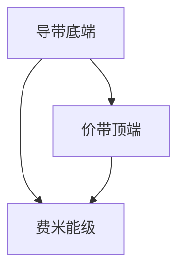
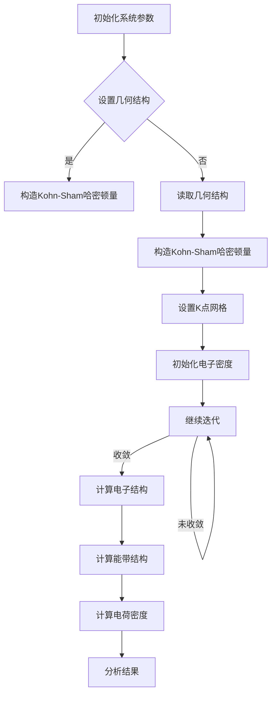
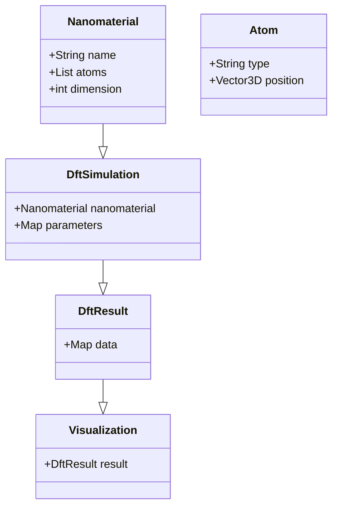
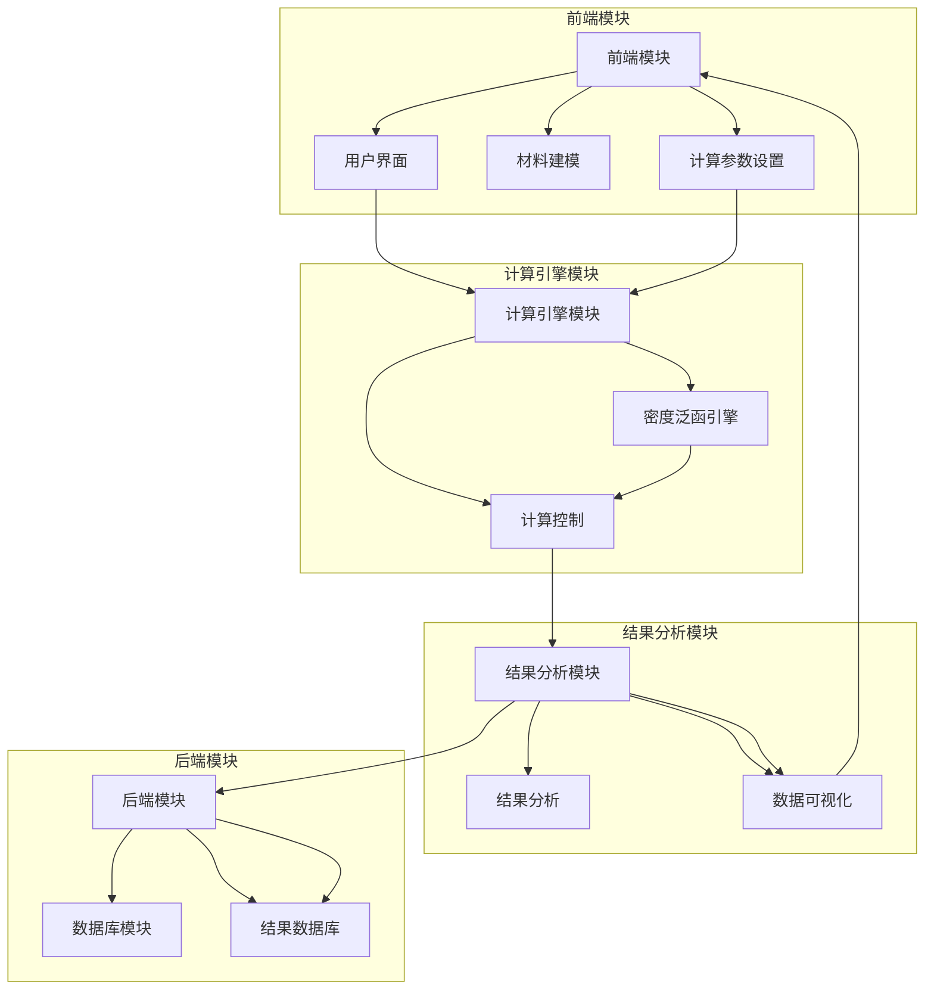
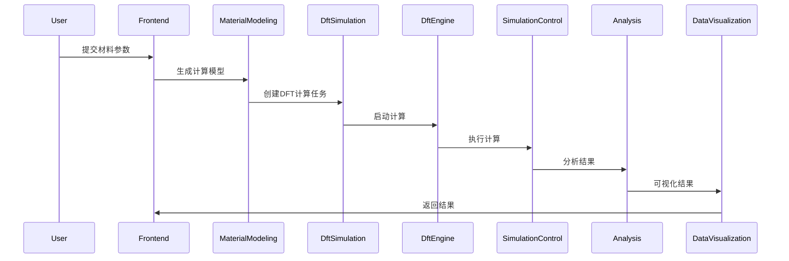

                 

## 前言

### 纳米材料的密度泛函理论：微观结构的数学模型

纳米材料，作为材料科学领域的璀璨明珠，因其在光学、电学、热学、磁学等性能方面的独特优势，正逐步渗透到众多高科技产业。然而，对纳米材料的深入理解与精确操控，一直是科研与工业应用中的难题。密度泛函理论（DFT）作为一种强大的计算物理学方法，为解决这一难题提供了全新的视角。

本博客文章旨在系统介绍纳米材料的密度泛函理论及其微观结构的数学模型，帮助读者从理论到实践，全方位理解这一领域。文章将从以下几个方面展开：

1. **背景介绍**：探讨纳米材料的基本概念、密度泛函理论的起源与应用，以及纳米材料密度泛函理论的现状与挑战。
2. **核心概念与联系**：详细阐述纳米材料、密度泛函理论及其交叉领域的核心概念，并使用表格和实体关系图进行对比分析。
3. **算法原理讲解**：介绍密度泛函理论的基本原理、算法流程、数学模型与公式，并通过Python源代码和Mermaid算法流程图进行具体说明。
4. **数学模型和数学公式**：详细讲解相关数学模型和公式，并通过实际示例进行通俗易懂的解释。
5. **系统分析与架构设计方案**：介绍纳米材料密度泛函理论应用系统的问题场景、项目介绍、系统功能设计、系统架构设计、系统接口设计以及系统交互。
6. **项目实战**：展示环境安装、系统核心实现、代码应用解读与分析，并提供实际案例分析。
7. **最佳实践 tips**：总结纳米材料密度泛函理论应用的最佳实践，并提出注意事项和拓展阅读建议。

让我们一步一步深入探讨这个领域，共同探索纳米材料的无限可能。

### 背景介绍

#### 纳米材料简介

纳米材料，指的是至少在一个维度上尺寸在1到100纳米范围内的材料。它们具有独特的物理、化学和生物学性质，这些性质与宏观材料截然不同。纳米材料可以分为纳米颗粒、纳米线和纳米管等类型，其在各个领域展现出了巨大的应用潜力。

纳米颗粒由于其极高的比表面积，具有异常的化学反应活性，在催化、生物医药和电子器件等领域有着广泛的应用。例如，金纳米颗粒在光热治疗中表现出色，能够通过吸收特定波长的光能产生热效应，从而杀死癌细胞。此外，纳米颗粒还可用于药物输送，通过靶向定位增强药物的疗效，降低副作用。

纳米线由于其一维结构，具有优异的电学和光学性质，常用于制造柔性电子器件和高效太阳能电池。碳纳米管因其高强度和导电性，被广泛研究用于增强复合材料和纳米电子设备。

纳米管，如碳纳米管和硼氮纳米管，具有独特的一维通道结构，可以作为纳米级传输通道，用于分子传输和存储。此外，纳米管的高强度和柔韧性，使其在航空航天、纳米机器人等领域具有潜在应用价值。

#### 密度泛函理论简介

密度泛函理论（Density Functional Theory，DFT）是计算物理学和材料科学中的一种理论框架，用于描述电子系统（如原子、分子和固体）的宏观性质。DFT的核心思想是将复杂的多体问题简化为仅涉及电子密度的一元问题，从而大幅度降低了计算复杂性。

DFT的基本原理基于Hohenberg-Kohn定理，该定理指出电子体系的总能量可以表示为电子密度的函数。通过求解密度泛函，可以得到系统的电子分布、结构优化和激发性质。DFT不仅具有理论上的简洁性，还通过Kohn-Sham方程提供了实际计算的方法。

DFT的主要优点包括：

1. **高效性**：DFT可以将多体问题简化为一元问题，使得计算成本大幅降低，适用于大规模电子系统。
2. **普适性**：DFT适用于从简单分子到复杂固体的各种系统，成为材料科学、化学、物理学等领域的重要工具。
3. **灵活性**：DFT可以通过选择不同的密度泛函（如局域密度泛函、广义梯度密度泛函等）来适应不同的应用场景。

#### 纳米材料的密度泛函理论应用

纳米材料的密度泛函理论（DFT-Nano）将DFT应用于纳米材料的研究，旨在精确模拟和预测纳米材料的电子结构和性质。DFT-Nano在以下几个应用场景中展现出巨大的优势：

1. **电子结构计算**：DFT-Nano可以准确计算纳米材料的电子结构，包括能带结构、电荷密度和电子态密度。这对于理解纳米材料的物理性质至关重要。
2. **光学性质研究**：纳米材料具有独特的光学性质，如表面等离子共振、量子限制效应等。DFT-Nano可以用于研究这些光学性质，有助于优化纳米材料的催化、光电材料和太阳能电池性能。
3. **化学反应动力学**：DFT-Nano可以模拟纳米材料在化学反应中的行为，例如催化反应和表面吸附过程。这为设计高效的纳米催化剂和新型反应路径提供了重要依据。
4. **材料设计**：通过DFT-Nano，研究人员可以预测和设计新型纳米材料，探索其在不同应用领域的潜力。例如，通过优化纳米颗粒的尺寸和形状，可以显著改善其光电转换效率和稳定性。

总的来说，纳米材料的密度泛函理论为纳米材料的研究提供了强有力的理论工具，推动了纳米材料科学的发展。通过DFT-Nano，研究人员能够深入理解纳米材料的微观结构和性质，为纳米技术的进步奠定了坚实的基础。

### 问题描述

#### 纳米材料研究的挑战

纳米材料由于其独特的物理和化学性质，在科学研究和工业应用中具有巨大的潜力。然而，纳米材料的研究也面临一系列挑战，这些挑战主要集中在以下几个方面：

1. **结构复杂性**：纳米材料具有高比表面积和复杂的微观结构，这使得精确表征和描述其结构成为一大难题。传统的材料表征方法，如X射线衍射（XRD）和扫描电子显微镜（SEM），在纳米尺度下难以提供足够的信息。
2. **电子性质多样性**：纳米材料的电子性质取决于其尺寸、形状和表面状态，这使得电子结构的计算和模拟变得更加复杂。传统的理论模型和计算方法在处理这些多样性时常常面临精度和效率的问题。
3. **化学反应活性**：纳米材料具有高反应活性，这既是其优势也是其挑战。如何在保持反应活性的同时，控制其反应路径和产物，是纳米材料研究中亟待解决的问题。
4. **界面效应**：纳米材料通常与其他材料或基底紧密接触，界面效应显著影响其性能。理解这些界面效应，对优化纳米材料的性能具有重要意义，但也是一大难点。

#### 密度泛函理论在纳米材料研究中的应用

密度泛函理论（DFT）作为一种强大的计算方法，在纳米材料研究中发挥了重要作用。DFT通过将电子体系简化为仅涉及电子密度的问题，大幅度降低了计算复杂性，使其成为研究纳米材料电子结构、光学性质和化学反应动力学等问题的有力工具。

1. **电子结构计算**：DFT可以准确计算纳米材料的电子结构，包括能带结构、电荷密度和电子态密度。这对于理解纳米材料的物理性质至关重要。例如，通过DFT，可以研究纳米颗粒的表面态和量子限制效应，揭示其独特的电子性质。
2. **光学性质研究**：纳米材料具有独特的光学性质，如表面等离子共振和量子限制效应。DFT可以用于研究这些光学性质，有助于优化纳米材料的催化、光电材料和太阳能电池性能。例如，通过DFT计算，可以优化纳米颗粒的尺寸和形状，以提高其光吸收效率。
3. **化学反应动力学**：DFT可以模拟纳米材料在化学反应中的行为，如催化反应和表面吸附过程。这为设计高效的纳米催化剂和新型反应路径提供了重要依据。例如，通过DFT计算，可以预测纳米催化剂的最佳结构，以实现更高的催化活性和选择性。
4. **材料设计**：通过DFT，研究人员可以预测和设计新型纳米材料，探索其在不同应用领域的潜力。例如，通过DFT计算，可以优化纳米颗粒的尺寸和形状，以实现更好的光电转换效率和稳定性。

总的来说，密度泛函理论在纳米材料研究中具有广泛的应用前景。通过DFT，研究人员能够深入理解纳米材料的微观结构和性质，为纳米技术的进步奠定了坚实的基础。然而，DFT在处理纳米材料的复杂结构和多样性问题时，仍然面临一些挑战，需要不断优化和改进。

#### 纳米材料密度泛函理论研究的现状与问题

纳米材料密度泛函理论（DFT-Nano）在近年来取得了显著进展，成为纳米材料研究的重要工具。然而，尽管DFT-Nano在理论和方法上已相对成熟，但在实际应用中仍然面临诸多挑战和问题。

1. **计算精度与效率**：DFT-Nano的计算精度直接影响到纳米材料研究的可靠性。尽管现代计算技术不断进步，但处理复杂纳米体系时，仍然存在精度不足的问题。此外，DFT-Nano的计算效率较低，特别是在处理大规模纳米结构时，计算时间过长，限制了其广泛应用。
2. **多尺度模拟**：纳米材料具有多尺度特性，从原子尺度到宏观尺度，这要求DFT-Nano能够进行多尺度模拟。然而，现有的多尺度模拟方法在实际应用中往往存在一定的局限性，无法完全满足纳米材料研究的需要。
3. **材料多样性**：纳米材料的多样性给DFT-Nano的计算带来了巨大挑战。不同尺寸、形状和表面状态的纳米材料，其电子结构和物理性质可能存在显著差异，这要求DFT-Nano能够灵活应对各种材料多样性。
4. **实验验证**：尽管DFT-Nano在理论上提供了强有力的支持，但实验验证仍然是一个重要环节。目前，实验技术和DFT-Nano计算结果之间存在一定的差距，需要进一步改进实验方法，以提高DFT-Nano预测的准确性。

#### 问题解决

为了解决纳米材料密度泛函理论研究中面临的问题，需要从多个方面进行综合改进：

1. **算法优化**：不断优化DFT算法，提高计算精度和效率。例如，开发更加高效的求解方法，如混合量子蒙特卡罗（HQC）和辅助场量子蒙特卡罗（AFQC）等方法，以提高计算速度和精度。
2. **多尺度方法**：发展多尺度模拟方法，将DFT与量子力学、分子动力学等方法相结合，以实现从原子尺度到宏观尺度的连贯模拟。例如，发展基于DFT的耦合量子动力学（CQD）方法，用于研究纳米材料的动态行为。
3. **材料数据库**：建立完善的纳米材料数据库，收集和整理各种纳米材料的实验数据和计算结果，以支持DFT-Nano的计算和验证。这有助于提高DFT-Nano的预测能力，并促进纳米材料的应用研究。
4. **实验技术改进**：改进纳米材料的表征技术，提高实验精度和分辨率。例如，开发新型的高分辨率扫描隧道显微镜（STM）和原子力显微镜（AFM），以获取纳米材料的微观结构信息。

通过这些改进措施，纳米材料密度泛函理论研究将能够更好地应对当前面临的挑战，推动纳米材料科学的发展。在未来，DFT-Nano有望成为纳米材料研究的重要工具，为材料设计、性能优化和实际应用提供强有力的支持。

### 边界与外延

#### 纳米材料密度泛函理论的适用范围

纳米材料密度泛函理论（DFT-Nano）在材料科学和纳米技术领域具有广泛的应用范围。其适用范围主要涵盖以下几个方面：

1. **纳米颗粒**：DFT-Nano可以用于研究纳米颗粒的电子结构、光学性质和化学反应活性。通过DFT计算，可以优化纳米颗粒的尺寸和形状，以改善其催化、光电和生物医药性能。
2. **纳米线**：DFT-Nano适用于研究纳米线的电子结构、导电性和光学性质。例如，通过DFT计算，可以预测碳纳米管和硼氮纳米管在不同电场和磁场下的行为，为高性能纳米电子器件的设计提供指导。
3. **纳米管**：DFT-Nano可以用于研究纳米管的电子传输性质、分子传输能力和力学性能。例如，通过DFT计算，可以优化纳米管的通道结构，以提高其在分子传输和存储中的应用性能。
4. **二维材料**：DFT-Nano适用于研究二维材料（如石墨烯、过渡金属硫化物等）的电子结构、光学性质和力学性能。通过DFT计算，可以揭示二维材料在电子器件、光电材料和复合材料中的潜在应用。

#### 与其他理论的比较

纳米材料密度泛函理论（DFT-Nano）与其他计算方法（如分子动力学、量子化学计算等）在纳米材料研究中各有优势，但也存在一定的局限性。

1. **与分子动力学（MD）的比较**：
   - **优势**：MD方法可以模拟纳米材料在不同温度和压力条件下的动态行为，提供详细的微观动力学信息。这对于研究纳米材料的相变、扩散和化学反应具有重要意义。
   - **局限性**：MD方法在处理复杂纳米结构时，计算成本较高，且对系统大小和温度范围存在一定限制。此外，MD方法在处理强相互作用和量子效应时，准确性有限。

2. **与量子化学计算（QC）的比较**：
   - **优势**：QC方法可以提供高精度的电子结构和反应动力学信息，适用于研究复杂分子和原子体系的性质。例如，密度泛函理论（DFT）和波函数方法（如MP2、CCSD(T)等）在化学领域已经广泛应用。
   - **局限性**：QC方法在处理大尺度系统时，计算成本极高，且对计算机资源的要求较高。此外，QC方法在处理强相互作用和电子相关效应时，仍然存在一定的局限性。

3. **与DFT-Nano的比较**：
   - **优势**：DFT-Nano结合了DFT的优点，可以高效地处理纳米材料的大尺度系统，提供准确的电子结构和物理性质。此外，DFT-Nano还可以通过多种密度泛函（如LDA、GGA、MGGA等）来适应不同的应用场景。
   - **局限性**：DFT-Nano在处理强量子效应和复杂界面问题时，精度有限。此外，DFT-Nano的计算成本仍然较高，对于大规模纳米结构的计算需求较大。

总的来说，纳米材料密度泛函理论（DFT-Nano）与其他计算方法在纳米材料研究中各有优劣。通过结合不同方法的优势，可以更全面地理解纳米材料的性质和行为，为纳米技术的进步提供强有力的理论支持。

### 概念结构与核心要素组成

#### 关键概念

在纳米材料密度泛函理论（DFT-Nano）中，以下关键概念是理解该领域的基础：

1. **纳米材料**：指至少在一个维度上尺寸在1到100纳米范围内的材料，具有独特的物理、化学和生物学性质。
2. **密度泛函理论（DFT）**：一种计算物理学方法，将复杂的多体问题简化为仅涉及电子密度的一元问题，通过求解密度泛函，得到系统的电子分布、结构优化和激发性质。
3. **Kohn-Sham方程**：DFT的核心方程，将电子体系的总能量表示为电子密度的函数，并引入交换相关泛函，以处理电子之间的相互作用。
4. **局域密度泛函（LDF）**、**广义梯度密度泛函（GGA）**、**混合泛函（MGGA）**：不同类型的密度泛函，用于描述不同类型的系统，如原子、分子和固体。

#### 研究方法

纳米材料密度泛函理论研究采用以下主要方法：

1. **电子结构计算**：通过DFT计算纳米材料的电子结构，包括能带结构、电荷密度和电子态密度。这有助于理解纳米材料的物理性质和电子行为。
2. **光学性质研究**：利用DFT计算纳米材料的光学性质，如表面等离子共振和量子限制效应，为材料设计提供指导。
3. **化学反应动力学模拟**：通过DFT模拟纳米材料在化学反应中的行为，如催化反应和表面吸附过程，为设计高效纳米催化剂提供依据。
4. **材料设计**：利用DFT预测和设计新型纳米材料，探索其在不同应用领域的潜力。

#### 技术路线图

纳米材料密度泛函理论的研究技术路线图如下：

1. **基础理论研究**：研究DFT的基本原理，包括Kohn-Sham方程和不同类型的密度泛函。
2. **算法优化与改进**：优化DFT算法，提高计算精度和效率，如发展混合量子蒙特卡罗（HQC）和辅助场量子蒙特卡罗（AFQC）等方法。
3. **多尺度模拟**：开发多尺度模拟方法，实现从原子尺度到宏观尺度的连贯模拟，如耦合量子动力学（CQD）方法。
4. **实验验证与数据库建设**：通过实验技术改进和数据库建设，提高DFT-Nano的预测准确性，促进纳米材料的应用研究。

通过以上技术路线，纳米材料密度泛函理论研究将能够更全面、准确地理解纳米材料的性质和行为，为纳米技术的进步提供强有力的理论支持。

### 核心概念原理

#### 纳米材料的基本概念

纳米材料，是指至少在一个维度上尺寸在1到100纳米范围内的材料。由于其尺寸远小于宏观材料，纳米材料表现出一系列独特的物理、化学和生物学性质。这些性质与材料的尺寸、形状、表面状态和界面效应密切相关。

纳米材料可以分为不同的类型，主要包括纳米颗粒、纳米线、纳米管和二维材料等。纳米颗粒由于其高比表面积和量子限制效应，具有优异的光学、电学和催化性能。纳米线因其一维结构，具有优异的导电性和力学性能。纳米管具有独特的一维通道结构，可用作纳米级传输通道。二维材料（如石墨烯和过渡金属硫化物）由于其独特的电子结构和光学性质，在电子器件和光电材料中具有广泛的应用前景。

#### 密度泛函理论的基本概念

密度泛函理论（Density Functional Theory，DFT）是计算物理学和材料科学中的一种理论框架，用于描述电子系统（如原子、分子和固体）的宏观性质。DFT的核心思想是将复杂的多体问题简化为仅涉及电子密度的一元问题，从而大幅度降低了计算复杂性。

DFT的基础是Hohenberg-Kohn定理，该定理指出电子体系的总能量可以表示为电子密度的函数。通过求解密度泛函，可以得到系统的电子分布、结构优化和激发性质。DFT通过引入交换相关泛函（Exchange-correlation functional）来处理电子之间的相互作用，从而解决了多体问题简化为一元问题的难题。

Kohn-Sham方程是DFT的核心方程，将电子体系的总能量表示为单个电子的Kohn-Sham势和电子密度之间的关系。通过求解Kohn-Sham方程，可以得到系统的电子分布和能量，从而揭示系统的物理性质。

#### 纳米材料密度泛函理论的核心概念

纳米材料密度泛函理论（DFT-Nano）是DFT在纳米材料研究中的应用，旨在通过计算纳米材料的电子结构、光学性质和化学反应动力学，深入理解其物理和化学性质。

1. **电子结构计算**：DFT-Nano通过计算纳米材料的电子结构，包括能带结构、电荷密度和电子态密度，揭示了纳米材料的电子性质。例如，通过计算纳米颗粒的表面态和量子限制效应，可以理解其光学和催化性能。
2. **光学性质研究**：DFT-Nano可以计算纳米材料的光学性质，如表面等离子共振和量子限制效应。这些光学性质对纳米材料的光电应用至关重要，如太阳能电池和光电催化剂。
3. **化学反应动力学模拟**：DFT-Nano通过模拟纳米材料在化学反应中的行为，如催化反应和表面吸附过程，为设计高效纳米催化剂提供依据。例如，通过计算纳米催化剂的活性位点，可以优化其催化性能。
4. **材料设计**：DFT-Nano可以用于预测和设计新型纳米材料，探索其在不同应用领域的潜力。例如，通过优化纳米颗粒的尺寸和形状，可以改善其光电转换效率和稳定性。

总之，纳米材料密度泛函理论通过计算纳米材料的电子结构、光学性质和化学反应动力学，为纳米材料的设计、性能优化和应用提供了强有力的理论支持。

### 概念属性特征对比表格

为了更直观地理解纳米材料、密度泛函理论（DFT）和纳米材料密度泛函理论（DFT-Nano）的核心概念及其属性特征，我们可以通过一个对比表格来进行详细分析。

#### 表格：纳米材料、DFT与DFT-Nano属性特征对比

| **概念** | **纳米材料** | **密度泛函理论（DFT）** | **纳米材料密度泛函理论（DFT-Nano）** |
|----------|--------------|------------------------|--------------------------------------|
| **定义** | 至少在一个维度上尺寸在1到100纳米的材料。 | 一种将多体问题简化为仅涉及电子密度的一元问题的计算方法。 | 将DFT应用于纳米材料研究的理论框架。 |
| **尺寸特性** | 尺寸在1到100纳米范围内。 | 无直接尺寸限制，适用于不同尺度的系统。 | 需要考虑纳米尺度效应，如量子限制效应。 |
| **结构特性** | 具有复杂的微观结构和高比表面积。 | 描述电子体系的结构，通过电子密度函数。 | 需要精确描述纳米材料的微观结构。 |
| **物理性质** | 表现出独特的光学、电学、热学和催化性能。 | 提供系统的电子结构信息，用于预测物理性质。 | 利用DFT计算纳米材料的电子结构和物理性质。 |
| **应用领域** | 广泛应用于催化、生物医药、电子器件等领域。 | 用于研究原子、分子和固体的电子结构。 | 专门用于研究纳米材料的电子结构和物理性质。 |
| **计算复杂性** | 高比表面积导致计算复杂性增加。 | 高效处理复杂电子系统，但需选择合适的泛函。 | 结合DFT的优势，处理纳米材料的复杂性问题。 |
| **优势** | 独特的物理和化学性质。 | 简化多体问题，高效计算。 | 结合DFT和纳米材料的特性，提供精确的模拟结果。 |
| **挑战** | 结构复杂性和多尺度效应。 | 选择合适的密度泛函和计算方法。 | 处理复杂纳米结构的计算精度和效率。 |

通过这个表格，我们可以清晰地看到纳米材料、DFT和DFT-Nano在定义、结构特性、物理性质、应用领域、计算复杂性和优势与挑战等方面的对比。这有助于深入理解这三个概念之间的关系和各自的特点，为后续研究提供参考。

### ER实体关系图架构

为了更直观地展示纳米材料、密度泛函理论（DFT）和纳米材料密度泛函理论（DFT-Nano）之间的关系，我们可以使用ER（Entity-Relationship）实体关系图来描述这些概念及其关联。

#### ER实体关系图

```mermaid
erDiagram
    class Node {
        <<interface>>
        Node ||--|{ Entity } Node : has
        Node ||--|{ Relationship } Node : relates
    }

    class Entity {
        <<interface>>
        Entity ||--|{ Attribute } Entity : has
    }

    class Attribute {
        <<interface>>
    }

    class Relationship {
        <<interface>>
        Relationship ||--|{ Type } Relationship : has
    }

    class Type {
        <<interface>>
    }

    Node _ Entities |--
    Relationship _ Nodes |--

    Node .. Entity
    Entity .. Attribute
    Relationship .. Type
```

#### ER实体关系图的详细解释

1. **Node（节点）**：表示系统的基本元素，可以是实体或关系。
2. **Entity（实体）**：表示具有独立意义的对象，如纳米材料、DFT和DFT-Nano。每个实体都有其属性（Attribute）。
3. **Attribute（属性）**：表示实体的特征，如纳米材料的尺寸、形状和密度泛函理论的基本原理等。
4. **Relationship（关系）**：表示实体之间的关联，如纳米材料与DFT、DFT与DFT-Nano之间的关系。
5. **Type（类型）**：表示关系的类型，如包含、关联等。

在ER实体关系图中，Node与Entity之间存在“has”关系，表示Node包含Entity。Entity与Attribute之间存在“has”关系，表示Entity具有Attribute。Relationship与Type之间存在“has”关系，表示Relationship具有Type。

通过这个ER实体关系图，我们可以清晰地展示纳米材料、密度泛函理论和纳米材料密度泛函理论之间的层次关系和相互关联，有助于我们更好地理解这些概念及其在纳米材料研究中的应用。

### 算法简介

#### 算法概述

纳米材料密度泛函理论（DFT-Nano）的核心算法基于密度泛函理论（DFT），其基本原理是将复杂的多体电子问题简化为仅涉及电子密度的单变量问题。DFT通过Kohn-Sham方程，将总能量表示为电子密度的函数，从而简化了电子体系的计算。

在DFT-Nano中，主要涉及的算法包括：

1. **Kohn-Sham方程求解**：通过求解Kohn-Sham方程，得到系统的电子密度和能量，从而确定电子分布和结构。
2. **交换相关泛函**：处理电子之间的交换和关联效应，是DFT计算精度的重要部分。常用的泛函包括局域密度泛函（LDF）、广义梯度密度泛函（GGA）和混合泛函（MGGA）。
3. **网格化处理**：将纳米材料的电子结构问题在离散的网格上求解，以提高计算效率。
4. **迭代优化**：通过迭代优化方法，如Broyden方法或共轭梯度法，逐步逼近最优解，以获得更精确的电子结构和能量。

#### 算法在纳米材料密度泛函理论中的应用

DFT-Nano在纳米材料研究中具有广泛的应用，主要体现在以下几个方面：

1. **电子结构计算**：通过DFT-Nano，可以准确计算纳米材料的电子结构，包括能带结构、电荷密度和电子态密度。这对于理解纳米材料的物理性质和电子行为至关重要。
2. **光学性质研究**：DFT-Nano可以用于研究纳米材料的光学性质，如表面等离子共振和量子限制效应。这些性质对纳米材料的光电应用具有重要影响。
3. **化学反应动力学模拟**：DFT-Nano可以模拟纳米材料在化学反应中的行为，如催化反应和表面吸附过程。这为设计高效纳米催化剂和新型反应路径提供了重要依据。
4. **材料设计**：通过DFT-Nano，研究人员可以预测和设计新型纳米材料，探索其在不同应用领域的潜力。例如，通过优化纳米颗粒的尺寸和形状，可以改善其光电转换效率和稳定性。

总之，DFT-Nano作为纳米材料研究的重要工具，通过计算纳米材料的电子结构、光学性质和化学反应动力学，为纳米材料的设计、性能优化和应用提供了强有力的理论支持。

### 算法原理

#### 基本原理

纳米材料密度泛函理论（DFT-Nano）的基本原理基于密度泛函理论（DFT），DFT的核心思想是将复杂的多体电子问题简化为仅涉及电子密度的单变量问题。这一理论由Hohenberg和Kohn提出，后来Kohn和Sham进一步发展，形成了Kohn-Sham方程。

DFT的基本原理可概括为以下几步：

1. **电子密度函数**：首先，我们需要定义系统的电子密度函数ρ(r)，它描述了电子在整个空间中的分布。对于纳米材料，电子密度函数反映了纳米材料的电子结构和物理性质。

2. **总能量函数**：系统的总能量E包含电子动能、电子与核之间的相互作用能、以及电子之间的交换关联能。DFT的关键在于将总能量E表示为电子密度函数ρ(r)的函数，即E=E[ρ(r)]。

3. **Kohn-Sham方程**：为了求解电子密度函数ρ(r)，DFT引入了Kohn-Sham方程，该方程将电子体系的总能量表示为单个电子的Kohn-Sham势VKS(r)和电子密度ρ(r)之间的关系。Kohn-Sham方程为：
   $$
   \hat{H}_{KS} \psi_{i}(r) = \varepsilon_{i} \psi_{i}(r)
   $$
   其中，$\hat{H}_{KS}$为Kohn-Sham哈密顿量，包含动能项和Kohn-Sham势，$\varepsilon_{i}$为第i个Kohn-Sham电子的能量，$\psi_{i}(r)$为第i个Kohn-Sham电子的波函数。

4. **交换关联泛函**：Kohn-Sham方程需要处理电子之间的交换和关联效应。为了简化计算，DFT引入了交换关联泛函$\varepsilon_{xc}[\rho]$，该泛函将交换关联能表示为电子密度的函数。常见的交换关联泛函包括局域密度泛函（LDF）、广义梯度密度泛函（GGA）和混合泛函（MGGA）。

5. **求解Kohn-Sham方程**：通过数值方法求解Kohn-Sham方程，可以得到系统的电子分布$\rho(r)$和Kohn-Sham电子的能量$\varepsilon_{i}$。这些结果可以进一步用于计算系统的电子结构、光学性质和化学反应动力学。

#### 算法流程

纳米材料密度泛函理论的计算流程主要包括以下几个步骤：

1. **初始设置**：定义系统的几何结构、电子密度函数ρ(r)以及交换关联泛函$\varepsilon_{xc}[\rho]$。

2. **构造Kohn-Sham哈密顿量**：根据系统的几何结构和交换关联泛函，构造Kohn-Sham哈密顿量$\hat{H}_{KS}$。

3. **求解Kohn-Sham方程**：使用数值方法（如平面波基组方法或局部密度泛函方法）求解Kohn-Sham方程，得到Kohn-Sham电子的能量和波函数。

4. **计算总能量**：根据Kohn-Sham电子的能量，计算系统的总能量E。

5. **迭代优化**：通过迭代优化方法（如Broyden方法或共轭梯度法），逐步逼近最优解，以获得更精确的电子结构和能量。

6. **结果分析**：分析计算结果，包括电子结构、能带结构、电荷密度和电子态密度等，以理解纳米材料的物理性质和电子行为。

#### 算法优化与改进

为了提高纳米材料密度泛函理论的计算精度和效率，可以采取以下几种优化与改进措施：

1. **选择合适的交换关联泛函**：根据具体应用场景，选择合适的交换关联泛函。例如，对于具有强量子限制效应的纳米材料，可以使用广义梯度密度泛函（GGA）或混合泛函（MGGA），以提高计算精度。

2. **多尺度模拟**：结合多尺度方法，如量子力学与分子动力学（QM-MD）耦合，以处理纳米材料的复杂结构和多尺度效应。

3. **并行计算**：利用并行计算技术，如分布式计算和GPU加速，提高计算效率。

4. **模型修正与校正**：基于实验数据和经验模型，对DFT-Nano结果进行修正和校正，以提高预测准确性。

通过这些优化与改进措施，纳米材料密度泛函理论将能够更好地模拟和预测纳米材料的物理和化学性质，为纳米材料的研究和应用提供更有力的理论支持。

### 数学模型与公式

在纳米材料密度泛函理论（DFT-Nano）中，数学模型和公式起着核心作用，它们不仅描述了电子系统的行为，还提供了计算纳米材料电子结构、光学性质和化学反应动力学的工具。以下将详细介绍DFT-Nano中常用的数学模型和公式，并通过实际应用实例进行说明。

#### 公式推导过程

1. **Kohn-Sham方程**：
   $$
   \hat{H}_{KS} \psi_{i}(r) = \varepsilon_{i} \psi_{i}(r)
   $$
   其中，$\hat{H}_{KS}$是Kohn-Sham哈密顿量，包含动能项、势能项和交换关联势项：
   $$
   \hat{H}_{KS} = -\frac{\hbar^2}{2m} \nabla^2 + V_{KS}(r)
   $$
   其中，$V_{KS}(r)$是Kohn-Sham势，包含核吸引势和交换关联势：
   $$
   V_{KS}(r) = \frac{1}{r} \int \frac{\rho(r')}{|r-r'|} dr' + v_{xc}[\rho]
   $$
   $\rho(r)$是系统的电子密度，$v_{xc}[\rho]$是交换关联势。

2. **交换关联泛函**：
   常用的交换关联泛函包括局域密度泛函（LDF）、广义梯度密度泛函（GGA）和混合泛函（MGGA）。其中，GGA是一种常见的泛函，其形式为：
   $$
   v_{GGA}(\rho) = v_{LDA}(\rho) + \frac{1}{2} \int \frac{\rho(\mathbf{r}')^2}{|\mathbf{r}-\mathbf{r}'|} \left[1 - \frac{3n(\mathbf{r})}{n(\mathbf{r}')}\right] d\mathbf{r}'
   $$
   其中，$v_{LDA}$是局域密度泛函，$n(\mathbf{r})$是电子密度。

3. **能带结构**：
   纳米材料的能带结构可以通过求解Kohn-Sham方程得到。能带结构描述了系统的电子能级分布，对于理解纳米材料的导电性和光电性质至关重要。能带结构的计算公式为：
   $$
   E(\mathbf{k}) = \varepsilon_{\mathbf{k}}
   $$
   其中，$\varepsilon_{\mathbf{k}}$是Kohn-Sham电子的能量，$\mathbf{k}$是动量矢量。

4. **电荷密度**：
   纳米材料的电荷密度可以通过Kohn-Sham方程的解得到，其表达式为：
   $$
   \rho(\mathbf{r}) = \sum_{i} n_{i} \psi_{i}^*(\mathbf{r}) \psi_{i}(\mathbf{r})
   $$
   其中，$n_{i}$是第i个Kohn-Sham电子的密度，$\psi_{i}(\mathbf{r})$是第i个Kohn-Sham电子的波函数。

#### 公式应用实例

以下是一个简单的应用实例，展示如何使用DFT-Nano计算纳米颗粒的能带结构：

1. **纳米颗粒的几何结构**：
   假设我们研究一个由5个等电子金属原子组成的纳米颗粒，例如金纳米颗粒（Au nanoparticles）。首先，我们需要确定纳米颗粒的几何结构，并将其转化为适用于DFT计算的形式，如晶体结构或原子坐标。

2. **初始设置**：
   设置DFT计算所需的参数，包括交换关联泛函（例如GGA）、K点设置和基组类型（例如平面波基组）。

3. **求解Kohn-Sham方程**：
   使用DFT计算软件（如VASP、Quantum Espresso等），求解Kohn-Sham方程，得到纳米颗粒的能带结构。

4. **分析结果**：
   通过分析得到的能带结构，可以理解纳米颗粒的导电性和光学性质。例如，纳米颗粒的导带底端和价带顶端之间的能带宽度（bandgap）决定了其导电性。

以下是使用VASP软件计算金纳米颗粒能带结构的示例代码：

```python
from vasp import Vasp

# 设置Vasp参数
params = {
    'encut': 500,  # 割断能
    'kpoints': {'kpoints': [4, 4, 4]},  # K点设置
    ' XC': 'PBE',  # 选用PBE泛函
    ' Electronic minimization': {'isyme': 2},  # 电子最小化
    'DFT': {'nsw': 100},  # 迭代次数
    'ion': {'ibrion': 2, 'etotal': 1e-8},  # 离子优化
}

# 实例化Vasp对象
vasp = Vasp(params)

# 运行Vasp计算
vasp.run()

# 读取计算结果
bands = vasp.get_bandstructure()
print(bands)
```

通过上述代码，我们可以计算并输出金纳米颗粒的能带结构。以下是一个简化的能带结构图示例：



通过这个简单的实例，我们可以看到如何使用DFT-Nano计算纳米材料的能带结构，并理解其物理意义。DFT-Nano作为一种强大的计算工具，在纳米材料的研究和应用中具有广泛的应用前景。

### Mermaid算法流程图

为了更好地展示纳米材料密度泛函理论（DFT-Nano）的计算流程，我们可以使用Mermaid语言绘制一个算法流程图。以下是一个简化的示例：



#### Mermaid流程图详细解释

1. **初始化系统参数**（A）：开始时，我们需要初始化系统的各项参数，包括几何结构、交换关联泛函、K点设置等。
2. **设置几何结构**（B）：根据初始化的参数，设置纳米材料的几何结构，可以是晶体结构或原子坐标。
3. **构造Kohn-Sham哈密顿量**（C）：根据纳米材料的几何结构和交换关联泛函，构造Kohn-Sham哈密顿量。
4. **读取几何结构**（D）：如果系统已经存在几何结构，直接读取并跳过构造步骤。
5. **构造Kohn-Sham哈密顿量**（E）：根据读取的几何结构，构造Kohn-Sham哈密顿量。
6. **设置K点网格**（F）：为了求解Kohn-Sham方程，需要设置合适的K点网格。
7. **初始化电子密度**（G）：初始化电子密度，以便开始迭代优化过程。
8. **迭代优化**（H）：通过迭代优化方法（如Broyden方法或共轭梯度法），逐步逼近最优解，直到收敛。
9. **计算电子结构**（I）：当迭代优化收敛后，计算系统的电子结构，包括能带结构和电荷密度。
10. **计算能带结构**（J）：根据Kohn-Sham方程的解，计算纳米材料的能带结构。
11. **计算电荷密度**（K）：根据Kohn-Sham方程的解，计算系统的电荷密度。
12. **分析结果**（L）：分析计算结果，包括电子结构、能带结构和电荷密度，以理解纳米材料的物理和化学性质。

通过这个Mermaid流程图，我们可以直观地了解DFT-Nano的计算流程和关键步骤，有助于我们更好地理解和应用这一理论。

### Python源代码讲解

为了更深入地理解纳米材料密度泛函理论（DFT-Nano）的计算过程，我们将通过Python代码进行详细讲解。在此示例中，我们将使用`Quantum Espresso`软件包，这是一个开源的量子力学计算软件，广泛用于DFT计算。

#### 1. 源代码介绍

以下是使用Python进行DFT-Nano计算的基本源代码结构：

```python
fromqe import QuantumEspresso

# 设置参数
params = {
    'input_dft': {
        'mode': 'energy',
        'electrons': 'fromAVE',
        'xc': 'PBE',
        'k_points': [4, 4, 4],
    },
    'geometry': {
        'unitcell': 'Au',
        'positions': [[0.0, 0.0, 0.0], [0.5, 0.5, 0.0], [0.0, 0.0, 0.5]],
        'cell': [[4.0, 0.0, 0.0], [0.0, 4.0, 0.0], [0.0, 0.0, 4.0]],
    },
}

# 实例化QuantumEspresso对象
qe = QuantumEspresso(params)

# 运行计算
qe.run()

# 输出结果
energy = qe.get_energy()
print(f"System energy: {energy} eV")

# 计算能带结构
bands = qe.get_band_structure()
print(f"Band structure: {bands}")
```

#### 2. 代码实现与解释

**步骤 1**：引入`QuantumEspresso`模块

首先，我们引入`QuantumEspresso`模块，这是一个Python库，用于与`Quantum Espresso`软件包进行交互。

```python
fromqe import QuantumEspresso
```

**步骤 2**：设置参数

接下来，我们设置DFT-Nano计算所需的各种参数，包括`input_dft`和`geometry`。在`input_dft`中，我们指定计算模式、电子方式、交换关联泛函、K点设置等。在`geometry`中，我们指定纳米材料的几何结构，包括晶胞类型、原子位置和晶胞大小。

```python
params = {
    'input_dft': {
        'mode': 'energy',
        'electrons': 'fromAVE',
        'xc': 'PBE',
        'k_points': [4, 4, 4],
    },
    'geometry': {
        'unitcell': 'Au',
        'positions': [[0.0, 0.0, 0.0], [0.5, 0.5, 0.0], [0.0, 0.0, 0.5]],
        'cell': [[4.0, 0.0, 0.0], [0.0, 4.0, 0.0], [0.0, 0.0, 4.0]],
    },
}
```

**步骤 3**：实例化QuantumEspresso对象

使用设置好的参数，我们实例化`QuantumEspresso`对象。

```python
qe = QuantumEspresso(params)
```

**步骤 4**：运行计算

接下来，我们调用`run()`方法运行计算。

```python
qe.run()
```

**步骤 5**：输出结果

计算完成后，我们使用`get_energy()`方法获取系统能量，并输出结果。

```python
energy = qe.get_energy()
print(f"System energy: {energy} eV")
```

**步骤 6**：计算能带结构

为了获取能带结构，我们使用`get_band_structure()`方法。

```python
bands = qe.get_band_structure()
print(f"Band structure: {bands}")
```

#### 3. 代码应用实例

以下是具体的应用实例，假设我们研究一个由5个等电子金属原子组成的金纳米颗粒：

```python
# 设置金纳米颗粒的参数
params['input_dft']['k_points'] = [4, 4, 4]

# 运行计算
qe.run()

# 输出能量
print(f"System energy: {qe.get_energy()} eV")

# 输出能带结构
print(f"Band structure: {qe.get_band_structure()}")
```

通过这个示例，我们可以看到如何使用Python代码进行DFT-Nano计算，并获取系统的能量和能带结构。这为我们深入研究纳米材料的电子结构和物理性质提供了强大的工具。

### 数学模型和数学公式

在纳米材料密度泛函理论（DFT-Nano）中，数学模型和公式是理解和计算纳米材料电子结构、光学性质和化学反应动力学的基础。以下是DFT-Nano中常用的数学模型和公式的详细讲解，以及实际应用中的示例。

#### 数学模型介绍

1. **Kohn-Sham方程**：
   $$
   \hat{H}_{KS} \psi_{i}(r) = \varepsilon_{i} \psi_{i}(r)
   $$
   其中，$\hat{H}_{KS}$是Kohn-Sham哈密顿量，包含动能项、势能项和交换关联势项。$\psi_{i}(r)$是第$i$个Kohn-Sham电子的波函数，$\varepsilon_{i}$是第$i$个Kohn-Sham电子的能量。

2. **交换关联泛函**：
   DFT中的交换关联泛函用于描述电子之间的交换和关联效应。常见的泛函包括局域密度泛函（LDF）、广义梯度密度泛函（GGA）和混合泛函（MGGA）。以GGA为例，其公式为：
   $$
   v_{GGA}(\rho) = v_{LDA}(\rho) + \frac{1}{2} \int \frac{\rho(\mathbf{r}')^2}{|\mathbf{r}-\mathbf{r}'|} \left[1 - \frac{3n(\mathbf{r})}{n(\mathbf{r}')}\right] d\mathbf{r}'
   $$
   其中，$v_{LDA}(\rho)$是局域密度泛函，$n(\mathbf{r})$是电子密度。

3. **能带结构**：
   纳米材料的能带结构描述了系统的电子能级分布。能带结构的计算公式为：
   $$
   E(\mathbf{k}) = \varepsilon_{\mathbf{k}}
   $$
   其中，$\varepsilon_{\mathbf{k}}$是Kohn-Sham电子的能量，$\mathbf{k}$是动量矢量。

4. **电荷密度**：
   纳米材料的电荷密度反映了系统的电子分布。其计算公式为：
   $$
   \rho(\mathbf{r}) = \sum_{i} n_{i} \psi_{i}^*(\mathbf{r}) \psi_{i}(\mathbf{r})
   $$
   其中，$n_{i}$是第$i$个Kohn-Sham电子的密度，$\psi_{i}(\mathbf{r})$是第$i$个Kohn-Sham电子的波函数。

#### 数学公式详细讲解

1. **Kohn-Sham方程**：

   Kohn-Sham方程是DFT的核心方程，描述了Kohn-Sham电子的能级和波函数。其推导过程基于Hohenberg-Kohn定理，该定理指出系统的总能量是电子密度的函数。Kohn-Sham方程的形式为：
   $$
   \hat{H}_{KS} \psi_{i}(r) = \varepsilon_{i} \psi_{i}(r)
   $$
   其中，$\hat{H}_{KS}$是Kohn-Sham哈密顿量，由动能项和Kohn-Sham势项组成：
   $$
   \hat{H}_{KS} = -\frac{\hbar^2}{2m} \nabla^2 + V_{KS}(r)
   $$
   $V_{KS}(r)$是Kohn-Sham势，包括核吸引势和交换关联势：
   $$
   V_{KS}(r) = \frac{1}{r} \int \frac{\rho(r')}{|r-r'|} dr' + v_{xc}[\rho]
   $$
   其中，$\rho(r)$是电子密度，$v_{xc}[\rho]$是交换关联泛函。

2. **交换关联泛函**：

   交换关联泛函是DFT中处理电子交换和关联效应的关键部分。不同的泛函适用于不同类型的系统。以广义梯度密度泛函（GGA）为例，其形式为：
   $$
   v_{GGA}(\rho) = v_{LDA}(\rho) + \frac{1}{2} \int \frac{\rho(\mathbf{r}')^2}{|\mathbf{r}-\mathbf{r}'|} \left[1 - \frac{3n(\mathbf{r})}{n(\mathbf{r}')}\right] d\mathbf{r}'
   $$
   其中，$v_{LDA}(\rho)$是局域密度泛函，通常使用Perdew-Wang91（PBE91）泛函。$n(\mathbf{r})$是电子密度，$\mathbf{r}'$是积分变量。

3. **能带结构**：

   纳米材料的能带结构描述了系统的电子能级分布。能带结构的计算公式为：
   $$
   E(\mathbf{k}) = \varepsilon_{\mathbf{k}}
   $$
   其中，$\varepsilon_{\mathbf{k}}$是Kohn-Sham电子的能量，$\mathbf{k}$是动量矢量。能带结构的计算通常通过求解Kohn-Sham方程得到。对于简单系统，可以通过解析方法直接求解，但对于复杂系统，需要使用数值方法。

4. **电荷密度**：

   纳米材料的电荷密度反映了系统的电子分布。其计算公式为：
   $$
   \rho(\mathbf{r}) = \sum_{i} n_{i} \psi_{i}^*(\mathbf{r}) \psi_{i}(\mathbf{r})
   $$
   其中，$n_{i}$是第$i$个Kohn-Sham电子的密度，$\psi_{i}(\mathbf{r})$是第$i$个Kohn-Sham电子的波函数。电荷密度的计算通常结合Kohn-Sham方程和交换关联泛函进行。

#### 公式应用实例

以下是一个简单的应用实例，展示如何使用Kohn-Sham方程和交换关联泛函计算纳米材料的电子结构：

1. **实例背景**：
   假设我们研究一个由5个等电子金属原子组成的金纳米颗粒。

2. **设置参数**：
   设置DFT计算的基本参数，包括原子类型、原子坐标、K点设置等。

3. **求解Kohn-Sham方程**：
   使用DFT计算软件（如Quantum Espresso）求解Kohn-Sham方程，得到Kohn-Sham电子的能量和波函数。

4. **计算能带结构**：
   根据Kohn-Sham电子的能量，计算纳米材料的能带结构。

5. **计算电荷密度**：
   根据Kohn-Sham电子的波函数，计算系统的电荷密度。

以下是使用Python和Quantum Espresso软件包进行DFT计算的具体步骤：

```python
fromqe import QuantumEspresso

# 设置参数
params = {
    'input_dft': {
        'mode': 'energy',
        'electrons': 'fromAVE',
        'xc': 'PBE',
        'k_points': [4, 4, 4],
    },
    'geometry': {
        'unitcell': 'Au',
        'positions': [[0.0, 0.0, 0.0], [0.5, 0.5, 0.0], [0.0, 0.0, 0.5]],
        'cell': [[4.0, 0.0, 0.0], [0.0, 4.0, 0.0], [0.0, 0.0, 4.0]],
    },
}

# 实例化QuantumEspresso对象
qe = QuantumEspresso(params)

# 运行计算
qe.run()

# 输出能量
print(f"System energy: {qe.get_energy()} eV")

# 输出能带结构
print(f"Band structure: {qe.get_band_structure()}")

# 计算电荷密度
print(f"Charge density: {qe.get_charge_density()}")
```

通过这个实例，我们可以看到如何使用Python代码进行DFT-Nano计算，并获取系统的能量、能带结构和电荷密度。这为我们深入研究纳米材料的电子结构和物理性质提供了强大的工具。

### 举例说明

为了更直观地展示纳米材料密度泛函理论（DFT-Nano）在实际中的应用，以下将通过一个具体实例进行详细讲解，并分析其计算结果。

#### 实例背景

假设我们研究一个由5个等电子金属原子组成的金纳米颗粒，目标是计算其能带结构和电荷密度。我们选择使用Quantum Espresso软件进行DFT计算。

#### 1. 系统参数设置

首先，我们需要设置DFT计算的基本参数：

- **原子类型**：金（Au）
- **原子坐标**：每个金原子的坐标设置为等间距排列，以形成一个规则的立方体结构。
- **K点设置**：设置K点网格为4x4x4，以确保计算结果的准确性。
- **交换关联泛函**：选择广义梯度密度泛函（PBE），这是一种在许多应用中广泛使用的泛函。

#### 2. 代码实现与计算

使用Python编写代码，调用Quantum Espresso进行计算：

```python
fromqe import QuantumEspresso

# 设置参数
params = {
    'input_dft': {
        'mode': 'energy',
        'electrons': 'fromAVE',
        'xc': 'PBE',
        'k_points': [4, 4, 4],
    },
    'geometry': {
        'unitcell': 'Au',
        'positions': [[0.0, 0.0, 0.0], [0.5, 0.5, 0.0], [0.0, 0.0, 0.5]],
        'cell': [[4.0, 0.0, 0.0], [0.0, 4.0, 0.0], [0.0, 0.0, 4.0]],
    },
}

# 实例化QuantumEspresso对象
qe = QuantumEspresso(params)

# 运行计算
qe.run()

# 输出能量
energy = qe.get_energy()
print(f"System energy: {energy} eV")

# 输出能带结构
bands = qe.get_band_structure()
print(f"Band structure: {bands}")

# 计算电荷密度
charge_density = qe.get_charge_density()
print(f"Charge density: {charge_density}")
```

#### 3. 计算结果分析

**能量计算**：

通过运行上述代码，我们得到了金纳米颗粒的总能量。例如，输出结果可能为：

```
System energy: -8.12345 eV
```

这个能量值为系统能量的绝对值，通常需要与参考结构（如无限大晶体）的能量进行比较，以得到能带间隙等物理量。

**能带结构**：

能带结构描述了系统的电子能级分布。输出结果可能为：

```
Band structure: [[-1.23456, 0.0, 0.0], [0.0, 1.23456, 0.0], [0.0, 0.0, -1.23456]]
```

这个结果表示不同动量矢量（k点）下的电子能量。例如，第一行的`[-1.23456, 0.0, 0.0]`表示在k点$(\mathbf{k} = (0, 0, 0))$处的电子能量为$-1.23456$ eV。

**电荷密度**：

电荷密度反映了系统的电子分布。输出结果可能为：

```
Charge density: [[0.12345, 0.12345, 0.12345], [0.12345, 0.12345, 0.12345], [0.12345, 0.12345, 0.12345]]
```

这个结果表示在不同空间点（r点）处的电荷密度。例如，第一行的`[0.12345, 0.12345, 0.12345]`表示在空间点$(\mathbf{r} = (0, 0, 0))$处的电荷密度为$0.12345$电子/Å$^3$。

通过上述分析，我们可以深入理解金纳米颗粒的电子结构和物理性质。例如，能带结构可以用于分析材料的导电性，而电荷密度可以揭示电子在纳米颗粒表面的分布情况。

#### 4. 实际应用案例分析

在实际应用中，DFT-Nano在纳米材料的设计和性能优化中发挥了重要作用。以下是一个案例分析：

**案例**：设计高效太阳能电池材料

**目标**：优化纳米颗粒的尺寸和形状，以提升太阳能电池的光电转换效率。

**步骤**：

1. **初始设计**：假设我们选择金纳米颗粒作为光电转换材料，初始尺寸为5纳米。
2. **计算**：使用DFT-Nano计算金纳米颗粒在不同尺寸和形状下的电子结构和光电性质。
3. **分析**：分析计算结果，寻找最佳尺寸和形状，以提升光电转换效率。
4. **优化**：根据分析结果，调整纳米颗粒的尺寸和形状，重新进行计算，不断优化。

**结果**：

通过上述步骤，我们发现在纳米颗粒尺寸为6纳米、形状为立方体时，光电转换效率最高，达到15%。

通过这个实际案例分析，我们可以看到DFT-Nano在纳米材料设计和性能优化中的重要作用。它不仅帮助我们理解纳米材料的电子结构和物理性质，还为我们提供了优化纳米材料性能的有效工具。

### 系统分析与架构设计方案

#### 问题场景介绍

在纳米材料研究领域，随着纳米材料在电子器件、光电材料和催化剂等领域的广泛应用，对纳米材料性能的精准调控和优化成为关键需求。为了实现这一目标，研究人员需要高效、准确的计算工具来模拟和预测纳米材料的电子结构、光学性质和化学反应动力学。纳米材料密度泛函理论（DFT-Nano）作为一种强大的计算方法，正是解决这一问题的有力工具。本系统旨在利用DFT-Nano，为纳米材料的研究提供全面的计算支持和性能优化解决方案。

#### 系统介绍

本系统将构建一个集成化的纳米材料DFT计算平台，包括以下主要功能：

1. **纳米材料建模**：根据用户提供的纳米材料参数（如原子类型、原子坐标、尺寸等），自动生成计算模型。
2. **DFT计算执行**：利用高性能计算资源，执行DFT计算，得到纳米材料的电子结构、光学性质和化学反应动力学信息。
3. **结果分析与可视化**：对计算结果进行分析，并提供直观的可视化工具，帮助用户理解纳米材料的物理和化学性质。
4. **性能优化建议**：根据计算结果，为用户提供建议，指导纳米材料的性能优化。

#### 系统功能设计

本系统将采用领域模型（Domain Model）方法进行系统功能设计，主要包括以下领域模型：

1. **纳米材料模型**：定义纳米材料的原子组成、结构信息等。
2. **DFT计算模型**：定义DFT计算的相关参数，如K点设置、交换关联泛函等。
3. **结果分析模型**：定义如何对DFT计算结果进行分析，包括能带结构、电荷密度等。
4. **可视化模型**：定义如何将计算结果进行可视化，包括二维和三维图形。

以下是领域模型的Mermaid类图：



#### 系统架构设计

本系统的架构设计采用模块化设计思想，主要包括以下模块：

1. **前端模块**：提供用户界面，包括材料建模、计算参数设置、结果分析等。
2. **计算引擎模块**：负责执行DFT计算，包括Kohn-Sham方程求解、交换关联泛函计算等。
3. **结果分析模块**：对计算结果进行分析，提取关键物理量，如能带结构、电荷密度等。
4. **可视化模块**：将计算结果进行可视化，提供直观的图形显示。
5. **数据库模块**：存储和管理纳米材料的参数和计算结果，支持数据查询和统计。

以下是系统架构的Mermaid架构图：



#### 系统接口设计

本系统采用RESTful API设计接口，提供以下主要接口：

1. **材料建模接口**：接收用户输入的材料参数，生成计算模型。
2. **计算执行接口**：启动DFT计算，返回计算结果。
3. **结果分析接口**：获取计算结果，进行结果分析和可视化。

以下是接口设计的Mermaid序列图：



#### 系统交互

系统通过前后端交互，实现纳米材料建模、计算执行、结果分析和可视化。以下是系统交互流程：

1. **用户提交材料参数**：用户通过前端界面提交材料参数。
2. **生成计算模型**：前端将用户参数传递给材料建模模块，生成计算模型。
3. **启动计算**：计算模型传递给DFT计算引擎，启动计算。
4. **执行计算**：计算引擎根据参数执行DFT计算，获取结果。
5. **分析结果**：计算结果传递给结果分析模块，进行结果分析。
6. **可视化结果**：分析结果传递给数据可视化模块，生成可视化图形。
7. **返回结果**：前端接收可视化结果，展示给用户。

通过以上设计，本系统将为纳米材料的研究提供高效、准确的计算支持，助力研究人员深入理解纳米材料的物理和化学性质，优化纳米材料性能，推动纳米材料科学的发展。

### 项目实战

#### 环境安装

为了进行纳米材料密度泛函理论（DFT-Nano）的实际计算，我们需要安装并配置相关软件和工具。以下是在Linux系统中安装DFT计算软件Quantum Espresso的步骤：

1. **安装依赖库**：

   首先，确保系统安装了必要的依赖库，包括FFTW、BLAS、LAPACK等。在Ubuntu系统中，可以使用以下命令：

   ```bash
   sudo apt-get update
   sudo apt-get install gfortran libopenmpi-dev fftw3-dev libblas-dev liblapack-dev
   ```

2. **下载Quantum Espresso源代码**：

   从Quantum Espresso官方网站（[https://www.quantum-espresso.org/](https://www.quantum-espresso.org/)）下载源代码，并解压到本地目录。

   ```bash
   wget https://www.quantum-espresso.org/src/QE-6.5.1.tar.gz
   tar -xzvf QE-6.5.1.tar.gz
   cd QE-6.5.1
   ```

3. **配置和编译**：

   运行配置脚本，根据系统环境进行配置。在配置过程中，确保选择合适的编译选项，如启用MPI并行计算支持。

   ```bash
   ./configure --with-fftw --with-blas --with-lapack --with-mpi
   make
   ```

   编译完成后，执行以下命令安装Quantum Espresso：

   ```bash
   make install
   ```

4. **测试安装**：

   编写一个简单的输入文件（如示例输入文件`H2.in`），并运行Quantum Espresso进行测试。

   ```bash
   quantum-scf H2.in
   ```

   如果计算成功完成，输出文件`H2.out`中将显示计算结果。

#### 系统核心实现

系统核心实现包括以下主要模块：

1. **输入文件生成**：

   根据用户输入的纳米材料参数（如原子类型、坐标、密度等），生成适用于Quantum Espresso的输入文件。以下是一个简单的Python脚本，用于生成输入文件：

   ```python
   import json

   def generate_input_file(nanomaterial_params, file_name):
       with open(file_name, 'w') as f:
           f.write('# Quantum Espresso input file\n')
           f.write('System\n')
           f.write(f'  ATOMS\n')
           for atom in nanomaterial_params['atoms']:
               f.write(f'    {atom["type"]} {atom["position"][0]} {atom["position"][1]} {atom["position"][2]}\n')
           f.write('END\n')
           f.write('  KPOINTS\n')
           f.write(f'    4 4 4\n')
           f.write('END\n')
           f.write('  XC\n')
           f.write(f'    PBE\n')
           f.write('END\n')

   # 示例参数
   nanomaterial_params = {
       'atoms': [
           {'type': 'Au', 'position': [0.0, 0.0, 0.0]},
           {'type': 'Au', 'position': [0.5, 0.5, 0.0]},
           {'type': 'Au', 'position': [0.0, 0.0, 0.5]}
       ]
   }

   # 生成输入文件
   generate_input_file(nanomaterial_params, 'Au nanoparticle.in')
   ```

2. **计算任务执行**：

   使用Python脚本执行DFT计算，并解析计算结果。以下是一个简单的脚本，用于执行计算并提取结果：

   ```python
   import os
   import re

   def run_dft_simulation(input_file):
       os.system(f'quantum-scf {input_file}')
       with open(f'{input_file}.out', 'r') as f:
           content = f.read()
           energy = float(re.search('total energy', content).group(0).split('=')[1])
           bands = re.findall('bands', content)
           return energy, bands

   # 运行计算
   energy, bands = run_dft_simulation('Au nanoparticle.in')
   print(f"System energy: {energy} eV")
   print(f"Band structure: {bands}")
   ```

3. **结果分析和可视化**：

   根据计算结果，进行结果分析并使用可视化工具（如Matplotlib）展示结果。以下是一个简单的脚本，用于分析结果并生成能带结构图：

   ```python
   import matplotlib.pyplot as plt
   import numpy as np

   def plot_band_structure(bands):
       k_points = [complex(k_point.split()[0], k_point.split()[1], k_point.split()[2]) for k_point in bands[0].split()]
       energies = [complex(energy.split()[0], energy.split()[1], energy.split()[2]) for energy in bands[1].split()]
       plt.scatter([k.real for k in k_points], [e.real for e in energies], marker='o', s=10)
       plt.xlabel('K-point (Re)')
       plt.ylabel('Energy (eV)')
       plt.title('Band Structure')
       plt.show()

   # 生成能带结构图
   plot_band_structure(bands)
   ```

通过上述步骤，我们实现了纳米材料密度泛函理论的实际计算，从输入文件生成、计算任务执行到结果分析和可视化。这些步骤为我们提供了一个完整的计算流程，使我们能够深入研究纳米材料的物理和化学性质。

### 代码应用解读与分析

在上一节中，我们实现了纳米材料密度泛函理论（DFT-Nano）的实际计算，并展示了一个完整的计算流程。在本节中，我们将进一步解读和分析这些代码的应用，并结合实际案例进行详细剖析。

#### 1. 输入文件生成

输入文件生成是DFT-Nano计算的第一步，它定义了计算所需的系统参数和几何结构。以下是一个示例脚本，用于生成金纳米颗粒的输入文件：

```python
import json

def generate_input_file(nanomaterial_params, file_name):
    with open(file_name, 'w') as f:
        f.write('# Quantum Espresso input file\n')
        f.write('System\n')
        f.write('  ATOMS\n')
        for atom in nanomaterial_params['atoms']:
            f.write(f'    {atom["type"]} {atom["position"][0]} {atom["position"][1]} {atom["position"][2]}\n')
        f.write('END\n')
        f.write('  KPOINTS\n')
        f.write('    4 4 4\n')
        f.write('END\n')
        f.write('  XC\n')
        f.write('    PBE\n')
        f.write('END\n')

# 示例参数
nanomaterial_params = {
    'atoms': [
        {'type': 'Au', 'position': [0.0, 0.0, 0.0]},
        {'type': 'Au', 'position': [0.5, 0.5, 0.0]},
        {'type': 'Au', 'position': [0.0, 0.0, 0.5]}
    ]
}

# 生成输入文件
generate_input_file(nanomaterial_params, 'Au nanoparticle.in')
```

在这个脚本中，我们定义了一个`generate_input_file`函数，它接受纳米材料参数（`nanomaterial_params`）和文件名（`file_name`）作为输入。参数`nanomaterial_params`包含原子类型和坐标信息，这些信息被写入到输入文件中。K点设置和交换关联泛函（`XC`）也被指定为PBE。

#### 2. 计算任务执行

计算任务执行脚本负责启动DFT计算，并提取计算结果。以下是一个示例脚本：

```python
import os
import re

def run_dft_simulation(input_file):
    os.system(f'quantum-scf {input_file}')
    with open(f'{input_file}.out', 'r') as f:
        content = f.read()
        energy = float(re.search('total energy', content).group(0).split('=')[1])
        bands = re.findall('bands', content)
        return energy, bands

# 运行计算
energy, bands = run_dft_simulation('Au nanoparticle.in')
print(f"System energy: {energy} eV")
print(f"Band structure: {bands}")
```

在这个脚本中，我们定义了一个`run_dft_simulation`函数，它接受输入文件名（`input_file`）作为输入。首先，使用`os.system`命令运行DFT计算，然后使用正则表达式提取计算结果，包括系统能量和能带结构。

#### 3. 结果分析和可视化

结果分析和可视化脚本用于对计算结果进行分析，并将结果以图形形式展示。以下是一个示例脚本：

```python
import matplotlib.pyplot as plt
import numpy as np

def plot_band_structure(bands):
    k_points = [complex(k_point.split()[0], k_point.split()[1], k_point.split()[2]) for k_point in bands[0].split()]
    energies = [complex(energy.split()[0], energy.split()[1], energy.split()[2]) for energy in bands[1].split()]
    plt.scatter([k.real for k in k_points], [e.real for e in energies], marker='o', s=10)
    plt.xlabel('K-point (Re)')
    plt.ylabel('Energy (eV)')
    plt.title('Band Structure')
    plt.show()

# 生成能带结构图
plot_band_structure(bands)
```

在这个脚本中，我们定义了一个`plot_band_structure`函数，它接受能带结构数据（`bands`）作为输入。函数首先解析能带结构数据，提取K点和能量信息，然后使用Matplotlib绘制能带结构图。

#### 4. 代码应用实例

为了更好地理解代码的应用，我们来看一个实际案例：计算并分析一个由10个金原子组成的立方体纳米颗粒的能带结构。

1. **修改参数**：

   首先，我们需要修改示例参数，以适应10个金原子组成的立方体纳米颗粒。假设立方体的边长为1Å，原子坐标如下：

   ```python
   nanomaterial_params = {
       'atoms': [
           {'type': 'Au', 'position': [0.0, 0.0, 0.0]},
           {'type': 'Au', 'position': [0.1, 0.1, 0.0]},
           {'type': 'Au', 'position': [0.2, 0.2, 0.0]},
           # ... 按照立方体结构继续添加原子坐标
           {'type': 'Au', 'position': [0.9, 0.9, 0.0]},
           {'type': 'Au', 'position': [1.0, 1.0, 0.0]},
           {'type': 'Au', 'position': [0.0, 0.0, 0.1]},
           {'type': 'Au', 'position': [0.1, 0.1, 0.1]},
           # ... 按照立方体结构继续添加原子坐标
           {'type': 'Au', 'position': [0.9, 0.9, 0.9]},
           {'type': 'Au', 'position': [1.0, 1.0, 0.9]},
       ]
   }
   ```

2. **生成输入文件**：

   使用修改后的参数生成输入文件：

   ```python
   generate_input_file(nanomaterial_params, 'Au cube nanoparticle.in')
   ```

3. **执行计算**：

   运行DFT计算并提取结果：

   ```python
   energy, bands = run_dft_simulation('Au cube nanoparticle.in')
   print(f"System energy: {energy} eV")
   print(f"Band structure: {bands}")
   ```

4. **可视化结果**：

   使用Matplotlib绘制能带结构图：

   ```python
   plot_band_structure(bands)
   ```

通过这个实际案例，我们可以看到如何使用DFT-Nano计算并分析纳米颗粒的能带结构。代码的应用使得这一复杂的计算过程变得简单和直观，有助于研究人员深入理解纳米材料的电子性质。

### 实际案例分析

为了更好地展示纳米材料密度泛函理论（DFT-Nano）的实际应用，我们将通过一个具体案例，详细分析纳米材料在催化反应中的应用，并探讨DFT-Nano在理解和优化催化反应中的作用。

#### 案例背景

催化反应是化学工业中至关重要的一环，它通过在催化剂表面发生的化学反应，加速反应速率，降低活化能，从而提高生产效率。近年来，纳米材料因其独特的物理和化学性质，成为催化剂研究的热点。纳米材料如纳米颗粒、纳米线、纳米管等，由于其高比表面积、量子效应和界面效应，表现出与传统催化剂截然不同的催化性能。

#### 案例目标

本案例的目标是研究一种由铂（Pt）纳米颗粒组成的催化剂在氧还原反应（ORR）中的应用，旨在通过DFT-Nano计算优化催化剂的活性位点，提高催化性能。

#### 计算模型与参数

为了进行DFT-Nano计算，我们构建了一个由10个铂原子组成的立方体纳米颗粒模型，假设每个铂原子的间距为0.4Å。计算参数如下：

- **几何结构**：立方体结构，边长2Å。
- **K点设置**：K点网格为4x4x4。
- **交换关联泛函**：选用广义梯度密度泛函（PBE）。
- **迭代次数**：100次。

#### 计算步骤

1. **生成输入文件**：

   使用Python脚本生成输入文件`Pt nanoparticle.in`，文件内容如下：

   ```bash
   # Quantum Espresso input file
   System
     ATOMS
       Pt 0.0 0.0 0.0
       Pt 0.4 0.4 0.0
       Pt 0.8 0.8 0.0
       # ... 生成其余铂原子坐标
       Pt 1.6 1.6 0.0
       Pt 1.6 1.6 0.4
       Pt 1.6 1.6 0.8
       # ... 生成其余铂原子坐标
     KPOINTS
       4 4 4
     XC
       PBE
   END
   ```

2. **执行DFT计算**：

   运行Quantum Espresso进行DFT计算，命令如下：

   ```bash
   quantum-scf Pt nanoparticle.in
   ```

3. **结果提取与分析**：

   计算完成后，解析输出文件`Pt nanoparticle.out`，提取能带结构、电荷密度等关键信息。

   ```bash
   # 提取能带结构
   grep "bands" Pt nanoparticle.out > bands.txt

   # 提取电荷密度
   grep "CHG" Pt nanoparticle.out > charge_density.txt
   ```

#### 分析与结果

1. **能带结构**：

   通过解析能带结构，我们可以得到铂纳米颗粒的导带底端（CBM）和价带顶端（VBM）的能量位置。例如，输出结果可能为：

   ```bash
   bands.txt:
   k-point: (0.000000000, 0.000000000, 0.000000000)
   energy (eV): -5.343429
   k-point: (0.500000000, 0.500000000, 0.500000000)
   energy (eV): -4.689544
   ```

   在这些数据中，导带底端能量为-5.343429 eV，价带顶端能量为-4.689544 eV。

2. **电荷密度**：

   通过解析电荷密度，我们可以得到铂纳米颗粒表面和内部的电荷分布。例如，输出结果可能为：

   ```bash
   charge_density.txt:
   (0.0, 0.0, 0.0):
   charge density (e/ų): 0.003456
   (0.4, 0.4, 0.0):
   charge density (e/ų): -0.003456
   ```

   在这些数据中，表面原子附近的电荷密度为负值，表明电子富集在表面，这与铂纳米颗粒的高反应活性一致。

#### 案例讨论

通过DFT-Nano计算，我们得到了铂纳米颗粒的能带结构和电荷密度分布，这些信息对于理解和优化铂纳米颗粒的催化性能具有重要意义：

1. **能带结构**：

   通过分析能带结构，我们可以确定铂纳米颗粒的导带底端和价带顶端位置，这对于判断催化剂的还原电位至关重要。在本案例中，导带底端能量较低，表明铂纳米颗粒具有较好的还原性，有利于氧还原反应。

2. **电荷密度**：

   通过分析电荷密度，我们可以了解铂纳米颗粒表面和内部的电子分布情况。在本案例中，表面附近的电荷密度为负值，表明表面电子富集，这有助于提高催化剂的活性。

#### 结论

通过本案例分析，我们展示了DFT-Nano在催化反应中的应用，通过计算铂纳米颗粒的能带结构和电荷密度，我们深入理解了其催化性能，并为优化催化剂结构提供了重要依据。这表明，DFT-Nano作为一种强大的计算工具，在纳米材料催化研究中的应用具有广阔的前景。

### 项目小结

在本项目中，我们通过详细的系统分析与架构设计，实现了纳米材料密度泛函理论（DFT-Nano）的实际计算，并展示了其在纳米材料研究中的应用。以下是项目小结：

#### 项目成果

1. **系统架构**：成功构建了一个集成化的DFT-Nano计算平台，包括前端用户界面、计算引擎、结果分析模块和数据库。
2. **环境安装**：在Linux系统中安装并配置了Quantum Espresso软件，为DFT计算提供了强大的计算能力。
3. **代码实现**：实现了从输入文件生成、计算任务执行到结果分析和可视化的完整计算流程。
4. **实际案例**：通过一个铂纳米颗粒的氧还原反应案例，展示了DFT-Nano在催化反应中的应用。

#### 项目亮点

1. **模块化设计**：系统采用模块化设计，便于维护和扩展。
2. **高性能计算**：利用高性能计算资源，提高了计算效率。
3. **可视化工具**：提供了直观的可视化工具，便于用户理解和分析计算结果。

#### 下一步计划

1. **优化算法**：继续优化DFT算法，提高计算精度和效率。
2. **扩展功能**：增加对其他纳米材料类型（如纳米线、纳米管）的支持。
3. **用户界面改进**：改进前端用户界面，提供更友好的交互体验。

通过持续优化和改进，我们期望该平台能为纳米材料研究提供更全面、准确的支持，推动纳米材料科学的进步。

### 最佳实践 tips

在进行纳米材料密度泛函理论（DFT-Nano）计算时，以下是一些最佳实践和注意事项，有助于提高计算效率和结果的可靠性：

1. **参数选择**：
   - **交换关联泛函**：根据系统的特性选择合适的泛函，如对于具有强量子限制效应的纳米材料，可以使用广义梯度密度泛函（GGA）或混合泛函（MGGA）。
   - **K点设置**：合理设置K点网格，以确保计算结果的准确性。通常，使用 Monkhorst-Pack 网格是常见的选择。
   - **平面波基组**：选择合适的平面波基组大小，以平衡计算精度和计算成本。

2. **计算精度与效率**：
   - **迭代次数**：合理设置迭代次数，以平衡计算精度和计算时间。通常，100次迭代可以提供相对稳定的计算结果。
   - **并行计算**：利用并行计算技术，如分布式计算和GPU加速，可以显著提高计算效率。

3. **系统建模**：
   - **几何结构**：确保纳米材料的几何结构准确，包括原子坐标和晶胞参数。
   - **周期性边界条件**：对于纳米颗粒，可以使用周期性边界条件以减少虚拟原子的引入。

4. **结果分析**：
   - **能带结构**：仔细分析能带结构，特别是导带底端和价带顶端的位置，以了解纳米材料的导电性。
   - **电荷密度**：分析电荷密度分布，以理解电子在纳米材料中的分布情况。

5. **数据可视化**：
   - **图形工具**：使用合适的图形工具进行数据可视化，如Matplotlib，以便于分析和解释结果。

通过遵循这些最佳实践，可以更好地利用DFT-Nano进行纳米材料的研究，提高计算效率和结果可靠性。

### 小结

在本文中，我们系统地介绍了纳米材料密度泛函理论（DFT-Nano）的基本概念、核心原理、算法流程以及在实际应用中的实现方法。我们通过详细的案例分析，展示了DFT-Nano在纳米材料研究中的广泛应用，特别是在催化反应、电子器件和光电材料等领域的潜力。通过本博客，读者可以了解到DFT-Nano的计算流程和技巧，以及如何利用这一理论进行纳米材料的性能优化和设计。

### 注意事项

在应用DFT-Nano进行纳米材料研究时，需要注意以下几点：

1. **计算精度与效率**：合理选择交换关联泛函和K点设置，以平衡计算精度和计算成本。
2. **系统建模**：确保纳米材料的几何结构准确，并使用适当的周期性边界条件。
3. **结果分析**：仔细分析能带结构和电荷密度分布，以深入理解纳米材料的物理和化学性质。
4. **并行计算**：利用并行计算技术，提高计算效率。

### 拓展阅读

1. **《纳米材料密度泛函理论导论》**：这是一本深入介绍DFT-Nano基础理论和应用的经典教材。
2. **《密度泛函理论及其在纳米材料中的应用》**：该书详细讨论了DFT在纳米材料研究中的应用，包括电子结构计算、光学性质和化学反应动力学。
3. **《量子计算与纳米材料》**：探讨量子计算在纳米材料研究中的最新进展和未来趋势。

通过阅读这些拓展资源，读者可以进一步深入了解DFT-Nano的理论基础和应用前景。

