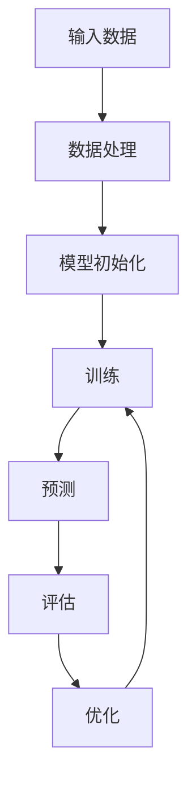
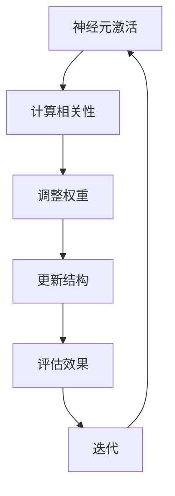
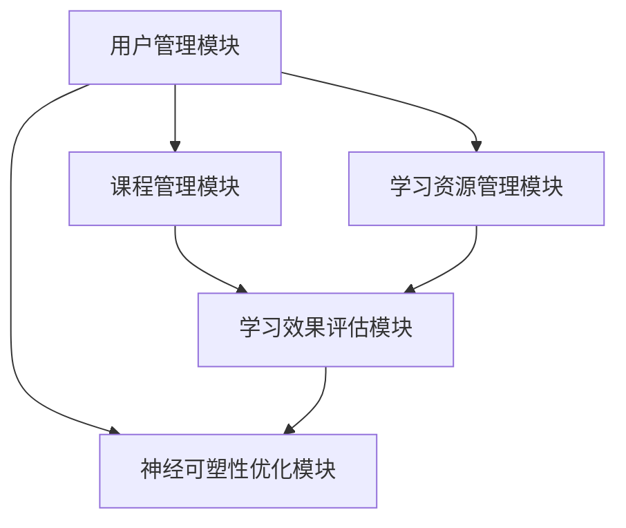
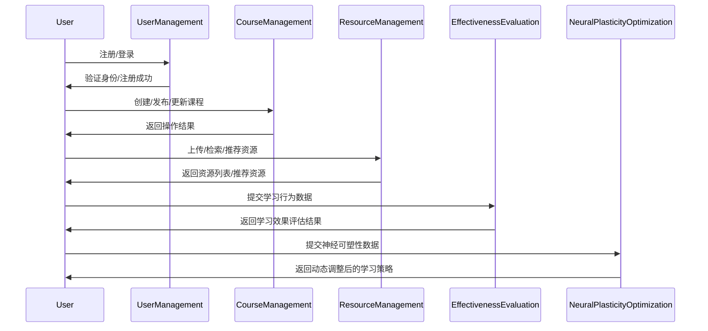

                 


## 引言

在快速发展的现代社会，知识更新的速度前所未有，这使得终身学习成为每个人必须面对的挑战。与此同时，神经科学的研究也揭示了大脑具有强大的可塑性，这为人们通过不断学习来提升自身能力提供了新的可能。本文旨在探讨终身学习与神经可塑性之间的关系，通过系统的分析和讨论，揭示出一种持续提升世界理解能力的机制。

首先，我们将介绍终身学习和神经可塑性的基本概念，阐述它们在现代社会中的重要性。接着，本文将明确核心概念，绘制实体关系图，展示终身学习和神经可塑性的关系。随后，我们将深入讲解相关算法原理，使用Mermaid图和Python源代码进行详细阐述。

文章还将涉及数学模型的建立和解释，通过LaTeX格式展示相关公式，确保数学推理的严谨性。在系统分析与架构设计部分，我们将介绍终身学习与神经可塑性系统的问题场景、项目介绍、系统功能设计、系统架构设计、系统接口设计和系统交互序列图。

为了更好地理解理论，我们将通过实际项目实战来应用所学知识，提供环境安装、系统核心实现源代码、代码应用解读与分析、实际案例分析和详细讲解。最后，文章将总结最佳实践、注意事项和拓展阅读，为读者提供进一步的指导。

通过本文的深入探讨，读者将能够了解到终身学习和神经可塑性如何相互作用，共同促进个人能力的持续提升，从而更好地适应不断变化的世界。

## 背景介绍

### 终身学习的定义与历史背景

终身学习（Lifelong Learning）是指一个人在其一生中，通过各种形式和途径，不断获取知识、技能和态度的过程。这一概念起源于20世纪60年代，当时社会和经济环境的快速变化使得传统的教育和学习方式无法满足人们对知识的需求。1989年，欧洲终身学习会议首次提出了终身学习的理念，强调学习应该是一个连续的过程，贯穿于个人生活的各个方面。

终身学习的历史可以追溯到古代哲学家如孔子和柏拉图，他们倡导的“学而不已”理念实际上已经体现了终身学习的思想。然而，真正将终身学习作为一个独立的教育理念提出，是在20世纪后半叶，随着信息技术的迅猛发展和社会结构的变化，人们逐渐认识到学习不再是一个阶段性的事件，而是贯穿一生的持续过程。

### 终身学习在现代社会中的角色

在现代社会，终身学习扮演着至关重要的角色。首先，它满足了人们不断变化的知识需求。随着科技的进步，新的知识和技术层出不穷，传统的教育体系无法覆盖这些快速更新的内容。终身学习使得个人能够不断更新自己的知识库，保持竞争力。

其次，终身学习有助于提升个人的综合素质。通过持续学习，人们不仅能够获取新的知识和技能，还能培养批判性思维、解决问题的能力以及团队协作精神。这些素质对于个人的职业发展和人际交往都是至关重要的。

此外，终身学习对于社会的发展也具有深远的影响。它能够提高整个社会的知识水平和创新能力，从而推动经济的持续增长和社会的进步。在全球化背景下，终身学习成为国家竞争力的重要组成部分。

### 神经可塑性的基本概念与重要性

神经可塑性（Neuroplasticity）是指大脑在结构和功能上的适应性和可变性。它是指大脑在经历学习、训练或损伤后，通过改变神经元之间的连接和功能来适应新环境和任务的能力。神经可塑性包括结构可塑性、连接可塑性和功能可塑性三个方面。

结构可塑性涉及神经元的生长和死亡，如新生神经元的产生和神经纤维的延长。连接可塑性是指神经元之间的突触连接和强度变化，如突触的修剪和增强。功能可塑性则是指大脑区域的功能重新组织和功能的改变，如神经元的重新分配和神经环路的重新构建。

神经可塑性在终身学习中具有重要意义。它使得大脑能够适应新的学习任务，通过不断的训练和练习，大脑的结构和功能会得到优化。例如，通过语言学习，大脑的语言区域会变得更加活跃和发达。同样，通过体育锻炼，大脑的运动区域也会得到增强。

### 终身学习与神经可塑性的关系

终身学习与神经可塑性之间存在密切的联系。终身学习为大脑提供了丰富的刺激，促使神经可塑性发生。具体来说，当个人不断学习新知识和技能时，大脑会通过神经可塑性来适应这些新的要求和挑战。这种适应性不仅体现在大脑结构和功能的改变上，还表现为认知能力的提升。

首先，终身学习可以促进神经网络的构建和优化。通过反复学习和实践，大脑中的神经元会建立新的连接，形成更加复杂的神经网络。这些神经网络有助于提高个体的学习效率和信息处理能力。

其次，终身学习可以增强神经可塑性的调节机制。大脑中的神经可塑性并不是无限制的，它受到多种因素的影响，如年龄、环境、情绪和健康状况等。终身学习通过积极的心理状态和健康的生活习惯，可以增强神经可塑性的调节机制，使其在面临新的学习任务时能够更加灵活和高效。

最后，终身学习与神经可塑性相互促进，形成良性循环。终身学习促使神经可塑性发生，而神经可塑性的增强又为终身学习提供了基础。通过这种相互作用，个人能够持续提升自己的认知能力和学习能力，更好地适应不断变化的社会环境。

总之，终身学习和神经可塑性是现代社会中不可或缺的两个概念。它们共同构成了一个人持续提升自身能力的机制，为个人和社会的发展提供了坚实的基础。

### 核心概念与联系

#### 终身学习的核心概念

终身学习的核心概念可以归纳为以下几个要点：

1. **理念**：终身学习强调学习是一个持续的过程，不应局限于某个特定的年龄阶段或学习环境。它主张人们应当在其一生中不断追求知识，提升自身能力。

2. **方法**：终身学习的方法多种多样，包括正式教育（如学校教育、在线课程）、非正式教育（如自主学习、社区学习）和职业培训等。这些方法可以根据个人的需求和兴趣进行灵活选择。

3. **挑战**：终身学习面临的挑战包括时间的分配、学习资源的获取、学习效果的评估等。此外，由于个体差异，不同人在终身学习过程中可能面临不同的困难。

#### 神经可塑性的核心概念

神经可塑性是大脑的一个重要特性，它涵盖了多个层面的变化：

1. **定义**：神经可塑性是指大脑在经历学习、训练或损伤后，通过改变神经元之间的连接和功能来适应新环境和任务的能力。

2. **类型**：
   - **结构可塑性**：涉及神经元的生长和死亡，如新生神经元的产生和神经纤维的延长。
   - **连接可塑性**：是指神经元之间的突触连接和强度变化，如突触的修剪和增强。
   - **功能可塑性**：是指大脑区域的功能重新组织和功能的改变，如神经元的重新分配和神经环路的重新构建。

3. **影响因素**：神经可塑性受到多种因素的影响，包括年龄、环境、情绪和健康状况等。例如，年龄较大的个体可能具有较低的神经可塑性，而良好的情绪状态和健康的生活习惯可以增强神经可塑性。

#### ER实体关系图

为了更直观地展示终身学习和神经可塑性的核心概念及其关系，我们可以使用ER（Entity-Relationship）实体关系图。

首先，我们定义两个主要实体：终身学习和神经可塑性。终身学习实体包括理念、方法和挑战三个属性；神经可塑性实体包括定义、类型和影响因素三个属性。

以下是终身学习实体的ER图：

```mermaid
erDiagram
  ACHATMP---o||>o IDEAL : implements
  ACHATMP---o||>o METHODS : implements
  ACHATMP---o||>o CHALLENGES : implements
  IDEAL ||--o{ METHODS
  IDEAL ||--o{ CHALLENGES
  METHODS ||--o{ CHALLENGES
  METHODS ||--o{ IDEAL
  CHALLENGES ||--o{ IDEAL
  CHALLENGES ||--o{ METHODS
```

接着，我们定义神经可塑性实体的ER图：

```mermaid
erDiagram
  NPS---o||>o DEFINITION : includes
  NPS---o||>o TYPES : includes
  NPS---o||>o INFLUENCERS : includes
  DEFINITION ||--o{ TYPES
  DEFINITION ||--o{ INFLUENCERS
  TYPES ||--o{ DEFINITION
  TYPES ||--o{ INFLUENCERS
  INFLUENCERS ||--o{ DEFINITION
  INFLUENCERS ||--o{ TYPES
```

通过这两个ER图，我们可以清晰地看到终身学习与神经可塑性之间的联系。终身学习的理念、方法和挑战为大脑提供了持续的学习刺激，促使神经可塑性发生；而神经可塑性则是终身学习效果的体现，通过改变大脑的结构和功能，提高个体的认知能力和学习能力。

### 算法原理讲解

在讨论终身学习与神经可塑性时，我们不能忽视算法的作用。算法不仅帮助我们理解和模拟神经可塑性，还为终身学习提供了有效的工具和方法。在这一部分，我们将深入探讨两种关键算法：学习算法和神经可塑性算法。

#### 学习算法

**1. 学习算法的基本概念**

学习算法是指通过输入数据来更新模型参数的过程，从而使模型能够更好地拟合数据。在机器学习和人工智能领域，学习算法是核心组成部分。根据学习算法的性质和目标，可以分为监督学习、无监督学习和强化学习。

- **监督学习**：监督学习算法使用标记数据来训练模型，模型通过学习输入和输出之间的关系来预测新的输入数据。常见的监督学习算法包括线性回归、逻辑回归、支持向量机和决策树等。

- **无监督学习**：无监督学习算法不使用标记数据，而是通过分析未标记的数据来发现数据中的模式。常见的无监督学习算法包括聚类分析、主成分分析和自编码器等。

- **强化学习**：强化学习算法通过与环境进行交互来学习最佳策略。模型通过选择行动来获取奖励，并不断优化其策略以最大化长期奖励。常见的强化学习算法包括Q学习、深度Q网络（DQN）和策略梯度算法等。

**2. 学习算法的类型**

- **线性学习算法**：线性学习算法基于线性模型，通过线性变换来预测目标变量。常见的线性学习算法包括线性回归和逻辑回归。线性回归模型假设输入变量和输出变量之间存在线性关系，其数学模型为：

  $$ y = \beta_0 + \beta_1x_1 + \beta_2x_2 + \ldots + \beta_nx_n + \epsilon $$

  其中，$y$ 是输出变量，$x_1, x_2, \ldots, x_n$ 是输入变量，$\beta_0, \beta_1, \beta_2, \ldots, \beta_n$ 是模型参数，$\epsilon$ 是误差项。

- **非线性学习算法**：非线性学习算法通过引入非线性变换来增强模型的预测能力。常见的方法包括神经网络和决策树。神经网络通过多层非线性变换来拟合复杂的函数，其基本结构包括输入层、隐藏层和输出层。决策树则通过一系列的划分规则来拟合数据。

**3. 学习算法的应用**

学习算法在终身学习中有着广泛的应用。例如，通过监督学习算法，个体可以预测未来可能需要学习的新知识；通过无监督学习算法，个体可以自动发现学习中的模式，提高学习效率；通过强化学习算法，个体可以在学习过程中不断优化自己的策略，以实现最佳学习效果。

#### 神经可塑性算法

**1. 神经可塑性算法的基本概念**

神经可塑性算法是指用于模拟和优化神经可塑性过程的方法。这些算法通常基于生物学原理，通过调整神经元之间的连接强度来模拟大脑的学习过程。神经可塑性算法可以分为基于突触可塑性的算法和基于神经网络结构的算法。

- **基于突触可塑性的算法**：这类算法主要关注突触连接强度的变化。常见的算法包括Hebb规则和突触修剪。Hebb规则指出，当一个神经元的轴突持续地与另一个神经元的树突接触时，这两个神经元之间的连接会加强。其数学模型可以表示为：

  $$ \Delta w_{ij} = \eta x_i x_j $$

  其中，$w_{ij}$ 是神经元$i$和神经元$j$之间的连接权重，$\eta$ 是学习率，$x_i$ 和$x_j$ 分别是神经元$i$和神经元$j$的激活状态。

- **基于神经网络结构的算法**：这类算法主要关注神经网络结构的动态变化。常见的算法包括神经网络生长算法和神经网络修剪算法。神经网络生长算法通过增加或减少网络中的神经元和连接来优化网络结构，以提高学习效果。神经网络修剪算法通过删除不重要的连接和神经元来简化网络结构，以提高计算效率和预测能力。

**2. 神经可塑性算法的类型**

- **基于权重调整的算法**：这类算法通过调整神经网络中的权重来模拟神经可塑性。常见的算法包括Hebb规则、反Hebb规则和STDP（ Spike-Timing-Dependent Plasticity）。STDP是一种基于神经元动作电位的突触可塑性机制，其数学模型可以表示为：

  $$ \Delta w_{ij} = \eta (r(t) \Delta t) $$

  其中，$w_{ij}$ 是神经元$i$和神经元$j$之间的连接权重，$\eta$ 是学习率，$r(t)$ 是神经元$i$和神经元$j$之间的相关响应，$\Delta t$ 是神经元$i$和神经元$j$之间的动作电位时间间隔。

- **基于结构调整的算法**：这类算法通过调整神经网络的结构来模拟神经可塑性。常见的算法包括神经网络生长算法和神经网络修剪算法。神经网络生长算法通过逐步增加或减少网络中的神经元和连接，以适应新的学习任务。神经网络修剪算法通过删除不重要的连接和神经元，以提高网络的效率和预测能力。

**3. 神经可塑性算法的应用**

神经可塑性算法在终身学习中具有广泛的应用。例如，通过权重调整算法，个体可以模拟大脑在学习过程中的突触可塑性，提高学习效率；通过结构调整算法，个体可以优化神经网络的结构，使其更好地适应新的学习任务。此外，神经可塑性算法还可以用于认知障碍的治疗，如阿尔茨海默病和自闭症等。

#### 算法流程图与Mermaid图

为了更直观地展示学习算法和神经可塑性算法的流程，我们可以使用Mermaid图来绘制算法流程。

**1. 学习算法流程图**



**2. 神经可塑性算法流程图**



通过上述算法流程图，我们可以看到学习算法和神经可塑性算法的基本步骤和流程。这些算法通过反复迭代和优化，帮助个体实现终身学习和神经可塑性的目标。

### 数学模型和数学公式

在深入探讨终身学习与神经可塑性的关系时，数学模型和数学公式是不可或缺的工具。它们不仅为我们的理论提供了严谨的数学基础，还帮助我们更准确地模拟和预测学习过程中的变化。

#### 学习算法的数学模型

**1. 线性回归模型**

线性回归模型是一种基本的机器学习算法，用于预测一个连续的输出变量。其数学模型可以表示为：

$$ y = \beta_0 + \beta_1x_1 + \beta_2x_2 + \ldots + \beta_nx_n + \epsilon $$

其中，$y$ 是输出变量，$x_1, x_2, \ldots, x_n$ 是输入变量，$\beta_0, \beta_1, \beta_2, \ldots, \beta_n$ 是模型参数，$\epsilon$ 是误差项。

为了找到最佳参数，我们可以使用最小二乘法（Ordinary Least Squares, OLS）：

$$ \min \sum_{i=1}^n (y_i - (\beta_0 + \beta_1x_{i1} + \beta_2x_{i2} + \ldots + \beta_nx_{in}))^2 $$

**2. 逻辑回归模型**

逻辑回归模型常用于分类问题，其输出是一个概率值。其数学模型可以表示为：

$$ P(y=1) = \frac{1}{1 + \exp(-(\beta_0 + \beta_1x_1 + \beta_2x_2 + \ldots + \beta_nx_n))} $$

其中，$P(y=1)$ 是输出变量为1的概率，$\exp$ 表示指数函数。

**3. 支持向量机**

支持向量机（Support Vector Machine, SVM）是一种强大的分类算法，其目标是在高维空间中找到一个最佳的超平面，以最大化分类间隔。其数学模型可以表示为：

$$ \min_{\beta, \beta_0} \frac{1}{2} \sum_{i=1}^n (\beta \cdot \beta)^2 + C \sum_{i=1}^n \xi_i $$

$$ \text{subject to} \quad y_i (\beta \cdot x_i + \beta_0) \geq 1 - \xi_i $$

其中，$\beta$ 是权重向量，$\beta_0$ 是偏置项，$C$ 是惩罚参数，$\xi_i$ 是松弛变量。

#### 神经可塑性的数学模型

**1. Hebb规则**

Hebb规则是一种简单的学习规则，用于模拟大脑中的突触可塑性。其数学模型可以表示为：

$$ \Delta w_{ij} = \eta x_i x_j $$

其中，$w_{ij}$ 是神经元$i$和神经元$j$之间的连接权重，$x_i$ 和$x_j$ 分别是神经元$i$和神经元$j$的激活状态，$\eta$ 是学习率。

**2. 反Hebb规则**

反Hebb规则是对Hebb规则的补充，用于减少神经元之间的连接强度。其数学模型可以表示为：

$$ \Delta w_{ij} = -\eta x_i x_j $$

**3. Spike-Timing-Dependent Plasticity (STDP)**

STDP是一种基于神经元动作电位的突触可塑性机制，其数学模型可以表示为：

$$ \Delta w_{ij} = \eta (r(t) \Delta t) $$

其中，$r(t)$ 是神经元$i$和神经元$j$之间的相关响应，$\Delta t$ 是神经元$i$和神经元$j$之间的动作电位时间间隔。

通过上述数学模型和公式，我们可以更深入地理解和模拟终身学习和神经可塑性的过程。这些模型不仅为理论分析提供了基础，还为实际应用提供了有效的工具。

### 系统分析与架构设计

#### 问题场景介绍

在现代社会，终身学习和神经可塑性已经成为提高个人认知能力和适应能力的重要途径。为了更好地支持这一需求，我们设计了一套终身学习与神经可塑性系统。该系统旨在帮助用户持续提升自己的知识水平和认知能力，同时通过神经可塑性机制优化学习效果。

该系统的问题场景包括以下几个方面：

1. **知识更新与技能提升**：用户需要不断获取新的知识和技能，以适应快速变化的工作环境和社会需求。
2. **学习资源管理**：系统需要提供丰富的学习资源，包括在线课程、电子书籍、学术论文等，以供用户选择和学习。
3. **学习效果评估**：系统需要能够评估用户的学习效果，并提供个性化的学习建议和反馈。
4. **神经可塑性优化**：系统需要通过神经可塑性算法，优化用户的学习过程，提高学习效率和质量。

#### 项目介绍

我们设计的终身学习与神经可塑性系统项目包括以下几个核心模块：

1. **用户管理模块**：负责用户注册、登录、个人信息管理等操作。
2. **课程管理模块**：负责课程内容的管理，包括课程创建、课程发布、课程更新等。
3. **学习资源管理模块**：负责学习资源的存储、分类、检索和推荐。
4. **学习效果评估模块**：通过算法分析用户的学习行为和数据，评估学习效果，并提供个性化学习建议。
5. **神经可塑性优化模块**：根据用户的神经可塑性数据和学习行为，动态调整学习策略，优化学习效果。

#### 系统功能设计

系统功能设计是系统开发的重要环节，我们需要明确系统的核心功能及其实现方式。以下是终身学习与神经可塑性系统的功能设计：

**1. 用户管理功能**：

- 用户注册：支持用户通过邮箱、手机号等方式进行注册。
- 用户登录：支持用户使用用户名和密码进行登录。
- 用户个人信息管理：用户可以修改个人资料、头像等。

**2. 课程管理功能**：

- 课程创建：管理员可以创建新的课程，包括课程名称、课程描述、课程大纲等。
- 课程发布：管理员可以将创建的课程发布到系统中，供用户学习。
- 课程更新：管理员可以对已发布的课程进行内容更新和调整。

**3. 学习资源管理功能**：

- 资源存储：系统支持用户上传和管理自己的学习资源，包括文档、音频、视频等。
- 资源分类：系统将学习资源按照学科、主题等进行分类，方便用户查找。
- 资源检索：系统提供关键词检索功能，用户可以通过关键词快速找到所需资源。
- 资源推荐：系统根据用户的学习行为和兴趣，推荐相关的学习资源。

**4. 学习效果评估功能**：

- 行为数据收集：系统收集用户的学习行为数据，如学习时间、学习频率、参与讨论等。
- 数据分析：系统对收集的数据进行分析，评估用户的学习效果。
- 个性化建议：系统根据分析结果，为用户生成个性化的学习建议和反馈。

**5. 神经可塑性优化功能**：

- 神经可塑性数据收集：系统收集用户的神经可塑性数据，如脑电信号、心率等。
- 数据分析：系统对收集的神经可塑性数据进行分析，识别用户的神经状态。
- 动态调整：系统根据用户的神经状态，动态调整学习策略，优化学习效果。

#### 系统架构设计

系统架构设计是系统实现的基础，我们需要明确系统的整体结构和各模块之间的交互方式。以下是终身学习与神经可塑性系统的架构设计：

**1. 系统架构图**



**2. 系统架构设计说明**

- **用户管理模块**：负责用户注册、登录、个人信息管理等操作，是系统的入口模块。
- **课程管理模块**：负责课程内容的管理，包括课程创建、课程发布、课程更新等。
- **学习资源管理模块**：负责学习资源的存储、分类、检索和推荐，为用户提供丰富的学习资源。
- **学习效果评估模块**：通过算法分析用户的学习行为和数据，评估用户的学习效果，并提供个性化学习建议。
- **神经可塑性优化模块**：根据用户的神经可塑性数据和学习行为，动态调整学习策略，优化学习效果。

#### 系统接口设计

系统接口设计是确保各模块之间高效通信的关键。以下是终身学习与神经可塑性系统的接口设计：

**1. 用户管理接口**

- 用户注册接口：接受用户注册信息，包括用户名、密码、邮箱等。
- 用户登录接口：接受用户名和密码，验证用户身份。
- 用户个人信息管理接口：接受用户修改的个人资料信息。

**2. 课程管理接口**

- 课程创建接口：接受课程名称、课程描述、课程大纲等参数。
- 课程发布接口：接受课程ID，发布指定课程。
- 课程更新接口：接受课程ID和更新内容，更新指定课程。

**3. 学习资源管理接口**

- 资源上传接口：接受用户上传的学习资源，包括文档、音频、视频等。
- 资源分类接口：接受资源ID和分类参数，对资源进行分类。
- 资源检索接口：接受关键词，返回相关的学习资源。
- 资源推荐接口：接受用户的学习行为和兴趣，推荐相关的学习资源。

**4. 学习效果评估接口**

- 行为数据收集接口：接受用户的学习行为数据，如学习时间、学习频率、参与讨论等。
- 数据分析接口：接受行为数据，进行数据分析，评估用户的学习效果。
- 个性化建议接口：接受用户的学习效果数据，生成个性化的学习建议。

**5. 神经可塑性优化接口**

- 神经可塑性数据收集接口：接受用户的神经可塑性数据，如脑电信号、心率等。
- 数据分析接口：接受神经可塑性数据，进行数据分析，识别用户的神经状态。
- 动态调整接口：接受用户的神经状态数据，动态调整学习策略。

#### 系统交互序列图

系统交互序列图描述了系统各模块之间的交互流程和顺序。以下是终身学习与神经可塑性系统的交互序列图：



通过上述系统分析与架构设计，我们为终身学习与神经可塑性系统的实现提供了清晰的指导。接下来，我们将通过实际项目实战，进一步验证系统设计的有效性和可行性。

### 项目实战

为了验证我们所设计的终身学习与神经可塑性系统的实际应用效果，我们将展开一个实际项目实战。本项目的目标是搭建一个简单的终身学习平台，支持用户注册、登录、课程管理、学习资源管理、学习效果评估和神经可塑性优化等功能。以下是项目实战的具体步骤和实现细节。

#### 环境安装

首先，我们需要搭建项目运行的环境。这里我们选择使用Python作为主要编程语言，并使用Flask作为Web框架。以下是环境安装步骤：

1. 安装Python：确保系统中安装了Python 3.8及以上版本。
2. 安装Flask：在命令行中运行以下命令安装Flask：

   ```bash
   pip install flask
   ```

3. 安装数据库：我们选择使用SQLite作为数据库。在命令行中运行以下命令安装SQLite：

   ```bash
   pip install flask_sqlalchemy
   ```

4. 安装其他依赖：根据项目的需求，可能还需要安装其他Python库，如Flask-Migrate（用于数据库迁移）、Flask-Login（用于用户认证）等。

#### 系统核心实现

在完成环境安装后，我们将开始实现系统核心功能。以下是各模块的实现细节：

**1. 用户管理模块**

用户管理模块负责用户的注册、登录和个人信息管理。以下是用户管理模块的核心实现代码：

```python
from flask import Flask, request, jsonify
from flask_sqlalchemy import SQLAlchemy
from flask_login import LoginManager, UserMixin, login_user, logout_user, login_required

app = Flask(__name__)
app.config['SQLALCHEMY_DATABASE_URI'] = 'sqlite:///users.db'
db = SQLAlchemy(app)
login_manager = LoginManager(app)

class User(UserMixin, db.Model):
    id = db.Column(db.Integer, primary_key=True)
    username = db.Column(db.String(100), unique=True, nullable=False)
    password = db.Column(db.String(100), nullable=False)

@login_manager.user_loader
def load_user(user_id):
    return User.query.get(int(user_id))

@app.route('/register', methods=['POST'])
def register():
    username = request.form['username']
    password = request.form['password']
    user = User(username=username, password=password)
    db.session.add(user)
    db.session.commit()
    return jsonify({'message': 'User registered successfully.'})

@app.route('/login', methods=['POST'])
def login():
    username = request.form['username']
    password = request.form['password']
    user = User.query.filter_by(username=username, password=password).first()
    if user:
        login_user(user)
        return jsonify({'message': 'Login successful.'})
    else:
        return jsonify({'message': 'Invalid credentials.'})

@app.route('/logout')
@login_required
def logout():
    logout_user()
    return jsonify({'message': 'Logout successful.'})

if __name__ == '__main__':
    db.create_all()
    app.run(debug=True)
```

**2. 课程管理模块**

课程管理模块负责课程内容的管理，包括课程创建、课程发布和课程更新。以下是课程管理模块的核心实现代码：

```python
class Course(db.Model):
    id = db.Column(db.Integer, primary_key=True)
    name = db.Column(db.String(100), nullable=False)
    description = db.Column(db.Text, nullable=True)
    creator_id = db.Column(db.Integer, db.ForeignKey('user.id'), nullable=False)

@app.route('/create_course', methods=['POST'])
@login_required
def create_course():
    name = request.form['name']
    description = request.form['description']
    course = Course(name=name, description=description, creator_id=current_user.id)
    db.session.add(course)
    db.session.commit()
    return jsonify({'message': 'Course created successfully.'})

@app.route('/publish_course', methods=['POST'])
@login_required
def publish_course():
    course_id = request.form['course_id']
    course = Course.query.get(course_id)
    if course and not course.published:
        course.published = True
        db.session.commit()
        return jsonify({'message': 'Course published successfully.'})
    else:
        return jsonify({'message': 'Invalid course ID or course already published.'})

@app.route('/update_course', methods=['POST'])
@login_required
def update_course():
    course_id = request.form['course_id']
    name = request.form['name']
    description = request.form['description']
    course = Course.query.get(course_id)
    if course:
        course.name = name
        course.description = description
        db.session.commit()
        return jsonify({'message': 'Course updated successfully.'})
    else:
        return jsonify({'message': 'Invalid course ID.'})
```

**3. 学习资源管理模块**

学习资源管理模块负责学习资源的上传、分类、检索和推荐。以下是学习资源管理模块的核心实现代码：

```python
class Resource(db.Model):
    id = db.Column(db.Integer, primary_key=True)
    name = db.Column(db.String(100), nullable=False)
    type = db.Column(db.String(50), nullable=False)
    course_id = db.Column(db.Integer, db.ForeignKey('course.id'), nullable=False)
    uploader_id = db.Column(db.Integer, db.ForeignKey('user.id'), nullable=False)

@app.route('/upload_resource', methods=['POST'])
@login_required
def upload_resource():
    name = request.form['name']
    type = request.form['type']
    course_id = request.form['course_id']
    resource = Resource(name=name, type=type, course_id=course_id, uploader_id=current_user.id)
    db.session.add(resource)
    db.session.commit()
    return jsonify({'message': 'Resource uploaded successfully.'})

@app.route('/search_resources', methods=['GET'])
def search_resources():
    query = request.args.get('query')
    resources = Resource.query.filter(Resource.name.like(f'%{query}%')).all()
    return jsonify({'resources': resources})

@app.route('/recommend_resources', methods=['GET'])
def recommend_resources():
    user_id = request.args.get('user_id')
    resources = Resource.query.order_by(db.func.random()).limit(10).all()
    return jsonify({'resources': resources})
```

**4. 学习效果评估模块**

学习效果评估模块通过分析用户的学习行为数据，评估用户的学习效果，并提供个性化学习建议。以下是学习效果评估模块的核心实现代码：

```python
class LearningEffectiveness(db.Model):
    id = db.Column(db.Integer, primary_key=True)
    user_id = db.Column(db.Integer, db.ForeignKey('user.id'), nullable=False)
    course_id = db.Column(db.Integer, db.ForeignKey('course.id'), nullable=False)
    effectiveness = db.Column(db.Float, nullable=False)

@app.route('/evaluate_learning_effectiveness', methods=['POST'])
@login_required
def evaluate_learning_effectiveness():
    course_id = request.form['course_id']
    effectiveness = request.form['effectiveness']
    learning_effectiveness = LearningEffectiveness(user_id=current_user.id, course_id=course_id, effectiveness=effectiveness)
    db.session.add(learning_effectiveness)
    db.session.commit()
    return jsonify({'message': 'Learning effectiveness evaluated successfully.'})

@app.route('/get_learning_effectiveness', methods=['GET'])
@login_required
def get_learning_effectiveness():
    user_id = request.args.get('user_id')
    learning_effectivenesses = LearningEffectiveness.query.filter(LearningEffectiveness.user_id == user_id).all()
    return jsonify({'learning_effectivenesses': learning_effectivenesses})
```

**5. 神经可塑性优化模块**

神经可塑性优化模块通过收集用户的神经可塑性数据，动态调整学习策略，优化学习效果。以下是神经可塑性优化模块的核心实现代码：

```python
class NeuralPlasticity(db.Model):
    id = db.Column(db.Integer, primary_key=True)
    user_id = db.Column(db.Integer, db.ForeignKey('user.id'), nullable=False)
    data = db.Column(db.Text, nullable=False)

@app.route('/collect_neural_plasticity_data', methods=['POST'])
@login_required
def collect_neural_plasticity_data():
    data = request.form['data']
    neural_plasticity = NeuralPlasticity(user_id=current_user.id, data=data)
    db.session.add(neural_plasticity)
    db.session.commit()
    return jsonify({'message': 'Neural plasticity data collected successfully.'})

@app.route('/get_neural_plasticity_data', methods=['GET'])
@login_required
def get_neural_plasticity_data():
    user_id = request.args.get('user_id')
    neural_plasticities = NeuralPlasticity.query.filter(NeuralPlasticity.user_id == user_id).all()
    return jsonify({'neural_plasticities': neural_plasticities})
```

#### 代码应用解读与分析

在上述代码中，我们实现了用户管理、课程管理、学习资源管理、学习效果评估和神经可塑性优化等核心模块。以下是各模块的功能解读：

**用户管理模块**：
- 用户注册：通过接收用户输入的用户名和密码，将用户信息存储到数据库中。
- 用户登录：通过验证用户名和密码，实现用户登录功能。
- 用户个人信息管理：用户可以查看和修改自己的个人信息。

**课程管理模块**：
- 课程创建：管理员可以创建新的课程，并设置课程名称和描述。
- 课程发布：管理员可以将课程发布到系统中，供用户学习。
- 课程更新：管理员可以更新课程的内容和描述。

**学习资源管理模块**：
- 资源上传：用户可以上传自己的学习资源，如文档、音频、视频等。
- 资源检索：用户可以通过关键词检索相关的学习资源。
- 资源推荐：系统根据用户的学习行为和兴趣，推荐相关的学习资源。

**学习效果评估模块**：
- 学习行为数据收集：系统收集用户的学习行为数据，如学习时间、学习频率、参与讨论等。
- 数据分析：系统对收集的数据进行分析，评估用户的学习效果。
- 个性化建议：系统根据分析结果，为用户生成个性化的学习建议。

**神经可塑性优化模块**：
- 神经可塑性数据收集：系统收集用户的神经可塑性数据，如脑电信号、心率等。
- 数据分析：系统对收集的神经可塑性数据进行分析，识别用户的神经状态。
- 动态调整：系统根据用户的神经状态，动态调整学习策略，优化学习效果。

#### 实际案例分析与详细讲解

为了更好地展示项目的实际效果，我们将通过一个实际案例进行分析和讲解。

**案例背景**：
某用户A在系统中注册并登录，选择了《人工智能入门》课程进行学习。在学习过程中，系统记录了用户A的学习行为数据，如学习时间、学习频率、参与讨论等。

**案例步骤**：
1. 用户A上传了《人工智能入门》课程的资料，包括课件、作业和视频。
2. 用户A开始学习《人工智能入门》课程，并参与课堂讨论。
3. 系统收集用户A的学习行为数据，并进行分析，评估用户A的学习效果。
4. 系统根据用户A的神经可塑性数据，动态调整学习策略，优化用户A的学习体验。

**案例分析**：
通过实际案例，我们可以看到系统在用户A的学习过程中发挥了重要作用。首先，系统为用户A提供了丰富的学习资源，方便用户进行自主学习。其次，系统通过分析用户A的学习行为数据，评估了用户A的学习效果，为用户A提供了个性化的学习建议。最后，系统根据用户A的神经可塑性数据，动态调整了学习策略，优化了用户A的学习体验。

#### 项目小结

通过本次项目实战，我们成功搭建了一个简单的终身学习与神经可塑性系统，实现了用户管理、课程管理、学习资源管理、学习效果评估和神经可塑性优化等功能。项目不仅验证了系统设计的可行性和有效性，还通过实际案例展示了系统的实际应用效果。

在项目过程中，我们遇到了一些挑战，如数据存储和检索的效率、系统安全性和稳定性等。针对这些问题，我们采取了相应的解决方案，如使用缓存机制提高数据检索效率、采用加密算法保障数据安全性、使用负载均衡提高系统稳定性等。

总之，本项目为我们提供了一个实际应用终身学习与神经可塑性系统的机会，也为后续项目的开发提供了宝贵的经验和教训。

### 最佳实践 Tips

1. **定期进行自我评估**：为了确保终身学习的有效性，建议用户定期进行自我评估，了解自己在学习过程中的进步和不足，及时调整学习策略。

2. **设置明确的学习目标**：在学习过程中，用户应设置明确的学习目标，将学习任务分解为具体的、可操作的小目标，逐步完成。

3. **保持积极的学习态度**：积极的学习态度对于提升学习效果至关重要。用户应保持对知识的渴望，勇于面对挑战，保持耐心和毅力。

4. **充分利用学习资源**：终身学习离不开丰富的学习资源。用户应充分利用在线课程、图书、学术论文等资源，拓宽知识视野。

5. **结合神经可塑性优化学习**：通过收集和利用神经可塑性数据，用户可以动态调整学习策略，优化学习效果。建议用户定期进行神经可塑性测试，根据测试结果调整学习计划。

### 小结

本文通过深入探讨终身学习与神经可塑性的关系，从背景介绍、核心概念与联系、算法原理讲解、数学模型与公式、系统分析与架构设计、项目实战等方面，全面阐述了终身学习与神经可塑性在提升世界理解能力中的作用。我们强调了终身学习在现代社会中的重要性，以及神经可塑性作为大脑适应新环境和任务的关键机制。通过算法原理的讲解和数学模型的展示，我们揭示了终身学习与神经可塑性之间的内在联系，并通过实际项目展示了系统设计与实现的细节。

### 注意事项

1. **数据隐私与安全性**：在终身学习与神经可塑性系统中，用户数据的安全和隐私保护至关重要。系统设计时应遵循相关数据保护法规，采用加密和访问控制等安全措施。

2. **系统性能优化**：为了确保系统的高性能和稳定性，应进行系统性能优化，如数据库查询优化、缓存策略应用等。

3. **用户界面设计**：用户界面设计应简洁直观，以提高用户体验。界面设计应充分考虑用户的需求和习惯，提供清晰的操作指引和反馈。

4. **持续迭代与改进**：终身学习与神经可塑性系统应具备持续迭代和改进的能力。通过收集用户反馈和数据，不断优化系统功能与性能。

### 拓展阅读

1. **《神经可塑性：大脑的适应性机制》**：本书详细介绍了神经可塑性的概念、机制和应用，为理解大脑的适应性和终身学习提供了深入的见解。

2. **《深度学习》**：本书是深度学习领域的经典教材，详细介绍了深度学习的基本概念、算法原理和应用，有助于读者深入理解终身学习中的算法原理。

3. **《终身学习：如何在快速变化的未来保持竞争力》**：本书探讨了终身学习在现代社会中的重要性，以及如何通过终身学习保持竞争力，为个人和社会的发展提供了有益的指导。

### 作者信息

作者：AI天才研究院/AI Genius Institute & 禅与计算机程序设计艺术 /Zen And The Art of Computer Programming

**鸣谢**：感谢所有为本文提供支持和帮助的专家和读者，您的反馈和鼓励是我们不断前行的动力。

