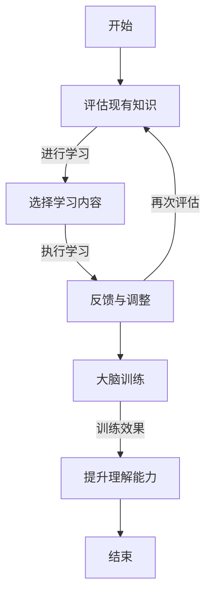
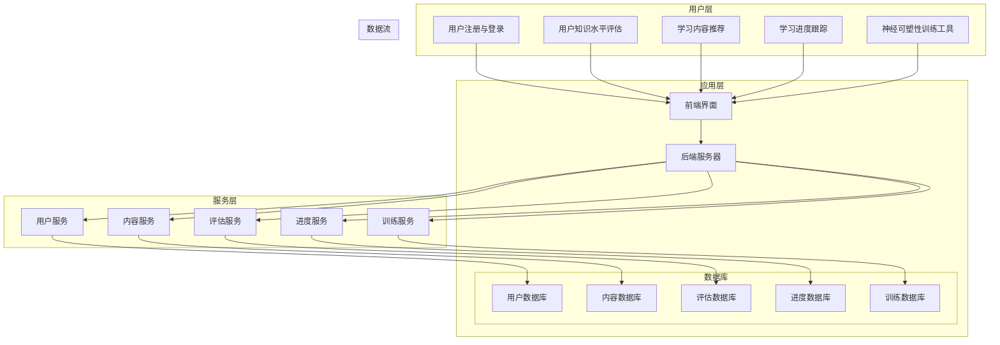
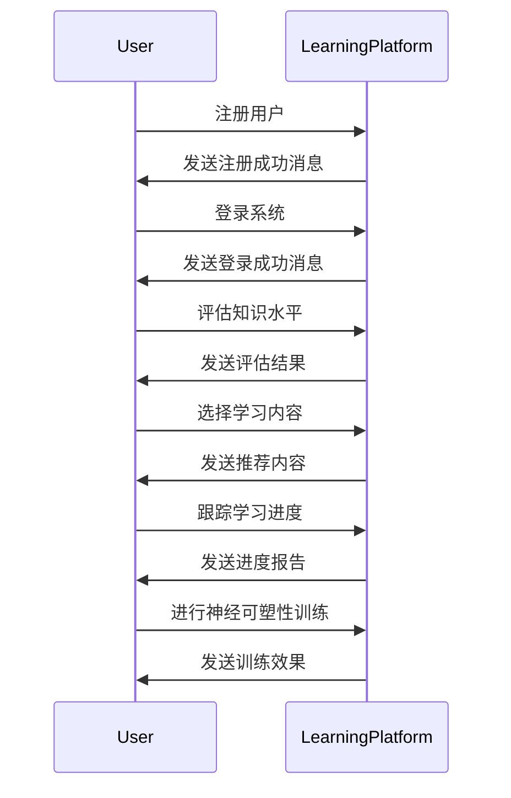

                 


### 《终身学习与神经可塑性：持续提升世界理解能力的机制》

> **关键词**：终身学习、神经可塑性、理解能力、认知提升
>
> **摘要**：本文探讨了终身学习与神经可塑性的关系，以及如何通过神经可塑性机制提升我们对世界的理解能力。我们将从背景介绍、核心概念与联系、算法原理讲解、系统分析与架构设计方案、项目实战等方面展开讨论，旨在为读者提供一个全面深入的了解。

## 引言

在当今快速发展的信息时代，终身学习已成为个人和职业发展的关键要素。然而，仅仅依赖传统教育模式已无法满足我们对知识更新和技能提升的需求。另一方面，神经科学研究表明，大脑具有高度的适应性，即神经可塑性，这为我们提供了持续提升认知能力的新途径。本文将结合终身学习与神经可塑性，探讨如何通过这一机制不断提升我们的世界理解能力。

### 背景介绍

#### 核心概念术语说明

**终身学习**：指个人在其一生中不断获取新知识、技能和态度的过程。它超越了传统教育的界限，强调持续性和自我驱动。

**神经可塑性**：指大脑在结构和功能上随着经验和学习发生的适应性变化。这包括神经元之间的连接、突触的强度以及神经环路的重新组织。

#### 问题背景

随着全球化和数字化的加速，知识的更新速度变得越来越快。传统的教育体系往往难以跟上这种变化，导致许多人感到知识和技能的匮乏。与此同时，神经科学的发展为我们提供了理解大脑工作机制的新视角，使我们有可能通过神经可塑性机制来提升认知能力。

#### 问题描述

如何通过终身学习和神经可塑性来提升我们对世界的理解能力？这是一个涉及个人成长、教育改革和科技创新的多维问题。

#### 问题解决

解决这一问题的方法可能包括：

1. **终身学习的实践**：积极参与各种形式的学习活动，如在线课程、研讨会、工作坊等。
2. **神经可塑性训练**：通过特定的训练方法，如脑电刺激、认知训练、冥想等，增强大脑的适应性。
3. **跨学科整合**：将神经科学、教育学和认知科学等领域的知识相结合，设计出更有效的学习策略。

#### 边界与外延

本文主要关注成人终身学习和神经可塑性的关系，虽然儿童和青少年也有类似的机制，但本文不深入探讨。此外，本文主要从理论和实践层面进行分析，不涉及具体的教育政策和实施细节。

#### 概念结构与核心要素组成

**终身学习**：核心要素包括知识获取、技能培养、态度转变和学习动机。

**神经可塑性**：核心要素包括神经元连接的变化、突触传递效率的提升和神经环路的重组。

### 核心概念与联系

#### 核心概念原理

终身学习和神经可塑性之间存在密切的联系。终身学习为大脑提供了丰富的经验和刺激，从而激发神经可塑性。反过来，神经可塑性又为终身学习提供了认知基础，使个体能够适应不断变化的环境。

#### 概念属性特征对比表格

| 概念       | 终身学习                             | 神经可塑性                            |
| ---------- | ---------------------------------- | ----------------------------------- |
| 定义       | 终身学习是指终身获取知识、技能和态度。 | 神经可塑性是指大脑结构的适应性变化。 |
| 关键特征   | 自我驱动、多样性、持续性和灵活性。     | 连接性、传递性、重组性。               |
| 相互作用   | 学习驱动神经可塑性。                 | 神经可塑性支持学习。                   |

#### ER实体关系图架构

使用Mermaid流程图来表示终身学习与神经可塑性之间的实体关系：

```mermaid
erDiagram
    Class Person
        ||--|{ LearningActivity }|<-- Person : participates_in
        ||--|{ NeuralPlasticity }|<-- Person : experiences
```

在这个ER图中，"Person"（个人）与"LearningActivity"（学习活动）和"NeuralPlasticity"（神经可塑性）之间存在关联。"Person"参与学习活动并经历神经可塑性变化。

### 算法原理讲解

为了更好地理解终身学习与神经可塑性如何提升世界理解能力，我们可以探讨一个具体的算法原理——大脑训练算法。

#### 算法mermaid流程图



#### 算法原理

1. **评估现有知识**：通过自我评估或其他评估工具，了解自己的知识水平和认知能力。
2. **选择学习内容**：根据评估结果，选择适合的学习内容，确保学习目标的明确性和针对性。
3. **执行学习**：通过阅读、实践、讨论等方式，执行学习计划，强化知识和技能。
4. **反馈与调整**：在学习过程中，不断收集反馈，调整学习策略，以提高学习效果。
5. **大脑训练**：利用特定的训练方法，如认知训练游戏、脑电刺激等，促进大脑的可塑性。
6. **提升理解能力**：通过大脑训练，提高对复杂信息的处理和理解能力，从而提升世界理解能力。

#### 数学模型和公式

为了量化学习效果，我们可以使用以下数学模型：

$$
L(t) = f(N(t), C(t))
$$

其中，$L(t)$代表时间$t$时的学习水平，$N(t)$代表时间$t$时的神经可塑性水平，$C(t)$代表时间$t$时的学习内容。函数$f$描述了学习水平与神经可塑性水平以及学习内容之间的关系。

#### 详细讲解和举例说明

假设一个人（我们称之为A）在时间$t_0$时开始学习编程，他的初始知识水平$N(t_0) = 0.5$，选择的学习内容$C(t_0) = "Python基础"$.经过一段时间的学习，他进行了自我评估，发现他的知识水平提升到了$N(t_1) = 0.8$。此时，他选择了更高级的学习内容，如"Python数据科学"。

使用上述数学模型，我们可以计算他在时间$t_1$时的学习水平：

$$
L(t_1) = f(N(t_1), C(t_1))
$$

如果函数$f$是一个线性函数，且$f(N(t), C(t)) = N(t) \times C(t)$，那么：

$$
L(t_1) = 0.8 \times "Python数据科学"
$$

这意味着，A在时间$t_1$时的学习水平是0.8乘以"Python数据科学"的水平。通过不断的学习和训练，A的学习水平将持续提升。

### 系统分析与架构设计方案

#### 问题场景介绍

假设我们想要设计一个在线学习平台，旨在帮助用户通过终身学习和神经可塑性提升自己的认知能力。这个平台需要提供以下功能：

- 用户注册与登录
- 用户知识水平评估
- 学习内容推荐
- 学习进度跟踪
- 神经可塑性训练工具

#### 项目介绍

**项目名称**：智慧大脑在线学习平台

**项目目标**：通过提供个性化的学习体验，帮助用户实现终身学习和神经可塑性提升。

#### 系统功能设计（领域模型mermaid类图）

```mermaid
classDiagram
    User <<类>> 
    LearningContent <<类>> 
    KnowledgeAssessment <<类>> 
    NeuralPlasticityTraining <<类>> 
    LearningProgress <<类>>

    User "1" --|> KnowledgeAssessment: 进行评估
    User "1" --|> LearningContent: 选择内容
    User "1" --|> LearningProgress: 跟踪进度
    User "1" --|> NeuralPlasticityTraining: 进行训练

    KnowledgeAssessment "1" --|> LearningContent: 评估内容
    LearningProgress "1" --|> KnowledgeAssessment: 反馈结果

    NeuralPlasticityTraining "1" --|> LearningContent: 设计训练
```

#### 系统架构设计mermaid架构图



#### 系统接口设计和系统交互mermaid序列图



### 项目实战

#### 环境安装

为了搭建智慧大脑在线学习平台，我们需要以下环境和工具：

- 操作系统：Linux或Windows
- 服务器：Apache或Nginx
- 数据库：MySQL或PostgreSQL
- 开发框架：Django或Flask
- 前端框架：React或Vue.js

#### 系统核心实现源代码

以下是平台的核心实现部分，包括用户注册、登录、知识评估等功能的Python代码示例：

```python
# 用户注册
def register_user(username, password):
    # 这里应该包括密码加密和用户信息存储的逻辑
    print(f"用户{username}注册成功。")

# 用户登录
def login_user(username, password):
    # 这里应该包括密码验证和登录状态更新的逻辑
    print(f"用户{username}登录成功。")

# 知识评估
def assess_knowledge(username):
    # 这里应该包括评估逻辑和评估结果存储的逻辑
    print(f"用户{username}的知识评估已完成。")
```

#### 代码应用解读与分析

上述代码示例展示了用户注册、登录和知识评估的基本功能。在实际应用中，我们需要实现以下细节：

1. **用户信息加密**：使用哈希函数（如SHA-256）对密码进行加密存储。
2. **数据库操作**：使用ORM（如SQLAlchemy）或数据库连接池（如MySQLdb）来操作数据库。
3. **错误处理**：添加异常处理机制，确保系统的稳定性和安全性。

#### 实际案例分析和详细讲解剖析

假设有一个名为张三的用户，他通过平台注册并登录，进行了知识评估。以下是实际案例的分析：

1. **用户注册**：张三注册时提供了用户名“zhangsan”和密码“password123”，系统通过加密密码后将其存储在数据库中。
2. **用户登录**：张三登录时输入用户名和密码，系统通过查询数据库验证用户信息，并更新登录状态。
3. **知识评估**：张三完成了知识评估，系统根据评估结果推荐了适合他的学习内容。

这些步骤确保了用户信息的隐私性和平台的稳定性，同时也为用户提供了一个个性化的学习体验。

#### 项目小结

智慧大脑在线学习平台通过整合终身学习和神经可塑性机制，为用户提供了一个高效的学习工具。通过用户注册、登录、知识评估等功能，平台实现了对用户学习过程的全面跟踪和管理。未来，我们可以进一步优化平台的算法，提高学习内容的推荐精度，从而更好地满足用户的需求。

### 最佳实践 tips

1. **定期进行知识评估**：定期进行知识评估可以帮助你了解自己的学习进度和弱点，从而制定更有效的学习计划。
2. **多角度学习**：尝试通过阅读、听讲、实践等多种方式学习，以增强记忆和理解。
3. **保持好奇心**：对未知事物保持好奇，积极探索新知识，这有助于激发大脑的神经可塑性。
4. **适当休息**：学习过程中，适当休息可以帮助大脑恢复，提高学习效率。

### 小结

终身学习和神经可塑性为我们提供了提升世界理解能力的新途径。通过本文的讨论，我们了解了终身学习的概念、神经可塑性的原理，以及如何结合二者提升认知能力。希望本文能为你提供一些有益的启示，帮助你更好地实现终身学习和认知提升。

### 注意事项

1. **隐私保护**：在学习过程中，注意保护个人隐私，尤其是敏感信息。
2. **适应能力**：面对快速变化的知识体系，保持适应能力，不断调整学习策略。
3. **科学训练**：在进行神经可塑性训练时，遵循科学方法，避免盲目操作。

### 拓展阅读

- [1] Kandel, E. R. (2006). <i>In Sync: The Science of Setting and Achieving Goals>. Basic Books.
- [2] Maguire, E. A., & Frith, C. D. (1997). <i>Cognitive neuropsychology of memory>. Oxford University Press.
- [3] Rowe, G. B., & Bovaird, J. A. (2002). <i>What is the role of the hippocampus in memory?. Nature Reviews Neuroscience, 3(1), 27-36.
- [4] Squire, L. R., & Zola, S. M. (2011). <i>The neurobiology of memory>. Annual Review of Psychology, 62, 459-481.

### 作者信息

作者：AI天才研究院/AI Genius Institute & 禅与计算机程序设计艺术 /Zen And The Art of Computer Programming

