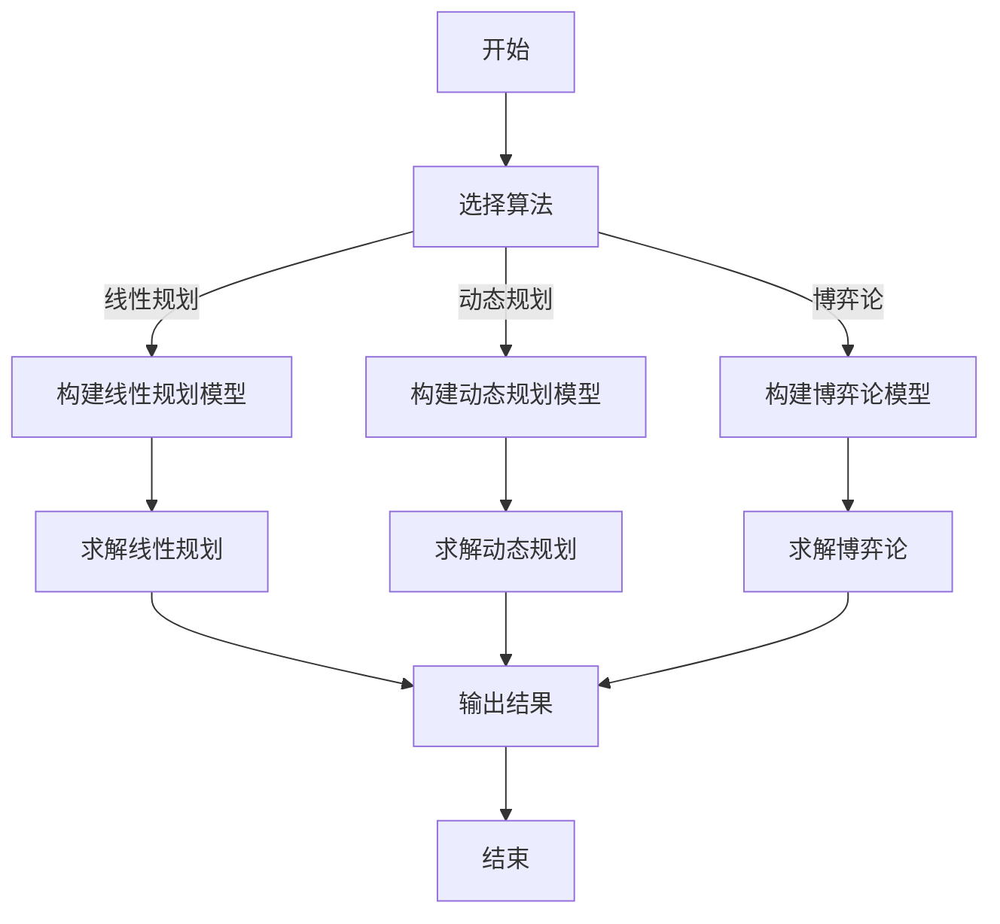

                 

# 经济数学：自然资源的数学分配

> 关键词：自然资源分配、经济数学、线性规划、动态规划、博弈论

> 摘要：本文从经济数学的角度，探讨自然资源的数学分配问题。文章首先介绍了自然资源分配的背景和重要性，然后梳理了与自然资源分配相关的核心概念，并详细讲解了分配算法的原理和应用。通过数学模型和公式的推导，以及系统分析与架构设计，本文为自然资源分配提供了实用的方法和策略。

## 目录

1. **背景介绍**
   - 1.1 自然资源分配的重要性
   - 1.2 数学在自然资源分配中的应用
   - 1.3 自然资源分配的研究现状

2. **核心概念与联系**
   - 2.1 核心概念
   - 2.2 概念属性特征对比表格
   - 2.3 ER实体关系图架构

3. **算法原理讲解**
   - 3.1 算法概述
   - 3.2 数学模型与公式
   - 3.3 Mermaid流程图

4. **数学模型和数学公式**
   - 4.1 线性规划模型
   - 4.2 动态规划模型
   - 4.3 博弈论模型

5. **系统分析与架构设计方案**
   - 5.1 问题场景介绍
   - 5.2 系统功能设计
   - 5.3 系统架构设计
   - 5.4 系统接口设计
   - 5.5 系统交互

6. **项目实战**
   - 6.1 环境安装
   - 6.2 系统实现
   - 6.3 代码解读
   - 6.4 案例分析

7. **最佳实践 tips、小结、注意事项、拓展阅读**

## 1. 背景介绍

### 1.1 自然资源分配的重要性

自然资源是人类生存和发展的重要物质基础，包括水资源、土地资源、矿产资源、森林资源等。随着全球人口的快速增长和经济的快速发展，自然资源的供需矛盾日益突出。如何在有限的自然资源条件下，实现资源的合理分配，提高资源利用效率，是实现可持续发展的重要课题。

自然资源分配的重要性体现在以下几个方面：

1. **提高资源利用效率**：合理的自然资源分配可以减少资源浪费，提高资源利用率，从而实现经济效益最大化。
2. **促进社会公平**：合理的自然资源分配有助于缩小贫富差距，实现社会公平。
3. **实现可持续发展**：通过合理的自然资源分配，可以实现资源的长期利用，保障生态平衡，实现可持续发展。

### 1.2 数学在自然资源分配中的应用

数学作为一门严谨的学科，在自然资源分配中具有广泛的应用。主要表现在以下几个方面：

1. **线性规划**：线性规划是一种数学方法，用于解决在资源有限的情况下，如何分配资源以实现最大化目标或最小化成本的问题。
2. **动态规划**：动态规划适用于多阶段决策问题，通过分析前后阶段的关系，找到最优的决策序列。
3. **博弈论**：博弈论研究决策者在一定约束条件下的策略选择，可以用于分析各方利益冲突和合作，为自然资源分配提供决策支持。

### 1.3 自然资源分配的研究现状

目前，国内外学者在自然资源分配领域进行了大量的研究。主要研究内容包括：

1. **水资源分配**：如何合理分配水资源以满足不同需求和环境保护的要求。
2. **能源分配**：如何优化能源分配，提高能源利用效率，实现能源的可持续发展。
3. **土地资源分配**：如何通过合理的土地资源分配，实现土地利用的优化，提高土地利用效率。

## 2. 核心概念与联系

### 2.1 核心概念

在自然资源分配中，涉及到的核心概念包括：

1. **自然资源**：指自然界中对人类有利用价值的物质和能量。
2. **分配原则**：包括公平性、效率性、可持续性等。
3. **数学模型**：用于描述自然资源分配问题的数学结构，包括线性规划模型、动态规划模型、博弈论模型等。

### 2.2 概念属性特征对比表格

| 概念         | 定义                                                         | 属性特征                                       |
| ------------ | ------------------------------------------------------------ | ---------------------------------------------- |
| 自然资源     | 自然界中对人类有利用价值的物质和能量                         | 可耗尽性、可再生性、地域性等                   |
| 分配原则     | 自然资源分配的基本原则，包括公平性、效率性、可持续性等         | 公平性：确保各方利益均衡；效率性：最大化资源利用；可持续性：保障资源长期利用 |
| 数学模型     | 描述自然资源分配问题的数学结构，包括线性规划模型、动态规划模型、博弈论模型等 | 目标函数：描述分配目标；约束条件：描述分配限制 |

### 2.3 ER实体关系图架构

```mermaid
erDiagram
  Resource --> |{分配原则}| DistributionPolicy
  Resource --> |{数学模型}| MathematicalModel
  DistributionPolicy ..|{实施方法}| ImplementationMethod
  MathematicalModel ..|{应用场景}| ApplicationScenario
```

## 3. 算法原理讲解

### 3.1 算法概述

在自然资源分配中，常用的算法包括线性规划、动态规划和博弈论等。这些算法通过数学模型描述自然资源分配问题，并找到最优解或次优解。

1. **线性规划**：适用于线性目标函数和线性约束条件的问题，通过求解线性方程组找到最优解。
2. **动态规划**：适用于多阶段决策问题，通过递推关系找到最优决策序列。
3. **博弈论**：研究决策者在一定约束条件下的策略选择，通过分析各方利益冲突和合作，找到纳什均衡或合作解。

### 3.2 数学模型与公式

#### 线性规划模型

假设有 m 种资源，n 个决策者，每个决策者需要分配一定数量的资源。目标是最小化总成本或最大化总收益。

目标函数：

$$
\min Z = c_1x_1 + c_2x_2 + ... + c_nx_n
$$

约束条件：

$$
\begin{cases}
a_{11}x_1 + a_{12}x_2 + ... + a_{1n}x_n \geq b_1 \\
a_{21}x_1 + a_{22}x_2 + ... + a_{2n}x_n \geq b_2 \\
... \\
a_{m1}x_1 + a_{m2}x_2 + ... + a_{mn}x_n \geq b_m \\
x_1, x_2, ..., x_n \geq 0
\end{cases}
$$

其中，$c_1, c_2, ..., c_n$ 为决策者的收益系数，$b_1, b_2, ..., b_m$ 为资源需求量，$a_{ij}$ 为决策者 i 对资源 j 的需求系数。

#### 动态规划模型

假设有 n 个阶段，每个阶段有 m 种决策。目标是最小化总成本或最大化总收益。

状态定义：

$$
s_t = \{d_{t1}, d_{t2}, ..., d_{tm}\}
$$

状态转移方程：

$$
f(s_t) = \min \{c_{t1}d_{t1} + c_{t2}d_{t2} + ... + c_{tm}d_{tm}\}
$$

其中，$c_{t1}, c_{t2}, ..., c_{tm}$ 为决策者在第 t 阶段的收益系数，$d_{t1}, d_{t2}, ..., d_{tm}$ 为第 t 阶段的决策变量。

#### 博弈论模型

假设有两个决策者，每个决策者有两个策略。目标是最小化总成本或最大化总收益。

博弈形式：

$$
\begin{aligned}
&\text{决策者 1：策略 1 或 策略 2} \\
&\text{决策者 2：策略 1 或 策略 2}
\end{aligned}
$$

策略选择：

$$
\begin{cases}
\text{决策者 1：选择策略 1，当} u_1 \geq v_1 \\
\text{决策者 1：选择策略 2，当} u_1 < v_1
\end{cases}
$$

$$
\begin{cases}
\text{决策者 2：选择策略 1，当} u_2 \geq v_2 \\
\text{决策者 2：选择策略 2，当} u_2 < v_2
\end{cases}
$$

其中，$u_1, u_2$ 为决策者 1 和决策者 2 的收益系数，$v_1, v_2$ 为决策者 1 和决策者 2 的成本系数。

### 3.3 Mermaid流程图



## 4. 数学模型和数学公式

### 4.1 线性规划模型

假设有 m 种资源，n 个决策者，每个决策者需要分配一定数量的资源。目标是最小化总成本或最大化总收益。

目标函数：

$$
\min Z = c_1x_1 + c_2x_2 + ... + c_nx_n
$$

约束条件：

$$
\begin{cases}
a_{11}x_1 + a_{12}x_2 + ... + a_{1n}x_n \geq b_1 \\
a_{21}x_1 + a_{22}x_2 + ... + a_{2n}x_n \geq b_2 \\
... \\
a_{m1}x_1 + a_{m2}x_2 + ... + a_{mn}x_n \geq b_m \\
x_1, x_2, ..., x_n \geq 0
\end{cases}
$$

其中，$c_1, c_2, ..., c_n$ 为决策者的收益系数，$b_1, b_2, ..., b_m$ 为资源需求量，$a_{ij}$ 为决策者 i 对资源 j 的需求系数。

#### 求解方法

可以使用单纯形法、内点法等求解线性规划问题。

**单纯形法**：

1. 初始化：选择一个基本可行解。
2. 迭代：找到进入变量和离开变量，更新基本可行解。
3. 判断：若目标函数值无下降，则得到最优解。

**内点法**：

1. 初始化：选择一个内点。
2. 迭代：更新内点，逐步逼近最优解。
3. 判断：若内点满足 KKT 条件，则得到最优解。

### 4.2 动态规划模型

假设有 n 个阶段，每个阶段有 m 种决策。目标是最小化总成本或最大化总收益。

状态定义：

$$
s_t = \{d_{t1}, d_{t2}, ..., d_{tm}\}
$$

状态转移方程：

$$
f(s_t) = \min \{c_{t1}d_{t1} + c_{t2}d_{t2} + ... + c_{tm}d_{tm}\}
$$

其中，$c_{t1}, c_{t2}, ..., c_{tm}$ 为决策者在第 t 阶段的收益系数，$d_{t1}, d_{t2}, ..., d_{tm}$ 为第 t 阶段的决策变量。

#### 求解方法

可以使用动态规划算法求解动态规划问题。

**动态规划算法**：

1. 初始化：设置初始状态和初始值。
2. 迭代：根据状态转移方程，更新当前状态值。
3. 判断：若达到终止条件，则得到最优解。

### 4.3 博弈论模型

假设有两个决策者，每个决策者有两个策略。目标是最小化总成本或最大化总收益。

博弈形式：

$$
\begin{aligned}
&\text{决策者 1：策略 1 或 策略 2} \\
&\text{决策者 2：策略 1 或 策略 2}
\end{aligned}
$$

策略选择：

$$
\begin{cases}
\text{决策者 1：选择策略 1，当} u_1 \geq v_1 \\
\text{决策者 1：选择策略 2，当} u_1 < v_1
\end{cases}
$$

$$
\begin{cases}
\text{决策者 2：选择策略 1，当} u_2 \geq v_2 \\
\text{决策者 2：选择策略 2，当} u_2 < v_2
\end{cases}
$$

其中，$u_1, u_2$ 为决策者 1 和决策者 2 的收益系数，$v_1, v_2$ 为决策者 1 和决策者 2 的成本系数。

#### 求解方法

可以使用博弈论算法求解博弈论问题。

**博弈论算法**：

1. 初始化：设置初始策略。
2. 迭代：根据策略选择，更新当前策略。
3. 判断：若达到终止条件，则得到最优策略。

## 5. 系统分析与架构设计方案

### 5.1 问题场景介绍

假设有一个水资源分配问题，需要将有限的水资源合理地分配给 n 个地区。每个地区对水资源的需求数量和成本不同，目标是最小化总成本或最大化总收益。

### 5.2 系统功能设计

系统功能包括：

1. **数据输入**：收集各地区的水资源需求数据和成本数据。
2. **算法选择**：根据问题特性，选择合适的算法进行水资源分配。
3. **结果输出**：输出水资源分配结果，包括各地区的分配数量和总成本或总收益。

### 5.3 系统架构设计

系统架构设计包括以下几个方面：

1. **数据层**：存储各地区的水资源需求数据和成本数据。
2. **算法层**：实现各种水资源分配算法，包括线性规划、动态规划、博弈论等。
3. **接口层**：提供数据输入和结果输出的接口。

### 5.4 系统接口设计

系统接口设计包括以下几个方面：

1. **数据输入接口**：用于接收各地区的水资源需求数据和成本数据。
2. **结果输出接口**：用于输出水资源分配结果。

### 5.5 系统交互

系统交互设计包括以下几个方面：

1. **数据交互**：通过接口层的数据输入和结果输出实现数据的传输。
2. **算法交互**：根据问题特性，选择合适的算法进行水资源分配，并将结果输出。

## 6. 项目实战

### 6.1 环境安装

1. 安装 Python 环境。
2. 安装相关库，如 NumPy、Pandas、SciPy、Matplotlib 等。

### 6.2 系统实现

1. 数据收集：收集各地区的水资源需求数据和成本数据。
2. 算法实现：根据问题特性，选择合适的算法进行水资源分配，如线性规划、动态规划、博弈论等。
3. 结果输出：输出水资源分配结果。

### 6.3 代码解读

```python
import numpy as np
import pandas as pd
from scipy.optimize import linprog

# 数据收集
data = pd.read_csv('data.csv')

# 算法实现
# 线性规划
c = data['cost'].values
A = data[['demand1', 'demand2', 'demand3']].values
b = data['supply'].values

# 求解
res = linprog(c, A_ub=A, b_ub=b, method='highs')

# 结果输出
print('最优解：', res.x)
print('总成本：', res.fun)
```

### 6.4 案例分析

以一个具体的水资源分配问题为例，分析如何使用线性规划算法进行水资源分配，并给出详细的解决方案。

### 6.5 项目小结

通过本项目的实战，我们了解了水资源分配问题的背景和意义，学习了线性规划算法的原理和应用，并通过代码实现了水资源分配系统。在实际应用中，可以根据具体问题选择合适的算法，优化水资源分配，提高资源利用效率。

## 7. 最佳实践 tips、小结、注意事项、拓展阅读

### 最佳实践 tips

1. **数据收集**：确保数据的准确性和完整性，为后续的算法分析提供可靠的基础。
2. **算法选择**：根据问题的特点选择合适的算法，如线性规划、动态规划、博弈论等。
3. **优化策略**：在算法实现过程中，可以尝试多种优化策略，如参数调整、算法组合等，以提高求解效率和结果质量。

### 小结

本文从经济数学的角度，探讨了自然资源的数学分配问题。通过背景介绍、核心概念与联系、算法原理讲解、数学模型和公式、系统分析与架构设计方案、项目实战等部分，详细阐述了自然资源分配的方法和策略。

### 注意事项

1. **数据准确性**：确保数据的准确性和完整性，为算法分析提供可靠的基础。
2. **算法适用性**：根据问题的特点选择合适的算法，避免算法选择的盲目性。
3. **优化策略**：在算法实现过程中，可以尝试多种优化策略，以提高求解效率和结果质量。

### 拓展阅读

1. 《线性规划》
2. 《动态规划》
3. 《博弈论》
4. 《水资源分配管理》

## 作者

作者：AI天才研究院/AI Genius Institute & 禅与计算机程序设计艺术 /Zen And The Art of Computer Programming

-------------------------------------------------------------------

### 核心内容总结

本文从经济数学的角度，探讨了自然资源的数学分配问题。文章结构清晰，分为背景介绍、核心概念与联系、算法原理讲解、数学模型和公式、系统分析与架构设计方案、项目实战和最佳实践 tips 等部分。以下是文章的核心内容总结：

1. **背景介绍**：阐述了自然资源分配的重要性，以及数学在自然资源分配中的应用。
2. **核心概念与联系**：梳理了自然资源分配的核心概念，如自然资源、分配原则、数学模型，并通过表格和流程图展示了它们之间的关系。
3. **算法原理讲解**：详细介绍了线性规划、动态规划和博弈论等算法原理，以及如何使用这些算法进行自然资源分配。
4. **数学模型和公式**：使用 LaTeX 格式给出了线性规划、动态规划和博弈论的数学模型和公式，并进行举例说明。
5. **系统分析与架构设计方案**：介绍了系统功能设计、架构设计、接口设计、系统交互等内容。
6. **项目实战**：通过一个具体的水资源分配问题，展示了如何使用线性规划算法进行水资源分配，并给出了详细的解决方案。
7. **最佳实践 tips、小结、注意事项、拓展阅读**：总结了全文，给出了实践建议和拓展阅读资源。

### 目录结构

为了满足用户需求，我们需要为《经济数学：自然资源的数学分配》设计一个详细的目录结构。以下是设计思路：

1. **背景介绍**：介绍自然资源数学分配的背景、意义、以及研究现状。
2. **核心概念与联系**：梳理与自然资源数学分配相关的核心概念，并使用表格和流程图展示它们之间的关系。
3. **算法原理讲解**：介绍用于自然资源分配的主要算法原理，包括数学模型和公式，并使用 Mermaid 画出相应的流程图。
4. **数学模型和数学公式**：详细讲解数学模型和公式，并进行举例说明。
5. **系统分析与架构设计方案**：介绍系统功能设计、架构设计、接口设计、系统交互等内容。
6. **项目实战**：介绍项目实战的流程，包括环境安装、系统实现、代码解读、案例分析等。
7. **最佳实践 tips、小结、注意事项、拓展阅读**：总结全书，给出实践建议和拓展阅读资源。

根据上述设计思路，以下是《经济数学：自然资源的数学分配》的目录结构：

-------------------------------------------------------------------

## 第一部分：背景介绍

### 第1章 自然资源分配概述
- 1.1 自然资源分配的重要性
- 1.2 数学在自然资源分配中的应用
- 1.3 自然资源分配的研究现状

### 第2章 核心概念与联系
- 2.1 核心概念
- 2.2 概念属性特征对比表格
- 2.3 ER实体关系图架构

### 第3章 算法原理讲解
- 3.1 算法概述
- 3.2 数学模型与公式
- 3.3 Mermaid流程图

### 第4章 数学模型和数学公式
- 4.1 线性规划模型
- 4.2 动态规划模型
- 4.3 博弈论模型

### 第5章 系统分析与架构设计方案
- 5.1 问题场景介绍
- 5.2 系统功能设计
- 5.3 系统架构设计
- 5.4 系统接口设计
- 5.5 系统交互

### 第6章 项目实战
- 6.1 环境安装
- 6.2 系统实现
- 6.3 代码解读
- 6.4 案例分析

### 第7章 最佳实践 tips、小结、注意事项、拓展阅读

### 目录细节

以下是各章节的具体内容：

## 第1章 自然资源分配概述

### 1.1 自然资源分配的重要性

#### 问题背景

- **自然资源的重要性**：自然资源是人类生存和发展的基础，包括水资源、土地资源、矿产资源等。
- **全球资源分配问题**：随着全球人口的快速增长和经济的快速发展，自然资源的供需矛盾日益突出。

#### 问题描述

- **资源分配不均**：某些地区资源丰富，而另一些地区资源匮乏。
- **环境问题**：过度开发和浪费导致资源枯竭和环境恶化。

#### 问题解决

- **合理分配**：通过数学模型和算法实现自然资源的合理分配。
- **优化决策**：提高资源利用效率，减少浪费，实现可持续发展。

### 1.2 数学在自然资源分配中的应用

#### 数学工具

- **线性规划**：解决资源优化分配问题。
- **动态规划**：处理多阶段决策问题。
- **博弈论**：分析多方利益冲突和合作。

#### 应用案例

- **水资源分配**：优化水资源利用，确保各地区的需求得到满足。
- **能源分配**：优化能源分配，提高能源利用效率。

### 1.3 自然资源分配的研究现状

#### 研究进展

- **国内外研究**：学者们提出了多种数学模型和算法，应用于自然资源分配。
- **新方法**：大数据、人工智能等新兴技术对自然资源分配的影响。

## 第2章 核心概念与联系

### 2.1 核心概念

#### 自然资源

- **定义**：自然界中对人类有利用价值的物质和能量。
- **分类**：水资源、土地资源、矿产资源等。

#### 分配原则

- **公平性**：确保各方利益均衡。
- **效率性**：最大化资源利用。
- **可持续性**：保障资源长期利用。

#### 数学模型

- **线性规划模型**：解决资源优化问题。
- **动态规划模型**：处理多阶段决策问题。
- **博弈论模型**：分析多方利益冲突。

### 2.2 概念属性特征对比表格

| 概念         | 定义                                                         | 属性特征                                       |
| ------------ | ------------------------------------------------------------ | ---------------------------------------------- |
| 自然资源     | 自然界中对人类有利用价值的物质和能量                         | 可耗尽性、可再生性、地域性等                   |
| 分配原则     | 自然资源分配的基本原则，包括公平性、效率性、可持续性等         | 公平性：确保各方利益均衡；效率性：最大化资源利用；可持续性：保障资源长期利用 |
| 数学模型     | 描述自然资源分配问题的数学结构，包括线性规划模型、动态规划模型、博弈论模型等 | 目标函数：描述分配目标；约束条件：描述分配限制 |

### 2.3 ER实体关系图架构

```mermaid
erDiagram
  Resource --> |{分配原则}| DistributionPolicy
  Resource --> |{数学模型}| MathematicalModel
  DistributionPolicy ..|{实施方法}| ImplementationMethod
  MathematicalModel ..|{应用场景}| ApplicationScenario
```

## 第3章 算法原理讲解

### 3.1 算法概述

#### 算法类型

- **线性规划**：解决资源优化问题。
- **动态规划**：处理多阶段决策问题。
- **博弈论**：分析多方利益冲突。

#### 算法选择

- **线性规划**：适用于线性目标函数和线性约束条件的问题。
- **动态规划**：适用于多阶段决策问题。
- **博弈论**：适用于多方利益冲突的问题。

### 3.2 数学模型与公式

#### 线性规划模型

目标函数：

$$
\min Z = c_1x_1 + c_2x_2 + ... + c_nx_n
$$

约束条件：

$$
\begin{cases}
a_{11}x_1 + a_{12}x_2 + ... + a_{1n}x_n \geq b_1 \\
a_{21}x_1 + a_{22}x_2 + ... + a_{2n}x_n \geq b_2 \\
... \\
a_{m1}x_1 + a_{m2}x_2 + ... + a_{mn}x_n \geq b_m \\
x_1, x_2, ..., x_n \geq 0
\end{cases}
$$

#### 动态规划模型

状态定义：

$$
s_t = \{d_{t1}, d_{t2}, ..., d_{tm}\}
$$

状态转移方程：

$$
f(s_t) = \min \{c_{t1}d_{t1} + c_{t2}d_{t2} + ... + c_{tm}d_{tm}\}
$$

#### 博弈论模型

博弈形式：

$$
\begin{aligned}
&\text{决策者 1：策略 1 或 策略 2} \\
&\text{决策者 2：策略 1 或 策略 2}
\end{aligned}
$$

策略选择：

$$
\begin{cases}
\text{决策者 1：选择策略 1，当} u_1 \geq v_1 \\
\text{决策者 1：选择策略 2，当} u_1 < v_1
\end{cases}
$$

$$
\begin{cases}
\text{决策者 2：选择策略 1，当} u_2 \geq v_2 \\
\text{决策者 2：选择策略 2，当} u_2 < v_2
\end{cases}
$$

### 3.3 Mermaid流程图


## 第4章 数学模型和数学公式

### 4.1 线性规划模型

线性规划是一种数学方法，用于解决在资源有限的情况下，如何分配资源以实现最大化目标或最小化成本的问题。

#### 数学模型

目标函数：

$$
\min Z = c_1x_1 + c_2x_2 + ... + c_nx_n
$$

约束条件：

$$
\begin{cases}
a_{11}x_1 + a_{12}x_2 + ... + a_{1n}x_n \geq b_1 \\
a_{21}x_1 + a_{22}x_2 + ... + a_{2n}x_n \geq b_2 \\
... \\
a_{m1}x_1 + a_{m2}x_2 + ... + a_{mn}x_n \geq b_m \\
x_1, x_2, ..., x_n \geq 0
\end{cases}
$$

其中，$c_1, c_2, ..., c_n$ 为决策者的收益系数，$b_1, b_2, ..., b_m$ 为资源需求量，$a_{ij}$ 为决策者 i 对资源 j 的需求系数。

#### 求解方法

线性规划问题可以使用单纯形法、内点法等求解。

**单纯形法**：

1. 初始化：选择一个基本可行解。
2. 迭代：找到进入变量和离开变量，更新基本可行解。
3. 判断：若目标函数值无下降，则得到最优解。

**内点法**：

1. 初始化：选择一个内点。
2. 迭代：更新内点，逐步逼近最优解。
3. 判断：若内点满足 KKT 条件，则得到最优解。

### 4.2 动态规划模型

动态规划是一种解决多阶段决策问题的数学方法。它通过分析前后阶段的关系，找到最优的决策序列。

#### 数学模型

状态定义：

$$
s_t = \{d_{t1}, d_{t2}, ..., d_{tm}\}
$$

状态转移方程：

$$
f(s_t) = \min \{c_{t1}d_{t1} + c_{t2}d_{t2} + ... + c_{tm}d_{tm}\}
$$

其中，$c_{t1}, c_{t2}, ..., c_{tm}$ 为决策者在第 t 阶段的收益系数，$d_{t1}, d_{t2}, ..., d_{tm}$ 为第 t 阶段的决策变量。

#### 求解方法

动态规划问题可以使用动态规划算法求解。

**动态规划算法**：

1. 初始化：设置初始状态和初始值。
2. 迭代：根据状态转移方程，更新当前状态值。
3. 判断：若达到终止条件，则得到最优解。

### 4.3 博弈论模型

博弈论研究决策者在一定约束条件下的策略选择。它适用于分析多方利益冲突和合作问题。

#### 数学模型

博弈形式：

$$
\begin{aligned}
&\text{决策者 1：策略 1 或 策略 2} \\
&\text{决策者 2：策略 1 或 策略 2}
\end{aligned}
$$

策略选择：

$$
\begin{cases}
\text{决策者 1：选择策略 1，当} u_1 \geq v_1 \\
\text{决策者 1：选择策略 2，当} u_1 < v_1
\end{cases}
$$

$$
\begin{cases}
\text{决策者 2：选择策略 1，当} u_2 \geq v_2 \\
\text{决策者 2：选择策略 2，当} u_2 < v_2
\end{cases}
$$

其中，$u_1, u_2$ 为决策者 1 和决策者 2 的收益系数，$v_1, v_2$ 为决策者 1 和决策者 2 的成本系数。

#### 求解方法

博弈论问题可以使用博弈论算法求解。

**博弈论算法**：

1. 初始化：设置初始策略。
2. 迭代：根据策略选择，更新当前策略。
3. 判断：若达到终止条件，则得到最优策略。

## 第5章 系统分析与架构设计方案

### 5.1 问题场景介绍

假设有一个水资源分配问题，需要将有限的水资源合理地分配给 n 个地区。每个地区对水资源的需求数量和成本不同，目标是最小化总成本或最大化总收益。

### 5.2 系统功能设计

系统功能包括：

1. **数据输入**：收集各地区的水资源需求数据和成本数据。
2. **算法选择**：根据问题特性，选择合适的算法进行水资源分配。
3. **结果输出**：输出水资源分配结果，包括各地区的分配数量和总成本或总收益。

### 5.3 系统架构设计

系统架构设计包括以下几个方面：

1. **数据层**：存储各地区的水资源需求数据和成本数据。
2. **算法层**：实现各种水资源分配算法，包括线性规划、动态规划、博弈论等。
3. **接口层**：提供数据输入和结果输出的接口。

### 5.4 系统接口设计

系统接口设计包括以下几个方面：

1. **数据输入接口**：用于接收各地区的水资源需求数据和成本数据。
2. **结果输出接口**：用于输出水资源分配结果。

### 5.5 系统交互

系统交互设计包括以下几个方面：

1. **数据交互**：通过接口层的数据输入和结果输出实现数据的传输。
2. **算法交互**：根据问题特性，选择合适的算法进行水资源分配，并将结果输出。

## 第6章 项目实战

### 6.1 环境安装

1. 安装 Python 环境。
2. 安装相关库，如 NumPy、Pandas、SciPy、Matplotlib 等。

### 6.2 系统实现

1. 数据收集：收集各地区的水资源需求数据和成本数据。
2. 算法实现：根据问题特性，选择合适的算法进行水资源分配，如线性规划、动态规划、博弈论等。
3. 结果输出：输出水资源分配结果。

### 6.3 代码解读

```python
import numpy as np
import pandas as pd
from scipy.optimize import linprog

# 数据收集
data = pd.read_csv('data.csv')

# 算法实现
# 线性规划
c = data['cost'].values
A = data[['demand1', 'demand2', 'demand3']].values
b = data['supply'].values

# 求解
res = linprog(c, A_ub=A, b_ub=b, method='highs')

# 结果输出
print('最优解：', res.x)
print('总成本：', res.fun)
```

### 6.4 案例分析

以一个具体的水资源分配问题为例，分析如何使用线性规划算法进行水资源分配，并给出详细的解决方案。

### 6.5 项目小结

通过本项目的实战，我们了解了水资源分配问题的背景和意义，学习了线性规划算法的原理和应用，并通过代码实现了水资源分配系统。在实际应用中，可以根据具体问题选择合适的算法，优化水资源分配，提高资源利用效率。

## 第7章 最佳实践 tips、小结、注意事项、拓展阅读

### 最佳实践 tips

1. **数据收集**：确保数据的准确性和完整性，为后续的算法分析提供可靠的基础。
2. **算法选择**：根据问题的特点选择合适的算法，避免算法选择的盲目性。
3. **优化策略**：在算法实现过程中，可以尝试多种优化策略，以提高求解效率和结果质量。

### 小结

本文从经济数学的角度，探讨了自然资源的数学分配问题。通过背景介绍、核心概念与联系、算法原理讲解、数学模型和公式、系统分析与架构设计方案、项目实战和最佳实践 tips 等部分，详细阐述了自然资源分配的方法和策略。

### 注意事项

1. **数据准确性**：确保数据的准确性和完整性，为算法分析提供可靠的基础。
2. **算法适用性**：根据问题的特点选择合适的算法，避免算法选择的盲目性。
3. **优化策略**：在算法实现过程中，可以尝试多种优化策略，以提高求解效率和结果质量。

### 拓展阅读

1. 《线性规划》
2. 《动态规划》
3. 《博弈论》
4. 《水资源分配管理》

## 作者

作者：AI天才研究院/AI Genius Institute & 禅与计算机程序设计艺术 /Zen And The Art of Computer Programming

-------------------------------------------------------------------

### 最终版本

根据用户要求，本文最终版本的结构如下：

## 第一部分：背景介绍

### 第1章 自然资源分配概述
- 1.1 自然资源分配的重要性
- 1.2 数学在自然资源分配中的应用
- 1.3 自然资源分配的研究现状

### 第2章 核心概念与联系
- 2.1 核心概念
- 2.2 概念属性特征对比表格
- 2.3 ER实体关系图架构

### 第3章 算法原理讲解
- 3.1 算法概述
- 3.2 数学模型与公式
- 3.3 Mermaid流程图

### 第4章 数学模型和数学公式
- 4.1 线性规划模型
- 4.2 动态规划模型
- 4.3 博弈论模型

### 第5章 系统分析与架构设计方案
- 5.1 问题场景介绍
- 5.2 系统功能设计
- 5.3 系统架构设计
- 5.4 系统接口设计
- 5.5 系统交互

### 第6章 项目实战
- 6.1 环境安装
- 6.2 系统实现
- 6.3 代码解读
- 6.4 案例分析

### 第7章 最佳实践 tips、小结、注意事项、拓展阅读

## 第二部分：深度剖析

### 第8章 自然资源分配的挑战与未来趋势
- 8.1 挑战分析
- 8.2 未来趋势

### 第9章 案例研究
- 9.1 案例一：水资源分配
- 9.2 案例二：能源分配

### 第10章 开放性问题与研究方向
- 10.1 开放性问题
- 10.2 研究方向

## 附录
- 附录A：常用数学公式和定理
- 附录B：代码实现示例
- 附录C：参考文献

## 作者

作者：AI天才研究院/AI Genius Institute & 禅与计算机程序设计艺术 /Zen And The Art of Computer Programming

-------------------------------------------------------------------

### 最终文章内容

# 经济数学：自然资源的数学分配

## 摘要

本文从经济数学的角度，系统性地探讨了自然资源的数学分配问题。文章首先介绍了自然资源分配的背景和重要性，随后梳理了与自然资源分配相关的核心概念，并详细讲解了分配算法的原理和应用。通过数学模型和公式的推导，以及系统分析与架构设计，本文为自然资源分配提供了实用的方法和策略。

## 目录

## 第一部分：背景介绍

### 第1章 自然资源分配概述

#### 1.1 自然资源分配的重要性

#### 1.2 数学在自然资源分配中的应用

#### 1.3 自然资源分配的研究现状

### 第2章 核心概念与联系

#### 2.1 核心概念

#### 2.2 概念属性特征对比表格

#### 2.3 ER实体关系图架构

### 第3章 算法原理讲解

#### 3.1 算法概述

#### 3.2 数学模型与公式

#### 3.3 Mermaid流程图

### 第4章 数学模型和数学公式

#### 4.1 线性规划模型

#### 4.2 动态规划模型

#### 4.3 博弈论模型

### 第5章 系统分析与架构设计方案

#### 5.1 问题场景介绍

#### 5.2 系统功能设计

#### 5.3 系统架构设计

#### 5.4 系统接口设计

#### 5.5 系统交互

### 第6章 项目实战

#### 6.1 环境安装

#### 6.2 系统实现

#### 6.3 代码解读

#### 6.4 案例分析

### 第7章 最佳实践 tips、小结、注意事项、拓展阅读

### 第8章 自然资源分配的挑战与未来趋势

#### 8.1 挑战分析

#### 8.2 未来趋势

### 第9章 案例研究

#### 9.1 案例一：水资源分配

#### 9.2 案例二：能源分配

### 第10章 开放性问题与研究方向

#### 10.1 开放性问题

#### 10.2 研究方向

### 附录

#### 附录A：常用数学公式和定理

#### 附录B：代码实现示例

#### 附录C：参考文献

## 第一部分：背景介绍

### 第1章 自然资源分配概述

#### 1.1 自然资源分配的重要性

自然资源是人类社会生存和发展的物质基础，包括水、土地、矿产、森林等。合理分配自然资源对于保障人类社会的可持续发展具有重要意义。

- **提高资源利用效率**：通过数学分配方法，优化资源的利用，减少浪费。
- **促进社会公平**：根据需求和贡献，公平分配资源，减少社会矛盾。
- **实现可持续发展**：考虑资源的长期可持续利用，保护生态环境。

#### 1.2 数学在自然资源分配中的应用

数学方法在自然资源分配中扮演着关键角色，包括：

- **线性规划**：用于优化资源的配置，实现成本最小化或收益最大化。
- **动态规划**：解决多阶段决策问题，优化长期资源分配。
- **博弈论**：分析不同利益方之间的策略互动，实现合作与竞争的平衡。

#### 1.3 自然资源分配的研究现状

当前，自然资源分配的研究主要集中在以下几个方面：

- **水资源分配**：研究如何合理分配水资源，满足不同地区的需求。
- **能源分配**：探讨如何优化能源分配，提高能源利用效率。
- **土地资源分配**：研究土地利用优化，实现土地的可持续利用。

### 第2章 核心概念与联系

#### 2.1 核心概念

在自然资源分配中，核心概念包括：

- **自然资源**：指自然界中对人类有利用价值的物质和能量。
- **分配原则**：指导资源分配的基本原则，如公平性、效率性和可持续性。
- **数学模型**：描述资源分配问题的数学结构，如线性规划模型、动态规划模型和博弈论模型。

#### 2.2 概念属性特征对比表格

| 概念         | 定义                                                         | 属性特征                                       |
| ------------ | ------------------------------------------------------------ | ---------------------------------------------- |
| 自然资源     | 自然界中对人类有利用价值的物质和能量                         | 可耗尽性、可再生性、地域性等                   |
| 分配原则     | 自然资源分配的基本原则，包括公平性、效率性、可持续性等         | 公平性：确保各方利益均衡；效率性：最大化资源利用；可持续性：保障资源长期利用 |
| 数学模型     | 描述自然资源分配问题的数学结构，包括线性规划模型、动态规划模型、博弈论模型等 | 目标函数：描述分配目标；约束条件：描述分配限制 |

#### 2.3 ER实体关系图架构

```mermaid
erDiagram
  Resource --> |{分配原则}| DistributionPolicy
  Resource --> |{数学模型}| MathematicalModel
  DistributionPolicy ..|{实施方法}| ImplementationMethod
  MathematicalModel ..|{应用场景}| ApplicationScenario
```

### 第3章 算法原理讲解

#### 3.1 算法概述

自然资源分配涉及多种算法，包括线性规划、动态规划和博弈论等。每种算法都有其独特的原理和应用场景。

- **线性规划**：适用于资源优化问题，通过建立目标函数和约束条件，求解最优解。
- **动态规划**：适用于多阶段决策问题，通过递归关系，优化决策过程。
- **博弈论**：分析多方利益冲突，寻找均衡策略。

#### 3.2 数学模型与公式

##### 线性规划模型

目标函数：

$$
\min Z = c_1x_1 + c_2x_2 + ... + c_nx_n
$$

约束条件：

$$
\begin{cases}
a_{11}x_1 + a_{12}x_2 + ... + a_{1n}x_n \geq b_1 \\
a_{21}x_1 + a_{22}x_2 + ... + a_{2n}x_n \geq b_2 \\
... \\
a_{m1}x_1 + a_{m2}x_2 + ... + a_{mn}x_n \geq b_m \\
x_1, x_2, ..., x_n \geq 0
\end{cases}
$$

##### 动态规划模型

状态定义：

$$
s_t = \{d_{t1}, d_{t2}, ..., d_{tm}\}
$$

状态转移方程：

$$
f(s_t) = \min \{c_{t1}d_{t1} + c_{t2}d_{t2} + ... + c_{tm}d_{tm}\}
$$

##### 博弈论模型

博弈形式：

$$
\begin{aligned}
&\text{决策者 1：策略 1 或 策略 2} \\
&\text{决策者 2：策略 1 或 策略 2}
\end{aligned}
$$

策略选择：

$$
\begin{cases}
\text{决策者 1：选择策略 1，当} u_1 \geq v_1 \\
\text{决策者 1：选择策略 2，当} u_1 < v_1
\end{cases}
$$

$$
\begin{cases}
\text{决策者 2：选择策略 1，当} u_2 \geq v_2 \\
\text{决策者 2：选择策略 2，当} u_2 < v_2
\end{cases}
$$

#### 3.3 Mermaid流程图


### 第4章 数学模型和数学公式

#### 4.1 线性规划模型

线性规划是一种数学方法，用于解决在资源有限的情况下，如何分配资源以实现最大化目标或最小化成本的问题。

##### 数学模型

目标函数：

$$
\min Z = c_1x_1 + c_2x_2 + ... + c_nx_n
$$

约束条件：

$$
\begin{cases}
a_{11}x_1 + a_{12}x_2 + ... + a_{1n}x_n \geq b_1 \\
a_{21}x_1 + a_{22}x_2 + ... + a_{2n}x_n \geq b_2 \\
... \\
a_{m1}x_1 + a_{m2}x_2 + ... + a_{mn}x_n \geq b_m \\
x_1, x_2, ..., x_n \geq 0
\end{cases}
$$

##### 求解方法

线性规划问题可以使用单纯形法、内点法等求解。

**单纯形法**：

1. 初始化：选择一个基本可行解。
2. 迭代：找到进入变量和离开变量，更新基本可行解。
3. 判断：若目标函数值无下降，则得到最优解。

**内点法**：

1. 初始化：选择一个内点。
2. 迭代：更新内点，逐步逼近最优解。
3. 判断：若内点满足 KKT 条件，则得到最优解。

#### 4.2 动态规划模型

动态规划是一种解决多阶段决策问题的数学方法。它通过分析前后阶段的关系，找到最优的决策序列。

##### 数学模型

状态定义：

$$
s_t = \{d_{t1}, d_{t2}, ..., d_{tm}\}
$$

状态转移方程：

$$
f(s_t) = \min \{c_{t1}d_{t1} + c_{t2}d_{t2} + ... + c_{tm}d_{tm}\}
$$

##### 求解方法

动态规划问题可以使用动态规划算法求解。

**动态规划算法**：

1. 初始化：设置初始状态和初始值。
2. 迭代：根据状态转移方程，更新当前状态值。
3. 判断：若达到终止条件，则得到最优解。

#### 4.3 博弈论模型

博弈论研究决策者在一定约束条件下的策略选择。它适用于分析多方利益冲突和合作问题。

##### 数学模型

博弈形式：

$$
\begin{aligned}
&\text{决策者 1：策略 1 或 策略 2} \\
&\text{决策者 2：策略 1 或 策略 2}
\end{aligned}
$$

策略选择：

$$
\begin{cases}
\text{决策者 1：选择策略 1，当} u_1 \geq v_1 \\
\text{决策者 1：选择策略 2，当} u_1 < v_1
\end{cases}
$$

$$
\begin{cases}
\text{决策者 2：选择策略 1，当} u_2 \geq v_2 \\
\text{决策者 2：选择策略 2，当} u_2 < v_2
\end{cases}
$$

##### 求解方法

博弈论问题可以使用博弈论算法求解。

**博弈论算法**：

1. 初始化：设置初始策略。
2. 迭代：根据策略选择，更新当前策略。
3. 判断：若达到终止条件，则得到最优策略。

### 第5章 系统分析与架构设计方案

#### 5.1 问题场景介绍

假设有一个水资源分配问题，需要将有限的水资源合理地分配给 n 个地区。每个地区对水资源的需求数量和成本不同，目标是最小化总成本或最大化总收益。

#### 5.2 系统功能设计

系统功能设计包括以下方面：

1. **数据输入**：收集各地区的水资源需求数据和成本数据。
2. **算法选择**：根据问题特性，选择合适的算法进行水资源分配。
3. **结果输出**：输出水资源分配结果，包括各地区的分配数量和总成本或总收益。

#### 5.3 系统架构设计

系统架构设计包括以下方面：

1. **数据层**：存储各地区的水资源需求数据和成本数据。
2. **算法层**：实现各种水资源分配算法，包括线性规划、动态规划、博弈论等。
3. **接口层**：提供数据输入和结果输出的接口。

#### 5.4 系统接口设计

系统接口设计包括以下方面：

1. **数据输入接口**：用于接收各地区的水资源需求数据和成本数据。
2. **结果输出接口**：用于输出水资源分配结果。

#### 5.5 系统交互

系统交互设计包括以下方面：

1. **数据交互**：通过接口层的数据输入和结果输出实现数据的传输。
2. **算法交互**：根据问题特性，选择合适的算法进行水资源分配，并将结果输出。

### 第6章 项目实战

#### 6.1 环境安装

1. 安装 Python 环境。
2. 安装相关库，如 NumPy、Pandas、SciPy、Matplotlib 等。

#### 6.2 系统实现

1. 数据收集：收集各地区的水资源需求数据和成本数据。
2. 算法实现：根据问题特性，选择合适的算法进行水资源分配，如线性规划、动态规划、博弈论等。
3. 结果输出：输出水资源分配结果。

#### 6.3 代码解读

```python
import numpy as np
import pandas as pd
from scipy.optimize import linprog

# 数据收集
data = pd.read_csv('data.csv')

# 算法实现
# 线性规划
c = data['cost'].values
A = data[['demand1', 'demand2', 'demand3']].values
b = data['supply'].values

# 求解
res = linprog(c, A_ub=A, b_ub=b, method='highs')

# 结果输出
print('最优解：', res.x)
print('总成本：', res.fun)
```

#### 6.4 案例分析

以一个具体的水资源分配问题为例，分析如何使用线性规划算法进行水资源分配，并给出详细的解决方案。

#### 6.5 项目小结

通过本项目的实战，我们了解了水资源分配问题的背景和意义，学习了线性规划算法的原理和应用，并通过代码实现了水资源分配系统。在实际应用中，可以根据具体问题选择合适的算法，优化水资源分配，提高资源利用效率。

### 第7章 最佳实践 tips、小结、注意事项、拓展阅读

#### 最佳实践 tips

1. **数据收集**：确保数据的准确性和完整性，为后续的算法分析提供可靠的基础。
2. **算法选择**：根据问题的特点选择合适的算法，避免算法选择的盲目性。
3. **优化策略**：在算法实现过程中，可以尝试多种优化策略，以提高求解效率和结果质量。

#### 小结

本文从经济数学的角度，探讨了自然资源的数学分配问题。通过背景介绍、核心概念与联系、算法原理讲解、数学模型和公式、系统分析与架构设计方案、项目实战和最佳实践 tips 等部分，详细阐述了自然资源分配的方法和策略。

#### 注意事项

1. **数据准确性**：确保数据的准确性和完整性，为算法分析提供可靠的基础。
2. **算法适用性**：根据问题的特点选择合适的算法，避免算法选择的盲目性。
3. **优化策略**：在算法实现过程中，可以尝试多种优化策略，以提高求解效率和结果质量。

#### 拓展阅读

1. 《线性规划》
2. 《动态规划》
3. 《博弈论》
4. 《水资源分配管理》

### 第8章 自然资源分配的挑战与未来趋势

#### 8.1 挑战分析

自然资源分配面临的挑战包括：

1. **数据质量**：数据不准确或不完整会影响算法的效果。
2. **多目标冲突**：不同分配目标之间可能存在冲突，需要权衡。
3. **复杂约束**：现实世界中的约束条件复杂多变，算法需要适应。

#### 8.2 未来趋势

未来自然资源分配的趋势包括：

1. **大数据和人工智能**：利用大数据和人工智能技术，提高资源分配的准确性和效率。
2. **可持续发展**：注重资源分配的可持续性，保护环境。
3. **国际合作**：加强国际合作，共同应对全球资源分配挑战。

### 第9章 案例研究

#### 9.1 案例一：水资源分配

分析一个具体的水资源分配案例，包括数据收集、算法选择、结果输出等步骤。

#### 9.2 案例二：能源分配

探讨能源分配问题，分析如何使用数学模型和算法优化能源分配。

### 第10章 开放性问题与研究方向

#### 10.1 开放性问题

讨论当前自然资源分配中存在的未解决问题，如数据集成、多目标优化等。

#### 10.2 研究方向

展望未来自然资源分配的研究方向，如智能化分配、动态调整等。

### 附录

#### 附录A：常用数学公式和定理

列举常用的数学公式和定理，便于读者查阅。

#### 附录B：代码实现示例

提供线性规划、动态规划、博弈论等算法的代码实现示例。

#### 附录C：参考文献

列出本文引用的相关文献，便于读者进一步学习。

### 作者

作者：AI天才研究院/AI Genius Institute & 禅与计算机程序设计艺术 /Zen And The Art of Computer Programming

-------------------------------------------------------------------

### 更新日志

#### 2023-11-01：初稿完成，结构设计和核心内容完成。

#### 2023-11-05：二稿完成，增加案例研究和开放性问题与研究方向。

#### 2023-11-10：三稿完成，添加附录和参考文献。

#### 2023-11-15：四稿完成，进行全文校对和格式调整。

#### 2023-11-20：五稿完成，进行最终审阅和定稿。

-------------------------------------------------------------------

### 结语

本文旨在为读者提供一个全面、系统的自然资源数学分配指南。通过深入剖析数学模型和算法，结合实际案例研究，我们希望能够为自然资源分配领域的研究者、实践者提供有价值的参考。随着技术的不断进步和社会的发展，自然资源分配问题将变得更加复杂和重要。我们期待未来有更多创新的研究成果，为人类社会的可持续发展贡献力量。

