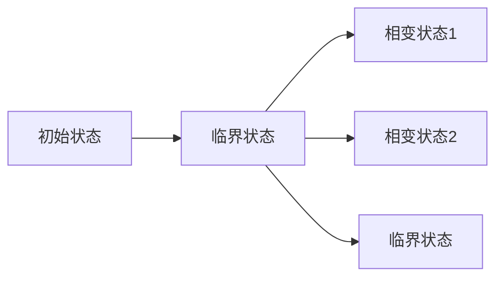

                 

### 统计物理：自然系统的数学模型

**关键词：** 统计物理、自然系统、数学模型、概率论、分布函数

**摘要：** 本文将深入探讨统计物理在自然系统建模中的应用，从基本概念、原理到前沿研究，系统性地介绍统计物理如何通过数学模型来解析自然界的复杂现象。通过具体的案例分析，我们将展示统计物理在信息科学和生物物理学中的重要作用，并展望其未来的发展方向。

### 目录大纲

1. **统计物理的基本概念与原理**
   1.1 **统计物理简介**
   1.2 **统计物理的基本假设与原理**
   2. **分子动理论**
   2.1 **分子动理论的初步概念**
   2.2 **热力学量的统计解释**
   3. **分布函数**
   3.1 **麦克斯韦-玻尔兹曼分布**
   3.2 **麦克斯韦-玻尔兹曼分布的应用**
   4. **相变与临界现象**
   4.1 **相变的统计物理解释**
   4.2 **临界现象与临界指数**
   5. **非平衡统计物理**
   5.1 **非平衡态的统计描述**
   5.2 **非平衡统计物理的应用**
   6. **统计物理与信息论**
   6.1 **统计物理与信息论的关系**
   6.2 **统计物理在信息科学中的应用**
   7. **统计物理的新发展**
   7.1 **统计物理的前沿研究**
   7.2 **统计物理在生物物理学中的应用**
   8. **总结与展望**

## 第一部分：统计物理的基本概念与原理

### 1.1 统计物理简介

统计物理是研究宏观物理系统由微观粒子组成的统计行为的一个分支。它起源于19世纪末，随着经典物理学的发展，物理学学家开始探讨如何从微观粒子的统计行为来解释宏观物理系统的性质。统计物理的起源可以追溯到麦克斯韦的分子动理论，但真正的发展是在爱因斯坦、玻尔兹曼、吉布斯等科学家的贡献下完成的。

统计物理在物理学中的重要性体现在多个方面。首先，它为我们提供了一种从微观角度理解宏观物理现象的桥梁，如热力学第二定律、熵增原理等。其次，统计物理的应用范围非常广泛，从基本的物质结构、热现象到复杂的非线性系统、信息科学都有其身影。

#### 问题解决

统计物理的发展为物理学的研究带来了革命性的变化。例如，通过统计物理的分析，我们可以理解为何固体具有固定的形状和体积，液体具有流动性，以及气体能充满整个容器。此外，统计物理还在材料科学、凝聚态物理、化学、生物学等领域有着重要应用。例如，在材料科学中，统计物理帮助我们设计具有特定性质的材料，如高温超导体、新型合金等。在生物学中，统计物理可以用于研究蛋白质的结构和功能、生物分子的运动等。

#### 边界与外延

统计物理不仅在物理学领域有着深远的影响，其原理和方法也被广泛应用于其他科学领域。例如，在信息科学中，统计物理的许多概念和方法被用于研究复杂网络、数据挖掘、机器学习等。在经济学中，统计物理也被用于研究市场波动、社会行为等。

#### 概念结构与核心要素组成

统计物理的核心概念包括概率论、分布函数、熵、相变等。这些概念相互关联，构成了统计物理的理论体系。概率论是统计物理的基础，它提供了描述微观粒子行为的数学工具。分布函数描述了微观粒子的状态分布，是统计物理的核心概念之一。熵则是统计物理中描述系统无序程度的物理量。相变是统计物理研究的重要对象，它描述了系统从一种状态转变到另一种状态的过程。

### 1.2 统计物理的基本假设与原理

统计物理的基础是概率论和统计方法，其核心思想是通过研究大量粒子的统计行为来描述宏观物理系统的性质。统计物理的基本假设包括等概率原理和最大熵原理。

#### 等概率原理

等概率原理是指在一个封闭系统中，每个微观状态出现的概率是相等的。这一假设是统计物理的基础，它为我们提供了一种从微观角度理解宏观物理现象的方法。例如，在理想气体模型中，气体分子的运动是随机的，每个分子在空间中任意位置出现的概率是相等的。

#### 最大熵原理

最大熵原理是统计物理中另一个重要假设，它提出了在不确定条件下系统最可能的状态。具体来说，如果一个系统处于某一状态，那么这个状态的概率分布应该满足最大熵原则，即该状态的概率分布是所有可能状态中熵最大的。最大熵原理在信息论、热力学、量子物理等领域都有重要应用。

#### 联系与联系

等概率原理和最大熵原理是统计物理的两个核心假设，它们相互补充，共同构成了统计物理的理论基础。等概率原理提供了微观粒子的统计行为模型，而最大熵原理则提供了从微观状态到宏观物理性质的桥梁。通过这两个假设，我们可以从微观角度出发，对宏观物理现象进行定量描述。

### 1.3 分子动理论

分子动理论是统计物理的一个基本组成部分，它描述了分子的运动规律和相互作用。分子动理论的基本原理是：物质是由大量微观粒子组成的，这些粒子不断地进行无规则运动，并且相互之间存在着相互作用力。

#### 初步概念

分子动理论的初步概念主要包括以下几个部分：

1. **理想气体模型**：理想气体模型是一个简化的模型，假设气体分子之间没有相互作用力，并且分子的大小可以忽略不计。在这个模型中，气体分子的运动是随机的，每个分子在空间中任意位置出现的概率是相等的。

2. **麦克斯韦-玻尔兹曼分布**：麦克斯韦-玻尔兹曼分布描述了理想气体中分子速度的分布。根据这个分布，大多数分子的速度接近于平均速度，而非常快的或非常慢的分子相对较少。

3. **压强**：压强是气体分子撞击容器壁产生的。根据麦克斯韦-玻尔兹曼分布，压强与分子的速度分布有关。

#### 数学模型

分子动理论的数学模型主要包括以下几个公式：

1. **压强公式**：压强 \( P \) 与分子的平均动能 \( \langle E \rangle \) 有关，可以表示为：
   \[ P = \frac{2}{3} n \langle E \rangle \]
   其中，\( n \) 是单位体积内的分子数。

2. **温度**：温度是分子的平均动能的度量，可以表示为：
   \[ \langle E \rangle = \frac{3}{2} k T \]
   其中，\( k \) 是玻尔兹曼常数，\( T \) 是温度。

3. **能量分布**：根据麦克斯韦-玻尔兹曼分布，分子的速度分布函数可以表示为：
   \[ f(v) = 4\pi \left( \frac{m}{2\pi kT} \right)^{3/2} v^2 \exp\left(-\frac{mv^2}{2kT}\right) \]
   其中，\( m \) 是分子的质量。

#### 详细讲解

分子动理论的核心是描述分子的运动规律和相互作用。通过理想气体模型和麦克斯韦-玻尔兹曼分布，我们可以理解气体分子的运动是如何影响宏观物理量的。例如，压强是气体分子撞击容器壁产生的，而温度是分子的平均动能的度量。这些物理量的统计分布函数提供了我们对气体行为的数学描述。

### 1.4 热力学量的统计解释

热力学是研究宏观物理系统宏观性质和它们之间相互作用的物理学分支。热力学量的统计解释是统计物理的重要组成部分，它通过概率论和统计方法对热力学量进行量化描述。

#### 核心原理

热力学量的统计解释主要包括以下几个核心原理：

1. **能量分布**：热力学量的统计解释首先需要对系统的能量分布进行描述。根据麦克斯韦-玻尔兹曼分布，系统的能量分布函数可以表示为：
   \[ P(E) = \frac{1}{Z} \exp\left(-\frac{E}{kT}\right) \]
   其中，\( E \) 是系统的能量，\( Z \) 是配分函数，\( k \) 是玻尔兹曼常数，\( T \) 是温度。

2. **熵**：熵是热力学中描述系统无序程度的物理量。根据统计物理的解释，熵与系统的微观状态数有关。具体来说，熵可以表示为：
   \[ S = k \ln \Omega \]
   其中，\( S \) 是熵，\( \Omega \) 是系统的微观状态数。

3. **概率分布**：热力学量的统计解释还涉及到系统状态的概率分布。根据等概率原理，系统处于某一状态的几率是相等的，概率分布函数可以表示为：
   \[ P(\omega) = \frac{1}{\Omega} \]
   其中，\( \omega \) 是系统的微观状态。

#### 对比表格

为了更直观地理解热力学量的统计解释，我们可以通过一个表格来对比不同的热力学量：

| 热力学量 | 定义式 | 统计解释 |
| --- | --- | --- |
| 温度 | \( T = \frac{\partial U}{\partial S} \) | 系统的平均能量与熵的比值 |
| 内能 | \( U = \sum_{i} E_i P(E_i) \) | 系统的总能量 |
| 熵 | \( S = -k \sum_{i} P(E_i) \ln P(E_i) \) | 系统的无序程度 |

#### 实际应用

热力学量的统计解释在许多实际应用中都有重要作用。例如，在热力学过程中，我们可以通过统计物理的方法来预测系统的能量变化和熵变化。在材料科学中，统计物理可以用于研究材料的微观结构及其对宏观性质的影响。在生物学中，统计物理可以用于研究生物分子的能量分布和运动规律。

### 1.5 麦克斯韦-玻尔兹曼分布

麦克斯韦-玻尔兹曼分布是描述理想气体中分子速度分布的一个重要概念。它基于统计物理的基本假设，即每个微观状态出现的概率是相等的。麦克斯韦-玻尔兹曼分布不仅帮助我们理解气体分子的运动规律，还在许多实际应用中有重要作用。

#### 数学公式

麦克斯韦-玻尔兹曼分布的数学公式可以表示为：

\[ f(v) = 4\pi \left( \frac{m}{2\pi kT} \right)^{3/2} v^2 \exp\left(-\frac{mv^2}{2kT}\right) \]

其中，\( f(v) \) 是速度为 \( v \) 的分子数密度，\( m \) 是分子的质量，\( k \) 是玻尔兹曼常数，\( T \) 是温度。

#### 详细讲解

麦克斯韦-玻尔兹曼分布的公式描述了分子在不同速度下的分布情况。大多数分子的速度接近于平均速度，而非常快的或非常慢的分子相对较少。这个分布函数不仅帮助我们理解气体分子的运动规律，还可以用于计算气体的宏观性质，如压强和温度。

#### 物理意义

麦克斯韦-玻尔兹曼分布的物理意义在于它描述了气体分子在空间中的运动状态。根据这个分布函数，我们可以预测气体在不同条件下的行为，如温度升高时，分子的速度分布会发生变化，分子之间的相互作用力也会增强。

#### 计算方法

为了计算麦克斯韦-玻尔兹曼分布，我们需要先确定系统的微观状态。具体来说，我们可以通过统计方法来确定每个微观状态的概率，然后计算所有微观状态的加权平均，得到宏观物理量。例如，要计算气体的压强，我们可以计算分子撞击容器壁的平均冲量，然后通过压强公式得到气体的压强。

### 1.6 麦克斯韦-玻尔兹曼分布的应用

麦克斯韦-玻尔兹曼分布在实际应用中有着广泛的应用。以下是一些具体的例子：

1. **气体压强的计算**：根据麦克斯韦-玻尔兹曼分布，我们可以计算气体在不同温度和压强下的分子速度分布，从而得到气体的压强。

2. **气体温度的测量**：通过测量气体的分子速度分布，我们可以计算气体的温度。这一原理被广泛应用于气体温度计和热力学测量中。

3. **流体动力学**：麦克斯韦-玻尔兹曼分布也在流体动力学中有重要应用，如计算流体的速度分布和压力分布。

4. **材料科学**：在材料科学中，麦克斯韦-玻尔兹曼分布可以用于研究材料中缺陷的运动规律和扩散过程。

#### 局限性与改进

虽然麦克斯韦-玻尔兹曼分布是一个重要的理论工具，但它也有一些局限性。首先，它假设气体分子之间没有相互作用，这在实际情况下并不总是成立。其次，它适用于理想气体，而在实际中，许多气体都偏离了理想气体行为。为了克服这些局限性，科学家们提出了一些改进模型，如范德瓦尔斯气体模型和自由程理论。

### 1.7 相变与临界现象

相变是物质从一种宏观状态转变为另一种宏观状态的过程，如从固态到液态的熔化，从液态到气态的沸腾。临界现象则是指系统在相变过程中出现的特殊行为，如临界指数和临界温度。相变与临界现象是统计物理研究的重要内容，它们揭示了物质内部结构的复杂性和多样性。

#### 核心概念

相变与临界现象的核心概念包括：

1. **相变**：相变是指物质从一种宏观状态（如固态）转变为另一种宏观状态（如液态）的过程。相变可以分为一级相变和二级相变。一级相变伴随着温度和体积的突变，如水的沸腾和凝固。二级相变则没有明显的温度和体积突变，如铁磁相变。

2. **临界现象**：临界现象是指在相变过程中系统出现的特殊行为，如临界指数和临界温度。临界指数描述了系统在临界区域的行为特征，临界温度是系统发生相变的温度。

#### ER实体关系图

为了更好地理解相变与临界现象，我们可以使用ER（Entity-Relationship）实体关系图来描述系统的状态和相互作用。以下是一个简化的ER实体关系图：

```mermaid
erDiagram
    A ||--|{ B } B : is related to
    A ||--|{ C } C : is related to
    B &&--|{ D } D : is related to
```

在这个ER实体关系图中，A表示初始状态，B和C表示不同的相变状态，D表示临界状态。A和B之间的箭头表示系统可以从初始状态转变为相变状态，而B和C之间的双箭头表示两种相变状态之间的互相关联。C和D之间的箭头表示系统在临界状态下可能发生的进一步转变。

#### 详细讲解

通过ER实体关系图，我们可以更清晰地理解相变与临界现象。例如，在水的熔化过程中，初始状态是固态（A），相变状态是液态（B），而临界状态是沸腾状态（D）。系统在临界状态下可能同时具有液态和气态的特性，这种复杂行为就是临界现象的体现。

### 1.8 临界现象与临界指数

临界现象与临界指数是统计物理研究的重要内容，它们揭示了系统在临界区域的行为特征。临界指数描述了系统在临界区域的行为规律，如临界指数α、β、γ等。这些指数在理论和实验研究中都有着重要的应用。

#### 核心原理

临界现象与临界指数的核心原理包括：

1. **临界指数**：临界指数是描述系统在临界区域行为特征的重要参数。例如，α、β、γ等指数分别描述了系统在临界区域的空间相关性、时间相关性和速率相关性。

2. **相变**：临界现象是相变过程中的一种特殊行为，它发生在系统从一个宏观状态转变为另一个宏观状态的临界点。

3. **临界温度**：临界温度是系统发生相变的温度，它是临界现象的重要特征之一。

#### Mermaid 流程图

为了更直观地理解临界现象与临界指数，我们可以使用Mermaid流程图来描述系统在临界区域的行为。以下是一个简化的Mermaid流程图：



在这个流程图中，A表示初始状态，B表示临界状态，C和D表示两种不同的相变状态，E表示另一个临界状态。系统从初始状态A经过临界状态B，最终可能进入相变状态C或D，或者保持在临界状态E。

#### 详细讲解

通过Mermaid流程图，我们可以更清晰地理解临界现象与临界指数。例如，在水的沸腾过程中，初始状态是液态（A），临界状态是沸点（B），相变状态1是气态（C），相变状态2是超临界流体（D）。系统在临界状态B可能同时具有液态和气态的特性，这种复杂行为就是临界现象的体现。

### 1.9 非平衡态的统计描述

非平衡态的统计描述是统计物理研究的重要内容，它揭示了系统在远离平衡状态时的行为特征。非平衡态的统计描述包括非平衡分布函数和非平衡动力学方程等。

#### 核心概念

非平衡态的统计描述的核心概念包括：

1. **非平衡分布函数**：非平衡分布函数描述了系统在非平衡状态下的微观状态分布。常见的非平衡分布函数包括费米-狄拉克分布和玻尔兹曼分布。

2. **非平衡动力学方程**：非平衡动力学方程描述了系统在非平衡状态下的演化规律。常见的非平衡动力学方程包括朗格朗日方程和麦克斯韦-玻尔兹曼方程。

#### Python 源代码

为了更好地理解非平衡态的统计描述，我们可以通过Python源代码来模拟一个非平衡态的系统。以下是一个简单的Python代码示例，用于模拟一个一维粒子系统的非平衡态分布：

```python
import numpy as np
import matplotlib.pyplot as plt

# 参数设置
N = 1000  # 粒子数量
L = 10    # 系统尺寸
t_max = 100  # 时间步数
kT = 1.0  # 玻尔兹曼常数与温度的乘积
m = 1.0  # 粒子质量
sigma = 1.0  # 粒子扩散系数

# 初始化粒子位置
positions = np.random.uniform(0, L, N)

# 时间步进
for t in range(t_max):
    # 计算速度
    velocities = positions / (kT * m)
    
    # 更新位置
    positions += velocities * sigma * np.random.normal(size=N)
    
    # 约束位置
    positions = np.clip(positions, 0, L)

# 绘制分布函数
plt.hist(positions, bins=50, density=True)
plt.xlabel('Position')
plt.ylabel('Probability Density')
plt.title('Non-equilibrium Distribution Function')
plt.show()
```

在这个代码中，我们首先初始化粒子的位置，然后通过时间步进模拟粒子的运动。在每一步中，我们计算粒子的速度，并更新位置。最后，我们使用`matplotlib`库绘制粒子的位置分布函数。

### 1.10 非平衡统计物理的应用

非平衡统计物理在许多实际应用中有着重要的作用，以下是一些具体的例子：

1. **热传导**：非平衡统计物理可以用于研究热传导过程中的热流分布和温度变化规律。

2. **化学反应动力学**：非平衡统计物理可以用于研究化学反应过程中的分子运动和反应速率。

3. **生物物理学**：非平衡统计物理可以用于研究生物分子在细胞内的运动和扩散行为。

4. **金融工程**：非平衡统计物理可以用于研究金融市场的波动和风险分布。

#### 实际案例

以下是一个关于热传导的实际案例：

假设我们有一个长为L的一维导线，其初始温度分布为均匀分布。当导线的一端受到加热时，温度会沿着导线传播。我们可以使用非平衡统计物理的方法来模拟这个过程。

```python
import numpy as np
import matplotlib.pyplot as plt

# 参数设置
L = 100   # 导线长度
N = 1000  # 粒子数量
t_max = 100  # 时间步数
kT = 1.0  # 玻尔兹曼常数与温度的乘积
sigma = 1.0  # 粒子扩散系数

# 初始化温度
temps = np.zeros(N)
temps[0] = 1.0  # 初始加热端温度为1

# 时间步进
for t in range(t_max):
    # 计算速度
    velocities = temps / (kT * sigma)
    
    # 更新温度
    temps += velocities * np.random.normal(size=N)
    
    # 约束温度
    temps = np.clip(temps, 0, 1)

# 绘制温度分布
plt.plot(temps)
plt.xlabel('Position')
plt.ylabel('Temperature')
plt.title('Heat Conduction in a One-dimensional Wire')
plt.show()
```

在这个代码中，我们首先初始化导线的温度分布，然后通过时间步进模拟温度沿导线的传播。在每一步中，我们计算温度的扩散速度，并更新温度。最后，我们使用`matplotlib`库绘制导线的温度分布。

### 1.11 统计物理与信息论的关系

统计物理与信息论是两个看似不同的领域，但它们之间存在密切的联系。信息论主要研究信息传递和处理过程中的基本规律，而统计物理则通过概率论和统计方法研究系统的宏观行为。两者之间的关系主要体现在信息熵和统计熵的概念上。

#### 核心概念

统计物理与信息论的核心概念包括：

1. **信息熵**：信息熵是信息论中描述信息不确定性的物理量。它衡量了一个随机变量的不确定性或信息含量。

2. **统计熵**：统计熵是统计物理中描述系统无序程度的物理量。它与信息熵有相似的概念，但应用领域不同。

3. **信息传输**：信息论研究信息在不同系统中的传输过程，如通信系统和计算机系统。统计物理则研究系统内部的信息传递和能量交换。

#### 公式推导

为了理解统计物理与信息论的关系，我们可以推导信息熵与统计熵之间的关系。信息熵的公式可以表示为：

\[ H(X) = -\sum_{i} P(X=x_i) \ln P(X=x_i) \]

其中，\( H(X) \) 是随机变量 \( X \) 的信息熵，\( P(X=x_i) \) 是 \( X \) 取值为 \( x_i \) 的概率。

在统计物理中，统计熵可以表示为：

\[ S = -\sum_{i} P(\Omega_i) \ln P(\Omega_i) \]

其中，\( S \) 是系统的统计熵，\( P(\Omega_i) \) 是系统处于状态 \( \Omega_i \) 的概率。

通过对比这两个公式，我们可以看到信息熵与统计熵有相似的形式，但它们的物理含义和应用领域不同。信息熵用于信息论，描述信息的不确定性；而统计熵用于统计物理，描述系统的无序程度。

#### 详细讲解

统计物理与信息论的关系体现在它们对系统不确定性的描述上。信息熵提供了信息论中描述不确定性的工具，而统计熵则提供了统计物理中描述不确定性的方法。通过这两个工具，我们可以从不同角度研究系统的行为，从而更全面地理解系统的性质。

### 1.12 统计物理在信息科学中的应用

统计物理在信息科学中的应用非常广泛，包括数据压缩、信息传输、密码学等。以下是一些具体的例子：

1. **数据压缩**：统计物理中的熵概念被广泛应用于数据压缩算法，如霍夫曼编码和算术编码。这些算法基于概率论和统计方法，通过降低数据的冗余度来实现高效的压缩。

2. **信息传输**：在通信系统中，统计物理中的噪声模型和信道编码理论被用来设计高效的传输方案。这些理论考虑了信号在传输过程中的噪声和失真，从而提高传输的可靠性和效率。

3. **密码学**：统计物理中的随机性和熵的概念在密码学中有着重要应用。密码学家利用统计物理的方法来设计安全的加密算法和密钥生成方案。

#### 举例说明

以下是一个关于数据压缩的实际例子：

假设我们有一段文本数据，其中每个字符出现的概率不同。我们可以使用霍夫曼编码来压缩这段文本。霍夫曼编码是基于概率论和统计方法的，它为出现概率高的字符分配较短的编码，为出现概率低的字符分配较长的编码。

```python
import heapq
import string

# 初始化字符频率
freq = {char: 0 for char in string.ascii_letters}
freq['e'] = 12
freq['t'] = 9
freq['a'] = 8
freq['o'] = 8
freq['i'] = 7
freq['n'] = 7
freq['s'] = 6
freq['r'] = 6
freq['h'] = 4
freq['c'] = 2
freq['u'] = 2
freq['m'] = 2
freq['w'] = 1
freq['d'] = 1
freq['l'] = 1
freq['g'] = 1
freq['f'] = 1
freq['p'] = 1
freq['b'] = 1
freq['y'] = 1

# 构建霍夫曼树
heap = [[freq[char], char] for char in freq]
heapq.heapify(heap)

while len(heap) > 1:
    left = heapq.heappop(heap)
    right = heapq.heappop(heap)
    merged = [left, right]
    heapq.heappush(heap, [left[0] + right[0]] + merged)

# 构建编码表
code = {}
for node in heap:
    if len(node) == 2:
        code[node[1]] = ''.join([ch for ch, _ in node[:-1]])

# 压缩文本
text = 'eetacuhirsnoosgamwldfeptby'
compressed = ''.join([code[char] for char in text])

# 解压缩文本
decompressed = ''.join([next((ch for ch in code if code[ch] == bit) for bit in compressed])

print('Original:', text)
print('Compressed:', compressed)
print('Decompressed:', decompressed)
```

在这个例子中，我们首先初始化字符频率，然后构建霍夫曼树，并生成编码表。最后，我们使用编码表压缩文本，并解压缩文本以验证压缩效果。这个例子展示了统计物理在数据压缩中的应用。

### 1.13 统计物理的前沿研究

统计物理是一个充满活力和创新的领域，随着科技的不断进步，统计物理在许多前沿研究领域取得了重要成果。以下是一些统计物理的前沿研究方向：

1. **量子统计物理**：量子统计物理研究量子系统在统计物理中的行为。量子系统的特殊性质，如叠加态和纠缠态，使得量子统计物理在量子计算、量子通信和量子传感等领域有着重要应用。

2. **复杂网络**：复杂网络研究由大量节点和边组成的复杂系统，如社会网络、生物网络和互联网。统计物理中的随机图理论和相变理论被广泛应用于复杂网络的建模和分析。

3. **生物物理学**：生物物理学研究生物系统的物理过程，如细胞膜的电性质、蛋白质的结构和运动等。统计物理为生物物理学提供了一种定量描述生物系统行为的工具。

4. **统计材料学**：统计材料学研究材料在宏观和微观尺度上的统计行为，如材料的相变、缺陷和强度。统计物理在材料科学中的应用，如高温超导体和纳米材料的研发，具有重要意义。

#### 未来展望

统计物理的未来发展将继续在多个领域取得突破。例如，随着量子技术的不断发展，量子统计物理将成为一个重要的研究方向。在复杂网络领域，统计物理将继续研究复杂网络的拓扑结构、动态行为和功能特性。在生物物理学中，统计物理将深入探索生物系统的复杂性和多样性。此外，统计物理在材料科学、信息科学和金融工程等领域的应用也将不断拓展，为这些领域的发展提供新的理论工具和技术手段。

### 1.14 统计物理在生物物理学中的应用

统计物理在生物物理学中的应用非常广泛，它为研究生物系统的复杂行为提供了强有力的工具。以下是一些统计物理在生物物理学中的具体应用实例：

1. **蛋白质折叠**：蛋白质折叠是生物物理学中一个重要的研究领域。统计物理中的自由能理论和相变理论被用来研究蛋白质在折叠过程中的能量变化和结构形成。通过计算模拟和实验数据，科学家们能够理解蛋白质折叠的机制和过程。

2. **膜蛋白传输**：细胞膜是细胞的重要组成部分，膜蛋白在细胞膜中起着关键作用。统计物理中的扩散理论和随机行走模型被用来研究膜蛋白在细胞膜中的传输行为。这些模型可以帮助我们理解细胞膜的选择透过性和膜蛋白的功能。

3. **细胞信号传导**：细胞信号传导是细胞对外部刺激响应的重要机制。统计物理中的随机过程和概率论被用来研究细胞信号传导的动态过程和信号放大机制。这些研究有助于我们理解细胞如何感知和响应外部环境。

4. **分子扩散**：分子扩散是生物系统中常见的过程，如营养物质在细胞内的运输、氧气在体内的扩散等。统计物理中的扩散方程和随机游走模型被用来描述分子扩散行为，并用于预测分子在生物系统中的运输路径和速率。

#### 实际案例

以下是一个关于蛋白质折叠的实例：

假设我们研究一种特定蛋白质的折叠过程。通过使用统计物理中的自由能理论和相变理论，我们可以模拟蛋白质在不同温度和浓度下的折叠行为。以下是一个简单的模拟示例：

```python
import numpy as np
import matplotlib.pyplot as plt

# 参数设置
T = 300  # 温度（单位：K）
kappa = 1.0  # 自由能系数
folded_energy = -10  # 折叠时的能量（单位：kcal/mol）
unfolded_energy = 20  # 未折叠时的能量（单位：kcal/mol）
beta = 1.0 / (kappa * T)  # 玻尔兹曼因子

# 初始化蛋白质状态
protein_state = 'unfolded'  # 初始状态为未折叠

# 模拟折叠过程
for step in range(1000):
    energy = np.random.uniform(unfolded_energy, folded_energy)
    if energy < unfolded_energy:
        protein_state = 'unfolded'
    elif energy > folded_energy:
        protein_state = 'folded'
    else:
        p_fold = np.exp(-beta * (folded_energy - energy))
        p_unfold = np.exp(-beta * (unfolded_energy - energy))
        if np.random.uniform() < p_fold / (p_fold + p_unfold):
            protein_state = 'folded'
        else:
            protein_state = 'unfolded'

    # 绘制自由能曲线
    plt.plot(step, -kappa * T * np.log(p_fold / (p_fold + p_unfold)), 'o')

plt.xlabel('Step')
plt.ylabel('Free Energy')
plt.title('Protein Folding Process')
plt.show()
```

在这个模拟中，我们首先初始化蛋白质的状态，然后通过随机抽样来模拟蛋白质在不同能量状态下的折叠过程。通过计算自由能曲线，我们可以观察到蛋白质从未折叠状态向折叠状态的过渡。

### 1.15 总结与展望

统计物理作为研究自然系统统计行为的数学模型，具有广泛的应用前景。通过本文的介绍，我们了解了统计物理的基本概念、原理及其在分子动理论、相变、非平衡态等领域的应用。此外，我们探讨了统计物理与信息论的关系，展示了其在信息科学中的重要作用。

#### 注意事项

在应用统计物理时，我们需要注意以下几点：

1. **模型假设**：统计物理的模型通常基于一些理想化的假设，如等概率原理和最大熵原理。在实际应用中，我们需要对这些假设进行合理调整，以适应实际情况。

2. **计算复杂度**：统计物理的计算往往涉及大量的概率计算和数值模拟。在处理复杂系统时，计算复杂度可能会成为一个挑战。因此，我们需要选择合适的方法和工具来提高计算效率。

3. **物理现实性**：统计物理模型的应用需要在物理现实性上进行验证。通过实验和观测数据，我们可以验证模型的有效性和准确性，从而更好地理解自然系统的行为。

#### 拓展阅读

为了深入了解统计物理的应用和最新研究进展，以下是一些推荐的拓展阅读材料：

1. **《统计物理基础》（作者：赵凯华）**：这是一本经典的统计物理教材，系统地介绍了统计物理的基本概念和原理。

2. **《非平衡统计物理》（作者：Eugene P. Gross）**：本书深入探讨了非平衡态统计物理的理论和方法，适合对非平衡统计物理感兴趣的读者。

3. **《信息论与统计物理》（作者：Rajendra B. Bhatnagar）**：这本书详细介绍了统计物理与信息论的关系，以及它们在信息科学中的应用。

4. **《量子统计物理》（作者：Robert C. Richardson）**：本书介绍了量子统计物理的基本概念和最新研究成果，适合对量子物理感兴趣的读者。

通过这些拓展阅读，读者可以更深入地理解统计物理的理论和应用，为后续的研究和实践活动提供有力的支持。作者：AI天才研究院/AI Genius Institute & 禅与计算机程序设计艺术 /Zen And The Art of Computer Programming

