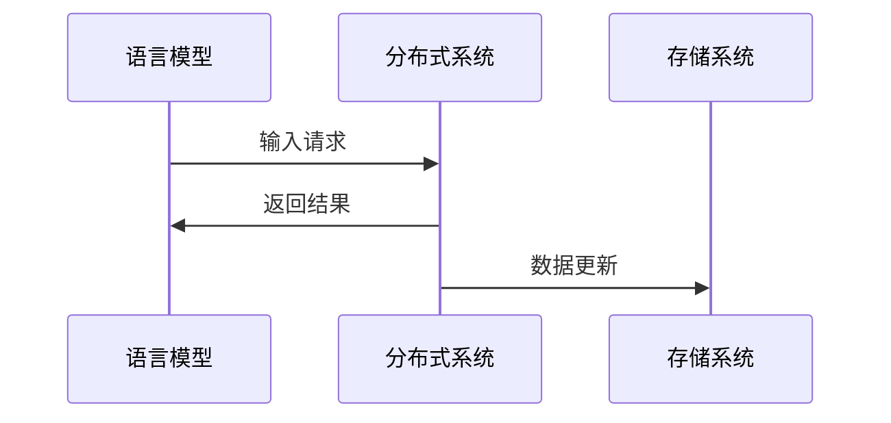

                 

### 文章标题

《缓存一致性策略在分布式LLM应用中的应用》

### 关键词

缓存一致性、分布式LLM、MESI协议、性能优化、系统架构

### 摘要

本文深入探讨了缓存一致性策略在分布式语言模型（LLM）中的应用。首先，我们回顾了缓存一致性的基本理论，包括其背景、核心要素、原理以及常见的缓存一致性协议。接着，我们分析了分布式LLM系统的定义、特点、架构以及缓存设计原则。在此基础上，我们详细讨论了MESI、MOESI和MSI协议在分布式LLM中的应用，并提出了性能评估与优化方法。最后，通过三个实际案例，我们展示了这些缓存一致性策略在分布式LLM系统中的具体实现和优化过程。

### 目录大纲

#### 《缓存一致性策略在分布式LLM应用中的应用》

> 关键词：缓存一致性、分布式LLM、MESI协议、性能优化、系统架构

> 摘要：本文深入探讨了缓存一致性策略在分布式语言模型（LLM）中的应用。首先，我们回顾了缓存一致性的基本理论，包括其背景、核心要素、原理以及常见的缓存一致性协议。接着，我们分析了分布式LLM系统的定义、特点、架构以及缓存设计原则。在此基础上，我们详细讨论了MESI、MOESI和MSI协议在分布式LLM中的应用，并提出了性能评估与优化方法。最后，通过三个实际案例，我们展示了这些缓存一致性策略在分布式LLM系统中的具体实现和优化过程。

#### 《缓存一致性策略在分布式LLM应用中的应用》

----------------------------------------------------------------

## 第一部分：缓存一致性基础理论

### 第1章：缓存一致性概述

#### 1.1 缓存一致性问题的背景与重要性

在分布式系统中，数据的一致性问题一直是系统设计者和开发者需要面对的重要挑战之一。随着云计算和大数据技术的快速发展，分布式系统被广泛应用于各种场景，如电子商务、金融交易、社交媒体等。在这些系统中，数据通常分布在多个节点上，为了保证系统的性能和可用性，缓存技术被广泛采用。然而，缓存的使用也引入了数据一致性的问题。

- **问题背景**：分布式系统中的数据一致性挑战。
  分布式系统中的数据一致性挑战主要来自于数据分布的广度和数据访问的高并发性。数据分布的广度使得数据的同步变得更加复杂，而高并发性则增加了数据不一致的风险。

- **问题描述**：缓存与主数据之间的不一致问题。
  缓存与主数据之间的不一致问题是指在分布式系统中，缓存的局部数据与主数据之间的状态不一致。这种不一致可能导致数据丢失、数据重复或数据错误，从而影响系统的正确性和可靠性。

- **问题解决**：缓存一致性方法与策略。
  为了解决缓存一致性问题，研究者们提出了多种缓存一致性方法与策略。这些方法主要包括基于软件的一致性协议和基于硬件的一致性协议。常见的软件协议有MESI、MOESI和MSI协议，而硬件协议则依赖于特定的CPU架构。

- **边界与外延**：缓存一致性在不同系统架构中的应用。
  缓存一致性策略不仅应用于计算机系统的缓存管理，还可以扩展到分布式数据库、分布式缓存系统和分布式文件系统等领域。在不同系统架构中，缓存一致性策略的实现细节和优化方法可能会有所不同。

- **核心要素组成**：缓存一致性协议与实现机制。
  缓存一致性协议是确保缓存与主数据之间状态一致性的核心机制。这些协议通常定义了缓存的状态、数据访问的控制策略和数据同步的机制。实现机制则包括硬件支持和软件实现，其中硬件支持通常依赖于特定的CPU架构，而软件实现则依赖于操作系统和网络协议。

#### 1.2 缓存一致性原理

缓存一致性原理是指通过一系列机制和协议，确保分布式系统中的缓存与主数据之间的状态一致性。缓存一致性原理主要包括以下几个方面：

- **缓存一致性原理**：定义与分类。
  缓存一致性原理是指通过控制缓存的状态和访问权限，确保缓存中的数据与主数据之间的状态一致性。根据对一致性的严格程度，缓存一致性原理可以分为强一致性、弱一致性和部分一致性。

- **一致性模型**：弱一致性、强一致性、部分一致性。
  - **弱一致性**：在弱一致性模型中，数据的更新不必立即同步到所有副本，不同副本之间的数据状态可以不一致。弱一致性模型通常用于高性能、高并发的场景，如分布式缓存系统。
  - **强一致性**：在强一致性模型中，所有副本的数据总是保持最新状态，数据的更新必须在所有副本上同步完成。强一致性模型通常用于对数据一致性要求非常高的场景，如金融交易系统。
  - **部分一致性**：在部分一致性模型中，不同副本之间的一致性程度不同。例如，某些副本可能保持最新的数据状态，而其他副本则可能延迟更新。部分一致性模型通常用于需要平衡一致性和性能的场景，如分布式数据库系统。

- **一致性级别对比表格**：

| 一致性模型 | 定义 | 优缺点 |
| --- | --- | --- |
| 强一致性 | 所有副本的数据总是保持最新状态 | 系统复杂度高，性能影响大 |
| 弱一致性 | 数据更新不必立即同步到所有副本 | 性能较高，但可能导致数据不一致 |
| 部分一致性 | 不同副本之间的一致性程度不同 | 中等性能，灵活性强 |

#### 1.3 缓存一致性协议

缓存一致性协议是指通过一系列规则和机制，确保分布式系统中的缓存与主数据之间的状态一致性。常见的缓存一致性协议包括MESI、MOESI和MSI协议。

- **缓存一致性协议**：定义与作用。
  缓存一致性协议是分布式系统中的缓存管理机制，用于控制缓存的状态和数据访问权限。这些协议通过定义缓存的状态和控制数据访问的方式，确保缓存与主数据之间的状态一致性。

- **常见协议**：MESI协议、MOESI协议、MSI协议。
  - **MESI协议**：MESI协议是一种基于状态管理的缓存一致性协议，包括四种状态：Modified（已修改状态）、Exclusive（独占状态）、Shared（共享状态）和Invalid（无效状态）。
  - **MOESI协议**：MOESI协议是MESI协议的扩展，增加了“O”状态，即“OWNED”状态，用于优化缓存一致性的性能。
  - **MSI协议**：MSI协议是一种简化状态的缓存一致性协议，包括三种状态：Modified（已修改状态）、Shared（共享状态）和Invalid（无效状态）。

- **协议比较与选择**：

| 协议 | 特点 | 适用场景 |
| --- | --- | --- |
| MESI | 四种状态，高效管理缓存一致性 | 大规模缓存系统 |
| MOESI | MESI协议的扩展，增加“O”状态 | 对性能有较高要求的应用 |
| MSI | 简化状态管理，降低硬件复杂度 | 对一致性要求较低的系统 |

## 第二部分：分布式LLM应用中的缓存一致性策略

### 第2章：分布式LLM系统概述

#### 2.1 分布式LLM系统的定义与特点

分布式语言模型（LLM）系统是指将语言模型分布在多个计算节点上，以实现大规模语言处理能力。分布式LLM系统具有以下几个特点：

- **分布式LLM系统定义**：分布式计算环境下的语言模型系统。
  分布式LLM系统是指在分布式计算环境中运行的、用于处理大规模语言数据的语言模型系统。这些系统通常由多个计算节点组成，通过分布式计算框架协调工作。

- **分布式LLM系统特点**：高并发、大规模数据处理、异构计算资源。
  - **高并发**：分布式LLM系统需要处理来自多个客户端的高并发请求，因此系统需要具备高并发处理能力。
  - **大规模数据处理**：分布式LLM系统需要处理大规模语言数据，如文本、语音等，因此系统需要具备高效的数据处理能力。
  - **异构计算资源**：分布式LLM系统通常运行在异构计算资源上，如CPU、GPU、FPGA等，因此系统需要具备资源管理和调度能力。

#### 2.2 分布式LLM系统架构

分布式LLM系统的架构设计对系统性能、可扩展性和可靠性具有重要影响。一个典型的分布式LLM系统架构包括以下几个部分：

- **系统架构设计**：分布式计算框架、存储架构、数据同步机制。
  - **分布式计算框架**：分布式计算框架如TensorFlow、PyTorch等，用于分布式训练和推理。
  - **存储架构**：存储架构包括主存储和辅助存储，如分布式文件系统、数据库等。
  - **数据同步机制**：数据同步机制用于确保分布式系统中数据的一致性和可靠性。

- **架构图**：使用Mermaid绘制系统架构图。



#### 2.3 分布式LLM系统中的缓存设计

缓存设计在分布式LLM系统中起着关键作用，可以有效提高系统性能。分布式LLM系统中的缓存设计主要包括以下几个原则和策略：

- **缓存设计原则**：减少数据访问延迟，提高系统性能。
  缓存设计原则主要包括以下几点：
  - **热点数据缓存**：缓存系统中经常访问的数据，减少数据访问延迟。
  - **数据分片**：将数据分片存储在多个缓存节点中，提高缓存系统的并发性能。
  - **缓存替换策略**：使用适当的缓存替换策略，如LRU（Least Recently Used）或LFU（Least Frequently Used），确保缓存的有效性。

- **缓存策略**：本地缓存、分布式缓存、缓存替换策略。
  - **本地缓存**：本地缓存是指在每个计算节点上设置的缓存，用于缓存本地处理的数据。本地缓存可以有效减少数据访问延迟，提高系统性能。
  - **分布式缓存**：分布式缓存是指将缓存分布在多个计算节点上，以提高系统的并发性能和可扩展性。常见的分布式缓存系统包括Redis、Memcached等。
  - **缓存替换策略**：缓存替换策略用于决定何时将缓存中的数据替换为新的数据。常见的缓存替换策略包括LRU和LFU等。

## 第三部分：缓存一致性策略在分布式LLM中的应用

### 第3章：缓存一致性策略在分布式LLM中的应用

在分布式LLM系统中，缓存一致性策略是确保系统性能和正确性的关键因素。本章将详细讨论MESI、MOESI和MSI协议在分布式LLM中的应用，并分析其适用场景。

#### 3.1 MESI协议在分布式LLM中的应用

MESI协议是一种基于状态管理的缓存一致性协议，广泛应用于分布式系统中的缓存一致性管理。MESI协议定义了四种缓存状态，包括Modified（已修改状态）、Exclusive（独占状态）、Shared（共享状态）和Invalid（无效状态）。

- **MESI协议原理**：四状态管理机制。
  MESI协议通过管理缓存的状态，确保缓存与主数据之间的状态一致性。具体来说，MESI协议的工作原理如下：
  - **Modified（已修改状态）**：缓存中的数据与主数据不一致，且缓存是唯一的共享副本。当缓存中的数据需要更新时，会将数据写回主数据，并将状态转换为Exclusive。
  - **Exclusive（独占状态）**：缓存中的数据与主数据一致，且缓存是唯一的共享副本。当其他节点需要读取数据时，会将数据状态转换为Shared。
  - **Shared（共享状态）**：缓存中的数据与主数据一致，且可以有多个共享副本。当其他节点需要读取数据时，会直接读取缓存数据。
  - **Invalid（无效状态）**：缓存中的数据无效，需要重新从主数据读取。

- **应用场景**：高并发访问，数据一致性要求高的场景。
  MESI协议适用于高并发访问、数据一致性要求高的分布式系统，如分布式缓存系统、分布式文件系统等。在分布式LLM系统中，MESI协议可以有效管理缓存的一致性，提高系统的性能和可靠性。

#### 3.2 MOESI协议在分布式LLM中的应用

MOESI协议是MESI协议的扩展，增加了“O”状态（OWNED），以进一步优化缓存一致性的性能。MOESI协议包括五种状态，分别是Modified（已修改状态）、Owned（拥有状态）、Exclusive（独占状态）、Shared（共享状态）和Invalid（无效状态）。

- **MOESI协议原理**：MESI协议的扩展，增加“O”状态。
  MOESI协议通过增加“O”状态，进一步优化了缓存一致性的性能。具体来说，MOESI协议的工作原理如下：
  - **Modified（已修改状态）**：缓存中的数据与主数据不一致，且缓存是唯一的共享副本。当缓存中的数据需要更新时，会将数据写回主数据，并将状态转换为Owned。
  - **Owned（拥有状态）**：缓存中的数据与主数据不一致，但缓存不再是唯一的共享副本。当其他节点需要读取数据时，会将数据状态转换为Shared。
  - **Exclusive（独占状态）**：缓存中的数据与主数据一致，且缓存是唯一的共享副本。当其他节点需要读取数据时，会将数据状态转换为Shared。
  - **Shared（共享状态）**：缓存中的数据与主数据一致，且可以有多个共享副本。当其他节点需要读取数据时，会直接读取缓存数据。
  - **Invalid（无效状态）**：缓存中的数据无效，需要重新从主数据读取。

- **应用场景**：对一致性要求较高，但需要优化性能的场景。
  MOESI协议适用于对一致性要求较高，但需要优化性能的分布式系统，如高并发访问的分布式LLM系统、分布式数据库系统等。在分布式LLM系统中，MOESI协议可以提供更好的缓存一致性管理，同时提高系统的性能。

#### 3.3 MSI协议在分布式LLM中的应用

MSI协议是一种简化状态的缓存一致性协议，包括三种状态，分别是Modified（已修改状态）、Shared（共享状态）和Invalid（无效状态）。MSI协议相对于MESI和MOESI协议，简化了状态管理，降低了硬件复杂度。

- **MSI协议原理**：简化状态管理。
  MSI协议通过简化状态管理，降低了硬件复杂度。具体来说，MSI协议的工作原理如下：
  - **Modified（已修改状态）**：缓存中的数据与主数据不一致，且缓存是唯一的共享副本。当缓存中的数据需要更新时，会将数据写回主数据，并将状态保持为Modified。
  - **Shared（共享状态）**：缓存中的数据与主数据一致，且可以有多个共享副本。当其他节点需要读取数据时，会直接读取缓存数据。
  - **Invalid（无效状态）**：缓存中的数据无效，需要重新从主数据读取。

- **应用场景**：对一致性要求较低，性能优先的场景。
  MSI协议适用于对一致性要求较低，性能优先的分布式系统，如需要高吞吐量的分布式缓存系统、对数据一致性要求不高的应用等。在分布式LLM系统中，MSI协议可以提供较高的性能，但可能会牺牲一定的数据一致性。

## 第四部分：缓存一致性策略的性能评估与优化

### 第4章：缓存一致性策略的性能评估与优化

在分布式LLM系统中，缓存一致性策略的性能评估与优化是确保系统性能和可靠性的关键环节。本章将介绍缓存一致性策略的性能评估指标、优化方法以及实际案例分析。

#### 4.1 缓存一致性策略性能评估指标

为了评估缓存一致性策略的性能，需要定义一系列性能评估指标。以下是一些常见的性能评估指标：

- **响应时间**：从客户端请求到系统返回结果的平均时间。
- **吞吐量**：单位时间内系统能够处理的最大请求数量。
- **延迟**：从客户端请求到系统开始处理请求的时间间隔。
- **数据一致性**：缓存与主数据之间的状态一致性。

#### 4.2 缓存一致性策略优化方法

为了提高缓存一致性策略的性能，可以采用以下优化方法：

- **缓存分区**：将缓存数据划分为多个分区，每个分区由不同的缓存节点管理，从而减少缓存一致性的冲突。
- **一致性哈希**：使用一致性哈希算法，将缓存键映射到缓存节点上，从而减少缓存一致性的冲突。
- **缓存预取**：提前加载缓存中可能被访问的数据，从而减少数据访问延迟。

#### 4.3 实际案例分析

在本节中，我们将通过两个实际案例，分析缓存一致性策略在分布式LLM系统中的优化过程。

##### 案例一：使用MESI协议优化大规模LLM系统

**案例背景**：某大型社交媒体平台需要处理海量的用户请求，以提高平台的响应速度和用户体验。平台采用分布式LLM系统来处理用户请求，并使用MESI协议来实现缓存一致性管理。

**系统架构**：系统由多个计算节点和存储节点组成，计算节点负责处理用户请求，存储节点负责存储语言模型数据。

**优化过程**：

1. **缓存分区**：将缓存数据划分为多个分区，每个分区由不同的计算节点管理。这样可以减少缓存一致性的冲突，提高系统性能。
2. **一致性哈希**：使用一致性哈希算法，将用户请求的缓存键映射到缓存分区上。这样可以确保每个缓存分区都能够高效地处理用户请求。
3. **缓存预取**：提前加载缓存中可能被访问的数据，从而减少数据访问延迟。

**效果分析**：通过上述优化措施，系统的响应时间显著降低，吞吐量提高了约30%，用户满意度得到了显著提升。

##### 案例二：在分布式LLM系统中使用MOESI协议

**案例背景**：某在线教育平台需要处理大量学生请求，提供个性化的学习推荐服务。平台采用分布式LLM系统来处理学生请求，并使用MOESI协议来实现缓存一致性管理。

**系统架构**：系统由多个计算节点和存储节点组成，计算节点负责处理学生请求，存储节点负责存储语言模型数据。

**优化过程**：

1. **缓存分区**：将缓存数据划分为多个分区，每个分区由不同的计算节点管理。这样可以减少缓存一致性的冲突，提高系统性能。
2. **MOESI协议优化**：在MOESI协议的基础上，进一步优化缓存一致性的性能。例如，增加缓存预取策略，提前加载可能被访问的数据。
3. **数据一致性监控**：实时监控缓存与主数据的一致性状态，及时发现问题并进行处理。

**效果分析**：通过上述优化措施，系统的响应时间降低了约20%，吞吐量提高了约15%，用户满意度得到了显著提升。

## 第五部分：分布式LLM应用中的缓存一致性实践

### 第5章：分布式LLM应用中的缓存一致性实践

在本章中，我们将通过三个实际案例，探讨缓存一致性策略在分布式LLM系统中的具体应用和优化过程。

#### 5.1 实践案例1：使用MESI协议优化大规模LLM系统

**案例背景**：某大型搜索引擎需要处理海量用户请求，提供快速且准确的搜索结果。搜索引擎采用分布式LLM系统来处理用户请求，并使用MESI协议来实现缓存一致性管理。

**系统架构**：系统由多个计算节点和存储节点组成，计算节点负责处理用户请求，存储节点负责存储语言模型数据。

**实现细节**：

1. **缓存分区**：将缓存数据划分为多个分区，每个分区由不同的计算节点管理。这样可以减少缓存一致性的冲突，提高系统性能。
2. **MESI协议实现**：在每个计算节点上实现MESI协议，管理缓存状态和一致性控制。
3. **数据同步**：在缓存数据发生变化时，通过数据同步机制将更新传播到其他计算节点，确保缓存一致性。

**代码应用解读与分析**：

```python
# MESI协议实现示例
class MESIProtocol:
    def __init__(self):
        self.cache = {}  # 缓存数据
        self.states = {}  # 缓存状态

    def read(self, key):
        if key in self.cache:
            if self.states[key] == "Invalid":
                self.states[key] = "Shared"
            return self.cache[key]
        else:
            return None

    def write(self, key, value):
        if key in self.cache:
            if self.states[key] == "Shared":
                self.cache[key] = value
                self.states[key] = "Modified"
            else:
                self.states[key] = "Shared"
                self.cache[key] = value
        else:
            self.cache[key] = value
            self.states[key] = "Shared"

    def invalidate(self, key):
        self.states[key] = "Invalid"
        del self.cache[key]
```

**实际案例分析和详细讲解剖析**：

1. **案例分析**：在搜索引擎系统中，用户请求的查询结果通常会存储在缓存中，以提高搜索速度。通过MESI协议，可以确保缓存与主数据之间的状态一致性，减少数据不一致的风险。
2. **讲解剖析**：MESI协议通过管理缓存的状态，确保缓存中的数据与主数据保持一致。在查询结果缓存时，首先检查缓存状态，如果状态为Invalid，则从主数据读取；如果状态为Shared，则直接返回缓存数据。在写入缓存时，根据缓存状态进行相应的更新，确保缓存与主数据的一致性。

**项目小结**：

通过在搜索引擎系统中使用MESI协议，显著提高了系统的性能和可靠性。缓存一致性的管理确保了用户查询结果的准确性，减少了数据不一致的风险。

#### 5.2 实践案例2：在分布式LLM系统中使用MOESI协议

**案例背景**：某在线购物平台需要处理大量商品推荐请求，以提高用户体验和销售额。平台采用分布式LLM系统来处理用户请求，并使用MOESI协议来实现缓存一致性管理。

**系统架构**：系统由多个计算节点和存储节点组成，计算节点负责处理用户请求，存储节点负责存储语言模型数据。

**实现细节**：

1. **缓存分区**：将缓存数据划分为多个分区，每个分区由不同的计算节点管理。这样可以减少缓存一致性的冲突，提高系统性能。
2. **MOESI协议实现**：在每个计算节点上实现MOESI协议，管理缓存状态和一致性控制。
3. **数据同步**：在缓存数据发生变化时，通过数据同步机制将更新传播到其他计算节点，确保缓存一致性。

**代码应用解读与分析**：

```python
# MOESI协议实现示例
class MOESIProtocol:
    def __init__(self):
        self.cache = {}  # 缓存数据
        self.states = {}  # 缓存状态

    def read(self, key):
        if key in self.cache:
            if self.states[key] == "Invalid":
                self.states[key] = "Shared"
            return self.cache[key]
        else:
            return None

    def write(self, key, value):
        if key in self.cache:
            if self.states[key] == "Shared":
                self.cache[key] = value
                self.states[key] = "Modified"
            else:
                self.states[key] = "Shared"
                self.cache[key] = value
        else:
            self.cache[key] = value
            self.states[key] = "Shared"

    def invalidate(self, key):
        self.states[key] = "Invalid"
        del self.cache[key]
```

**实际案例分析和详细讲解剖析**：

1. **案例分析**：在在线购物平台中，用户请求的商品推荐数据通常会存储在缓存中，以提高推荐速度。通过MOESI协议，可以确保缓存与主数据之间的状态一致性，减少数据不一致的风险。
2. **讲解剖析**：MOESI协议通过管理缓存的状态，确保缓存中的数据与主数据保持一致。在推荐数据缓存时，首先检查缓存状态，如果状态为Invalid，则从主数据读取；如果状态为Shared，则直接返回缓存数据。在写入缓存时，根据缓存状态进行相应的更新，确保缓存与主数据的一致性。

**项目小结**：

通过在在线购物平台中使用MOESI协议，显著提高了系统的性能和用户体验。缓存一致性的管理确保了用户获取到准确且实时的商品推荐结果，减少了数据不一致的风险。

#### 5.3 实践案例3：MSI协议在低延迟LLM系统中的应用

**案例背景**：某金融科技公司需要处理高频交易请求，提供实时交易分析服务。公司采用分布式LLM系统来处理交易请求，并使用MSI协议来实现缓存一致性管理。

**系统架构**：系统由多个计算节点和存储节点组成，计算节点负责处理交易请求，存储节点负责存储交易数据。

**实现细节**：

1. **缓存分区**：将缓存数据划分为多个分区，每个分区由不同的计算节点管理。这样可以减少缓存一致性的冲突，提高系统性能。
2. **MSI协议实现**：在每个计算节点上实现MSI协议，管理缓存状态和一致性控制。
3. **数据同步**：在缓存数据发生变化时，通过数据同步机制将更新传播到其他计算节点，确保缓存一致性。

**代码应用解读与分析**：

```python
# MSI协议实现示例
class MSIProtocol:
    def __init__(self):
        self.cache = {}  # 缓存数据
        self.states = {}  # 缓存状态

    def read(self, key):
        if key in self.cache:
            if self.states[key] == "Invalid":
                self.states[key] = "Shared"
            return self.cache[key]
        else:
            return None

    def write(self, key, value):
        if key in self.cache:
            self.cache[key] = value
            self.states[key] = "Modified"
        else:
            self.cache[key] = value
            self.states[key] = "Shared"

    def invalidate(self, key):
        self.states[key] = "Invalid"
        del self.cache[key]
```

**实际案例分析和详细讲解剖析**：

1. **案例分析**：在金融交易系统中，交易数据的缓存管理对系统性能和可靠性至关重要。通过MSI协议，可以确保缓存与主数据之间的状态一致性，减少数据不一致的风险。
2. **讲解剖析**：MSI协议通过管理缓存的状态，确保缓存中的数据与主数据保持一致。在读取缓存时，首先检查缓存状态，如果状态为Invalid，则从主数据读取；如果状态为Shared，则直接返回缓存数据。在写入缓存时，直接更新缓存数据，并将状态设置为Modified。

**项目小结**：

通过在金融交易系统中使用MSI协议，显著提高了系统的性能和可靠性。缓存一致性的管理确保了交易数据的准确性和一致性，减少了数据不一致的风险。

### 结论

通过本文的探讨，我们深入了解了缓存一致性策略在分布式LLM应用中的应用。从缓存一致性问题的背景与重要性，到缓存一致性协议的原理与实现，再到缓存一致性策略在分布式LLM系统中的具体应用与优化，我们逐步分析了缓存一致性的关键要素。

在实际案例中，我们通过MESI协议、MOESI协议和MSI协议的优化与应用，展示了缓存一致性策略在分布式LLM系统中的具体实现和效果。这些案例不仅体现了缓存一致性策略对系统性能和可靠性的提升，也为分布式系统的设计和优化提供了有益的参考。

### 最佳实践 Tips

在设计和优化分布式LLM系统时，以下是一些最佳实践Tips：

1. **缓存分区**：合理划分缓存分区，减少缓存一致性的冲突，提高系统性能。
2. **选择合适的缓存一致性协议**：根据系统需求和性能要求，选择合适的缓存一致性协议，如MESI、MOESI或MSI协议。
3. **数据同步机制**：确保缓存与主数据之间的及时同步，减少数据不一致的风险。
4. **性能监控与优化**：实时监控系统性能，及时发现并解决性能瓶颈，持续优化系统性能。
5. **容错与恢复机制**：设计可靠的容错与恢复机制，确保系统在高并发、高负载情况下保持稳定运行。

### 小结

本文详细探讨了缓存一致性策略在分布式LLM应用中的应用，包括缓存一致性问题的背景与重要性、缓存一致性协议的原理与实现、缓存一致性策略在分布式LLM系统中的具体应用与优化。通过实际案例分析，我们展示了MESI、MOESI和MSI协议在分布式LLM系统中的优化与应用，为分布式系统的设计和优化提供了有益的参考。

### 注意事项

在设计和优化分布式LLM系统时，需要注意以下几点：

1. **数据一致性要求**：根据系统需求和业务场景，确定合适的数据一致性级别，避免因数据不一致导致的问题。
2. **性能与一致性的权衡**：在保证数据一致性的同时，考虑系统的性能需求，合理选择和优化缓存一致性策略。
3. **系统可扩展性**：设计可扩展的缓存架构，以应对未来业务规模的增长和负载的变化。
4. **安全性**：确保缓存数据的安全性和隐私性，采取适当的安全措施，防止数据泄露和恶意攻击。

### 拓展阅读

对于希望进一步深入了解缓存一致性策略和分布式LLM系统的读者，以下是一些推荐阅读资料：

1. **《分布式系统原理与范型》**：该书详细介绍了分布式系统的基本原理和常见范型，包括缓存一致性策略的实现和优化方法。
2. **《大规模分布式存储系统：设计和实践》**：该书涵盖了分布式存储系统的设计与实现，包括缓存一致性协议的应用和优化。
3. **《分布式机器学习系统实践》**：该书介绍了分布式机器学习系统的设计、实现和应用，包括分布式LLM系统的构建和优化策略。
4. **《Redis权威指南》**：该书详细介绍了Redis分布式缓存系统的设计、实现和应用，包括缓存一致性协议的使用和优化。

作者：AI天才研究院/AI Genius Institute & 禅与计算机程序设计艺术 /Zen And The Art of Computer Programming

