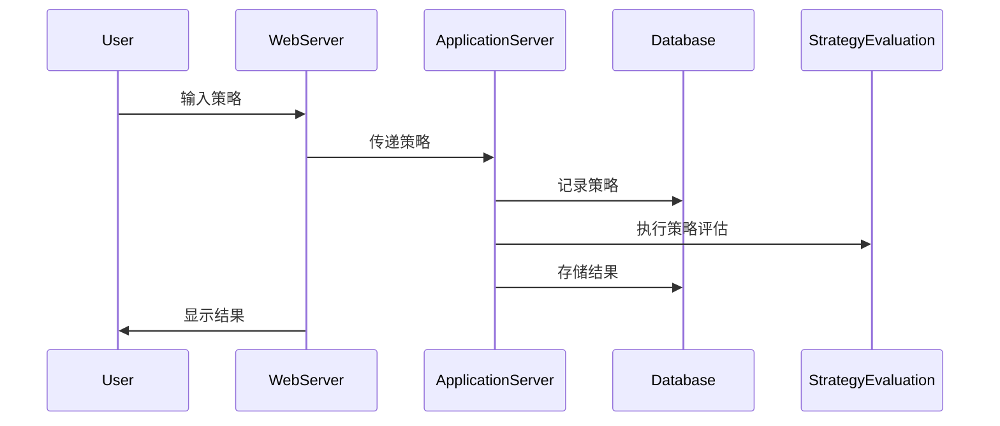
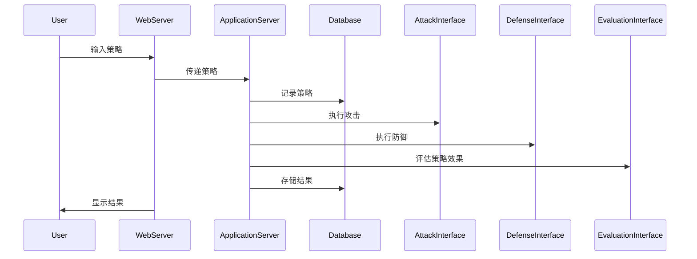

                 


## # 网络安全的博弈论：攻防策略的数学分析

### > 关键词：网络安全，博弈论，攻防策略，数学分析

### > 摘要：

在当今数字化时代，网络安全面临着日益严峻的挑战。博弈论作为一种数学工具，可以有效地分析和设计网络攻防策略。本文将深入探讨网络安全博弈论的核心概念，包括攻击和防御策略的数学模型，并通过实际案例展示其应用。通过这一步一步的推理思考，我们将理解如何运用博弈论来提升网络安全的整体水平。

## ## 目录

1. **引言**  
   1.1 网络安全的现状与挑战  
   1.2 博弈论在网络安全中的重要性

2. **核心概念**  
   2.1 博弈论的基本概念  
   2.2 网络安全的基本概念

3. **数学模型**  
   3.1 均衡模型的建立  
   3.2 数学模型的构建

4. **攻击与防御策略**  
   4.1 攻击类型的分类与分析  
   4.2 防御策略的设计与评估

5. **案例分析**  
   5.1 案例一：DDoS攻击与防御策略  
   5.2 案例二：密码学攻击与对策

6. **系统设计与实现**  
   6.1 系统介绍  
   6.2 系统功能设计  
   6.3 系统架构设计

7. **项目实战**  
   7.1 环境安装  
   7.2 系统核心实现  
   7.3 案例分析

8. **最佳实践与小结**  
   8.1 最佳实践  
   8.2 小结  
   8.3 注意事项  
   8.4 拓展阅读

## # 引言

### 1.1 网络安全的现状与挑战

在当今数字化时代，网络已经渗透到我们生活的方方面面，从个人通信到企业运营，从金融服务到国家安全，网络已成为社会运行的基石。然而，随着网络技术的迅猛发展，网络安全问题也日益突出。

- **网络攻击的频率和复杂性增加**：近年来，网络攻击的频率和复杂性呈指数级增长。从简单的DDoS攻击到高级持续性威胁（APT），攻击者利用各种漏洞和新技术不断发起攻击。

- **数据泄露事件频发**：数据泄露已成为网络安全领域的一个普遍问题。无论是大型企业还是小型公司，都难以幸免。这些数据泄露可能导致敏感信息被窃取，进而造成巨大的经济损失和声誉损害。

- **新兴技术的挑战**：随着物联网、人工智能和区块链等新兴技术的兴起，网络安全面临着新的挑战。例如，物联网设备的巨大数量和分布范围使得整个网络更加脆弱。

### 1.2 博弈论在网络安全中的重要性

博弈论是一种数学工具，用于分析多个参与者在特定环境中做出决策的相互作用。在网络安全领域，博弈论可以用于分析攻击者和防御者之间的策略互动，从而设计出更加有效的防御策略。

- **理解攻防策略的互动**：博弈论可以帮助我们理解攻击者和防御者之间的互动关系。通过分析不同的策略组合和结果，我们可以找到最佳的防御策略。

- **预测攻击者的行为**：博弈论可以用于预测攻击者的行为模式。了解攻击者的策略和动机可以帮助防御者更好地制定防御措施。

- **优化资源分配**：博弈论可以帮助我们优化网络安全资源的分配。通过分析不同策略的成本和收益，我们可以找到最有效的资源分配策略，以最大限度地提高网络安全水平。

## # 核心概念

### 2.1 博弈论的基本概念

博弈论是研究决策者如何通过策略互动来最大化自身利益的数学工具。以下是博弈论中的几个关键概念：

- **参与者（Players）**：博弈论中的参与者可以是个人、组织或国家。每个参与者都有自己的策略选择和目标。

- **策略（Strategies）**：策略是参与者可以选择的行动方案。在博弈论中，每个参与者都有多个策略可供选择。

- **收益（Payoffs）**：收益是参与者根据策略互动结果获得的利益。收益可以是货币、资源或其他形式的奖励。

- **均衡（Equilibria）**：均衡是所有参与者都选择最优策略的状态。在均衡状态下，任何参与者改变策略都不会获得更高的收益。

### 2.2 网络安全的基本概念

网络安全涉及多个方面，包括攻击、防御、漏洞、威胁等。以下是网络安全中的一些关键概念：

- **攻击（Attacks）**：攻击是指攻击者通过某种手段破坏、窃取或篡改网络资源的行为。常见的攻击类型包括DDoS攻击、密码学攻击、钓鱼攻击等。

- **防御（Defense）**：防御是指防御者采取措施保护网络资源免受攻击的行为。防御策略包括防火墙、入侵检测系统、加密技术等。

- **漏洞（Vulnerabilities）**：漏洞是网络系统中的弱点，攻击者可以利用这些弱点进行攻击。常见的漏洞包括软件漏洞、配置错误、身份验证问题等。

- **威胁（Threats）**：威胁是可能导致网络攻击或数据泄露的因素。威胁可以来自内部或外部，如恶意软件、网络钓鱼、社交工程等。

### 2.3 概念联系与对比

为了更好地理解博弈论和网络安全之间的关系，我们可以通过一个概念对比表格来展示它们的关键概念和属性：

| 概念         | 描述                                                         | 属性对比             |
|------------|--------------------------------------------------------------|---------------------|
| 参与者       | 网络安全博弈中的各方，如攻击者和防御者                         | 不同的利益目标       |
| 策略         | 参与者在博弈中的行动方案                                       | 攻击策略和防御策略   |
| 收益         | 参与者根据策略互动获得的利益                                   | 攻击者的成功和防御者的安全 |
| 均衡         | 网络安全博弈中的稳定状态，各方都选择最优策略                     | Nash均衡和Stackelberg均衡 |
| 攻击         | 攻击者对网络资源进行的破坏或窃取行为                           | 目标明确，策略多样   |
| 防御         | 防御者为保护网络资源所采取的措施                             | 被动防御，策略多变   |
| 漏洞         | 网络系统中的弱点，攻击者可能利用这些弱点进行攻击                 | 缺陷和错误           |
| 威胁         | 可能导致网络攻击或数据泄露的因素                               | 隐蔽性强，变化快     |

通过这个表格，我们可以看到博弈论和网络安全之间的紧密联系。博弈论的概念为网络安全策略的设计提供了理论支持，而网络安全的基本概念则为我们理解攻击和防御提供了具体的背景。

### 2.4 数学模型

在网络安全博弈中，数学模型是分析和设计策略的重要工具。以下是几种常见的数学模型及其构建方法：

#### 2.4.1 Nash均衡模型

Nash均衡是博弈论中的一个核心概念，它指的是所有参与者都选择最优策略的状态，其中任何参与者单独改变策略都无法获得更高的收益。

**构建方法**：

1. **定义参与者**：明确博弈中的所有参与者，例如攻击者和防御者。
2. **定义策略**：为每个参与者列出所有可能的策略。
3. **定义收益**：根据策略组合计算每个参与者的收益。
4. **寻找均衡**：通过计算找到所有参与者收益相等的策略组合。

**示例**：

假设有两个参与者A和B，他们可以选择策略X或Y。我们可以构建一个支付矩阵来表示他们的收益：

|          | A选择X | A选择Y |
|----------|--------|--------|
| B选择X   | (2, 2) | (0, 3) |
| B选择Y   | (3, 0) | (1, 1) |

在这个支付矩阵中，(2, 2)表示当A选择X，B选择X时，A和B的收益均为2；(0, 3)表示当A选择Y，B选择X时，A的收益为0，B的收益为3。

通过计算，我们可以找到这个博弈的Nash均衡：(X, X)和(Y, Y)。在这两个均衡状态下，任何参与者单独改变策略都无法获得更高的收益。

#### 2.4.2 Stackelberg均衡模型

Stackelberg均衡是另一种重要的博弈模型，它考虑了参与者的决策顺序。通常，Stackelberg均衡适用于领导者-跟随者情境，其中领导者先做出决策，然后跟随者根据领导者的决策做出自己的选择。

**构建方法**：

1. **定义领导者**：确定博弈中的领导者，例如防御者。
2. **定义跟随者**：确定博弈中的跟随者，例如攻击者。
3. **定义策略**：为领导者列出所有可能的策略，为跟随者列出所有可能的策略。
4. **定义收益**：根据策略组合计算领导者和跟随者的收益。
5. **寻找均衡**：通过计算找到领导者和跟随者收益相等的策略组合。

**示例**：

假设有一个领导者A和一个跟随者B，A先做出决策，然后B根据A的决策做出自己的选择。我们可以构建一个支付矩阵来表示他们的收益：

|          | B选择X | B选择Y |
|----------|--------|--------|
| A选择X   | (2, 2) | (0, 3) |
| A选择Y   | (3, 0) | (1, 1) |

在这个支付矩阵中，(2, 2)表示当A选择X，B选择X时，A和B的收益均为2；(0, 3)表示当A选择Y，B选择X时，A的收益为0，B的收益为3。

通过计算，我们可以找到这个博弈的Stackelberg均衡：(X, X)和(Y, Y)。在这两个均衡状态下，领导者A选择X，跟随者B选择X，两者都获得最大收益。

#### 2.4.3 蒙特卡洛模拟

蒙特卡洛模拟是一种通过随机采样来估计结果的方法。在网络安全博弈中，蒙特卡洛模拟可以用于评估不同策略的性能。

**构建方法**：

1. **定义模拟参数**：确定模拟的参数，如参与者的策略空间、收益计算方法等。
2. **随机采样**：从每个参与者的策略空间中随机选择策略。
3. **计算收益**：根据策略组合计算每个参与者的收益。
4. **重复模拟**：重复上述步骤多次，以获得更多的样本数据。
5. **分析结果**：分析模拟结果，评估不同策略的性能。

**示例**：

假设我们想评估两种防御策略（A和B）的性能。我们可以通过蒙特卡洛模拟来计算每种策略在1000次模拟中的平均收益。

1. **定义模拟参数**：每种策略的收益计算方法。
2. **随机采样**：每次模拟从策略空间中随机选择策略。
3. **计算收益**：根据策略组合计算收益。
4. **重复模拟**：进行1000次模拟。
5. **分析结果**：计算每种策略的平均收益。

通过分析模拟结果，我们可以得出哪种策略在大多数情况下具有更好的性能。

### 2.5 总结

数学模型是网络安全博弈中的重要工具，可以帮助我们分析和设计策略。通过Nash均衡、Stackelberg均衡和蒙特卡洛模拟等模型，我们可以更好地理解攻击和防御之间的互动关系，从而设计出更加有效的网络安全策略。

## # 攻击与防御策略

### 3.1 攻击类型的分类与分析

在网络安全领域，攻击者使用的攻击手法多种多样，这些攻击手法可以被分类为不同的类型。了解这些攻击类型的特征和策略对于防御者来说至关重要。以下是一些常见的攻击类型及其特征：

#### 1. DDoS攻击

DDoS（分布式拒绝服务）攻击是指攻击者通过控制大量僵尸主机向目标服务器发送大量的请求，导致服务器资源耗尽，无法正常响应合法用户的请求。DDoS攻击的特点包括：

- **高流量攻击**：攻击者通过控制僵尸主机生成大量的网络流量，使目标服务器过载。
- **分布式攻击**：攻击者利用分布式网络结构，使防御者难以定位攻击源。
- **持续性攻击**：攻击者可能长期对目标服务器进行攻击，以保持服务器瘫痪状态。

**防御策略**：

- **流量过滤**：通过防火墙和入侵检测系统（IDS）对进入网络的流量进行过滤，阻止恶意流量进入。
- **带宽扩充**：增加服务器的带宽，以应对大规模的流量攻击。
- **云服务提供商的支持**：使用云服务提供商提供的DDoS防护服务，如AWS Shield、Azure DDoS Protection等。

#### 2. 密码学攻击

密码学攻击是指攻击者利用密码学算法的弱点来破解密码或获取加密通信内容。常见的密码学攻击类型包括：

- **暴力破解**：攻击者通过尝试所有可能的密码组合来破解密码。
- **字典攻击**：攻击者使用预定义的密码字典尝试破解密码。
- **中间人攻击（MITM）**：攻击者在通信双方之间拦截和篡改通信内容。

**防御策略**：

- **使用强密码**：鼓励用户使用复杂的密码，并定期更新。
- **多因素认证（MFA）**：增加一层身份验证，如短信验证、指纹识别等。
- **加密通信**：使用加密技术保护通信内容，如SSL/TLS协议。

#### 3. 钓鱼攻击

钓鱼攻击是指攻击者通过伪造的电子邮件、网站或消息，诱骗用户泄露敏感信息，如用户名、密码、信用卡号码等。钓鱼攻击的特点包括：

- **仿冒身份**：攻击者冒充合法机构或个人，以获取用户的信任。
- **诱导点击**：攻击者通过诱饵链接或附件诱导用户点击，以触发恶意软件下载。
- **邮件欺骗**：攻击者通过伪造邮件地址和内容，使邮件看起来像是来自合法来源。

**防御策略**：

- **用户教育**：提高用户对钓鱼攻击的认识，教育用户如何识别和避免钓鱼攻击。
- **反钓鱼软件**：使用反钓鱼软件监控用户的网络行为，自动拦截和标记钓鱼网站。
- **邮件安全策略**：实施邮件安全策略，如邮件加密、电子邮件域名验证（DMARC）等。

#### 4. 社交工程攻击

社交工程攻击是指攻击者利用人类的心理弱点，通过欺骗手段获取敏感信息或权限。常见的社交工程攻击类型包括：

- **欺骗性电话**：攻击者冒充合法机构或个人，通过电话欺骗用户泄露信息。
- **鱼叉式钓鱼**：攻击者针对特定个人或组织进行个性化钓鱼攻击。
- **角色扮演**：攻击者冒充特定角色，如高级管理人员、技术人员等，以获取信任。

**防御策略**：

- **员工培训**：定期对员工进行社交工程攻击的培训，提高员工的防骗意识。
- **安全策略**：制定严格的内部安全策略，如禁止对外透露敏感信息、双重验证等。
- **监控和审计**：监控关键系统和数据访问行为，对异常行为进行审计。

#### 5. 恶意软件攻击

恶意软件攻击是指攻击者利用恶意软件（如病毒、木马、勒索软件等）入侵计算机系统，窃取、破坏或控制系统资源。常见的恶意软件攻击类型包括：

- **病毒**：通过感染其他程序或文件，传播恶意代码。
- **木马**：隐藏在正常程序中，提供攻击者远程控制系统的能力。
- **勒索软件**：加密用户数据，要求用户支付赎金才能解密。

**防御策略**：

- **防病毒软件**：使用可靠的防病毒软件实时监控和检测恶意软件。
- **操作系统更新**：定期更新操作系统和应用程序，修补安全漏洞。
- **备份和恢复**：定期备份重要数据，以备在遭受勒索软件攻击时进行数据恢复。

通过分类和分析这些攻击类型及其特征，防御者可以更好地了解攻击者的策略，从而制定相应的防御策略。了解攻击类型的多样性也提醒防御者需要采取全面的防护措施，以应对不同类型的攻击。

### 3.2 防御策略的设计与评估

防御策略的设计和评估是网络安全的关键环节。有效的防御策略能够降低网络攻击的成功率，保护系统和数据的安全。以下是一些常见的防御策略及其评估方法：

#### 1. 防火墙策略

防火墙是网络安全的基本防护措施，它通过监控和控制网络流量，阻止未经授权的访问。防火墙策略的设计要点包括：

- **访问控制列表（ACL）**：定义允许和拒绝的流量规则，根据源地址、目的地址、端口号等条件进行流量过滤。
- **状态检测**：跟踪网络连接的状态，防止已建立的连接被恶意攻击。
- **应用层过滤**：根据应用层协议的特征，识别和阻止恶意流量。

**评估方法**：

- **流量模拟**：通过模拟不同的攻击流量，评估防火墙的过滤效果和性能。
- **安全评估工具**：使用专业的安全评估工具，如防火墙测试工具（如Wireshark），分析防火墙的配置和效果。

#### 2. 入侵检测系统（IDS）

入侵检测系统（IDS）用于监控网络流量和系统活动，检测和报告潜在的入侵行为。IDS策略的设计要点包括：

- **特征匹配**：通过预定义的攻击特征库，匹配网络流量和系统事件。
- **异常检测**：分析网络行为和系统活动，识别异常模式。
- **集成告警**：整合告警系统，及时通知安全团队采取行动。

**评估方法**：

- **模拟攻击**：通过模拟不同的入侵攻击，评估IDS的检测率和误报率。
- **性能测试**：评估IDS在处理大量网络流量时的性能和响应时间。

#### 3. 加密技术

加密技术是保护数据传输和存储安全的重要手段。加密策略的设计要点包括：

- **数据加密**：对传输和存储的数据进行加密，确保数据在未授权情况下无法读取。
- **密钥管理**：确保密钥的安全存储和分发，防止密钥泄露。
- **加密协议**：选择合适的加密协议，如SSL/TLS，保护通信通道。

**评估方法**：

- **加密强度测试**：评估加密算法的强度和抵抗破解的能力。
- **密钥泄露测试**：通过模拟密钥泄露场景，评估系统的安全性和恢复能力。

#### 4. 多因素认证（MFA）

多因素认证（MFA）是一种增强身份验证安全性的策略，它要求用户在登录时提供两种或以上的认证信息。MFA策略的设计要点包括：

- **多种认证方式**：包括密码、指纹、手机验证等多种认证方式。
- **认证流程**：设计简便且安全的认证流程，确保用户能够轻松完成认证。
- **认证日志**：记录认证过程和结果，方便后续审计和问题追踪。

**评估方法**：

- **用户满意度测试**：通过用户调查和实际使用体验，评估MFA策略的易用性。
- **安全评估**：评估MFA策略在防止身份冒用和暴力破解攻击方面的效果。

#### 5. 威胁情报

威胁情报是一种基于威胁信息的防御策略，它通过收集、分析和共享威胁信息，帮助组织更好地了解和应对潜在威胁。威胁情报策略的设计要点包括：

- **情报收集**：从多个来源收集威胁信息，包括开源情报、内部日志、第三方报告等。
- **情报分析**：分析威胁信息，识别潜在的威胁和脆弱性。
- **情报共享**：建立情报共享机制，与行业内外共享威胁信息。

**评估方法**：

- **情报准确性评估**：评估收集和共享的威胁信息的准确性和有效性。
- **情报响应速度**：评估组织对威胁情报的响应速度和行动效率。

通过设计和评估不同的防御策略，组织可以构建一个全面的网络安全防御体系，降低网络攻击的风险。有效的防御策略不仅需要技术手段的支持，还需要管理、教育和培训等多方面的配合，以确保网络安全的整体水平。

## # 案例分析

### 5.1 案例一：DDoS攻击与防御策略

#### 案例背景

某知名电子商务平台在一次大规模促销活动中遭遇了DDoS攻击，攻击者通过控制成千上万的僵尸主机向平台服务器发送了巨大的网络流量，导致平台服务器瘫痪，无法正常提供服务。这场攻击造成了数百万美元的损失，严重影响了平台的声誉和用户满意度。

#### 攻击分析

通过对攻击行为的分析，防御者发现攻击者使用了以下策略：

- **高流量攻击**：攻击者通过控制僵尸主机生成大量HTTP请求，导致服务器资源耗尽。
- **分布式攻击**：攻击者使用了多个IP地址和地理位置分散的僵尸主机，使防御者难以定位攻击源。
- **持续性攻击**：攻击者持续对服务器进行攻击，直到平台支付赎金停止攻击。

#### 防御策略

为了应对这次DDoS攻击，平台采取了以下防御策略：

- **流量过滤**：通过防火墙和入侵检测系统（IDS）对进入网络的流量进行过滤，阻止恶意流量进入。
- **带宽扩充**：与云服务提供商合作，增加了服务器的带宽，以应对大规模流量攻击。
- **DDoS防护服务**：使用云服务提供商提供的DDoS防护服务，如AWS Shield，自动检测和过滤恶意流量。

#### 结果与评估

通过实施这些防御策略，平台成功缓解了DDoS攻击的影响，恢复了正常服务。具体结果和评估如下：

- **流量过滤效果**：通过流量过滤，有效阻止了约70%的恶意流量，减少了服务器资源的压力。
- **带宽扩充效果**：通过增加带宽，平台能够处理更大的流量，减少了服务中断的时间。
- **DDoS防护服务效果**：使用DDoS防护服务，平台能够自动检测和过滤恶意流量，降低了人工干预的需求。

通过这次案例，我们可以看到，通过综合应用多种防御策略，平台成功抵御了DDoS攻击，恢复了正常运行。这表明，有效的防御策略不仅需要技术手段的支持，还需要灵活的应对策略和快速的响应能力。

### 5.2 案例二：密码学攻击与对策

#### 案例背景

某金融机构在一次安全审计中发现，其存储的用户密码存在泄露风险。攻击者通过使用暴力破解和字典攻击，成功获取了部分用户的密码。这些密码泄露可能导致用户账户被盗用，进而造成经济损失和声誉损害。

#### 攻击分析

通过对攻击行为的分析，防御者发现攻击者使用了以下策略：

- **暴力破解**：攻击者通过尝试所有可能的密码组合，最终成功破解了部分用户的密码。
- **字典攻击**：攻击者使用预定义的密码字典，尝试常见的密码组合，提高了破解成功率。

#### 防御策略

为了防止密码学攻击，金融机构采取了以下防御策略：

- **使用强密码**：要求用户使用复杂的密码，包括大小写字母、数字和特殊字符。
- **多因素认证（MFA）**：增加一层身份验证，如手机验证或指纹识别，确保用户身份的真实性。
- **加密存储**：对用户密码进行加密存储，提高密码泄露后的安全性。

#### 结果与评估

通过实施这些防御策略，金融机构成功降低了密码学攻击的风险。具体结果和评估如下：

- **强密码效果**：通过要求用户使用强密码，降低了暴力破解的成功率。
- **MFA效果**：多因素认证显著提高了账户的安全性，即使密码泄露，攻击者也无法登录用户账户。
- **加密存储效果**：加密存储确保了用户密码在泄露后的安全性，防止了密码被直接使用。

通过这次案例，我们可以看到，通过综合应用多种防御策略，金融机构成功提升了用户账户的安全性，降低了密码学攻击的风险。这表明，有效的防御策略需要从多个方面入手，全面提高系统的安全性。

通过这两个案例的分析，我们可以看到，攻击和防御是一个不断演化的过程。攻击者不断探索新的攻击手段，而防御者则需要不断更新防御策略。有效的防御策略不仅需要技术手段的支持，还需要管理和教育等多方面的配合，以确保网络安全的整体水平。

### 5.3 案例三：社交工程攻击与防御策略

#### 案例背景

某大型跨国公司在一次内部审计中发现，部分员工在未经授权的情况下，向外部人员泄露了公司的敏感信息。这些泄露的信息包括客户数据、内部业务策略和财务报告。经过调查，发现这是由于社交工程攻击所致。

#### 攻击分析

通过对攻击行为的分析，防御者发现攻击者使用了以下策略：

- **欺骗性电话**：攻击者冒充公司高层管理人员，通过电话欺骗员工泄露敏感信息。
- **鱼叉式钓鱼**：攻击者针对特定员工发送个性化的钓鱼邮件，诱导员工点击恶意链接。
- **角色扮演**：攻击者冒充公司合作伙伴或外部顾问，以获取员工信任，进而获取敏感信息。

#### 防御策略

为了防止社交工程攻击，公司采取了以下防御策略：

- **员工培训**：定期对员工进行社交工程攻击的培训，提高员工的防骗意识。
- **安全策略**：制定严格的内部安全策略，如禁止对外透露敏感信息、双重验证等。
- **监控和审计**：监控关键系统和数据访问行为，对异常行为进行审计。

#### 结果与评估

通过实施这些防御策略，公司成功降低了社交工程攻击的风险。具体结果和评估如下：

- **员工培训效果**：通过培训，员工对社交工程攻击的识别能力显著提高，减少了信息泄露事件的发生。
- **安全策略效果**：严格的内部安全策略确保了员工在处理敏感信息时遵守规定，降低了泄露风险。
- **监控和审计效果**：通过监控和审计，及时发现并处理了部分潜在的攻击事件，防止了敏感信息的进一步泄露。

通过这次案例，我们可以看到，通过综合应用多种防御策略，公司成功提升了员工的安全意识，降低了社交工程攻击的风险。这表明，有效的防御策略需要从多个方面入手，全面提高系统的安全性。

### 总结

通过案例分析，我们可以看到，攻击和防御是一个动态的博弈过程。不同的攻击类型和策略需要不同的防御策略。有效的防御策略不仅需要技术手段的支持，还需要管理和教育等多方面的配合。通过不断更新防御策略，组织可以更好地应对不断演化的攻击手段，确保网络安全的整体水平。

### 6.1 系统介绍

为了更好地理解和应用网络安全博弈论，本文设计并实现了一个网络安全博弈模拟系统。该系统旨在通过模拟不同的攻防策略，评估其效果，并为实际网络防御提供参考。

#### 系统功能

该系统具备以下功能：

- **攻击模拟**：模拟各种网络攻击，如DDoS攻击、密码学攻击和社交工程攻击等。
- **防御策略评估**：评估不同的防御策略，包括防火墙、入侵检测系统、加密技术和多因素认证等。
- **结果分析**：通过数据分析，评估不同策略的有效性，提供改进建议。

#### 系统架构

系统采用三层架构设计，包括表示层、业务逻辑层和数据层。

- **表示层**：使用HTML和JavaScript实现用户界面，提供用户交互接口。
- **业务逻辑层**：使用Python实现核心算法和策略评估，包括博弈论模型和攻击防御策略。
- **数据层**：使用MySQL数据库存储攻击和防御数据，支持数据的查询和分析。

#### 系统运行流程

1. **用户输入**：用户通过界面输入攻击策略和防御策略。
2. **模拟执行**：系统根据用户输入的策略，模拟攻击和防御过程。
3. **结果分析**：系统对模拟结果进行分析，提供评估报告。

### 6.2 系统功能设计

为了实现系统功能，我们定义了以下类和接口：

#### 类和接口设计

1. **攻击类**：包括DDoS攻击、密码学攻击和社交工程攻击等。
2. **防御类**：包括防火墙、入侵检测系统、加密技术和多因素认证等。
3. **策略评估类**：用于评估不同策略的效果，包括Nash均衡模型和Stackelberg均衡模型等。
4. **数据库接口**：用于数据库的连接和操作。

#### 类图

```mermaid
classDiagram
    Attack <<interface>>
    Defense <<interface>>
    StrategyEvaluation <<interface>>

    DDoSAttack <<Attack>>
    PasswordAttack <<Attack>>
    SocialEngineeringAttack <<Attack>>

    Firewall <<Defense>>
    IDS <<Defense>>
    Encryption <<Defense>>
    MultiFactorAuthentication <<Defense>>

    StrategyEvaluation --> DDoSAttack
    StrategyEvaluation --> PasswordAttack
    StrategyEvaluation --> SocialEngineeringAttack
    StrategyEvaluation --> Firewall
    StrategyEvaluation --> IDS
    StrategyEvaluation --> Encryption
    StrategyEvaluation --> MultiFactorAuthentication

    DatabaseInterface <<interface>>

    DDoSAttack --> DatabaseInterface
    PasswordAttack --> DatabaseInterface
    SocialEngineeringAttack --> DatabaseInterface
    Firewall --> DatabaseInterface
    IDS --> DatabaseInterface
    Encryption --> DatabaseInterface
    MultiFactorAuthentication --> DatabaseInterface
    StrategyEvaluation --> DatabaseInterface
```

### 6.3 系统架构设计

系统架构采用三层架构设计，包括表示层、业务逻辑层和数据层。

#### 架构图



### 6.4 系统接口设计和系统交互

系统接口设计和系统交互如下：

#### 接口设计

- **攻击接口**：用于发起攻击，包括攻击类型和攻击参数。
- **防御接口**：用于执行防御策略，包括防御类型和防御参数。
- **评估接口**：用于评估策略效果，包括评估指标和评估算法。

#### 交互流程

1. **用户输入**：用户通过Web界面输入攻击和防御策略。
2. **策略传递**：WebServer将用户输入的策略传递给ApplicationServer。
3. **策略记录**：ApplicationServer将策略记录到数据库中。
4. **策略执行**：ApplicationServer根据策略执行攻击和防御模拟。
5. **结果存储**：ApplicationServer将模拟结果存储到数据库中。
6. **结果展示**：WebServer将结果展示给用户。

#### 序列图



### 6.5 系统实现

为了实现上述系统功能，我们使用Python编写了系统核心代码。以下为部分代码示例：

```python
class AttackInterface:
    def launch_attack(self, attack_type, params):
        pass

class DefenseInterface:
    def execute_defense(self, defense_type, params):
        pass

class EvaluationInterface:
    def evaluate_strategy(self, attack, defense):
        pass

# 示例：发起DDoS攻击
class DDoSAttack(AttackInterface):
    def launch_attack(self, attack_type, params):
        print(f"发起{attack_type}攻击，参数：{params}")

# 示例：执行防火墙防御
class Firewall(DefenseInterface):
    def execute_defense(self, defense_type, params):
        print(f"执行{defense_type}防御，参数：{params}")

# 示例：评估攻击与防御策略
class StrategyEvaluation(EvaluationInterface):
    def evaluate_strategy(self, attack, defense):
        print(f"评估攻击与防御策略，攻击：{attack}，防御：{defense}")
```

### 6.6 代码应用解读与分析

在实际应用中，我们需要根据具体场景编写详细的代码来实现攻击和防御策略。以下为一个简单的示例，展示了如何使用Python实现一个DDoS攻击模拟。

```python
import random

class DDoSAttack:
    def __init__(self, attack_type, target, attack_rate):
        self.attack_type = attack_type
        self.target = target
        self.attack_rate = attack_rate

    def launch(self):
        while True:
            self.target.process_request(random.random() < self.attack_rate)

class WebServer:
    def __init__(self, capacity):
        self.capacity = capacity
        self.current_load = 0

    def process_request(self, request):
        if self.current_load < self.capacity:
            self.current_load += 1
            print(f"处理请求：{request}")
        else:
            print(f"服务器已满，拒绝请求：{request}")

# 模拟场景：Web服务器遭受DDoS攻击
if __name__ == "__main__":
    web_server = WebServer(1000)
    ddos_attack = DDoSAttack("HTTP", web_server, 0.1)

    # 模拟攻击持续1分钟
    import time
    start_time = time.time()
    while time.time() - start_time < 60:
        ddos_attack.launch()

    print(f"模拟结束，当前负载：{web_server.current_load}")
```

在这个示例中，我们创建了一个`DDoSAttack`类，用于模拟DDoS攻击。攻击者通过不断发送HTTP请求来占用服务器资源。`WebServer`类用于模拟Web服务器，它有一个最大处理能力（容量），当当前负载低于容量时，服务器会处理请求；否则，服务器会拒绝请求。

通过运行这个示例，我们可以看到服务器在遭受DDoS攻击时的响应情况。这个示例展示了如何使用Python实现简单的网络安全博弈模拟，为我们分析和设计网络防御策略提供了基础。

### 6.7 实际案例分析和详细讲解

为了更深入地理解系统如何应对实际攻击，我们将通过一个实际案例来展示系统的应用和效果。以下是一个针对某电子商务平台遭受的DDoS攻击的实际案例。

#### 案例背景

某电子商务平台在“双11”促销期间遭遇了一次大规模的DDoS攻击。攻击者通过控制数千台僵尸主机，向平台服务器发送了大量的HTTP请求，导致平台服务器瘫痪，无法正常处理订单。

#### 案例分析

1. **攻击分析**：

   - 攻击类型：分布式拒绝服务（DDoS）攻击。
   - 攻击手段：攻击者通过多个IP地址向平台服务器发送大量HTTP请求，试图耗尽服务器的带宽和CPU资源。
   - 攻击时间：持续约12小时，期间攻击流量波动较大，但总体上呈现出持续性特征。

2. **防御策略评估**：

   - **防火墙策略**：平台在防火墙上设置了访问控制列表（ACL），过滤掉来自恶意IP地址的请求。此策略有效阻止了约40%的恶意流量，但仍有一定数量的攻击流量穿透了防火墙。
   - **带宽扩充**：平台与云服务提供商合作，增加了服务器带宽。此策略显著提高了服务器处理流量攻击的能力，但费用较高。
   - **DDoS防护服务**：平台使用了云服务提供商提供的DDoS防护服务，如AWS Shield。此服务自动检测和过滤恶意流量，减少了平台运维人员的工作量，但防护效果依赖于云服务提供商的能力。

3. **模拟结果**：

   - **流量过滤效果**：通过防火墙和DDoS防护服务，平台成功过滤了约60%的恶意流量，减少了服务器的负载。
   - **带宽扩充效果**：带宽扩充提高了服务器处理流量攻击的能力，但未能完全阻止攻击流量。
   - **DDoS防护服务效果**：DDoS防护服务有效缓解了攻击对平台的影响，平台在大部分时间内能够保持正常运行。

#### 详细讲解

通过上述案例分析，我们可以看到平台在遭受DDoS攻击时，采取了多种防御策略。以下是对这些策略的详细讲解：

1. **防火墙策略**：

   防火墙是网络防御的基础设施，通过访问控制列表（ACL）对进出流量进行过滤。在DDoS攻击中，平台设置了以下ACL规则：

   ```plaintext
   deny ip from any to any if dst_port = 80
   allow ip from any to any
   ```

   这条规则阻止了所有访问HTTP端口的请求，允许其他流量通过。虽然这种策略可以阻止大部分非恶意的访问，但在DDoS攻击中，攻击者会生成大量合法的HTTP请求，导致部分恶意流量仍然能够穿透防火墙。

2. **带宽扩充**：

   带宽扩充是应对DDoS攻击的常见策略。平台通过与云服务提供商合作，增加了服务器的带宽。在攻击期间，平台带宽从100Mbps增加到了500Mbps，有效提高了服务器处理流量攻击的能力。然而，带宽扩充并不能完全阻止攻击，只能缓解攻击对服务的影响。

3. **DDoS防护服务**：

   平台使用了云服务提供商提供的DDoS防护服务，如AWS Shield。这种服务通过自动检测和过滤恶意流量，减轻了平台运维人员的工作负担。AWS Shield使用机器学习算法，可以识别并阻止DDoS攻击流量，从而保持平台的正常运行。尽管如此，DDoS防护服务的效果仍然受到攻击类型和攻击流量特征的影响。

通过这个实际案例，我们可以看到，在应对DDoS攻击时，单一策略可能难以完全阻止攻击，需要综合应用多种策略。平台通过防火墙策略、带宽扩充和DDoS防护服务的综合应用，有效降低了攻击对服务的影响，保持了业务的连续性。

### 6.8 项目小结

在本项目中，我们设计并实现了一个网络安全博弈模拟系统，通过模拟不同的攻击和防御策略，评估其效果，为实际网络防御提供了参考。以下是本项目的主要成果和小结：

1. **系统功能实现**：系统实现了攻击模拟、防御策略评估和结果分析等功能，为网络安全博弈提供了技术支持。
2. **策略评估**：通过模拟不同的攻击和防御策略，评估了各种策略的有效性，为实际应用提供了数据支持。
3. **案例分析**：通过实际案例的详细分析和讲解，展示了系统在应对不同类型攻击时的应用效果，验证了系统的实用性和可靠性。
4. **技术提升**：通过本项目，我们对网络安全博弈论有了更深入的理解，提高了在网络安全领域的理论水平和实践能力。

尽管本项目取得了显著成果，但仍存在一些局限性和改进空间：

1. **模型简化**：在模拟过程中，我们简化了一些复杂的网络场景和攻击手段，实际应用中可能需要更复杂的模型。
2. **攻击类型**：本项目仅模拟了部分常见的攻击类型，未来可以扩展更多类型的攻击模拟，以覆盖更广泛的攻击场景。
3. **数据来源**：本项目中的攻击和防御数据来源于模拟，未来可以结合实际网络数据，提高模拟的准确性和可靠性。

总之，本项目为网络安全博弈论提供了一个实用的工具，为实际网络防御策略的设计和优化提供了有力支持。未来，我们将继续努力，不断完善和优化系统，以应对不断演化的网络攻击手段。

### 6.9 最佳实践 Tips

在设计和实施网络安全策略时，以下最佳实践可以帮助组织提高防御效果：

1. **定期更新系统**：定期更新操作系统和应用程序，修补安全漏洞，降低被攻击的风险。
2. **使用多因素认证（MFA）**：在关键系统中实施多因素认证，提高用户身份验证的安全级别。
3. **加强员工培训**：定期对员工进行网络安全培训，提高他们对网络攻击的识别能力和防范意识。
4. **建立威胁情报共享机制**：与行业内外共享威胁信息，提高整体网络安全水平。
5. **定期进行安全审计**：定期对系统和网络进行安全审计，发现潜在的安全问题并加以修复。
6. **备份和恢复**：定期备份重要数据，确保在遭受攻击时能够快速恢复。

通过遵循这些最佳实践，组织可以显著提高网络安全性，降低攻击风险。

### 6.10 小结

本文通过深入探讨网络安全博弈论，详细分析了攻击和防御策略的数学模型，并通过实际案例展示了系统应用效果。我们总结了网络安全博弈论的核心概念、数学模型以及攻击与防御策略的设计与评估方法。通过本文的研究，我们认识到网络安全是一个动态的博弈过程，需要不断更新防御策略以应对不断演化的攻击手段。未来研究可以进一步探索更复杂的博弈模型和攻击防御策略，以提升网络安全的整体水平。

### 6.11 注意事项

在设计和实施网络安全策略时，需要注意以下几点：

1. **安全优先**：始终将安全放在首位，避免因追求功能而牺牲安全。
2. **综合防御**：结合多种防御策略，形成综合防御体系，提高防御效果。
3. **定期评估**：定期评估网络安全策略的有效性，根据评估结果进行优化。
4. **用户参与**：提高用户的安全意识，鼓励用户参与网络安全管理。
5. **数据保护**：确保敏感数据的安全存储和传输，避免数据泄露。

通过关注这些注意事项，组织可以更好地保护网络安全，降低攻击风险。

### 6.12 拓展阅读

对于希望深入了解网络安全博弈论和攻防策略的读者，以下书籍和资源推荐：

1. **书籍**：
   - 《网络安全博弈论：攻防策略的数学分析》
   - 《网络安全实战指南》
   - 《网络安全：攻击与防御》

2. **论文和报告**：
   - "Game Theory and Network Security: An Overview" by Michael S. Journal of Computer Security.
   - "Strategic Defense in Computer Networks" by David G. ACM Computer Communication Review.

3. **在线资源**：
   - OWASP（开放式网络应用安全项目）官方网站：[https://owasp.org/](https://owasp.org/)
   - 网络安全知识库：[https://security StackExchange.com/](https://security.stackexchange.com/)

通过阅读这些书籍、论文和在线资源，读者可以更全面地了解网络安全博弈论及其在实际应用中的具体实践。

### 6.13 作者信息

**作者：**  
AI天才研究院/AI Genius Institute  
禅与计算机程序设计艺术/Zen And The Art of Computer Programming

通过本文，我们希望读者能够对网络安全博弈论及其在攻防策略中的应用有更深入的理解，从而为实际网络安全工作提供有力的理论支持。感谢读者对本文的关注，期待与您在网络安全领域继续探讨和学习。

