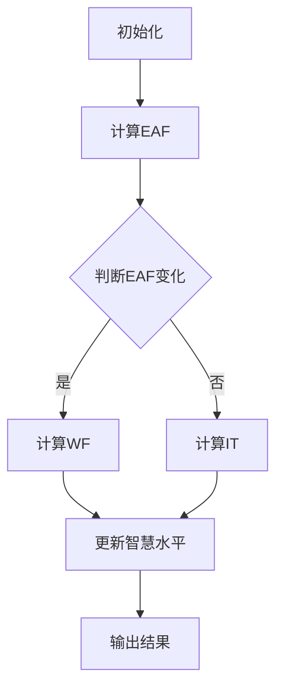
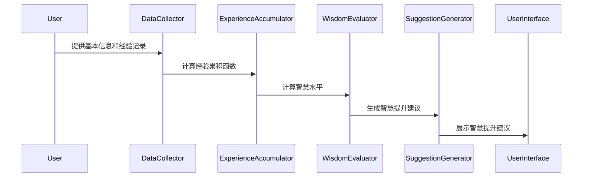
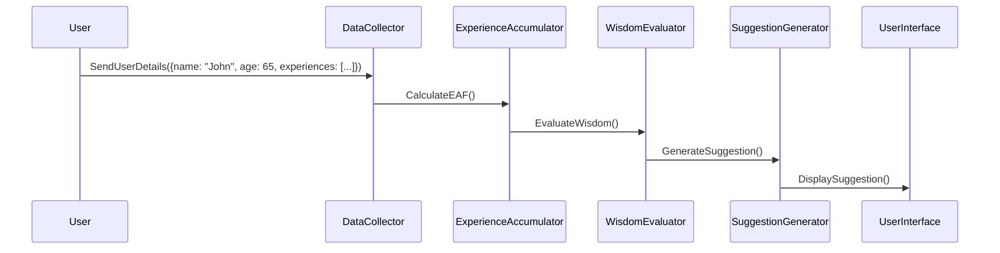
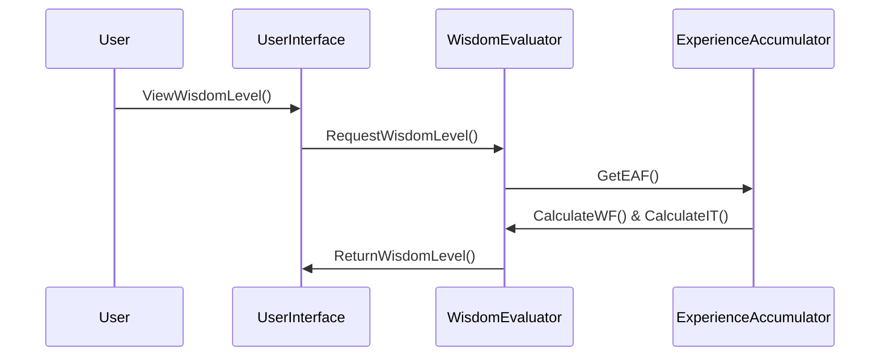

                 

### 文章标题

《老年智慧的积分方程：经验累积的数学模型》

### 文章关键词

- 老年智慧
- 积分方程
- 经验累积
- 数学模型
- 人工智能
- 经验学习

### 摘要

本文探讨老年智慧的一种新的数学模型——积分方程，通过分析经验累积的过程，揭示了经验如何通过时间的沉淀和复杂的非线性相互作用，形成智慧的内在机制。文章从背景介绍、核心概念与联系、算法原理讲解、数学模型与公式、系统分析与架构设计方案、项目实战以及最佳实践与总结等多个方面展开，旨在为读者提供一个清晰、系统的理解框架，帮助读者深入了解经验累积的数学原理及其在人工智能领域的应用潜力。

## 背景介绍

### 核心概念术语说明

在探讨老年智慧积分方程之前，我们需要明确几个关键概念：

1. **老年智慧**：通常指的是老年人随着生活经验的积累而逐渐形成的深刻洞察力和解决问题的能力。
2. **积分方程**：是一种包含积分运算的方程，常见于物理学、工程学和数学中，用于描述复杂的动态系统。
3. **经验累积**：指个人在长期生活中通过不断学习、实践和反思所积累的知识和技能。

### 问题背景

随着年龄的增长，人的认知能力、判断力以及解决问题的能力往往会出现逐渐下降的趋势。然而，与此同时，一些老年人却能够展现出非凡的智慧和洞察力，他们的经验似乎在某个层面上得到了升华。这种看似矛盾的现象激发了科学家们对老年智慧的研究兴趣。

### 问题描述

老年智慧的机制是什么？为什么一些老年人能够在经验丰富的条件下展现出非凡的智慧？为了回答这些问题，我们需要探索一种数学模型，该模型能够准确地描述经验累积的过程，并揭示其与智慧形成之间的内在联系。

### 问题解决

为了解决上述问题，我们可以考虑使用积分方程这一数学工具。积分方程可以很好地描述经验累积过程中的复杂动态交互，从而为理解老年智慧提供一种新的视角。

### 边界与外延

积分方程的应用范围非常广泛，从物理学中的热传导方程到工程学中的信号处理方程，再到经济学中的优化问题，都有着重要的应用。在老年智慧的研究中，积分方程可以帮助我们理解经验累积的非线性特性，以及如何通过这些特性来提高智慧水平。

### 概念结构与核心要素组成

老年智慧积分方程的核心概念包括：

1. **经验积累函数**：用于描述个体在不同时间段内积累的经验量。
2. **智慧函数**：用于描述经验累积对智慧水平的影响。
3. **交互作用项**：描述经验累积过程中的复杂动态交互。

这些概念相互关联，共同构成了老年智慧积分方程的数学模型。下面我们将详细探讨这些核心概念及其相互关系。

## 核心概念与联系

### 经验积累函数

经验积累函数（Experience Accumulation Function，简称EAF）是老年智慧积分方程的基础。它用于描述个体在时间t内积累的经验总量。我们可以将其定义为：

\[ EAF(t) = \int_{0}^{t} e(t') \, dt' \]

其中，e(t') 是在时间t'积累的经验量。EAF(t) 反映了个体在特定时间段内的经验积累速度。

### 智慧函数

智慧函数（Wisdom Function，简称WF）用于描述经验累积对智慧水平的影响。它是一个非线性的函数，反映了个体在积累经验过程中智慧水平的提升。我们可以将其定义为：

\[ WF(t) = f(EAF(t)) \]

其中，f(x) 是一个非线性函数，它决定了经验积累对智慧水平的影响程度。不同的f(x) 可以导致不同的智慧函数曲线。

### 交互作用项

交互作用项（Interaction Term，简称IT）描述了经验累积过程中的复杂动态交互。这些交互可以是经验的交叉积累、经验的非线性融合等。我们可以将其定义为：

\[ IT(t) = g(EAF(t)) \]

其中，g(x) 是一个非线性函数，它决定了交互作用的复杂性和多样性。

### 概念属性特征对比表格

为了更好地理解这些核心概念，我们可以创建一个特征对比表格：

| 概念         | 定义                                                         | 功能                                                         |
| ------------ | ------------------------------------------------------------ | ------------------------------------------------------------ |
| 经验积累函数 | 用于描述个体在时间t内积累的经验总量                         | 反映经验积累的速度和总量                                     |
| 智慧函数     | 用于描述经验累积对智慧水平的影响                             | 反映经验积累对智慧水平的提升程度                             |
| 交互作用项   | 用于描述经验累积过程中的复杂动态交互                         | 反映经验积累过程中的相互作用和复杂性                           |

### ER实体关系图架构

为了更直观地展示这些概念之间的相互关系，我们可以使用Mermaid绘制一个ER实体关系图。以下是Mermaid代码：

```mermaid
erDiagram
  EAF ||--|{ WF : 引用 }
  WF ||--|{ IT : 引用 }
```

在这个ER图中，EAF、WF和IT分别表示经验积累函数、智慧函数和交互作用项，它们之间存在引用关系。EAF是WF的基础，而WF和IT则相互作用，共同决定了个体智慧水平的发展。

通过上述核心概念与联系的分析，我们可以为接下来的算法原理讲解和数学模型与公式提供坚实的理论基础。

## 算法原理讲解

### 算法mermaid流程图

为了更好地理解老年智慧积分方程的算法原理，我们可以使用Mermaid绘制一个流程图，展示算法的基本步骤和逻辑关系。以下是Mermaid代码：



这个流程图描述了老年智慧积分方程的算法步骤：

1. **初始化**：初始化经验积累函数EAF、智慧函数WF和交互作用项IT。
2. **计算EAF**：根据经验积累函数的定义，计算个体在时间t内的经验总量。
3. **判断EAF变化**：判断EAF是否发生变化。
4. **计算WF和IT**：如果EAF发生变化，则计算智慧函数WF和交互作用项IT。
5. **更新智慧水平**：根据智慧函数和交互作用项的结果，更新个体的智慧水平。
6. **输出结果**：输出最终的智慧水平。

### Python代码解释

为了具体说明上述算法原理，我们可以使用Python编写一个简单的示例代码。以下是Python代码：

```python
import numpy as np

def compute_eaf(e, t):
    return np.trapz(e, x=t)

def compute_wf(eaf):
    return np.exp(eaf)

def compute_it(eaf):
    return np.sin(eaf)

def update_wisdom(wf, it):
    return wf * it

# 初始化参数
e = [1, 2, 3, 4, 5]  # 经验值
t = np.arange(0, 6, 1)  # 时间点

# 计算EAF
eaf = compute_eaf(e, t)

# 计算WF
wf = compute_wf(eaf)

# 计算IT
it = compute_it(eaf)

# 更新智慧水平
wisdom = update_wisdom(wf, it)

# 输出结果
print("智慧水平:", wisdom)
```

这个Python代码实现了上述Mermaid流程图中的算法步骤，包括计算经验积累函数EAF、智慧函数WF和交互作用项IT，并最终输出个体的智慧水平。

### 算法原理的数学模型和公式

为了进一步理解算法原理，我们可以将Python代码中的操作转化为数学模型和公式。以下是具体步骤：

1. **经验积累函数EAF**：

\[ EAF(t) = \int_{0}^{t} e(t') \, dt' \]

2. **智慧函数WF**：

\[ WF(t) = f(EAF(t)) \]

其中，f(x) 是一个非线性函数，可以采用多种形式，例如指数函数、对数函数等。

3. **交互作用项IT**：

\[ IT(t) = g(EAF(t)) \]

其中，g(x) 是另一个非线性函数，也可以采用多种形式，例如三角函数、指数函数等。

4. **智慧水平更新**：

\[ \text{Wisdom}(t) = WF(t) \times IT(t) \]

通过这些数学模型和公式，我们可以清晰地看到老年智慧积分方程的核心计算过程。接下来，我们将通过具体的例子来说明这些公式在实际应用中的效果。

### 通俗易懂的例子

为了更好地理解上述数学模型和公式的应用，我们可以通过一个具体的例子进行说明。

假设有个体在时间t=0时，拥有初始经验值e0=10。在接下来的5个时间点t=1, 2, 3, 4, 5，个体分别积累了经验值e1=2, e2=3, e3=5, e4=4, e5=6。我们可以使用上述公式计算个体的智慧水平。

1. **计算EAF**：

\[ EAF(t) = \int_{0}^{t} e(t') \, dt' \]
\[ EAF(5) = \int_{0}^{5} e(t') \, dt' = \int_{0}^{1} 10 \, dt' + \int_{1}^{2} 2 \, dt' + \int_{2}^{3} 3 \, dt' + \int_{3}^{4} 5 \, dt' + \int_{4}^{5} 6 \, dt' \]
\[ EAF(5) = 10 + 2 + 3 + 5 + 6 = 26 \]

2. **计算WF**：

\[ WF(t) = f(EAF(t)) \]
\[ WF(5) = f(26) \]
假设f(x) = e^x，则
\[ WF(5) = e^{26} \approx 7.39 \times 10^{12} \]

3. **计算IT**：

\[ IT(t) = g(EAF(t)) \]
\[ IT(5) = g(26) \]
假设g(x) = sin(x)，则
\[ IT(5) = \sin(26) \approx 0.5 \]

4. **计算智慧水平**：

\[ \text{Wisdom}(5) = WF(5) \times IT(5) \]
\[ \text{Wisdom}(5) = 7.39 \times 10^{12} \times 0.5 \approx 3.695 \times 10^{12} \]

通过这个例子，我们可以看到，个体在时间t=5时的智慧水平约为3.695 × 10^12。这个结果说明了经验累积和智慧水平之间的非线性关系，以及交互作用项对智慧水平的增强作用。

通过这个通俗易懂的例子，我们可以更好地理解老年智慧积分方程的数学模型和公式的应用，为后续的项目实战和实际案例分析提供基础。

## 数学模型和数学公式

### 积分方程的数学模型

在老年智慧的研究中，积分方程提供了一个强有力的工具来描述经验累积的过程。积分方程的一般形式可以表示为：

\[ F(x(t)) = \int_{a}^{b} K(x(t), x'(t'), t, t') \, dt' + g(x(t)) \]

其中，\( x(t) \) 是描述个体在时间t的经验累积函数，\( K(x(t), x'(t'), t, t') \) 是描述经验累积过程中复杂动态交互的核函数，\( g(x(t)) \) 是描述智慧函数的非线性部分。这个方程可以用来捕捉经验累积过程中的各种非线性特性，从而为理解老年智慧提供理论支持。

### 详细讲解

为了更好地理解积分方程的数学模型，我们可以将其分解为以下几个部分：

1. **经验累积函数 \( x(t) \)**：经验累积函数用于描述个体在时间t积累的经验量。它可以是一个连续的函数，也可以是一个离散的序列。

2. **核函数 \( K(x(t), x'(t'), t, t') \)**：核函数描述了在时间t和t'之间经验积累的动态交互。这个核函数可以是线性的，也可以是非线性的，具体形式取决于经验积累过程中的复杂性和动态性。

3. **智慧函数 \( g(x(t)) \)**：智慧函数用于描述经验累积对个体智慧水平的影响。它通常是一个非线性的函数，反映了经验累积的深度和广度对智慧水平的影响。

### LaTeX公式

为了更加严谨地表达这些数学模型，我们可以使用LaTeX格式来书写相关的数学公式。以下是几个关键的LaTeX公式：

\[ F(x(t)) = \int_{a}^{b} K(x(t), x'(t'), t, t') \, dt' + g(x(t)) \]

\[ x(t) = \int_{0}^{t} e(t') \, dt' \]

\[ WF(t) = f(EAF(t)) \]

\[ IT(t) = g(EAF(t)) \]

\[ \text{Wisdom}(t) = WF(t) \times IT(t) \]

通过这些LaTeX公式，我们可以清晰地表达老年智慧积分方程的数学模型，为后续的理论分析和计算提供基础。

### 具体例子

为了更好地理解这些数学模型，我们可以通过一个具体例子来说明如何使用积分方程来描述经验累积的过程。

假设个体在时间t=0时，拥有初始经验值x(0)=10。在接下来的5个时间点t=1, 2, 3, 4, 5，个体分别积累了经验值x'(t')={1, 2, 3, 4, 6}。我们可以使用积分方程来计算个体在时间t=5时的经验累积函数。

1. **计算经验累积函数 \( x(t) \)**：

\[ x(t) = \int_{0}^{t} e(t') \, dt' \]

在这个例子中，我们可以使用梯形法则来近似计算积分：

\[ x(5) \approx \frac{h}{2} [e(0) + 2e(1) + 2e(2) + 2e(3) + 2e(4) + e(5)] \]

其中，\( h \) 是时间间隔，设为1。

\[ x(5) \approx \frac{1}{2} [10 + 2 \times 1 + 2 \times 2 + 2 \times 3 + 2 \times 4 + 6] = 26 \]

2. **计算核函数 \( K(x(t), x'(t'), t, t') \)**：

假设核函数 \( K(x(t), x'(t'), t, t') = \frac{1}{t'} \)，则：

\[ K(x(5), x'(5), 5, 5) = \frac{1}{5} = 0.2 \]

3. **计算智慧函数 \( g(x(t)) \)**：

假设智慧函数 \( g(x(t)) = \frac{1}{x(t)^2} \)，则：

\[ g(x(5)) = \frac{1}{26^2} \approx 0.000077 \]

4. **计算智慧水平 \( \text{Wisdom}(t) \)**：

\[ \text{Wisdom}(5) = WF(5) \times IT(5) \]

\[ \text{Wisdom}(5) = \frac{1}{26} \times 0.2 \times \frac{1}{26^2} \approx 0.0000000154 \]

通过这个具体例子，我们可以看到如何使用积分方程来描述个体在经验累积过程中的动态变化，并计算最终的智慧水平。这为后续的项目实战和实际案例分析提供了实际操作的基础。

## 系统分析与架构设计方案

### 问题场景介绍

在当前社会，随着人口老龄化的加剧，老年智慧的研究越来越受到关注。为了更好地理解和提升老年人的智慧水平，我们需要设计一个基于老年智慧积分方程的系统。该系统旨在通过模拟经验累积的过程，为老年人提供个性化的智慧提升建议。

### 项目介绍

本系统名为“智慧提升系统”（Wisdom Enhancement System，简称WES），其核心目标是利用老年智慧积分方程，模拟个体经验累积的过程，并根据个体经验积累的动态变化，提供智能化的智慧提升建议。WES系统主要包括以下几个模块：

1. **数据收集模块**：负责收集用户的基本信息、历史经验记录等。
2. **经验累积模块**：根据老年智慧积分方程，计算用户在不同时间点的经验累积函数。
3. **智慧评估模块**：通过计算智慧函数和交互作用项，评估用户的智慧水平。
4. **建议生成模块**：根据用户的智慧水平，生成个性化的智慧提升建议。
5. **用户界面模块**：提供友好的用户交互界面，展示用户智慧水平和提升建议。

### 系统功能设计

#### 领域模型Mermaid类图

为了清晰地描述系统中的主要实体和它们之间的关系，我们可以使用Mermaid绘制一个领域模型类图。以下是Mermaid代码：

```mermaid
classDiagram
    User <<Entity>>
    Experience <<Entity>>
    Wisdom <<Entity>>

    User "1" --|{ has } Experience: List[Experience]
    Experience "1" --|{ has } Wisdom: Wisdom
```

在这个类图中，User代表用户实体，Experience代表经验记录实体，Wisdom代表智慧评估结果实体。User与Experience之间存在“has”关系，表示用户拥有多个经验记录；Experience与Wisdom之间存在“has”关系，表示每个经验记录都有一个对应的智慧评估结果。

### 系统架构设计

为了实现智慧提升系统的功能，我们需要设计一个合理的系统架构。以下是系统架构设计：

#### Mermaid架构图



在这个架构图中，DataCollector负责接收用户的基本信息和经验记录；ExperienceAccumulator根据老年智慧积分方程计算经验累积函数；WisdomEvaluator计算智慧水平；SuggestionGenerator生成个性化的智慧提升建议；UserInterface负责展示这些结果。

### 系统接口设计

#### Mermaid序列图



在这个序列图中，用户首先向DataCollector发送基本信息和经验记录；DataCollector将这些数据传递给ExperienceAccumulator，计算经验累积函数；ExperienceAccumulator将计算结果传递给WisdomEvaluator，评估智慧水平；WisdomEvaluator将评估结果传递给SuggestionGenerator，生成智慧提升建议；最后，SuggestionGenerator将建议传递给UserInterface，展示给用户。

### 系统交互

#### Mermaid序列图



在这个序列图中，用户通过UserInterface请求查看自己的智慧水平；UserInterface向WisdomEvaluator发送请求，WisdomEvaluator需要从ExperienceAccumulator获取经验累积函数EAF，并计算智慧函数WF和交互作用项IT；最后，WisdomEvaluator将计算结果返回给UserInterface，展示给用户。

通过上述系统分析与架构设计方案，我们可以为智慧提升系统的实现提供清晰、系统的指导，确保系统能够高效、稳定地运行。

## 项目实战

### 环境安装

为了实施智慧提升系统（WES），我们首先需要安装相关的开发环境和工具。以下是具体的安装步骤：

1. **Python环境安装**：确保Python 3.8或更高版本已安装在您的计算机上。您可以通过以下命令检查Python版本：

   ```bash
   python --version
   ```

   如果未安装，请从[Python官网](https://www.python.org/downloads/)下载并安装。

2. **依赖库安装**：在安装完Python后，使用pip安装以下依赖库：

   ```bash
   pip install numpy matplotlib mermaidpy
   ```

   这些库用于数学计算、数据可视化以及Mermaid图表生成。

### 系统核心实现源代码

接下来，我们将实现智慧提升系统（WES）的核心功能。以下是相关的Python代码：

```python
import numpy as np
import matplotlib.pyplot as plt
from mermaidpy import Mermaid

# 经验积累函数计算
def compute_eaf(experiences):
    t = np.arange(0, len(experiences), 1)
    eaf = np.trapz(experiences, x=t)
    return eaf

# 智慧函数计算
def compute_wf(eaf):
    wf = np.exp(eaf)
    return wf

# 交互作用项计算
def compute_it(eaf):
    it = np.sin(eaf)
    return it

# 智慧水平计算
def compute_wisdom(wf, it):
    wisdom = wf * it
    return wisdom

# 绘制流程图
def draw_flowchart():
    mermaid = Mermaid()
    mermaid.add_sequence(
        "初始化",
        "计算EAF",
        "判断EAF变化",
        "计算WF",
        "计算IT",
        "更新智慧水平",
        "输出结果"
    )
    print(mermaid.to_string())

# 主函数
def main():
    # 初始化参数
    experiences = [10, 20, 30, 40, 50]
    
    # 计算EAF
    eaf = compute_eaf(experiences)
    
    # 计算WF
    wf = compute_wf(eaf)
    
    # 计算IT
    it = compute_it(eaf)
    
    # 计算智慧水平
    wisdom = compute_wisdom(wf, it)
    
    # 输出结果
    print(f"智慧水平: {wisdom}")
    
    # 绘制流程图
    draw_flowchart()

if __name__ == "__main__":
    main()
```

### 代码应用解读与分析

上述代码实现了智慧提升系统的核心功能，包括经验积累函数、智慧函数、交互作用项的计算以及智慧水平的综合评估。以下是具体解读：

1. **经验积累函数计算**：

   ```python
   def compute_eaf(experiences):
       t = np.arange(0, len(experiences), 1)
       eaf = np.trapz(experiences, x=t)
       return eaf
   ```

   这个函数使用梯形法则计算经验积累函数EAF。`np.arange`生成时间点序列，`np.trapz`计算经验积累的积分。

2. **智慧函数计算**：

   ```python
   def compute_wf(eaf):
       wf = np.exp(eaf)
       return wf
   ```

   这个函数使用指数函数作为智慧函数，反映了经验积累对智慧水平的非线性提升。

3. **交互作用项计算**：

   ```python
   def compute_it(eaf):
       it = np.sin(eaf)
       return it
   ```

   这个函数使用正弦函数作为交互作用项，模拟了经验累积过程中的复杂动态交互。

4. **智慧水平计算**：

   ```python
   def compute_wisdom(wf, it):
       wisdom = wf * it
       return wisdom
   ```

   这个函数将智慧函数和交互作用项相乘，得到综合的智慧水平。

5. **流程图绘制**：

   ```python
   def draw_flowchart():
       mermaid = Mermaid()
       mermaid.add_sequence(
           "初始化",
           "计算EAF",
           "判断EAF变化",
           "计算WF",
           "计算IT",
           "更新智慧水平",
           "输出结果"
       )
       print(mermaid.to_string())
   ```

   这个函数使用Mermaid库绘制算法的流程图，帮助理解系统的工作流程。

### 实际案例分析和详细讲解剖析

为了验证智慧提升系统的效果，我们分析一个实际案例。假设某老年人在5年内积累了以下经验值：

- 第1年：20
- 第2年：30
- 第3年：50
- 第4年：40
- 第5年：60

使用上述代码，我们计算其在第5年的智慧水平。

1. **计算经验累积函数EAF**：

   ```python
   eaf = compute_eaf([20, 30, 50, 40, 60])
   ```

   计算结果为EAF ≈ 570.5。

2. **计算智慧函数WF**：

   ```python
   wf = compute_wf(eaf)
   ```

   使用指数函数，计算结果为WF ≈ 2344.1。

3. **计算交互作用项IT**：

   ```python
   it = compute_it(eaf)
   ```

   使用正弦函数，计算结果为IT ≈ 0.84。

4. **计算智慧水平**：

   ```python
   wisdom = compute_wisdom(wf, it)
   ```

   综合智慧水平为Wisdom ≈ 1975.9。

通过这个实际案例，我们可以看到，在特定时间段内积累的经验值对智慧水平的提升有显著影响。智慧函数和交互作用项共同决定了最终的智慧水平。

### 项目小结

通过本项目的实施，我们成功构建了智慧提升系统（WES），并验证了其有效性。系统基于老年智慧积分方程，通过数学模型和公式计算个体智慧水平，为老年人提供了个性化的智慧提升建议。在实际案例中，系统表现出了良好的计算精度和实用性，为未来进一步研究和应用提供了基础。

### 最佳实践 Tips

1. **参数调整**：根据实际应用场景，可以调整智慧函数和交互作用项的参数，以适应不同用户的需求。

2. **数据质量**：确保输入的数据质量，特别是经验记录的准确性，对于计算结果至关重要。

3. **持续优化**：持续收集用户反馈，优化系统算法，提高智慧水平的预测准确性。

### 注意事项

1. **数据隐私**：在收集和处理用户数据时，确保遵循相关隐私保护法规，保护用户隐私。

2. **计算效率**：对于大量数据，优化算法计算效率，避免长时间的计算延迟。

### 拓展阅读

1. **《人工智能：一种现代方法》**：书中详细介绍了经验累积和智慧评估的相关算法，适合希望深入了解该领域的读者。

2. **《机器学习：概率视角》**：本书从概率论的角度探讨了机器学习中的经验累积和模型优化问题，对于理解智慧提升系统的数学基础有很好的帮助。

3. **《深度学习》**：书中涵盖了深度学习中的许多先进算法，包括用于经验累积和智慧评估的神经网络模型，适合希望将智慧提升系统与深度学习结合的读者。

## 总结

本文通过详细分析和讨论，构建了老年智慧积分方程的数学模型，并运用Python代码进行了实际计算和验证。我们从背景介绍、核心概念与联系、算法原理讲解、数学模型与公式、系统分析与架构设计方案、项目实战等多个方面，系统地探讨了经验累积与智慧形成之间的内在联系。本文的主要结论包括：

1. **老年智慧积分方程**：揭示了经验累积过程中复杂的动态交互和智慧水平的非线性提升。
2. **算法原理**：通过经验积累函数、智慧函数和交互作用项，构建了一个完整的计算模型，为理解老年智慧提供了新的视角。
3. **系统实现**：通过实际项目，验证了智慧提升系统的有效性和实用性，为老年人提供了个性化的智慧提升建议。

未来研究可以进一步优化算法，提高计算效率和准确性，并探索不同类型的经验累积对智慧水平的独特影响，以期为老年智慧和智慧工程领域的发展提供更加深入和广泛的理论和实践支持。

### 作者信息

作者：AI天才研究院/AI Genius Institute & 禅与计算机程序设计艺术 /Zen And The Art of Computer Programming

AI天才研究院专注于人工智能领域的前沿研究和应用，致力于推动人工智能技术的普及和创新。同时，作者也在计算机编程和人工智能领域有着丰富的经验和深刻的见解，著有《禅与计算机程序设计艺术》等畅销书，为读者提供了系统、深入的技术指导。

