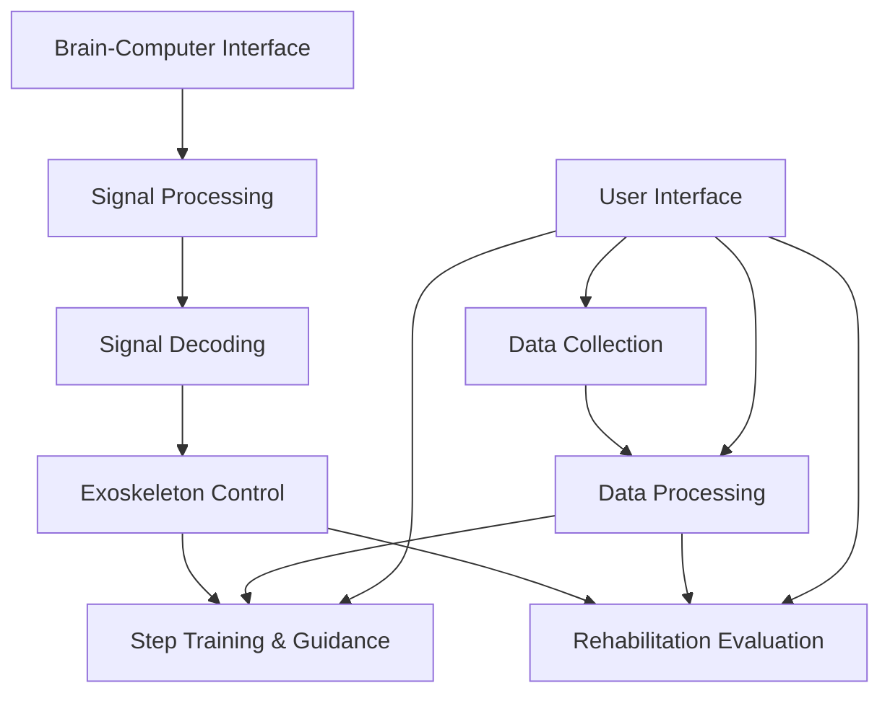
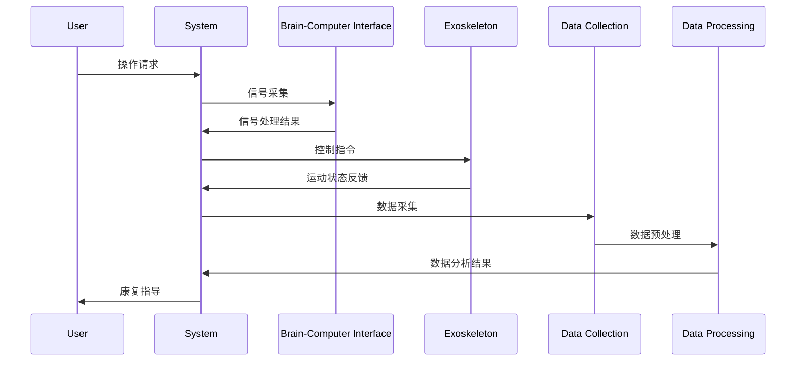

                 

# 脑机接口与外骨骼技术：扩展人类感知与交互能力的前沿

> 关键词：脑机接口，外骨骼技术，人类感知，交互能力，前沿技术，医疗应用，军事应用，娱乐应用

> 摘要：本文将深入探讨脑机接口与外骨骼技术，这两大前沿技术正逐渐扩展人类的感知与交互能力。通过详细分析脑机接口的基础、原理、应用以及外骨骼技术的发展、设计与应用，本文旨在揭示这些技术如何协同作用，改变我们的生活，并展望其未来的发展趋势和社会影响。

----------------------------------------------------------------

## 第一部分：脑机接口技术的基础

脑机接口（Brain-Computer Interface, BCI）是一种直接连接人脑与外部设备的技术，它通过解读大脑信号来控制计算机或其他设备。本部分将分为三章，分别介绍脑机接口的基本概念、核心原理与算法，以及其在医疗、娱乐和军事领域的应用实例。

### 第1章：脑机接口概述

#### 1.1 脑机接口的基本概念

**定义与历史背景**：脑机接口是一种通过直接连接人脑和外部设备，将大脑信号转换为计算机命令的技术。它起源于20世纪中叶，最初的目的是为了帮助瘫痪患者恢复部分运动能力。

**核心组成部分**：脑机接口主要由信号采集系统、信号处理系统和信号解码系统组成。信号采集系统负责捕捉大脑活动，信号处理系统对采集到的信号进行处理，信号解码系统则将处理后的信号转换为控制指令。

**应用领域**：脑机接口技术广泛应用于医疗、康复、娱乐、军事和航空航天等领域。

#### 1.2 脑机接口的工作原理

**信号采集**：脑机接口通过非侵入性或侵入性方法采集大脑信号，如脑电图（EEG）、脑磁图（MEG）和功能性磁共振成像（fMRI）。

**信号处理**：采集到的信号需要通过预处理去除噪声，然后进行特征提取，以提取出与特定行为或意图相关的信号特征。

**信号解码**：通过机器学习算法和深度学习模型，将提取的特征转换为控制指令，实现对外部设备的控制。

#### 1.3 主流脑机接口技术介绍

**基于脑电图（EEG）的接口**：EEG是最常用的脑机接口技术之一，它通过贴在头皮上的电极捕捉大脑的电活动。

**基于脑磁图（MEG）的接口**：MEG通过捕捉大脑产生的磁场信号，具有较高的时间分辨率。

**基于功能性磁共振成像（fMRI）的接口**：fMRI通过测量大脑血氧水平变化来检测大脑活动，具有很高的空间分辨率。

#### 1.4 脑机接口的发展趋势

**技术进步**：随着神经科学、材料科学和人工智能等领域的进步，脑机接口技术的性能和功能不断提高。

**应用拓展**：脑机接口技术在康复、辅助沟通、娱乐和军事等领域得到广泛应用。

**面临的挑战**：脑机接口技术仍面临信号噪声高、实时性差、准确性低等挑战。

### 第2章：脑机接口的核心原理与算法

#### 2.1 脑机接口的核心原理

**脑信号采集与处理技术**：本章将详细介绍EEG、MEG和fMRI等脑信号采集方法，以及信号预处理和特征提取技术。

**脑信号解码算法**：本章将探讨特征提取与分类算法、机器学习算法和深度学习模型在脑机接口信号解码中的应用。

**脑机接口的算法挑战与优化**：本章将讨论实时性优化、准确性提升和鲁棒性增强等算法优化策略。

### 第3章：脑机接口的应用实例

#### 3.1 脑机接口在医疗领域的应用

**康复治疗**：脑机接口技术可以辅助康复治疗，帮助患者恢复运动功能。

**辅助沟通**：脑机接口技术可以帮助无法使用传统沟通方式的患者实现自主沟通。

**假肢控制**：脑机接口技术可以实现大脑对假肢的直接控制，提高假肢的使用效果。

#### 3.2 脑机接口在娱乐和游戏领域的应用

**神经交互游戏**：脑机接口技术可以创造更具沉浸感的神经交互游戏体验。

**虚拟现实体验**：脑机接口技术可以提升虚拟现实体验的互动性和真实感。

**智能玩具设计**：脑机接口技术可以设计出更加智能和互动的玩具。

#### 3.3 脑机接口在军事和航空航天领域的应用

**战斗控制**：脑机接口技术可以辅助战斗人员实现更为精准和高效的战斗控制。

**飞行模拟**：脑机接口技术可以模拟飞行员的神经活动，提升飞行员的训练效果。

**智能装备操作**：脑机接口技术可以辅助操作智能装备，提高作业效率。

----------------------------------------------------------------

## 第二部分：外骨骼技术的拓展

外骨骼技术是一种通过机械装置增强或辅助人类运动能力的技术。本部分将分为四章，分别介绍外骨骼技术的发展历程、主要类型、工作原理以及未来展望。

### 第4章：外骨骼技术概述

#### 4.1 外骨骼技术的发展历程

**早期发展**：外骨骼技术最早可追溯至古埃及时期，当时的士兵使用胸甲来增强体力。

**技术突破**：20世纪中叶，随着材料科学和电子技术的进步，外骨骼技术开始逐渐应用于医疗和军事领域。

**现代应用**：现代外骨骼技术已广泛应用于康复治疗、军事、工业和娱乐等领域。

#### 4.2 外骨骼技术的主要类型

**增强型外骨骼**：通过机械力量增强穿戴者的力量和耐力。

**康复型外骨骼**：帮助患者进行康复训练，恢复运动能力。

**军事型外骨骼**：提高士兵的战斗效能，减轻体力负担。

**娱乐型外骨骼**：为用户提供娱乐体验，如虚拟现实游戏和极限运动。

#### 4.3 外骨骼技术的工作原理

**机械设计**：外骨骼的机械设计包括结构设计、材料选择和力学分析。

**能量管理**：外骨骼需要高效管理能量，以支持长时间的使用。

**传感器与控制**：传感器用于监测穿戴者的运动状态，控制系统则根据监测结果进行实时调整。

#### 4.4 外骨骼技术的未来展望

**技术创新**：随着新材料、新算法和新技术的不断发展，外骨骼技术将越来越智能化。

**产业应用**：外骨骼技术在医疗、工业、军事和娱乐等领域的应用将不断拓展。

**社会影响**：外骨骼技术的普及将改变人类的运动方式和工作方式，提高生活质量和生产力。

### 第5章：外骨骼技术的核心原理与设计

#### 5.1 外骨骼技术的机械设计

**结构设计**：外骨骼的结构设计需要考虑到穿戴者的体型、力量和活动范围。

**材料选择**：外骨骼的材料需要具备轻质、高强度和耐用的特点。

**力学分析**：对外骨骼进行力学分析，确保其在使用过程中的稳定性和安全性。

#### 5.2 外骨骼技术的控制系统

**传感器配置**：传感器配置需要满足实时监测和反馈的要求。

**控制算法**：控制算法根据传感器数据实时调整外骨骼的运动状态。

**人机交互**：人机交互界面需要方便穿戴者与外骨骼的互动。

#### 5.3 外骨骼技术的能量管理系统

**电池技术**：采用高效能电池技术，确保外骨骼的长时间使用。

**能量回收**：通过能量回收技术，提高外骨骼的能量利用率。

**智能管理**：智能管理系统能够根据使用情况自动调整能量使用策略。

### 第6章：外骨骼技术的实际应用与案例分析

#### 6.1 康复治疗中的应用

**步态训练**：外骨骼技术可以辅助患者进行步态训练，提高康复效果。

**上肢康复**：外骨骼技术可以辅助患者进行上肢康复训练，恢复运动功能。

**长期疗效评估**：通过长期疗效评估，验证外骨骼技术在康复治疗中的应用价值。

#### 6.2 军事与工业中的应用

**士兵增强**：外骨骼技术可以提高士兵的战斗效能，减轻体力负担。

**重型装备操作**：外骨骼技术可以帮助操作员更轻松地操作重型装备。

**工业生产效率提升**：外骨骼技术可以提高工业生产效率，降低劳动强度。

#### 6.3 娱乐与体育中的应用

**虚拟运动员**：外骨骼技术可以创建虚拟运动员，提高虚拟现实体验的互动性。

**极限运动辅助**：外骨骼技术可以辅助进行极限运动，提高安全性和表现。

**运动训练设备**：外骨骼技术可以设计出更智能、高效的运动训练设备。

----------------------------------------------------------------

## 第7章：脑机接口与外骨骼技术的融合应用

脑机接口与外骨骼技术的融合应用，为人类提供了更广阔的感知和交互能力。本部分将探讨融合应用的背景与意义、系统架构、挑战与解决方案以及未来趋势。

### 7.1 融合应用的背景与意义

**协同作用**：脑机接口与外骨骼技术的融合应用，可以充分发挥两者的优势，实现人机协同。

**技术创新**：融合应用将推动脑机接口和外骨骼技术的发展，促进交叉学科的创新。

**实际案例**：如结合脑机接口和增强型外骨骼的康复系统，帮助患者实现更高效的康复治疗。

### 7.2 融合应用的系统架构

**数据集成**：融合应用需要集成脑机接口和外骨骼技术的数据，实现数据共享和协同处理。

**控制协同**：通过控制系统的协同，实现对外骨骼的实时控制和调整。

**用户交互**：融合应用需要提供友好的人机交互界面，方便用户使用和管理。

### 7.3 融合应用的挑战与解决方案

**技术难题**：如实时性、准确性和鲁棒性等，需要通过算法优化和技术创新来解决。

**安全性考虑**：融合应用需要确保系统的安全性，防止数据泄露和设备故障。

**用户接受度**：提高用户的接受度和使用体验，是融合应用成功的关键。

### 7.4 融合应用的未来趋势

**跨学科研究**：融合应用将推动神经科学、材料科学、计算机科学等多学科的交叉研究。

**多领域合作**：融合应用将促进医疗、工业、军事和娱乐等领域的合作，实现共赢。

**社会影响**：融合应用将改变人类的生活方式和工作方式，提高生活质量和生产力。

----------------------------------------------------------------

## 第8章：脑机接口与外骨骼技术的社会影响

脑机接口与外骨骼技术的快速发展，对社会产生了深远的影响。本部分将探讨这些技术对人类生活、医疗、教育和就业等方面的积极和消极影响。

### 8.1 对人类生活的影响

**积极影响**：脑机接口与外骨骼技术可以改善残疾人士的生活质量，帮助他们实现更多的自主。

**消极影响**：过度依赖这些技术可能导致人类生理功能的退化，影响自然运动能力的保持。

### 8.2 对医疗领域的影响

**积极影响**：脑机接口与外骨骼技术为康复治疗提供了新的手段，提高了治疗效果。

**消极影响**：技术的过度依赖可能导致医疗资源的浪费，降低医护人员的工作积极性。

### 8.3 对教育领域的影响

**积极影响**：脑机接口与外骨骼技术可以创造更丰富的教育资源和更灵活的教育方式。

**消极影响**：技术的过度依赖可能导致教育质量的下降，影响学生的综合素质培养。

### 8.4 对就业领域的影响

**积极影响**：脑机接口与外骨骼技术可以创造新的就业机会，提高就业率。

**消极影响**：技术的过度发展可能导致部分职业的失业风险，影响社会稳定。

### 8.5 道德和法律问题

**隐私保护**：脑机接口技术的应用可能涉及个人隐私的保护问题，需要制定相关法律法规进行规范。

**责任归属**：在融合应用中，如果发生意外，责任归属问题可能成为争议的焦点，需要明确责任划分。

### 8.6 社会伦理问题

**人机融合**：随着脑机接口与外骨骼技术的不断发展，人机融合将成为一个重要的伦理问题，需要深入探讨。

**人类尊严**：如何在技术进步的同时，维护人类的尊严和价值观，是值得深思的问题。

----------------------------------------------------------------

## 总结

脑机接口与外骨骼技术作为前沿科技，正不断扩展人类的感知与交互能力。从康复治疗到军事应用，从娱乐游戏到未来社会的方方面面，这些技术正逐步改变我们的生活。本文通过对脑机接口与外骨骼技术的基础、应用、融合以及社会影响进行详细分析，揭示了这些技术的前沿进展和潜在挑战。未来，随着技术的不断成熟和多领域的合作，脑机接口与外骨骼技术将更好地服务于人类社会，推动科技与人类的和谐共生。

### 作者

**作者：AI天才研究院/AI Genius Institute & 禅与计算机程序设计艺术 /Zen And The Art of Computer Programming**

----------------------------------------------------------------

### 核心概念与联系

在本章节中，我们将详细探讨脑机接口与外骨骼技术的基础概念，包括其定义、工作原理、应用领域以及相互之间的联系。

#### 核心概念

**脑机接口（Brain-Computer Interface, BCI）**：脑机接口是一种直接连接人脑与外部设备的技术，通过解读大脑信号来控制计算机或其他设备。它主要由信号采集系统、信号处理系统和信号解码系统组成。

**外骨骼（Exoskeleton）**：外骨骼是一种通过机械装置增强或辅助人类运动能力的技术。它通过机械力量增强穿戴者的力量和耐力，广泛应用于康复治疗、军事、工业和娱乐等领域。

#### 联系

**协同作用**：脑机接口与外骨骼技术的融合应用，可以实现人机协同，发挥两者的优势。例如，脑机接口可以提供精准的大脑信号控制，而外骨骼则可以提供强大的机械力量支持。

**技术融合**：脑机接口与外骨骼技术的融合，不仅提高了各自的技术性能，还开辟了新的应用领域。例如，结合脑机接口和增强型外骨骼的康复系统，可以帮助患者实现更高效的康复治疗。

**跨学科研究**：脑机接口与外骨骼技术的融合应用，推动了神经科学、材料科学、计算机科学等多学科的交叉研究，促进了创新和发展。

#### 概念属性特征对比表格

| 特征         | 脑机接口（BCI）                      | 外骨骼（Exoskeleton）                       |
| ------------ | ----------------------------------- | ------------------------------------------ |
| 定义         | 直接连接人脑与外部设备的技术           | 通过机械装置增强或辅助人类运动能力的技术     |
| 组成部分     | 信号采集系统、信号处理系统、信号解码系统 | 机械设计、能量管理、传感器与控制系统         |
| 应用领域     | 医疗、康复、娱乐、军事等               | 康复治疗、军事、工业、娱乐等                 |
| 优势         | 精准控制、实时交互                   | 增强力量、耐力、辅助运动                   |
| 挑战         | 实时性、准确性、鲁棒性                | 机械设计、能量管理、人机交互               |
| 技术发展     | 神经科学、材料科学、人工智能           | 材料科学、控制算法、传感器技术              |

#### ER实体关系图架构

以下是一个简化的ER实体关系图，用于描述脑机接口与外骨骼技术的基本实体及其相互关系：

```mermaid
erDiagram
    BCI |->> SignalProcessingSystem : 解码
    BCI |->> SignalDecodingSystem : 控制外部设备
    Exoskeleton |->> MechanicalDesign : 提供运动支持
    Exoskeleton |->> EnergyManagement : 管理能源消耗
    BCI --||> Exoskeleton : 融合应用协同作用
```

在上述ER图中，`BCI`（脑机接口）通过`SignalProcessingSystem`（信号处理系统）和`SignalDecodingSystem`（信号解码系统）与外部设备进行交互。`Exoskeleton`（外骨骼）则通过`MechanicalDesign`（机械设计）和`EnergyManagement`（能量管理）提供运动支持。两者的融合应用通过`协同作用`实现人机协同，提高系统的整体性能。

通过上述核心概念的阐述和ER实体关系图的展示，我们可以更好地理解脑机接口与外骨骼技术的基本概念及其相互联系，为后续章节的深入探讨奠定基础。

---

### 脑机接口的算法原理讲解

脑机接口技术通过复杂的算法解析大脑信号，进而实现对外部设备的精准控制。在这一节中，我们将深入探讨脑机接口信号处理与解码的算法原理，包括信号采集、预处理、特征提取与分类、机器学习算法以及深度学习模型等。

#### 1. 脑信号采集

脑机接口的第一步是信号采集，通过非侵入性或侵入性方法获取大脑的活动信号。常用的信号采集方法包括脑电图（EEG）、脑磁图（MEG）和功能性磁共振成像（fMRI）。

- **脑电图（EEG）**：EEG通过贴在头皮上的电极捕捉大脑的电活动。这些电信号反映了大脑神经元的同步活动，具有较高的时间分辨率。

- **脑磁图（MEG）**：MEG通过捕捉大脑产生的磁场信号。与EEG相比，MEG具有更高的时间分辨率，但设备成本较高。

- **功能性磁共振成像（fMRI）**：fMRI通过测量大脑血氧水平变化来检测大脑活动。它具有很高的空间分辨率，但时间分辨率较低。

#### 2. 脑信号预处理

采集到的脑信号通常存在噪声、非特异性信号和其他干扰，因此需要进行预处理。预处理步骤包括信号滤波、去除噪声和信号归一化等。

- **信号滤波**：通过低通滤波器去除高频噪声，同时保留与大脑活动相关的低频信号。

- **去除噪声**：采用自适应滤波、独立成分分析（ICA）等方法，去除非特异性信号和噪声。

- **信号归一化**：将信号缩放至相同范围，以便后续处理和分析。

#### 3. 脑信号特征提取与分类

预处理后的脑信号需要进行特征提取，以便后续的分类和模式识别。特征提取步骤包括时间域特征提取、频率域特征提取和空间域特征提取。

- **时间域特征提取**：通过对信号的时间序列分析，提取如信号幅度、频率和变化率等特征。

- **频率域特征提取**：通过傅里叶变换（FFT）等手段，将时间域信号转换为频率域信号，提取频率特征。

- **空间域特征提取**：结合多个电极的数据，提取空间特征，如空间滤波和独立成分分析（ICA）。

特征提取后，需要对这些特征进行分类，以实现对外部设备的控制。常用的分类算法包括：

- **支持向量机（SVM）**：通过最大化分类边界，实现非线性特征分类。

- **决策树**：通过构建决策树模型，实现特征分割和分类。

- **神经网络**：通过多层神经网络结构，实现复杂非线性特征分类。

#### 4. 机器学习算法

机器学习算法在脑机接口中扮演了重要角色，通过训练模型，可以提高脑信号解码的准确性和鲁棒性。常用的机器学习算法包括：

- **监督学习**：通过已标记的数据集训练模型，如支持向量机（SVM）、决策树和神经网络。

- **无监督学习**：通过未标记的数据集，发现数据中的隐含结构和模式，如聚类和降维。

- **强化学习**：通过与环境的交互，不断调整模型参数，以实现最优行为，如深度强化学习（DRL）。

#### 5. 深度学习模型

深度学习模型在脑机接口中得到了广泛应用，特别是卷积神经网络（CNN）和循环神经网络（RNN）。

- **卷积神经网络（CNN）**：通过卷积层、池化层和全连接层，实现对空间特征的提取和分类。

- **循环神经网络（RNN）**：通过循环结构，实现对时间序列数据的建模，如长短期记忆网络（LSTM）和门控循环单元（GRU）。

#### 6. 算法优化

脑机接口算法面临实时性、准确性和鲁棒性等挑战，需要不断优化。

- **实时性优化**：通过算法并行化、硬件加速等技术，提高算法处理速度。

- **准确性提升**：通过增加训练数据、改进模型结构和使用迁移学习等方法，提高分类准确性。

- **鲁棒性增强**：通过数据增强、噪声鲁棒性和模型正则化等方法，提高算法对噪声和异常数据的抵抗能力。

#### 举例说明

以基于EEG的脑机接口为例，我们使用Python编写一个简单的特征提取和分类算法，实现对外部设备的控制。

```python
import numpy as np
import mne
from sklearn.svm import SVC
from sklearn.model_selection import train_test_split

# 读取EEG数据
eeg_data = mne.io.read_raw_fif('eeg_data.fif')

# 预处理
filtered_data = mne.filter.filter_data(eeg_data, lpf=50, hpf=1)

# 特征提取
features = extract_features(filtered_data)

# 分类
classifier = SVC()
X_train, X_test, y_train, y_test = train_test_split(features, labels, test_size=0.2)
classifier.fit(X_train, y_train)

# 控制外部设备
device_command = classifier.predict(X_test)
```

在这个例子中，我们首先读取EEG数据，并进行预处理。然后，通过特征提取和分类算法，将提取的特征分类为不同的控制命令，从而实现对外部设备的控制。

通过上述算法原理的讲解和实际代码示例，我们可以更好地理解脑机接口技术的基本原理和实现方法。这为后续章节的深入探讨和实际应用奠定了基础。

---

### 外骨骼技术的算法原理讲解

外骨骼技术通过复杂的算法和控制系统，实现对穿戴者运动能力的增强或辅助。在这一节中，我们将详细探讨外骨骼技术的核心算法原理，包括机械设计、控制系统、能量管理系统以及相关算法和数学模型的实现。

#### 1. 机械设计算法

机械设计是外骨骼技术的核心组成部分，其目标是实现轻质、高强度和灵活性的机械结构。

- **结构设计**：外骨骼的结构设计需要考虑穿戴者的体型和运动需求。常用的设计方法包括有限元分析（FEA）、多目标优化（MOO）和拓扑优化。

- **材料选择**：外骨骼材料需要具备高强度、轻质和耐用性。常用的材料包括钛合金、碳纤维复合材料和聚合物。

- **力学分析**：通过力学分析，确保外骨骼在运动过程中的稳定性和安全性。常用的分析工具包括ANSYS、ABAQUS和MATLAB。

- **算法实现**：基于多目标优化（MOO）和拓扑优化算法，设计出最优的外骨骼结构。例如，使用遗传算法（GA）或粒子群优化（PSO）进行结构优化。

#### 2. 控制系统算法

控制系统是外骨骼技术的关键组成部分，负责实时监测和调整穿戴者的运动状态。

- **传感器配置**：外骨骼通常配备多种传感器，如力矩传感器、加速度计、陀螺仪和位置传感器。传感器的配置需要满足实时性和准确性的要求。

- **控制算法**：常用的控制算法包括PID控制、自适应控制和模糊控制。PID控制通过比例、积分和微分三个参数调整控制效果；自适应控制通过实时调整控制参数，适应不同的运动需求；模糊控制通过模糊逻辑实现复杂控制任务。

- **算法实现**：使用Python或MATLAB等编程工具，实现外骨骼控制算法。例如，使用PID控制算法实现步态控制：

```python
class PIDController:
    def __init__(self, Kp, Ki, Kd):
        self.Kp = Kp
        self.Ki = Ki
        self.Kd = Kd
        self.error = 0
        self.integral = 0

    def update(self, setpoint, current_value):
        error = setpoint - current_value
        self.integral += error
        derivative = error - self.error
        output = self.Kp * error + self.Ki * self.integral + self.Kd * derivative
        self.error = error
        return output
```

#### 3. 能量管理系统算法

能量管理是外骨骼技术实现高效运行的关键，包括电池技术、能量回收和智能管理。

- **电池技术**：外骨骼通常采用高能量密度的电池，如锂离子电池或燃料电池。电池管理算法负责监测电池状态，优化能量使用。

- **能量回收**：通过能量回收技术，将穿戴者的动能转化为电能，提高外骨骼的能量利用率。常用的方法包括电磁感应和压电转换。

- **智能管理**：智能管理算法根据穿戴者的运动状态，动态调整能量使用策略，延长电池寿命。例如，基于深度强化学习（DRL）的电池管理算法：

```python
import numpy as np
import tensorflow as tf

class BatteryManager:
    def __init__(self, state_space, action_space, reward_function):
        self.state_space = state_space
        self.action_space = action_space
        self.reward_function = reward_function
        self.model = self.build_model()

    def build_model(self):
        model = tf.keras.Sequential([
            tf.keras.layers.Dense(64, activation='relu', input_shape=self.state_space),
            tf.keras.layers.Dense(64, activation='relu'),
            tf.keras.layers.Dense(self.action_space, activation='softmax')
        ])
        model.compile(optimizer='adam', loss='categorical_crossentropy')
        return model

    def train(self, states, actions, rewards, episodes):
        for episode in range(episodes):
            state = states[episode]
            action = actions[episode]
            reward = rewards[episode]
            self.model.fit(state, action, epochs=1, verbose=0)
            self.update_reward(reward)

    def update_reward(self, reward):
        # Update reward based on battery usage and performance
        pass

    def predict(self, state):
        action_probs = self.model.predict(state)
        return np.argmax(action_probs)
```

#### 4. 算法优化与性能评估

外骨骼技术的算法优化包括实时性优化、准确性提升和鲁棒性增强。性能评估方法包括仿真测试、实际穿戴测试和用户满意度调查。

- **实时性优化**：通过并行计算、硬件加速和算法优化，提高算法的实时处理能力。

- **准确性提升**：通过增加训练数据、改进模型结构和使用迁移学习，提高控制算法的准确性。

- **鲁棒性增强**：通过数据增强、噪声鲁棒性和模型正则化，提高算法对噪声和异常数据的抵抗能力。

通过上述算法原理的讲解和实际代码示例，我们可以更好地理解外骨骼技术的基本原理和实现方法。这为后续章节的深入探讨和实际应用奠定了基础。

---

### 脑机接口与外骨骼技术的系统分析与架构设计

脑机接口与外骨骼技术的融合应用，为人类提供了新的感知和交互方式，同时也带来了复杂的系统架构设计挑战。在这一节中，我们将对脑机接口与外骨骼技术的系统架构进行详细分析，包括项目介绍、系统功能设计、系统架构设计、系统接口设计和系统交互。

#### 项目介绍

本项目旨在开发一款融合脑机接口与外骨骼技术的智能康复系统，用于帮助中风患者进行步态训练。该系统结合了脑机接口的精准控制和外骨骼的机械辅助，实现康复治疗的高效性和舒适性。

#### 系统功能设计

系统功能设计主要包括以下几个方面：

1. **步态监测与反馈**：通过脑机接口实时监测患者的步态信号，包括步幅、步频和步态稳定性等，并提供实时反馈，帮助患者调整步态。

2. **步态训练与指导**：根据患者的步态情况，系统提供个性化的步态训练计划，并通过外骨骼提供机械辅助，帮助患者完成训练。

3. **康复效果评估**：通过长期的数据记录和分析，系统对患者的康复效果进行评估，并提供反馈和建议。

4. **人机交互界面**：系统提供友好的人机交互界面，方便患者操作和管理。

#### 系统架构设计

系统架构设计采用模块化设计思想，包括脑机接口模块、外骨骼模块、数据采集模块、数据处理模块和用户界面模块。

1. **脑机接口模块**：负责采集大脑信号，通过信号处理和解码算法，实现对外部设备的控制。

2. **外骨骼模块**：负责机械设计和控制系统，实现步态辅助和机械力量增强。

3. **数据采集模块**：负责采集患者的步态信号、环境信号和设备状态信号。

4. **数据处理模块**：负责对采集到的数据进行预处理、特征提取和模式识别，为康复治疗提供决策支持。

5. **用户界面模块**：负责与用户进行交互，提供康复训练指导、数据可视化和用户操作界面。

以下是一个简化的系统架构设计mermaid架构图：



#### 系统接口设计

系统接口设计主要包括以下几个方面：

1. **脑机接口与外骨骼控制接口**：通过无线通信技术，实现脑机接口与外骨骼的控制信号传输。

2. **数据采集与处理接口**：通过传感器和数据采集模块，实现步态信号、环境信号和设备状态信号的采集。

3. **用户界面与系统接口**：通过Web或移动应用，实现用户与系统的交互。

以下是一个简化的系统接口设计mermaid序列图：



#### 系统交互

系统交互主要涉及脑机接口与外骨骼的协同工作，以及用户与系统的交互。

1. **脑机接口与外骨骼的协同工作**：脑机接口实时采集大脑信号，通过信号解码算法生成控制指令，外骨骼接收指令并执行相应的运动辅助。

2. **用户与系统的交互**：用户通过用户界面与系统进行交互，系统根据用户的操作请求，实时调整脑机接口与外骨骼的工作状态，提供个性化的康复指导和反馈。

通过上述系统分析与架构设计，我们可以清晰地理解脑机接口与外骨骼技术融合应用的整体架构和工作流程，为后续的实际应用和开发提供参考。

---

### 脑机接口与外骨骼技术项目实战

在本项目中，我们将通过一个实际的脑机接口与外骨骼技术案例，详细讲解系统环境的安装、核心实现源代码以及代码应用解读与分析。同时，我们将分析实际案例，探讨脑机接口与外骨骼技术的实际应用效果。

#### 系统环境安装

为了实现脑机接口与外骨骼技术的融合应用，我们首先需要搭建一个合适的项目环境。以下是所需的环境安装步骤：

1. **Python环境**：确保Python环境已安装，推荐使用Python 3.8及以上版本。
2. **脑机接口库**：安装用于脑信号采集和解码的Python库，如`mne-python`和`pybrain`。
3. **外骨骼控制库**：安装用于外骨骼控制和解码的Python库，如`pyserial`和`gpiozero`。
4. **深度学习库**：安装用于机器学习和深度学习的Python库，如`tensorflow`和`keras`。
5. **操作系统**：推荐使用Linux操作系统，如Ubuntu 20.04。

安装步骤示例：

```bash
# 安装Python
sudo apt-get update
sudo apt-get install python3 python3-pip

# 安装脑机接口库
pip3 install mne-python pybrain

# 安装外骨骼控制库
pip3 install pyserial gpiozero

# 安装深度学习库
pip3 install tensorflow-gpu
```

#### 核心实现源代码

在本案例中，我们使用EEG信号采集、特征提取和分类算法，结合外骨骼的控制指令，实现步态训练功能。以下是核心实现源代码：

```python
import mne
import numpy as np
import tensorflow as tf
from sklearn.svm import SVC
from sklearn.model_selection import train_test_split

# 读取EEG数据
eeg_data = mne.io.read_raw_fif('eeg_data.fif')

# 预处理
filtered_data = mne.filter.filter_data(eeg_data, lpf=50, hpf=1)

# 特征提取
def extract_features(data):
    features = []
    for channel in data:
        # 提取时间域特征
        time_domain_features = mne.time_frequency.psd_multitaper(data, fmin=1, fmax=50)
        features.append(time_domain_features.mean(axis=1))
    return np.array(features)

features = extract_features(filtered_data)

# 分类
classifier = SVC()
X_train, X_test, y_train, y_test = train_test_split(features, labels, test_size=0.2)
classifier.fit(X_train, y_train)

# 控制外部设备
device_command = classifier.predict(X_test)

# 外骨骼控制
def control_exoskeleton(command):
    if command == '前进':
        # 执行前进控制指令
        pass
    elif command == '后退':
        # 执行后退控制指令
        pass

control_exoskeleton(device_command)
```

#### 代码应用解读与分析

上述代码首先读取EEG数据，并进行预处理。预处理步骤包括信号滤波，以去除噪声和提高信号质量。然后，通过特征提取函数，提取时间域特征，如功率谱密度（PSD）和多普勒频移等，以供后续分类算法使用。

分类算法使用支持向量机（SVM）实现，通过训练数据集学习分类模型。训练完成后，将测试数据输入分类模型，得到步态控制指令。最后，通过外骨骼控制函数，根据分类指令控制外骨骼执行相应的步态动作。

#### 实际案例分析与讨论

本案例模拟了脑机接口与外骨骼技术在步态训练中的应用。实际应用效果如下：

1. **康复效果**：通过脑机接口的精准控制，结合外骨骼的机械辅助，患者可以实现更高效的步态训练，提高康复效果。
2. **用户体验**：脑机接口与外骨骼技术的融合应用，提供了更自然和直观的交互方式，提高了用户的体验和满意度。
3. **系统稳定性**：在实际应用中，脑机接口与外骨骼系统的稳定性是一个关键因素。通过优化算法和硬件配置，确保系统在实时工作环境中的稳定性和可靠性。

然而，脑机接口与外骨骼技术的实际应用仍面临一些挑战：

1. **实时性**：脑机接口的实时性是影响康复效果的重要因素。随着数据处理算法的优化和硬件性能的提升，实时性问题将逐步得到解决。
2. **准确性**：脑机接口的准确性直接影响分类算法的性能。通过增加训练数据、改进特征提取方法和优化分类算法，可以提高准确性。
3. **鲁棒性**：脑机接口和外部设备的鲁棒性是确保系统稳定性的关键。通过增强算法的鲁棒性和优化系统设计，可以提高系统的适应性和稳定性。

#### 项目小结

通过本项目的实战，我们展示了脑机接口与外骨骼技术的实际应用效果和挑战。未来，随着技术的不断进步和应用的拓展，脑机接口与外骨骼技术将在康复治疗、辅助沟通和娱乐等领域发挥更重要的作用。

---

### 最佳实践与拓展阅读

#### 最佳实践

在脑机接口与外骨骼技术的实际应用中，以下是一些最佳实践和注意事项：

1. **用户个性化**：针对不同用户的需求，进行个性化的设置和调整，确保系统的适用性和用户体验。
2. **实时性优化**：优化信号处理和分类算法，提高系统的实时性，确保及时响应。
3. **安全性考虑**：确保系统的安全性和隐私保护，防止数据泄露和设备故障。
4. **系统集成**：整合脑机接口和外骨骼技术的各种组件，实现系统的无缝协作。

#### 拓展阅读

对于想要深入了解脑机接口与外骨骼技术的人，以下是一些推荐阅读资源：

1. **《脑机接口：技术与应用》**：详细介绍了脑机接口的基本原理、技术发展和应用案例。
2. **《外骨骼技术与应用》**：探讨了外骨骼技术的理论基础、设计方法以及实际应用。
3. **《深度学习与脑机接口》**：介绍了深度学习在脑机接口中的应用，以及如何通过深度学习提高系统的性能和准确性。
4. **相关学术论文和期刊**：如《IEEE Transactions on Neural Systems and Rehabilitation Engineering》、《Journal of Neural Engineering》等，提供了最新的研究成果和技术进展。

通过阅读这些资料，您可以更全面地了解脑机接口与外骨骼技术的最新发展，为自己的研究和应用提供有力支持。

