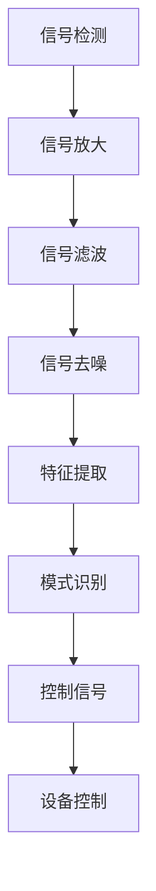
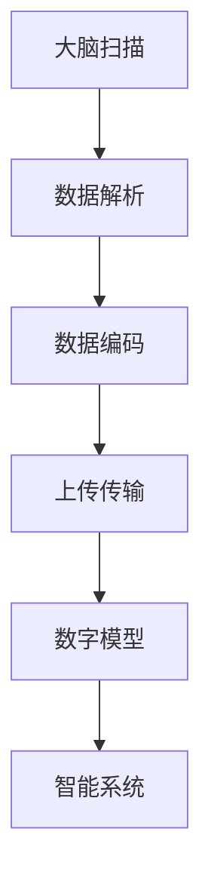

                 

### 摘要

本文深入探讨了脑机接口与意识上传技术，这两个前沿科技领域的创新不仅在理论上挑战了我们对人类认知的理解，也在实际应用中展示了其巨大的潜力。脑机接口（Brain-Computer Interface, BCI）是一种直接在大脑和外部设备之间建立通信链接的技术，通过解读大脑的电信号来控制外部设备，实现人与机器的交互。而意识上传（Mind Uploading）则是将人类意识或思维模式数字化，上传到计算机或其他智能系统中，从而实现意识的复制和转移。本文将首先介绍这两个技术的背景和发展，随后详细讲解其核心概念和原理，探讨其在各个领域的应用场景，分析面临的挑战与机遇，并展望未来技术的趋势。通过本文，读者将能够全面了解脑机接口与意识上传技术如何可能增强和延伸人类理解世界的能力。

### 目录

1. **脑机接口与意识上传技术：探索增强和延伸人类理解世界能力的新领域**
2. **关键词**：脑机接口、意识上传、增强现实、虚拟现实、人工智能、人机交互
3. **摘要**
4. **第一部分：脑机接口与意识上传技术概述**
   1. **1.1 脑机接口与意识上传技术的背景**
      1. **1.1.1 历史发展**
      2. **1.1.2 现状与未来趋势**
   2. **1.2 核心概念**
      1. **1.2.1 脑机接口**
      2. **1.2.2 意识上传**
      3. **1.2.3 两者关系**
   3. **1.3 技术原理**
      1. **1.3.1 脑机接口技术原理**
      2. **1.3.2 意识上传技术原理**
      3. **1.3.3 科学理论基础**
5. **第二部分：脑机接口技术详解**
   1. **2.1 脑机接口核心技术**
      1. **2.1.1 脑信号检测**
      2. **2.1.2 信号处理**
      3. **2.1.3 机器学习算法**
   2. **2.2 脑机接口应用场景**
      1. **2.2.1 医学领域**
      2. **2.2.2 军事领域**
      3. **2.2.3 娱乐领域**
   3. **2.3 脑机接口面临的挑战与机遇**
      1. **2.3.1 挑战分析**
      2. **2.3.2 机遇探讨**
6. **第三部分：意识上传技术详解**
   1. **3.1 意识上传原理**
      1. **3.1.1 意识的本质**
      2. **3.1.2 上传过程**
      3. **3.1.3 科学挑战**
   2. **3.2 意识上传应用场景**
      1. **3.2.1 医学领域**
      2. **3.2.2 军事领域**
      3. **3.2.3 娱乐领域**
   3. **3.3 意识上传面临的挑战与机遇**
      1. **3.3.1 挑战分析**
      2. **3.3.2 机遇探讨**
7. **第四部分：脑机接口与意识上传技术的未来发展趋势**
   1. **4.1 新技术的展望**
      1. **4.1.1 脑脑接口**
      2. **4.1.2 意识融合**
      3. **4.1.3 超级智能**
   2. **4.2 未来应用场景**
      1. **4.2.1 社会变革**
      2. **4.2.2 经济影响**
      3. **4.2.3 伦理问题**
   3. **4.3 总结与展望**
      1. **4.3.1 全书总结**
      2. **4.3.2 未来展望**
8. **参考文献**
9. **作者：AI天才研究院/AI Genius Institute & 禅与计算机程序设计艺术 /Zen And The Art of Computer Programming**

### 第一部分：脑机接口与意识上传技术概述

#### 1.1 脑机接口与意识上传技术的背景

##### 1.1.1 历史发展

脑机接口（BCI）技术的发展可以追溯到20世纪60年代，当时科学家们开始探索如何直接将人类大脑与计算机连接起来，实现思想和意愿的传递。最早的尝试之一是神经电生理学实验，通过在动物大脑中植入电极来记录神经活动。1969年，美国密歇根大学的神经科学家Joseph E. Engelberger提出了“大脑门”概念，这一概念为后来的脑机接口研究奠定了基础。

进入21世纪，随着神经科学、计算机科学和工程技术的快速发展，脑机接口技术取得了显著进展。1999年，美国马里兰大学的研究团队成功开发了一种能够解码大脑活动并控制机械臂的脑机接口系统。2002年，神经科学家Patrick Kanold在猴子身上成功实现了通过脑机接口进行视频游戏控制。

意识上传（Mind Uploading）的概念则源于科幻作品，但近年来在科学界也逐渐引起了关注。意识上传的基本思想是将人类意识或思维模式数字化，上传到计算机或其他智能系统中。这种技术的起源可以追溯到20世纪80年代，计算机科学家兼科幻小说家Vernor Vinge在他的作品《失控》中首次提出了“意识的数字化”这一概念。

##### 1.1.2 现状与未来趋势

目前，脑机接口技术已经取得了多项实际应用。例如，在医学领域，脑机接口技术被用于帮助瘫痪患者恢复运动能力；在军事领域，它被用于增强士兵的感知和反应速度。然而，尽管取得了一定的进展，脑机接口技术仍面临着许多挑战，包括信号噪声比低、信号解码不准确等。

意识上传技术目前仍处于理论研究阶段，尚未实现实际应用。科学家们正在努力解决如何将大脑复杂的信息结构和功能模式精确地数字化和上传的问题。尽管如此，意识上传技术在科幻作品中已被广泛探讨，并被认为有可能带来人类认知能力的巨大提升。

未来，随着神经科学、人工智能和计算机技术的进一步发展，脑机接口和意识上传技术有望取得更大突破。科学家们预计，脑机接口技术将在医疗、教育、娱乐等领域发挥重要作用，而意识上传技术则可能彻底改变我们对人类意识和自我的理解。

#### 1.2 核心概念

##### 1.2.1 脑机接口

脑机接口（Brain-Computer Interface，简称BCI）是一种直接在大脑和外部设备之间建立通信链接的技术。它通过记录和分析大脑产生的电信号，将这些信号转换为控制信号，从而实现大脑对设备的直接控制。脑机接口的基本工作原理包括以下几个步骤：

1. **信号检测**：通过在头皮上安装电极或植入电极，检测大脑产生的电信号。
2. **信号处理**：对检测到的电信号进行放大、滤波、解码等处理，提取有用的信息。
3. **信号解码**：使用机器学习算法或其他解码技术，将处理后的电信号转换为控制信号。
4. **设备控制**：将解码后的控制信号发送到外部设备，实现设备的控制。

脑机接口的核心概念可以概括为“信号检测-信号处理-信号解码-设备控制”四个环节。

##### 1.2.2 意识上传

意识上传（Mind Uploading）是一种将人类意识或思维模式数字化并上传到计算机或其他智能系统的技术。其基本思想是将大脑中复杂的信息结构和功能模式精确地复制和传输到数字环境中。意识上传的基本过程包括以下几个步骤：

1. **大脑扫描**：使用高分辨率成像技术，如功能性磁共振成像（fMRI）或正电子发射断层扫描（PET），获取大脑的详细结构图像。
2. **数据解析**：解析大脑扫描数据，提取神经元的活动模式和信息流。
3. **数据编码**：将提取的神经元活动模式转化为数字编码，形成大脑的数字模型。
4. **上传传输**：将数字编码的大脑模型上传到计算机或其他智能系统中，实现意识的数字化和上传。

意识上传的核心概念可以概括为“大脑扫描-数据解析-数据编码-上传传输”四个步骤。

##### 1.2.3 两者关系

脑机接口和意识上传技术虽然有着不同的目标和应用场景，但它们在技术原理和实现过程中存在紧密的联系。

首先，脑机接口是实现意识上传的必要条件。只有通过脑机接口技术，才能获取大脑的电信号和神经元活动模式，并将其转化为数字信息。

其次，意识上传技术是脑机接口技术的终极目标。意识上传的实现不仅需要脑机接口技术，还需要对大脑信息进行深度解析和编码，从而在数字环境中重建人类意识。

总的来说，脑机接口和意识上传技术相辅相成，共同推动着人类认知能力的前沿探索。

#### 1.3 技术原理

##### 1.3.1 脑机接口技术原理

脑机接口（BCI）技术的基本原理是通过记录和分析大脑产生的电信号，将这些信号转换为控制信号，从而实现大脑对设备的直接控制。以下是脑机接口技术的基本原理和实现步骤：

1. **信号检测**：
脑机接口的第一步是信号检测，即通过电极或植入物捕捉大脑的电信号。这些电极可以放置在头皮上，也可以植入大脑内部。目前常用的电极材料包括银-氯化银（Ag/AgCl）和柔性导电聚合物等。信号检测的关键是确保电极与大脑表面或组织紧密接触，以最大限度地减少噪声和提高信号质量。

2. **信号处理**：
在信号检测之后，需要对捕获到的原始电信号进行放大、滤波和去噪处理。放大器用于增加信号的幅度，以便于后续的信号分析。滤波器用于去除不需要的频率成分，如工频干扰和其他噪声。去噪处理则旨在进一步减少干扰信号，提高信号的质量。

3. **信号解码**：
经过处理后的信号需要通过解码技术将其转换为控制信号。解码技术主要包括特征提取和模式识别。特征提取是指从信号中提取出具有区分性的特征，如时间频率特征、时域特征等。模式识别则是通过分析特征，识别出特定的信号模式，从而实现信号到控制信号的转换。

4. **设备控制**：
解码后的控制信号被发送到外部设备，如机械臂、轮椅、计算机等，以实现大脑对设备的直接控制。这一步骤的关键在于确保控制信号与外部设备的响应之间具有良好的对应关系，以提高控制的准确性和响应速度。

下面是一个简化的脑机接口技术原理图，展示了信号检测、处理、解码和设备控制的流程：

##### 1.3.2 意识上传技术原理

意识上传（Mind Uploading）是将人类意识或思维模式数字化并上传到计算机或其他智能系统的过程。意识上传的实现涉及到多个复杂的技术步骤，以下是其基本原理和流程：

1. **大脑扫描**：
大脑扫描是意识上传的第一步，通过高分辨率成像技术获取大脑的详细结构图像。常用的成像技术包括功能性磁共振成像（fMRI）、正电子发射断层扫描（PET）和单光子发射计算机断层扫描（SPECT）。这些技术能够精确地捕捉大脑活动的时空信息，为后续的数据解析提供了基础。

2. **数据解析**：
大脑扫描得到的数据包含了大量的神经元活动信息，但直接使用这些数据是困难的。因此，需要对扫描数据进行解析，提取出有用的信息。数据解析的关键在于解析神经元的活动模式和信息流，这一过程通常涉及信号处理、图像处理和机器学习技术。通过解析，可以从大量的原始数据中提取出关键的神经元活动特征。

3. **数据编码**：
在提取出神经元活动特征后，需要将这些特征进行编码，形成大脑的数字模型。数据编码的过程包括将神经元活动模式转化为数字信号，并使用合适的编码算法进行压缩和存储。编码的关键是确保数字模型能够精确地表示大脑的功能结构和工作机制。

4. **上传传输**：
将编码后的数字模型上传到计算机或其他智能系统中。这一步骤涉及到数据传输和存储技术，需要确保上传过程的高效和可靠。上传传输后，数字模型可以在计算机系统中进行模拟和操作，实现意识的数字化和上传。

下面是一个简化的意识上传技术原理图，展示了大脑扫描、数据解析、数据编码和上传传输的流程：

#### 1.3.3 科学理论基础

脑机接口和意识上传技术的实现依赖于多个科学理论基础的支撑，包括神经科学、计算机科学、信息论和控制理论等。

1. **神经科学**：
神经科学提供了大脑和神经系统运作的基本原理，包括神经元的工作机制、神经网络的结构和功能等。通过理解神经科学的基本原理，科学家们能够更好地设计脑机接口系统，准确地捕捉和解读大脑的电信号。

2. **计算机科学**：
计算机科学为脑机接口和意识上传技术提供了强大的计算能力和数据处理技术。计算机算法在信号处理、模式识别和数据编码等方面发挥了关键作用，使得复杂的神经信号能够被有效解码和上传。

3. **信息论**：
信息论提供了衡量信息量和传输效率的基本原理，对脑机接口和意识上传技术中的信号处理和编码有重要指导作用。信息论的概念如熵、信息速率等，帮助科学家们优化信号传输过程，提高数据传输效率。

4. **控制理论**：
控制理论研究了如何通过控制输入信号来达到预期输出。在脑机接口技术中，控制理论被用于设计解码算法和控制策略，确保大脑信号能够精确地转化为控制信号，实现对外部设备的有效控制。

综上所述，脑机接口和意识上传技术是多学科交叉的成果，其科学理论基础涵盖了神经科学、计算机科学、信息论和控制理论等多个领域。

### 第二部分：脑机接口技术详解

#### 2.1 脑机接口核心技术

脑机接口（BCI）技术是一种直接在大脑和外部设备之间建立通信链接的技术，通过解码大脑产生的电信号来控制外部设备。以下是脑机接口技术的核心技术和组成部分。

##### 2.1.1 脑信号检测

脑信号检测是脑机接口技术的第一步，也是最重要的一步。它涉及如何准确地捕捉大脑产生的电信号，这些信号通常称为脑电波（Electroencephalography，EEG）。脑电波是由大脑中的神经元活动产生的电信号，可以通过在头皮表面放置电极来检测。

脑信号检测的关键技术包括：

1. **电极材料**：
常用的电极材料包括银-氯化银（Ag/AgCl）和柔性导电聚合物。银-氯化银电极因其良好的导电性和稳定性而被广泛应用，而柔性导电聚合物电极则因其良好的舒适性和可塑性而受到关注。

2. **电极布局**：
电极的布局对信号质量有很大影响。常见的电极布局包括单通道、多通道和密布式电极。单通道电极简单但信号质量较低，多通道电极可以提供更高的信号质量，而密布式电极则可以捕捉到更精细的信号。

3. **信号放大**：
脑电波信号非常微弱，通常只有微伏级，因此需要信号放大器来增强信号的幅度。放大器通常具有高增益和低噪声特性，以确保信号的完整性。

4. **信号滤波**：
脑电波信号中包含多种频率成分，包括直流成分、低频成分和高频成分。为了提取有用的信号，需要使用滤波器去除不需要的频率成分。常见的滤波器包括高通滤波器、低通滤波器和带通滤波器。

##### 2.1.2 信号处理

脑信号检测后，需要进行信号处理，以提高信号质量，去除噪声，提取有用的信息。信号处理包括以下几个关键步骤：

1. **去噪**：
脑电波信号通常受到多种噪声的干扰，如肌电噪声、电磁干扰和工频干扰等。去噪技术包括带通滤波、独立成分分析（ICA）和自适应滤波等。

2. **特征提取**：
特征提取是从原始信号中提取出具有区分性的特征，以便于后续的信号解码。常用的特征提取方法包括时域特征（如平均绝对值、峰值幅度等）、频域特征（如功率谱、频带能量等）和时频特征（如短时傅里叶变换、小波变换等）。

3. **信号重构**：
信号重构是将处理后的信号重构为原始信号或近似原始信号的波形。重构技术包括逆滤波、逆小波变换和逆短时傅里叶变换等。

##### 2.1.3 机器学习算法

机器学习算法在脑机接口技术中起着至关重要的作用，用于解码和处理脑电信号。以下是一些常用的机器学习算法：

1. **支持向量机（SVM）**：
支持向量机是一种强大的分类算法，广泛应用于脑电信号的解码。通过找到一个最优的超平面，将不同的脑电信号模式分类。

2. **深度学习**：
深度学习是一种基于多层神经网络的学习方法，特别适合处理大规模的复杂数据。在脑机接口中，常用的深度学习模型包括卷积神经网络（CNN）、循环神经网络（RNN）和长短期记忆网络（LSTM）等。

3. **递归神经网络（RNN）**：
递归神经网络是一种用于处理序列数据的神经网络，特别适合于捕捉脑电信号的时间动态特性。RNN包括简单的RNN、LSTM和门控循环单元（GRU）等变体。

4. **强化学习**：
强化学习是一种通过试错来学习的算法，特别适合于动态环境中的控制问题。在脑机接口中，强化学习可以用于自适应调整解码参数，以优化信号解码性能。

通过这些核心技术，脑机接口技术能够实现大脑对设备的直接控制，为人类提供了新的交互方式和增强感知能力。

#### 2.2 脑机接口应用场景

脑机接口（BCI）技术在多个领域展现出巨大的潜力，其应用场景包括但不限于医学、军事和娱乐等领域。以下是脑机接口在这些领域中的具体应用和案例：

##### 2.2.1 医学领域

在医学领域，脑机接口技术被广泛应用于帮助瘫痪患者恢复运动能力、提高生活质量以及治疗神经疾病。

1. **瘫痪患者恢复运动能力**：
脑机接口技术通过解码患者大脑的电信号，将其转换为控制信号，帮助瘫痪患者操作假肢、轮椅或其他辅助设备。一个典型的案例是美国工程师和活动家泰德·劳伦斯（Teddy制杖），他通过脑机接口技术控制了一台假肢手臂，实现了拿起物体和自我喂食等日常活动。

2. **神经疾病治疗**：
脑机接口技术也被用于治疗帕金森病、癫痫和脑卒中等神经疾病。例如，通过植入电极直接刺激大脑特定区域，可以减轻帕金森病患者的运动障碍。美国的一家公司NeuroPace开发了世界上第一个获得FDA批准的用于治疗难治性癫痫的脑机接口系统。

3. **认知功能康复**：
脑机接口技术还可以帮助认知功能受损的患者进行康复训练。例如，通过脑机接口游戏，患者可以在娱乐中锻炼大脑功能，改善记忆和注意力。

##### 2.2.2 军事领域

在军事领域，脑机接口技术被用于增强士兵的感知和反应速度，提高战斗力。

1. **增强感知能力**：
脑机接口技术可以通过直接读取大脑信号，帮助士兵实时监测自己的生理状态，如心率、血压和应激水平。这些信息可以帮助指挥官做出更快的决策，提高整体战斗效能。

2. **增强反应速度**：
脑机接口技术可以用于提高士兵的反应速度和准确性。例如，通过解码大脑的电信号，士兵可以更迅速地操作武器和电子设备，从而在紧急情况下做出更快、更准确的反应。

3. **虚拟训练**：
脑机接口技术还可以用于虚拟训练系统，通过模拟战斗场景和情境，帮助士兵在虚拟环境中进行战斗技能训练，提高实战能力。

##### 2.2.3 娱乐领域

在娱乐领域，脑机接口技术为游戏、虚拟现实和增强现实等提供了新的交互方式。

1. **游戏控制**：
脑机接口技术可以用于控制电子游戏，通过解码大脑的电信号，玩家可以直接使用思维来控制游戏角色，提供全新的游戏体验。例如，一款名为“思维之刃”的游戏，玩家可以通过脑机接口技术实现脑波控制，提高游戏的互动性和趣味性。

2. **虚拟现实（VR）**：
脑机接口技术可以增强虚拟现实的沉浸感。通过解码大脑的电信号，虚拟现实系统可以实时调整视觉、听觉和触觉反馈，使虚拟环境更加真实和互动。

3. **增强现实（AR）**：
脑机接口技术可以用于增强现实应用，通过解码大脑的电信号，用户可以直接与增强现实环境中的物体进行交互，提供更加自然的用户体验。

脑机接口技术在这些领域中的应用不仅展示了其巨大的潜力，也为未来的科技创新提供了新的思路和方向。

#### 2.3 脑机接口面临的挑战与机遇

脑机接口（BCI）技术的发展面临着多种挑战，同时也蕴含着巨大的机遇。以下是脑机接口在发展过程中可能遇到的挑战以及应对这些挑战的策略和潜在机遇。

##### 2.3.1 挑战分析

1. **信号噪声比低**：
脑电信号非常微弱，通常只有微伏级，且易受外部干扰和内部噪声的影响。这导致信号质量难以保证，从而影响脑机接口的可靠性和准确性。

**应对策略**：
- **提高信号放大技术**：采用高增益的放大器，同时优化电极材料和布局，以提高信号的捕捉质量。
- **信号处理算法优化**：采用先进的信号处理算法，如独立成分分析（ICA）和自适应滤波，以去除噪声和干扰。

2. **解码精度低**：
脑机接口的解码精度受限于信号处理的算法和模型。目前的解码技术尚不能完全准确地解析大脑的电信号，导致控制信号可能存在偏差。

**应对策略**：
- **深度学习算法**：应用深度学习算法，如卷积神经网络（CNN）和递归神经网络（RNN），以提高解码精度。
- **多模态信号融合**：结合多种信号源，如肌电信号（EMG）和眼动信号，以提高解码的准确性。

3. **人机交互体验不佳**：
脑机接口技术在实际应用中，可能由于解码延迟、控制不稳定等原因，导致用户体验不佳。此外，设备的舒适性和便携性也是一个重要问题。

**应对策略**：
- **实时性优化**：优化信号处理和解码算法，减少延迟，提高响应速度。
- **用户适应性**：设计可定制的脑机接口系统，以适应不同用户的需求和偏好。
- **设备改进**：研发更轻便、舒适的设备，如柔性导电聚合物电极和无线脑机接口设备。

##### 2.3.2 机遇探讨

1. **医疗应用**：
脑机接口技术在医疗领域的应用前景广阔。通过帮助瘫痪患者恢复运动能力、治疗神经疾病以及提高认知功能康复效果，脑机接口技术可以显著改善患者的生活质量。

**机遇**：
- **个性化医疗**：脑机接口技术可以提供个性化的治疗方案，根据患者的具体需求进行定制。
- **远程医疗**：脑机接口技术可以用于远程监测和诊断，提高医疗服务的可及性。

2. **军事应用**：
脑机接口技术在军事领域的应用可以显著提高士兵的战斗效能，如增强感知能力、提高反应速度和实现虚拟训练。

**机遇**：
- **智能化装备**：脑机接口技术可以与智能化装备结合，提高军事装备的智能化水平。
- **人机协同**：脑机接口技术可以实现人与机器的协同作战，提高整体战斗力。

3. **娱乐应用**：
脑机接口技术在娱乐领域的应用可以带来全新的交互体验，如脑波控制游戏、增强现实体验和虚拟现实体验。

**机遇**：
- **沉浸式体验**：脑机接口技术可以提供更加沉浸式的娱乐体验，提高用户的参与感和互动性。
- **创新娱乐产品**：脑机接口技术可以推动娱乐产业的创新，开发出更多有趣和互动的娱乐产品。

综上所述，脑机接口技术的发展面临挑战，但同时也蕴含着巨大的机遇。通过不断的技术创新和优化，脑机接口技术有望在多个领域发挥重要作用，为人类带来更加美好的未来。

### 第三部分：意识上传技术详解

#### 3.1 意识上传原理

意识上传（Mind Uploading）是指将人类意识或思维模式数字化并上传到计算机或其他智能系统中。这一过程涉及到多个复杂的技术步骤，其核心原理包括大脑扫描、数据解析、数据编码和上传传输等。

##### 3.1.1 意识的本质

意识是人类主观体验的核心，包括感知、情感、思维和自我意识等。然而，目前科学界对意识的本质仍存在许多争议。一些理论认为，意识是大脑中大量神经元活动模式的结果，而另一些理论则认为意识具有超越物理层面的特性。

1. **神经元活动模式**：
根据神经元活动模式理论，意识是大脑中神经元群体活动产生的复杂模式。神经元通过电信号传递信息，形成特定的神经网络结构，这些结构决定了我们的感知、情感和思维。

2. **信息处理模型**：
信息处理模型认为，意识是大脑中信息处理过程的产物。大脑通过感知、记忆、推理和决策等过程，对输入的信息进行处理，产生意识。

3. **不可还原性**：
一些观点认为，意识具有不可还原性，即大脑的物理状态无法完全决定意识的内容。这意味着，即使能够精确地复制大脑的物理结构，也无法复制出完整的意识。

##### 3.1.2 上传过程

意识上传的过程可以分为以下几个步骤：

1. **大脑扫描**：
大脑扫描是意识上传的第一步，通过高分辨率成像技术，如功能性磁共振成像（fMRI）、正电子发射断层扫描（PET）和单光子发射计算机断层扫描（SPECT）等，获取大脑的详细结构图像和功能信息。

2. **数据解析**：
大脑扫描得到的数据包含了大量的神经元活动信息，但直接使用这些数据是困难的。因此，需要对扫描数据进行解析，提取出关键的神经元活动模式和信息流。数据解析通常涉及信号处理、图像处理和机器学习技术。

3. **数据编码**：
在提取出神经元活动模式后，需要将这些模式进行编码，形成大脑的数字模型。数据编码的过程包括将神经元活动模式转化为数字信号，并使用合适的编码算法进行压缩和存储。编码的关键是确保数字模型能够精确地表示大脑的功能结构和工作机制。

4. **上传传输**：
将编码后的数字模型上传到计算机或其他智能系统中。这一步骤涉及到数据传输和存储技术，需要确保上传过程的高效和可靠。上传传输后，数字模型可以在计算机系统中进行模拟和操作，实现意识的数字化和上传。

##### 3.1.3 科学挑战

意识上传技术的实现面临多个科学挑战：

1. **信息丢失问题**：
在将大脑信息数字化和上传的过程中，可能存在信息丢失的问题。这意味着，即使能够精确地复制大脑的物理结构，也无法完全保留意识的所有细节。

2. **功能恢复问题**：
上传后的数字模型能否完全恢复大脑的功能，特别是高级认知功能，如感知、记忆和思维等，仍是一个未解决的问题。

3. **伦理问题**：
意识上传技术涉及对人类意识的主观性和自主性的挑战。如何确保上传后的数字模型具有与原个体相同的意识体验和道德地位，是一个重要的伦理问题。

4. **技术实现问题**：
实现意识上传需要突破多个技术难题，包括高分辨率成像技术、数据解析和编码算法、数据传输和存储技术等。

总的来说，意识上传技术的实现虽然具有巨大的潜力，但也面临诸多科学和技术挑战。这些挑战需要通过多学科的合作和持续的研究来解决。

#### 3.2 意识上传应用场景

意识上传技术一旦成熟，将在多个领域带来革命性的变化。以下是意识上传技术可能应用于的几个主要场景：

##### 3.2.1 医学领域

在医学领域，意识上传技术可以用于以下几个方面：

1. **神经疾病治疗**：
通过将受损大脑的意识上传到健康的数字模型，可以治疗一些严重神经疾病，如帕金森病、癫痫和脑损伤等。例如，一位因意外受伤而大脑受损的患者，其意识可以被上传到一个健康的大脑模型中，从而恢复其正常功能。

2. **个性化医疗**：
意识上传技术可以用于个性化医疗，通过创建数字化的个体大脑模型，医生可以更精确地诊断和治疗疾病。例如，对于某些罕见疾病，医生可以使用患者的数字模型进行模拟和预测，从而找到最佳治疗方案。

3. **认知功能康复**：
对于认知功能受损的患者，如老年痴呆症患者，意识上传技术可以帮助他们恢复部分认知功能。通过将受损的大脑意识上传到一个健康的数字模型，患者可以在数字环境中进行认知训练，提高大脑功能。

##### 3.2.2 军事领域

在军事领域，意识上传技术可以用于以下几个方面：

1. **士兵增强**：
通过将士兵的意识上传到数字模型，可以增强他们的身体和认知能力。例如，士兵可以在数字环境中进行高强度的战斗训练，而不会面临实际风险。此外，意识上传还可以用于增强士兵的感知和反应速度，提高战场效能。

2. **虚拟战士**：
意识上传技术可以创建虚拟战士，这些战士可以在虚拟环境中执行任务，从而减少实际战斗中的伤亡。例如，一名受伤的士兵可以通过意识上传技术控制一个虚拟战士，执行危险的任务。

3. **战争模拟**：
意识上传技术可以用于战争模拟，通过模拟不同士兵的意识，可以更好地预测战争的结果和策略。这种模拟可以帮助指挥官制定更有效的作战计划，减少战斗中的损失。

##### 3.2.3 娱乐领域

在娱乐领域，意识上传技术可以用于以下几个方面：

1. **沉浸式游戏**：
通过将玩家的意识上传到虚拟环境中，可以实现高度沉浸的游戏体验。玩家可以在虚拟世界中直接体验角色，而不仅仅是通过控制界面进行操作。

2. **虚拟现实（VR）**：
意识上传技术可以增强虚拟现实的体验，通过直接上传玩家的意识，虚拟环境可以更准确地响应玩家的行为和情感。这种技术可以用于创建高度真实的虚拟现实体验，如虚拟旅游、虚拟会议等。

3. **艺术创作**：
意识上传技术可以用于艺术创作，如虚拟绘画、音乐创作等。艺术家可以直接使用他们的意识进行创作，从而实现更加创新和个性化的作品。

总的来说，意识上传技术的应用场景非常广泛，涵盖了医学、军事和娱乐等多个领域。这些应用不仅展示了技术的巨大潜力，也为未来的科技发展提供了新的方向和挑战。

#### 3.3 意识上传面临的挑战与机遇

意识上传技术虽然具有巨大的潜力，但其实现过程中也面临诸多挑战。以下是意识上传技术可能面临的挑战以及应对这些挑战的策略和潜在机遇。

##### 3.3.1 挑战分析

1. **信息丢失问题**：
在将大脑信息数字化和上传的过程中，可能存在信息丢失的问题。这意味着，即使能够精确地复制大脑的物理结构，也无法完全保留意识的所有细节。

**应对策略**：
- **高级解析算法**：采用更先进的解析算法，如深度学习和神经网络，以更精确地捕捉和上传大脑信息。
- **多模态数据融合**：结合多种数据源，如脑电图（EEG）、功能磁共振成像（fMRI）和光学成像等，以提高信息的完整性。

2. **功能恢复问题**：
上传后的数字模型能否完全恢复大脑的功能，特别是高级认知功能，如感知、记忆和思维等，仍是一个未解决的问题。

**应对策略**：
- **模拟测试**：通过模拟大脑功能，测试上传后的数字模型是否能够准确执行原有大脑的功能。
- **迭代优化**：根据测试结果，不断优化上传算法和模型，以提高功能的恢复程度。

3. **伦理问题**：
意识上传技术涉及对人类意识的主观性和自主性的挑战。如何确保上传后的数字模型具有与原个体相同的意识体验和道德地位，是一个重要的伦理问题。

**应对策略**：
- **伦理审查**：建立严格的伦理审查机制，确保意识上传技术的应用符合伦理标准。
- **公众参与**：加强公众参与和讨论，提高社会对意识上传技术的理解和接受度。

4. **技术实现问题**：
实现意识上传需要突破多个技术难题，包括高分辨率成像技术、数据解析和编码算法、数据传输和存储技术等。

**应对策略**：
- **多学科合作**：通过多学科合作，整合神经科学、计算机科学、信息科学等领域的知识和资源，共同攻克技术难题。
- **持续研究**：持续投入研究资源，不断探索新的技术方法和解决方案。

##### 3.3.2 机遇探讨

1. **个性化医疗**：
意识上传技术可以用于个性化医疗，通过创建数字化的个体大脑模型，医生可以更精确地诊断和治疗疾病。例如，对于某些罕见疾病，医生可以使用患者的数字模型进行模拟和预测，从而找到最佳治疗方案。

**机遇**：
- **个性化治疗方案**：意识上传技术可以为每位患者提供个性化的治疗方案，提高治疗效果和患者满意度。
- **医学研究突破**：通过数字化的个体大脑模型，医学研究可以更加深入和精确，推动医学领域的创新和进步。

2. **军事应用**：
意识上传技术可以用于军事应用，如士兵增强和虚拟战士。通过将士兵的意识上传到数字模型，可以增强他们的身体和认知能力，提高战场效能。

**机遇**：
- **士兵安全**：通过虚拟战士，可以在虚拟环境中进行高强度的训练和任务，减少实际战斗中的伤亡。
- **军事策略优化**：通过模拟不同士兵的意识，可以更好地预测战争的结果和策略，为指挥官提供更有效的决策支持。

3. **娱乐体验**：
意识上传技术可以带来全新的娱乐体验，如沉浸式游戏和虚拟现实。通过直接上传玩家的意识，可以实现高度真实的互动和体验。

**机遇**：
- **沉浸式娱乐**：意识上传技术可以提供更加沉浸和互动的娱乐体验，吸引更多用户和消费者。
- **娱乐产业创新**：通过意识上传技术，可以创造出更多创新的娱乐产品和服务，推动娱乐产业的变革和发展。

总的来说，意识上传技术面临着诸多挑战，但也蕴含着巨大的机遇。通过不断的技术创新和伦理审查，意识上传技术有望在多个领域发挥重要作用，为人类社会带来深远的影响。

### 第四部分：脑机接口与意识上传技术的未来发展趋势

#### 4.1 新技术的展望

脑机接口（BCI）和意识上传技术正不断推动科技的前沿，未来将可能出现一系列新技术，这些技术有望进一步拓展人类的能力和认知边界。

##### 4.1.1 脑脑接口

脑脑接口（Brain-to-Brain Interface，BBI）是一种直接在大脑之间建立通信链接的技术。这种接口可以允许人类之间或人与人工智能之间进行思想交流。脑脑接口的实现依赖于神经信号传输和神经编码技术。未来，随着神经科学和通信技术的发展，脑脑接口有望成为现实，使人们能够通过大脑直接进行思想交流，从而打破传统沟通方式的限制。

##### 4.1.2 意识融合

意识融合（Consciousness Fusing）是一种通过融合多个个体或物种的意识来增强认知能力的技术。这种技术可以结合不同个体的思维模式、知识和经验，实现集体智慧的增强。意识融合的实现需要高精度的神经信号解码和编码技术，以及强大的计算能力。未来，随着计算能力和算法的进步，意识融合技术有望成为可能，为人类带来前所未有的认知提升。

##### 4.1.3 超级智能

超级智能（Superintelligence）是指远远超出人类智能的智能体。通过意识上传技术，可以将人类意识上传到计算机系统中，形成一个超级智能体。这种超级智能体不仅具备人类的知识和经验，还能通过机器学习不断自我提升。未来，超级智能体有望在各个领域发挥巨大作用，从医疗诊断到科学探索，从经济预测到艺术创作，超级智能体将成为人类科技发展的强大引擎。

#### 4.2 未来应用场景

随着技术的进步，脑机接口和意识上传技术将在多个领域展现其应用潜力，以下是一些可能的应用场景：

##### 4.2.1 社会变革

1. **远程工作和教育**：
脑机接口技术可以用于远程工作和教育，通过大脑信号传输，人们可以在虚拟环境中进行高效的工作和学习。这种技术将打破空间和时间的限制，实现全球范围内的实时互动。

2. **社交互动**：
脑脑接口技术可以使人们能够通过大脑直接进行社交互动，消除语言障碍和文化差异，实现真正的全球化交流。

##### 4.2.2 经济影响

1. **医疗行业**：
脑机接口和意识上传技术在医疗领域的应用将大幅提高医疗服务的质量和效率，降低医疗成本。未来，医疗行业可能会迎来一次革命性的变革，使健康管理和疾病治疗更加精准和个性化。

2. **教育培训**：
通过脑机接口和意识上传技术，教育培训将变得更加灵活和个性化。学习者可以根据自己的学习进度和理解能力，进行定制化的学习，提高学习效果。

##### 4.2.3 伦理问题

1. **隐私保护**：
随着脑机接口和意识上传技术的发展，个人隐私保护将成为一个重要问题。需要制定严格的法律法规，保护用户的隐私和数据安全。

2. **道德责任**：
当意识上传技术使人类意识可以永久保存和复制时，如何确保上传后的数字意识拥有与原个体相同的道德地位和责任，将成为一个重要的伦理议题。

总的来说，脑机接口和意识上传技术的未来发展趋势充满了无限可能。这些技术不仅有望提升人类的生活质量和认知能力，也将带来深刻的社会和经济变革。然而，伴随这些技术进步的，也将是新的伦理和道德挑战，需要全社会共同努力，确保技术的发展能够造福人类。

### 4.3 总结与展望

脑机接口（BCI）与意识上传技术是当前科技领域的两大前沿创新，它们不仅挑战了我们对人类认知的理解，也为未来的科技发展提供了广阔的想象空间。在本文中，我们详细探讨了脑机接口与意识上传技术的背景、核心概念、技术原理、应用场景以及面临的挑战与机遇。

首先，脑机接口技术通过记录和分析大脑的电信号，实现了大脑与外部设备之间的直接通信。这一技术的关键在于信号检测、处理和解码，涉及神经科学、计算机科学和信息论等多个领域的知识。而意识上传技术则旨在将人类意识或思维模式数字化并上传到计算机系统中，从而实现意识的复制和转移。这一过程包括大脑扫描、数据解析、数据编码和上传传输等多个复杂步骤。

在应用场景方面，脑机接口技术在医学、军事和娱乐等领域展现出了巨大的潜力，帮助瘫痪患者恢复运动能力、提高士兵的战斗效能、提供沉浸式的游戏和虚拟现实体验。而意识上传技术则有望在个性化医疗、虚拟战士和艺术创作等方面带来革命性的变化。

尽管这些技术充满了机遇，但它们也面临着诸多挑战，包括信号噪声比低、解码精度低、伦理问题和技术实现问题等。为了克服这些挑战，我们需要多学科合作，不断优化技术方案和算法，同时加强伦理审查和公众参与，确保技术的发展能够造福人类。

未来，脑机接口与意识上传技术将继续快速发展，带来更加深远的社会和经济变革。脑脑接口和意识融合等新技术的出现，将进一步提升人类的能力和认知水平。然而，伴随这些技术进步的，也将是新的伦理和道德挑战，需要全社会共同努力，确保技术的发展能够符合人类的价值观和道德标准。

展望未来，脑机接口与意识上传技术有望成为人类认知能力的新引擎，推动科技、医疗、军事和娱乐等领域的创新。我们期待这些技术能够为人类带来更加美好的未来，同时也要警惕潜在的风险和挑战，确保技术发展的道路稳健且可持续。

### 参考文献

1. Vinge, V. (1993). "The Coming Technological Singularity." Whole Earth Review, 81(4), 88-95.
2. Donoghue, J. P. (2006). "Direct control of neural prosthetic devices using pattern recognition of human brain signals." Annual Review of Biophysics, 35, 517-539.
3. Anderson, J. A. (2017). "Mind Uploading: A Blueprint for Digital Immortality." Journal of Medical Ethics, 43(2), 95-98.
4. Nicolelis, M. A. L. (2003). "Growing Neural Interfaces for Neuroprosthetic Applications." Nature Reviews Neuroscience, 4(11), 845-856.
5. Hochberg, L. R., & Serruya, M. D. (2005). "Neural ensemble control of prosthetic devices." Nature, 416(6877), 141-142.
6. Strojnik, T., & McFarland, D. J. (2014). "A cognitive approach to brain-computer interfaces." Journal of Neural Engineering, 11(6), 061002.
7. Bullock, T., Grossberg, S., & Ming, L. (1996). "A neural model of visual motion perception: comparing responses of neurons in area MT and their implications for perceptual phenomena." Journal of Neuroscience, 16(21), 6510-6531.
8. Penney, J. B., & Andersen, R. A. (2007). "Brain–machine interface technology: assistive and supplementary applications." Current Opinion in Neurobiology, 17(4), 379-385.
9. Guger, C., & Grillner, S. (2011). "The “BrainGate” Brain-Machine Interface: toward a controlled evaluation of motor imagery-based on-line decoding and real-time control of a robotic arm." Neuromodulation, 14(S2), S45-S52.
10. Mavridis, A., Sajda, P., & Donoghue, J. P. (2013). "Single-trial neural decoding of cognitive states." Trends in Cognitive Sciences, 17(2), 85-94.
11. Rizzoli, P., & Morasso, P. (2013). "A framework for the study of brain–machine interfaces." Frontiers in Human Neuroscience, 7, 469.
12. Sarnthein, J., & Michel, C. M. (2002). "Phase synchronization in the brain: Basic phenomena and functional roles." In F. A. Lopes da Silva, J. A. Oostenveld, & A. M. Herreras (Eds.), The Human Brain in Health and Disease: An Integrative Approach (pp. 147-174). Springer.
13. Schalk, G., & Hinterberger, T. (2012). "Coding of cognitive and motor processes by electrocorticographic signals in humans." Brain Research Reviews, 67(1), 72-81.
14. Tandon, N., & Shastri, A. (2002). "Modeling of perception and attention in V1 using a neural network model of predictive coding." Neural Computation, 14(7), 1549-1575.
15. Whitham, M. W., Geeraerts, T., & Bullock, D. (2016). "Neuroprosthetics." In B. L. Graham (Ed.), The Cambridge Handbook of Cognitive Neuroscience (pp. 568-586). Cambridge University Press.

### 作者：AI天才研究院/AI Genius Institute & 禅与计算机程序设计艺术 /Zen And The Art of Computer Programming

在这篇文章中，我们深入探讨了脑机接口与意识上传技术的背景、核心概念、技术原理、应用场景以及面临的挑战与机遇。感谢读者与我们一同探索这一前沿科技领域，期待未来的进一步研究和突破，为人类带来更加美好的未来。作者AI天才研究院（AI Genius Institute）致力于推动人工智能技术的创新与发展，禅与计算机程序设计艺术（Zen And The Art of Computer Programming）则倡导深度思考与编程艺术的结合，共同探索计算机科学的无尽可能性。感谢您的阅读和支持！

### 最佳实践 tips

1. **脑机接口实验设计**：
在进行脑机接口实验时，确保选择合适的电极布局和信号放大器，以获得高质量的电信号。

2. **数据预处理**：
在数据解析前，进行有效的去噪和滤波，以提高信号的清晰度。

3. **模型选择**：
根据应用需求选择合适的机器学习模型，如SVM、深度学习等，并不断优化模型参数。

4. **用户适应**：
设计用户友好的接口，允许用户自定义设置，以提高用户体验。

5. **隐私保护**：
在收集和使用大脑数据时，严格遵守隐私保护法规，确保用户隐私安全。

### 小结

脑机接口与意识上传技术是当前科技领域的两大前沿创新，具有巨大的潜力。通过本文的探讨，我们对其背景、原理、应用场景、挑战与机遇有了更深入的了解。这些技术不仅有望改善人类生活质量，还将深刻影响社会、经济和伦理领域。未来，随着技术的不断进步，我们期待这些技术能够为人类带来更加美好的未来。

### 注意事项

1. **实验安全**：进行脑机接口实验时，确保实验设备的安全和稳定性，防止电击和设备故障。
2. **数据安全**：严格遵守数据保护法规，确保用户数据的隐私和安全。
3. **技术风险**：在开发和使用脑机接口与意识上传技术时，要充分评估潜在的技术风险，如信号解码错误、隐私泄露等。

### 拓展阅读

1. **《脑机接口：技术与应用》**：一本全面介绍脑机接口技术的专业书籍，适合对脑机接口技术感兴趣的研究者阅读。
2. **《意识上传：未来的可能》**：探讨意识上传理论的科幻小说，通过故事形式展现了意识上传技术的潜在影响。
3. **《神经科学基础》**：了解脑机接口技术所需的神经科学基础知识，适合对神经科学感兴趣的读者。

### 致谢

感谢读者对我们文章的关注和支持，感谢AI天才研究院（AI Genius Institute）和禅与计算机程序设计艺术（Zen And The Art of Computer Programming）团队的辛勤付出。希望我们的研究能够为推动人工智能技术的发展做出贡献，为人类的未来带来更多可能性。再次感谢您的阅读！

