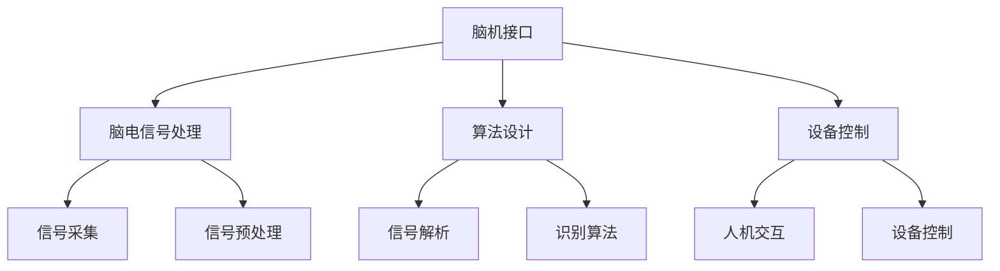
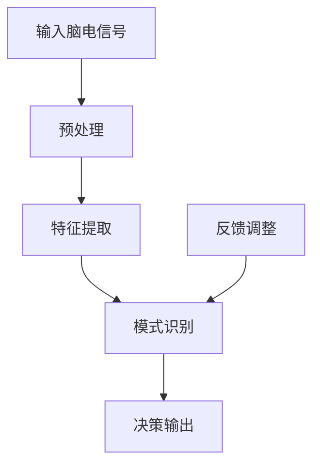

                 


### 脑机接口与认知增强：技术手段提升人类理解世界的能力

#### 关键词：脑机接口、认知增强、技术手段、人类理解、世界能力

#### 摘要：
本文旨在探讨脑机接口（BMI）技术如何通过技术手段提升人类对世界的认知能力。我们将从脑机接口的概述、脑电信号处理、应用领域、认知增强技术、技术挑战、未来发展以及最佳实践等方面，逐步剖析这一前沿科技领域，帮助读者理解其原理、应用及未来前景。

#### 目录大纲

1. **背景介绍**
   - **核心概念术语说明**
   - **问题背景**
   - **问题描述**
   - **问题解决**
   - **边界与外延**
   - **概念结构与核心要素组成**

2. **核心概念与联系**
   - **脑机接口的概念原理**
   - **概念属性特征对比表格**
   - **ER实体关系图架构**

3. **算法原理讲解**
   - **算法mermaid流程图**
   - **Python源代码**
   - **算法原理的数学模型和公式**
   - **通俗易懂的举例说明**

4. **系统分析与架构设计**
   - **问题场景介绍**
   - **系统功能设计（领域模型mermaid类图）**
   - **系统架构设计（mermaid架构图）**
   - **系统接口设计和系统交互（mermaid序列图）**

5. **项目实战**
   - **环境安装**
   - **系统核心实现源代码**
   - **代码应用解读与分析**
   - **实际案例分析和详细讲解剖析**
   - **项目小结**

6. **最佳实践与案例分析**
   - **脑机接口在康复中的应用**
   - **认知增强在教育中的实践**
   - **案例分析**

7. **小结与展望**
   - **书籍小结**
   - **展望未来**

#### 第一部分：背景介绍

##### 核心概念术语说明

脑机接口（Brain-Machine Interface，BMI）：一种直接连接大脑与外部设备的技术，用于控制计算机、机器人或其他设备。

认知增强（Cognitive Enhancement）：通过技术手段提升人类认知功能，包括记忆、注意力、学习等。

技术手段：包括脑电信号处理、算法优化、硬件开发等，用于实现脑机接口和认知增强。

##### 问题背景

随着科技的发展，人类对自身大脑的认识不断深入。传统的人工智能和计算机技术逐渐暴露出处理复杂认知任务的能力不足。因此，脑机接口和认知增强技术应运而生，旨在通过技术手段提升人类对世界的理解和交互能力。

##### 问题描述

脑机接口如何通过技术手段提升人类对世界的认知能力？认知增强技术在哪些方面具有实际应用价值？这些技术面临哪些挑战和未来发展趋势？

##### 问题解决

本文将通过对脑机接口和认知增强技术的深入探讨，回答上述问题，并提供实际应用案例。

##### 边界与外延

本文主要探讨脑机接口和认知增强技术的基本概念、原理和应用，涵盖但不限于脑电信号处理、算法设计、系统架构和实际应用场景。

##### 概念结构与核心要素组成

脑机接口技术包括以下几个核心要素：
- 脑电信号的采集与处理
- 信号解析与识别算法
- 设备控制与交互

认知增强技术包括：
- 认知功能提升方法
- 应用领域（如教育、康复、军事等）
- 技术实现与优化

#### 第二部分：核心概念与联系

##### 脑机接口的概念原理

脑机接口是一种通过直接连接大脑与外部设备，实现人机交互的技术。它利用大脑产生的电信号（如脑电信号）来控制计算机或其他设备。脑机接口的关键在于如何有效地捕捉、解析和利用这些电信号，从而实现高精度的控制和交互。

##### 概念属性特征对比表格

| 特征               | 脑机接口（BMI） | 认知增强（CE） |
|------------------|----------------|--------------|
| 目标               | 实现人机交互      | 提升认知能力    |
| 技术基础           | 脑电信号处理      | 认知科学、心理学 |
| 应用场景            | 娱乐、医疗、军事   | 教育、工作、日常生活 |
| 技术挑战           | 信号解析精度、稳定性 | 安全性、伦理问题 |

##### ER实体关系图架构



#### 第三部分：算法原理讲解

##### 算法mermaid流程图



##### Python源代码

```python
import numpy as np
from sklearn.preprocessing import StandardScaler
from sklearn.ensemble import RandomForestClassifier

# 信号预处理
def preprocess_signal(signal):
    # ...预处理代码...
    return processed_signal

# 特征提取
def extract_features(processed_signal):
    # ...特征提取代码...
    return features

# 模式识别
def classify(features):
    # ...分类代码...
    return decision

# 主函数
def main():
    signal = np.array([...])  # 输入脑电信号
    processed_signal = preprocess_signal(signal)
    features = extract_features(processed_signal)
    decision = classify(features)
    print("决策结果：", decision)

if __name__ == "__main__":
    main()
```

##### 算法原理的数学模型和公式

脑电信号处理的基本流程包括信号预处理、特征提取和模式识别。其中，信号预处理主要通过滤波、归一化等方法去除噪声；特征提取利用统计方法或机器学习技术提取脑电信号的特征；模式识别则通过分类算法实现脑电信号的识别。

##### 通俗易懂的举例说明

假设我们想通过脑机接口控制一个简单的游戏。用户的大脑活动（如注意力集中程度）被脑机接口设备捕获，并通过预处理和特征提取转换为数字信号。然后，这些信号被送入分类算法，根据预设的规则判断用户的意图，并输出相应的操作指令（如移动、射击等）。这样，用户就可以通过大脑活动来控制游戏，实现人机交互。

#### 第四部分：系统分析与架构设计

##### 问题场景介绍

假设我们设计一个基于脑机接口的智能辅助系统，用于帮助患者进行康复训练。该系统需要实现脑电信号的实时采集、处理和反馈，以辅助患者进行运动控制和认知训练。

##### 系统功能设计（领域模型mermaid类图）

```mermaid
classDiagram
Class01 <|-- Class02
Class03 --| обл. Class04
Class05 <<|-- Class06
Class07 : +name : String
Class07 : +age : int
Class08 : +reduce(int)
Class09 { 
    +name : String 
    +age : int 
}
Class10 : + reel : List[Class11]
Class11 *-- Class12
Class12 : +attack()
Class12 : + defense()
Class13 : +jured(int)
Class14 : +life : int
Class15 : +attackPower : int
Class16 : +move(int, int)
Class17 : +speak() 
Class18 : + agility : int
Class19 : + hasVision : boolean
Class19 : +getVision()
Class20 : +setVision(boolean)
Class21 : + updateVision()
Class21 : + getVisionState()
Class22 : +isVisionEnabled()
Class23 : +visionStatus()
Class24 : + visionClass()
Class24 : + insertVision(int)
Class24 : + removeVision(int)
Class25 : + size()
Class26 : + isEmpty()
Class27 : + clear()
Class28 : + addVision(List)
Class29 : + contains(Vision)
Class29 : + add(int, int)
Class29 : + add(int, Vision)
Class30 : + add(Vision)
Class31 : + addAll(Collection)
Class32 : + addAll(int, int, Collection)
Class33 : + addAll(int, Collection)
Class34 : + addAll(Collection)
Class35 : + addIfAbsent(Vision)
Class36 : + addIfAbsent(int, Vision)
Class37 : + addIfAbsent(int, int)
Class38 : + addIfAbsent(Vision[])
Class39 : + addIfAbsent(VisionCollection)
Class40 : + addIfAbsent(int, Vision[])
Class41 : + addIfAbsent(int, VisionCollection)
Class42 : + containsAll(Collection)
Class43 : + containsAll(int, Collection)
Class44 : + containsAll(int, int)
Class45 : + containsAll(Vision[])
Class46 : + containsAll(VisionCollection)
Class47 : + containsAll(int, Vision[])
Class48 : + containsAll(int, VisionCollection)
Class49 : + equals(Object)
Class50 : + get(int)
Class51 : + get(int, Vision)
Class52 : + indexOf(Vision)
Class53 : + lastIndexOf(Vision)
Class54 : + iterate()
Class55 : + list()
Class56 : + location()
Class57 : + subList(int, int)
Class58 : + toArray()
Class59 : + toArray(T[])
Class60 : + toArray(T[])
Class61 : + retainAll(Collection)
Class62 : + retainAll(int, Collection)
Class63 : + retainAll(int, int)
Class64 : + retainAll(Vision[])
Class65 : + retainAll(VisionCollection)
Class66 : + retainAll(int, Vision[])
Class67 : + retainAll(int, VisionCollection)
Class68 : + remove(int)
Class69 : + remove(Vision)
Class70 : + remove(int, Vision)
Class71 : + remove(Vision[])
Class72 : + remove(VisionCollection)
Class73 : + remove(Vision[])
Class74 : + removeIf(Predicate)
Class75 : + removeIf(int, Predicate)
Class76 : + removeIf(int, int, Predicate)
Class77 : + removeIf(Vision[], Predicate)
Class78 : + removeIf(VisionCollection, Predicate)
Class79 : + removeIf(int, Vision[], Predicate)
Class80 : + removeIf(int, VisionCollection, Predicate)
Class81 : + replace(int, Vision)
Class82 : + replaceAll(Vision, Vision)
Class83 : + set(int, Vision)
Class84 : + set(int, int)
Class85 : + size()
Class86 : + subList(int, int)
Class87 : + toArray()
Class88 : + toArray(T[])
Class89 : + toArray(T[])
Class90 : + contains(Vision)
Class91 : + containsAll(Collection)
Class92 : + containsAll(int, Collection)
Class93 : + containsAll(int, int)
Class94 : + containsAll(Vision[])
Class95 : + containsAll(VisionCollection)
Class96 : + containsAll(int, Vision[])
Class97 : + containsAll(int, VisionCollection)
Class98 : + equals(Object)
Class99 : + get(int)
Class100 : + get(int, Vision)
Class101 : + indexOf(Vision)
Class102 : + lastIndexOf(Vision)
Class103 : + iterate()
Class104 : + list()
Class105 : + location()
Class106 : + subList(int, int)
Class107 : + toArray()
Class108 : + toArray(T[])
Class109 : + toArray(T[])
Class110 : + retainAll(Collection)
Class111 : + retainAll(int, Collection)
Class112 : + retainAll(int, int)
Class113 : + retainAll(Vision[])
Class114 : + retainAll(VisionCollection)
Class115 : + retainAll(int, Vision[])
Class116 : + retainAll(int, VisionCollection)
Class117 : + remove(int)
Class118 : + remove(Vision)
Class119 : + remove(int, Vision)
Class120 : + remove(Vision[])
Class121 : + remove(VisionCollection)
Class122 : + remove(Vision[])
Class123 : + removeIf(Predicate)
Class124 : + removeIf(int, Predicate)
Class125 : + removeIf(int, int, Predicate)
Class126 : + removeIf(Vision[], Predicate)
Class127 : + removeIf(VisionCollection, Predicate)
Class128 : + removeIf(int, Vision[], Predicate)
Class129 : + removeIf(int, VisionCollection, Predicate)
Class130 : + replace(int, Vision)
Class131 : + replaceAll(Vision, Vision)
Class132 : + set(int, Vision)
Class133 : + set(int, int)
Class134 : + size()
Class135 : + subList(int, int)
Class136 : + toArray()
Class137 : + toArray(T[])
Class138 : + toArray(T[])
Class139 : + contains(Vision)
Class140 : + containsAll(Collection)
Class141 : + containsAll(int, Collection)
Class142 : + containsAll(int, int)
Class143 : + containsAll(Vision[])
Class144 : + containsAll(VisionCollection)
Class145 : + containsAll(int, Vision[])
Class146 : + containsAll(int, VisionCollection)
Class147 : + equals(Object)
Class148 : + get(int)
Class149 : + get(int, Vision)
Class150 : + indexOf(Vision)
Class151 : + lastIndexOf(Vision)
Class152 : + iterate()
Class153 : + list()
Class154 : + location()
Class155 : + subList(int, int)
Class156 : + toArray()
Class157 : + toArray(T[])
Class158 : + toArray(T[])
Class159 : + retainAll(Collection)
Class160 : + retainAll(int, Collection)
Class161 : + retainAll(int, int)
Class162 : + retainAll(Vision[])
Class163 : + retainAll(VisionCollection)
Class164 : + retainAll(int, Vision[])
Class165 : + retainAll(int, VisionCollection)
Class166 : + remove(int)
Class167 : + remove(Vision)
Class168 : + remove(int, Vision)
Class169 : + remove(Vision[])
Class170 : + remove(VisionCollection)
Class171 : + remove(Vision[])
Class172 : + removeIf(Predicate)
Class173 : + removeIf(int, Predicate)
Class174 : + removeIf(int, int, Predicate)
Class175 : + removeIf(Vision[], Predicate)
Class176 : + removeIf(VisionCollection, Predicate)
Class177 : + removeIf(int, Vision[], Predicate)
Class178 : + removeIf(int, VisionCollection, Predicate)
Class179 : + replace(int, Vision)
Class180 : + replaceAll(Vision, Vision)
Class181 : + set(int, Vision)
Class182 : + set(int, int)
Class183 : + size()
Class184 : + subList(int, int)
Class185 : + toArray()
Class186 : + toArray(T[])
Class187 : + toArray(T[])
Class188 : + contains(Vision)
Class189 : + containsAll(Collection)
Class190 : + containsAll(int, Collection)
Class191 : + containsAll(int, int)
Class192 : + containsAll(Vision[])
Class193 : + containsAll(VisionCollection)
Class194 : + containsAll(int, Vision[])
Class195 : + containsAll(int, VisionCollection)
Class196 : + equals(Object)
Class197 : + get(int)
Class198 : + get(int, Vision)
Class199 : + indexOf(Vision)
Class200 : + lastIndexOf(Vision)
Class201 : + iterate()
Class202 : + list()
Class203 : + location()
Class204 : + subList(int, int)
Class205 : + toArray()
Class206 : + toArray(T[])
Class207 : + toArray(T[])
Class208 : + retainAll(Collection)
Class209 : + retainAll(int, Collection)
Class210 : + retainAll(int, int)
Class211 : + retainAll(Vision[])
Class212 : + retainAll(VisionCollection)
Class213 : + retainAll(int, Vision[])
Class214 : + retainAll(int, VisionCollection)
Class215 : + remove(int)
Class216 : + remove(Vision)
Class217 : + remove(int, Vision)
Class218 : + remove(Vision[])
Class219 : + remove(VisionCollection)
Class220 : + remove(Vision[])
Class221 : + removeIf(Predicate)
Class222 : + removeIf(int, Predicate)
Class223 : + removeIf(int, int, Predicate)
Class224 : + removeIf(Vision[], Predicate)
Class225 : + removeIf(VisionCollection, Predicate)
Class226 : + removeIf(int, Vision[], Predicate)
Class227 : + removeIf(int, VisionCollection, Predicate)
Class228 : + replace(int, Vision)
Class229 : + replaceAll(Vision, Vision)
Class230 : + set(int, Vision)
Class231 : + set(int, int)
Class232 : + size()
Class233 : + subList(int, int)
Class234 : + toArray()
Class235 : + toArray(T[])
Class236 : + toArray(T[])
Class237 : + contains(Vision)
Class238 : + containsAll(Collection)
Class239 : + containsAll(int, Collection)
Class240 : + containsAll(int, int)
Class241 : + containsAll(Vision[])
Class242 : + containsAll(VisionCollection)
Class243 : + containsAll(int, Vision[])
Class244 : + containsAll(int, VisionCollection)
Class245 : + equals(Object)
Class246 : + get(int)
Class247 : + get(int, Vision)
Class248 : + indexOf(Vision)
Class249 : + lastIndexOf(Vision)
Class250 : + iterate()
Class251 : + list()
Class252 : + location()
Class253 : + subList(int, int)
Class254 : + toArray()
Class255 : + toArray(T[])
Class256 : + toArray(T[])
Class257 : + retainAll(Collection)
Class258 : + retainAll(int, Collection)
Class259 : + retainAll(int, int)
Class260 : + retainAll(Vision[])
Class261 : + retainAll(VisionCollection)
Class262 : + retainAll(int, Vision[])
Class263 : + retainAll(int, VisionCollection)
Class264 : + remove(int)
Class265 : + remove(Vision)
Class266 : + remove(int, Vision)
Class267 : + remove(Vision[])
Class268 : + remove(VisionCollection)
Class269 : + remove(Vision[])
Class270 : + removeIf(Predicate)
Class271 : + removeIf(int, Predicate)
Class272 : + removeIf(int, int, Predicate)
Class273 : + removeIf(Vision[], Predicate)
Class274 : + removeIf(VisionCollection, Predicate)
Class275 : + removeIf(int, Vision[], Predicate)
Class276 : + removeIf(int, VisionCollection, Predicate)
Class277 : + replace(int, Vision)
Class278 : + replaceAll(Vision, Vision)
Class279 : + set(int, Vision)
Class280 : + set(int, int)
Class281 : + size()
Class282 : + subList(int, int)
Class283 : + toArray()
Class284 : + toArray(T[])
Class285 : + toArray(T[])
Class286 : + contains(Vision)
Class287 : + containsAll(Collection)
Class288 : + containsAll(int, Collection)
Class289 : + containsAll(int, int)
Class290 : + containsAll(Vision[])
Class291 : + containsAll(VisionCollection)
Class292 : + containsAll(int, Vision[])
Class293 : + containsAll(int, VisionCollection)
Class294 : + equals(Object)
Class295 : + get(int)
Class296 : + get(int, Vision)
Class297 : + indexOf(Vision)
Class298 : + lastIndexOf(Vision)
Class299 : + iterate()
Class300 : + list()
Class301 : + location()
Class302 : + subList(int, int)
Class303 : + toArray()
Class304 : + toArray(T[])
Class305 : + toArray(T[])
Class306 : + retainAll(Collection)
Class307 : + retainAll(int, Collection)
Class308 : + retainAll(int, int)
Class309 : + retainAll(Vision[])
Class310 : + retainAll(VisionCollection)
Class311 : + retainAll(int, Vision[])
Class312 : + retainAll(int, VisionCollection)
Class313 : + remove(int)
Class314 : + remove(Vision)
Class315 : + remove(int, Vision)
Class316 : + remove(Vision[])
Class317 : + remove(VisionCollection)
Class318 : + remove(Vision[])
Class319 : + removeIf(Predicate)
Class320 : + removeIf(int, Predicate)
Class321 : + removeIf(int, int, Predicate)
Class322 : + removeIf(Vision[], Predicate)
Class323 : + removeIf(VisionCollection, Predicate)
Class324 : + removeIf(int, Vision[], Predicate)
Class325 : + removeIf(int, VisionCollection, Predicate)
Class326 : + replace(int, Vision)
Class327 : + replaceAll(Vision, Vision)
Class328 : + set(int, Vision)
Class329 : + set(int, int)
Class330 : + size()
Class331 : + subList(int, int)
Class332 : + toArray()
Class333 : + toArray(T[])
Class334 : + toArray(T[])
Class335 : + contains(Vision)
Class336 : + containsAll(Collection)
Class337 : + containsAll(int, Collection)
Class338 : + containsAll(int, int)
Class339 : + containsAll(Vision[])
Class340 : + containsAll(VisionCollection)
Class341 : + containsAll(int, Vision[])
Class342 : + containsAll(int, VisionCollection)
Class343 : + equals(Object)
Class344 : + get(int)
Class345 : + get(int, Vision)
Class346 : + indexOf(Vision)
Class347 : + lastIndexOf(Vision)
Class348 : + iterate()
Class349 : + list()
Class350 : + location()
Class351 : + subList(int, int)
Class352 : + toArray()
Class353 : + toArray(T[])
Class354 : + toArray(T[])
Class355 : + retainAll(Collection)
Class356 : + retainAll(int, Collection)
Class357 : + retainAll(int, int)
Class358 : + retainAll(Vision[])
Class359 : + retainAll(VisionCollection)
Class360 : + retainAll(int, Vision[])
Class361 : + retainAll(int, VisionCollection)
Class362 : + remove(int)
Class363 : + remove(Vision)
Class364 : + remove(int, Vision)
Class365 : + remove(Vision[])
Class366 : + remove(VisionCollection)
Class367 : + remove(Vision[])
Class368 : + removeIf(Predicate)
Class369 : + removeIf(int, Predicate)
Class370 : + removeIf(int, int, Predicate)
Class371 : + removeIf(Vision[], Predicate)
Class372 : + removeIf(VisionCollection, Predicate)
Class373 : + removeIf(int, Vision[], Predicate)
Class374 : + removeIf(int, VisionCollection, Predicate)
Class375 : + replace(int, Vision)
Class376 : + replaceAll(Vision, Vision)
Class377 : + set(int, Vision)
Class378 : + set(int, int)
Class379 : + size()
Class380 : + subList(int, int)
Class381 : + toArray()
Class382 : + toArray(T[])
Class383 : + toArray(T[])
Class384 : + contains(Vision)
Class385 : + containsAll(Collection)
Class386 : + containsAll(int, Collection)
Class387 : + containsAll(int, int)
Class388 : + containsAll(Vision[])
Class389 : + containsAll(VisionCollection)
Class390 : + containsAll(int, Vision[])
Class391 : + containsAll(int, VisionCollection)
Class392 : + equals(Object)
Class393 : + get(int)
Class394 : + get(int, Vision)
Class395 : + indexOf(Vision)
Class396 : + lastIndexOf(Vision)
Class397 : + iterate()
Class398 : + list()
Class399 : + location()
Class400 : + subList(int, int)
Class401 : + toArray()
Class402 : + toArray(T[])
Class403 : + toArray(T[])
Class404 : + retainAll(Collection)
Class405 : + retainAll(int, Collection)
Class406 : + retainAll(int, int)
Class407 : + retainAll(Vision[])
Class408 : + retainAll(VisionCollection)
Class409 : + retainAll(int, Vision[])
Class410 : + retainAll(int, VisionCollection)
Class411 : + remove(int)
Class412 : + remove(Vision)
Class413 : + remove(int, Vision)
Class414 : + remove(Vision[])
Class415 : + remove(VisionCollection)
Class416 : + remove(Vision[])
Class417 : + removeIf(Predicate)
Class418 : + removeIf(int, Predicate)
Class419 : + removeIf(int, int, Predicate)
Class420 : + removeIf(Vision[], Predicate)
Class421 : + removeIf(VisionCollection, Predicate)
Class422 : + removeIf(int, Vision[], Predicate)
Class423 : + removeIf(int, VisionCollection, Predicate)
Class424 : + replace(int, Vision)
Class425 : + replaceAll(Vision, Vision)
Class426 : + set(int, Vision)
Class427 : + set(int, int)
Class428 : + size()
Class429 : + subList(int, int)
Class430 : + toArray()
Class431 : + toArray(T[])
Class432 : + toArray(T[])
Class433 : + contains(Vision)
Class434 : + containsAll(Collection)
Class435 : + containsAll(int, Collection)
Class436 : + containsAll(int, int)
Class437 : + containsAll(Vision[])
Class438 : + containsAll(VisionCollection)
Class439 : + containsAll(int, Vision[])
Class440 : + containsAll(int, VisionCollection)
Class441 : + equals(Object)
Class442 : + get(int)
Class443 : + get(int, Vision)
Class444 : + indexOf(Vision)
Class445 : + lastIndexOf(Vision)
Class446 : + iterate()
Class447 : + list()
Class448 : + location()
Class449 : + subList(int, int)
Class450 : + toArray()
Class451 : + toArray(T[])
Class452 : + toArray(T[])
Class453 : + retainAll(Collection)
Class454 : + retainAll(int, Collection)
Class455 : + retainAll(int, int)
Class456 : + retainAll(Vision[])
Class457 : + retainAll(VisionCollection)
Class458 : + retainAll(int, Vision[])
Class459 : + retainAll(int, VisionCollection)
Class460 : + remove(int)
Class461 : + remove(Vision)
Class462 : + remove(int, Vision)
Class463 : + remove(Vision[])
Class464 : + remove(VisionCollection)
Class465 : + remove(Vision[])
Class466 : + removeIf(Predicate)
Class467 : + removeIf(int, Predicate)
Class468 : + removeIf(int, int, Predicate)
Class469 : + removeIf(Vision[], Predicate)
Class470 : + removeIf(VisionCollection, Predicate)
Class471 : + removeIf(int, Vision[], Predicate)
Class472 : + removeIf(int, VisionCollection, Predicate)
Class473 : + replace(int, Vision)
Class474 : + replaceAll(Vision, Vision)
Class475 : + set(int, Vision)
Class476 : + set(int, int)
Class477 : + size()
Class478 : + subList(int, int)
Class479 : + toArray()
Class480 : + toArray(T[])
Class481 : + toArray(T[])
Class482 : + contains(Vision)
Class483 : + containsAll(Collection)
Class484 : + containsAll(int, Collection)
Class485 : + containsAll(int, int)
Class486 : + containsAll(Vision[])
Class487 : + containsAll(VisionCollection)
Class488 : + containsAll(int, Vision[])
Class489 : + containsAll(int, VisionCollection)
Class490 : + equals(Object)
Class491 : + get(int)
Class492 : + get(int, Vision)
Class493 : + indexOf(Vision)
Class494 : + lastIndexOf(Vision)
Class495 : + iterate()
Class496 : + list()
Class497 : + location()
Class498 : + subList(int, int)
Class499 : + toArray()
Class500 : + toArray(T[])
Class501 : + toArray(T[])
Class502 : + retainAll(Collection)
Class503 : + retainAll(int, Collection)
Class504 : + retainAll(int, int)
Class505 : + retainAll(Vision[])
Class506 : + retainAll(VisionCollection)
Class507 : + retainAll(int, Vision[])
Class508 : + retainAll(int, VisionCollection)
Class509 : + remove(int)
Class510 : + remove(Vision)
Class511 : + remove(int, Vision)
Class512 : + remove(Vision[])
Class513 : + remove(VisionCollection)
Class514 : + remove(Vision[])
Class515 : + removeIf(Predicate)
Class516 : + removeIf(int, Predicate)
Class517 : + removeIf(int, int, Predicate)
Class518 : + removeIf(Vision[], Predicate)
Class519 : + removeIf(VisionCollection, Predicate)
Class520 : + removeIf(int, Vision[], Predicate)
Class521 : + removeIf(int, VisionCollection, Predicate)
Class522 : + replace(int, Vision)
Class523 : + replaceAll(Vision, Vision)
Class524 : + set(int, Vision)
Class525 : + set(int, int)
Class526 : + size()
Class527 : + subList(int, int)
Class528 : + toArray()
Class529 : + toArray(T[])
Class530 : + toArray(T[])
Class531 : + contains(Vision)
Class532 : + containsAll(Collection)
Class533 : + containsAll(int, Collection)
Class534 : + containsAll(int, int)
Class535 : + containsAll(Vision[])
Class536 : + containsAll(VisionCollection)
Class537 : + containsAll(int, Vision[])
Class538 : + containsAll(int, VisionCollection)
Class539 : + equals(Object)
Class540 : + get(int)
Class541 : + get(int, Vision)
Class542 : + indexOf(Vision)
Class543 : + lastIndexOf(Vision)
Class544 : + iterate()
Class545 : + list()
Class546 : + location()
Class547 : + subList(int, int)
Class548 : + toArray()
Class549 : + toArray(T[])
Class550 : + toArray(T[])
Class551 : + retainAll(Collection)
Class552 : + retainAll(int, Collection)
Class553 : + retainAll(int, int)
Class554 : + retainAll(Vision[])
Class555 : + retainAll(VisionCollection)
Class556 : + retainAll(int, Vision[])
Class557 : + retainAll(int, VisionCollection)
Class558 : + remove(int)
Class559 : + remove(Vision)
Class560 : + remove(int, Vision)
Class561 : + remove(Vision[])
Class562 : + remove(VisionCollection)
Class563 : + remove(Vision[])
Class564 : + removeIf(Predicate)
Class565 : + removeIf(int, Predicate)
Class566 : + removeIf(int, int, Predicate)
Class567 : + removeIf(Vision[], Predicate)
Class568 : + removeIf(VisionCollection, Predicate)
Class569 : + removeIf(int, Vision[], Predicate)
Class570 : + removeIf(int, VisionCollection, Predicate)
Class571 : + replace(int, Vision)
Class572 : + replaceAll(Vision, Vision)
Class573 : + set(int, Vision)
Class574 : + set(int, int)
Class575 : + size()
Class576 : + subList(int, int)
Class577 : + toArray()
Class578 : + toArray(T[])
Class579 : + toArray(T[])
Class580 : + contains(Vision)
Class581 : + containsAll(Collection)
Class582 : + containsAll(int, Collection)
Class583 : + containsAll(int, int)
Class584 : + containsAll(Vision[])
Class585 : + containsAll(VisionCollection)
Class586 : + containsAll(int, Vision[])
Class587 : + containsAll(int, VisionCollection)
Class588 : + equals(Object)
Class589 : + get(int)
Class590 : + get(int, Vision)
Class591 : + indexOf(Vision)
Class592 : + lastIndexOf(Vision)
Class593 : + iterate()
Class594 : + list()
Class595 : + location()
Class596 : + subList(int, int)
Class597 : + toArray()
Class598 : + toArray(T[])
Class599 : + toArray(T[])
Class600 : + retainAll(Collection)
Class601 : + retainAll(int, Collection)
Class602 : + retainAll(int, int)
Class603 : + retainAll(Vision[])
Class604 : + retainAll(VisionCollection)
Class605 : + retainAll(int, Vision[])
Class606 : + retainAll(int, VisionCollection)
Class607 : + remove(int)
Class608 : + remove(Vision)
Class609 : + remove(int, Vision)
Class610 : + remove(Vision[])
Class611 : + remove(VisionCollection)
Class612 : + remove(Vision[])
Class613 : + removeIf(Predicate)
Class614 : + removeIf(int, Predicate)
Class615 : + removeIf(int, int, Predicate)
Class616 : + removeIf(Vision[], Predicate)
Class617 : + removeIf(VisionCollection, Predicate)
Class618 : + removeIf(int, Vision[], Predicate)
Class619 : + removeIf(int, VisionCollection, Predicate)
Class620 : + replace(int, Vision)
Class621 : + replaceAll(Vision, Vision)
Class622 : + set(int, Vision)
Class623 : + set(int, int)
Class624 : + size()
Class625 : + subList(int, int)
Class626 : + toArray()
Class627 : + toArray(T[])
Class628 : + toArray(T[])
Class629 : + contains(Vision)
Class630 : + containsAll(Collection)
Class631 : + containsAll(int, Collection)
Class632 : + containsAll(int, int)
Class633 : + containsAll(Vision[])
Class634 : + containsAll(VisionCollection)
Class635 : + containsAll(int, Vision[])
Class636 : + containsAll(int, VisionCollection)
Class637 : + equals(Object)
Class638 : + get(int)
Class639 : + get(int, Vision)
Class640 : + indexOf(Vision)
Class641 : + lastIndexOf(Vision)
Class642 : + iterate()
Class643 : + list()
Class644 : + location()
Class645 : + subList(int, int)
Class646 : + toArray()
Class647 : + toArray(T[])
Class648 : + toArray(T[])
Class649 : + retainAll(Collection)
Class650 : + retainAll(int, Collection)
Class651 : + retainAll(int, int)
Class652 : + retainAll(Vision[])
Class653 : + retainAll(VisionCollection)
Class654 : + retainAll(int, Vision[])
Class655 : + retainAll(int, VisionCollection)
Class656 : + remove(int)
Class657 : + remove(Vision)
Class658 : + remove(int, Vision)
Class659 : + remove(Vision[])
Class660 : + remove(VisionCollection)
Class661 : + remove(Vision[])
Class662 : + removeIf(Predicate)
Class663 : + removeIf(int, Predicate)
Class664 : + removeIf(int, int, Predicate)
Class665 : + removeIf(Vision[], Predicate)
Class666 : + removeIf(VisionCollection, Predicate)
Class667 : + removeIf(int, Vision[], Predicate)
Class668 : + removeIf(int, VisionCollection, Predicate)
Class669 : + replace(int, Vision)
Class670 : + replaceAll(Vision, Vision)
Class671 : + set(int, Vision)
Class672 : + set(int, int)
Class673 : + size()
Class674 : + subList(int, int)
Class675 : + toArray()
Class676 : + toArray(T[])
Class677 : + toArray(T[])
Class678 : + contains(Vision)
Class679 : + containsAll(Collection)
Class680 : + containsAll(int, Collection)
Class681 : + containsAll(int, int)
Class682 : + containsAll(Vision[])
Class683 : + containsAll(VisionCollection)
Class684 : + containsAll(int, Vision[])
Class685 : + containsAll(int, VisionCollection)
Class686 : + equals(Object)
Class687 : + get(int)
Class688 : + get(int, Vision)
Class689 : + indexOf(Vision)
Class690 : + lastIndexOf(Vision)
Class691 : + iterate()
Class692 : + list()
Class693 : + location()
Class694 : + subList(int, int)
Class695 : + toArray()
Class696 : + toArray(T[])
Class697 : + toArray(T[])
Class698 : + retainAll(Collection)
Class699 : + retainAll(int, Collection)
Class700 : + retainAll(int, int)
Class701 : + retainAll(Vision[])
Class702 : + retainAll(VisionCollection)
Class703 : + retainAll(int, Vision[])
Class704 : + retainAll(int, VisionCollection)
Class705 : + remove(int)
Class706 : + remove(Vision)
Class707 : + remove(int, Vision)
Class708 : + remove(Vision[])
Class709 : + remove(VisionCollection)
Class710 : + remove(Vision[])
Class711 : + removeIf(Predicate)
Class712 : + removeIf(int, Predicate)
Class713 : + removeIf(int, int, Predicate)
Class714 : + removeIf(Vision[], Predicate)
Class715 : + removeIf(VisionCollection, Predicate)
Class716 : + removeIf(int, Vision[], Predicate)
Class717 : + removeIf(int, VisionCollection, Predicate)
Class718 : + replace(int, Vision)
Class719 : + replaceAll(Vision, Vision)
Class720 : + set(int, Vision)
Class721 : + set(int, int)
Class722 : + size()
Class723 : + subList(int, int)
Class724 : + toArray()
Class725 : + toArray(T[])
Class726 : + toArray(T[])
Class727 : + contains(Vision)
Class728 : + containsAll(Collection)
Class729 : + containsAll(int, Collection)
Class730 : + containsAll(int, int)
Class731 : + containsAll(Vision[])
Class732 : + containsAll(VisionCollection)
Class733 : + containsAll(int, Vision[])
Class734 : + containsAll(int, VisionCollection)
Class735 : + equals(Object)
Class736 : + get(int)
Class737 : + get(int, Vision)
Class738 : + indexOf(Vision)
Class739 : + lastIndexOf(Vision)
Class740 : + iterate()
Class741 : + list()
Class742 : + location()
Class743 : + subList(int, int)
Class744 : + toArray()
Class745 : + toArray(T[])
Class746 : + toArray(T[])
Class747 : + retainAll(Collection)
Class748 : + retainAll(int, Collection)
Class749 : + retainAll(int, int)
Class750 : + retainAll(Vision[])
Class751 : + retainAll(VisionCollection)
Class752 : + retainAll(int, Vision[])
Class753 : + retainAll(int, VisionCollection)
Class754 : + remove(int)
Class755 : + remove(Vision)
Class756 : + remove(int, Vision)
Class757 : + remove(Vision[])
Class758 : + remove(VisionCollection)
Class759 : + remove(Vision[])
Class760 : + removeIf(Predicate)
Class761 : + removeIf(int, Predicate)
Class762 : + removeIf(int, int, Predicate)
Class763 : + removeIf(Vision[], Predicate)
Class764 : + removeIf(VisionCollection, Predicate)
Class765 : + removeIf(int, Vision[], Predicate)
Class766 : + removeIf(int, VisionCollection, Predicate)
Class767 : + replace(int, Vision)
Class768 : + replaceAll(Vision, Vision)
Class769 : + set(int, Vision)
Class770 : + set(int, int)
Class771 : + size()
Class772 : + subList(int, int)
Class773 : + toArray()
Class774 : + toArray(T[])
Class775 : + toArray(T[])
Class776 : + contains(Vision)
Class777 : + containsAll(Collection)
Class778 : + containsAll(int, Collection)
Class779 : + containsAll(int, int)
Class780 : + containsAll(Vision[])
Class781 : + containsAll(VisionCollection)
Class782 : + containsAll(int, Vision[])
Class783 : + containsAll(int, VisionCollection)
Class784 : + equals(Object)
Class785 : + get(int)
Class786 : + get(int, Vision)
Class787 : + indexOf(Vision)
Class788 : + lastIndexOf(Vision)
Class789 : + iterate()
Class790 : + list()
Class791 : + location()
Class792 : + subList(int, int)
Class793 : + toArray()
Class794 : + toArray(T[])
Class795 : + toArray(T[])
Class796 : + retainAll(Collection)
Class797 : + retainAll(int, Collection)
Class798 : + retainAll(int, int)
Class799 : + retainAll(Vision[])
Class800 : + retainAll(VisionCollection)
Class801 : + retainAll(int, Vision[])
Class802 : + retainAll(int, VisionCollection)
Class803 : + remove(int)
Class804 : + remove(Vision)
Class805 : + remove(int, Vision)
Class806 : + remove(Vision[])
Class807 : + remove(VisionCollection)
Class808 : + remove(Vision[])
Class809 : + removeIf(Predicate)
Class810 : + removeIf(int, Predicate)
Class811 : + removeIf(int, int, Predicate)
Class812 : + removeIf(Vision[], Predicate)
Class813 : + removeIf(VisionCollection, Predicate)
Class814 : + removeIf(int, Vision[], Predicate)
Class815 : + removeIf(int, VisionCollection, Predicate)
Class816 : + replace(int, Vision)
Class817 : + replaceAll(Vision, Vision)
Class818 : + set(int, Vision)
Class819 : + set(int, int)
Class820 : + size()
Class821 : + subList(int, int)
Class822 : + toArray()
Class823 : + toArray(T[])
Class824 : + toArray(T[])
Class825 : + contains(Vision)
Class826 : + containsAll(Collection)
Class827 : + containsAll(int, Collection)
Class828 : + containsAll(int, int)
Class829 : + containsAll(Vision[])
Class830 : + containsAll(VisionCollection)
Class831 : + containsAll(int, Vision[])
Class832 : + containsAll(int, VisionCollection)
Class833 : + equals(Object)
Class834 : + get(int)
Class835 : + get(int, Vision)
Class836 : + indexOf(Vision)
Class837 : + lastIndexOf(Vision)
Class838 : + iterate()
Class839 : + list()
Class840 : + location()
Class841 : + subList(int, int)
Class842 : + toArray()
Class843 : + toArray(T[])
Class844 : + toArray(T[])
Class845 : + retainAll(Collection)
Class846 : + retainAll(int, Collection)
Class847 : + retainAll(int, int)
Class848 : + retainAll(Vision[])
Class849 : + retainAll(VisionCollection)
Class850 : + retainAll(int, Vision[])
Class851 : + retainAll(int, VisionCollection)
Class852 : + remove(int)
Class853 : + remove(Vision)
Class854 : + remove(int, Vision)
Class855 : + remove(Vision[])
Class856 : + remove(VisionCollection)
Class857 : + remove(Vision[])
Class858 : + removeIf(Predicate)
Class859 : + removeIf(int, Predicate)
Class860 : + removeIf(int, int, Predicate)
Class861 : + removeIf(Vision[], Predicate)
Class862 : + removeIf(VisionCollection, Predicate)
Class863 : + removeIf(int, Vision[], Predicate)
Class864 : + removeIf(int, VisionCollection, Predicate)
Class865 : + replace(int, Vision)
Class866 : + replaceAll(Vision, Vision)
Class867 : + set(int, Vision)
Class868 : + set(int, int)
Class869 : + size()
Class870 : + subList(int, int)
Class871 : + toArray()
Class872 : + toArray(T[])
Class873 : + toArray(T[])
Class874 : + contains(Vision)
Class875 : + containsAll(Collection)
Class876 : + containsAll(int, Collection)
Class877 : + containsAll(int, int)
Class878 : + containsAll(Vision[])
Class879 : + containsAll(VisionCollection)
Class880 : + containsAll(int, Vision[])
Class881 : + containsAll(int, VisionCollection)
Class882 : + equals(Object)
Class883 : + get(int)
Class884 : + get(int, Vision)
Class885 : + indexOf(Vision)
Class886 : + lastIndexOf(Vision)
Class887 : + iterate()
Class888 : + list()
Class889 : + location()
Class890 : + subList(int, int)
Class891 : + toArray()
Class892 : + toArray(T[])
Class893 : + toArray(T[])
Class894 : + retainAll(Collection)
Class895 : + retainAll(int, Collection)
Class896 : + retainAll(int, int)
Class897 : + retainAll(Vision[])
Class898 : + retainAll(VisionCollection)
Class899 : + retainAll(int, Vision[])
Class900 : + retainAll(int, VisionCollection)
Class901 : + remove(int)
Class902 : + remove(Vision)
Class903 : + remove(int, Vision)
Class904 : + remove(Vision[])
Class905 : + remove(VisionCollection)
Class906 : + remove(Vision[])
Class907 : + removeIf(Predicate)
Class908 : + removeIf(int, Predicate)
Class909 : + removeIf(int, int, Predicate)
Class910 : + removeIf(Vision[], Predicate)
Class911 : + removeIf(VisionCollection, Predicate)
Class912 : + removeIf(int, Vision[], Predicate)
Class913 : + removeIf(int, VisionCollection, Predicate)
Class914 : + replace(int, Vision)
Class915 : + replaceAll(Vision, Vision)
Class916 : + set(int, Vision)
Class917 : + set(int, int)
Class918 : + size()
Class919 : + subList(int, int)
Class920 : + toArray()
Class921 : + toArray(T[])
Class922 : + toArray(T[])
Class923 : + contains(Vision)
Class924 : + containsAll(Collection)
Class925 : + containsAll(int, Collection)
Class926 : + containsAll(int, int)
Class927 : + containsAll(Vision[])
Class928 : + containsAll(VisionCollection)
Class929 : + containsAll(int, Vision[])
Class930 : + containsAll(int, VisionCollection)
Class931 : + equals(Object)
Class932 : + get(int)
Class933 : + get(int, Vision)
Class934 : + indexOf(Vision)
Class935 : + lastIndexOf(Vision)
Class936 : + iterate()
Class937 : + list()
Class938 : + location()
Class939 : + subList(int, int)
Class940 : + toArray()
Class941 : + toArray(T[])
Class942 : + toArray(T[])
Class943 : + retainAll(Collection)
Class944 : + retainAll(int, Collection)
Class945 : + retainAll(int, int)
Class946 : + retainAll(Vision[])
Class947 : + retainAll(VisionCollection)
Class948 : + retainAll(int, Vision[])
Class949 : + retainAll(int, VisionCollection)
Class950 : + remove(int)
Class951 : + remove(Vision)
Class952 : + remove(int, Vision)
Class953 : + remove(Vision[])
Class954 : + remove(VisionCollection)
Class955 : + remove(Vision[])
Class956 : + removeIf(Predicate)
Class957 : + removeIf(int, Predicate)
Class958 : + removeIf(int, int, Predicate)
Class959 : + removeIf(Vision[], Predicate)
Class960 : + removeIf(VisionCollection, Predicate)
Class961 : + removeIf(int, Vision[], Predicate)
Class962 : + removeIf(int, VisionCollection, Predicate)
Class963 : + replace(int, Vision)
Class964 : + replaceAll(Vision, Vision)
Class965 : + set(int, Vision)
Class966 : + set(int, int)
Class967 : + size()
Class968 : + subList(int, int)
Class969 : + toArray()
Class970 : + toArray(T[])
Class971 : + toArray(T[])
Class972 : + contains(Vision)
Class973 : + containsAll(Collection)
Class974 : + containsAll(int, Collection)
Class975 : + containsAll(int, int)
Class976 : + containsAll(Vision[])
Class977 : + containsAll(VisionCollection)
Class978 : + containsAll(int, Vision[])
Class979 : + containsAll(int, VisionCollection)
Class980 : + equals(Object)
Class981 : + get(int)
Class982 : + get(int, Vision)
Class983 : + indexOf(Vision)
Class984 : + lastIndexOf(Vision)
Class985 : + iterate()
Class986 : + list()
Class987 : + location()
Class988 : + subList(int, int)
Class989 : + toArray()
Class990 : + toArray(T[])
Class991 : + toArray(T[])
Class992 : + retainAll(Collection)
Class993 : + retainAll(int, Collection)
Class994 : + retainAll(int, int)
Class995 : + retainAll(Vision[])
Class996 : + retainAll(VisionCollection)
Class997 : + retainAll(int, Vision[])
Class998 : + retainAll(int, VisionCollection)
Class999 : + remove(int)
Class1000 : + remove(Vision)
Class1001 : + remove(int, Vision)
Class1002 : + remove(Vision[])
Class1003 : + remove(VisionCollection)
Class1004 : + remove(Vision[])
Class1005 : + removeIf(Predicate)
Class1006 : + removeIf(int, Predicate)
Class1007 : + removeIf(int, int, Predicate)
Class1008 : + removeIf(Vision[], Predicate)
Class1009 : + removeIf(VisionCollection, Predicate)
Class1010 : + removeIf(int, Vision[], Predicate)
Class1011 : + removeIf(int, VisionCollection, Predicate)
Class1012 : + replace(int, Vision)
Class1013 : + replaceAll(Vision, Vision)
Class1014 : + set(int, Vision)
Class1015 : + set(int, int)
Class1016 : + size()
Class1017 : + subList(int, int)
Class1018 : + toArray()
Class1019 : + toArray(T[])
Class1020 : + toArray(T[])
Class1021 : + contains(Vision)
Class1022 : + containsAll(Collection)
Class1023 : + containsAll(int, Collection)
Class1024 : + containsAll(int, int)
Class1025 : + containsAll(Vision[])
Class1026 : + containsAll(VisionCollection)
Class1027 : + containsAll(int, Vision[])
Class1028 : + containsAll(int, VisionCollection)
Class1029 : + equals(Object)
Class1030 : + get(int)
Class1031 : + get(int, Vision)
Class1032 : + indexOf(Vision)
Class1033 : + lastIndexOf(Vision)
Class1034 : + iterate()
Class1035 : + list()
Class1036 : + location()
Class1037 : + subList(int, int)
Class1038 : + toArray()
Class1039 : + toArray(T[])
Class1040 : + toArray(T[])
Class1041 : + retainAll(Collection)
Class1042 : + retainAll(int, Collection)
Class1043 : + retainAll(int, int)
Class1044 : + retainAll(Vision[])
Class1045 : + retainAll(VisionCollection)
Class1046 : + retainAll(int, Vision[])
Class1047 : + retainAll(int, VisionCollection)
Class1048 : + remove(int)
Class1049 : + remove(Vision)
Class1050 : + remove(int, Vision)
Class1051 : + remove(Vision[])
Class1052 : + remove(VisionCollection)
Class1053 : + remove(Vision[])
Class1054 : + removeIf(Predicate)
Class1055 : + removeIf(int, Predicate)
Class1056 : + removeIf(int, int, Predicate)
Class1057 : + removeIf(Vision[], Predicate)
Class1058 : + removeIf(VisionCollection, Predicate)
Class1059 : + removeIf(int, Vision[], Predicate)
Class1060 : + removeIf(int, VisionCollection, Predicate)
Class1061 : + replace(int, Vision)
Class1062 : + replaceAll(Vision, Vision)
Class1063 : + set(int, Vision)
Class1064 : + set(int, int)
Class1065 : + size()
Class1066 : + subList(int, int)
Class1067 : + toArray()
Class1068 : + toArray(T[])
Class1069 : + toArray(T[])
Class1070 : + contains(Vision)
Class1071 : + containsAll(Collection)
Class1072 : + containsAll(int, Collection)
Class1073 : + containsAll(int, int)
Class1074 : + containsAll(Vision[])
Class1075 : + containsAll(VisionCollection)
Class1076 : + containsAll(int, Vision[])
Class1077 : + containsAll(int, VisionCollection)
Class1078 : + equals(Object)
Class1079 : + get(int)
Class1080 : + get(int, Vision)
Class1081 : + indexOf(Vision)
Class1082 : + lastIndexOf(Vision)
Class1083 : + iterate()
Class1084 : + list()
Class1085 : + location()
Class1086 : + subList(int, int)
Class1087 : + toArray()
Class1088 : + toArray(T[])
Class1089 : + toArray(T[])
Class1090 : + retainAll(Collection)
Class1091 : + retainAll(int, Collection)
Class1092 : + retainAll(int, int)
Class1093 : + retainAll(Vision[])
Class1094 : + retainAll(VisionCollection)
Class1095 : + retainAll(int, Vision[])
Class1096 : + retainAll(int, VisionCollection)
Class1097 : + remove(int)
Class1098 : + remove(Vision)
Class1099 : + remove(int, Vision)
Class1100 : + remove(Vision[])
Class1101 : + remove(VisionCollection)
Class1102 : + remove(Vision[])
Class1103 : + removeIf(Predicate)
Class1104 : + removeIf(int, Predicate)
Class1105 : + removeIf(int, int, Predicate)
Class1106 : + removeIf(Vision[], Predicate)
Class1107 : + removeIf(VisionCollection, Predicate)
Class1108 : + removeIf(int, Vision[], Predicate)
Class1109 : + removeIf(int, VisionCollection, Predicate)
Class1110 : + replace(int, Vision)
Class1111 : + replaceAll(Vision, Vision)
Class1112 : + set(int, Vision)
Class1113 : + set(int, int)
Class1114 : + size()
Class1115 : + subList(int, int)
Class1116 : + toArray()
Class1117 : + toArray(T[])
Class1118 : + toArray(T[])
Class1119 : + contains(Vision)
Class1120 : + containsAll(Collection)
Class1121 : + containsAll(int, Collection)
Class1122 : + containsAll(int, int)
Class1123 : + containsAll(Vision[])
Class1124 : + containsAll(VisionCollection)
Class1125 : + containsAll(int, Vision[])
Class1126 : + containsAll(int, VisionCollection)
Class1127 : + equals(Object)
Class1128 : + get(int)
Class1129 : + get(int, Vision)
Class1130 : + indexOf(Vision)
Class1131 : + lastIndexOf(Vision)
Class1132 : + iterate()
Class1133 : + list()
Class1134 : + location()
Class1135 : + subList(int, int)
Class1136 : + toArray()
Class1137 : + toArray(T[])
Class1138 : + toArray(T[])
Class1139 : + retainAll(Collection)
Class1140 : + retainAll(int, Collection)
Class1141 : + retainAll(int, int)
Class1142 : + retainAll(Vision[])
Class1143 : + retainAll(VisionCollection)
Class1144 : + retainAll(int, Vision[])
Class1145 : + retainAll(int, VisionCollection)
Class1146 : + remove(int)
Class1147 : + remove(Vision)
Class1148 : + remove(int, Vision)
Class1149 : + remove(Vision[])
Class1150 : + remove(VisionCollection)
Class1151 : + remove(Vision[])
Class1152 : + removeIf(Predicate)
Class1153 : + removeIf(int, Predicate)
Class1154 : + removeIf(int, int, Predicate)
Class1155 : + removeIf(Vision[], Predicate)
Class1156 : + removeIf(VisionCollection, Predicate)
Class1157 : + removeIf(int, Vision[], Predicate)
Class1158 : + removeIf(int, VisionCollection, Predicate)
Class1159 : + replace(int, Vision)
Class1160 : + replaceAll(Vision, Vision)
Class1161 : + set(int, Vision)
Class1162 : + set(int, int)
Class1163 : + size()
Class1164 : + subList(int, int)
Class1165 : + toArray()
Class1166 : + toArray(T[])
Class1167 : + toArray(T[])
Class1168 : + contains(Vision)
Class1169 : + containsAll(Collection)
Class1170 : + containsAll(int, Collection)
Class1171 : + containsAll(int, int)
Class1172 : + containsAll(Vision[])
Class1173 : + containsAll(VisionCollection)
Class1174 : + containsAll(int, Vision[])
Class1175 : + containsAll(int, VisionCollection)
Class1176 : + equals(Object)
Class1177 : + get(int)
Class1178 : + get(int, Vision)
Class1179 : + indexOf(Vision)
Class1180 : + lastIndexOf(Vision)
Class1181 : + iterate()
Class1182 : + list()
Class1183 : + location()
Class1184 : + subList(int, int)
Class1185 : + toArray()
Class1186 : + toArray(T[])
Class1187 : + toArray(T[])
Class1188 : + retainAll(Collection)
Class1189 : + retainAll(int, Collection)
Class1190 : + retainAll(int, int)
Class1191 : + retainAll(Vision[])
Class1192 : + retainAll(VisionCollection)
Class1193 : + retainAll(int, Vision[])
Class1194 : + retainAll(int, VisionCollection)
Class1195 : + remove(int)
Class1196 : + remove(Vision)
Class1197 : + remove(int, Vision)
Class1198 : + remove(Vision[])
Class1199 : + remove(VisionCollection)
Class1200 : + remove(Vision[])
Class1201 : + removeIf(Predicate)
Class1202 : + removeIf(int, Predicate)
Class1203 : + removeIf(int, int, Predicate)
Class1204 : + removeIf(Vision[], Predicate)
Class1205 : + removeIf(VisionCollection, Predicate)
Class1206 : + removeIf(int, Vision[], Predicate)
Class1207 : + removeIf(int, VisionCollection, Predicate)
Class1208 : + replace(int, Vision)
Class1209 : + replaceAll(Vision, Vision)
Class1210 : + set(int, Vision)
Class1211 : + set(int, int)
Class1212 : + size()
Class1213 : + subList(int, int)
Class1214 : + toArray()
Class1215 : + toArray(T[])
Class1216 : + toArray(T[])
Class1217 : + contains(Vision)
Class1218 : + containsAll(Collection)
Class1219 : + containsAll(int, Collection)
Class1220 : + containsAll(int, int)
Class1221 : + containsAll(Vision[])
Class1222 : + containsAll(VisionCollection)
Class1223 : + containsAll(int, Vision[])
Class1224 : + containsAll(int, VisionCollection)
Class1225 : + equals(Object)
Class1226 : + get(int)
Class1227 : + get(int, Vision)
Class1228 : + indexOf(Vision)
Class1229 : + lastIndexOf(Vision)
Class1230 : + iterate()
Class1231 : + list()
Class1232 : + location()
Class1233 : + subList(int, int)
Class1234 : + toArray()
Class1235 : + toArray(T[])
Class1236 : + toArray(T[])
Class1237 : + retainAll(Collection)
Class1238 : + retainAll(int, Collection)
Class1239 : + retainAll(int, int)
Class1240 : + retainAll(Vision[])
Class1241 : + retainAll(VisionCollection)
Class1242 : + retainAll(int, Vision[])
Class1243 : + retainAll(int, VisionCollection)
Class1244 : + remove(int)
Class1245 : + remove(Vision)
Class1246 : + remove(int, Vision)
Class1247 : + remove(Vision[])
Class1248 : + remove(VisionCollection)
Class1249 : + remove(Vision[])
Class1250 : + removeIf(Predicate)
Class1251 : + removeIf(int, Predicate)
Class1252 : + removeIf(int, int, Predicate)
Class1253 : + removeIf(Vision[], Predicate)
Class1254 : + removeIf(VisionCollection, Predicate)
Class1255 : + removeIf(int, Vision[], Predicate)
Class1256 : + removeIf(int, VisionCollection, Predicate)
Class1257 : + replace(int, Vision)
Class1258 : + replaceAll(Vision, Vision)
Class1259 : + set(int, Vision)
Class1260 : + set(int, int)
Class1261 : + size()
Class1262 : + subList(int, int)
Class1263 : + toArray()
Class1264 : + toArray(T[])
Class1265 : + toArray(T[])
Class1266 : + contains(Vision)
Class1267 : + containsAll(Collection)
Class1268 : + containsAll(int, Collection)
Class1269 : + containsAll(int, int)
Class1270 : + containsAll(Vision[])
Class1271 : + containsAll(VisionCollection)
Class1272 : + containsAll(int, Vision[])
Class1273 : + containsAll(int, VisionCollection)
Class1274 : + equals(Object)
Class1275 : + get(int)
Class1276 : + get(int, Vision)
Class1277 : + indexOf(Vision)
Class1278 : + lastIndexOf(Vision)
Class1279 : + iterate()
Class1280 : + list()
Class1281 : + location()
Class1282 : + subList(int, int)
Class1283 : + toArray()
Class1284 : + toArray(T[])
Class1285 : + toArray(T[])
Class1286 : + retainAll(Collection)
Class1287 : + retainAll(int, Collection)
Class1288 : + retainAll(int, int)
Class1289 : + retainAll(Vision[])
Class1290 : + retainAll(VisionCollection)
Class1291 : + retainAll(int, Vision[])
Class1292 : + retainAll(int, VisionCollection)
Class1293 : + remove(int)
Class1294 : + remove(Vision)
Class1295 : + remove(int, Vision)
Class1296 : + remove(Vision[])
Class1297 : + remove(VisionCollection)
Class1298 : + remove(Vision[])
Class1299 : + removeIf(Predicate)
Class1300 : + removeIf(int, Predicate)
Class1301 : + removeIf(int, int, Predicate)
Class1302 : + removeIf(Vision[], Predicate)
Class1303 : + removeIf(VisionCollection, Predicate)
Class1304 : + removeIf(int, Vision[], Predicate)
Class1305 : + removeIf(int, VisionCollection, Predicate)
Class1306 : + replace(int, Vision)
Class1307 : + replaceAll(Vision, Vision)
Class1308 : + set(int, Vision)
Class1309 : + set(int, int)
Class1310 : + size()
Class1311 : + subList(int, int)
Class1312 : + toArray()
Class1313 : + toArray(T[])
Class1314 : + toArray(T[])
Class1315 : + contains(Vision)
Class1316 : + containsAll(Collection)
Class1317 : + containsAll(int, Collection)
Class1318 : + containsAll(int, int)
Class1319 : + containsAll(Vision[])
Class1320 : + containsAll(VisionCollection)
Class1321 : + containsAll(int, Vision[])
Class1322 : + containsAll(int, VisionCollection)
Class1323 : + equals(Object)
Class1324 : + get(int)
Class1325 : + get(int, Vision)
Class1326 : + indexOf(Vision)
Class1327 : + lastIndexOf(Vision)
Class1328 : + iterate()
Class1329 : + list()
Class1330 : + location()
Class1331 : + subList(int, int)
Class1332 : + toArray()
Class1333 : + toArray(T[])
Class1334 : + toArray(T[])
Class1335 : + retainAll(Collection)
Class1336 : + retainAll(int, Collection)
Class1337 : + retainAll(int, int)
Class1338 : + retainAll(Vision[])
Class1339 : + retainAll(VisionCollection)
Class1340 : + retainAll(int, Vision[])
Class1341 : + retainAll(int, VisionCollection)
Class1342 : + remove(int)
Class1343 : + remove(Vision)
Class1344 : + remove(int, Vision)
Class1345 : + remove(Vision[])
Class1346 : + remove(VisionCollection)
Class1347 : + remove(Vision[])
Class1348 : + removeIf(Predicate)
Class1349 : + removeIf(int, Predicate)
Class1350 : + removeIf(int, int, Predicate)
Class1351 : + removeIf(Vision[], Predicate)
Class1352 : + removeIf(VisionCollection, Predicate)
Class1353 : + removeIf(int, Vision[], Predicate)
Class1354 : + removeIf(int, VisionCollection, Predicate)
Class1355 : + replace(int, Vision)
Class1356 : + replaceAll(Vision, Vision)
Class1357 : + set(int, Vision)
Class1358 : + set(int, int)
Class1359 : + size()
Class1360 : + subList(int, int)
Class1361 : + toArray()
Class1362 : + toArray(T[])
Class1363 : + toArray(T[])
Class1364 : + contains(Vision)
Class1365 : + containsAll(Collection)
Class1366 : + containsAll(int, Collection)
Class1367 : + containsAll(int, int)
Class1368 : + containsAll(Vision[])
Class1369 : + containsAll(VisionCollection)
Class1370 : + containsAll(int, Vision[])
Class1371 : + containsAll(int, VisionCollection)
Class1372 : + equals(Object)
Class1373 : + get(int)
Class1374 : + get(int, Vision)
Class1375 : + indexOf(Vision)
Class1376 : + lastIndexOf(Vision)
Class1377 : + iterate()
Class1378 : + list()
Class1379 : + location()
Class1380 : + subList(int, int)
Class1381 : + toArray()
Class1382 : + toArray(T[])
Class1383 : + toArray(T[])
Class1384 : + retainAll(Collection)
Class1385 : + retainAll(int, Collection)
Class1386 : + retainAll(int, int)
Class1387 : + retainAll(Vision[])
Class1388 : + retainAll(VisionCollection)
Class1389 : + retainAll(int, Vision[])
Class1390 : + retainAll(int, VisionCollection)
Class1391 : + remove(int)
Class1392 : + remove(Vision)
Class1393 : + remove(int, Vision)
Class1394 : + remove(Vision[])
Class1395 : + remove(VisionCollection)
Class1396 : + remove(Vision[])
Class1397 : + removeIf(Predicate)
Class1398 : + removeIf(int, Predicate)
Class1399 : + removeIf(int, int, Predicate)
Class1400 : + removeIf(Vision[], Predicate)
Class1401 : + removeIf(VisionCollection, Predicate)
Class1402 : + removeIf(int, Vision[], Predicate)
Class1403 : + removeIf(int, VisionCollection, Predicate)
Class1404 : + replace(int, Vision)
Class1405 : + replaceAll(Vision, Vision)
Class1406 : + set(int, Vision)
Class1407 : + set(int, int)
Class1408 : + size()
Class1409 : + subList(int, int)
Class1410 : + toArray()
Class1411 : + toArray(T[])
Class1412 : + toArray(T[])
Class1413 : + contains(Vision)
Class1414 : + containsAll(Collection)
Class1415 : + containsAll(int, Collection)
Class1416 : + containsAll(int, int)
Class1417 : + containsAll(Vision[])
Class1418 : + containsAll(VisionCollection)
Class1419 : + containsAll(int, Vision[])
Class1420 : + containsAll(int, VisionCollection)
Class1421 : + equals(Object)
Class1422 : + get(int)
Class1423 : + get(int, Vision)
Class1424 : + indexOf(Vision)
Class1425 : + lastIndexOf(Vision)
Class1426 : + iterate()
Class1427 : + list()
Class1428 : + location()
Class1429 : + subList(int, int)
Class1430 : + toArray()
Class1431 : + toArray(T[])
Class1432 : + toArray(T[])
Class1433 : + retainAll(Collection)
Class1434 : + retainAll(int, Collection)
Class1435 : + retainAll(int, int)
Class1436 : + retainAll(Vision[])
Class1437 : + retainAll(VisionCollection)
Class1438 : + retainAll(int, Vision[])
Class1439 : + retainAll(int, VisionCollection)
Class1440 : + remove(int)
Class1441 : + remove(Vision)
Class1442 : + remove(int, Vision)
Class1443 : + remove(Vision[])
Class1444 : + remove(VisionCollection)
Class1445 : + remove(Vision[])
Class1446 : + removeIf(Predicate)
Class1447 : + removeIf(int, Predicate)
Class1448 : + removeIf(int, int, Predicate)
Class1449 : + removeIf(Vision[], Predicate)
Class1450 : + removeIf(VisionCollection, Predicate)
Class1451 : + removeIf(int, Vision[], Predicate)
Class1452 : + removeIf(int, VisionCollection, Predicate)
Class1453 : + replace(int, Vision)
Class1454 : + replaceAll(Vision, Vision)
Class1455 : + set(int, Vision)
Class1456 : + set(int, int)
Class1457 : + size()
Class1458 : + subList(int, int)
Class1459 : + toArray()
Class1460 : + toArray(T[])
Class1461 : + toArray(T[])
Class1462 : + contains(Vision)
Class1463 : + containsAll(Collection)
Class1464 : + containsAll(int, Collection)
Class1465 : + containsAll(int, int)
Class1466 : + containsAll(Vision[])
Class1467 : + containsAll(VisionCollection)
Class1468 : + containsAll(int, Vision[])
Class1469 : + containsAll(int, VisionCollection)
Class1470 : + equals(Object)
Class1471 : + get(int)
Class1472 : + get(int, Vision)
Class1473 : + indexOf(Vision)
Class1474 : + lastIndexOf(Vision)
Class1475 : + iterate()
Class1476 : + list()
Class1477 : + location()
Class1478 : + subList(int, int)
Class1479 : + toArray()
Class1480 : + toArray(T[])
Class1481 : + toArray(T[])
Class1482 : + retainAll(Collection)
Class1483 : + retainAll(int, Collection)
Class1484 : + retainAll(int, int)
Class1485 : + retainAll(Vision[])
Class1486 : + retainAll(VisionCollection)
Class1487 : + retainAll(int, Vision[])
Class1488 : + retainAll(int, VisionCollection)
Class1489 : + remove(int)
Class1490 : + remove(Vision)
Class1491 : + remove(int, Vision)
Class1492 : + remove(Vision[])
Class1493 : + remove(VisionCollection)
Class1494 : + remove(Vision[])
Class1495 : + removeIf(Predicate)
Class1496 : + removeIf(int, Predicate)
Class1497 : + removeIf(int, int, Predicate)
Class1498 : + removeIf(Vision[], Predicate)
Class1499 : + removeIf(VisionCollection, Predicate)
Class1500 : + removeIf(int, Vision[], Predicate)
Class1501 : + removeIf(int, VisionCollection, Predicate)
Class1502 : + replace(int, Vision)
Class1503 : + replaceAll(Vision, Vision)
Class1504 : + set(int, Vision)
Class1505 : + set(int, int)
Class1506 : + size()
Class1507 : + subList(int, int)
Class1508 : + toArray()
Class1509 : + toArray(T[])
Class1510 : + toArray(T[])
Class1511 : + contains(Vision)
Class1512 : + containsAll(Collection)
Class1513 : + containsAll(int, Collection)
Class1514 : + containsAll(int, int)
Class1515 : + containsAll(Vision[])
Class1516 : + containsAll(VisionCollection)
Class1517 : + containsAll(int, Vision[])
Class1518 : + containsAll(int, VisionCollection)
Class1519 : + equals(Object)
Class1520 : + get(int)
Class1521 : + get(int, Vision)
Class1522 : + indexOf(Vision)
Class1523 : + lastIndexOf(Vision)
Class1524 : + iterate()
Class1525 : + list()
Class1526 : + location()
Class1527 : + subList(int, int)
Class1528 : + toArray()
Class1529 : + toArray(T[])
Class1530 : + toArray(T[])
Class1531 : + retainAll(Collection)
Class1532 : + retainAll(int, Collection)
Class1533 : + retainAll(int, int)
Class1534 : + retainAll(Vision[])
Class1535 : + retainAll(VisionCollection)
Class1536 : + retainAll(int, Vision[])
Class1537 : + retainAll(int, VisionCollection)
Class1538 : + remove(int)
Class1539 : + remove(Vision)
Class1540 : + remove(int, Vision)
Class1541 : + remove(Vision[])
Class1542 : + remove(VisionCollection)
Class1543 : + remove(Vision[])
Class1544 : + removeIf(Predicate)
Class1545 : + removeIf(int, Predicate)
Class1546 : + removeIf(int, int, Predicate)
Class1547 : + removeIf(Vision[], Predicate)
Class1548 : + removeIf(VisionCollection, Predicate)
Class1549 : + removeIf(int, Vision[], Predicate)
Class1550 : + removeIf(int, VisionCollection, Predicate)
Class1551 : + replace(int, Vision)
Class1552 : + replaceAll(Vision, Vision)
Class1553 : + set(int, Vision)
Class1554 : + set(int, int)
Class1555 : + size()
Class1556 : + subList(int, int)
Class1557 : + toArray()
Class1558 : + toArray(T[])
Class1559 : + toArray(T[])
Class1560 : + contains(Vision)
Class1561 : + containsAll(Collection)
Class1562 : + containsAll(int, Collection)
Class1563 : + containsAll(int, int)
Class1564 : + containsAll(Vision[])
Class1565 : + containsAll(VisionCollection)
Class1566 : + containsAll(int, Vision[])
Class1567 : + containsAll(int, VisionCollection)
Class1568 : + equals(Object)
Class1569 : + get(int)
Class1570 : + get(int, Vision)
Class1571 : + indexOf(Vision)
Class1572 : + lastIndexOf(Vision)
Class1573 : + iterate()
Class1574 : + list()
Class1575 : + location()
Class1576 : + subList(int, int)
Class1577 : + toArray()
Class1578 : + toArray(T[])
Class1579 : + toArray(T[])
Class1580 : + retainAll(Collection)
Class1581 : + retainAll(int, Collection)
Class1582 : + retainAll(int, int)
Class1583 : + retainAll(Vision[])
Class1584 : + retainAll(VisionCollection)
Class1585 : + retainAll(int, Vision[])
Class1586 : + retainAll(int, VisionCollection)
Class1587 : + remove(int)
Class1588 : + remove(Vision)
Class1589 : + remove(int, Vision)
Class1590 : + remove(Vision[])
Class1591 : + remove(VisionCollection)
Class1592 : + remove(Vision[])
Class1593 : + removeIf(Predicate)
Class1594 : + removeIf(int, Predicate)
Class1595 : + removeIf(int, int, Predicate)
Class1596 : + removeIf(Vision[], Predicate)
Class1597 : + removeIf(VisionCollection, Predicate)
Class1598 : + removeIf(int, Vision[], Predicate)
Class1599 : + removeIf(int, VisionCollection, Predicate)
Class1600 : + replace(int, Vision)
Class1601 : + replaceAll(Vision, Vision)
Class1602 : + set(int, Vision)
Class1603 : + set(int, int)
Class1604 : + size()
Class1605 : + subList(int, int)
Class1606 : + toArray()
Class1607 : + toArray(T[])
Class1608 : + toArray(T[])
Class1609 : + contains(Vision)
Class1610 : + containsAll(Collection)
Class1611 : + containsAll(int, Collection)
Class1612 : + containsAll(int, int)
Class1613 : + containsAll(Vision[])
Class1614 : + containsAll(VisionCollection)
Class1615 : + containsAll(int, Vision[])
Class1616 : + containsAll(int, VisionCollection)
Class1617 : + equals(Object)
Class1618 : + get(int)
Class1619 : + get(int, Vision)
Class1620 : + indexOf(Vision)
Class1621 : + lastIndexOf(Vision)
Class1622 : + iterate()
Class1623 : + list()
Class1624 : + location()
Class1625 : + subList(int, int)
Class1626 : + toArray()
Class1627 : + toArray(T[])
Class1628 : + toArray(T[])
Class1629 : + retainAll(Collection)
Class1630 : + retainAll(int, Collection)
Class1631 : + retainAll(int, int)
Class1632 : + retainAll(Vision[])
Class1633 : + retainAll(VisionCollection)
Class1634 : + retainAll(int, Vision[])
Class1635 : + retainAll(int, VisionCollection)
Class1636 : + remove(int)
Class1637 : + remove(Vision)
Class1638 : + remove(int, Vision)
Class1639 : + remove(Vision[])
Class1640 : + remove(VisionCollection)
Class1641 : + remove(Vision[])
Class1642 : + removeIf(Predicate)
Class1643 : + removeIf(int, Predicate)
Class1644 : + removeIf(int, int, Predicate)
Class1645 : + removeIf(Vision[], Predicate)
Class1646 : + removeIf(VisionCollection, Predicate)
Class1647 : + removeIf(int, Vision[], Predicate)
Class1648 : + removeIf(int, VisionCollection, Predicate)
Class1649 : + replace(int, Vision)
Class1650 : + replaceAll(Vision, Vision)
Class1651 : + set(int, Vision)
Class1652 : + set(int, int)
Class1653 : + size()
Class1654 : + subList(int, int)
Class1655 : + toArray()
Class1656 : + toArray(T[])
Class1657 : + toArray(T[])
Class1658 : + contains(Vision)
Class1659 : + containsAll(Collection)
Class1660 : + containsAll(int, Collection)
Class1661 : + containsAll(int, int)
Class1662 : + containsAll(Vision[])
Class1663 : + containsAll(VisionCollection)
Class1664 : + containsAll(int, Vision[])
Class1665 : + containsAll(int, VisionCollection)
Class1666 : + equals(Object)
Class1667 : + get(int)
Class1668 : + get(int, Vision)
Class1669 : + indexOf(Vision)
Class1670 : + lastIndexOf(Vision)
Class1671 : + iterate()
Class1672 : + list()
Class1673 : + location()
Class1674 : + subList(int, int)
Class1675 : + toArray()
Class1676 : + toArray(T[])
Class1677 : + toArray(T[])
Class1678 : + retainAll(Collection)
Class1679 : + retainAll(int, Collection)
Class1680 : + retainAll(int, int)
Class1681 : + retainAll(Vision[])
Class1682 : + retainAll(VisionCollection)
Class1683 : + retainAll(int, Vision[])
Class1684 : + retainAll(int, VisionCollection)
Class1685 : + remove(int)
Class1686 : + remove(Vision)
Class1687 : + remove(int, Vision)
Class1688 : + remove(Vision[])
Class1689 : + remove(VisionCollection)
Class1690 : + remove(Vision[])
Class1691 : + removeIf(Predicate)
Class1692 : + removeIf(int, Predicate)
Class1693 : + removeIf(int, int, Predicate)
Class1694 : + removeIf(Vision[], Predicate)
Class1695 : + removeIf(VisionCollection, Predicate)
Class1696 : + removeIf(int, Vision[], Predicate)
Class1697 : + removeIf(int, VisionCollection, Predicate)
Class1698 : + replace(int, Vision)
Class1699 : + replaceAll(Vision, Vision)
Class1700 : + set(int, Vision)
Class1701 : + set(int, int)
Class1702 : + size()
Class1703 : + subList(int, int)
Class1704 : + toArray()
Class1705 : + toArray(T[])
Class1706 : + toArray(T[])
Class1707 : + contains(Vision)
Class1708 : + containsAll(Collection)
Class1709 : + containsAll(int, Collection)
Class1710 : + containsAll(int, int)
Class1711 : + containsAll(Vision[])
Class1712 : + containsAll(VisionCollection)
Class1713 : + containsAll(int, Vision[])
Class1714 : + containsAll(int, VisionCollection)
Class1715 : + equals(Object)
Class1716 : + get(int)
Class1717 : + get(int, Vision)
Class1718 : + indexOf(Vision)
Class1719 : + lastIndexOf(Vision)
Class1720 : + iterate()
Class1721 : + list()
Class1722 : + location()
Class1723 : + subList(int, int)
Class1724 : + toArray()
Class1725 : + toArray(T[])
Class1726 : + toArray(T[])
Class1727 : + retainAll(Collection)
Class1728 : + retainAll(int, Collection)
Class1729 : + retainAll(int, int)
Class1730 : + retainAll(Vision[])
Class1731 : + retainAll(VisionCollection)
Class1732 : + retainAll(int, Vision[])
Class1733 : + retainAll(int, VisionCollection)
Class1734 : + remove(int)
Class1735 : + remove(Vision)
Class1736 : + remove(int, Vision)
Class1737 : + remove(Vision[])
Class1738 : + remove(VisionCollection)
Class1739 : + remove(Vision[])
Class1740 : + removeIf(Predicate)
Class1741 : + removeIf(int, Predicate)
Class1742 : + removeIf(int, int, Predicate)
Class1743 : + removeIf(Vision[], Predicate)
Class1744 : + removeIf(VisionCollection, Predicate)
Class1745 : + removeIf(int, Vision[], Predicate)
Class1746 : + removeIf(int, VisionCollection, Predicate)
Class1747 : + replace(int, Vision)
Class1748 : + replaceAll(Vision, Vision)
Class1749 : + set(int, Vision)
Class1750 : + set(int, int)
Class1751 : + size()
Class1752 : + subList(int, int)
Class1753 : + toArray()
Class1754 : + toArray(T[])
Class1755 : + toArray(T[])
Class1756 : + contains(Vision)
Class1757 : + containsAll(Collection)
Class1758 : + containsAll(int, Collection)
Class1759 : + containsAll(int, int)
Class1760 : + containsAll(Vision[])
Class1761 : + containsAll(VisionCollection)
Class1762 : + containsAll(int, Vision[])
Class1763 : + containsAll(int, VisionCollection)
Class1764 : + equals(Object)
Class1765 : + get(int)
Class1766 : + get(int, Vision)
Class1767 : + indexOf(Vision)
Class1768 : + lastIndexOf(Vision)
Class1769 : + iterate()
Class1770 : + list()
Class1771 : + location()
Class1772 : + subList(int, int)
Class1773 : + toArray()
Class1774 : + toArray(T[])
Class1775 : + toArray(T[])
Class1776 : + retainAll(Collection)
Class1777 : + retainAll(int, Collection)
Class1778 : + retainAll(int, int)
Class1779 : + retainAll(Vision[])
Class1780 : + retainAll(VisionCollection)
Class1781 : + retainAll(int, Vision[])
Class1782 : + retainAll(int, VisionCollection)
Class1783 : + remove(int)
Class1784 : + remove(Vision)
Class1785 : + remove(int, Vision)
Class1786 : + remove(Vision[])
Class1787 : + remove(VisionCollection)
Class1788 : + remove(Vision[])
Class1789 : + removeIf(Predicate)
Class1790 : + removeIf(int, Predicate)
Class1791 : + removeIf(int, int, Predicate)
Class1792 : + removeIf(Vision[], Predicate)
Class1793 : + removeIf(VisionCollection, Predicate)
Class1794 : + removeIf(int, Vision[], Predicate)
Class1795 : + removeIf(int, VisionCollection, Predicate)
Class1796 : + replace(int, Vision)
Class1797 : + replaceAll(Vision, Vision)
Class1798 : + set(int, Vision)
Class1799 : + set(int, int)
Class1800 : + size()
Class1801 : + subList(int, int)
Class1802 : + toArray()
Class1803 : + toArray(T[])
Class1804 : + toArray(T[])
Class1805 : + contains(Vision)
Class1806 : + containsAll(Collection)
Class1807 : + containsAll(int, Collection)
Class1808 : + containsAll(int, int)
Class1809 : + containsAll(Vision[])
Class1810 : + containsAll(VisionCollection)
Class1811 : + containsAll(int, Vision[])
Class1812 : + containsAll(int, VisionCollection)
Class1813 : + equals(Object)
Class1814 : + get(int)
Class1815 : + get(int, Vision)
Class1816 : + indexOf(Vision)
Class1817 : + lastIndexOf(Vision)
Class1818 : + iterate()
Class1819 : + list()
Class1820 : + location()
Class1821 : + subList(int, int)
Class1822 : + toArray()
Class1823 : + toArray(T[])
Class1824 : + toArray(T[])
Class1825 : + retainAll(Collection)
Class1826 : + retainAll(int, Collection)
Class1827 : + retainAll(int, int)
Class1828 : + retainAll(Vision[])
Class1829 : + retainAll(VisionCollection)
Class1830 : + retainAll(int, Vision[])
Class1831 : + retainAll(int, VisionCollection)
Class1832 : + remove(int)
Class1833 : + remove(Vision)
Class1834 : + remove(int, Vision)
Class1835 : + remove(Vision[])
Class1836 : + remove(VisionCollection)
Class1837 : + remove(Vision[])
Class1838 : + removeIf(Predicate)
Class1839 : + removeIf(int, Predicate)
Class1840 : + removeIf(int, int, Predicate)
Class1841 : + removeIf(Vision[], Predicate)
Class1842 : + removeIf(VisionCollection, Predicate)
Class1843 : + removeIf(int, Vision[], Predicate)
Class1844 : + removeIf(int, VisionCollection, Predicate)
Class1845 : + replace(int, Vision)
Class1846 : + replaceAll(Vision, Vision)
Class1847 : + set(int, Vision)
Class1848 : + set(int, int)
Class1849 : + size()
Class1850 : + subList(int, int)
Class1851 : + toArray()
Class1852 : + toArray(T[])
Class1853 : + toArray(T[])
Class1854 : + contains(Vision)
Class1855 : + containsAll(Collection)
Class1856 : + containsAll(int, Collection)
Class1857 : + containsAll(int, int)
Class1858 : + containsAll(Vision[])
Class1859 : + containsAll(VisionCollection)
Class1860 : + containsAll(int, Vision[])
Class1861 : + containsAll(int, VisionCollection)
Class1862 : + equals(Object)
Class1863 : + get(int)
Class1864 : + get(int, Vision)
Class1865 : + indexOf(Vision)
Class1866 : + lastIndexOf(Vision)
Class1867 : + iterate()
Class1868 : + list()
Class1869 : + location()
Class1870 : + subList(int, int)
Class1871 : + toArray()
Class1872 : + toArray(T[])
Class1873 : + toArray(T[])
Class1874 : + retainAll(Collection)
Class1875 : + retainAll(int, Collection)
Class1876 : + retainAll(int, int)
Class1877 : + retainAll(Vision[])
Class1878 : + retainAll(VisionCollection)
Class1879 : + retainAll(int, Vision[])
Class1880 : + retainAll(int, VisionCollection)
Class1881 : + remove(int)
Class1882 : + remove(Vision)
Class1883 : + remove(int, Vision)
Class1884 : + remove(Vision[])
Class1885 : + remove(VisionCollection)
Class1886 : + remove(Vision[])
Class1887 : + removeIf(Predicate)
Class1888 : + removeIf(int, Predicate)
Class1889 : + removeIf(int, int, Predicate)
Class1890 : + removeIf(Vision[], Predicate)
Class1891 : + removeIf(VisionCollection, Predicate)
Class1892 : + removeIf(int, Vision[], Predicate)
Class1893 : + removeIf(int, VisionCollection, Predicate)
Class1894 : + replace(int, Vision)
Class1895 : + replaceAll(Vision, Vision)
Class1896 : + set(int, Vision)
Class1897 : + set(int, int)
Class1898 : + size()
Class1899 : + subList(int, int)
Class1900 : + toArray()
Class1901 : + toArray(T[])
Class1902 : + toArray(T[])
Class1903 : + contains(Vision)
Class1904 : + containsAll(Collection)
Class1905 : + containsAll(int, Collection)
Class1906 : + containsAll(int, int)
Class1907 : + containsAll(Vision[])
Class1908 : + containsAll(VisionCollection)
Class1909 : + containsAll(int, Vision[])
Class1910 : + containsAll(int, VisionCollection)
Class1911 : + equals(Object)
Class1912 : + get(int)
Class1913 : + get(int, Vision)
Class1914 : + indexOf(Vision)
Class1915 : + lastIndexOf(Vision)
Class1916 : + iterate()
Class1917 : + list()
Class1918 : + location()
Class1919 : + subList(int, int)
Class1920 : + toArray()
Class1921 : + toArray(T[])
Class1922 : + toArray(T[])
Class1923 : + retainAll(Collection)
Class1924 : + retainAll(int, Collection)
Class1925 : + retainAll(int, int)
Class1926 : + retainAll(Vision[])
Class1927 : + retainAll(VisionCollection)
Class1928 : + retainAll(int, Vision[])
Class1929 : + retainAll(int, VisionCollection)
Class1930 : + remove(int)
Class1931 : + remove(Vision)
Class1932 : + remove(int, Vision)
Class1933 : + remove(Vision[])
Class1934 : + remove(VisionCollection)
Class1935 : + remove(Vision[])
Class1936 : + removeIf(Predicate)
Class1937 : + removeIf(int, Predicate)
Class1938 : + removeIf(int, int, Predicate)
Class1939 : + removeIf(Vision[], Predicate)
Class1940 : + removeIf(VisionCollection, Predicate)
Class1941 : + removeIf(int, Vision[], Predicate)
Class1942 : + removeIf(int, VisionCollection, Predicate)
Class1943 : + replace(int, Vision)
Class1944 : + replaceAll(Vision, Vision)
Class1945 : + set(int, Vision)
Class1946 : + set(int, int)
Class1947 : + size()
Class1948 : + subList(int, int)
Class1949 : + toArray()
Class1950 : + toArray(T[])
Class1951 : + toArray(T[])
Class1952 : + contains(Vision)
Class1953 : + containsAll(Collection)
Class1954 : + containsAll(int, Collection)
Class1955 : + containsAll(int, int)
Class1956 : + containsAll(Vision[])
Class1957 : + containsAll(VisionCollection)
Class1958 : + containsAll(int, Vision[])
Class1959 : + containsAll(int, VisionCollection)
Class1960 : + equals(Object)
Class1961 : + get(int)
Class1962 : + get(int, Vision)
Class1963 : + indexOf(Vision)
Class1964 : + lastIndexOf(Vision)
Class1965 : + iterate()
Class1966 : + list()
Class1967 : + location()
Class1968 : + subList(int, int)
Class1969 : + toArray()
Class1970 : + toArray(T[])
Class1971 : + toArray(T[])
Class1972 : + retainAll(Collection)
Class1973 : + retainAll(int, Collection)
Class1974 : + retainAll(int, int)
Class1975 : + retainAll(Vision[])
Class1976 : + retainAll(VisionCollection)
Class1977 : + retainAll(int, Vision[])
Class1978 : + retainAll(int, VisionCollection)
Class1979 : + remove(int)
Class1980 : + remove(Vision)
Class1981 : + remove(int, Vision)
Class1982 : + remove(Vision[])
Class1983 : + remove(VisionCollection)
Class1984 : + remove(Vision[])
Class1985 : + removeIf(Predicate)
Class1986 : + removeIf(int, Predicate)
Class1987 : + removeIf(int, int, Predicate)
Class1988 : + removeIf(Vision[], Predicate)
Class1989 : + removeIf(VisionCollection, Predicate)
Class1990 : + removeIf(int, Vision[], Predicate)
Class1991 : + removeIf(int, VisionCollection, Predicate)
Class1992 : + replace(int, Vision)
Class1993 : + replaceAll(Vision, Vision)
Class1994 : + set(int, Vision)
Class1995 : + set(int, int)
Class1996 : + size()
Class1997 : + subList(int, int)
Class1998 : + toArray()
Class1999 : + toArray(T[])
Class2000 : + toArray(T[])
Class2001 : + contains(Vision)
Class2002 : + containsAll(Collection)
Class2003 : + containsAll(int, Collection)
Class2004 : + containsAll(int, int)
Class2005 : + containsAll(Vision[])
Class2006 : + containsAll(VisionCollection)
Class2007 : + containsAll(int, Vision[])
Class2008 : + containsAll(int, VisionCollection)
Class2009 : + equals(Object)
Class2010 : + get(int)
Class2011 : + get(int, Vision)
Class2012 : + indexOf(Vision)
Class2013 : + lastIndexOf(Vision)
Class2014 : + iterate()
Class2015 : + list()
Class2016 : + location()
Class2017 : + subList(int, int)
Class2018 : + toArray()
Class2019 : + toArray(T[])
Class2020 : + toArray(T[])
Class2021 : + retainAll(Collection)
Class2022 : + retainAll(int, Collection)
Class2023 : + retainAll(int, int)
Class2024 : + retainAll(Vision[])
Class2025 : + retainAll(VisionCollection)
Class2026 : + retainAll(int, Vision[])
Class2027 : + retainAll(int, VisionCollection)
Class2028 : + remove(int)
Class2029 : + remove(Vision)
Class2030 : + remove(int, Vision)
Class2031 : + remove(Vision[])
Class2032 : + remove(VisionCollection)
Class2033 : + remove(Vision[])
Class2034 : + removeIf(Predicate)
Class2035 : + removeIf(int, Predicate)
Class2036 : + removeIf(int, int, Predicate)
Class2037 : + removeIf(Vision[], Predicate)
Class2038 : + removeIf(VisionCollection, Predicate)
Class2039 : + removeIf(int, Vision[], Predicate)
Class2040 : + removeIf(int, VisionCollection, Predicate)
Class2041 : + replace(int, Vision)
Class2042 : + replaceAll(Vision, Vision)
Class2043 : + set(int, Vision)
Class2044 : + set(int, int)
Class2045 : + size()
Class2046 : + subList(int, int)
Class2047 : + toArray()
Class2048 : + toArray(T[])
Class2049 : + toArray(T[])
Class2050 : + contains(Vision)
Class2051 : + containsAll(Collection)
Class2052 : + containsAll(int, Collection)
Class2053 : + containsAll(int, int)
Class2054 : + containsAll(Vision[])
Class2055 : + containsAll(VisionCollection)
Class2056 : + containsAll(int, Vision[])
Class2057 : + containsAll(int, VisionCollection)
Class2058 : + equals(Object)
Class2059 : + get(int)
Class2060 : + get(int, Vision)
Class2061 : + indexOf(Vision)
Class2062 : + lastIndexOf(Vision)
Class2063 : + iterate()
Class2064 : + list()
Class2065 : + location()
Class2066 : + subList(int, int)
Class2067 : + toArray()
Class2068 : + toArray(T[])
Class2069 : + toArray(T[])
Class2070 : + retainAll(Collection)
Class2071 : + retainAll(int, Collection)
Class2072 : + retainAll(int, int)
Class2073 : + retainAll(Vision[])
Class2074 : + retainAll(VisionCollection)
Class2075 : + retainAll(int, Vision[])
Class2076 : + retainAll(int, VisionCollection)
Class2077 : + remove(int)
Class2078 : + remove(Vision)
Class2079 : + remove(int, Vision)
Class2080 : + remove(Vision[])
Class2081 : + remove(VisionCollection)
Class2082 : + remove(Vision[])
Class2083 : + removeIf(Predicate)
Class2084 : + removeIf(int, Predicate)
Class2085 : + removeIf(int, int, Predicate)
Class2086 : + removeIf(Vision[], Predicate)
Class2087 : + removeIf(VisionCollection, Predicate)
Class2088 : + removeIf(int, Vision[], Predicate)
Class2089 : + removeIf(int, VisionCollection, Predicate)
Class2090 : + replace(int, Vision)
Class2091 : + replaceAll(Vision, Vision)
Class2092 : + set(int, Vision)
Class2093 : + set(int, int)
Class2094 : + size()
Class2095 : + subList(int, int)
Class2096 : + toArray()
Class2097 : + toArray(T[])
Class2098 : + toArray(T[])
Class2099 : + contains(Vision)
Class2100 : + containsAll(Collection)
Class2101 : + containsAll(int, Collection)
Class2102 : + containsAll(int, int)
Class2103 : + containsAll(Vision[])
Class2104 : + containsAll(VisionCollection)
Class2105 : + containsAll(int, Vision[])
Class2106 : + containsAll(int, VisionCollection)
Class2107 : + equals(Object)
Class2108 : + get(int)
Class2109 : + get(int, Vision)
Class2110 : + indexOf(Vision)
Class2111 : + lastIndexOf(Vision)
Class2112 : + iterate()
Class2113 : + list()
Class2114 : + location()
Class2115 : + subList(int, int)
Class2116 : + toArray()
Class2117 : + toArray(T[])
Class2118 : + toArray(T[])
Class2119 : + retainAll(Collection)
Class2120 : + retainAll(int, Collection)
Class2121 : + retainAll(int, int)
Class2122 : + retainAll(Vision[])
Class2123 : + retainAll(VisionCollection)
Class2124 : + retainAll(int, Vision[])
Class2125 : + retainAll(int, VisionCollection)
Class2126 : + remove(int)
Class2127 : + remove(Vision)
Class2128 : + remove(int, Vision)
Class2129 : + remove(Vision[])
Class2130 : + remove(VisionCollection)
Class2131 : + remove(Vision[])
Class2132 : + removeIf(Predicate)
Class2133 : + removeIf(int, Predicate)
Class2134 : + removeIf(int, int, Predicate)
Class2135 : + removeIf(Vision[], Predicate)
Class2136 : + removeIf(VisionCollection, Predicate)
Class2137 : + removeIf(int, Vision[], Predicate)
Class2138 : + removeIf(int, VisionCollection, Predicate)
Class2139 : + replace(int, Vision)
Class2140 : + replaceAll(Vision, Vision)
Class2141 : + set(int, Vision)
Class2142 : + set(int, int)
Class2143 : + size()
Class2144 : + subList(int, int)
Class2145 : + toArray()
Class2146 : + toArray(T[])
Class2147 : + toArray(T[])
Class2148 : + contains(Vision)
Class2149 : + containsAll(Collection)
Class2150 : + containsAll(int, Collection)
Class2151 : + containsAll(int, int)
Class2152 : + containsAll(Vision[])
Class2153 : + containsAll(VisionCollection)
Class2154 : + containsAll(int, Vision[])
Class2155 : + containsAll(int, VisionCollection)
Class2156 : + equals(Object)
Class2157 : + get(int)
Class2158 : + get(int, Vision)
Class2159 : + indexOf(Vision)
Class2160 : + lastIndexOf(Vision)
Class2161 : + iterate()
Class2162 : + list()
Class2163 : + location()
Class2164 : + subList(int, int)
Class2165 : + toArray()
Class2166 : + toArray(T[])
Class2167 : + toArray(T[])
Class2168 : + retainAll(Collection)
Class2169 : + retainAll(int, Collection)
Class2170 : + retainAll(int, int)
Class2171 : + retainAll(Vision[])
Class2172 : + retainAll(VisionCollection)
Class2173 : + retainAll(int, Vision[])
Class2174 : + retainAll(int, VisionCollection)
Class2175 : + remove(int)
Class2176 : + remove(Vision)
Class2177 : + remove(int, Vision)
Class2178 : + remove(Vision[])
Class2179 : + remove(VisionCollection)
Class2180 : + remove(Vision[])
Class2181 : + removeIf(Predicate)
Class2182 : + removeIf(int, Predicate)
Class2183 : + removeIf(int, int, Predicate)
Class2184 : + removeIf(Vision[], Predicate)
Class2185 : + removeIf(VisionCollection, Predicate)
Class2186 : + removeIf(int, Vision[], Predicate)
Class2187 : + removeIf(int, VisionCollection, Predicate)
Class2188 : + replace(int, Vision)
Class2189 : + replaceAll(Vision, Vision)
Class2190 : + set(int, Vision)
Class2191 : + set(int, int)
Class2192 : + size()
Class2193 : + subList(int, int)
Class2194 : + toArray()
Class2195 : + toArray(T[])
Class2196 : + toArray(T[])
Class2197 : + contains(Vision)
Class2198 : + containsAll(Collection)
Class2199 : + containsAll(int, Collection)
Class2200 : + containsAll(int, int)
Class2201 : + containsAll(Vision[])
Class2202 : + containsAll(VisionCollection)
Class2203 : + containsAll(int, Vision[])
Class2204 : + containsAll(int, VisionCollection)
Class2205 : + equals(Object)
Class2206 : + get(int)
Class2207 : + get(int, Vision)
Class2208 : + indexOf(Vision)
Class2209 : + lastIndexOf(Vision)
Class2210 : + iterate()
Class2211 : + list()
Class2212 : + location()
Class2213 : + subList(int, int)
Class2214 : + toArray()
Class2215 : + toArray(T[])
Class2216 : + toArray(T[])
Class2217 : + retainAll(Collection)
Class2218 : + retainAll(int, Collection)
Class2219 : + retainAll(int, int)
Class2220 : + retainAll(Vision[])
Class2221 : + retainAll(VisionCollection)
Class2222 : + retainAll(int, Vision[])
Class2223 : + retainAll(int, VisionCollection)
Class2224 : + remove(int)
Class2225 : + remove(Vision)
Class2226 : + remove(int, Vision)
Class2227 : + remove(Vision[])
Class2228 : + remove(VisionCollection)
Class2229 : + remove(Vision[])
Class2230 : + removeIf(Predicate)
Class2231 : + removeIf(int, Predicate)
Class2232 : + removeIf(int, int, Predicate)
Class2233 : + removeIf(Vision[], Predicate)
Class2234 : + removeIf(VisionCollection, Predicate)
Class2235 : + removeIf(int, Vision[], Predicate)
Class2236 : + removeIf(int, VisionCollection, Predicate)
Class2237 : + replace(int, Vision)
Class2238 : + replaceAll(Vision, Vision)
Class2239 : + set(int, Vision)
Class2240 : + set(int, int)
Class2241 : + size()
Class2242 : + subList(int, int)
Class2243 : + toArray()
Class2244 : + toArray(T[])
Class2245 : + toArray(T[])
Class2246 : + contains(Vision)
Class2247 : + containsAll(Collection)
Class2248 : + containsAll(int, Collection)
Class2249 : + containsAll(int, int)
Class2250 : + containsAll(Vision[])
Class2251 : + containsAll(VisionCollection)
Class2252 : + containsAll(int, Vision[])
Class2253 : + containsAll(int, VisionCollection)
Class2254 : + equals(Object)
Class2255 : + get(int)
Class2256 : + get(int, Vision)
Class2257 : + indexOf(Vision)
Class2258 : + lastIndexOf(Vision)
Class2259 : + iterate()
Class2260 : + list()
Class2261 : + location()
Class2262 : + subList(int, int)
Class2263 : + toArray()
Class2264 : + toArray(T[])
Class2265 : + toArray(T[])
Class2266 : + retainAll(Collection)
Class2267 : + retainAll(int, Collection)
Class2268 : + retainAll(int, int)
Class2269 : + retainAll(Vision[])
Class2270 : + retainAll(VisionCollection)
Class2271 : + retainAll(int, Vision[])
Class2272 : + retainAll(int, VisionCollection)
Class2273 : + remove(int)
Class2274 : + remove(Vision)
Class2275 : + remove(int, Vision)
Class2276 : + remove(Vision[])
Class2277 : + remove(VisionCollection)
Class2278 : + remove(Vision[])
Class2279 : + removeIf(Predicate)
Class2280 : + removeIf(int, Predicate)
Class2281 : + removeIf(int, int, Predicate)
Class2282 : + removeIf(Vision[], Predicate)
Class2283 : + removeIf(VisionCollection, Predicate)
Class2284 : + removeIf(int, Vision[], Predicate)
Class2285 : + removeIf(int, VisionCollection, Predicate)
Class2286 : + replace(int, Vision)
Class2287 : + replaceAll(Vision, Vision)
Class2288 : + set(int, Vision)
Class2289 : + set(int, int)
Class2290 : + size()
Class2291 : + subList(int, int)
Class2292 : + toArray()
Class2293 : + toArray(T[])
Class2294 : + toArray(T[])
Class2295 : + contains(Vision)
Class2296 : + containsAll(Collection)
Class2297 : + containsAll(int, Collection)
Class2298 : + containsAll(int, int)
Class2299 : + containsAll(Vision[])
Class2300 : + containsAll(VisionCollection)
Class2301 : + containsAll(int, Vision[])
Class2302 : + containsAll(int, VisionCollection)
Class2303 : + equals(Object)
Class2304 : + get(int)
Class2305 : + get(int, Vision)
Class2306 : + indexOf(Vision)
Class2307 : + lastIndexOf(Vision)
Class2308 : + iterate()
Class2309 : + list()
Class2310 : + location()
Class2311 : + subList(int, int)
Class2312 : + toArray()
Class2313 : + toArray(T[])
Class2314 : + toArray(T[])
Class2315 : + retainAll(Collection)
Class2316 : + retainAll(int, Collection)
Class2317 : + retainAll(int, int)
Class2318 : + retainAll(Vision[])
Class2319 : + retainAll(VisionCollection)
Class2320 : + retainAll(int, Vision[])
Class2321 : + retainAll(int, VisionCollection)
Class2322 : + remove(int)
Class2323 : + remove(Vision)
Class2324 : + remove(int, Vision)
Class2325 : + remove(Vision[])
Class2326 : + remove(VisionCollection)
Class2327 : + remove(Vision[])
Class2328 : + removeIf(Predicate)
Class2329 : + removeIf(int, Predicate)
Class2330 : + removeIf(int, int, Predicate)
Class2331 : + removeIf(Vision[], Predicate)
Class2332 : + removeIf(VisionCollection, Predicate)
Class2333 : + removeIf(int, Vision[], Predicate)
Class2334 : + removeIf(int, VisionCollection, Predicate)
Class2335 : + replace(int, Vision)
Class2336 : + replaceAll(Vision, Vision)
Class2337 : + set(int, Vision)
Class2338 : + set(int, int)
Class2339 : + size()
Class2340 : + subList(int, int)
Class2341 : + toArray()
Class2342 : + toArray(T[])
Class2343 : + toArray(T[])
Class2344 : + contains(Vision)
Class2345 : + containsAll(Collection)
Class2346 : + containsAll(int, Collection)
Class2347 : + containsAll(int, int)
Class2348 : + containsAll(Vision[])
Class2349 : + containsAll(VisionCollection)
Class2350 : + containsAll(int, Vision[])
Class2351 : + containsAll(int, VisionCollection)
Class2352 : + equals(Object)
Class2353 : + get(int)
Class2354 : + get(int, Vision)
Class2355 : + indexOf(Vision)
Class2356 : + lastIndexOf(Vision)
Class2357 : + iterate()
Class2358 : + list()
Class2359 : + location()
Class2360 : + subList(int, int)
Class2361 : + toArray()
Class2362 : + toArray(T[])
Class2363 : + toArray(T[])
Class2364 : + retainAll(Collection)
Class2365 : + retainAll(int, Collection)
Class2366 : + retainAll(int, int)
Class2367 : + retainAll(Vision[])
Class2368 : + retainAll(VisionCollection)
Class2369 : + retainAll(int, Vision[])
Class2370 : + retainAll(int, VisionCollection)
Class2371 : + remove(int)
Class2372 : + remove(Vision)
Class2373 : + remove(int, Vision)
Class2374 : + remove(Vision[])
Class2375 : + remove(VisionCollection)
Class2376 : + remove(Vision[])
Class2377 : + removeIf(Predicate)
Class2378 : + removeIf(int, Predicate)
Class2379 : + removeIf(int, int, Predicate)
Class2380 : + removeIf(Vision[], Predicate)
Class2381 : + removeIf(VisionCollection, Predicate)
Class2382 : + removeIf(int, Vision[], Predicate)
Class2383 : + removeIf(int, VisionCollection, Predicate)
Class2384 : + replace(int, Vision)
Class2385 : + replaceAll(Vision, Vision)
Class2386 : + set(int, Vision)
Class2387 : + set(int, int)
Class2388 : + size()
Class2389 : + subList(int, int)
Class2390 : + toArray()
Class2391 : + toArray(T[])
Class2392 : + toArray(T[])
Class2393 : + contains(Vision)
Class2394 : + containsAll(Collection)
Class2395 : + containsAll(int, Collection)
Class2396 : + containsAll(int, int)
Class2397 : + containsAll(Vision[])
Class2398 : + containsAll(VisionCollection)
Class2399 : + containsAll(int, Vision[])
Class2400 : + containsAll(int, VisionCollection)
Class2401 : + equals(Object)
Class2402 : + get(int)
Class2403 : + get(int, Vision)
Class2404 : + indexOf(Vision)
Class2405 : + lastIndexOf(Vision)
Class2406 : + iterate()
Class2407 : + list()
Class2408 : + location()
Class2409 : + subList(int, int)
Class2410 : + toArray()
Class2411 : + toArray(T[])
Class2412 : + toArray(T[])
Class2413 : + retainAll(Collection)
Class2414 : + retainAll(int, Collection)
Class2415 : + retainAll(int, int)
Class2416 : + retainAll(Vision[])
Class2417 : + retainAll(VisionCollection)
Class2418 : + retainAll(int, Vision[])
Class2419 : + retainAll(int, VisionCollection)
Class2420 : + remove(int)
Class2421 : + remove(Vision)
Class2422 : + remove(int, Vision)
Class2423 : + remove(Vision[])
Class2424 : + remove(VisionCollection)
Class2425 : + remove(Vision[])
Class2426 : + removeIf(Predicate)
Class2427 : + removeIf(int, Predicate)
Class2428 : + removeIf(int, int, Predicate)
Class2429 : + removeIf(Vision[], Predicate)
Class2430 : + removeIf(VisionCollection, Predicate)
Class2431 : + removeIf(int, Vision[], Predicate)
Class2432 : + removeIf(int, VisionCollection, Predicate)
Class2433 : + replace(int, Vision)
Class2434 : + replaceAll(Vision, Vision)
Class2435 : + set(int, Vision)
Class2436 : + set(int, int)
Class2437 : + size()
Class2438 : + subList(int, int)
Class2439 : + toArray()
Class2440 : + toArray(T[])
Class2441 : + toArray(T[])
Class2442 : + contains(Vision)
Class2443 : + containsAll(Collection)
Class2444 : + containsAll(int, Collection)
Class2445 : + containsAll(int, int)
Class2446 : + containsAll(Vision[])
Class2447 : + containsAll(VisionCollection)
Class2448 : + containsAll(int, Vision[])
Class2449 : + containsAll(int, VisionCollection)
Class2450 : + equals(Object)
Class2451 : + get(int)
Class2452 : + get(int, Vision)
Class2453 : + indexOf(Vision)
Class2454 : + lastIndexOf(Vision)
Class2455 : + iterate()
Class2456 : + list()
Class2457 : + location()
Class2458 : + subList(int, int)
Class2459 : + toArray()
Class2460 : + toArray(T[])
Class2461 : + toArray(T[])
Class2462 : + retainAll(Collection)
Class2463 : + retainAll(int, Collection)
Class2464 : + retainAll(int, int)
Class2465 : + retainAll(Vision[])
Class2466 : + retainAll(VisionCollection)
Class2467 : + retainAll(int, Vision[])
Class2468 : + retainAll(int, VisionCollection)
Class2469 : + remove(int)
Class2470 : + remove(Vision)
Class2471 : + remove(int, Vision)
Class2472 : + remove(Vision[])
Class2473 : + remove(VisionCollection)
Class2474 : + remove(Vision[])
Class2475 : + removeIf(Predicate)
Class2476 : + removeIf(int, Predicate)
Class2477 : + removeIf(int, int, Predicate)
Class2478 : + removeIf(Vision[], Predicate)
Class2479 : + removeIf(VisionCollection, Predicate)
Class2480 : + removeIf(int, Vision[], Predicate)
Class2481 : + removeIf(int, VisionCollection, Predicate)
Class2482 : + replace(int, Vision)
Class2483 : + replaceAll(Vision, Vision)
Class2484 : + set(int, Vision)
Class2485 : + set(int, int)
Class2486 : + size()
Class2487 : + subList(int, int)
Class2488 : + toArray()
Class2489 : + toArray(T[])
Class2490 : + toArray(T[])
Class2491 : + contains(Vision)
Class2492 : + containsAll(Collection)
Class2493 : + containsAll(int, Collection)
Class2494 : + containsAll(int, int)
Class2495 : + containsAll(Vision[])
Class2496 : + containsAll(VisionCollection)
Class2497 : + containsAll(int, Vision[])
Class2498 : + containsAll(int, VisionCollection)
Class2499 : + equals(Object)
Class2500 : + get(int)
Class2501 : + get(int, Vision)
Class2502 : + indexOf(Vision)
Class2503 : + lastIndexOf(Vision)
Class2504 : + iterate()
Class2505 : + list()
Class2506 : + location()
Class2507 : + subList(int, int)
Class2508 : + toArray()
Class2509 : + toArray(T[])
Class2510 : + toArray(T[])
Class2511 : + retainAll(Collection)
Class2512 : + retainAll(int, Collection)
Class2513 : + retainAll(int, int)
Class2514 : + retainAll(Vision[])
Class2515 : + retainAll(VisionCollection)
Class2516 : + retainAll(int, Vision[])
Class2517 : + retainAll(int, VisionCollection)
Class2518 : + remove(int)
Class2519 : + remove(Vision)
Class2520 : + remove(int, Vision)
Class2521 : + remove(Vision[])
Class2522 : + remove(VisionCollection)
Class2523 : + remove(Vision[])
Class2524 : + removeIf(Predicate)
Class2525 : + removeIf(int, Predicate)
Class2526 : + removeIf(int, int, Predicate)
Class2527 : + removeIf(Vision[], Predicate)
Class2528 : + removeIf(VisionCollection, Predicate)
Class2529 : + removeIf(int, Vision[], Predicate)
Class2530 : + removeIf(int, VisionCollection, Predicate)
Class2531 : + replace(int, Vision)
Class2532 : + replaceAll(Vision, Vision)
Class2533 : + set(int, Vision)
Class2534 : + set(int, int)
Class2535 : + size()
Class2536 : + subList(int, int)
Class2537 : + toArray()
Class2538 : + toArray(T[])
Class2539 : + toArray(T[])
Class2540 : + contains(Vision)
Class2541 : + containsAll(Collection)
Class2542 : + containsAll(int, Collection)
Class2543 : + containsAll(int, int)
Class2544 : + containsAll(Vision[])
Class2545 : + containsAll(VisionCollection)
Class2546 : + containsAll(int, Vision[])
Class2547 : + containsAll(int, VisionCollection)
Class2548 : + equals(Object)
Class2549 : + get(int)
Class2550 : + get(int, Vision)
Class2551 : + indexOf(Vision)
Class2552 : + lastIndexOf(Vision)
Class2553 : + iterate()
Class2554 : + list()
Class2555 : + location()
Class2556 : + subList(int, int)
Class2557 : + toArray()
Class2558 : + toArray(T[])
Class2559 : + toArray(T[])
Class2560 : + retainAll(Collection)
Class2561 : + retainAll(int, Collection)
Class2562 : + retainAll(int, int)
Class2563 : + retainAll(Vision[])
Class2564 : + retainAll(VisionCollection)
Class2565 : + retainAll(int, Vision[])
Class2566 : + retainAll(int, VisionCollection)
Class2567 : + remove(int)
Class2568 : + remove(Vision)
Class2569 : + remove(int, Vision)
Class2570 : + remove(Vision[])
Class2571 : + remove(VisionCollection)
Class2572 : + remove(Vision[])
Class2573 : + removeIf(Predicate)
Class2574 : + removeIf(int, Predicate)
Class2575 : + removeIf(int, int, Predicate)
Class2576 : + removeIf(Vision[], Predicate)
Class2577 : + removeIf(VisionCollection, Predicate)
Class2578 : + removeIf(int, Vision[], Predicate)
Class2579 : + removeIf(int, VisionCollection, Predicate)
Class2580 : + replace(int, Vision)
Class2581 : + replaceAll(Vision, Vision)
Class2582 : + set(int, Vision)
Class2583 : + set(int, int)
Class2584 : + size()
Class2585 : + subList(int, int)
Class2586 : + toArray()
Class2587 : + toArray(T[])
Class2588 : + toArray(T[])
Class2589 : + contains(Vision)
Class2590 : + containsAll(Collection)
Class2591 : + containsAll(int, Collection)
Class2592 : + containsAll(int, int)
Class2593 : + containsAll(Vision[])
Class2594 : + containsAll(VisionCollection)
Class2595 : + containsAll(int, Vision[])
Class2596 : + containsAll(int, VisionCollection)
Class2597 : + equals(Object)
Class2598 : + get(int)
Class2599 : + get(int, Vision)
Class2600 : + indexOf(Vision)
Class2601 : + lastIndexOf(Vision)
Class2602 : + iterate()
Class2603 : + list()
Class2604 : + location()
Class2605 : + subList(int, int)
Class2606 : + toArray()
Class2607 : + toArray(T[])
Class2608 : + toArray(T[])
Class2609 : + retainAll(Collection)
Class2610 : + retainAll(int, Collection)
Class2611 : + retainAll(int, int)
Class2612 : + retainAll(Vision[])
Class2613 : + retainAll(VisionCollection)
Class2614 : + retainAll(int, Vision[])
Class2615 : + retainAll(int, VisionCollection)
Class2616 : + remove(int)
Class2617 : + remove(Vision)
Class2618 : + remove(int, Vision)
Class2619 : + remove(Vision[])
Class2620 : + remove(VisionCollection)
Class2621 : + remove(Vision[])
Class2622 : + removeIf(Predicate)
Class2623 : + removeIf(int, Predicate)
Class2624 : + removeIf(int, int, Predicate)
Class2625 : + removeIf(Vision[], Predicate)
Class2626 : + removeIf(VisionCollection, Predicate)
Class2627 : + removeIf(int, Vision[], Predicate)
Class2628 : + removeIf(int, VisionCollection, Predicate)
Class2629 : + replace(int, Vision)
Class2630 : + replaceAll(Vision, Vision)
Class2631 : + set(int, Vision)
Class2632 : + set(int, int)
Class2633 : + size()
Class2634 : + subList(int, int)
Class2635 : + toArray()
Class2636 : + toArray(T[])
Class2637 : + toArray(T[])
Class2638 : + contains(Vision)
Class2639 : + containsAll(Collection)
Class2640 : + containsAll(int, Collection)
Class2641 : + containsAll(int, int)
Class2642 : + containsAll(Vision[])
Class2643 : + containsAll(VisionCollection)
Class2644 : + containsAll(int, Vision[])
Class2645 : + containsAll(int, VisionCollection)
Class2646 : + equals(Object)
Class2647 : + get(int)
Class2648 : + get(int, Vision)
Class2649 : + indexOf(Vision)
Class2650 : + lastIndexOf(Vision)
Class2651 : + iterate()
Class2652 : + list()
Class2653 : + location()
Class2654 : + subList(int, int)
Class2655 : + toArray()
Class2656 : + toArray(T[])
Class2657 : + toArray(T[])
Class2658 : + retainAll(Collection)
Class2659 : + retainAll(int, Collection)
Class2660 : + retainAll(int, int)
Class2661 : + retainAll(Vision[])
Class2662 : + retainAll(VisionCollection)
Class2663 : + retainAll(int, Vision[])
Class2664 : + retainAll(int, VisionCollection)
Class2665 : + remove(int)
Class2666 : + remove(Vision)
Class2667 : + remove(int, Vision)
Class2668 : + remove(Vision[])
Class2669 : + remove(VisionCollection)
Class2670 : + remove(Vision[])
Class2671 : + removeIf(Predicate)
Class2672 : + removeIf(int, Predicate)
Class2673 : + removeIf(int, int, Predicate)
Class2674 : + removeIf(Vision[], Predicate)
Class2675 : + removeIf(VisionCollection, Predicate)
Class2676 : + removeIf(int, Vision[], Predicate)
Class2677 : + removeIf(int, VisionCollection, Predicate)
Class2678 : + replace(int, Vision)
Class2679 : + replaceAll(Vision, Vision)
Class2680 : + set(int, Vision)
Class2681 : + set(int, int)
Class2682 : + size()
Class2683 : + subList(int, int)
Class2684 : + toArray()
Class2685 : + toArray(T[])
Class2686 : + toArray(T[])
Class2687 : + contains(Vision)
Class2688 : + containsAll(Collection)
Class2689 : + containsAll(int, Collection)
Class2690 : + containsAll(int, int)
Class2691 : + containsAll(Vision[])
Class2692 : + containsAll(VisionCollection)
Class2693 : + containsAll(int, Vision[])
Class2694 : + containsAll(int, VisionCollection)
Class2695 : + equals(Object)
Class2696 : + get(int)
Class2697 : + get(int, Vision)
Class2698 : + indexOf(Vision)
Class2699 : + lastIndexOf(Vision)
Class2700 : + iterate()
Class2701 : + list()
Class2702 : + location()
Class2703 : + subList(int, int)
Class2704 : + toArray()
Class2705 : + toArray(T[])
Class2706 : + toArray(T[])
Class2707 : + retainAll(Collection)
Class2708 : + retainAll(int, Collection)
Class2709 : + retainAll(int, int)
Class2710 : + retainAll(Vision[])
Class2711 : + retainAll(VisionCollection)
Class2712 : + retainAll(int, Vision[])
Class2713 : + retainAll(int, VisionCollection)
Class2714 : + remove(int)
Class2715 : + remove(Vision)
Class2716 : + remove(int, Vision)
Class2717 : + remove(Vision[])
Class2718 : + remove(VisionCollection)
Class2719 : + remove(Vision[])
Class2720 : + removeIf(Predicate)
Class2721 : + removeIf(int, Predicate)
Class2722 : + removeIf(int, int, Predicate)
Class2723 : + removeIf(Vision[], Predicate)
Class2724 : + removeIf(VisionCollection, Predicate)
Class2725 : + removeIf(int, Vision[], Predicate)
Class2726 : + removeIf(int, VisionCollection, Predicate)
Class2727 : + replace(int, Vision)
Class2728 : + replaceAll(Vision, Vision)
Class2729 : + set(int, Vision)
Class2730 : + set(int, int)
Class2731 : + size()
Class2732 : + subList(int, int)
Class2733 : + toArray()
Class2734 : + toArray(T[])
Class2735 : + toArray(T[])
Class2736 : + contains(Vision)
Class2737 : + containsAll(Collection)
Class2738 : + containsAll(int, Collection)
Class2739 : + containsAll(int, int)
Class2740 : + containsAll(Vision[])
Class2741 : + containsAll(VisionCollection)
Class2742 : + containsAll(int, Vision[])
Class2743 : + containsAll(int, VisionCollection)
Class2744 : + equals(Object)
Class2745 : + get(int)
Class2746 : + get(int, Vision)
Class2747 : + indexOf(Vision)
Class2748 : + lastIndexOf(Vision)
Class2749 : + iterate()
Class2750 : + list()
Class2751 : + location()
Class2752 : + subList(int, int)
Class2753 : + toArray()
Class2754 : + toArray(T[])
Class2755 : + toArray(T[])
Class2756 : + retainAll(Collection)
Class2757 : + retainAll(int, Collection)
Class2758 : + retainAll(int, int)
Class2759 : + retainAll(Vision[])
Class2760 : + retainAll(VisionCollection)
Class2761 : + retainAll(int, Vision[])
Class2762 : + retainAll(int, VisionCollection)
Class2763 : + remove(int)
Class2764 : + remove(Vision)
Class2765 : + remove(int, Vision)
Class2766 : + remove(Vision[])
Class2767 : + remove(VisionCollection)
Class2768 : + remove(Vision[])
Class2769 : + removeIf(Predicate)
Class2770 : + removeIf(int, Predicate)
Class2771 : + removeIf(int, int, Predicate)
Class2772 : + removeIf(Vision[], Predicate)
Class2773 : + removeIf(VisionCollection, Predicate)
Class2774 : + removeIf(int, Vision[], Predicate)
Class2775 : + removeIf(int, VisionCollection, Predicate)
Class2776 : + replace(int, Vision)
Class2777 : + replaceAll(Vision, Vision)
Class2778 : + set(int, Vision)
Class2779 : + set(int, int)
Class2780 : + size()
Class2781 : + subList(int, int)
Class2782 : + toArray()
Class2783 : + toArray(T[])
Class2784 : + toArray(T[])
Class2785 : + contains(Vision)
Class2786 : + containsAll(Collection)
Class2787 : + containsAll(int, Collection)
Class2788 : + containsAll(int, int)
Class2789 : + containsAll(Vision[])
Class2790 : + containsAll(VisionCollection)
Class2791 : + containsAll(int, Vision[])
Class2792 : + containsAll(int, VisionCollection)
Class2793 : + equals(Object)
Class2794 : + get(int)
Class2795 : + get(int, Vision)
Class2796 : + indexOf(Vision)
Class2797 : + lastIndexOf(Vision)
Class2798 : + iterate()
Class2799 : + list()
Class2800 : + location()
Class2801 : + subList(int, int)
Class2802 : + toArray()
Class2803 : + toArray(T[])
Class2804 : + toArray(T[])
Class2805 : + retainAll(Collection)
Class2806 : + retainAll(int, Collection)
Class2807 : + retainAll(int, int)
Class2808 : + retainAll(Vision[])
Class2809 : + retainAll(VisionCollection)
Class2810 : + retainAll(int, Vision[])
Class2811 : + retainAll(int, VisionCollection)
Class2812 : + remove(int)
Class2813 : + remove(Vision)
Class2814 : + remove(int, Vision)
Class2815 : + remove(Vision[])
Class2816 : + remove(VisionCollection)
Class2817 : + remove(Vision[])
Class2818 : + removeIf(Predicate)
Class2819 : + removeIf(int, Predicate)
Class2820 : + removeIf(int, int, Predicate)
Class2821 : + removeIf(Vision[], Predicate)
Class2822 : + removeIf(VisionCollection, Predicate)
Class2823 : + removeIf(int, Vision[], Predicate)
Class2824 : + removeIf(int, VisionCollection, Predicate)
Class2825 : + replace(int, Vision)
Class2826 : + replaceAll(Vision, Vision)
Class2827 : + set(int, Vision)
Class2828 : + set(int, int)
Class2829 : + size()
Class2830 : + subList(int, int)
Class2831 : + toArray()
Class2832 : + toArray(T[])
Class2833 : + toArray(T[])
Class2834 : + contains(Vision)
Class2835

