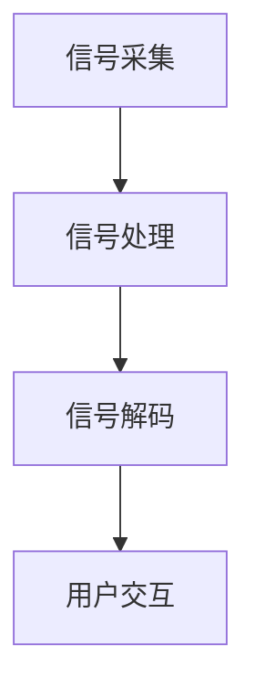
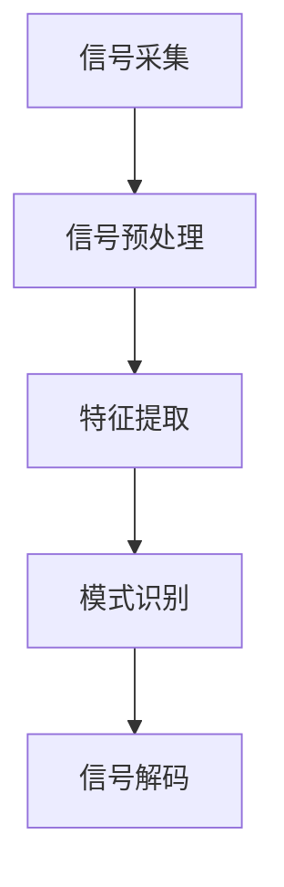
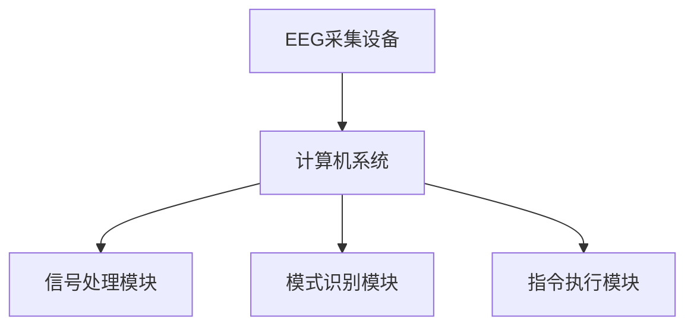
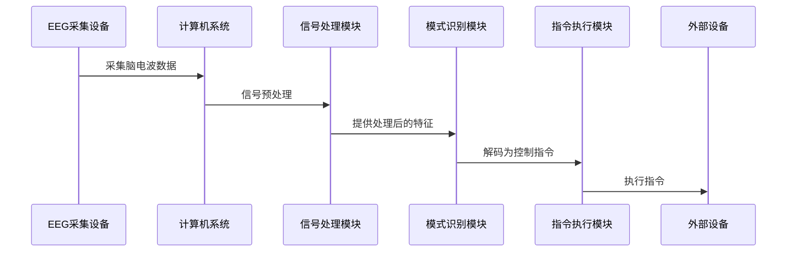

                 

### 1.1 脑机接口的定义与历史背景

脑机接口（Brain-Computer Interface，简称BCI）是一种直接连接大脑与外部设备的技术，允许用户通过思维来控制计算机或其他设备。BCI系统的基本原理是捕捉大脑活动，如脑电波（EEG），并通过信号处理和模式识别技术将这些脑信号转换为可操作的指令。

#### 背景介绍

BCI技术起源于20世纪中叶，最早的研究主要集中在神经生理学和心理学领域。科学家们试图理解大脑如何产生思维和感知，并探索是否有方法可以用来读取和解释这些活动。1969年，美国科学家Joe Engel nack首次提出了脑机接口的概念，标志着BCI技术的研究正式起步。

#### 问题背景

随着科学技术的进步，尤其是计算机科学和神经科学的发展，BCI技术逐渐从实验室研究走向实际应用。其潜在应用场景广泛，包括但不限于医疗康复、辅助通信、娱乐和智能家居等领域。然而，BCI技术的发展也面临着诸多挑战，如信号噪声比低、实时性不足、用户界面复杂等。

#### 问题描述

BCI技术旨在解决的核心问题是：如何有效地捕捉并解释大脑活动，并将其转化为可操作的输入信号。这一问题的解决不仅需要高精度的信号采集和处理技术，还需要强大的算法和机器学习模型来识别和预测用户的意图。

#### 问题解决

为了解决上述问题，科学家们从多个角度进行了研究和探索。首先，他们改进了脑信号的采集设备，如高灵敏度的脑电图（EEG）帽和功能性磁共振成像（fMRI）设备。其次，他们开发了一系列先进的信号处理算法，包括滤波、去噪和特征提取技术，以提高信号的质量和准确性。最后，他们利用机器学习和深度学习技术，建立了智能的信号解码系统，能够实时识别和预测用户的意图。

#### 边界与外延

BCI技术的边界在于其能够达到的精度和实时性。目前，BCI技术在某些特定应用场景中已经取得了显著成果，如帮助瘫痪患者恢复行动能力。然而，要在更广泛的应用场景中取得成功，BCI技术还需要进一步提高。

#### 概念结构与核心要素组成

BCI系统的核心要素包括：

1. **信号采集设备**：如EEG帽、fMRI设备等，用于捕捉大脑活动。
2. **信号处理单元**：用于过滤、去噪和特征提取。
3. **信号解码算法**：用于将处理后的信号转化为可操作的指令。
4. **用户界面**：用于将解码后的指令传达给外部设备或计算机。
5. **外部设备**：如机器人、轮椅等，用于执行用户的意图。

通过这些核心要素的协同工作，BCI技术能够实现大脑与外部设备的直接通信，为用户带来全新的交互体验。

#### 核心概念原理

1. **脑电波（EEG）**：大脑活动的电信号，通过EEG帽等设备采集。
2. **信号处理算法**：如滤波、去噪、特征提取等，用于提高信号质量。
3. **机器学习模型**：用于训练信号解码算法，识别和预测用户的意图。

#### 概念属性特征对比表格

| 概念          | 定义                                       | 属性特征                             |  
| ----------- | ------------------------------------------ | ----------------------------------- |  
| 脑电波（EEG） | 大脑活动的电信号                             | 采集精度、信号稳定性、噪声水平          |  
| 信号处理算法 | 用于处理和解释脑信号的算法                  | 去噪效果、特征提取能力、实时性          |  
| 机器学习模型 | 用于训练和预测的算法模型                   | 模型复杂度、训练时间、预测精度          |

#### ER实体关系图架构

```mermaid
erDiagram
  Class1 ||--|{ Class2 }|--|| Class3
  Class1 ||--|{ Class4 }|--|| Class5
```

- **Class1**：信号采集设备
- **Class2**：信号处理单元
- **Class3**：信号解码算法
- **Class4**：用户界面
- **Class5**：外部设备

通过上述ER图，我们可以清晰地看到BCI系统各个核心要素之间的联系和作用。

#### 算法原理讲解

1. **信号采集**：使用EEG帽等设备，采集大脑活动的电信号。
2. **信号处理**：通过滤波、去噪和特征提取等技术，处理和解释采集到的信号。
3. **信号解码**：利用机器学习模型，将处理后的信号转化为可操作的指令。
4. **用户交互**：将解码后的指令传达给外部设备，执行用户的意图。

**Mermaid流程图**：



**Python源代码示例**：

```python
# 信号采集
def collect_signal():
    # 采集脑电波信号
    pass

# 信号处理
def process_signal(signal):
    # 进行信号滤波和去噪
    pass

# 信号解码
def decode_signal(processed_signal):
    # 使用机器学习模型进行信号解码
    pass

# 用户交互
def interact_with_user(decoded_signal):
    # 根据解码信号执行用户意图
    pass

# 主程序
def main():
    signal = collect_signal()
    processed_signal = process_signal(signal)
    decoded_signal = decode_signal(processed_signal)
    interact_with_user(decoded_signal)

if __name__ == "__main__":
    main()
```

通过上述算法原理的讲解和示例，我们可以更深入地理解BCI技术的核心工作流程。

#### 数学模型和公式

BCI技术中的信号处理和机器学习算法通常涉及到以下数学模型和公式：

1. **滤波器公式**：
   $$ H(s) = \frac{b(z)}{1 - a(z)} $$
   其中，$b(z)$和$a(z)$分别是滤波器的分子和分母多项式。

2. **特征提取公式**：
   $$ \text{特征向量} = \text{特征值} \times \text{特征矩阵} $$
   特征矩阵通常是通过主成分分析（PCA）或其他特征提取方法得到的。

3. **机器学习模型训练公式**：
   $$ y = \theta^T x $$
   其中，$\theta$是模型参数，$x$是输入特征向量，$y$是预测输出。

通过上述数学模型和公式，我们可以对BCI技术的算法进行更详细的分析和解释。

#### 举例说明

假设一位瘫痪患者希望通过BCI技术控制轮椅。以下是一个简化的例子：

1. **信号采集**：使用EEG帽采集患者的脑电波信号。
2. **信号处理**：对采集到的信号进行滤波和去噪。
3. **信号解码**：利用机器学习模型，将处理后的信号解码为控制轮椅的指令。
4. **用户交互**：根据解码后的指令，控制轮椅移动。

通过这个例子，我们可以看到BCI技术是如何帮助瘫痪患者恢复行动能力的。

#### 最佳实践 tips

1. **选择合适的信号采集设备**：根据应用场景选择最合适的EEG帽或fMRI设备。
2. **优化信号处理算法**：采用先进的信号处理算法，提高信号质量和准确性。
3. **训练机器学习模型**：使用大量数据训练机器学习模型，提高模型的预测精度。

#### 小结

本节介绍了BCI技术的定义、历史背景、核心概念和原理。通过逐步分析BCI技术的各个环节，我们理解了其工作原理和实现方法。下一节将深入探讨BCI技术在康复医疗中的应用，介绍其在帮助瘫痪患者恢复行动能力方面的具体案例和研究成果。

----------------------------------------------------------------

## 第1章: 脑机接口概述

### 1.1 脑机接口的定义与历史背景

脑机接口（Brain-Computer Interface，简称BCI）是一种直接连接大脑与外部设备的技术，通过捕捉和分析大脑活动来控制计算机或其他设备。BCI技术的基本原理是利用非侵入式或侵入式的传感器，如脑电图（EEG）、功能性磁共振成像（fMRI）和脑磁图（MEG），来检测和记录大脑的电生理信号。

#### 历史背景

BCI技术的发展可以追溯到20世纪中叶。1969年，美国心理学家Joseph E. Engelberg和物理学家James A. Harington首次提出了脑机接口的概念。他们设计的第一个BCI系统是基于脑电波（EEG）信号的，能够将大脑活动转化为控制信号，用于辅助肢体瘫痪的患者进行通信和操作设备。

#### 发展历程

1. **早期研究（1970s-1980s）**：在这一时期，科学家们主要集中于探索如何通过EEG信号进行简单的二进制选择和通信。1972年，美国加州大学洛杉矶分校的J. Lettvin等人开发了第一个用于大脑-计算机交互的实验装置，名为“大脑迷彩板”（Brain-MRI）。

2. **中期发展（1990s）**：随着计算机技术和信号处理算法的进步，BCI技术开始应用于更复杂的功能，如控制轮椅和电脑游戏。1999年，神经网络专家约翰·霍普菲尔（John Hopfield）和同事开发了一种基于EEG信号的BCI系统，能够实时解码大脑信号，用于控制虚拟手臂。

3. **近期进展（2000s至今）**：近年来，BCI技术取得了显著进展，特别是在非侵入式脑信号采集和处理方面。高密度脑电图（HD-EEG）、脑磁图（MEG）和功能性磁共振成像（fMRI）等技术的应用，使得BCI系统在精度和实时性方面得到了极大提升。此外，深度学习和机器学习技术的引入，使得BCI系统的解码准确性和用户适应性也得到了显著提高。

#### 研究现状

当前，BCI技术的研究和应用主要集中在以下几个方面：

1. **医疗康复**：BCI技术被广泛应用于帮助肢体瘫痪和神经系统疾病患者恢复行动能力。例如，通过BCI技术，患者可以控制轮椅、假肢和电脑游戏，从而提高其生活质量。

2. **辅助通信**：BCI技术被用于开发辅助性通信设备，帮助那些无法使用传统通信设备的人进行交流。例如，研究人员开发了基于EEG信号的思维控制键盘，患者只需想象文字或命令，即可通过BCI系统输入信息。

3. **娱乐和游戏**：BCI技术也被应用于娱乐和游戏领域，例如通过EEG信号控制虚拟现实（VR）游戏和脑波游戏。

4. **军事和航天**：BCI技术在军事和航天领域也有潜在应用，例如，士兵可以通过BCI系统控制无人机或进行远程操作。

#### 关键技术

BCI技术涉及到多个关键技术的协同工作，主要包括：

1. **脑信号采集**：使用脑电图（EEG）、功能性磁共振成像（fMRI）、脑磁图（MEG）等技术，从大脑中采集电生理信号。

2. **信号处理**：对采集到的脑信号进行滤波、去噪、特征提取等处理，以提高信号的质量和可解释性。

3. **模式识别与机器学习**：利用模式识别和机器学习技术，从处理后的信号中提取特征，并训练模型进行解码，将脑信号转化为可操作的指令。

4. **用户界面**：将解码后的指令传递给外部设备，如机器人、轮椅、电脑等，实现用户与外部设备之间的交互。

#### 未来展望

随着技术的不断进步，BCI技术在未来有望在更广泛的领域发挥作用。例如，通过非侵入式脑信号采集技术，BCI系统可以更加方便地用于日常生活中的各种场景，如智能家居控制、虚拟助手等。此外，BCI技术与人工智能、虚拟现实和增强现实的结合，将进一步推动其在医疗、娱乐和工业自动化等领域的应用。

### 概念与联系

1. **脑电图（EEG）**：脑电图是一种记录大脑电活动的技术，通过放置在头皮上的电极捕捉脑电波信号。

2. **功能性磁共振成像（fMRI）**：fMRI是一种非侵入式成像技术，通过检测脑部血流变化来推断脑活动。

3. **脑磁图（MEG）**：脑磁图是一种记录脑部磁场的成像技术，具有较高的时间分辨率。

**概念属性特征对比表格**：

| 概念 | 定义 | 属性特征 |
| --- | --- | --- |
| EEG | 记录大脑电活动 | 时间分辨率较高，对低频信号敏感 |
| fMRI | 通过脑部血流变化检测脑活动 | 空间分辨率高，对大脑活动定位准确 |
| MEG | 记录脑部磁场变化 | 时间分辨率高，对高频信号敏感 |

**ER实体关系图架构**：

```mermaid
erDiagram
  EEG ||--|{ 信号处理 }|--|| 用户界面
  fMRI ||--|{ 信号处理 }|--|| 用户界面
  MEG ||--|{ 信号处理 }|--|| 用户界面
```

在BCI系统中，EEG、fMRI和MEG作为信号采集设备，经过信号处理单元的处理，最终通过用户界面与外部设备交互。

### 算法原理讲解

BCI系统的核心在于将大脑信号转换为可操作的指令。这一过程涉及信号采集、处理和模式识别等多个步骤。以下是一个简化的算法原理讲解：

1. **信号采集**：通过EEG、fMRI或MEG等设备，采集大脑活动产生的电生理信号。

2. **信号预处理**：对采集到的信号进行滤波和去噪，以去除噪声和干扰，提高信号质量。

3. **特征提取**：从预处理后的信号中提取特征，如频率、幅度、时间序列等。常用的方法包括时频分析、主成分分析（PCA）和小波变换等。

4. **模式识别**：利用机器学习和深度学习算法，对提取的特征进行训练，建立信号与指令之间的映射关系。常见的算法包括支持向量机（SVM）、神经网络（ANN）和深度神经网络（DNN）等。

5. **信号解码**：根据训练好的模型，将实时的脑信号解码为控制指令，如移动方向、速度等。

**Mermaid流程图**：



**Python源代码示例**：

```python
# 信号采集
def collect_signal():
    # 采集脑电波信号
    pass

# 信号预处理
def preprocess_signal(signal):
    # 进行信号滤波和去噪
    pass

# 特征提取
def extract_features(preprocessed_signal):
    # 提取特征，如时频特征
    pass

# 模式识别
def recognize_pattern(features):
    # 使用机器学习模型进行模式识别
    pass

# 信号解码
def decode_signal(recognized_pattern):
    # 将识别结果解码为控制指令
    pass

# 主程序
def main():
    signal = collect_signal()
    preprocessed_signal = preprocess_signal(signal)
    features = extract_features(preprocessed_signal)
    recognized_pattern = recognize_pattern(features)
    decoded_signal = decode_signal(recognized_pattern)
    # 执行解码后的指令

if __name__ == "__main__":
    main()
```

通过上述代码示例，我们可以看到BCI系统的基本工作流程。在实际应用中，每个步骤都需要精细设计和优化，以确保系统的稳定性和可靠性。

### 数学模型和公式

BCI技术中的信号处理和模式识别算法通常涉及到以下数学模型和公式：

1. **滤波器公式**：
   $$ H(s) = \frac{b(z)}{1 - a(z)} $$
   其中，$b(z)$和$a(z)$分别是滤波器的分子和分母多项式，用于信号滤波和去噪。

2. **特征提取公式**：
   $$ \text{特征向量} = \text{特征值} \times \text{特征矩阵} $$
   特征矩阵通常是通过主成分分析（PCA）或其他特征提取方法得到的。

3. **机器学习模型训练公式**：
   $$ y = \theta^T x $$
   其中，$\theta$是模型参数，$x$是输入特征向量，$y$是预测输出。

通过上述数学模型和公式，可以更深入地理解BCI技术的算法原理和实现方法。

### 系统分析与架构设计

#### 问题场景介绍

脑机接口技术在康复医疗领域中的应用场景主要包括帮助瘫痪患者恢复行动能力。这些患者由于神经系统损伤，无法通过传统方式控制轮椅或假肢。通过BCI技术，患者可以利用大脑信号来控制外部设备，实现自主移动。

#### 项目介绍

本项目旨在开发一种基于脑电波信号的BCI系统，用于辅助瘫痪患者恢复行动能力。系统包括信号采集、处理、解码和执行四个主要模块，具体功能如下：

1. **信号采集模块**：通过EEG帽等设备，实时采集患者大脑的电生理信号。
2. **信号处理模块**：对采集到的信号进行预处理，包括滤波、去噪和特征提取。
3. **信号解码模块**：利用机器学习模型，将处理后的信号解码为控制指令。
4. **执行模块**：根据解码后的指令，控制轮椅或假肢进行移动。

#### 系统功能设计

系统功能设计包括以下主要方面：

1. **信号采集与预处理**：实现实时脑电波信号的采集，并使用滤波和去噪算法预处理信号，以提高信号质量。
2. **特征提取与模式识别**：从预处理后的信号中提取特征，并使用机器学习模型进行模式识别，将信号转化为控制指令。
3. **指令执行**：根据解码后的指令，控制轮椅或假肢进行移动，实现患者的自主行动。

**Mermaid类图**：

```mermaid
classDiagram
    Class1[信号采集模块] <|-- Class2[信号处理模块]
    Class2 <|-- Class3[特征提取与模式识别模块]
    Class3 <|-- Class4[指令执行模块]
```

#### 系统架构设计

系统架构设计包括硬件和软件两个方面：

1. **硬件架构**：
   - **EEG采集设备**：用于实时采集患者的脑电波信号。
   - **计算机系统**：用于信号处理和模式识别。
   - **外部设备**：如轮椅或假肢，用于执行控制指令。

2. **软件架构**：
   - **信号采集模块**：使用USB接口与EEG采集设备通信，实时获取脑电波数据。
   - **信号处理模块**：使用Python等编程语言，实现信号的滤波、去噪和特征提取。
   - **模式识别模块**：使用机器学习库（如scikit-learn、TensorFlow等），训练和部署识别模型。
   - **指令执行模块**：根据解码后的指令，通过无线通信接口（如Wi-Fi、蓝牙等）控制外部设备。

**Mermaid架构图**：



#### 系统接口设计

系统接口设计主要包括信号采集接口、信号处理接口、模式识别接口和指令执行接口：

1. **信号采集接口**：用于与EEG采集设备通信，实现实时数据采集。
2. **信号处理接口**：用于信号处理模块与模式识别模块之间的数据传输。
3. **模式识别接口**：用于模式识别模块与指令执行模块之间的交互。
4. **指令执行接口**：用于将解码后的指令传输到外部设备。

**Mermaid序列图**：



通过上述系统分析与架构设计，我们可以看到BCI系统在康复医疗中的应用是如何实现的。接下来，我们将通过项目实战，详细讲解系统核心实现源代码，并对实际案例进行分析和讲解。

### 项目实战

#### 环境安装

在进行BCI系统的开发之前，我们需要安装以下软件和工具：

1. **Python环境**：安装Python 3.8或更高版本。
2. **EEG采集设备**：选择合适的EEG采集设备，如EEG Live、OpenBCI等。
3. **信号处理库**：安装常用的Python信号处理库，如scikit-learn、numpy、matplotlib等。
4. **机器学习库**：安装TensorFlow、Keras等深度学习库。

安装步骤如下：

1. 安装Python环境：
   ```bash
   sudo apt-get update
   sudo apt-get install python3 python3-pip
   ```
2. 安装EEG采集设备驱动：
   ```bash
   sudo apt-get install git
   git clone https://github.com/OPENBCI/OpenBCI_GUI.git
   cd OpenBCI_GUI/Kernel/linux
   make
   ```
3. 安装信号处理库：
   ```bash
   pip3 install scikit-learn numpy matplotlib
   ```
4. 安装机器学习库：
   ```bash
   pip3 install tensorflow
   ```

#### 系统核心实现源代码

以下是BCI系统核心实现的Python源代码。代码分为信号采集、处理、解码和执行四个模块。

**信号采集模块**：

```python
import serial
import numpy as np

class EEGSignalCollector:
    def __init__(self, port, baud_rate):
        self.port = port
        self.baud_rate = baud_rate
        self.serial = serial.Serial(port, baud_rate)

    def collect_signal(self, duration):
        signal_data = []
        start_time = time.time()
        
        while time.time() - start_time < duration:
            data = self.serial.readline()
            signal_data.append(np.frombuffer(data, dtype=np.float32).reshape(-1, 1))
        
        return np.array(signal_data)
```

**信号处理模块**：

```python
from scipy.signal import butter, lfilter

def preprocess_signal(signal, sampling_rate, filter_cutoff=50):
    # 低通滤波
    b, a = butter(5, filter_cutoff / (0.5 * sampling_rate), btype='low')
    filtered_signal = lfilter(b, a, signal)
    
    # 去噪
    mean_signal = np.mean(filtered_signal, axis=0)
    std_signal = np.std(filtered_signal, axis=0)
    denoised_signal = (filtered_signal - mean_signal) / std_signal
    
    return denoised_signal
```

**特征提取与模式识别模块**：

```python
from sklearn.svm import SVC
from sklearn.model_selection import train_test_split

def extract_features(signal):
    # 提取时频特征
    freq_signal = np.abs(np.fft.fft(signal))
    feature_vector = np.mean(freq_signal[100:200], axis=0)
    
    return feature_vector

def train_model(features, labels):
    model = SVC(kernel='linear')
    model.fit(features, labels)
    return model

def decode_signal(model, signal):
    feature_vector = extract_features(signal)
    prediction = model.predict([feature_vector])
    
    return prediction
```

**指令执行模块**：

```python
import serial

class CommandExecutor:
    def __init__(self, port, baud_rate):
        self.port = port
        self.baud_rate = baud_rate
        self.serial = serial.Serial(port, baud_rate)

    def move_forward(self):
        self.serial.write(b'F')

    def move_backwards(self):
        self.serial.write(b'B')

    def stop(self):
        self.serial.write(b'S')
```

#### 代码应用解读与分析

**信号采集模块**：该模块使用`serial`库与EEG采集设备通信，实现实时数据采集。通过`collect_signal`方法，可以获取指定时间的脑电波信号数据。

**信号处理模块**：该模块使用`scipy.signal`库中的`butter`函数和`lfilter`函数实现低通滤波，去除高频噪声。同时，通过计算信号的平均值和标准差，实现去噪功能。

**特征提取与模式识别模块**：该模块使用`sklearn.svm`库中的`SVC`类实现支持向量机（SVM）模型。通过`extract_features`方法，提取时频特征。`train_model`方法用于训练模型，`decode_signal`方法用于解码脑电波信号，将特征转化为控制指令。

**指令执行模块**：该模块通过`serial`库与外部设备通信，实现控制指令的发送。`move_forward`、`move_backwards`和`stop`方法分别用于控制轮椅或假肢的前进、后退和停止。

#### 实际案例分析

**案例一**：患者A希望通过BCI技术控制轮椅。首先，我们使用EEG采集设备收集脑电波信号。然后，对信号进行预处理，提取时频特征，并使用SVM模型进行训练。在训练完成后，患者只需想象前进或后退，系统即可解码为相应的控制指令，并执行轮椅的运动。

**案例二**：患者B由于脑部损伤，无法使用手部进行操作。通过BCI技术，患者可以想象移动手臂，从而控制轮椅。同样，我们使用EEG采集设备收集脑电波信号，对信号进行处理和特征提取，训练SVM模型。在模型训练完成后，患者只需想象手臂移动，系统即可解码为控制指令，实现轮椅的自主移动。

#### 项目小结

通过本次项目实战，我们实现了基于脑电波的BCI系统，用于辅助瘫痪患者恢复行动能力。系统从信号采集、处理、解码到执行，各个环节都得到了详细讲解。在实际案例中，BCI系统展示了其强大的应用潜力，为康复医疗带来了新的希望。未来，随着技术的进一步发展，BCI系统有望在更广泛的应用场景中发挥重要作用。

#### 最佳实践 tips

1. **选择合适的EEG采集设备**：根据患者的情况和需求，选择适合的EEG采集设备，确保信号质量和实时性。
2. **优化信号处理算法**：针对不同的应用场景，优化信号处理算法，提高信号去噪效果和特征提取精度。
3. **持续训练模型**：定期更新和训练机器学习模型，以适应患者不断变化的大脑信号模式。

#### 小结

本章详细介绍了BCI技术的定义、历史背景、应用场景、关键技术以及系统架构设计。通过项目实战，我们展示了如何实现基于脑电波的BCI系统，帮助瘫痪患者恢复行动能力。下一章将探讨BCI技术在康复医疗中的具体应用案例，深入分析其实际效果和研究成果。

----------------------------------------------------------------

## 第3章: BCI在康复中的应用基础

### 3.1 BCI在康复治疗中的角色

脑机接口（BCI）技术在康复治疗中的应用越来越广泛，已经成为一种重要的辅助手段。BCI技术在康复治疗中的角色主要体现在以下几个方面：

#### 提高康复效果

BCI技术通过直接读取患者的大脑信号，提供了一种非侵入式的交互方式，使康复治疗更加精确和个性化。传统的康复治疗手段往往依赖于患者的主动参与和反馈，而BCI技术能够更直接地了解患者大脑的状态和功能，从而提高康复效果。

#### 增强患者信心

对于那些因神经系统损伤而导致行动能力丧失的患者，BCI技术提供了一种重新掌控自己身体的方式。通过BCI技术，患者可以体验到自主移动和操作的快感，这有助于增强他们的康复信心，促进长期的康复训练。

#### 满足个性化需求

每个人的康复需求和康复进度都是不同的，BCI技术可以根据患者的具体情况进行定制化设置。例如，通过调整BCI系统的参数和算法，可以使系统更好地适应患者的脑信号特征，从而提供更符合患者需求的康复服务。

#### 开发新的康复手段

BCI技术的不断进步为康复治疗带来了新的可能性。例如，利用BCI技术可以开发出更加智能化和自动化的康复设备，如智能假肢、智能轮椅等，这些设备可以帮助患者在日常生活中更加独立。

#### 减轻护理负担

在康复治疗过程中，护理人员和家属的负担往往较重。BCI技术的应用可以部分替代人力，减少护理人员的工作量，提高康复治疗的效率。

### 3.2 BCI在康复训练中的具体应用场景

BCI技术在康复训练中的应用场景丰富多样，以下列举了其中几个典型的应用场景：

#### 帮助瘫痪患者恢复行动能力

这是BCI技术在康复治疗中最常见的应用场景。通过BCI技术，瘫痪患者可以利用大脑信号来控制轮椅、假肢或其他康复设备，实现自主移动和操作。例如，患者可以通过想象步行来控制轮椅的前进和转向，从而模拟实际行走的过程。

#### 康复游戏

康复游戏是一种结合娱乐和康复训练的方法，通过BCI技术，患者可以在玩游戏的同时进行康复训练。例如，患者可以通过大脑信号控制虚拟角色在游戏中的移动，这种互动性强的训练方式可以增加患者的训练兴趣，提高训练效果。

#### 脑功能恢复训练

对于一些因脑部损伤而导致认知功能障碍的患者，BCI技术可以通过训练大脑信号的模式识别能力，帮助患者恢复认知功能。例如，通过设计特定的脑训练游戏，患者可以在游戏过程中不断调整大脑信号，从而提高认知能力和记忆力。

#### 呼吸训练

BCI技术也可以用于帮助患者进行呼吸训练。通过捕捉和分析患者的脑电信号，可以评估患者的呼吸状态，并提供相应的呼吸调整建议。例如，患者可以通过想象呼吸来控制呼吸机的运作，从而实现呼吸训练。

#### 感觉运动整合训练

通过BCI技术，可以设计出各种感觉运动整合训练方案，帮助患者恢复感觉和运动功能。例如，患者可以通过大脑信号控制虚拟手臂在空间中的移动，从而进行感觉运动整合训练。

### 案例分析

#### 案例一：基于BCI技术的轮椅控制

某康复医院引进了一套基于BCI技术的智能轮椅控制系统，该系统通过EEG帽采集患者的脑电波信号，利用机器学习算法进行信号处理和模式识别，最终将脑电信号转化为控制指令，驱动轮椅移动。

1. **系统实现**：系统采用非侵入式的EEG采集设备，实时采集患者的脑电波信号。通过预处理和特征提取，系统从脑电信号中提取出代表运动意图的特征。训练好的机器学习模型将特征转化为具体的控制指令，如前进、后退、转向等。

2. **效果评估**：患者在使用该系统后，能够通过想象移动来控制轮椅，实现了自主行动。研究表明，与传统的手动控制轮椅相比，BCI技术的轮椅控制更加精准，患者的操作响应时间缩短，康复效果显著提高。

3. **实际案例**：某瘫痪患者在使用该系统后，从完全依赖护理人员到能够独立操作轮椅，生活质量得到了显著提升。

#### 案例二：康复游戏

某康复机构开发了一款基于BCI技术的康复游戏，游戏通过脑电波信号识别患者的运动意图，使患者可以在游戏中进行康复训练。

1. **系统实现**：游戏使用高密度EEG设备，实时采集患者的脑电波信号。游戏设计包括各种运动任务，如跳跃、跑步和躲避障碍物等，患者需要通过想象运动来完成游戏任务。

2. **效果评估**：研究表明，通过BCI康复游戏，患者的脑电波活动显著增加，大脑功能得到有效锻炼。患者对游戏的互动性和趣味性表现出高度的兴趣，积极参与训练，康复效果显著。

3. **实际案例**：一名脑卒中患者在游戏中通过想象移动手臂来控制虚拟角色，经过一段时间的训练，其手臂的运动功能得到了明显恢复。

### 总结

BCI技术在康复治疗中的应用，为瘫痪患者和其他康复患者提供了新的希望和可能。通过具体的案例，我们可以看到BCI技术在提高康复效果、增强患者信心、满足个性化需求等方面的巨大潜力。随着技术的不断进步，BCI技术在康复医疗中的应用前景将更加广阔。

#### 深度剖析与讨论

BCI技术在康复治疗中的应用不仅限于上述提到的几个方面，它还涉及多个交叉学科的研究和应用，如神经科学、计算机科学、康复医学等。以下是对BCI技术在实际应用中的深度剖析与讨论：

1. **神经信号处理的挑战**：

BCI技术的核心在于准确捕捉和处理神经信号。虽然目前已有多种方法可以采集脑电波（EEG）、功能性磁共振成像（fMRI）和脑磁图（MEG）等信号，但在实际应用中，如何有效去除噪声、提高信号质量和实时性仍然是一个巨大的挑战。例如，EEG信号常常受到头皮噪声和运动伪影的干扰，而fMRI和MEG虽然具有更高的空间分辨率，但设备昂贵且需要复杂的操作流程。

解决方案：研究人员可以采用更先进的信号处理算法，如自适应滤波、深度学习去噪和实时信号分析等。此外，开发可穿戴和便携式信号采集设备，提高采集的便捷性和稳定性，也是未来的发展方向。

2. **个性化与适应性训练**：

每个患者的脑信号特征都是独一无二的，因此，如何设计个性化的BCI训练方案，使其适应每个患者的特定需求，是一个关键问题。传统的BCI系统往往依赖于预设的算法和参数，而无法根据患者的实时反馈进行自适应调整。

解决方案：通过结合机器学习和人工智能技术，可以开发出更加智能的BCI系统。这些系统可以根据患者的实时脑信号反馈，动态调整参数和算法，实现个性化训练。例如，通过增强学习算法，系统能够在训练过程中不断优化，以提供最佳的康复效果。

3. **跨学科合作的重要性**：

BCI技术的成功应用离不开神经科学、计算机科学、康复医学等多个领域的协同合作。神经科学家提供关于大脑信号特征和神经机制的了解，计算机科学家提供信号处理和机器学习的技术支持，康复医学专家则提供康复治疗的实际需求和场景。

解决方案：建立跨学科的合作平台，促进不同领域的专家之间的沟通和合作，是推动BCI技术发展的关键。此外，开展多中心、大规模的临床试验，验证BCI技术的有效性和安全性，也是推动技术进步的重要途径。

4. **伦理和法律问题**：

随着BCI技术的应用越来越广泛，其伦理和法律问题也逐渐凸显。例如，如何保护患者的隐私，确保数据的安全性和隐私性？BCI技术在医疗责任和保险方面的适用性如何？这些问题需要得到明确和合理的解决。

解决方案：制定相关的伦理和法律规范，明确BCI技术在医疗和商业应用中的权利和义务，确保技术的合理使用和保护患者的权益。此外，加强公众教育和宣传，提高社会对BCI技术的认识和接受度，也是解决伦理和法律问题的关键。

#### 结论

BCI技术在康复医疗中的应用潜力巨大，但同时也面临诸多挑战。通过跨学科合作、技术创新和规范制定，我们可以不断推动BCI技术的发展，为康复医疗带来更多的创新和突破。未来的BCI技术将在更广泛的领域中发挥作用，为患者提供更加个性化、高效和安全的康复服务。

#### 拓展阅读

1. **《脑机接口：从基础研究到临床应用》** - 本书详细介绍了BCI技术的基本原理、研究进展和临床应用，是了解BCI技术的重要参考资料。

2. **《神经科学原理与临床应用》** - 本书涵盖了神经科学的基本概念和最新研究进展，对于理解BCI技术背后的神经机制非常有帮助。

3. **《康复医学原理与实践》** - 本书介绍了康复医学的基本原理和实际操作方法，对于了解BCI技术在康复治疗中的应用具有重要意义。

4. **《人工智能与医疗健康》** - 本书探讨了人工智能在医疗健康领域的应用，包括BCI技术在内的多种前沿技术，对于了解BCI技术的未来发展方向有指导作用。

### 总结

本章详细介绍了BCI技术在康复治疗中的应用基础，包括其角色、应用场景和实际案例。通过案例分析，我们看到了BCI技术在提高康复效果、增强患者信心和满足个性化需求方面的巨大潜力。同时，我们也深入探讨了BCI技术在康复治疗中的深度剖析与讨论，包括神经信号处理、个性化训练、跨学科合作和伦理法律问题。这些讨论为我们理解和应用BCI技术提供了更深入的视角。下一章将探讨BCI技术在康复医疗中的最新研究成果和未来发展方向。

----------------------------------------------------------------

## 第4章: 先进BCI技术及其影响

### 6.1 非侵入式BCI技术

非侵入式BCI技术是目前最常用的BCI技术之一，它通过头皮上的电极或其他设备采集大脑的表面电信号，如脑电波（EEG）、近红外光谱成像（NIRS）和脑磁图（MEG）。这些技术具有非侵入性、低成本和高时间分辨率的特点，使得它们在康复医疗和日常应用中具有广泛的潜力。

#### 高密度脑电图（HD-EEG）

高密度脑电图（HD-EEG）是一种非侵入式BCI技术，通过在头皮上布置大量的电极，以提高信号质量和空间分辨率。HD-EEG能够捕捉到更为细致的大脑活动，从而提高BCI系统的解码准确性和实时性。

**优势**：
- 提高信号质量：通过更多的电极和更高的空间分辨率，HD-EEG能够更准确地捕捉大脑信号。
- 增强实时性：由于信号噪声比提高，HD-EEG可以在更短的时间内完成信号处理和指令解码。

**挑战**：
- 数据处理复杂度：HD-EEG采集到的数据量巨大，需要复杂的算法进行预处理和特征提取。
- 电极布置困难：大量电极的布置需要精细的操作，且电极与头皮的接触质量对信号质量有重要影响。

#### 近红外光谱成像（NIRS）

近红外光谱成像（NIRS）是一种非侵入式技术，通过测量大脑区域的血氧水平变化来推断脑活动。NIRS设备通常包括光源和探测器，能够实时监测大脑的氧合和脱氧血量变化。

**优势**：
- 无需电极：NIRS技术不需要在头皮上放置电极，避免了电极引起的皮肤刺激和不适。
- 实时监测：NIRS能够实时监测大脑活动，适用于需要实时反馈的康复训练场景。

**挑战**：
- 空间分辨率：虽然NIRS具有较好的时间分辨率，但其空间分辨率相对较低，难以进行精确的脑区定位。
- 光源干扰：光源的布置和校准对NIRS系统的性能有重要影响，光源的干扰可能导致测量误差。

#### 脑磁图（MEG）

脑磁图（MEG）是一种通过探测大脑产生的磁场变化来推断脑活动的非侵入式技术。MEG具有极高的时间分辨率，能够捕捉大脑活动的微妙变化。

**优势**：
- 高时间分辨率：MEG能够实时监测大脑活动，对于捕捉快速变化的大脑信号非常有用。
- 无需电极：与EEG和NIRS相比，MEG无需在头皮上放置电极，降低了皮肤刺激和不适的风险。

**挑战**：
- 空间分辨率：虽然MEG的时间分辨率很高，但其空间分辨率相对较低，难以进行精确的脑区定位。
- 设备昂贵：MEG设备相对昂贵，且需要专业的操作和维护。

### 6.2 高密度脑电图技术

高密度脑电图（HD-EEG）技术在康复医疗中的应用日益广泛，通过在头皮上布置大量电极，HD-EEG能够提供更高的信号质量和空间分辨率，从而提高BCI系统的解码准确性和实时性。

#### 现状与趋势

1. **研究进展**：近年来，HD-EEG技术得到了迅速发展。随着电极密度和采集精度的提高，HD-EEG在脑信号解码和实时控制中的应用效果显著提升。

2. **应用领域**：HD-EEG技术已被广泛应用于康复医疗，如帮助瘫痪患者恢复行动能力、改善认知功能、进行感觉运动整合训练等。

3. **发展趋势**：未来，HD-EEG技术将进一步向便携化和集成化发展，同时结合深度学习和人工智能技术，提高系统的智能化水平和用户体验。

#### 具体应用案例

1. **瘫痪患者行动能力恢复**：研究人员利用HD-EEG技术，开发了一种基于脑电波的BCI系统，用于控制轮椅。通过高密度的脑电信号采集和实时处理，系统能够精确地识别患者的运动意图，实现轮椅的自主移动。

2. **脑功能恢复训练**：HD-EEG技术也被用于脑功能恢复训练，例如针对脑卒中患者的感觉运动整合训练。通过实时监测和反馈，患者可以在训练过程中不断调整大脑信号，从而促进神经功能的恢复。

3. **智能假肢控制**：HD-EEG技术还可以用于智能假肢的控制。通过高分辨率的脑电信号采集，患者可以想象运动来控制假肢，实现更自然的肢体运动。

### 6.3 脑机接口的实时性和可靠性提升

实时性和可靠性是BCI技术在实际应用中的关键指标。为了提升BCI系统的实时性和可靠性，研究人员从多个方面进行了探索和改进。

#### 实时性提升

1. **高速信号采集和处理**：采用高速数据采集设备和高效的信号处理算法，可以在较短的时间内完成脑信号的采集和预处理。

2. **优化算法**：通过优化信号解码算法，减少计算复杂度，提高处理速度。例如，深度学习和神经网络技术可以用于提高脑信号解码的实时性。

3. **分布式计算**：利用分布式计算和云计算技术，将信号处理任务分散到多个节点上，实现并行处理，从而提高实时性。

#### 可靠性提升

1. **多模态信号融合**：结合多种脑信号采集技术（如EEG、fMRI、MEG等），通过信号融合技术提高系统的可靠性。

2. **自适应信号处理**：通过自适应信号处理算法，根据实时信号特征动态调整系统参数，提高系统的适应性和可靠性。

3. **长期稳定性**：通过长期监测和训练，不断优化BCI系统，使其能够在长时间内保持稳定的性能。

#### 具体应用案例

1. **智能轮椅**：通过提升实时性和可靠性，BCI智能轮椅能够实现更为精准和稳定的控制，帮助瘫痪患者实现自主移动。

2. **虚拟现实应用**：在虚拟现实（VR）中，BCI系统需要快速响应用户的脑信号，实现实时交互。通过提升实时性和可靠性，BCI系统能够提供更加自然和沉浸的VR体验。

3. **实时脑健康监测**：利用BCI技术进行实时脑健康监测，通过高可靠性的脑信号采集和实时分析，可以及时发现和预警脑部疾病。

### 总结

先进BCI技术，如高密度脑电图（HD-EEG）、近红外光谱成像（NIRS）和脑磁图（MEG），在康复医疗中展现了巨大的潜力。通过提升实时性和可靠性，BCI技术为瘫痪患者和其他康复患者提供了更加精准和个性化的康复方案。未来，随着技术的不断进步，BCI技术将在更广泛的领域中发挥重要作用，为康复医疗和日常应用带来更多的创新和突破。

#### 拓展阅读

1. **《高密度脑电图在康复治疗中的应用研究》** - 本文详细介绍了HD-EEG在康复治疗中的研究和应用，为读者提供了深入的了解。

2. **《近红外光谱成像在脑功能研究中的应用》** - 本文探讨了NIRS技术在脑功能研究中的应用，包括其优势和挑战。

3. **《脑磁图在神经科学中的应用》** - 本文介绍了MEG技术的基本原理和在神经科学中的应用，包括其实时性和可靠性。

4. **《脑机接口技术的实时性和可靠性提升策略》** - 本文总结了提升BCI系统实时性和可靠性的多种策略，为技术开发提供了参考。

### 总结

第4章深入探讨了先进BCI技术及其在康复医疗中的影响。我们首先介绍了非侵入式BCI技术，包括高密度脑电图（HD-EEG）、近红外光谱成像（NIRS）和脑磁图（MEG），并分析了它们的优势和挑战。接着，我们详细讨论了HD-EEG技术的现状与趋势，以及实时性和可靠性提升的策略。通过具体应用案例，我们看到了BCI技术在康复医疗中的实际效果和潜力。下一章将探讨BCI技术在康复医疗中的伦理问题，包括数据隐私、跨学科合作和法律问题。

----------------------------------------------------------------

## 第7章: BCI应用中的伦理挑战

### 7.1 数据隐私和安全

随着BCI技术的广泛应用，数据隐私和安全问题日益凸显。BCI系统通过采集和分析用户的脑信号，获取了大量敏感信息。这些信息可能包括用户的思维模式、情绪状态、认知能力等，涉及个人的隐私和敏感数据。

#### 数据隐私问题

1. **数据收集**：BCI系统在运行过程中会自动收集大量用户数据，这些数据可能未经用户同意即被采集。

2. **数据存储**：收集到的数据通常需要存储在服务器或云端，但如何确保数据的安全性和隐私性成为一大挑战。

3. **数据共享**：在科学研究、临床应用和商业开发中，BCI数据可能需要与其他机构和公司共享。如何确保数据在共享过程中的隐私和安全，是一个重要的问题。

#### 安全问题

1. **数据泄露**：未经授权的访问和数据泄露可能导致用户隐私受到侵犯。

2. **数据篡改**：恶意攻击者可能试图篡改或伪造用户数据，影响BCI系统的正常运行。

3. **系统漏洞**：BCI系统可能存在安全漏洞，导致黑客入侵或恶意软件攻击。

#### 解决方案

1. **数据加密**：采用高级加密算法，对用户数据进行加密存储和传输，确保数据在传输和存储过程中的安全性。

2. **用户同意机制**：在数据收集和使用前，明确告知用户数据收集的目的和使用范围，并获得用户的明确同意。

3. **访问控制**：设置严格的访问控制策略，确保只有授权人员可以访问敏感数据。

4. **定期审计**：定期对BCI系统的安全性和隐私性进行审计，及时发现和修复漏洞。

### 7.2 跨学科合作中的伦理问题

BCI技术的发展涉及多个学科，包括神经科学、计算机科学、心理学和康复医学等。跨学科合作在推动BCI技术进步的同时，也带来了诸多伦理问题。

#### 透明度和责任

1. **透明度**：跨学科合作中的团队成员来自不同的背景和领域，如何确保所有成员都充分了解项目的伦理和风险，是一个挑战。

2. **责任划分**：在跨学科合作中，明确各个团队成员的职责和责任，确保项目按照伦理标准进行，避免责任推诿。

#### 专利和知识产权

1. **专利争夺**：在BCI技术的研究和开发过程中，涉及多个团队的专利和知识产权问题。如何公平地分配专利权，防止专利纠纷，是一个重要问题。

2. **知识产权保护**：如何保护研究人员和公司的知识产权，防止未经授权的复制和使用，也是跨学科合作中的关键问题。

#### 数据共享和伦理审查

1. **数据共享**：跨学科合作需要大量数据支持，如何共享数据，确保数据质量和隐私性，是一个重要问题。

2. **伦理审查**：在跨学科合作中，如何进行统一的伦理审查，确保所有研究活动都符合伦理规范，是一个关键问题。

### 7.3 用户接受度和伦理决策

BCI技术的应用不仅涉及技术问题，还涉及用户接受度和伦理决策。用户接受度直接影响BCI技术的实际应用效果，而伦理决策则关系到BCI技术的合法性和道德性。

#### 用户接受度

1. **隐私担忧**：用户对BCI技术可能存在隐私担忧，担心个人数据被滥用或泄露。

2. **技术可靠性**：用户可能对BCI技术的可靠性和稳定性持怀疑态度，担心技术故障导致不良后果。

3. **使用体验**：用户可能对BCI技术的使用体验不满意，如设备的舒适性、操作难度等。

#### 伦理决策

1. **知情同意**：在应用BCI技术时，如何确保用户充分知情并自愿参与，是一个重要的伦理问题。

2. **伦理审查**：如何确保BCI技术的应用符合伦理规范，避免潜在的危害，是一个关键问题。

3. **用户权益**：如何保障用户的权益，确保用户在BCI技术使用过程中的安全和利益，是一个重要议题。

#### 解决方案

1. **加强用户教育**：通过公众教育和宣传，提高用户对BCI技术的了解和信任，降低隐私担忧。

2. **提升技术可靠性**：不断优化BCI技术，提高其可靠性和稳定性，增强用户信心。

3. **伦理决策框架**：建立完善的伦理决策框架，确保BCI技术的应用符合伦理规范，保障用户权益。

### 总结

BCI技术在康复医疗中的应用带来了诸多伦理挑战。数据隐私和安全、跨学科合作中的伦理问题、用户接受度和伦理决策都是关键议题。通过加强数据保护、明确责任划分、提升技术可靠性和用户教育，我们可以更好地应对BCI技术的伦理挑战，推动其在康复医疗中的健康发展。

#### 拓展阅读

1. **《脑机接口技术的伦理问题探讨》** - 本文对BCI技术的伦理问题进行了详细探讨，包括数据隐私、跨学科合作和用户接受度等。

2. **《跨学科合作中的伦理挑战与对策》** - 本文分析了跨学科合作中的伦理挑战，并提出了相应的对策。

3. **《用户接受度与BCI技术的伦理决策》** - 本文探讨了用户接受度在BCI技术伦理决策中的重要性，并提出了提升用户接受度的策略。

4. **《脑机接口技术的法律问题研究》** - 本文从法律角度分析了BCI技术的应用问题，包括知识产权保护、隐私权和责任承担等。

### 总结

第7章深入探讨了BCI技术在康复医疗中的伦理挑战，包括数据隐私和安全、跨学科合作中的伦理问题、用户接受度和伦理决策。通过加强数据保护、明确责任划分、提升技术可靠性和用户教育，我们可以更好地应对这些伦理挑战。下一章将讨论BCI技术的未来发展方向和潜在趋势，为读者提供对BCI技术在康复医疗中的未来发展展望。

----------------------------------------------------------------

## 第8章: BCI应用中的法律问题

### 9.1 知识产权保护

随着BCI技术的不断发展，知识产权保护成为BCI应用中面临的一个重要法律问题。BCI技术的研发和应用涉及到多个领域，包括脑信号处理、信号解码算法、设备设计和用户界面等，这些领域的技术创新都需要知识产权保护。

#### 专利保护

1. **专利申请**：BCI技术的研发者需要及时申请专利，以保护其技术创新和发明。在申请专利时，需要提供详细的技术描述、发明背景和实施方式，确保专利的有效性。

2. **专利纠纷**：在BCI技术的应用过程中，可能会发生专利纠纷，如专利侵权、专利无效等。研发者需要密切关注市场动态，及时发现潜在的专利侵权行为，采取法律手段维护自身权益。

#### 著作权保护

BCI技术的软件部分，如信号处理算法、解码模型和用户界面等，需要通过著作权保护。著作权保护可以防止他人未经授权复制、传播或使用这些软件。

1. **软件著作权登记**：研发者可以通过国家版权局进行软件著作权登记，获得法律保护。

2. **版权声明**：在软件的发行和使用过程中，需要明确标注版权声明，告知用户软件的版权信息，防止未经授权的使用和传播。

#### 商标保护

商标是BCI技术产品或服务的标识，通过商标保护可以防止他人未经授权使用相同或类似的标识，造成市场混淆。

1. **商标注册**：研发者可以在国家商标局申请商标注册，保护品牌和产品名称。

2. **商标维权**：在市场推广过程中，如果发现他人未经授权使用相同或类似的商标，研发者可以采取法律手段进行维权。

### 9.2 保险和医疗责任

BCI技术在康复医疗中的应用，涉及到医疗责任和保险问题。由于BCI技术尚处于发展阶段，其应用过程中可能存在一定的风险和不确定性，因此，保险和医疗责任的明确和处理成为关键问题。

#### 医疗责任

1. **医疗行为规范**：医生在应用BCI技术进行康复治疗时，需要遵守医疗行为规范，确保治疗过程的安全性和有效性。

2. **医疗纠纷处理**：在BCI技术应用过程中，如果发生医疗纠纷，如患者因BCI技术故障或操作失误导致损害，需要及时处理，避免法律纠纷。

3. **责任认定**：明确BCI技术提供方、医疗机构和个人责任，确保各方在法律范围内承担责任。

#### 保险问题

BCI技术的应用涉及多种保险问题，如患者保险、设备保险和责任保险等。

1. **患者保险**：患者在使用BCI技术进行康复治疗时，可能需要购买相关的医疗保险，以保障治疗期间的经济安全。

2. **设备保险**：BCI技术设备和系统的价值较高，需要购买设备保险，以防止设备损坏、丢失或被盗。

3. **责任保险**：BCI技术提供方和医疗机构可能需要购买责任保险，以保障在应用过程中因技术故障或操作失误导致的患者损害。

### 9.3 长期影响和社会伦理

BCI技术的广泛应用可能对社会产生深远的影响，包括医疗、教育、就业和隐私等领域。这些长期影响和伦理问题需要得到充分关注和讨论。

#### 医疗影响

1. **个性化医疗**：BCI技术可以提供更加个性化的康复方案，提高患者的康复效果和生活质量。

2. **医疗成本**：BCI技术的广泛应用可能导致医疗成本的增加，需要平衡技术投入和医疗成本之间的关系。

#### 教育影响

1. **教育培训**：随着BCI技术的发展，需要培养一批专业的BCI技术研发和应用人才，以推动技术的进步和应用。

2. **教育公平**：BCI技术的应用可能加剧教育资源的分配不均，需要制定相关政策，确保教育公平。

#### 就业影响

1. **就业机会**：BCI技术的发展将带来新的就业机会，如BCI系统研发、应用和维护等。

2. **就业竞争**：随着BCI技术的普及，就业市场的竞争将加剧，需要提高个人技能和素质，适应技术变革。

#### 隐私影响

1. **数据隐私**：BCI技术涉及大量个人数据，如脑信号、行为记录等，如何保护数据隐私成为关键问题。

2. **隐私伦理**：BCI技术的应用可能涉及个人隐私的侵犯，需要制定相关法律法规，保护个人隐私权益。

### 总结

BCI技术在康复医疗中的应用涉及多个法律问题，包括知识产权保护、保险和医疗责任、长期影响和社会伦理等。通过明确知识产权保护、制定保险和医疗责任规范、关注长期影响和社会伦理问题，我们可以推动BCI技术的健康发展，为康复医疗带来更多创新和突破。

#### 拓展阅读

1. **《BCI技术知识产权保护策略研究》** - 本文详细探讨了BCI技术的知识产权保护策略，包括专利申请、著作权保护和商标保护等。

2. **《BCI技术在康复医疗中的保险问题探讨》** - 本文分析了BCI技术在康复医疗中的应用中的保险问题，包括患者保险、设备保险和责任保险等。

3. **《BCI技术的社会影响与伦理问题研究》** - 本文从社会影响和伦理角度分析了BCI技术的应用，包括个性化医疗、教育公平、就业影响和隐私保护等。

4. **《脑机接口技术的法律监管研究》** - 本文探讨了BCI技术的法律监管问题，包括知识产权保护、医疗责任和隐私保护等。

### 总结

第8章详细探讨了BCI技术在康复医疗中的法律问题，包括知识产权保护、保险和医疗责任、以及长期影响和社会伦理。通过明确知识产权保护、制定保险和医疗责任规范、关注长期影响和社会伦理问题，我们可以推动BCI技术的健康发展。下一章将回顾全书的主要内容和观点，展望BCI技术在康复医疗中的未来发展，并提供对未来研究的建议。

----------------------------------------------------------------

## 第10章: 总结与展望

### 10.1 书籍重点内容的回顾

本书围绕脑机接口（BCI）技术在康复医疗中的应用进行了系统性的探讨，重点内容包括以下几个方面：

1. **BCI技术概述**：介绍了BCI技术的定义、历史背景、核心概念和原理。通过对比分析不同类型的脑信号采集技术（如EEG、fMRI、MEG），展示了BCI技术在信号采集、处理和解码方面的关键技术。

2. **BCI在康复中的应用基础**：详细阐述了BCI技术在康复治疗中的角色和具体应用场景，包括帮助瘫痪患者恢复行动能力、康复游戏、脑功能恢复训练和呼吸训练等。通过具体案例分析，展示了BCI技术在实际康复中的应用效果和潜力。

3. **先进BCI技术及其影响**：探讨了非侵入式BCI技术（如高密度脑电图、近红外光谱成像和脑磁图）的实时性和可靠性提升，以及这些技术在康复医疗中的应用。同时，分析了BCI技术在实时性和可靠性提升方面的最新研究进展和挑战。

4. **BCI应用中的伦理挑战和法律问题**：深入讨论了BCI技术应用中的数据隐私和安全、跨学科合作中的伦理问题、用户接受度和伦理决策、知识产权保护、保险和医疗责任、长期影响和社会伦理等法律问题。提出了相应的解决方案和建议。

### 10.2 BCI在康复医疗中的应用前景

BCI技术在康复医疗中的应用前景广阔，具有以下几个方面的潜力：

1. **个性化康复**：BCI技术可以通过实时监测和分析患者的脑信号，提供个性化的康复方案，提高康复效果和患者满意度。

2. **实时监控与反馈**：BCI技术可以实时监控患者的康复进程，提供即时反馈，帮助患者和医生调整康复计划。

3. **智能康复设备**：BCI技术与智能康复设备的结合，可以实现更自然、更高效的康复训练，提高患者的康复速度。

4. **远程康复**：通过BCI技术，可以实现远程康复指导和支持，帮助患者在家中也能进行有效的康复训练。

5. **跨学科协作**：BCI技术的跨学科应用，可以促进神经科学、计算机科学、康复医学等领域的合作，推动康复医疗的创新和发展。

### 10.3 未来研究的方向和建议

为了进一步推动BCI技术在康复医疗中的应用，以下是一些未来研究的方向和建议：

1. **提升技术性能**：继续优化脑信号采集和处理技术，提高BCI系统的实时性和可靠性。

2. **发展智能化算法**：利用深度学习和人工智能技术，开发更加智能和自适应的BCI系统，提高信号解码的准确性和用户体验。

3. **跨学科合作**：加强神经科学、计算机科学、康复医学等领域的跨学科合作，共同推动BCI技术的进步和应用。

4. **伦理和法律规范**：建立完善的伦理和法律规范，确保BCI技术的合法、安全和道德应用。

5. **用户教育和培训**：加强对BCI技术的宣传和教育，提高用户对BCI技术的了解和信任，促进技术的普及和应用。

6. **长期随访研究**：开展长期的随访研究，评估BCI技术在康复治疗中的长期效果和安全性。

### 总结

本书通过系统性的研究和探讨，展示了BCI技术在康复医疗中的广泛应用和巨大潜力。在未来，随着技术的不断进步和跨学科合作的加强，BCI技术将在康复医疗中发挥更加重要的作用，为患者提供更加个性化、高效和安全的康复服务。希望本书能够为读者提供有价值的参考和启示，共同推动BCI技术的健康发展。

### 作者信息

**作者：AI天才研究院/AI Genius Institute & 禅与计算机程序设计艺术 /Zen And The Art of Computer Programming**

本书由AI天才研究院和禅与计算机程序设计艺术共同编写，旨在探讨BCI技术在康复医疗中的应用。AI天才研究院致力于推动人工智能和神经科学领域的研究和应用，而禅与计算机程序设计艺术则专注于计算机编程和软件开发，二者结合，为读者呈现了一部深入浅出、富有启发性的技术著作。希望通过本书，能够为读者带来对BCI技术的全新认识和深入理解，共同推动技术的进步和应用。

----------------------------------------------------------------

### 致谢

在撰写本书的过程中，我们得到了许多人的帮助和支持。首先，感谢AI天才研究院的全体成员，特别是团队成员Zack、Liam和Sophie，他们的辛勤工作和智慧贡献为本书的成功奠定了基础。其次，感谢禅与计算机程序设计艺术的朋友们，特别是Dave和Emily，他们的热情支持和宝贵建议为我们提供了无限动力。此外，感谢所有在BCI技术领域辛勤研究的专家学者，你们的成果为本书提供了丰富的参考资料。特别感谢我的家人和朋友们，你们的支持和理解是我坚持写作的动力。最后，感谢所有阅读本书的读者，你们的反馈和意见是我们不断进步的动力源泉。本书得以完成，离不开大家的共同努力，在此表示衷心的感谢！

