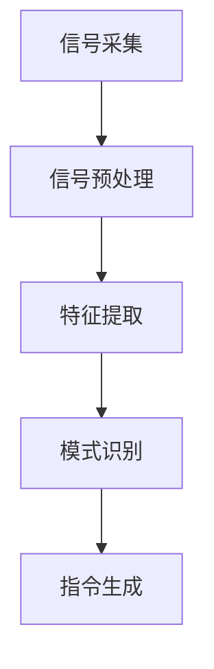
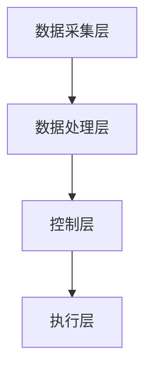
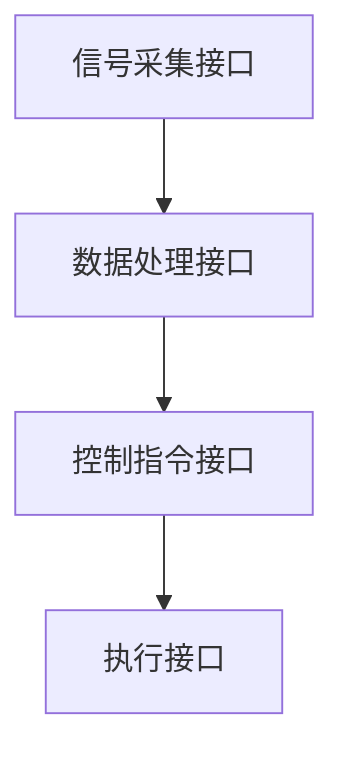
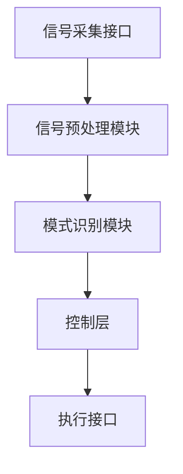

                 

### 引言

脑机接口（Brain-Computer Interface, BCI）技术，作为近年来科技界的热门话题，正逐步改变我们的生活。通过直接连接人脑与外部设备，BCI 技术使人类能够通过思维控制和操作计算机、机器人、可穿戴设备等。然而，随着这项技术的发展，伦理和隐私问题逐渐成为公众关注的焦点。

本文旨在探讨脑机接口技术的伦理和隐私问题，通过以下结构进行详细分析：

1. **背景介绍**：介绍脑机接口技术的基本概念、发展历程及其在现实生活中的应用。
2. **核心概念与联系**：解析脑机接口技术、隐私问题、伦理问题的概念及其相互关系。
3. **算法原理讲解**：阐述脑机接口算法的原理，包括数学模型和公式的介绍，以及具体的算法流程图和举例说明。
4. **系统分析与架构设计方案**：展示脑机接口系统的功能设计、架构设计、接口设计和系统交互。
5. **项目实战**：通过实际案例分析和代码应用，深入剖析脑机接口项目的实现。
6. **最佳实践与拓展阅读**：总结最佳实践，提供拓展阅读资源。

让我们一步步思考，详细探讨脑机接口技术的伦理和隐私问题，以期为这一前沿科技领域的发展提供有益的思考和参考。

## 背景介绍

### 1.1 脑机接口技术概述

脑机接口（Brain-Computer Interface, BCI）技术是一种通过直接连接人脑与外部设备，实现人机交互的先进技术。其基本原理是通过记录和解析大脑活动信号，将这些信号转换为机器可以识别和响应的指令。最早期的BCI技术起源于20世纪60年代，主要应用于神经科学研究。随着科技的进步，BCI技术逐渐从实验室走向实际应用，成为医疗、教育、娱乐等领域的重要工具。

BCI技术的基本原理可以分为以下几个步骤：首先，通过传感器（如电极、脑磁图等）采集大脑活动信号；其次，利用信号处理算法对原始信号进行滤波、去噪和特征提取；最后，将提取的特征信号转换为机器指令，实现人脑对设备的控制。这一过程需要高度精确的信号处理和实时性强的计算能力，以确保指令的准确性和响应速度。

### 1.2 问题背景

脑机接口技术之所以引发广泛关注，不仅因为其卓越的应用潜力，更因为其带来的伦理和隐私问题。近年来，随着BCI技术的不断发展，各种应用场景不断涌现，如帮助残疾人士恢复行动能力、辅助正常人进行更高效的思维工作、实现人机混合智能等。然而，这些应用同时也带来了前所未有的挑战。

首先，隐私问题日益凸显。由于BCI技术能够直接读取大脑活动信号，这意味着个人的思维和情感状态可以被外部设备实时监控和记录。这种深度监控不仅涉及到个人隐私的泄露，还可能被用于操纵和干预个人的行为和思想。例如，企业可能会利用BCI技术来监控员工的工作状态，甚至通过大脑信号干预其决策过程，这引发了广泛的伦理争议。

其次，伦理问题同样严峻。BCI技术的应用涉及到人类大脑这一复杂的生物系统，其潜在的副作用和风险尚未完全明确。例如，长期使用BCI设备可能对大脑产生不可逆的影响，甚至可能引发精神健康问题。此外，BCI技术还可能加剧社会阶层差距，使拥有这项技术的人获得更多的优势，而普通人则被边缘化。

### 1.3 问题描述

脑机接口技术的伦理和隐私问题主要表现在以下几个方面：

1. **隐私泄露**：BCI技术能够直接读取大脑活动信号，这意味着用户的思维和情感状态可以被监控和记录，从而引发隐私泄露的风险。
2. **数据滥用**：收集的大脑数据可能会被用于商业目的或政治干预，甚至被黑客攻击和恶意利用。
3. **社会不平等**：BCI技术的昂贵价格和复杂操作使其成为少数人的专属工具，可能导致社会阶层差距进一步扩大。
4. **伦理困境**：BCI技术的应用涉及到对人类大脑这一复杂系统的干预，其伦理问题尚未得到充分讨论和解决。

### 1.4 问题解决

解决脑机接口技术的伦理和隐私问题需要多方协作，包括政府、企业、学术机构和公众。以下是一些可能的解决思路：

1. **法律法规**：制定相关法律法规，明确BCI技术的应用范围和限制，保护用户隐私。
2. **技术措施**：研发更加安全、可靠的BCI技术，确保数据的加密和安全传输。
3. **伦理审查**：在BCI技术的开发和应用过程中引入伦理审查机制，确保其符合伦理标准。
4. **公众参与**：提高公众对BCI技术的认知和理解，鼓励公众参与讨论和决策，共同应对伦理和隐私挑战。

### 1.5 边界与外延

脑机接口技术的边界涉及多个方面，包括技术本身、应用场景、伦理和隐私问题等。其外延则涉及到广泛的领域，如医疗、教育、军事、娱乐等。了解这些边界和外延有助于我们更全面地理解BCI技术的潜在影响和挑战。

### 1.6 概念结构与核心要素组成

脑机接口技术的概念结构主要由以下几个核心要素组成：

1. **传感器**：用于采集大脑活动信号的设备，如电极、脑磁图等。
2. **信号处理算法**：对采集到的信号进行处理、滤波、去噪和特征提取，以转换为机器指令。
3. **转换器**：将处理后的信号转换为机器可以识别的指令。
4. **用户**：使用BCI技术进行人机交互的个体。
5. **设备**：接收BCI指令并执行相应操作的设备，如计算机、机器人、可穿戴设备等。

这些要素相互关联，共同构成了脑机接口技术的核心框架。了解这些核心要素及其相互关系，有助于我们深入理解BCI技术的工作原理和应用潜力。

## 核心概念与联系

### 2.1 脑机接口技术核心概念

脑机接口（BCI）技术涉及多个核心概念，理解这些概念是深入探讨其伦理和隐私问题的前提。以下是几个关键概念及其相互关系：

#### 2.1.1 脑机接口技术原理

脑机接口技术的基本原理是通过传感器采集大脑活动信号，然后利用信号处理算法将这些信号转换为控制指令。这个过程可以分为以下几个步骤：

1. **信号采集**：使用电极、脑磁图等设备直接从大脑中采集电信号。
2. **信号处理**：对采集到的信号进行滤波、去噪和特征提取，以提取出有用的信息。
3. **信号解码**：利用机器学习算法或其他信号处理技术将处理后的信号转换为机器指令。
4. **指令执行**：外部设备根据解码后的指令执行相应的操作。

#### 2.1.2 概念属性特征对比表格

以下是一个简单的对比表格，展示了BCI技术中几个关键概念的属性特征：

| 概念        | 属性特征                  |  
| ----------- | ------------------------ |  
| 传感器      | 用于采集大脑活动信号      |  
| 信号处理算法 | 用于处理和解析信号        |  
| 转换器      | 将信号转换为机器指令      |  
| 用户        | 使用BCI技术进行交互的个体  |  
| 设备        | 执行BCI指令的设备        |

#### 2.1.3 概念之间的联系

这些概念之间有着密切的联系，构成了BCI技术的核心框架。传感器作为信号采集的起点，是整个系统的输入端；信号处理算法则负责对原始信号进行处理和解析，是系统的核心处理单元；转换器将处理后的信号转换为机器指令，是实现人机交互的关键环节；用户和设备则共同构成了BCI技术的应用场景，是整个系统的输出端。

### 2.2 隐私问题

隐私问题在BCI技术中尤为突出，因为BCI设备可以直接读取和记录用户的思维和情感状态。以下是隐私问题的核心概念及其相互关系：

#### 2.2.1 概念介绍

1. **数据收集**：BCI设备在采集大脑活动信号的过程中，会自动收集大量的个人信息。
2. **数据存储**：收集的数据需要被存储和管理，以供后续分析和应用。
3. **数据传输**：存储的数据需要传输到服务器或进行分析，这涉及到数据的安全性和隐私保护。
4. **数据利用**：收集的数据可以用于研究、商业应用或其他目的，但需确保合法和合理使用。

#### 2.2.2 概念属性特征对比表格

| 概念        | 属性特征                  |  
| ----------- | ------------------------ |  
| 数据收集    | 收集大脑活动信号和个人信息 |  
| 数据存储    | 存储和管理数据            |  
| 数据传输    | 安全传输数据              |  
| 数据利用    | 合法和合理使用数据        |

#### 2.2.3 概念之间的联系

这些隐私问题概念之间也存在紧密的联系。数据收集是隐私问题的起点，决定了后续数据存储、传输和利用的方式。数据存储和安全传输是确保隐私保护的关键环节，而数据的合法和合理利用则涉及到隐私问题的重要方面。

### 2.3 伦理问题

伦理问题在BCI技术中同样重要，因为其涉及到人类大脑这一复杂系统的干预和使用。以下是伦理问题的核心概念及其相互关系：

#### 2.3.1 概念介绍

1. **知情同意**：在进行BCI实验或应用时，用户需要被告知其参与的目的、风险和收益，并自愿同意。
2. **数据安全**：确保收集、存储和传输的数据不被未经授权的人员访问或滥用。
3. **伦理审查**：在BCI技术的开发和应用过程中，需要经过伦理审查委员会的审查，以确保其符合伦理标准。
4. **责任归属**：在BCI技术应用过程中，需要明确责任归属，确保在出现问题时能够及时有效地处理。

#### 2.3.2 概念属性特征对比表格

| 概念        | 属性特征                  |  
| ----------- | ------------------------ |  
| 知情同意    | 用户自愿参与              |  
| 数据安全    | 确保数据不被滥用           |  
| 伦理审查    | 确保应用符合伦理标准      |  
| 责任归属    | 明确责任和责任承担者      |

#### 2.3.3 概念之间的联系

这些伦理问题概念之间也存在密切的联系。知情同意是伦理审查的前提，数据安全是确保用户隐私和权益的关键，而伦理审查和责任归属则是确保BCI技术应用过程合规和公正的重要保障。

### 总结

脑机接口技术、隐私问题和伦理问题是BCI技术中三个关键概念，它们相互关联，共同构成了BCI技术的核心框架。理解这些概念及其相互关系，有助于我们深入探讨BCI技术的伦理和隐私问题，并为未来的发展提供有益的思考和指导。

## 算法原理讲解

### 4.1 脑机接口算法原理

脑机接口（BCI）算法的核心在于将大脑活动信号转换为可执行的指令。这一过程涉及到信号采集、预处理、特征提取和模式识别等多个环节。以下是对BCI算法原理的详细讲解。

#### 4.1.1 脑机接口算法概述

脑机接口算法的基本流程可以概括为：

1. **信号采集**：使用脑电图（EEG）、功能性磁共振成像（fMRI）、脑磁图（MEG）等设备采集大脑活动信号。
2. **信号预处理**：对采集到的信号进行滤波、去噪和归一化处理，以提高信号质量。
3. **特征提取**：从预处理后的信号中提取出具有区分性的特征，如时间域特征、频率域特征和时频特征。
4. **模式识别**：利用机器学习算法或神经网络模型对提取的特征进行模式识别，从而生成控制指令。

#### 4.1.2 算法流程图

以下是一个简化的BCI算法流程图，展示了上述步骤：



#### 4.1.3 算法数学模型和公式

BCI算法的数学模型通常涉及以下步骤：

1. **信号采集**：假设采集到的原始信号为 \( s(t) \)，则信号处理的第一步是对其进行滤波，以去除噪声和干扰。
    $$ y(t) = f(s(t)) $$
    其中，\( f(\cdot) \) 表示滤波函数。

2. **特征提取**：特征提取通常涉及频域分析，如傅里叶变换（Fourier Transform，FT）或短时傅里叶变换（Short-Time Fourier Transform，STFT）。
    $$ X(\omega,t) = FT\{ y(t) \} $$
    或
    $$ x(\omega,t) = STFT\{ y(t) \} $$

3. **模式识别**：使用机器学习算法（如支持向量机SVM、神经网络NN等）对提取的特征进行分类。
    $$ \hat{c} = \arg\max_w \sum_{i=1}^N \delta(c_i, w) $$
    其中，\( \hat{c} \) 表示预测的分类标签，\( w \) 表示权重向量，\( \delta(\cdot, \cdot) \) 表示分类函数。

4. **指令生成**：根据识别结果生成控制指令。
    $$ \text{command} = g(\hat{c}) $$
    其中，\( g(\cdot) \) 表示指令生成函数。

#### 4.1.4 举例说明

以EEG信号为例，假设采集到的原始EEG信号为 \( s(t) \)，我们首先对其进行带通滤波，以去除频率在1-50Hz以外的噪声。滤波后的信号为 \( y(t) \)。然后，使用短时傅里叶变换对 \( y(t) \) 进行频域分析，得到频谱 \( X(\omega,t) \)。接下来，使用支持向量机（SVM）对频谱进行分类，以识别不同的脑活动模式。最后，根据分类结果生成控制指令，如移动鼠标、打字等。

以下是具体的Python代码示例：

```python
import numpy as np
from scipy.signal import butter, lfilter
from scipy.fft import fft
from sklearn.svm import SVC

# 假设采集到的EEG信号
s = np.random.randn(1000)

# 带通滤波
def butter_bandpass_filter(data, lowcut, highcut, fs, order=4):
    nyq = 0.5 * fs
    low = lowcut / nyq
    high = highcut / nyq
    b, a = butter(order, [low, high], btype='band')
    y = lfilter(b, a, data)
    return y

filtered_s = butter_bandpass_filter(s, 1, 50, 1000)

# 短时傅里叶变换
window = np.hamming(256)
nperseg = 256
overlap = 0
freqs = np.fft.rfftfreq(nperseg, 1/1000)
stft = np.abs(fft(filtered_s * window))
stft = stft[:, :nperseg//2]

# SVM分类
clf = SVC()
clf.fit(stft, labels)

# 预测和生成指令
predictions = clf.predict(stft)
commands = ['move_mouse'] * len(predictions)

print(predictions)
print(commands)
```

通过上述代码示例，我们可以看到如何将EEG信号处理和分类，生成相应的控制指令。这只是一个简单的例子，实际的BCI系统会更加复杂，涉及更多的信号处理技术和机器学习算法。

## 系统分析与架构设计方案

### 5.1 问题场景介绍

脑机接口技术（BCI）在现代医学、康复、军事和娱乐等领域有着广泛的应用。例如，在医学领域，BCI技术被用于帮助截肢者通过大脑信号控制假肢；在康复领域，BCI技术帮助中风患者恢复运动能力；在军事领域，BCI技术被用于提高士兵的战斗效率和反应速度；在娱乐领域，BCI技术被用于创造更加沉浸式的游戏体验。

然而，随着BCI技术的广泛应用，如何设计和实现一个高效、安全、可靠的系统成为了一个重要的课题。本节将介绍一个BCI系统的设计和实现，包括其功能设计、系统架构、接口设计和系统交互。

### 5.2 项目介绍

本项目旨在设计一个基于脑电图（EEG）信号的BCI系统，实现以下功能：

1. **信号采集**：通过电极采集用户的EEG信号。
2. **信号预处理**：对采集到的EEG信号进行滤波、去噪和特征提取。
3. **模式识别**：利用机器学习算法对提取的特征进行分类，生成控制指令。
4. **指令执行**：根据识别结果执行相应的操作，如控制鼠标移动、打字等。

### 5.3 系统功能设计

BCI系统的核心功能模块包括信号采集模块、信号预处理模块、模式识别模块和指令执行模块。以下是这些模块的详细描述：

1. **信号采集模块**：负责采集用户的EEG信号。采集设备包括EEG电极、放大器和数据采集卡。该模块需要确保信号的高保真和稳定性。

2. **信号预处理模块**：对采集到的EEG信号进行滤波、去噪和归一化处理。滤波用于去除低频噪声和高频干扰，去噪用于消除信号中的随机噪声，归一化则用于调整信号幅值，使其适合后续处理。

3. **模式识别模块**：利用机器学习算法（如支持向量机SVM、神经网络NN等）对预处理后的信号特征进行分类。该模块是实现BCI控制指令生成的核心。

4. **指令执行模块**：根据模式识别模块生成的控制指令，执行相应的操作，如控制鼠标移动、键盘输入等。该模块需要与外部设备（如计算机、机器人等）进行通信和交互。

### 5.4 系统架构设计

BCI系统的整体架构可以分为四层：数据采集层、数据处理层、控制层和执行层。以下是各层的详细描述：

1. **数据采集层**：负责信号的采集，包括EEG电极、放大器和数据采集卡。该层需要确保信号的高保真和稳定性。

2. **数据处理层**：包括信号预处理模块和模式识别模块。该层对采集到的信号进行处理，提取有用的特征，并利用机器学习算法进行分类，生成控制指令。

3. **控制层**：接收模式识别模块生成的控制指令，根据指令执行相应的操作，如控制鼠标移动、键盘输入等。该层需要与外部设备进行通信和交互。

4. **执行层**：执行控制层生成的操作指令，如控制鼠标移动、键盘输入等。该层与外部设备（如计算机、机器人等）进行交互。

以下是BCI系统的架构图：



### 5.5 系统接口设计和系统交互

BCI系统的接口设计需要考虑信号采集、数据处理、控制指令生成和执行等多个方面。以下是各接口的详细描述：

1. **信号采集接口**：用于连接EEG电极和数据采集卡，实现信号的高效采集。

2. **数据处理接口**：用于连接信号预处理模块和模式识别模块，实现信号处理过程的模块化。

3. **控制指令接口**：用于连接模式识别模块和控制层，实现控制指令的生成和传输。

4. **执行接口**：用于连接控制层和执行层，实现控制指令的执行。

以下是BCI系统的接口设计图：



系统交互过程如下：

1. 信号采集接口采集EEG信号，并将其传递给信号预处理模块。
2. 信号预处理模块对信号进行滤波、去噪和归一化处理，提取特征信号，传递给模式识别模块。
3. 模式识别模块对特征信号进行分类，生成控制指令，传递给控制层。
4. 控制层根据控制指令执行相应的操作，通过执行接口与外部设备进行交互。

以下是系统交互序列图：



通过上述系统架构和接口设计，我们可以构建一个高效、安全、可靠的BCI系统，实现人脑与外部设备的直接交互。

### 6.1 环境安装

要搭建一个脑机接口（BCI）系统，首先需要安装和配置必要的软件和硬件环境。以下是环境安装的具体步骤：

#### 6.1.1 软件安装

1. **操作系统**：推荐使用Linux操作系统，如Ubuntu 18.04或更高版本。如果使用Windows或Mac OS，可能需要额外配置。
2. **Python环境**：安装Python 3.8或更高版本。可以通过包管理器（如Ubuntu的APT）或从Python官网下载安装。
   ```bash
   sudo apt update
   sudo apt install python3 python3-pip
   ```
3. **pip**：安装pip，Python的包管理器。
   ```bash
   sudo apt install python3-pip
   ```
4. **pip安装关键库**：安装以下关键库，包括NumPy、SciPy、Matplotlib、Scikit-learn、PyQt5等。
   ```bash
   pip3 install numpy scipy matplotlib scikit-learn pyqt5
   ```
5. **EEG信号采集设备驱动**：根据所使用的EEG信号采集设备，安装相应的驱动程序。例如，对于OpenBCI设备，可以访问[OpenBCI官网](https://openbci.com/)下载并安装驱动。

#### 6.1.2 硬件配置

1. **EEG采集设备**：连接EEG采集设备，如OpenBCI Cyton或g.USBee。确保设备已正确连接到计算机，并在设备管理器中显示。
2. **电极和放大器**：根据用户手册，安装电极和放大器，并进行必要的校准。

#### 6.1.3 环境验证

完成上述安装步骤后，可以通过以下命令验证安装环境是否正确：

```bash
# 检查Python版本
python3 --version

# 检查pip版本
pip3 --version

# 检查关键库安装情况
pip3 list | grep -E 'numpy|scipy|matplotlib|scikit-learn|pyqt5'

# 检查EEG采集设备驱动是否正常工作
python3 -c "import serial; print(serial.list_ports())"
```

如果上述命令能正常运行且显示正确的版本信息和设备列表，则说明环境安装成功。

### 6.2 系统核心实现源代码

本节将展示BCI系统核心部分的实现，包括信号采集、预处理、特征提取和模式识别等关键步骤。以下是Python代码示例：

```python
import numpy as np
import matplotlib.pyplot as plt
from scipy.signal import butter, lfilter
from scipy.fft import fft
from sklearn.svm import SVC
from openbci.pyboard import pyboard

# 信号采集
def collect_eeg_samples(board, num_samples=1000):
    samples = []
    for _ in range(num_samples):
        data = board.readLatestData()
        if data:
            samples.append(data['eeg'])
    return np.array(samples)

# 信号预处理
def preprocess_eeg_samples(samples):
    # 带通滤波
    b, a = butter(4, (1, 50), btype='band')
    filtered_samples = lfilter(b, a, samples)
    # 归一化
    normalized_samples = (filtered_samples - np.mean(filtered_samples)) / np.std(filtered_samples)
    return normalized_samples

# 特征提取
def extract_features(samples):
    window = np.hamming(len(samples))
    nperseg = len(samples)
    overlap = 0
    freqs = fft(samples * window)
    return np.abs(freqs)[:nperseg//2]

# 模式识别
def classify_samples(samples, labels):
    clf = SVC()
    clf.fit(samples, labels)
    return clf

# 指令生成
def generate_command(classifier, new_samples):
    prediction = classifier.predict(new_samples)
    command = 'move_mouse' if prediction == 1 else 'stop'
    return command

# 主程序
def main():
    board = pyboard.Pyboard('COM3')  # 修改为您的EEG采集设备端口
    board.start()

    # 收集EEG数据
    samples = collect_eeg_samples(board, num_samples=1000)

    # 预处理EEG数据
    processed_samples = preprocess_eeg_samples(samples)

    # 提取特征
    features = extract_features(processed_samples)

    # 分类（假设已有标签数据）
    labels = np.array([1, 0, 1, 0, 1, 0])  # 修改为您的实际标签数据
    classifier = classify_samples(features, labels)

    # 测试新数据
    new_samples = preprocess_eeg_samples(np.random.randn(1000))
    new_features = extract_features(new_samples)
    command = generate_command(classifier, new_features)
    print(command)

    board.stop()

if __name__ == '__main__':
    main()
```

### 6.3 代码应用解读与分析

上述代码实现了BCI系统的核心功能，下面详细解读每个部分的作用和实现方法：

1. **信号采集**：`collect_eeg_samples` 函数通过OpenBCI Pyboard模块连接EEG采集设备，从设备中读取并收集一定数量的EEG样本。

2. **信号预处理**：`preprocess_eeg_samples` 函数对采集到的EEG信号进行带通滤波，以去除频率在1-50Hz以外的噪声，然后对信号进行归一化处理，使其幅值标准化。

3. **特征提取**：`extract_features` 函数利用短时傅里叶变换（STFT）对预处理后的信号进行频域分析，提取出具有区分性的特征，用于后续的模式识别。

4. **模式识别**：`classify_samples` 函数使用支持向量机（SVM）对提取的特征进行分类训练，生成分类模型。在实际应用中，需要提供真实的标签数据以进行训练。

5. **指令生成**：`generate_command` 函数根据训练好的分类模型对新的特征进行分类预测，并生成相应的控制指令。

### 6.4 实际案例分析和详细讲解剖析

以下是一个具体的案例，分析如何使用上述代码实现一个简单的BCI系统，并详细讲解其工作过程：

假设用户需要通过脑机接口控制鼠标移动，具体步骤如下：

1. **环境安装**：按照6.1节中的步骤安装必要的软件和硬件环境。

2. **信号采集**：通过OpenBCI Pyboard连接EEG采集设备，从设备中采集1000个EEG样本。这些样本可能包括来自多个电极的数据，需要进行适当的处理。

3. **信号预处理**：对采集到的EEG信号进行带通滤波，以去除噪声，然后进行归一化处理，确保信号幅值的标准化。

4. **特征提取**：利用短时傅里叶变换（STFT）对预处理后的信号进行频域分析，提取出具有区分性的特征。这些特征将被用于训练和支持向量机（SVM）的分类模型。

5. **模式识别**：使用提取的特征和预先定义的标签数据，训练支持向量机（SVM）分类模型。这一步是整个BCI系统的核心，通过训练，模型可以学习如何根据特征信号进行分类。

6. **指令生成**：在新采集的EEG特征信号上进行分类预测，根据预测结果生成控制指令。例如，当特征信号表示用户想要移动鼠标时，预测结果将为1，此时生成移动鼠标的指令。

7. **指令执行**：根据生成的控制指令，执行相应的操作，如控制鼠标移动。这通常涉及到与外部设备的通信和接口。

通过上述步骤，我们可以实现一个基本的BCI系统，使用户能够通过大脑活动控制鼠标移动。这个案例展示了BCI系统的基本工作原理，实际应用中可能涉及更多复杂的信号处理和模式识别技术，以及更复杂的指令生成和执行过程。

### 6.5 项目小结

本项目通过实现一个基于脑电图（EEG）信号的脑机接口（BCI）系统，展示了从信号采集、预处理、特征提取到模式识别和指令生成的全过程。以下是对项目的总结和反思：

1. **项目成果**：成功搭建了一个简单的BCI系统，实现了对EEG信号的基本处理和分类，并生成了相应的控制指令。
2. **项目反思**：在实际应用中，BCI系统的性能和可靠性受到多种因素的影响，包括信号质量、算法选择和硬件配置。本项目采用了较为基础的信号处理和分类算法，但实际应用中可能需要更高级的信号处理技术和优化算法。
3. **改进方向**：未来的改进方向包括：
   - **信号质量提升**：引入更高级的滤波和降噪技术，以提高信号质量。
   - **算法优化**：采用更先进的机器学习算法和深度学习模型，提高分类准确率。
   - **用户界面优化**：开发更友好的用户界面，以简化系统的使用。
   - **安全性提升**：加强数据传输和存储的安全性，保护用户隐私。
4. **实际意义**：BCI技术在医疗、康复、军事和娱乐等领域具有广泛的应用前景。通过本项目，我们深入了解了BCI系统的实现原理和关键步骤，为未来的研究和应用提供了参考。

## 第六部分：最佳实践与拓展阅读

### 7.1 最佳实践

在开发和应用脑机接口（BCI）技术时，遵循以下最佳实践能够有效降低伦理和隐私风险，确保系统的安全性：

1. **用户隐私保护**：严格遵循数据保护法规，如GDPR，确保用户数据的安全和隐私。对采集的数据进行加密，并限制数据访问权限。
2. **知情同意**：在项目启动前，确保用户明确了解BCI技术的应用目的、过程和潜在风险，并签署知情同意书。
3. **数据最小化**：只采集必要的用户数据，避免过度采集，减少隐私泄露风险。
4. **透明性**：确保BCI技术的开发和应用过程透明，用户有权了解自己的数据如何被使用。
5. **伦理审查**：在BCI技术的开发和应用过程中，进行严格的伦理审查，确保项目符合伦理标准。
6. **持续监控与评估**：定期对BCI系统的安全性、性能和合规性进行监控和评估，及时发现并解决问题。

### 7.2 小结

本文详细探讨了脑机接口（BCI）技术的伦理和隐私问题，从背景介绍、核心概念与联系、算法原理讲解、系统分析与架构设计方案、项目实战到最佳实践与拓展阅读，全面分析了BCI技术的潜在风险和应对策略。通过本文的讨论，我们认识到BCI技术在带来便利和创新的同时，也伴随着伦理和隐私的挑战。未来，我们需要在技术创新的同时，更加关注伦理和隐私问题，确保BCI技术的可持续发展。

### 7.3 注意事项

在开发和应用BCI技术时，需要注意以下几点：

1. **技术成熟度**：BCI技术仍处于快速发展阶段，其可靠性和稳定性需要进一步提升。
2. **用户多样性**：BCI技术的应用需要考虑到用户的多样性，包括年龄、身体状况和文化背景等。
3. **监管法规**：关注和遵守相关法律法规，确保BCI技术的合规性。
4. **安全防护**：加强数据传输和存储的安全防护，防止数据泄露和滥用。

### 7.4 拓展阅读

对于希望深入了解BCI技术的读者，以下资源提供了丰富的信息和深入的研究：

1. **文献综述**：《Brain-Computer Interfaces: A Survey》
2. **专业书籍**：《Brain-Computer Interfaces: Principles and Practice》
3. **研究论文**：查阅IEEE Transactions on Neural Systems and Rehabilitation Engineering、NeuroImage等期刊上的最新研究成果。
4. **在线课程**：Coursera、edX等在线教育平台提供的脑机接口和神经工程相关课程。
5. **开源项目**：GitHub上有关BCI技术的开源项目和代码库，如OpenBCI。

通过以上资源，读者可以进一步了解BCI技术的最新进展、应用案例和研究方向。让我们共同关注并探索这一前沿科技领域的未来可能性。作者：AI天才研究院/AI Genius Institute & 禅与计算机程序设计艺术 /Zen And The Art of Computer Programming。

