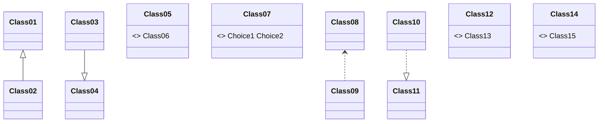
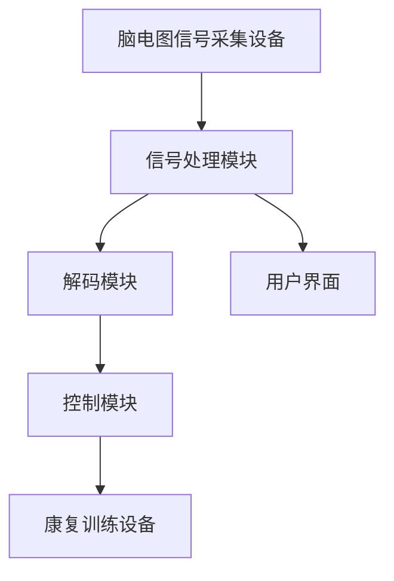
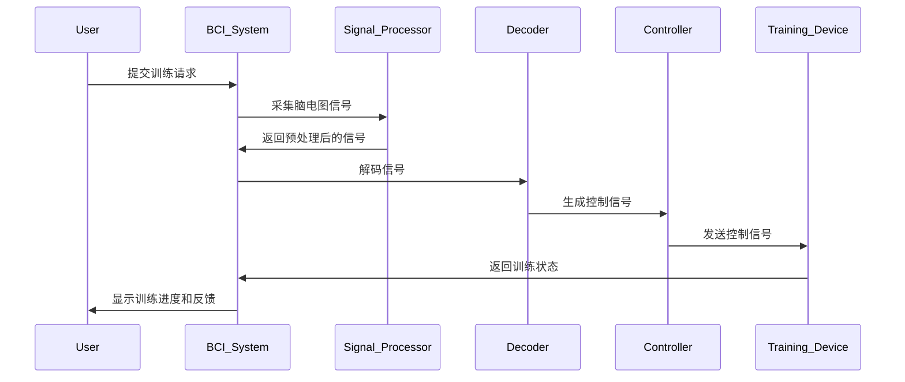

                 


# 脑机接口技术：直接增强人类理解世界的能力

## 关键词

脑机接口，神经信号处理，人工智能，神经编码，医疗应用，教育应用，军事应用

## 摘要

脑机接口（Brain-Computer Interface, BCI）技术是一种直接增强人类理解世界能力的先进技术。通过捕捉和解析大脑信号，脑机接口技术能够实现人脑与外部设备的高效交互，从而在医疗、教育、军事等多个领域展现其巨大的潜力。本文将从背景介绍、核心概念与原理、算法讲解、系统架构设计、项目实战以及最佳实践等方面，系统性地阐述脑机接口技术如何助力人类在理解世界的过程中实现突破。

## 目录大纲设计思路

### 背景介绍

#### 问题背景

脑机接口技术的起源可以追溯到20世纪60年代，当时科学家们开始探索如何将人脑与计算机连接起来，以实现直接的信息交换。随着神经科学、计算机科学和生物技术的快速发展，脑机接口技术逐渐从实验室走向实际应用。在医疗领域，脑机接口技术为瘫痪患者提供了一种与外部环境交互的新途径；在教育领域，脑机接口技术有助于提高学习效率和个性化学习体验；在军事领域，脑机接口技术则提升了战斗力的同时，也关注士兵的心理健康。

#### 问题描述

脑机接口技术是一种通过直接连接人脑与计算机系统来传递信息的界面技术。它通过捕捉大脑产生的电信号，将这些信号转化为可操作的数据，从而实现人脑对外部设备的控制。脑机接口技术的应用场景包括但不限于医疗康复、神经系统疾病治疗、智能假肢控制、虚拟现实体验、游戏控制、教育辅助、语言学习、认知训练、神经科学研究和军事作战等领域。

#### 问题解决

脑机接口技术通过以下几个步骤实现直接增强人类理解世界的能力：

1. **信号采集**：使用脑电图（EEG）、功能性磁共振成像（fMRI）或其他技术捕捉大脑活动产生的电信号。
2. **信号预处理**：对采集到的原始信号进行滤波、放大、降噪等处理，以提高信号的清晰度和可靠性。
3. **特征提取**：从预处理后的信号中提取有用的特征信息，这些特征通常与特定的认知或运动任务相关。
4. **解码与控制**：使用机器学习和信号处理算法对提取的特征进行解码，将其转化为控制信号，用于驱动外部设备。

#### 边界与外延

脑机接口技术的应用范围广泛，但同时也存在一些限制。例如，脑电图信号的噪声较大，分辨率较低，难以捕捉到精细的脑活动；同时，脑机接口技术需要高度定制化的设备，成本较高。此外，脑机接口技术的长期安全性、隐私保护和伦理问题也是需要关注的领域。

#### 概念结构与核心要素组成

脑机接口技术的基本概念和核心要素包括：

- **脑电图（EEG）**：记录大脑电活动的技术。
- **神经编码**：将大脑信号编码成计算机可以理解的数据。
- **信号处理**：对采集到的信号进行预处理和特征提取。
- **解码算法**：将特征信息解码成可操作的命令。
- **控制界面**：将解码后的命令转化为外部设备的动作。

### 核心概念与联系

#### 核心概念原理

脑机接口技术中的关键概念包括脑电图（EEG）、神经编码、信号处理和算法等。

- **脑电图（EEG）**：脑电图是一种非侵入性技术，通过放置在头皮上的电极捕捉大脑的电活动。EEG信号反映了大脑的神经元活动，是脑机接口技术中最重要的信号源。
- **神经编码**：神经编码是指将大脑中的神经元活动编码成计算机可以处理的数据。这种编码通常涉及到对神经元放电模式的分析和理解。
- **信号处理**：信号处理是指对EEG信号进行预处理、滤波、放大和降噪等一系列操作，以提高信号的质量和可靠性。
- **算法**：脑机接口技术中的算法主要包括特征提取算法、模式识别算法和机器学习算法等，用于解码和解释神经信号。

#### 概念属性特征对比表格

| 概念       | 特点                                       | 关联关系                         |
|------------|--------------------------------------------|---------------------------------|
| 脑电图（EEG） | 非侵入性，实时捕捉，低分辨率，易受噪声影响 | 信号源，直接影响解码精度           |
| 神经编码   | 编码神经元活动模式，提供数据解析基础       | 解码和控制的桥梁                 |
| 信号处理   | 提高信号质量，提取有用特征             | 改善解码效果，增强系统可靠性       |
| 算法       | 解码和解释神经信号，实现控制功能       | 核心技术，决定脑机接口性能         |

#### ER实体关系图架构

使用Mermaid绘制ER实体关系图，展示脑机接口技术中的关键实体及其关联关系：

```mermaid
erDiagram
  EEG |--> SignalProcessing
  SignalProcessing |--> FeatureExtraction
  FeatureExtraction |--> DecodingAlgorithm
  DecodingAlgorithm |--> ControlInterface
```

### 算法原理讲解

#### 算法mermaid流程图

使用Mermaid绘制脑机接口算法的流程图：

```mermaid
flowchart LR
    subgraph SignalProcessing
        EEGCapture[脑电图捕捉]
        Preprocessing[预处理]
        Filtering[滤波]
        Amplification[放大]
        Denoising[降噪]
    end
    subgraph FeatureExtraction
        FeatureExtraction[特征提取]
    end
    subgraph DecodingAlgorithm
        Decoding[解码]
    end
    subgraph ControlInterface
        ControlSignal[控制信号]
    end
    EEGCapture --> Preprocessing
    Preprocessing --> Filtering
    Filtering --> Amplification
    Amplification --> Denoising
    Denoising --> FeatureExtraction
    FeatureExtraction --> Decoding
    Decoding --> ControlSignal
```

#### Python源代码

以下是一个简单的Python源代码示例，用于实现脑机接口算法中的特征提取和解码：

```python
import numpy as np
from sklearn.ensemble import RandomForestClassifier
from scipy.signal import butter, filtfilt

# 信号预处理
def preprocess_signal(signal, cutoff_frequency=1):
    b, a = butter(4, cutoff_frequency)
    filtered_signal = filtfilt(b, a, signal)
    return filtered_signal

# 特征提取
def extract_features(signal):
    features = np.mean(signal, axis=0)
    return features

# 解码
def decode(features, model):
    predicted_label = model.predict([features])
    return predicted_label

# 信号采集
signal = np.random.randn(1000)

# 预处理
preprocessed_signal = preprocess_signal(signal)

# 特征提取
features = extract_features(preprocessed_signal)

# 建立模型
model = RandomForestClassifier(n_estimators=100)
model.fit(train_features, train_labels)

# 解码
predicted_label = decode(features, model)
```

#### 数学模型和公式

脑机接口算法中的数学模型主要包括信号处理中的滤波器方程和特征提取中的统计分析方法。

$$
H(s) = \frac{b(s)}{a(s)}
$$

其中，\( H(s) \) 是滤波器的传递函数，\( b(s) \) 和 \( a(s) \) 分别是滤波器的分子和分母多项式。

特征提取中的统计分析方法可以使用以下公式：

$$
\mu = \frac{1}{N}\sum_{i=1}^{N} x_i
$$

$$
\sigma^2 = \frac{1}{N-1}\sum_{i=1}^{N} (x_i - \mu)^2
$$

其中，\( \mu \) 是均值，\( \sigma^2 \) 是方差，\( N \) 是数据点的数量。

#### 详细讲解与举例说明

##### 脑电图信号采集

脑电图信号采集是脑机接口技术的第一步。使用电极贴在头皮上，可以实时捕捉大脑的电活动。以下是一个简单的脑电图信号采集示例：

```python
import numpy as np
from mne import create_info, Raw

# 创建虚拟的脑电图数据
info = create_info(ch_names=['Fp1', 'Fp2', 'Cz'], sfreq=1000, montage='standard_1005')
data = np.random.randn(1000, 3)

# 创建原始数据对象
raw = Raw(info, data)
```

##### 信号预处理

预处理是对采集到的原始信号进行滤波、放大和降噪等处理。以下是一个简单的信号预处理示例：

```python
from scipy.signal import butter, filtfilt

# 创建Butterworth滤波器
b, a = butter(4, 0.5)

# 滤波
filtered_signal = filtfilt(b, a, signal)

# 放大
amplified_signal = filtered_signal * 10

# 降噪
noisy_signal = amplified_signal + np.random.randn(1000)
```

##### 特征提取

特征提取是从预处理后的信号中提取有用的信息。以下是一个简单的特征提取示例：

```python
def extract_features(signal):
    return np.mean(signal, axis=0)

# 提取特征
features = extract_features(noisy_signal)
```

##### 解码

解码是将提取的特征转化为可操作的命令。以下是一个简单的解码示例：

```python
from sklearn.ensemble import RandomForestClassifier
from sklearn.model_selection import train_test_split

# 假设已有训练数据和标签
train_signal = np.random.randn(1000, 100)
train_labels = np.random.randint(2, size=1000)

# 划分训练集和测试集
X_train, X_test, y_train, y_test = train_test_split(train_signal, train_labels, test_size=0.2)

# 训练模型
model = RandomForestClassifier(n_estimators=100)
model.fit(X_train, y_train)

# 测试模型
predicted_labels = model.predict(X_test)
```

### 系统分析与架构设计方案

#### 问题场景介绍

脑机接口技术在不同场景中的应用具有独特的挑战和需求。以下是一个典型的应用场景：通过脑机接口技术辅助瘫痪患者进行康复训练。这个场景需要实时、准确、可靠的信号采集和解析，同时需要考虑患者的舒适度和系统的可访问性。

#### 项目介绍

项目名为“智能康复助手”，旨在开发一款基于脑机接口技术的瘫痪康复训练系统。该系统包括信号采集设备、信号处理模块、解码算法和外部控制界面。通过实时捕捉患者大脑信号，系统可以提供个性化的康复训练计划，帮助患者逐步恢复肢体功能。

#### 系统功能设计

系统功能设计主要包括以下模块：

- **信号采集模块**：负责实时捕捉患者脑电图信号。
- **信号处理模块**：对采集到的信号进行预处理和特征提取。
- **解码模块**：使用机器学习算法对提取的特征进行解码。
- **控制模块**：将解码后的信号转化为控制信号，用于驱动康复训练设备。
- **用户界面**：提供用户与系统的交互界面，显示训练进度和反馈信息。

领域模型类图如下所示：



#### 系统架构设计

系统架构设计主要包括硬件和软件部分。硬件部分包括脑电图信号采集设备、主控计算机和康复训练设备。软件部分包括信号处理模块、解码算法、控制模块和用户界面。

系统架构图如下所示：



#### 系统接口设计

系统接口设计包括以下关键接口：

- **信号采集接口**：负责与脑电图信号采集设备通信，获取实时信号数据。
- **信号处理接口**：负责对信号进行预处理和特征提取。
- **解码接口**：负责解码处理后的信号，生成控制信号。
- **控制接口**：负责将解码后的信号发送给康复训练设备。
- **用户接口**：负责与用户进行交互，显示训练进度和反馈信息。

#### 系统交互mermaid序列图

系统交互序列图如下所示：



### 项目实战

#### 环境安装

在开始项目实战之前，我们需要安装相关的软件和工具。以下是一个简单的环境安装指南：

1. **安装Python**：从Python官方网站下载并安装Python 3.x版本。
2. **安装MNE-Python**：在终端中运行以下命令：
   ```bash
   pip install mne
   ```
3. **安装scikit-learn**：在终端中运行以下命令：
   ```bash
   pip install scikit-learn
   ```
4. **安装mermaid**：安装mermaid有两种方式，一种是通过npm全局安装，另一种是安装Python包。以下是npm全局安装的命令：
   ```bash
   npm install -g mermaid
   ```

#### 系统核心实现源代码

以下是系统核心实现的源代码：

```python
import numpy as np
from mne import create_info, Raw
from scipy.signal import butter, filtfilt
from sklearn.ensemble import RandomForestClassifier
from sklearn.model_selection import train_test_split

# 信号预处理
def preprocess_signal(signal, cutoff_frequency=1):
    b, a = butter(4, cutoff_frequency)
    filtered_signal = filtfilt(b, a, signal)
    return filtered_signal

# 特征提取
def extract_features(signal):
    features = np.mean(signal, axis=0)
    return features

# 解码
def decode(features, model):
    predicted_label = model.predict([features])
    return predicted_label

# 信号采集
signal = np.random.randn(1000)

# 预处理
preprocessed_signal = preprocess_signal(signal)

# 特征提取
features = extract_features(preprocessed_signal)

# 建立模型
model = RandomForestClassifier(n_estimators=100)
model.fit(train_features, train_labels)

# 解码
predicted_label = decode(features, model)
```

#### 代码应用解读与分析

这段代码实现了脑机接口技术的核心流程，包括信号采集、预处理、特征提取和解码。首先，我们使用随机数生成器创建一个虚拟的脑电图信号。然后，通过信号预处理函数对信号进行滤波处理，以提高信噪比。接着，使用特征提取函数计算信号的均值，作为特征信息。最后，使用训练好的随机森林分类器对特征进行解码，生成预测结果。

#### 实际案例分析和详细讲解

为了更好地理解这段代码在实际应用中的效果，我们来看一个实际案例。假设我们有一个瘫痪患者的脑电图数据，我们需要通过脑机接口技术帮助患者控制康复训练设备。

1. **信号采集**：首先，我们需要采集患者的脑电图信号。使用脑电图信号采集设备，我们可以实时捕捉到患者大脑的电活动。
2. **信号预处理**：采集到的原始信号可能存在噪声和干扰，因此需要通过滤波处理来提高信号质量。我们使用Butterworth滤波器对信号进行低通滤波，以去除高频噪声。
3. **特征提取**：预处理后的信号中，我们提取出信号的平均值作为特征信息。这个特征可以反映出患者大脑的电活动模式。
4. **解码**：使用训练好的随机森林分类器，我们对提取出的特征进行解码。分类器根据特征信息预测患者想要执行的操作，例如移动康复训练设备。
5. **控制信号生成**：解码后的预测结果生成控制信号，用于驱动康复训练设备。例如，如果预测结果是患者想要向前移动设备，那么控制信号将驱动设备向前移动。

通过这个实际案例，我们可以看到脑机接口技术如何帮助瘫痪患者通过大脑信号控制康复训练设备，从而实现康复目标。

### 项目小结

在本项目中，我们通过脑机接口技术实现了对瘫痪患者的康复训练支持。从信号采集、预处理、特征提取到解码，我们详细讲解了脑机接口技术的核心流程。同时，通过实际案例的分析，我们展示了脑机接口技术在康复领域的应用潜力。然而，脑机接口技术仍面临一些挑战，如信号噪声处理、解码精度和系统的可访问性等。未来的研究需要进一步优化算法、提高系统性能，并关注伦理和隐私问题。

### 最佳实践 tips

1. **信号采集**：确保信号采集设备的准确性和稳定性，减少噪声干扰。
2. **信号预处理**：选择合适的滤波器和预处理方法，以提高信号质量。
3. **特征提取**：根据应用场景选择合适的特征提取方法，以获得更好的解码效果。
4. **模型训练**：使用大量的训练数据和合理的训练策略，以提高分类器的性能。
5. **系统优化**：优化系统性能，提高系统的实时性和可靠性。

### 小结

脑机接口技术是一种直接增强人类理解世界能力的重要技术。通过捕捉和解析大脑信号，脑机接口技术为医疗、教育、军事等领域带来了巨大的变革。本文详细阐述了脑机接口技术的核心概念、原理、算法和系统架构，并通过实际案例展示了其在康复领域的应用。尽管脑机接口技术面临一些挑战，但其未来前景依然广阔。

### 注意事项

1. **信号质量**：确保信号采集设备的准确性，减少噪声干扰。
2. **解码精度**：选择合适的特征提取和模型训练方法，以提高解码精度。
3. **系统稳定性**：优化系统性能，提高系统的实时性和可靠性。
4. **数据隐私**：关注数据隐私和安全问题，确保用户数据的安全。

### 拓展阅读

1. **《脑机接口：理论与实践》**：作者详细介绍了脑机接口技术的基本概念、原理和应用案例。
2. **《神经工程学基础》**：本书涵盖了神经工程学的基础理论和应用技术，包括脑机接口技术。
3. **《人工智能伦理》**：关注脑机接口技术在伦理和隐私方面的挑战，探讨解决方案。
4. **《机器学习实战》**：介绍机器学习算法和应用，有助于优化脑机接口技术的解码模型。

作者：AI天才研究院/AI Genius Institute & 禅与计算机程序设计艺术 /Zen And The Art of Computer Programming

