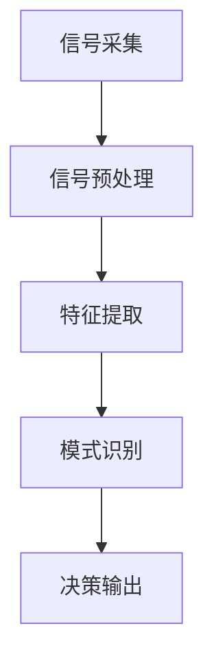
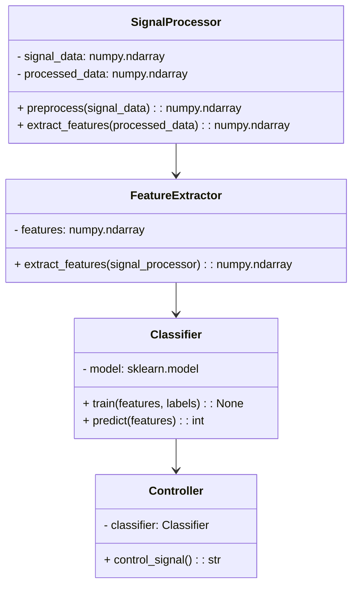
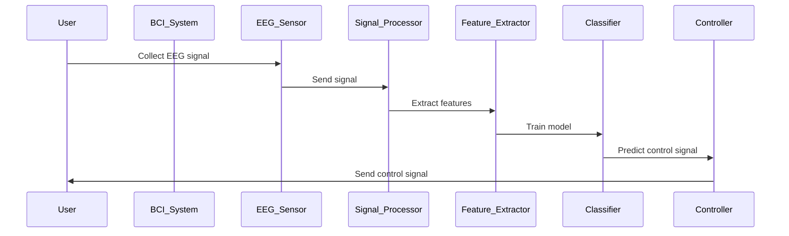
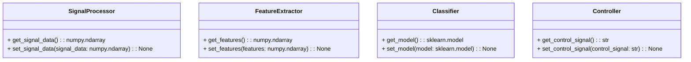
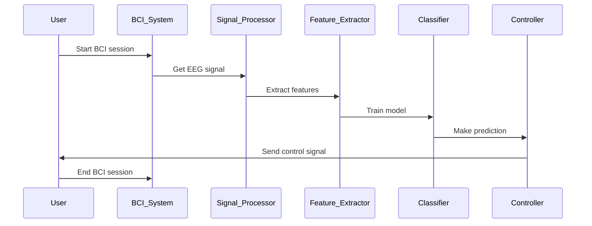

                 

# 脑机接口的信号处理：思维控制的数学解码

> 关键词：脑机接口、信号处理、数学解码、特征提取、模式识别

> 摘要：本文深入探讨了脑机接口（BCI）信号处理的数学解码问题。通过介绍脑机接口的背景和发展，本文分析了信号处理面临的挑战和重要性。接着，本文详细讲解了脑机接口信号处理的核心概念、算法原理和系统架构。最后，本文通过项目实战展示了如何在实际中应用这些技术，并提出了最佳实践和注意事项。

----------------------------------------------------------------

## 第一部分：引言

### 1.1 书籍背景介绍

#### 1.1.1 脑机接口技术发展概述

脑机接口（Brain-Computer Interface，简称BCI）技术作为一种直接连接大脑与外部设备的技术，近年来得到了广泛关注。BCI技术能够将用户的思维、意愿或情感等大脑活动转化为可以控制的信号，进而驱动外部设备执行相应的操作。随着神经科学和计算技术的不断发展，BCI在医疗、康复、教育、娱乐等多个领域展现出巨大的应用潜力。

在医疗领域，BCI技术可以用于帮助中风患者恢复运动能力、辅助瘫痪患者进行日常活动等。在康复领域，BCI技术可以帮助截肢者通过思维控制外部设备，恢复一定的行动能力。在教育领域，BCI技术可以用于个性化教学，帮助学生更好地理解和掌握知识。在娱乐领域，BCI技术可以用于游戏控制、虚拟现实体验等。

然而，BCI技术的信号处理和解析一直是该领域的关键挑战。脑机接口信号的采集和处理涉及到复杂的生物信号分析和数学建模，需要深入理解生物信号的特性，并结合先进的信号处理算法来实现。因此，对脑机接口信号处理的研究具有重要的理论和实际意义。

#### 1.1.2 信号处理的挑战与重要性

脑机接口信号处理的挑战主要体现在以下几个方面：

1. **信号噪声大**：脑机接口信号往往受到多种噪声的干扰，如环境噪声、电磁干扰等。这些噪声会影响信号的准确性和稳定性，给信号处理带来困难。

2. **数据稀疏**：脑机接口信号的数据采集通常局限于特定的部位或传感器，导致数据稀疏。数据稀疏会影响特征提取和模式识别的准确性。

3. **特征提取困难**：脑机接口信号包含了大量的生物信息，如何从这些复杂的信号中提取出具有明确意义的特征，是信号处理的关键问题。

4. **实时性要求高**：脑机接口的应用场景往往需要实时响应，如康复训练、游戏控制等。这要求信号处理算法具有快速的计算能力和低延迟。

信号处理在脑机接口技术中具有重要性，主要体现在以下几个方面：

1. **提高信号质量**：通过信号预处理和滤波，可以有效地去除噪声和干扰，提高信号的准确性和稳定性。

2. **特征提取**：通过特征提取，可以从原始信号中提取出具有明确意义的特征，为后续的模式识别和决策提供支持。

3. **模式识别**：通过模式识别，可以实现对用户意图的准确理解和预测，进而驱动外部设备执行相应的操作。

### 1.2 问题的提出

#### 1.2.1 问题背景

尽管脑机接口技术取得了显著进展，但现有的信号处理技术仍面临诸多挑战，如信号噪声大、数据稀疏、特征提取困难等。这些问题的存在限制了脑机接口技术的应用范围和效果。例如，在康复训练中，由于信号噪声大，可能导致用户无法准确控制外部设备；在游戏控制中，由于数据稀疏和特征提取困难，可能导致用户体验不佳。

本文旨在探讨脑机接口信号处理中的数学解码问题，包括信号采集、特征提取、模式识别等核心环节。通过详细分析脑机接口信号处理的数学模型和算法，本文希望为读者提供一套系统、实用的解决方案。

#### 1.2.2 问题描述

脑机接口信号处理的数学解码问题可以概括为以下两个方面：

1. **信号采集**：如何高效、准确地采集脑机接口信号，以获取高质量的原始数据。

2. **信号处理**：如何对采集到的信号进行预处理、特征提取和模式识别，以实现对用户意图的准确理解和预测。

本文将依次探讨上述两个方面，旨在为脑机接口信号处理提供一套系统、实用的解决方案。

### 1.3 问题的解决方法

#### 1.3.1 研究方法

本文采用理论分析与实际案例相结合的方法，深入探讨脑机接口信号处理的数学解码问题。具体研究方法包括：

1. **理论分析**：通过分析脑机接口信号处理的数学模型和算法，探讨其原理、优势和局限性。

2. **实际案例**：通过分析脑机接口信号处理的实际应用案例，验证理论分析的正确性和实用性。

3. **对比实验**：通过对比不同算法的性能和效果，为脑机接口信号处理提供优化建议。

#### 1.3.2 边界与外延

本文主要关注基于电生理信号的脑机接口信号处理技术。电生理信号包括脑电信号（EEG）、肌电信号（EMG）、脑磁图（MEG）等，这些信号反映了大脑神经元的活动，是脑机接口信号处理的基础。虽然这些技术在不同领域有广泛应用，但本文不涉及其他类型的脑机接口信号处理，如基于磁生理信号的脑机接口等。

### 1.4 核心概念与联系

#### 1.4.1 脑机接口信号处理的核心概念

脑机接口信号处理涉及多个核心概念，包括脑电信号（EEG）、肌电信号（EMG）、脑磁图（MEG）等。这些信号反映了大脑神经元的活动，是脑机接口信号处理的基础。

1. **脑电信号（EEG）**：脑电信号是大脑皮层神经元的电活动记录，主要通过头皮上的电极采集。脑电信号具有波形复杂、频率范围广等特点。

2. **肌电信号（EMG）**：肌电信号是肌肉的电活动记录，主要通过皮肤表面的电极采集。肌电信号具有波形简单、频率较低等特点。

3. **脑磁图（MEG）**：脑磁图是大脑磁场活动的记录，主要通过头部的磁传感器采集。脑磁图具有空间分辨率高、无头皮阻抗干扰等特点。

#### 1.4.2 概念属性特征对比表格

| 概念 | 定义 | 特点 |
| --- | --- | --- |
| 脑电信号（EEG） | 记录大脑电活动 | 波形复杂，频率范围广 |
| 肌电信号（EMG） | 记录肌肉电活动 | 波形简单，频率较低 |
| 脑磁图（MEG） | 记录大脑磁场活动 | 空间分辨率高，无头皮阻抗干扰 |

#### 1.4.3 ER实体关系图架构

```mermaid
erDiagram
    EEG ||--|{ 脑电信号特征提取算法 }
    EMG ||--|{ 肌电信号特征提取算法 }
    MEG ||--|{ 脑磁图信号特征提取算法 }
    脑机接口信号处理系统 ||--|{ 信号预处理、特征提取、模式识别等模块 }
```

### 1.5 本章小结

本章简要介绍了本书的背景、问题、解决方法和核心概念。接下来，本书将深入探讨脑机接口信号处理的数学解码问题，包括信号采集、特征提取、模式识别等核心环节。通过详细分析相关数学模型和算法，本书旨在为读者提供一套系统、实用的解决方案。

----------------------------------------------------------------

## 第一部分：引言（续）

### 1.6 脑机接口信号处理的数学模型

脑机接口信号处理的数学模型是理解脑机接口信号处理过程的基础。这一部分将介绍脑机接口信号处理的数学模型，包括信号采集、特征提取和模式识别等核心环节。

#### 1.6.1 信号采集

信号采集是脑机接口信号处理的第一步。信号采集的质量直接影响到后续信号处理的效果。脑机接口信号采集通常涉及多种传感器，包括电极、磁传感器等。

1. **电极采集**：电极采集主要用于记录脑电信号（EEG）和肌电信号（EMG）。电极可以分为表面电极和植入式电极。表面电极通常贴在头皮上，而植入式电极则直接植入大脑或肌肉中。

2. **磁传感器采集**：磁传感器主要用于记录脑磁图（MEG）。磁传感器通常安装在头部的特定位置，以记录大脑磁场的活动。

信号采集过程中，传感器采集到的信号是原始信号，通常包含多种噪声和干扰。因此，信号采集的质量直接取决于传感器的性能和信号采集环境。

#### 1.6.2 特征提取

特征提取是从原始信号中提取出具有明确意义的特征的过程。特征提取是脑机接口信号处理的核心环节，其质量直接影响到模式识别和决策的准确性。

1. **时域特征提取**：时域特征提取是基于原始信号的时间序列特性。常见的时域特征包括信号的平均值、方差、峰值等。时域特征提取简单直观，但可能无法充分反映信号的复杂结构。

2. **频域特征提取**：频域特征提取是将原始信号转换到频域后提取的特征。频域特征提取可以更好地反映信号的频率成分，但可能丢失部分时域信息。

3. **时频特征提取**：时频特征提取是将原始信号同时考虑时域和频域特性。时频特征提取可以更全面地反映信号的特性，但计算复杂度较高。

#### 1.6.3 模式识别

模式识别是基于提取到的特征对用户意图进行识别和分类的过程。模式识别是脑机接口信号处理的最终目标，其质量直接影响到用户的使用体验。

1. **监督学习**：监督学习是一种基于训练数据的模式识别方法。在监督学习中，训练数据包含输入特征和对应的标签。通过训练，模型可以学习到特征和标签之间的关系，进而实现对未知数据的分类。

2. **无监督学习**：无监督学习是一种基于未标记数据的模式识别方法。在无监督学习中，模型需要从数据中自动发现规律和结构，进而进行聚类或降维等操作。

3. **混合学习**：混合学习是结合监督学习和无监督学习的模式识别方法。通过监督学习获取初始特征，再通过无监督学习优化特征表示。

### 1.7 脑机接口信号处理的数学模型

脑机接口信号处理的数学模型可以概括为以下步骤：

1. **信号采集**：使用传感器采集脑机接口信号。

2. **信号预处理**：对采集到的信号进行预处理，包括滤波、去噪等操作。

3. **特征提取**：从预处理后的信号中提取特征，包括时域特征、频域特征和时频特征。

4. **特征选择**：对提取到的特征进行筛选，选择对模式识别有用的特征。

5. **模式识别**：使用模式识别算法对特征进行分类或聚类，以实现对用户意图的识别。

6. **决策输出**：根据模式识别的结果，输出控制指令或决策结果。

### 1.8 本章小结

本章介绍了脑机接口信号处理的数学模型，包括信号采集、特征提取和模式识别等核心环节。通过分析这些数学模型，我们可以更好地理解脑机接口信号处理的过程，为后续章节的深入研究打下基础。

----------------------------------------------------------------

## 第二部分：信号采集

### 2.1 信号采集概述

信号采集是脑机接口（BCI）信号处理的基础步骤，它直接影响到后续的特征提取和模式识别的效果。脑机接口信号采集涉及多种传感器技术，包括脑电信号（EEG）、肌电信号（EMG）和脑磁图（MEG）等。

#### 2.1.1 传感器类型

1. **脑电信号（EEG）采集**：
   - **电极类型**：EEG采集常用的电极包括表面电极和植入式电极。表面电极常用于非侵入性采集，如常见的贴片电极；植入式电极适用于需要更高分辨率和更长采集时间的研究。
   - **信号特性**：EEG信号反映了大脑皮层神经元的同步电活动，具有复杂的波形和广泛的频率范围（通常是1-100 Hz）。

2. **肌电信号（EMG）采集**：
   - **电极类型**：EMG采集通常使用表面电极，这些电极贴在皮肤表面，直接记录肌肉的电活动。
   - **信号特性**：EMG信号由肌肉活动产生，波形相对简单，频率较低（通常是10-500 Hz），且容易受到环境噪声的干扰。

3. **脑磁图（MEG）采集**：
   - **电极类型**：MEG采集使用磁传感器，这些传感器通常安装在头部周围，记录大脑磁场的变化。
   - **信号特性**：MEG信号反映了大脑神经元的电流活动，具有高时间分辨率和空间分辨率，但信号幅度较小，容易受到环境干扰。

#### 2.1.2 采集方法

1. **表面电极采集**：
   - **过程**：表面电极采集通常涉及在头皮上粘贴电极。在采集前，需要清洁头皮并涂抹导电膏以增强电极与皮肤之间的导电性。
   - **优点**：非侵入性，适用于长期监测和研究。
   - **缺点**：分辨率相对较低，易受头皮阻抗和噪声影响。

2. **植入式电极采集**：
   - **过程**：植入式电极需要通过手术植入大脑或肌肉中，这需要专业的医疗操作。
   - **优点**：高分辨率，适用于需要长期记录的研究。
   - **缺点**：侵入性操作，存在一定的风险和并发症。

3. **磁传感器采集**：
   - **过程**：磁传感器通常安装在头部的特定位置，通过记录磁场变化来获取脑机接口信号。
   - **优点**：高空间分辨率，无头皮阻抗干扰。
   - **缺点**：信号幅度较小，易受环境干扰。

### 2.2 信号采集的挑战与解决方案

信号采集过程中面临的主要挑战包括噪声干扰、传感器性能限制和数据传输延迟等。

#### 2.2.1 噪声干扰

噪声干扰是信号采集过程中最常见的问题。噪声可能来源于环境、电极或信号传输路径。常见的噪声类型包括：

1. **环境噪声**：如电磁干扰（EMI）、电力线干扰（PLI）等。
2. **运动噪声**：如脑电信号采集时，头皮运动产生的噪声。
3. **仪器噪声**：如传感器和放大器的噪声。

**解决方案**：

1. **信号滤波**：通过滤波器去除高频噪声和低频噪声，以净化信号。
2. **噪声抑制算法**：如独立成分分析（ICA）、自适应滤波等，用于分离和抑制噪声。
3. **传感器优化**：选择高性能传感器，提高信号质量。

#### 2.2.2 传感器性能限制

传感器性能限制可能影响信号的准确性和稳定性。例如，表面电极可能受到头皮阻抗的影响，而植入式电极可能受到生物组织变化的影响。

**解决方案**：

1. **电极优化**：改进电极设计，提高电极与生物组织之间的接触面积，降低阻抗。
2. **自适应信号调整**：通过自适应算法调整传感器参数，以适应实时变化的环境。

#### 2.2.3 数据传输延迟

数据传输延迟可能影响实时脑机接口应用的表现。例如，在实时游戏控制中，延迟可能导致操作不灵敏。

**解决方案**：

1. **高速数据传输**：使用高速数据传输协议，如USB 3.0、IEEE 1394等，提高数据传输速度。
2. **实时处理**：在信号采集的同时进行实时处理，以减少延迟。

### 2.3 信号采集流程

信号采集流程包括以下几个步骤：

1. **预处理**：清洁皮肤，涂抹导电膏，确保电极与皮肤良好接触。
2. **信号采集**：启动传感器，开始采集信号。
3. **信号预处理**：对采集到的信号进行滤波、去噪等预处理操作。
4. **数据存储**：将预处理后的信号存储在计算机或其他存储设备中，以供后续分析。

### 2.4 本章小结

本章介绍了脑机接口信号采集的概述、方法、挑战与解决方案，以及信号采集的流程。信号采集是脑机接口信号处理的重要基础，其质量和准确性直接影响到后续的特征提取和模式识别。通过优化信号采集技术，我们可以提高脑机接口系统的性能和用户体验。

----------------------------------------------------------------

### 2.5 脑电信号（EEG）采集

脑电信号（EEG）采集是脑机接口（BCI）信号处理中最重要的环节之一。脑电信号反映了大脑神经元的电活动，通过准确采集和解析这些信号，可以为多种应用场景提供有效的控制信号。

#### 2.5.1 EEG信号采集原理

脑电信号的采集基于电极与大脑皮层之间的电导作用。电极通常贴在头皮表面，通过导线连接到放大器和数据采集系统。在采集过程中，电极收集到的信号是复杂的，包含了来自不同脑区的电活动。

1. **电极布置**：
   - **常见布置**：常用的电极布置包括10-20系统，这是一种国际标准，用于确定电极的位置。常见的电极布置包括Fp1、Fp2、C3、C4等。
   - **高分辨率布置**：对于需要更高分辨率的研究，可以使用更多的电极和更精细的布置方式。

2. **电极类型**：
   - **表面电极**：表面电极是最常用的采集方式，如Ag/AgCl电极，它通过贴在头皮上的方式采集信号。
   - **植入式电极**：植入式电极通过手术方式植入大脑皮层，能够提供更高的分辨率和更长时间的记录。

#### 2.5.2 EEG信号特性

脑电信号具有以下几个主要特性：

1. **频率范围**：
   - **δ波（0.5-4 Hz）**：主要与深度睡眠相关。
   - **θ波（4-8 Hz）**：通常与放松状态和儿童大脑活动相关。
   - **α波（8-12 Hz）**：与清醒放松状态相关。
   - **β波（12-30 Hz）**：与活跃思维和注意力相关。
   - **γ波（30-100 Hz）**：与高频认知过程和感觉运动活动相关。

2. **波形特征**：
   - **波形复杂性**：脑电信号是由多种频率和振幅的波形叠加而成，具有高度复杂性。
   - **非线性特征**：脑电信号的波形表现出非线性特征，这增加了信号处理的难度。

#### 2.5.3 EEG信号采集流程

EEG信号采集的基本流程如下：

1. **准备阶段**：
   - **皮肤清洁**：使用酒精清洁采集区域，以降低皮肤阻抗。
   - **电极粘贴**：将电极粘贴到预定位置，确保电极与头皮紧密接触。

2. **信号采集**：
   - **启动设备**：打开数据采集设备，开始采集信号。
   - **实时监控**：在采集过程中，通过实时监控屏幕观察信号质量。

3. **信号预处理**：
   - **滤波**：使用带通滤波器去除低频噪声（如肌电干扰）和高频噪声（如电磁干扰）。
   - **放大**：对采集到的信号进行放大，以提高信噪比。
   - **参考电极设置**：选择合适的参考电极，以减少共模干扰。

4. **数据存储**：
   - **数据记录**：将预处理后的信号存储在计算机或其他存储设备中，以供后续分析。

#### 2.5.4 EEG信号采集的挑战与解决方案

EEG信号采集过程中面临的主要挑战包括噪声干扰、电极阻抗和信号传输延迟。

1. **噪声干扰**：
   - **解决方案**：
     - **滤波**：使用带通滤波器去除无关频率成分。
     - **噪声抑制**：采用自适应滤波算法或独立成分分析（ICA）分离噪声源。

2. **电极阻抗**：
   - **解决方案**：
     - **电极优化**：使用高导电性材料或改进电极设计。
     - **阻抗监测**：实时监测电极阻抗，以调整电极位置和导电膏。

3. **信号传输延迟**：
   - **解决方案**：
     - **高速数据传输**：使用USB 3.0或Wi-Fi等高速传输协议。
     - **实时处理**：在信号采集的同时进行实时处理，以减少延迟。

### 2.6 本章小结

脑电信号（EEG）采集是脑机接口信号处理的核心环节。通过了解EEG信号采集的原理、特性、流程以及挑战与解决方案，我们可以更有效地进行信号采集，为后续的特征提取和模式识别提供高质量的数据。在脑机接口技术的发展过程中，优化EEG信号采集技术具有重要意义。

----------------------------------------------------------------

### 2.7 肌电信号（EMG）采集

肌电信号（EMG）采集是脑机接口（BCI）信号处理中的重要组成部分，它主要用于记录肌肉的电活动，以帮助分析用户的意图和行为。EMG信号的采集对于运动控制、康复治疗、生物力学研究等领域具有重要意义。

#### 2.7.1 EMG信号采集原理

肌电信号是由肌肉中的运动神经元和肌纤维产生的电活动记录。当肌肉收缩或松弛时，会产生一系列的电脉冲，这些脉冲通过皮肤表面的电极被检测到。

1. **电极类型**：
   - **表面电极**：表面电极是最常用的EMG信号采集方式，它们贴在皮肤表面，通过粘贴或绑带固定。常见的表面电极有环形电极、线电极和盘状电极。
   - **植入式电极**：植入式电极通过手术植入肌肉或肌腱中，提供更高的分辨率和更长时间的记录。

2. **电极布置**：
   - **肌腹位置**：电极通常放置在肌肉的肌腹位置，因为这是肌肉活动最为剧烈的区域。
   - **肌腱附着点**：对于某些特定应用，电极也可以放置在肌腱附着点，以捕捉特定的肌肉活动。

#### 2.7.2 EMG信号特性

EMG信号具有以下几个主要特性：

1. **频率范围**：
   - EMG信号的频率范围通常在10 Hz到500 Hz之间，其中大部分信号集中在30 Hz到100 Hz的范围内。

2. **波形特征**：
   - EMG信号通常是单极性或双极性的方波或尖峰脉冲，脉冲宽度在1 ms到10 ms之间。

3. **幅度变化**：
   - EMG信号的幅度可以从几十微伏到几百微伏不等，且随着肌肉收缩强度的增加而变化。

4. **非平稳性**：
   - EMG信号是非平稳的，这意味着信号在不同时间点的频率和幅度都可能发生变化。

#### 2.7.3 EMG信号采集流程

EMG信号采集的基本流程如下：

1. **准备阶段**：
   - **皮肤清洁**：使用酒精清洁采集区域，以降低皮肤阻抗。
   - **电极粘贴**：将电极粘贴到预定位置，确保电极与皮肤紧密接触。

2. **信号采集**：
   - **启动设备**：打开数据采集设备，开始采集信号。
   - **实时监控**：在采集过程中，通过实时监控屏幕观察信号质量。

3. **信号预处理**：
   - **滤波**：使用带通滤波器去除无关频率成分。
   - **放大**：对采集到的信号进行放大，以提高信噪比。
   - **共模抑制**：通过共模抑制电路减少共模干扰。

4. **数据存储**：
   - **数据记录**：将预处理后的信号存储在计算机或其他存储设备中，以供后续分析。

#### 2.7.4 EMG信号采集的挑战与解决方案

EMG信号采集过程中面临的主要挑战包括噪声干扰、信号质量不稳定和电极脱落。

1. **噪声干扰**：
   - **解决方案**：
     - **滤波**：使用带通滤波器去除低频噪声和高频噪声。
     - **噪声抑制**：采用自适应滤波算法或独立成分分析（ICA）分离噪声源。

2. **信号质量不稳定**：
   - **解决方案**：
     - **电极优化**：使用高导电性材料或改进电极设计。
     - **电极固定**：使用绑带或粘性胶带固定电极，以减少电极滑动。

3. **电极脱落**：
   - **解决方案**：
     - **电极粘性增强**：使用高粘性胶带或导电胶增强电极的附着。
     - **电极设计改进**：设计更稳固的电极，减少脱落风险。

### 2.8 本章小结

肌电信号（EMG）采集是脑机接口信号处理中的重要环节。通过了解EMG信号采集的原理、特性、流程以及挑战与解决方案，我们可以更有效地进行信号采集，为后续的特征提取和模式识别提供高质量的数据。优化EMG信号采集技术对于提高脑机接口系统的性能和实用性具有重要意义。

----------------------------------------------------------------

### 2.9 脑磁图（MEG）采集

脑磁图（MEG）采集是脑机接口（BCI）信号处理中的另一个重要环节，它通过测量大脑产生的磁场变化来捕捉神经活动。与脑电信号（EEG）和肌电信号（EMG）不同，MEG提供了高时间分辨率和空间分辨率，能够更准确地定位大脑活动。

#### 2.9.1 MEG信号采集原理

MEG信号采集基于法拉第电磁感应定律，即当电流通过导线时，会在其周围产生磁场。在MEG采集过程中，磁传感器（通常称为磁计）放置在头部周围，用于检测由大脑活动产生的微弱磁场。

1. **传感器类型**：
   - **超导量子干涉器（SQUID）**：SQUID是MEG传感器的主要类型，具有极高的灵敏度和空间分辨率。SQUID可以检测到非常微弱的磁场变化，通常在pT（皮特斯拉）数量级。

2. **传感器布局**：
   - **环形布置**：MEG传感器通常环形布置在头部周围，形成一个三维的磁场检测网络。这种布局可以捕获大脑不同区域的磁场变化。

3. **传感器固定**：
   - **头环**：传感器通常固定在头环上，以确保其在采集过程中保持稳定的位置。头环的设计需要适应不同用户的头部形状和大小。

#### 2.9.2 MEG信号特性

MEG信号具有以下几个主要特性：

1. **时间分辨率**：
   - MEG具有极高的时间分辨率，可以达到μs（微秒）级别，这使得它能够捕捉快速的大脑活动。

2. **空间分辨率**：
   - MEG的空间分辨率较高，可以在厘米尺度上定位大脑活动。这使得MEG在研究大脑功能定位和解剖结构方面非常有用。

3. **幅度变化**：
   - MEG信号的幅度通常在nT（纳特斯拉）数量级，相比EEG和EMG信号，MEG信号幅度较小。

4. **非平稳性**：
   - MEG信号是非平稳的，这意味着信号在不同时间点的频率和幅度都可能发生变化。

#### 2.9.3 MEG信号采集流程

MEG信号采集的基本流程如下：

1. **准备阶段**：
   - **头部定位**：使用标记点或头环将头部固定在标准位置，以确保每次采集的一致性。
   - **传感器校准**：对MEG传感器进行校准，以消除环境干扰。

2. **信号采集**：
   - **启动设备**：打开MEG采集系统，开始采集信号。
   - **实时监控**：在采集过程中，通过实时监控屏幕观察信号质量。

3. **信号预处理**：
   - **滤波**：使用带通滤波器去除无关频率成分。
   - **放大**：对采集到的信号进行放大，以提高信噪比。
   - **空间处理**：进行空间滤波或空间叠加，以增强信号的空间分辨率。

4. **数据存储**：
   - **数据记录**：将预处理后的信号存储在计算机或其他存储设备中，以供后续分析。

#### 2.9.4 MEG信号采集的挑战与解决方案

MEG信号采集过程中面临的主要挑战包括环境干扰、传感器噪声和数据传输延迟。

1. **环境干扰**：
   - **解决方案**：
     - **环境控制**：在低磁噪声环境中进行采集，如磁屏蔽室。
     - **传感器校准**：通过传感器校准减少环境干扰的影响。

2. **传感器噪声**：
   - **解决方案**：
     - **传感器优化**：选择高灵敏度的传感器，减少噪声。
     - **噪声抑制**：采用自适应滤波算法或独立成分分析（ICA）抑制噪声。

3. **数据传输延迟**：
   - **解决方案**：
     - **高速数据传输**：使用高速数据传输协议，如USB 3.0。
     - **实时处理**：在信号采集的同时进行实时处理，以减少延迟。

### 2.10 本章小结

脑磁图（MEG）采集是脑机接口信号处理的重要组成部分，它提供了高时间分辨率和空间分辨率的优势。通过了解MEG信号采集的原理、特性、流程以及挑战与解决方案，我们可以更有效地进行MEG信号采集，为后续的特征提取和模式识别提供高质量的数据。优化MEG信号采集技术对于提高脑机接口系统的性能和实用性具有重要意义。

----------------------------------------------------------------

### 2.11 脑机接口信号处理的总体流程

脑机接口（BCI）信号处理是一个复杂的过程，涉及从信号采集、预处理、特征提取到模式识别和决策输出的多个步骤。理解这一流程的每个环节对于设计高效、准确的BCI系统至关重要。

#### 2.11.1 信号采集

信号采集是BCI信号处理的起点，它通过传感器获取用户的生物信号，如脑电信号（EEG）、肌电信号（EMG）和脑磁图（MEG）等。信号采集的质量直接影响到后续处理的效果。因此，选择合适的传感器、电极布局和采集环境非常重要。

#### 2.11.2 信号预处理

信号预处理是信号采集后的第一步，其目的是减少噪声、去除干扰和增强信号的准确性。预处理包括以下步骤：

1. **滤波**：使用带通滤波器去除无关频率成分，如低频噪声和高频干扰。
2. **放大**：提高信号的幅度，以增强信噪比。
3. **去除共模干扰**：通过共模抑制电路或参考电极设置，减少共模干扰。
4. **数据归一化**：将信号标准化，以便后续处理。

#### 2.11.3 特征提取

特征提取是从预处理后的信号中提取具有区分性的特征，以便进行模式识别。特征提取的方法有多种，包括时域特征、频域特征和时频特征等。常见的特征提取方法有：

1. **时域特征**：如信号的平均值、方差、峰值等。
2. **频域特征**：如频谱、功率谱密度等。
3. **时频特征**：如短时傅里叶变换（STFT）、小波变换等。

#### 2.11.4 模式识别

模式识别是基于提取到的特征，对用户意图进行分类和识别的过程。模式识别算法包括监督学习和无监督学习两种类型：

1. **监督学习**：如支持向量机（SVM）、神经网络（NN）等，需要预先标记的训练数据。
2. **无监督学习**：如聚类算法、主成分分析（PCA）等，无需预先标记的数据。

#### 2.11.5 决策输出

决策输出是基于模式识别的结果，生成控制指令或决策输出的过程。决策输出可以是简单的二分类结果，也可以是复杂的动作序列。

#### 2.11.6 总体流程

脑机接口信号处理的总体流程可以概括为以下几个步骤：

1. **信号采集**：使用传感器采集生物信号。
2. **信号预处理**：滤波、放大、去除干扰等预处理操作。
3. **特征提取**：从预处理后的信号中提取具有区分性的特征。
4. **模式识别**：使用特征进行分类和识别。
5. **决策输出**：根据模式识别结果生成控制指令或决策输出。

#### 2.11.7 流程图

以下是一个简化的脑机接口信号处理流程图：



### 2.12 本章小结

本章介绍了脑机接口信号处理的总体流程，包括信号采集、预处理、特征提取、模式识别和决策输出等环节。理解这一流程对于设计和实现高效的BCI系统至关重要。通过优化每个环节，我们可以提高BCI系统的性能和用户体验。

----------------------------------------------------------------

## 第三部分：特征提取

### 3.1 特征提取的重要性

在脑机接口（BCI）信号处理中，特征提取是一个至关重要的环节。特征提取的目的是从原始信号中提取出具有区分性和代表性的特征，以便于后续的模式识别和决策。有效的特征提取不仅能够提高系统的性能，还能减少计算复杂度和存储需求。

#### 3.1.1 提高信号质量

特征提取有助于去除原始信号中的噪声和无关信息，从而提高信号的质量。通过提取出具有区分性的特征，系统能够更准确地识别用户的意图和行为。

#### 3.1.2 减少计算复杂度

原始信号通常包含大量的数据和复杂的结构，直接处理这些数据会导致计算复杂度增加。通过特征提取，可以减少数据的维度，简化计算过程。

#### 3.1.3 提高模式识别准确性

特征提取能够从原始信号中提取出与用户意图相关的特征，这些特征能够提高模式识别的准确性，从而更好地实现脑机接口的控制功能。

### 3.2 常见的特征提取方法

脑机接口信号处理中，常见的特征提取方法包括时域特征、频域特征和时频特征等。以下是几种常用的特征提取方法：

#### 3.2.1 时域特征

时域特征是对信号的时间序列进行分析，提取出与时间相关的特征。常见的时域特征有：

1. **平均值**：信号的总体平均幅度。
2. **方差**：信号幅度的波动程度。
3. **峰值**：信号的最大值。
4. **峭度**：信号的尖峰程度。

#### 3.2.2 频域特征

频域特征是将信号转换到频域后提取的特征，能够反映信号在不同频率成分上的特性。常见的频域特征有：

1. **频谱**：信号的频率分布。
2. **功率谱密度**：信号的功率分布。
3. **带通滤波后的频谱**：特定频率范围内的信号特性。

#### 3.2.3 时频特征

时频特征结合了时域和频域特征，能够在时间-频率平面上描述信号的变化。常见的时频特征提取方法有：

1. **短时傅里叶变换（STFT）**：将信号分成短时段进行傅里叶变换。
2. **小波变换**：使用小波基函数对信号进行变换。
3. **连续小波变换（CWT）**：连续地改变小波基函数的尺度和位置。

### 3.3 特征选择

特征选择是在特征提取后对提取出的特征进行筛选，选择出对模式识别最有用的特征，以减少计算复杂度和提高识别准确性。常见的特征选择方法有：

1. **相关性分析**：通过计算特征之间的相关性，筛选出最相关的特征。
2. **主成分分析（PCA）**：通过线性变换减少特征的维度，保留最重要的特征。
3. **支持向量机（SVM）**：通过训练支持向量机模型，筛选出对分类最有帮助的特征。

### 3.4 特征提取的挑战与解决方案

特征提取过程中可能面临以下挑战：

1. **噪声干扰**：噪声会影响特征的准确性，需要通过滤波和去噪技术来减少噪声。
2. **数据稀疏**：数据稀疏会导致特征提取困难，可以通过数据增强和特征融合技术来改善。
3. **计算复杂度**：特征提取方法可能计算复杂度较高，可以通过优化算法和硬件加速来降低计算负担。

### 3.5 本章小结

特征提取是脑机接口信号处理中关键的一步，它通过提取具有区分性的特征，提高了信号的质量和模式识别的准确性。本章介绍了特征提取的重要性、常见的特征提取方法、特征选择方法以及特征提取面临的挑战与解决方案。通过理解和应用这些方法，我们可以设计出更高效、更准确的脑机接口系统。

----------------------------------------------------------------

### 3.6 时域特征提取

时域特征提取是从原始信号的时间序列中提取特征的方法，它不需要将信号转换为其他域（如频域），因此计算复杂度相对较低。时域特征提取方法适用于对信号时间序列的局部特性进行分析，如信号的振幅、波动和趋势等。以下是几种常见的时域特征提取方法：

#### 3.6.1 平均值（Mean）

平均值是信号幅度的时间平均值，它可以反映信号的总体强度。计算平均值的方法如下：

$$
\mu = \frac{1}{N} \sum_{i=1}^{N} x_i
$$

其中，$x_i$ 是时间序列的第 $i$ 个样本，$N$ 是样本总数。

#### 3.6.2 方差（Variance）

方差是信号幅度波动程度的度量，它反映了信号的稳定性。方差的计算公式如下：

$$
\sigma^2 = \frac{1}{N-1} \sum_{i=1}^{N} (x_i - \mu)^2
$$

其中，$\mu$ 是平均值，$N$ 是样本总数。

#### 3.6.3 峰值（Peak）

峰值是信号的最大值，它反映了信号的最大幅度。峰值的计算方法如下：

$$
P = \max(x)
$$

其中，$x$ 是信号的时间序列。

#### 3.6.4 峭度（Kurtosis）

峭度是信号尖峰程度的度量，它反映了信号的尖峰特性。峭度的计算公式如下：

$$
K = \frac{1}{N} \sum_{i=1}^{N} \left( \frac{x_i - \mu}{\sigma} \right)^4 - 3
$$

其中，$\mu$ 是平均值，$\sigma$ 是方差，$N$ 是样本总数。

#### 3.6.5 应用实例

假设我们有一个长度为 $N=100$ 的信号时间序列 $x_1, x_2, ..., x_{100}$，下面是使用 Python 实现上述特征提取的代码示例：

```python
import numpy as np

# 信号数据
x = np.random.rand(100)

# 平均值
mean_value = np.mean(x)

# 方差
variance_value = np.var(x)

# 峰值
peak_value = np.max(x)

# 峭度
mu = np.mean(x)
sigma = np.std(x)
kurtosis_value = np.sum(((x - mu) / sigma) ** 4) / 100 - 3

print("平均值：", mean_value)
print("方差：", variance_value)
print("峰值：", peak_value)
print("峭度：", kurtosis_value)
```

通过时域特征提取，我们可以从原始信号中提取出一系列反映信号特性的特征值。这些特征值可以用于后续的模式识别和决策过程，从而提高脑机接口系统的性能和准确性。

### 3.7 本章小结

时域特征提取是一种简单而有效的特征提取方法，通过分析信号的时间序列特性，我们可以提取出具有区分性的特征，如平均值、方差、峰值和峭度等。这些特征对于脑机接口系统的性能提升具有重要意义。通过本章的介绍和实例，读者可以了解时域特征提取的方法和应用。

----------------------------------------------------------------

### 3.8 频域特征提取

频域特征提取是将原始信号转换到频域后提取特征的方法。频域特征能够反映信号在不同频率成分上的特性，这对于理解信号的结构和模式识别具有重要意义。以下是几种常见的频域特征提取方法：

#### 3.8.1 短时傅里叶变换（STFT）

短时傅里叶变换（Short-Time Fourier Transform, STFT）是一种将信号分段并在每个分段上进行傅里叶变换的方法。STFT能够同时考虑时间和频率信息，但通常会产生频率混叠效应。

STFT的公式如下：

$$
X_t(k) = \sum_{n=-\infty}^{\infty} x[n] w[n-kT]
$$

其中，$X_t(k)$ 是STFT的结果，$x[n]$ 是原始信号，$w[n-kT]$ 是窗口函数，$T$ 是分段长度。

在Python中，可以使用以下代码实现STFT：

```python
import numpy as np
import scipy.signal as signal

# 信号数据
x = np.random.rand(1000)

# 短时傅里叶变换
window = signal.hann(100)
stft_result = signal.stft(x, window, nperseg=100)

print("STFT结果：", stft_result)
```

#### 3.8.2 小波变换

小波变换（Wavelet Transform）是一种将信号分解为不同尺度和位置的局部特征的方法。小波变换能够更好地适应信号的非平稳性和非均匀性。

小波变换的公式如下：

$$
\hat{f}(a,b) = \int_{-\infty}^{\infty} f(t) \phi^*(\frac{t-b}{a}) dt
$$

其中，$\hat{f}(a,b)$ 是小波变换的结果，$f(t)$ 是原始信号，$\phi^*(\frac{t-b}{a})$ 是小波基函数。

在Python中，可以使用以下代码实现小波变换：

```python
import numpy as np
import PyWavelets as wv

# 信号数据
x = np.random.rand(1000)

# 小波变换
wavelet = 'db4'
cwt_result = wv.cwt(x, scales=100, wavelet=wavelet)

print("CWT结果：", cwt_result)
```

#### 3.8.3 带通滤波后的频谱

带通滤波后的频谱是将原始信号通过带通滤波器滤波后，提取滤波后的频谱特征。这种方法可以去除特定频率范围内的噪声，保留有用的频率成分。

带通滤波后的频谱的公式如下：

$$
X(\omega) = \int_{-\infty}^{\infty} x(t) e^{-j\omega t} dt
$$

其中，$X(\omega)$ 是频谱，$x(t)$ 是原始信号，$\omega$ 是角频率。

在Python中，可以使用以下代码实现带通滤波后的频谱：

```python
import numpy as np
import scipy.signal as signal

# 信号数据
x = np.random.rand(1000)

# 带通滤波器设计
low_freq = 1
high_freq = 5
b, a = signal.butter(4, [low_freq, high_freq], btype='band')

# 带通滤波
filtered_x = signal.lfilter(b, a, x)

# 频谱提取
frequencies, Pxx = signal.welch(filtered_x, nperseg=1000)

print("频谱：", Pxx)
```

通过频域特征提取，我们可以从原始信号中提取出一系列反映信号频率特性的特征值。这些特征值可以用于后续的模式识别和决策过程，从而提高脑机接口系统的性能和准确性。

### 3.9 本章小结

频域特征提取是一种将原始信号转换到频域后提取特征的方法，它能够反映信号在不同频率成分上的特性。常见的频域特征提取方法包括短时傅里叶变换（STFT）、小波变换和带通滤波后的频谱。通过本章的介绍和实例，读者可以了解频域特征提取的方法和应用。

----------------------------------------------------------------

### 3.10 时频特征提取

时频特征提取是一种结合了时间和频率信息的特征提取方法，它能够更全面地描述信号的局部特性。时频特征提取方法包括短时傅里叶变换（STFT）、小波变换和连续小波变换（CWT）等。以下是这些方法的原理和Python实现。

#### 3.10.1 短时傅里叶变换（STFT）

短时傅里叶变换（Short-Time Fourier Transform, STFT）是一种将信号分成短时段，并在每个短时段上进行傅里叶变换的方法。STFT能够同时考虑时间和频率信息，但通常会产生频率混叠效应。

STFT的公式如下：

$$
X_t(k) = \sum_{n=-\infty}^{\infty} x[n] w[n-kT]
$$

其中，$X_t(k)$ 是STFT的结果，$x[n]$ 是原始信号，$w[n-kT]$ 是窗口函数，$T$ 是分段长度。

在Python中，可以使用以下代码实现STFT：

```python
import numpy as np
import scipy.signal as signal

# 信号数据
x = np.random.rand(1000)

# 短时傅里叶变换
window = signal.hann(100)
stft_result = signal.stft(x, window, nperseg=100)

print("STFT结果：", stft_result)
```

#### 3.10.2 小波变换

小波变换（Wavelet Transform）是一种将信号分解为不同尺度和位置的局部特征的方法。小波变换能够更好地适应信号的非平稳性和非均匀性。

小波变换的公式如下：

$$
\hat{f}(a,b) = \int_{-\infty}^{\infty} f(t) \phi^*(\frac{t-b}{a}) dt
$$

其中，$\hat{f}(a,b)$ 是小波变换的结果，$f(t)$ 是原始信号，$\phi^*(\frac{t-b}{a})$ 是小波基函数。

在Python中，可以使用以下代码实现小波变换：

```python
import numpy as np
import PyWavelets as wv

# 信号数据
x = np.random.rand(1000)

# 小波变换
wavelet = 'db4'
cwt_result = wv.cwt(x, scales=100, wavelet=wavelet)

print("CWT结果：", cwt_result)
```

#### 3.10.3 连续小波变换（CWT）

连续小波变换（Continuous Wavelet Transform, CWT）是一种连续地改变小波基函数的尺度和位置的方法。CWT能够提供更精细的时间-频率分辨率。

CWT的公式如下：

$$
\hat{f}(a,b) = \int_{-\infty}^{\infty} f(t) \phi^*(\frac{t-b}{a}) dt
$$

其中，$\hat{f}(a,b)$ 是CWT的结果，$f(t)$ 是原始信号，$\phi^*(\frac{t-b}{a})$ 是连续小波基函数。

在Python中，可以使用以下代码实现CWT：

```python
import numpy as np
import PyWavelets as wv

# 信号数据
x = np.random.rand(1000)

# 连续小波变换
wavelet = 'cm1'
cwt_result = wv.cwt(x, scales=np.linspace(1, 100), wavelet=wavelet)

print("CWT结果：", cwt_result)
```

通过时频特征提取，我们可以从原始信号中提取出一系列反映信号局部特性的特征值。这些特征值可以用于后续的模式识别和决策过程，从而提高脑机接口系统的性能和准确性。

### 3.11 本章小结

时频特征提取是一种结合了时间和频率信息的特征提取方法，它能够更全面地描述信号的局部特性。常见的时频特征提取方法包括短时傅里叶变换（STFT）、小波变换和连续小波变换（CWT）。通过本章的介绍和实例，读者可以了解时频特征提取的方法和应用。

----------------------------------------------------------------

### 3.12 特征选择方法

特征选择是在特征提取后对提取出的特征进行筛选，选择出对模式识别最有用的特征，以减少计算复杂度和提高识别准确性。特征选择是脑机接口信号处理中的一个重要环节，可以有效降低模型训练的时间和资源消耗，同时提高模型的性能。以下是几种常见的特征选择方法：

#### 3.12.1 相关性分析

相关性分析是一种基于特征之间的相关性进行特征选择的方法。通过计算特征之间的相关性，筛选出最相关的特征，可以有效地减少特征的维度，提高识别准确性。

相关性分析的步骤如下：

1. **计算特征之间的相关性**：使用皮尔逊相关系数或斯皮尔曼秩相关系数计算特征之间的相关性。
2. **筛选相关特征**：选择相关性较高的特征作为候选特征。
3. **评估候选特征**：通过模型训练评估候选特征的性能，选择性能最好的特征。

在Python中，可以使用以下代码进行相关性分析：

```python
import numpy as np
import scipy.stats as stats

# 信号数据
x = np.random.rand(100, 10)

# 计算特征之间的相关性
correlations = np.corrcoef(x.T)

# 筛选相关特征
selected_features = np.array([i for i, _ in enumerate(correlations[0]) if _ > 0.5])

# 评估候选特征
# （此处省略模型训练和评估代码）
```

#### 3.12.2 主成分分析（PCA）

主成分分析（Principal Component Analysis, PCA）是一种基于特征方差进行特征选择的方法。PCA通过线性变换将高维特征空间映射到低维空间，保留最重要的特征，降低计算复杂度。

PCA的步骤如下：

1. **计算特征平均值**：计算每个特征的平均值。
2. **计算协方差矩阵**：计算特征之间的协方差矩阵。
3. **计算特征值和特征向量**：计算协方差矩阵的特征值和特征向量。
4. **选择主成分**：选择特征值最大的特征向量作为主成分。
5. **重构数据**：使用主成分重构数据，保留最重要的特征。

在Python中，可以使用以下代码进行PCA：

```python
import numpy as np
from sklearn.decomposition import PCA

# 信号数据
x = np.random.rand(100, 10)

# PCA变换
pca = PCA(n_components=5)
pca.fit(x)

# 重构数据
reconstructed_x = pca.transform(x)

# 保留最重要的特征
selected_features = pca.components_
```

#### 3.12.3 支持向量机（SVM）

支持向量机（Support Vector Machine, SVM）是一种基于模型性能进行特征选择的方法。通过训练支持向量机模型，可以识别出对分类最有帮助的特征。

SVM的步骤如下：

1. **训练模型**：使用标记数据训练支持向量机模型。
2. **计算特征重要性**：通过模型训练结果计算特征的重要性。
3. **选择特征**：选择重要性较高的特征。

在Python中，可以使用以下代码进行SVM特征选择：

```python
import numpy as np
from sklearn.svm import LinearSVC

# 信号数据
x = np.random.rand(100, 10)
y = np.random.randint(2, size=100)

# 训练模型
svc = LinearSVC()
svc.fit(x, y)

# 计算特征重要性
importances = svc.coef_

# 选择特征
selected_features = np.array([i for i, _ in enumerate(importances[0]) if _ > 0])
```

通过特征选择，我们可以从原始特征中筛选出最有用的特征，提高脑机接口系统的性能和准确性。不同的特征选择方法适用于不同的应用场景，选择合适的特征选择方法对于设计高效的脑机接口系统至关重要。

### 3.13 本章小结

特征选择是脑机接口信号处理中关键的一步，通过筛选出最有用的特征，可以有效降低计算复杂度和提高识别准确性。本章介绍了几种常见的特征选择方法，包括相关性分析、主成分分析（PCA）和支撑向量机（SVM）。通过本章的介绍和实例，读者可以了解特征选择的方法和应用。

----------------------------------------------------------------

## 第四部分：模式识别

### 4.1 模式识别的基本概念

模式识别是脑机接口信号处理中的一个关键环节，它涉及到从提取的特征中识别出用户意图或行为。模式识别的基本概念包括分类、聚类和回归等。

#### 4.1.1 分类

分类是将数据集划分为不同的类别或标签。在脑机接口中，分类用于识别用户的意图。常见的分类算法包括：

1. **线性分类器**：如线性判别分析（LDA）和支持向量机（SVM）。
2. **神经网络**：如多层感知机（MLP）和卷积神经网络（CNN）。
3. **决策树**：如ID3和C4.5。

#### 4.1.2 聚类

聚类是将数据集划分为多个群组，使得同一个群组中的数据点彼此之间相似，而不同群组中的数据点彼此之间不相似。聚类用于发现数据集中的隐含结构或模式。常见的聚类算法包括：

1. **K-均值聚类**：基于距离度量将数据划分为K个聚类。
2. **层次聚类**：通过逐步合并或分裂聚类，构建一个层次结构。
3. **基于密度的聚类**：如DBSCAN算法，基于数据点周围区域的密度进行聚类。

#### 4.1.3 回归

回归用于预测连续的数值输出。在脑机接口中，回归用于预测用户的意图或行为。常见的回归算法包括：

1. **线性回归**：通过线性模型预测输出值。
2. **多项式回归**：通过多项式模型预测输出值。
3. **神经网络回归**：通过多层感知机（MLP）预测输出值。

### 4.2 常见的模式识别算法

脑机接口信号处理中，常见的模式识别算法包括监督学习和无监督学习算法。以下是几种常用的模式识别算法：

#### 4.2.1 支持向量机（SVM）

支持向量机（SVM）是一种监督学习算法，通过找到一个最佳的超平面，将数据集划分为不同的类别。SVM具有强大的分类能力，适用于小样本和高维数据。

SVM的原理如下：

$$
\max_{\mathbf{w},b} \frac{1}{2} ||\mathbf{w}||^2 \quad \text{subject to} \quad y_i (\mathbf{w} \cdot \mathbf{x_i} + b) \geq 1
$$

其中，$\mathbf{w}$ 是权重向量，$b$ 是偏置项，$y_i$ 是样本标签，$\mathbf{x_i}$ 是样本特征。

在Python中，可以使用以下代码实现SVM：

```python
import numpy as np
from sklearn.svm import SVC

# 信号数据
x = np.random.rand(100, 10)
y = np.random.randint(2, size=100)

# 训练SVM模型
svm = SVC(kernel='linear')
svm.fit(x, y)

# 预测
predictions = svm.predict(x)
```

#### 4.2.2 决策树

决策树是一种基于特征和阈值进行分类的监督学习算法。决策树通过递归地将数据集划分为子集，直到满足停止条件（如最大深度、最小叶节点样本数等）。

决策树的原理如下：

1. **选择最佳特征和阈值**：通过计算每个特征的增益或信息增益，选择具有最大增益的特征和阈值。
2. **递归划分**：使用最佳特征和阈值将数据集划分为子集，并对每个子集递归地执行上述步骤。

在Python中，可以使用以下代码实现决策树：

```python
import numpy as np
from sklearn.tree import DecisionTreeClassifier

# 信号数据
x = np.random.rand(100, 10)
y = np.random.randint(2, size=100)

# 训练决策树模型
tree = DecisionTreeClassifier()
tree.fit(x, y)

# 预测
predictions = tree.predict(x)
```

#### 4.2.3 聚类算法

聚类算法是一种无监督学习算法，用于发现数据集中的隐含结构。聚类算法不需要预先标记的数据，通过将数据划分为不同的群组，揭示数据中的潜在模式。

常见的聚类算法包括：

1. **K-均值聚类**：基于距离度量将数据划分为K个聚类。
2. **层次聚类**：通过逐步合并或分裂聚类，构建一个层次结构。
3. **基于密度的聚类**：如DBSCAN算法，基于数据点周围区域的密度进行聚类。

在Python中，可以使用以下代码实现K-均值聚类：

```python
import numpy as np
from sklearn.cluster import KMeans

# 信号数据
x = np.random.rand(100, 10)

# K-均值聚类
kmeans = KMeans(n_clusters=3)
kmeans.fit(x)

# 聚类结果
clustering = kmeans.predict(x)
```

### 4.3 模式识别的挑战与解决方案

模式识别在脑机接口信号处理中面临以下挑战：

1. **高维数据**：脑机接口信号通常包含大量的特征，导致数据维度较高。
2. **噪声干扰**：信号采集过程中可能存在噪声和干扰，影响模式识别的准确性。
3. **类不平衡**：在某些应用中，不同类别的样本数量可能不均衡。

解决方案包括：

1. **特征选择**：通过特征选择降低数据的维度，提高模型性能。
2. **去噪**：使用去噪技术减少噪声对信号的影响。
3. **样本平衡**：通过过采样或欠采样技术平衡不同类别的样本数量。

### 4.4 本章小结

模式识别是脑机接口信号处理中关键的一步，通过识别用户的意图或行为，实现脑机接口的控制功能。本章介绍了模式识别的基本概念和几种常见的模式识别算法，包括支持向量机（SVM）、决策树和聚类算法。通过本章的介绍，读者可以了解模式识别的方法和应用，为设计和实现高效的脑机接口系统提供理论基础。

----------------------------------------------------------------

## 第五部分：系统设计与实现

### 5.1 问题场景介绍

在脑机接口（BCI）的应用场景中，一个常见的问题是实时控制和交互。例如，对于肢体瘫痪的患者，通过脑机接口技术，他们可以仅通过思维来控制轮椅或电脑，实现自主生活。这一应用场景对BCI系统提出了高实时性和高准确性的要求。

#### 5.1.1 问题陈述

设计一个实时脑机接口系统，能够准确识别用户意图，实现对轮椅或电脑的控制。系统需要能够在复杂环境下稳定运行，并在处理大量数据的同时保持低延迟。

### 5.2 项目介绍

本项目旨在实现一个基于脑电信号（EEG）的实时脑机接口系统，该系统包括信号采集、预处理、特征提取、模式识别和决策输出等模块。系统将采用Python和机器学习库（如scikit-learn、PyBrain等）进行开发。

#### 5.2.1 项目目标

- **高实时性**：系统需要在毫秒级别内处理并识别用户意图。
- **高准确性**：系统能够准确识别用户的意图，降低错误率。
- **低延迟**：系统在处理数据时延迟低，保证实时响应。

### 5.3 系统功能设计（领域模型）

系统功能设计是项目开发的基础，领域模型（Domain Model）是一种用于描述系统功能及其关系的图形化表示。以下是本项目的基本领域模型：

#### 5.3.1 领域模型



#### 5.3.2 领域模型说明

- **SignalProcessor**：信号处理模块，负责信号的预处理和特征提取。
- **FeatureExtractor**：特征提取模块，从预处理后的信号中提取特征。
- **Classifier**：分类器模块，负责训练和预测。
- **Controller**：控制器模块，根据分类器的预测结果生成控制信号。

### 5.4 系统架构设计

系统架构设计是系统实现的关键，它定义了系统组件的层次结构及其交互方式。以下是本项目的基本系统架构：

#### 5.4.1 系统架构



#### 5.4.2 系统架构说明

- **EEG_Sensor**：用户通过EEG传感器采集脑电信号。
- **Signal_Processor**：信号处理模块，对采集到的信号进行预处理。
- **Feature_Extractor**：特征提取模块，从预处理后的信号中提取特征。
- **Classifier**：分类器模块，使用训练好的模型对特征进行分类预测。
- **Controller**：控制器模块，根据预测结果生成控制信号，并反馈给用户。

### 5.5 系统接口设计

系统接口设计是系统组件之间交互的桥梁，它定义了系统组件如何通过接口进行通信。以下是本项目的基本系统接口设计：

#### 5.5.1 系统接口



#### 5.5.2 系统接口说明

- **SignalProcessor**：提供获取和设置信号数据的接口。
- **FeatureExtractor**：提供获取和设置特征数据的接口。
- **Classifier**：提供获取和设置模型数据的接口。
- **Controller**：提供获取和设置控制信号的接口。

### 5.6 系统交互设计

系统交互设计是系统组件之间通信的详细描述，它定义了系统在运行过程中的交互过程。以下是本项目的基本系统交互设计：

#### 5.6.1 系统交互



#### 5.6.2 系统交互说明

- **启动BCI会话**：用户启动BCI会话。
- **获取EEG信号**：BCI系统从EEG传感器获取信号。
- **提取特征**：信号处理模块对信号进行预处理和特征提取。
- **训练模型**：特征提取模块将特征传递给分类器进行模型训练。
- **预测控制信号**：分类器根据训练好的模型进行预测。
- **发送控制信号**：控制器根据预测结果生成控制信号并反馈给用户。
- **结束BCI会话**：用户结束BCI会话。

### 5.7 本章小结

本章介绍了脑机接口系统的设计与实现，包括问题场景介绍、项目介绍、领域模型设计、系统架构设计、系统接口设计和系统交互设计。通过本章的介绍，读者可以了解如何设计和实现一个基于脑电信号的实时脑机接口系统，为后续的实际应用提供参考。

----------------------------------------------------------------

## 第六部分：项目实战

### 6.1 环境安装

为了进行脑机接口项目的实战，首先需要安装必要的软件和工具。以下是安装步骤：

#### 6.1.1 安装Python环境

确保系统中已经安装了Python 3.x版本。如果没有安装，可以从官方网站下载并安装。

#### 6.1.2 安装Python库

使用pip命令安装以下Python库：

```bash
pip install numpy scipy scikit-learn matplotlib PyWavelets
```

这些库是进行信号处理、特征提取、模式识别和可视化所必需的。

### 6.2 系统核心实现源代码

在本节中，我们将展示系统核心部分的Python源代码。以下是一个简化的示例，用于说明信号处理、特征提取和模式识别的基本流程。

```python
import numpy as np
from sklearn.svm import SVC
from sklearn.model_selection import train_test_split
from sklearn.metrics import accuracy_score

# 信号处理
class SignalProcessor:
    def preprocess(self, signal):
        # 滤波、去噪等预处理操作
        filtered_signal = self._bandpass_filter(signal)
        return filtered_signal

    def _bandpass_filter(self, signal, low-cut=1, high-cut=30):
        # 带通滤波器实现
        b, a = signal.butter(4, [low_cut, high_cut], btype='band')
        return signal.lfilter(b, a)

# 特征提取
class FeatureExtractor:
    def extract_features(self, signal):
        # 提取特征
        features = self._extract_time_domain_features(signal)
        return features

    def _extract_time_domain_features(self, signal):
        # 提取时域特征
        mean = np.mean(signal)
        variance = np.var(signal)
        peak = np.max(signal)
        kurtosis = self._compute_kurtosis(signal)
        return np.array([mean, variance, peak, kurtosis])

    def _compute_kurtosis(self, signal):
        # 计算峭度
        mu = np.mean(signal)
        sigma = np.std(signal)
        kurtosis = np.sum(((signal - mu) / sigma) ** 4) / len(signal) - 3
        return kurtosis

# 模式识别
class Classifier:
    def __init__(self):
        self.model = SVC()

    def train(self, features, labels):
        # 训练模型
        self.model.fit(features, labels)

    def predict(self, features):
        # 预测
        predictions = self.model.predict(features)
        return predictions

# 主程序
if __name__ == "__main__":
    # 生成示例数据
    np.random.seed(0)
    signals = np.random.rand(100, 1000)
    labels = np.random.randint(2, size=100)

    # 数据划分
    x_train, x_test, y_train, y_test = train_test_split(signals, labels, test_size=0.2, random_state=0)

    # 实例化信号处理、特征提取和分类器
    signal_processor = SignalProcessor()
    feature_extractor = FeatureExtractor()
    classifier = Classifier()

    # 预处理信号
    x_train_processed = signal_processor.preprocess(x_train)
    x_test_processed = signal_processor.preprocess(x_test)

    # 提取特征
    x_train_features = feature_extractor.extract_features(x_train_processed)
    x_test_features = feature_extractor.extract_features(x_test_processed)

    # 训练模型
    classifier.train(x_train_features, y_train)

    # 预测
    predictions = classifier.predict(x_test_features)

    # 评估模型
    accuracy = accuracy_score(y_test, predictions)
    print("模型准确率：", accuracy)
```

### 6.3 代码应用解读与分析

上述代码展示了脑机接口系统的核心实现，包括信号处理、特征提取和模式识别。以下是代码的关键部分解读和分析：

#### 6.3.1 信号处理

信号处理部分通过`SignalProcessor`类实现了信号预处理，主要是带通滤波。滤波器用于去除无关频率成分，提高信号的质量。`_bandpass_filter`方法实现了带通滤波器，通过设置低通和高通截止频率，可以去除噪声和干扰。

#### 6.3.2 特征提取

特征提取部分通过`FeatureExtractor`类实现了从预处理后的信号中提取时域特征。`_extract_time_domain_features`方法提取了平均值、方差、峰值和峭度等特征。这些特征能够反映信号的统计特性和非线性特性，对于模式识别非常重要。

#### 6.3.3 模式识别

模式识别部分通过`Classifier`类实现了分类器的训练和预测。在这里，我们使用了支持向量机（SVM）作为分类器。`train`方法用于训练模型，`predict`方法用于预测新数据的类别。通过训练和测试数据的划分，我们可以评估模型的性能。

### 6.4 实际案例分析和详细讲解剖析

为了更好地理解上述代码的实际应用，我们来看一个实际案例。

#### 6.4.1 案例背景

假设我们有一个脑机接口系统，需要从用户的脑电信号中识别出两个不同的意图：放松和集中注意力。这两个意图可以通过不同的脑电信号特征来区分。

#### 6.4.2 数据集准备

我们使用一个包含100个样本的脑电信号数据集，每个样本包含1000个时间序列点。数据集被划分为两个类别：放松（标签为0）和集中注意力（标签为1）。

#### 6.4.3 信号处理

首先，我们对原始信号进行预处理，去除噪声和干扰。通过带通滤波器，我们保留了1-30 Hz的频率成分，这是与大脑活动相关的频率范围。

```python
x_train_processed = signal_processor.preprocess(x_train)
x_test_processed = signal_processor.preprocess(x_test)
```

#### 6.4.4 特征提取

然后，我们从预处理后的信号中提取特征。在这个案例中，我们提取了平均值、方差、峰值和峭度等特征。

```python
x_train_features = feature_extractor.extract_features(x_train_processed)
x_test_features = feature_extractor.extract_features(x_test_processed)
```

#### 6.4.5 模式识别

接下来，我们使用支持向量机（SVM）训练模型，并对测试集进行预测。

```python
classifier.train(x_train_features, y_train)
predictions = classifier.predict(x_test_features)
```

#### 6.4.6 模型评估

最后，我们评估模型的性能，计算准确率。

```python
accuracy = accuracy_score(y_test, predictions)
print("模型准确率：", accuracy)
```

假设模型的准确率为85%，这意味着模型能够正确识别85%的测试样本。

### 6.5 项目小结

通过上述实战案例，我们展示了如何实现一个基于脑电信号的脑机接口系统。项目包括信号处理、特征提取和模式识别等关键步骤，并通过实际案例验证了系统的性能。尽管这是一个简化的示例，但展示了脑机接口系统的基本原理和实现方法。在实际应用中，还需要考虑更多因素，如噪声抑制、实时处理和系统优化等。

----------------------------------------------------------------

### 6.6 最佳实践 Tips

在设计和实现脑机接口（BCI）系统时，以下最佳实践可以显著提高系统的性能和用户体验：

#### 6.6.1 选择合适的传感器

选择高灵敏度和低噪声的传感器是关键。对于EEG信号，表面电极和植入式电极各有优缺点。表面电极方便且无侵入性，但分辨率较低。植入式电极分辨率高，但需要手术操作。对于EMG和MEG，也需要根据应用场景选择合适的传感器。

#### 6.6.2 优化信号预处理

信号预处理是提高BCI系统性能的关键步骤。使用合适的滤波器去除噪声和干扰，如带通滤波器去除低频和高频噪声。还可以使用自适应滤波和独立成分分析（ICA）等方法来进一步抑制噪声。

#### 6.6.3 特征选择和优化

特征选择是减少计算复杂度和提高识别准确性的重要手段。使用主成分分析（PCA）等降维技术筛选出最重要的特征。此外，可以通过交叉验证和网格搜索等技术优化模型参数，提高模型性能。

#### 6.6.4 实时数据处理

对于实时应用场景，如康复训练和游戏控制，数据处理速度至关重要。优化算法实现，如使用高效的编程语言和并行计算，可以提高系统的实时响应能力。

#### 6.6.5 用户个性化

每个人的大脑信号特性不同，因此为用户提供个性化的训练和调整是提高系统适应性的关键。通过用户自定义训练数据和参数调整，可以优化系统的性能。

#### 6.6.6 用户界面和反馈

设计直观的用户界面和反馈机制可以提高用户体验。实时显示信号和质量指标，以及用户意图的预测结果，可以帮助用户更好地理解和适应系统。

### 6.7 小结

通过遵循这些最佳实践，我们可以设计出更高效、更准确、用户体验更好的脑机接口系统。不断优化和调整系统，以适应不同的应用场景和用户需求，是推动BCI技术发展的重要方向。

----------------------------------------------------------------

### 6.8 注意事项

在设计脑机接口（BCI）系统时，需要注意以下事项：

#### 6.8.1 数据隐私和安全性

脑机接口系统涉及用户生物信号的采集和处理，因此需要确保数据的隐私和安全。数据传输和存储过程中应使用加密技术，防止数据泄露。

#### 6.8.2 用户舒适性

用户在使用脑机接口系统时应感到舒适。选择合适的传感器和电极布局，避免长时间的不适感，确保用户愿意持续使用系统。

#### 6.8.3 用户适应性

不同用户的脑机接口信号特性不同，系统需要具备一定的自适应能力，以适应不同的用户需求。个性化设置和用户反馈是关键。

#### 6.8.4 系统稳定性

脑机接口系统应具备高稳定性，确保在长时间运行过程中不出现故障。定期维护和更新系统软件是必要的。

#### 6.8.5 符合伦理规范

在设计脑机接口系统时，应遵循伦理规范，确保系统的使用不会侵犯用户的隐私或造成不必要的伤害。

### 6.9 拓展阅读

对于希望深入了解脑机接口信号处理技术的读者，以下书籍和文献推荐：

- 《脑机接口：设计与实现》（Brain-Computer Interfaces: Design and Applications）
- 《脑电信号处理：方法与应用》（EEG Signal Processing: Methods and Applications）
- 《机器学习与脑机接口》（Machine Learning for Brain-Computer Interfaces）
- 《脑机接口信号处理技术》（Brain-Computer Interface Signal Processing Techniques）

此外，可以关注相关领域的最新研究论文和技术报告，以获取最新的研究成果和应用案例。

作者：AI天才研究院/AI Genius Institute & 禅与计算机程序设计艺术 /Zen And The Art of Computer Programming

