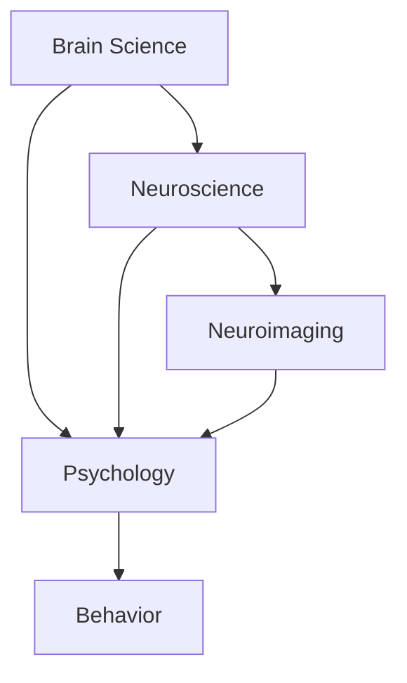
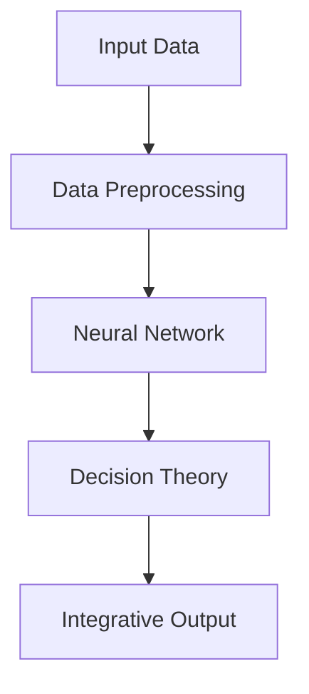

                 

# 脑科学与心理学的整合：全面理解人类心智与世界的关系

> 关键词：脑科学、心理学、心智、世界关系、整合、算法原理、系统分析与架构设计、项目实战

> 摘要：本文旨在探讨脑科学与心理学的整合研究，全面理解人类心智与世界的关系。通过阐述两者的核心概念与联系，介绍研究方法与整合算法原理，分析系统架构设计，并展示项目实战案例，为读者提供深入理解与实用指导。

## 第一部分：引论

### 第1章：脑科学与心理学的整合概述

**1.1 脑科学与心理学的研究背景**

脑科学与心理学作为现代科学的两大领域，分别在理解人类大脑运作和心智行为方面取得了显著成果。脑科学致力于揭示大脑的构造、功能、机制以及与行为的关系，而心理学则研究人类心理活动的规律和个体行为的表现。

**1.2 脑科学与心理学整合的意义**

脑科学与心理学的整合研究具有重要的理论和实际意义。它不仅有助于深入理解心智的本质，还能够为心理健康、疾病治疗、教育干预等领域提供科学依据。整合研究能够促进跨学科的知识交流，推动科技进步。

**1.3 脑科学与心理学研究的关键问题**

当前脑科学与心理学整合研究的关键问题包括：如何建立有效的整合模型？如何利用神经科学技术研究心理现象？如何将心理学理论与脑科学数据相结合？这些问题的解决将推动整合研究的发展。

### 第2章：脑科学与心理学的核心概念

**2.1 脑科学与心理学的基本概念**

脑科学的核心概念包括大脑结构、神经递质、神经网络等。心理学则关注认知、情感、行为等心理过程。两者研究的核心都是人类心智，但侧重点不同。

**2.2 脑科学与心理学的关系**

脑科学与心理学之间存在着紧密的联系。脑科学研究为心理学提供了生物学基础，而心理学的理论模型则指导脑科学研究的方向。两者相互促进，共同发展。

**2.3 脑科学与心理学的边界与外延**

脑科学与心理学的边界在于研究领域和方法论。脑科学侧重于生物学和神经科学的研究方法，而心理学则更多地采用实验和社会科学研究方法。两者的外延还包括神经科学、认知科学等领域。

### 第3章：脑科学与心理学的研究方法

**3.1 脑科学的研究方法**

脑科学研究方法包括脑成像技术、神经生理学实验、脑机接口等。这些方法有助于揭示大脑的动态变化和神经活动。

**3.2 心理学的研究方法**

心理学研究方法包括实验心理学、认知心理学、发展心理学等。这些方法通过观察、实验和问卷调查等手段研究人类心理过程和行为。

**3.3 脑科学与心理学整合的研究方法**

整合研究方法包括跨学科的数据分析、理论建模、模拟仿真等。这些方法能够结合脑科学和心理学的研究成果，提供更为全面和深入的见解。

## 第二部分：核心概念与联系

### 第4章：脑结构与功能

**4.1 脑结构的基本概念**

脑结构包括大脑皮层、基底神经节、脑干等。每种结构都有其特定的功能和神经连接。

**4.2 脑功能的基本概念**

脑功能涉及认知、记忆、感知、运动控制等多个方面。不同脑区协同工作，实现复杂的心智功能。

**4.3 脑结构与功能的联系**

脑结构与功能之间存在着密切的联系。例如，大脑皮层的不同区域负责不同的认知任务，神经连接的强度和效率影响心理过程的效率。

### 第5章：心理学理论与模型

**5.1 心理学理论的基本概念**

心理学理论包括行为主义、认知心理学、人本主义等。每种理论都试图解释人类心理行为的本质。

**5.2 心理模型的基本概念**

心理模型是心理学家用来理解和描述心理过程的工具。例如，认知模型描述了人类如何进行信息处理，而情感模型则关注情绪的产生和调节。

**5.3 心理学理论与模型的联系**

心理学理论与模型相互支持，共同解释人类心理行为。理论提供了概念框架，而模型则通过数学和计算机模拟等方法具体化理论。

### 第6章：脑科学与心理学的关系图

**6.1 ER实体关系图架构**

使用Mermaid绘制ER实体关系图，展示脑科学与心理学之间的核心实体及其关系。

```mermaid
erDiagram
  Brain --> Psychology : influences
  BrainScience --> Psychology : integrates
  Brain --> NeuralActivity : contains
  PsychologicalProcess --> Brain : affects
```

**6.2 脑科学与心理学的关系图**

通过Mermaid绘制脑科学与心理学的关系图，展示两者之间的相互作用和整合。



## 第三部分：算法原理讲解

### 第7章：脑科学与心理学的整合算法原理

**7.1 整合算法的基本概念**

整合算法是一种跨学科的方法，用于结合脑科学和心理学的研究成果，分析人类心智与世界的关系。

**7.2 整合算法的数学模型**

整合算法的数学模型包括神经网络模型、决策理论模型等。这些模型能够模拟大脑的工作机制，分析心理过程。

**7.3 整合算法的公式与详细讲解**

$$
\text{IntegrativeAlgorithm}(x) = f(\text{BrainData}, \text{PsychologicalData})
$$

其中，$f$ 是一个复合函数，结合了脑科学和心理学数据，用于预测心理过程。

**7.4 整合算法的mermaid流程图**



### 第8章：算法应用与举例说明

**8.1 算法应用的实际案例**

算法在心理健康评估、认知功能诊断、教育干预等领域有广泛应用。

**8.2 算法的数学模型和公式举例说明**

假设我们有一个简单的神经网络模型，用于预测个体的情绪状态。

```python
# Python 代码示例
import numpy as np

# 定义神经网络模型
def neural_network(input_data):
    # 加权矩阵
    W = np.random.rand(input_data.shape[1], 1)
    # 激活函数
    activation = lambda x: 1 / (1 + np.exp(-x))
    # 前向传播
    output = activation(np.dot(input_data, W))
    return output

# 输入数据
input_data = np.array([[1, 0], [0, 1], [1, 1]])

# 计算输出
output = neural_network(input_data)
print(output)
```

**8.3 算法的mermaid流程图举例说明**


## 第四部分：系统分析与架构设计

### 第9章：脑科学与心理学系统分析

**9.1 问题场景介绍**

在心理健康评估系统中，脑科学与心理学整合算法用于评估个体的心理健康状态。

**9.2 项目介绍**

项目目标是开发一个集成脑科学和心理学数据的心理健康评估系统。

**9.3 系统功能设计**

系统功能设计包括数据收集、预处理、算法应用和结果展示等。

### 第10章：系统架构设计

**10.1 系统架构设计**

系统架构设计采用模块化设计，包括数据模块、算法模块和结果展示模块。

**10.2 系统接口设计**

系统接口设计包括数据接口和算法接口，用于与其他系统集成。

**10.3 系统交互**

系统交互设计确保各个模块之间能够顺畅地传递数据和结果。

### 第11章：系统分析与架构设计详解

**11.1 系统功能设计详解**

详细描述系统的各个功能模块及其实现方法。

**11.2 系统架构设计详解**

详细展示系统的整体架构及其组成部分。

**11.3 系统接口设计详解**

详细说明系统的接口设计和数据传递机制。

## 第五部分：项目实战

### 第12章：环境安装与系统实现

**12.1 环境安装**

介绍安装系统所需的软件和硬件环境。

**12.2 系统核心实现源代码**

提供系统核心功能的实现代码。

**12.3 代码应用解读与分析**

详细解读代码实现原理，分析其应用效果。

### 第13章：实际案例分析

**13.1 实际案例**

介绍一个实际应用案例，展示系统在实际场景中的表现。

**13.2 案例分析**

分析案例中的问题，展示系统的解决方案。

**13.3 剖析与讲解**

对案例进行深入剖析，讲解系统实现的细节和技巧。

### 第14章：项目小结

**14.1 项目总结**

总结项目的成果和经验教训。

**14.2 注意事项**

提醒用户在应用系统时需要注意的事项。

**14.3 拓展阅读**

推荐进一步阅读的相关文献和资源。

## 结语

脑科学与心理学的整合研究为我们理解人类心智与世界的关系提供了新的视角和方法。通过整合两者的研究成果，我们可以更全面地认识人类行为和心理过程，为心理学、神经科学、医学等领域的发展做出贡献。

### 作者

**作者：AI天才研究院/AI Genius Institute & 禅与计算机程序设计艺术 /Zen And The Art of Computer Programming** 

通过上述内容，我们希望能够帮助读者深入理解脑科学与心理学的整合研究，并在实践中应用这些知识。希望本文能够为您的学习和研究带来启发和帮助。在未来的研究中，我们将继续探索脑科学与心理学的更多可能性，为人类心智的发展做出贡献。**

