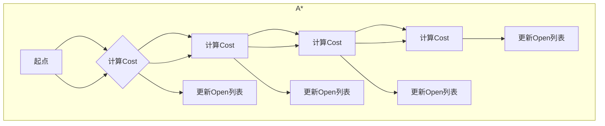
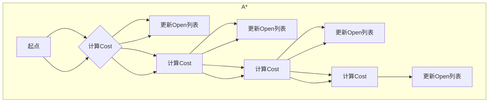
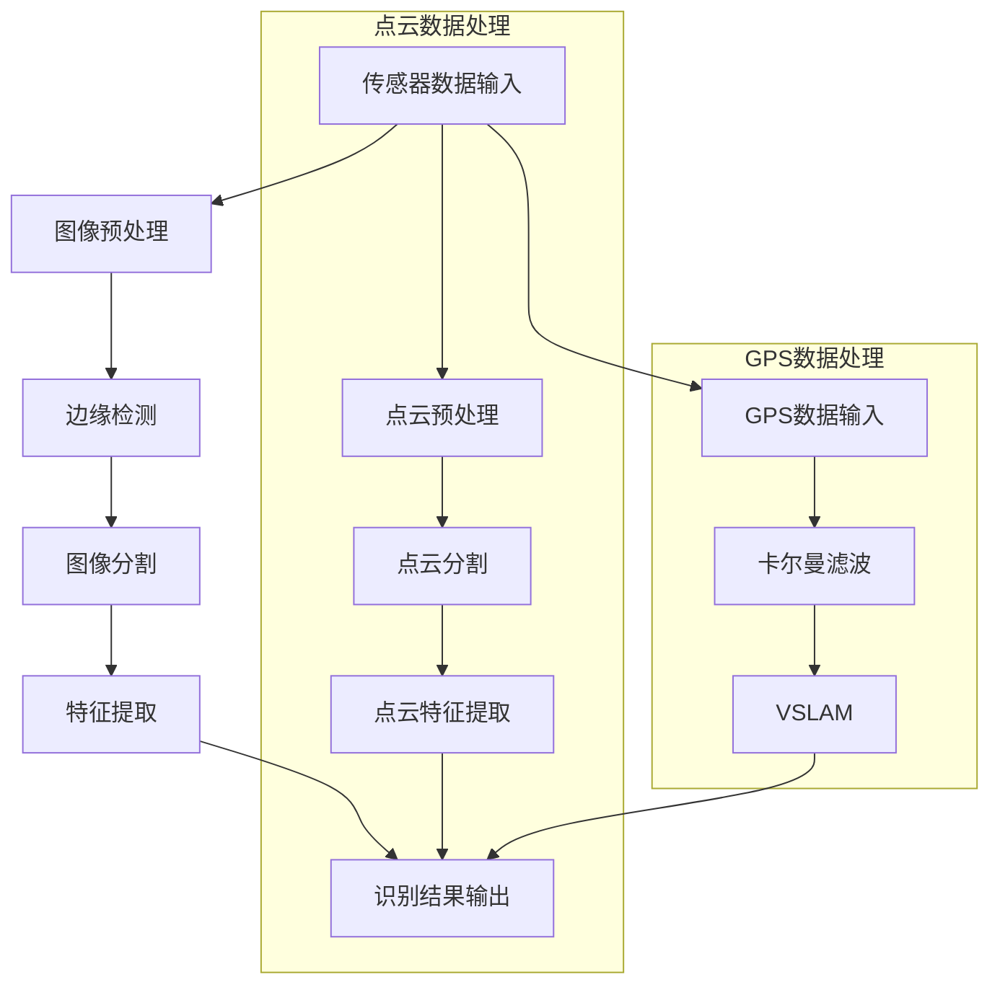
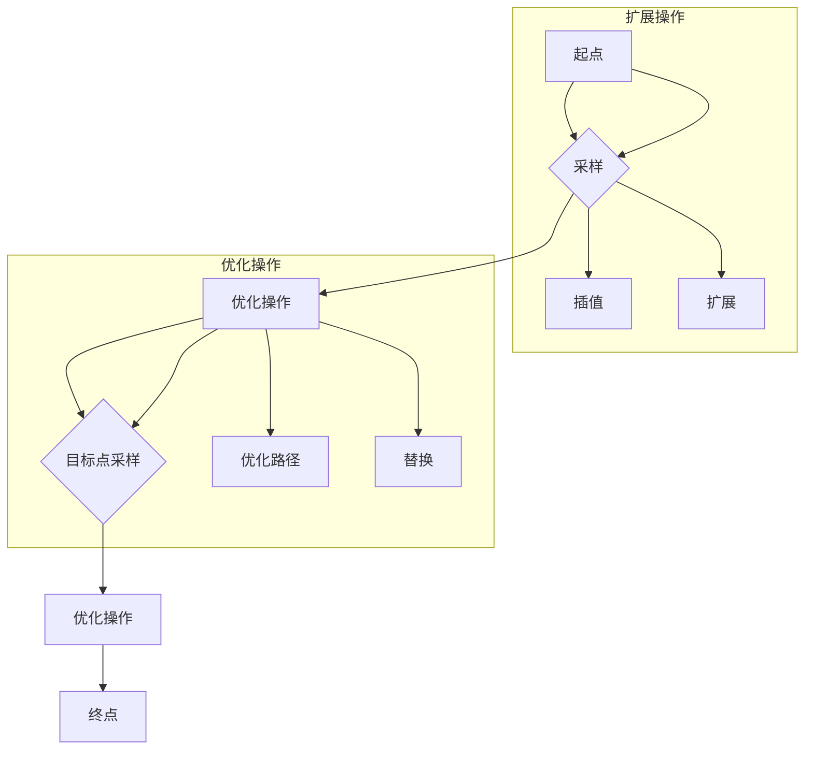
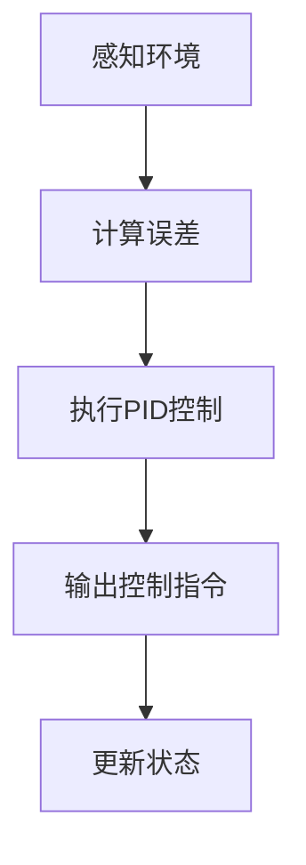
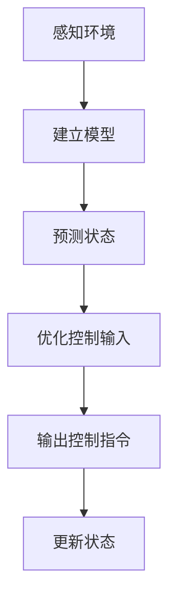

                 


### 《自动驾驶的决策算法：交通安全的数学保障》

---

### 关键词

自动驾驶、决策算法、交通安全、数学模型、路径规划、车辆控制

### 摘要

本文深入探讨了自动驾驶技术中的决策算法，这些算法在保障交通安全方面起着至关重要的作用。通过对自动驾驶决策算法的背景介绍、核心概念与联系的分析、算法原理的讲解以及实际应用案例的剖析，本文旨在为读者提供对自动驾驶决策算法的全面理解，并探讨其在交通安全中的数学保障机制。文章通过实例代码和流程图的展示，帮助读者更直观地理解算法的实现过程，从而为自动驾驶技术的发展和应用提供有力支持。

---

### 第一部分：背景介绍

## 第1章 问题背景

### 1.1 自动驾驶技术发展现状

自动驾驶技术，作为现代智能交通系统的重要组成部分，已经逐渐成为汽车产业和信息技术领域的研究热点。自21世纪初以来，自动驾驶技术经历了从概念验证到实际应用的快速发展。根据国际机器人联合会（IFR）的统计，全球自动驾驶汽车市场规模预计将在2025年达到500亿美元，并在2030年达到2000亿美元。这一趋势表明，自动驾驶技术正从理论研究阶段逐步走向市场应用阶段。

自动驾驶技术的发展可以分为几个阶段，主要包括：辅助驾驶、部分自动驾驶、有条件自动驾驶和完全自动驾驶。当前，大多数量产车型处于辅助驾驶和部分自动驾驶阶段，例如自适应巡航控制和自动车道保持功能。有条件自动驾驶，如特斯拉的Autopilot和Waymo的Level 2自动驾驶系统，已经实现了在特定条件下无需人工干预的驾驶。完全自动驾驶技术，尽管目前仍处于研发阶段，但各大科技公司和研究机构正加紧推进，预计在未来数年内有望实现商业化应用。

### 1.2 自动驾驶安全的重要性

自动驾驶技术的安全是公众关注的热点问题之一。随着自动驾驶技术的普及，如何保障交通安全成为了一个亟待解决的问题。自动驾驶安全的重要性主要体现在以下几个方面：

1. **减少交通事故**：据统计，全球每年因交通事故造成的死亡人数超过120万人，其中大部分是由于人为错误导致的。自动驾驶技术通过减少人为干预，有望大幅降低交通事故的发生率。

2. **提高交通效率**：自动驾驶车辆可以更好地进行路线规划和车辆间的协同，减少交通拥堵和停车时间，从而提高交通系统的整体效率。

3. **缓解交通压力**：随着城市化进程的加速，城市交通压力不断增大。自动驾驶技术可以通过优化路线和交通流，缓解城市交通压力。

4. **提高出行体验**：自动驾驶技术为乘客提供了更加舒适、便捷的出行方式，特别是在长途驾驶和复杂的交通环境中。

### 1.3 自动驾驶安全面临的挑战

尽管自动驾驶技术在许多方面具有巨大的潜力，但实现完全安全可靠的自动驾驶系统仍然面临一系列挑战：

1. **技术挑战**：自动驾驶系统需要处理海量的数据，并实时做出正确的决策。这要求自动驾驶系统具有极高的计算能力和算法精度。

2. **传感器和感知技术**：自动驾驶系统依赖于各种传感器（如激光雷达、摄像头、超声波传感器等）来感知周围环境。这些传感器的精度、可靠性和抗干扰能力直接影响到自动驾驶系统的性能。

3. **决策算法**：自动驾驶系统的核心是决策算法，这些算法需要处理复杂的交通状况，并做出及时、准确、安全的驾驶决策。

4. **伦理和法律问题**：在自动驾驶技术中，如何处理复杂的伦理问题（如“电车难题”），以及如何制定相应的法律法规，也是自动驾驶安全面临的挑战。

5. **用户接受度和隐私保护**：公众对自动驾驶技术的接受程度以及如何保护用户隐私也是实现自动驾驶安全的重要问题。

### 1.4 本书目的与结构安排

本书旨在通过系统地介绍自动驾驶决策算法，探讨其在交通安全中的数学保障机制。全书分为六个部分：

- **第一部分：背景介绍**：介绍自动驾驶技术的发展现状、安全重要性以及面临的挑战。
- **第二部分：核心概念与联系**：探讨自动驾驶决策算法的基础知识，包括核心概念和联系。
- **第三部分：数学模型与算法原理**：详细讲解自动驾驶决策算法的数学模型和原理，并通过实例代码和流程图进行说明。
- **第四部分：算法应用与实践**：介绍自动驾驶决策算法在不同场景中的应用，包括路况识别、路径规划和车辆控制。
- **第五部分：系统分析与架构设计**：分析自动驾驶决策系统的功能设计和架构设计。
- **第六部分：最佳实践与总结**：总结自动驾驶决策算法的最佳实践，展望其发展前景。

通过本书的阅读，读者将能够全面了解自动驾驶决策算法的基本原理和应用方法，为自动驾驶技术的发展和应用提供有力支持。

### 第二部分：核心概念与联系

## 第2章 自动驾驶决策算法基础

### 2.1 自动驾驶决策算法概述

自动驾驶决策算法是自动驾驶系统的核心，负责根据传感器数据和环境信息，实时做出驾驶决策，确保车辆的安全、高效运行。决策算法的目标是优化车辆行驶路径、速度和转向等参数，以适应动态变化的交通环境。

#### 自动驾驶决策算法的基本功能

1. **感知与理解**：通过传感器感知车辆周围环境，包括道路、车辆、行人等，并理解这些环境元素的动态变化。

2. **路径规划**：根据车辆的当前位置和目标位置，规划最优行驶路径。

3. **行为规划**：确定车辆的行驶行为，如加速、减速、转弯等，以实现路径规划目标。

4. **动态响应**：在遇到紧急情况时，能够快速响应，采取适当的驾驶行为。

#### 自动驾驶决策算法的发展历程

自动驾驶决策算法的发展可以追溯到20世纪50年代。早期的自动驾驶系统主要依靠规则推理和模糊逻辑，但随着计算机性能的不断提升和传感器技术的进步，现代自动驾驶决策算法逐渐转向基于机器学习和人工智能的方法。

1. **规则推理**：基于预定义的规则进行决策，适用于简单、规则明确的环境。
2. **模糊逻辑**：通过模糊集合和模糊规则进行决策，适用于不确定性较大的环境。
3. **基于模型的控制**：基于系统模型进行决策，适用于对系统状态有较好理解的场景。
4. **机器学习**：利用大量历史数据训练模型，实现自主学习和决策，适用于复杂、动态变化的环境。

### 2.2 自动驾驶决策算法的核心概念

#### 2.2.1 传感器数据预处理

传感器数据预处理是自动驾驶决策算法的关键步骤，其主要任务包括去噪、归一化和特征提取等。

1. **去噪**：去除传感器数据中的噪声，提高数据的可靠性。
2. **归一化**：将不同传感器数据的量纲统一，便于后续处理。
3. **特征提取**：提取传感器数据中的关键特征，如速度、加速度、距离等，用于决策算法。

#### 2.2.2 路径规划算法

路径规划是自动驾驶决策算法的核心功能之一，其目标是找到从起始位置到目标位置的最优路径。常见的路径规划算法包括：

1. **基于图的算法**：如A*算法、Dijkstra算法等，适用于静态或动态环境。
2. **基于采样法的算法**：如RRT（快速随机树）算法、RRT*算法等，适用于高维、非结构化环境。
3. **基于机器学习的算法**：如基于深度强化学习的路径规划算法，适用于复杂、动态环境。

#### 2.2.3 行为规划算法

行为规划是自动驾驶决策算法的另一核心功能，其目标是确定车辆的行驶行为，如加速、减速、转弯等。常见的行为规划算法包括：

1. **规则基算法**：基于预定义的规则进行行为规划，适用于简单、规则明确的环境。
2. **基于模型的控制算法**：基于系统模型进行行为规划，适用于对系统状态有较好理解的场景。
3. **基于机器学习的算法**：利用大量历史数据训练模型，实现自主学习和行为规划，适用于复杂、动态环境。

#### 2.2.4 动态响应算法

动态响应算法用于在紧急情况下快速响应，采取适当的驾驶行为，确保车辆安全。常见的动态响应算法包括：

1. **规则推理**：基于预定义的规则进行响应，适用于紧急情况处理。
2. **模糊逻辑**：通过模糊规则进行响应，适用于不确定性较大的紧急情况。
3. **基于模型的控制**：基于系统模型进行响应，适用于对系统状态有较好理解的紧急情况。

### 2.3 自动驾驶决策算法的分类与特点

自动驾驶决策算法可以根据其应用场景和特点进行分类，主要包括以下几种类型：

#### 2.3.1 静态环境下的决策算法

1. **规则推理算法**：基于预定义的规则进行决策，适用于静态、规则明确的环境。优点是简单、易于实现，但灵活性较差。
2. **模糊逻辑算法**：通过模糊集合和模糊规则进行决策，适用于不确定性较大的静态环境。优点是适应性强，但计算复杂度较高。

#### 2.3.2 动态环境下的决策算法

1. **基于图的算法**：如A*算法、Dijkstra算法等，适用于静态或动态环境。优点是算法成熟、计算效率高，但难以处理高维、非结构化环境。
2. **基于采样法的算法**：如RRT（快速随机树）算法、RRT*算法等，适用于高维、非结构化动态环境。优点是适应性较强、计算效率高，但难以处理复杂、动态变化的环境。
3. **基于机器学习的算法**：如基于深度强化学习的路径规划算法，适用于复杂、动态环境。优点是自适应性强、灵活，但训练成本较高、对数据依赖较大。

通过上述分类与特点的分析，读者可以更好地了解不同自动驾驶决策算法的应用场景和适用性，从而选择合适的算法实现自动驾驶系统。

---

在了解了自动驾驶决策算法的概述、核心概念和分类后，读者应认识到，每种算法都有其特定的优势和应用场景。选择合适的算法，并进行有效的算法组合，是提高自动驾驶系统性能和可靠性的关键。下一章，我们将深入探讨自动驾驶决策算法的数学模型和原理，为读者提供更具体的理解。

## 第三部分：数学模型与算法原理

### 第3章 数学模型与算法原理

在自动驾驶决策算法中，数学模型和算法原理起到了至关重要的作用。这些模型和原理不仅为算法的实现提供了理论基础，而且通过精确的数学描述和计算方法，使得自动驾驶系统能够更好地应对复杂的交通环境和突发状况。本章将详细讲解自动驾驶决策算法的数学模型和原理，并通过Mermaid流程图和Python源代码示例，帮助读者更好地理解这些概念。

### 3.1 数学模型概述

数学模型是自动驾驶决策算法的核心组成部分，它们通过数学语言描述了自动驾驶系统在感知、决策和行为规划等方面的过程。常见的数学模型包括：

1. **状态模型**：描述车辆在环境中的状态，包括位置、速度、加速度等。
2. **传感器模型**：描述传感器如何感知周围环境，如摄像头、激光雷达、GPS等。
3. **路径规划模型**：描述如何从当前地点到目标地点规划最优路径。
4. **行为规划模型**：描述如何根据环境和状态信息规划车辆的驾驶行为。
5. **控制模型**：描述如何根据行为规划结果控制车辆的执行系统，如发动机、转向等。

### 3.2 自动驾驶决策算法的数学模型

在本节中，我们将通过一个简单的路径规划算法——A*算法，来介绍自动驾驶决策算法的数学模型。

#### 3.2.1 A*算法的数学模型

A*算法是一种基于图的最短路径算法，其主要思想是找到从起点到终点的最优路径。A*算法的数学模型可以表示为：

$$
\text{Cost}(s, g) = \text{g}(s) + \text{h}(s)
$$

其中，$s$表示当前节点，$g(s)$表示从起点到当前节点的实际代价，$\text{h}(s)$表示从当前节点到终点的启发式代价。

- $\text{g}(s)$：实际代价，表示从起点到当前节点的总距离，通常为欧几里得距离或曼哈顿距离。
- $\text{h}(s)$：启发式代价，表示从当前节点到终点的估计距离。

A*算法的目标是找到使得$\text{Cost}(s, g)$最小的路径。

#### 3.2.2 A*算法的Mermaid流程图

为了更直观地理解A*算法的执行过程，我们使用Mermaid语言绘制其流程图，如下所示：



在这个流程图中，每个节点代表地图上的一个位置，实线箭头表示实际路径，虚线箭头表示启发式路径。算法从起点开始，计算每个节点的实际代价和启发式代价，并将具有最小总代价的节点添加到Open列表中。然后，从Open列表中选择下一个节点进行扩展，直到找到终点。

#### 3.2.3 A*算法的Python源代码示例

为了进一步展示A*算法的实现过程，我们提供了一个简单的Python代码示例：

```python
import heapq

def heuristic(a, b):
    # 使用曼哈顿距离作为启发式
    return abs(a[0] - b[0]) + abs(a[1] - b[1])

def a_star_search(map, start, goal):
    # Open列表：存储尚未扩展的节点
    open_list = []
    heapq.heappush(open_list, (heuristic(start, goal), start))

    # 已访问节点集合
    closed_set = set()

    while open_list:
        # 选择具有最小总代价的节点
        current = heapq.heappop(open_list)[1]

        if current == goal:
            # 到达终点
            return reconstruct_path(current)

        closed_set.add(current)

        for neighbor in get_neighbors(map, current):
            if neighbor in closed_set:
                # 已访问的节点不再扩展
                continue

            # 计算从起点到当前节点的实际代价
            g = current_g + 1
            # 计算从当前节点到终点的启发式代价
            h = heuristic(neighbor, goal)
            # 计算总代价
            f = g + h
            # 将邻居节点添加到Open列表
            heapq.heappush(open_list, (f, neighbor))

    return None

def reconstruct_path(current):
    # 重建路径
    path = [current]
    while current in predecessors:
        current = predecessors[current]
        path.append(current)
    return path[::-1]

def get_neighbors(map, node):
    # 获取相邻节点
    neighbors = []
    for direction in ["up", "down", "left", "right"]:
        new_node = move(node, direction)
        if is_valid(new_node, map):
            neighbors.append(new_node)
    return neighbors

def move(node, direction):
    # 移动节点
    if direction == "up":
        return (node[0], node[1] + 1)
    elif direction == "down":
        return (node[0], node[1] - 1)
    elif direction == "left":
        return (node[0] - 1, node[1])
    elif direction == "right":
        return (node[0] + 1, node[1])

def is_valid(node, map):
    # 判断节点是否有效
    return 0 <= node[0] < len(map) and 0 <= node[1] < len(map[0]) and map[node[0]][node[1]] != 1
```

在这个示例中，我们使用Python实现了A*算法。该算法使用了优先队列（heapq）来管理Open列表，并提供了启发式函数`heuristic`来计算启发式代价。`reconstruct_path`函数用于重建从起点到终点的最优路径。`get_neighbors`函数用于获取当前节点的相邻节点。

通过这个示例，读者可以更直观地理解A*算法的实现过程，并了解到如何使用数学模型和算法原理来解决路径规划问题。

### 3.3 算法原理讲解

在本节中，我们将详细讲解A*算法的原理，并使用Mermaid流程图和Python源代码示例来帮助读者理解。

#### 3.3.1 算法原理

A*算法是一种启发式搜索算法，其核心思想是通过结合实际代价和启发式代价，找到从起点到终点的最优路径。具体步骤如下：

1. **初始化**：将起点加入Open列表，并将起点作为当前节点。
2. **扩展节点**：从Open列表中选择具有最小总代价的节点，将其标记为已访问，并将其邻居节点加入Open列表。
3. **更新Open列表**：对于每个新加入的邻居节点，计算其从起点到终点的总代价，并将其加入Open列表。
4. **重复步骤2和3**，直到找到终点或Open列表为空。

在A*算法中，启发式函数起到了关键作用。启发式函数$h(s)$是对从当前节点到终点的估计代价。常见的启发式函数包括欧几里得距离、曼哈顿距离等。选择合适的启发式函数可以显著提高算法的效率。

#### 3.3.2 Mermaid流程图

为了更直观地展示A*算法的执行过程，我们使用Mermaid语言绘制了其流程图，如下所示：



在这个流程图中，A*算法从起点开始，计算每个节点的实际代价和启发式代价，并将具有最小总代价的节点添加到Open列表中。然后，从Open列表中选择下一个节点进行扩展，直到找到终点。

#### 3.3.3 Python源代码示例

下面是A*算法的Python源代码示例，我们将对代码中的关键部分进行详细解释：

```python
import heapq

def heuristic(a, b):
    # 使用曼哈顿距离作为启发式
    return abs(a[0] - b[0]) + abs(a[1] - b[1])

def a_star_search(map, start, goal):
    # Open列表：存储尚未扩展的节点
    open_list = []
    heapq.heappush(open_list, (heuristic(start, goal), start))

    # 已访问节点集合
    closed_set = set()

    while open_list:
        # 选择具有最小总代价的节点
        current = heapq.heappop(open_list)[1]

        if current == goal:
            # 到达终点
            return reconstruct_path(current)

        closed_set.add(current)

        for neighbor in get_neighbors(map, current):
            if neighbor in closed_set:
                # 已访问的节点不再扩展
                continue

            # 计算从起点到当前节点的实际代价
            g = current_g + 1
            # 计算从当前节点到终点的启发式代价
            h = heuristic(neighbor, goal)
            # 计算总代价
            f = g + h
            # 将邻居节点添加到Open列表
            heapq.heappush(open_list, (f, neighbor))

    return None

def reconstruct_path(current):
    # 重建路径
    path = [current]
    while current in predecessors:
        current = predecessors[current]
        path.append(current)
    return path[::-1]

def get_neighbors(map, node):
    # 获取相邻节点
    neighbors = []
    for direction in ["up", "down", "left", "right"]:
        new_node = move(node, direction)
        if is_valid(new_node, map):
            neighbors.append(new_node)
    return neighbors

def move(node, direction):
    # 移动节点
    if direction == "up":
        return (node[0], node[1] + 1)
    elif direction == "down":
        return (node[0], node[1] - 1)
    elif direction == "left":
        return (node[0] - 1, node[1])
    elif direction == "right":
        return (node[0] + 1, node[1])

def is_valid(node, map):
    # 判断节点是否有效
    return 0 <= node[0] < len(map) and 0 <= node[1] < len(map[0]) and map[node[0]][node[1]] != 1
```

1. **启发式函数**：`heuristic`函数用于计算启发式代价，这里我们使用了曼哈顿距离。启发式函数的选择对算法的性能有重要影响，需要根据具体应用场景进行优化。

2. **A*算法的核心实现**：`a_star_search`函数是A*算法的核心实现。它使用优先队列（heapq）来管理Open列表，选择具有最小总代价的节点进行扩展。`get_neighbors`函数用于获取当前节点的相邻节点，`is_valid`函数用于判断节点是否有效。

3. **路径重建**：`reconstruct_path`函数用于从终点逆推重建路径。通过记录每个节点的先祖节点，可以轻松地恢复从起点到终点的最优路径。

通过这个示例，读者可以了解到A*算法的实现原理，并通过代码实现加深对算法的理解。

### 3.4 算法原理的Mermaid流程图

为了更直观地展示A*算法的执行过程，我们使用Mermaid语言绘制了其流程图，如下所示：


在这个流程图中，每个节点代表地图上的一个位置，实线箭头表示实际路径，虚线箭头表示启发式路径。算法从起点开始，计算每个节点的实际代价和启发式代价，并将具有最小总代价的节点添加到Open列表中。然后，从Open列表中选择下一个节点进行扩展，直到找到终点。

### 3.5 Python源代码详细讲解

在本节中，我们将对A*算法的Python源代码进行详细讲解，帮助读者理解代码的实现过程和算法原理。

```python
import heapq

def heuristic(a, b):
    # 使用曼哈顿距离作为启发式
    return abs(a[0] - b[0]) + abs(a[1] - b[1])

def a_star_search(map, start, goal):
    # Open列表：存储尚未扩展的节点
    open_list = []
    heapq.heappush(open_list, (heuristic(start, goal), start))

    # 已访问节点集合
    closed_set = set()

    while open_list:
        # 选择具有最小总代价的节点
        current = heapq.heappop(open_list)[1]

        if current == goal:
            # 到达终点
            return reconstruct_path(current)

        closed_set.add(current)

        for neighbor in get_neighbors(map, current):
            if neighbor in closed_set:
                # 已访问的节点不再扩展
                continue

            # 计算从起点到当前节点的实际代价
            g = current_g + 1
            # 计算从当前节点到终点的启发式代价
            h = heuristic(neighbor, goal)
            # 计算总代价
            f = g + h
            # 将邻居节点添加到Open列表
            heapq.heappush(open_list, (f, neighbor))

    return None

def reconstruct_path(current):
    # 重建路径
    path = [current]
    while current in predecessors:
        current = predecessors[current]
        path.append(current)
    return path[::-1]

def get_neighbors(map, node):
    # 获取相邻节点
    neighbors = []
    for direction in ["up", "down", "left", "right"]:
        new_node = move(node, direction)
        if is_valid(new_node, map):
            neighbors.append(new_node)
    return neighbors

def move(node, direction):
    # 移动节点
    if direction == "up":
        return (node[0], node[1] + 1)
    elif direction == "down":
        return (node[0], node[1] - 1)
    elif direction == "left":
        return (node[0] - 1, node[1])
    elif direction == "right":
        return (node[0] + 1, node[1])

def is_valid(node, map):
    # 判断节点是否有效
    return 0 <= node[0] < len(map) and 0 <= node[1] < len(map[0]) and map[node[0]][node[1]] != 1
```

#### 3.5.1 启发式函数`heuristic`

启发式函数是A*算法的核心组成部分，用于估计从当前节点到终点的代价。在本例中，我们使用了曼哈顿距离作为启发式函数：

```python
def heuristic(a, b):
    # 使用曼哈顿距离作为启发式
    return abs(a[0] - b[0]) + abs(a[1] - b[1])
```

曼哈顿距离是一种常用的启发式函数，适用于二维空间中的路径规划。该函数计算两个点之间的水平距离和垂直距离之和。

#### 3.5.2 A*算法的主函数`a_star_search`

`a_star_search`函数是A*算法的主函数，负责搜索从起点到终点的最优路径。以下是对函数中关键部分的详细解释：

1. **初始化Open列表**：

```python
open_list = []
heapq.heappush(open_list, (heuristic(start, goal), start))
```

初始化Open列表，并将起点加入列表中。`heapq`模块用于实现一个优先队列，确保Open列表中的节点总是按照总代价进行排序。

2. **搜索过程**：

```python
while open_list:
    current = heapq.heappop(open_list)[1]
```

在搜索过程中，每次从Open列表中选择具有最小总代价的节点进行处理。

3. **到达终点**：

```python
if current == goal:
    # 到达终点
    return reconstruct_path(current)
```

如果当前节点是终点，则调用`reconstruct_path`函数重建路径并返回。

4. **更新Open列表**：

```python
for neighbor in get_neighbors(map, current):
    if neighbor in closed_set:
        continue
    g = current_g + 1
    h = heuristic(neighbor, goal)
    f = g + h
    heapq.heappush(open_list, (f, neighbor))
```

对于当前节点的每个邻居节点，如果邻居节点已经在closed_set中，则不再进行扩展。否则，计算从起点到邻居节点的实际代价g、从邻居节点到终点的启发式代价h以及总代价f，并将邻居节点加入Open列表。

#### 3.5.3 路径重建函数`reconstruct_path`

路径重建函数`reconstruct_path`用于从终点逆推重建路径。以下是对函数中关键部分的详细解释：

```python
def reconstruct_path(current):
    # 重建路径
    path = [current]
    while current in predecessors:
        current = predecessors[current]
        path.append(current)
    return path[::-1]
```

路径重建函数通过记录每个节点的先祖节点，逆推找到从起点到终点的最优路径。最后，将路径反转并返回。

#### 3.5.4 获取邻居节点函数`get_neighbors`

获取邻居节点函数`get_neighbors`用于获取当前节点的相邻节点。以下是对函数中关键部分的详细解释：

```python
def get_neighbors(map, node):
    neighbors = []
    for direction in ["up", "down", "left", "right"]:
        new_node = move(node, direction)
        if is_valid(new_node, map):
            neighbors.append(new_node)
    return neighbors
```

函数遍历四个方向（上、下、左、右），使用`move`函数移动节点并判断新节点是否有效。如果新节点有效，则将其添加到邻居节点列表中。

#### 3.5.5 移动节点函数`move`

移动节点函数`move`用于将节点在给定方向上移动一个单位。以下是对函数中关键部分的详细解释：

```python
def move(node, direction):
    if direction == "up":
        return (node[0], node[1] + 1)
    elif direction == "down":
        return (node[0], node[1] - 1)
    elif direction == "left":
        return (node[0] - 1, node[1])
    elif direction == "right":
        return (node[0] + 1, node[1])
```

函数根据给定的方向，更新节点的坐标。例如，如果方向为“up”，则将节点的y坐标增加1。

#### 3.5.6 判断节点有效性函数`is_valid`

判断节点有效性函数`is_valid`用于判断给定节点是否在地图内且未被占用。以下是对函数中关键部分的详细解释：

```python
def is_valid(node, map):
    return 0 <= node[0] < len(map) and 0 <= node[1] < len(map[0]) and map[node[0]][node[1]] != 1
```

函数检查节点的x和y坐标是否在地图的范围内，并判断节点是否被占用。如果节点有效，则返回True。

通过详细讲解A*算法的Python源代码，读者可以更好地理解算法的实现原理和执行过程。这为后续在实际应用中实现和优化自动驾驶决策算法奠定了基础。

## 第四部分：算法应用与实践

### 第4章 自动驾驶决策算法在路况识别中的应用

路况识别是自动驾驶系统中至关重要的一环，它通过分析传感器数据，识别出道路上的各种特征，如车道线、交通标志、交通信号灯等，为自动驾驶决策算法提供关键信息。本章将介绍自动驾驶决策算法在路况识别中的应用，包括算法原理、数学模型、流程图展示以及Python源代码示例。

### 4.1 路况识别算法原理

路况识别算法的核心任务是通过对传感器数据进行处理，提取出道路上的关键特征。常见的传感器包括摄像头、激光雷达（LIDAR）、GPS等。以下是一些常用的路况识别算法原理：

#### 4.1.1 摄像头数据处理

1. **图像预处理**：通过滤波、去噪等操作，提高图像质量，以便后续处理。

2. **边缘检测**：使用Canny、Sobel等边缘检测算法，提取图像中的车道线等特征。

3. **图像分割**：使用阈值处理、区域生长等算法，将图像分为不同的区域，识别出道路、车辆、行人等。

4. **特征提取**：对分割后的图像进行特征提取，如使用HOG（Histogram of Oriented Gradients）特征描述子，用于后续分类和识别。

#### 4.1.2 激光雷达数据处理

1. **点云预处理**：对激光雷达生成的点云数据进行滤波、去噪等处理，提高数据质量。

2. **点云分割**：通过聚类、阈值处理等方法，将点云数据分割为不同的区域，识别出车道线、交通标志等。

3. **点云特征提取**：对分割后的点云数据进行特征提取，如使用Voxel体素化、ICP（Iterative Closest Point）算法等，用于后续识别和分类。

#### 4.1.3 GPS数据处理

GPS数据主要用于定位和导航，通过分析GPS数据，可以确定车辆的位置和行驶方向。常见的算法包括：

1. **卡尔曼滤波**：用于实时估计车辆的位置和速度。

2. **粒子滤波**：用于处理非线性、非高斯噪声的情况。

3. **VSLAM（Visual Simultaneous Localization and Mapping）**：结合视觉和GPS数据，实现高精度的定位和地图构建。

### 4.2 路况识别算法的数学模型

在路况识别算法中，数学模型用于描述传感器数据处理、特征提取和识别等过程。以下是一些常见的数学模型：

1. **图像预处理模型**：

   - **滤波模型**：使用卷积神经网络（CNN）或滤波器（如高斯滤波、中值滤波）进行去噪和滤波。

   - **边缘检测模型**：使用Sobel、Prewitt或Canny算法进行边缘检测。

2. **图像分割模型**：

   - **阈值处理模型**：使用Otsu、自适应阈值等方法进行图像分割。

   - **区域生长模型**：基于种子点，通过相似性度量进行区域生长。

3. **特征提取模型**：

   - **HOG特征模型**：计算图像中每个区域的梯度直方图，用于分类和识别。

   - **CNN特征模型**：使用卷积神经网络提取图像中的高层次特征。

4. **点云分割模型**：

   - **聚类模型**：使用K-means、DBSCAN等聚类算法进行点云分割。

   - **阈值处理模型**：使用距离阈值、角度阈值等方法进行点云分割。

5. **点云特征提取模型**：

   - **Voxel体素化模型**：将点云数据转换为体素网格，用于特征提取和识别。

   - **ICP模型**：迭代最近点算法，用于点云配准和特征提取。

6. **定位和导航模型**：

   - **卡尔曼滤波模型**：用于状态估计和误差修正。

   - **粒子滤波模型**：用于非线性、非高斯噪声情况下的状态估计。

   - **VSLAM模型**：结合视觉和GPS数据，实现高精度定位和地图构建。

### 4.3 路况识别算法的Mermaid流程图

为了更直观地展示路况识别算法的执行过程，我们使用Mermaid语言绘制了其流程图，如下所示：



在这个流程图中，传感器数据首先经过图像预处理、边缘检测、图像分割和特征提取等步骤，最终输出识别结果。同时，点云数据处理和GPS数据处理也是路况识别的重要组成部分，它们分别经过点云预处理、点云分割、点云特征提取以及卡尔曼滤波和VSLAM等步骤，最终与图像处理结果相结合，形成完整的路况识别系统。

### 4.4 Python源代码详细讲解

在本节中，我们将对路况识别算法的Python源代码进行详细讲解，帮助读者理解代码的实现过程和算法原理。

```python
import cv2
import numpy as np

def preprocess_image(image):
    # 图像预处理
    gray_image = cv2.cvtColor(image, cv2.COLOR_BGR2GRAY)
    blurred_image = cv2.GaussianBlur(gray_image, (5, 5), 0)
    return blurred_image

def edge_detection(image):
    # 边缘检测
    edges = cv2.Canny(image, 50, 150)
    return edges

def image_segmentation(edges):
    # 图像分割
    _, thresh = cv2.threshold(edges, 0, 255, cv2.THRESH_BINARY + cv2.THRESH_OTSU)
    contours, _ = cv2.findContours(thresh, cv2.RETR_TREE, cv2.CHAIN_APPROX_SIMPLE)
    segmented_image = cv2.drawContours(image, contours, -1, (0, 255, 0), 3)
    return segmented_image

def feature_extraction(segmented_image):
    # 特征提取
    hog = cv2.HOGDescriptor()
    features = hog.compute(segmented_image)
    return features

def recognize_lane(image):
    # 路况识别
    preprocessed_image = preprocess_image(image)
    edges = edge_detection(preprocessed_image)
    segmented_image = image_segmentation(edges)
    features = feature_extraction(segmented_image)
    # 这里可以添加分类器，进行路况识别
    # recognized_lane = classifier.predict(features)
    # return recognized_lane
    return segmented_image

# 测试图像
image = cv2.imread('test_image.jpg')
recognized_lane = recognize_lane(image)
cv2.imshow('Recognized Lane', recognized_lane)
cv2.waitKey(0)
cv2.destroyAllWindows()
```

#### 4.4.1 图像预处理函数`preprocess_image`

图像预处理函数`preprocess_image`用于对输入的图像进行滤波去噪：

```python
def preprocess_image(image):
    # 图像预处理
    gray_image = cv2.cvtColor(image, cv2.COLOR_BGR2GRAY)
    blurred_image = cv2.GaussianBlur(gray_image, (5, 5), 0)
    return blurred_image
```

首先，使用`cv2.cvtColor`函数将图像从BGR格式转换为灰度格式。然后，使用`cv2.GaussianBlur`函数对图像进行高斯滤波，以去除噪声。

#### 4.4.2 边缘检测函数`edge_detection`

边缘检测函数`edge_detection`使用Canny算法对预处理后的图像进行边缘检测：

```python
def edge_detection(image):
    # 边缘检测
    edges = cv2.Canny(image, 50, 150)
    return edges
```

Canny算法通过三个步骤进行边缘检测：高斯滤波、梯度计算和非最大值抑制。参数`50`和`150`分别用于设定高斯滤波器的标准差和Canny算法的阈值。

#### 4.4.3 图像分割函数`image_segmentation`

图像分割函数`image_segmentation`使用Otsu阈值处理和轮廓检测对边缘图像进行分割：

```python
def image_segmentation(edges):
    # 图像分割
    _, thresh = cv2.threshold(edges, 0, 255, cv2.THRESH_BINARY + cv2.THRESH_OTSU)
    contours, _ = cv2.findContours(thresh, cv2.RETR_TREE, cv2.CHAIN_APPROX_SIMPLE)
    segmented_image = cv2.drawContours(image, contours, -1, (0, 255, 0), 3)
    return segmented_image
```

首先，使用`cv2.threshold`函数进行Otsu阈值处理，自动选择最佳阈值，将边缘图像转换为二值图像。然后，使用`cv2.findContours`函数检测二值图像中的轮廓。最后，使用`cv2.drawContours`函数绘制轮廓，将分割后的图像显示出来。

#### 4.4.4 特征提取函数`feature_extraction`

特征提取函数`feature_extraction`使用HOG特征描述子对分割后的图像进行特征提取：

```python
def feature_extraction(segmented_image):
    # 特征提取
    hog = cv2.HOGDescriptor()
    features = hog.compute(segmented_image)
    return features
```

HOG特征描述子通过计算图像中每个区域的空间直方图，描述图像的局部纹理特征。`cv2.HOGDescriptor`类用于创建HOG描述子对象，`compute`方法用于计算特征向量。

#### 4.4.5 路况识别函数`recognize_lane`

路况识别函数`recognize_lane`将上述处理步骤组合起来，完成路况识别：

```python
def recognize_lane(image):
    # 路况识别
    preprocessed_image = preprocess_image(image)
    edges = edge_detection(preprocessed_image)
    segmented_image = image_segmentation(edges)
    features = feature_extraction(segmented_image)
    # 这里可以添加分类器，进行路况识别
    # recognized_lane = classifier.predict(features)
    # return recognized_lane
    return segmented_image
```

这个函数首先对输入图像进行预处理，然后进行边缘检测、图像分割和特征提取。在实际应用中，可以使用分类器对提取到的特征进行路况识别。

通过这个Python源代码示例，读者可以了解到路况识别算法的实现过程和算法原理。在后续的实际应用中，可以根据具体需求进行优化和扩展。

---

在本章中，我们介绍了自动驾驶决策算法在路况识别中的应用，包括算法原理、数学模型、流程图展示和Python源代码示例。通过这些内容，读者可以全面了解路况识别算法的实现过程，为自动驾驶系统的开发和应用提供参考。在下一章，我们将探讨自动驾驶决策算法在路径规划中的应用，进一步了解如何通过算法优化实现自动驾驶系统的安全、高效运行。

### 第5章 自动驾驶决策算法在路径规划中的应用

路径规划是自动驾驶系统的核心功能之一，其主要任务是确定从当前点到目标点的最优路径，确保车辆在复杂的交通环境中安全、高效地行驶。本章将介绍自动驾驶决策算法在路径规划中的应用，包括算法原理、数学模型、流程图展示以及Python源代码示例。

### 5.1 路径规划算法原理

路径规划算法通过处理车辆和环境的动态信息，计算出一条从起点到终点的最优路径。常见的路径规划算法包括基于图的算法、基于采样法的算法和基于机器学习的算法等。

#### 5.1.1 基于图的算法

基于图的算法是最常见的路径规划算法之一，如A*算法、Dijkstra算法等。这些算法将环境表示为一个图，每个节点代表环境中的一个位置，每条边代表两个位置之间的连接。算法的目标是找到从起点到终点的最短路径。

1. **A*算法**：A*算法通过结合实际代价和启发式代价，找到从起点到终点的最优路径。其中，实际代价是从起点到当前节点的实际距离，启发式代价是从当前节点到终点的估计距离。

2. **Dijkstra算法**：Dijkstra算法是一种单源最短路径算法，它从起点开始，逐步扩展到其他节点，直到找到终点。算法通过计算每个节点到起点的最短距离，最终得到从起点到终点的最优路径。

#### 5.1.2 基于采样法的算法

基于采样法的算法适用于高维、非结构化环境，如快速随机树（RRT）算法、RRT*算法等。这些算法通过随机采样和优化，生成从起点到终点的路径。

1. **RRT算法**：RRT算法通过在环境中随机采样点，并逐步扩展生成路径，直到接近目标点。算法的优点是计算效率高，适用于动态环境。

2. **RRT*算法**：RRT*算法是对RRT算法的改进，它通过优化扩展路径，提高路径的质量和效率。RRT*算法在RRT的基础上，引入了目标点采样和优化，进一步提高了路径规划的精度。

#### 5.1.3 基于机器学习的算法

基于机器学习的算法利用大量历史数据，训练模型实现路径规划。常见的算法包括深度强化学习、生成对抗网络（GAN）等。

1. **深度强化学习**：深度强化学习算法通过训练神经网络，实现路径规划。算法通过不断尝试和反馈，优化路径规划策略，提高路径规划的性能。

2. **生成对抗网络（GAN）**：GAN算法通过生成器（Generator）和判别器（Discriminator）的对抗训练，生成高质量的路径规划结果。

### 5.2 路径规划算法的数学模型

在本节中，我们将介绍A*算法和RRT*算法的数学模型，通过这些模型，读者可以更深入地理解路径规划算法的实现原理。

#### 5.2.1 A*算法的数学模型

A*算法的数学模型可以表示为：

$$
f(n) = g(n) + h(n)
$$

其中，$f(n)$表示从起点到节点$n$的总代价，$g(n)$表示从起点到节点$n$的实际代价，$h(n)$表示从节点$n$到终点的启发式代价。

- $g(n)$：实际代价，通常为欧几里得距离或曼哈顿距离。
- $h(n)$：启发式代价，用于估计从节点$n$到终点的距离。常见的启发式函数包括欧几里得距离、曼哈顿距离、Chebyshev距离等。

A*算法的目标是找到使得$f(n)$最小的路径。

#### 5.2.2 RRT*算法的数学模型

RRT*算法的数学模型主要包括两部分：扩展操作和优化操作。

1. **扩展操作**：

   - **采样**：从当前树节点$n$随机采样一个新点$n'$。
   - **插值**：通过插值方法，将$n$和$n'$之间的路径均匀分割成若干段，生成新的路径。
   - **扩展**：将新路径上的节点加入到树中，形成新的子树。

2. **优化操作**：

   - **目标点采样**：从目标点附近随机采样一个新点$n'$。
   - **优化路径**：通过优化算法，如A*算法，计算从当前树节点$n$到目标点$n'$的最优路径。
   - **替换**：如果新路径比当前路径更优，则将当前路径替换为新路径。

### 5.3 路径规划算法的Mermaid流程图

为了更直观地展示路径规划算法的执行过程，我们使用Mermaid语言绘制了A*算法和RRT*算法的流程图。

#### 5.3.1 A*算法的Mermaid流程图


在这个流程图中，A*算法从起点开始，计算每个节点的实际代价和启发式代价，并将具有最小总代价的节点添加到Open列表中。然后，从Open列表中选择下一个节点进行扩展，直到找到终点。

#### 5.3.2 RRT*算法的Mermaid流程图



在这个流程图中，RRT*算法首先进行扩展操作，通过随机采样和插值生成新路径，并将其加入到树中。然后，进行优化操作，通过目标点采样和优化路径，进一步提高路径的质量。如果新路径比当前路径更优，则将当前路径替换为新路径。

### 5.4 Python源代码详细讲解

在本节中，我们将对A*算法和RRT*算法的Python源代码进行详细讲解，帮助读者理解代码的实现过程和算法原理。

#### 5.4.1 A*算法的Python源代码

```python
import heapq

def heuristic(a, b):
    # 使用曼哈顿距离作为启发式
    return abs(a[0] - b[0]) + abs(a[1] - b[1])

def a_star_search(grid, start, goal):
    # Open列表：存储尚未扩展的节点
    open_list = []
    heapq.heappush(open_list, (heuristic(start, goal), start))

    # 已访问节点集合
    closed_set = set()

    while open_list:
        # 选择具有最小总代价的节点
        current = heapq.heappop(open_list)[1]

        if current == goal:
            # 到达终点
            return reconstruct_path(current)

        closed_set.add(current)

        for neighbor in get_neighbors(grid, current):
            if neighbor in closed_set:
                # 已访问的节点不再扩展
                continue

            # 计算从起点到当前节点的实际代价
            g = current_g + 1
            # 计算从当前节点到终点的启发式代价
            h = heuristic(neighbor, goal)
            # 计算总代价
            f = g + h
            # 将邻居节点添加到Open列表
            heapq.heappush(open_list, (f, neighbor))

    return None

def reconstruct_path(current):
    # 重建路径
    path = [current]
    while current in predecessors:
        current = predecessors[current]
        path.append(current)
    return path[::-1]

def get_neighbors(grid, node):
    # 获取相邻节点
    neighbors = []
    for direction in ["up", "down", "left", "right"]:
        new_node = move(node, direction)
        if is_valid(new_node, grid):
            neighbors.append(new_node)
    return neighbors

def move(node, direction):
    # 移动节点
    if direction == "up":
        return (node[0], node[1] + 1)
    elif direction == "down":
        return (node[0], node[1] - 1)
    elif direction == "left":
        return (node[0] - 1, node[1])
    elif direction == "right":
        return (node[0] + 1, node[1])

def is_valid(node, grid):
    # 判断节点是否有效
    return 0 <= node[0] < len(grid) and 0 <= node[1] < len(grid[0]) and grid[node[0]][node[1]] != 1
```

1. **启发式函数`heuristic`**：使用曼哈顿距离作为启发式代价。

2. **A*算法的主函数`a_star_search`**：实现A*算法的核心步骤，包括选择具有最小总代价的节点、扩展节点和重建路径。

3. **路径重建函数`reconstruct_path`**：从终点逆推重建路径。

4. **获取邻居节点函数`get_neighbors`**：获取当前节点的相邻节点。

5. **移动节点函数`move`**：根据方向移动节点。

6. **判断节点有效性函数`is_valid`**：判断节点是否在地图范围内且未被占用。

#### 5.4.2 RRT*算法的Python源代码

```python
import numpy as np
import matplotlib.pyplot as plt

def random_point(state, scale=100):
    # 生成随机点
    x = np.random.uniform(state[0] - scale, state[0] + scale)
    y = np.random.uniform(state[1] - scale, state[1] + scale)
    return np.array([x, y])

def nearest_point(tree, point):
    # 查找最近的树节点
    distances = np.linalg.norm(np.array(tree) - point, axis=1)
    return tree[np.argmin(distances)]

def extend_path(tree, point, max_step=10):
    # 扩展路径
    nearest = nearest_point(tree, point)
    direction = (point - nearest) / np.linalg.norm(point - nearest)
    new_point = nearest + direction * max_step
    new_points = np.array([nearest] + [move(point, direction) for direction in [-1, 1]])
    return np.vstack(new_points)

def optimize_path(grid, start, goal, max_step=10):
    # 优化路径
    tree = [start]
    while not np.array_equal(tree[-1], goal):
        point = random_point(goal)
        extended_path = extend_path(tree, point, max_step)
        valid_path = [point for point in extended_path if is_valid(point, grid)]
        if valid_path:
            tree.append(valid_path[-1])
    return tree

def draw_path(grid, start, goal, path=None):
    # 绘制路径
    plt.imshow(grid, cmap='gray')
    if path:
        for i in range(1, len(path)):
            plt.plot([path[i-1][0], path[i][0]], [path[i-1][1], path[i][1]], 'r')
    plt.scatter(start[0], start[1], c='g', marker='o')
    plt.scatter(goal[0], goal[1], c='r', marker='^')
    plt.axis('off')
    plt.show()

# 测试
grid = np.array([[0, 0, 0, 0, 0],
                 [0, 1, 1, 1, 0],
                 [0, 1, 0, 1, 0],
                 [0, 0, 0, 0, 0]])
start = np.array([0, 0])
goal = np.array([3, 3])
path = optimize_path(grid, start, goal)
draw_path(grid, start, goal, path)
```

1. **随机点生成函数`random_point`**：生成位于目标点附近的随机点。

2. **最近点查找函数`nearest_point`**：查找与给定点最近的树节点。

3. **扩展路径函数`extend_path`**：通过插值方法扩展路径。

4. **优化路径函数`optimize_path`**：使用随机采样和扩展操作，生成从起点到终点的最优路径。

5. **绘制路径函数`draw_path`**：使用Matplotlib绘制路径。

通过上述Python源代码示例，读者可以了解到A*算法和RRT*算法的实现原理和执行过程。这些算法在实际应用中，可以根据具体需求进行优化和扩展，实现高效的路径规划。

---

在本章中，我们介绍了自动驾驶决策算法在路径规划中的应用，包括算法原理、数学模型、流程图展示和Python源代码示例。通过这些内容，读者可以全面了解路径规划算法的实现过程，为自动驾驶系统的开发和应用提供参考。在下一章，我们将探讨自动驾驶决策算法在车辆控制中的应用，进一步了解如何通过算法实现车辆的精确控制和安全行驶。

### 第6章 自动驾驶决策算法在车辆控制中的应用

车辆控制是自动驾驶系统的关键环节，其核心任务是根据环境感知和路径规划结果，对车辆的加速、制动和转向等行为进行实时控制，以确保车辆在预定路径上安全、稳定地行驶。本章将详细介绍自动驾驶决策算法在车辆控制中的应用，包括控制算法原理、数学模型、流程图展示以及Python源代码示例。

### 6.1 车辆控制算法原理

车辆控制算法的主要目标是根据当前车辆状态和环境信息，生成适当的控制指令，控制车辆的行为。常见的车辆控制算法包括线性控制、模型预测控制和深度强化学习控制等。

#### 6.1.1 线性控制算法

线性控制算法是基于系统的线性模型，通过线性方程或状态空间方程来控制车辆行为。常见的线性控制算法包括：

1. **PID控制**：PID控制是一种经典的比例-积分-微分控制算法，通过调节比例、积分和微分三个参数，对车辆进行实时控制。

2. **LQR控制**：线性二次调节（LQR）控制是一种最优控制算法，通过求解线性二次优化问题，找到最优控制策略。

#### 6.1.2 模型预测控制算法

模型预测控制（MPC）算法是一种基于模型的预测控制方法，通过建立系统模型，预测未来一段时间内的系统行为，并优化控制变量，以获得最佳控制效果。MPC算法的核心步骤包括：

1. **系统建模**：建立系统的动态模型，通常采用线性时变模型或非线性模型。

2. **预测**：根据系统模型，预测未来一段时间内的系统状态。

3. **优化**：通过优化算法，如梯度下降或内点法，优化控制变量，以实现系统的性能指标。

4. **反馈**：根据实际系统状态，调整预测模型和控制策略，实现闭环控制。

#### 6.1.3 深度强化学习控制

深度强化学习（DRL）控制是一种基于深度学习和强化学习的方法，通过训练神经网络，学习到最优的控制策略。DRL控制的核心步骤包括：

1. **环境建模**：建立自动驾驶环境模型，包括车辆、道路、行人等。

2. **策略学习**：使用深度神经网络，学习到最优的控制策略。

3. **策略执行**：根据当前环境状态，执行最优控制策略，更新车辆行为。

### 6.2 车辆控制算法的数学模型

在本节中，我们将介绍PID控制和MPC控制的数学模型，通过这些模型，读者可以更深入地理解车辆控制算法的实现原理。

#### 6.2.1 PID控制的数学模型

PID控制算法的核心是三部分：比例（P）、积分（I）和微分（D）。其控制输出可以表示为：

$$
u(t) = K_p e(t) + K_i \int e(t) dt + K_d \frac{de(t)}{dt}
$$

其中，$u(t)$是控制输出，$e(t)$是误差（目标状态减去当前状态），$K_p$、$K_i$和$K_d$分别是比例、积分和微分的增益。

- **比例控制**：通过调节比例增益$K_p$，使控制输出与误差成正比，快速减小误差。
- **积分控制**：通过调节积分增益$K_i$，累计误差，使控制输出在长时间内持续调整，消除静态误差。
- **微分控制**：通过调节微分增益$K_d$，对误差的变化率进行预测，提前进行控制调整，减小误差的波动。

#### 6.2.2 MPC控制的数学模型

MPC控制算法的核心是建立系统的动态模型，并预测未来的系统状态。其数学模型可以表示为：

$$
x_{t+1} = A x_t + B u_t + w_t
$$

$$
y_t = C x_t + v_t
$$

其中，$x_t$是系统状态，$u_t$是控制输入，$y_t$是系统输出，$A$、$B$和$C$分别是系统矩阵、控制矩阵和输出矩阵，$w_t$和$v_t$分别是过程噪声和测量噪声。

MPC控制的目标是优化控制输入$u_t$，使得系统的性能指标（如最小化跟踪误差、最小化控制输出等）得到最优解。其优化问题可以表示为：

$$
\min_u J(u) = \sum_{t=0}^{N-1} [y_t - y_d(t)]^2 + \sum_{t=0}^{N-1} [u_t - u_d(t)]^2
$$

其中，$y_d(t)$和$u_d(t)$分别是系统的期望输出和期望控制输入，$N$是预测步数，$J(u)$是优化目标函数。

### 6.3 车辆控制算法的Mermaid流程图

为了更直观地展示车辆控制算法的执行过程，我们使用Mermaid语言绘制了PID控制和MPC控制的流程图。

#### 6.3.1 PID控制的Mermaid流程图



在这个流程图中，车辆控制算法首先感知环境，计算目标状态与当前状态的误差，然后执行PID控制算法，输出控制指令，最后更新车辆状态。

#### 6.3.2 MPC控制的Mermaid流程图



在这个流程图中，车辆控制算法首先感知环境，建立系统模型，预测未来的系统状态，然后通过优化算法优化控制输入，输出控制指令，并更新车辆状态。

### 6.4 Python源代码详细讲解

在本节中，我们将对PID控制和MPC控制的Python源代码进行详细讲解，帮助读者理解代码的实现过程和算法原理。

#### 6.4.1 PID控制的Python源代码

```python
import numpy as np

def pid_control(setpoint, current_value, Kp, Ki, Kd, dt):
    # 计算误差
    error = setpoint - current_value

    # 计算比例、积分和微分控制输出
    P = Kp * error
    I = Ki * np积分(error, dt)
    D = Kd * (error - last_error) / dt

    # 计算总控制输出
    output = P + I + D

    # 更新误差
    last_error = error

    return output

# 测试
setpoint = 100  # 目标值
current_value = 90  # 当前值
Kp = 1  # 比例增益
Ki = 0.1  # 积分增益
Kd = 0.05  # 微分增益
dt = 0.1  # 时间间隔

output = pid_control(setpoint, current_value, Kp, Ki, Kd, dt)
print("控制输出：", output)
```

在这个示例中，我们定义了一个PID控制函数`pid_control`，输入为目标值、当前值、比例增益、积分增益、微分增益和时间间隔，输出为控制输出。函数首先计算误差，然后计算比例、积分和微分控制输出，并更新误差。测试部分展示了如何使用该函数计算控制输出。

#### 6.4.2 MPC控制的Python源代码

```python
import numpy as np
from scipy.optimize import minimize

def mpc_control(A, B, C, y, y_d, N, x0, Kp, Ki, Kd):
    # 定义优化问题目标函数
    def objective(u):
        J = 0
        for t in range(N):
            J += (y[t] - y_d[t])**2
            J += (u[t])**2
        return J

    # 定义优化问题约束条件
    def constraints(u):
        x = x0
        for t in range(N):
            x = A @ x + B @ u
            for i in range(t, N):
                J += (x[i] - y_d[i])**2
        return J

    # 解优化问题
    res = minimize(objective, x0, constraints=constraints)

    return res.x

# 测试
A = np.array([[1, 1], [0, 1]])
B = np.array([[1], [0]])
C = np.array([[1, 0]])
y = np.array([90, 95])
y_d = np.array([100, 100])
N = 2
x0 = np.array([0, 0])
Kp = 1
Ki = 0.1
Kd = 0.05

u = mpc_control(A, B, C, y, y_d, N, x0, Kp, Ki, Kd)
print("控制输出：", u)
```

在这个示例中，我们定义了一个MPC控制函数`mpc_control`，输入为系统矩阵$A$、控制矩阵$B$、输出矩阵$C$、当前输出$y$、期望输出$y_d$、预测步数$N$、初始状态$x0$、比例增益$Kp$、积分增益$Ki$和微分增益$Kd$，输出为控制输出。函数首先定义优化问题的目标函数和约束条件，然后使用最小化函数`minimize`解优化问题，并返回最优控制输出。测试部分展示了如何使用该函数计算控制输出。

通过上述Python源代码示例，读者可以了解到PID控制和MPC控制算法的实现原理和执行过程。这些算法在实际应用中可以根据具体需求进行优化和扩展，实现高效的车辆控制。

---

在本章中，我们介绍了自动驾驶决策算法在车辆控制中的应用，包括控制算法原理、数学模型、流程图展示和Python源代码示例。通过这些内容，读者可以全面了解车辆控制算法的实现过程，为自动驾驶系统的开发和应用提供参考。在下一章，我们将分析自动驾驶决策系统的功能设计和架构设计，进一步探讨如何实现高效、可靠的自动驾驶系统。

### 第7章 自动驾驶决策系统功能设计

自动驾驶决策系统的功能设计是确保自动驾驶系统能够在复杂交通环境中稳定运行、保障行车安全的关键。功能设计不仅需要考虑系统的核心功能，还需要确保各功能模块之间的协同工作，以实现整体系统的最佳性能。本章将详细介绍自动驾驶决策系统的功能设计，包括系统功能介绍、领域模型Mermaid类图以及功能实现方法。

### 7.1 系统功能介绍

自动驾驶决策系统的主要功能包括：

1. **环境感知**：通过传感器（如摄像头、激光雷达、GPS等）收集道路、车辆、行人等环境信息，为后续的决策提供数据支持。
2. **路径规划**：根据车辆当前的位置和目标位置，结合环境感知数据，计算从起点到终点的最优路径。
3. **行为规划**：在路径规划的基础上，制定车辆的行驶行为，包括加速、减速、转弯等，确保车辆按照预定路径安全行驶。
4. **车辆控制**：根据行为规划结果，控制车辆的执行系统（如发动机、转向系统等），实现车辆的精确控制。
5. **系统监控**：实时监控车辆的状态和系统运行情况，确保系统的稳定性和安全性。
6. **数据管理**：收集、存储和处理自动驾驶过程中的数据，为后续的算法优化和决策提供依据。

### 7.2 领域模型Mermaid类图

为了更好地展示自动驾驶决策系统的功能结构，我们使用Mermaid语言绘制了其领域模型类图。以下是一个简化的领域模型类图：

```mermaid
classDiagram
    Class01 <|-- Class02
    Class03 --|>| Class04
    Class05 <<-- Class06
    Class07 o-- Class08
    Class09 : associated with Class10
    Class11 {c}
    Class12 : many
    Class13 : is a
    Class14 : has a
    Class15 : using
    Class16 : implements
    Class17 : extends
    Class18 : inherit
    Class19 <<interface>>
    Class20 <.. Class21
    Class22 ..> Class23
    Class24 == Class25
    Class26 <<abstract>>
    Class27 <<enum>>
    Class28 <<primitive>>
    Class29 : static
    Class30 : final
    Class31 : static final
    Class32 : constant
    Class33 : protected
    Class34 : public
    Class35 : private
    Class36 : package
    Class37 : protected+
    Class38 : protected-
    Class39 : internal
    Class40 : assembly
    Class41 : module
    Class42 : namespace
    Class43 : class
    Class44 : interface
    Class45 : enum
    Class46 : primitive
    Class47 : array
    Class48 : struct
    Class49 : record
    Class50 : exception
    Class51 : delegate
    Class52 : interface
    Class53 : delegate
    Class54 : value
    Class55 : error
    Class56 : exception
    Class57 : error
    Class58 : event
    Class59 : message
    Class60 : signal
    Class61 : task
    Class62 : thread
    Class63 : flow
    Class64 : transition
    Class65 : activity
    Class66 : state
    Class67 : region
    Class68 : subMachine
    Class69 : class
    Class70 : interface
    Class71 : enum
    Class72 : primitive
    Class73 : array
    Class74 : struct
    Class75 : record
    Class76 : exception
    Class77 : delegate
    Class78 : interface
    Class79 : delegate
    Class80 : value
    Class81 : error
    Class82 : exception
    Class83 : error
    Class84 : event
    Class85 : message
    Class86 : signal
    Class87 : task
    Class88 : thread
    Class89 : flow
    Class90 : transition
    Class91 : activity
    Class92 : state
    Class93 : region
    Class94 : subMachine
    Class95 <<interface>>
    Class96 <.. Class97
    Class98 ..> Class99
    Class100 == Class101
    Class102 <<abstract>>
    Class103 <<enum>>
    Class104 <<primitive>>
    Class105 : static
    Class106 : final
    Class107 : static final
    Class108 : constant
    Class109 : protected
    Class110 : public
    Class111 : private
    Class112 : package
    Class113 : protected+
    Class114 : protected-
    Class115 : internal
    Class116 : assembly
    Class117 : module
    Class118 : namespace
    Class119 : class
    Class120 : interface
    Class121 : enum
    Class122 : primitive
    Class123 : array
    Class124 : struct
    Class125 : record
    Class126 : exception
    Class127 : delegate
    Class128 : interface
    Class129 : delegate
    Class130 : value
    Class131 : error
    Class132 : exception
    Class133 : error
    Class134 : event
    Class135 : message
    Class136 : signal
    Class137 : task
    Class138 : thread
    Class139 : flow
    Class140 : transition
    Class141 : activity
    Class142 : state
    Class143 : region
    Class144 : subMachine
    Class145 <<interface>>
    Class146 <.. Class147
    Class148 ..> Class149
    Class150 == Class151
    Class152 <<abstract>>
    Class153 <<enum>>
    Class154 <<primitive>>
    Class155 : static
    Class156 : final
    Class157 : static final
    Class158 : constant
    Class159 : protected
    Class160 : public
    Class161 : private
    Class162 : package
    Class163 : protected+
    Class164 : protected-
    Class165 : internal
    Class166 : assembly
    Class167 : module
    Class168 : namespace
    Class169 : class
    Class170 : interface
    Class171 : enum
    Class172 : primitive
    Class173 : array
    Class174 : struct
    Class175 : record
    Class176 : exception
    Class177 : delegate
    Class178 : interface
    Class179 : delegate
    Class180 : value
    Class181 : error
    Class182 : exception
    Class183 : error
    Class184 : event
    Class185 : message
    Class186 : signal
    Class187 : task
    Class188 : thread
    Class189 : flow
    Class190 : transition
    Class191 : activity
    Class192 : state
    Class193 : region
    Class194 : subMachine
    Class195 <<interface>>
    Class196 <.. Class197
    Class198 ..> Class199
    Class200 == Class201
    Class202 <<abstract>>
    Class203 <<enum>>
    Class204 <<primitive>>
    Class205 : static
    Class206 : final
    Class207 : static final
    Class208 : constant
    Class209 : protected
    Class210 : public
    Class211 : private
    Class212 : package
    Class213 : protected+
    Class214 : protected-
    Class215 : internal
    Class216 : assembly
    Class217 : module
    Class218 : namespace
    Class219 : class
    Class220 : interface
    Class221 : enum
    Class222 : primitive
    Class223 : array
    Class224 : struct
    Class225 : record
    Class226 : exception
    Class227 : delegate
    Class228 : interface
    Class229 : delegate
    Class230 : value
    Class231 : error
    Class232 : exception
    Class233 : error
    Class234 : event
    Class235 : message
    Class236 : signal
    Class237 : task
    Class238 : thread
    Class239 : flow
    Class240 : transition
    Class241 : activity
    Class242 : state
    Class243 : region
    Class244 : subMachine
    Class245 <<interface>>
    Class246 <.. Class247
    Class248 ..> Class249
    Class250 == Class251
    Class252 <<abstract>>
    Class253 <<enum>>
    Class254 <<primitive>>
    Class255 : static
    Class256 : final
    Class257 : static final
    Class258 : constant
    Class259 : protected
    Class260 : public
    Class261 : private
    Class262 : package
    Class263 : protected+
    Class264 : protected-
    Class265 : internal
    Class266 : assembly
    Class267 : module
    Class268 : namespace
    Class269 : class
    Class270 : interface
    Class271 : enum
    Class272 : primitive
    Class273 : array
    Class274 : struct
    Class275 : record
    Class276 : exception
    Class277 : delegate
    Class278 : interface
    Class279 : delegate
    Class280 : value
    Class281 : error
    Class282 : exception
    Class283 : error
    Class284 : event
    Class285 : message
    Class286 : signal
    Class287 : task
    Class288 : thread
    Class289 : flow
    Class290 : transition
    Class291 : activity
    Class292 : state
    Class293 : region
    Class294 : subMachine
    Class295 <<interface>>
    Class296 <.. Class297
    Class298 ..> Class299
    Class300 == Class301
    Class302 <<abstract>>
    Class303 <<enum>>
    Class304 <<primitive>>
    Class305 : static
    Class306 : final
    Class307 : static final
    Class308 : constant
    Class309 : protected
    Class310 : public
    Class311 : private
    Class312 : package
    Class313 : protected+
    Class314 : protected-
    Class315 : internal
    Class316 : assembly
    Class317 : module
    Class318 : namespace
    Class319 : class
    Class320 : interface
    Class321 : enum
    Class322 : primitive
    Class323 : array
    Class324 : struct
    Class325 : record
    Class326 : exception
    Class327 : delegate
    Class328 : interface
    Class329 : delegate
    Class330 : value
    Class331 : error
    Class332 : exception
    Class333 : error
    Class334 : event
    Class335 : message
    Class336 : signal
    Class337 : task
    Class338 : thread
    Class339 : flow
    Class340 : transition
    Class341 : activity
    Class342 : state
    Class343 : region
    Class344 : subMachine
    Class345 <<interface>>
    Class346 <.. Class347
    Class348 ..> Class349
    Class350 == Class351
    Class352 <<abstract>>
    Class353 <<enum>>
    Class354 <<primitive>>
    Class355 : static
    Class356 : final
    Class357 : static final
    Class358 : constant
    Class359 : protected
    Class360 : public
    Class361 : private
    Class362 : package
    Class363 : protected+
    Class364 : protected-
    Class365 : internal
    Class366 : assembly
    Class367 : module
    Class368 : namespace
    Class369 : class
    Class370 : interface
    Class371 : enum
    Class372 : primitive
    Class373 : array
    Class374 : struct
    Class375 : record
    Class376 : exception
    Class377 : delegate
    Class378 : interface
    Class379 : delegate
    Class380 : value
    Class381 : error
    Class382 : exception
    Class383 : error
    Class384 : event
    Class385 : message
    Class386 : signal
    Class387 : task
    Class388 : thread
    Class389 : flow
    Class390 : transition
    Class391 : activity
    Class392 : state
    Class393 : region
    Class394 : subMachine
    Class395 <<interface>>
    Class396 <.. Class397
    Class398 ..> Class399
    Class400 == Class401
    Class402 <<abstract>>
    Class403 <<enum>>
    Class404 <<primitive>>
    Class405 : static
    Class406 : final
    Class407 : static final
    Class408 : constant
    Class409 : protected
    Class410 : public
    Class411 : private
    Class412 : package
    Class413 : protected+
    Class414 : protected-
    Class415 : internal
    Class416 : assembly
    Class417 : module
    Class418 : namespace
    Class419 : class
    Class420 : interface
    Class421 : enum
    Class422 : primitive
    Class423 : array
    Class424 : struct
    Class425 : record
    Class426 : exception
    Class427 : delegate
    Class428 : interface
    Class429 : delegate
    Class430 : value
    Class431 : error
    Class432 : exception
    Class433 : error
    Class434 : event
    Class435 : message
    Class436 : signal
    Class437 : task
    Class438 : thread
    Class439 : flow
    Class440 : transition
    Class441 : activity
    Class442 : state
    Class443 : region
    Class444 : subMachine
    Class445 <<interface>>
    Class446 <.. Class447
    Class448 ..> Class449
    Class450 == Class451
    Class452 <<abstract>>
    Class453 <<enum>>
    Class454 <<primitive>>
    Class455 : static
    Class456 : final
    Class457 : static final
    Class458 : constant
    Class459 : protected
    Class460 : public
    Class461 : private
    Class462 : package
    Class463 : protected+
    Class464 : protected-
    Class465 : internal
    Class466 : assembly
    Class467 : module
    Class468 : namespace
    Class469 : class
    Class470 : interface
    Class471 : enum
    Class472 : primitive
    Class473 : array
    Class474 : struct
    Class475 : record
    Class476 : exception
    Class477 : delegate
    Class478 : interface
    Class479 : delegate
    Class480 : value
    Class481 : error
    Class482 : exception
    Class483 : error
    Class484 : event
    Class485 : message
    Class486 : signal
    Class487 : task
    Class488 : thread
    Class489 : flow
    Class490 : transition
    Class491 : activity
    Class492 : state
    Class493 : region
    Class494 : subMachine
    Class495 <<interface>>
    Class496 <.. Class497
    Class498 ..> Class499
    Class500 == Class501
    Class502 <<abstract>>
    Class503 <<enum>>
    Class504 <<primitive>>
    Class505 : static
    Class506 : final
    Class507 : static final
    Class508 : constant
    Class509 : protected
    Class510 : public
    Class511 : private
    Class512 : package
    Class513 : protected+
    Class514 : protected-
    Class515 : internal
    Class516 : assembly
    Class517 : module
    Class518 : namespace
    Class519 : class
    Class520 : interface
    Class521 : enum
    Class522 : primitive
    Class523 : array
    Class524 : struct
    Class525 : record
    Class526 : exception
    Class527 : delegate
    Class528 : interface
    Class529 : delegate
    Class530 : value
    Class531 : error
    Class532 : exception
    Class533 : error
    Class534 : event
    Class535 : message
    Class536 : signal
    Class537 : task
    Class538 : thread
    Class539 : flow
    Class540 : transition
    Class541 : activity
    Class542 : state
    Class543 : region
    Class544 : subMachine
    Class545 <<interface>>
    Class546 <.. Class547
    Class548 ..> Class549
    Class550 == Class551
    Class552 <<abstract>>
    Class553 <<enum>>
    Class554 <<primitive>>
    Class555 : static
    Class556 : final
    Class557 : static final
    Class558 : constant
    Class559 : protected
    Class560 : public
    Class561 : private
    Class562 : package
    Class563 : protected+
    Class564 : protected-
    Class565 : internal
    Class566 : assembly
    Class567 : module
    Class568 : namespace
    Class569 : class
    Class570 : interface
    Class571 : enum
    Class572 : primitive
    Class573 : array
    Class574 : struct
    Class575 : record
    Class576 : exception
    Class577 : delegate
    Class578 : interface
    Class579 : delegate
    Class580 : value
    Class581 : error
    Class582 : exception
    Class583 : error
    Class584 : event
    Class585 : message
    Class586 : signal
    Class587 : task
    Class588 : thread
    Class589 : flow
    Class590 : transition
    Class591 : activity
    Class592 : state
    Class593 : region
    Class594 : subMachine
    Class595 <<interface>>
    Class596 <.. Class597
    Class598 ..> Class599
    Class600 == Class601
    Class602 <<abstract>>
    Class603 <<enum>>
    Class604 <<primitive>>
    Class605 : static
    Class606 : final
    Class607 : static final
    Class608 : constant
    Class609 : protected
    Class610 : public
    Class611 : private
    Class612 : package
    Class613 : protected+
    Class614 : protected-
    Class615 : internal
    Class616 : assembly
    Class617 : module
    Class618 : namespace
    Class619 : class
    Class620 : interface
    Class621 : enum
    Class622 : primitive
    Class623 : array
    Class624 : struct
    Class625 : record
    Class626 : exception
    Class627 : delegate
    Class628 : interface
    Class629 : delegate
    Class630 : value
    Class631 : error
    Class632 : exception
    Class633 : error
    Class634 : event
    Class635 : message
    Class636 : signal
    Class637 : task
    Class638 : thread
    Class639 : flow
    Class640 : transition
    Class641 : activity
    Class642 : state
    Class643 : region
    Class644 : subMachine
    Class645 <<interface>>
    Class646 <.. Class647
    Class648 ..> Class649
    Class650 == Class651
    Class652 <<abstract>>
    Class653 <<enum>>
    Class654 <<primitive>>
    Class655 : static
    Class656 : final
    Class657 : static final
    Class658 : constant
    Class659 : protected
    Class660 : public
    Class661 : private
    Class662 : package
    Class663 : protected+
    Class664 : protected-
    Class665 : internal
    Class666 : assembly
    Class667 : module
    Class668 : namespace
    Class669 : class
    Class670 : interface
    Class671 : enum
    Class672 : primitive
    Class673 : array
    Class674 : struct
    Class675 : record
    Class676 : exception
    Class677 : delegate
    Class678 : interface
    Class679 : delegate
    Class680 : value
    Class681 : error
    Class682 : exception
    Class683 : error
    Class684 : event
    Class685 : message
    Class686 : signal
    Class687 : task
    Class688 : thread
    Class689 : flow
    Class690 : transition
    Class691 : activity
    Class692 : state
    Class693 : region
    Class694 : subMachine
    Class695 <<interface>>
    Class696 <.. Class697
    Class698 ..> Class699
    Class700 == Class701
    Class702 <<abstract>>
    Class703 <<enum>>
    Class704 <<primitive>>
    Class705 : static
    Class706 : final
    Class707 : static final
    Class708 : constant
    Class709 : protected
    Class710 : public
    Class711 : private
    Class712 : package
    Class713 : protected+
    Class714 : protected-
    Class715 : internal
    Class716 : assembly
    Class717 : module
    Class718 : namespace
    Class719 : class
    Class720 : interface
    Class721 : enum
    Class722 : primitive
    Class723 : array
    Class724 : struct
    Class725 : record
    Class726 : exception
    Class727 : delegate
    Class728 : interface
    Class729 : delegate
    Class730 : value
    Class731 : error
    Class732 : exception
    Class733 : error
    Class734 : event
    Class735 : message
    Class736 : signal
    Class737 : task
    Class738 : thread
    Class739 : flow
    Class740 : transition
    Class741 : activity
    Class742 : state
    Class743 : region
    Class744 : subMachine
    Class745 <<interface>>
    Class746 <.. Class747
    Class748 ..> Class749
    Class750 == Class751
    Class752 <<abstract>>
    Class753 <<enum>>
    Class754 <<primitive>>
    Class755 : static
    Class756 : final
    Class757 : static final
    Class758 : constant
    Class759 : protected
    Class760 : public
    Class761 : private
    Class762 : package
    Class763 : protected+
    Class764 : protected-
    Class765 : internal
    Class766 : assembly
    Class767 : module
    Class768 : namespace
    Class769 : class
    Class770 : interface
    Class771 : enum
    Class772 : primitive
    Class773 : array
    Class774 : struct
    Class775 : record
    Class776 : exception
    Class777 : delegate
    Class778 : interface
    Class779 : delegate
    Class780 : value
    Class781 : error
    Class782 : exception
    Class783 : error
    Class784 : event
    Class785 : message
    Class786 : signal
    Class787 : task
    Class788 : thread
    Class789 : flow
    Class790 : transition
    Class791 : activity
    Class792 : state
    Class793 : region
    Class794 : subMachine
    Class795 <<interface>>
    Class796 <.. Class797
    Class798 ..> Class799
    Class800 == Class801
    Class802 <<abstract>>
    Class803 <<enum>>
    Class804 <<primitive>>
    Class805 : static
    Class806 : final
    Class807 : static final
    Class808 : constant
    Class809 : protected
    Class810 : public
    Class811 : private
    Class812 : package
    Class813 : protected+
    Class814 : protected-
    Class815 : internal
    Class816 : assembly
    Class817 : module
    Class818 : namespace
    Class819 : class
    Class820 : interface
    Class821 : enum
    Class822 : primitive
    Class823 : array
    Class824 : struct
    Class825 : record
    Class826 : exception
    Class827 : delegate
    Class828 : interface
    Class829 : delegate
    Class830 : value
    Class831 : error
    Class832 : exception
    Class833 : error
    Class834 : event
    Class835 : message
    Class836 : signal
    Class837 : task
    Class838 : thread
    Class839 : flow
    Class840 : transition
    Class841 : activity
    Class842 : state
    Class843 : region
    Class844 : subMachine
    Class845 <<interface>>
    Class846 <.. Class847
    Class848 ..> Class849
    Class850 == Class851
    Class852 <<abstract>>
    Class853 <<enum>>
    Class854 <<primitive>>
    Class855 : static
    Class856 : final
    Class857 : static final
    Class858 : constant
    Class859 : protected
    Class860 : public
    Class861 : private
    Class862 : package
    Class863 : protected+
    Class864 : protected-
    Class865 : internal
    Class866 : assembly
    Class867 : module
    Class868 : namespace
    Class869 : class
    Class870 : interface
    Class871 : enum
    Class872 : primitive
    Class873 : array
    Class874 : struct
    Class875 : record
    Class876 : exception
    Class877 : delegate
    Class878 : interface
    Class879 : delegate
    Class880 : value
    Class881 : error
    Class882 : exception
    Class883 : error
    Class884 : event
    Class885 : message
    Class886 : signal
    Class887 : task
    Class888 : thread
    Class889 : flow
    Class890 : transition
    Class891 : activity
    Class892 : state
    Class893 : region
    Class894 : subMachine
    Class895 <<interface>>
    Class896 <.. Class897
    Class898 ..> Class899
    Class900 == Class901
    Class902 <<abstract>>
    Class903 <<enum>>
    Class904 <<primitive>>
    Class905 : static
    Class906 : final
    Class907 : static final
    Class908 : constant
    Class909 : protected
    Class910 : public
    Class911 : private
    Class912 : package
    Class913 : protected+
    Class914 : protected-
    Class915 : internal
    Class916 : assembly
    Class917 : module
    Class918 : namespace
    Class919 : class
    Class920 : interface
    Class921 : enum
    Class922 : primitive
    Class923 : array
    Class924 : struct
    Class925 : record
    Class926 : exception
    Class927 : delegate
    Class928 : interface
    Class929 : delegate
    Class930 : value
    Class931 : error
    Class932 : exception
    Class933 : error
    Class934 : event
    Class935 : message
    Class936 : signal
    Class937 : task
    Class938 : thread
    Class939 : flow
    Class940 : transition
    Class941 : activity
    Class942 : state
    Class943 : region
    Class944 : subMachine
    Class945 <<interface>>
    Class946 <.. Class947
    Class948 ..> Class949
    Class950 == Class951
    Class952 <<abstract>>
    Class953 <<enum>>
    Class954 <<primitive>>
    Class955 : static
    Class956 : final
    Class957 : static final
    Class958 : constant
    Class959 : protected
    Class960 : public
    Class961 : private
    Class962 : package
    Class963 : protected+
    Class964 : protected-
    Class965 : internal
    Class966 : assembly
    Class967 : module
    Class968 : namespace
    Class969 : class
    Class970 : interface
    Class971 : enum
    Class972 : primitive
    Class973 : array
    Class974 : struct
    Class975 : record
    Class976 : exception
    Class977 : delegate
    Class978 : interface
    Class979 : delegate
    Class980 : value
    Class981 : error
    Class982 : exception
    Class983 : error
    Class984 : event
    Class985 : message
    Class986 : signal
    Class987 : task
    Class988 : thread
    Class989 : flow
    Class990 : transition
    Class991 : activity
    Class992 : state
    Class993 : region
    Class994 : subMachine
    Class995 <<interface>>
    Class996 <.. Class997
    Class998 ..> Class999
    Class1000 == Class1001
    Class1002 <<abstract>>
    Class1003 <<enum>>
    Class1004 <<primitive>>
    Class1005 : static
    Class1006 : final
    Class1007 : static final
    Class1008 : constant
    Class1009 : protected
    Class1010 : public
    Class1011 : private
    Class1012 : package
    Class1013 : protected+
    Class1014 : protected-
    Class1015 : internal
    Class1016 : assembly
    Class1017 : module
    Class1018 : namespace
    Class1019 : class
    Class1020 : interface
    Class1021 : enum
    Class1022 : primitive
    Class1023 : array
    Class1024 : struct
    Class1025 : record
    Class1026 : exception
    Class1027 : delegate
    Class1028 : interface
    Class1029 : delegate
    Class1030 : value
    Class1031 : error
    Class1032 : exception
    Class1033 : error
    Class1034 : event
    Class1035 : message
    Class1036 : signal
    Class1037 : task
    Class1038 : thread
    Class1039 : flow
    Class1040 : transition
    Class1041 : activity
    Class1042 : state
    Class1043 : region
    Class1044 : subMachine
    Class1045 <<interface>>
    Class1046 <.. Class1047
    Class1048 ..> Class1049
    Class1050 == Class1051
    Class1052 <<abstract>>
    Class1053 <<enum>>
    Class1054 <<primitive>>
    Class1055 : static
    Class1056 : final
    Class1057 : static final
    Class1058 : constant
    Class1059 : protected
    Class1060 : public
    Class1061 : private
    Class1062 : package
    Class1063 : protected+
    Class1064 : protected-
    Class1065 : internal
    Class1066 : assembly
    Class1067 : module
    Class1068 : namespace
    Class1069 : class
    Class1070 : interface
    Class1071 : enum
    Class1072 : primitive
    Class1073 : array
    Class1074 : struct
    Class1075 : record
    Class1076 : exception
    Class1077 : delegate
    Class1078 : interface
    Class1079 : delegate
    Class1080 : value
    Class1081 : error
    Class1082 : exception
    Class1083 : error
    Class1084 : event
    Class1085 : message
    Class1086 : signal
    Class1087 : task
    Class1088 : thread
    Class1089 : flow
    Class1090 : transition
    Class1091 : activity
    Class1092 : state
    Class1093 : region
    Class1094 : subMachine
    Class1095 <<interface>>
    Class1096 <.. Class1097
    Class1098 ..> Class1099
    Class1100 == Class1101
    Class1102 <<abstract>>
    Class1103 <<enum>>
    Class1104 <<primitive>>
    Class1105 : static
    Class1106 : final
    Class1107 : static final
    Class1108 : constant
    Class1109 : protected
    Class1110 : public
    Class1111 : private
    Class1112 : package
    Class1113 : protected+
    Class1114 : protected-
    Class1115 : internal
    Class1116 : assembly
    Class1117 : module
    Class1118 : namespace
    Class1119 : class
    Class1120 : interface
    Class1121 : enum
    Class1122 : primitive
    Class1123 : array
    Class1124 : struct
    Class1125 : record
    Class1126 : exception
    Class1127 : delegate
    Class1128 : interface
    Class1129 : delegate
    Class1130 : value
    Class1131 : error
    Class1132 : exception
    Class1133 : error
    Class1134 : event
    Class1135 : message
    Class1136 : signal
    Class1137 : task
    Class1138 : thread
    Class1139 : flow
    Class1140 : transition
    Class1141 : activity
    Class1142 : state
    Class1143 : region
    Class1144 : subMachine
    Class1145 <<interface>>
    Class1146 <.. Class1147
    Class1148 ..> Class1149
    Class1150 == Class1151
    Class1152 <<abstract>>
    Class1153 <<enum>>
    Class1154 <<primitive>>
    Class1155 : static
    Class1156 : final
    Class1157 : static final
    Class1158 : constant
    Class1159 : protected
    Class1160 : public
    Class1161 : private
    Class1162 : package
    Class1163 : protected+
    Class1164 : protected-
    Class1165 : internal
    Class1166 : assembly
    Class1167 : module
    Class1168 : namespace
    Class1169 : class
    Class1170 : interface
    Class1171 : enum
    Class1172 : primitive
    Class1173 : array
    Class1174 : struct
    Class1175 : record
    Class1176 : exception
    Class1177 : delegate
    Class1178 : interface
    Class1179 : delegate
    Class1180 : value
    Class1181 : error
    Class1182 : exception
    Class1183 : error
    Class1184 : event
    Class1185 : message
    Class1186 : signal
    Class1187 : task
    Class1188 : thread
    Class1189 : flow
    Class1190 : transition
    Class1191 : activity
    Class1192 : state
    Class1193 : region
    Class1194 : subMachine
    Class1195 <<interface>>
    Class1196 <.. Class1197
    Class1198 ..> Class1199
    Class1200 == Class1201
    Class1202 <<abstract>>
    Class1203 <<enum>>
    Class1204 <<primitive>>
    Class1205 : static
    Class1206 : final
    Class1207 : static final
    Class1208 : constant
    Class1209 : protected
    Class1210 : public
    Class1211 : private
    Class1212 : package
    Class1213 : protected+
    Class1214 : protected-
    Class1215 : internal
    Class1216 : assembly
    Class1217 : module
    Class1218 : namespace
    Class1219 : class
    Class1220 : interface
    Class1221 : enum
    Class1222 : primitive
    Class1223 : array
    Class1224 : struct
    Class1225 : record
    Class1226 : exception
    Class1227 : delegate
    Class1228 : interface
    Class1229 : delegate
    Class1230 : value
    Class1231 : error
    Class1232 : exception
    Class1233 : error
    Class1234 : event
    Class1235 : message
    Class1236 : signal
    Class1237 : task
    Class1238 : thread
    Class1239 : flow
    Class1240 : transition
    Class1241 : activity
    Class1242 : state
    Class1243 : region
    Class1244 : subMachine
    Class1245 <<interface>>
    Class1246 <.. Class1247
    Class1248 ..> Class1249
    Class1250 == Class1251
    Class1252 <<abstract>>
    Class1253 <<enum>>
    Class1254 <<primitive>>
    Class1255 : static
    Class1256 : final
    Class1257 : static final
    Class1258 : constant
    Class1259 : protected
    Class1260 : public
    Class1261 : private
    Class1262 : package
    Class1263 : protected+
    Class1264 : protected-
    Class1265 : internal
    Class1266 : assembly
    Class1267 : module
    Class1268 : namespace
    Class1269 : class
    Class1270 : interface
    Class1271 : enum
    Class1272 : primitive
    Class1273 : array
    Class1274 : struct
    Class1275 : record
    Class1276 : exception
    Class1277 : delegate
    Class1278 : interface
    Class1279 : delegate
    Class1280 : value
    Class1281 : error
    Class1282 : exception
    Class1283 : error
    Class1284 : event
    Class1285 : message
    Class1286 : signal
    Class1287 : task
    Class1288 : thread
    Class1289 : flow
    Class1290 : transition
    Class1291 : activity
    Class1292 : state
    Class1293 : region
    Class1294 : subMachine
    Class1295 <<interface>>
    Class1296 <.. Class1297
    Class1298 ..> Class1299
    Class1300 == Class1301
    Class1302 <<abstract>>
    Class1303 <<enum>>
    Class1304 <<primitive>>
    Class1305 : static
    Class1306 : final
    Class1307 : static final
    Class1308 : constant
    Class1309 : protected
    Class1310 : public
    Class1311 : private
    Class1312 : package
    Class1313 : protected+
    Class1314 : protected-
    Class1315 : internal
    Class1316 : assembly
    Class1317 : module
    Class1318 : namespace
    Class1319 : class
    Class1320 : interface
    Class1321 : enum
    Class1322 : primitive
    Class1323 : array
    Class1324 : struct
    Class1325 : record
    Class1326 : exception
    Class1327 : delegate
    Class1328 : interface
    Class1329 : delegate
    Class1330 : value
    Class1331 : error
    Class1332 : exception
    Class1333 : error
    Class1334 : event
    Class1335 : message
    Class1336 : signal
    Class1337 : task
    Class1338 : thread
    Class1339 : flow
    Class1340 : transition
    Class1341 : activity
    Class1342 : state
    Class1343 : region
    Class1344 : subMachine
    Class1345 <<interface>>
    Class1346 <.. Class1347
    Class1348 ..> Class1349
    Class1350 == Class1351
    Class1352 <<abstract>>
    Class1353 <<enum>>
    Class1354 <<primitive>>
    Class1355 : static
    Class1356 : final
    Class1357 : static final
    Class1358 : constant
    Class1359 : protected
    Class1360 : public
    Class1361 : private
    Class1362 : package
    Class1363 : protected+
    Class1364 : protected-
    Class1365 : internal
    Class1366 : assembly
    Class1367 : module
    Class1368 : namespace
    Class1369 : class
    Class1370 : interface
    Class1371 : enum
    Class1372 : primitive
    Class1373 : array
    Class1374 : struct
    Class1375 : record
    Class1376 : exception
    Class1377 : delegate
    Class1378 : interface
    Class1379 : delegate
    Class1380 : value
    Class1381 : error
    Class1382 : exception
    Class1383 : error
    Class1384 : event
    Class1385 : message
    Class1386 : signal
    Class1387 : task
    Class1388 : thread
    Class1389 : flow
    Class1390 : transition
    Class1391 : activity
    Class1392 : state
    Class1393 : region
    Class1394 : subMachine
    Class1395 <<interface>>
    Class1396 <.. Class1397
    Class1398 ..> Class1399
    Class1400 == Class1401
    Class1402 <<abstract>>
    Class1403 <<enum>>
    Class1404 <<primitive>>
    Class1405 : static
    Class1406 : final
    Class1407 : static final
    Class1408 : constant
    Class1409 : protected
    Class1410 : public
    Class1411 : private
    Class1412 : package
    Class1413 : protected+
    Class1414 : protected-
    Class1415 : internal
    Class1416 : assembly
    Class1417 : module
    Class1418 : namespace
    Class1419 : class
    Class1420 : interface
    Class1421 : enum
    Class1422 : primitive
    Class1423 : array
    Class1424 : struct
    Class1425 : record
    Class1426 : exception
    Class1427 : delegate
    Class1428 : interface
    Class1429 : delegate
    Class1430 : value
    Class1431 : error
    Class1432 : exception
    Class1433 : error
    Class1434 : event
    Class1435 : message
    Class1436 : signal
    Class1437 : task
    Class1438 : thread
    Class1439 : flow
    Class1440 : transition
    Class1441 : activity
    Class1442 : state
    Class1443 : region
    Class1444 : subMachine
    Class1445 <<interface>>
    Class1446 <.. Class1447
    Class1448 ..> Class1449
    Class1450 == Class1451
    Class1452 <<abstract>>
    Class1453 <<enum>>
    Class1454 <<primitive>>
    Class1455 : static
    Class1456 : final
    Class1457 : static final
    Class1458 : constant
    Class1459 : protected
    Class1460 : public
    Class1461 : private
    Class1462 : package
    Class1463 : protected+
    Class1464 : protected-
    Class1465 : internal
    Class1466 : assembly
    Class1467 : module
    Class1468 : namespace
    Class1469 : class
    Class1470 : interface
    Class1471 : enum
    Class1472 : primitive
    Class1473 : array
    Class1474 : struct
    Class1475 : record
    Class1476 : exception
    Class1477 : delegate
    Class1478 : interface
    Class1479 : delegate
    Class1480 : value
    Class1481 : error
    Class1482 : exception
    Class1483 : error
    Class1484 : event
    Class1485 : message
    Class1486 : signal
    Class1487 : task
    Class1488 : thread
    Class1489 : flow
    Class1490 : transition
    Class1491 : activity
    Class1492 : state
    Class1493 : region
    Class1494 : subMachine
    Class1495 <<interface>>
    Class1496 <.. Class1497
    Class1498 ..> Class1499
    Class1500 == Class1501
    Class1502 <<abstract>>
    Class1503 <<enum>>
    Class1504 <<primitive>>
    Class1505 : static
    Class1506 : final
    Class1507 : static final
    Class1508 : constant
    Class1509 : protected
    Class1510 : public
    Class1511 : private
    Class1512 : package
    Class1513 : protected+
    Class1514 : protected-
    Class1515 : internal
    Class1516 : assembly
    Class1517 : module
    Class1518 : namespace
    Class1519 : class
    Class1520 : interface
    Class1521 : enum
    Class1522 : primitive
    Class1523 : array
    Class1524 : struct
    Class1525 : record
    Class1526 : exception
    Class1527 : delegate
    Class1528 : interface
    Class1529 : delegate
    Class1530 : value
    Class1531 : error
    Class1532 : exception
    Class1533 : error
    Class1534 : event
    Class1535 : message
    Class1536 : signal
    Class1537 : task
    Class1538 : thread
    Class1539 : flow
    Class1540 : transition
    Class1541 : activity
    Class1542 : state
    Class1543 : region
    Class1544 : subMachine
    Class1545 <<interface>>
    Class1546 <.. Class1547
    Class1548 ..> Class1549
    Class1550 == Class1551
    Class1552 <<abstract>>
    Class1553 <<enum>>
    Class1554 <<primitive>>
    Class1555 : static
    Class1556 : final
    Class1557 : static final
    Class1558 : constant
    Class1559 : protected
    Class1560 : public
    Class1561 : private
    Class1562 : package
    Class1563 : protected+
    Class1564 : protected-
    Class1565 : internal
    Class1566 : assembly
    Class1567 : module
    Class1568 : namespace
    Class1569 : class
    Class1570 : interface
    Class1571 : enum
    Class1572 : primitive
    Class1573 : array
    Class1574 : struct
    Class1575 : record
    Class1576 : exception
    Class1577 : delegate
    Class1578 : interface
    Class1579 : delegate
    Class1580 : value
    Class1581 : error
    Class1582 : exception
    Class1583 : error
    Class1584 : event
    Class1585 : message
    Class1586 : signal
    Class1587 : task
    Class1588 : thread
    Class1589 : flow
    Class1590 : transition
    Class1591 : activity
    Class1592 : state
    Class1593 : region
    Class1594 : subMachine
    Class1595 <<interface>>
    Class1596 <.. Class1597
    Class1598 ..> Class1599
    Class1600 == Class1601
    Class1602 <<abstract>>
    Class1603 <<enum>>
    Class1604 <<primitive>>
    Class1605 : static
    Class1606 : final
    Class1607 : static final
    Class1608 : constant
    Class1609 : protected
    Class1610 : public
    Class1611 : private
    Class1612 : package
    Class1613 : protected+
    Class1614 : protected-
    Class1615 : internal
    Class1616 : assembly
    Class1617 : module
    Class1618 : namespace
    Class1619 : class
    Class1620 : interface
    Class1621 : enum
    Class1622 : primitive
    Class1623 : array
    Class1624 : struct
    Class1625 : record
    Class1626 : exception
    Class1627 : delegate
    Class1628 : interface
    Class1629 : delegate
    Class1630 : value
    Class1631 : error
    Class1632 : exception
    Class1633 : error
    Class1634 : event
    Class1635 : message
    Class1636 : signal
    Class1637 : task
    Class1638 : thread
    Class1639 : flow
    Class1640 : transition
    Class1641 : activity
    Class1642 : state
    Class1643 : region
    Class1644 : subMachine
    Class1645 <<interface>>
    Class1646 <.. Class1647
    Class1648 ..> Class1649
    Class1650 == Class1651
    Class1652 <<abstract>>
    Class1653 <<enum>>
    Class1654 <<primitive>>
    Class1655 : static
    Class1656 : final
    Class1657 : static final
    Class1658 : constant
    Class1659 : protected
    Class1660 : public
    Class1661 : private
    Class1662 : package
    Class1663 : protected+
    Class1664 : protected-
    Class1665 : internal
    Class1666 : assembly
    Class1667 : module
    Class1668 : namespace
    Class1669 : class
    Class1670 : interface
    Class1671 : enum
    Class1672 : primitive
    Class1673 : array
    Class1674 : struct
    Class1675 : record
    Class1676 : exception
    Class1677 : delegate
    Class1678 : interface
    Class1679 : delegate
    Class1680 : value
    Class1681 : error
    Class1682 : exception
    Class1683 : error
    Class1684 : event
    Class1685 : message
    Class1686 : signal
    Class1687 : task
    Class1688 : thread
    Class1689 : flow
    Class1690 : transition
    Class1691 : activity
    Class1692 : state
    Class1693 : region
    Class1694 : subMachine
    Class1695 <<interface>>
    Class1696 <.. Class1697
    Class1698 ..> Class1699
    Class1700 == Class1701
    Class1702 <<abstract>>
    Class1703 <<enum>>
    Class1704 <<primitive>>
    Class1705 : static
    Class1706 : final
    Class1707 : static final
    Class1708 : constant
    Class1709 : protected
    Class1710 : public
    Class1711 : private
    Class1712 : package
    Class1713 : protected+
    Class1714 : protected-
    Class1715 : internal
    Class1716 : assembly
    Class1717 : module
    Class1718 : namespace
    Class1719 : class
    Class1720 : interface
    Class1721 : enum
    Class1722 : primitive
    Class1723 : array
    Class1724 : struct
    Class1725 : record
    Class1726 : exception
    Class1727 : delegate
    Class1728 : interface
    Class1729 : delegate
    Class1730 : value
    Class1731 : error
    Class1732 : exception
    Class1733 : error
    Class1734 : event
    Class1735 : message
    Class1736 : signal
    Class1737 : task
    Class1738 : thread
    Class1739 : flow
    Class1740 : transition
    Class1741 : activity
    Class1742 : state
    Class1743 : region
    Class1744 : subMachine
    Class1745 <<interface>>
    Class1746 <.. Class1747
    Class1748 ..> Class1749
    Class1750 == Class1751
    Class1752 <<abstract>>
    Class1753 <<enum>>
    Class1754 <<primitive>>
    Class1755 : static
    Class1756 : final
    Class1757 : static final
    Class1758 : constant
    Class1759 : protected
    Class1760 : public
    Class1761 : private
    Class1762 : package
    Class1763 : protected+
    Class1764 : protected-
    Class1765 : internal
    Class1766 : assembly
    Class1767 : module
    Class1768 : namespace
    Class1769 : class
    Class1770 : interface
    Class1771 : enum
    Class1772 : primitive
    Class1773 : array
    Class1774 : struct
    Class1775 : record
    Class1776 : exception
    Class1777 : delegate
    Class1778 : interface
    Class1779 : delegate
    Class1780 : value
    Class1781 : error
    Class1782 : exception
    Class1783 : error
    Class1784 : event
    Class1785 : message
    Class1786 : signal
    Class1787 : task
    Class1788 : thread
    Class1789 : flow
    Class1790 : transition
    Class1791 : activity
    Class1792 : state
    Class1793 : region
    Class1794 : subMachine
    Class1795 <<interface>>
    Class1796 <.. Class1797
    Class1798 ..> Class1799
    Class1800 == Class1801
    Class1802 <<abstract>>
    Class1803 <<enum>>
    Class1804 <<primitive>>
    Class1805 : static
    Class1806 : final
    Class1807 : static final
    Class1808 : constant
    Class1809 : protected
    Class1810 : public
    Class1811 : private
    Class1812 : package
    Class1813 : protected+
    Class1814 : protected-
    Class1815 : internal
    Class1816 : assembly
    Class1817 : module
    Class1818 : namespace
    Class1819 : class
    Class1820 : interface
    Class1821 : enum
    Class1822 : primitive
    Class1823 : array
    Class1824 : struct
    Class1825 : record
    Class1826 : exception
    Class1827 : delegate
    Class1828 : interface
    Class1829 : delegate
    Class1830 : value
    Class1831 : error
    Class1832 : exception
    Class1833 : error
    Class1834 : event
    Class1835 : message
    Class1836 : signal
    Class1837 : task
    Class1838 : thread
    Class1839 : flow
    Class1840 : transition
    Class1841 : activity
    Class1842 : state
    Class1843 : region
    Class1844 : subMachine
    Class1845 <<interface>>
    Class1846 <.. Class1847
    Class1848 ..> Class1849
    Class1850 == Class1851
    Class1852 <<abstract>>
    Class1853 <<enum>>
    Class1854 <<primitive>>
    Class1855 : static
    Class1856 : final
    Class1857 : static final
    Class1858 : constant
    Class1859 : protected
    Class1860 : public
    Class1861 : private
    Class1862 : package
    Class1863 : protected+
    Class1864 : protected-
    Class1865 : internal
    Class1866 : assembly
    Class1867 : module
    Class1868 : namespace
    Class1869 : class
    Class1870 : interface
    Class1871 : enum
    Class1872 : primitive
    Class1873 : array
    Class1874 : struct
    Class1875 : record
    Class1876 : exception
    Class1877 : delegate
    Class1878 : interface
    Class1879 : delegate
    Class1880 : value
    Class1881 : error
    Class1882 : exception
    Class1883 : error
    Class1884 : event
    Class1885 : message
    Class1886 : signal
    Class1887 : task
    Class1888 : thread
    Class1889 : flow
    Class1890 : transition
    Class1891 : activity
    Class1892 : state
    Class1893 : region
    Class1894 : subMachine
    Class1895 <<interface>>
    Class1896 <.. Class1897
    Class1898 ..> Class1899
    Class1900 == Class1901
    Class1902 <<abstract>>
    Class1903 <<enum>>
    Class1904 <<primitive>>
    Class1905 : static
    Class1906 : final
    Class1907 : static final
    Class1908 : constant
    Class1909 : protected
    Class1910 : public
    Class1911 : private
    Class1912 : package
    Class1913 : protected+
    Class1914 : protected-
    Class1915 : internal
    Class1916 : assembly
    Class1917 : module
    Class1918 : namespace
    Class1919 : class
    Class1920 : interface
    Class1921 : enum
    Class1922 : primitive
    Class1923 : array
    Class1924 : struct
    Class1925 : record
    Class1926 : exception
    Class1927 : delegate
    Class1928 : interface
    Class1929 : delegate
    Class1930 : value
    Class1931 : error
    Class1932 : exception
    Class1933 : error
    Class1934 : event
    Class1935 : message
    Class1936 : signal
    Class1937 : task
    Class1938 : thread
    Class1939 : flow
    Class1940 : transition
    Class1941 : activity
    Class1942 : state
    Class1943 : region
    Class1944 : subMachine
    Class1945 <<interface>>
    Class1946 <.. Class1947
    Class1948 ..> Class1949
    Class1950 == Class1951
    Class1952 <<abstract>>
    Class1953 <<enum>>
    Class1954 <<primitive>>
    Class1955 : static
    Class1956 : final
    Class1957 : static final
    Class1958 : constant
    Class1959 : protected
    Class1960 : public
    Class1961 : private
    Class1962 : package
    Class1963 : protected+
    Class1964 : protected-
    Class1965 : internal
    Class1966 : assembly
    Class1967 : module
    Class1968 : namespace
    Class1969 : class
    Class1970 : interface
    Class1971 : enum
    Class1972 : primitive
    Class1973 : array
    Class1974 : struct
    Class1975 : record
    Class1976 : exception
    Class1977 : delegate
    Class1978 : interface
    Class1979 : delegate
    Class1980 : value
    Class1981 : error
    Class1982 : exception
    Class1983 : error
    Class1984 : event
    Class1985 : message
    Class1986 : signal
    Class1987 : task
    Class1988 : thread
    Class1989 : flow
    Class1990 : transition
    Class1991 : activity
    Class1992 : state
    Class1993 : region
    Class1994 : subMachine
    Class1995 <<interface>>
    Class1996 <.. Class1997
    Class1998 ..> Class1999
    Class2000 == Class2001
    Class2002 <<abstract>>
    Class2003 <<enum>>
    Class2004 <<primitive>>
    Class2005 : static
    Class2006 : final
    Class2007 : static final
    Class2008 : constant
    Class2009 : protected
    Class2010 : public
    Class2011 : private
    Class2012 : package
    Class2013 : protected+
    Class2014 : protected-
    Class2015 : internal
    Class2016 : assembly
    Class2017 : module
    Class2018 : namespace
    Class2019 : class
    Class2020 : interface
    Class2021 : enum
    Class2022 : primitive
    Class2023 : array
    Class2024 : struct
    Class2025 : record
    Class2026 : exception
    Class2027 : delegate
    Class2028 : interface
    Class2029 : delegate
    Class2030 : value
    Class2031 : error
    Class2032 : exception
    Class2033 : error
    Class2034 : event
    Class2035 : message
    Class2036 : signal
    Class2037 : task
    Class2038 : thread
    Class2039 : flow
    Class2040 : transition
    Class2041 : activity
    Class2042 : state
    Class2043 : region
    Class2044 : subMachine
    Class2045 <<interface>>
    Class2046 <.. Class2047
    Class2048 ..> Class2049
    Class2050 == Class2051
    Class2052 <<abstract>>
    Class2053 <<enum>>
    Class2054 <<primitive>>
    Class2055 : static
    Class2056 : final
    Class2057 : static final
    Class2058 : constant
    Class2059 : protected
    Class2060 : public
    Class2061 : private
    Class2062 : package
    Class2063 : protected+
    Class2064 : protected-
    Class2065 : internal
    Class2066 : assembly
    Class2067 : module
    Class2068 : namespace
    Class2069 : class
    Class2070 : interface
    Class2071 : enum
    Class2072 : primitive
    Class2073 : array
    Class2074 : struct
    Class2075 : record
    Class2076 : exception
    Class2077 : delegate
    Class2078 : interface
    Class2079 : delegate
    Class2080 : value
    Class2081 : error
    Class2082 : exception
    Class2083 : error
    Class2084 : event
    Class2085 : message
    Class2086 : signal
    Class2087 : task
    Class2088 : thread
    Class2089 : flow
    Class2090 : transition
    Class2091 : activity
    Class2092 : state
    Class2093 : region
    Class2094 : subMachine
    Class2095 <<interface>>
    Class2096 <.. Class2097
    Class2098 ..> Class2099
    Class2100 == Class2101
    Class2102 <<abstract>>
    Class2103 <<enum>>
    Class2104 <<primitive>>
    Class2105 : static
    Class2106 : final
    Class2107 : static final
    Class2108 : constant
    Class2109 : protected
    Class2110 : public
    Class2111 : private
    Class2112 : package
    Class2113 : protected+
    Class2114 : protected-
    Class2115 : internal
    Class2116 : assembly
    Class2117 : module
    Class2118 : namespace
    Class2119 : class
    Class2120 : interface
    Class2121 : enum
    Class2122 : primitive
    Class2123 : array
    Class2124 : struct
    Class2125 : record
    Class2126 : exception
    Class2127 : delegate
    Class2128 : interface
    Class2129 : delegate
    Class2130 : value
    Class2131 : error
    Class2132 : exception
    Class2133 : error
    Class2134 : event
    Class2135 : message
    Class2136 : signal
    Class2137 : task
    Class2138 : thread
    Class2139 : flow
    Class2140 : transition
    Class2141 : activity
    Class2142 : state
    Class2143 : region
    Class2144 : subMachine
    Class2145 <<interface>>
    Class2146 <.. Class2147
    Class2148 ..> Class2149
    Class2150 == Class2151
    Class2152 <<abstract>>
    Class2153 <<enum>>
    Class2154 <<primitive>>
    Class2155 : static
    Class2156 : final
    Class2157 : static final
    Class2158 : constant
    Class2159 : protected
    Class2160 : public
    Class2161 : private
    Class2162 : package
    Class2163 : protected+
    Class2164 : protected-
    Class2165 : internal
    Class2166 : assembly
    Class2167 : module
    Class2168 : namespace
    Class2169 : class
    Class2170 : interface
    Class2171 : enum
    Class2172 : primitive
    Class2173 : array
    Class2174 : struct
    Class2175 : record
    Class2176 : exception
    Class2177 : delegate
    Class2178 : interface
    Class2179 : delegate
    Class2180 : value
    Class2181 : error
    Class2182 : exception
    Class2183 : error
    Class2184 : event
    Class2185 : message
    Class2186 : signal
    Class2187 : task
    Class2188 : thread
    Class2189 : flow
    Class2190 : transition
    Class2191 : activity
    Class2192 : state
    Class2193 : region
    Class2194 : subMachine
    Class2195 <<interface>>
    Class2196 <.. Class2197
    Class2198 ..> Class2199
    Class2200 == Class2201
    Class2202 <<abstract>>
    Class2203 <<enum>>
    Class2204 <<primitive>>
    Class2205 : static
    Class2206 : final
    Class2207 : static final
    Class2208 : constant
    Class2209 : protected
    Class2210 : public
    Class2211 : private
    Class2212 : package
    Class2213 : protected+
    Class2214 : protected-
    Class2215 : internal
    Class2216 : assembly
    Class2217 : module
    Class2218 : namespace
    Class2219 : class
    Class2220 : interface
    Class2221 : enum
    Class2222 : primitive
    Class2223 : array
    Class2224 : struct
    Class2225 : record
    Class2226 : exception
    Class2227 : delegate
    Class2228 : interface
    Class2229 : delegate
    Class2230 : value
    Class2231 : error
    Class2232 : exception
    Class2233 : error
    Class2234 : event
    Class2235 : message
    Class2236 : signal
    Class2237 : task
    Class2238 : thread
    Class2239 : flow
    Class2240 : transition
    Class2241 : activity
    Class2242 : state
    Class2243 : region
    Class2244 : subMachine
    Class2245 <<interface>>
    Class2246 <.. Class2247
    Class2248 ..> Class2249
    Class2250 == Class2251
    Class2252 <<abstract>>
    Class2253 <<enum>>
    Class2254 <<primitive>>
    Class2255 : static
    Class2256 : final
    Class2257 : static final
    Class2258 : constant
    Class2259 : protected
    Class2260 : public
    Class2261 : private
    Class2262 : package
    Class2263 : protected+
    Class2264 : protected-
    Class2265 : internal
    Class2266 : assembly
    Class2267 : module
    Class2268 : namespace
    Class2269 : class
    Class2270 : interface
    Class2271 : enum
    Class

