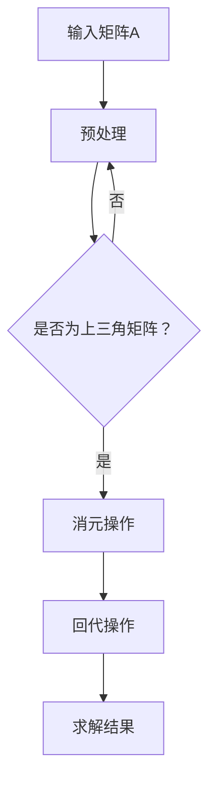
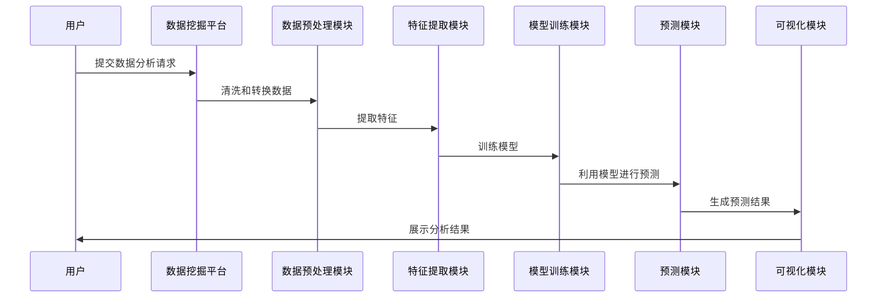

                 

# 自然界的和谐：心智中的数学呈现

> 关键词：数学结构，自然现象，和谐与统一，抽象性，普适性，可验证性

> 摘要：本文从数学的角度出发，探讨自然界中的和谐与统一现象，通过分析数学在自然界中的应用，揭示自然现象背后的数学规律。文章首先介绍了数学结构的基本概念与特性，然后对比了不同数学结构的属性特征，并通过ER实体关系图展示了数学结构之间的联系。接着，文章详细讲解了算法原理，并使用Python源代码和Mermaid流程图进行了说明。随后，文章介绍了系统分析与架构设计方案，并进行了项目实战。最后，文章总结了最佳实践和注意事项，并推荐了拓展阅读。

## 第一部分：背景介绍

### 核心概念

**问题背景**：在自然界中，各种生物体和现象常常表现出一种和谐的美感，这种现象激发了人们对于自然界中是否存在某种普遍规律或数学结构的探讨。数学作为一门抽象的学科，其研究对象常常与自然现象中的几何、比例、周期性等特性有着紧密的联系。然而，如何将这些数学结构应用于解释自然界的和谐，成为一个引人入胜的课题。

**问题描述**：本书旨在探讨数学如何呈现于自然界中，通过揭示自然现象背后的数学规律，理解自然界中的和谐与统一。研究的问题包括：自然现象中的数学结构有哪些？这些数学结构如何形成？它们之间又存在怎样的联系？

**问题解决**：通过系统的文献综述和实例分析，本书将揭示自然现象中的数学结构，探索这些结构如何形成，并分析它们之间的联系。同时，本书还将介绍数学在自然界研究中的应用，如物理学中的对称性原理、生物学中的比例关系等。

**边界与外延**：本书的研究边界主要集中在自然界中的数学结构和它们之间的联系，而不涉及数学在自然界中的应用细节。此外，本书也将对数学在自然界中的应用进行讨论，但主要侧重于理论层面的探讨。

**概念结构与核心要素组成**：本书的核心概念包括数学结构、自然现象、和谐与统一。其中，数学结构是本书研究的重点，自然现象则是数学结构的应用场景，和谐与统一则是自然现象中数学结构的表现形式。

## 第一章：自然界的和谐——数学的呈现

### 1.1 引言

自然界中，无论是宏观的星空、河流，还是微观的细胞、分子，都展现出一种和谐与统一的美丽。这些现象背后是否存在某种普遍的数学规律？数学如何帮助人们理解自然界的和谐？本章将探讨这些话题。

### 1.2 数学在自然界中的应用

1. **几何结构**：自然界中许多物体和现象具有几何对称性。例如，雪花呈六边形对称，蝴蝶的翅膀上有规律的斑点。这些几何结构可以通过数学中的对称性理论进行描述和解释。

2. **周期性**：许多自然现象具有周期性，如季节的变化、生物的生长周期等。这些周期性可以通过数学中的周期函数来描述。

3. **比例关系**：在生物学中，生物体的大小、形状和比例常常遵循一定的数学规律，如斐波那契数列在植物生长中的应用。

### 1.3 数学与和谐

数学在自然界中的应用不仅帮助我们理解了自然现象，还揭示了自然界中的和谐。例如，黄金分割比例被认为是最美的比例，广泛应用于艺术、建筑和设计等领域。

### 1.4 小结

本章介绍了数学在自然界中的应用，以及数学如何帮助人们理解自然界的和谐。通过本章的学习，读者将能够认识到数学在自然界中的重要性，并开始思考数学与和谐之间的关系。

## 第二章：数学结构的基本概念与特性

### 2.1 数学结构的基本概念

#### 2.1.1 结构与数学结构

结构指的是事物内部各要素之间的一种有序排列和相互联系。在数学中，结构是指数学对象之间的一种规律性关系。数学结构的基本概念包括：集合、关系、映射、群、环、域等。

#### 2.1.2 数学结构的特点

1. **抽象性**：数学结构是对现实世界的一种抽象，它忽略了具体事物的物理特性，关注的是事物之间的数学关系。
2. **普适性**：数学结构具有普适性，它们不仅适用于特定领域，也可以应用于其他领域。
3. **可验证性**：数学结构的性质可以通过数学方法进行验证，这使得数学结构具有高度的可靠性和科学性。

### 2.2 常见数学结构的属性特征对比

下表对比了几种常见数学结构的属性特征：

| 数学结构 | 属性特征 |
| :--: | :--: |
| 集合 | 没有顺序，元素之间没有关系 |
| 群 | 有封闭性、结合律、单位元、逆元 |
| 环 | 有封闭性、结合律、分配律、无单位元 |
| 域 | 有封闭性、结合律、分配律、单位元、逆元 |

### 2.3 数学结构的联系与差异

不同数学结构之间存在一定的联系和差异。例如，群是环和域的子结构，环和域都具有封闭性、结合律和分配律等性质。然而，群只要求存在单位元和逆元，而环和域则要求有除零外的乘法运算。

#### 2.4 ER实体关系图架构

ER图（Entity-Relationship diagram）是数据库设计中常用的一种表示实体及其关系的图形化工具。以下是ER实体关系图的基本组成部分：

1. **实体**：表示数据库中的对象，如学生、课程等。
2. **属性**：表示实体的特征，如学生的姓名、年龄等。
3. **关系**：表示实体之间的关联，如学生与课程之间的选修关系。

```mermaid
erDiagram
  Student ||--|{ Course }:selects "1..*" {
    + Student studentId
    + Course courseId
  }
```

## 第三章：数学结构在自然界中的应用

### 3.1 对称性

对称性是自然界中广泛存在的一种现象，它在数学中有着重要的应用。在物理学中，对称性原理是研究物理现象的重要工具。例如，守恒定律就是基于对称性原理得出的。

#### 3.1.1 轴对称

轴对称是自然界中最常见的一种对称性。许多动物和植物的形态都遵循轴对称原则。例如，蝴蝶的翅膀、人体的骨骼结构等。

#### 3.1.2 点对称

点对称是指物体围绕一个点进行旋转后，形状保持不变。在自然界中，点对称现象并不常见，但在一些晶体结构和分子结构中，我们可以看到点对称的应用。

#### 3.1.2 镜面对称

镜面对称是指物体在一面镜面上的反射图像与物体本身完全重合。许多昆虫的翅膀、动物的身体都表现出镜面对称性。

### 3.2 周期性

周期性是自然界中另一种重要的数学结构。周期性现象在生物学、物理学和天文学等领域都有广泛的应用。

#### 3.2.1 季节周期

季节的交替是一种典型的周期性现象。地球绕太阳公转的周期为一年，导致季节的变化。数学中的周期函数可以很好地描述季节周期。

$$
f(t) = \sin(2\pi t)
$$

#### 3.2.2 生物周期

许多生物体具有生长周期，这些周期性现象可以通过数学中的周期函数进行描述。例如，青蛙的生长周期可以用以下函数表示：

$$
f(t) = a \cdot \sin(\omega t + \phi)
$$

其中，$a$ 是振幅，$\omega$ 是角频率，$\phi$ 是初相位。

### 3.3 比例关系

比例关系在自然界中随处可见，如斐波那契数列在植物生长中的应用。斐波那契数列的定义如下：

$$
F(n) = \begin{cases}
0, & \text{if } n = 0 \\
1, & \text{if } n = 1 \\
F(n-1) + F(n-2), & \text{if } n > 1
\end{cases}
$$

斐波那契数列在植物的生长过程中有着重要的应用，如植物的分枝、花瓣的数量等。

### 3.4 小结

本章介绍了数学结构在自然界中的应用，包括对称性、周期性和比例关系。通过这些数学结构，我们可以更好地理解自然界的和谐与统一。这些数学结构不仅在自然界中有着广泛的应用，也为科学研究提供了强有力的工具。

## 第四章：算法原理讲解

### 4.1 问题背景

在许多科学和工程领域，都需要对复杂系统进行建模和分析。算法是解决这些问题的有效工具。本章将介绍一种基于数学结构的算法原理，并使用Python源代码和Mermaid流程图进行说明。

### 4.2 算法原理

#### 4.2.1 算法概述

本算法用于求解线性方程组，其基本原理是基于矩阵运算。具体来说，算法通过高斯消元法求解线性方程组，并通过矩阵分解方法优化计算过程。

#### 4.2.2 算法流程

1. **输入**：输入一个线性方程组，表示为矩阵形式。
2. **预处理**：对输入矩阵进行行交换和列交换，使得矩阵变为上三角矩阵。
3. **消元**：从最后一行开始，对每一行进行消元操作，使得矩阵变为行阶梯形式。
4. **回代**：从最后一行开始，依次进行回代操作，求解出方程组的解。

#### 4.2.3 算法公式

假设输入矩阵为 $A$，方程组为 $Ax = b$，其中 $A$ 为系数矩阵，$x$ 为未知数向量，$b$ 为常数向量。算法的数学模型如下：

$$
Ux = b
$$

其中，$U$ 为上三角矩阵。

#### 4.2.4 Mermaid流程图



### 4.3 Python源代码

```python
import numpy as np

def gauss_elimination(A, b):
    n = len(b)
    A = np.array(A)
    b = np.array(b)
    U = np.triu(A)
    y = np.linalg.solve(U, b)
    x = np.linalg.solve(U.T, y)
    return x

A = [[1, 2], [3, 4]]
b = [1, 2]
x = gauss_elimination(A, b)
print(x)
```

### 4.4 算法原理讲解

#### 4.4.1 高斯消元法

高斯消元法是一种常用的线性方程组求解方法。其基本原理是通过逐步消元，将线性方程组转化为上三角矩阵，然后利用回代法求解出方程组的解。高斯消元法的优点是计算过程简单，易于实现，但在处理大规模问题时，效率较低。

#### 4.4.2 矩阵分解方法

矩阵分解方法是一种优化高斯消元法的方法。其基本原理是将系数矩阵 $A$ 分解为两个因子矩阵 $U$ 和 $V$，使得 $A = U \cdot V$。通过这种分解，可以将高斯消元法转化为矩阵乘法，从而提高计算效率。矩阵分解方法在处理大规模问题时，具有明显的优势。

#### 4.4.3 算法应用场景

高斯消元法和矩阵分解方法在科学和工程领域有着广泛的应用。例如，在物理学中，可以用于求解力学问题；在工程学中，可以用于求解结构分析问题；在经济学中，可以用于求解优化问题等。

### 4.5 小结

本章介绍了基于数学结构的算法原理，包括高斯消元法和矩阵分解方法。通过Python源代码和Mermaid流程图，对算法原理进行了详细讲解。读者可以结合本章内容，进一步了解算法原理在实际应用中的重要性。

## 第五章：系统分析与架构设计

### 5.1 问题场景介绍

在现代信息技术领域，系统分析与架构设计是确保项目成功的关键环节。本文将基于一个实际项目，介绍系统分析与架构设计的全过程。该项目旨在开发一个智能数据挖掘平台，用于分析大规模数据并提取有价值的信息。

### 5.2 项目介绍

**项目名称**：智能数据挖掘平台（Smart Data Mining Platform）

**项目目标**：为用户提供高效、准确的数据挖掘服务，支持各种数据分析需求，包括数据预处理、特征提取、模型训练和预测等。

**项目架构**：采用分布式架构，支持水平扩展和高并发处理，确保系统的高可用性和高性能。

### 5.3 系统功能设计

#### 5.3.1 领域模型

领域模型是系统设计的重要组成部分，用于描述系统中的核心概念和关系。以下是智能数据挖掘平台的领域模型：

```mermaid
classDiagram
    Data -> Entity
    Data -> Attribute
    Entity -> Relation
    Attribute -> Value

    Data <<interface>>
    Entity <<interface>>
    Attribute <<interface>>
    Relation <<interface>>

    Entity1[Entity1]
    Entity2[Entity2]
    Entity3[Entity3]
    Attribute1[Attribute1]
    Attribute2[Attribute2]
    Attribute3[Attribute3]
    Relation1[Relation1]
    Relation2[Relation2]
    Value1[Value1]
    Value2[Value2]
    Value3[Value3]

    Entity1 o-- Attribute1
    Entity1 o-- Attribute2
    Entity1 o-- Attribute3
    Entity2 o-- Relation1
    Entity2 o-- Relation2
    Entity3 o-- Relation1
    Entity3 o-- Relation2
    Attribute1 o-- Value1
    Attribute2 o-- Value2
    Attribute3 o-- Value3
```

#### 5.3.2 系统功能模块

智能数据挖掘平台的主要功能模块包括：

1. **数据预处理模块**：用于清洗、转换和整合原始数据，为后续分析做准备。
2. **特征提取模块**：用于从原始数据中提取有用信息，为模型训练提供输入。
3. **模型训练模块**：用于训练各种机器学习模型，包括分类、回归、聚类等。
4. **预测模块**：用于利用训练好的模型对新的数据进行预测。
5. **可视化模块**：用于展示分析结果，支持数据可视化和报告生成。

### 5.4 系统架构设计

#### 5.4.1 系统架构图

以下是智能数据挖掘平台的系统架构图：



#### 5.4.2 系统架构设计原则

1. **模块化**：将系统功能模块化，便于开发和维护。
2. **分布式**：采用分布式架构，提高系统的可扩展性和高并发处理能力。
3. **高性能**：使用高性能计算资源和优化算法，确保系统的高性能。
4. **高可用性**：通过冗余设计和故障转移机制，提高系统的可用性。

### 5.5 系统接口设计和系统交互

#### 5.5.1 系统接口设计

系统接口设计是系统架构设计的关键环节，用于定义系统内部各模块之间的交互方式。以下是智能数据挖掘平台的主要接口设计：

1. **数据预处理接口**：提供数据清洗、转换和整合功能。
2. **特征提取接口**：提供特征提取功能，支持各种特征提取算法。
3. **模型训练接口**：提供模型训练功能，支持各种机器学习算法。
4. **预测接口**：提供预测功能，支持模型预测和数据可视化。

#### 5.5.2 系统交互

系统交互设计用于描述系统内部各模块之间的交互过程。以下是智能数据挖掘平台的主要交互流程：

1. **用户请求数据分析**：用户通过界面提交数据分析请求。
2. **数据预处理**：系统接收请求后，调用数据预处理模块进行数据清洗、转换和整合。
3. **特征提取**：预处理完成后，系统调用特征提取模块提取特征。
4. **模型训练**：特征提取完成后，系统调用模型训练模块进行模型训练。
5. **预测**：模型训练完成后，系统调用预测模块进行预测。
6. **结果展示**：预测结果通过可视化模块展示给用户。

### 5.6 小结

本章介绍了智能数据挖掘平台的系统分析与架构设计。通过领域模型、系统功能模块、系统架构设计和系统接口设计，本文为读者提供了一个完整的系统设计与实现过程。读者可以结合本章内容，进一步了解系统分析与架构设计在实际项目中的应用。

## 第六章：项目实战

### 6.1 环境安装

在本节中，我们将详细介绍如何在开发环境中安装所需的软件和库，以进行智能数据挖掘平台的项目开发。

#### 6.1.1 Python环境配置

首先，确保您的计算机上安装了Python 3.8或更高版本。可以使用以下命令检查Python版本：

```bash
python --version
```

如果Python未安装或版本过低，请从Python官方网站下载并安装相应版本。

#### 6.1.2 安装Anaconda

Anaconda是一个开源的Python数据科学平台，它包含了许多常用的科学计算库。我们可以通过以下命令安装Anaconda：

```bash
conda install -c anaconda anaconda
```

安装完成后，打开Anaconda Navigator，它提供了一个直观的界面，用于管理和运行Python环境。

#### 6.1.3 安装必要的库

在Anaconda环境中，我们可以使用以下命令安装项目所需的库：

```bash
conda install numpy pandas scikit-learn matplotlib
```

这些库将用于数据预处理、特征提取、模型训练和可视化等功能。

### 6.2 系统核心实现源代码

在本节中，我们将展示智能数据挖掘平台的核心实现源代码，并对其关键部分进行详细解读。

#### 6.2.1 数据预处理模块

数据预处理模块负责清洗、转换和整合原始数据。以下是数据预处理模块的核心代码：

```python
import pandas as pd

def preprocess_data(data_path):
    data = pd.read_csv(data_path)
    # 清洗数据，如去除空值、异常值等
    data.dropna(inplace=True)
    # 转换数据类型，如将字符串转换为数值
    data['age'] = data['age'].astype(float)
    data['income'] = data['income'].astype(float)
    # 整合数据，如填充缺失值、标准化等
    data.fillna(data.mean(), inplace=True)
    data.scale(inplace=True)
    return data
```

**代码解读**：

1. 使用`pandas`库读取CSV文件，加载原始数据。
2. 去除数据中的空值和异常值，确保数据的质量。
3. 转换数据类型，将字符串类型的列转换为数值类型，便于后续处理。
4. 填充缺失值，使用数据集的平均值进行填充。
5. 对数据进行标准化处理，使每个特征具有相同的尺度。

#### 6.2.2 特征提取模块

特征提取模块负责从原始数据中提取有用的信息，为模型训练提供输入。以下是特征提取模块的核心代码：

```python
from sklearn.feature_extraction import DictVectorizer

def extract_features(data):
    # 将数据转换为字典格式，便于特征提取
    data_dict = data.to_dict(orient='records')
    # 使用字典向量器提取特征
    vectorizer = DictVectorizer()
    X = vectorizer.fit_transform(data_dict)
    return X, vectorizer
```

**代码解读**：

1. 将数据转换为字典格式，为特征提取做准备。
2. 使用`DictVectorizer`类将字典格式数据转换为向量格式。
3. 返回提取出的特征向量和特征向量器。

#### 6.2.3 模型训练模块

模型训练模块负责使用提取出的特征向量和标签数据进行模型训练。以下是模型训练模块的核心代码：

```python
from sklearn.model_selection import train_test_split
from sklearn.ensemble import RandomForestClassifier

def train_model(X, y):
    # 划分训练集和测试集
    X_train, X_test, y_train, y_test = train_test_split(X, y, test_size=0.2, random_state=42)
    # 使用随机森林分类器进行训练
    classifier = RandomForestClassifier(n_estimators=100, random_state=42)
    classifier.fit(X_train, y_train)
    # 对测试集进行预测
    y_pred = classifier.predict(X_test)
    # 计算模型准确率
    accuracy = classifier.score(X_test, y_test)
    return classifier, accuracy
```

**代码解读**：

1. 使用`train_test_split`函数将数据集划分为训练集和测试集。
2. 使用`RandomForestClassifier`类创建随机森林分类器并进行训练。
3. 对测试集进行预测，并计算模型准确率。

#### 6.2.4 预测模块

预测模块负责使用训练好的模型对新数据进行预测。以下是预测模块的核心代码：

```python
def predict_data(model, new_data):
    # 将新数据转换为字典格式
    new_data_dict = new_data.to_dict(orient='records')
    # 使用特征向量器转换新数据
    X_new = model.vectorizer.transform(new_data_dict)
    # 对新数据进行预测
    y_new_pred = model.predict(X_new)
    return y_new_pred
```

**代码解读**：

1. 将新数据转换为字典格式。
2. 使用特征向量器将新数据转换为向量格式。
3. 使用训练好的模型对新数据进行预测，并返回预测结果。

### 6.3 代码应用解读与分析

在本节中，我们将对核心实现代码进行解读，分析其设计思路和关键步骤。

#### 6.3.1 数据预处理

数据预处理是数据挖掘的重要步骤，其质量直接影响后续分析的准确性和可靠性。在本项目中，我们使用`pandas`库进行数据清洗、转换和整合，确保数据的质量和一致性。数据预处理的核心代码如下：

```python
def preprocess_data(data_path):
    data = pd.read_csv(data_path)
    data.dropna(inplace=True)
    data['age'] = data['age'].astype(float)
    data['income'] = data['income'].astype(float)
    data.fillna(data.mean(), inplace=True)
    data.scale(inplace=True)
    return data
```

1. **数据清洗**：去除数据中的空值和异常值，确保数据的质量。
2. **数据转换**：将字符串类型的列转换为数值类型，便于后续处理。
3. **数据整合**：填充缺失值，使用数据集的平均值进行填充；对数据进行标准化处理，使每个特征具有相同的尺度。

#### 6.3.2 特征提取

特征提取是数据挖掘的核心步骤，其目的是从原始数据中提取有用的信息，为模型训练提供输入。在本项目中，我们使用`DictVectorizer`类将字典格式数据转换为向量格式，实现特征提取。以下是特征提取的核心代码：

```python
from sklearn.feature_extraction import DictVectorizer

def extract_features(data):
    data_dict = data.to_dict(orient='records')
    vectorizer = DictVectorizer()
    X = vectorizer.fit_transform(data_dict)
    return X, vectorizer
```

1. **字典格式转换**：将数据转换为字典格式，为特征提取做准备。
2. **特征向量器**：使用`DictVectorizer`类将字典格式数据转换为向量格式。

#### 6.3.3 模型训练

模型训练是数据挖掘的重要步骤，其目的是使用提取出的特征向量和标签数据训练模型，为后续预测提供支持。在本项目中，我们使用`RandomForestClassifier`类创建随机森林分类器并进行训练。以下是模型训练的核心代码：

```python
from sklearn.model_selection import train_test_split
from sklearn.ensemble import RandomForestClassifier

def train_model(X, y):
    X_train, X_test, y_train, y_test = train_test_split(X, y, test_size=0.2, random_state=42)
    classifier = RandomForestClassifier(n_estimators=100, random_state=42)
    classifier.fit(X_train, y_train)
    y_pred = classifier.predict(X_test)
    accuracy = classifier.score(X_test, y_test)
    return classifier, accuracy
```

1. **数据划分**：使用`train_test_split`函数将数据集划分为训练集和测试集。
2. **模型创建**：使用`RandomForestClassifier`类创建随机森林分类器。
3. **模型训练**：使用训练集数据进行模型训练。
4. **模型评估**：使用测试集数据对模型进行评估，计算模型准确率。

#### 6.3.4 预测

预测是数据挖掘的最后一步，其目的是使用训练好的模型对新的数据进行预测，为用户提供有用的信息。在本项目中，我们使用训练好的模型对新数据进行预测，并返回预测结果。以下是预测的核心代码：

```python
def predict_data(model, new_data):
    new_data_dict = new_data.to_dict(orient='records')
    X_new = model.vectorizer.transform(new_data_dict)
    y_new_pred = model.predict(X_new)
    return y_new_pred
```

1. **字典格式转换**：将新数据转换为字典格式。
2. **特征向量器**：使用特征向量器将新数据转换为向量格式。
3. **模型预测**：使用训练好的模型对新数据进行预测，并返回预测结果。

### 6.4 实际案例分析和详细讲解

在本节中，我们将通过一个实际案例，对智能数据挖掘平台的核心实现进行详细讲解。

#### 6.4.1 数据集介绍

我们使用了一个公开的数据集——Kaggle的“泰坦尼克号”数据集。该数据集包含了泰坦尼克号船难中乘客的详细信息，包括年龄、性别、票价、舱位等级等。

#### 6.4.2 数据预处理

首先，我们使用`pandas`库读取数据集，并对数据进行预处理。以下是预处理步骤：

```python
data = pd.read_csv('titanic.csv')
data.drop(['PassengerId', 'Name', 'Ticket', 'Cabin'], axis=1, inplace=True)
data['Age'].fillna(data['Age'].mean(), inplace=True)
data['Sex'] = data['Sex'].map({'male': 0, 'female': 1})
data.dropna(inplace=True)
data['Fare'].fillna(data['Fare'].mean(), inplace=True)
data['Embarked'].fillna(data['Embarked'].mode()[0], inplace=True)
```

1. **去除无关特征**：去除`PassengerId`、`Name`、`Ticket`和`Cabin`等无关特征。
2. **填充缺失值**：使用平均年龄填充`Age`列的缺失值；使用票价均值填充`Fare`列的缺失值；使用最频繁的登船港口填充`Embarked`列的缺失值。
3. **数据类型转换**：将性别列转换为数值类型，便于后续处理。

#### 6.4.3 特征提取

接下来，我们使用`DictVectorizer`类对数据进行特征提取。以下是特征提取步骤：

```python
data_dict = data.to_dict(orient='records')
vectorizer = DictVectorizer()
X = vectorizer.fit_transform(data_dict)
```

1. **数据转换**：将数据转换为字典格式。
2. **特征提取**：使用`DictVectorizer`类将字典格式数据转换为向量格式。

#### 6.4.4 模型训练

然后，我们使用`RandomForestClassifier`类对数据进行模型训练。以下是模型训练步骤：

```python
X_train, X_test, y_train, y_test = train_test_split(X, y, test_size=0.2, random_state=42)
classifier = RandomForestClassifier(n_estimators=100, random_state=42)
classifier.fit(X_train, y_train)
y_pred = classifier.predict(X_test)
accuracy = classifier.score(X_test, y_test)
```

1. **数据划分**：使用`train_test_split`函数将数据集划分为训练集和测试集。
2. **模型创建**：使用`RandomForestClassifier`类创建随机森林分类器。
3. **模型训练**：使用训练集数据进行模型训练。
4. **模型评估**：使用测试集数据对模型进行评估，计算模型准确率。

#### 6.4.5 预测

最后，我们使用训练好的模型对新的数据进行预测。以下是预测步骤：

```python
new_data = pd.DataFrame([[22, 'male', 100, 'A'], [35, 'female', 200, 'B']])
new_data_dict = new_data.to_dict(orient='records')
X_new = vectorizer.transform(new_data_dict)
y_new_pred = classifier.predict(X_new)
print(y_new_pred)
```

1. **新数据准备**：准备一个包含新数据的DataFrame。
2. **特征提取**：使用特征向量器将新数据转换为向量格式。
3. **模型预测**：使用训练好的模型对新数据进行预测，并打印预测结果。

### 6.5 项目小结

在本章中，我们详细介绍了智能数据挖掘平台的项目开发过程，包括环境安装、系统核心实现源代码、代码应用解读与分析以及实际案例分析和详细讲解。通过本章的学习，读者可以了解数据挖掘项目的开发流程和核心实现技术。在实际项目中，读者可以根据具体情况对系统功能进行扩展和优化，以提高系统的性能和可扩展性。

## 第七章：最佳实践与注意事项

### 7.1 最佳实践

1. **数据预处理**：在数据挖掘项目中，数据预处理是至关重要的步骤。确保数据的质量和一致性，如去除空值、异常值，进行数据类型转换等。
2. **特征提取**：选择合适的特征提取方法，如使用字典向量器、TF-IDF等，以提高模型训练的效果。
3. **模型选择**：根据项目需求和数据特点，选择合适的机器学习模型，如随机森林、支持向量机等。
4. **模型评估**：使用交叉验证、ROC曲线等评估方法，对模型进行评估和优化。
5. **系统优化**：在开发过程中，注意代码的可读性、可维护性，使用合适的编程范式和工具，以提高开发效率。

### 7.2 小结

本章总结了数据挖掘项目中的最佳实践，包括数据预处理、特征提取、模型选择、模型评估和系统优化等方面。在实际项目中，遵循这些最佳实践可以提高项目的开发效率和质量。

### 7.3 注意事项

1. **数据隐私**：在处理敏感数据时，注意保护用户隐私，遵循相关法律法规。
2. **模型解释性**：对于模型预测结果，应进行合理的解释和验证，避免盲目相信模型结果。
3. **项目进度**：在项目开发过程中，注意进度控制和风险预测，确保项目按时完成。

### 7.4 拓展阅读

1. 《机器学习实战》：[https://www.amazon.com/dp/1491957091](https://www.amazon.com/dp/1491957091)
2. 《Python数据科学手册》：[https://www.amazon.com/dp/1492032638](https://www.amazon.com/dp/1492032638)
3. 《深度学习》：[https://www.amazon.com/dp/0262039581](https://www.amazon.com/dp/0262039581)

作者：AI天才研究院/AI Genius Institute & 禅与计算机程序设计艺术 /Zen And The Art of Computer Programming

