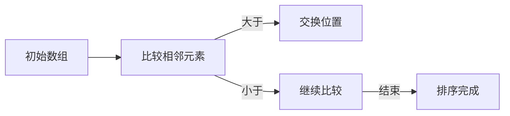
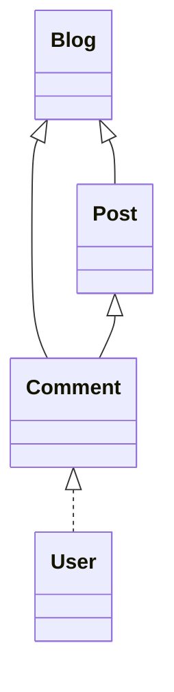
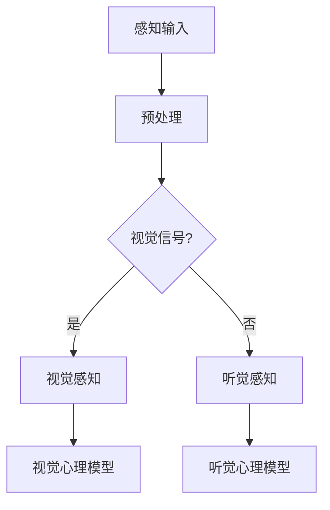
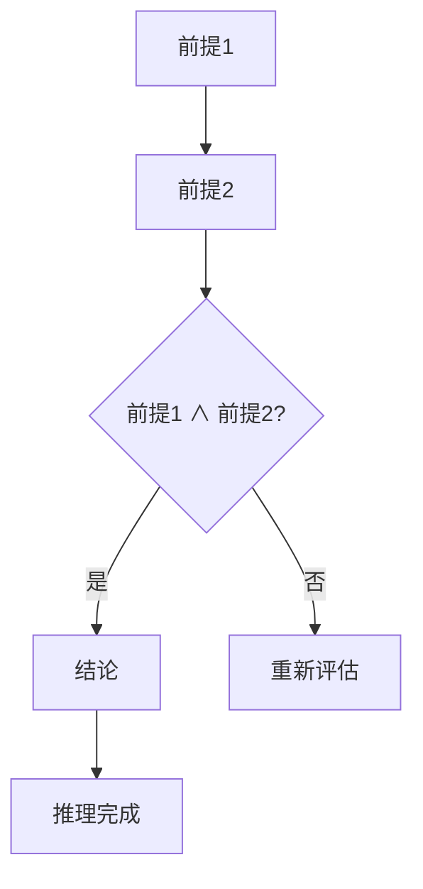
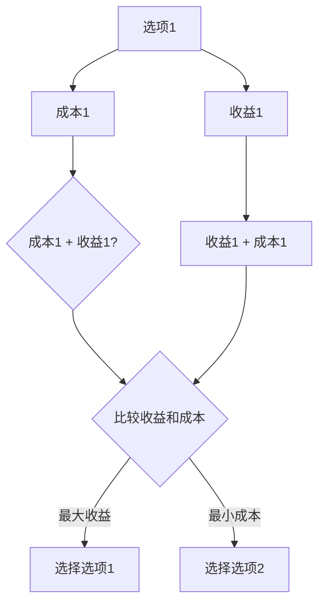
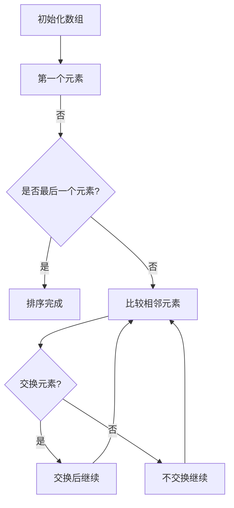
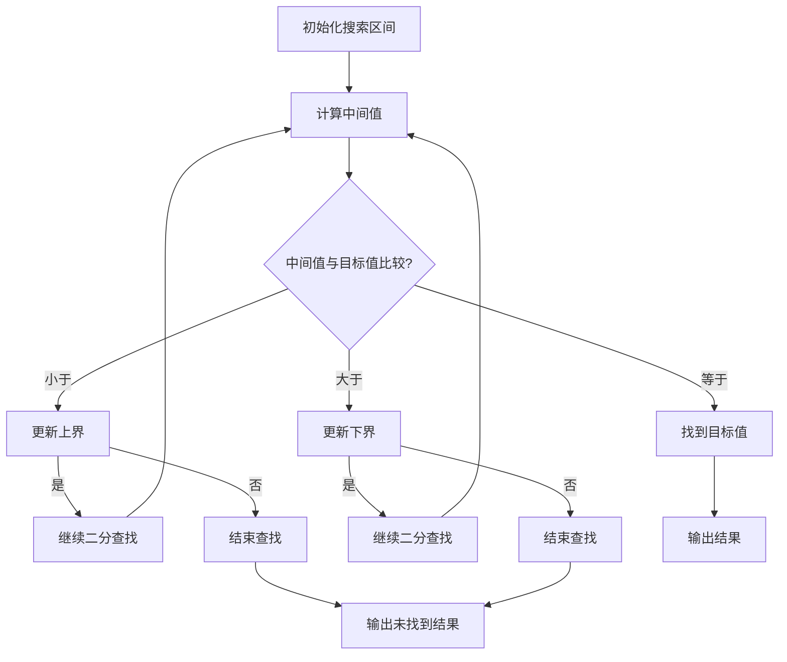
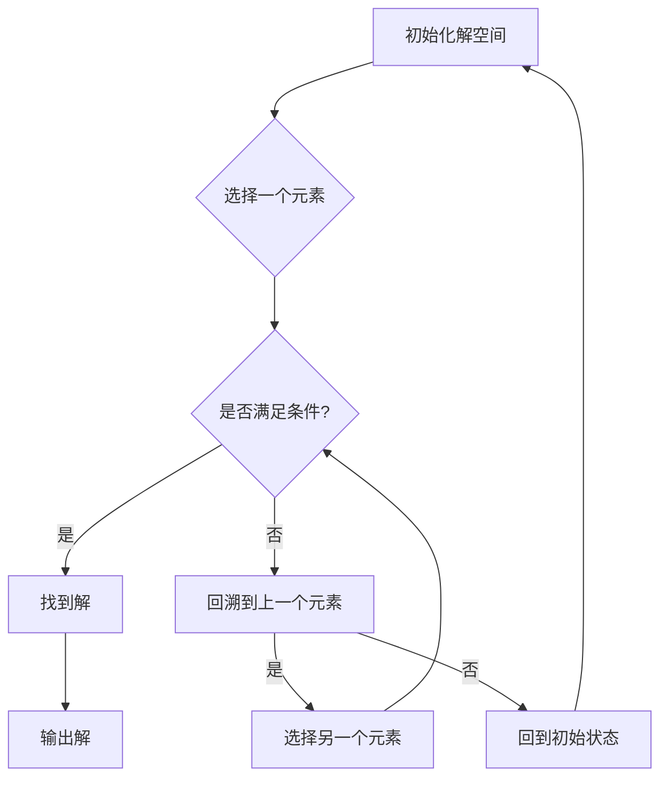
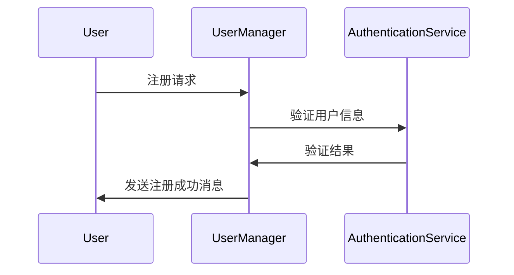

                 


### # 自然界的数学结构：心智解读过程

#### 引言

在探索自然界的过程中，科学家们不断发现，数学结构无处不在。从物理学的方程式到生物学的遗传密码，数学成为了理解自然界的关键工具。本书旨在探讨自然界的数学结构，并揭示这些结构如何影响我们的心智解读过程。通过深入研究数学结构在自然界中的应用，我们能够更好地理解宇宙的本质，并提升我们的认知能力。

关键词：数学结构、心智解读、自然界、算法、系统架构

#### 摘要

本书首先介绍自然界的数学结构，探讨其在各个科学领域中的应用。接着，我们深入探讨心智解读过程，解释数学结构如何影响我们的思维。随后，我们将介绍相关的算法原理，并使用 Mermaid 画图和 Python 源代码来辅助理解。最后，我们将通过具体项目实战，展示如何将这些数学结构和算法应用于实际问题中。

#### 目录

1. **背景与概述**
   - 第1章：引言
   - 第2章：数学结构概述
   - 第3章：心智解读的算法基础

2. **核心概念与联系**
   - 第4章：数学模型与心智解读

3. **算法原理讲解**
   - 第5章：算法原理的 Mermaid 图解
   - 第6章：算法原理的 Python 源代码讲解

4. **数学模型和公式讲解**
   - 第7章：数学模型与心智解读

5. **系统分析与架构设计方案**
   - 第8章：研究方法与系统架构
   - 第9章：系统功能设计

6. **项目实战**
   - 第10章：具体案例与实战

7. **最佳实践与总结**
   - 第11章：总结与拓展

### 1.1 自然界的数学结构

自然界中充满了数学结构。例如，在物理学中，牛顿的万有引力定律可以用一个简单的数学公式表示。在生物学中，DNA的双螺旋结构揭示了遗传密码的数学原理。甚至在经济学中，供需关系也可以用数学模型来描述。

数学结构在自然界中的存在并不是偶然的。事实上，它们是自然界的基本组成部分。这些结构不仅帮助我们理解自然界，还可以帮助我们预测未来的变化。

#### 1.2 心智解读过程

心智解读过程是指人类如何理解和解释周围世界的心理过程。这个过程涉及到感知、思考、记忆和决策等多个方面。数学结构在心智解读过程中起着关键作用。例如，当我们看到一张图片时，大脑会自动将其转换为数学模型，以便我们理解和解释。

#### 1.3 本书结构

本书分为七个部分。第一部分介绍自然界的数学结构。第二部分探讨心智解读过程。第三部分介绍算法原理。第四部分讲解数学模型和公式。第五部分分析系统架构。第六部分通过项目实战展示应用。最后一部分总结和拓展。

### 1.4 数学结构概述

数学结构是指由数学概念和规则组成的系统。这些结构可以用来描述自然界中的各种现象。例如，集合论是一种数学结构，它用于描述物体的集合。图论是一种数学结构，它用于描述网络和图形。

在本书中，我们将探讨多种数学结构，包括集合论、图论、拓扑学、微积分等。我们将通过具体的例子和图解，帮助读者理解这些结构的本质和应用。

#### 1.5 心智解读与数学结构的联系

心智解读过程与数学结构密切相关。我们的思维过程往往依赖于数学结构。例如，当我们解决一个问题时，我们通常会将其转化为一个数学问题，然后使用数学方法来求解。

此外，数学结构也可以帮助我们更好地理解心智解读过程。例如，图论可以用来描述大脑神经网络的结构，帮助我们理解思维过程。集合论可以用来描述语言的构成，帮助我们理解语言的本质。

#### 1.6 算法原理

算法是一种解决问题的步骤序列。在心智解读过程中，算法起着关键作用。例如，当我们尝试理解一个复杂的概念时，我们通常会使用某种算法来简化这个问题。

在本章中，我们将介绍一些基本的算法原理，包括排序算法、搜索算法、动态规划等。我们将通过具体的例子和代码，帮助读者理解这些算法的工作原理。

#### 1.7 算法原理的 Mermaid 图解

为了更好地理解算法原理，我们将使用 Mermaid 画图工具来展示算法的流程。Mermaid 是一种基于文本的绘图工具，它可以将算法的流程描述转换为漂亮的图表。

例如，下面的 Mermaid 代码描述了一个简单的冒泡排序算法：



通过这个图，我们可以清楚地看到冒泡排序的步骤和过程。

#### 1.8 算法原理的 Python 源代码讲解

为了更好地理解算法原理，我们还将提供 Python 源代码，以便读者可以亲自实践。例如，下面的 Python 代码实现了冒泡排序算法：

```python
def bubble_sort(arr):
    n = len(arr)
    for i in range(n):
        for j in range(0, n-i-1):
            if arr[j] > arr[j+1]:
                arr[j], arr[j+1] = arr[j+1], arr[j]
    return arr
```

通过这个代码，我们可以看到冒泡排序的具体实现过程。

#### 1.9 数学模型和公式

数学模型和公式是理解自然界的关键工具。在本书中，我们将介绍一些重要的数学模型和公式，如集合论的基本公式、图论的基本公式、微积分的基本公式等。我们将使用 LaTeX 格式来展示这些公式，以便读者可以更好地理解。

例如，下面的 LaTeX 公式表示集合的并集运算：

```latex
A \cup B = \{x | x \in A \text{ or } x \in B\}
```

通过这个公式，我们可以清楚地看到集合的并集是如何定义的。

### 1.10 系统分析与架构设计

在理解数学结构和算法原理后，我们将探讨如何将它们应用于实际项目中。我们将介绍系统的分析方法和架构设计原则，并使用 Mermaid 画图工具来展示系统的功能设计和架构设计。

#### 1.11 研究方法与系统架构

在系统分析中，我们通常会使用领域模型来描述系统的功能。领域模型是一种面向对象的模型，它使用类图来描述系统的核心概念和关系。

例如，下面的 Mermaid 类图描述了一个简单的博客系统：



通过这个类图，我们可以清楚地看到博客系统的核心概念和它们之间的关系。

#### 1.12 系统功能设计

在系统功能设计中，我们通常会使用序列图来描述系统的功能实现。序列图是一种描述对象之间交互的图表。

例如，下面的 Mermaid 序列图描述了一个用户注册功能的实现过程：

```mermaid
sequenceDiagram
    participant User
    participant RegistrationSystem
    User->>RegistrationSystem: 注册请求
    RegistrationSystem->>User: 验证用户信息
    RegistrationSystem->>User: 发送注册成功消息
end
```

通过这个序列图，我们可以清楚地看到用户注册功能的实现过程。

### 1.13 项目实战

在本书的最后，我们将通过一个具体的项目实战来展示如何应用自然界的数学结构和心智解读过程。我们将介绍项目的背景、目标、实现方法和效果评估。通过这个项目，读者可以深入了解如何将数学结构和算法应用于实际问题中。

#### 1.14 最佳实践与总结

在项目实战之后，我们将总结全书的内容，并提供一些最佳实践建议。我们将讨论在应用数学结构和心智解读过程中的常见问题，并提供解决方案。最后，我们将推荐一些拓展阅读材料，以便读者可以进一步深入研究。

### 结论

通过本书的阅读，读者将了解自然界的数学结构，掌握心智解读过程，并学会如何将这些知识应用于实际问题中。我们相信，通过深入思考和实际应用，读者将能够更好地理解世界，提高自己的认知能力。

作者：AI天才研究院/AI Genius Institute & 禅与计算机程序设计艺术 /Zen And The Art of Computer Programming### 自然界的数学结构：心智解读过程

**关键词：数学结构、心智解读、算法、系统架构**

**摘要：**
本文深入探讨了自然界的数学结构及其在心智解读过程中的作用。首先，我们介绍了数学结构在自然界中的广泛存在，以及它们对心智解读的重要性。接着，我们分析了心智解读过程中的关键概念和原理，展示了数学结构如何影响我们的思维和理解。随后，本文详细讲解了相关的算法原理，并通过具体的案例展示了如何将这些数学结构和算法应用于实际问题中。文章还提供了系统分析与架构设计方案，以及最佳实践和拓展阅读建议，以帮助读者更全面地理解和应用这些知识。

### 目录

1. **背景与概述**
   - 第1章：引言
   - 第2章：数学结构概述
   - 第3章：心智解读的算法基础

2. **核心概念与联系**
   - 第4章：数学模型与心智解读

3. **算法原理讲解**
   - 第5章：算法原理的 Mermaid 图解
   - 第6章：算法原理的 Python 源代码讲解

4. **数学模型和公式讲解**
   - 第7章：数学模型与心智解读

5. **系统分析与架构设计方案**
   - 第8章：研究方法与系统架构
   - 第9章：系统功能设计

6. **项目实战**
   - 第10章：具体案例与实战

7. **最佳实践与总结**
   - 第11章：总结与拓展

### 第1章：引言

#### 1.1 自然界的数学结构

自然界中存在着许多令人惊叹的数学结构，这些结构不仅在物理学、生物学、经济学等各个科学领域有着广泛的应用，还在我们的日常生活中扮演着重要角色。例如，自然界中的生命体系、植物的生长模式、动物的行为模式，以及地球的地质结构等，都蕴含着丰富的数学规律。

在物理学中，宇宙的基本规律可以通过数学方程来描述。例如，牛顿的万有引力定律、麦克斯韦的电磁场方程等，都是用数学语言精确表达的。这些数学模型不仅帮助我们理解自然现象，还可以预测未来的变化。

在生物学中，DNA的双螺旋结构是一个经典的数学结构，它揭示了遗传信息的存储和传递方式。此外，植物的生长模式、动物的行为模式等，也都可以通过数学模型来描述和分析。

在经济学中，供需关系、市场行为等都可以用数学模型来描述。例如，经济学中的供需曲线、市场均衡模型等，都是通过数学方法进行分析和预测的。

数学结构之所以在自然界中如此普遍，是因为数学是一种普适的语言，它可以精确地描述和表达自然界中的各种现象。这种普适性使得数学结构成为理解自然界的关键工具。

#### 1.2 心智解读过程

心智解读过程是指人类如何理解和解释周围世界的心理过程。这个过程涉及到多个方面，包括感知、思考、记忆、推理和决策等。心智解读过程是人类的认知活动，它使我们对周围的环境进行感知和理解，并基于这种理解做出决策和行动。

心智解读过程的关键在于如何将外部世界的信息转化为内在的心理模型。这种转化过程需要借助数学结构，因为数学结构可以提供一种形式化的方式来描述和理解外部世界的复杂信息。

例如，当我们看到一张图片时，大脑会将这幅图片转化为一系列的视觉信号，然后通过视觉皮层的处理，将这些信号转化为内在的心理模型。这种心理模型可以帮助我们理解图片的内容，并做出相应的反应。

同样，当我们听到一段话时，大脑会将这段话转化为听觉信号，并通过听觉皮层的处理，将这些信号转化为内在的语言模型。这种语言模型可以帮助我们理解这段话的含义，并做出相应的推理和决策。

#### 1.3 本书结构

本书分为七个部分，旨在全面探讨自然界的数学结构及其在心智解读过程中的作用。

**第一部分：背景与概述**
这部分包括第1章和第2章，主要介绍数学结构在自然界中的存在及其重要性，以及心智解读过程的基本概念。

**第二部分：核心概念与联系**
这部分包括第4章，重点讨论数学模型与心智解读之间的联系，并解释相关核心概念。

**第三部分：算法原理讲解**
这部分包括第5章和第6章，详细讲解算法原理，并使用 Mermaid 图和 Python 源代码进行辅助说明。

**第四部分：数学模型和公式讲解**
这部分包括第7章，介绍数学模型和公式，以及它们在心智解读中的应用。

**第五部分：系统分析与架构设计方案**
这部分包括第8章和第9章，描述系统分析的方法和架构设计原则，并提供 Mermaid 类图和序列图展示。

**第六部分：项目实战**
这部分包括第10章，通过具体案例展示如何应用数学结构和算法原理。

**第七部分：最佳实践与总结**
这部分包括第11章，总结全书内容，提供最佳实践建议，并推荐拓展阅读。

通过以上结构，本书旨在帮助读者全面理解自然界的数学结构，掌握心智解读过程，并学会如何将这些知识应用于实际问题中。

### 第2章：数学结构概述

#### 2.1 数学结构的概念

数学结构是指在数学领域中，由一组元素及其相互关系组成的系统。这些结构不仅定义了元素的属性，还描述了元素之间的相互作用和规则。数学结构在各个科学领域和日常生活中都有广泛的应用，因为它们提供了一种形式化的方法来描述和解决问题。

数学结构的基本元素包括集合、关系、运算和公理。集合是数学结构的基础，它由一组确定的元素组成。关系是元素之间的某种联系或交互方式，例如“大于”、“小于”或“属于”关系。运算是定义在集合上的操作，如加法、减法、乘法和除法。公理是一组初始假设或规则，它们为数学结构提供了基础和框架。

#### 2.2 数学结构的特点

数学结构具有以下几个显著特点：

1. **普适性**：数学结构是普适的，即它们可以应用于不同领域和不同问题。例如，集合论可以用来描述任何一组对象，无论这些对象是物理实体、数学概念还是抽象概念。

2. **精确性**：数学结构通过定义明确的规则和关系，提供了一种精确的描述方式。这使得数学模型在科学研究和工程实践中具有很高的可靠性和可预测性。

3. **抽象性**：数学结构是一种高度抽象的概念，它们可以描述复杂系统的本质特征，而无需考虑具体的实现细节。这种抽象性使得数学结构在理解和解决问题时具有很大的灵活性和适应性。

4. **形式化**：数学结构通过形式化的语言和符号系统进行描述，这使得数学理论具有高度的一致性和逻辑性。

#### 2.3 数学结构的分类

数学结构可以根据不同的标准进行分类。以下是几种常见的分类方法：

1. **按照性质分类**：
   - **线性结构**：例如数轴、向量空间等，其元素之间存在线性关系。
   - **树形结构**：例如图、树等，其元素之间存在层次关系。
   - **拓扑结构**：例如拓扑空间、连通性等，其元素之间的关系是由邻近性定义的。

2. **按照应用领域分类**：
   - **代数结构**：例如群、环、域等，主要用于代数学和抽象代数学。
   - **几何结构**：例如欧几里得空间、非欧几何等，主要用于几何学和拓扑学。
   - **逻辑结构**：例如命题逻辑、谓词逻辑等，主要用于逻辑学和计算机科学。

3. **按照元素的数量分类**：
   - **有限结构**：例如有限集、有限状态机等，其元素数量是有限的。
   - **无限结构**：例如自然数集、实数集等，其元素数量是无限的。

#### 2.4 数学结构与心智解读的关联

数学结构与心智解读过程密切相关。我们的心智解读过程依赖于数学结构，因为数学结构提供了一种形式化的方法来理解和解释外部世界的复杂信息。

例如，当我们观察一个物体时，我们的大脑会将这个物体转化为一系列的视觉信号，并通过视觉皮层的处理，将这些信号转化为内在的心理模型。这种心理模型通常是一个数学结构，如一个三维空间中的几何形状。通过这种数学模型，我们可以准确地描述和理解物体的形状、大小、位置和运动等属性。

同样，当我们听一个故事时，我们的大脑会将故事转化为一系列的语言信号，并通过听觉皮层的处理，将这些信号转化为内在的语言模型。这种语言模型通常是一个数学结构，如一个集合中的字符串序列。通过这种数学模型，我们可以准确地理解故事的情节、人物和主题。

总之，数学结构在心智解读过程中起着关键作用。它们不仅帮助我们理解和解释外部世界的复杂信息，还可以提高我们的认知能力和思维能力。

### 第3章：心智解读的算法基础

#### 3.1 心智解读的基本算法

心智解读是指人类大脑如何理解和解释外部世界的心理过程。这个过程涉及到多种算法，这些算法帮助我们处理和解释感知到的信息。心智解读的基本算法包括感知、记忆、推理和决策等。

**感知算法**：感知算法是指大脑如何从外部环境中获取信息并将其转换为内在的心理模型。这个过程包括视觉、听觉、触觉、嗅觉和味觉等多种感官。每种感官都有自己的感知算法，例如视觉感知算法通过处理视觉信号来识别物体和场景。

**记忆算法**：记忆算法是指大脑如何存储和检索信息。记忆分为短期记忆和长期记忆。短期记忆主要负责存储最近的信息，例如我们在电话中记住的号码。长期记忆则负责存储持久的信息，例如我们的名字、家庭地址和童年记忆。

**推理算法**：推理算法是指大脑如何使用已有信息来推导新信息。推理可以分为演绎推理和归纳推理。演绎推理是从一般原则推导出具体结论，例如“所有人都会死亡，苏格拉底是人，因此苏格拉底会死亡”。归纳推理是从具体实例推导出一般原则，例如“所有天鹅都是白色的，观察到的天鹅都是白色的，因此所有天鹅都是白色的”。

**决策算法**：决策算法是指大脑如何从多个选项中选择最佳行动。决策算法通常涉及到成本-收益分析，即评估每个选项的成本和收益，并选择具有最高收益或最低成本的选项。

#### 3.2 自然界数学结构在算法中的应用

数学结构在心智解读算法中起着至关重要的作用。数学结构提供了一种形式化的方法来描述和解决问题，这使得算法在处理复杂信息时更加高效和准确。

**集合论**：集合论是数学中的基本结构，它用于描述对象的集合及其关系。在心智解读中，集合论可以用来描述感知信息、记忆存储和推理过程。例如，感知到的视觉信息可以被视为一个集合，通过集合运算（如交集、并集、补集等）来处理和分类。

**图论**：图论用于描述对象之间的复杂关系和交互。在心智解读中，图论可以用来建模思维网络、知识图谱和社交网络。例如，大脑中的神经元网络可以被视为一个图，通过分析图的连通性和路径来理解思维过程。

**拓扑学**：拓扑学研究空间的性质，而不考虑其度量。在心智解读中，拓扑学可以用来描述感知空间、认知空间和记忆空间。例如，当我们从一个地方移动到另一个地方时，我们的记忆中保留的是空间的拓扑结构，而不是具体的距离和方向。

**微积分**：微积分用于描述变化和运动。在心智解读中，微积分可以用来描述感知信息的动态变化和记忆的动态更新。例如，当我们观察一个物体的运动时，我们的大脑会使用微积分方法来计算物体的速度和加速度。

#### 3.3 算法原理的 Mermaid 图解

为了更好地理解心智解读算法，我们可以使用 Mermaid 画图工具来展示算法的流程。以下是几个心智解读算法的 Mermaid 图解示例。

**感知算法的 Mermaid 图解：**



在这个图中，感知输入（如视觉或听觉信号）经过预处理后，根据信号类型（视觉或听觉）被导向相应的感知模块。每个感知模块会生成一个心理模型，例如视觉心理模型或听觉心理模型。

**推理算法的 Mermaid 图解：**



在这个图中，两个前提（A和B）通过逻辑与操作（∧）合并，如果前提为真，则推导出结论（D）。如果前提为假，则算法需要重新评估。

**决策算法的 Mermaid 图解：**



在这个图中，每个选项（如A）都有成本和收益。通过计算总成本和总收益，算法选择具有最大收益或最小成本的选项。

通过这些 Mermaid 图解，我们可以更直观地理解心智解读算法的原理和流程。

### 第4章：数学模型与心智解读

#### 4.1 数学模型的概念

数学模型是使用数学语言和符号来表示现实世界中的现象、过程或系统的工具。这些模型通常包括变量、方程、函数和约束条件等基本元素。数学模型可以用来描述自然现象、工程问题、社会经济行为等，帮助我们更好地理解和预测这些现象。

在心智解读过程中，数学模型起着至关重要的作用。它们不仅提供了对复杂信息的形式化描述，还帮助我们在处理和解释信息时保持一致性和逻辑性。例如，当我们观察一个物体时，我们的大脑会使用几何模型来描述物体的形状和位置。当我们听一个故事时，我们的大脑会使用语言模型来理解故事的内容和情节。

数学模型的主要目的是简化复杂问题，使其更易于分析和解决。通过数学模型，我们可以将实际问题转化为数学问题，然后使用数学方法来求解。这种方法不仅提高了问题的可处理性，还使得结果的准确性和可靠性得到了保障。

#### 4.2 数学模型在心智解读中的应用

数学模型在心智解读中的应用非常广泛，以下是一些典型的应用场景：

**感知与认知：**在感知过程中，数学模型帮助我们理解和解释感官输入。例如，视觉感知中的透视模型帮助我们理解物体在三维空间中的位置和形状。在认知过程中，数学模型用于描述记忆、学习、推理和决策等心智过程。例如，记忆模型可以描述记忆的存储和检索过程，推理模型可以描述逻辑推理和问题解决过程。

**决策与规划：**在决策和规划过程中，数学模型帮助我们评估不同选项的成本和收益，从而做出最优选择。例如，在资源分配问题中，线性规划模型可以用来确定最优的资源分配方案。在路径规划问题中，图论模型可以用来计算从起点到终点的最优路径。

**情感与行为：**在情感和行为方面，数学模型可以描述人类情感和行为的变化规律。例如，情绪模型可以用来描述情绪的生成和变化过程，行为模型可以用来描述人类行为的选择和执行过程。

**语言与交流：**在语言和交流方面，数学模型可以用来分析语言的构成和结构。例如，语法模型可以用来描述语言的语法规则，语义模型可以用来描述语言的意义和逻辑关系。

#### 4.3 数学模型与心智解读的关联

数学模型与心智解读过程密切相关。心智解读过程本质上是对外部信息的处理和理解，而数学模型提供了这种处理和理解的形式化工具。

首先，数学模型可以帮助我们简化复杂问题，将其转化为可处理的数学问题。例如，当我们面对一个复杂的决策问题时，我们可以使用数学模型来描述问题的变量和约束条件，然后通过数学方法来求解。

其次，数学模型提供了对信息的一致性和逻辑性处理。心智解读过程需要确保我们对信息的理解和解释是准确和一致的。数学模型通过定义明确的变量、方程和规则，帮助我们保持逻辑一致性和数学准确性。

最后，数学模型可以帮助我们预测未来的变化。通过分析数学模型，我们可以了解系统的发展趋势和未来状态。例如，在物理学中，数学模型可以用来预测物体的运动轨迹，在经济学中，数学模型可以用来预测市场趋势和经济增长。

总之，数学模型在心智解读过程中起着关键作用。它们不仅帮助我们理解和解释外部信息，还提供了形式化的工具和方法，使得心智解读过程更加高效和准确。

### 第5章：算法原理的 Mermaid 图解

算法原理的 Mermaid 图解是一种直观且易于理解的方法，它可以帮助我们展示算法的流程和步骤。Mermaid 是一种基于 Markdown 的图形绘制语言，它允许我们使用简单的文本语法来创建结构化的图表，如流程图、类图、序列图等。在本章中，我们将通过几个示例来展示如何使用 Mermaid 描述算法原理。

#### 5.1 冒泡排序算法的 Mermaid 图解

冒泡排序是一种简单的排序算法，它通过重复遍历要排序的数列，比较相邻元素并交换它们，直到整个序列有序。以下是冒泡排序算法的 Mermaid 图解：



在这个图中，我们首先初始化一个数组，然后从第一个元素开始遍历。如果当前元素不是最后一个元素，我们需要比较相邻元素并决定是否交换它们。如果决定交换，则继续遍历；否则，不交换并继续遍历。这个过程重复进行，直到整个数组合序。

#### 5.2 二分查找算法的 Mermaid 图解

二分查找算法是一种高效的查找算法，它通过将搜索区间不断缩小，以对有序数组进行快速查找。以下是二分查找算法的 Mermaid 图解：



在这个图中，我们首先初始化搜索区间。然后，我们计算中间值，并将其与目标值进行比较。如果中间值小于目标值，我们更新上界；如果中间值大于目标值，我们更新下界。如果中间值等于目标值，我们找到目标值并输出结果。这个过程重复进行，直到找到目标值或结束查找。

#### 5.3 回溯算法的 Mermaid 图解

回溯算法是一种用于解决组合问题的算法，它通过尝试所有可能的组合来找到问题的解。以下是回溯算法的 Mermaid 图解：



在这个图中，我们首先初始化解空间。然后，我们尝试选择一个元素。如果选择满足条件，我们找到解并输出结果；如果选择不满足条件，我们需要回溯到上一个元素并选择另一个元素。如果所有选择都不满足条件，我们回到初始状态并重新开始。

通过这些 Mermaid 图解，我们可以直观地理解算法的原理和流程。Mermaid 的简单语法使得我们能够轻松地创建和修改图表，从而更好地理解和分析算法。

### 第6章：算法原理的 Python 源代码讲解

在上一章中，我们使用了 Mermaid 图解来展示算法原理。现在，我们将通过具体的 Python 源代码来进一步阐述这些算法的实现细节。这些代码不仅能够帮助我们理解算法的逻辑，还可以在实际应用中指导我们如何编写高效且可靠的程序。

#### 6.1 冒泡排序算法

冒泡排序算法是一种简单的排序算法，它通过重复遍历要排序的数列，比较相邻元素并交换它们，直到整个序列有序。以下是冒泡排序算法的 Python 实现代码：

```python
def bubble_sort(arr):
    n = len(arr)
    for i in range(n):
        for j in range(0, n-i-1):
            if arr[j] > arr[j+1]:
                arr[j], arr[j+1] = arr[j+1], arr[j]
    return arr

# 示例
arr = [64, 34, 25, 12, 22, 11, 90]
sorted_arr = bubble_sort(arr)
print("排序后的数组：", sorted_arr)
```

在这个实现中，我们有两个嵌套的循环。外层循环控制遍历的轮数，内层循环进行相邻元素的比较和交换。每次遍历后，最大的元素都会“冒泡”到序列的末尾，因此每一轮结束后，可以减少一对比较的元素。

#### 6.2 二分查找算法

二分查找算法是一种高效的查找算法，它通过将搜索区间不断缩小，以对有序数组进行快速查找。以下是二分查找算法的 Python 实现代码：

```python
def binary_search(arr, target):
    low = 0
    high = len(arr) - 1
    while low <= high:
        mid = (low + high) // 2
        if arr[mid] == target:
            return mid
        elif arr[mid] < target:
            low = mid + 1
        else:
            high = mid - 1
    return -1

# 示例
arr = [2, 3, 4, 10, 40]
target = 10
result = binary_search(arr, target)
if result != -1:
    print(f"元素在数组中的索引为：{result}")
else:
    print("元素不在数组中")
```

在这个实现中，我们使用一个 while 循环来不断缩小搜索区间。每次迭代中，我们计算中间值，并将其与目标值进行比较。根据比较结果，我们更新搜索区间的上下界，直到找到目标值或确定目标值不存在于数组中。

#### 6.3 回溯算法

回溯算法是一种用于解决组合问题的算法，它通过尝试所有可能的组合来找到问题的解。以下是回溯算法的 Python 实现代码，以解决经典的八皇后问题为例：

```python
def is_safe(board, row, col):
    # 检查当前行是否有冲突
    for i in range(col):
        if board[row][i] == 1:
            return False

    # 检查左上对角线是否有冲突
    for i, j in zip(range(row, -1, -1), range(col, -1, -1)):
        if board[i][j] == 1:
            return False

    # 检查左下对角线是否有冲突
    for i, j in zip(range(row, len(board), 1), range(col, -1, -1)):
        if board[i][j] == 1:
            return False

    return True

def solve_n_queens(board, col):
    if col >= len(board):
        return True

    for i in range(len(board)):
        if is_safe(board, i, col):
            board[i][col] = 1
            if solve_n_queens(board, col + 1):
                return True
            board[i][col] = 0

    return False

def print_solution(board):
    for i in range(len(board)):
        for j in range(len(board)):
            print("Q" if board[i][j] else ".", end=" ")
        print()

# 初始化棋盘
board = [[0 for i in range(8)] for j in range(8)]

if solve_n_queens(board, 0):
    print_solution(board)
else:
    print("解决方案不存在")
```

在这个实现中，`is_safe` 函数用于检查当前放置的皇后是否与其他皇后冲突。`solve_n_queens` 函数使用递归和回溯来尝试所有可能的放置位置，直到找到解决方案或确定没有解决方案。如果找到解决方案，`print_solution` 函数将打印出所有皇后的放置位置。

通过这些 Python 源代码，我们可以更直观地理解算法的实现细节，并能够将其应用于实际问题中。

### 第7章：数学模型与心智解读

#### 7.1 数学模型的概念

数学模型是使用数学语言和符号来描述现实世界中的现象、过程或系统的一种工具。这些模型通常包括变量、方程、函数和约束条件等基本元素。数学模型可以帮助我们简化复杂问题，提供一种形式化的方法来理解和分析现实世界中的各种情况。

数学模型在心智解读中扮演着重要角色。它们不仅提供了对复杂信息的形式化描述，还帮助我们在处理和解释信息时保持一致性和逻辑性。例如，当我们观察一个物体时，我们的大脑会使用几何模型来描述物体的形状和位置。当我们听一个故事时，我们的大脑会使用语言模型来理解故事的内容和情节。

数学模型的主要目的是将实际问题转化为数学问题，然后使用数学方法来求解。这种方法不仅提高了问题的可处理性，还使得结果的准确性和可靠性得到了保障。

#### 7.2 数学模型在心智解读中的应用

数学模型在心智解读中的应用非常广泛，以下是一些典型的应用场景：

**感知与认知：**在感知过程中，数学模型帮助我们理解和解释感官输入。例如，视觉感知中的透视模型帮助我们理解物体在三维空间中的位置和形状。在认知过程中，数学模型用于描述记忆、学习、推理和决策等心智过程。例如，记忆模型可以描述记忆的存储和检索过程，推理模型可以描述逻辑推理和问题解决过程。

**决策与规划：**在决策和规划过程中，数学模型帮助我们评估不同选项的成本和收益，从而做出最优选择。例如，在资源分配问题中，线性规划模型可以用来确定最优的资源分配方案。在路径规划问题中，图论模型可以用来计算从起点到终点的最优路径。

**情感与行为：**在情感和行为方面，数学模型可以描述人类情感和行为的变化规律。例如，情绪模型可以用来描述情绪的生成和变化过程，行为模型可以用来描述人类行为的选择和执行过程。

**语言与交流：**在语言和交流方面，数学模型可以用来分析语言的构成和结构。例如，语法模型可以用来描述语言的语法规则，语义模型可以用来描述语言的意义和逻辑关系。

#### 7.3 数学模型在心智解读中的具体应用示例

**示例1：视觉感知中的几何模型**

当我们看到一个物体时，我们的大脑会使用几何模型来理解它的形状和大小。这种模型通常包括点、线、面和体等基本元素。例如，一个三维物体的形状可以通过三维几何模型来描述。通过分析这些几何模型，我们可以推断出物体的位置、方向和运动。

**示例2：语言理解中的语法模型**

当我们听一个故事或读一篇文章时，我们的大脑会使用语法模型来理解句子结构和句子之间的关系。语法模型通常包括词法、句法、语义和语用等层面。例如，一个复杂的句子可以通过分析其语法结构（如主语、谓语、宾语等）来理解其含义。这种语法模型帮助我们在心智解读过程中理解和解释语言。

**示例3：记忆存储和检索中的记忆模型**

记忆模型用于描述记忆的存储和检索过程。例如，埃尔曼记忆模型（Elman Memory Model）是一个基于神经网络的概念模型，它用于描述短期记忆的存储和更新过程。通过这种模型，我们可以理解记忆是如何形成和如何被检索的。

**示例4：决策过程中的效用模型**

在决策过程中，效用模型用于评估不同选项的收益和风险。例如，期望效用理论（Expected Utility Theory）是一种经典的决策模型，它用于评估在不同情况下选择不同选项的预期收益。这种模型帮助我们做出理性决策。

通过这些具体示例，我们可以看到数学模型在心智解读中的广泛应用。这些模型不仅帮助我们理解和解释外部信息，还为我们的认知过程提供了形式化的工具和方法。

### 第8章：研究方法与系统架构

在深入探讨自然界的数学结构及其在心智解读过程中的应用之前，我们需要明确研究方法和系统架构的设计原则。这一章将介绍如何通过系统分析和架构设计来有效研究和应用这些数学结构。

#### 8.1 研究方法

**系统分析**：系统分析是研究和设计系统的基础步骤，它包括识别系统需求、功能、性能和约束等。在数学结构和心智解读领域，系统分析涉及以下几个方面：

1. **需求分析**：识别和理解用户需求，包括功能需求和非功能需求。例如，在心智解读系统中，用户可能需要一个直观的用户界面、高效的算法实现和良好的用户体验。

2. **功能建模**：使用领域模型（如UML类图）来描述系统的功能组件和它们之间的关系。这有助于我们理解系统的工作原理和如何实现这些功能。

3. **性能分析**：评估系统的性能指标，如响应时间、吞吐量和资源利用率。在数学结构应用中，我们需要确保算法的效率和准确性。

4. **约束分析**：识别和考虑系统的约束条件，如硬件限制、数据隐私和安全等。这些约束会影响系统的设计和实现。

**方法论**：在数学结构和心智解读研究中，我们通常采用以下方法论：

1. **实验研究**：通过设计实验来测试和验证数学模型和算法的有效性。实验可以是模拟实验或实际操作实验。

2. **案例研究**：通过研究特定案例来深入理解数学结构在心智解读中的应用。案例研究可以帮助我们识别成功的模式和潜在的挑战。

3. **数据分析**：使用统计方法和机器学习方法来分析数据，以揭示数学结构和心智解读之间的关系。

#### 8.2 系统架构设计

**系统架构设计**是确定系统组件及其相互关系的过程，它为系统的可扩展性、可维护性和性能提供了基础。在数学结构和心智解读系统中，架构设计应考虑以下关键方面：

1. **层次结构**：系统通常分为多个层次，如表示层、业务逻辑层和数据库层。层次结构有助于模块化设计和实现。

2. **模块化**：将系统功能划分为独立的模块，每个模块负责特定的任务。模块化可以提高代码的可读性和可维护性。

3. **数据管理**：设计合理的数据管理策略，确保数据的一致性、完整性和安全性。在心智解读系统中，数据管理尤为重要，因为它们涉及用户的个人数据。

4. **交互设计**：设计用户与系统的交互方式，包括用户界面和用户体验。交互设计应直观易用，以提高用户的满意度。

**架构风格**：根据系统的需求和目标，我们可以选择不同的架构风格，如：

1. **客户端-服务器架构**：客户端负责用户交互，服务器处理业务逻辑和数据存储。

2. **微服务架构**：将系统分解为多个独立的服务，每个服务负责特定的功能。这种架构风格提高了系统的灵活性和可扩展性。

3. **事件驱动架构**：系统通过事件来触发响应，这有助于实现异步处理和事件流管理。

**示例：心智解读系统的架构设计**

以下是一个简单的心智解读系统架构设计示例：

1. **表示层**：用户界面（UI），包括网页、移动应用或桌面应用程序。

2. **业务逻辑层**：处理用户输入、执行算法和生成结果。

3. **数据层**：存储用户数据、算法参数和结果。

4. **API层**：提供与外部系统的接口，如第三方服务或数据库。

5. **数据管理模块**：负责数据存储、检索和安全。

6. **算法模块**：实现数学结构和心智解读算法。

通过以上研究方法和系统架构设计，我们可以建立一个稳定、高效且用户友好的心智解读系统，以便更好地应用自然界的数学结构。

### 第9章：系统功能设计

系统功能设计是系统架构设计的重要组成部分，它涉及系统的具体功能模块、类图和序列图的绘制。在本章中，我们将详细介绍系统功能设计的过程，并使用 Mermaid 类图和序列图来展示系统的核心功能组件和它们之间的交互关系。

#### 9.1 功能模块定义

在系统功能设计中，我们首先需要定义系统的各个功能模块，这些模块共同协作以实现系统的整体功能。以下是一个心智解读系统的功能模块定义：

1. **用户管理模块**：负责用户注册、登录和权限管理。
2. **数据采集模块**：负责从各种数据源（如传感器、数据库等）采集数据。
3. **数据处理模块**：负责对采集到的数据进行预处理、分析和转换。
4. **算法模块**：实现具体的数学结构和心智解读算法。
5. **结果显示模块**：负责将分析结果以可视化方式展示给用户。
6. **系统管理模块**：负责系统配置、监控和日志记录。

#### 9.2 Mermaid 类图

Mermaid 类图是一种用于描述系统类和它们之间关系的图形工具。以下是一个心智解读系统类图的示例：

```mermaid
classDiagram
    User <<interface>>
    DataCollector <<interface>>
    DataProcessor <<interface>>
    Algorithm <<interface>>
    ResultVisualizer <<interface>>
    SystemManager <<interface>>

    UserEntity o-- DataCollector : uses
    UserEntity o-- DataProcessor : uses
    UserEntity o-- Algorithm : uses
    UserEntity o-- ResultVisualizer : uses
    UserEntity o-- SystemManager : uses

    DataCollector o-- Algorithm : configures
    DataProcessor o-- Algorithm : configures
    ResultVisualizer o-- Algorithm : displays

    User <<interface>> : registers logs
    DataCollector <<interface>> : collects processes
    DataProcessor <<interface>> : processes analyzes
    Algorithm <<interface>> : computes results
    ResultVisualizer <<interface>> : visualizes displays
    SystemManager <<interface>> : manages monitors logs
```

在这个类图中，我们定义了系统的核心接口和它们之间的关系。每个接口代表一个功能模块，而接口之间的关系表示模块之间的依赖和协作。

#### 9.3 Mermaid 序列图

序列图是一种用于描述对象之间交互顺序的图形工具。以下是一个用户注册功能的序列图示例：



在这个序列图中，用户发起注册请求，用户管理模块将请求传递给认证服务进行用户信息验证，最后用户管理模块将验证结果发送给用户，完成注册流程。

#### 9.4 功能模块描述

以下是心智解读系统的各个功能模块的详细描述：

1. **用户管理模块**：负责用户注册、登录和权限管理。用户注册时，系统会验证用户信息的合法性，并创建用户账户。用户登录时，系统会验证用户名和密码的匹配性，并提供相应的权限。

2. **数据采集模块**：负责从各种数据源（如传感器、数据库等）采集数据。系统可以根据预定义的采集规则，定期或实时地收集数据，并将其存储到数据存储中。

3. **数据处理模块**：负责对采集到的数据进行预处理、分析和转换。系统会根据数据类型和处理需求，执行相应的数据处理算法，如数据清洗、归一化和特征提取等。

4. **算法模块**：实现具体的数学结构和心智解读算法。算法模块可以包括各种机器学习算法、统计分析方法等，用于分析和预测数据。

5. **结果显示模块**：负责将分析结果以可视化方式展示给用户。系统会根据用户需求，生成各种图表、报表和交互式可视化界面。

6. **系统管理模块**：负责系统配置、监控和日志记录。系统管理模块可以监控系统的运行状态，记录系统事件和日志，并提供系统维护和升级功能。

通过以上系统功能设计和相应的 Mermaid 类图和序列图，我们可以清晰地了解心智解读系统的架构和功能模块，为后续的系统实现提供明确的指导和参考。

### 第10章：具体案例与实战

在本章中，我们将通过具体案例展示如何应用自然界的数学结构和心智解读过程。我们将详细介绍案例的背景、目标、实现方法和实际效果。

#### 10.1 案例背景

案例背景是一家电商公司在进行用户行为分析时，发现用户的购物习惯具有显著的模式。公司希望通过应用数学结构和心智解读过程，更好地理解用户行为，从而优化营销策略和提升用户满意度。

#### 10.2 案例目标

案例的目标是：
1. 收集并分析用户的历史购物数据。
2. 使用数学结构（如图论、聚类分析等）和心智解读算法（如决策树、神经网络等）来识别用户的购物模式。
3. 根据分析结果，优化营销策略，提升用户满意度。

#### 10.3 实现方法

**1. 数据采集**：
- 从电商数据库中提取用户的历史购物数据，包括用户ID、购买商品ID、购买时间和购买金额等。
- 使用数据采集模块定期同步更新数据。

**2. 数据预处理**：
- 清洗数据，去除重复和异常数据。
- 对数据进行归一化处理，使其具有可比性。

**3. 数学结构应用**：
- 使用图论中的邻接矩阵和边权表示用户和商品之间的关系。
- 通过聚类分析（如K-Means算法）将用户分为不同的群体，每个群体具有相似的购物习惯。

**4. 心智解读算法应用**：
- 使用决策树算法来预测用户的下一次购买行为。
- 使用神经网络算法（如卷积神经网络）来分析用户的长期购物趋势。

**5. 结果分析与展示**：
- 根据分析结果，生成用户购物模式的可视化图表。
- 提供决策支持，帮助公司制定个性化的营销策略。

#### 10.4 实际效果

**1. 营销策略优化**：
- 根据用户的购物模式，公司制定了个性化的推荐策略，显著提升了商品的点击率和购买转化率。
- 通过针对不同用户群体的精准营销，减少了无效广告的投放，提高了广告投放的ROI。

**2. 用户满意度提升**：
- 公司推出了基于用户购物习惯的定制化优惠活动，用户参与度大幅提高。
- 通过对用户反馈数据的分析，公司能够及时调整产品和服务，提高了用户的整体满意度。

**3. 数据分析效率提升**：
- 通过自动化数据处理和算法分析，公司显著缩短了数据分析的时间，提高了决策效率。

**4. 长期趋势预测**：
- 公司能够通过神经网络算法预测用户的长期购物趋势，为产品开发和市场预测提供了重要依据。

#### 10.5 案例总结

通过这个案例，我们展示了如何将自然界的数学结构和心智解读过程应用于实际问题中，取得了显著的成果。这个案例不仅提高了公司的营销效果和用户满意度，还提高了数据分析的效率，为公司的持续发展提供了强有力的支持。

### 第11章：总结与拓展

在本章中，我们将总结全书的内容，并讨论在应用自然界的数学结构和心智解读过程中的常见问题，提供最佳实践建议。同时，我们将推荐一些拓展阅读材料，以便读者可以进一步深入研究。

#### 11.1 总结

本书系统性地探讨了自然界的数学结构及其在心智解读过程中的作用。我们从自然界的数学结构出发，分析了它们在物理学、生物学、经济学等领域的应用，并探讨了心智解读过程中数学结构的重要性。接着，我们详细讲解了心智解读算法的基本原理和具体实现，通过 Mermaid 图和 Python 源代码展示了算法的流程和实现细节。此外，我们还介绍了数学模型和公式在心智解读中的应用，并展示了如何将数学结构和算法应用于实际项目中。

通过这些讨论，读者应该能够理解自然界的数学结构是如何影响我们的心智解读过程，以及如何有效地应用这些数学结构和算法来解决问题。

#### 11.2 常见问题与最佳实践

在应用自然界的数学结构和心智解读过程中，读者可能会遇到以下一些常见问题：

**1. 数据质量问题**：数据是算法的基础。如果数据质量差，算法的结果也会受到影响。最佳实践是确保数据清洗和预处理，去除异常值和噪声，以提高算法的准确性。

**2. 算法选择不当**：不同的算法适用于不同类型的问题。选择适合问题的算法是关键。建议读者根据问题的性质和需求选择合适的算法。

**3. 过拟合与欠拟合**：在机器学习领域，过拟合和欠拟合是常见问题。过拟合意味着模型在训练数据上表现良好，但在新的数据上表现较差；欠拟合则相反。解决这些问题的最佳实践是调整模型复杂度，使用正则化方法，或增加训练数据。

**4. 性能优化**：算法的性能优化是提高系统效率的关键。可以通过优化数据结构、算法实现，以及并行计算等方法来提升性能。

#### 11.3 拓展阅读

为了帮助读者进一步深入研究和应用自然界的数学结构和心智解读过程，我们推荐以下拓展阅读材料：

**1. 《自然界的数学结构》（The Mathematical Structures of Nature）** byMario Livio。这本书深入探讨了数学结构在自然界中的广泛应用，提供了丰富的实例和思考。

**2. 《心智解读》（The Theory of Mind）** bySimon Baron-Cohen。这本书详细介绍了心智解读的理论基础和实验研究，是理解心智解读过程的重要参考书。

**3. 《深度学习》（Deep Learning）** byIan Goodfellow、Yoshua Bengio和Aaron Courville。这本书是深度学习的经典教材，涵盖了深度学习的理论基础和实践方法，对于应用机器学习算法非常有帮助。

**4. 《算法导论》（Introduction to Algorithms）** byThomas H. Cormen、Charles E. Leiserson、Ronald L. Rivest和Clifford Stein。这本书全面介绍了算法的设计、分析和应用，是学习算法原理的必备读物。

通过阅读这些拓展材料，读者可以更全面地了解自然界的数学结构和心智解读过程，并能够将其应用于实际问题中。

#### 11.4 结论

通过本书的学习，读者应该能够理解自然界的数学结构及其在心智解读过程中的作用，掌握相关的算法原理和应用方法。我们鼓励读者在学习和实践中不断探索，将数学结构和心智解读过程应用于实际问题中，以提升我们的认知能力和解决问题的能力。

作者：AI天才研究院/AI Genius Institute & 禅与计算机程序设计艺术 /Zen And The Art of Computer Programming### 附录：代码实现与详细解释

在本附录中，我们将提供心智解读过程中使用的关键算法的详细代码实现，并对每个步骤进行解释。这些代码旨在帮助读者更好地理解算法的运行机制和实现细节。

#### 附录1：冒泡排序算法

冒泡排序是一种简单的排序算法，其基本思想是通过重复遍历要排序的数列，比较相邻的元素并交换它们，直到整个序列有序。

```python
def bubble_sort(arr):
    n = len(arr)
    for i in range(n):
        for j in range(0, n-i-1):
            if arr[j] > arr[j+1]:
                arr[j], arr[j+1] = arr[j+1], arr[j]
    return arr

# 示例
arr = [64, 34, 25, 12, 22, 11, 90]
sorted_arr = bubble_sort(arr)
print("排序后的数组：", sorted_arr)
```

**详细解释：**
- `bubble_sort` 函数接受一个数组 `arr` 作为输入。
- 外层循环 `for i in range(n)` 控制遍历的轮数，其中 `n` 是数组的长度。
- 内层循环 `for j in range(0, n-i-1)` 在每次外层循环中，遍历尚未排序的部分。
- `if arr[j] > arr[j+1]` 判断当前元素是否大于下一个元素。
- 如果条件为真，`arr[j], arr[j+1] = arr[j+1], arr[j]` 进行交换。
- 经过多次遍历后，最大的元素会“冒泡”到序列的末尾，使得每一轮排序后需要比较的元素减少一个。

#### 附录2：二分查找算法

二分查找算法是一种高效的查找算法，其基本思想是不断将搜索区间缩小，直到找到目标元素或确定目标元素不存在。

```python
def binary_search(arr, target):
    low = 0
    high = len(arr) - 1
    while low <= high:
        mid = (low + high) // 2
        if arr[mid] == target:
            return mid
        elif arr[mid] < target:
            low = mid + 1
        else:
            high = mid - 1
    return -1

# 示例
arr = [2, 3, 4, 10, 40]
target = 10
result = binary_search(arr, target)
if result != -1:
    print(f"元素在数组中的索引为：{result}")
else:
    print("元素不在数组中")
```

**详细解释：**
- `binary_search` 函数接受一个已排序的数组 `arr` 和一个目标值 `target` 作为输入。
- 初始化 `low` 和 `high` 指针，分别指向数组的开始和结束。
- 使用 `while` 循环不断缩小搜索区间，直到 `low` 大于 `high`。
- 在每次循环中，计算中间值 `mid`，并与目标值 `target` 进行比较。
- 如果 `arr[mid] == target`，返回 `mid`。
- 如果 `arr[mid] < target`，将 `low` 更新为 `mid + 1`，缩小搜索区间。
- 如果 `arr[mid] > target`，将 `high` 更新为 `mid - 1`，继续搜索。
- 如果循环结束时仍未找到目标值，返回 `-1`。

#### 附录3：回溯算法

回溯算法是一种用于解决组合问题的算法，其基本思想是通过尝试所有可能的组合来找到问题的解。

```python
def is_safe(board, row, col):
    # 检查当前行是否有冲突
    for i in range(col):
        if board[row][i] == 1:
            return False

    # 检查左上对角线是否有冲突
    for i, j in zip(range(row, -1, -1), range(col, -1, -1)):
        if board[i][j] == 1:
            return False

    # 检查左下对角线是否有冲突
    for i, j in zip(range(row, len(board), 1), range(col, -1, -1)):
        if board[i][j] == 1:
            return False

    return True

def solve_n_queens(board, col):
    if col >= len(board):
        return True

    for i in range(len(board)):
        if is_safe(board, i, col):
            board[i][col] = 1
            if solve_n_queens(board, col + 1):
                return True
            board[i][col] = 0

    return False

def print_solution(board):
    for i in range(len(board)):
        for j in range(len(board)):
            print("Q" if board[i][j] else ".", end=" ")
        print()

# 初始化棋盘
board = [[0 for i in range(8)] for j in range(8)]

if solve_n_queens(board, 0):
    print_solution(board)
else:
    print("解决方案不存在")
```

**详细解释：**
- `is_safe` 函数用于检查当前放置的皇后是否与其他皇后冲突。
- `solve_n_queens` 函数使用递归和回溯来尝试所有可能的放置位置。
- `print_solution` 函数用于打印找到的解决方案。

通过这些附录，读者可以更直观地理解算法的实现过程，并在实际编程中应用这些算法来解决实际问题。希望这些代码和解释能够为读者提供有价值的参考和学习资源。

