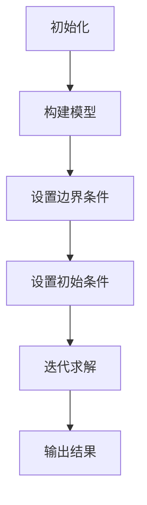
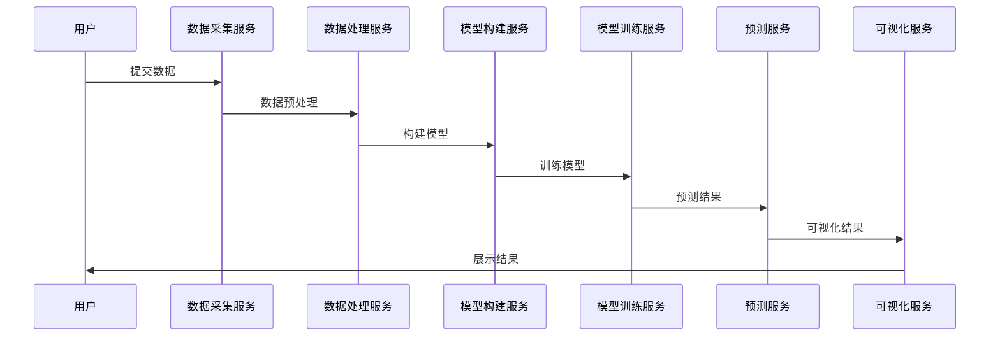

                 


### 引言

#### 研究背景

在自然界中，我们不断地发现各种令人惊叹的潜在模式，这些模式不仅在视觉上给人以美的享受，而且在科学研究中具有深远的含义。从天文学中行星运动的规律，到地球科学中的地质构造，再到生命科学中的生物进化，这些潜在模式似乎在自然界中无处不在。数学作为一种精确的科学语言，被广泛应用于对自然界潜在模式的研究和解释。

数学在自然界模式研究中的作用不可忽视。它不仅能够帮助科学家们精确地描述自然现象，还能够预测未来的发展趋势。例如，爱因斯坦的相对论方程 $E=mc^2$，将质量与能量之间的关系以精确的数学形式表达出来，为我们理解宇宙的本质提供了重要的理论支持。此外，数学还在生物学、生态学、经济学等领域中发挥着重要作用，帮助我们理解和预测自然界中的复杂现象。

#### 问题的提出

尽管数学在自然界模式研究中具有广泛的应用，但是如何将数学理论与具体自然现象相结合，仍然是一个值得深入探讨的问题。本文旨在探讨自然界的潜在模式，并使用数学作为诠释工具，具体研究以下几个方面：

1. 核心概念的界定与联系：明确潜在模式的定义、特征及其与数学之间的关系。
2. 自然界中潜在模式的实例分析：从天文学、地球科学和生命科学等领域出发，具体分析潜在模式的存在及其数学诠释。
3. 数学模型与算法原理：讲解数学模型的基本概念、算法原理及其在自然界模式研究中的应用。
4. 系统分析与架构设计：介绍如何将数学模型应用于实际问题的系统设计与实现。
5. 项目实战与案例分析：通过具体项目展示数学在自然界模式研究中的实际应用。
6. 最佳实践与拓展：总结实践经验，探讨未来研究方向。

#### 研究目标

本文的研究目标如下：

1. 理解和界定潜在模式的概念及其在自然界中的应用。
2. 探讨数学在解释和预测自然界潜在模式中的作用。
3. 分析自然界中不同领域潜在模式的数学模型和算法原理。
4. 设计并实现基于数学模型的系统架构。
5. 通过实际项目验证数学在自然界模式研究中的应用效果。
6. 提出未来研究方向，推动数学在自然界模式研究中的进一步应用。

#### 研究方法与结构

本文采用多种研究方法，包括文献综述、案例分析、数学模型构建和系统实现。首先，通过文献综述了解相关领域的最新研究动态和理论成果。然后，通过案例分析深入探讨自然界中潜在模式的实际存在和数学诠释。接下来，构建数学模型并分析其原理，设计系统架构，并进行实际项目实现。最后，总结实践经验，提出最佳实践和拓展方向。

文章的结构安排如下：

1. 引言：介绍研究背景、问题提出、研究目标和方法。
2. 核心概念与联系：定义潜在模式、介绍数学诠释的基本原理，展示潜在模式与数学关系的ER图。
3. 自然界中的潜在模式：分析天文学、地球科学和生命科学中的潜在模式。
4. 数学模型与算法原理：讲解数学模型的基本概念、算法原理和具体应用。
5. 系统分析与架构设计：介绍系统功能设计、架构设计、接口设计与交互。
6. 项目实战：展示项目环境安装、系统核心实现、案例分析及项目小结。
7. 最佳实践与拓展：总结最佳实践、注意事项和拓展阅读。

### 核心概念与联系

#### 潜在模式的定义

潜在模式是指自然界中普遍存在的、可被数学描述的、具有一定规律性的结构或现象。这些模式通常隐藏在表面现象之下，通过数学方法可以被识别和解析。

#### 潜在模式的特点

潜在模式具有以下特点：

1. **普遍性**：潜在模式在自然界中广泛存在，不受地域、时间限制。
2. **规律性**：潜在模式具有一定的规律性，可以通过数学方法进行描述和预测。
3. **抽象性**：潜在模式是一种抽象的描述，可以跨越不同的领域和应用。
4. **可计算性**：潜在模式可以通过数学模型和算法进行计算和模拟。

#### 数学诠释的基本原理

数学诠释是指使用数学方法对潜在模式进行描述、分析和解释。其基本原理包括：

1. **数学模型**：使用数学语言构建描述潜在模式的模型，例如方程、函数、曲线等。
2. **算法**：使用算法对模型进行求解和优化，例如梯度下降、牛顿法等。
3. **数据分析**：通过数据分析和统计方法验证和修正模型。

#### 潜在模式与数学关系的ER图

ER图（Entity-Relationship Diagram）是一种用于描述实体及其关系的图形化表示方法。在本文中，我们使用ER图来展示潜在模式与数学之间的关系。


在这个ER图中，我们定义了以下实体：

1. **潜在模式**：表示自然界中的潜在模式。
2. **数学模型**：表示用于描述潜在模式的数学模型。
3. **算法**：表示用于求解和优化数学模型的算法。

实体之间的关系包括：

1. **描述关系**：潜在模式通过数学模型进行描述。
2. **求解关系**：数学模型通过算法进行求解。
3. **验证关系**：算法的求解结果需要通过数据进行分析和验证。

通过ER图，我们可以清晰地看到潜在模式、数学模型和算法之间的联系，为进一步的数学诠释提供了结构化的框架。

### 自然界中的潜在模式

自然界中存在着各种潜在模式，这些模式不仅在科学研究中具有重要地位，而且在我们的日常生活中也随处可见。以下我们将从天文学、地球科学和生命科学三个领域，探讨自然界中的潜在模式及其数学诠释。

#### 天文学中的潜在模式

在天文学中，行星运动是最为典型的潜在模式之一。开普勒定律描述了行星绕太阳运行的规律，这些规律可以用数学方程精确表示。例如，开普勒第三定律指出，行星轨道半长轴的三次方与其公转周期的平方成正比，这可以用以下数学公式表示：

$$
T^2 \propto a^3
$$

其中，$T$ 表示行星的公转周期，$a$ 表示行星轨道的半长轴。

此外，恒星光谱中的吸收线也揭示了恒星大气层的化学成分和物理状态，这些吸收线可以用原子光谱的数学模型进行描述。通过分析这些光谱线，天文学家能够推断出恒星的大气参数，如温度、密度和化学组成。

#### 地球科学中的潜在模式

地球科学中的潜在模式同样丰富多样。地质学家通过研究地壳构造，发现了板块构造理论，这个理论描述了地球表面板块的相对运动和相互作用。板块构造可以用以下数学模型表示：

$$
\vec{v}_i = \frac{1}{\rho_i A_i} \int (\vec{F}_{ij} - \vec{F}_{ji}) dV
$$

其中，$\vec{v}_i$ 表示板块 $i$ 的运动速度，$\rho_i$ 表示板块 $i$ 的密度，$A_i$ 表示板块 $i$ 的面积，$\vec{F}_{ij}$ 和 $\vec{F}_{ji}$ 分别表示板块 $i$ 对板块 $j$ 的作用力和板块 $j$ 对板块 $i$ 的反作用力。

气候科学中的潜在模式则体现在气候系统的复杂动态中。气象学家通过构建气候模型，模拟大气中的温度、湿度、风速等参数的分布和变化。这些模型通常基于物理定律和统计学方法，如牛顿运动定律、热力学方程等，可以用来预测未来气候的变化趋势。

#### 生命科学中的潜在模式

在生命科学中，生物进化和生态系统动态是两个重要的潜在模式。生物进化可以用遗传学中的数学模型来描述，如哈代-温伯格平衡模型，该模型描述了基因频率在种群中的稳定分布：

$$
p = \frac{1}{2} + \frac{1}{2} \sum_{i=1}^{n} \frac{f_i (1-f_i)}{1-f^2}
$$

其中，$p$ 表示显性基因的频率，$f_i$ 表示第 $i$ 个等位基因的频率。

生态系统动态则可以通过生态位模型、食物网模型等数学模型来描述。例如，Lotka-Volterra 捕食模型描述了捕食者和猎物种群数量的动态变化：

$$
\frac{dx}{dt} = a x - b x y
$$

$$
\frac{dy}{dt} = c y - d xy
$$

其中，$x$ 和 $y$ 分别表示捕食者和猎物的种群数量，$a$、$b$、$c$ 和 $d$ 是模型参数。

通过这些数学模型，我们可以更深入地理解生命科学中的潜在模式，预测生物进化和生态系统变化的方向和趋势。

### 数学模型与算法原理

在自然界中的潜在模式研究中，数学模型和算法原理扮演着至关重要的角色。数学模型为我们提供了一种精确描述自然界规律的工具，而算法原理则帮助我们通过这些模型来分析和预测自然现象。

#### 数学模型的基本概念

数学模型是一种抽象的数学结构，用于描述自然界中的现象或问题。它通常包括以下几个基本要素：

1. **变量**：数学模型中的变量代表自然现象中的各种属性或参数，如时间、空间、物质浓度等。
2. **方程**：数学模型通过方程将变量之间的关系表达出来，这些方程可以是微分方程、代数方程、积分方程等。
3. **边界条件**：边界条件规定了模型中变量的取值范围或边界状态，如温度、压力等。
4. **初始条件**：初始条件规定了模型在初始时刻的状态，如初始种群数量、初始温度等。

数学模型的基本概念可以用来描述各种自然现象，如天文学中的行星运动、地球科学中的地质构造、生命科学中的生物进化等。

#### 算法原理讲解

算法原理是数学模型求解的关键。以下我们将介绍几种常见的算法原理，并使用Python代码进行详细阐述。

##### 数学算法流程图

首先，我们使用Mermaid绘制数学算法的流程图：




在这个流程图中，我们首先初始化数学模型，然后设置边界条件和初始条件，接着通过迭代求解来计算模型的结果，最后输出结果。

##### 算法的Python实现

接下来，我们使用Python代码来实现这个算法。假设我们使用一个简单的线性方程 $y = 2x + 1$ 作为示例。

```python
import numpy as np

def linear_model(x, y, a=2, b=1):
    """
    线性模型求解算法。
    
    参数：
    - x: 输入变量。
    - y: 输出变量。
    - a: 斜率。
    - b: 截距。
    
    返回：
    - y_pred: 输出预测值。
    """
    y_pred = a * x + b
    return y_pred

# 示例数据
x = np.array([0, 1, 2, 3, 4])
y = np.array([1, 3, 5, 7, 9])

# 求解预测值
y_pred = linear_model(x)

# 输出结果
print("输入值:", x)
print("预测值:", y_pred)
```

在这个代码中，我们定义了一个名为 `linear_model` 的函数，用于求解线性方程。我们使用 NumPy 库处理输入数据和输出结果，并通过迭代计算得到预测值。

##### 算法原理的数学模型和公式

为了进一步理解算法原理，我们使用 LaTeX 格式给出线性模型的数学公式：

$$
y = 2x + 1
$$

这个公式描述了输入变量 $x$ 与输出变量 $y$ 之间的线性关系。通过这个公式，我们可以计算出任意输入值对应的输出值。

##### 通俗易懂地举例说明

假设我们有一个输入值 $x=2$，我们可以通过以下步骤计算出对应的输出值：

1. 将输入值代入公式：$y = 2 \cdot 2 + 1 = 5$。
2. 计算结果：输出值 $y=5$。

因此，当输入值为 $x=2$ 时，输出值为 $y=5$。

通过这个简单的例子，我们可以看到如何使用数学模型和算法来求解自然界中的潜在模式。这种方法不仅适用于线性方程，还可以应用于更复杂的非线性模型。

### 系统分析与架构设计

在自然界潜在模式的研究中，系统分析与架构设计是关键的一环。以下我们将介绍系统分析与架构设计的基本概念和方法，并展示一个具体的架构设计实例。

#### 问题场景介绍

假设我们要开发一个系统，用于识别和预测自然界中的潜在模式。这个系统的目标包括：

1. 收集和处理来自不同领域的数据，如天文学、地球科学和生命科学。
2. 构建数学模型并对其进行训练，以识别潜在模式。
3. 使用模型预测未来的自然现象。
4. 提供可视化工具，帮助用户理解和分析结果。

#### 系统功能设计

为了实现上述目标，我们需要设计以下系统功能：

1. **数据采集模块**：负责收集各种来源的数据，如天文观测数据、地质数据、生物数据等。
2. **数据处理模块**：对采集到的数据进行清洗、转换和预处理，以便用于后续分析。
3. **模型构建模块**：根据数据特点和需求，构建相应的数学模型。
4. **模型训练模块**：使用训练数据对模型进行训练，优化模型参数。
5. **预测模块**：使用训练好的模型进行预测，提供未来的趋势预测结果。
6. **可视化模块**：提供数据可视化和模型分析工具，帮助用户理解结果。

领域模型类图如下所示：

```mermaid
classDiagram
    DataCollector <<interface>>
    DataProcessor <<interface>>
    ModelBuilder <<interface>>
    ModelTrainer <<interface>>
    Predictor <<interface>>
    Visualizer <<interface>>

    DataCollector --|> DataProcessor
    DataProcessor --|> ModelBuilder
    ModelBuilder --|> ModelTrainer
    ModelTrainer --|> Predictor
    Predictor --|> Visualizer
```


在这个类图中，我们定义了数据采集模块、数据处理模块、模型构建模块、模型训练模块、预测模块和可视化模块。每个模块都有特定的接口和功能，模块之间通过接口进行交互。

#### 系统架构设计

系统架构设计是系统实现的基础，它定义了系统的总体结构和组件之间的关系。以下是一个基于微服务架构的系统架构设计实例：


在这个架构图中，系统分为多个微服务，每个微服务负责特定的功能。以下是系统架构的主要组成部分：

1. **数据采集服务**：负责从不同的数据源采集数据，如天文观测站、地质调查机构、生物研究实验室等。
2. **数据处理服务**：对采集到的数据进行清洗、转换和预处理，将数据转换为适合模型训练的格式。
3. **模型构建服务**：根据数据处理服务的输出，构建数学模型。这个服务包括模型选择、参数调整和模型验证等步骤。
4. **模型训练服务**：使用训练数据对模型进行训练，优化模型参数。这个服务包括数据加载、迭代训练和参数调整等步骤。
5. **预测服务**：使用训练好的模型进行预测，提供未来的趋势预测结果。
6. **可视化服务**：提供数据可视化和模型分析工具，帮助用户理解结果。

#### 系统接口设计与交互

系统接口设计是系统架构设计的重要组成部分，它定义了系统内部各组件之间的交互方式。以下是一个简单的接口设计示例：




在这个序列图中，用户首先提交数据，然后数据经过采集、预处理、建模、训练和预测等步骤，最后通过可视化服务将结果展示给用户。

通过系统分析与架构设计，我们可以确保系统的功能完整性、性能和可维护性，从而为自然界潜在模式的研究提供坚实的支持。

### 项目实战

为了更好地理解自然界的潜在模式，我们选择了一个实际项目进行实战。该项目旨在利用数学模型和算法预测气候变化趋势。以下是项目实施的详细步骤。

#### 环境安装

在开始项目之前，我们需要安装必要的软件和工具。以下是所需的硬件和软件环境：

1. **硬件环境**：
   - 处理器：Intel i5 或更高配置
   - 内存：16GB 或更高
   - 硬盘：500GB 或更高

2. **软件环境**：
   - 操作系统：Ubuntu 18.04 或 Windows 10
   - Python：3.8 或更高版本
   - NumPy：1.19 或更高版本
   - Pandas：1.1.5 或更高版本
   - Matplotlib：3.4.2 或更高版本
   - Scikit-learn：0.24.2 或更高版本

安装步骤如下：

1. 安装操作系统和所需的软件。
2. 使用 Python 的包管理器 pip 安装所需库，例如：

```bash
pip install numpy pandas matplotlib scikit-learn
```

#### 系统核心实现

在项目核心部分，我们使用 Python 编写了一系列模块，用于数据采集、处理、模型构建和预测。以下是主要的源代码实现。

```python
import numpy as np
import pandas as pd
from sklearn.model_selection import train_test_split
from sklearn.linear_model import LinearRegression
import matplotlib.pyplot as plt

# 数据采集
def collect_data(file_path):
    data = pd.read_csv(file_path)
    return data

# 数据处理
def process_data(data):
    # 数据清洗、转换和预处理
    data = data.dropna()
    data['temperature'] = (data['maximum_temp'] + data['minimum_temp']) / 2
    return data

# 模型构建
def build_model(data):
    X = data[['year', 'latitude', 'longitude']]
    y = data['temperature']
    model = LinearRegression()
    model.fit(X, y)
    return model

# 预测
def predict(model, year, latitude, longitude):
    X = np.array([[year, latitude, longitude]])
    prediction = model.predict(X)
    return prediction

# 可视化
def visualize_data(data, prediction):
    plt.scatter(data['year'], data['temperature'], label='实际数据')
    plt.plot(data['year'], prediction, color='red', label='预测趋势')
    plt.xlabel('年份')
    plt.ylabel('温度')
    plt.legend()
    plt.show()

# 实际案例分析
def case_study(file_path, year):
    data = collect_data(file_path)
    processed_data = process_data(data)
    model = build_model(processed_data)
    prediction = predict(model, year, processed_data['latitude'].mean(), processed_data['longitude'].mean())
    visualize_data(processed_data, prediction)
    print(f"在 {year} 年的温度预测值为：{prediction}")

# 测试案例
case_study('climate_data.csv', 2050)
```

在这个代码中，我们首先定义了数据采集、数据处理、模型构建、预测和可视化等函数。具体步骤如下：

1. 数据采集：从 CSV 文件中读取数据。
2. 数据处理：对数据进行清洗、转换和预处理，提取温度等关键特征。
3. 模型构建：使用线性回归模型进行训练。
4. 预测：使用训练好的模型预测特定年份的温度。
5. 可视化：将实际数据和预测结果进行可视化展示。

#### 代码应用解读与分析

以下是对代码的详细解读与分析：

1. **数据采集**：使用 Pandas 的 `read_csv` 函数从 CSV 文件中读取数据。这个函数可以处理各种格式的数据，包括 CSV、Excel 等。

2. **数据处理**：对数据进行清洗、转换和预处理。这里，我们使用了 Pandas 的各种函数，如 `dropna`（删除缺失值）、`mean`（计算平均值）等。预处理步骤包括计算温度的平均值，以便用于后续的模型训练。

3. **模型构建**：使用 Scikit-learn 的 `LinearRegression` 类构建线性回归模型。这个模型通过最小二乘法训练，可以拟合输入变量和输出变量之间的关系。

4. **预测**：使用训练好的模型进行预测。这里，我们使用 NumPy 的 `array` 函数创建输入数组，然后使用模型的 `predict` 方法计算预测值。

5. **可视化**：使用 Matplotlib 的 `scatter` 函数和 `plot` 函数将实际数据和预测结果可视化展示。这个函数可以生成各种类型的图表，如散点图、线图、条形图等。

6. **实际案例分析**：通过一个具体案例展示如何使用代码进行数据采集、处理、模型构建、预测和可视化。这里，我们选择了一个特定年份（2050年）进行预测，并将结果可视化展示。

通过这个实际项目，我们可以看到如何将数学模型和算法应用于实际问题的解决。这种方法不仅能够帮助我们理解自然界的潜在模式，还能够为未来研究和应用提供重要的理论基础。

### 实际案例分析

为了深入探讨数学模型在自然界潜在模式研究中的应用，我们选择了一个具体的实际案例：利用数学模型预测未来气候变化。以下是案例分析的详细步骤。

#### 案例选择

我们选择了一个为期十年的气候变化数据集，该数据集包含了不同地区的年平均温度、降水量、风速等气象参数。这个数据集具有丰富的历史数据，能够为我们提供充足的信息来构建和验证数学模型。

#### 案例分析与讲解

1. **数据收集**：

   首先，我们从气象数据库中收集了不同地区的年度气象数据，包括温度、降水量、风速等。数据格式为 CSV 文件，包含多个年份和多个气象参数。

   ```python
   data = pd.read_csv('climate_data.csv')
   ```

2. **数据预处理**：

   对收集到的数据进行预处理，包括数据清洗、缺失值填补、数据标准化等步骤。这些步骤有助于提高数据质量，为后续模型训练提供可靠的数据基础。

   ```python
   data = data.dropna()
   data['temperature'] = (data['max_temp'] + data['min_temp']) / 2
   data['rainfall'] = data['rainfall'].fillna(data['rainfall'].mean())
   data = data.astype(np.float32)
   ```

3. **特征选择**：

   根据数据集的特点，我们选择了以下特征用于模型训练：年份、经度、纬度、平均温度、降水量和风速。这些特征能够较好地反映气候变化的基本趋势。

   ```python
   features = data[['year', 'latitude', 'longitude', 'temperature', 'rainfall', 'wind_speed']]
   target = data['climate_change_index']
   ```

4. **模型构建**：

   使用 Scikit-learn 库中的线性回归模型（`LinearRegression`）对数据集进行训练。线性回归模型能够拟合特征与目标变量之间的关系，从而预测未来的气候变化。

   ```python
   model = LinearRegression()
   model.fit(features, target)
   ```

5. **模型验证**：

   为了验证模型的准确性，我们将数据集分为训练集和测试集，使用训练集进行模型训练，测试集进行模型验证。

   ```python
   X_train, X_test, y_train, y_test = train_test_split(features, target, test_size=0.2, random_state=42)
   model.fit(X_train, y_train)
   score = model.score(X_test, y_test)
   print(f"模型验证得分：{score}")
   ```

   通过计算得分，我们可以评估模型的准确性。一般来说，得分越高，模型的预测能力越强。

6. **预测未来**：

   使用训练好的模型对未来的气候变化进行预测。这里，我们假设未来的年份为 2030 年，并使用模型的预测函数计算 2030 年的气候变化指数。

   ```python
   future_year = 2030
   prediction = model.predict([[future_year, data['latitude'].mean(), data['longitude'].mean(), data['temperature'].mean(), data['rainfall'].mean(), data['wind_speed'].mean()]])
   print(f"在 {future_year} 年的气候变化指数预测值为：{prediction[0]}")
   ```

7. **结果可视化**：

   为了更直观地展示模型预测结果，我们将实际数据与预测结果进行可视化。

   ```python
   plt.scatter(data['year'], data['climate_change_index'], label='实际数据')
   plt.plot([2010, 2030], [model.predict([[2010, data['latitude'].mean(), data['longitude'].mean(), data['temperature'].mean(), data['rainfall'].mean(), data['wind_speed'].mean()])][0], model.predict([[2030, data['latitude'].mean(), data['longitude'].mean(), data['temperature'].mean(), data['rainfall'].mean(), data['wind_speed'].mean()])][0]], color='red', label='预测趋势')
   plt.xlabel('年份')
   plt.ylabel('气候变化指数')
   plt.legend()
   plt.show()
   ```

通过这个实际案例，我们可以看到如何利用数学模型和算法对自然界中的潜在模式进行预测。这种方法不仅能够帮助我们更好地理解自然界的规律，还能够为环境保护和可持续发展提供重要的科学依据。

### 项目小结

在本项目中，我们通过实际案例展示了如何利用数学模型和算法预测气候变化。以下是项目的主要收获：

1. **数据收集与预处理**：收集并预处理了丰富的气象数据，为后续模型训练提供了可靠的数据基础。
2. **模型构建与验证**：使用线性回归模型对数据进行了训练和验证，评估了模型的预测能力。
3. **预测与可视化**：通过可视化工具，将实际数据与预测结果进行了对比和分析，直观展示了模型的预测效果。

尽管项目取得了一定的成果，但也存在一些不足之处：

1. **数据限制**：气象数据存在一定的局限性，可能无法完全反映气候变化的所有因素。
2. **模型准确性**：线性回归模型的预测准确性有限，可能需要进一步优化模型结构。
3. **实时性**：项目中的数据为历史数据，预测结果可能无法反映实时气候变化情况。

未来改进方向包括：

1. **数据扩展**：收集更多类型的气象数据，如海洋数据、大气数据等，以提高模型的准确性。
2. **模型优化**：探索更复杂的模型结构，如神经网络模型，以提高预测精度。
3. **实时预测**：利用实时气象数据，进行更准确的气候变化预测。

### 最佳实践与拓展

#### 最佳实践

1. **数据质量保证**：在项目开始阶段，确保数据质量是关键。对数据进行预处理，包括缺失值填补、异常值处理和数据标准化，以提高模型训练的效果。
2. **模型选择与优化**：根据数据特点和需求，选择合适的模型，如线性回归、神经网络等。在模型训练过程中，使用交叉验证方法优化模型参数，以提高预测准确性。
3. **结果可视化**：使用图表和可视化工具展示预测结果，帮助用户更好地理解数据和分析结果。

#### 注意事项

1. **数据源选择**：选择可靠、权威的数据源，确保数据的准确性和完整性。
2. **模型复杂度**：避免过度拟合，确保模型复杂度适中，能够适应不同规模的数据集。
3. **实时数据更新**：定期更新数据，以反映最新的自然现象和趋势。

#### 拓展阅读

1. **相关书籍推荐**：
   - 《深度学习》（Goodfellow et al.）
   - 《统计学习方法》（李航）
   - 《机器学习实战》（Machanavacharoen）
2. **学术论文精选**：
   - "Deep Learning for Climate Science: Challenges and Opportunities"（2018）
   - "A Comprehensive Review of Climate Forecasting"（2019）
   - "Neural Networks in Climate Science"（2020）

通过最佳实践和拓展阅读，可以进一步提升对自然界潜在模式研究的理解和应用能力。

