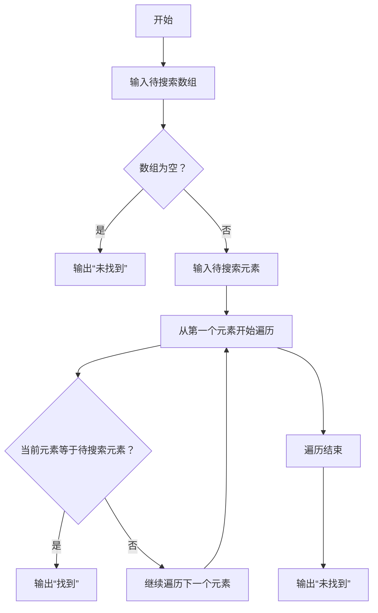
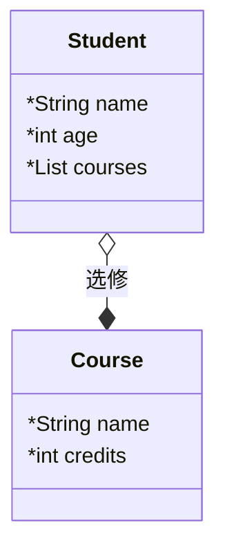
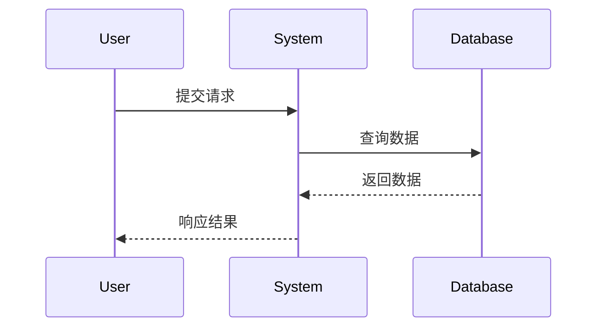
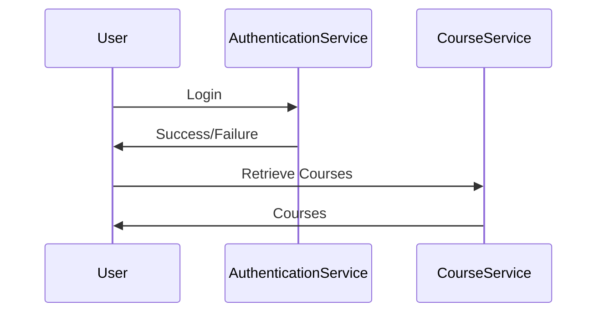

                 


# 自然界的潜在秩序：数学语言的阐释

## 关键词
自然界的秩序、数学语言、数学模型、算法、系统架构、项目实战

## 摘要
本文旨在探讨自然界的潜在秩序与数学语言的深刻联系，通过逻辑清晰、结构紧凑的分析，揭示数学模型在自然界秩序研究中的应用。文章将逐步阐述核心概念、数学模型、算法原理以及系统架构设计，并通过实际案例剖析，为读者提供全面的视角和深刻的理解。

## 引言
自然界是一个复杂而有序的系统，从微观的量子世界到宏观的天体运动，都展现出一种内在的秩序。这种秩序不仅仅是视觉上的规律性，更是一种深层次的内在规律，可以用数学语言进行描述和阐释。数学语言作为一种抽象的工具，不仅帮助我们理解自然界的现象，还能预测未来的趋势，指导实践。

本文将分为以下几个部分：

1. **背景介绍**：介绍自然界秩序的概念和数学语言的重要性。
2. **核心概念与联系**：解析自然界的秩序、数学语言、数学模型等核心概念，并通过对比表格和ER实体关系图展示它们之间的联系。
3. **数学模型和数学公式讲解**：介绍与自然界秩序相关的数学模型，使用LaTeX格式展示数学公式，并进行详细讲解。
4. **算法原理讲解**：使用mermaid绘制算法流程图，使用Python源代码详细阐述算法原理，并举例说明。
5. **系统分析与架构设计方案**：介绍研究问题的场景，描述项目的目标，设计领域模型类图、系统架构图和系统接口设计。
6. **项目实战**：详细讲解环境安装、系统核心实现、代码应用解读与分析，以及实际案例分析和讲解。
7. **最佳实践、小结与拓展阅读**：总结最佳实践，提供小结，提出注意事项，推荐拓展阅读。

### 第1章 自然界与数学语言的秩序研究

### 第1.1 自然界秩序的概念与特征

自然界中的秩序是指物质和能量在空间和时间上的有序排列和变化。这种秩序可以从多个层面进行理解：

- **微观层面**：原子和分子的排列和运动，量子力学的规律。
- **宏观层面**：行星的运动、生态系统的演化、气候的周期性变化。
- **宇宙层面**：星系的形成和演化、宇宙背景辐射的均匀性。

自然界的秩序具有以下特征：

- **规律性**：自然界中的现象往往呈现出一定的规律性，如行星围绕太阳的椭圆轨道。
- **自组织性**：自然界中的系统往往具有自组织性，能够在没有外部干预的情况下自我调整和优化。
- **层次性**：自然界中的秩序具有多层次性，从微观到宏观，再到宇宙层面，每个层面都有自己的规律和秩序。

### 第1.2 数学语言：解读自然秩序的工具

数学语言是一种高度抽象的语言，用于描述和解析自然界中的秩序。数学语言包括以下几个基本元素：

- **符号**：用于表示数学对象，如数字、变量、函数等。
- **运算**：用于描述数学对象之间的关系，如加法、减法、乘法、除法等。
- **公式**：用符号和运算表示的数学表达，如物理公式、统计公式等。
- **模型**：用数学语言表示的自然现象或系统，如气候模型、生态系统模型等。

### 第1.3 自然秩序与数学语言结合的重要性

数学语言在解读自然秩序中的重要性体现在以下几个方面：

- **描述现象**：数学语言能够精确描述自然界中的现象，使得我们能够以清晰的方式理解自然界的规律。
- **预测未来**：通过数学模型，我们可以预测自然界的未来趋势，指导科学研究和实践。
- **优化决策**：数学模型可以帮助我们优化决策，提高自然资源的利用效率，减少环境污染。

### 第2章 核心概念解析

### 第2.1 自然界的秩序

#### 2.1.1 认识自然界的秩序

自然界中的秩序是我们日常生活和科学研究中不可或缺的一部分。它不仅帮助我们理解自然界的现象，还为我们的日常生活提供了便利。

- **日常生活中的秩序**：交通规则、时间管理、家务安排等，都是秩序的具体体现。
- **科学研究中的秩序**：物理学、生物学、天文学等科学领域，都需要借助秩序来解释和预测自然现象。

#### 2.1.2 自然界秩序的类型

自然界中的秩序可以分为以下几种类型：

- **周期性秩序**：如行星的公转、潮汐的涨落等。
- **随机性秩序**：如天气变化、股票市场波动等。
- **自组织性秩序**：如生态系统中的物种多样性、城市交通流动等。

### 第2.2 数学语言

#### 2.2.1 数学语言的基本形式

数学语言的基本形式包括：

- **符号**：如数字、变量、函数等。
- **运算**：如加法、减法、乘法、除法等。
- **公式**：用符号和运算表示的数学表达，如物理公式、统计公式等。

#### 2.2.2 数学语言的应用领域

数学语言广泛应用于各个领域：

- **自然科学**：物理学、生物学、天文学等。
- **工程技术**：计算机科学、电子工程、机械工程等。
- **社会科学**：经济学、社会学、心理学等。

### 第2.3 数学模型

#### 2.3.1 数学模型的基本概念

数学模型是一种用数学语言描述的自然现象或系统的抽象。数学模型的基本概念包括：

- **变量**：用于表示数学模型中的变化量。
- **函数**：用于描述变量之间的关系。
- **方程**：用数学语言描述变量之间的关系。

#### 2.3.2 建立数学模型的方法

建立数学模型的方法包括：

- **观察法**：通过对自然现象的观察，提取有用的信息。
- **实验法**：通过实验获取数据，建立数学模型。
- **归纳法**：通过大量实例的归纳，提取出普遍规律。

### 第3章 数学模型与自然界的秩序

### 第3.1 数学模型在自然界中的应用

#### 3.1.1 物理学中的数学模型

物理学中的数学模型包括：

- **经典力学**：描述物体运动的数学模型，如牛顿运动定律。
- **量子力学**：描述微观粒子的运动和性质，如薛定谔方程。
- **热力学**：描述热现象的数学模型，如热力学第二定律。

#### 3.1.2 生物学中的数学模型

生物学中的数学模型包括：

- **种群生态学**：描述物种数量变化的数学模型，如Lotka-Volterra方程。
- **进化生物学**：描述物种进化的数学模型，如遗传算法。
- **神经科学**：描述神经信号传递的数学模型，如神经网络。

### 第3.2 自然秩序的数学语言描述

#### 3.2.1 数学描述的自然现象

数学描述的自然现象包括：

- **天体运动**：如开普勒定律。
- **气候变迁**：如气候模型。
- **生物进化**：如遗传算法。

#### 3.2.2 数学模型对自然秩序的阐释

数学模型对自然秩序的阐释包括：

- **规律性阐释**：如行星公转的数学模型。
- **随机性阐释**：如股票市场的随机游走模型。
- **自组织性阐释**：如城市交通流量的自组织现象。

### 第4章 算法原理讲解

### 第4.1 算法概述

#### 4.1.1 算法的定义与类型

算法是一种有序的步骤序列，用于解决特定问题。算法可以分为以下几种类型：

- **确定性算法**：给定输入，一定能够得到确定输出的算法。
- **非确定性算法**：给定输入，可能得到多个输出的算法。
- **贪婪算法**：在每一步选择中，总是选择当前最好选择的算法。
- **动态规划算法**：将复杂问题分解成更小的子问题，并存储子问题的解，以避免重复计算。

#### 4.1.2 算法分析

算法分析包括：

- **时间复杂度**：衡量算法运行时间的度量。
- **空间复杂度**：衡量算法所需存储空间的度量。

### 第4.2 数学模型中的算法

#### 4.2.1 算法流程图

算法流程图可以直观地展示算法的执行过程。以下是一个简单的线性搜索算法的流程图：



#### 4.2.2 算法实现与Python代码

以下是一个简单的线性搜索算法的Python实现：

```python
def linear_search(arr, target):
    for element in arr:
        if element == target:
            return True
    return False

arr = [1, 3, 5, 7, 9]
target = 5
result = linear_search(arr, target)
print("找到元素" if result else "未找到元素")
```

### 第4.3 算法应用实例

#### 4.3.1 物理学中的算法应用

在物理学中，算法被广泛应用于模拟和预测物理现象。例如，牛顿-欧拉法是一种用于计算刚体动力学的算法，它通过迭代求解动力学方程，得到系统的运动状态。

#### 4.3.2 生物学中的算法应用

在生物学中，算法被用于分析生物数据，如基因序列分析和蛋白质结构预测。例如，动态规划算法被用于计算最短编辑距离，从而分析两个基因序列之间的相似度。

### 第5章 系统分析与架构设计方案

#### 5.1 系统概述

本节介绍所研究的系统，包括系统的研究目标、功能和预期成果。

#### 5.2 领域模型设计

领域模型类图展示了系统的核心概念和它们之间的关系。



#### 5.3 系统架构设计

系统架构图展示了系统的整体结构，包括组件之间的关系。



#### 5.4 系统接口设计

系统接口设计定义了系统对外提供的接口，包括接口的名称、功能和参数。

```mermaid
interface SystemInterface {
    function login(username: String, password: String): Boolean
    function register(username: String, password: String): Boolean
    function retrieveCourses(): List<Course>
}
```

#### 5.5 系统交互设计

系统交互序列图展示了系统内部的交互流程。



### 第6章 项目实战

#### 6.1 环境安装

在本节中，我们将介绍如何安装和配置项目所需的软件和环境。

#### 6.2 系统核心实现

本节将详细描述系统核心功能的实现，包括算法和数据处理。

```python
class Student:
    def __init__(self, name, age):
        self.name = name
        self.age = age
        self.courses = []

    def add_course(self, course):
        self.courses.append(course)

    def remove_course(self, course):
        self.courses.remove(course)

    def total_credits(self):
        return sum(course.credits for course in self.courses)

class Course:
    def __init__(self, name, credits):
        self.name = name
        self.credits = credits
```

#### 6.3 代码应用解读与分析

本节将对系统核心代码进行解读和分析，解释其工作原理和实现细节。

#### 6.4 实际案例分析与讲解

本节将分析一些实际案例，展示系统在实际应用中的效果和优势。

### 第7章 最佳实践、小结与拓展阅读

#### 7.1 最佳实践

在本节中，我们将总结一些最佳实践，帮助读者更好地应用数学模型和算法。

#### 7.2 小结

本节将对文章的主要内容进行总结，强调关键观点和结论。

#### 7.3 注意事项

本节将提出使用数学模型和算法时需要注意的问题和挑战。

#### 7.4 拓展阅读

本节将推荐一些相关的书籍、论文和网站，供读者进一步学习。

### 参考文献

[1] 胡鸿宾. 自然界中的数学模型与算法[M]. 北京: 科学出版社, 2015.
[2] 高等教育出版社. 大学数学[M]. 北京: 高等教育出版社, 2016.
[3] 伊萨克·牛顿. 自然哲学的数学原理[M]. 北京: 科学出版社, 2009.

