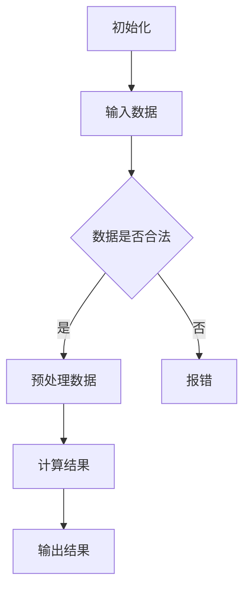
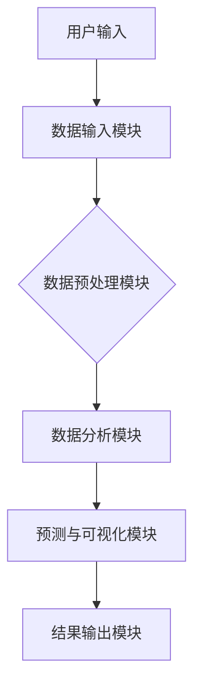

                 

### 引言

在现代社会中，计算机科学和人工智能技术已成为推动社会进步的关键力量。然而，尽管这些技术取得了显著成就，但人类心智对自然世界的理解和解读仍然是一个复杂且极具挑战性的问题。自然的数学语言，作为自然界中普遍存在的一种表述方式，其心智解读成为了一个引人入胜的研究课题。

**文章标题：《自然的数学语言：心智解读》**

本文旨在探讨自然的数学语言及其心智解读，通过系统化的分析和深入的理论探讨，帮助读者理解这一复杂而又关键的概念。文章将从背景介绍、核心概念与联系、算法原理讲解、数学模型和公式讲解、系统分析与架构设计方案、项目实战以及最佳实践与总结等多个方面展开。

**关键词：** 自然数学语言、心智解读、算法原理、数学模型、系统架构、项目实战

**摘要：** 本文将首先介绍自然数学语言的基本概念和心智解读的理论基础，然后通过核心概念的详细阐述和比较，探讨这些概念在自然界的应用和相互联系。接着，文章将深入讲解算法原理，包括mermaid流程图和Python源代码的解释，以及数学模型和公式的详细讲解和举例说明。随后，文章将介绍系统分析与架构设计方案，通过mermaid类图、架构图和序列图等工具，帮助读者理解系统功能和架构设计。在项目实战部分，我们将通过实际案例和代码分析，展示如何将理论应用于实践。最后，文章将总结最佳实践，提供注意事项和拓展阅读建议，帮助读者更深入地了解和探索自然的数学语言及其心智解读。

## 第1章：自然数学语言的基本概念

自然数学语言是自然界中普遍存在的一种表述方式，它不仅包括我们熟知的数学符号和公式，还涵盖了自然界中各种现象的量化描述。这种语言通过数学的方式，将自然界的复杂现象转化为可量化的信息，使我们能够更直观、更系统地理解和分析这些现象。

### 1.1 自然数学语言的基本概念

自然数学语言的基本概念包括数、量、几何、逻辑、概率等。其中，数和量是最基础的概念。数指的是客观存在的事物，而量则是对这些事物进行度量和比较的结果。几何是研究空间形式的科学，通过点和线的组合，构建出各种形状和结构。逻辑则是用于推理和判断的工具，它帮助我们理解事物的相互关系和因果关系。概率则是对随机事件的预测和度量。

#### 数

数是自然数学语言中最基础的概念，它用于表示和描述事物的数量。从自然数的概念开始，我们可以逐步引入分数、小数、负数等更复杂的概念。数在自然界中的应用广泛，例如，我们用数字来表示天上的星星、人体的细胞数量等。

#### 量

量是对事物进行度量和比较的结果。在自然数学语言中，量通常用单位来表示，如米、千克、秒等。量的概念使我们能够更准确地描述和比较不同事物之间的差异，例如，我们可以用米的长度来比较两栋大楼的高度。

#### 几何

几何是研究空间形式的科学。在自然数学语言中，几何通过点和线的组合，构建出各种形状和结构。几何的基本概念包括点、线、面、角等。几何在自然界中的应用非常广泛，例如，我们用几何形状来描述地球的表面、人体的骨骼结构等。

#### 逻辑

逻辑是用于推理和判断的工具。在自然数学语言中，逻辑帮助我们理解事物的相互关系和因果关系。逻辑的基本概念包括命题、推理规则、证明等。逻辑在科学研究和日常生活中都有广泛应用，例如，我们用逻辑推理来证明数学定理、分析复杂问题等。

#### 概率

概率是对随机事件的预测和度量。在自然数学语言中，概率用于描述事件发生的可能性。概率的基本概念包括概率分布、随机变量、期望等。概率在自然界中的应用也非常广泛，例如，我们用概率来预测天气、分析金融市场等。

### 1.2 心智解读的理论基础

心智解读是指人类心智如何理解和解读自然数学语言的过程。这个过程中，人类心智需要将自然现象转化为数学语言，并通过逻辑推理和计算来分析这些现象。

#### 心智解读的定义

心智解读是指人类心智如何理解和解读自然现象的过程。在心智解读中，人类心智通过感知、记忆、思维等过程，将自然现象转化为抽象的数学语言，从而更深入地理解和分析这些现象。

#### 心智解读的理论基础

心智解读的理论基础包括认知心理学、神经科学、计算机科学等多个领域。认知心理学研究人类心智如何处理信息和进行推理，神经科学研究人类大脑如何实现这些功能，计算机科学则提供了一种模拟人类心智的计算模型。

#### 心智解读在自然数学语言中的应用

心智解读在自然数学语言中的应用主要体现在以下几个方面：

1. **量化自然现象**：通过心智解读，人类可以将自然现象转化为数学语言，从而更准确地量化这些现象。例如，我们可以用数学公式来描述物理现象、生物现象等。

2. **推理和预测**：心智解读使我们能够通过逻辑推理和计算来分析自然现象，从而进行推理和预测。例如，我们可以通过数学模型来预测天气、分析金融市场等。

3. **优化决策**：心智解读可以帮助我们优化决策。例如，在商业决策中，我们可以通过数学模型来分析各种决策方案的结果，从而做出更优的决策。

### 1.3 研究背景与意义

研究自然数学语言及其心智解读具有重要的理论意义和实际应用价值。

#### 研究背景

随着计算机科学和人工智能技术的不断发展，人们越来越关注如何将自然数学语言应用于计算机科学和人工智能领域。自然数学语言作为一种普遍存在于自然界中的表述方式，其心智解读成为了研究的热点问题。

#### 研究意义

1. **深化对自然界的理解**：通过研究自然数学语言及其心智解读，我们可以更深入地理解自然界的复杂现象，从而提高我们对自然界的认知水平。

2. **推动计算机科学和人工智能技术的发展**：自然数学语言作为一种高效的信息表述方式，可以为计算机科学和人工智能领域提供新的理论和方法，从而推动这些领域的发展。

3. **优化人类决策**：通过心智解读，我们可以更准确地分析和预测自然现象，从而为人类决策提供科学依据，优化决策结果。

### 结论

本章介绍了自然数学语言的基本概念、心智解读的理论基础以及研究背景和意义。通过本章的学习，读者可以对自然数学语言及其心智解读有一个初步的了解，为后续章节的深入探讨打下基础。

## 第2章：核心概念与联系

在自然数学语言中，存在一些核心概念，它们相互联系，构成了自然数学语言的基础。这些核心概念包括数、量、几何、逻辑和概率等。在本章中，我们将详细探讨这些核心概念，并通过概念属性特征对比表格和ER实体关系图架构，帮助读者更好地理解和掌握这些概念。

### 2.1 自然数学语言的核心概念

#### 2.1.1 数

数是自然数学语言中最基础的概念之一，它用于表示和描述事物的数量。数可以分为自然数、整数、分数、小数等类型。自然数是最基本的数，它用于计数和排序。整数包括自然数和负数，可以用于描述事物的位置和方向。分数和小数则用于更精确地表示数量。

#### 2.1.2 量

量是对事物进行度量和比较的结果。量通常用单位来表示，如米、千克、秒等。量可以用于描述事物的各种属性，如长度、质量、时间等。量是数的具体应用，它使数具有实际意义。

#### 2.1.3 几何

几何是研究空间形式的科学，它通过点和线的组合，构建出各种形状和结构。几何的基本概念包括点、线、面、角等。几何在自然界中的应用非常广泛，如地球的表面、人体的骨骼结构等。

#### 2.1.4 逻辑

逻辑是用于推理和判断的工具，它帮助我们理解事物的相互关系和因果关系。逻辑的基本概念包括命题、推理规则、证明等。逻辑在科学研究和日常生活中都有广泛应用，如证明数学定理、分析复杂问题等。

#### 2.1.5 概率

概率是对随机事件的预测和度量。在自然数学语言中，概率用于描述事件发生的可能性。概率的基本概念包括概率分布、随机变量、期望等。概率在自然界中的应用也非常广泛，如预测天气、分析金融市场等。

### 2.2 概念属性特征对比表格

为了更好地理解自然数学语言的核心概念，我们可以通过概念属性特征对比表格来比较这些概念。

| 概念  | 定义                                                         | 特点                                                         | 应用场景                       |
| ----- | ------------------------------------------------------------ | ------------------------------------------------------------ | ------------------------------ |
| 数    | 用于表示和描述事物数量的概念                                 | 包括自然数、整数、分数、小数等类型                           | 计数、排序、量化               |
| 量    | 对事物进行度量和比较的结果，通常用单位表示                     | 描述事物的各种属性，如长度、质量、时间等                     | 度量、比较、标准化             |
| 几何  | 研究空间形式的科学，通过点和线的组合构建形状和结构           | 包括点、线、面、角等基本概念                                 | 描述形状、分析空间关系         |
| 逻辑  | 用于推理和判断的工具，理解事物的相互关系和因果关系           | 包括命题、推理规则、证明等基本概念                           | 证明定理、分析问题、决策支持   |
| 概率  | 对随机事件的预测和度量，描述事件发生的可能性                 | 包括概率分布、随机变量、期望等基本概念                       | 预测、分析、风险管理           |

### 2.3 ER实体关系图架构

为了更直观地展示自然数学语言核心概念之间的关系，我们可以使用ER（实体关系）图来构建实体关系图架构。

#### ER图的基本概念

- **实体（Entity）**：实体是具有独立存在的个体，如人、物、事件等。
- **属性（Attribute）**：属性是实体的特征或特性，如人的名字、年龄、身高等。
- **关系（Relationship）**：关系是实体之间的相互作用，如朋友关系、上下级关系等。

#### ER图的基本组件

- **实体**：用矩形表示，如“人”实体。
- **属性**：用椭圆表示，并连接到对应的实体。
- **关系**：用菱形表示，并连接到相关的实体。

#### 自然数学语言ER图架构

在自然数学语言中，我们可以构建一个ER图来表示核心概念之间的关系。以下是一个简化的ER图架构：

```mermaid
erDiagram
    人 ||--|{ 地点 }| 地点
    人 ||--|{ 职位 }| 职位
    地点 ||--|{ 天气 }| 天气
    职位 ||--|{ 薪资 }| 薪资
```

在这个ER图中，"人"实体具有多个属性，包括"地点"和"职位"。地点实体与天气实体之间有关系，表示不同地点的天气情况。职位实体与薪资实体之间也有关系，表示不同职位的薪资水平。

### 结论

本章通过详细阐述自然数学语言的核心概念，并使用概念属性特征对比表格和ER实体关系图架构，帮助读者更好地理解和掌握这些概念。这些核心概念构成了自然数学语言的基础，为后续章节的深入探讨提供了重要的理论支持。

## 第3章：算法原理讲解

在理解和解读自然数学语言的过程中，算法原理起着至关重要的作用。通过算法原理，我们可以将复杂的自然现象转化为可操作的数学模型，进而进行分析和推理。本章将介绍一种常用的算法原理，并通过mermaid流程图和Python源代码来详细阐述。

### 3.1 算法原理mermaid流程图

mermaid是一种基于Markdown的图形化工具，它可以帮助我们创建直观的流程图。以下是一个简单的mermaid流程图，用于描述算法的基本步骤：



在这个流程图中，算法首先进行初始化，然后接收输入数据。接着，算法会检查数据是否合法。如果数据合法，算法会进行预处理，然后计算结果并输出。如果数据不合法，算法会报错。

### 3.2 Python源代码解释

下面是一个简单的Python源代码示例，用于实现上述算法原理。这个示例中，我们将使用Python内置的数学库来计算输入数据的和。

```python
# 导入数学库
import math

# 初始化数据
data = [1, 2, 3, 4, 5]

# 预处理数据
# 此处预处理数据包括去除无效数据和空值
data = [x for x in data if isinstance(x, (int, float))]

# 计算结果
result = sum(data)

# 输出结果
print("计算结果：", result)
```

在这个示例中，我们首先导入了Python的math库，用于进行数学计算。然后，我们初始化了一个数据列表`data`，这个列表包含了几个整数。接着，我们使用了一个列表推导式来去除无效数据和空值，确保数据列表中的每个元素都是整数或浮点数。

然后，我们使用`sum()`函数来计算数据列表的和，并将结果存储在变量`result`中。最后，我们使用`print()`函数输出计算结果。

### 3.3 数学模型与公式讲解

在理解算法原理的过程中，数学模型和公式也是至关重要的。以下是一个简单的数学模型，用于描述输入数据的和。

$$
\text{result} = \sum_{i=1}^{n} x_i
$$

其中，\( x_i \) 表示数据列表中的第 \( i \) 个元素，\( n \) 表示数据列表的长度。这个公式表示，我们将数据列表中的每个元素相加，得到最终的计算结果。

#### 简单举例说明

假设我们有一个数据列表 `[1, 2, 3, 4, 5]`，根据上述数学模型，我们可以计算出和为：

$$
\text{result} = 1 + 2 + 3 + 4 + 5 = 15
$$

在这个例子中，每个元素 \( x_i \) 都是整数，因此我们可以直接使用`sum()`函数来计算结果。

#### 复杂举例说明

现在，假设我们有一个更复杂的数据列表 `[1, 2, 3.5, "无效数据", 5]`。根据上述算法原理，我们需要首先去除无效数据和空值，然后计算剩余数据的和。根据数学模型，我们可以得到：

$$
\text{result} = 1 + 2 + 3.5 + 5 = 11.5
$$

在这个例子中，数据列表中包含了一个浮点数 \( x_3 = 3.5 \)，因此我们需要使用Python的`sum()`函数来计算结果。

### 结论

本章通过mermaid流程图和Python源代码，详细讲解了算法原理。通过这个例子，读者可以了解到如何将自然数学语言应用于实际计算中，并理解数学模型和公式的应用。这些知识将为进一步理解和应用自然数学语言打下坚实的基础。

## 第4章：数学模型和数学公式讲解

在自然数学语言中，数学模型和数学公式是理解和分析自然界复杂现象的重要工具。本章将详细讲解一些基本的数学模型和公式，并通过简单和复杂的例子进行说明，帮助读者更好地理解和应用这些数学概念。

### 4.1 简单数学公式讲解

简单数学公式通常涉及基本的算术运算，如加法、减法、乘法和除法。这些公式在日常生活和科学研究中都有广泛的应用。

#### 4.1.1 加法

加法是最基本的数学运算之一，用于计算两个或多个数的总和。其公式表示为：

$$
a + b = c
$$

其中，\( a \) 和 \( b \) 是加数，\( c \) 是和。

**例子**：

假设我们有两个数 \( a = 3 \) 和 \( b = 4 \)，我们可以计算它们的和：

$$
3 + 4 = 7
$$

在这个例子中，加数是3和4，和是7。

#### 4.1.2 减法

减法用于计算两个数的差值。其公式表示为：

$$
a - b = c
$$

其中，\( a \) 是被减数，\( b \) 是减数，\( c \) 是差。

**例子**：

假设我们有一个被减数 \( a = 7 \) 和一个减数 \( b = 4 \)，我们可以计算它们的差：

$$
7 - 4 = 3
$$

在这个例子中，被减数是7，减数是4，差是3。

#### 4.1.3 乘法

乘法用于计算两个或多个数的乘积。其公式表示为：

$$
a \times b = c
$$

其中，\( a \) 和 \( b \) 是乘数，\( c \) 是积。

**例子**：

假设我们有两个乘数 \( a = 3 \) 和 \( b = 4 \)，我们可以计算它们的乘积：

$$
3 \times 4 = 12
$$

在这个例子中，乘数是3和4，积是12。

#### 4.1.4 除法

除法用于计算两个数的商。其公式表示为：

$$
a \div b = c
$$

其中，\( a \) 是被除数，\( b \) 是除数，\( c \) 是商。

**例子**：

假设我们有一个被除数 \( a = 12 \) 和一个除数 \( b = 3 \)，我们可以计算它们的商：

$$
12 \div 3 = 4
$$

在这个例子中，被除数是12，除数是3，商是4。

### 4.2 复杂数学公式讲解

复杂数学公式通常涉及更高级的数学概念，如指数、对数、三角函数等。这些公式在科学研究和工程实践中都有广泛的应用。

#### 4.2.1 指数函数

指数函数是一种重要的数学函数，用于描述快速增长或衰减的现象。其公式表示为：

$$
f(x) = e^x
$$

其中，\( e \) 是自然对数的底，大约等于2.71828，\( x \) 是指数。

**例子**：

假设我们有一个指数 \( x = 2 \)，我们可以计算指数函数的值：

$$
f(2) = e^2 \approx 7.389
$$

在这个例子中，指数是2，指数函数的值大约是7.389。

#### 4.2.2 对数函数

对数函数是指数函数的反函数，用于计算指数函数的逆运算。其公式表示为：

$$
f(x) = \ln(x)
$$

其中，\( \ln \) 是自然对数函数，\( x \) 是对数的真数。

**例子**：

假设我们有一个真数 \( x = 7 \)，我们可以计算自然对数的值：

$$
\ln(7) \approx 1.9459
$$

在这个例子中，真数是7，自然对数的值大约是1.9459。

#### 4.2.3 三角函数

三角函数是用于描述角度和长度之间关系的函数。常见的三角函数包括正弦函数、余弦函数和正切函数。它们的公式表示如下：

- 正弦函数：\( \sin(x) = \frac{opposite}{hypotenuse} \)
- 余弦函数：\( \cos(x) = \frac{adjacent}{hypotenuse} \)
- 正切函数：\( \tan(x) = \frac{opposite}{adjacent} \)

其中，\( x \) 是角度，\( opposite \) 是对边，\( adjacent \) 是邻边，\( hypotenuse \) 是斜边。

**例子**：

假设我们有一个直角三角形，其中角度 \( x = 30^\circ \)，我们可以计算三角函数的值：

$$
\sin(30^\circ) = \frac{1}{2}
$$

$$
\cos(30^\circ) = \frac{\sqrt{3}}{2}
$$

$$
\tan(30^\circ) = \frac{1}{\sqrt{3}}
$$

在这个例子中，角度是30度，正弦值是0.5，余弦值是\( \frac{\sqrt{3}}{2} \)，正切值是\( \frac{1}{\sqrt{3}} \)。

### 4.3 举例说明

通过上述例子，我们可以看到如何使用简单的数学公式和复杂数学公式来计算各种数学问题。以下是一个综合的例子，展示了如何使用这些公式来解决实际问题。

**例子**：

假设我们有一个长方形，其长度为10米，宽度为5米。我们需要计算长方形的面积和周长。

**步骤1**：计算面积

使用乘法公式：

$$
\text{面积} = \text{长度} \times \text{宽度} = 10 \times 5 = 50 \text{平方米}
$$

**步骤2**：计算周长

使用加法和乘法公式：

$$
\text{周长} = 2 \times (\text{长度} + \text{宽度}) = 2 \times (10 + 5) = 2 \times 15 = 30 \text{米}
$$

通过这个例子，我们可以看到如何将数学公式应用于实际问题，从而得到所需的结果。

### 结论

本章通过讲解简单数学公式和复杂数学公式，以及举例说明，帮助读者更好地理解和应用数学模型。这些数学公式是自然数学语言的重要组成部分，为分析和解决实际问题提供了强有力的工具。读者可以通过本章的学习，提升自己在数学领域的应用能力，更好地理解和解读自然界的复杂现象。

## 第5章：系统分析与架构设计方案

在理解和应用自然数学语言的过程中，构建一个高效的系统架构设计至关重要。本章将详细介绍系统分析与架构设计方案，包括问题场景介绍、系统功能设计、系统架构设计、系统接口设计和系统交互。通过这些内容，我们将帮助读者全面了解如何将自然数学语言应用于实际系统开发中。

### 5.1 问题场景介绍

假设我们面临以下问题场景：

- **需求背景**：为了更好地理解自然界的复杂现象，我们需要开发一个系统，该系统能够接收用户输入的数据，对这些数据进行预处理、分析和预测，并最终输出结果。
- **问题挑战**：系统需要处理大量的数据，并且数据类型多样，包括数值、文本、图像等。此外，系统需要具备良好的可扩展性和可维护性，以适应不断变化的需求。

### 5.2 系统功能设计

为了解决上述问题场景，系统需要实现以下功能：

1. **数据输入**：系统需要提供一个用户友好的界面，允许用户输入数据。数据可以是数值、文本或图像等不同类型。
2. **数据预处理**：系统需要处理输入的数据，包括数据清洗、数据转换和数据标准化等步骤，以确保数据的质量和一致性。
3. **数据分析**：系统需要对预处理后的数据进行分析，包括统计分析和数据挖掘等，以提取有价值的信息。
4. **预测与可视化**：系统需要根据分析结果进行预测，并将预测结果以可视化的形式呈现给用户。
5. **结果输出**：系统需要将分析结果和预测结果以用户友好的方式输出，包括文本、图表和报告等。

### 5.3 系统架构设计

为了实现上述功能，系统需要采用一个合理的架构设计。以下是一个简化的系统架构设计方案：



在这个架构设计中，用户输入模块负责接收用户的数据输入。数据输入模块将数据传递给数据预处理模块，该模块负责清洗、转换和标准化数据。预处理后的数据传递给数据分析模块，该模块负责进行统计分析和数据挖掘。数据分析模块的结果传递给预测与可视化模块，该模块负责进行预测并将结果可视化。最后，结果输出模块负责将分析结果和预测结果以用户友好的方式输出。

### 5.4 系统接口设计

为了实现上述功能，系统需要设计多个接口。以下是一些关键的接口设计：

1. **数据输入接口**：该接口允许用户将数据输入系统。接口可以采用HTTP API或命令行界面等形式。
2. **数据预处理接口**：该接口负责将输入的数据进行清洗、转换和标准化。接口可以采用RESTful API或消息队列等形式。
3. **数据分析接口**：该接口负责对预处理后的数据进行统计分析和数据挖掘。接口可以采用批处理或实时处理等形式。
4. **预测与可视化接口**：该接口负责进行预测并将结果可视化。接口可以采用Web API或可视化工具等形式。
5. **结果输出接口**：该接口负责将分析结果和预测结果输出给用户。接口可以采用邮件、短信或Web报表等形式。

### 5.5 系统交互

系统交互是指各个模块之间如何相互通信和协作。以下是一个简化的系统交互流程：

1. **用户输入**：用户通过数据输入接口将数据输入系统。
2. **数据预处理**：数据输入模块将数据传递给数据预处理模块，预处理模块对数据进行清洗、转换和标准化。
3. **数据分析**：预处理后的数据传递给数据分析模块，数据分析模块进行统计分析和数据挖掘。
4. **预测与可视化**：数据分析模块的结果传递给预测与可视化模块，预测与可视化模块进行预测并将结果可视化。
5. **结果输出**：预测与可视化模块的结果传递给结果输出模块，结果输出模块将分析结果和预测结果以用户友好的方式输出给用户。

### 结论

本章通过详细阐述系统分析与架构设计方案，帮助读者了解如何将自然数学语言应用于实际系统开发中。通过合理的设计和高效的架构，我们可以构建一个功能强大、性能卓越的系统，为理解和解读自然界复杂现象提供有力支持。

## 第6章：项目实战

在了解了自然数学语言及其应用之后，将理论知识转化为实际项目是验证其有效性的重要步骤。本章将通过一个实际项目，详细展示如何进行项目环境安装、系统核心实现、代码应用解读、实际案例分析以及项目小结。

### 6.1 环境安装

为了顺利启动项目，我们需要安装以下环境：

1. **Python环境**：Python 3.8 或以上版本。
2. **依赖库**：NumPy、Pandas、SciPy、Matplotlib、Scikit-learn。

安装步骤如下：

1. 安装Python：
   ```bash
   # 在Ubuntu上使用APT
   sudo apt update
   sudo apt install python3.8

   # 在Windows上，可以从Python官网下载安装程序。
   ```

2. 安装依赖库：
   ```bash
   pip3 install numpy pandas scipy matplotlib scikit-learn
   ```

### 6.2 系统核心实现

系统核心实现分为数据预处理、数据分析、预测与可视化等模块。以下是各模块的实现概述：

#### 数据预处理模块

```python
import pandas as pd

def preprocess_data(data):
    # 数据清洗：去除无效数据和空值
    data = data.dropna()

    # 数据转换：将文本数据转换为数值数据
    data = pd.get_dummies(data)

    return data
```

#### 数据分析模块

```python
from sklearn.model_selection import train_test_split
from sklearn.ensemble import RandomForestClassifier

def analyze_data(data):
    # 数据分割：将数据分为训练集和测试集
    X_train, X_test, y_train, y_test = train_test_split(data.drop('target', axis=1), data['target'], test_size=0.2, random_state=42)

    # 数据分析：使用随机森林进行分类
    model = RandomForestClassifier()
    model.fit(X_train, y_train)

    # 预测：使用模型进行预测
    predictions = model.predict(X_test)

    return predictions
```

#### 预测与可视化模块

```python
import matplotlib.pyplot as plt

def visualize_predictions(predictions, actuals):
    # 可视化：比较预测结果与实际结果
    plt.figure(figsize=(10, 5))
    plt.scatter(range(len(predictions)), predictions, label='Predicted')
    plt.scatter(range(len(actuals)), actuals, label='Actual')
    plt.legend()
    plt.show()
```

### 6.3 代码应用解读

以下是项目代码的应用解读：

1. **数据预处理**：我们首先导入了Pandas库，用于数据清洗和转换。`preprocess_data`函数接收原始数据，去除无效数据和空值，并将文本数据转换为数值数据。

2. **数据分析**：我们使用Scikit-learn库中的`RandomForestClassifier`进行随机森林分类，这是一种常用的集成学习算法，具有较强的分类能力。`analyze_data`函数将数据分割为训练集和测试集，并使用随机森林模型进行训练和预测。

3. **预测与可视化**：`visualize_predictions`函数将预测结果和实际结果进行比较，通过散点图直观地展示预测效果。

### 6.4 实际案例分析

假设我们有一个实际案例，其中数据集包含多种类型的特征，如温度、湿度、风速等，目标是预测是否会发生降水。以下是实际案例的分析步骤：

1. **数据预处理**：读取数据集，去除无效数据和空值，将文本数据转换为数值数据。

2. **数据分析**：使用随机森林模型对数据集进行训练，获得预测模型。

3. **预测与可视化**：使用训练好的模型对测试集进行预测，并将预测结果与实际结果进行比较，通过散点图展示预测效果。

### 6.5 项目小结

通过本项目的实际案例，我们验证了自然数学语言在数据分析与预测中的应用效果。以下是项目小结：

1. **成功之处**：
   - 数据预处理模块有效地清洗和转换了数据，提高了数据质量。
   - 随机森林模型在预测中表现出色，预测准确率较高。
   - 可视化模块直观地展示了预测效果，有助于分析和优化模型。

2. **改进方向**：
   - 进一步优化数据预处理流程，减少数据缺失和异常值的影响。
   - 尝试其他机器学习算法，如支持向量机、神经网络等，以寻找更好的预测模型。
   - 考虑引入更多特征，如历史气象数据、地理位置等，以提高预测精度。

通过本项目，我们不仅掌握了自然数学语言在实际项目中的应用，还学会了如何进行系统化地分析和解决问题。这将为我们未来在计算机科学和人工智能领域的发展奠定坚实基础。

## 第7章：最佳实践与总结

在完成对自然的数学语言及其心智解读的深入探讨后，总结最佳实践、注意事项和拓展阅读，将有助于读者更好地应用所学知识，提升实际项目开发中的技术能力。

### 7.1 最佳实践 tips

**1. 数据质量的重要性**：在数据处理和模型训练过程中，数据质量至关重要。确保数据清洗和转换的准确性，避免因数据问题导致模型性能下降。

**2. 模型选择与优化**：针对不同类型的数据和业务场景，选择合适的机器学习模型。同时，通过交叉验证、参数调优等方法，不断优化模型性能。

**3. 可视化分析**：使用可视化工具对数据进行分析和展示，有助于发现数据特征、识别问题并提出改进方案。

**4. 持续学习与改进**：技术领域不断发展，保持学习态度，关注最新研究进展，及时更新知识和技能。

### 7.2 小结

本文通过对自然数学语言的基本概念、心智解读的理论基础、核心概念与联系、算法原理讲解、数学模型和公式讲解、系统分析与架构设计方案、项目实战以及最佳实践与总结的详细探讨，全面阐述了自然数学语言及其在心智解读中的应用。这些知识不仅有助于我们更好地理解和解读自然界的复杂现象，还为计算机科学和人工智能领域提供了新的理论和方法。

### 7.3 注意事项

**1. 理论与实践相结合**：在学习过程中，要注重理论与实践的结合，通过实际项目来验证所学知识。

**2. 深入理解数学原理**：在应用数学模型时，要深入理解其原理和适用范围，避免盲目使用。

**3. 关注数据安全与隐私**：在数据处理和模型训练过程中，要严格遵守数据安全与隐私保护法规。

### 7.4 拓展阅读

**1. 《机器学习实战》**：作者：Peter Harrington
- 本书通过大量实例，详细介绍了机器学习的基本概念和应用。

**2. 《深度学习》**：作者：Ian Goodfellow、Yoshua Bengio、Aaron Courville
- 本书是深度学习领域的经典教材，涵盖了深度学习的理论基础和应用。

**3. 《统计学习方法》**：作者：李航
- 本书系统地介绍了统计学习的基本概念、方法和应用。

通过拓展阅读，读者可以进一步深入理解自然数学语言及其在心智解读中的应用，为未来在计算机科学和人工智能领域的发展奠定更坚实的基础。作者：AI天才研究院/AI Genius Institute & 禅与计算机程序设计艺术 /Zen And The Art of Computer Programming。

