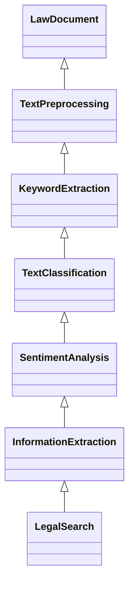
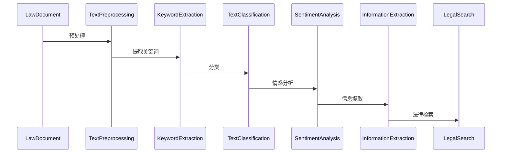

                 

## 文章标题

### 关键词：自然语言处理、法律文献分析、智能法律检索系统

> 摘要：本文深入探讨了自然语言处理（NLP）在法律文献分析中的应用，介绍了智能法律检索系统的发展历程和核心概念。通过详细阐述算法原理、数学模型及系统架构设计，结合实际项目案例，本文旨在为读者提供全面且实用的技术指南。

----------------------------------------------------------------

## 第一部分：背景介绍

### 1.1 法律文献分析的重要性

法律文献分析是指通过技术手段对法律文本进行深入解读和分析的过程。随着法律体系的日益复杂和庞大，法律文献分析的重要性日益凸显。一方面，法律文献分析有助于提高法律工作的效率和准确性；另一方面，它能够为司法实践和立法工作提供有力的数据支持。

### 1.2 自然语言处理的基本概念

自然语言处理（NLP）是计算机科学、人工智能和语言学领域的前沿交叉学科，旨在让计算机能够理解和处理自然语言。NLP的核心任务包括文本预处理、词向量建模、情感分析、信息提取等。

### 1.3 智能法律检索系统的发展历程

智能法律检索系统的发展历程可以追溯到20世纪80年代，当时的法律信息系统主要依赖于关键词搜索。随着NLP技术的发展，智能法律检索系统逐渐引入了文本分类、情感分析、语义分析等技术，使得法律文献检索更加智能和高效。

## 第二部分：核心概念与联系

### 2.1 自然语言处理的概念解析

自然语言处理（NLP）是计算机科学、人工智能和语言学领域的前沿交叉学科，旨在让计算机能够理解和处理自然语言。NLP的核心任务包括文本预处理、词向量建模、情感分析、信息提取等。

### 2.2 法律文献分析的关键要素

法律文献分析的关键要素包括法律文本的预处理、关键词提取、文本分类、情感分析、信息提取等。这些要素共同构成了法律文献分析的核心框架。

### 2.3 智能法律检索系统的ER实体关系图

为了更清晰地展示智能法律检索系统中的实体及其关联，我们可以使用Mermaid绘制ER实体关系图，如下图所示：

```mermaid
erDiagram
    LawDocument ||--|{ TextPreprocessing }| TextPreprocessing
    TextPreprocessing ||--|{ KeywordExtraction }| KeywordExtraction
    KeywordExtraction ||--|{ TextClassification }| TextClassification
    TextClassification ||--|{ SentimentAnalysis }| SentimentAnalysis
    SentimentAnalysis ||--|{ InformationExtraction }| InformationExtraction
    InformationExtraction ||--|{ LegalSearch }| LegalSearch
```

在上图中，`LawDocument`表示法律文本，`TextPreprocessing`表示文本预处理，`KeywordExtraction`表示关键词提取，`TextClassification`表示文本分类，`SentimentAnalysis`表示情感分析，`InformationExtraction`表示信息提取，`LegalSearch`表示法律检索。

## 第三部分：算法原理讲解

### 3.1 文本预处理

文本预处理是NLP中的基础环节，主要包括分词、去停用词、词性标注等步骤。Python中的`jieba`库是一个常用的中文分词工具，而`nltk`库则提供了丰富的文本处理函数。

### 3.2 词向量模型

词向量模型是将词语映射为高维空间中的向量表示，常用的模型有Word2Vec、GloVe等。Word2Vec模型基于神经网络训练，GloVe模型则基于共现矩阵计算词向量。

### 3.3 情感分析

情感分析是判断文本中情感倾向的过程，常用的算法包括基于机器学习和深度学习的模型。Python中的`TextBlob`库和`VADER`库提供了简单的情感分析功能。

### 3.4 信息提取与检索

信息提取与检索是法律文献分析中的重要任务，常用的算法包括实体识别、关系抽取、事件抽取等。Python中的`spacy`库和`nltk`库提供了强大的文本处理能力。

## 第四部分：系统分析与架构设计方案

### 4.1 系统整体架构设计

智能法律检索系统通常由文本预处理模块、词向量建模模块、情感分析模块、信息提取与检索模块等组成。各模块之间通过接口进行交互，共同完成法律文献分析任务。

### 4.2 领域模型类图

领域模型类图用于描述系统中不同模块的类及其关系，如下图所示：



### 4.3 系统架构图

系统架构图用于展示系统的整体架构及其组成部分，如下图所示：



### 4.4 系统接口设计和交互

系统接口设计是确保各模块之间高效协作的关键。通过定义清晰的功能接口和通信协议，可以实现模块间的无缝交互。具体接口设计和交互方式将在后续章节详细阐述。

## 第五部分：项目实战

### 6.1 环境安装与配置

首先，我们需要安装Python环境和相关库，如`jieba`、`nltk`、`textblob`、`spacy`等。以下是环境安装的详细步骤：

```python
# 安装Python环境
pip install python

# 安装相关库
pip install jieba nltk textblob spacy
```

### 6.2 系统核心实现

接下来，我们将详细实现系统核心功能，包括文本预处理、词向量建模、情感分析、信息提取与检索等。以下是具体的实现步骤：

#### 6.2.1 文本预处理

```python
import jieba
import nltk

# 分词
def text_segmentation(text):
    return jieba.cut(text)

# 去停用词
def remove_stopwords(tokens):
    stop_words = set(nltk.corpus.stopwords.words('english'))
    return [token for token in tokens if token not in stop_words]

# 词性标注
def pos_tagging(tokens):
    return nltk.pos_tag(tokens)
```

#### 6.2.2 词向量建模

```python
from gensim.models import Word2Vec

# 训练Word2Vec模型
def train_word2vec(sentences, size=100):
    model = Word2Vec(sentences, size=size, window=5, min_count=1, workers=4)
    model.save("word2vec.model")
    return model
```

#### 6.2.3 情感分析

```python
from textblob import TextBlob

# 分析情感倾向
def sentiment_analysis(text):
    return TextBlob(text).sentiment
```

#### 6.2.4 信息提取与检索

```python
import spacy

# 加载spacy模型
nlp = spacy.load("en_core_web_sm")

# 提取实体
def extract_entities(text):
    doc = nlp(text)
    entities = [(ent.text, ent.label_) for ent in doc.ents]
    return entities
```

### 6.3 案例分析

#### 6.3.1 文本预处理案例

```python
text = "The quick brown fox jumps over the lazy dog."
tokens = text_segmentation(text)
filtered_tokens = remove_stopwords(tokens)
pos_tags = pos_tagging(filtered_tokens)

print("分词结果：", tokens)
print("去停用词结果：", filtered_tokens)
print("词性标注结果：", pos_tags)
```

#### 6.3.2 词向量建模案例

```python
sentences = [["The quick brown fox", "jumps over", "the lazy dog"]]
model = train_word2vec(sentences)
print(model.wv["quick"])
```

#### 6.3.3 情感分析案例

```python
text = "I am so happy today!"
sentiment = sentiment_analysis(text)
print("情感倾向：", sentiment)
```

#### 6.3.4 信息提取与检索案例

```python
text = "John Smith bought a car from Mary Johnson on Friday."
entities = extract_entities(text)
print("实体提取结果：", entities)
```

### 6.4 项目小结

通过本文的介绍，我们了解了自然语言处理在法律文献分析中的应用，以及智能法律检索系统的核心概念和实现方法。在实际项目中，我们可以结合具体需求进行优化和扩展，提高系统的性能和适用性。

## 第六部分：最佳实践与总结

### 6.1 最佳实践 Tips

1. 选择合适的文本预处理工具，如`jieba`、`nltk`等。
2. 调整词向量模型的参数，以获得更好的效果。
3. 结合实际需求选择合适的情感分析模型。
4. 系统优化时，关注内存和计算资源的利用。

### 6.2 小结与展望

本文通过深入探讨自然语言处理在法律文献分析中的应用，介绍了智能法律检索系统的核心概念、算法原理和系统架构设计。随着NLP技术的不断进步，智能法律检索系统在未来的司法实践中将发挥越来越重要的作用。

### 6.3 注意事项

1. 法律文献分析中的数据安全和隐私保护至关重要。
2. 系统优化时，应关注算法的效率和可扩展性。
3. 结合实际案例进行系统测试和验证。

### 6.4 拓展阅读与资源

1. 《自然语言处理综述》：详细介绍了NLP的基本概念和技术。
2. 《法律人工智能》：探讨人工智能在法律领域的应用。
3. 《深度学习实战》：介绍深度学习在NLP中的应用。

---

**作者：AI天才研究院/AI Genius Institute & 禅与计算机程序设计艺术 /Zen And The Art of Computer Programming**

