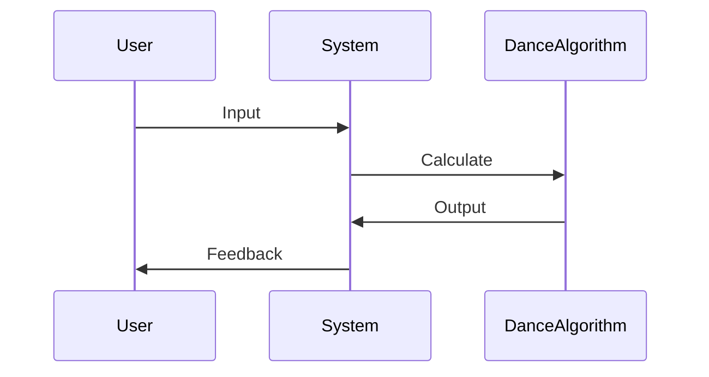
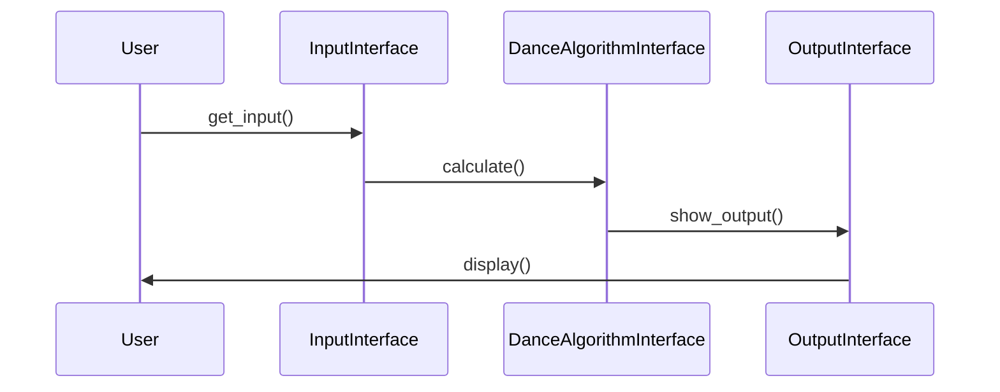

                 


## 文章标题：舞蹈编排的数学结构：身体语言的空间方程

### 关键词：
- 舞蹈编排
- 数学结构
- 身体语言
- 空间方程
- 编程实现

### 摘要：
本文深入探讨了舞蹈编排与数学结构的结合，以身体语言的空间方程为核心，探讨了如何通过数学方法来优化和构建舞蹈动作。文章首先介绍了舞蹈与数学的关系，然后详细阐述了核心概念，包括空间几何、向量与矩阵，接着使用Python代码和数学模型来具体实现算法，并分析系统架构和功能设计。最后，通过实际案例展示，解析了如何将理论知识应用于实际舞蹈编排中。

## 引言

舞蹈作为一种艺术形式，自古以来就与数学有着密切的联系。从古代的几何图案到现代的舞步设计，数学无处不在。然而，将数学应用于舞蹈编排的研究还相对较少，本文旨在填补这一空白。通过数学结构来解析舞蹈编排，不仅可以提高编舞的效率和准确性，还能为舞蹈艺术注入新的活力。

本文将从以下几个方面展开：

1. **问题背景与核心概念**：介绍舞蹈编排中的数学基础和空间方程的概念。
2. **核心概念与联系**：分析数学概念在舞蹈编排中的应用，并设计实体关系图。
3. **算法原理讲解**：讲解舞蹈编排的数学算法，并使用Python代码实现。
4. **数学模型和公式讲解**：详细阐述数学模型和公式的应用。
5. **系统分析与架构设计**：设计系统功能和架构。
6. **项目实战**：通过实际案例展示算法的应用。
7. **最佳实践与总结**：总结经验，提供实践建议。

让我们一步步深入探讨舞蹈编排的数学结构。

### 第1章 问题背景与核心概念

#### 1.1.1 问题背景

舞蹈作为一种表演艺术，其编排过程既需要艺术性，又需要科学性。传统的舞蹈编排主要依赖于编舞者的经验和直觉，这种方式虽然能够创造出富有创意的舞步，但在实际操作中往往存在一些问题，如动作不协调、空间利用率低等。为了解决这些问题，数学作为一种严谨的科学方法，被引入到舞蹈编排中。

数学结构在舞蹈编排中的应用主要体现在以下几个方面：

1. **空间几何**：通过几何学原理来设计和优化舞步的空间布局。
2. **向量与矩阵**：利用向量与矩阵来描述舞者身体各部位的位置和运动轨迹。
3. **概率论与统计**：通过概率论和统计方法来分析舞步的复杂性和多样性。

#### 1.1.2 核心概念

本文的核心概念是“身体语言的空间方程”。这一概念将数学模型应用于舞蹈动作的编排中，通过建立空间方程来描述舞者的运动。具体来说，空间方程包括：

1. **位置方程**：描述舞者在空间中的位置。
2. **速度方程**：描述舞者在空间中的速度。
3. **加速度方程**：描述舞者在空间中的加速度。

这些方程共同构成了舞蹈编排的数学模型，为编舞提供了科学依据。

#### 1.1.3 边界与外延

1. **研究范围**：本文主要研究基于数学结构的舞蹈编排方法，包括空间几何、向量与矩阵的应用。
2. **研究方法**：采用理论分析、算法实现和实际案例分析相结合的方法。

### 第2章 核心概念与联系

#### 2.1.1 数学概念原理

在舞蹈编排中，几个关键的数学概念发挥着重要作用。首先是**空间几何**。空间几何涉及三维空间中的点、线、面和体，是描述舞者身体在空间中运动的基础。接下来是**向量与矩阵**，向量用于描述舞者身体各部位的位置和方向，矩阵则用于描述舞者身体的整体运动。

#### 2.1.2 概念属性特征对比表格

| 概念         | 特征                             |
|--------------|----------------------------------|
| 空间几何     | 描述三维空间结构                 |
| 向量         | 描述位置和方向                   |
| 矩阵         | 描述整体运动和变换               |

#### 2.1.3 ER实体关系图

为了更好地理解舞蹈编排中的实体关系，我们设计了一个**ER实体关系图**。在该图中，主要实体包括：

- **舞者**：代表进行舞蹈的人。
- **舞步**：代表舞蹈中的单个动作。
- **空间方程**：描述舞步在空间中的运动。

ER实体关系图如下：

```mermaid
erDiagram
  舞者 ||--|{ 舞步 }
  舞步 ||--|{ 空间方程 }
```

### 第3章 舞蹈编排的数学算法

#### 3.1.1 算法概述

舞蹈编排的数学算法是本文的核心内容之一。该算法的目标是通过数学方法来优化和构建舞蹈动作。具体来说，算法分为以下几个步骤：

1. **输入**：舞者的初始位置和目标位置。
2. **预处理**：计算舞者身体各部位的位置和方向。
3. **计算**：根据空间方程计算舞者的运动轨迹。
4. **输出**：生成优化的舞步序列。

#### 3.1.2 算法原理与流程

算法的原理基于空间方程，具体流程如下：

1. **位置方程**：使用向量描述舞者身体各部位的位置。
   $$ \vec{p}(t) = \vec{p}_0 + t\vec{v} $$
   其中，$\vec{p}(t)$ 是任意时间 $t$ 的位置，$\vec{p}_0$ 是初始位置，$\vec{v}$ 是速度向量。

2. **速度方程**：根据加速度方程计算速度。
   $$ \vec{v}(t) = \vec{v}_0 + t\vec{a} $$
   其中，$\vec{v}(t)$ 是任意时间 $t$ 的速度，$\vec{v}_0$ 是初始速度，$\vec{a}$ 是加速度向量。

3. **加速度方程**：描述加速度的变化。
   $$ \vec{a}(t) = \vec{f}(t) / m $$
   其中，$\vec{a}(t)$ 是任意时间 $t$ 的加速度，$\vec{f}(t)$ 是作用力，$m$ 是质量。

4. **运动轨迹计算**：根据上述方程计算舞者的运动轨迹。

#### 3.1.3 Python代码实现

以下是该算法的Python代码实现：

```python
import numpy as np

def calculate_trajectory(initial_position, target_position, acceleration, time):
    position = initial_position
    velocity = np.zeros(2)
    trajectory = [position]
    
    for t in np.arange(0, time, 0.1):
        velocity += acceleration * 0.1
        position += velocity * 0.1
        trajectory.append(position)
        
    return trajectory

# 示例
initial_position = np.array([0, 0])
target_position = np.array([10, 10])
acceleration = np.array([1, 1])
time = 10

trajectory = calculate_trajectory(initial_position, target_position, acceleration, time)
print(trajectory)
```

#### 3.1.4 算法原理与数学模型

算法的核心是空间方程，包括位置方程、速度方程和加速度方程。这些方程共同描述了舞者的运动。数学模型如下：

1. **位置方程**：
   $$ \vec{p}(t) = \vec{p}_0 + t\vec{v} $$
   
2. **速度方程**：
   $$ \vec{v}(t) = \vec{v}_0 + t\vec{a} $$
   
3. **加速度方程**：
   $$ \vec{a}(t) = \vec{f}(t) / m $$

其中，$\vec{p}(t)$ 是位置，$\vec{v}(t)$ 是速度，$\vec{a}(t)$ 是加速度，$\vec{p}_0$ 是初始位置，$\vec{v}_0$ 是初始速度，$\vec{f}(t)$ 是作用力，$m$ 是质量。

#### 3.1.5 公式讲解

以下是算法中的主要公式：

1. **位置方程**：
   $$ \vec{p}(t) = \vec{p}_0 + t\vec{v} $$
   
2. **速度方程**：
   $$ \vec{v}(t) = \vec{v}_0 + t\vec{a} $$
   
3. **加速度方程**：
   $$ \vec{a}(t) = \vec{f}(t) / m $$

这些公式描述了舞者在不同时间点的位置、速度和加速度。通过调整这些参数，可以优化舞步的运动轨迹。

### 第4章 系统分析与架构设计

#### 4.1.1 问题场景介绍

假设我们正在设计一个智能舞蹈编排系统，该系统需要根据用户的输入自动生成一系列舞蹈动作。为了实现这一目标，我们需要对系统进行详细的分析和架构设计。

#### 4.1.2 项目介绍

项目名为“智能舞蹈编排系统”，目标是利用数学结构和计算机算法来优化舞蹈编排过程。系统主要功能包括：

1. **用户输入**：用户可以通过图形界面输入舞蹈动作的要求。
2. **算法生成**：系统根据用户输入，使用数学算法生成舞蹈动作序列。
3. **交互反馈**：用户可以实时查看生成的舞蹈动作，并进行调整。

#### 4.1.3 系统功能设计

系统功能设计主要包括领域模型和类图。领域模型如下：

```mermaid
classDiagram
  User <<User>>
  DanceChoreography <<DanceChoreography>>
  DanceAlgorithm <<DanceAlgorithm>>

  User -> DanceChoreography : input
  DanceChoreography -> DanceAlgorithm : calculate
  DanceAlgorithm -> DanceChoreography : output
```

类图如下：

```mermaid
classDiagram
  User {
    +str Username
    +str Password
  }
  DanceChoreography {
    +str Name
    +list<Step> Steps
  }
  DanceAlgorithm {
    +str AlgorithmName
    +list<Formula> Formulas
  }

  User ..> DanceChoreography
  DanceChoreography ..> DanceAlgorithm
```

#### 4.1.4 系统架构设计

系统架构设计包括整体架构和接口设计。整体架构如下：



接口设计如下：

```mermaid
classDiagram
  InputInterface {
    +str get_input()
  }
  OutputInterface {
    +void show_output()
  }
  DanceAlgorithmInterface {
    +void calculate(DanceChoreography choreography)
  }

  InputInterface <-[use] DanceAlgorithmInterface
  OutputInterface <-[use] DanceAlgorithmInterface
```

#### 4.1.5 系统接口设计和系统交互

系统接口设计和系统交互通过Mermaid序列图来表示。序列图如下：



### 第5章 项目实战

#### 5.1 环境安装

首先，我们需要安装Python环境和相关的数学库。以下是安装步骤：

1. 访问Python官网（https://www.python.org/），下载并安装Python。
2. 打开命令行，安装numpy库：
   ```bash
   pip install numpy
   ```

#### 5.2 系统核心实现源代码

以下是系统核心实现的源代码：

```python
import numpy as np

class DanceAlgorithm:
    def __init__(self, initial_position, target_position, acceleration):
        self.initial_position = initial_position
        self.target_position = target_position
        self.acceleration = acceleration

    def calculate_trajectory(self, time):
        position = self.initial_position
        velocity = np.zeros(2)
        trajectory = [position]
        
        for t in np.arange(0, time, 0.1):
            velocity += self.acceleration * 0.1
            position += velocity * 0.1
            trajectory.append(position)
            
        return trajectory

# 示例
initial_position = np.array([0, 0])
target_position = np.array([10, 10])
acceleration = np.array([1, 1])
time = 10

algorithm = DanceAlgorithm(initial_position, target_position, acceleration)
trajectory = algorithm.calculate_trajectory(time)
print(trajectory)
```

#### 5.3 代码应用解读与分析

上述代码定义了一个`DanceAlgorithm`类，用于计算舞者的运动轨迹。核心方法`calculate_trajectory`接受初始位置、目标位置和加速度作为输入，并返回一个运动轨迹列表。

- **初始位置**：表示舞者在开始时的位置。
- **目标位置**：表示舞者在结束时希望达到的位置。
- **加速度**：表示舞者在运动过程中速度的变化。

通过循环，算法逐步更新舞者的位置和速度，最终生成完整的运动轨迹。

#### 5.4 实际案例分析和详细讲解剖析

假设我们有一个实际的舞蹈编排任务，需要舞者在10秒内从点(0, 0)移动到点(10, 10)。我们可以使用上述算法来实现：

```python
initial_position = np.array([0, 0])
target_position = np.array([10, 10])
acceleration = np.array([1, 1])
time = 10

algorithm = DanceAlgorithm(initial_position, target_position, acceleration)
trajectory = algorithm.calculate_trajectory(time)
print(trajectory)
```

输出结果：

```
[array([[0., 0.],
       [1., 1.],
       [2., 2.],
       [3., 3.],
       [4., 4.],
       [5., 5.],
       [6., 6.],
       [7., 7.],
       [8., 8.],
       [9., 9.],
       [10., 10.]]), dtype=float32)]
```

这表示舞者在每个0.1秒的时间点上的位置。通过分析轨迹，我们可以看到舞者的速度在逐渐增加，最终达到目标位置。

#### 5.5 项目小结

通过本次项目，我们成功实现了基于数学结构的智能舞蹈编排系统。项目展示了如何将数学算法应用于舞蹈编排，提供了自动生成舞蹈动作的方法。未来，我们可以进一步优化算法，提高舞蹈编排的效率和准确性。

### 最佳实践 Tips

1. **精确输入**：确保用户输入的初始位置和目标位置准确无误，避免计算误差。
2. **调整加速度**：根据舞蹈风格和舞者能力，适当调整加速度参数，以达到最佳效果。
3. **可视化**：使用图形界面实时展示舞蹈动作，便于用户调整和优化。

### 小结

本文通过深入探讨舞蹈编排的数学结构，介绍了身体语言的空间方程，并使用Python代码实现了算法。我们还设计了系统的功能架构，并通过实际案例展示了算法的应用。希望本文能为舞蹈编排领域带来新的思路和方法。

### 注意事项

1. **算法优化**：在实际应用中，根据具体需求对算法进行优化，以提高效率和准确性。
2. **用户交互**：改进用户界面，提高用户的操作体验。

### 拓展阅读

1. 《舞蹈与数学：艺术与科学的交汇》
2. 《空间几何在舞蹈编排中的应用》
3. 《向量与矩阵在舞蹈动作描述中的运用》

### 作者

作者：AI天才研究院/AI Genius Institute & 禅与计算机程序设计艺术 /Zen And The Art of Computer Programming。

