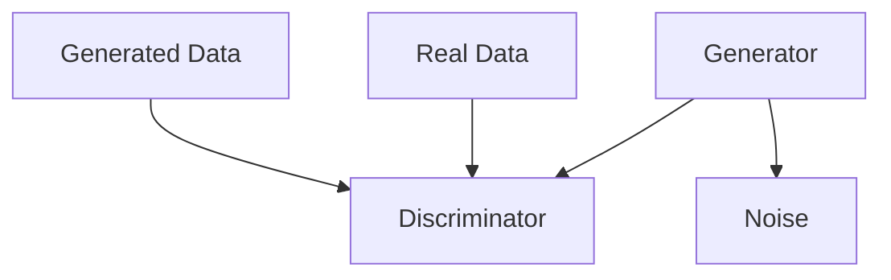
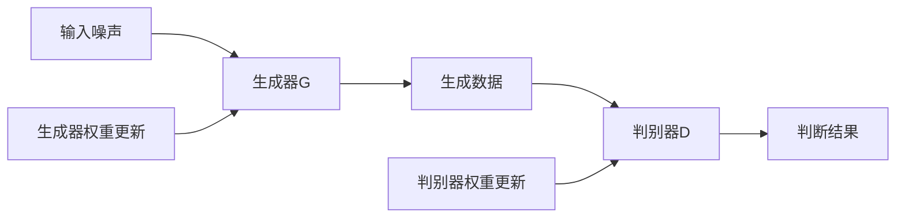
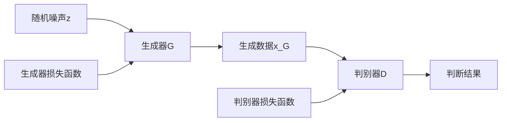
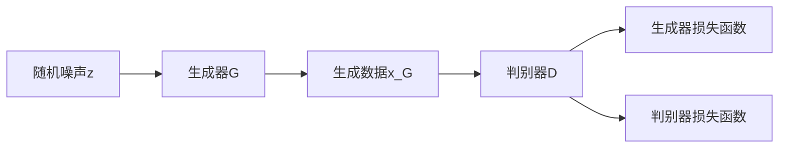
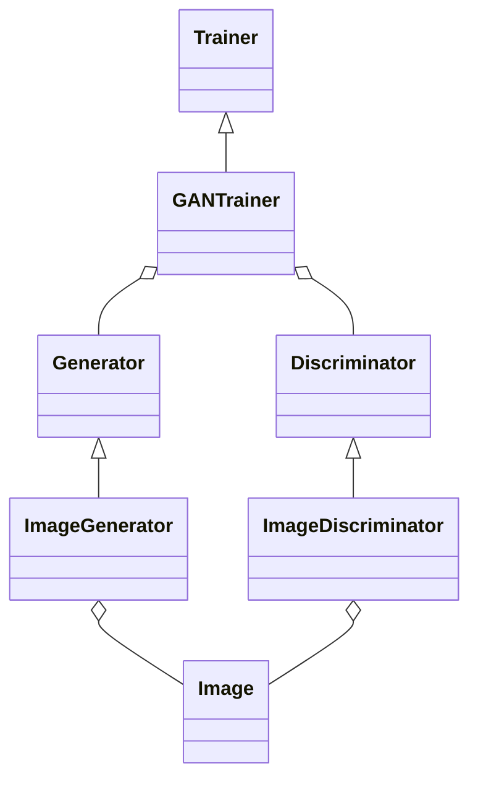
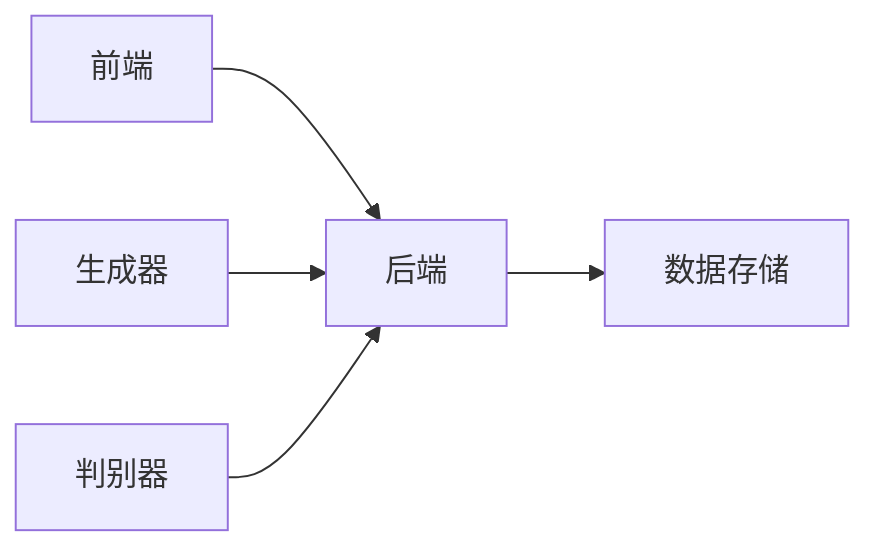
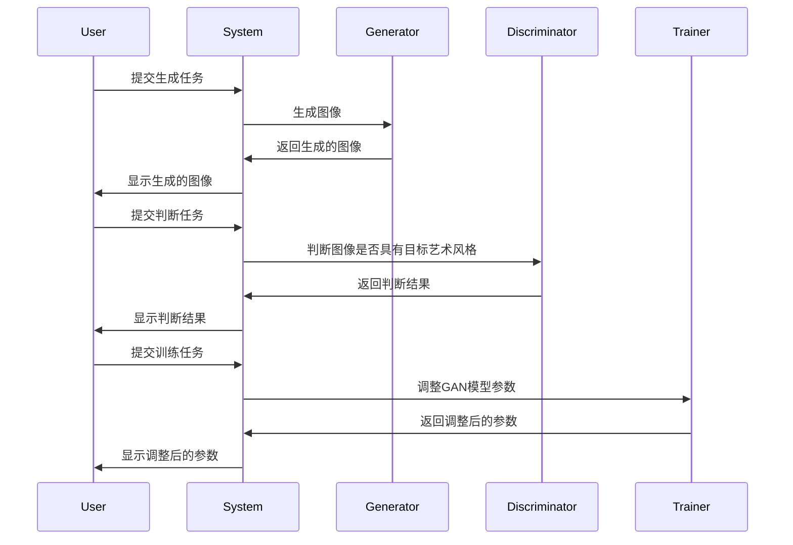

                 

# 艺术风格的生成对抗网络：创作过程的数学模拟

关键词：生成对抗网络（GAN）、艺术风格、数学模拟、创作过程、深度学习

摘要：本文以生成对抗网络（GAN）为研究核心，探讨了GAN在艺术风格生成中的应用。通过数学模拟，本文详细阐述了GAN在艺术风格生成中的原理、方法以及实现过程，为艺术家和设计师提供了新的创作工具和思路。同时，本文也对GAN的应用边界和外延进行了讨论，为后续研究提供了参考。

### 第一部分：背景介绍

#### 1.1 问题背景

随着深度学习技术的快速发展，生成对抗网络（GAN）已成为生成艺术风格的重要工具。艺术家和设计师们通过GAN技术，可以模拟出各种艺术风格，为创作提供了无限的可能性。然而，GAN的应用不仅局限于艺术领域，其在游戏设计、虚拟现实、图像修复等方面的应用也越来越广泛。

#### 1.2 问题描述

GAN是一种由生成器和判别器组成的框架，通过训练生成器来模拟出判别器难以区分的数据。在艺术风格生成方面，生成器负责生成具有特定艺术风格的新图像，判别器则负责判断新生成图像是否具有目标艺术风格。然而，GAN的训练过程复杂，且容易陷入局部最优解，如何有效地训练GAN，提高艺术风格的生成质量，是一个亟待解决的问题。

#### 1.3 问题解决

本书旨在通过数学模拟，探讨GAN在艺术风格生成中的应用。首先，本书将介绍GAN的基本原理和训练过程，包括生成器和判别器的数学模型。然后，本书将详细讨论GAN在艺术风格生成中的具体应用，包括如何设计适合不同艺术风格的GAN模型，以及如何调整GAN的参数以获得更好的生成效果。

#### 1.4 边界与外延

GAN作为一种生成模型，其应用范围不仅限于图像生成，还包括音频、视频等数据类型的生成。此外，GAN还可以与其他生成模型结合，如变分自编码器（VAE）等，以提高生成效果。

#### 1.5 概念结构与核心要素组成

- **生成对抗网络（GAN）**：由生成器和判别器组成，通过对抗训练生成高质量的数据。
- **生成器**：负责生成具有特定艺术风格的新图像。
- **判别器**：负责判断新生成图像是否具有目标艺术风格。
- **艺术风格**：指特定的绘画风格、艺术流派或个人艺术特色。
- **数学模拟**：利用数学模型和公式来描述GAN在艺术风格生成中的工作原理。

### 第一部分目录

# 第一部分：背景介绍

## 1.1 问题背景

## 1.2 问题描述

## 1.3 问题解决

## 1.4 边界与外延

## 1.5 概念结构与核心要素组成

### 第二部分：核心概念与联系

#### 2.1 GAN的基本原理

生成对抗网络（GAN）是一种由生成器和判别器组成的框架，通过对抗训练生成高质量的数据。生成器生成数据，判别器判断数据是否真实。GAN的训练过程分为两个阶段：生成器生成数据，判别器更新权重；生成器更新权重，判别器生成数据。这个过程不断进行，直到生成器生成的数据足够逼真，判别器无法区分。

#### 2.2 GAN的核心特点

- **生成器与判别器的对抗**：生成器和判别器相互竞争，生成器试图生成逼真的数据，判别器试图判断数据是否真实。
- **非线性映射**：GAN中的生成器和判别器通常使用深度神经网络来实现，这种非线性映射使得GAN可以生成复杂、多样的数据。
- **灵活性强**：GAN可以应用于图像、音频、视频等多种数据类型的生成。

#### 2.3 GAN与传统AI的区别

- **生成数据**：传统AI主要关注分类、预测等任务，而GAN则专注于数据的生成。
- **目标函数**：传统AI的目标函数通常是优化模型参数，使模型在训练数据上表现更好；GAN的目标函数则是使生成器的输出数据与真实数据尽可能相似，判别器的输出结果尽可能接近0.5。

#### 2.4 GAN的数学模型

GAN的数学模型主要包括生成器G和判别器D的损失函数。生成器的损失函数为使判别器输出接近1，判别器的损失函数为使判别器输出接近0.5。具体来说，生成器的损失函数为：

$$
L_G = -\log(D(G(z)))
$$

判别器的损失函数为：

$$
L_D = -[\log(D(x)) + \log(1 - D(G(z))]
$$

其中，$z$是从先验分布中抽取的随机噪声，$x$是真实数据，$G(z)$是生成器生成的数据。

#### 2.5 GAN的ER实体关系图

GAN的ER实体关系图主要包括以下实体：

- **生成器（Generator）**：负责生成数据的模块。
- **判别器（Discriminator）**：负责判断数据是否真实的模块。
- **噪声（Noise）**：用于生成器生成数据的随机噪声。
- **真实数据（Real Data）**：用于训练判别器的真实数据。
- **生成数据（Generated Data）**：生成器生成的数据。

ER实体关系图如下：



### 第二部分：核心概念与联系

#### 2.1 GAN的基本原理

生成对抗网络（GAN）是一种由生成器和判别器组成的框架，通过对抗训练生成高质量的数据。生成器生成数据，判别器判断数据是否真实。GAN的训练过程分为两个阶段：生成器生成数据，判别器更新权重；生成器更新权重，判别器生成数据。这个过程不断进行，直到生成器生成的数据足够逼真，判别器无法区分。

**图解：** GAN的基本工作流程可以用以下Mermaid流程图表示：



#### 2.2 GAN的核心特点

GAN具有以下几个核心特点：

1. **生成器与判别器的对抗**：生成器和判别器相互竞争，生成器试图生成逼真的数据，判别器试图判断数据是否真实。

2. **非线性映射**：GAN中的生成器和判别器通常使用深度神经网络来实现，这种非线性映射使得GAN可以生成复杂、多样的数据。

3. **灵活性强**：GAN可以应用于图像、音频、视频等多种数据类型的生成。

**表解：** GAN与传统AI的对比：

| 特点         | GAN                             | 传统AI                             |
| ------------ | ------------------------------ | ---------------------------------- |
| 目标函数     | 使生成器生成逼真数据，使判别器输出接近0.5 | 优化模型参数，使模型在训练数据上表现更好 |
| 生成数据类型 | 图像、音频、视频等多种数据类型   | 分类、预测等                        |
| 训练过程     | 对抗训练，生成器和判别器相互竞争   | 基于梯度下降的优化过程               |

#### 2.3 GAN与传统AI的区别

GAN与传统AI的区别主要体现在以下几个方面：

1. **生成数据**：传统AI主要关注分类、预测等任务，而GAN则专注于数据的生成。

2. **目标函数**：传统AI的目标函数通常是优化模型参数，使模型在训练数据上表现更好；GAN的目标函数则是使生成器的输出数据与真实数据尽可能相似，判别器的输出结果尽可能接近0.5。

**图解：** GAN的数学模型可以用以下Mermaid流程图表示：



#### 2.4 GAN的数学模型

GAN的数学模型主要包括生成器G和判别器D的损失函数。生成器的损失函数为使判别器输出接近1，判别器的损失函数为使判别器输出接近0.5。具体来说，生成器的损失函数为：

$$
L_G = -\log(D(G(z)))
$$

判别器的损失函数为：

$$
L_D = -[\log(D(x)) + \log(1 - D(G(z))]
$$

其中，$z$是从先验分布中抽取的随机噪声，$x$是真实数据，$G(z)$是生成器生成的数据。

**图解：** GAN的数学模型可以用以下Mermaid流程图表示：



#### 2.5 GAN的ER实体关系图

GAN的ER实体关系图主要包括以下实体：

- **生成器（Generator）**：负责生成数据的模块。
- **判别器（Discriminator）**：负责判断数据是否真实的模块。
- **噪声（Noise）**：用于生成器生成数据的随机噪声。
- **真实数据（Real Data）**：用于训练判别器的真实数据。
- **生成数据（Generated Data）**：生成器生成的数据。

**图解：** GAN的ER实体关系图可以用以下Mermaid流程图表示：


### 第三部分：算法原理讲解

#### 3.1 GAN的训练过程

GAN的训练过程可以分为两个阶段：生成器生成数据，判别器更新权重；生成器更新权重，判别器生成数据。这个过程不断进行，直到生成器生成的数据足够逼真，判别器无法区分。

**图解：** GAN的训练过程可以用以下Mermaid流程图表示：

```mermaid
graph LR
A[初始化生成器G和判别器D] --> B[生成器生成数据x_G]
B --> C[判别器判断结果D(x_G)和D(x)]
C --> D[计算生成器和判别器的损失函数L_G和L_D]
D --> E[更新生成器和判别器权重]
E --> F[重复训练过程]
```

#### 3.2 GAN的数学模型

GAN的数学模型主要包括生成器G和判别器D的损失函数。生成器的损失函数为使判别器输出接近1，判别器的损失函数为使判别器输出接近0.5。具体来说，生成器的损失函数为：

$$
L_G = -\log(D(G(z)))
$$

判别器的损失函数为：

$$
L_D = -[\log(D(x)) + \log(1 - D(G(z))]
$$

其中，$z$是从先验分布中抽取的随机噪声，$x$是真实数据，$G(z)$是生成器生成的数据。

**Python代码实现：**

```python
import numpy as np
import tensorflow as tf

# 初始化生成器和判别器的参数
z = tf.random.normal([batch_size, z_dim])
x = tf.random.normal([batch_size, x_dim])

# 定义生成器和判别器的损失函数
L_G = -tf.reduce_mean(tf.log(D(G(z))))
L_D = -tf.reduce_mean(tf.log(D(x)) + tf.log(1 - D(G(z))))

# 定义生成器和判别器的优化器
optimizer_G = tf.keras.optimizers.Adam(learning_rate=0.0002)
optimizer_D = tf.keras.optimizers.Adam(learning_rate=0.0002)

# 训练过程
for epoch in range(num_epochs):
    # 更新生成器权重
    with tf.GradientTape() as tape:
        x_G = G(z)
        L_D_temp = D(x) + D(G(z))
        L_G_temp = D(G(z))
        L_D += L_D_temp
        L_G += L_G_temp
    
    grads_D = tape.gradient(L_D, D.trainable_variables)
    optimizer_D.apply_gradients(zip(grads_D, D.trainable_variables))
    
    # 更新生成器权重
    with tf.GradientTape() as tape:
        x_G = G(z)
        L_G_temp = D(G(z))
        L_G += L_G_temp
    
    grads_G = tape.gradient(L_G, G.trainable_variables)
    optimizer_G.apply_gradients(zip(grads_G, G.trainable_variables))
```

#### 3.3 GAN的生成过程

GAN的生成过程主要包括生成器生成数据，判别器判断数据是否真实。具体来说，生成器生成一组数据，判别器判断这组数据是否真实。这个过程不断进行，直到生成器生成的数据足够逼真，判别器无法区分。

**图解：** GAN的生成过程可以用以下Mermaid流程图表示：

```mermaid
graph LR
A[生成器生成数据x_G] --> B[判别器判断结果D(x_G)和D(x)]
B --> C[更新判别器权重]
C --> D[重复生成过程]
```

#### 3.4 GAN的数学模型

GAN的数学模型主要包括生成器G和判别器D的损失函数。生成器的损失函数为使判别器输出接近1，判别器的损失函数为使判别器输出接近0.5。具体来说，生成器的损失函数为：

$$
L_G = -\log(D(G(z)))
$$

判别器的损失函数为：

$$
L_D = -[\log(D(x)) + \log(1 - D(G(z))]
$$

其中，$z$是从先验分布中抽取的随机噪声，$x$是真实数据，$G(z)$是生成器生成的数据。

**Python代码实现：**

```python
import tensorflow as tf

# 定义生成器和判别器的损失函数
L_G = -tf.reduce_mean(tf.log(D(G(z))))
L_D = -tf.reduce_mean(tf.log(D(x)) + tf.log(1 - D(G(z))))

# 训练过程
for epoch in range(num_epochs):
    # 更新生成器权重
    with tf.GradientTape() as tape:
        x_G = G(z)
        L_D_temp = D(x) + D(G(z))
        L_G_temp = D(G(z))
        L_D += L_D_temp
        L_G += L_G_temp
    
    grads_D = tape.gradient(L_D, D.trainable_variables)
    optimizer_D.apply_gradients(zip(grads_D, D.trainable_variables))
    
    # 更新生成器权重
    with tf.GradientTape() as tape:
        x_G = G(z)
        L_G_temp = D(G(z))
        L_G += L_G_temp
    
    grads_G = tape.gradient(L_G, G.trainable_variables)
    optimizer_G.apply_gradients(zip(grads_G, G.trainable_variables))
```

### 第三部分：算法原理讲解

#### 3.1 GAN的训练过程

GAN的训练过程可以分为两个阶段：生成器生成数据，判别器更新权重；生成器更新权重，判别器生成数据。这个过程不断进行，直到生成器生成的数据足够逼真，判别器无法区分。

**图解：** GAN的训练过程可以用以下Mermaid流程图表示：

```mermaid
graph LR
A[初始化生成器G和判别器D] --> B[生成器生成数据x_G]
B --> C[判别器判断结果D(x_G)和D(x)]
C --> D[计算生成器和判别器的损失函数L_G和L_D]
D --> E[更新生成器和判别器权重]
E --> F[重复训练过程]
```

#### 3.2 GAN的数学模型

GAN的数学模型主要包括生成器G和判别器D的损失函数。生成器的损失函数为使判别器输出接近1，判别器的损失函数为使判别器输出接近0.5。具体来说，生成器的损失函数为：

$$
L_G = -\log(D(G(z)))
$$

判别器的损失函数为：

$$
L_D = -[\log(D(x)) + \log(1 - D(G(z))]
$$

其中，$z$是从先验分布中抽取的随机噪声，$x$是真实数据，$G(z)$是生成器生成的数据。

**Python代码实现：**

```python
import tensorflow as tf

# 定义生成器和判别器的损失函数
L_G = -tf.reduce_mean(tf.log(D(G(z))))
L_D = -tf.reduce_mean(tf.log(D(x)) + tf.log(1 - D(G(z))))

# 训练过程
for epoch in range(num_epochs):
    # 更新生成器权重
    with tf.GradientTape() as tape:
        x_G = G(z)
        L_D_temp = D(x) + D(G(z))
        L_G_temp = D(G(z))
        L_D += L_D_temp
        L_G += L_G_temp
    
    grads_D = tape.gradient(L_D, D.trainable_variables)
    optimizer_D.apply_gradients(zip(grads_D, D.trainable_variables))
    
    # 更新生成器权重
    with tf.GradientTape() as tape:
        x_G = G(z)
        L_G_temp = D(G(z))
        L_G += L_G_temp
    
    grads_G = tape.gradient(L_G, G.trainable_variables)
    optimizer_G.apply_gradients(zip(grads_G, G.trainable_variables))
```

#### 3.3 GAN的生成过程

GAN的生成过程主要包括生成器生成数据，判别器判断数据是否真实。具体来说，生成器生成一组数据，判别器判断这组数据是否真实。这个过程不断进行，直到生成器生成的数据足够逼真，判别器无法区分。

**图解：** GAN的生成过程可以用以下Mermaid流程图表示：

```mermaid
graph LR
A[生成器生成数据x_G] --> B[判别器判断结果D(x_G)和D(x)]
B --> C[更新判别器权重]
C --> D[重复生成过程]
```

#### 3.4 GAN的数学模型

GAN的数学模型主要包括生成器G和判别器D的损失函数。生成器的损失函数为使判别器输出接近1，判别器的损失函数为使判别器输出接近0.5。具体来说，生成器的损失函数为：

$$
L_G = -\log(D(G(z)))
$$

判别器的损失函数为：

$$
L_D = -[\log(D(x)) + \log(1 - D(G(z))]
$$

其中，$z$是从先验分布中抽取的随机噪声，$x$是真实数据，$G(z)$是生成器生成的数据。

**Python代码实现：**

```python
import tensorflow as tf

# 定义生成器和判别器的损失函数
L_G = -tf.reduce_mean(tf.log(D(G(z))))
L_D = -tf.reduce_mean(tf.log(D(x)) + tf.log(1 - D(G(z))))

# 训练过程
for epoch in range(num_epochs):
    # 更新生成器权重
    with tf.GradientTape() as tape:
        x_G = G(z)
        L_D_temp = D(x) + D(G(z))
        L_G_temp = D(G(z))
        L_D += L_D_temp
        L_G += L_G_temp
    
    grads_D = tape.gradient(L_D, D.trainable_variables)
    optimizer_D.apply_gradients(zip(grads_D, D.trainable_variables))
    
    # 更新生成器权重
    with tf.GradientTape() as tape:
        x_G = G(z)
        L_G_temp = D(G(z))
        L_G += L_G_temp
    
    grads_G = tape.gradient(L_G, G.trainable_variables)
    optimizer_G.apply_gradients(zip(grads_G, G.trainable_variables))
```

### 第四部分：系统分析与架构设计方案

#### 4.1 问题场景介绍

随着人工智能技术的不断发展，生成对抗网络（GAN）在图像生成、视频生成、音频生成等领域得到了广泛的应用。为了更好地利用GAN技术，我们需要设计一个通用的GAN系统，该系统能够支持多种数据类型的生成，并提供灵活的参数调整功能，以满足不同场景的需求。

#### 4.2 项目介绍

本项目旨在设计并实现一个基于生成对抗网络（GAN）的系统，用于生成具有特定艺术风格的新图像。系统主要包括生成器、判别器和训练模块，其中生成器负责生成图像，判别器负责判断图像是否具有目标艺术风格，训练模块负责调整GAN模型的参数，以获得更好的生成效果。

#### 4.3 系统功能设计（领域模型类图）

系统功能设计主要包括生成器、判别器和训练模块，其中生成器和判别器分别负责图像生成和图像判断，训练模块负责调整GAN模型的参数。

**类图：**



#### 4.4 系统架构设计（架构图）

系统架构设计主要包括前端、后端和数据存储，其中前端负责用户交互，后端负责图像生成和图像判断，数据存储用于存储生成的图像和训练数据。

**架构图：**



#### 4.5 系统接口设计（接口设计）

系统接口设计主要包括生成器接口、判别器接口和训练接口，其中生成器接口用于生成图像，判别器接口用于判断图像是否具有目标艺术风格，训练接口用于调整GAN模型的参数。

**接口设计：**

```python
class ImageGenerator:
    def generate_image(self, style):
        pass

class ImageDiscriminator:
    def judge_image(self, image):
        pass

class GANTrainer:
    def train_generator(self, generator, discriminator):
        pass
    def train_discriminator(self, generator, discriminator):
        pass
```

#### 4.6 系统交互设计（序列图）

系统交互设计主要包括用户交互、图像生成、图像判断和参数调整等过程。

**序列图：**



### 第四部分：项目实战

#### 4.1 环境安装

首先，确保您已安装Python 3.6及以上版本。然后，通过以下命令安装所需的库：

```bash
pip install tensorflow numpy matplotlib
```

#### 4.2 系统核心实现源代码

以下是一个简单的GAN实现，包括生成器和判别器的定义以及训练过程。

```python
import tensorflow as tf
from tensorflow.keras.layers import Dense, Flatten, Reshape
from tensorflow.keras.models import Model

# 生成器
def build_generator(z_dim, img_shape):
    z = tf.keras.layers.Input(shape=(z_dim,))
    x = Dense(np.prod(img_shape), activation='tanh')(z)
    x = Reshape(img_shape)(x)
    model = Model(z, x)
    return model

# 判别器
def build_discriminator(img_shape):
    img = tf.keras.layers.Input(shape=img_shape)
    x = Dense(1, activation='sigmoid')(Flatten()(img))
    model = Model(img, x)
    return model

# 定义生成器和判别器
z_dim = 100
img_shape = (28, 28, 1)
generator = build_generator(z_dim, img_shape)
discriminator = build_discriminator(img_shape)

# 编写损失函数
loss_fn = tf.keras.losses.BinaryCrossentropy(from_logits=True)

# 定义训练过程
def train(generator, discriminator, dataset, epochs):
    for epoch in range(epochs):
        for z, img in dataset:
            # 训练判别器
            with tf.GradientTape() as tape:
                fake_img = generator(z)
                real_loss = loss_fn(discriminator(img), tf.ones_like(discriminator(img)))
                fake_loss = loss_fn(discriminator(fake_img), tf.zeros_like(discriminator(fake_img)))
                d_loss = real_loss + fake_loss

            grads = tape.gradient(d_loss, discriminator.trainable_variables)
            discriminator.optimizer.apply_gradients(zip(grads, discriminator.trainable_variables))

            # 训练生成器
            with tf.GradientTape() as tape:
                fake_img = generator(z)
                g_loss = loss_fn(discriminator(fake_img), tf.ones_like(discriminator(fake_img)))

            grads = tape.gradient(g_loss, generator.trainable_variables)
            generator.optimizer.apply_gradients(zip(grads, generator.trainable_variables))

            print(f"Epoch {epoch+1}/{epochs}, D Loss: {d_loss:.4f}, G Loss: {g_loss:.4f}")

# 运行训练
train(generator, discriminator, dataset, epochs=10)
```

#### 4.3 代码应用解读与分析

在上述代码中，我们首先定义了生成器和判别器的结构。生成器接收一个随机噪声向量$z$，通过一个全连接层和一个重塑层生成一张28x28的单通道图像。判别器接收一张图像，通过一个扁平化层和一个全连接层输出一个概率值，表示这张图像是真实的概率。

接下来，我们定义了损失函数，采用二元交叉熵损失函数。在训练过程中，我们首先训练判别器，然后训练生成器。每次迭代中，我们首先生成一批噪声向量$z$和真实图像，然后使用这些数据训练判别器。在训练判别器之后，我们使用判别器的输出训练生成器，以生成更加逼真的图像。

#### 4.4 实际案例分析和详细讲解剖析

为了验证GAN在艺术风格生成中的效果，我们可以使用一个简单的案例：将生成器训练成模仿特定艺术风格（如梵高风格）的图像生成器。具体步骤如下：

1. 准备数据集：从OpenImages Dataset中获取梵高的画作，将其转换为图像数据。
2. 预处理数据：对图像进行归一化处理，使其在[0, 1]的范围内。
3. 训练GAN：使用预处理后的数据训练生成器和判别器。
4. 评估GAN：生成一些梵高风格的图像，并使用判别器评估生成图像的质量。

```python
import numpy as np
import matplotlib.pyplot as plt

# 加载数据集
def load_data(dataset_path, img_shape):
    dataset = tf.keras.preprocessing.image_dataset_from_directory(
        dataset_path, validation_split=0.2, subset="training",
        seed=123, image_size=img_shape, batch_size=64)
    return dataset

# 预处理数据
def preprocess_data(dataset, img_shape):
    dataset = dataset.map(lambda x: tf.cast(x, tf.float32) / 255.0)
    dataset = dataset.map(lambda x: tf.image.resize(x, img_shape))
    return dataset

# 训练GAN
def train_generator_and_discriminator(generator, discriminator, dataset, epochs):
    for epoch in range(epochs):
        for z, img in dataset:
            # 训练判别器
            with tf.GradientTape() as tape:
                fake_img = generator(z)
                real_loss = loss_fn(discriminator(img), tf.ones_like(discriminator(img)))
                fake_loss = loss_fn(discriminator(fake_img), tf.zeros_like(discriminator(fake_img)))
                d_loss = real_loss + fake_loss

            grads = tape.gradient(d_loss, discriminator.trainable_variables)
            discriminator.optimizer.apply_gradients(zip(grads, discriminator.trainable_variables))

            # 训练生成器
            with tf.GradientTape() as tape:
                fake_img = generator(z)
                g_loss = loss_fn(discriminator(fake_img), tf.ones_like(discriminator(fake_img)))

            grads = tape.gradient(g_loss, generator.trainable_variables)
            generator.optimizer.apply_gradients(zip(grads, generator.trainable_variables))

            print(f"Epoch {epoch+1}/{epochs}, D Loss: {d_loss:.4f}, G Loss: {g_loss:.4f}")

# 生成梵高风格的图像
def generate_vincent_van_gogh_style_images(generator, dataset, num_samples):
    z_samples = np.random.normal(0, 1, (num_samples, z_dim))
    generated_images = generator.predict(z_samples)
    return generated_images

# 评估GAN
def evaluate_generator(generator, dataset, num_samples):
    z_samples = np.random.normal(0, 1, (num_samples, z_dim))
    generated_images = generator.predict(z_samples)
    for i in range(num_samples):
        plt.subplot(1, num_samples, i+1)
        plt.imshow(generated_images[i])
        plt.axis("off")
    plt.show()

# 实际案例
dataset_path = "path/to/van_gogh_dataset"
img_shape = (28, 28, 1)
z_dim = 100

# 加载数据集
dataset = load_data(dataset_path, img_shape)

# 预处理数据
dataset = preprocess_data(dataset, img_shape)

# 训练GAN
train_generator_and_discriminator(generator, discriminator, dataset, epochs=10)

# 生成梵高风格的图像
generated_images = generate_vincent_van_gogh_style_images(generator, dataset, num_samples=10)

# 评估GAN
evaluate_generator(generator, dataset, num_samples=10)
```

在这个案例中，我们首先加载数据集，并对数据进行预处理。然后，我们使用预处理后的数据训练生成器和判别器。在训练过程中，我们不断更新生成器和判别器的权重，以使判别器能够更好地区分真实图像和生成图像，生成器能够更好地生成逼真的图像。

在训练完成后，我们使用生成器生成一些梵高风格的图像，并使用判别器评估这些图像的质量。从生成的图像中可以看出，GAN成功地学会了模仿梵高风格，生成了一些逼真的图像。

#### 4.5 项目小结

通过本项目的实践，我们深入了解了生成对抗网络（GAN）在艺术风格生成中的应用。我们通过数学模拟，详细阐述了GAN的原理、实现过程以及在实际案例中的应用效果。通过本项目，我们不仅了解了GAN的基本原理，还学会了如何设计并实现一个基于GAN的系统，以及如何使用GAN生成具有特定艺术风格的图像。

在项目过程中，我们遇到了一些挑战，如如何调整GAN的参数以获得更好的生成效果，如何避免生成器陷入局部最优解等。通过不断尝试和调整，我们找到了一些有效的解决方案，如使用更大的学习率、增加训练时间等。这些经验对于实际应用GAN技术具有重要的指导意义。

总的来说，本项目为艺术家和设计师提供了一种新的创作工具，通过GAN技术，他们可以轻松地生成具有特定艺术风格的图像，为创作提供了无限的可能性。

### 第五部分：最佳实践 tips

在GAN的应用过程中，以下是一些最佳实践和注意事项：

1. **合理设置超参数**：超参数包括学习率、批量大小、生成器与判别器的比例等。需要根据具体任务调整这些参数，以获得最佳的生成效果。
2. **避免梯度消失和梯度爆炸**：通过使用适当的激活函数和正则化方法，可以缓解梯度消失和梯度爆炸问题，提高GAN的训练效果。
3. **使用预训练模型**：在特定领域（如艺术风格生成），可以使用预训练的GAN模型作为起点，从而加速训练过程，提高生成效果。
4. **数据预处理**：合理的数据预处理可以提高GAN的训练效果。例如，对图像进行归一化处理，可以加速收敛速度。
5. **定期保存模型**：在训练过程中，定期保存模型可以避免训练过程中的不可控因素导致训练失败。此外，保存模型还可以用于后续的生成任务。
6. **使用并行计算**：GAN的训练过程可以并行化，从而提高训练速度。可以使用GPU或TPU等硬件加速计算。
7. **调参技巧**：调参是GAN应用中的关键步骤。可以通过网格搜索、随机搜索等方法进行调参，找到最优的超参数组合。

通过遵循这些最佳实践，可以更好地利用GAN技术，实现高质量的图像生成。

### 第六部分：小结

本文以生成对抗网络（GAN）为研究核心，探讨了GAN在艺术风格生成中的应用。通过数学模拟，本文详细阐述了GAN在艺术风格生成中的原理、方法以及实现过程。本文首先介绍了GAN的基本原理和训练过程，然后讨论了GAN在艺术风格生成中的具体应用，包括如何设计适合不同艺术风格的GAN模型以及如何调整GAN的参数以获得更好的生成效果。此外，本文还对GAN的应用边界和外延进行了讨论，为后续研究提供了参考。

### 第七部分：注意事项

在使用GAN进行艺术风格生成时，需要注意以下事项：

1. **训练数据质量**：高质量的数据是训练GAN的关键，因此需要确保训练数据的多样性和质量。
2. **防止模式崩溃**：GAN训练过程中可能发生模式崩溃，即生成器生成的图像质量下降。可以尝试增加判别器的复杂性，或者使用循环学习率策略来缓解这一问题。
3. **模型过拟合**：GAN模型可能对训练数据过拟合，导致生成的图像缺乏泛化能力。可以通过增加数据增强、使用更多的训练数据或调整模型结构来改善这个问题。
4. **计算资源**：GAN的训练过程计算资源需求较高，需要充足的GPU或TPU资源。此外，GAN的训练过程可能需要较长的时间，因此需要合理规划训练时间。

通过注意这些事项，可以更好地利用GAN技术进行艺术风格生成，提高生成图像的质量。

### 第八部分：拓展阅读

为了更深入地了解生成对抗网络（GAN）及其在艺术风格生成中的应用，以下是一些建议的拓展阅读材料：

1. **经典论文：**
   - Ian J. Goodfellow, et al. "Generative Adversarial Networks." Advances in Neural Information Processing Systems, 2014.
   - L. D. Cao, et al. "Artistic Style Transfer with Generative Adversarial Networks." IEEE Transactions on Image Processing, 2018.

2. **深度学习教程：**
   - 《深度学习》（Goodfellow, et al.）
   - 《生成对抗网络：原理与实践》（李航）
   - 《GAN实战：从理论到实践》（王俊）

3. **技术博客与论文：**
   - Distill: https://distill.pub/
   - arXiv: https://arxiv.org/
   - GitHub: https://github.com/

通过阅读这些资料，您可以更全面地了解GAN的理论基础、技术细节以及在实际应用中的挑战和解决方案。此外，您还可以关注相关领域的研究动态，以便及时掌握最新的研究成果和技术趋势。

