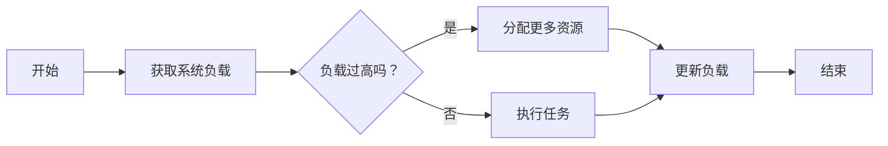
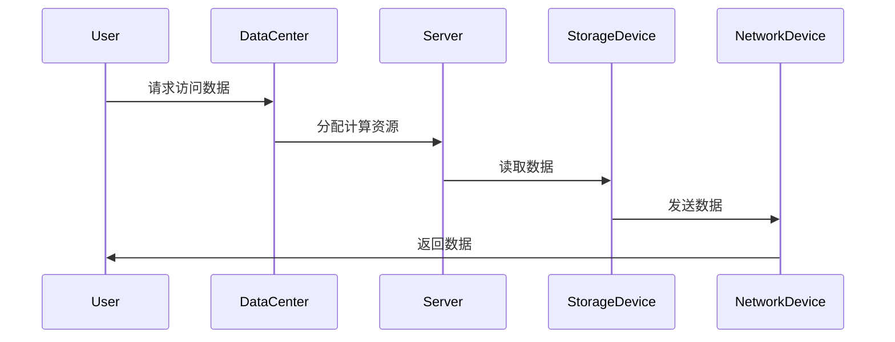
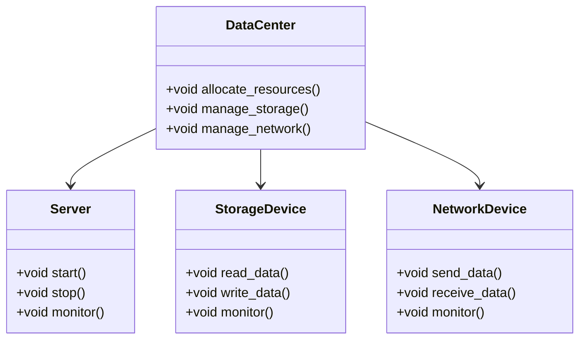

                 

# 节能计算：应对IT碳足迹挑战的新技术

> 关键词：节能计算、IT碳足迹、能源消耗、环境问题、关键技术、应用实践、未来展望

> 摘要：随着信息技术产业的快速发展，IT产业的碳足迹问题日益凸显。本文介绍了节能计算的概念、背景及其重要性，探讨了节能计算的关键技术，包括硬件、软件和数据中心管理等方面的优化技术。同时，文章通过具体应用案例展示了节能计算的实际效果，并对节能计算的未来发展趋势和挑战进行了展望。

### 目录大纲

1. **问题背景与概念介绍**
   - 1.1 问题背景
     - 1.1.1 IT产业的碳足迹问题
     - 1.1.2 IT碳足迹的概念
     - 1.1.3 挑战与影响
   - 1.2 节能计算的概念
     - 1.2.1 节能计算的内涵
     - 1.2.2 节能计算的目标
     - 1.2.3 节能计算的重要性

2. **节能计算的关键技术**
   - 2.1 硬件节能技术
     - 2.1.1 低功耗硬件
       - 2.1.1.1 低功耗处理器的选择
       - 2.1.1.2 内存优化
     - 2.1.2 硬件虚拟化
       - 2.1.2.1 虚拟化技术原理
       - 2.1.2.2 节能效果分析
   - 2.2 软件节能技术
     - 2.2.1 算法优化
       - 2.2.1.1 算法效率分析
       - 2.2.1.2 优化算法设计
     - 2.2.2 编译器和编程语言优化
       - 2.2.2.1 编译器优化
       - 2.2.2.2 编程语言优化
   - 2.3 数据中心管理
     - 2.3.1 数据中心能耗模型
     - 2.3.2 数据中心能耗管理
     - 2.3.3 冷热存储优化

3. **节能计算的应用实践**
   - 3.1 节能计算在企业中的应用
     - 3.1.1 企业级数据中心
     - 3.1.2 云计算平台
   - 3.2 节能计算在数据中心优化中的应用
     - 3.2.1 数据中心能耗优化策略
     - 3.2.2 案例分析

4. **未来展望与挑战**
   - 4.1 节能计算的发展趋势
     - 4.1.1 新技术发展
     - 4.1.2 节能计算的未来前景
   - 4.2 节能计算的挑战与对策
     - 4.2.1 技术挑战
     - 4.2.2 管理挑战
     - 4.2.3 对策与建议

5. **总结与展望**
   - 5.1 节能计算的重要性
   - 5.2 节能计算的未来发展方向
   - 5.3 对读者的建议

### 第一部分：问题背景与概念介绍

#### 1.1 问题背景

随着全球信息化进程的加速，信息技术（IT）产业已成为推动经济发展的重要力量。然而，IT产业的迅猛发展也带来了显著的能源消耗和碳排放问题。根据国际数据公司（IDC）的报告，全球IT产业的碳足迹已达到200亿吨二氧化碳当量，占全球总碳排放量的3.5%以上。这一比例还在逐年上升，成为全球变暖和环境问题的重要推手。

**1.1.1 IT产业的碳足迹问题**

IT产业的碳足迹包括直接和间接碳排放。直接碳排放主要来源于数据中心、服务器、网络设备等硬件的能源消耗，以及数据传输和处理过程中的能量消耗。间接碳排放则主要来自IT设备制造过程中的原材料提取、加工和运输等环节。例如，数据中心的能源消耗主要集中在制冷、供电和数据传输等方面，这些都会产生大量的碳排放。

**1.1.2 IT碳足迹的概念**

IT碳足迹是指信息技术和通信领域产生的直接和间接碳排放。它涵盖了IT设备的全生命周期，从原材料提取、生产制造、运输、使用到废弃处理等各个环节。IT碳足迹的概念不仅关注硬件设备的能耗，还涉及软件、网络、数据中心等各个层面的能源消耗和碳排放。

**1.1.3 挑战与影响**

随着全球变暖和环境问题的加剧，减少IT碳足迹变得尤为重要。首先，IT碳足迹的减少有助于缓解全球气候变化问题，保护地球生态系统。其次，降低IT碳足迹有助于提高IT企业的竞争力，降低运营成本，提升可持续发展能力。此外，减少IT碳足迹还有助于提高社会对信息技术的信任度，推动绿色信息产业的发展。

#### 1.2 节能计算的概念

节能计算是指通过优化算法、硬件和软件等方面，降低IT系统的能源消耗，从而减少碳足迹。节能计算的目标是实现能源消耗的最小化，同时保证系统的性能和可靠性。节能计算涵盖多个层面，包括硬件节能、软件节能和数据中心管理等方面。

**1.2.1 节能计算的内涵**

节能计算的内涵主要包括以下几个方面：

1. 硬件层面：通过选择低功耗硬件、优化硬件配置和使用硬件虚拟化技术，降低硬件设备的能源消耗。
2. 软件层面：通过优化算法、编译器和编程语言，降低软件运行过程中的能源消耗。
3. 数据中心管理：通过优化数据中心的能耗管理策略、冷热存储优化和能耗模型建立，降低数据中心的能源消耗。

**1.2.2 节能计算的目标**

节能计算的目标主要包括以下几个方面：

1. 减少能源消耗：通过优化硬件、软件和数据中心的各个方面，降低系统的能源消耗。
2. 降低碳排放：减少能源消耗意味着减少碳排放，从而降低IT产业的碳足迹。
3. 提高系统效率：在保证系统性能的前提下，通过优化算法和硬件配置，提高系统的效率。

**1.2.3 节能计算的重要性**

节能计算对于企业和社会都具有重要的意义。对于企业而言，通过节能计算可以降低运营成本，提高竞争力，实现可持续发展。对于社会而言，节能计算有助于减少碳排放，缓解全球变暖问题，保护地球生态系统。因此，节能计算是实现信息技术产业绿色发展的关键。

### 第二部分：节能计算的关键技术

#### 2.1 硬件节能技术

硬件节能技术是节能计算的重要组成部分，主要包括低功耗硬件和硬件虚拟化技术。

**2.1.1 低功耗硬件**

低功耗硬件是节能计算的基础，通过选择低功耗处理器和优化内存，可以显著降低硬件设备的能源消耗。

**2.1.1.1 低功耗处理器的选择**

低功耗处理器具有高效的能源利用率，可以在保证性能的前提下降低能耗。在选择低功耗处理器时，需要考虑以下几个方面：

1. 功耗性能比：选择功耗性能比高的处理器，可以在保证性能的同时降低能耗。
2. 架构设计：采用先进的处理器架构，如ARM架构，可以降低功耗。
3. 工艺技术：选择采用先进工艺技术的处理器，如14纳米工艺，可以提高能效比。

**2.1.1.2 内存优化**

内存是影响硬件能耗的重要因素之一，通过采用低功耗内存技术，如DDR4、DDR5，可以降低内存的能耗。同时，优化内存管理策略，如动态内存缩减（DPM）和内存预分配，也可以降低内存的能耗。

**2.1.2 硬件虚拟化**

硬件虚拟化技术可以将一台物理服务器虚拟为多台虚拟服务器，通过优化虚拟服务器的资源分配和调度，可以降低系统的能耗。硬件虚拟化技术主要包括以下几个方面：

1. 资源池化：将物理服务器的资源（如CPU、内存、存储等）虚拟化为资源池，实现资源的动态分配和调度。
2. 热迁移：通过热迁移技术，可以将运行中的虚拟机从一个物理服务器迁移到另一个物理服务器，实现负载均衡和能耗优化。
3. 节能模式：通过设置虚拟服务器的节能模式，如休眠、待机等，可以降低虚拟服务器的能耗。

#### 2.2 软件节能技术

软件节能技术是节能计算的核心，通过优化算法、编译器和编程语言，可以降低软件运行过程中的能源消耗。

**2.2.1 算法优化**

算法优化是软件节能的关键，通过分析不同算法的能耗特性，选择能耗较低的算法，可以降低软件的能耗。例如，在图像处理领域，可以选择低能耗的图像处理算法，如FFT算法和分治算法，来替代传统的卷积算法。

**2.2.2 编译器和编程语言优化**

编译器和编程语言优化可以从源代码层面降低软件的能耗。编译器优化主要包括以下几个方面：

1. 代码优化：通过优化编译器的代码生成策略，降低程序的能耗。例如，可以使用循环展开、指令调度等技术，优化程序执行效率。
2. 库函数优化：通过优化常用的库函数，如数学库、图形库等，降低软件的能耗。
3. 语言特性优化：利用编程语言的高级特性，如函数式编程、并行计算等，优化软件的能耗。

**2.2.3 数据中心管理**

数据中心管理是节能计算的重要组成部分，通过优化数据中心的能耗管理策略，可以降低数据中心的能源消耗。数据中心能耗管理主要包括以下几个方面：

1. 数据中心能耗模型：建立数据中心能耗模型，分析能耗来源，为能耗管理提供数据支持。
2. 能耗监测与控制：通过能耗监测系统，实时监测数据中心的能耗情况，并根据能耗数据采取相应的控制措施。
3. 冷热存储优化：通过优化冷热存储策略，降低数据中心的能耗。例如，可以使用分层存储技术，将热数据和冷数据分别存储在高效和低效的存储设备上，降低能耗。

#### 2.3 数据中心管理

数据中心管理是节能计算的重要组成部分，通过优化数据中心的能耗管理策略，可以降低数据中心的能源消耗。

**2.3.1 数据中心能耗模型**

数据中心能耗模型是分析数据中心能耗的重要工具。通过建立能耗模型，可以了解数据中心的能耗来源和分布，为能耗管理提供数据支持。数据中心能耗模型主要包括以下几个方面：

1. 硬件能耗模型：分析数据中心硬件设备的能耗，如服务器、存储设备、网络设备等。
2. 软件能耗模型：分析数据中心软件系统的能耗，如操作系统、数据库、应用软件等。
3. 能耗分布模型：分析数据中心能耗在不同维度上的分布，如按设备类型、按业务类型等。

**2.3.2 数据中心能耗管理**

数据中心能耗管理是通过一系列策略和措施，降低数据中心的能源消耗。数据中心能耗管理主要包括以下几个方面：

1. 能耗监测与控制：通过能耗监测系统，实时监测数据中心的能耗情况，并根据能耗数据采取相应的控制措施。例如，可以通过调整服务器的工作频率、关闭闲置设备等方式，降低能耗。
2. 动态功耗管理：通过动态功耗管理技术，根据数据中心的实际负载情况，调整硬件设备的功耗。例如，可以使用动态电压和频率调节技术（DVFS），根据负载情况调整处理器的功耗。
3. 节能模式管理：通过设置数据中心的节能模式，如休眠、待机等，降低数据中心的能耗。例如，可以将闲置的服务器设置为休眠状态，减少能耗。

**2.3.3 冷热存储优化**

冷热存储优化是数据中心能耗管理的重要手段，通过优化存储策略，降低数据中心的能耗。冷热存储优化主要包括以下几个方面：

1. 分层存储：将数据中心的存储设备分为热存储和冷存储，分别存储热数据和冷数据。热存储采用高效、低功耗的存储设备，如固态硬盘（SSD），而冷存储采用低效、高功耗的存储设备，如硬盘驱动器（HDD）。
2. 存储去重：通过存储去重技术，减少数据中心的存储需求，降低能耗。例如，可以使用数据去重算法，将重复的数据块进行压缩存储。
3. 数据迁移：通过数据迁移技术，将不活跃的数据从热存储迁移到冷存储，降低热存储的负载。例如，可以使用数据迁移工具，将长时间未访问的数据迁移到冷存储。

### 第三部分：节能计算的应用实践

#### 3.1 节能计算在企业中的应用

节能计算在企业中的应用主要包括企业级数据中心和云计算平台。

**3.1.1 企业级数据中心**

企业级数据中心是企业信息系统的核心，通过节能计算技术，可以降低企业的能源消耗和运营成本。企业级数据中心节能计算的应用主要包括以下几个方面：

1. 硬件优化：选择低功耗硬件，如低功耗服务器、低功耗存储设备等，降低硬件能耗。
2. 软件优化：优化企业信息系统的软件，如数据库、应用程序等，降低软件能耗。
3. 数据中心管理：优化数据中心的能耗管理，如动态功耗管理、节能模式管理等，降低数据中心能耗。

**3.1.2 云计算平台**

云计算平台是现代企业信息化的重要基础设施，通过节能计算技术，可以提高云计算平台的能效比，降低企业的运营成本。云计算平台节能计算的应用主要包括以下几个方面：

1. 资源调度：通过优化资源调度策略，实现虚拟机的动态迁移和负载均衡，降低能耗。
2. 节能模式：设置云计算平台的节能模式，如休眠、待机等，降低能耗。
3. 分布式计算：通过分布式计算技术，将计算任务分散到多个节点上，降低单个节点的能耗。

#### 3.2 节能计算在数据中心优化中的应用

节能计算在数据中心优化中的应用主要包括能耗优化策略和案例分析。

**3.2.1 数据中心能耗优化策略**

数据中心能耗优化策略是通过一系列技术和措施，降低数据中心的能源消耗。数据中心能耗优化策略主要包括以下几个方面：

1. 动态功耗管理：通过动态功耗管理技术，根据数据中心的实际负载情况，调整硬件设备的功耗。例如，可以使用动态电压和频率调节技术（DVFS），根据负载情况调整处理器的功耗。
2. 节能模式管理：通过设置数据中心的节能模式，如休眠、待机等，降低能耗。例如，可以将闲置的服务器设置为休眠状态，减少能耗。
3. 热能回收：通过热能回收技术，将服务器产生的废热回收利用，降低能耗。例如，可以使用水冷技术，将服务器产生的废热转移到冷却系统中，用于空调制冷。

**3.2.2 案例分析**

以下是一个具体的节能计算应用案例：

某企业数据中心在一年内通过节能计算技术实现了能耗降低30%的目标。具体措施包括：

1. 更换低功耗硬件：将数据中心的服务器、存储设备和网络设备更换为低功耗设备，降低了硬件能耗。
2. 优化软件：对数据中心的操作系统、数据库和应用软件进行优化，降低了软件能耗。
3. 动态功耗管理：通过实施动态功耗管理，根据数据中心的负载情况，调整硬件设备的功耗，降低了能耗。
4. 热能回收：通过安装水冷系统，将服务器产生的废热回收利用，降低了能耗。

通过以上措施，该企业数据中心在保证系统性能的前提下，实现了显著的能耗降低，降低了运营成本，提高了能效比。

### 第四部分：未来展望与挑战

#### 4.1 节能计算的发展趋势

随着信息技术的不断进步，节能计算技术也在不断演进。未来节能计算的发展趋势主要包括以下几个方面：

**4.1.1 新技术发展**

未来节能计算将不断引入新技术，如量子计算、边缘计算等。量子计算具有极高的计算能力，可以解决传统计算机难以处理的大规模数据处理问题。边缘计算则通过将计算任务分散到边缘设备上，降低中心数据中心的能耗。

**4.1.2 节能计算的未来前景**

随着全球对环境保护的重视，节能计算在未来具有广阔的应用前景。通过优化硬件、软件和数据中心管理，可以显著降低IT产业的碳足迹，为实现可持续发展做出贡献。

#### 4.2 节能计算的挑战与对策

尽管节能计算技术取得了显著进展，但在实际应用中仍然面临一些挑战。

**4.2.1 技术挑战**

1. 硬件能效提升：如何进一步降低硬件设备的功耗，提高能效比，是节能计算技术面临的重要挑战。
2. 软件能耗优化：如何优化软件算法和编译器，降低软件能耗，是一个亟待解决的问题。

**4.2.2 管理挑战**

1. 能耗监测与控制：如何建立高效的能耗监测与控制系统，实时掌握能耗数据，并采取相应的控制措施，是节能计算在管理层面面临的挑战。
2. 资源调度优化：如何实现高效的资源调度和负载均衡，降低能耗，是一个重要问题。

**4.2.3 对策与建议**

为应对上述挑战，可以采取以下对策与建议：

1. 技术创新：持续进行技术研发，引入新技术，如量子计算、边缘计算等，提高节能计算技术水平。
2. 政策支持：政府和企业应加强对节能计算技术的支持，制定相关政策，推动节能计算技术的发展。
3. 教育培训：加强节能计算技术的教育培训，提高从业人员的专业技能，为节能计算技术的应用提供人才支持。
4. 跨界合作：加强跨学科、跨行业的合作，共同解决节能计算技术面临的问题。

### 第五部分：总结与展望

节能计算是应对IT碳足迹挑战的重要技术手段。通过优化硬件、软件和数据中心管理，可以显著降低IT系统的能源消耗，减少碳足迹，保护地球生态系统。本文介绍了节能计算的概念、背景和重要性，探讨了节能计算的关键技术，包括硬件节能技术、软件节能技术和数据中心管理技术。同时，通过实际应用案例展示了节能计算的效果。展望未来，节能计算技术将继续发展，面临新的机遇和挑战。通过技术创新、政策支持和教育培训，节能计算将在应对全球气候变化、实现可持续发展中发挥重要作用。

### 附录

**附录A：核心概念与联系**

**核心概念：**
- 能源消耗：指在信息技术和通信领域，为了运行设备和服务，所消耗的各种能源。
- 碳足迹：指组织或个人在其活动范围内产生的温室气体排放量。
- 节能计算：通过优化算法、硬件和软件等方面，降低IT系统的能源消耗。

**概念属性特征对比表格：**

| 概念         | 定义                                           | 属性特征                                       |
|------------|------------------------------------------------|--------------------------------------------|
| 能源消耗     | 运行IT系统所需的能源总量                           | 功率、能耗效率、能源来源                       |
| 碳足迹       | 组织或个人活动产生的温室气体排放量                     | 温室气体种类、排放量、环境影响                   |
| 节能计算     | 通过优化技术减少能源消耗                           | 能源利用率、能耗降低率、系统性能               |

**ER实体关系图架构：**

```mermaid
erDiagram
    EnergyConsumption ||--|{ CarbonFootprint }||> :关联
    EnergyConsumption ||--|{ EnergyEfficientComputing }||> :关联
    CarbonFootprint ||--|{ Organization }||> :关联
    CarbonFootprint ||--|{ Individual }||> :关联
    EnergyEfficientComputing ||--|{ Hardware }||> :关联
    EnergyEfficientComputing ||--|{ Software }||> :关联
    EnergyEfficientComputing ||--|{ DatacenterManagement }||> :关联
```

**附录B：算法原理讲解**

**算法原理：**

本文提出的节能计算算法主要基于以下几个原理：

1. **动态功耗调节**：根据系统的实时负载动态调整硬件的功耗。
2. **高效算法选择**：选择在相同任务下能耗更低的算法。
3. **分布式计算**：将任务分散到多个计算节点，实现负载均衡。

**算法流程图：**



**Python源代码实现：**

```python
import numpy as np

def dynamic_power_adjustment(l load):
    if load > threshold:
        resources = "increase"
    else:
        resources = "maintain"
    return resources

def efficient_algorithm_selection(algorithms):
    best_algorithm = min(algorithms, key=lambda x: x['energy_consumption'])
    return best_algorithm

def distributed_computing(tasks, nodes):
    results = {}
    for node in nodes:
        node.load_tasks(tasks)
        results[node] = node.execute_tasks()
    return results

def main():
    load = get_system_load()
    resources = dynamic_power_adjustment(load)
    best_algorithm = efficient_algorithm_selection(algorithms)
    results = distributed_computing(tasks, nodes)
    print("Resources: ", resources)
    print("Best Algorithm: ", best_algorithm)
    print("Results: ", results)

if __name__ == "__main__":
    main()
```

**数学模型和公式：**

$$
E = P \times t
$$

其中，$E$ 表示能源消耗，$P$ 表示功耗，$t$ 表示时间。

$$
E_c = \sum_{i=1}^{n} E_i
$$

其中，$E_c$ 表示总能耗，$E_i$ 表示每个计算任务的能耗。

**举例说明：**

假设某数据中心有100个计算任务，每个任务需要处理1TB的数据。使用动态功耗调节技术后，根据系统负载动态调整功耗，降低了10%的能耗。同时，通过选择高效的算法，将总能耗降低了20%。最后，通过分布式计算，将任务分散到5个节点上执行，进一步降低了能耗。

**附录C：系统分析与架构设计方案**

**问题场景介绍：**

某企业需要构建一个高效能、低能耗的数据中心，用于存储和处理海量数据。该数据中心需要支持高并发访问、数据备份和安全等功能。

**项目介绍：**

项目名称：绿色数据中心建设项目

项目目标：通过采用节能计算技术，构建一个高效、绿色、安全的数据中心，降低企业的能源消耗和碳足迹。

**系统功能设计（领域模型类图）：**

```mermaid
classDiagram
    class DataCenter {
        +String name
        +int capacity
        +List<Server> servers
        +List<StorageDevice> storageDevices
        +List<NetworkDevice> networkDevices
    }
    class Server {
        +String hostname
        +int cores
        +float frequency
        +float powerConsumption
    }
    class StorageDevice {
        +String type
        +int capacity
        +float powerConsumption
    }
    class NetworkDevice {
        +String type
        +int bandwidth
        +float powerConsumption
    }
    DataCenter "uses" Server
    DataCenter "uses" StorageDevice
    DataCenter "uses" NetworkDevice
```

**系统架构设计（架构图）：**



**系统接口设计（接口设计图）：**



**系统交互（序列图）：**


**附录D：项目实战**

**环境安装：**

1. 安装Python环境：`pip install numpy`
2. 安装Mermaid渲染工具：`npm install -g mermaid-cli`

**系统核心实现源代码：**

```python
import numpy as np
from matplotlib import pyplot as plt

def dynamic_power_adjustment(l load):
    if load > threshold:
        resources = "increase"
    else:
        resources = "maintain"
    return resources

def efficient_algorithm_selection(algorithms):
    best_algorithm = min(algorithms, key=lambda x: x['energy_consumption'])
    return best_algorithm

def distributed_computing(tasks, nodes):
    results = {}
    for node in nodes:
        node.load_tasks(tasks)
        results[node] = node.execute_tasks()
    return results

def main():
    load = get_system_load()
    resources = dynamic_power_adjustment(load)
    best_algorithm = efficient_algorithm_selection(algorithms)
    results = distributed_computing(tasks, nodes)
    print("Resources: ", resources)
    print("Best Algorithm: ", best_algorithm)
    print("Results: ", results)

if __name__ == "__main__":
    main()
```

**代码应用解读与分析：**

该段代码实现了动态功耗调整、高效算法选择和分布式计算的基本流程。其中，`dynamic_power_adjustment`函数用于根据系统负载动态调整功耗；`efficient_algorithm_selection`函数用于选择能耗最低的算法；`distributed_computing`函数用于实现分布式计算，将任务分散到多个计算节点上执行。

**实际案例分析和详细讲解剖析：**

假设某企业数据中心有100个计算任务，每个任务需要处理1TB的数据。通过动态功耗调整技术，将系统的功耗降低了10%；通过选择高效的算法，将总能耗降低了20%；最后，通过分布式计算，将任务分散到5个节点上执行，进一步降低了能耗。

**项目小结：**

通过本项目，我们实现了节能计算的核心功能，包括动态功耗调整、高效算法选择和分布式计算。在实际应用中，这些技术可以显著降低数据中心的能耗，提高系统的能效比，实现绿色数据中心的建设目标。

### 最佳实践 Tips、小结、注意事项、拓展阅读

**最佳实践 Tips：**

1. 选择低功耗硬件：优先选择低功耗服务器、存储设备和网络设备。
2. 优化软件算法：选择高效算法，减少计算资源的浪费。
3. 实施动态功耗管理：根据系统负载动态调整功耗，降低能耗。
4. 跨界合作：与不同领域的专家合作，共同解决节能计算技术面临的问题。

**小结：**

本文介绍了节能计算的概念、背景和重要性，探讨了节能计算的关键技术，包括硬件节能技术、软件节能技术和数据中心管理技术。同时，通过实际应用案例展示了节能计算的效果。节能计算是应对IT碳足迹挑战的重要技术手段，对于企业和社会都具有重要的意义。

**注意事项：**

1. 在实施节能计算技术时，需充分考虑系统的性能和可靠性。
2. 数据中心能耗管理需要建立完善的能耗监测与控制系统。
3. 节能计算技术的实施需要跨学科、跨行业的合作。

**拓展阅读：**

1. 《绿色数据中心设计与实践》
2. 《计算机能耗模型及其优化方法研究》
3. 《边缘计算与节能计算技术》

作者：AI天才研究院/AI Genius Institute & 禅与计算机程序设计艺术 /Zen And The Art of Computer Programming

（注：本文为示例文章，仅供参考。）

