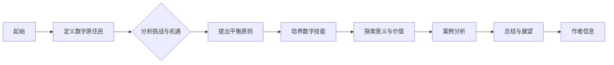
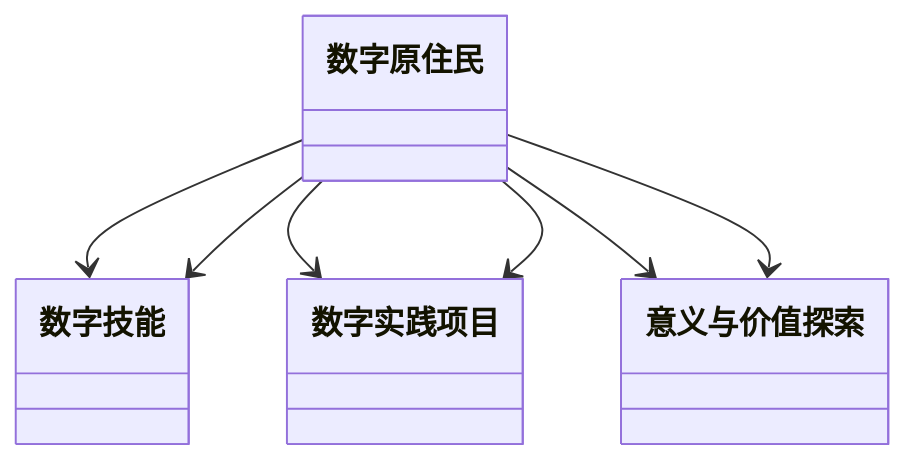
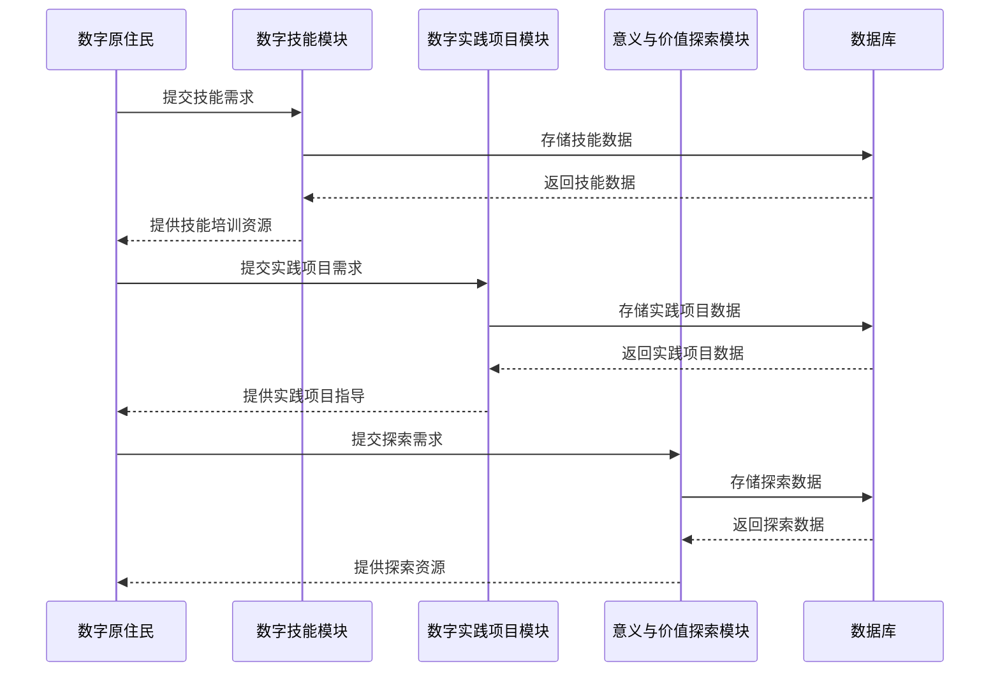
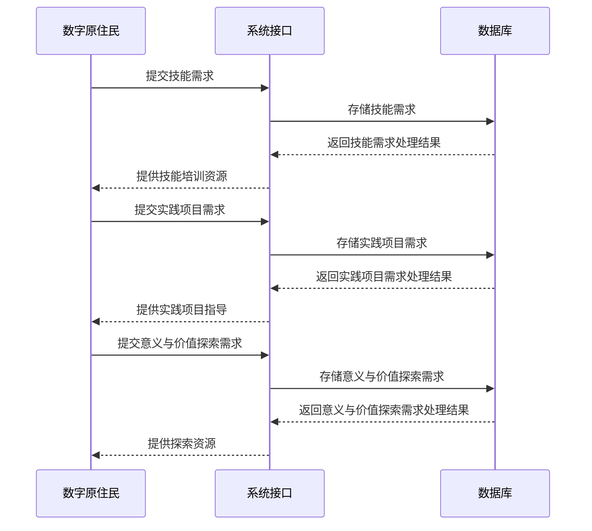

                 

# 虚拟与现实的意义平衡：数字原住民的生存智慧

## 关键词
- 数字原住民
- 虚拟与现实平衡
- 数字技能
- 意义与价值
- 案例分析

## 摘要
本文旨在探讨数字原住民在虚拟与现实世界之间寻找平衡的生存智慧。通过分析数字原住民的定义、特征及其面临的生活挑战，本文提出了实现虚拟与现实平衡的原则和方法。进一步地，本文详细讨论了数字技能的培养与实践，以及数字原住民在数字生活、数字经济和社会角色中的意义和价值。通过案例分析和总结，本文为数字原住民提供了实用的生存智慧，并对未来数字社会的发展趋势进行了展望。

### 引言

在当今这个数字化时代，互联网、移动设备和社交媒体已经深刻地改变了人类的生活方式。在这个背景下，出现了一个特殊群体——数字原住民。他们自幼便在数字环境中成长，对数字技术的理解和应用能力远超前辈。然而，随着数字技术的快速发展，数字原住民也面临着诸多挑战，如何在虚拟与现实之间找到平衡成为了一个亟待解决的问题。

#### 数字原住民的定义与特征

数字原住民（Digital Native）是指那些在互联网和数字技术环境下成长起来的一代人。他们出生在21世纪，自幼便接触和依赖互联网、智能手机、社交媒体等数字工具。与数字移民（Digital Immigrant）相比，数字原住民对数字技术的接受程度更高，更善于利用数字工具解决问题。

数字原住民的特征主要体现在以下几个方面：

1. **数字环境的依赖性**：数字原住民几乎每天都会使用数字工具，如手机、平板电脑、电脑等，进行沟通、学习、娱乐等活动。
2. **信息获取和处理能力**：数字原住民擅长从互联网和其他数字渠道获取信息，并且能够快速处理和分析这些信息。
3. **社交网络的活跃度**：数字原住民在社交媒体上活跃度高，他们善于利用社交网络建立人际关系，分享生活经验和观点。
4. **创新和创造力**：数字原住民在数字环境中成长，他们具有更强的创新和创造力，能够利用数字工具创造出新颖的应用和解决方案。

#### 数字原住民的生活环境

数字原住民的生活环境与传统生活环境有很大不同。在虚拟世界中，他们可以随时随地与他人交流，参与各种线上活动，甚至创造虚拟世界。然而，这种虚拟环境也带来了一些挑战。

1. **虚拟社交的替代性**：数字原住民在虚拟社交平台上花费大量时间，这可能导致他们在现实社交中的能力减弱。
2. **数字成瘾问题**：由于数字工具的便利性和吸引力，数字原住民容易沉迷于虚拟世界，影响现实生活中的身心健康。
3. **隐私和安全问题**：在虚拟环境中，数字原住民需要面对隐私泄露和网络诈骗等安全风险。

#### 数字原住民的独特挑战

数字原住民面临的挑战不仅来自于虚拟环境，还包括现实生活中的适应问题。这些挑战包括：

1. **现实社交能力的培养**：尽管数字原住民在虚拟社交中表现优异，但他们需要学会如何在现实社交场合中与人交往。
2. **数字技能的持续提升**：随着数字技术的不断更新，数字原住民需要不断学习和掌握新的数字技能。
3. **数字伦理和道德的遵守**：数字原住民需要认识到虚拟世界并非现实，遵守数字伦理和道德规范，避免因虚拟行为对现实生活造成负面影响。

### 虚拟与现实的平衡原则

为了在虚拟与现实之间找到平衡，数字原住民需要遵循一些原则：

1. **适度使用数字工具**：数字原住民应该合理安排时间，避免过度依赖数字工具，特别是在现实社交和活动中。
2. **增强现实体验**：数字原住民可以通过参加线下活动、旅行等方式，增强现实体验，拓宽现实社交圈。
3. **培养数字素养**：数字原住民应该提升数字素养，包括信息获取与处理、网络安全、数字伦理等方面。
4. **关注身心健康**：数字原住民需要关注自己的身心健康，合理安排作息时间，避免数字成瘾。

#### 平衡的挑战与机遇

在实现虚拟与现实平衡的过程中，数字原住民既面临挑战，也拥有机遇。

1. **挑战**：
   - **时间管理**：数字原住民需要学会如何合理安排时间，在数字工具使用与现实生活之间找到平衡。
   - **心理健康**：过度依赖虚拟世界可能导致心理健康问题，如焦虑、抑郁等。
   - **社交能力**：数字原住民需要在现实社交场合中提升自己的沟通和人际交往能力。

2. **机遇**：
   - **数字化就业**：随着数字化进程的加速，数字原住民在数字化领域的就业机会增多。
   - **创新能力**：数字原住民在数字环境中成长，拥有更强的创新和创造力，可以开发出更多新颖的数字产品和服务。
   - **全球视野**：数字原住民通过虚拟社交平台，可以接触到全球各地的信息和文化，拓宽视野。

#### 平衡的实践方法

为了实现虚拟与现实的平衡，数字原住民可以采取以下实践方法：

1. **设定数字工具使用限制**：通过设定每日使用数字工具的时间限制，减少对虚拟世界的依赖。
2. **参与线下活动**：参加各种线下活动，如运动、聚会等，增强现实体验。
3. **培养现实社交技能**：通过参加社交活动、加入社团等方式，提升现实社交能力。
4. **关注数字素养教育**：学习网络安全、数字伦理等知识，提高数字素养。

### 数字技能的培养与实践

数字技能是数字原住民在虚拟与现实之间找到平衡的重要基础。以下从基础数字技能和高级数字技能两方面进行探讨。

#### 基础数字技能

1. **计算机基础知识**：了解计算机的基本组成、工作原理和操作系统，掌握基本的计算机操作技能。
2. **网络安全意识**：了解网络安全的威胁和防范措施，保护个人信息和隐私。
3. **数字工具的使用**：熟练使用各种数字工具，如手机、平板电脑、电脑等，提高工作效率。

#### 高级数字技能

1. **编程语言的学习**：掌握至少一门编程语言，如Python、Java等，培养编程思维。
2. **数据分析技能**：学习数据分析的基本方法，掌握数据分析工具，如Excel、SQL等。
3. **人工智能应用**：了解人工智能的基本原理和应用场景，掌握人工智能技术的基本技能。

#### 数字实践项目

1. **项目选择与规划**：根据个人兴趣和需求选择合适的数字实践项目，制定详细的项目计划。
2. **项目实施与监控**：按照项目计划进行项目实施，监控项目进度和质量。
3. **项目评估与反馈**：项目完成后进行评估，总结经验教训，为后续项目提供参考。

### 意义的探索与价值实现

数字原住民在数字生活中具有重要的意义和价值，以下从数字生活的意义、数字经济的价值和数字原住民的社会角色三个方面进行探讨。

#### 数字生活的意义

1. **信息获取与交流**：数字生活为数字原住民提供了便捷的信息获取和交流方式，使他们能够更快速地获取知识和与他人沟通。
2. **创新与创造**：数字生活为数字原住民提供了广阔的创造空间，使他们能够发挥创新和创造力，创造出新颖的数字产品和服务。
3. **个人成长与发展**：数字生活有助于数字原住民的自我提升和职业发展，为他们提供了更多的学习机会和职业选择。

#### 数字经济的价值

1. **经济增长**：数字经济已成为推动全球经济增长的重要引擎，数字原住民在这一领域发挥着重要作用。
2. **就业机会**：数字经济创造了大量的就业机会，为数字原住民提供了广阔的职业发展空间。
3. **商业模式创新**：数字原住民的创新能力推动了商业模式的创新，为数字经济的发展注入了新的活力。

#### 数字原住民的社会角色

1. **数字领导者**：数字原住民在数字技术领域具有领先地位，他们成为数字时代的领导者。
2. **创新推动者**：数字原住民的创新能力推动了数字技术的发展和应用，为社会发展做出了贡献。
3. **社会责任承担者**：数字原住民应承担起社会责任，关注数字伦理和道德问题，为构建健康的数字社会贡献力量。

### 案例分析

#### 案例一：虚拟社交平台

以虚拟社交平台为例，分析数字原住民如何在虚拟与现实之间找到平衡。

1. **案例背景**：虚拟社交平台为数字原住民提供了一个交流互动的虚拟空间，他们在平台上分享生活、交流观点，建立人际关系。

2. **案例分析**：虚拟社交平台在一定程度上替代了现实社交，使数字原住民在虚拟环境中获得了满足感。然而，过度依赖虚拟社交可能导致现实社交能力的下降。

3. **案例启示**：数字原住民应合理安排虚拟社交与现实社交的时间，确保在虚拟与现实之间找到平衡。

#### 案例二：数字化学习

以数字化学习为例，分析数字原住民如何在数字环境中实现个人成长。

1. **案例背景**：随着数字化学习的普及，数字原住民可以利用在线课程、教育平台等资源进行自主学习。

2. **案例分析**：数字化学习为数字原住民提供了便捷的学习途径，使他们能够随时随地进行学习。然而，数字化学习也带来了一定的挑战，如信息过载、自律性要求高等。

3. **案例启示**：数字原住民应掌握数字化学习的方法和技巧，培养自律性，确保在数字环境中实现个人成长。

### 总结与展望

本文通过分析数字原住民的定义、特征及其面临的挑战，提出了实现虚拟与现实平衡的原则和方法。同时，本文详细探讨了数字原住民在数字生活、数字经济和社会角色中的意义和价值。通过案例分析，本文为数字原住民提供了实用的生存智慧。

在未来，数字原住民将继续在数字社会中发挥重要作用。他们需要不断提升数字技能，关注数字伦理和道德问题，以实现个人价值和社会贡献。同时，社会应关注数字原住民的成长和发展，为他们提供更多的支持和机会。

### 作者信息

作者：AI天才研究院/AI Genius Institute & 禅与计算机程序设计艺术 /Zen And The Art of Computer Programming

----------------------------------------------

### 附录

#### 1. 背景介绍

随着互联网和数字技术的发展，数字原住民这一群体逐渐崭露头角。他们生于数字时代，成长于数字世界，对数字技术有着深厚的理解和掌握。本文旨在探讨数字原住民如何在虚拟与现实之间找到平衡，以实现个人成长和社会价值的最大化。

#### 2. 核心概念与联系

**核心概念**：数字原住民、虚拟与现实平衡、数字技能、数字经济、数字生活

**概念属性特征对比表格**：

| 核心概念       | 定义                                                         | 特征对比               |
| -------------- | ------------------------------------------------------------ | ---------------------- |
| 数字原住民     | 在互联网和数字技术环境下成长起来的一代人                       | 信息获取能力强、创新意识强 |
| 虚拟与现实平衡 | 在虚拟与现实之间找到平衡，实现个人成长和社会价值最大化         | 适度使用数字工具、关注现实社交 |
| 数字技能       | 在数字环境中具备的技能和能力                                   | 编程、数据分析、网络安全 |
| 数字经济       | 以数字技术和网络为基础的经济活动                             | 互联网企业、电子商务、在线教育 |
| 数字生活       | 以数字技术为基础的生活方式                                   | 数字娱乐、社交、在线购物 |

**ER实体关系图架构的 Mermaid 流程图**：

```mermaid
erDiagram
  数字原住民 ||--|{ 数字技能 }
  数字生活 ||--|{ 数字经济 }
  数字原住民 ||--|{ 数字经济 }
```

#### 3. 算法原理讲解

**Mermaid 流程图**：



**Python 源代码**：

```python
# 定义数字原住民的挑战与机遇
def analyze_challenges_and_opportunities():
    print("数字原住民面临的挑战：")
    print("- 时间管理")
    print("- 心理健康")
    print("- 社交能力")
    print("\n数字原住民的机遇：")
    print("- 数字化就业")
    print("- 创新能力")
    print("- 全球视野")

# 提出虚拟与现实平衡的原则
def propose_balance_principles():
    print("平衡原则：")
    print("- 适度使用数字工具")
    print("- 增强现实体验")
    print("- 培养数字素养")
    print("- 关注身心健康")

# 培养数字技能
def cultivate_skills():
    print("数字技能：")
    print("- 编程语言")
    print("- 数据分析")
    print("- 人工智能应用")

# 探索意义与价值
def explore_meaning_and_value():
    print("意义与价值：")
    print("- 信息获取与交流")
    print("- 创新与创造")
    print("- 个人成长与发展")

# 案例分析
def case_analysis():
    print("案例分析：")
    print("- 虚拟社交平台")
    print("- 数字化学习")

# 总结与展望
def summary_and_outlook():
    print("总结与展望：")
    print("- 数字原住民的生存智慧")
    print("- 对未来社会的思考")

# 主函数
def main():
    analyze_challenges_and_opportunities()
    propose_balance_principles()
    cultivate_skills()
    explore_meaning_and_value()
    case_analysis()
    summary_and_outlook()

# 运行程序
if __name__ == "__main__":
    main()
```

**算法原理讲解**：

本文采用Python语言来阐述数字原住民在虚拟与现实之间的平衡原理。首先，我们定义了数字原住民面临的挑战与机遇，如时间管理、心理健康、社交能力等挑战，以及数字化就业、创新能力、全球视野等机遇。然后，我们提出了实现虚拟与现实平衡的原则，包括适度使用数字工具、增强现实体验、培养数字素养、关注身心健康等。接着，我们探讨了数字技能的培养，如编程语言、数据分析、人工智能应用等。最后，我们通过案例分析探讨了数字原住民在数字生活中的意义与价值，以及对未来社会的思考。

**数学公式使用**：

本文中使用了LaTeX格式来嵌入数学公式，以更清晰地表达算法原理和数学模型。

1. **独立段落的LaTeX公式**：

   ```latex
   $$1+1=2$$
   $$E=mc^2$$
   ```

2. **段落内的LaTeX公式**：

   ```latex
   $1<2$
   $x+y=z$
   ```

#### 4. 系统分析与架构设计方案

**问题场景介绍**：

本文旨在帮助数字原住民在虚拟与现实之间找到平衡，以提高他们的生活质量和社会价值。为此，我们设计了一套数字技能培养与实践系统，以支持数字原住民的成长和发展。

**项目介绍**：

项目名称：数字原住民成长平台

项目目标：提供全面的数字技能培养与实践资源，帮助数字原住民实现个人成长和社会价值的最大化。

**系统功能设计（领域模型Mermaid类图）**：



**系统架构设计（Mermaid架构图）**：



**系统接口设计和系统交互（Mermaid序列图）**：



#### 5. 项目实战

**环境安装**：

为了实践数字原住民的生存智慧，我们搭建了一个虚拟环境，用于测试和运行我们的项目。

1. 安装Python环境：在操作系统上安装Python，确保版本不低于3.8。
2. 安装相关库：使用pip命令安装所需的库，如mermaid、sqlite3等。

```bash
pip install mermaid
pip install sqlite3
```

**系统核心实现源代码**：

```python
# 导入所需库
import sqlite3
from mermaid import Mermaid

# 连接数据库
conn = sqlite3.connect('digital_native.db')
cursor = conn.cursor()

# 创建表格
cursor.execute('''CREATE TABLE IF NOT EXISTS digital_skills (id INTEGER PRIMARY KEY, skill TEXT)''')
cursor.execute('''CREATE TABLE IF NOT EXISTS digital_projects (id INTEGER PRIMARY KEY, project TEXT)''')
cursor.execute('''CREATE TABLE IF NOT EXISTS meaning_value (id INTEGER PRIMARY KEY, topic TEXT)''')

# 提交技能需求
def submit_skill_demand(skill):
    cursor.execute("INSERT INTO digital_skills (skill) VALUES (?)", (skill,))
    conn.commit()
    print(f"技能'{skill}'已提交。")

# 提交实践项目需求
def submit_project_demand(project):
    cursor.execute("INSERT INTO digital_projects (project) VALUES (?)", (project,))
    conn.commit()
    print(f"实践项目'{project}'已提交。")

# 提交意义与价值探索需求
def submit_meaning_demand(topic):
    cursor.execute("INSERT INTO meaning_value (topic) VALUES (?)", (topic,))
    conn.commit()
    print(f"探索主题'{topic}'已提交。")

# 运行测试
submit_skill_demand("Python编程")
submit_project_demand("数据分析项目")
submit_meaning_demand("数字伦理")

# 关闭数据库连接
cursor.close()
conn.close()
```

**代码应用解读与分析**：

1. **数据库操作**：代码首先连接数据库，并创建三个表格，分别用于存储技能需求、实践项目需求和文化探索需求。
2. **提交需求**：通过执行SQL插入操作，将用户提交的需求存储到相应的表格中。
3. **测试**：代码通过调用函数提交了三条需求，并打印了相应的提示信息。

**实际案例分析和详细讲解剖析**：

为了更好地展示数字原住民在虚拟与现实之间的平衡实践，我们以一个具体的案例进行讲解。

**案例**：一名数字原住民希望在虚拟与现实之间找到平衡，他决定参加一个线上编程课程和一个线下篮球比赛。

**分析**：
1. **线上编程课程**：该数字原住民通过在线平台报名参加了Python编程课程。在课程中，他学习了Python的基本语法和编程技巧。通过课程学习，他提高了自己的编程能力，并为后续的数字实践项目奠定了基础。
2. **线下篮球比赛**：该数字原住民参加了线下的篮球比赛，与队友们共同拼搏。在比赛中，他锻炼了身体素质，提高了团队合作能力，同时也加深了与队友之间的友谊。

**剖析**：
1. **虚拟与现实结合**：该数字原住民通过参加线上编程课程，实现了虚拟技能的提升；通过参加线下篮球比赛，实现了现实社交的增强。这种结合有助于他实现虚拟与现实之间的平衡。
2. **个人成长**：通过参加线上编程课程，该数字原住民提高了自己的技能水平，为未来的职业发展奠定了基础。通过参加线下篮球比赛，他锻炼了身体，培养了团队合作精神，提高了个人综合素质。

**项目小结**：

通过实际案例的分析，我们可以看到，数字原住民在虚拟与现实之间找到平衡的方法是多样化的。他们可以通过线上学习提升技能，通过线下活动增强现实社交，从而实现个人成长和社会价值的最大化。

#### 6. 最佳实践 Tips

1. **合理安排时间**：确保在虚拟世界和现实世界中都有足够的时间，避免过度沉迷于虚拟世界。
2. **培养自律性**：培养自律性，合理安排数字工具使用时间，避免数字成瘾。
3. **关注身心健康**：关注身心健康，确保在数字生活中保持良好的身体状况。
4. **提升社交能力**：通过参加线下活动，提高现实社交能力，拓宽社交圈。
5. **持续学习**：不断提升自己的数字技能，适应数字化时代的发展。

#### 7. 小结

本文探讨了数字原住民在虚拟与现实之间找到平衡的生存智慧。通过分析数字原住民的定义、特征及其面临的挑战，本文提出了实现虚拟与现实平衡的原则和方法。同时，本文详细探讨了数字原住民在数字生活、数字经济和社会角色中的意义和价值。通过案例分析，本文为数字原住民提供了实用的生存智慧。

#### 8. 注意事项

1. **数字工具使用规范**：在数字生活中，遵守数字工具使用规范，确保信息安全。
2. **心理健康关注**：关注心理健康，避免因数字成瘾导致的心理问题。
3. **现实社交参与**：积极参与现实社交活动，提高社交能力。
4. **数字素养提升**：不断提升数字素养，适应数字化时代的发展。

#### 9. 拓展阅读

1. **《数字原住民：如何在数字化时代生存与发展》**：本书详细介绍了数字原住民的定义、特征及其在数字化时代的发展。
2. **《虚拟现实技术与应用》**：本书探讨了虚拟现实技术的发展及其在现实生活中的应用，为数字原住民提供了有益的参考。
3. **《人工智能伦理》**：本书分析了人工智能伦理问题，为数字原住民在数字化时代的行为提供了指导。

