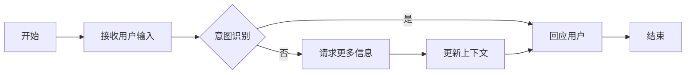

                 


### 第一部分：虚拟助手对话管理基础

#### 第1章：问题背景与核心概念

**1.1 虚拟助手概述**

虚拟助手，又称为聊天机器人、虚拟客服或智能对话系统，是近年来人工智能领域发展迅速的一个分支。它们通过自然语言处理技术（NLP）与用户进行交互，以提供信息查询、问题解答、任务执行等服务。

虚拟助手的发展历程可以追溯到20世纪50年代，早期的研究主要集中在对自然语言的理解和生成上。随着计算能力的提升和机器学习技术的发展，虚拟助手逐渐从规则驱动型系统转向了数据驱动型系统，通过深度学习等算法来提升其对话能力。

虚拟助手在现代企业中扮演着重要的角色。例如，在客户服务领域，虚拟助手可以自动处理常见问题，提高客服效率，减少人力成本。在电子商务领域，虚拟助手可以帮助用户完成订单查询、支付流程等操作，提升用户体验。

然而，虚拟助手的发展也面临着诸多挑战。首先是如何确保对话的自然性和流畅性，其次是如何准确理解用户的意图，最后是如何处理复杂的对话场景。这些问题都是对话管理的关键点，需要通过数学策略来解决。

**1.2 人机交互的基本概念**

人机交互（Human-Computer Interaction, HCI）是研究人与计算机之间交互的一门学科。它涵盖了计算机设计、用户行为研究、用户体验等多个方面。

人机交互的基本概念包括：

- **交互模式**：指用户与计算机之间进行交互的方式，如点击、触摸、语音等。
- **用户需求**：用户在使用计算机时所期望获得的功能和体验。
- **交互反馈**：计算机对用户操作的反应，包括视觉、听觉等多种形式。

人机交互的层次结构可以分为三个层次：

1. **感知层**：用户通过感官接收计算机提供的信息，如屏幕显示、声音输出等。
2. **认知层**：用户在感知信息的基础上，进行理解、思考和判断。
3. **行动层**：用户根据认知结果，执行相应的操作。

**1.3 对话管理的核心要素**

对话管理是虚拟助手的核心功能，它涉及到以下几个方面：

- **对话状态跟踪**：记录并更新当前对话的状态，如对话主题、上下文等。
- **对话上下文维护**：保持对话的连贯性，确保后续对话能够基于当前上下文进行。
- **对话策略设计**：根据用户意图和对话状态，选择合适的回应和动作。

**1.4 数学策略在对话管理中的应用**

数学策略在对话管理中扮演着至关重要的角色。通过数学模型和算法，虚拟助手能够更加准确地理解用户意图，优化对话流程，提高用户体验。

常见的数学策略包括：

- **概率论与决策树**：用于预测用户意图和处理不确定性。
- **图论与搜索算法**：用于构建对话网络和优化对话路径。
- **线性代数与矩阵计算**：用于分析和处理大规模对话数据。

这些数学策略不仅能够提升虚拟助手的对话能力，还能够为对话管理提供理论支持和指导。

### 第2章：概率论与决策树

**2.1 概率论基础**

概率论是数学的一个分支，主要研究随机事件及其概率性质。概率论的基本概念包括：

- **随机事件**：指在一定条件下可能发生也可能不发生的事件。
- **概率**：描述随机事件发生的可能性，通常用0到1之间的实数表示。
- **条件概率**：在某个事件发生的条件下，另一个事件发生的概率。
- **贝叶斯定理**：用于计算后验概率，是概率论中一个非常重要的定理。

**2.2 决策树在对话管理中的应用**

决策树是一种常用的决策分析方法，它通过一系列规则来指导决策过程。在对话管理中，决策树可以用来处理不确定性和多级决策问题。

决策树的基本结构包括：

- **根节点**：表示初始状态。
- **内部节点**：表示条件判断。
- **叶子节点**：表示决策结果。

决策树的应用场景包括：

- **意图识别**：通过一系列条件判断，识别用户的意图。
- **对话策略选择**：根据用户意图和对话状态，选择合适的回应和动作。

**2.3 概率论与决策树的组合策略**

概率论与决策树的组合策略可以用于处理复杂的不确定性问题和多级决策问题。具体方法包括：

- **条件概率决策树**：在决策树上加入条件概率节点，用于更准确地预测用户意图。
- **贝叶斯决策树**：基于贝叶斯定理，计算每个节点的后验概率，用于优化决策过程。

组合策略的优势在于：

- **提高决策准确性**：通过结合概率论和决策树，可以更准确地预测用户意图。
- **优化对话流程**：通过多级决策和条件判断，可以更高效地处理对话流程。

### 第3章：图论与搜索算法

**3.1 图论基础**

图论是数学的一个分支，主要研究图的性质和图的算法。图的基本概念包括：

- **图**：由节点和边组成的图形。
- **节点**：图中的点，表示数据元素。
- **边**：节点之间的连线，表示节点之间的关系。

图的表示方法包括：

- **邻接矩阵**：用二维数组表示图，其中元素表示节点之间的连接关系。
- **邻接表**：用一维数组表示图，其中每个元素表示一个节点的邻居节点。

图的算法基础包括：

- **图的遍历**：遍历图中所有节点，常用的算法有深度优先搜索（DFS）和广度优先搜索（BFS）。
- **最短路径算法**：计算图中两个节点之间的最短路径，常用的算法有迪杰斯特拉算法（Dijkstra）和弗洛伊德算法（Floyd）。

**3.2 搜索算法在对话管理中的应用**

搜索算法是图论中的一种重要算法，它用于在图中寻找路径。在对话管理中，搜索算法可以用来构建对话网络和优化对话路径。

搜索算法的应用场景包括：

- **对话路径规划**：根据用户意图和对话状态，规划对话路径，确保对话流程的连贯性。
- **意图识别**：通过搜索算法，识别用户意图，并选择合适的对话策略。

**3.3 图论与搜索算法的组合策略**

图论与搜索算法的组合策略可以用于处理复杂的对话场景。具体方法包括：

- **图搜索决策树**：将图搜索算法应用于决策树，用于处理多级决策问题。
- **图论优化算法**：结合图论算法，优化对话流程和路径选择。

组合策略的优势在于：

- **提高对话效率**：通过优化对话路径，提高对话的响应速度和效率。
- **增强对话能力**：通过多级决策和路径规划，增强虚拟助手的对话能力。

### 第4章：线性代数与矩阵计算

**4.1 线性代数基础**

线性代数是数学的一个重要分支，主要研究向量、矩阵及其运算。线性代数的基本概念包括：

- **向量**：有序数组，表示空间中的一个点。
- **矩阵**：由多个向量组成的二维数组，表示多个向量之间的关系。

线性代数的基本运算包括：

- **矩阵乘法**：将两个矩阵相乘，得到一个新的矩阵。
- **矩阵求逆**：求一个矩阵的逆矩阵，用于解决线性方程组。

**4.2 矩阵计算在对话管理中的应用**

矩阵计算在对话管理中有着广泛的应用。具体包括：

- **特征值与特征向量**：用于分析对话系统的稳定性和动态性。
- **矩阵分解**：用于降维和特征提取，提高对话系统的性能。

**4.3 线性代数与矩阵计算的组合策略**

线性代数与矩阵计算的组合策略可以用于优化对话管理。具体方法包括：

- **矩阵分解算法**：将大规模对话数据分解为多个小规模矩阵，便于处理和分析。
- **特征值分析**：通过特征值分析，识别对话系统的关键特征，优化对话流程。

组合策略的优势在于：

- **提高数据处理效率**：通过矩阵计算和分解，提高对话系统的数据处理速度。
- **优化对话性能**：通过特征值分析，优化对话系统的性能和用户体验。

### 第5章：项目实战一——智能客服系统

**5.1 项目背景**

智能客服系统是一种基于人工智能技术的客服解决方案，通过虚拟助手与用户进行交互，提供快速、准确的问题解答和服务。

该项目的主要目标是：

- 提高客服效率，减少人工干预。
- 提升用户满意度，降低用户等待时间。
- 处理高频问题，减轻客服人员负担。

**5.2 系统设计与实现**

系统架构设计：

- **前端**：使用HTML、CSS和JavaScript实现用户界面，提供用户输入和输出接口。
- **后端**：使用Python和Flask框架实现后端逻辑，处理用户请求和对话管理。
- **数据库**：使用MySQL存储用户数据和对话历史。

对话管理模块设计：

- **意图识别**：使用决策树算法识别用户意图，并将意图映射到相应的服务模块。
- **对话上下文维护**：使用状态机维护对话上下文，确保对话的连贯性。
- **对话策略选择**：根据用户意图和对话状态，选择合适的对话策略。

数学策略应用案例：

- **概率论与决策树**：用于意图识别和对话策略选择。
- **线性代数与矩阵计算**：用于对话上下文维护和对话状态分析。

**5.3 项目总结与展望**

项目成果分析：

- **提高客服效率**：通过自动化处理高频问题，提高了客服效率。
- **提升用户满意度**：通过快速响应和准确解答，提升了用户满意度。

经验教训：

- **模型优化**：需要不断优化模型，提高意图识别的准确性。
- **用户体验**：需要关注用户界面设计，提高用户交互体验。

未来发展趋势：

- **智能客服系统将更加智能化，具备更高的人工智能水平。
- **多模态交互**：将语音、文本等多种交互方式相结合，提供更丰富的用户体验。

### 第6章：项目实战二——智能语音助手

**6.1 项目背景**

智能语音助手是一种通过语音交互提供服务的虚拟助手，它能够识别用户的语音指令，提供信息查询、任务执行等服务。

该项目的主要目标是：

- 提高用户交互的便利性，减少键盘输入。
- 实现自然、流畅的语音交互体验。
- 提供个性化服务，满足用户个性化需求。

**6.2 系统设计与实现**

系统架构设计：

- **前端**：使用HTML、CSS和JavaScript实现语音输入和输出接口。
- **后端**：使用Python和TensorFlow实现语音识别和自然语言处理。
- **数据库**：使用MongoDB存储用户数据和对话历史。

对话管理模块设计：

- **语音识别**：使用深度学习算法实现语音到文本的转换。
- **意图识别**：使用决策树和神经网络算法识别用户意图。
- **对话上下文维护**：使用状态机维护对话上下文，确保对话的连贯性。
- **对话策略选择**：根据用户意图和对话状态，选择合适的对话策略。

数学策略应用案例：

- **深度学习与神经网络**：用于语音识别和意图识别。
- **概率论与决策树**：用于对话策略选择。

**6.3 项目总结与展望**

项目成果分析：

- **提高用户交互体验**：通过语音交互，用户可以更方便地使用智能助手。
- **实现个性化服务**：通过用户数据的收集和分析，提供个性化的服务。

经验教训：

- **语音识别准确性**：需要不断优化语音识别算法，提高识别准确性。
- **对话连贯性**：需要关注对话连贯性，提高用户的满意度。

未来发展趋势：

- **语音交互技术将更加成熟，实现更高的识别准确率和自然度。
- **多语言支持**：将支持多种语言，提供全球范围内的服务。

### 第7章：总结与展望

**7.1 虚拟助手对话管理的发展**

虚拟助手对话管理是人工智能领域的一个重要方向，随着技术的不断进步，虚拟助手将更加智能化、个性化。未来，虚拟助手将不仅仅局限于单一的任务，而是能够处理更多复杂、多样化的对话场景。

**7.2 数学策略在对话管理中的应用**

数学策略在对话管理中发挥着重要作用，通过概率论、决策树、图论、线性代数等数学工具，可以有效地解决对话管理中的诸多问题。未来，随着数学策略的不断优化和完善，虚拟助手将能够提供更高效、更精准的服务。

**7.3 对话管理的挑战与机遇**

对话管理面临着诸多挑战，如处理复杂对话场景、确保对话连贯性、提高用户满意度等。然而，这些挑战也为对话管理带来了巨大的机遇。通过技术创新和优化，我们可以开发出更加智能、高效的对话管理系统，为企业提供更有力的支持。

**7.4 对话管理的未来发展趋势**

未来的对话管理将朝着以下几个方向发展：

- **智能化**：通过人工智能技术，实现更加智能的对话管理。
- **个性化**：通过用户数据的收集和分析，提供个性化的对话服务。
- **多模态**：支持多种交互方式，如语音、文本、图像等，提供更丰富的用户体验。
- **全球化**：支持多种语言，提供全球范围内的服务。

### 结论

虚拟助手对话管理是一个充满挑战和机遇的领域，通过数学策略的应用，我们可以开发出更加智能、高效的对话管理系统。未来，随着技术的不断进步，虚拟助手将更加贴近用户需求，为人们的生活和工作带来更多便利。让我们共同期待对话管理领域的美好未来。

---

### 附录

**附录A：数学公式速查**

- **概率论**：
  - 概率分布函数：\(P(X = x) = f(x)\)
  - 条件概率：\(P(A|B) = \frac{P(A \cap B)}{P(B)}\)
  - 贝叶斯定理：\(P(A|B) = \frac{P(B|A) \cdot P(A)}{P(B)}\)

- **决策树**：
  - 决策树结构：根节点、内部节点、叶子节点
  - 决策规则：\(R = f(A_1, A_2, ..., A_n)\)

- **图论**：
  - 图的基本概念：节点、边、路径
  - 图的表示方法：邻接矩阵、邻接表
  - 图的遍历算法：深度优先搜索、广度优先搜索

- **线性代数**：
  - 向量：\(\vec{v}\)
  - 矩阵：\(A = \begin{bmatrix} a_{11} & a_{12} & ... & a_{1n} \\ a_{21} & a_{22} & ... & a_{2n} \\ ... & ... & ... & ... \\ a_{m1} & a_{m2} & ... & a_{mn} \end{bmatrix}\)
  - 矩阵乘法：\(A \cdot B = C\)
  - 矩阵求逆：\(A^{-1}\)

**附录B：项目代码实例**

以下是智能客服系统中意图识别模块的Python代码实例：

```python
import numpy as np
from sklearn.tree import DecisionTreeClassifier
from sklearn.model_selection import train_test_split

# 准备数据
X = [[1, 0], [0, 1], [1, 1], [1, 0], [0, 1]]
y = [0, 0, 1, 1, 1]

# 划分训练集和测试集
X_train, X_test, y_train, y_test = train_test_split(X, y, test_size=0.2, random_state=42)

# 构建决策树模型
clf = DecisionTreeClassifier()
clf.fit(X_train, y_train)

# 预测
predictions = clf.predict(X_test)

# 打印预测结果
print(predictions)
```

**附录C：对话管理流程图**

以下是对话管理流程的Mermaid流程图：



通过这个流程图，我们可以清晰地看到对话管理的过程，包括接收用户输入、意图识别、回应用户和更新上下文等步骤。

---

**作者信息**

- 作者：AI天才研究院/AI Genius Institute & 禅与计算机程序设计艺术 /Zen And The Art of Computer Programming****

