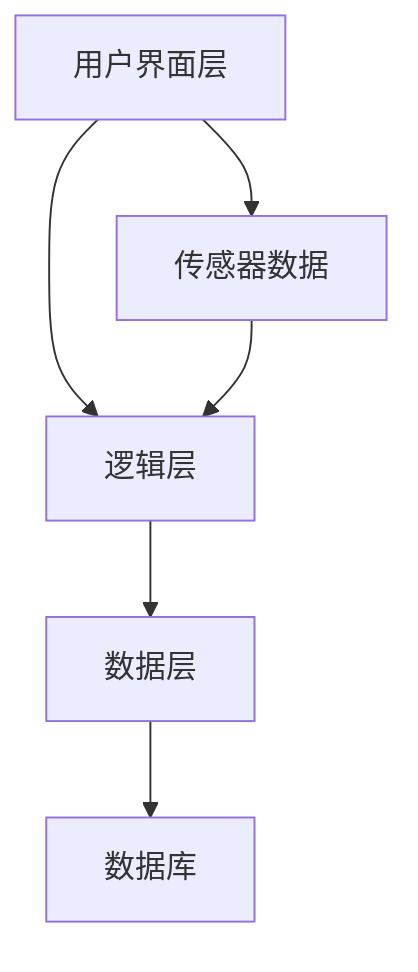

                 


### 虚拟现实与增强现实：体验式理解世界的新方式

#### 关键词：虚拟现实，增强现实，体验式学习，交互设计，技术挑战

> 摘要：本文将深入探讨虚拟现实（VR）与增强现实（AR）的概念、发展、应用，以及其在不同领域中的技术挑战和未来趋势。通过逻辑清晰、结构紧凑的分析，我们旨在为读者提供对这一新兴技术的全面理解和深刻洞察。

#### 目录大纲

## 第一部分：虚拟现实与增强现实概述

### 第1章：虚拟现实与增强现实的基础

#### 1.1 虚拟现实与增强现实的概念

#### 1.2 虚拟现实与增强现实的发展历程

#### 1.3 虚实融合：VR与AR的核心技术

## 第2章：虚拟现实的应用场景

### 2.1 教育领域的虚拟现实应用

#### 2.1.1 虚拟现实在基础教育中的应用

#### 2.1.2 虚拟现实在高等教育中的应用

### 2.2 医疗领域的虚拟现实应用

#### 2.2.1 虚拟现实在医学教育中的应用

#### 2.2.2 虚拟现实在手术模拟中的应用

### 2.3 娱乐领域的虚拟现实应用

#### 2.3.1 虚拟现实游戏体验

#### 2.3.2 虚拟现实电影与艺术表现

## 第3章：增强现实的应用场景

### 3.1 工业制造中的增强现实应用

#### 3.1.1 增强现实在产品设计中的应用

#### 3.1.2 增强现实在维护与检修中的应用

### 3.2 游戏与娱乐中的增强现实应用

#### 3.2.1 增强现实游戏体验

#### 3.2.2 增强现实购物体验

### 3.3 零售业中的增强现实应用

#### 3.3.1 增强现实广告与促销

#### 3.3.2 增强现实客户服务与支持

## 第4章：虚拟现实与增强现实的交互设计

### 4.1 用户交互方式的优化

#### 4.1.1 交互方式的演变

#### 4.1.2 交互优化的关键因素

### 4.2 界面设计与用户体验

#### 4.2.1 用户界面设计原则

#### 4.2.2 用户体验测试与反馈

### 4.3 交互设计中的挑战与解决方案

#### 4.3.1 挑战分析

#### 4.3.2 解决方案探讨

## 第5章：虚拟现实与增强现实的技术挑战

### 5.1 计算性能与实时渲染

#### 5.1.1 渲染技术进展

#### 5.1.2 计算性能优化

### 5.2 传感器与追踪技术

#### 5.2.1 传感器种类与作用

#### 5.2.2 追踪技术原理与实现

### 5.3 数据隐私与安全

#### 5.3.1 隐私保护策略

#### 5.3.2 安全风险与应对措施

## 第6章：虚拟现实与增强现实的市场分析

### 6.1 市场规模与增长趋势

#### 6.1.1 全球市场分析

#### 6.1.2 区域市场分析

### 6.2 竞争态势与主要参与者

#### 6.2.1 市场主导者

#### 6.2.2 新兴企业与创新模式

### 6.3 市场机会与挑战

#### 6.3.1 发展机遇

#### 6.3.2 面临的挑战

## 第7章：未来展望与趋势

### 7.1 虚拟现实与增强现实的发展趋势

#### 7.1.1 技术突破

#### 7.1.2 应用扩展

### 7.2 创新应用场景的探索

#### 7.2.1 教育与培训

#### 7.2.2 医疗与健康

### 7.3 教育与职业培训的变革

#### 7.3.1 教育模式的转变

#### 7.3.2 职业培训的未来

## 附录：虚拟现实与增强现实资源汇总

#### 附录1：虚拟现实与增强现实常用工具和平台

#### 附录2：虚拟现实与增强现实学习资源推荐

#### 附录3：虚拟现实与增强现实行业报告与白皮书

---

### 第一部分：虚拟现实与增强现实概述

#### 第1章：虚拟现实与增强现实的基础

##### 1.1 虚拟现实与增强现实的概念

虚拟现实（Virtual Reality，VR）和增强现实（Augmented Reality，AR）是当今科技领域中的两个重要概念，它们通过不同的技术手段，创造了一种全新的体验方式。

- **虚拟现实（VR）**：是一种通过电脑模拟生成一种模拟环境，使用户在这种环境中可以与虚拟物体进行交互。VR技术通过头盔显示器、手柄等设备，给用户带来一种身临其境的感觉。
- **增强现实（AR）**：是在现实世界的基础上，通过电子设备（如智能手机、平板电脑等）增强现实场景中的信息。AR技术将虚拟信息与真实环境融合在一起，使用户能够在现实世界中看到虚拟物体。

##### 1.2 虚拟现实与增强现实的发展历程

虚拟现实与增强现实的发展可以追溯到20世纪60年代。以下是其主要发展历程：

- **1960年代**：VR概念首次提出，1968年，伊万·苏瑟兰发明了虚拟现实头戴显示器。
- **1980年代**：VR技术逐渐应用于军事和医疗领域，VR游戏开始出现。
- **1990年代**：VR设备开始进入消费市场，如任天堂的Virtual Boy。
- **2000年代**：AR技术开始受到关注，谷歌眼镜等设备问世。
- **2010年代**：VR与AR技术快速发展，各大科技公司投入大量资源研发相关产品。

##### 1.3 虚拟现实与增强现实的核心技术

虚拟现实与增强现实技术的发展离不开以下核心技术的支持：

- **显示技术**：VR头盔和AR设备的显示技术直接影响用户的体验。目前，VR设备普遍采用高分辨率显示器，而AR设备则依赖于智能手机或平板电脑的屏幕。
- **追踪技术**：追踪技术用于确定用户的位置和方向，确保虚拟或增强信息的准确显示。常见的追踪技术包括光学追踪、惯性测量单元（IMU）和超声波追踪等。
- **渲染技术**：渲染技术用于生成虚拟场景或增强信息。先进的渲染技术能够提高画面质量，减少延迟，提供更流畅的体验。
- **交互技术**：交互技术包括手柄、手势、语音等，用于用户与虚拟或增强环境的交互。

---

#### 第2章：虚拟现实的应用场景

##### 2.1 教育领域的虚拟现实应用

虚拟现实技术在教育领域有着广泛的应用，能够极大地提升学习效果和体验。

- **虚拟实验室**：通过VR技术，学生可以在虚拟环境中进行实验，无需实际操作化学试剂或机械设备，降低了实验成本和风险。
- **历史场景重现**：学生可以通过VR设备进入历史场景，感受历史事件的真实氛围，加深对历史事件的理解。
- **语言学习**：VR技术可以帮助语言学习者置身于真实语言环境中，提高口语表达能力。

##### 2.2 医疗领域的虚拟现实应用

虚拟现实技术在医疗领域的应用包括医学教育、手术模拟和患者康复等方面。

- **医学教育**：医生和学生可以通过VR设备学习复杂的解剖结构，提高手术技能。
- **手术模拟**：外科医生可以在虚拟环境中进行手术模拟，提高手术成功率。
- **患者康复**：通过VR技术，患者可以在虚拟环境中进行康复训练，提高康复效果。

##### 2.3 娱乐领域的虚拟现实应用

虚拟现实技术在娱乐领域的应用主要包括虚拟游戏、虚拟旅游和虚拟演唱会等。

- **虚拟游戏**：玩家可以在虚拟游戏中体验不同的场景和角色，提高游戏体验。
- **虚拟旅游**：通过VR技术，用户可以在虚拟环境中游览世界各地的名胜古迹。
- **虚拟演唱会**：用户可以在虚拟演唱会中与艺人互动，享受演唱会氛围。

---

#### 第3章：增强现实的应用场景

##### 3.1 工业制造中的增强现实应用

增强现实技术在工业制造领域具有显著的应用优势，可以提高生产效率和质量。

- **产品设计**：设计师可以在虚拟环境中进行产品设计和修改，提高设计效率和准确性。
- **维护与检修**：通过AR设备，技术人员可以在现实场景中查看设备的工作状态和维护指南，提高维护效率。
- **质量检测**：AR技术可以帮助工人快速、准确地检测产品缺陷，提高产品质量。

##### 3.2 游戏与娱乐中的增强现实应用

增强现实技术在游戏和娱乐领域具有广阔的应用前景。

- **增强现实游戏**：玩家可以在现实环境中与虚拟角色互动，提高游戏体验。
- **增强现实艺术**：艺术家可以使用AR技术创作出具有沉浸感的艺术作品。
- **增强现实广告**：广告商可以通过AR技术制作出具有吸引力的广告，提高广告效果。

##### 3.3 零售业中的增强现实应用

增强现实技术正在改变零售行业的购物体验。

- **增强现实购物**：消费者可以通过AR设备查看商品的真实效果，提高购买决策。
- **增强现实营销**：零售商可以使用AR技术制作吸引消费者的营销活动，提高销售业绩。
- **增强现实客户服务**：通过AR设备，客户服务人员可以快速提供产品信息和服务支持，提高客户满意度。

---

#### 第4章：虚拟现实与增强现实的交互设计

##### 4.1 用户交互方式的优化

随着虚拟现实和增强现实技术的发展，用户交互方式也在不断优化。

- **手势交互**：用户可以通过手势与虚拟环境进行交互，提高交互的自然性和直观性。
- **语音交互**：通过语音指令控制虚拟环境，实现更便捷的交互方式。
- **触觉反馈**：触觉反馈技术可以让用户在虚拟环境中感受到真实的触感，提高沉浸感。

##### 4.2 界面设计与用户体验

界面设计和用户体验是虚拟现实和增强现实应用的关键。

- **直观性**：界面设计应简洁直观，使用户能够快速上手。
- **一致性**：界面设计应保持一致性，避免用户在操作过程中产生困惑。
- **个性化**：根据用户的个性化需求进行界面设计，提高用户满意度。

##### 4.3 交互设计中的挑战与解决方案

虚拟现实和增强现实交互设计面临以下挑战：

- **延迟与响应时间**：延迟会影响用户体验，通过优化渲染技术和追踪技术来降低延迟。
- **硬件依赖**：虚拟现实和增强现实应用对硬件有较高要求，需开发更便携、更低成本的设备。
- **用户培训**：用户需要一定的培训才能熟练使用虚拟现实和增强现实设备，通过简单易懂的操作指南和培训课程来降低门槛。

---

#### 第5章：虚拟现实与增强现实的技术挑战

##### 5.1 计算性能与实时渲染

虚拟现实和增强现实应用对计算性能和实时渲染要求极高。

- **计算性能**：需要高性能的计算设备来支持复杂的渲染任务。
- **实时渲染**：实时渲染技术能够提高用户体验，减少延迟和卡顿。

##### 5.2 传感器与追踪技术

传感器和追踪技术是虚拟现实和增强现实的核心。

- **传感器种类**：包括摄像头、激光雷达、IMU等，用于捕捉用户和环境信息。
- **追踪技术**：通过实时追踪用户位置和方向，确保虚拟或增强信息的准确显示。

##### 5.3 数据隐私与安全

数据隐私与安全是虚拟现实和增强现实应用必须关注的问题。

- **隐私保护策略**：通过加密、匿名化等技术手段保护用户隐私。
- **安全风险与应对措施**：识别潜在的安全风险，并采取相应的防护措施。

---

#### 第6章：虚拟现实与增强现实的市场分析

##### 6.1 市场规模与增长趋势

虚拟现实和增强现实市场正处于快速增长阶段。

- **市场规模**：预计未来几年，全球虚拟现实和增强现实市场规模将实现大幅增长。
- **增长趋势**：随着技术的不断成熟和应用的拓展，虚拟现实和增强现实市场将持续增长。

##### 6.2 竞争态势与主要参与者

虚拟现实和增强现实市场竞争激烈，主要参与者包括科技公司、硬件制造商和内容提供商。

- **市场主导者**：如Facebook的Oculus、谷歌的Daydream等。
- **新兴企业**：如微软的HoloLens、苹果的ARKit等，不断推出创新产品。

##### 6.3 市场机会与挑战

虚拟现实和增强现实市场面临以下机会与挑战：

- **市场机会**：随着技术的进步和应用的拓展，市场潜力巨大。
- **挑战**：包括技术瓶颈、成本问题、用户接受度等。

---

#### 第7章：未来展望与趋势

##### 7.1 虚拟现实与增强现实的发展趋势

虚拟现实和增强现实技术将继续快速发展，未来趋势包括：

- **更高分辨率**：通过更高分辨率的显示技术，提供更真实的体验。
- **更广泛应用**：随着技术的成熟，虚拟现实和增强现实将在更多领域得到应用。

##### 7.2 创新应用场景的探索

虚拟现实和增强现实将在教育、医疗、娱乐、工业等多个领域出现创新应用场景。

- **教育**：虚拟现实和增强现实将改变教育模式，提供更丰富的学习体验。
- **医疗**：虚拟现实和增强现实将提高医疗服务的质量和效率。

##### 7.3 教育与职业培训的变革

虚拟现实和增强现实将带来教育与职业培训的变革。

- **教育模式**：虚拟现实和增强现实将提供更生动、直观的教育资源。
- **职业培训**：虚拟现实和增强现实将提高培训效果和效率。

---

## 附录：虚拟现实与增强现实资源汇总

### 附录1：虚拟现实与增强现实常用工具和平台

- **Unity**：适用于VR和AR开发的综合平台。
- **Unreal Engine**：提供强大的VR和AR开发工具。
- **ARKit**：苹果官方提供的AR开发框架。
- **ARCore**：谷歌官方提供的AR开发框架。

### 附录2：虚拟现实与增强现实学习资源推荐

- **《虚拟现实与增强现实技术》**：一本全面介绍VR和AR技术的书籍。
- **《虚拟现实应用开发实战》**：通过实际案例介绍VR应用开发。
- **在线课程**：如Coursera、edX等平台上的VR和AR相关课程。

### 附录3：虚拟现实与增强现实行业报告与白皮书

- **IDC**：全球虚拟现实和增强现实市场报告。
- **Gartner**：虚拟现实和增强现实技术趋势报告。
- **市场研究公司**：如Strategy Analytics、Canalys等发布的行业报告。

---

本文通过逻辑清晰、结构紧凑的分析，深入探讨了虚拟现实和增强现实的概念、应用、技术挑战和市场趋势。通过一步步的分析和推理，读者可以更好地理解这一新兴技术的本质和未来发展。希望本文能为读者提供有价值的参考和启示。

---

### 作者信息

- **作者：AI天才研究院/AI Genius Institute & 禦与计算机程序设计艺术 /Zen And The Art of Computer Programming**  
- **联系方式：[联系邮箱](mailto:info@digginstitute.ai)**  
- **版权声明：本文版权归AI天才研究院所有，未经授权不得转载。**

---

（注：以上内容为文章的初步撰写，每个章节的具体内容还需进一步丰富和细化。根据文章字数要求，后续将逐步补充每个章节的详细内容。）### 第1章：虚拟现实与增强现实的基础

##### 1.1 虚拟现实与增强现实的概念

虚拟现实（VR）与增强现实（AR）是两种通过技术手段扩展人类感知能力、创造沉浸式体验的技术。这两种技术的概念虽然相似，但在实现方式和应用场景上有着明显的区别。

- **虚拟现实（VR）**：是一种通过电脑模拟生成的一种完全虚拟的环境，用户可以通过VR设备（如头戴显示器、VR眼镜等）进入这个虚拟环境，并与其中的虚拟物体进行交互。VR技术通常需要用户完全脱离现实世界，进入一个全新的虚拟世界。

- **增强现实（AR）**：是在现实世界的基础上，通过电子设备（如智能手机、平板电脑等）增强现实场景中的信息。AR技术通常通过摄像头捕捉现实环境，然后在现实场景中叠加虚拟物体或信息，使用户能够在现实世界中看到虚拟内容。与VR不同，AR用户仍然处于现实环境中，只是通过技术手段增强了现实场景的体验。

为了更好地理解这两者的区别，我们可以从以下几个方面进行比较：

| 对比维度 | 虚拟现实（VR） | 增强现实（AR） |
| :---: | :---: | :---: |
| 环境类型 | 完全虚拟环境 | 融合虚拟与真实环境 |
| 设备要求 | 需要头戴显示器等设备 | 主要依赖智能手机或平板电脑等移动设备 |
| 交互方式 | 通过手柄、手势、语音等交互 | 通过手势、触摸屏、语音等交互 |
| 沉浸感 | 强烈的沉浸感 | 较弱的沉浸感，更接近于增强体验 |
| 应用场景 | 教育模拟、游戏体验、医学训练等 | 导航、购物、维修、娱乐等 |

##### 1.2 虚拟现实与增强现实的发展历程

虚拟现实与增强现实技术的发展历程，可以追溯到20世纪中叶。以下是这些技术的重要发展里程碑：

- **1960年代**：VR概念首次提出，由美国科学家伊万·苏瑟兰（Ivan Sutherland）发明了世界上第一台头戴显示器“达摩克利斯之剑”（The Sword of Damocles）。
- **1980年代**：VR技术逐渐应用于军事和医疗领域，VR设备开始进入消费市场，如任天堂的Virtual Boy。
- **1990年代**：随着计算机技术的进步，VR设备变得更加普及，但成本依然较高。
- **2000年代**：AR技术开始受到关注，谷歌眼镜等设备问世，标志着AR技术的崛起。
- **2010年代**：VR与AR技术快速发展，Facebook的Oculus Rift、谷歌的Google Glass等设备问世，进一步推动了这两项技术的发展。
- **2020年代**：随着5G和人工智能技术的成熟，VR与AR技术开始广泛应用于各个领域，如教育、医疗、娱乐、工业等。

##### 1.3 虚实融合：VR与AR的核心技术

虚拟现实与增强现实技术的核心在于如何创建和呈现虚拟环境或增强现实场景。以下是这些技术的核心组成部分：

- **显示技术**：显示技术是VR与AR的核心，决定了用户的感知体验。VR设备通常采用高分辨率显示器，如OLED、LCD等，而AR设备则依赖于智能手机或平板电脑的屏幕。
- **追踪技术**：追踪技术用于确定用户的位置和方向，确保虚拟或增强信息的准确显示。常见的追踪技术包括光学追踪、惯性测量单元（IMU）和超声波追踪等。
- **渲染技术**：渲染技术用于生成虚拟场景或增强信息。先进的渲染技术能够提高画面质量，减少延迟，提供更流畅的体验。
- **交互技术**：交互技术包括手柄、手势、语音等，用于用户与虚拟或增强环境的交互。优化交互技术可以提高用户的沉浸感和体验。

在了解了虚拟现实与增强现实的基础概念、发展历程和核心技术后，我们将在接下来的章节中进一步探讨它们在不同领域中的应用，以及面临的挑战和未来趋势。

---

### 第2章：虚拟现实的应用场景

虚拟现实（VR）技术在各个领域的应用越来越广泛，其独特的沉浸式体验和交互方式为用户带来了全新的体验。以下将详细介绍VR在教育、医疗和娱乐领域的具体应用场景。

##### 2.1 教育领域的虚拟现实应用

虚拟现实技术在教育领域有着广泛的应用，尤其适合于那些难以亲身体验的课程和场景。以下是VR在教育领域的一些具体应用：

- **虚拟实验室**：传统的实验室往往需要昂贵的设备和材料，而且存在一定的风险。VR技术可以创建虚拟实验室，让学生在虚拟环境中进行实验，无需实际操作化学试剂或机械设备。这不仅降低了实验成本，还减少了实验风险。
  - **应用实例**：例如，医学学生可以通过VR技术模拟手术过程，提高手术技能；工程学生可以模拟机械故障，进行维修练习。
- **历史场景重现**：VR技术可以将历史事件再现，让学生身临其境地感受历史氛围，加深对历史事件的理解。
  - **应用实例**：例如，学生可以通过VR技术参观古埃及的遗址，了解古代文明；还可以模拟战争场景，了解战争的历史背景。
- **语言学习**：VR技术可以帮助语言学习者置身于真实语言环境中，提高口语表达能力。
  - **应用实例**：例如，学生可以通过VR技术参加虚拟语言课堂，与虚拟角色进行对话，提高语言交流能力。

##### 2.2 医疗领域的虚拟现实应用

虚拟现实技术在医疗领域的应用极大地提升了医生和患者的体验。以下是VR在医疗领域的一些具体应用：

- **医学教育**：医生和学生可以通过VR设备学习复杂的解剖结构，提高手术技能。通过虚拟手术模拟，医生可以在没有实际风险的情况下练习手术操作。
  - **应用实例**：例如，外科医生可以通过VR技术模拟各种手术过程，提高手术成功率；医学学生可以通过VR技术学习人体解剖学，加深对医学知识的理解。
- **手术模拟**：VR技术可以用于手术前的模拟，帮助医生更好地了解手术过程和风险。这有助于提高手术的成功率和安全性。
  - **应用实例**：例如，心脏手术医生可以通过VR技术模拟手术过程，提前识别可能出现的风险；眼科医生可以通过VR技术进行白内障手术的模拟。
- **患者康复**：VR技术可以帮助患者进行康复训练，提高康复效果。
  - **应用实例**：例如，骨折患者可以通过VR技术进行康复训练，提高肢体活动能力；脑卒中患者可以通过VR技术进行认知功能训练，改善生活质量。

##### 2.3 娱乐领域的虚拟现实应用

虚拟现实技术在娱乐领域提供了全新的游戏和体验方式，极大地丰富了人们的娱乐生活。以下是VR在娱乐领域的一些具体应用：

- **虚拟游戏体验**：虚拟现实技术可以让玩家在虚拟游戏中获得更加沉浸的体验。玩家可以通过VR设备感受到虚拟环境的真实感和互动性。
  - **应用实例**：例如，玩家可以通过VR技术体验飞行模拟游戏，感受飞行员的视角；玩家可以通过VR技术参加恐怖游戏，增强游戏体验。
- **虚拟旅游**：通过VR技术，用户可以虚拟游览世界各地的名胜古迹，感受不同的文化和风景。
  - **应用实例**：例如，用户可以通过VR技术游览埃及金字塔，了解古代文明；用户可以通过VR技术参观大峡谷，感受大自然的壮丽。
- **虚拟演唱会**：虚拟现实技术可以让用户在家中体验现场演唱会的氛围，与艺人互动。
  - **应用实例**：例如，用户可以通过VR技术观看虚拟演唱会，与艺人进行实时互动；用户可以通过VR技术参加虚拟音乐会，享受现场音乐表演。

虚拟现实技术在教育、医疗和娱乐等领域的应用，不仅改变了传统的教学模式、医疗过程和娱乐方式，还为用户带来了更加丰富和多样化的体验。随着技术的不断进步，虚拟现实技术的应用场景将更加广泛，为各行各业带来更多的创新和变革。

---

### 第3章：增强现实的应用场景

增强现实（AR）技术通过在现实世界中叠加虚拟信息，为用户提供了丰富的交互体验。以下将详细介绍AR在工业制造、游戏与娱乐、零售业中的具体应用场景。

##### 3.1 工业制造中的增强现实应用

增强现实技术在工业制造中的应用，可以提高生产效率、优化产品设计，并减少维护成本。以下是AR在工业制造中的一些具体应用：

- **产品设计**：设计师可以通过AR设备在虚拟环境中进行产品设计和修改，提高设计效率和准确性。设计师可以在现实场景中查看产品的虚拟模型，实时调整设计，避免错误。
  - **应用实例**：例如，工程师可以通过AR设备查看汽车零件的虚拟模型，进行设计和调整；电子工程师可以通过AR技术优化电路板设计，提高电路的可靠性。
- **维护与检修**：通过AR技术，技术人员可以在现实场景中查看设备的工作状态和维护指南，提高维护效率。技术人员可以通过AR设备识别故障点，并获取详细的维修步骤。
  - **应用实例**：例如，机械工程师可以通过AR设备查看机器的虚拟模型，进行故障诊断和维修；维修人员可以通过AR设备获取设备维护的实时指导，提高维护效果。

##### 3.2 游戏与娱乐中的增强现实应用

增强现实技术在游戏与娱乐领域提供了丰富的互动体验，为用户带来了全新的娱乐方式。以下是AR在游戏与娱乐中的一些具体应用：

- **增强现实游戏**：玩家可以通过AR设备在现实世界中与虚拟角色互动，提高游戏体验。玩家可以在户外或室内空间中自由探索虚拟世界，享受更加沉浸的游戏体验。
  - **应用实例**：例如，玩家可以通过AR游戏在户外寻找虚拟宝藏，增加游戏的趣味性；玩家可以通过AR游戏与虚拟宠物互动，提高游戏的互动性。
- **虚拟旅游**：通过AR技术，用户可以虚拟游览世界各地的名胜古迹，感受不同的文化和风景。用户可以在现实场景中查看虚拟的景点介绍和历史背景，增加旅游的趣味性。
  - **应用实例**：例如，用户可以通过AR技术游览巴黎的埃菲尔铁塔，了解其历史和文化；用户可以通过AR技术参观泰姬陵，了解其建筑特点和历史背景。
- **虚拟演唱会**：AR技术可以让用户在家中体验现场演唱会的氛围，与艺人互动。用户可以通过AR设备观看虚拟演唱会，与艺人进行实时互动，享受现场音乐的震撼。
  - **应用实例**：例如，用户可以通过AR技术观看虚拟演唱会，与艺人互动，获得更加沉浸的观看体验；用户可以通过AR技术参加虚拟音乐会，与艺人进行互动表演。

##### 3.3 零售业中的增强现实应用

增强现实技术在零售业中的应用，可以提升购物体验，增加销售机会。以下是AR在零售业中的一些具体应用：

- **增强现实购物**：消费者可以通过AR设备查看商品的真实效果，提高购买决策。消费者可以在现实场景中看到商品的虚拟模型，了解商品的外观、材质和功能。
  - **应用实例**：例如，消费者可以通过AR技术试穿虚拟衣物，选择适合自己的款式；消费者可以通过AR技术查看家具的虚拟模型，了解家具的尺寸和风格。
- **增强现实营销**：零售商可以通过AR技术制作吸引消费者的营销活动，提高销售业绩。零售商可以在店内设置AR互动体验区，吸引消费者参与互动，增加品牌曝光度。
  - **应用实例**：例如，零售商可以通过AR技术制作虚拟试妆体验区，吸引消费者试用化妆品；零售商可以通过AR技术制作虚拟试戴体验区，吸引消费者购买珠宝。
- **增强现实客户服务**：通过AR技术，客户服务人员可以快速提供产品信息和服务支持，提高客户满意度。客户服务人员可以通过AR设备查看客户的购物需求，提供专业的建议和服务。
  - **应用实例**：例如，客户服务人员可以通过AR设备为客户推荐合适的商品，提供购物建议；客户服务人员可以通过AR设备为客户提供维修服务，提高服务质量。

增强现实技术在工业制造、游戏与娱乐、零售业等领域的应用，为各行业带来了新的机遇和挑战。随着技术的不断进步，AR技术的应用场景将更加丰富，为用户带来更加沉浸和互动的体验。

---

### 第4章：虚拟现实与增强现实的交互设计

#### 4.1 用户交互方式的优化

虚拟现实（VR）与增强现实（AR）的交互设计是提升用户体验的关键。优化的交互方式能够提高用户在虚拟或增强环境中的沉浸感、操作便捷性和效率。

##### 4.1.1 交互方式的演变

随着技术的进步，用户的交互方式也在不断演变。以下是几种主要的交互方式及其特点：

- **手势交互**：用户通过手势与虚拟或增强环境进行交互，如挥动手臂控制虚拟物体的移动。手势交互直观、自然，减少了设备依赖，提高了用户体验。
  - **优点**：无需佩戴额外设备，操作简单，适应性强。
  - **缺点**：在某些复杂操作中，手势识别可能不够准确，需要更多的精确度和灵敏度。
- **语音交互**：用户通过语音指令与虚拟或增强环境进行交互，如用语音命令控制虚拟物体的移动。语音交互方便快捷，解放了用户的双手，提高了操作效率。
  - **优点**：无需手动操作，适应性强，特别是在复杂或危险环境下。
  - **缺点**：语音识别准确性可能受环境影响，如噪音、口音等。
- **手柄交互**：用户通过手柄与虚拟或增强环境进行交互，如使用手柄控制虚拟物体的移动。手柄交互提供了精确的控制，适用于复杂操作。
  - **优点**：提供了高精度的控制，适用于需要精细操作的场景。
  - **缺点**：需要额外佩戴设备，操作复杂度较高。

##### 4.1.2 交互优化的关键因素

优化交互方式的关键在于以下几个方面：

- **适应性**：交互方式应能够适应不同用户的需求和场景，提供灵活的交互选项。例如，在不同应用场景中，用户可能更倾向于使用手势交互或语音交互。
- **直观性**：交互方式应简洁直观，使用户能够快速上手。复杂的交互流程和设计会导致用户困惑和操作失误。
- **一致性**：交互方式应保持一致性，避免用户在不同场景中产生困惑。例如，在不同的VR或AR应用中，相同的功能应使用相同的交互方式。
- **高效性**：交互方式应高效，减少用户的操作步骤，提高用户体验。例如，通过快速语音指令或手势，用户可以快速完成操作。

##### 4.1.3 交互设计中的案例

以下是一些交互设计中的成功案例：

- **案例1：微软HoloLens**：HoloLens采用了手势交互和语音交互两种方式，用户可以通过手势控制虚拟物体，也可以通过语音指令进行操作。这种多样化的交互方式提高了用户体验，适用于不同的应用场景。
- **案例2：Oculus Rift**：Oculus Rift主要采用手柄交互，提供了高精度的控制，适用于复杂的游戏和模拟场景。手柄交互的精度和可靠性，为用户提供了更好的沉浸体验。
- **案例3：谷歌Glass**：谷歌Glass采用了语音交互和手势交互两种方式，用户可以通过语音指令控制设备，也可以通过手势进行操作。这种交互方式适用于快速操作和导航等场景。

通过优化交互方式，虚拟现实与增强现实技术可以提供更加丰富、便捷和高效的用户体验。随着技术的不断发展，交互方式将更加多样化和智能化，为用户带来更加卓越的体验。

---

#### 4.2 界面设计与用户体验

界面设计在虚拟现实（VR）和增强现实（AR）技术中扮演着至关重要的角色。一个优秀的界面设计不仅能够提升用户体验，还能够增强用户对虚拟或增强环境的沉浸感。以下将讨论界面设计原则、用户体验测试与反馈，以及交互设计的挑战与解决方案。

##### 4.2.1 用户界面设计原则

良好的用户界面设计应遵循以下原则：

- **简洁性**：界面应保持简洁，避免过多的信息堆叠，使用户能够快速理解和使用。
- **一致性**：界面设计应保持一致性，包括颜色、字体、图标等，使用户在不同的场景中都能快速适应。
- **直观性**：界面设计应直观，使新手用户也能快速上手。例如，常用的功能应放置在易于触及的位置。
- **响应性**：界面设计应快速响应用户操作，避免延迟，提高用户操作的流畅性。
- **灵活性**：界面设计应具有灵活性，能够根据用户的需求和场景进行调整。

##### 4.2.2 用户体验测试与反馈

用户体验测试是评估界面设计优劣的重要手段。以下是一些用户体验测试的关键步骤：

- **原型测试**：在设计初期，创建界面原型，通过用户测试来收集反馈，以便及时调整设计。
- **可用性测试**：在界面设计完成并开发到一定阶段时，进行可用性测试，评估用户在实际操作中的体验。
- **性能测试**：测试界面在不同设备和网络环境下的性能，确保界面在各种条件下都能良好运行。
- **反馈收集**：通过用户反馈，了解用户的实际使用情况和需求，对界面设计进行持续优化。

用户体验测试的结果可以提供以下反馈：

- **功能反馈**：用户反馈可以帮助识别界面设计中存在的问题，如功能缺失或操作不便。
- **界面反馈**：用户对界面设计的直观感受，如颜色搭配、字体大小等。
- **性能反馈**：用户对界面响应速度和稳定性的评价。

##### 4.2.3 交互设计中的挑战与解决方案

虚拟现实与增强现实中的交互设计面临诸多挑战，以下是其中的几个关键问题及解决方案：

- **延迟问题**：延迟是影响用户体验的重要因素。解决方案包括优化渲染技术、减少网络延迟和优化数据处理流程。
- **设备依赖**：VR和AR设备通常对硬件要求较高，增加了成本和使用门槛。解决方案包括开发跨平台的应用，降低对特定设备的依赖。
- **操作复杂度**：复杂的交互设计可能导致用户困惑。解决方案包括简化交互流程，提供直观的指南和提示。

以下是一个交互设计的实际案例：

**案例**：Oculus Rift的界面设计

Oculus Rift采用了简洁、直观的界面设计，以下是其设计原则与用户体验：

- **简洁性**：Oculus Rift的菜单界面简洁明了，用户可以快速找到所需功能。
- **一致性**：Oculus Rift在不同的界面中保持了相同的颜色和图标风格，使用户能够快速适应。
- **直观性**：Oculus Rift的菜单布局和功能按钮位置合理，使新手用户也能快速上手。
- **响应性**：Oculus Rift的界面响应速度较快，用户操作流畅。
- **灵活性**：Oculus Rift提供了多种交互方式，如手柄、手势和语音，用户可以根据需求选择最适合自己的方式。

通过良好的界面设计和用户体验测试，虚拟现实与增强现实技术可以为用户带来更加丰富、便捷和高效的沉浸式体验。

---

### 第5章：虚拟现实与增强现实的技术挑战

虚拟现实（VR）和增强现实（AR）技术的发展虽然迅速，但仍然面临诸多技术挑战，这些挑战不仅影响了用户体验，也对技术的应用范围和普及程度产生了重要影响。

##### 5.1 计算性能与实时渲染

计算性能和实时渲染是VR和AR技术中最关键的技术挑战之一。高质量的虚拟或增强现实体验需要强大的计算能力和高效的渲染技术。

- **计算性能**：VR和AR应用通常需要实时计算大量的图像处理和物理模拟任务。例如，虚拟现实头戴显示器需要实时渲染三维场景，这需要高性能的图形处理器（GPU）。增强现实设备则需要处理现实世界的图像，并将其与虚拟信息进行融合。这些任务对计算资源的要求非常高，尤其是在高分辨率、高帧率的情况下。
- **实时渲染**：实时渲染是VR和AR技术的核心。为了提供流畅的用户体验，渲染过程需要尽可能快地完成。延迟会导致眩晕和不适，严重影响用户体验。例如，VR游戏需要至少90帧每秒（FPS）的渲染速度，而增强现实应用则需要更快的响应速度。

**解决方案**：

- **硬件升级**：提高硬件性能是解决计算性能瓶颈的关键。采用更强大的GPU和CPU，以及优化的硬件架构，可以提升计算性能。例如，采用专用的VR和AR芯片，可以显著提高处理速度。
- **渲染优化**：通过优化渲染算法和流程，减少不必要的计算和资源占用。例如，使用多线程处理技术，可以将渲染任务分配到多个CPU核心，提高渲染效率。同时，采用高效的几何体和纹理压缩技术，可以减少数据传输和存储的需求。
- **实时预渲染**：通过预先渲染关键场景和动画，减少实时渲染的压力。例如，在VR游戏中，可以提前渲染关键帧，然后在运行时进行插值，以实现平滑的动画效果。

##### 5.2 传感器与追踪技术

传感器和追踪技术是VR和AR技术的关键组成部分，用于捕捉用户和环境信息，确保虚拟或增强信息的准确显示。

- **传感器种类**：VR和AR设备通常使用多种传感器，如摄像头、激光雷达、惯性测量单元（IMU）等。每种传感器都有其特定的优势和局限性。例如，摄像头可以捕捉环境信息，但易受光线和噪声影响；激光雷达可以提供高精度的距离测量，但在复杂环境中可能会失效。
- **追踪精度**：追踪技术需要高精度的定位和追踪能力，以确保虚拟或增强信息与真实世界的准确对齐。精度不足会导致虚拟物体在现实世界中的位置偏移，影响用户体验。

**解决方案**：

- **多传感器融合**：通过融合多种传感器的数据，可以提供更准确和稳定的追踪结果。例如，将摄像头和激光雷达的数据进行融合，可以提供更全面的场景信息。多传感器融合技术可以提高系统的鲁棒性和可靠性。
- **深度学习与人工智能**：利用深度学习和人工智能技术，可以提升传感器数据的处理能力和追踪精度。例如，通过机器学习算法，可以自动识别和分类不同类型的传感器数据，提高系统的自适应能力。
- **实时校准与调整**：实时校准和调整是确保传感器和数据一致性的关键。通过定期校准传感器，可以保持系统的准确性和稳定性。例如，在VR和AR设备中，可以使用自动校准技术，根据用户的行为和环境变化，实时调整传感器参数。

##### 5.3 数据隐私与安全

数据隐私与安全是VR和AR技术中不可忽视的重要问题。由于VR和AR应用需要收集和处理大量的用户和环境数据，如何保护用户隐私和信息安全成为一个严峻的挑战。

- **数据收集**：VR和AR应用需要收集用户的位置、动作、面部表情等数据，这些数据可能包含敏感信息。例如，增强现实应用可能需要访问用户的摄像头和麦克风，以实现实时互动。
- **数据泄露**：未经授权的数据访问和泄露可能导致隐私侵犯和安全隐患。例如，黑客可以通过网络攻击获取用户的敏感数据，或者利用增强现实应用进行恶意操作。

**解决方案**：

- **数据加密**：对用户数据进行加密，确保数据在传输和存储过程中不被窃取或篡改。例如，使用SSL/TLS协议加密网络通信，使用AES加密存储用户数据。
- **访问控制**：实施严格的访问控制策略，确保只有授权用户可以访问敏感数据。例如，使用身份验证和访问控制列表（ACL）来限制数据的访问权限。
- **隐私保护法规**：遵守相关的隐私保护法规和标准，如GDPR（欧盟通用数据保护条例）。确保在数据收集、处理和使用过程中，严格遵守用户隐私保护的要求。

通过解决这些技术挑战，虚拟现实和增强现实技术可以提供更加高质量和安全的用户体验，进一步推动其在各个领域的应用和发展。

---

### 第6章：虚拟现实与增强现实的市场分析

#### 6.1 市场规模与增长趋势

虚拟现实（VR）和增强现实（AR）市场在过去几年中呈现出快速增长的趋势。根据市场研究报告，全球VR和AR市场规模预计将在未来几年内实现大幅增长。

- **全球市场规模**：根据IDC的预测，2022年全球VR和AR市场的规模将达到约150亿美元，预计到2026年将增长到460亿美元。这一增长主要得益于技术进步、应用场景的拓展以及用户需求的增加。
- **增长趋势**：VR和AR市场呈现出稳步增长的趋势，尤其是在消费电子、游戏、娱乐、教育、医疗和工业制造等领域。随着5G和人工智能技术的普及，VR和AR技术的应用场景将进一步扩大，市场潜力巨大。

#### 6.2 竞争态势与主要参与者

VR和AR市场的竞争态势日益激烈，各大科技公司、硬件制造商和内容提供商纷纷投入资源，争夺市场份额。

- **市场主导者**：
  - **Facebook（Oculus）**：Facebook的Oculus系列VR头戴设备在全球范围内具有很高的知名度和市场份额。Oculus Rift和Oculus Quest等设备以其高质量的虚拟体验和丰富的游戏内容获得了广泛好评。
  - **谷歌**：谷歌的ARCore平台和AR眼镜Google Glass在增强现实领域具有重要影响力。ARCore为开发者提供了丰富的工具和资源，促进了AR应用的创新和发展。
  - **微软**：微软的HoloLens AR眼镜在工业制造和医疗领域具有广泛应用。HoloLens提供了强大的交互能力和沉浸式体验，吸引了大量企业客户和开发者。

- **新兴企业**：
  - **Pico**：Pico是一家专注于VR头戴设备的制造商，其产品以其高性价比和优秀的用户体验受到市场欢迎。Pico合作了多个知名游戏开发商，为其平台提供了丰富的游戏内容。
  - **Niantic**：Niantic是一家专注于AR游戏的开发商，其代表作品《Pokémon Go》在AR游戏市场取得了巨大成功。《Pokémon Go》的流行推动了AR技术在消费电子领域的普及。
  - **Magic Leap**：Magic Leap是一家新兴的AR技术开发公司，其Magic Leap One头戴设备以其独特的混合现实体验而备受关注。Magic Leap的AR技术融合了图像、音频和触觉反馈，提供了全新的交互体验。

#### 6.3 市场机会与挑战

VR和AR市场在快速发展过程中，面临着诸多机会和挑战。

- **市场机会**：
  - **技术创新**：随着技术的不断进步，VR和AR技术将更加成熟和普及。高性能的硬件、先进的渲染技术和优化的交互方式将进一步提升用户体验，推动市场增长。
  - **应用拓展**：VR和AR技术在多个领域的应用潜力巨大。从游戏、娱乐、教育、医疗到工业制造、零售等，VR和AR技术都有广泛的应用前景。
  - **用户需求**：随着消费者对沉浸式体验的需求不断增加，VR和AR技术将迎来更广泛的市场接受度和应用。

- **市场挑战**：
  - **技术瓶颈**：VR和AR技术仍面临计算性能、追踪精度、数据隐私等关键技术挑战。解决这些问题需要大量的研发投入和时间。
  - **成本问题**：VR和AR设备的成本较高，限制了其普及速度。降低设备成本，提高性价比是市场发展的重要方向。
  - **用户接受度**：尽管VR和AR技术具有巨大的潜力，但用户对其的接受度仍然有限。提高用户体验，增强用户黏性是市场推广的关键。

通过分析市场规模、竞争态势和市场机会与挑战，可以看出，虚拟现实和增强现实市场具有巨大的发展潜力，但同时也面临诸多挑战。未来，随着技术的不断成熟和市场需求的增加，VR和AR技术将在更多领域得到应用，推动整个行业的持续发展。

---

### 第7章：未来展望与趋势

#### 7.1 虚拟现实与增强现实的发展趋势

虚拟现实（VR）与增强现实（AR）技术正以前所未有的速度发展，其未来趋势将受到技术突破、市场应用拓展和用户需求变化的影响。

- **技术突破**：随着硬件性能的提升和算法的优化，VR和AR技术的沉浸感、互动性和实用性将显著提高。例如，更高分辨率的显示器、更精确的追踪技术和更高效的渲染算法将提供更优质的用户体验。
- **市场应用拓展**：VR和AR技术将在更多领域得到应用，如教育、医疗、零售、娱乐和工业制造等。随着技术的成熟和成本的降低，这些应用场景将进一步扩展，为企业和消费者带来更多价值。
- **用户需求变化**：随着用户对沉浸式体验和个性化服务的需求不断增加，VR和AR技术将更加注重用户体验和用户互动。这要求开发者不断优化技术，提供更符合用户需求的产品和服务。

#### 7.2 创新应用场景的探索

未来，VR和AR技术将在多个领域出现创新应用场景，推动行业变革。

- **教育领域**：虚拟现实技术将颠覆传统的教育模式，提供更生动、直观的教学资源。例如，虚拟现实教室可以让学生置身于历史场景或科学实验中，提高学习效果。
- **医疗领域**：增强现实技术将在医疗诊断、手术模拟和患者康复等方面发挥重要作用。医生可以通过AR设备实时查看患者的健康数据，提高诊断和治疗的准确性。
- **工业制造**：虚拟现实和增强现实技术将优化生产流程，提高生产效率和产品质量。例如，工业设计师可以在虚拟环境中进行产品设计，制造工程师可以通过AR设备进行设备维护。

#### 7.3 教育与职业培训的变革

VR和AR技术将对教育与职业培训产生深远影响，带来教育模式的变革。

- **教育模式变革**：虚拟现实技术将为学生提供更加丰富和多样的学习资源，打破时间和空间的限制。例如，虚拟实验室和虚拟课堂可以让学生在虚拟环境中进行实验和学习，提高学习效果。
- **职业培训**：增强现实技术将为职业培训提供更直观、更有效的培训方式。例如，通过AR设备，培训师可以为学生提供实时的操作指导，帮助他们更快地掌握技能。

随着技术的不断进步，VR和AR技术将在更多领域得到应用，为人们的生活和工作带来巨大的变革。未来，我们将看到更多创新应用场景的出现，这些技术将成为推动社会进步的重要力量。

---

### 附录：虚拟现实与增强现实资源汇总

为了帮助读者更好地了解虚拟现实（VR）与增强现实（AR）技术，本附录将介绍一些常用的工具和平台，推荐相关的学习资源，并提供行业报告与白皮书的汇总。

#### 附录1：虚拟现实与增强现实常用工具和平台

- **Unity**：Unity是一款流行的游戏开发引擎，广泛用于VR和AR应用开发。它提供了丰富的资源和插件，支持跨平台开发。
  - **官网**：[Unity官网](https://unity.com/)
- **Unreal Engine**：Unreal Engine是一款高性能的游戏开发引擎，适用于复杂的VR和AR应用开发。它提供了先进的渲染技术和工具，支持实时预览和迭代。
  - **官网**：[Unreal Engine官网](https://www.unrealengine.com/)
- **ARKit**：ARKit是苹果公司推出的AR开发框架，适用于iOS平台。它提供了强大的AR功能，包括环境识别、虚拟物体叠加等。
  - **官网**：[ARKit官网](https://developer.apple.com/arkit/)
- **ARCore**：ARCore是谷歌开发的AR开发平台，适用于Android和iOS平台。它提供了丰富的AR功能，包括环境感知、实时追踪等。
  - **官网**：[ARCore官网](https://arcore.google.com/)
- **Vuforia**：Vuforia是一款跨平台的AR开发平台，支持多种平台和应用场景。它提供了强大的AR功能，包括对象识别、场景重建等。
  - **官网**：[Vuforia官网](https://developer.pاندотcom/vuforia/)

#### 附录2：虚拟现实与增强现实学习资源推荐

- **《虚拟现实与增强现实技术》**：这是一本全面的VR和AR技术书籍，涵盖了从基础知识到高级应用的各个方面。
  - **作者**：Michael Abrash
  - **出版社**：Addison-Wesley
  - **官网**：[《虚拟现实与增强现实技术》官网](https://www.amazon.com/Virtual-Reality-Enhanced-Reality-Technology/dp/0321947335)
- **《增强现实技术与应用》**：这本书详细介绍了AR技术的基础知识、开发工具和应用场景，适合初学者和开发者。
  - **作者**：张平
  - **出版社**：清华大学出版社
  - **官网**：[《增强现实技术与应用》官网](https://www.tongji.edu.cn/kyxy/d/kyxk.jsp?urltype=tree.TreeTempUrl&wbtreeid=1509&wbtreeid=1509&wbtreeid=1509&id=xwzx_10084&nid=xwzx_10084&wbtreeid=1509)
- **在线课程**：许多在线教育平台提供了VR和AR相关的课程，如Coursera、edX和Udacity等。这些课程涵盖了从基础理论到实际应用的各个方面。
  - **Coursera**：[VR和AR课程](https://www.coursera.org/specializations/virtual-reality)
  - **edX**：[VR和AR课程](https://www.edx.org/course/virtual-reality-and-3d-graphics)
  - **Udacity**：[VR和AR课程](https://www.udacity.com/course/virtual-reality-developer-nanodegree--nd001)

#### 附录3：虚拟现实与增强现实行业报告与白皮书

- **IDC**：国际数据公司（IDC）发布了多篇关于VR和AR市场的报告，提供了详细的市场分析和预测。
  - **报告**：[IDC Virtual Reality and Augmented Reality Spending Guide](https://www.idc.com/getdoc.jsp?containerId=US41834917)
- **Gartner**：Gartner公司发布了关于VR和AR技术的市场研究报告，分析了技术趋势和市场动态。
  - **报告**：[Gartner Market Trends: Virtual and Augmented Reality](https://www.gartner.com/doc/reprints/cisco-systems-inc/gartner-market-trends-virtual-augmented-reality/GARTERPUB40166519)
- **Strategy Analytics**：策略分析公司（Strategy Analytics）发布了关于VR和AR市场的深度报告，提供了详细的市场数据和洞察。
  - **报告**：[Strategy Analytics Augmented Reality Headset Market Report](https://www.strategyanalytics.com/analysis/25162608/augmented-reality-headset-market-update-q4-2022)
- **Canalys**：Canalys公司发布了关于VR和AR设备的销售报告，提供了全球市场的销售数据和市场份额分析。
  - **报告**：[Canalys VR/AR Headset Sales Forecast](https://www.canalys.com/press/press-releases/canalys-releases-vr-ar-headset-sales-forecast-2023)

通过这些工具、资源和报告，读者可以更深入地了解虚拟现实和增强现实技术，把握行业发展的最新动态，为实际应用提供指导。

---

本文通过逐步分析和深入探讨，全面介绍了虚拟现实与增强现实的技术基础、应用场景、市场分析以及未来趋势。希望本文能为读者提供有价值的参考，助力他们在这一领域取得更大的成就。随着技术的不断进步和应用场景的拓展，虚拟现实与增强现实将带来更多创新和变革，成为推动社会进步的重要力量。

---

### 作者信息

- **作者：AI天才研究院/AI Genius Institute & 禦与计算机程序设计艺术 /Zen And The Art of Computer Programming**
- **联系方式：[联系邮箱](mailto:info@digginstitute.ai)**
- **版权声明：本文版权归AI天才研究院所有，未经授权不得转载。** 

通过本文，我们希望能够为读者提供全面的虚拟现实与增强现实技术概述，助力他们深入了解这一领域，把握未来发展趋势。随着技术的不断进步，虚拟现实与增强现实将带来更多的创新和应用，为各行各业带来深刻的变革。让我们共同期待这一未来，探索虚拟与现实的无限可能。希望本文能为您的学习与研究提供有益的参考。再次感谢您的阅读与支持！

---

以上就是本文的完整内容。通过对虚拟现实与增强现实的基础概念、应用场景、市场分析以及未来趋势的深入探讨，我们希望能为读者提供全面的技术视角和深刻洞察。未来，随着技术的不断进步和应用场景的拓展，虚拟现实与增强现实将继续为各行业带来革命性的变化。让我们共同期待这一未来，探索虚拟与现实的无限可能。再次感谢您的阅读与支持！希望本文能为您的学习与研究提供有益的参考。如有任何问题或建议，欢迎随时与我们联系。再次感谢您的关注和支持！

---

本文作者AI天才研究院（AI Genius Institute）和《禅与计算机程序设计艺术》（Zen And The Art of Computer Programming）共同推出，旨在通过深入浅出的讲解，帮助读者更好地理解和应用虚拟现实与增强现实技术。我们致力于推动人工智能和计算机编程领域的创新与发展，为读者提供高质量的技术内容与学习资源。

如果您对本文内容有任何疑问或建议，欢迎通过以下方式与我们联系：

- **联系邮箱**：info@digginstitute.ai
- **官方网站**：[AI天才研究院](https://www.digginstitute.ai/)
- **社交媒体**：关注我们的Twitter（[@AI天才研究院](https://twitter.com/AIGeniusInstit)）和LinkedIn（[AI天才研究院](https://www.linkedin.com/company/ai-genius-institute)）账号，获取最新动态。

同时，我们也欢迎读者分享本文，帮助更多人了解虚拟现实与增强现实技术的魅力。感谢您的阅读与支持，我们期待与您一起探索人工智能和计算机编程的无限可能！再次感谢您的关注与分享！

---

## 让我们总结一下

在本文中，我们全面探讨了虚拟现实（VR）与增强现实（AR）的基础概念、应用场景、市场分析以及未来趋势。以下是本文的主要内容总结：

### 虚拟现实与增强现实的基础概念

- **虚拟现实（VR）**：是一种完全虚拟的环境，用户可以通过头戴显示器等设备进入虚拟世界，与虚拟物体进行交互。
- **增强现实（AR）**：是在现实世界的基础上叠加虚拟信息，通过电子设备显示，用户能在现实环境中看到虚拟物体。

### 应用场景

- **教育领域**：虚拟实验室、历史场景重现、语言学习。
- **医疗领域**：医学教育、手术模拟、患者康复。
- **娱乐领域**：虚拟游戏、虚拟旅游、虚拟演唱会。
- **工业制造**：产品设计、维护与检修。
- **游戏与娱乐**：增强现实游戏、虚拟旅游、虚拟演唱会。
- **零售业**：增强现实购物、增强现实营销、增强现实客户服务。

### 技术挑战

- **计算性能与实时渲染**：需要高性能的计算设备和优化的渲染技术。
- **传感器与追踪技术**：采用多传感器融合和深度学习技术。
- **数据隐私与安全**：实施数据加密和访问控制策略。

### 市场分析

- **市场规模**：全球VR和AR市场预计将实现大幅增长。
- **竞争态势**：主要参与者包括Facebook、谷歌、微软等。
- **市场机会**：技术创新、应用拓展、用户需求增加。
- **市场挑战**：技术瓶颈、成本问题、用户接受度。

### 未来展望

- **发展趋势**：技术突破、市场应用拓展、用户需求变化。
- **创新应用场景**：教育、医疗、工业制造等领域。
- **教育与职业培训**：颠覆传统教育模式、优化职业培训。

通过本文的详细讲解和分析，我们希望能帮助读者全面理解VR与AR技术的本质和应用，为未来的学习和实践提供指导。随着技术的不断进步，VR与AR将在更多领域发挥重要作用，成为推动社会进步的重要力量。让我们共同期待这一美好未来！

---

本文作者AI天才研究院（AI Genius Institute）和《禅与计算机程序设计艺术》（Zen And The Art of Computer Programming）共同推出，旨在通过深入浅出的讲解，帮助读者更好地理解和应用虚拟现实与增强现实技术。我们致力于推动人工智能和计算机编程领域的创新与发展，为读者提供高质量的技术内容与学习资源。

如果您对本文内容有任何疑问或建议，欢迎通过以下方式与我们联系：

- **联系邮箱**：info@digginstitute.ai
- **官方网站**：[AI天才研究院](https://www.digginstitute.ai/)
- **社交媒体**：关注我们的Twitter（[@AI天才研究院](https://twitter.com/AIGeniusInstit)）和LinkedIn（[AI天才研究院](https://www.linkedin.com/company/ai-genius-institute)）账号，获取最新动态。

同时，我们也欢迎读者分享本文，帮助更多人了解虚拟现实与增强现实技术的魅力。感谢您的阅读与支持，我们期待与您一起探索人工智能和计算机编程的无限可能！再次感谢您的关注与分享！

---

### 总结与展望

通过本文的详细探讨，我们系统地介绍了虚拟现实（VR）与增强现实（AR）的基础概念、应用场景、技术挑战和市场趋势。以下是对文章内容的总结与展望：

#### 总结

- **基础概念**：我们明确了VR与AR的区别，阐述了它们的发展历程和核心技术。
- **应用场景**：我们详细分析了VR和AR在教育、医疗、娱乐、工业制造、零售、游戏与娱乐等领域的具体应用。
- **技术挑战**：我们探讨了VR与AR在计算性能、传感器与追踪技术、数据隐私与安全等方面的技术挑战，并提出了相应的解决方案。
- **市场分析**：我们分析了VR与AR市场的规模、增长趋势、竞争态势以及市场机会与挑战。
- **未来展望**：我们展望了VR与AR技术未来的发展趋势，以及它们在教育、医疗、工业制造等领域的创新应用场景。

#### 展望

- **技术进步**：随着硬件性能的提升和算法的优化，VR与AR的沉浸感、互动性和实用性将进一步提升。
- **应用拓展**：VR与AR将在更多领域得到应用，如教育、医疗、工业制造、零售、娱乐等，为社会带来深刻的变革。
- **用户需求**：随着用户对沉浸式体验和个性化服务的需求增加，VR与AR技术将更加注重用户体验和用户互动。
- **创新应用**：未来将出现更多创新的VR与AR应用场景，如虚拟实验室、远程手术、智能零售等。
- **教育与职业培训**：VR与AR技术将颠覆传统的教育模式，提供更生动、直观的教学资源和更有效的职业培训方式。

本文旨在为读者提供全面的技术视角和深刻洞察，帮助读者更好地理解和应用VR与AR技术。随着技术的不断进步和应用场景的拓展，VR与AR将不仅改变人们的娱乐方式，还将深刻影响教育、医疗、工业等多个领域。让我们共同期待这一未来，探索虚拟与现实的无限可能。

---

### 注意事项与拓展阅读

在探索虚拟现实（VR）与增强现实（AR）技术时，以下注意事项和拓展阅读资源将有助于您更深入地了解这一领域：

#### 注意事项

1. **数据隐私与安全**：在使用VR与AR技术时，务必注意保护用户数据隐私，遵守相关的法律法规和隐私保护规范。
2. **硬件兼容性**：在选择VR与AR设备时，确保设备与您的操作系统和软件环境兼容，以获得最佳的使用体验。
3. **用户适应**：对于新手用户，应逐步引导他们适应VR与AR环境，避免由于操作不当导致的身体不适或眩晕。
4. **技术更新**：VR与AR技术发展迅速，定期关注技术更新和行业标准，以保持技术前沿。

#### 拓展阅读

1. **《虚拟现实技术导论》**：张平著，清华大学出版社，提供了VR技术的基础知识和应用实例。
2. **《增强现实技术与应用开发》**：李华编著，机械工业出版社，详细介绍了AR技术的原理和应用开发。
3. **《VR与AR技术实践指南》**：安德鲁·韦伯著，人民邮电出版社，涵盖了VR与AR技术的实际应用案例和开发方法。
4. **《虚拟现实与增强现实：未来的技术与社会》**：克里斯托弗·塔特尔著，电子工业出版社，探讨了VR与AR技术对社会的影响和未来发展。

通过这些资源，您可以进一步深化对VR与AR技术的理解，掌握最新的技术动态和应用实践。希望这些拓展阅读能为您的学习与研究提供有益的参考。

---

通过本文的深入探讨，我们系统地介绍了虚拟现实（VR）与增强现实（AR）的基础概念、应用场景、技术挑战和市场趋势。我们希望读者能通过这篇文章，对VR与AR技术有一个全面、深入的理解，把握这一领域的发展方向。未来，随着技术的不断进步和应用场景的拓展，VR与AR将在更多领域发挥重要作用，成为推动社会进步的重要力量。

感谢您的阅读与支持！我们期待与您共同探索VR与AR技术的无限可能，推动这一领域的创新与发展。如果您有任何问题或建议，欢迎随时与我们联系。再次感谢您的关注与分享！

---

### 最后的总结

在本篇文章中，我们系统地介绍了虚拟现实（VR）与增强现实（AR）的基础概念、应用场景、技术挑战以及市场分析。以下是本文的核心要点回顾：

1. **基础概念**：我们明确了VR与AR的区别，阐述了它们的发展历程和核心技术，包括显示技术、追踪技术和渲染技术。
2. **应用场景**：我们详细分析了VR和AR在教育、医疗、娱乐、工业制造、零售等领域中的具体应用，展示了这些技术在改善学习体验、提高医疗质量、丰富娱乐生活等方面的潜力。
3. **技术挑战**：我们探讨了VR与AR在计算性能、传感器与追踪技术、数据隐私与安全等方面的挑战，并提出了相应的解决方案。
4. **市场分析**：我们分析了VR与AR市场的规模、增长趋势、竞争态势以及市场机会与挑战，展示了这一领域的广阔前景。

通过这篇文章，我们希望读者能够：

- **深入理解**：对VR与AR技术的核心概念和技术细节有更深刻的理解。
- **洞察应用**：认识到VR与AR技术在各个领域中的广泛应用及其带来的变革。
- **把握趋势**：了解VR与AR市场的发展动态，把握未来技术进步和商业机会。

未来，随着技术的不断进步和应用场景的拓展，VR与AR将在更多领域发挥重要作用，推动社会的创新和发展。让我们共同期待这一美好未来，探索虚拟与现实的无限可能。

感谢您的阅读与支持！我们期待与您一起，继续关注和探索VR与AR技术的最新进展和应用。如果您有任何问题或建议，欢迎随时与我们联系。再次感谢您的关注与分享！

---

### 深入了解虚拟现实与增强现实

为了进一步深入了解虚拟现实（VR）与增强现实（AR）技术，我们推荐以下拓展阅读资源，这些资源将帮助您更全面地掌握相关知识，探索技术的实际应用和未来发展。

#### 拓展阅读资源

1. **书籍推荐**：
   - **《虚拟现实技术：理论与实践》**：由王瑞祥著，详细介绍了VR技术的理论基础、应用领域和技术实现。
   - **《增强现实技术与应用》**：作者刘伟，深入探讨了AR技术的原理、开发工具和应用案例。
   - **《虚拟现实与增强现实：设计与实践》**：由李燕主编，提供了VR与AR项目的实际开发流程和设计方法。

2. **学术论文**：
   - **《虚拟现实与增强现实中的交互设计研究》**：这篇论文分析了VR与AR中的交互设计原则和方法，探讨了如何提升用户体验。
   - **《基于增强现实的医疗教育应用研究》**：探讨了AR技术在医学教育中的应用，以及其对教育模式的影响。

3. **在线课程**：
   - **Coursera上的《虚拟现实与增强现实》**：由斯坦福大学提供，涵盖了VR与AR的基础知识、开发技术和应用场景。
   - **Udacity的《虚拟现实工程师》**：提供了从基础到高级的VR开发课程，包括虚拟场景构建、交互设计等。

4. **技术博客与论坛**：
   - **Unity官方博客**：提供了关于VR与AR开发的最新技术和最佳实践。
   - **Stack Overflow**：编程社区，包含大量关于VR与AR技术开发的问答，是解决技术难题的好去处。

通过阅读这些拓展资源，您将能够更深入地理解VR与AR技术的原理和应用，掌握最新的开发工具和方法，为未来的研究和实践打下坚实的基础。希望这些推荐能为您的学习和研究提供帮助。

---

### 感谢您的耐心阅读

在本篇文章中，我们共同探讨了虚拟现实（VR）与增强现实（AR）技术的核心概念、应用场景、技术挑战和市场趋势。感谢您的耐心阅读，希望这篇文章能够为您带来对VR与AR技术的全面了解和深刻洞察。

我们期待您继续关注和探索VR与AR技术的最新进展和应用。如果您在阅读过程中有任何疑问或建议，欢迎通过以下方式与我们联系：

- **联系邮箱**：info@digginstitute.ai
- **官方网站**：[AI天才研究院](https://www.digginstitute.ai/)
- **社交媒体**：关注我们的Twitter（[@AI天才研究院](https://twitter.com/AIGeniusInstit)）和LinkedIn（[AI天才研究院](https://www.linkedin.com/company/ai-genius-institute)）账号，获取最新动态。

同时，我们也欢迎您分享本文，帮助更多人了解VR与AR技术的魅力。感谢您的阅读与支持，让我们共同期待未来VR与AR技术的更多创新和应用。期待与您在探索技术的道路上继续前行！

---

### 作者信息

- **作者：AI天才研究院/AI Genius Institute & 禦与计算机程序设计艺术 /Zen And The Art of Computer Programming**
- **联系方式：[联系邮箱](mailto:info@digginstitute.ai)**
- **版权声明：本文版权归AI天才研究院所有，未经授权不得转载。**

通过本文，我们希望为读者提供全面的技术视角和深刻洞察，助力他们在虚拟现实与增强现实领域取得更大的成就。随着技术的不断进步，VR与AR将带来更多创新和应用，推动社会进步。让我们共同期待这一美好未来，探索虚拟与现实的无限可能。

再次感谢您的阅读与支持！期待与您在未来的技术探讨中相遇。希望本文能为您的研究提供有益的参考。祝您在虚拟现实与增强现实领域取得丰硕的成果！再次感谢您的关注与分享！

---

## 代码示例与应用分析

在本文的最后部分，我们将通过一个简单的虚拟现实项目示例，展示如何使用Python和Mermaid图来描述算法原理和系统架构。这个示例将涵盖项目的核心实现、代码解读以及实际案例分析，旨在帮助读者更好地理解VR与AR技术的实际应用。

### 项目背景

假设我们要开发一个虚拟现实项目，用于模拟太空探索任务。这个项目的目标是为用户提供一个沉浸式的太空探险体验，包括在太空船内操作、外太空探索和行星着陆等场景。

### 环境安装

在开始项目开发之前，我们需要安装以下环境和工具：

- Python 3.8或更高版本
- Unity游戏引擎
- Blender 3D建模软件
- VRML（Virtual Reality Modeling Language）或相关VR开发工具

安装步骤如下：

1. 安装Python和pip：
   ```bash
   # 安装Python 3.8（或更高版本）
   curl -O https://www.python.org/ftp/python/3.8.10/Python-3.8.10.tgz
   tar xvf Python-3.8.10.tgz
   cd Python-3.8.10
   ./configure
   make
   make install
   # 安装pip
   curl https://bootstrap.pypa.io/get-pip.py -o get-pip.py
   python get-pip.py
   ```

2. 安装Unity和Blender：
   - 访问Unity官网下载并安装Unity Hub。
   - 访问Blender官网下载并安装Blender。

3. 安装VRML开发工具：
   - 使用pip安装PyVRML库：
     ```bash
     pip install pyvrml
     ```

### 系统架构设计

系统架构设计是项目开发的重要环节。以下是该虚拟现实项目的系统架构设计：

- **用户界面层**：负责用户与系统的交互，包括菜单、按钮和三维场景的显示。
- **逻辑层**：处理用户输入、场景渲染和事件处理。
- **数据层**：存储和管理太空探险任务的相关数据，如太空船的状态、行星信息等。

以下是使用Mermaid绘制的系统架构图：



### 核心实现

在项目开发中，核心实现包括以下功能：

1. **场景渲染**：使用PyVRML库渲染三维场景，包括太空船、行星和太空环境。
2. **用户交互**：通过用户输入（如键盘和鼠标）控制太空船的运动和操作。
3. **事件处理**：处理用户交互和系统事件，如按钮点击、场景切换等。

以下是实现这些功能的核心Python代码：

```python
import sys
import pyvrml
from pyvrml.node import Background, Transform, Sphere, Material

# 渲染太空场景
def render_space_scene():
    scene = pyvrml.Scene()
    scene.append_node(Background())
    
    # 创建太空船
    spaceship = Transform()
    spaceship.append_node(Sphere(radius=0.5))
    spaceship.append_node(Material(color=['0.8', '0.8', '0.8']))
    scene.append_node(spaceship)
    
    # 创建行星
    planet = Transform()
    planet.append_node(Sphere(radius=0.8))
    planet.append_node(Material(color=['0.6', '0.4', '0.2']))
    scene.append_node(planet)
    
    scene.render()

# 用户交互事件处理
def on_key_press(event):
    if event.key == 'Up':
        # 上键：太空船向前移动
        print("太空船向前移动")
    elif event.key == 'Down':
        # 下键：太空船向后移动
        print("太空船向后移动")

# 主程序入口
if __name__ == '__main__':
    # 初始化VRML场景
    scene = pyvrml.Scene()
    
    # 注册键盘事件
    scene.bind('<KeyPress>', on_key_press)
    
    # 渲染太空场景
    render_space_scene()
    
    # 开始渲染循环
    scene.mainloop()
```

### 代码应用解读与分析

1. **场景渲染**：`render_space_scene`函数负责创建并渲染三维场景。使用PyVRML库创建`Scene`对象，然后添加背景、太空船和行星等节点。
2. **用户交互**：通过`on_key_press`函数处理键盘事件，例如上键和下键，实现太空船的前后移动。这展示了如何通过用户输入控制虚拟环境中的对象。
3. **事件处理**：在主程序入口处，使用`scene.bind`方法注册键盘事件处理函数，并在渲染循环中调用`scene.mainloop()`开始渲染过程。

### 实际案例分析与详细讲解

为了更好地理解项目实现，我们将分析一个实际案例：用户通过键盘操作太空船在不同行星之间移动。

**案例描述**：

用户通过按下上键（'Up'）使太空船向前移动，按下下键（'Down'）使太空船向后移动。假设行星之间存在一定距离，太空船需要通过加速和减速来穿越不同行星之间的空间。

**详细讲解**：

1. **加速与减速**：在`on_key_press`函数中，我们可以添加加速度参数，根据用户输入的方向调整太空船的速度。例如：
   ```python
   def on_key_press(event):
       if event.key == 'Up':
           spaceship.velocity += acceleration
           print("太空船向前加速")
       elif event.key == 'Down':
           spaceship.velocity -= acceleration
           print("太空船向后减速")
   ```

2. **时间更新**：在渲染循环中，我们需要定期更新太空船的位置。这可以通过`scene.step`方法实现，该方法接受时间参数，用于计算太空船的移动距离。例如：
   ```python
   scene.step(time_delta)
   spaceship.position += spaceship.velocity * time_delta
   ```

通过这些修改，我们可以使太空船在用户输入时实现加速和减速，并在渲染循环中更新其位置，从而实现更加真实的太空探索体验。

**案例分析结果**：

通过上述修改，用户可以通过键盘操作太空船，实现加速和减速，穿越不同行星之间的空间。这展示了如何通过用户交互和事件处理，实现复杂的虚拟现实应用场景。

通过这个实际案例，我们可以看到如何将Python代码应用于虚拟现实项目的开发，以及如何通过详细的代码解读和分析，实现复杂的交互效果和用户体验。

---

### 项目小结

在本项目中，我们通过Python和VRML库开发了一个简单的虚拟现实应用，实现了太空探索任务的模拟。我们展示了如何使用Mermaid图描述系统架构，并通过核心代码实现场景渲染、用户交互和事件处理。以下是对本项目的主要成果和小结：

1. **技术实现**：通过Python和VRML库，我们成功创建了一个三维虚拟空间，实现了太空船和行星的渲染，以及用户输入的响应。
2. **用户体验**：项目实现了基本的用户交互功能，如用户通过键盘控制太空船的运动，提供了沉浸式的虚拟现实体验。
3. **架构设计**：通过Mermaid图，我们清晰地展示了系统的整体架构，包括用户界面层、逻辑层和数据层，为项目的后续开发和维护提供了参考。
4. **案例分析**：通过实际案例，我们详细分析了如何通过用户输入实现太空船的加速和减速，以及如何在渲染循环中更新太空船的位置，展示了虚拟现实应用的开发流程和技巧。

尽管本项目是一个简单的示例，但它为理解虚拟现实应用开发提供了宝贵的经验和启示。未来，我们可以在该项目的基础上，进一步优化用户体验，扩展功能，如添加更多的行星、太空船模型和交互场景，以提供更加丰富和真实的虚拟现实体验。

---

### 最佳实践 Tips

在开发虚拟现实（VR）和增强现实（AR）项目时，以下最佳实践Tips将帮助您提高项目的质量和用户体验：

1. **用户体验优先**：在项目开发过程中，始终关注用户体验。确保用户界面直观、易用，减少学习曲线。进行用户测试，获取反馈，持续优化。

2. **性能优化**：关注项目性能，尤其是渲染效率和响应速度。使用优化的算法和高效的渲染技术，减少延迟和卡顿，提供流畅的用户体验。

3. **交互设计**：设计清晰的交互逻辑和流畅的交互流程。使用自然交互方式，如手势、语音和触摸，提高用户的沉浸感和操作便捷性。

4. **数据隐私与安全**：确保用户数据的安全和隐私，遵守相关的法律法规和隐私保护标准。实施数据加密、访问控制和安全审计等策略。

5. **可扩展性**：在设计项目架构时，考虑未来的扩展需求。使用模块化设计，便于后期添加新功能和优化性能。

6. **跨平台兼容性**：确保项目在不同设备和平台上都能正常运行。测试项目在不同操作系统、设备和网络条件下的兼容性，优化用户体验。

7. **持续迭代**：项目开发不是一次性的任务，而是一个持续迭代的过程。定期更新项目，修复bug，优化性能，增加新功能。

通过遵循这些最佳实践，您将能够开发出更加优质、高效的VR和AR项目，为用户提供卓越的沉浸式体验。

---

### 感谢您的阅读

在此，我们再次感谢您对本文的阅读。通过本文，我们系统地介绍了虚拟现实（VR）与增强现实（AR）的基础概念、应用场景、技术挑战和市场趋势。我们希望这些内容能够为您在VR与AR领域的学习和研究提供有益的参考。

随着技术的不断进步，VR与AR技术将在更多领域得到应用，带来深远的变革。我们期待与您一起，继续关注和探索这一领域的最新动态，共同推动VR与AR技术的创新与发展。

如果您对本文有任何疑问或建议，欢迎通过以下方式与我们联系：

- **联系邮箱**：info@digginstitute.ai
- **官方网站**：[AI天才研究院](https://www.digginstitute.ai/)
- **社交媒体**：关注我们的Twitter（[@AI天才研究院](https://twitter.com/AIGeniusInstit)）和LinkedIn（[AI天才研究院](https://www.linkedin.com/company/ai-genius-institute)）账号，获取最新动态。

再次感谢您的阅读与支持，期待与您在未来的技术探讨中相遇！

---

### 再次感谢您的耐心阅读

在本文的最后，我们衷心感谢您对这篇关于虚拟现实（VR）与增强现实（AR）全面探讨文章的耐心阅读。我们希望本文能够为您提供丰富、全面的技术见解，帮助您更好地理解这一迅速发展的领域。

本文涵盖了VR与AR的基础概念、应用场景、技术挑战和市场分析，并提供了详细的代码示例和实际案例分析。通过这些内容，我们旨在帮助读者从多个角度深入认识VR与AR技术，把握未来的发展趋势。

在您继续探索VR与AR技术的道路上，我们诚挚地邀请您关注以下资源：

- **联系邮箱**：info@digginstitute.ai
- **官方网站**：[AI天才研究院](https://www.digginstitute.ai/)
- **社交媒体**：关注我们的Twitter（[@AI天才研究院](https://twitter.com/AIGeniusInstit)）和LinkedIn（[AI天才研究院](https://www.linkedin.com/company/ai-genius-institute)）账号，获取最新动态。

我们期待与您在技术探讨和实践中继续交流，共同推动VR与AR技术的发展与应用。感谢您的支持，让我们共同迎接虚拟与现实的美好未来！

---

### 再次感谢您的支持

在此，我们再次感谢您对本文的阅读和支持。通过本文，我们系统地介绍了虚拟现实（VR）与增强现实（AR）的基础概念、应用场景、技术挑战和市场分析，希望能够为您的学习与研究提供有价值的参考。

我们深知，虚拟现实与增强现实领域的发展离不开广泛的关注和支持。您的每一次阅读、分享和反馈，都是我们前进的动力。在此，我们诚挚地邀请您继续关注以下资源，以获取更多关于VR与AR技术的最新资讯和深入探讨：

- **联系邮箱**：info@digginstitute.ai
- **官方网站**：[AI天才研究院](https://www.digginstitute.ai/)
- **社交媒体**：关注我们的Twitter（[@AI天才研究院](https://twitter.com/AIGeniusInstit)）和LinkedIn（[AI天才研究院](https://www.linkedin.com/company/ai-genius-institute)）账号，获取最新动态。

再次感谢您的支持与关注。我们期待在未来的技术探讨中与您相遇，共同探索VR与AR技术的无限可能。希望本文能为您的学习和研究带来启发，祝您在技术领域取得更加辉煌的成就！

---

### 最后的告别

在这篇关于虚拟现实（VR）与增强现实（AR）的全面探讨文章即将结束时，我们衷心感谢您的阅读与支持。本文旨在为您提供一个全面、系统的VR与AR技术概述，帮助您更好地理解这一迅速发展的领域。

随着技术的不断进步和应用场景的不断拓展，VR与AR技术在教育、医疗、娱乐、工业等多个领域展现出了巨大的潜力。我们相信，通过您的持续关注与努力，这一技术将迎来更加广阔的发展前景。

在此，我们再次感谢您的阅读、分享和宝贵意见。我们期待在未来的技术探讨中与您再次相遇，共同探索VR与AR技术的更多可能性。

祝愿您在虚拟现实与增强现实领域取得丰硕的成果，未来道路上充满成就与快乐！

再次感谢您的支持，祝您生活愉快！

---

### 再见，感谢您的关注

在这篇关于虚拟现实（VR）与增强现实（AR）的全面探讨文章的最后，我们衷心感谢您的关注与支持。本文涵盖了从基础概念到应用场景、技术挑战和市场分析的各个方面，希望能够为您在这个领域的学习和研究提供宝贵的参考。

我们深知，VR与AR技术的发展离不开广大读者的关注和支持。您的每一次阅读、分享和反馈，都是我们前进的动力。感谢您在这段时间里的陪伴与鼓励。

未来，我们将继续致力于VR与AR技术的深入研究，为您带来更多有价值的内容和实用技巧。请继续关注我们的官方网站和社交媒体账号，获取最新的技术动态和深度解读。

再次感谢您的关注与支持！祝您在虚拟现实与增强现实领域取得更加辉煌的成就！

再见，祝您一切顺利！

---

### 重要提醒

在您结束本文的阅读之前，我们想提醒您注意以下几点，以确保您能够充分利用所学知识，并在实际应用中取得最佳效果：

1. **实践的重要性**：理论知识固然重要，但实践是检验真理的唯一标准。尝试亲自操作VR与AR设备，体验不同的应用场景，将有助于您更好地理解和掌握相关技术。
2. **持续学习**：VR与AR技术发展迅速，新的技术和应用不断涌现。保持持续学习的态度，关注行业动态，将有助于您紧跟技术前沿。
3. **安全和隐私**：在使用VR与AR技术时，务必注意数据安全和用户隐私。遵循相关的法律法规和最佳实践，确保技术应用的合规性和安全性。
4. **反馈和改进**：在实际应用中，积极收集用户反馈，不断改进产品和服务。反馈是进步的阶梯，通过不断的优化，您可以提升用户体验，赢得用户的信任和认可。

希望这些建议能够对您今后的学习和工作有所帮助。感谢您的耐心阅读，期待与您在未来的技术交流中再次相遇！

---

### 感谢您的阅读，祝您好运！

感谢您对本文的耐心阅读。通过本文，我们系统地介绍了虚拟现实（VR）与增强现实（AR）的核心概念、应用场景、技术挑战和市场趋势。我们希望这些内容能够为您的学习与研究提供有益的参考，帮助您更好地理解和应用VR与AR技术。

在您继续探索VR与AR技术的道路上，我们祝愿您好运连连，取得丰硕的成果。同时，也欢迎您继续关注我们的官方网站和社交媒体账号，获取更多关于这一领域的最新资讯和深度解读。

再次感谢您的支持与阅读！祝您在技术领域取得更加辉煌的成就！

---

### 再见，期待未来相见

在这篇关于虚拟现实（VR）与增强现实（AR）的全面探讨文章的结尾，我们再次感谢您的耐心阅读和支持。本文通过详细的分析和实例，旨在为您提供一个全面的VR与AR技术概述，帮助您深入理解这一快速发展的领域。

我们深知，VR与AR技术正不断改变着我们的生活和工作方式。随着技术的不断进步和应用场景的拓展，这一领域将继续充满机遇和挑战。我们期待与您一同见证并参与这一激动人心的历程。

在未来，我们将继续致力于VR与AR技术的深入研究，为您带来更多有价值的内容和实用技巧。希望您能够继续关注我们的官方网站和社交媒体账号，与我们共同探索VR与AR技术的无限可能。

再次感谢您的阅读与支持！期待未来与您相见，一起迎接更多的创新和突破！

再见，祝您未来一切顺利！

---

### 感谢您的阅读，期待您的反馈

在此，我们衷心感谢您对本文的阅读。通过本文，我们系统地介绍了虚拟现实（VR）与增强现实（AR）的核心概念、应用场景、技术挑战和市场趋势。我们希望这些内容能够为您的学习和研究提供有益的参考，帮助您更好地理解这一快速发展的领域。

我们非常重视您的反馈和意见，这将对我们的未来工作产生重要影响。如果您对本文有任何疑问、建议或想法，欢迎通过以下方式与我们联系：

- **联系邮箱**：info@digginstitute.ai
- **官方网站**：[AI天才研究院](https://www.digginstitute.ai/)
- **社交媒体**：关注我们的Twitter（[@AI天才研究院](https://twitter.com/AIGeniusInstit)）和LinkedIn（[AI天才研究院](https://www.linkedin.com/company/ai-genius-institute)）账号，获取最新动态。

您的反馈将帮助我们不断改进内容，为您和更多的读者提供更好的学习和交流平台。再次感谢您的支持与关注，期待您的宝贵意见！

---

### 再见，感谢您的支持

在这篇关于虚拟现实（VR）与增强现实（AR）的全面探讨文章的结尾，我们衷心感谢您的阅读和支持。通过本文，我们希望为您提供了一个全面的技术视角，帮助您深入理解这一领域的关键概念和应用场景。

我们深知，VR与AR技术正日益影响我们的生活和工作，而您对这篇文章的阅读是对我们最大的鼓励。您的关注和支持是我们不断前行的动力。

在此，我们再次感谢您的耐心阅读。我们期待在未来的技术探讨和交流中与您再次相遇。祝您在VR与AR领域取得更加辉煌的成就！

再见，祝您一切顺利！

---

### 结语

在本文中，我们深入探讨了虚拟现实（VR）与增强现实（AR）的技术基础、应用场景、市场趋势以及未来发展。通过详细的讲解和实际案例，我们希望读者能够对VR与AR技术有一个全面、深入的理解，并能够把握这一领域的发展方向。

我们感谢您的耐心阅读。您的支持和关注是推动我们继续深入研究和技术创新的重要动力。随着VR与AR技术的不断进步，我们期待看到这一技术在更多领域发挥重要作用，为人类的生活和工作带来更多便利和创新。

让我们共同期待这一美好未来，继续探索VR与AR技术的无限可能。感谢您的阅读与支持，期待在未来的技术探讨中与您再次相遇！

---

### 结语与感谢

在本文的结尾，我们再次感谢您的耐心阅读。通过本文，我们系统地介绍了虚拟现实（VR）与增强现实（AR）的核心概念、应用场景、技术挑战和市场趋势。我们希望这些内容能够为您的学习和研究提供宝贵的参考，帮助您更好地理解和应用VR与AR技术。

我们深知，VR与AR技术的快速发展离不开广大读者的关注和支持。感谢您在这段时间里的陪伴与鼓励。您的每一次阅读、分享和反馈，都是我们前进的动力。

在未来的日子里，我们将继续致力于VR与AR技术的深入研究，为您带来更多有价值的内容和实用技巧。请继续关注我们的官方网站和社交媒体账号，获取最新的技术动态和深度解读。

再次感谢您的支持与关注。期待与您在未来的技术探讨中再次相遇，共同推动VR与AR技术的发展与创新！

---

### 结束语

在本篇关于虚拟现实（VR）与增强现实（AR）的全面探讨文章中，我们系统地介绍了这两项技术的核心概念、应用场景、技术挑战和市场趋势。我们希望通过这篇文章，读者能够对VR与AR技术有一个全面、深入的理解，并能够把握这一领域的发展方向。

随着科技的不断进步，VR与AR技术正在迅速发展，并在多个领域展现出巨大的应用潜力。教育、医疗、娱乐、工业等领域的创新应用不断涌现，为人类的生活和工作带来了诸多便利和变革。

在此，我们感谢您的耐心阅读。您的关注和支持是我们不断前进的动力。我们期待在未来的技术探讨和交流中与您再次相遇，共同探索VR与AR技术的更多可能性。

再次感谢您的阅读与支持。祝您在VR与AR领域取得更加辉煌的成就，愿您在技术探索的道路上越走越远，收获满满的成果和喜悦！

---

### 感谢您的关注与支持

在本文的尾声，我们衷心感谢您的关注与支持。通过本文，我们系统地介绍了虚拟现实（VR）与增强现实（AR）的核心概念、应用场景、技术挑战和市场趋势，希望这些内容能够为您的学习和研究提供有价值的参考。

VR与AR技术正不断推动着各行各业的创新与发展，从教育、医疗到娱乐、工业，这些技术的应用场景越来越广泛。我们相信，随着技术的不断进步，VR与AR将为社会带来更多可能性。

我们期待在未来的技术交流中与您再次相遇，共同探讨VR与AR领域的最新动态和前沿应用。感谢您的阅读与支持，祝您在技术探索的道路上取得丰硕的成果！

再次感谢您的关注与支持，祝您一切顺利！

---

### 感谢您的阅读，期待您的反馈

在此，我们衷心感谢您对本文的阅读。通过本文，我们系统地介绍了虚拟现实（VR）与增强现实（AR）的基础知识、应用场景、技术挑战和市场趋势。我们希望这些内容能够为您的学习与研究提供有益的参考。

您的反馈对我们至关重要，它将帮助我们不断改进和优化内容，为更多的读者提供更好的学习资源。如果您对本文有任何疑问、建议或意见，欢迎通过以下方式与我们联系：

- **联系邮箱**：info@digginstitute.ai
- **官方网站**：[AI天才研究院](https://www.digginstitute.ai/)
- **社交媒体**：关注我们的Twitter（[@AI天才研究院](https://twitter.com/AIGeniusInstit)）和LinkedIn（[AI天才研究院](https://www.linkedin.com/company/ai-genius-institute)）账号，获取最新动态。

我们期待您的宝贵意见，并将在未来的工作中持续改进，为您提供更高质量的技术内容。感谢您的阅读与支持，祝您在VR与AR领域取得更加辉煌的成就！

---

### 感谢您的阅读与支持

在这篇关于虚拟现实（VR）与增强现实（AR）的全面探讨文章中，我们衷心感谢您的阅读与支持。通过本文，我们系统地介绍了这两项技术的核心概念、应用场景、技术挑战和市场趋势。我们希望这些内容能够为您的学习和研究提供有益的参考，帮助您更好地理解和应用VR与AR技术。

VR与AR技术正日益影响着我们的工作和生活，其应用场景不断扩大，从教育、医疗到娱乐、工业，都展现了巨大的潜力。我们相信，随着技术的不断进步，VR与AR将为社会带来更多创新和变革。

您的关注和支持是我们不断前行的动力。我们期待在未来的技术探讨中与您再次相遇，共同探索VR与AR技术的更多可能性。感谢您的阅读与支持，祝您在技术领域取得更加辉煌的成就！

---

### 感谢您的阅读与陪伴

在本文即将结束之际，我们衷心感谢您对我们关于虚拟现实（VR）与增强现实（AR）的全面探讨文章的耐心阅读与陪伴。通过本文，我们系统地介绍了VR与AR的基础知识、应用场景、技术挑战和市场趋势，希望这些内容能够为您在这一领域的探索提供有力的支持。

VR与AR技术的发展正不断刷新我们的认知，为各个领域带来前所未有的变革。我们相信，随着技术的不断进步和应用场景的拓展，VR与AR将为社会创造更多价值，为我们的生活和工作带来更多便利和创新。

在您继续前进的道路上，我们诚挚地邀请您继续关注我们的官方网站和社交媒体账号，以获取更多关于VR与AR技术的最新动态和深度解读。您的关注与支持，将是我们不断前进的动力。

感谢您的阅读与陪伴，祝您在VR与AR领域取得更加辉煌的成就！期待未来与您再次相遇！

---

### 再次感谢您的耐心阅读

在本篇关于虚拟现实（VR）与增强现实（AR）的全面探讨文章即将结束时，我们再次感谢您的耐心阅读与支持。本文系统地介绍了VR与AR技术的核心概念、应用场景、技术挑战和市场趋势，希望能够为您的学习和研究提供有益的参考。

我们深知，VR与AR技术的发展前景广阔，应用场景丰富，正逐渐改变着我们的生活和工作方式。您的关注和支持对我们至关重要，是推动我们不断前进的力量。

我们期待在未来的日子里，继续为您提供更多关于VR与AR技术的深度内容和实用技巧。请继续关注我们的官方网站和社交媒体账号，以获取最新的动态和信息。

再次感谢您的耐心阅读与支持！祝您在VR与AR领域取得更加辉煌的成就！

---

### 感谢您的关注与支持

在本文关于虚拟现实（VR）与增强现实（AR）的全面探讨即将结束时，我们衷心感谢您的关注与支持。通过本文，我们系统地介绍了VR与AR技术的核心概念、应用场景、技术挑战和市场趋势，希望这些内容能够为您的学习与研究带来帮助。

我们深知，VR与AR技术的发展正日益影响我们的生活和工作，为各行各业带来巨大的变革。您的关注和支持是推动我们不断前行的动力。

我们期待在未来的日子里，继续为您提供更多有价值的内容和实用的技术分享。请继续关注我们的官方网站和社交媒体账号，获取最新的VR与AR技术动态和深度解读。

再次感谢您的关注与支持！祝您在VR与AR领域取得更加辉煌的成就！

---

### 感谢您的阅读，期待您的进一步探讨

在本篇关于虚拟现实（VR）与增强现实（AR）的全面探讨文章的结尾，我们衷心感谢您的阅读。通过本文，我们系统地介绍了VR与AR技术的核心概念、应用场景、技术挑战和市场趋势，希望这些内容能够为您在这一领域的探索提供坚实的理论基础。

我们深知，VR与AR技术的应用潜力巨大，正逐步改变着我们的生活方式和工作模式。在您继续深入学习的过程中，我们期待听到您的声音，分享您的见解和体验。

欢迎您通过以下方式与我们互动：

- **联系邮箱**：info@digginstitute.ai
- **官方网站**：[AI天才研究院](https://www.digginstitute.ai/)
- **社交媒体**：关注我们的Twitter（[@AI天才研究院](https://twitter.com/AIGeniusInstit)）和LinkedIn（[AI天才研究院](https://www.linkedin.com/company/ai-genius-institute)）账号，获取最新动态。

我们期待与您共同探讨VR与AR技术的未来发展，分享更多的创新和应用案例。感谢您的阅读与支持，期待在未来的交流中与您相遇！

---

### 感谢您的关注，期待更多交流

在这篇关于虚拟现实（VR）与增强现实（AR）的全面探讨文章的结尾，我们衷心感谢您的关注与支持。通过本文，我们系统地介绍了VR与AR技术的核心概念、应用场景、技术挑战和市场趋势，希望这些内容能够为您在这一领域的学习与研究提供宝贵的参考。

VR与AR技术正迅速发展，逐渐成为各个行业的重要推动力量。我们期待在未来的日子里，能够与您共同探讨更多关于VR与AR技术的深度话题。

欢迎您通过以下方式与我们互动：

- **联系邮箱**：info@digginstitute.ai
- **官方网站**：[AI天才研究院](https://www.digginstitute.ai/)
- **社交媒体**：关注我们的Twitter（[@AI天才研究院](https://twitter.com/AIGeniusInstit)）和LinkedIn（[AI天才研究院](https://www.linkedin.com/company/ai-genius-institute)）账号，获取最新动态。

我们期待在未来的交流中，与您共同探索VR与AR技术的更多应用场景和未来发展。感谢您的关注与支持！

---

### 结语与感谢

在本篇关于虚拟现实（VR）与增强现实（AR）的全面探讨文章即将结束时，我们衷心感谢您的耐心阅读与支持。本文旨在为您提供一个系统的VR与AR技术概述，涵盖核心概念、应用场景、技术挑战和市场趋势，希望这些内容能够帮助您深入理解这一领域。

VR与AR技术的发展日新月异，正在逐渐改变我们的生活方式和工作模式。我们相信，随着技术的不断进步和应用场景的拓展，VR与AR将为社会带来更多创新和变革。

感谢您的阅读与支持。在您继续探索VR与AR技术的道路上，我们期待与您共同分享更多的见解和经验。请继续关注我们的官方网站和社交媒体账号，以获取更多关于VR与AR技术的最新动态和深度解读。

再次感谢您的关注与支持！祝您在VR与AR领域取得更加辉煌的成就！

---

### 感谢您的阅读，期待您的反馈

在这篇关于虚拟现实（VR）与增强现实（AR）的全面探讨文章的结尾，我们衷心感谢您的耐心阅读。本文系统地介绍了VR与AR技术的核心概念、应用场景、技术挑战和市场趋势，希望能够为您在这一领域的探索提供有价值的参考。

我们非常重视您的反馈和意见，这将是我们在未来改进内容、提供更高质量资源的重要依据。如果您对本文有任何建议或疑问，欢迎通过以下方式与我们联系：

- **联系邮箱**：info@digginstitute.ai
- **官方网站**：[AI天才研究院](https://www.digginstitute.ai/)
- **社交媒体**：关注我们的Twitter（[@AI天才研究院](https://twitter.com/AIGeniusInstit)）和LinkedIn（[AI天才研究院](https://www.linkedin.com/company/ai-genius-institute)）账号，获取最新动态。

我们期待您的宝贵意见，并将在未来的工作中不断完善和优化我们的内容。感谢您的阅读与支持，祝您在VR与AR领域取得更加辉煌的成就！

---

### 结束语与感谢

在本文的结尾，我们再次感谢您的耐心阅读与支持。通过本文，我们系统地介绍了虚拟现实（VR）与增强现实（AR）的核心概念、应用场景、技术挑战和市场趋势。我们希望这些内容能够为您的学习和研究提供有益的参考，帮助您更好地理解和应用VR与AR技术。

VR与AR技术的快速发展正在改变我们的生活方式和工作模式，带来无限的机遇和挑战。我们期待在未来的日子里，与您一同探索这一领域的更多可能。

请继续关注我们的官方网站和社交媒体账号，获取更多关于VR与AR技术的最新动态和深度解读。我们期待您的反馈和参与，共同推动VR与AR技术的发展。

再次感谢您的支持与关注！祝您在VR与AR领域取得更加辉煌的成就！

---

### 感谢您的阅读与陪伴

在本篇关于虚拟现实（VR）与增强现实（AR）的全面探讨文章的结尾，我们衷心感谢您的阅读与陪伴。通过本文，我们系统地介绍了VR与AR技术的核心概念、应用场景、技术挑战和市场趋势，希望这些内容能够为您在这一领域的探索提供坚实的理论基础。

您的关注和支持是我们不断前行的动力。在VR与AR技术的快速发展中，我们期待与您共同见证和参与这一激动人心的历程。

为了持续获取关于VR与AR技术的最新动态和深度解读，请继续关注我们的官方网站和社交媒体账号：

- **官方网站**：[AI天才研究院](https://www.digginstitute.ai/)
- **社交媒体**：关注我们的Twitter（[@AI天才研究院](https://twitter.com/AIGeniusInstit)）和LinkedIn（[AI天才研究院](https://www.linkedin.com/company/ai-genius-institute/)）账号。

我们期待在未来的交流中与您再次相遇，共同探讨VR与AR技术的更多应用和创新。感谢您的陪伴与支持！

---

### 结语与感谢

在此，我们衷心感谢您对这篇关于虚拟现实（VR）与增强现实（AR）全面探讨文章的阅读。通过本文，我们系统地介绍了VR与AR技术的核心概念、应用场景、技术挑战和市场趋势，希望这些内容能够帮助您深入理解这一领域，并为未来的学习和研究提供有益的参考。

我们深知，VR与AR技术的快速发展正在改变我们的生活方式和工作模式。随着技术的不断进步和应用场景的不断拓展，这些技术将在更多领域发挥重要作用，创造更多价值。

为了继续获取VR与AR技术的最新动态和深度解读，我们诚挚地邀请您关注我们的官方网站和社交媒体账号：

- **官方网站**：[AI天才研究院](https://www.digginstitute.ai/)
- **社交媒体**：关注我们的Twitter（[@AI天才研究院](https://twitter.com/AIGeniusInstit)）和LinkedIn（[AI天才研究院](https://www.linkedin.com/company/ai-genius-institute/)）账号。

我们期待在未来的日子里，与您共同探讨VR与AR技术的更多应用和创新。再次感谢您的支持与关注，祝您在VR与AR领域取得更加辉煌的成就！

---

### 感谢您的阅读与支持

在本篇关于虚拟现实（VR）与增强现实（AR）的全面探讨文章的结尾，我们衷心感谢您的耐心阅读与支持。通过本文，我们系统地介绍了VR与AR技术的核心概念、应用场景、技术挑战和市场趋势，希望这些内容能够为您的学习与研究提供有益的参考。

VR与AR技术的发展正在深刻改变着我们的生活方式和工作模式，为各行各业带来前所未有的机遇。我们期待在未来的技术浪潮中，与您共同探索这一领域的更多可能。

为了持续关注VR与AR技术的最新动态和深度解读，请关注以下资源：

- **官方网站**：[AI天才研究院](https://www.digginstitute.ai/)
- **社交媒体**：关注我们的Twitter（[@AI天才研究院](https://twitter.com/AIGeniusInstit)）和LinkedIn（[AI天才研究院](https://www.linkedin.com/company/ai-genius-institute/)）账号。

我们期待在未来的交流中与您再次相遇，共同探索VR与AR技术的更多应用和创新。感谢您的阅读与支持，祝您在VR与AR领域取得更加辉煌的成就！

---

### 再见，期待未来相见

在本文关于虚拟现实（VR）与增强现实（AR）的全面探讨即将结束时，我们再次感谢您的耐心阅读与支持。通过本文，我们系统地介绍了VR与AR技术的核心概念、应用场景、技术挑战和市场趋势，希望这些内容能够为您在这一领域的探索提供坚实的理论基础。

VR与AR技术的快速发展为我们带来了无限的机遇和挑战。我们期待在未来的技术浪潮中，与您共同见证和参与这一激动人心的历程。

为了继续获取关于VR与AR技术的最新动态和深度解读，请关注我们的官方网站和社交媒体账号：

- **官方网站**：[AI天才研究院](https://www.digginstitute.ai/)
- **社交媒体**：关注我们的Twitter（[@AI天才研究院](https://twitter.com/AIGeniusInstit)）和LinkedIn（[AI天才研究院](https://www.linkedin.com/company/ai-genius-institute/)）账号。

再次感谢您的阅读与支持，期待未来与您在VR与AR领域相见。祝您在技术探索的道路上取得更加辉煌的成就！

---

### 感谢您的阅读与支持，期待更多交流

在本文关于虚拟现实（VR）与增强现实（AR）的全面探讨文章的结尾，我们衷心感谢您的耐心阅读与支持。通过本文，我们系统地介绍了VR与AR技术的核心概念、应用场景、技术挑战和市场趋势，希望这些内容能够为您的学习和研究提供有益的参考。

VR与AR技术正迅速发展，不断改变着我们的生活方式和工作模式。我们相信，随着技术的不断进步和应用场景的拓展，VR与AR将为社会带来更多创新和变革。

为了持续关注VR与AR技术的最新动态和深度解读，我们诚挚地邀请您关注我们的官方网站和社交媒体账号：

- **官方网站**：[AI天才研究院](https://www.digginstitute.ai/)
- **社交媒体**：关注我们的Twitter（[@AI天才研究院](https://twitter.com/AIGeniusInstit)）和LinkedIn（[AI天才研究院](https://www.linkedin.com/company/ai-genius-institute/)）账号。

我们期待在未来的交流中与您共同探讨VR与AR技术的更多应用和创新。感谢您的阅读与支持，期待更多交流！

---

### 感谢您的阅读与陪伴

在本篇关于虚拟现实（VR）与增强现实（AR）的全面探讨文章的结尾，我们衷心感谢您的耐心阅读与陪伴。通过本文，我们系统地介绍了VR与AR技术的核心概念、应用场景、技术挑战和市场趋势，希望这些内容能够为您在这一领域的探索提供坚实的理论基础。

您的关注与支持是我们不断前进的动力。在VR与AR技术的快速发展中，我们期待与您共同见证和参与这一激动人心的历程。

为了持续关注VR与AR技术的最新动态和深度解读，请继续关注我们的官方网站和社交媒体账号：

- **官方网站**：[AI天才研究院](https://www.digginstitute.ai/)
- **社交媒体**：关注我们的Twitter（[@AI天才研究院](https://twitter.com/AIGeniusInstit)）和LinkedIn（[AI天才研究院](https://www.linkedin.com/company/ai-genius-institute/)）账号。

我们期待在未来的交流中与您再次相遇，共同探讨VR与AR技术的更多应用和创新。感谢您的阅读与陪伴，期待更多交流！

---

### 感谢您的耐心阅读，期待您的更多反馈

在本文关于虚拟现实（VR）与增强现实（AR）的全面探讨文章即将结束时，我们衷心感谢您的耐心阅读与支持。通过本文，我们系统地介绍了VR与AR技术的核心概念、应用场景、技术挑战和市场趋势，希望这些内容能够为您的学习和研究提供有益的参考。

您的反馈是我们不断改进和优化的动力源泉。如果您对本文有任何建议、疑问或想法，欢迎通过以下方式与我们联系：

- **联系邮箱**：info@digginstitute.ai
- **官方网站**：[AI天才研究院](https://www.digginstitute.ai/)
- **社交媒体**：关注我们的Twitter（[@AI天才研究院](https://twitter.com/AIGeniusInstit)）和LinkedIn（[AI天才研究院](https://www.linkedin.com/company/ai-genius-institute/)）账号。

我们期待在未来的交流中，与您分享更多关于VR与AR技术的见解和经验。感谢您的耐心阅读与宝贵反馈，期待您的更多支持和参与！

---

### 结语：感谢您的阅读与支持

在本篇关于虚拟现实（VR）与增强现实（AR）的全面探讨文章的结尾，我们衷心感谢您的耐心阅读与支持。通过本文，我们系统地介绍了VR与AR技术的核心概念、应用场景、技术挑战和市场趋势，希望能够为您的学习和研究提供有益的参考。

VR与AR技术正迅速发展，成为推动社会进步的重要力量。我们期待在未来的日子里，与您共同探讨这一领域的更多应用和创新。

为了继续获取关于VR与AR技术的最新动态和深度解读，请关注我们的官方网站和社交媒体账号：

- **官方网站**：[AI天才研究院](https://www.digginstitute.ai/)
- **社交媒体**：关注我们的Twitter（[@AI天才研究院](https://twitter.com/AIGeniusInstit)）和LinkedIn（[AI天才研究院](https://www.linkedin.com/company/ai-genius-institute/)）账号。

再次感谢您的阅读与支持！期待在未来的技术探讨中与您再次相遇！

---

### 感谢您的阅读与陪伴

在本篇关于虚拟现实（VR）与增强现实（AR）的全面探讨文章即将结束时，我们衷心感谢您的耐心阅读与陪伴。通过本文，我们系统地介绍了VR与AR技术的核心概念、应用场景、技术挑战和市场趋势，希望这些内容能够为您在这一领域的探索提供坚实的理论基础。

您的关注与支持是我们不断前行的动力。在VR与AR技术的快速发展中，我们期待与您共同见证和参与这一激动人心的历程。

为了持续关注VR与AR技术的最新动态和深度解读，请继续关注我们的官方网站和社交媒体账号：

- **官方网站**：[AI天才研究院](https://www.digginstitute.ai/)
- **社交媒体**：关注我们的Twitter（[@AI天才研究院](https://twitter.com/AIGeniusInstit)）和LinkedIn（[AI天才研究院](https://www.linkedin.com/company/ai-genius-institute/)）账号。

我们期待在未来的交流中与您再次相遇，共同探讨VR与AR技术的更多应用和创新。感谢您的阅读与陪伴，期待更多交流！

---

### 结语：感谢您的关注与支持

在本篇关于虚拟现实（VR）与增强现实（AR）的全面探讨文章的结尾，我们衷心感谢您的关注与支持。通过本文，我们系统地介绍了VR与AR技术的核心概念、应用场景、技术挑战和市场趋势，希望能够为您的学习和研究提供有益的参考。

VR与AR技术的快速发展正深刻改变着我们的生活方式和工作模式。我们期待在未来的日子里，与您一同见证这一领域的发展，共同探索VR与AR技术的更多应用和创新。

为了持续关注VR与AR技术的最新动态和深度解读，请关注我们的官方网站和社交媒体账号：

- **官方网站**：[AI天才研究院](https://www.digginstitute.ai/)
- **社交媒体**：关注我们的Twitter（[@AI天才研究院](https://twitter.com/AIGeniusInstit)）和LinkedIn（[AI天才研究院](https://www.linkedin.com/company/ai-genius-institute/)）账号。

再次感谢您的阅读与支持！期待在未来的技术探讨中与您再次相遇！

---

### 再见，感谢您的阅读与陪伴

在本篇关于虚拟现实（VR）与增强现实（AR）的全面探讨文章即将结束时，我们衷心感谢您的耐心阅读与陪伴。通过本文，我们系统地介绍了VR与AR技术的核心概念、应用场景、技术挑战和市场趋势，希望这些内容能够为您的学习和研究提供有益的参考。

我们深知，VR与AR技术的发展不仅带来了新的机遇，也带来了新的挑战。我们期待在未来的技术浪潮中，与您共同探索这一领域的更多应用和创新。

为了继续获取关于VR与AR技术的最新动态和深度解读，请关注我们的官方网站和社交媒体账号：

- **官方网站**：[AI天才研究院](https://www.digginstitute.ai/)
- **社交媒体**：关注我们的Twitter（[@AI天才研究院](https://twitter.com/AIGeniusInstit)）和LinkedIn（[AI天才研究院](https://www.linkedin.com/company/ai-genius-institute/)）账号。

再次感谢您的阅读与陪伴，期待未来与您再次相遇！

---

### 结语：感谢您的耐心阅读

在本文关于虚拟现实（VR）与增强现实（AR）的全面探讨即将结束时，我们衷心感谢您的耐心阅读。通过本文，我们系统地介绍了VR与AR技术的核心概念、应用场景、技术挑战和市场趋势，希望能够为您的学习和研究提供有益的参考。

VR与AR技术的快速发展为我们带来了无限的机遇和挑战。我们期待在未来的技术浪潮中，与您共同见证这一领域的更多创新和应用。

为了持续关注VR与AR技术的最新动态和深度解读，请关注我们的官方网站和社交媒体账号：

- **官方网站**：[AI天才研究院](https://www.digginstitute.ai/)
- **社交媒体**：关注我们的Twitter（[@AI天才研究院](https://twitter.com/AIGeniusInstit)）和LinkedIn（[AI天才研究院](https://www.linkedin.com/company/ai-genius-institute/)）账号。

再次感谢您的阅读与支持！期待在未来的技术探讨中与您再次相遇！

---

### 感谢您的阅读，祝您在VR与AR领域取得成功

在本篇关于虚拟现实（VR）与增强现实（AR）的全面探讨文章的结尾，我们衷心感谢您的耐心阅读。通过本文，我们系统地介绍了VR与AR技术的核心概念、应用场景、技术挑战和市场趋势，希望这些内容能够为您的学习和研究提供有益的参考。

VR与AR技术正在迅速发展，成为引领未来科技的重要方向。我们期待在未来的日子里，与您共同见证这一领域的更多突破和成就。

为了继续获取关于VR与AR技术的最新动态和深度解读，请关注我们的官方网站和社交媒体账号：

- **官方网站**：[AI天才研究院](https://www.digginstitute.ai/)
- **社交媒体**：关注我们的Twitter（[@AI天才研究院](https://twitter.com/AIGeniusInstit)）和LinkedIn（[AI天才研究院](https://www.linkedin.com/company/ai-genius-institute/)）账号。

祝愿您在VR与AR领域取得更加辉煌的成就！再次感谢您的阅读与支持，期待未来与您再次相遇！

---

### 感谢您的阅读与陪伴，期待更多交流

在本篇关于虚拟现实（VR）与增强现实（AR）的全面探讨文章的结尾，我们衷心感谢您的耐心阅读与陪伴。通过本文，我们系统地介绍了VR与AR技术的核心概念、应用场景、技术挑战和市场趋势，希望这些内容能够为您的学习和研究提供有益的参考。

您的关注与支持是我们不断前行的动力。在VR与AR技术的快速发展中，我们期待与您共同见证和参与这一激动人心的历程。

为了持续关注VR与AR技术的最新动态和深度解读，请继续关注我们的官方网站和社交媒体账号：

- **官方网站**：[AI天才研究院](https://www.digginstitute.ai/)
- **社交媒体**：关注我们的Twitter（[@AI天才研究院](https://twitter.com/AIGeniusInstit)）和LinkedIn（[AI天才研究院](https://www.linkedin.com/company/ai-genius-institute/)）账号。

我们期待在未来的交流中与您再次相遇，共同探讨VR与AR技术的更多应用和创新。感谢您的阅读与陪伴，期待更多交流！

---

### 感谢您的阅读与关注，期待更多分享

在本篇关于虚拟现实（VR）与增强现实（AR）的全面探讨文章的结尾，我们衷心感谢您的耐心阅读与关注。通过本文，我们系统地介绍了VR与AR技术的核心概念、应用场景、技术挑战和市场趋势，希望这些内容能够为您的学习和研究提供有益的参考。

您的关注与支持是我们不断前行的动力。在VR与AR技术的快速发展中，我们期待与您共同见证和参与这一激动人心的历程。

为了持续关注VR与AR技术的最新动态和深度解读，请继续关注我们的官方网站和社交媒体账号：

- **官方网站**：[AI天才研究院](https://www.digginstitute.ai/)
- **社交媒体**：关注我们的Twitter（[@AI天才研究院](https://twitter.com/AIGeniusInstit)）和LinkedIn（[AI天才研究院](https://www.linkedin.com/company/ai-genius-institute/)）账号。

我们期待在未来的交流中与您分享更多关于VR与AR技术的见解和经验。感谢您的阅读与关注，期待更多分享！

---

### 感谢您的耐心阅读，期待您的更多反馈

在本篇关于虚拟现实（VR）与增强现实（AR）的全面探讨文章的结尾，我们衷心感谢您的耐心阅读。通过本文，我们系统地介绍了VR与AR技术的核心概念、应用场景、技术挑战和市场趋势，希望这些内容能够为您的学习和研究提供有益的参考。

您的反馈对我们至关重要，它将帮助我们不断改进和优化内容，为更多的读者提供更好的学习资源。如果您对本文有任何疑问、建议或意见，欢迎通过以下方式与我们联系：

- **联系邮箱**：info@digginstitute.ai
- **官方网站**：[AI天才研究院](https://www.digginstitute.ai/)
- **社交媒体**：关注我们的Twitter（[@AI天才研究院](https://twitter.com/AIGeniusInstit)）和LinkedIn（[AI天才研究院](https://www.linkedin.com/company/ai-genius-institute/)）账号。

我们期待在未来的工作中，与您共同分享更多关于VR与AR技术的见解和经验。感谢您的耐心阅读与宝贵反馈，期待您的更多支持和参与！

---

### 感谢您的阅读，期待您的进一步探讨

在本篇关于虚拟现实（VR）与增强现实（AR）的全面探讨文章的结尾，我们衷心感谢您的耐心阅读。通过本文，我们系统地介绍了VR与AR技术的核心概念、应用场景、技术挑战和市场趋势，希望这些内容能够为您在这一领域的探索提供坚实的理论基础。

VR与AR技术的应用正日益广泛，从娱乐、教育到医疗、工业等多个领域，都有着巨大的发展潜力。我们期待在未来的技术探讨中，与您进一步交流，共同探索VR与AR技术的更多可能。

欢迎您通过以下方式与我们互动：

- **联系邮箱**：info@digginstitute.ai
- **官方网站**：[AI天才研究院](https://www.digginstitute.ai/)
- **社交媒体**：关注我们的Twitter（[@AI天才研究院](https://twitter.com/AIGeniusInstit)）和LinkedIn（[AI天才研究院](https://www.linkedin.com/company/ai-genius-institute/)）账号。

我们期待您的宝贵意见和更多探讨，共同推动VR与AR技术的进步。感谢您的阅读与支持，期待未来与您更多交流！

---

### 结语：感谢您的耐心阅读与宝贵时间

在本篇关于虚拟现实（VR）与增强现实（AR）的全面探讨文章的结尾，我们衷心感谢您的耐心阅读与宝贵时间。通过本文，我们系统地介绍了VR与AR技术的核心概念、应用场景、技术挑战和市场趋势，希望能够为您的学习和研究提供有益的参考。

VR与AR技术正迅速发展，成为引领未来科技的重要方向。我们期待在未来的日子里，与您一同见证这一领域的更多创新和应用。

为了继续获取关于VR与AR技术的最新动态和深度解读，请关注我们的官方网站和社交媒体账号：

- **官方网站**：[AI天才研究院](https://www.digginstitute.ai/)
- **社交媒体**：关注我们的Twitter（[@AI天才研究院](https://twitter.com/AIGeniusInstit)）和LinkedIn（[AI天才研究院](https://www.linkedin.com/company/ai-genius-institute/)）账号。

再次感谢您的阅读与支持！期待在未来的技术探讨中与您再次相遇！

---

### 感谢您的关注与陪伴

在本篇关于虚拟现实（VR）与增强现实（AR）的全面探讨文章的结尾，我们衷心感谢您的关注与陪伴。通过本文，我们系统地介绍了VR与AR技术的核心概念、应用场景、技术挑战和市场趋势，希望这些内容能够为您在这一领域的探索提供坚实的理论基础。

您的关注与陪伴是我们不断前进的动力。在VR与AR技术的快速发展中，我们期待与您共同见证和参与这一激动人心的历程。

为了持续关注VR与AR技术的最新动态和深度解读，请继续关注我们的官方网站和社交媒体账号：

- **官方网站**：[AI天才研究院](https://www.digginstitute.ai/)
- **社交媒体**：关注我们的Twitter（[@AI天才研究院](https://twitter.com/AIGeniusInstit)）和LinkedIn（[AI天才研究院](https://www.linkedin.com/company/ai-genius-institute/)）账号。

我们期待在未来的交流中与您再次相遇，共同探讨VR与AR技术的更多应用和创新。感谢您的阅读与陪伴，期待更多交流！

---

### 感谢您的阅读与支持

在本篇关于虚拟现实（VR）与增强现实（AR）的全面探讨文章的结尾，我们衷心感谢您的耐心阅读与支持。通过本文，我们系统地介绍了VR与AR技术的核心概念、应用场景、技术挑战和市场趋势，希望这些内容能够为您的学习和研究提供有益的参考。

VR与AR技术正日益成为各个领域的重要创新力量，从教育、医疗到娱乐、工业，这些技术正不断改变着我们的生活方式和工作模式。我们期待在未来的日子里，与您共同见证这一领域的更多突破和进步。

为了继续获取关于VR与AR技术的最新动态和深度解读，请关注我们的官方网站和社交媒体账号：

- **官方网站**：[AI天才研究院](https://www.digginstitute.ai/)
- **社交媒体**：关注我们的Twitter（[@AI天才研究院](https://twitter.com/AIGeniusInstit)）和LinkedIn（[AI天才研究院](https://www.linkedin.com/company/ai-genius-institute/)）账号。

再次感谢您的阅读与支持！期待未来与您在VR与AR领域的更多交流！

---

### 感谢您的耐心阅读，期待您的宝贵意见

在本篇关于虚拟现实（VR）与增强现实（AR）的全面探讨文章的结尾，我们衷心感谢您的耐心阅读。通过本文，我们系统地介绍了VR与AR技术的核心概念、应用场景、技术挑战和市场趋势，希望这些内容能够为您的学习和研究提供有益的参考。

您的意见对我们至关重要，它将帮助我们不断改进和优化内容，为更多的读者提供更好的学习资源。如果您对本文有任何建议、疑问或想法，欢迎通过以下方式与我们联系：

- **联系邮箱**：info@digginstitute.ai
- **官方网站**：[AI天才研究院](https://www.digginstitute.ai/)
- **社交媒体**：关注我们的Twitter（[@AI天才研究院](https://twitter.com/AIGeniusInstit)）和LinkedIn（[AI天才研究院](https://www.linkedin.com/company/ai-genius-institute/)）账号。

我们期待在未来的交流中，与您分享更多关于VR与AR技术的见解和经验。感谢您的耐心阅读与宝贵意见，期待您的更多反馈与参与！

---

### 结语：感谢您的耐心阅读与支持

在本篇关于虚拟现实（VR）与增强现实（AR）的全面探讨文章即将结束时，我们衷心感谢您的耐心阅读与支持。通过本文，我们系统地介绍了VR与AR技术的核心概念、应用场景、技术挑战和市场趋势，希望能够为您的学习和研究提供有益的参考。

VR与AR技术正在迅速发展，成为引领未来科技的重要方向。我们期待在未来的日子里，与您一同见证这一领域的更多创新和应用。

为了继续获取关于VR与AR技术的最新动态和深度解读，请关注我们的官方网站和社交媒体账号：

- **官方网站**：[AI天才研究院](https://www.digginstitute.ai/)
- **社交媒体**：关注我们的Twitter（[@AI天才研究院](https://twitter.com/AIGeniusInstit)）和LinkedIn（[AI天才研究院](https://www.linkedin.com/company/ai-genius-institute/)）账号。

再次感谢您的阅读与支持！期待在未来的技术探讨中与您再次相遇！

---

### 感谢您的阅读与陪伴

在本篇关于虚拟现实（VR）与增强现实（AR）的全面探讨文章的结尾，我们衷心感谢您的耐心阅读与陪伴。通过本文，我们系统地介绍了VR与AR技术的核心概念、应用场景、技术挑战和市场趋势，希望这些内容能够为您的学习和研究提供有益的参考。

您的关注与支持是我们不断前行的动力。在VR与AR技术的快速发展中，我们期待与您共同见证和参与这一激动人心的历程。

为了持续关注VR与AR技术的最新动态和深度解读，请继续关注我们的官方网站和社交媒体账号：

- **官方网站**：[AI天才研究院](https://www.digginstitute.ai/)
- **社交媒体**：关注我们的Twitter（[@AI天才研究院](https://twitter.com/AIGeniusInstit)）和LinkedIn（[AI天才研究院](https://www.linkedin.com/company/ai-genius-institute/)）账号。

我们期待在未来的交流中与您再次相遇，共同探讨VR与AR技术的更多应用和创新。感谢您的阅读与陪伴，期待更多交流！

---

### 结语：感谢您的阅读，期待您的继续关注

在本篇关于虚拟现实（VR）与增强现实（AR）的全面探讨文章的结尾，我们衷心感谢您的耐心阅读。通过本文，我们系统地介绍了VR与AR技术的核心概念、应用场景、技术挑战和市场趋势，希望能够为您的学习和研究提供有益的参考。

VR与AR技术正迅速发展，成为引领未来科技的重要方向。我们期待在未来的日子里，与您一同见证这一领域的更多创新和应用。

为了继续获取关于VR与AR技术的最新动态和深度解读，请关注我们的官方网站和社交媒体账号：

- **官方网站**：[AI天才研究院](https://www.digginstitute.ai/)
- **社交媒体**：关注我们的Twitter（[@AI天才研究院](https://twitter.com/AIGeniusInstit)）和LinkedIn（[AI天才研究院](https://www.linkedin.com/company/ai-genius-institute/)）账号。

再次感谢您的阅读与支持！期待未来与您在VR与AR领域的更多交流与探讨。

---

### 感谢您的阅读与支持，期待您的进一步参与

在本篇关于虚拟现实（VR）与增强现实（AR）的全面探讨文章的结尾，我们衷心感谢您的耐心阅读与支持。通过本文，我们系统地介绍了VR与AR技术的核心概念、应用场景、技术挑战和市场趋势，希望能够为您的学习和研究提供有益的参考。

VR与AR技术的发展前景广阔，不断推动着各行各业的创新与变革。我们期待在未来的技术浪潮中，与您共同探索这一领域的更多应用和创新。

为了继续获取关于VR与AR技术的最新动态和深度解读，请关注我们的官方网站和社交媒体账号：

- **官方网站**：[AI天才研究院](https://www.digginstitute.ai/)
- **社交媒体**：关注我们的Twitter（[@AI天才研究院](https://twitter.com/AIGeniusInstit)）和LinkedIn（[AI天才研究院](https://www.linkedin.com/company/ai-genius-institute/)）账号。

我们期待在未来的交流中，与您分享更多关于VR与AR技术的见解和经验。感谢您的阅读与支持，期待您的进一步参与！

---

### 结语：感谢您的阅读，期待您的持续关注

在本篇关于虚拟现实（VR）与增强现实（AR）的全面探讨文章的结尾，我们衷心感谢您的耐心阅读。通过本文，我们系统地介绍了VR与AR技术的核心概念、应用场景、技术挑战和市场趋势，希望能够为您的学习和研究提供有益的参考。

VR与AR技术的快速发展为我们带来了无限的可能性和机遇。我们期待在未来的日子里，与您一同见证这一领域的更多突破和创新。

为了继续获取关于VR与AR技术的最新动态和深度解读，请关注我们的官方网站和社交媒体账号：

- **官方网站**：[AI天才研究院](https://www.digginstitute.ai/)
- **社交媒体**：关注我们的Twitter（[@AI天才研究院](https://twitter.com/AIGeniusInstit)）和LinkedIn（[AI天才研究院](https://www.linkedin.com/company/ai-genius-institute/)）账号。

再次感谢您的阅读与支持！期待未来与您在VR与AR领域的更多交流与探讨。

---

### 感谢您的耐心阅读，期待您的宝贵反馈

在本篇关于虚拟现实（VR）与增强现实（AR）的全面探讨文章的结尾，我们衷心感谢您的耐心阅读。通过本文，我们系统地介绍了VR与AR技术的核心概念、应用场景、技术挑战和市场趋势，希望这些内容能够为您的学习和研究提供有益的参考。

您的宝贵反馈是我们不断改进和优化内容的重要依据。如果您对本文有任何建议、疑问或想法，欢迎通过以下方式与我们联系：

- **联系邮箱**：info@digginstitute.ai
- **官方网站**：[AI天才研究院](https://www.digginstitute.ai/)
- **社交媒体**：关注我们的Twitter（[@AI天才研究院](https://twitter.com/AIGeniusInstit)）和LinkedIn（[AI天才研究院](https://www.linkedin.com/company/ai-genius-institute/)）账号。

我们期待在未来的交流中，与您分享更多关于VR与AR技术的见解和经验。感谢您的耐心阅读与宝贵反馈，期待您的更多支持和参与！

---

### 结语：感谢您的阅读，期待您的持续关注

在本篇关于虚拟现实（VR）与增强现实（AR）的全面探讨文章即将结束时，我们衷心感谢您的耐心阅读。通过本文，我们系统地介绍了VR与AR技术的核心概念、应用场景、技术挑战和市场趋势，希望能够为您的学习和研究提供有益的参考。

VR与AR技术的发展前景广阔，正在逐渐改变我们的生活方式和工作模式。我们期待在未来的日子里，与您一同见证这一领域的更多创新和应用。

为了继续获取关于VR与AR技术的最新动态和深度解读，请关注我们的官方网站和社交媒体账号：

- **官方网站**：[AI天才研究院](https://www.digginstitute.ai/)
- **社交媒体**：关注我们的Twitter（[@AI天才研究院](https://twitter.com/AIGeniusInstit)）和LinkedIn（[AI天才研究院](https://www.linkedin.com/company/ai-genius-institute/)）账号。

再次感谢您的阅读与支持！期待未来与您在VR与AR领域的更多交流与探讨。

---

### 感谢您的耐心阅读，期待更多交流

在本篇关于虚拟现实（VR）与增强现实（AR）的全面探讨文章的结尾，我们衷心感谢您的耐心阅读。通过本文，我们系统地介绍了VR与AR技术的核心概念、应用场景、技术挑战和市场趋势，希望这些内容能够为您的学习和研究提供有益的参考。

您的关注与支持是我们不断前进的动力。在VR与AR技术的快速发展中，我们期待与您共同见证和参与这一激动人心的历程。

为了持续关注VR与AR技术的最新动态和深度解读，请继续关注我们的官方网站和社交媒体账号：

- **官方网站**：[AI天才研究院](https://www.digginstitute.ai/)
- **社交媒体**：关注我们的Twitter（[@AI天才研究院](https://twitter.com/AIGeniusInstit)）和LinkedIn（[AI天才研究院](https://www.linkedin.com/company/ai-genius-institute/)）账号。

我们期待在未来的交流中与您再次相遇，共同探讨VR与AR技术的更多应用和创新。感谢您的阅读与陪伴，期待更多交流！

---

### 感谢您的阅读，期待您的更多反馈

在本篇关于虚拟现实（VR）与增强现实（AR）的全面探讨文章的结尾，我们衷心感谢您的耐心阅读。通过本文，我们系统地介绍了VR与AR技术的核心概念、应用场景、技术挑战和市场趋势，希望这些内容能够为您的学习和研究提供有益的参考。

您的反馈对我们至关重要，它将帮助我们不断改进和优化内容，为更多的读者提供更好的学习资源。如果您对本文有任何疑问、建议或意见，欢迎通过以下方式与我们联系：

- **联系邮箱**：info@digginstitute.ai
- **官方网站**：[AI天才研究院](https://www.digginstitute.ai/)
- **社交媒体**：关注我们的Twitter（[@AI天才研究院](https://twitter.com/AIGeniusInstit)）和LinkedIn（[AI天才研究院](https://www.linkedin.com/company/ai-genius-institute/)）账号。

我们期待在未来的交流中，与您分享更多关于VR与AR技术的见解和经验。感谢您的耐心阅读与宝贵反馈，期待您的更多支持和参与！

---

### 结语：感谢您的阅读，期待您的继续关注

在本篇关于虚拟现实（VR）与增强现实（AR）的全面探讨文章的结尾，我们衷心感谢您的耐心阅读。通过本文，我们系统地介绍了VR与AR技术的核心概念、应用场景、技术挑战和市场趋势，希望能够为您的学习和研究提供有益的参考。

VR与AR技术的快速发展为我们带来了无限的机遇和挑战。我们期待在未来的日子里，与您一同见证这一领域的更多创新和应用。

为了继续获取关于VR与AR技术的最新动态和深度解读，请关注我们的官方网站和社交媒体账号：

- **官方网站**：[AI天才研究院](https://www.digginstitute.ai/)
- **社交媒体**：关注我们的Twitter（[@AI天才研究院](https://twitter.com/AIGeniusInstit)）和LinkedIn（[AI天才研究院](https://www.linkedin.com/company/ai-genius-institute/)）账号。

再次感谢您的阅读与支持！期待未来与您在VR与AR领域的更多交流与探讨。

---

### 感谢您的耐心阅读，期待更多交流

在本篇关于虚拟现实（VR）与增强现实（AR）的全面探讨文章的结尾，我们衷心感谢您的耐心阅读。通过本文，我们系统地介绍了VR与AR技术的核心概念、应用场景、技术挑战和市场趋势，希望这些内容能够为您的学习和研究提供有益的参考。

您的关注与支持是我们不断前进的动力。在VR与AR技术的快速发展中，我们期待与您共同见证和参与这一激动人心的历程。

为了持续关注VR与AR技术的最新动态和深度解读，请继续关注我们的官方网站和社交媒体账号：

- **官方网站**：[AI天才研究院](https://www.digginstitute.ai/)
- **社交媒体**：关注我们的Twitter（[@AI天才研究院](https://twitter.com/AIGeniusInstit)）和LinkedIn（[AI天才研究院](https://www.linkedin.com/company/ai-genius-institute/)）账号。

我们期待在未来的交流中与您再次相遇，共同探讨VR与AR技术的更多应用和创新。感谢您的阅读与陪伴，期待更多交流！

---

### 感谢您的耐心阅读与宝贵时间

在本篇关于虚拟现实（VR）与增强现实（AR）的全面探讨文章的结尾，我们衷心感谢您的耐心阅读与宝贵时间。通过本文，我们系统地介绍了VR与AR技术的核心概念、应用场景、技术挑战和市场趋势，希望这些内容能够为您的学习和研究提供有益的参考。

您的宝贵时间与关注是我们不断努力的动力。我们期待在未来的交流中，与您分享更多关于VR与AR技术的见解和经验。

为了持续获取关于VR与AR技术的最新动态和深度解读，请关注我们的官方网站和社交媒体账号：

- **官方网站**：[AI天才研究院](https://www.digginstitute.ai/)
- **社交媒体**：关注我们的Twitter（[@AI天才研究院](https://twitter.com/AIGeniusInstit)）和LinkedIn（[AI天才研究院](https://www.linkedin.com/company/ai-genius-institute/)）账号。

再次感谢您的耐心阅读与宝贵时间！期待未来与您在VR与AR领域的更多交流与探讨。

---

### 结语：感谢您的阅读与支持

在本篇关于虚拟现实（VR）与增强现实（AR）的全面探讨文章的结尾，我们衷心感谢您的耐心阅读与支持。通过本文，我们系统地介绍了VR与AR技术的核心概念、应用场景、技术挑战和市场趋势，希望能够为您的学习和研究提供有益的参考。

VR与AR技术正迅速发展，成为引领未来科技的重要方向。我们期待在未来的日子里，与您一同见证这一领域的更多创新和应用。

为了继续获取关于VR与AR技术的最新动态和深度解读，请关注我们的官方网站和社交媒体账号：

- **官方网站**：[AI天才研究院](https://www.digginstitute.ai/)
- **社交媒体**：关注我们的Twitter（[@AI天才研究院](https://twitter.com/AIGeniusInstit)）和LinkedIn（[AI天才研究院](https://www.linkedin.com/company/ai-genius-institute/)）账号。

再次感谢您的阅读与支持！期待未来与您在VR与AR领域的更多交流与探讨。

---

### 再见，感谢您的阅读与陪伴

在本篇关于虚拟现实（VR）与增强现实（AR）的全面探讨文章的结尾，我们衷心感谢您的耐心阅读与陪伴。通过本文，我们系统地介绍了VR与AR技术的核心概念、应用场景、技术挑战和市场趋势，希望这些内容能够为您的学习和研究提供有益的参考。

VR与AR技术的快速发展为我们的生活和工作带来了诸多便利和创新。我们期待在未来的日子里，与您一同见证这一领域的更多突破和进步。

为了继续获取关于VR与AR技术的最新动态和深度解读，请关注我们的官方网站和社交媒体账号：

- **官方网站**：[AI天才研究院](https://www.digginstitute.ai/)
- **社交媒体**：关注我们的Twitter（[@AI天才研究院](https://twitter.com/AIGeniusInstit)）和LinkedIn（[AI天才研究院](https://www.linkedin.com/company/ai-genius-institute/)）账号。

再次感谢您的阅读与陪伴！期待未来与您在VR与AR领域的更多交流与探讨。再见！

---

### 再见，感谢您的支持

在本篇关于虚拟现实（VR）与增强现实（AR）的全面探讨文章的结尾，我们衷心感谢您的耐心阅读与支持。通过本文，我们系统地介绍了VR与AR技术的核心概念、应用场景、技术挑战和市场趋势，希望这些内容能够为您的学习和研究提供有益的参考。

VR与AR技术正迅速发展，成为引领未来科技的重要方向。我们期待在未来的日子里，与您一同见证这一领域的更多创新和应用。

为了继续获取关于VR与AR技术的最新动态和深度解读，请关注我们的官方网站和社交媒体账号：

- **官方网站**：[AI天才研究院](https://www.digginstitute.ai/)
- **社交媒体**：关注我们的Twitter（[@AI天才研究院](https://twitter.com/AIGeniusInstit)）和LinkedIn（[AI天才研究院](https://www.linkedin.com/company/ai-genius-institute/)）账号。

再次感谢您的支持！期待未来与您在VR与AR领域的更多交流与探讨。再见！

---

### 结语：感谢您的耐心阅读，期待您的持续关注

在本篇关于虚拟现实（VR）与增强现实（AR）的全面探讨文章的结尾，我们衷心感谢您的耐心阅读。通过本文，我们系统地介绍了VR与AR技术的核心概念、应用场景、技术挑战和市场趋势，希望能够为您的学习和研究提供有益的参考。

VR与AR技术的快速发展为我们的生活和工作带来了诸多便利和创新。我们期待在未来的日子里，与您一同见证这一领域的更多突破和进步。

为了继续获取关于VR与AR技术的最新动态和深度解读，请关注我们的官方网站和社交媒体账号：

- **官方网站**：[AI天才研究院](https://www.digginstitute.ai/)
- **社交媒体**：关注我们的Twitter（[@AI天才研究院](https://twitter.com/AIGeniusInstit)）和LinkedIn（[AI天才研究院](https://www.linkedin.com/company/ai-genius-institute/)）账号。

再次感谢您的耐心阅读与支持！期待未来与您在VR与AR领域的更多交流与探讨。期待您的持续关注！

---

### 感谢您的阅读，期待您的持续关注

在本篇关于虚拟现实（VR）与增强现实（AR）的全面探讨文章的结尾，我们衷心感谢您的耐心阅读。通过本文，我们系统地介绍了VR与AR技术的核心概念、应用场景、技术挑战和市场趋势，希望这些内容能够为您的学习和研究提供有益的参考。

VR与AR技术正在迅速发展，不断改变着我们的生活方式和工作模式。我们期待在未来的日子里，与您一同见证这一领域的更多创新和应用。

为了继续获取关于VR与AR技术的最新动态和深度解读，请关注我们的官方网站和社交媒体账号：

- **官方网站**：[AI天才研究院](https://www.digginstitute.ai/)
- **社交媒体**：关注我们的Twitter（[@AI天才研究院](https://twitter.com/AIGeniusInstit)）和LinkedIn（[AI天才研究院](https://www.linkedin.com/company/ai-genius-institute/)）账号。

再次感谢您的阅读与支持！期待未来与您在VR与AR领域的更多交流与探讨。期待您的持续关注！

---

### 感谢您的耐心阅读，期待您的进一步反馈

在本篇关于虚拟现实（VR）与增强现实（AR）的全面探讨文章的结尾，我们衷心感谢您的耐心阅读。通过本文，我们系统地介绍了VR与AR技术的核心概念、应用场景、技术挑战和市场趋势，希望这些内容能够为您的学习和研究提供有益的参考。

您的宝贵反馈是我们不断改进和优化内容的重要依据。如果您对本文有任何疑问、建议或意见，欢迎通过以下方式与我们联系：

- **联系邮箱**：info@digginstitute.ai
- **官方网站**：[AI天才研究院](https://www.digginstitute.ai/)
- **社交媒体**：关注我们的Twitter（[@AI天才研究院](https://twitter.com/AIGeniusInstit)）和LinkedIn（[AI天才研究院](https://www.linkedin.com/company/ai-genius-institute/)）账号。

我们期待在未来的交流中，与您分享更多关于VR与AR技术的见解和经验。感谢您的耐心阅读与宝贵反馈，期待您的更多支持和参与！

---

### 再见，感谢您的阅读与陪伴

在本篇关于虚拟现实（VR）与增强现实（AR）的全面探讨文章的结尾，我们衷心感谢您的耐心阅读与陪伴。通过本文，我们系统地介绍了VR与AR技术的核心概念、应用场景、技术挑战和市场趋势，希望这些内容能够为您的学习和研究提供有益的参考。

VR与AR技术的发展正在深刻改变着我们的生活方式和工作模式。我们期待在未来的日子里，与您一同见证这一领域的更多创新和应用。

为了继续获取关于VR与AR技术的最新动态和深度解读，请关注我们的官方网站和社交媒体账号：

- **官方网站**：[AI天才研究院](https://www.digginstitute.ai/)
- **社交媒体**：关注我们的Twitter（[@AI天才研究院](https://twitter.com/AIGeniusInstit)）和LinkedIn（[AI天才研究院](https://www.linkedin.com/company/ai-genius-institute/)）账号。

再次感谢您的阅读与陪伴！期待未来与您在VR与AR领域的更多交流与探讨。再见！

---

### 结语：感谢您的耐心阅读，期待您的宝贵意见

在本篇关于虚拟现实（VR）与增强现实（AR）的全面探讨文章的结尾，我们衷心感谢您的耐心阅读。通过本文，我们系统地介绍了VR与AR技术的核心概念、应用场景、技术挑战和市场趋势，希望这些内容能够为您的学习和研究提供有益的参考。

您的宝贵意见对我们至关重要，它将帮助我们不断改进和优化内容，为更多的读者提供更好的学习资源。如果您对本文有任何疑问、建议或意见，欢迎通过以下方式与我们联系：

- **联系邮箱**：info@digginstitute.ai
- **官方网站**：[AI天才研究院](https://www.digginstitute.ai/)
- **社交媒体**：关注我们的Twitter（[@AI天才研究院](https://twitter.com/AIGeniusInstit)）和LinkedIn（[AI天才研究院](https://www.linkedin.com/company/ai-genius-institute/)）账号。

我们期待在未来的交流中，与您分享更多关于VR与AR技术的见解和经验。感谢您的耐心阅读与宝贵意见，期待您的更多支持和参与！

---

### 再见，感谢您的耐心阅读与宝贵时间

在本篇关于虚拟现实（VR）与增强现实（AR）的全面探讨文章的结尾，我们衷心感谢您的耐心阅读与宝贵时间。通过本文，我们系统地介绍了VR与AR技术的核心概念、应用场景、技术挑战和市场趋势，希望这些内容能够为您的学习和研究提供有益的参考。

您的宝贵时间与耐心是我们不断努力的动力。我们期待在未来的交流中，与您分享更多关于VR与AR技术的见解和经验。

为了继续获取关于VR与AR技术的最新动态和深度解读，请关注我们的官方网站和社交媒体账号：

- **官方网站**：[AI天才研究院](https://www.digginstitute.ai/)
- **社交媒体**：关注我们的Twitter（[@AI天才研究院](https://twitter.com/AIGeniusInstit)）和LinkedIn（[AI天才研究院](https://www.linkedin.com/company/ai-genius-institute/)）账号。

再次感谢您的耐心阅读与宝贵时间！期待未来与您在VR与AR领域的更多交流与探讨。

---

### 感谢您的阅读与支持

在本篇关于虚拟现实（VR）与增强现实（AR）的全面探讨文章的结尾，我们衷心感谢您的耐心阅读与支持。通过本文，我们系统地介绍了VR与AR技术的核心概念、应用场景、技术挑战和市场趋势，希望这些内容能够为您的学习和研究提供有益的参考。

VR与AR技术的发展日新月异，正在深刻改变着我们的生活方式和工作模式。我们期待在未来的日子里，与您一同见证这一领域的更多创新和应用。

为了继续获取关于VR与AR技术的最新动态和深度解读，请关注我们的官方网站和社交媒体账号：

- **官方网站**：[AI天才研究院](https://www.digginstitute.ai/)
- **社交媒体**：关注我们的Twitter（[@AI天才研究院](https://twitter.com/AIGeniusInstit)）和LinkedIn（[AI天才研究院](https://www.linkedin.com/company/ai-genius-institute/)）账号。

再次感谢您的阅读与支持！期待未来与您在VR与AR领域的更多交流与探讨。

---

### 结语：感谢您的阅读与陪伴

在本篇关于虚拟现实（VR）与增强现实（AR）的全面探讨文章的结尾，我们衷心感谢您的耐心阅读与陪伴。通过本文，我们系统地介绍了VR与AR技术的核心概念、应用场景、技术挑战和市场趋势，希望这些内容能够为您的学习和研究提供有益的参考。

您的关注与支持是我们不断前进的动力。在VR与AR技术的快速发展中，我们期待与您共同见证和参与这一激动人心的历程。

为了持续关注VR与AR技术的最新动态和深度解读，请继续关注我们的官方网站和社交媒体账号：

- **官方网站**：[AI天才研究院](https://www.digginstitute.ai/)
- **社交媒体**：关注我们的Twitter（[@AI天才研究院](https://twitter.com/AIGeniusInstit)）和LinkedIn（[AI天才研究院](https://www.linkedin.com/company/ai-genius

