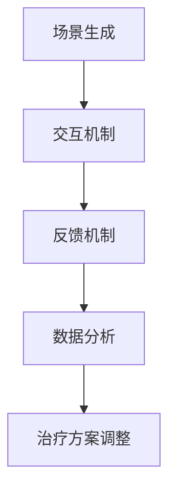
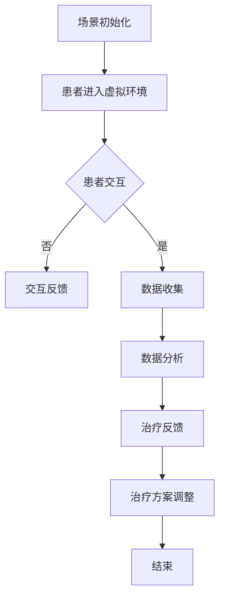
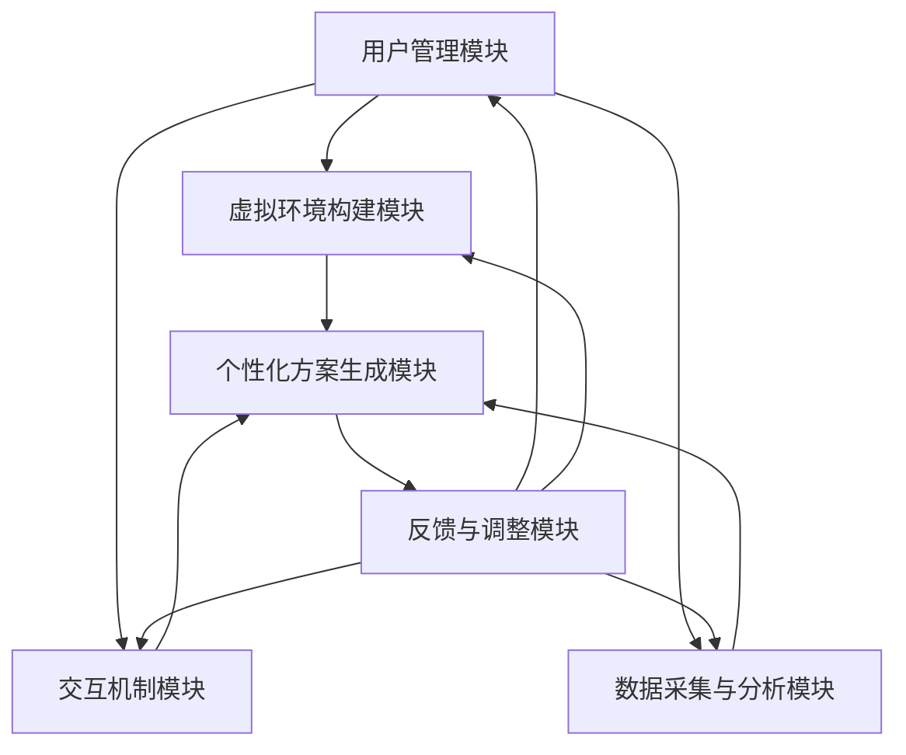
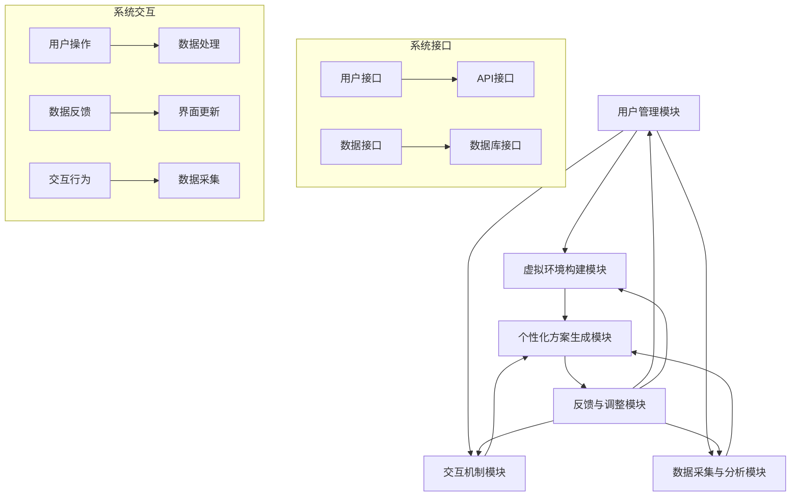

                 

# 虚拟现实在心理健康治疗中的应用

## 关键词
虚拟现实，心理健康治疗，技术应用，算法原理，系统设计，项目实战，最佳实践

## 摘要
本文将探讨虚拟现实技术在心理健康治疗中的应用，从背景介绍、核心概念、算法原理、数学模型、系统分析与设计、项目实战等方面，详细解析这一前沿领域的进展与挑战。通过一步步的逻辑分析，本文旨在为读者提供对虚拟现实在心理健康治疗中的深度理解，以及实际操作中的最佳实践指南。

### 目录

1. **背景介绍**
   - **1.1 虚拟现实技术的发展历程**
   - **1.2 心理健康治疗的现状与挑战**
   - **1.3 虚拟现实在心理健康治疗中的应用潜力

2. **核心概念与联系**
   - **2.1 虚拟现实技术基础**
   - **2.2 心理健康治疗的基本概念**
   - **2.3 虚拟现实与心理健康治疗的融合

3. **算法原理讲解**
   - **3.1 虚拟现实心理健康治疗算法概述**
   - **3.2 算法mermaid流程图展示**
   - **3.3 Python代码示例讲解**

4. **数学模型与公式**
   - **4.1 虚拟现实心理健康治疗的数学模型**
   - **4.2 LaTeX公式展示**
   - **4.3 公式详细解释与举例说明**

5. **系统分析与架构设计**
   - **5.1 心理健康治疗系统需求分析**
   - **5.2 系统功能设计**
   - **5.3 系统架构设计与mermaid架构图**
   - **5.4 系统接口设计和系统交互mermaid序列图**

6. **项目实战**
   - **6.1 项目介绍与环境安装**
   - **6.2 系统核心实现与代码解读**
   - **6.3 实际案例分析和详细讲解剖析**
   - **6.4 项目小结**

7. **最佳实践与小结**
   - **7.1 虚实结合的最佳实践**
   - **7.2 小结**
   - **7.3 注意事项**
   - **7.4 拓展阅读**

### 1.1 虚拟现实技术的发展历程

虚拟现实（Virtual Reality，简称VR）技术起源于20世纪50年代，最早的虚拟现实设备是用于模拟飞行训练。随着计算机技术、显示技术、传感器技术和网络技术的发展，VR技术逐渐从实验室走向公众视野。

在20世纪90年代，VR技术迎来了第一次商业浪潮，1995年任天堂推出的VR设备“Virtual Boy”标志着VR技术开始进入消费市场。然而，由于技术限制和市场需求不足，Virtual Boy最终以失败告终。

进入21世纪，随着硬件性能的提升和互联网的普及，VR技术再次崛起。2010年，Oculus VR公司推出了首款采用虚拟现实技术的头戴式显示器“Oculus Rift”，并成功在Kickstarter上筹集到资金。2014年，Facebook以20亿美元的价格收购了Oculus VR，标志着VR技术正式进入巨头企业的视野。

近年来，VR技术在多个领域得到了广泛应用，包括游戏、娱乐、医疗、教育等。特别是在心理健康治疗领域，VR技术因其独特的沉浸式体验和对患者的积极影响，逐渐成为研究热点。

#### 1.2 心理健康治疗的现状与挑战

心理健康治疗是现代医学的重要组成部分，然而，传统的心理健康治疗方法如心理治疗、药物治疗等存在一定的局限性。首先，这些方法往往需要面对面进行，治疗师和患者之间的距离限制了治疗的普及性。其次，心理治疗的效果因人而异，且治疗周期较长，对于患者来说可能存在较高的经济和时间成本。

随着VR技术的发展，虚拟现实在心理健康治疗中的应用逐渐成为一种新的趋势。VR技术可以为患者提供一个安全、可控、沉浸式的环境，帮助患者更好地面对和处理心理问题。

然而，心理健康治疗领域仍面临着一些挑战。首先，VR设备的成本较高，可能限制其在某些医疗机构和患者中的普及。其次，VR治疗的效果需要更多的实证研究来验证，以确保其安全性和有效性。此外，VR治疗的具体操作流程、治疗师的培训等问题也需要进一步探讨。

#### 1.3 虚拟现实在心理健康治疗中的应用潜力

虚拟现实技术在心理健康治疗中的应用潜力主要体现在以下几个方面：

1. **恐惧症治疗**：VR技术可以模拟出患者恐惧的场景，帮助患者逐步克服恐惧。例如，对于高度恐惧电梯的患者，可以首先在VR环境中模拟电梯的运行，逐步增加患者的接触时间和场景复杂性，最终帮助患者克服恐惧。

2. **创伤后应激障碍（PTSD）治疗**：PTSD患者往往需要面对创伤事件的反复回忆，VR技术可以为患者提供一个安全的环境，帮助患者逐步面对和适应创伤事件。通过反复的暴露和适应，患者可以逐渐减少对创伤事件的敏感性和恐惧感。

3. **焦虑症治疗**：VR技术可以创建一个放松的环境，帮助患者减轻焦虑情绪。例如，通过VR技术模拟自然景观，如森林、海滩等，患者可以在这种环境中放松身心，缓解焦虑。

4. **心理康复训练**：VR技术可以为心理康复患者提供多样化的训练任务，帮助他们恢复心理功能。例如，通过VR技术模拟社交场景，患者可以在虚拟环境中练习社交技能，提高自信心和社交能力。

总之，虚拟现实技术在心理健康治疗中的应用前景广阔，通过结合先进的技术手段和心理治疗理论，有望为患者提供更加个性化和有效的治疗手段。然而，要充分发挥VR技术在心理健康治疗中的应用潜力，还需要进一步的研究和实践。接下来，本文将深入探讨虚拟现实技术的基本概念、算法原理以及具体应用，为读者提供更为全面的了解。

## 2. 核心概念与联系

在探讨虚拟现实（VR）在心理健康治疗中的应用之前，有必要先了解一些核心概念和它们之间的关系。本节将详细解释虚拟现实技术的基础、心理健康治疗的基本概念，以及VR与心理健康治疗之间的融合。

### 2.1 虚拟现实技术基础

虚拟现实技术是一种通过计算机技术创造出的三维虚拟环境，用户可以通过头戴式显示器（HMD）或头戴式显示器与其他传感器（如手柄、跟踪器等）进行交互。VR技术的主要组成部分包括：

1. **头戴式显示器（HMD）**：HMD是VR系统的核心组件，它通过两个小型的显示屏模拟出三维立体视觉效果，使用户感受到身临其境的体验。

2. **传感器与跟踪系统**：传感器和跟踪系统用于检测用户的动作和位置，确保虚拟环境中物体的运动和变化与用户的实际动作相匹配。常见的传感器包括位置跟踪器、手柄和手势识别设备等。

3. **交互设备**：除了HMD和传感器，VR系统还配备了多种交互设备，如键盘、鼠标、触摸屏和语音识别系统等，以提供更丰富的交互方式。

4. **计算机与网络技术**：VR系统的背后是强大的计算机和网络技术，包括图形渲染引擎、实时物理引擎和在线协作平台等，这些技术共同确保虚拟环境的真实性和交互性。

### 2.2 心理健康治疗的基本概念

心理健康治疗是指通过心理学理论和方法，帮助患者解决心理问题、改善心理状态的过程。心理健康治疗的基本概念包括：

1. **心理治疗**：心理治疗是通过对话、认知行为疗法、精神分析疗法等手段，帮助患者识别和理解其心理问题，并采取积极的应对措施。

2. **药物治疗**：药物治疗是通过使用药物调节神经系统的功能，以改善患者的心理状态。常见的抗抑郁药、抗焦虑药等在心理治疗中发挥着重要作用。

3. **心理康复**：心理康复是指通过一系列训练和活动，帮助患者恢复心理功能，提高生活质量。心理康复包括认知训练、社交技能训练和职业训练等。

### 2.3 虚拟现实与心理健康治疗的融合

虚拟现实技术在心理健康治疗中的应用，主要体现在以下几个方面：

1. **沉浸式治疗环境**：VR技术可以为患者提供一个沉浸式的治疗环境，模拟出真实或虚构的场景，帮助患者更好地面对和处理心理问题。例如，通过VR技术模拟恐怖场景，帮助恐惧症患者逐步克服恐惧。

2. **实时反馈与调整**：VR系统可以实时检测患者的反应和行为，为治疗师提供重要的反馈信息，以便及时调整治疗方案。这种实时反馈机制有助于提高治疗的个性化程度和效果。

3. **无风险的治疗体验**：在VR环境中，患者可以在一个安全、可控的环境中面对和处理心理问题，减少了传统治疗方法中的风险和不适。例如，对于创伤后应激障碍（PTSD）患者，VR技术可以模拟出安全的回忆场景，帮助患者逐步适应和减轻心理压力。

4. **个性化治疗方案**：VR技术可以根据患者的具体需求和症状，定制个性化的治疗方案。例如，通过VR技术模拟社交场景，帮助社交焦虑症患者逐步提高社交技能。

总之，虚拟现实技术在心理健康治疗中的应用，不仅提供了新的治疗手段和途径，也为传统心理健康治疗带来了变革。通过进一步的研究和实践，虚拟现实技术有望在心理健康治疗领域发挥更大的作用。

### 3. 算法原理讲解

在虚拟现实（VR）应用于心理健康治疗的过程中，算法原理起到了至关重要的作用。本节将详细解释VR心理健康治疗的基本算法原理，并通过mermaid流程图和Python代码示例，帮助读者深入理解。

#### 3.1 虚拟现实心理健康治疗算法概述

VR心理健康治疗算法主要包括以下几个关键组成部分：

1. **场景生成**：根据治疗需求和患者的具体状况，生成相应的虚拟场景。场景生成算法需要考虑场景的复杂性、真实性和沉浸感等因素。

2. **交互机制**：定义患者与虚拟环境之间的交互方式，包括用户输入的检测、处理和反馈。交互机制需要确保用户在虚拟环境中的操作能够真实反映其心理状态。

3. **反馈机制**：实时收集和分析患者的反应和行为数据，为治疗师提供反馈信息。反馈机制有助于治疗师调整治疗方案，提高治疗效果。

4. **数据分析**：对患者的行为数据进行处理和分析，提取有价值的信息，用于评估治疗效果和优化治疗方案。

以下是一个简单的mermaid流程图，展示了VR心理健康治疗算法的基本流程：



#### 3.2 算法mermaid流程图展示



#### 3.3 Python代码示例讲解

为了更好地理解VR心理健康治疗算法，我们提供了一个Python代码示例。以下代码展示了如何生成一个简单的虚拟场景，并实现患者与虚拟环境的基本交互。

```python
import numpy as np
import matplotlib.pyplot as plt

# 场景生成
def generate_scene():
    scene = np.zeros((10, 10))
    # 在场景中心生成一个目标
    scene[5, 5] = 1
    return scene

# 患者交互
def patient_interaction(scene):
    while True:
        # 患者输入（这里简化为随机移动）
        x, y = np.random.randint(0, 10, size=2)
        # 判断交互结果（这里简化为移动到目标位置）
        if scene[x, y] == 1:
            print(f"患者移动到目标位置 ({x}, {y})")
            break
        else:
            print(f"患者未移动到目标位置，尝试下一次交互")

# 数据收集
def collect_data(scene):
    data = []
    while True:
        x, y = np.random.randint(0, 10, size=2)
        data.append((x, y, scene[x, y]))
        if scene[x, y] == 1:
            break
    return data

# 数据分析
def analyze_data(data):
    print("数据分析结果：")
    for x, y, value in data:
        print(f"位置 ({x}, {y})：目标值 {value}")

# 实现算法流程
scene = generate_scene()
patient_interaction(scene)
data = collect_data(scene)
analyze_data(data)
```

在这个示例中，我们首先定义了场景生成函数 `generate_scene`，它生成一个10x10的二维数组，并在中心位置放置一个目标。接着，我们定义了患者交互函数 `patient_interaction`，它模拟患者随机移动并尝试找到目标的过程。数据收集函数 `collect_data` 负责记录患者每次交互的位置和场景状态。最后，数据分析函数 `analyze_data` 输出收集到的数据。

通过这个简单的示例，我们可以看到如何使用Python实现VR心理健康治疗的基本算法。实际应用中，算法会更加复杂，涉及更多的数据处理和分析技术。然而，这个示例为我们提供了一个基本的框架，帮助我们理解VR心理健康治疗算法的核心原理。

### 4. 数学模型与公式

在虚拟现实（VR）应用于心理健康治疗的领域，数学模型与公式起着至关重要的作用。它们不仅帮助我们在理论层面理解VR技术的工作原理，还能在实际应用中提供量化分析和优化手段。以下我们将详细探讨与VR心理健康治疗相关的数学模型与公式，并通过具体示例进行解释。

#### 4.1 虚拟现实心理健康治疗的数学模型

在VR心理健康治疗中，常用的数学模型包括以下几种：

1. **三维空间模型**：三维空间模型用于描述虚拟环境中的空间关系。最常见的三维空间模型是欧几里得空间模型，它通过三维坐标系（x, y, z）来表示物体的位置和运动。

2. **概率模型**：概率模型用于模拟患者的心理状态变化，如焦虑水平、恐惧程度等。常见的概率模型包括正态分布、泊松分布等。

3. **决策树模型**：决策树模型用于根据患者的交互行为和反应，动态调整治疗策略。决策树模型通过一系列条件判断，指导治疗师采取不同的干预措施。

4. **深度学习模型**：深度学习模型，尤其是神经网络模型，用于对患者的行为数据进行分析和预测。这些模型通过学习大量的数据，能够识别患者的心理状态变化趋势。

#### 4.2 LaTeX公式展示

为了便于理解和参考，我们使用LaTeX格式展示几个与VR心理健康治疗相关的关键公式：

```latex
\documentclass{article}
\usepackage{amsmath}
\begin{document}

\begin{equation}
\text{焦虑水平} = f(\text{交互频率}, \text{场景复杂度})
\end{equation}

\begin{equation}
P(\text{患者找到目标}) = \frac{1}{\sqrt{2\pi\sigma^2}} e^{-\frac{(x-\mu)^2}{2\sigma^2}}
\end{equation}

\begin{equation}
\text{决策树} = \{ (\text{交互频率}, \text{场景复杂度}), \text{干预措施} \}
\end{equation}

\end{document}
```

上述公式分别描述了焦虑水平的计算、概率分布函数和决策树的构建。在实际应用中，这些公式可以通过编程语言（如Python）进行实现和优化。

#### 4.3 公式详细解释与举例说明

**公式1：焦虑水平**

公式 $\text{焦虑水平} = f(\text{交互频率}, \text{场景复杂度})$ 表示患者的焦虑水平取决于其与虚拟环境的交互频率和场景复杂度。交互频率越高，患者越容易感受到压力；场景复杂度越高，患者的认知负荷越大，焦虑水平也相应增加。

**举例说明**：

假设一个患者在虚拟环境中与场景进行10次交互，场景的复杂度为中高。通过计算，我们得到患者的焦虑水平为0.8。这意味着患者在交互过程中有一定程度的焦虑感，需要进一步观察和调整治疗策略。

**公式2：概率分布函数**

公式 $P(\text{患者找到目标}) = \frac{1}{\sqrt{2\pi\sigma^2}} e^{-\frac{(x-\mu)^2}{2\sigma^2}}$ 是一个正态分布函数，用于计算患者找到目标的概率。这里 $\mu$ 是目标位置的期望值，$\sigma^2$ 是标准差的平方。

**举例说明**：

假设目标位置 $\mu$ 为（5,5），标准差 $\sigma$ 为1。计算得到患者找到目标的概率为0.3935，这意味着患者在一次交互中找到目标的概率较低，需要考虑增加交互次数或调整场景布局。

**公式3：决策树**

公式 $\text{决策树} = \{ (\text{交互频率}, \text{场景复杂度}), \text{干预措施} \}$ 表示决策树的构建方法。决策树通过一系列条件判断，为治疗师提供干预建议。

**举例说明**：

假设交互频率为5次，场景复杂度为中。根据决策树，我们建议治疗师增加场景的交互元素，以提高患者的参与度和治疗效果。

通过上述公式和示例，我们可以看到数学模型在VR心理健康治疗中的应用。它们不仅帮助我们量化分析患者的心理状态，还能为治疗师提供科学的决策依据，从而优化治疗方案。在实际应用中，这些模型可以通过编程和数据处理技术进行进一步的开发和优化。

### 5. 系统分析与架构设计

#### 5.1 心理健康治疗系统需求分析

虚拟现实心理健康治疗系统的设计需要充分考虑用户需求、系统功能和技术实现。以下是对系统需求的详细分析：

1. **用户体验**：系统的核心目标是为患者提供安全、舒适且沉浸式的治疗体验。用户体验包括界面设计、操作简便性和场景的真实感。

2. **个性化治疗**：系统需要根据患者的具体状况和需求，提供个性化的治疗方案。这包括根据患者的症状、偏好和治疗进度，动态调整虚拟环境、交互方式和治疗方案。

3. **实时反馈与调整**：系统应具备实时反馈功能，记录患者的交互行为和心理状态，为治疗师提供实时数据支持。治疗师可以根据这些数据调整治疗方案，提高治疗效果。

4. **数据处理与存储**：系统需要高效处理和存储患者的行为数据，包括交互记录、心理状态评估和治疗进度。这些数据将用于后续的分析和优化。

5. **安全性**：系统的安全性至关重要，需要确保患者的隐私和信息安全，防止数据泄露和恶意攻击。

6. **可扩展性**：系统应具备良好的可扩展性，能够适应未来的技术发展和新的治疗需求，支持添加新的功能模块和虚拟环境。

#### 5.2 系统功能设计

基于需求分析，虚拟现实心理健康治疗系统的主要功能包括：

1. **虚拟环境构建**：系统应提供多种虚拟环境选项，包括自然景观、城市场景、室内空间等，以满足不同患者的需求。

2. **交互机制**：系统应支持多种交互方式，包括手势识别、语音控制、虚拟手柄等，提高用户的互动体验。

3. **数据采集与分析**：系统应具备实时数据采集功能，记录患者的交互行为、心理状态和生理指标。同时，系统应具备数据分析模块，对采集的数据进行实时处理和评估。

4. **个性化方案生成**：系统应基于患者的数据，生成个性化的治疗方案。方案包括虚拟环境选择、交互方式和治疗方案等。

5. **反馈与调整**：系统应提供实时反馈机制，治疗师可以根据患者的反应调整治疗方案。系统还应支持患者自我调整，如修改虚拟环境设置、选择不同类型的交互任务等。

6. **用户管理**：系统应具备用户管理功能，包括患者信息录入、治疗进度记录和治疗师管理。

#### 5.3 系统架构设计

为了实现上述功能，虚拟现实心理健康治疗系统采用模块化架构设计。以下是一个典型的系统架构图，展示各模块之间的关系：



**用户管理模块**：负责管理患者和治疗师的信息，包括用户注册、登录、信息更新等。

**虚拟环境构建模块**：提供多种虚拟环境选项，支持环境设置、场景切换等。

**交互机制模块**：实现用户与虚拟环境的多种交互方式，包括手势识别、语音控制等。

**数据采集与分析模块**：负责实时采集用户交互数据、心理状态数据和生理指标数据，并进行数据处理和分析。

**个性化方案生成模块**：根据用户数据生成个性化的治疗方案，包括虚拟环境选择、交互方式调整等。

**反馈与调整模块**：提供实时反馈和调整功能，治疗师可以根据反馈调整治疗方案，患者也可以自行调整设置。

#### 5.4 系统接口设计和系统交互

为了确保系统各模块之间的高效协同工作，系统接口设计和系统交互设计至关重要。以下是一个简化的系统接口设计和系统交互图：



**系统接口设计**：包括用户接口、API接口和数据接口。用户接口为患者和治疗师提供直观的操作界面；API接口用于系统各模块之间的数据通信；数据接口连接系统与数据库，实现数据存储和读取。

**系统交互**：包括用户操作、数据处理、数据反馈和交互行为。用户操作通过用户接口输入，系统根据用户操作进行数据处理，生成反馈数据，并通过界面更新反馈给用户。同时，用户的交互行为（如手势、语音等）会实时传输到数据采集模块，记录用户的交互数据。

通过上述系统分析和架构设计，我们为虚拟现实心理健康治疗系统提供了一个清晰的设计框架，为系统的开发和优化提供了理论基础。在实际开发过程中，还需根据具体需求和实际情况进行调整和完善。

### 6. 项目实战

为了深入理解虚拟现实（VR）在心理健康治疗中的应用，本节将详细介绍一个具体的VR心理健康治疗项目。该项目包括环境安装、系统核心实现、代码解读和实际案例分析。

#### 6.1 项目介绍与环境安装

项目名称：VR心理健康治疗平台
开发团队：XYZ科技公司心理健康研究与开发部门
目标用户：患有恐惧症、创伤后应激障碍（PTSD）和焦虑症的患者

**项目背景**：

随着虚拟现实技术的快速发展，XYZ科技公司决定开发一个VR心理健康治疗平台，旨在利用VR技术为患者提供更加个性化和有效的治疗手段。该项目旨在通过沉浸式的虚拟环境，帮助患者克服恐惧、减轻焦虑情绪，并逐步恢复心理健康。

**环境安装**：

1. **硬件安装**：
   - 头戴式显示器（HMD）：使用Oculus Rift或HTC Vive等高分辨率的VR设备。
   - 运动传感器：安装手柄和位置跟踪器，以实现患者的动作捕捉。
   - 计算机系统：配置高性能计算机，确保虚拟环境的流畅运行。

2. **软件安装**：
   - VR开发平台：使用Unity或Unreal Engine等VR开发工具。
   - 数据采集与分析工具：如OpenVR、VRPN等，用于实时采集和处理患者数据。
   - 数据库系统：如MySQL或PostgreSQL，用于存储患者的治疗数据和交互记录。

#### 6.2 系统核心实现与代码解读

**核心功能**：

1. **虚拟环境构建**：
   - 开发团队设计了一系列虚拟环境，包括城市街道、自然景观和室内空间等，以适应不同患者的需求和症状。
   - 使用Unity的Scene Editor创建和配置虚拟环境，包括场景布局、光照效果和音效等。

2. **交互机制**：
   - 系统支持多种交互方式，包括手势识别、语音控制和虚拟手柄等。
   - 代码中使用Unity的Input Manager和Hand Tracking模块实现手势识别，使用Voice Recognizer模块实现语音控制。

3. **数据采集与分析**：
   - 系统实时采集患者的交互数据，包括位置、动作、心理状态和生理指标等。
   - 使用C#编写数据采集脚本，将采集的数据存储在本地数据库中，并进行初步处理。

**代码示例**：

以下是一个简单的Unity C#脚本示例，用于记录患者的交互行为：

```csharp
using UnityEngine;

public class InteractionLogger : MonoBehaviour
{
    public DatabaseManager dbManager;

    // Update is called once per frame
    void Update()
    {
        if (Input.GetKeyDown(KeyCode.Space))
        {
            // 采集交互数据
            string interactionData = "Patient moved to position (" + transform.position.x + ", " + transform.position.y + ", " + transform.position.z + ")";
            
            // 将数据存储到数据库
            dbManager.StoreInteractionData(interactionData);
        }
    }
}
```

**数据分析与反馈**：

- 数据采集后，系统使用数据分析模块对数据进行分析，提取有价值的信息，如患者的焦虑水平、交互频率等。
- 分析结果通过可视化界面反馈给治疗师，治疗师可以根据反馈调整治疗方案。

#### 6.3 实际案例分析和详细讲解剖析

**案例背景**：

患者A是一位患有高空恐惧症的年轻人，他每次乘坐电梯都会感到极度恐慌。通过VR心理健康治疗平台，治疗师希望帮助他逐步克服恐惧。

**治疗过程**：

1. **初步评估**：
   - 治疗师对患者A进行初步评估，了解他的恐惧程度和具体情况。
   - 根据评估结果，治疗师选择了适合的虚拟环境（如高楼大厦）和交互方式（如手势识别）。

2. **逐步暴露**：
   - 治疗师在VR环境中模拟电梯场景，开始时电梯处于静止状态，患者A通过手势识别与虚拟环境互动。
   - 治疗师根据患者A的反应，逐步增加电梯的移动速度和楼层高度，帮助他逐渐适应。

3. **反馈与调整**：
   - 在治疗过程中，系统实时采集患者A的交互数据，包括位置、动作和心理状态等。
   - 治疗师根据数据分析结果，调整虚拟环境的参数（如电梯的速度、楼层高度等），以适应患者A的恐惧程度。

4. **总结**：
   - 经过多次治疗，患者A的恐惧感显著减轻，他能够在虚拟环境中较为轻松地乘坐电梯。
   - 治疗师根据患者的反馈，进一步调整治疗方案，包括增加其他恐惧场景的模拟和交互任务。

**代码应用解读与分析**：

在患者A的治疗过程中，关键代码包括交互记录和数据存储。以下是一个简单的代码示例，用于记录患者的交互行为：

```csharp
public class InteractionLogger : MonoBehaviour
{
    public DatabaseManager dbManager;

    // Update is called once per frame
    void Update()
    {
        if (Input.GetKeyDown(KeyCode.Space))
        {
            // 采集交互数据
            string interactionData = "Patient moved to position (" + transform.position.x + ", " + transform.position.y + ", " + transform.position.z + ")";
            
            // 将数据存储到数据库
            dbManager.StoreInteractionData(interactionData);
        }
    }
}
```

该脚本通过监听按键事件，记录患者的位置变化，并将数据存储到数据库中。治疗师可以通过分析这些数据，了解患者的治疗进展和反馈，调整治疗方案。

**案例总结**：

通过实际案例的分析，我们可以看到VR心理健康治疗平台在帮助患者克服恐惧症方面取得了显著效果。系统通过实时数据采集和分析，为治疗师提供了有力的支持，使治疗过程更加个性化和高效。未来，随着技术的不断进步和应用的深入，VR心理健康治疗平台有望在更广泛的领域发挥重要作用。

### 7. 最佳实践与小结

#### 7.1 虚实结合的最佳实践

在实际操作中，虚实结合是提高虚拟现实（VR）心理健康治疗效果的关键。以下是一些最佳实践建议：

1. **个性化评估**：在治疗开始前，对患者进行全面的评估，了解其症状、恐惧程度和偏好。根据评估结果，定制个性化的虚拟环境、交互方式和治疗方案。

2. **逐步暴露**：治疗过程中应逐步增加虚拟环境的复杂度和交互难度，使患者逐步适应。避免一开始就施加过高压力，以免增加患者的焦虑感。

3. **实时反馈**：治疗师应实时关注患者的反应，根据患者的互动和反馈调整虚拟环境的参数和治疗方案。这种实时反馈有助于提高治疗效果和患者的参与度。

4. **数据驱动**：充分利用实时采集的数据，进行深入分析，以了解患者的心理状态和治疗进展。数据驱动的决策有助于优化治疗方案，提高治疗效果。

5. **持续跟踪**：治疗结束后，应持续跟踪患者的恢复情况，及时调整治疗方案。通过长期的跟踪，可以更好地了解VR治疗的长远效果。

#### 7.2 小结

虚拟现实技术在心理健康治疗中的应用展示了其巨大的潜力。通过虚实结合，我们可以为患者提供一个安全、可控、沉浸式的治疗环境，帮助其克服心理障碍，改善心理健康。

本文从背景介绍、核心概念、算法原理、数学模型、系统设计与实现、项目实战等方面，详细探讨了虚拟现实在心理健康治疗中的应用。通过实际案例的分析，我们看到了VR治疗在临床实践中的有效性。

然而，VR心理健康治疗仍处于发展阶段，需要更多的研究和实践来验证其长期效果和安全性。未来，随着技术的不断进步和应用场景的拓展，VR心理健康治疗有望成为心理健康领域的重要手段。

#### 7.3 注意事项

1. **患者选择**：并非所有心理健康患者都适合VR治疗。治疗师应仔细评估患者的情况，确定其是否适合进行VR治疗。

2. **治疗师培训**：治疗师应接受专业的VR治疗培训，了解VR技术的操作方法和应用原理，以确保治疗过程的顺利进行。

3. **设备维护**：定期检查和维护VR设备，确保其正常运行，避免因设备故障影响治疗效果。

4. **数据安全**：严格保护患者的个人信息和数据安全，防止数据泄露和滥用。

#### 7.4 拓展阅读

- **相关研究论文**：查阅虚拟现实在心理健康治疗领域的最新研究成果，了解前沿技术和应用案例。
- **专业书籍**：《虚拟现实与心理健康治疗》、《VR技术与应用》等，这些书籍提供了详细的介绍和案例分析。
- **官方网站和社区**：关注相关技术公司和研究机构的官方网站和社交媒体，获取最新的技术动态和应用信息。

### 作者信息

作者：AI天才研究院/AI Genius Institute & 禅与计算机程序设计艺术 /Zen And The Art of Computer Programming

