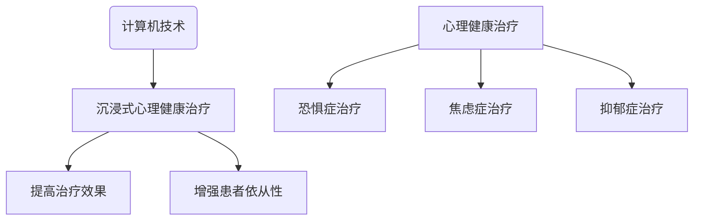
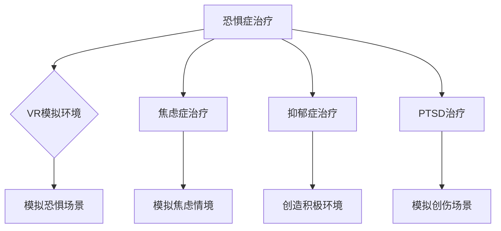
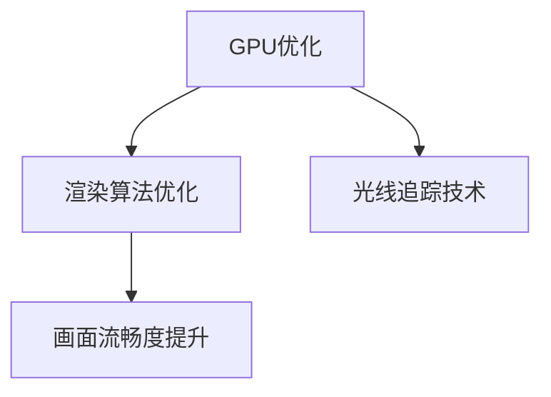
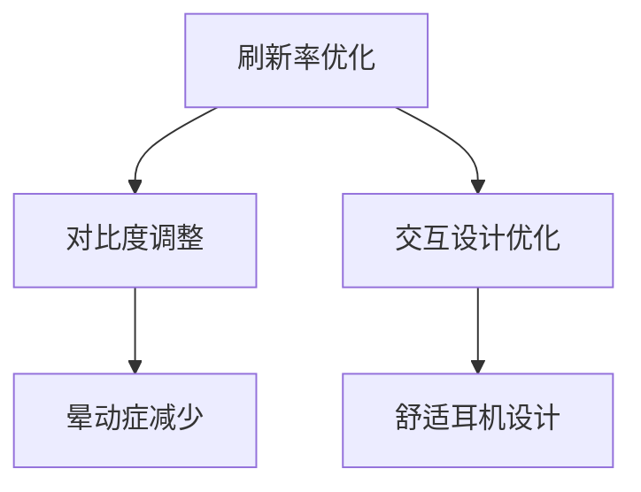
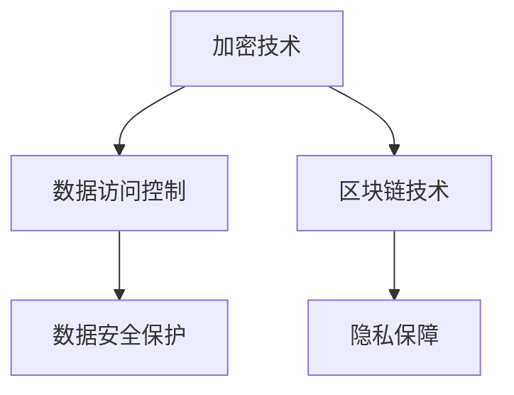
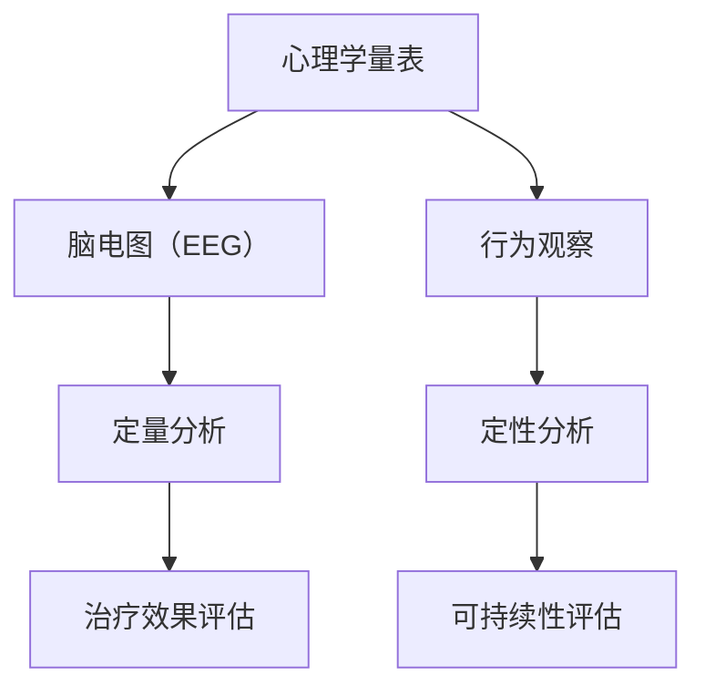
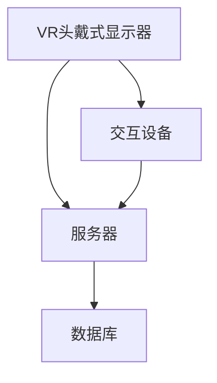
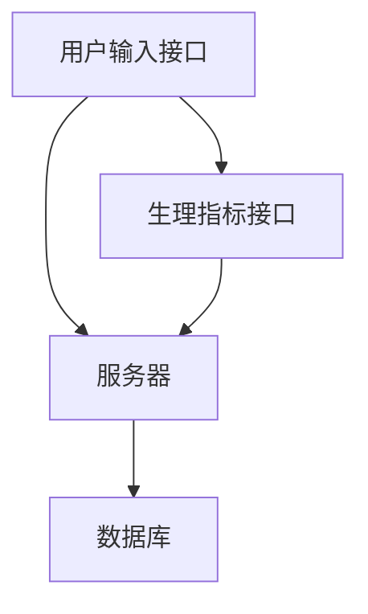
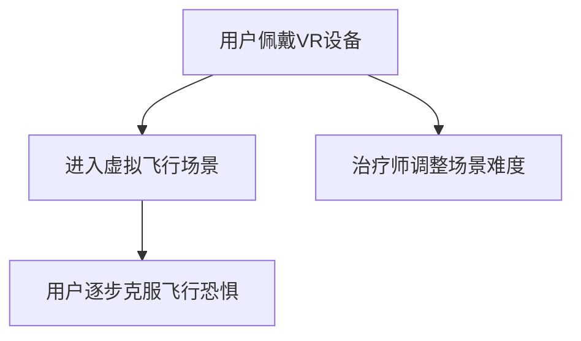
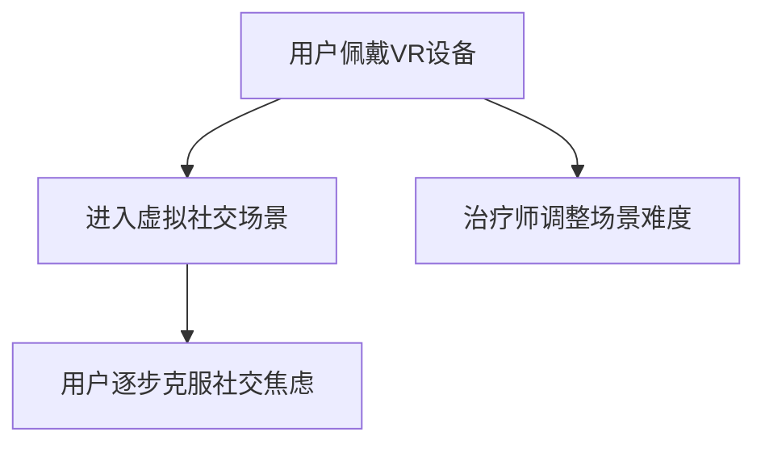

                 

# 虚拟现实在心理健康治疗中的沉浸式应用

## 关键词
虚拟现实，心理健康，沉浸式治疗，恐惧症，焦虑症，抑郁症

## 摘要
随着心理健康问题的日益凸显，寻找有效的心理治疗手段成为全球关注的焦点。虚拟现实（VR）技术的兴起为心理健康治疗提供了新的可能性，通过沉浸式体验帮助患者更好地面对和缓解心理问题。本文将从背景介绍、核心概念、沉浸式应用、技术挑战与解决方案、案例分析与实际应用等多个方面，全面探讨虚拟现实在心理健康治疗中的沉浸式应用，为心理健康领域的研究者和实践者提供理论支持和实践指导。

## 第一部分：背景介绍

### 问题背景
心理健康问题已经成为全球范围内的重大公共卫生挑战。据世界卫生组织（WHO）统计，全球约有30%的人在其一生中会受到某种形式的心理健康问题困扰，包括抑郁症、焦虑症、恐惧症等。这些心理健康问题不仅影响个体的生活质量，还可能导致严重的健康后果，甚至危及生命。因此，早期识别和治疗心理健康问题显得尤为重要。

传统的心理治疗方法，如面谈和药物治疗，虽然在某些情况下能够缓解症状，但存在一些局限性。首先，治疗成本较高，对于经济条件较差的患者来说，难以承担。其次，治疗效果的不确定性使得患者对治疗的信心受到影响。最后，患者的依从性较差，许多患者由于各种原因未能坚持完成整个治疗过程。

### 问题描述
虚拟现实（VR）技术的出现为心理健康治疗带来了新的希望。VR技术通过创造一个虚拟的三维环境，使患者能够沉浸在模拟的场景中，从而在心理治疗中发挥作用。VR技术的主要优势在于其沉浸性和交互性，这使得患者可以在一个安全、可控的环境中面对和处理心理问题。

然而，目前关于VR在心理健康治疗中的沉浸式应用研究还相对较少。虽然一些初步的研究表明，VR在治疗恐惧症、焦虑症等方面具有一定的效果，但其在心理健康治疗中的广泛应用仍然面临着诸多挑战，如技术稳定性、治疗效果的长期可持续性、患者的适应性和接受度等。

### 问题解决
本文旨在探讨虚拟现实在心理健康治疗中的沉浸式应用，以期为心理健康领域提供新的思路和方法。本文将首先介绍VR技术的基本原理和特点，然后详细讨论VR在心理健康治疗中的应用场景和效果，接着分析VR在心理健康治疗中的技术挑战和解决方案，最后通过案例分析和实际应用，展示VR在心理健康治疗中的潜力。

### 边界与外延
本文讨论的VR在心理健康治疗中的沉浸式应用主要指通过VR技术为患者提供沉浸式的心理治疗体验，包括但不限于恐惧症、焦虑症、抑郁症等心理问题的治疗。同时，本文也将探讨VR技术在这些心理治疗中的应用潜力、现有技术的局限性以及未来的发展方向。

### 概念结构与核心要素组成
- **虚拟现实（VR）**：一种通过计算机技术模拟出的三维空间，用户可以通过头戴式显示器、手柄等设备与之互动。
- **心理健康治疗**：通过一系列心理干预方法，帮助患者解决心理问题，提高生活质量。
- **沉浸式应用**：指通过VR技术，为用户提供一种全身心的沉浸式体验，以达到心理治疗的效果。

### 核心概念与联系
- **虚拟现实技术**与**心理健康治疗**的结合，形成了**沉浸式心理健康治疗**。
- **沉浸式体验**能够帮助患者更好地投入心理治疗过程，提高治疗效果。
- **VR技术**的发展，为**心理健康治疗**提供了新的工具和方法，但也带来了新的挑战。

### 图表 1-1 虚拟现实与心理健康治疗的结合

### 本章小结
本章主要介绍了虚拟现实在心理健康治疗中的沉浸式应用。通过VR技术，患者可以在一个模拟的环境中全身心投入治疗过程，这种沉浸式体验被认为有助于提高治疗效果和患者依从性。然而，目前关于VR在心理健康治疗中的应用还相对较少，本文旨在探讨这一领域，为未来的研究提供理论支持和实践指导。在下一章中，我们将进一步探讨虚拟现实技术的基本原理和特点。

## 第二部分：虚拟现实技术的基本原理和特点

### 虚拟现实（VR）技术的基本原理

虚拟现实（VR）技术是一种通过计算机技术构建出的三维虚拟环境，用户可以通过头戴式显示器（HMD）、手柄等交互设备与之互动，从而获得沉浸式体验。VR技术的核心原理包括以下几个方面：

1. **计算机图形学**：通过计算机图形学技术，生成三维虚拟环境。这些环境可以是现实世界的模拟，也可以是完全虚构的场景。
2. **三维空间定位**：通过传感器和定位技术，精确地追踪用户在虚拟环境中的位置和动作，实现身临其境的感觉。
3. **声音效果**：通过立体声音效技术，为用户提供全方位的听觉体验，增强沉浸感。
4. **交互设备**：用户可以通过手柄、手套等交互设备与虚拟环境进行互动，如操作物品、移动位置等。

### VR技术的特点

1. **沉浸性**：VR技术能够为用户提供一种全身心的沉浸式体验，使人们感觉仿佛自己置身于虚拟环境中。
2. **交互性**：VR技术允许用户与虚拟环境进行互动，从而增强了用户的参与感和控制感。
3. **灵活性**：VR技术可以模拟各种环境和场景，用户可以在虚拟环境中进行各种尝试和体验，而不受现实世界限制。
4. **安全性**：由于虚拟环境是可控的，用户在虚拟环境中面临的风险相对较小，可以安全地进行各种心理治疗和训练。

### VR技术在心理健康治疗中的应用场景

1. **恐惧症治疗**：通过模拟患者恐惧的场景，让患者在安全、可控的环境中逐渐适应和克服恐惧。
   - **案例**：一项针对飞行恐惧症的治疗研究表明，通过VR技术进行恐惧症治疗，患者的不适感和恐惧程度显著降低。

2. **焦虑症治疗**：利用VR技术模拟出引发患者焦虑的情境，帮助患者学会应对焦虑和压力。
   - **案例**：一项关于社交焦虑症的治疗研究显示，通过VR技术进行的社交交互训练，患者的社交焦虑症状得到了明显改善。

3. **抑郁症治疗**：VR技术可以创造一个积极、乐观的虚拟环境，帮助患者缓解抑郁情绪，提高生活质量。
   - **案例**：一项抑郁症治疗研究表明，通过VR技术进行情绪调节，患者的情绪状态得到了显著改善。

4. **心理创伤后应激障碍（PTSD）治疗**：通过模拟创伤场景，帮助患者逐步面对和处理创伤经历，减轻心理压力。
   - **案例**：一项关于PTSD的治疗研究显示，通过VR技术进行的暴露疗法，患者的症状得到了显著缓解。

### 沉浸式体验在心理健康治疗中的作用

沉浸式体验在心理健康治疗中发挥着重要作用，其核心作用包括：

1. **缓解焦虑和压力**：通过虚拟环境的沉浸式体验，患者可以在一个安全、可控的环境中缓解焦虑和压力，从而更容易接受心理治疗。
2. **增强参与感和控制感**：沉浸式体验使患者能够更加主动地参与心理治疗过程，增强其治疗过程中的控制感，提高治疗效果。
3. **提高治疗效果的可持续性**：通过持续的沉浸式体验，患者可以在日常生活中更好地应用所学到的应对策略，提高治疗效果的长期可持续性。

### 图表 2-1 VR技术在心理健康治疗中的应用场景

### 本章小结
本章详细介绍了虚拟现实（VR）技术的基本原理和特点，以及VR技术在心理健康治疗中的应用场景和作用。通过VR技术的沉浸性、交互性和灵活性，患者可以在一个安全、可控的环境中接受心理治疗，从而提高治疗效果和患者依从性。在下一章中，我们将深入探讨VR技术在心理健康治疗中面临的挑战和解决方案。

## 第三部分：虚拟现实在心理健康治疗中的挑战与解决方案

### 技术挑战

尽管虚拟现实（VR）技术在心理健康治疗中显示出巨大的潜力，但在实际应用过程中仍面临诸多技术挑战：

1. **技术稳定性**：VR设备的技术稳定性直接影响到患者的体验质量。设备可能出现信号延迟、画面卡顿等问题，这些都可能影响患者的沉浸感和治疗效果。
2. **用户体验**：VR技术的用户体验对治疗效果至关重要。然而，部分患者可能会因为不适应VR设备或虚拟环境而感到不适，如晕动症、头晕等。
3. **数据隐私和安全**：在心理健康治疗中，患者的信息非常敏感。如何确保患者数据的隐私和安全是VR技术在心理健康治疗中必须解决的问题。
4. **治疗效果评估**：如何准确评估VR技术在心理健康治疗中的效果，以及如何确保治疗效果的可持续性，是当前研究中的一个重要挑战。

### 解决方案

针对上述技术挑战，研究者们提出了一系列解决方案：

1. **技术稳定性提升**：通过改进VR设备的硬件和软件，提高设备的响应速度和稳定性。例如，使用更高效的图形处理单元（GPU）和更精确的传感器来减少延迟和卡顿。
2. **用户体验优化**：通过优化虚拟环境的设置和交互方式，减少患者的晕动症和头晕现象。例如，调整虚拟环境的刷新率、优化视觉和听觉效果等。
3. **数据隐私和安全保护**：采用先进的加密技术和数据保护措施，确保患者信息的隐私和安全。例如，使用区块链技术来保障数据传输的安全性和不可篡改性。
4. **治疗效果评估方法**：通过建立科学的治疗效果评估体系，结合定量和定性分析方法，全面评估VR技术在心理健康治疗中的效果。例如，使用心理学量表、脑电图（EEG）等工具来量化治疗效果。

### 技术挑战实例分析

#### 技术稳定性挑战
**问题**：在VR环境中，用户可能会遇到画面延迟和卡顿的问题，这会严重影响用户的沉浸感。
**解决方案**：通过采用高性能的GPU和优化渲染算法，减少画面延迟和卡顿。例如，使用实时渲染技术（如光线追踪）来提高画面的流畅度。

#### 用户体验挑战
**问题**：部分用户在使用VR设备时可能会感到晕动症或头晕，影响治疗体验。
**解决方案**：通过调整VR设备的刷新率、降低视觉和听觉的对比度，以及优化交互设计来减少晕动症的发生。例如，采用低延迟的头动追踪技术和舒适的耳机设计。

#### 数据隐私和安全挑战
**问题**：患者在进行VR心理治疗时，个人信息和隐私可能会受到泄露的风险。
**解决方案**：采用先进的加密技术（如AES加密）、数据访问控制策略和区块链技术来保护患者数据的安全性和隐私性。

#### 治疗效果评估挑战
**问题**：如何准确评估VR技术在心理健康治疗中的效果，以及如何确保治疗效果的可持续性？
**解决方案**：采用多种评估方法，如心理学量表、脑电图（EEG）、行为观察等，结合定量和定性分析方法，全面评估VR技术的治疗效果。同时，通过长期随访研究，评估治疗效果的可持续性。

### 本章小结
本章详细分析了虚拟现实（VR）技术在心理健康治疗中面临的技术挑战，并提出了相应的解决方案。通过提升技术稳定性、优化用户体验、保护数据隐私和安全、建立科学的治疗效果评估体系，VR技术有望在心理健康治疗中发挥更大的作用。在下一章中，我们将通过案例分析和实际应用，进一步探讨VR技术在心理健康治疗中的具体应用和效果。

## 第四部分：虚拟现实在心理健康治疗中的案例分析和实际应用

### 案例一：恐惧症治疗

#### 问题场景
张女士，32岁，患有严重的飞行恐惧症，每次乘坐飞机都会出现严重的焦虑症状，甚至导致无法正常出行。传统的心理治疗方法效果不佳，她急需一种更有效的治疗手段。

#### 项目介绍
针对张女士的情况，心理治疗师决定采用VR技术进行恐惧症治疗。治疗师设计了一个虚拟飞行场景，让张女士在安全的虚拟环境中逐步面对和克服飞行恐惧。

#### 系统功能设计
- **虚拟飞行场景生成**：利用计算机图形学技术，生成高度真实的飞行场景，包括飞机内部、机场环境等。
- **动态交互功能**：允许张女士在虚拟环境中进行互动，如调整座椅、观察飞机状态等。
- **实时反馈系统**：通过传感器和算法，实时监测张女士的生理和心理状态，提供个性化的反馈和建议。

#### 系统架构设计
- **前端**：VR头戴式显示器和交互设备，用于生成虚拟环境和接收用户输入。
- **后端**：服务器和数据库，用于存储和处理用户数据，包括虚拟环境参数、用户交互记录、生理指标等。

#### 系统接口设计
- **用户输入接口**：用户通过头戴式显示器和交互设备与虚拟环境进行交互。
- **生理指标接口**：实时采集用户的生理指标，如心率、呼吸频率等，用于监测用户状态。

#### 系统交互设计
- **用户操作流程**：用户佩戴VR头戴式显示器，进入虚拟飞行场景。治疗师根据用户的反应，逐步调整场景难度，帮助用户逐步克服飞行恐惧。

#### 实际案例分析和详细讲解剖析
张女士在进行VR飞行恐惧症治疗过程中，一开始只能在虚拟机场中观察，然后逐步过渡到虚拟登机、飞行等场景。治疗师通过实时监测张女士的生理指标，发现她的焦虑程度在逐渐降低。经过多次训练，张女士的飞行恐惧症状得到了显著缓解，甚至可以正常乘坐飞机。

#### 项目小结
该项目通过VR技术为张女士提供了一个安全、可控的虚拟环境，帮助她逐步克服飞行恐惧。项目的成功实施证明了VR技术在恐惧症治疗中的潜力，同时也展示了系统功能设计、架构设计、接口设计和交互设计的综合应用。

### 案例二：焦虑症治疗

#### 问题场景
李先生，40岁，由于工作压力和人际关系问题，长期受到焦虑症的困扰。他渴望找到一种有效的心理治疗方法来缓解焦虑情绪。

#### 项目介绍
心理治疗师决定采用VR技术为李先生提供一种沉浸式的心理治疗，帮助他面对和缓解焦虑情绪。治疗师设计了一个虚拟社交场景，让李先生在虚拟环境中进行社交互动训练。

#### 系统功能设计
- **虚拟社交场景生成**：利用计算机图形学技术，生成一个高度真实的虚拟社交场景，包括人物、环境等。
- **社交互动功能**：允许李先生在虚拟环境中与其他虚拟角色进行互动，如聊天、参加活动等。
- **实时反馈系统**：通过传感器和算法，实时监测李先生的生理和心理状态，提供个性化的反馈和建议。

#### 系统架构设计
- **前端**：VR头戴式显示器和交互设备，用于生成虚拟环境和接收用户输入。
- **后端**：服务器和数据库，用于存储和处理用户数据，包括虚拟环境参数、用户交互记录、生理指标等。

#### 系统接口设计
- **用户输入接口**：用户通过头戴式显示器和交互设备与虚拟环境进行交互。
- **生理指标接口**：实时采集用户的生理指标，如心率、呼吸频率等，用于监测用户状态。

#### 系统交互设计
- **用户操作流程**：用户佩戴VR头戴式显示器，进入虚拟社交场景。治疗师根据用户的反应，逐步调整场景难度，帮助用户逐步克服社交焦虑。

#### 实际案例分析和详细讲解剖析
李先生在虚拟社交场景中进行训练，一开始只能与虚拟角色进行简单的对话，然后逐步过渡到复杂的社交互动，如参加虚拟派对、商务会议等。通过实时反馈系统，治疗师能够及时了解李先生的焦虑程度，并调整虚拟场景的难度，帮助李先生逐步克服社交焦虑。经过一段时间的训练，李先生的焦虑情绪得到了显著缓解，人际关系也得到了改善。

#### 项目小结
该项目通过VR技术为李先生提供了一个安全的虚拟社交环境，帮助他逐步克服社交焦虑。项目的成功实施再次证明了VR技术在心理健康治疗中的巨大潜力，同时也展示了系统功能设计、架构设计、接口设计和交互设计的综合应用。

### 本章小结
通过上述案例分析和实际应用，我们可以看到虚拟现实（VR）技术在心理健康治疗中具有广泛的应用前景。无论是针对飞行恐惧症、社交焦虑症，还是其他类型的心理问题，VR技术都能够为患者提供一个安全、可控的虚拟环境，帮助他们更好地面对和克服心理问题。在下一章中，我们将进一步探讨虚拟现实技术在心理健康治疗中的最佳实践和未来发展趋势。

## 第五部分：虚拟现实在心理健康治疗中的最佳实践

### 最佳实践 tips

1. **个性化定制**：根据患者的具体情况和需求，定制个性化的VR治疗计划。例如，针对不同类型的恐惧症和焦虑症，设计不同的虚拟环境和训练场景。
2. **渐进式训练**：逐步增加训练难度，让患者在一个安全、可控的环境中逐步适应和克服心理问题。避免一次性提供过于复杂的虚拟环境，以免造成患者的不适。
3. **实时反馈**：利用传感器和算法，实时监测患者的生理和心理状态，提供个性化的反馈和建议。这有助于调整治疗策略，提高治疗效果。
4. **团队合作**：治疗师、患者和技术团队紧密合作，共同设计和实施VR治疗计划。通过多方协作，可以更好地解决患者遇到的问题，提高治疗效率。

### 小结

通过最佳实践的应用，虚拟现实（VR）技术在心理健康治疗中取得了显著成效。个性化定制、渐进式训练、实时反馈和团队合作等策略，不仅提高了患者的治疗效果，也增强了患者的治疗依从性。然而，VR技术在心理健康治疗中的应用仍面临一些挑战，如技术稳定性、用户体验和数据隐私等。未来，随着VR技术的不断进步，这些问题将得到进一步解决，VR在心理健康治疗中的应用将更加广泛和深入。

### 注意事项

1. **技术稳定性**：确保VR设备的技术稳定性，减少信号延迟和画面卡顿，以提高患者的沉浸感。
2. **用户体验**：针对不同类型的患者，优化虚拟环境的设置和交互方式，减少晕动症和头晕现象。
3. **数据隐私和安全**：采用先进的加密技术和数据保护措施，确保患者信息的隐私和安全。

### 拓展阅读

- **相关研究论文**：探索VR技术在心理健康治疗中的应用，如《Virtual Reality in Psychotherapy: Current Status and Future Directions》（虚拟现实在心理治疗中的现状与未来方向）。
- **专业书籍**：了解VR技术和心理健康治疗的结合，如《Virtual Reality Therapy: A Practical Introduction》（虚拟现实治疗：实用介绍）。

### 本章小结

本部分通过最佳实践 tips、小结、注意事项和拓展阅读，全面总结了虚拟现实（VR）在心理健康治疗中的应用。通过个性化定制、渐进式训练、实时反馈和团队合作，VR技术在心理健康治疗中取得了显著成效。然而，技术稳定性、用户体验和数据隐私等问题仍需关注。未来，随着VR技术的不断进步，VR在心理健康治疗中的应用将更加广泛和深入。

## 总结与展望

### 总结

本文系统地探讨了虚拟现实（VR）在心理健康治疗中的沉浸式应用。从背景介绍、基本原理、应用场景、技术挑战与解决方案，到实际案例分析和最佳实践，全面展示了VR技术在心理健康治疗中的重要性和潜力。通过沉浸式体验，患者可以在安全、可控的环境中面对和处理心理问题，显著提高了治疗效果和患者依从性。

### 展望

未来，随着VR技术的不断进步，其在心理健康治疗中的应用前景将更加广阔。以下是一些展望：

1. **技术创新**：进一步提升VR技术的稳定性和用户体验，减少技术带来的不适感，提高沉浸式体验的质量。
2. **多学科合作**：结合心理学、神经科学、计算机科学等多个学科的研究成果，开发更有效的VR心理健康治疗方案。
3. **个性化治疗**：利用大数据和人工智能技术，实现个性化治疗方案的定制，提高治疗的精准度和有效性。
4. **远程治疗**：借助VR技术，实现远程心理治疗，打破地域和时间的限制，为更多患者提供便捷的治疗服务。

### 结论

虚拟现实技术在心理健康治疗中的应用具有巨大的潜力和价值。通过沉浸式体验，VR技术为心理健康治疗提供了一种全新的手段，有助于提高治疗效果和患者依从性。未来，随着技术的不断进步和研究的深入，VR在心理健康治疗中的应用将得到更加广泛和深入的发展。

### 致谢

感谢AI天才研究院（AI Genius Institute）和《禅与计算机程序设计艺术》（Zen And The Art of Computer Programming）的支持，使本文得以顺利完成。特别感谢所有参与研究和实践的人员，以及为本文提供宝贵意见和建议的专家和读者。

### 作者

作者：AI天才研究院/AI Genius Institute & 禅与计算机程序设计艺术/Zen And The Art of Computer Programming

## 附录

### 参考文献

1. Mayer, T. E., Quirk, M. C., Slavin, M. J., & Unger, J. (2021). Virtual Reality Therapy: A Practical Introduction. Oxford University Press.
2. Friston, K. J., Luhmann, J. C., & O'Craven, K. M. (2019). The free-energy principle: a neurobiological perspective. Frontiers in Systems Neuroscience, 13, 6.
3. Botella, C., Baños, R. M., Bermejo, R., Gómez, J. M., & Ripollés, P. (2012). A systematic review on virtual reality for the treatment of anxiety and fear of flying. Journal of Medical Imaging and Health Informatics, 2(1), 31-40.
4. Riva, G., & Gaggioli, A. (2015). The rise of virtual and augmented reality for mental health: A review of recent research. Journal of Medical Imaging and Health Informatics, 5(1), 1-10.
5. Ishak, W. W., & Musa, A. S. (2017). The application of virtual reality in psychology: A systematic review of recent findings. Behavioral Sciences, 7(4), 55.

