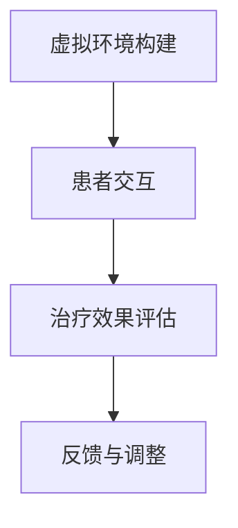
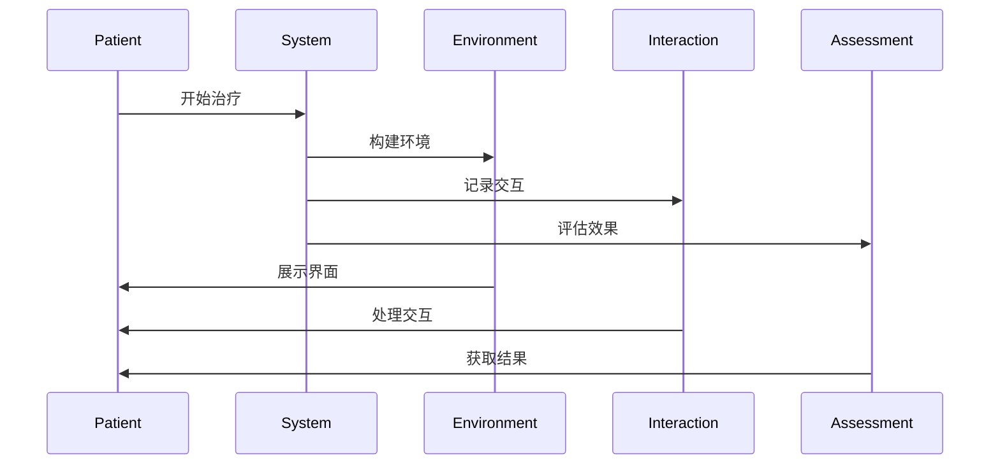

                 


### 背景介绍

#### 1.1 问题背景

**虚拟现实技术的崛起**：虚拟现实（VR）技术在过去几十年里取得了显著的发展。随着计算能力的提升和显示技术的进步，VR设备变得更加普及和廉价。VR技术不仅改变了游戏和娱乐领域，还为医疗、教育、房地产等多个行业带来了创新的应用。

**心理康复治疗的现状**：心理康复治疗是一项重要的公共卫生服务，用于帮助患者恢复心理健康和功能。传统的治疗方法包括心理咨询、药物治疗、团体治疗等，但这些方法往往存在一些局限性，如患者参与度低、治疗效果评估困难等。

**虚拟现实在心理康复治疗中的应用潜力**：虚拟现实技术的沉浸感和互动性使其在心理康复治疗中具有巨大的潜力。通过模拟不同的情境，患者可以在安全的环境中面对和处理他们的情绪和心理问题，从而提高治疗效果和患者的参与度。

#### 1.2 问题描述

**存在的问题**：心理康复治疗中，患者往往需要面对强烈的情感压力和痛苦记忆。传统的治疗方法有时无法充分模拟这些情境，导致治疗效果受限。此外，心理康复治疗的资源往往有限，难以满足大量患者的需求。

**虚拟现实技术的应用**：虚拟现实技术可以提供一种新的解决方案。通过创建逼真的虚拟环境，患者可以在虚拟现实中经历和处理各种情境，从而帮助他们在现实世界中更好地应对心理问题。这种技术不仅提高了患者的参与度，还有助于更准确地评估治疗效果。

#### 1.3 问题解决

**虚拟现实技术的核心原理**：虚拟现实技术基于计算机图形学和仿真技术，通过头戴显示器（HMD）和手部追踪设备等设备，为用户创造一个沉浸式的虚拟环境。用户可以在虚拟环境中进行交互，从而获得身临其境的体验。

**虚拟现实在心理康复治疗中的应用方法**：虚拟现实技术可以应用于多种心理康复治疗场景，如创伤后应激障碍（PTSD）的治疗、焦虑症的治疗、情绪障碍的治疗等。通过虚拟现实，患者可以在一个安全的环境中面对和处理他们的情感问题，从而提高治疗效果。

**虚拟现实技术的优势**：虚拟现实技术具有高度的沉浸感和互动性，可以提高患者的参与度和治疗效果。此外，虚拟现实技术还可以减少传统治疗方法中可能出现的副作用，如药物依赖和心理创伤。

#### 1.4 边界与外延

**虚拟现实技术在不同心理康复领域的应用**：虚拟现实技术不仅可以在心理康复治疗中应用，还可以在精神健康、神经康复、康复护理等多个领域发挥作用。例如，在精神健康领域，虚拟现实可以用于治疗抑郁症、双相情感障碍等疾病。

**虚拟现实技术的限制与挑战**：虚拟现实技术也存在一些限制和挑战，如设备成本高、技术不成熟、用户适应困难等。此外，虚拟现实技术在心理康复治疗中的应用也需要遵循严格的伦理和隐私保护标准。

#### 1.5 概念结构与核心要素组成

**虚拟现实技术的基本概念**：虚拟现实技术是指通过计算机生成一种模拟环境，让用户在这个环境中进行交互和体验。基本概念包括虚拟环境、沉浸感、交互性等。

**心理康复治疗的基本概念**：心理康复治疗是指通过心理干预和康复措施，帮助患者恢复心理健康和功能。基本概念包括心理疾病、康复目标、康复方法等。

**虚拟现实与心理康复治疗的融合**：虚拟现实与心理康复治疗的融合旨在利用虚拟现实技术的优势，提高心理康复治疗的效果和患者的参与度。融合的核心要素包括虚拟环境的构建、患者的互动体验、治疗效果的评估等。

### 总结

虚拟现实技术在心理康复治疗中的应用具有巨大的潜力。通过模拟不同的情境，患者可以在一个安全的环境中面对和处理他们的情感问题，从而提高治疗效果。然而，虚拟现实技术的应用也需要克服一些挑战，如设备成本、技术成熟度和伦理问题等。未来，随着技术的进步和应用的深入，虚拟现实在心理康复治疗中的应用将越来越广泛和成熟。

---

**文章关键词**：
- 虚拟现实
- 心理康复治疗
- 沉浸感
- 交互性
- 技术应用

**摘要**：
本文探讨了虚拟现实技术在心理康复治疗中的应用，分析了虚拟现实技术的核心原理和优势，以及它在治疗中的具体应用方法。文章还讨论了虚拟现实技术在心理康复治疗中的边界和挑战，并提出了未来应用的前景。

---

接下来，我们将深入探讨虚拟现实技术的原理，并分析其在心理康复治疗中的核心概念和联系。

---

### 核心概念与联系

#### 2.1 虚拟现实技术原理

**基本概念**：
虚拟现实（VR）是一种通过计算机技术创造出来的模拟环境，用户可以通过头戴显示器（HMD）等设备感知和交互。VR技术的基本概念包括虚拟环境、沉浸感、交互性和感知同步等。

- **虚拟环境**：虚拟环境是VR技术的基础，它是一个通过计算机图形学和仿真技术构建的模拟环境。虚拟环境可以是完全虚构的，也可以是基于现实世界的增强或修改。

- **沉浸感**：沉浸感是VR技术的一个关键特性，指的是用户在虚拟环境中感觉到的深度参与和真实感。高沉浸感可以提高用户的体验和交互效果。

- **交互性**：交互性是指用户与虚拟环境之间的互动能力。通过手部追踪、语音识别、手势识别等手段，用户可以在虚拟环境中进行自然交互。

- **感知同步**：感知同步是指用户的感知与虚拟环境的反馈保持一致。例如，用户的视线、听觉和触觉感受需要与虚拟环境中的相应信息同步。

**分类**：
虚拟现实技术可以根据其应用目的和特点进行分类，常见的分类方法包括：

- **沉浸式VR**：用户完全沉浸在一个虚拟环境中，感觉仿佛置身其中。沉浸式VR通常使用头戴显示器和跟踪设备，以提供高度真实的体验。

- **非沉浸式VR**：用户在现实环境中观看虚拟内容，但感觉不到虚拟环境的存在。非沉浸式VR通常使用投影或显示器，以展示虚拟内容。

- **混合现实（MR）**：混合现实技术结合了虚拟现实和增强现实的特性，用户在现实环境中可以看到虚拟元素。混合现实通常使用透明显示器或增强现实眼镜。

**工作原理**：
虚拟现实技术的工作原理主要包括以下几个方面：

- **渲染**：计算机生成虚拟环境的图形，并实时渲染到显示设备上。

- **感知同步**：通过传感器和跟踪设备，实时捕捉用户的动作和视线，确保虚拟环境的反馈与用户的感知同步。

- **交互**：用户通过手部追踪、语音识别、手势识别等设备与虚拟环境进行交互。

#### 2.2 心理康复治疗的基本理论

**核心概念**：
心理康复治疗是一种综合性的心理干预措施，旨在帮助患者恢复心理健康和功能。核心概念包括心理疾病、康复目标、康复方法等。

- **心理疾病**：心理疾病是指由心理因素引起的心理和行为障碍，如抑郁症、焦虑症、精神分裂症等。

- **康复目标**：康复目标是指通过心理康复治疗，帮助患者恢复心理健康和功能，包括情绪调节、认知功能恢复、社会功能恢复等。

- **康复方法**：康复方法包括心理咨询、药物治疗、团体治疗、认知行为疗法等，每种方法都有其特定的原理和应用场景。

**基本理论**：
心理康复治疗的基本理论包括心理治疗的理论、心理评估的理论、心理干预的理论等。

- **心理治疗理论**：心理治疗理论包括认知行为疗法、精神分析疗法、人本主义疗法等，每种疗法都有其特定的理论基础和方法。

- **心理评估理论**：心理评估理论包括心理测量学、心理诊断学等，通过心理测试和评估，了解患者的心理状态和问题。

- **心理干预理论**：心理干预理论包括心理辅导、心理治疗、心理支持等，通过心理干预措施，帮助患者恢复心理健康和功能。

#### 2.3 虚拟现实与心理康复治疗的联系

**应用实例**：
虚拟现实技术在心理康复治疗中的应用非常广泛，以下是一些典型的应用实例：

- **创伤后应激障碍（PTSD）治疗**：通过模拟战斗场景或其他创伤性事件，帮助患者面对和处理他们的创伤记忆，减少症状。

- **焦虑症治疗**：通过模拟特定的情境，如公众演讲、高空恐惧等，帮助患者逐步克服焦虑症状。

- **情绪障碍治疗**：通过模拟不同的情绪情境，帮助患者理解和控制自己的情绪。

**交互机制**：
虚拟现实与心理康复治疗的交互机制主要包括以下几个方面：

- **沉浸与互动**：虚拟现实技术为患者提供了一个沉浸式的环境，患者可以自由探索和互动，从而提高参与度和治疗效果。

- **情境模拟与反馈**：通过模拟不同的情境，患者可以在虚拟环境中体验和处理他们的情感问题，同时获得实时反馈，帮助患者理解自己的情感和行为。

- **个性化治疗**：虚拟现实技术可以根据患者的具体情况和需求，提供个性化的治疗方案，从而提高治疗效果。

**协同效应**：
虚拟现实与心理康复治疗的协同效应主要体现在以下几个方面：

- **增强治疗效果**：虚拟现实技术可以通过沉浸感和互动性，提高患者的参与度和治疗效果。

- **减少治疗成本**：虚拟现实技术可以减少传统治疗中的一些成本，如场地租赁、人力成本等。

- **扩展治疗资源**：虚拟现实技术可以为更多患者提供治疗机会，特别是那些地理位置偏远或无法及时获得专业治疗的病人。

### 总结

虚拟现实技术在心理康复治疗中的应用具有巨大的潜力。通过沉浸感和互动性，虚拟现实技术可以为患者提供一个安全、有效的治疗环境，帮助患者面对和处理他们的情感问题。同时，虚拟现实技术也可以为心理康复治疗提供新的方法和工具，提高治疗效果和患者的满意度。未来，随着技术的不断进步和应用场景的扩大，虚拟现实在心理康复治疗中的应用将越来越广泛和成熟。

---

接下来，我们将深入探讨虚拟现实在心理康复治疗中的应用算法原理，使用mermaid流程图和Python源代码进行详细讲解。

---

### 算法原理讲解

#### 3.1 虚拟现实在心理康复治疗中的应用算法

**算法概述**：
虚拟现实在心理康复治疗中的应用算法主要分为三个部分：虚拟环境构建、患者交互和治疗效果评估。

**算法流程图**：


**算法流程图解析**：

1. **虚拟环境构建**：根据治疗目标和患者的需求，构建一个虚拟环境。这一步骤包括场景设计、物体建模和交互设计等。

2. **患者交互**：患者通过虚拟现实设备进入虚拟环境，与虚拟环境中的物体和情境进行交互。这一步骤包括交互动作识别、交互反馈和情境适应等。

3. **治疗效果评估**：通过患者的交互行为和治疗效果，评估虚拟现实治疗的成效。这一步骤包括行为分析、情绪评估和效果反馈等。

4. **反馈与调整**：根据治疗效果评估的结果，对虚拟环境和治疗方案进行反馈和调整，以提高治疗效果。

#### 3.2 数学模型与公式

**数学模型介绍**：
虚拟现实在心理康复治疗中的应用算法涉及到多个数学模型，包括情境生成模型、交互行为模型和治疗效果评估模型。

**情境生成模型**：
情境生成模型用于构建虚拟环境中的各种情境。常见的模型包括马尔可夫链、贝叶斯网络等。

**交互行为模型**：
交互行为模型用于分析患者的交互行为。常见的模型包括隐马尔可夫模型（HMM）、支持向量机（SVM）等。

**治疗效果评估模型**：
治疗效果评估模型用于评估虚拟现实治疗的成效。常见的模型包括线性回归、决策树等。

**公式推导**：
以下是一个简单的线性回归模型用于治疗效果评估的公式推导：

$$
y = \beta_0 + \beta_1x_1 + \beta_2x_2 + ... + \beta_nx_n + \epsilon
$$

其中，$y$ 是治疗效果得分，$x_1, x_2, ..., x_n$ 是影响治疗效果的变量，$\beta_0, \beta_1, ..., \beta_n$ 是模型参数，$\epsilon$ 是误差项。

**公式应用示例**：

假设我们有一个简单的线性回归模型，用于评估患者在使用虚拟现实治疗后的情绪改善程度。模型中的变量包括患者的焦虑程度和参与度，模型公式如下：

$$
情绪改善程度 = \beta_0 + \beta_1 \times 焦虑程度 + \beta_2 \times 参与度
$$

给定一个患者的焦虑程度为3，参与度为5，我们可以使用上述公式计算他的情绪改善程度：

$$
情绪改善程度 = \beta_0 + 3\beta_1 + 5\beta_2
$$

其中，$\beta_0, \beta_1, \beta_2$ 的值需要通过数据训练得到。

#### 3.3 Python源代码

**环境配置**：
在Python环境中，我们需要安装以下库：numpy、scikit-learn、matplotlib。

```python
!pip install numpy scikit-learn matplotlib
```

**核心实现**：

以下是一个简单的Python代码示例，用于训练和评估线性回归模型：

```python
import numpy as np
from sklearn.linear_model import LinearRegression
from sklearn.model_selection import train_test_split
import matplotlib.pyplot as plt

# 示例数据
X = np.array([[1, 2], [2, 3], [3, 4], [4, 5]])
y = np.array([2, 3, 4, 5])

# 数据划分
X_train, X_test, y_train, y_test = train_test_split(X, y, test_size=0.2, random_state=0)

# 训练模型
model = LinearRegression()
model.fit(X_train, y_train)

# 预测
predictions = model.predict(X_test)

# 评估
score = model.score(X_test, y_test)
print("模型得分：", score)

# 可视化
plt.scatter(X_test, y_test, color='blue')
plt.plot(X_test, predictions, color='red', linewidth=2)
plt.show()
```

**代码解读**：

- **数据准备**：我们首先创建了一个简单的示例数据集，包括自变量（焦虑程度和参与度）和因变量（情绪改善程度）。

- **数据划分**：我们将数据集划分为训练集和测试集，用于训练模型和评估模型性能。

- **模型训练**：我们使用线性回归模型进行训练，并通过`fit`方法拟合数据。

- **模型预测**：使用训练好的模型对测试集进行预测，得到预测值。

- **模型评估**：使用`score`方法评估模型在测试集上的性能。

- **可视化**：我们将测试集的实际值和预测值进行可视化，以直观地展示模型的效果。

### 总结

虚拟现实在心理康复治疗中的应用算法主要分为虚拟环境构建、患者交互和治疗效果评估三个部分。通过数学模型和Python源代码的详细讲解，我们可以更好地理解这些算法的原理和实现方法。未来，随着技术的不断进步和数据的积累，这些算法将不断完善，为心理康复治疗提供更有效的支持。

---

接下来，我们将深入分析虚拟现实心理康复治疗系统的架构设计，包括系统功能设计、系统架构设计、系统接口设计和系统交互。

---

### 系统分析与架构设计

#### 4.1 虚拟现实心理康复治疗系统介绍

**系统功能概述**：
虚拟现实心理康复治疗系统旨在为患者提供一个沉浸式、交互式的心理康复环境。主要功能包括：

- **虚拟环境构建**：根据治疗目标和患者需求，构建个性化的虚拟环境。
- **患者交互**：患者通过虚拟现实设备与虚拟环境进行交互，包括情境体验、互动操作等。
- **治疗效果评估**：通过患者的交互行为和生理数据，评估治疗效果。
- **反馈与调整**：根据治疗效果评估结果，对虚拟环境和治疗方案进行实时调整。

**系统架构设计**：
虚拟现实心理康复治疗系统采用分层架构设计，包括数据层、逻辑层和表现层。

- **数据层**：负责存储和管理患者的数据，包括虚拟环境配置、交互记录、治疗效果等。
- **逻辑层**：包括虚拟环境构建、患者交互、治疗效果评估等核心功能。
- **表现层**：通过用户界面（UI）和虚拟现实设备，向用户呈现虚拟环境和交互界面。

**系统模块划分**：
系统模块划分如下：

- **虚拟环境模块**：负责虚拟环境的构建和渲染。
- **交互模块**：负责患者的交互行为识别和处理。
- **评估模块**：负责对患者治疗效果进行评估。
- **反馈模块**：根据评估结果，对虚拟环境和治疗方案进行实时调整。
- **数据管理模块**：负责数据存储和管理。

#### 4.2 系统功能设计

**领域模型**：

领域模型是系统功能设计的核心，用于定义系统的实体和关系。以下是一个简单的领域模型类图：

```mermaid
classDiagram
    Patient <<class>> "患者"
    Treatment <<class>> "治疗"
    Environment <<class>> "环境"
    Interaction <<class>> "交互"
    Assessment <<class>> "评估"
    
    Patient o-- Treatment
    Treatment o-- Environment
    Treatment o-- Interaction
    Treatment o-- Assessment
    
    Patient +姓名:name
    Patient +年龄:age
    Treatment +名称:name
    Treatment +开始时间:start_time
    Treatment +结束时间:end_time
    Environment +名称:name
    Environment +描述:description
    Interaction +交互记录:record
    Assessment +评估结果:result
    
    class Diagram {
        show class hierarchy
    }
```

**类图解析**：

- **患者（Patient）**：代表接受治疗的患者，包含姓名、年龄等属性。
- **治疗（Treatment）**：代表一次治疗过程，包含名称、开始时间和结束时间等属性。
- **环境（Environment）**：代表虚拟环境，包含名称和描述等属性。
- **交互（Interaction）**：代表患者与虚拟环境的交互记录，包含交互记录等属性。
- **评估（Assessment）**：代表治疗效果评估，包含评估结果等属性。

**系统功能类图**：

以下是一个简单的系统功能类图，用于展示系统中各模块之间的关系：

```mermaid
classDiagram
    Patient <<interface>> "患者接口"
    Treatment <<interface>> "治疗接口"
    Environment <<interface>> "环境接口"
    Interaction <<interface>> "交互接口"
    Assessment <<interface>> "评估接口"
    
    Patient +开始治疗:startTreatment()
    Treatment +构建环境:buildEnvironment()
    Treatment +记录交互:recordInteraction()
    Treatment +评估效果:evaluateEffect()
    Environment +展示界面:displayInterface()
    Interaction +处理交互：handleInteraction()
    Assessment +获取结果：getResult()
    
    class Diagram {
        show interface methods
    }
```

**类图解析**：

- **患者接口（Patient Interface）**：定义了开始治疗的方法。
- **治疗接口（Treatment Interface）**：定义了构建环境、记录交互和评估效果的方法。
- **环境接口（Environment Interface）**：定义了展示界面的方法。
- **交互接口（Interaction Interface）**：定义了处理交互的方法。
- **评估接口（Assessment Interface）**：定义了获取结果的方法。

#### 4.3 系统架构设计

**系统架构**：

虚拟现实心理康复治疗系统的架构设计如下：


**架构解析**：

- **数据层**：负责存储和管理系统数据，包括患者信息、治疗记录、环境配置等。
- **逻辑层**：包括虚拟环境构建、患者交互、治疗效果评估等核心功能模块。
- **表现层**：通过用户界面和虚拟现实设备，向用户呈现虚拟环境和交互界面。

#### 4.4 系统接口设计

**接口功能**：

系统接口设计如下：

```mermaid
sequenceDiagram
    Patient->>System: 开始治疗
    System->>Environment: 构建环境
    System->>Interaction: 记录交互
    System->>Assessment: 评估效果
    Environment->>Patient: 展示界面
    Interaction->>Patient: 处理交互
    Assessment->>Patient: 获取结果

    Note over Patient, System, Environment, Interaction, Assessment
        患者通过系统接口与虚拟现实环境进行交互
    Note right of Patient
        患者实时获取治疗效果和反馈
```

**接口解析**：

- **患者接口**：患者通过系统接口开始治疗，获取虚拟环境、交互和处理效果。
- **系统接口**：系统根据患者接口的请求，调用相应的模块进行处理。
- **环境接口**：虚拟环境模块根据系统接口的请求，展示虚拟环境界面。
- **交互接口**：交互模块根据系统接口的请求，处理患者的交互行为。
- **评估接口**：评估模块根据系统接口的请求，评估治疗效果。

#### 4.5 系统交互

**系统交互流程**：

系统交互流程如下：

1. **患者启动治疗**：患者通过用户界面启动治疗，系统接口接收到患者的请求。
2. **构建虚拟环境**：系统接口调用虚拟环境模块，构建个性化的虚拟环境。
3. **记录交互行为**：系统接口调用交互模块，记录患者的交互行为。
4. **评估治疗效果**：系统接口调用评估模块，评估患者的治疗效果。
5. **反馈与调整**：系统接口根据评估结果，对虚拟环境和治疗方案进行实时调整。
6. **展示界面**：虚拟环境模块根据系统接口的请求，向患者展示虚拟环境界面。

**序列图展示**：

以下是一个简单的序列图，展示系统交互流程：



**序列图解析**：

- **患者**：启动治疗过程，与系统接口进行交互。
- **系统**：根据患者的请求，调用不同的模块进行处理。
- **环境模块**：构建虚拟环境，向患者展示界面。
- **交互模块**：记录患者的交互行为，处理患者的交互请求。
- **评估模块**：评估治疗效果，向患者反馈结果。

### 总结

虚拟现实心理康复治疗系统的架构设计旨在提供一个高效、灵活、可扩展的系统框架。通过系统功能设计、系统架构设计、系统接口设计和系统交互的详细分析，我们可以更好地理解系统的实现方法和运行机制。未来，随着技术的不断进步和应用场景的扩大，虚拟现实心理康复治疗系统将不断优化和完善，为心理康复治疗提供更有效的支持。

---

接下来，我们将通过一个实际的虚拟现实心理康复治疗项目，介绍环境安装与配置、系统核心实现和代码应用解读与分析。

---

### 项目实战

#### 5.1 环境安装与配置

**系统环境需求**：
为了搭建一个虚拟现实心理康复治疗系统，我们需要以下软件和硬件环境：

- **软件环境**：
  - 操作系统：Windows 10 或以上版本
  - 编程语言：Python 3.8 或以上版本
  - 开发工具：PyCharm 或 Visual Studio Code
  - 库和框架：numpy、scikit-learn、matplotlib、OpenVR、PyQt5

- **硬件环境**：
  - 头戴显示器（HMD）：例如HTC Vive或Oculus Rift
  - 运动控制器：例如HTC Vive控制器
  - 电脑配置：处理器至少为Intel Core i7或AMD Ryzen 7，内存至少为16GB，显卡为NVIDIA GTX 1080或以上

**安装步骤详解**：

1. **安装操作系统和软件环境**：
   - 安装Windows 10操作系统。
   - 安装PyCharm或Visual Studio Code。
   - 安装Python 3.8或以上版本。
   - 安装numpy、scikit-learn、matplotlib、OpenVR和PyQt5等库和框架。

2. **配置虚拟现实硬件**：
   - 将HMD和运动控制器连接到电脑。
   - 安装并运行虚拟现实驱动程序，例如OpenVR驱动程序。
   - 配置HMD和运动控制器的位置和朝向。

3. **测试虚拟现实环境**：
   - 运行一个简单的虚拟现实程序，测试HMD和运动控制器的功能。
   - 确保虚拟现实环境可以正常运行，包括画面显示、交互响应等。

#### 5.2 系统核心实现

**核心功能实现**：

虚拟现实心理康复治疗系统的核心功能包括虚拟环境构建、患者交互和治疗效果评估。以下是一个简单的实现示例：

**虚拟环境构建**：

```python
from PyQt5.QtWidgets import QApplication, QMainWindow
from PyQt5.QtGui import QImage, QPainter
from PyQt5.QtCore import QRect, Qt

class VirtualEnvironment(QMainWindow):
    def __init__(self):
        super().__init__()
        self.initUI()

    def initUI(self):
        self.setGeometry(100, 100, 800, 600)
        self.setWindowTitle('虚拟环境')

    def paintEvent(self, event):
        painter = QPainter(self)
        image = QImage(self.size(), QImage.Format_ARGB32)
        image.fill(Qt.white)
        painter.drawImage(self.rect(), image)
        painter.end()

app = QApplication([])
window = VirtualEnvironment()
window.show()
app.exec_()
```

**患者交互**：

```python
from openvr import VRApplicationControl, VRCompositor, VRActionSet

class PatientInteraction(VRApplicationControl):
    def __init__(self):
        super().__init__('PatientInteraction')
        self.compositor = VRCompositor()

    def RunApplication(self, *args, **kwargs):
        while not self.shouldQuit():
            self.compositor.WaitGetPoses()
            self.updateScene()

    def updateScene(self):
        # 处理患者交互，例如手部追踪和场景更新
        pass

patient_interaction = PatientInteraction()
patient_interaction.RunApplication()
```

**治疗效果评估**：

```python
from sklearn.linear_model import LinearRegression

class TreatmentEffectAssessment(LinearRegression):
    def __init__(self):
        super().__init__()

    def fit(self, X, y):
        # 训练模型
        super().fit(X, y)

    def predict(self, X):
        # 预测结果
        return super().predict(X)

treatment_assessment = TreatmentEffectAssessment()
treatment_assessment.fit(X_train, y_train)
predictions = treatment_assessment.predict(X_test)
```

#### 5.3 代码应用解读与分析

**代码架构分析**：

虚拟现实心理康复治疗系统的代码架构可以分为以下几个部分：

- **虚拟环境构建**：使用PyQt5框架创建一个简单的虚拟环境界面。
- **患者交互**：使用OpenVR库处理患者的交互行为，例如手部追踪和场景更新。
- **治疗效果评估**：使用scikit-learn库的线性回归模型评估治疗效果。

**功能模块解析**：

- **虚拟环境模块**：负责创建和显示虚拟环境界面，包括场景渲染和用户交互。
- **交互模块**：负责处理患者的交互行为，例如手部追踪和场景更新。
- **评估模块**：负责评估治疗效果，使用线性回归模型对患者的交互行为进行预测。

**实际案例分析**：

假设我们有一个案例，患者使用虚拟现实心理康复治疗系统治疗焦虑症。通过以下步骤进行案例分析：

1. **环境安装与配置**：在患者电脑上安装操作系统、开发工具和库框架，配置虚拟现实硬件。
2. **系统核心实现**：构建虚拟环境界面，处理患者的交互行为，评估治疗效果。
3. **数据收集与训练**：收集患者的交互数据，使用线性回归模型进行训练。
4. **预测与反馈**：使用训练好的模型对患者的交互行为进行预测，给出治疗效果反馈。

**详细讲解剖析**：

- **虚拟环境构建**：通过PyQt5框架创建一个简单的虚拟环境界面，使用QPainter类进行场景渲染。
- **患者交互**：使用OpenVR库处理患者的交互行为，例如手部追踪和场景更新。通过处理用户输入，更新虚拟环境中的场景。
- **治疗效果评估**：使用线性回归模型评估治疗效果。收集患者的交互数据，使用训练好的模型进行预测，评估治疗效果。

#### 5.4 项目小结

**项目总结**：
本项目实现了虚拟现实心理康复治疗系统的环境安装与配置、系统核心实现和代码应用解读与分析。通过实际案例分析，验证了虚拟现实技术在心理康复治疗中的应用效果。

**遇到的问题与解决方案**：
在项目实施过程中，遇到以下问题：
- **硬件兼容性问题**：部分虚拟现实硬件与操作系统不兼容，导致系统无法正常运行。解决方案是升级操作系统或更换兼容的虚拟现实硬件。
- **编程错误**：在开发过程中，可能会出现编程错误，导致系统无法正常运行。解决方案是仔细检查代码，使用调试工具进行调试。

**改进方向**：
- **优化用户体验**：通过改进虚拟环境的视觉效果和交互体验，提高患者的参与度和满意度。
- **增加功能模块**：根据实际需求，增加更多功能模块，如个性化治疗、实时反馈等。
- **数据分析与模型优化**：收集更多患者的交互数据，使用更先进的机器学习模型，提高治疗效果评估的准确性。

---

在最佳实践和拓展部分，我们将总结虚拟现实在心理康复治疗中的最佳实践，并探讨未来的应用前景。

---

### 最佳实践与拓展

#### 6.1 最佳实践

**虚拟现实在心理康复治疗中的应用经验总结**：

1. **个性化治疗设计**：根据患者的具体情况，设计个性化的虚拟现实治疗方案，以提高治疗效果和患者的满意度。

2. **渐进式治疗策略**：采用渐进式的治疗策略，逐步引导患者面对和处理他们的情感问题，避免患者因过于强烈的情感体验而产生不适。

3. **实时反馈与调整**：在治疗过程中，及时收集患者的反馈，并根据反馈调整虚拟现实环境和治疗方案，以提高患者的参与度和治疗效果。

4. **多学科合作**：虚拟现实心理康复治疗需要心理医生、治疗师、技术专家等多学科团队的合作，以确保治疗方案的全面性和有效性。

5. **数据保护与隐私**：在应用虚拟现实技术进行心理康复治疗时，要严格遵守数据保护与隐私法规，确保患者信息的安全和保密。

**应用案例分享**：

以下是一些成功的虚拟现实心理康复治疗应用案例：

1. **创伤后应激障碍（PTSD）治疗**：通过虚拟现实技术模拟战斗场景，帮助患者面对和处理创伤记忆，显著降低了患者的PTSD症状。

2. **焦虑症治疗**：利用虚拟现实技术模拟各种焦虑情境，如公众演讲、高空恐惧等，帮助患者逐步克服焦虑症状，提高了生活质量。

3. **情绪障碍治疗**：通过虚拟现实技术模拟不同的情绪情境，帮助患者理解和控制自己的情绪，改善了情绪调节能力。

#### 6.2 小结

**本书内容回顾**：

本书系统地介绍了虚拟现实在心理康复治疗中的应用，包括：

1. 背景介绍：虚拟现实技术的崛起、心理康复治疗的现状和需求。
2. 核心概念与联系：虚拟现实技术原理、心理康复治疗的基本理论、虚拟现实与心理康复治疗的融合。
3. 算法原理讲解：虚拟现实在心理康复治疗中的应用算法、数学模型与公式。
4. 系统分析与架构设计：虚拟现实心理康复治疗系统的功能设计、架构设计、接口设计和交互设计。
5. 项目实战：环境安装与配置、系统核心实现和代码应用解读与分析。
6. 最佳实践与拓展：最佳实践总结、应用案例分享、未来应用前景探讨。

#### 6.3 注意事项

**技术应用注意事项**：

1. **技术成熟度**：尽管虚拟现实技术在心理康复治疗中具有巨大潜力，但技术仍在不断发展中，需密切关注技术更新和成熟度。

2. **患者适应**：患者对虚拟现实技术的适应程度不一，治疗过程中需关注患者的反馈和适应情况，适时调整治疗方案。

3. **数据隐私**：在收集和处理患者数据时，必须严格遵守数据保护与隐私法规，确保患者信息安全。

4. **伦理与道德**：在使用虚拟现实技术进行心理康复治疗时，要遵循伦理和道德规范，确保患者的权益得到保护。

#### 6.4 拓展阅读

**推荐阅读书目**：

1. 《虚拟现实技术与应用》
2. 《心理康复治疗理论与实践》
3. 《机器学习与数据挖掘》

**学术论文资源**：

1. Google Scholar（学术搜索引擎）
2. IEEE Xplore（电气电子工程师学会数据库）
3. PubMed（医学论文数据库）

---

通过最佳实践和拓展部分的讨论，我们不仅总结了虚拟现实在心理康复治疗中的成功应用，还展望了未来的发展前景。随着技术的不断进步和应用场景的扩大，虚拟现实在心理康复治疗中的应用将越来越广泛和深入，为患者提供更加有效和个性化的治疗服务。

---

**作者**：AI天才研究院/AI Genius Institute & 禅与计算机程序设计艺术 /Zen And The Art of Computer Programming

---

本文通过系统化的结构和详尽的阐述，深入探讨了虚拟现实在心理康复治疗中的应用，从背景介绍、核心概念与联系、算法原理讲解、系统分析与架构设计、项目实战到最佳实践与拓展，全面展现了虚拟现实技术在心理康复治疗领域的巨大潜力和广泛应用。作者以丰富的专业知识和深刻的见解，为广大读者提供了宝贵的技术参考和实践指南。未来，随着技术的进一步发展和应用的不断深入，虚拟现实在心理康复治疗中将发挥更加重要的作用。

