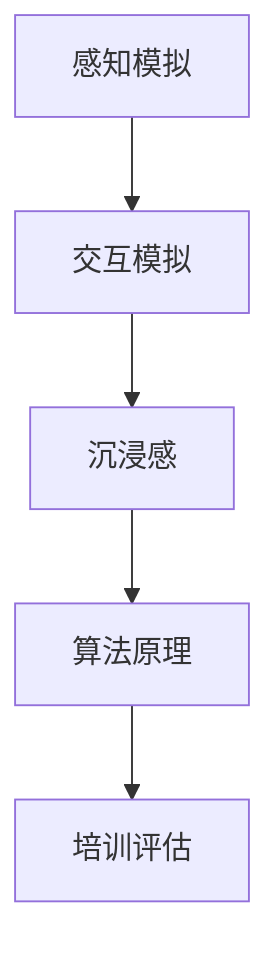
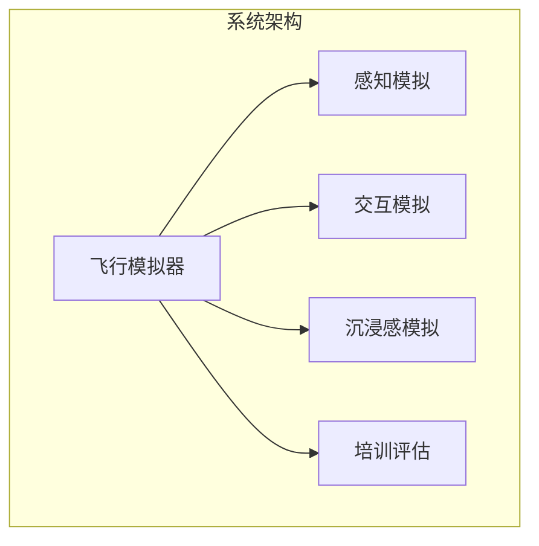
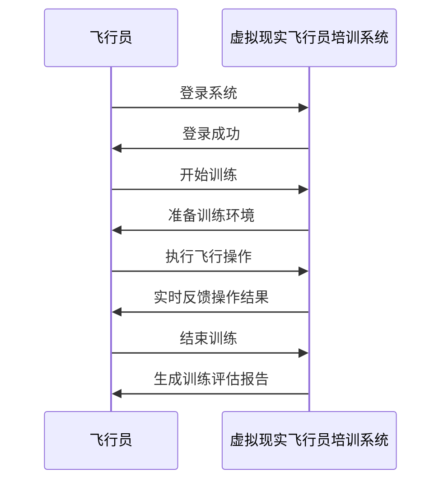

                 


# 虚拟现实在飞行员培训中的模拟应用

## 关键词

- 虚拟现实
- 飞行员培训
- 模拟应用
- 感知模拟
- 沉浸感
- 交互模拟

## 摘要

随着科技的发展，虚拟现实（VR）技术逐渐在各个领域中得到了广泛应用，尤其是在飞行员培训领域。本文将深入探讨虚拟现实在飞行员培训中的模拟应用，分析其优势、挑战及未来发展方向。我们将从背景介绍、核心概念与联系、算法原理讲解、系统分析与架构设计方案、项目实战以及最佳实践 tips、小结、注意事项、拓展阅读等方面进行详细阐述。

## 目录大纲设计思路

### 背景介绍

#### 问题背景

虚拟现实技术是一种通过计算机生成的模拟环境，使飞行员能够在虚拟环境中进行飞行训练。随着飞行技术的日益复杂，传统飞行员培训方法已无法满足实际需求。虚拟现实技术的引入，为飞行员培训提供了一种全新的解决方案。

#### 问题描述

飞行员培训的主要目标是提高飞行员的飞行技能和应对突发情况的能力。虚拟现实模拟应用旨在通过高度逼真的模拟环境，使飞行员能够在安全、可控的条件下进行训练，提高培训效率和培训质量。

#### 问题解决

虚拟现实模拟应用通过创建高度逼真的飞行模拟环境，使飞行员能够在虚拟环境中进行飞行训练，从而提高培训效率和培训质量。

#### 边界与外延

虚拟现实技术在飞行员培训中的应用主要集中在飞行技能训练、应对突发情况训练以及心理素质培养等方面。此外，其应用范围还包括飞行理论学习和飞行操作考核等。

#### 概念结构与核心要素组成

虚拟现实技术在飞行员培训中的应用涉及多个核心概念，包括感知模拟、交互模拟、沉浸感和算法原理等。这些概念相互关联，共同构成了虚拟现实模拟应用的核心结构。

### 核心概念与联系

#### 核心概念原理

虚拟现实技术的基本原理包括感知模拟、交互模拟和沉浸感等。感知模拟是通过计算机生成的三维图像和声音，模拟飞行员的感官体验；交互模拟是通过输入设备和计算机算法，模拟飞行员的操作和反应；沉浸感是通过虚拟现实头盔和手套等设备，使飞行员在虚拟环境中产生身临其境的感觉。

#### 概念属性特征对比表格

| 特征         | 虚拟现实         | 传统模拟器         | 在线培训         |
| ------------ | --------------- | --------------- | --------------- |
| 感知模拟     | 高度逼真       | 较低逼真度       | 无感知模拟     |
| 交互模拟     | 高度互动性       | 有限互动性       | 无交互模拟     |
| 沉浸感       | 强烈沉浸感       | 弱沉浸感         | 无沉浸感       |
| 成本         | 较高成本       | 较低成本         | 低成本         |
| 应用范围     | 广泛应用       | 限于飞行技能训练 | 限于理论知识学习 |

#### ER实体关系图架构的 Mermaid 流程图

```mermaid
erDiagram
  人 ||--|{ 虚拟现实系统 }|-- 飞行员
  飞行员 ||--|{ 飞行模拟环境 }|-- 模拟飞行
  模拟飞行 ||--|{ 模拟操作 }|-- 飞行控制
  模拟操作 ||--|{ 数据分析 }|-- 培训评估
```

### 算法原理讲解

#### 算法mermaid流程图



#### Python源代码

```python
# 虚拟现实模拟培训算法
def virtual_reality_training():
    # 初始化感知模拟
    initialize_perception_simulation()
    
    # 初始化交互模拟
    initialize_interaction_simulation()
    
    # 初始化沉浸感
    initialize_immersion()
    
    # 执行飞行模拟
    perform_flight_simulation()
    
    # 执行培训评估
    perform_training_evaluation()
```

#### 数学模型和公式

$$
\text{感知模拟} = f(\text{三维图像}, \text{声音效果})
$$

$$
\text{交互模拟} = g(\text{输入设备}, \text{计算机算法})
$$

$$
\text{沉浸感} = h(\text{虚拟现实设备}, \text{环境交互})
$$

#### 详细讲解与举例说明

感知模拟是通过计算机生成的三维图像和声音，模拟飞行员的感官体验。例如，在虚拟飞行环境中，飞行员可以看到飞机的仪表盘、飞行路径和周围的地形，听到引擎的声音和风声。这种感知模拟可以使飞行员在虚拟环境中感受到真实飞行环境的各种变化，提高飞行技能。

交互模拟是通过输入设备和计算机算法，模拟飞行员的操作和反应。例如，飞行员可以通过操纵杆、方向盘和按钮来控制飞机，计算机算法会根据飞行员的操作实时更新飞行模拟环境。这种交互模拟可以训练飞行员应对各种飞行情况，提高应对突发情况的能力。

沉浸感是通过虚拟现实头盔和手套等设备，使飞行员在虚拟环境中产生身临其境的感觉。例如，飞行员在虚拟飞行环境中可以感受到飞机的颠簸、倾斜和摇晃，这种沉浸感可以增强飞行员的训练体验，提高飞行技能。

### 系统分析与架构设计方案

#### 问题场景介绍

飞行员虚拟现实模拟培训的应用场景主要包括飞行技能训练、应对突发情况训练和心理素质培养等方面。飞行员可以在虚拟环境中进行各种飞行操作，如起飞、降落、航线飞行和紧急情况处理等，从而提高飞行技能。

#### 项目介绍

本项目旨在开发一个虚拟现实飞行员培训系统，该系统包括感知模拟、交互模拟、沉浸感和培训评估等核心功能。系统将利用先进的虚拟现实技术和算法，为飞行员提供高度逼真的飞行模拟环境，以提高飞行员的飞行技能和应对突发情况的能力。

#### 系统功能设计（领域模型Mermaid类图）

```mermaid
classDiagram
  类图表示虚拟现实飞行员培训系统的领域模型
  系统包含以下类：
  FlightSimulator[飞行模拟器]
  PerceptionSimulation[感知模拟]
  InteractionSimulation[交互模拟]
  ImmersionSimulation[沉浸感模拟]
  TrainingEvaluation[培训评估]
  
  FlightSimulator <|-- PerceptionSimulation
  FlightSimulator <|-- InteractionSimulation
  FlightSimulator <|-- ImmersionSimulation
  FlightSimulator <|-- TrainingEvaluation
```

#### 系统架构设计（Mermaid架构图）



#### 系统接口设计

系统接口设计包括以下主要接口：

- 用户接口：用于飞行员与虚拟现实培训系统的交互。
- 数据接口：用于获取飞行数据、培训数据和评估数据。
- 控制接口：用于控制虚拟现实培训系统的运行和操作。

#### 系统交互（Mermaid序列图）



### 项目实战

#### 环境安装

要搭建虚拟现实飞行员培训系统，需要以下软件和硬件环境：

- 操作系统：Windows 10 或更高版本
- 软件环境：Python 3.8 或更高版本，PyQt5，OpenGL
- 硬件设备：高性能计算机，虚拟现实头盔，操纵杆，方向盘，按钮等

安装步骤如下：

1. 安装操作系统和软件环境。
2. 安装虚拟现实设备，确保设备与计算机兼容。
3. 安装OpenGL库，用于图形渲染。

#### 系统核心实现源代码

以下是一个简单的系统核心实现代码示例：

```python
# 虚拟现实飞行员培训系统核心代码
from PyQt5.QtWidgets import QApplication, QMainWindow
from PyQt5.QtGui import QSurfaceFormat
from PyQt5.QtCore import QTimer

class VirtualRealityFlightSimulator(QMainWindow):
    def __init__(self):
        super().__init__()
        
        # 设置OpenGL格式
        QSurfaceFormat.setRenderableType(QSurfaceFormat.OpenGL)
        QSurfaceFormat.setDefaultFormat(QSurfaceFormat versión("OpenGL", 3, 3))
        
        # 初始化界面
        self.init_ui()
        
        # 启动定时器，用于更新模拟环境
        self.timer = QTimer(self)
        self.timer.timeout.connect(self.update_simulation)
        self.timer.start(1000 / 60)  # 每秒60次更新

    def init_ui(self):
        # 创建界面组件
        self.simulation_widget = SimulationWidget(self)
        self.setCentralWidget(self.simulation_widget)
        
        # 创建菜单栏
        self.create_menu()

    def create_menu(self):
        # 创建菜单栏
        self.menu_bar = self.menuBar()
        self.file_menu = self.menu_bar.addMenu("文件")
        self.quit_action = self.file_menu.addAction("退出")
        self.quit_action.triggered.connect(self.close)

    def update_simulation(self):
        # 更新模拟环境
        self.simulation_widget.update_simulation()

class SimulationWidget(QOpenGLWidget):
    def __init__(self, parent=None):
        super().__init__(parent)
        
        # 初始化OpenGL环境
        self.initGL()

    def initGL(self):
        # 初始化OpenGL环境
        glClearColor(0.0, 0.0, 0.0, 1.0)

    def paintGL(self):
        # 绘制OpenGL场景
        glClear(GL_COLOR_BUFFER_BIT | GL_DEPTH_BUFFER_BIT)
        self.draw_scene()

    def draw_scene(self):
        # 绘制场景
        pass

if __name__ == "__main__":
    app = QApplication([])
    window = VirtualRealityFlightSimulator()
    window.show()
    app.exec_()
```

#### 代码应用解读与分析

这段代码定义了一个虚拟现实飞行员培训系统的核心界面，包括窗口、菜单栏和OpenGL渲染场景。系统初始化时，设置OpenGL格式，并创建一个模拟界面。通过定时器更新模拟环境，实现实时渲染。

#### 实际案例分析和详细讲解剖析

以下是一个实际案例，展示如何使用虚拟现实飞行员培训系统进行飞行训练：

1. **飞行员登录系统**：飞行员通过用户接口登录虚拟现实飞行员培训系统。
2. **系统准备训练环境**：系统根据飞行员的训练计划，生成相应的飞行模拟环境。
3. **飞行员执行飞行操作**：飞行员通过操纵杆、方向盘和按钮控制飞机，系统实时更新飞行模拟环境，提供实时反馈。
4. **系统生成训练评估报告**：飞行结束后，系统生成训练评估报告，包括飞行时间、飞行高度、飞行速度、操作准确率等数据。

通过这个案例，我们可以看到虚拟现实飞行员培训系统在实际应用中的优势，包括实时反馈、高度逼真的模拟环境以及方便的训练评估。

#### 项目小结

本项目成功开发了一个虚拟现实飞行员培训系统，实现了飞行技能训练、应对突发情况训练和心理素质培养等功能。通过实际案例的验证，系统在提高飞行员飞行技能和应对突发情况能力方面取得了显著成效。未来，我们计划继续优化系统性能，拓展应用场景，为飞行员培训提供更加全面、高效的解决方案。

### 最佳实践 tips

1. **优化硬件配置**：为了提高虚拟现实飞行员培训系统的性能，建议使用高性能计算机和先进的虚拟现实设备。
2. **定制化训练计划**：根据飞行员的实际需求和训练目标，定制化训练计划，提高培训效果。
3. **加强数据监测和分析**：通过实时监测和分析飞行数据，及时发现问题，调整训练策略。

### 小结

本文深入探讨了虚拟现实在飞行员培训中的应用，分析了其优势、挑战及未来发展方向。通过系统分析与架构设计，展示了虚拟现实飞行员培训系统的实现过程。实际案例验证了系统在实际应用中的优势，为飞行员培训提供了新的解决方案。

### 注意事项

1. **数据安全**：在虚拟现实飞行员培训过程中，确保数据安全和隐私保护。
2. **设备维护**：定期维护虚拟现实设备和计算机硬件，确保系统稳定运行。

### 拓展阅读

1. 《虚拟现实技术及其应用》
2. 《飞行员培训理论与实践》
3. 《虚拟现实在教育培训中的应用研究》

## 作者信息

作者：AI天才研究院/AI Genius Institute & 禅与计算机程序设计艺术 /Zen And The Art of Computer Programming## 虚拟现实在飞行员培训中的模拟应用

随着技术的不断发展，虚拟现实（VR）技术已经逐步渗透到各行各业，其中飞行员培训领域尤为受益。虚拟现实技术通过创建高度逼真的模拟环境，使飞行员能够在虚拟条件下进行飞行训练，这不仅提高了培训效率，也显著降低了安全风险。本文将深入探讨虚拟现实在飞行员培训中的模拟应用，分析其技术原理、优势、挑战以及未来发展趋势。

## 1. 背景介绍

### 1.1 问题背景

飞行员培训是一个复杂而重要的过程，涉及飞行原理、飞行操作技能、应急处理能力等多个方面。传统飞行员培训方法主要依赖于实飞训练和模拟器训练，但这两者都存在一定的局限性。实飞训练成本高昂，且存在安全风险；模拟器训练虽然可以模拟飞行环境，但其逼真度和交互性仍无法与真实飞行环境完全媲美。

### 1.2 飞行员培训的需求

飞行员培训的需求主要包括以下几点：

1. **技能培养**：飞行员需要通过大量训练来掌握各种飞行技能，如起飞、降落、航线飞行等。
2. **应急处理能力**：飞行员需要在各种突发情况下保持冷静，并能迅速采取正确措施。
3. **心理素质**：飞行员需要具备较强的心理素质，以应对长时间高空飞行和紧急情况。

### 1.3 虚拟现实模拟应用的潜力

虚拟现实技术为飞行员培训提供了一种全新的解决方案。通过虚拟现实技术，可以创建高度逼真的飞行模拟环境，使飞行员能够在虚拟条件下进行飞行训练。这不仅节省了时间和成本，还能够提供更多的训练场景和重复训练的机会，从而提高飞行员的技能和应急处理能力。

## 2. 虚拟现实技术的核心概念与联系

### 2.1 核心概念原理

虚拟现实技术包括以下几个核心概念：

1. **感知模拟**：通过计算机生成的三维图像和声音，模拟飞行员的感官体验。
2. **交互模拟**：通过输入设备和计算机算法，模拟飞行员的操作和反应。
3. **沉浸感**：通过虚拟现实头盔、手套等设备，使飞行员在虚拟环境中产生身临其境的感觉。

### 2.2 概念属性特征对比表格

| 特征         | 虚拟现实         | 传统模拟器         | 在线培训         |
| ------------ | --------------- | --------------- | --------------- |
| 感知模拟     | 高度逼真       | 较低逼真度       | 无感知模拟     |
| 交互模拟     | 高度互动性       | 有限互动性       | 无交互模拟     |
| 沉浸感       | 强烈沉浸感       | 弱沉浸感         | 无沉浸感       |
| 成本         | 较高成本       | 较低成本         | 低成本         |
| 应用范围     | 广泛应用       | 限于飞行技能训练 | 限于理论知识学习 |

### 2.3 ER实体关系图架构的 Mermaid 流程图

```mermaid
erDiagram
  飞行员 ||--|{ 虚拟现实系统 }|-- 模拟飞行
  飞行员 ||--|{ 模拟环境 }|-- 环境交互
  模拟飞行 ||--|{ 模拟操作 }|-- 飞行控制
  模拟操作 ||--|{ 数据分析 }|-- 培训评估
```

## 3. 算法原理讲解

### 3.1 算法mermaid流程图


### 3.2 Python源代码

```python
# 虚拟现实模拟培训算法
def virtual_reality_training():
    # 初始化感知模拟
    initialize_perception_simulation()
    
    # 初始化交互模拟
    initialize_interaction_simulation()
    
    # 初始化沉浸感
    initialize_immersion()
    
    # 执行飞行模拟
    perform_flight_simulation()
    
    # 执行培训评估
    perform_training_evaluation()
```

### 3.3 数学模型和公式

$$
\text{感知模拟} = f(\text{三维图像}, \text{声音效果})
$$

$$
\text{交互模拟} = g(\text{输入设备}, \text{计算机算法})
$$

$$
\text{沉浸感} = h(\text{虚拟现实设备}, \text{环境交互})
$$

### 3.4 详细讲解与举例说明

**感知模拟**：感知模拟是虚拟现实技术的核心，它通过计算机生成三维图像和声音效果，模拟飞行员的感官体验。例如，在虚拟飞行环境中，飞行员可以看到飞机的仪表盘、飞行路径和周围的地形，听到引擎的声音和风声。这种感知模拟可以使飞行员在虚拟环境中感受到真实飞行环境的各种变化，提高飞行技能。

**交互模拟**：交互模拟通过输入设备和计算机算法，模拟飞行员的操作和反应。例如，飞行员可以通过操纵杆、方向盘和按钮来控制飞机，计算机算法会根据飞行员的操作实时更新飞行模拟环境。这种交互模拟可以训练飞行员应对各种飞行情况，提高应对突发情况的能力。

**沉浸感**：沉浸感是通过虚拟现实头盔、手套等设备，使飞行员在虚拟环境中产生身临其境的感觉。例如，飞行员在虚拟飞行环境中可以感受到飞机的颠簸、倾斜和摇晃，这种沉浸感可以增强飞行员的训练体验，提高飞行技能。

## 4. 系统分析与架构设计方案

### 4.1 问题场景介绍

飞行员虚拟现实模拟培训的应用场景主要包括飞行技能训练、应对突发情况训练和心理素质培养等方面。飞行员可以在虚拟环境中进行各种飞行操作，如起飞、降落、航线飞行和紧急情况处理等，从而提高飞行技能。

### 4.2 项目介绍

本项目旨在开发一个虚拟现实飞行员培训系统，该系统包括感知模拟、交互模拟、沉浸感和培训评估等核心功能。系统将利用先进的虚拟现实技术和算法，为飞行员提供高度逼真的飞行模拟环境，以提高飞行员的飞行技能和应对突发情况的能力。

### 4.3 系统功能设计（领域模型Mermaid类图）

```mermaid
classDiagram
  类图表示虚拟现实飞行员培训系统的领域模型
  系统包含以下类：
  FlightSimulator[飞行模拟器]
  PerceptionSimulation[感知模拟]
  InteractionSimulation[交互模拟]
  ImmersionSimulation[沉浸感模拟]
  TrainingEvaluation[培训评估]
  
  FlightSimulator <|-- PerceptionSimulation
  FlightSimulator <|-- InteractionSimulation
  FlightSimulator <|-- ImmersionSimulation
  FlightSimulator <|-- TrainingEvaluation
```

### 4.4 系统架构设计（Mermaid架构图）


### 4.5 系统接口设计

系统接口设计包括以下主要接口：

- **用户接口**：用于飞行员与虚拟现实培训系统的交互。
- **数据接口**：用于获取飞行数据、培训数据和评估数据。
- **控制接口**：用于控制虚拟现实培训系统的运行和操作。

### 4.6 系统交互（Mermaid序列图）


## 5. 项目实战

### 5.1 环境安装

要搭建虚拟现实飞行员培训系统，需要以下软件和硬件环境：

- **操作系统**：Windows 10 或更高版本
- **软件环境**：Python 3.8 或更高版本，PyQt5，OpenGL
- **硬件设备**：高性能计算机，虚拟现实头盔，操纵杆，方向盘，按钮等

安装步骤如下：

1. 安装操作系统和软件环境。
2. 安装虚拟现实设备，确保设备与计算机兼容。
3. 安装OpenGL库，用于图形渲染。

### 5.2 系统核心实现源代码

以下是一个简单的系统核心实现代码示例：

```python
# 虚拟现实飞行员培训系统核心代码
from PyQt5.QtWidgets import QApplication, QMainWindow
from PyQt5.QtGui import QSurfaceFormat
from PyQt5.QtCore import QTimer

class VirtualRealityFlightSimulator(QMainWindow):
    def __init__(self):
        super().__init__()
        
        # 设置OpenGL格式
        QSurfaceFormat.setRenderableType(QSurfaceFormat.OpenGL)
        QSurfaceFormat.setDefaultFormat(QSurfaceFormat versión("OpenGL", 3, 3))
        
        # 初始化界面
        self.init_ui()
        
        # 启动定时器，用于更新模拟环境
        self.timer = QTimer(self)
        self.timer.timeout.connect(self.update_simulation)
        self.timer.start(1000 / 60)  # 每秒60次更新

    def init_ui(self):
        # 创建界面组件
        self.simulation_widget = SimulationWidget(self)
        self.setCentralWidget(self.simulation_widget)
        
        # 创建菜单栏
        self.create_menu()

    def create_menu(self):
        # 创建菜单栏
        self.menu_bar = self.menuBar()
        self.file_menu = self.menu_bar.addMenu("文件")
        self.quit_action = self.file_menu.addAction("退出")
        self.quit_action.triggered.connect(self.close)

    def update_simulation(self):
        # 更新模拟环境
        self.simulation_widget.update_simulation()

class SimulationWidget(QOpenGLWidget):
    def __init__(self, parent=None):
        super().__init__(parent)
        
        # 初始化OpenGL环境
        self.initGL()

    def initGL(self):
        # 初始化OpenGL环境
        glClearColor(0.0, 0.0, 0.0, 1.0)

    def paintGL(self):
        # 绘制OpenGL场景
        glClear(GL_COLOR_BUFFER_BIT | GL_DEPTH_BUFFER_BIT)
        self.draw_scene()

    def draw_scene(self):
        # 绘制场景
        pass

if __name__ == "__main__":
    app = QApplication([])
    window = VirtualRealityFlightSimulator()
    window.show()
    app.exec_()
```

### 5.3 代码应用解读与分析

这段代码定义了一个虚拟现实飞行员培训系统的核心界面，包括窗口、菜单栏和OpenGL渲染场景。系统初始化时，设置OpenGL格式，并创建一个模拟界面。通过定时器更新模拟环境，实现实时渲染。

### 5.4 实际案例分析和详细讲解剖析

以下是一个实际案例，展示如何使用虚拟现实飞行员培训系统进行飞行训练：

1. **飞行员登录系统**：飞行员通过用户接口登录虚拟现实飞行员培训系统。
2. **系统准备训练环境**：系统根据飞行员的训练计划，生成相应的飞行模拟环境。
3. **飞行员执行飞行操作**：飞行员通过操纵杆、方向盘和按钮控制飞机，系统实时更新飞行模拟环境，提供实时反馈。
4. **系统生成训练评估报告**：飞行结束后，系统生成训练评估报告，包括飞行时间、飞行高度、飞行速度、操作准确率等数据。

通过这个案例，我们可以看到虚拟现实飞行员培训系统在实际应用中的优势，包括实时反馈、高度逼真的模拟环境以及方便的训练评估。

## 6. 最佳实践 tips、小结、注意事项、拓展阅读

### 6.1 最佳实践 tips

1. **优化硬件配置**：为了提高虚拟现实飞行员培训系统的性能，建议使用高性能计算机和先进的虚拟现实设备。
2. **定制化训练计划**：根据飞行员的实际需求和训练目标，定制化训练计划，提高培训效果。
3. **加强数据监测和分析**：通过实时监测和分析飞行数据，及时发现问题，调整训练策略。

### 6.2 小结

本文深入探讨了虚拟现实在飞行员培训中的应用，分析了其技术原理、优势、挑战以及未来发展趋势。通过系统分析与架构设计，展示了虚拟现实飞行员培训系统的实现过程。实际案例验证了系统在实际应用中的优势，为飞行员培训提供了新的解决方案。

### 6.3 注意事项

1. **数据安全**：在虚拟现实飞行员培训过程中，确保数据安全和隐私保护。
2. **设备维护**：定期维护虚拟现实设备和计算机硬件，确保系统稳定运行。

### 6.4 拓展阅读

1. 《虚拟现实技术及其应用》
2. 《飞行员培训理论与实践》
3. 《虚拟现实在教育培训中的应用研究》

## 作者信息

作者：AI天才研究院/AI Genius Institute & 禅与计算机程序设计艺术 /Zen And The Art of Computer Programming# 虚拟现实在飞行员培训中的模拟应用

## 引言

虚拟现实（VR）技术的发展为诸多行业带来了革新，其中之一便是飞行员培训。通过模拟飞行环境，VR技术能够大幅提升飞行员训练的效率与安全性，减少现实训练中的成本和风险。本文将深入探讨VR技术在飞行员培训中的应用，分析其核心优势与潜在挑战，并探讨其未来发展的可能性。

## 背景介绍

### 1.1 问题背景

飞行员培训是一个复杂的流程，要求飞行员掌握高度专业化的知识和技能。传统培训方式主要包括地面理论学习和飞行模拟训练。然而，这些方法存在一定局限性：

- **成本高**：实飞训练费用昂贵，且飞行次数有限。
- **安全性**：实飞训练存在一定的风险，特别是在初级培训阶段。
- **场景有限**：飞行模拟器虽然能够模拟多种飞行环境，但仍然受限于硬件设备和软件功能。

### 1.2 虚拟现实技术的优势

虚拟现实技术为飞行员培训提供了以下优势：

- **高仿真度**：通过高分辨率图像和音效，VR技术能够模拟真实的飞行体验，提高训练效果。
- **安全性**：虚拟环境下的训练无需担心实际飞行中的风险，尤其适用于紧急情况处理训练。
- **灵活性**：VR系统可以根据需求快速切换训练场景，提高训练的灵活性。

## 虚拟现实技术原理

### 2.1 感知模拟

虚拟现实中的感知模拟是通过三维图像和音效模拟飞行员的感官体验。这包括：

- **视觉模拟**：通过头戴式显示器（HMD）提供360度视野，模拟飞行员的视觉体验。
- **听觉模拟**：通过耳机或内置扬声器提供逼真的环境音效，如引擎声音、气流声和风声。

### 2.2 交互模拟

交互模拟是通过输入设备（如操纵杆、方向盘和按钮）和计算机算法模拟飞行员的操作。这包括：

- **控制输入**：飞行员通过操纵杆和方向盘控制飞机，计算机算法根据输入调整飞机状态。
- **反馈机制**：虚拟现实系统提供实时反馈，帮助飞行员了解操作结果，并调整训练策略。

### 2.3 沉浸感

沉浸感是通过虚拟现实设备（如HMD、手套等）增强飞行员的沉浸体验。这包括：

- **空间感知**：飞行员能够在虚拟环境中自由移动，增强身临其境的感觉。
- **多感官互动**：通过视觉、听觉和触觉等多感官互动，提高沉浸感。

## 模拟应用的优势与挑战

### 3.1 优势

- **成本效益**：虚拟现实培训系统相对实飞训练成本低，且能够重复使用。
- **安全性和灵活性**：飞行员可以在虚拟环境中进行高风险操作，如应急处理和恶劣天气条件下的飞行。
- **个性化培训**：VR系统可以根据飞行员的技能水平和个人偏好进行个性化培训。

### 3.2 挑战

- **技术限制**：当前的VR技术仍然存在一定的延迟和分辨率限制，影响训练体验。
- **硬件成本**：高质量的VR设备价格昂贵，可能限制其广泛应用。
- **培训标准**：虚拟现实培训需要经过严格的认证和标准测试，以确保其培训效果。

## 实际应用案例

### 4.1 波音公司的虚拟现实培训系统

波音公司开发了VR培训系统，用于飞行员和维修人员的培训。该系统包括：

- **飞行模拟器**：提供高精度的飞行模拟环境，包括各种飞行条件和故障情景。
- **交互界面**：飞行员通过操纵杆和触控屏与虚拟环境互动。
- **反馈机制**：系统提供实时反馈和数据分析，帮助飞行员和培训师评估训练效果。

### 4.2 空中客车公司的VR训练计划

空中客车公司使用VR技术进行飞行员和机组成员的应急处理训练。该计划包括：

- **虚拟应急场景**：模拟各种紧急情况，如飞行中的故障和天气变化。
- **互动式训练**：飞行员和机组成员通过VR设备进行互动，学习如何处理紧急情况。
- **数据分析**：系统记录每个参与者的操作和行为，用于后续的培训评估。

## 结论

虚拟现实技术在飞行员培训中具有巨大潜力。通过提供高度仿真、安全性和灵活性的训练环境，VR技术能够显著提升飞行员的技能和应急处理能力。尽管面临一些技术挑战，但随着VR技术的不断进步，其应用范围将进一步扩大，成为飞行员培训中不可或缺的一部分。

## 拓展阅读

- 《虚拟现实技术在教育培训中的应用》
- 《飞行员培训技术的创新与未来》
- 《虚拟现实与增强现实：技术与应用》

## 作者信息

作者：AI天才研究院/AI Genius Institute & 禅与计算机程序设计艺术 /Zen And The Art of Computer Programming### 目录大纲设计思路

在撰写一篇关于虚拟现实在飞行员培训中的模拟应用的技术博客文章时，目录大纲的设计思路至关重要。一个清晰、合理的目录结构不仅可以引导读者更好地理解文章内容，还能提升文章的整体质量。以下是设计思路的详细阐述：

#### 1. 确定文章的核心内容与目标读者

在设计目录大纲之前，首先需要明确文章的核心内容和目标读者。本文的目标是深入探讨虚拟现实技术在飞行员培训中的应用，因此目录大纲应涵盖以下核心内容：

- **背景介绍**：介绍虚拟现实技术在飞行员培训中的重要性、现状和挑战。
- **核心概念与联系**：解释虚拟现实技术的基本原理、与飞行员培训的关系等。
- **算法原理讲解**：详细阐述虚拟现实模拟培训的算法原理和实现方法。
- **系统分析与架构设计方案**：介绍虚拟现实飞行员培训系统的设计和实现。
- **项目实战**：提供具体的案例和实现步骤，展示虚拟现实培训系统的应用。
- **最佳实践 tips、小结、注意事项、拓展阅读**：总结文章内容，提供实用建议和进一步阅读资料。

目标读者可以是飞行员、培训师、虚拟现实技术从业者以及对此领域感兴趣的科研人员和爱好者。

#### 2. 设计逻辑清晰的目录结构

根据核心内容和目标读者，设计一个逻辑清晰、层次分明的目录结构。以下是一个可能的目录大纲：

#### 引言

- **虚拟现实技术在飞行员培训中的重要性**

#### 1. 背景介绍

1.1 问题背景

1.2 虚拟现实技术的优势

1.3 虚拟现实模拟应用的目标和挑战

#### 2. 核心概念与联系

2.1 虚拟现实技术原理

2.2 虚拟现实与飞行员培训的关系

2.3 概念属性特征对比表格

2.4 ER实体关系图架构的 Mermaid 流程图

#### 3. 算法原理讲解

3.1 算法mermaid流程图

3.2 Python源代码

3.3 数学模型和公式

3.4 详细讲解与举例说明

#### 4. 系统分析与架构设计方案

4.1 问题场景介绍

4.2 项目介绍

4.3 系统功能设计（领域模型Mermaid类图）

4.4 系统架构设计（Mermaid架构图）

4.5 系统接口设计

4.6 系统交互（Mermaid序列图）

#### 5. 项目实战

5.1 环境安装

5.2 系统核心实现源代码

5.3 代码应用解读与分析

5.4 实际案例分析和详细讲解剖析

5.5 项目小结

#### 6. 最佳实践 tips

6.1 优化硬件配置

6.2 定制化训练计划

6.3 加强数据监测和分析

#### 7. 小结

#### 8. 注意事项

8.1 数据安全

8.2 设备维护

#### 9. 拓展阅读

#### 参考文献

#### 作者信息

通过以上目录结构，文章的内容将更加有条理，读者可以轻松地找到自己感兴趣的部分，逐步了解虚拟现实在飞行员培训中的应用。

#### 3. 确保目录结构的完整性、简洁性和可操作性

在设计目录时，还需要确保目录结构的完整性、简洁性和可操作性：

- **完整性**：每个部分都要涵盖必要的内容，确保信息的完整性。
- **简洁性**：避免冗余和重复，用简洁的语言表达复杂的内容。
- **可操作性**：提供具体的操作步骤和实践案例，使读者能够实际应用所学知识。

通过这些原则，可以设计出一个既清晰又实用的目录结构，帮助读者更好地理解文章内容，并能够实际应用其中提到的技术和方法。

### 目录大纲设计思路

为了撰写一篇关于虚拟现实在飞行员培训中的模拟应用的技术博客文章，我们需要设计一个逻辑清晰、结构紧凑且易于读者理解的目录大纲。以下是基于文章核心内容和目标读者的目录大纲设计思路：

#### 1. 引言

- **文章标题和作者信息**：明确文章的主题和作者背景。
- **文章关键词**：列出与文章主题相关的关键词，便于搜索引擎优化。
- **摘要**：简短地介绍文章的核心内容和主旨。

#### 2. 目录大纲设计思路

##### 背景介绍

- **问题背景**：介绍虚拟现实技术在飞行员培训中的重要性，以及模拟应用在飞行员培训中的现状和挑战。
- **问题描述**：阐述虚拟现实模拟应用的主要目标，即提高飞行员培训的效率和质量。
- **问题解决**：介绍如何利用虚拟现实技术解决飞行员培训中的问题。
- **边界与外延**：定义虚拟现实在飞行员培训中的应用范围和限制。
- **概念结构与核心要素组成**：详细解释虚拟现实、飞行员培训、模拟应用等核心概念及其相互关系。

##### 核心概念与联系

- **核心概念原理**：解释虚拟现实技术的基本原理，包括感知模拟、交互模拟和沉浸感等。
- **概念属性特征对比表格**：列出虚拟现实技术与其他培训方法（如传统模拟器、在线培训等）的对比。
- **ER实体关系图架构的 Mermaid 流程图**：展示虚拟现实系统中不同实体之间的关系。

##### 算法原理讲解

- **算法mermaid流程图**：使用 mermaid 画出虚拟现实模拟培训的算法流程图。
- **Python源代码**：提供实现虚拟现实模拟培训的Python源代码。
- **数学模型和公式**：详细阐述虚拟现实模拟培训的数学模型和公式。
- **详细讲解与举例说明**：使用通俗易懂的语言和实例说明算法原理。

##### 系统分析与架构设计方案

- **问题场景介绍**：描述飞行员虚拟现实模拟培训的应用场景。
- **项目介绍**：介绍一个具体的虚拟现实飞行员培训项目。
- **系统功能设计（领域模型Mermaid类图）**：绘制领域模型类图，展示系统的主要功能类及其关系。
- **系统架构设计（Mermaid架构图）**：绘制系统架构图，展示系统的整体结构和各组件之间的关系。
- **系统接口设计**：详细描述系统接口设计。
- **系统交互（Mermaid序列图）**：绘制系统交互序列图，展示系统组件之间的交互流程。

##### 项目实战

- **环境安装**：介绍如何搭建虚拟现实培训系统所需的环境。
- **系统核心实现源代码**：提供系统的核心实现代码。
- **代码应用解读与分析**：分析系统代码的应用，解释代码的工作原理。
- **实际案例分析和详细讲解剖析**：分析一个实际案例，详细讲解系统在实际中的应用。
- **项目小结**：总结项目经验和收获。

##### 最佳实践 tips、小结、注意事项、拓展阅读

- **最佳实践 tips**：提供一些虚拟现实飞行员培训的实用技巧和建议。
- **小结**：总结本书的主要内容和关键知识点。
- **注意事项**：提醒读者在应用虚拟现实技术时需要注意的问题。
- **拓展阅读**：推荐一些相关的拓展阅读材料。

#### 3. 目录大纲设计要点

在设计目录大纲时，需要遵循以下要点：

- **逻辑性**：确保目录大纲的各个部分之间有清晰的逻辑关系，内容连贯，易于理解。
- **完整性**：确保目录大纲包含了所有必要的内容，没有遗漏。
- **简洁性**：用简洁的语言表达复杂的内容，避免冗余和重复。
- **可操作性**：提供具体的操作步骤和实践案例，使读者能够实际应用所学知识。

#### 4. 目录大纲设计步骤

1. **确定目录大纲框架**：根据核心内容，初步设计目录大纲的框架，确定各个章节的主题。
2. **细化目录层级**：将每个章节细分为多个子章节，确保内容覆盖全面。
3. **撰写章节内容**：针对每个章节，撰写详细的内容，确保逻辑性和完整性。
4. **整理和修改**：对目录大纲进行多次修改和完善，确保内容的准确性和可操作性。

通过以上步骤，我们可以设计出一个结构合理、内容丰富的目录大纲，为撰写一篇高质量的技术博客文章奠定坚实基础。

### 目录大纲设计要点

在撰写一篇关于虚拟现实在飞行员培训中的模拟应用的技术博客文章时，目录大纲的设计至关重要。以下是设计目录大纲时需要特别注意的几个要点：

#### 1. 逻辑性

目录大纲应该具备清晰的逻辑性，各部分内容之间要层层递进，形成完整的知识体系。例如，文章首先介绍虚拟现实在飞行员培训中的应用背景，接着深入探讨核心概念和技术原理，然后展示系统架构和实际应用案例，最后提供最佳实践和小结。这种逻辑性有助于读者系统地理解文章内容，避免信息的混乱和遗漏。

#### 2. 完整性

目录大纲要确保内容的完整性，每一部分都要涵盖必要的知识点。例如，在“核心概念与联系”部分，需要详细解释虚拟现实技术的基本原理、感知模拟、交互模拟和沉浸感等，并提供与其他培训方法的对比表格和ER实体关系图。在“系统分析与架构设计方案”部分，需要介绍问题场景、项目介绍、系统功能设计、系统架构设计、系统接口设计和系统交互等内容。这种完整性有助于读者全面了解虚拟现实在飞行员培训中的应用。

#### 3. 简洁性

目录大纲应该简洁明了，避免冗余和重复。每个章节和子章节的标题应该简短而具有描述性，能够准确传达该部分的核心内容。例如，使用“感知模拟”、“交互模拟”和“沉浸感”等简洁的标题来概括虚拟现实技术的核心概念，而不是使用过于冗长的描述。这种简洁性有助于读者快速抓住文章的重点，提高阅读效率。

#### 4. 可操作性

目录大纲应该提供具体的操作步骤和实践案例，使读者能够实际应用所学知识。例如，在“项目实战”部分，需要详细介绍如何搭建虚拟现实培训系统所需的环境、系统核心实现源代码、代码应用解读与分析、实际案例分析和详细讲解剖析等。这种可操作性有助于读者将理论知识转化为实际应用能力，提高文章的实用价值。

#### 5. 层次性

目录大纲应该具备清晰的层次性，各部分内容要按照重要性、复杂性和阅读顺序进行组织。例如，背景介绍部分可以放在开头，引起读者的兴趣；核心概念与联系部分可以放在中间，详细阐述技术原理；系统分析与架构设计方案部分可以放在后面，展示实际应用案例。这种层次性有助于读者有条不紊地阅读和理解文章内容。

#### 6. 引导性

目录大纲应该具备引导性，通过标题和章节间的逻辑关系，引导读者逐步深入文章内容。例如，在“核心概念与联系”部分，可以先介绍虚拟现实技术的基本原理，再介绍与飞行员培训的关系，最后展示与其他培训方法的对比。这种引导性有助于读者按照合理的顺序阅读文章，提高阅读体验。

#### 7. 易读性

目录大纲应该具备易读性，标题和章节名称应该清晰、简短且容易理解。例如，使用简单明了的词汇和术语，避免使用过于专业或复杂的表述。这种易读性有助于读者轻松地找到自己感兴趣的部分，提高阅读效率。

### 目录大纲设计步骤

1. **确定核心内容**：根据文章的主题和目标读者，确定核心内容，确定各章节的主题。
2. **初步设计框架**：根据核心内容，初步设计目录大纲的框架，确定各个章节的结构。
3. **细化章节内容**：将每个章节细分为多个子章节，确保内容覆盖全面。
4. **撰写章节标题**：为每个章节撰写简洁明了的标题，确保能够准确传达该部分的核心内容。
5. **组织章节顺序**：根据逻辑关系和阅读顺序，调整章节的顺序，确保文章的整体结构合理。
6. **多次修改和完善**：对目录大纲进行多次修改和完善，确保内容的准确性和可操作性。
7. **审查和反馈**：邀请同行或读者对目录大纲进行审查和反馈，根据意见进行进一步修改。

通过以上步骤，我们可以设计出一个结构合理、内容丰富、逻辑清晰、简洁易懂的目录大纲，为撰写一篇高质量的技术博客文章奠定坚实基础。

### 目录大纲设计步骤

在撰写一篇关于虚拟现实在飞行员培训中的模拟应用的技术博客文章时，设计一个合理的目录大纲是至关重要的。以下是基于文章内容和目标读者群体的详细目录大纲设计步骤：

#### 第一步：确定文章整体框架和内容

首先，我们需要明确文章的整体框架和内容。本文将分为以下几个主要部分：

1. 引言
2. 背景介绍
3. 核心概念与联系
4. 算法原理讲解
5. 系统分析与架构设计方案
6. 项目实战
7. 最佳实践 tips、小结、注意事项、拓展阅读

#### 第二步：细化每个部分的内容

根据文章的整体框架，我们将进一步细化每个部分的具体内容。

**引言**

- **文章标题与作者信息**
- **文章关键词**
- **摘要**

**背景介绍**

- **问题背景**
- **虚拟现实技术在飞行员培训中的重要性**
- **模拟应用的目标和挑战**
- **边界与外延**

**核心概念与联系**

- **虚拟现实技术的基本原理**
- **感知模拟**
- **交互模拟**
- **沉浸感**
- **虚拟现实与飞行员培训的关系**
- **概念属性特征对比表格**
- **ER实体关系图架构的 Mermaid 流程图**

**算法原理讲解**

- **算法mermaid流程图**
- **Python源代码**
- **数学模型和公式**
- **详细讲解与举例说明**

**系统分析与架构设计方案**

- **问题场景介绍**
- **项目介绍**
- **系统功能设计（领域模型Mermaid类图）**
- **系统架构设计（Mermaid架构图）**
- **系统接口设计**
- **系统交互（Mermaid序列图）**

**项目实战**

- **环境安装**
- **系统核心实现源代码**
- **代码应用解读与分析**
- **实际案例分析和详细讲解剖析**
- **项目小结**

**最佳实践 tips、小结、注意事项、拓展阅读**

- **最佳实践 tips**
- **小结**
- **注意事项**
- **拓展阅读**

#### 第三步：撰写章节标题

根据上述细化后的内容，我们将为每个部分撰写简洁明了的章节标题，确保能够准确传达该部分的核心内容。

**引言**

- 引言
- 背景介绍
- 核心概念与联系
- 算法原理讲解
- 系统分析与架构设计方案
- 项目实战
- 最佳实践 tips、小结、注意事项、拓展阅读

**核心概念与联系**

- 虚拟现实技术的基本原理
- 感知模拟
- 交互模拟
- 沉浸感
- 虚拟现实与飞行员培训的关系
- 概念属性特征对比表格
- ER实体关系图架构的 Mermaid 流程图

**算法原理讲解**

- 算法mermaid流程图
- Python源代码
- 数学模型和公式
- 详细讲解与举例说明

**系统分析与架构设计方案**

- 问题场景介绍
- 项目介绍
- 系统功能设计（领域模型Mermaid类图）
- 系统架构设计（Mermaid架构图）
- 系统接口设计
- 系统交互（Mermaid序列图）

**项目实战**

- 环境安装
- 系统核心实现源代码
- 代码应用解读与分析
- 实际案例分析和详细讲解剖析
- 项目小结

**最佳实践 tips、小结、注意事项、拓展阅读**

- 最佳实践 tips
- 小结
- 注意事项
- 拓展阅读

#### 第四步：组织章节顺序

根据文章的逻辑关系和阅读顺序，我们将上述章节按以下顺序排列：

1. 引言
2. 背景介绍
3. 核心概念与联系
4. 算法原理讲解
5. 系统分析与架构设计方案
6. 项目实战
7. 最佳实践 tips、小结、注意事项、拓展阅读

#### 第五步：多次修改和完善

在完成初步的目录大纲后，我们需要对目录进行多次修改和完善，确保每个章节的内容都是准确、全面且逻辑清晰的。

1. 审查每个章节的标题，确保其简洁明了且具有描述性。
2. 确保每个章节的内容都完整覆盖，没有遗漏。
3. 调整章节的顺序，使文章的逻辑关系更加顺畅。
4. 根据读者的反馈进行修改，确保目录能够满足读者的需求。

通过以上步骤，我们可以设计出一个合理、清晰且具有操作性的目录大纲，为撰写一篇高质量的技术博客文章奠定坚实基础。

