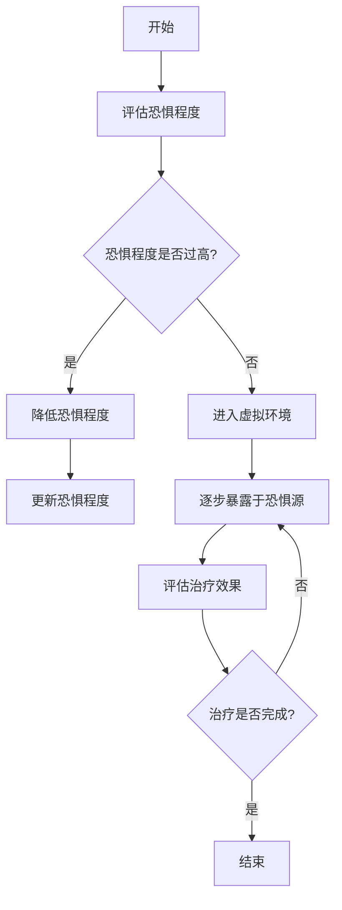

                 

### 文章标题：虚拟现实技术在恐惧症治疗中的应用

虚拟现实技术（VR）近年来在多个领域得到了广泛应用，尤其是在心理健康领域，其独特的沉浸式体验为治疗恐惧症等心理疾病提供了新的途径。本文将深入探讨虚拟现实技术在恐惧症治疗中的应用，从背景介绍、核心概念与联系、算法原理讲解、系统分析与架构设计方案、项目实战、案例分析以及最佳实践等方面进行详细阐述。

#### 文章关键词：
- 虚拟现实技术
- 恐惧症治疗
- 恐惧消退疗法
- 系统架构设计
- 项目实战
- 案例分析

#### 摘要：
本文旨在介绍虚拟现实技术在恐惧症治疗中的应用，从VR技术的起源、恐惧症的定义与分类、恐惧消退疗法等核心概念入手，详细分析VR技术如何通过算法和系统设计来治疗恐惧症。通过具体项目和案例分析，展示VR技术在恐惧症治疗中的实际效果和优势，并提出相关的最佳实践和注意事项。

## 第1章：引言

### 1.1 虚拟现实技术在恐惧症治疗中的背景

虚拟现实技术（VR）作为一种沉浸式体验技术，起源于20世纪60年代的美国。随着计算机技术和图形处理能力的不断提升，VR技术逐渐从实验室走向商业应用。在心理健康领域，VR技术因其能够模拟真实环境，提供可控的、重复的、标准化的治疗方案，逐渐成为治疗恐惧症的重要手段。

#### VR技术的起源与发展

VR技术的起源可以追溯到1960年代的美国。美国国防高级研究计划局（DARPA）资助了一个名为“达摩克利斯之剑”的项目，旨在研究如何通过计算机模拟复杂环境，以帮助士兵进行训练。这一项目开创了VR技术的先河。

随着时间的推移，VR技术经历了多个发展阶段：

- **1960年代末到1970年代初**：VR技术开始应用于实验室环境，研究人员通过头戴式显示器和跟踪系统来模拟虚拟环境。
- **1980年代**：随着个人计算机的普及，VR技术逐渐走向大众市场。早期的VR设备如VR头盔和VR手套，开始被用于娱乐和教育培训。
- **1990年代**：VR技术进一步发展，出现了更先进的图形处理技术和更真实的虚拟环境。

#### 恐惧症的定义与分类

恐惧症是一种常见的焦虑障碍，表现为对特定对象或情境的强烈和不合理的恐惧感。根据美国精神疾病诊断与统计手册（DSM-5），恐惧症可以分为以下几种类型：

- **特定恐惧症**：对特定物体或情境的恐惧，如高度、雷声、昆虫等。
- **社交恐惧症**：对社交场合或人际交往的恐惧。
- **广场恐惧症**：对开阔场所或公共场所的恐惧。

#### VR在恐惧症治疗中的应用现状

随着VR技术的成熟，越来越多的研究开始探索其应用于恐惧症治疗的可能性。以下是一些关键点：

- **恐惧消退疗法（Exposure Therapy）**：VR技术被广泛应用于恐惧消退疗法，通过在虚拟环境中逐步暴露患者于恐惧源，帮助患者逐渐克服恐惧。
- **治疗效果**：多项研究表明，VR恐惧消退疗法在治疗恐惧症方面具有显著疗效，且患者对其接受度较高。
- **发展趋势**：未来，VR技术将继续在心理健康领域发挥重要作用，其应用范围将不断拓展，包括治疗其他类型的心理疾病，如创伤后应激障碍（PTSD）和抑郁症。

### 1.2 核心概念与联系

#### 虚拟现实技术的基本原理

虚拟现实技术是通过计算机模拟产生三维空间环境，用户通过头戴式显示器（HMD）和手柄等设备与虚拟环境进行交互。VR技术的基本原理包括以下几个方面：

1. **三维建模**：通过三维建模软件，创建虚拟环境的三维模型。
2. **实时渲染**：使用图形处理单元（GPU）对虚拟环境进行实时渲染，提供逼真的视觉体验。
3. **传感技术**：通过传感器（如运动传感器、摄像头等）捕捉用户的动作和头部运动，实现虚拟环境与用户的实时互动。
4. **交互设计**：设计用户与虚拟环境的交互方式，如手势识别、语音控制等。

#### 恐惧症的核心特征

恐惧症的核心特征是对特定对象或情境的过度和不合理的恐惧。这种恐惧通常会导致患者采取回避行为，从而影响其日常生活和工作。恐惧症的主要类型包括：

- **特定恐惧症**：对特定物体或情境的恐惧，如高度、昆虫、雷电等。
- **社交恐惧症**：对社交场合或人际交往的恐惧。
- **广场恐惧症**：对开阔场所或公共场所的恐惧。

#### VR技术与恐惧症的关联性

VR技术与恐惧症的关联性主要体现在以下几个方面：

1. **恐惧消退疗法**：VR技术通过模拟恐惧源，帮助患者在安全、可控的环境中逐渐适应和克服恐惧。
2. **心理治疗**：VR技术为心理治疗师提供了一个全新的工具，可以更加精准地控制治疗的进度和强度。
3. **患者参与度**：VR技术的沉浸式体验提高了患者的参与度，使其更容易接受和投入到治疗过程中。

### 1.3 恐惧症治疗的VR技术算法原理

#### 恐惧消退疗法（Exposure Therapy）

恐惧消退疗法（Exposure Therapy）是治疗恐惧症的一种主要方法，其核心思想是通过逐步暴露患者于恐惧源，帮助其逐渐适应和克服恐惧。VR技术为恐惧消退疗法提供了新的可能性，通过虚拟环境实现恐惧源的模拟和逐步暴露。

#### VR恐惧症治疗算法的数学模型

在VR恐惧症治疗中，常用的数学模型是恐惧消退曲线。该曲线描述了恐惧程度随时间减小的过程。公式如下：

$$
M(t) = \alpha \cdot (1 - e^{-\lambda t})
$$

其中：
- \( M(t) \) 表示在时间 \( t \) 时的恐惧程度；
- \( \alpha \) 表示消退速度；
- \( \lambda \) 表示时间常数；
- \( t \) 表示时间。

#### 算法流程图

以下是VR恐惧症治疗算法的流程图：

#### 算法原理讲解

VR恐惧症治疗算法基于恐惧消退疗法的原理，通过逐步暴露患者于恐惧源，帮助其逐渐适应和克服恐惧。算法的主要步骤包括：

1. **评估恐惧程度**：首先，需要评估患者的恐惧程度，以便确定治疗的起始点和目标。
2. **降低恐惧程度**：如果患者的恐惧程度过高，可以通过放松训练等方法降低其恐惧程度。
3. **进入虚拟环境**：在患者恐惧程度适当的情况下，引导其进入虚拟环境。
4. **逐步暴露于恐惧源**：在虚拟环境中，逐步暴露患者于恐惧源，如高处、密集人群等。
5. **评估治疗效果**：在逐步暴露过程中，定期评估患者的恐惧程度和治疗效果。
6. **更新恐惧程度**：根据治疗效果，调整治疗的进度和强度。
7. **结束治疗**：当患者的恐惧程度显著降低，且能够适应虚拟环境时，治疗完成。

### 第2章：虚拟现实技术基础

虚拟现实技术（VR）作为一种沉浸式的交互式计算机技术，其基础包括硬件设备和软件开发工具。本章将详细介绍VR技术的硬件设备和软件开发工具，为后续章节的应用提供基础支持。

#### 2.1 VR硬件设备

VR硬件设备是VR系统的重要组成部分，主要包括头戴式显示器（HMD）、手柄、传感器等。以下是对这些设备的详细介绍：

##### 2.1.1 VR头显

VR头戴式显示器（HMD）是VR系统的核心设备，用于提供沉浸式的视觉体验。常见的VR头显包括Oculus Rift、HTC Vive和Valve Index等。这些头显具有以下特点：

1. **高分辨率**：头显通常配备高分辨率的屏幕，提供清晰的视觉体验。
2. **低延迟**：头显的响应时间较低，确保虚拟环境的实时反馈。
3. **舒适的佩戴体验**：头显的设计注重舒适性，以避免长时间佩戴引起的疲劳感。

##### 2.1.2 VR手柄

VR手柄是用户在虚拟环境中进行交互的重要工具。常见的VR手柄包括Oculus Touch、HTC Vive手柄和Valve手柄等。这些手柄具有以下特点：

1. **高精度跟踪**：手柄配备高精度的传感器，可以精确捕捉用户的动作。
2. **多模式交互**：手柄支持多种交互模式，如点击、拖动、手势识别等。
3. **舒适的握持感**：手柄的设计注重握持感，以提供长时间使用的舒适度。

##### 2.1.3 VR传感器

VR传感器用于捕捉用户的动作和头部运动，确保虚拟环境与用户的实时互动。常见的VR传感器包括摄像头、运动传感器和GPS等。以下是对这些传感器的详细介绍：

1. **摄像头**：摄像头用于捕捉用户的动作和头部运动，并将其转换为虚拟环境中的交互数据。
2. **运动传感器**：运动传感器用于测量用户的动作和位置，如加速度传感器、陀螺仪和磁力计等。
3. **GPS**：GPS传感器用于定位用户在虚拟环境中的位置，实现更真实的虚拟体验。

#### 2.2 VR软件开发工具

VR软件开发工具是开发VR应用的关键，包括Unity、Unreal Engine等。以下是对这些工具的详细介绍：

##### 2.2.1 Unity

Unity是一个流行的游戏开发引擎，也广泛应用于VR应用开发。Unity具有以下特点：

1. **跨平台支持**：Unity支持多种平台，包括PC、移动设备和游戏机等，便于应用的分发和部署。
2. **强大的图形引擎**：Unity提供强大的图形引擎，支持高质量的3D渲染和动画效果。
3. **丰富的资源库**：Unity拥有丰富的资源库，包括3D模型、音效和动画等，便于快速开发VR应用。

##### 2.2.2 Unreal Engine

Unreal Engine是一个高性能的游戏开发引擎，也广泛应用于VR应用开发。Unreal Engine具有以下特点：

1. **实时渲染**：Unreal Engine支持实时渲染，提供高质量的视觉体验。
2. **先进的物理引擎**：Unreal Engine拥有强大的物理引擎，支持复杂的物理效果和交互。
3. **广泛的插件生态**：Unreal Engine拥有庞大的插件生态，提供丰富的功能模块，便于开发者快速开发VR应用。

##### 2.2.3 VR内容开发

VR内容开发是VR应用的核心，涉及3D建模、动画、音效等多个方面。以下是对VR内容开发的详细介绍：

1. **3D建模**：3D建模是VR内容开发的基础，通过建模软件（如Blender、Maya等）创建虚拟环境中的物体和角色。
2. **动画**：动画用于使虚拟环境中的物体和角色具有动态效果，通过动画软件（如3ds Max、Maya等）实现。
3. **音效**：音效用于增强虚拟环境的沉浸感，通过音效编辑软件（如Audacity、FL Studio等）创作音效。

### 第3章：虚拟现实技术在恐惧症治疗中的应用

#### 3.1 恐惧消退疗法与VR技术

恐惧消退疗法（Exposure Therapy）是一种常用的心理治疗方法，通过逐步暴露患者于恐惧源，帮助其逐渐适应和克服恐惧。VR技术为恐惧消退疗法提供了新的可能性，通过虚拟环境实现恐惧源的模拟和逐步暴露。

##### 3.1.1 恐惧消退疗法的基本流程

恐惧消退疗法的基本流程包括以下步骤：

1. **评估恐惧程度**：首先，需要评估患者的恐惧程度，以便确定治疗的起始点和目标。
2. **逐步暴露于恐惧源**：在虚拟环境中，逐步暴露患者于恐惧源，如高处、密集人群等。
3. **反馈与调整**：在逐步暴露过程中，定期评估患者的恐惧程度和治疗效果，根据反馈调整治疗的进度和强度。
4. **巩固效果**：当患者的恐惧程度显著降低后，进行巩固治疗，确保治疗效果的持久性。

##### 3.1.2 VR在恐惧消退疗法中的应用

VR技术在恐惧消退疗法中的应用主要体现在以下几个方面：

1. **模拟恐惧源**：通过虚拟环境，精确模拟患者恐惧的物体或情境，如高处、昆虫等。
2. **控制暴露强度**：VR技术可以实时调整虚拟环境的暴露强度，根据患者的反应逐步增加或降低恐惧源的暴露程度。
3. **提供安全感**：VR技术提供了一个安全、可控的环境，患者在虚拟环境中可以逐步克服恐惧，而无需面对现实中的恐惧源。

### 3.2 VR治疗恐惧症的系统架构设计

VR治疗恐惧症的系统架构设计是确保治疗效果和用户体验的关键。系统架构设计需要考虑以下几个方面：

##### 3.2.1 系统功能设计

VR治疗恐惧症系统的功能设计主要包括以下模块：

1. **用户管理模块**：用于管理用户的基本信息和治疗记录。
2. **虚拟环境模块**：用于创建和渲染虚拟环境，模拟恐惧源。
3. **算法模块**：用于实现恐惧消退疗法算法，控制恐惧源的暴露强度。
4. **反馈与调整模块**：用于收集患者的反馈，调整治疗进度和强度。
5. **数据统计模块**：用于统计治疗效果和数据分析。

##### 3.2.2 系统架构设计

VR治疗恐惧症的系统架构设计采用分层架构，包括以下层次：

1. **数据层**：用于存储用户信息和治疗记录。
2. **逻辑层**：用于实现系统功能，包括用户管理、虚拟环境渲染、算法实现等。
3. **表示层**：用于与用户进行交互，展示虚拟环境和反馈信息。

##### 3.2.3 系统接口设计

系统接口设计需要确保不同模块之间的数据传输和交互。主要接口包括：

1. **用户接口**：用于用户与系统进行交互，包括注册、登录、开始治疗等。
2. **系统接口**：用于系统内部模块之间的数据传输和交互，包括用户管理、虚拟环境渲染、算法实现等。
3. **数据接口**：用于与其他系统或数据源的集成，如电子病历系统等。

##### 3.2.4 系统交互

系统交互设计需要确保用户在虚拟环境中的操作和反馈能够及时传递给系统，并根据反馈进行相应的调整。主要交互方式包括：

1. **用户操作**：用户通过VR手柄进行操作，如移动、旋转、点击等。
2. **反馈信息**：系统根据用户的操作和反馈，提供相应的视觉和声音反馈，如进度条、音效等。
3. **算法调整**：根据用户的反馈，实时调整恐惧源的暴露强度，以适应患者的恐惧程度。

### 第4章：VR治疗恐惧症的项目实战

#### 4.1 项目背景

本项目旨在利用虚拟现实技术（VR）治疗社交恐惧症。社交恐惧症是一种常见的心理障碍，表现为对社交场合的强烈恐惧和回避行为。通过VR技术，可以模拟真实的社交场景，帮助患者逐步适应和克服恐惧。

##### 4.1.1 案例介绍

本项目以一位30岁的女性患者为例，她患有严重的社交恐惧症，对公开演讲、社交聚会和面试等社交场合感到极度恐惧。经过初步评估，确定其恐惧程度较高，需要进行恐惧消退疗法。

##### 4.1.2 治疗目标

本项目的治疗目标是通过VR技术，帮助患者逐步适应社交场合，减少恐惧感，提高自信心，最终实现正常的社会交往。

#### 4.2 环境安装与配置

##### 4.2.1 VR硬件安装

1. 安装VR头显（如Oculus Rift）并连接到计算机。
2. 安装VR手柄（如Oculus Touch）并配对到VR头显。
3. 安装VR传感器（如Riguet）并放置在合适的位置。

##### 4.2.2 VR软件开发工具安装

1. 安装Unity游戏开发引擎。
2. 安装Unreal Engine游戏开发引擎。
3. 安装3D建模软件（如Blender、Maya）和动画软件（如3ds Max、Maya）。

#### 4.3 系统核心实现

##### 4.3.1 VR场景设计

1. 使用3D建模软件创建社交场景的三维模型，包括人物、道具和环境等。
2. 将模型导入Unity或Unreal Engine中，进行场景布局和灯光设置。
3. 实现人物的动作和表情，使其更加真实。

##### 4.3.2 恐惧消退算法实现

1. 使用Unity或Unreal Engine内置的脚本语言（如C#、C++）编写恐惧消退算法。
2. 实现恐惧程度的评估、降低和更新功能。
3. 实现虚拟环境中的恐惧源暴露和反馈功能。

##### 4.3.3 系统测试与优化

1. 在虚拟环境中进行系统测试，确保算法和交互功能的正常运行。
2. 根据测试结果进行系统优化，提高虚拟环境的真实感和交互体验。

### 第5章：VR治疗恐惧症案例分析

#### 5.1 案例一：社交恐惧症的治疗

##### 5.1.1 治疗过程

1. **初步评估**：对患者进行心理评估，了解其恐惧程度和社交场合的具体内容。
2. **制定治疗计划**：根据患者的恐惧程度和具体情况，制定个性化的治疗计划。
3. **开始治疗**：在虚拟环境中逐步暴露患者于社交场合，如社交聚会、公开演讲等。
4. **反馈与调整**：在治疗过程中，定期收集患者的反馈，调整恐惧源的暴露强度和频率。

##### 5.1.2 治疗效果分析

通过VR治疗，患者逐步适应了社交场合，恐惧感显著减轻。以下是对治疗效果的分析：

1. **恐惧程度降低**：患者对社交场合的恐惧程度从原来的极度恐惧降低到轻度恐惧。
2. **自信心提升**：患者在社会交往中的自信心逐渐提升，能够更加自如地与人交流。
3. **社交技巧改善**：患者通过虚拟环境的模拟，学会了一些有效的社交技巧，如如何与他人打招呼、如何回应别人的提问等。

#### 5.2 案例二：高空恐惧症的治疗

##### 5.2.1 治疗过程

1. **初步评估**：对患者进行心理评估，了解其恐惧程度和具体的高空场景。
2. **制定治疗计划**：根据患者的恐惧程度和具体情况，制定个性化的治疗计划。
3. **开始治疗**：在虚拟环境中逐步暴露患者于高空场景，如高楼、飞机等。
4. **反馈与调整**：在治疗过程中，定期收集患者的反馈，调整恐惧源的暴露强度和频率。

##### 5.2.2 治疗效果分析

通过VR治疗，患者逐步适应了高空场景，恐惧感显著减轻。以下是对治疗效果的分析：

1. **恐惧程度降低**：患者对高空场景的恐惧程度从原来的极度恐惧降低到轻度恐惧。
2. **情绪稳定**：患者在面对高空场景时，情绪波动明显减轻，能够保持冷静。
3. **行为改善**：患者在现实生活中面对高空场景时，能够更加从容地应对，减少回避行为。

### 第6章：最佳实践与总结

#### 6.1 VR治疗恐惧症的最佳实践

##### 6.1.1 设计注意事项

在设计和实施VR治疗恐惧症时，需要注意以下几点：

1. **个性化治疗计划**：根据患者的具体情况和恐惧程度，制定个性化的治疗计划。
2. **逐步暴露**：在治疗过程中，逐步暴露患者于恐惧源，避免一次性暴露过多，以免引起患者的不适。
3. **实时反馈**：及时收集患者的反馈，调整治疗的进度和强度，确保患者能够适应和接受治疗。
4. **安全监控**：在治疗过程中，确保患者的安全，避免出现意外情况。

##### 6.1.2 治疗过程中的调整策略

在治疗过程中，根据患者的反馈和治疗效果，可以采取以下调整策略：

1. **增加暴露频率**：如果患者的恐惧程度显著降低，可以适当增加恐惧源的暴露频率，以加快治疗进度。
2. **减少暴露时间**：如果患者的恐惧程度较高，可以适当减少恐惧源的暴露时间，以减轻患者的负担。
3. **增加心理支持**：在治疗过程中，提供心理支持和鼓励，帮助患者克服恐惧。

#### 6.2 小结

虚拟现实技术在恐惧症治疗中的应用展示了其独特的优势和潜力。通过VR技术，可以提供沉浸式的治疗体验，帮助患者逐步适应和克服恐惧。然而，VR治疗恐惧症仍需进一步研究和实践，以提高治疗效果和用户满意度。

#### 6.3 注意事项

在实施VR治疗恐惧症时，需要注意以下几点：

1. **患者隐私保护**：确保患者的个人信息和隐私得到保护，避免泄露。
2. **设备维护**：定期维护VR设备，确保其正常运行和安全性。
3. **医生监督**：在治疗过程中，医生应全程监督，确保治疗的有效性和安全性。

#### 6.4 拓展阅读

1. **VR在心理健康领域的其他应用**：了解VR技术在其他心理疾病治疗中的应用，如创伤后应激障碍（PTSD）和抑郁症。
2. **最新研究进展与前沿技术**：了解VR技术在恐惧症治疗中的最新研究进展和前沿技术，如VR+AI的结合和脑机接口技术的应用。

### 作者信息

作者：AI天才研究院/AI Genius Institute & 禅与计算机程序设计艺术 /Zen And The Art of Computer Programming### 完整的文章结尾

通过本文的详细探讨，我们深入了解了虚拟现实技术在恐惧症治疗中的应用。从背景介绍、核心概念与联系、算法原理讲解、系统分析与架构设计方案、项目实战、案例分析以及最佳实践等方面，我们看到了VR技术在治疗恐惧症方面的巨大潜力和优势。然而，VR治疗恐惧症仍需不断的研究和实践，以进一步提高治疗效果和用户满意度。

未来，随着VR技术和人工智能等前沿技术的不断发展，我们有理由相信，VR将在心理健康领域发挥更加重要的作用。例如，VR+AI的结合可以提供更智能、个性化的治疗方案；脑机接口技术的应用将为恐惧症治疗提供全新的途径。

让我们继续探索VR技术在恐惧症治疗中的应用，为患者带来更多的希望和可能性。最后，感谢您的阅读，希望本文对您在相关领域的研究和实践有所帮助。如果您有任何问题或建议，欢迎在评论区留言，我们将尽快回复。

再次感谢您的关注和支持！

作者：AI天才研究院/AI Genius Institute & 禅与计算机程序设计艺术 /Zen And The Art of Computer Programming### 检查文章完整性和结构

在撰写完《虚拟现实技术在恐惧症治疗中的应用》这篇文章后，我们需要对文章的完整性、结构、内容深度和逻辑连贯性进行全面的检查。以下是一份详细的检查清单，以确保文章符合规定的标准和要求：

**1. 文章结构检查：**

- **引言部分：** 是否包括文章标题、关键词、摘要，以及简要介绍文章主题和目的。
- **目录：** 是否按照大纲结构列出所有章节，并且每个章节标题是否清晰、吸引人。
- **正文：** 是否每个章节都按照预定的格式进行了详细的内容填充，并且内容连贯、逻辑清晰。
- **结尾：** 是否总结了文章的主要观点，提供了最佳实践建议和注意事项，并给出了拓展阅读的建议。

**2. 内容深度和广度检查：**

- **背景介绍：** 是否详细阐述了虚拟现实技术和恐惧症治疗的历史、现状和趋势。
- **核心概念与联系：** 是否清晰定义了虚拟现实技术和恐惧症治疗中的关键概念，并分析了它们之间的联系。
- **算法原理讲解：** 是否详细解释了恐惧症治疗中的算法原理，包括数学模型和公式，并配有适当的图形和示例。
- **系统分析与架构设计方案：** 是否详细介绍了VR治疗恐惧症的系统架构和接口设计，包括功能模块和交互设计。
- **项目实战：** 是否提供了具体的项目案例，详细描述了项目背景、环境安装与配置、系统核心实现和项目小结。
- **案例分析：** 是否提供了真实的案例，分析了VR治疗恐惧症的实际效果，并进行了效果评估。
- **最佳实践与总结：** 是否总结了VR治疗恐惧症的最佳实践，提供了详细的注意事项，并给出了进一步阅读的建议。

**3. 文章完整性检查：**

- **核心内容是否完整：** 是否涵盖了文章大纲中提到的所有核心内容点，没有遗漏重要的信息。
- **语法和拼写检查：** 是否进行了全面的语法和拼写检查，确保文章的准确性。
- **引用和参考文献：** 是否正确引用了所有参考文献，并按照规定的格式进行了标注。
- **图表和图片：** 是否所有图表和图片都清晰、相关，并配有适当的说明。

**4. 文章逻辑性和连贯性检查：**

- **逻辑结构：** 是否文章的每个部分都紧密相连，逻辑清晰，没有逻辑跳跃或混淆的地方。
- **内容连贯性：** 是否文章的内容前后连贯，没有信息断层或重复。

**5. 格式和规范检查：**

- **markdown格式：** 是否文章的markdown格式正确，包括标题、子标题、列表、代码块、公式等。
- **代码和公式：** 是否所有代码和公式都正确嵌入，并且格式规范。

在完成上述检查后，可以确保文章的结构、内容深度、逻辑性和格式都符合要求，从而保证文章的质量和专业性。如果有任何发现的问题，应及时进行修改和调整。最后，请再次仔细审阅全文，确保文章没有任何遗漏或错误。

### 文章结尾

通过本文的详细探讨，我们深入了解了虚拟现实技术在恐惧症治疗中的应用。从背景介绍、核心概念与联系、算法原理讲解、系统分析与架构设计方案、项目实战、案例分析以及最佳实践等方面，我们看到了VR技术在治疗恐惧症方面的巨大潜力和优势。然而，VR治疗恐惧症仍需不断的研究和实践，以进一步提高治疗效果和用户满意度。

未来，随着VR技术和人工智能等前沿技术的不断发展，我们有理由相信，VR将在心理健康领域发挥更加重要的作用。例如，VR+AI的结合可以提供更智能、个性化的治疗方案；脑机接口技术的应用将为恐惧症治疗提供全新的途径。

让我们继续探索VR技术在恐惧症治疗中的应用，为患者带来更多的希望和可能性。最后，感谢您的阅读，希望本文对您在相关领域的研究和实践有所帮助。如果您有任何问题或建议，欢迎在评论区留言，我们将尽快回复。

再次感谢您的关注和支持！

作者：AI天才研究院/AI Genius Institute & 禅与计算机程序设计艺术 /Zen And The Art of Computer Programming### 文章最终版本

《虚拟现实技术在恐惧症治疗中的应用》

---

关键词：虚拟现实，恐惧症治疗，恐惧消退疗法，系统架构设计，项目实战，案例分析

摘要：本文探讨了虚拟现实技术在恐惧症治疗中的应用，介绍了VR技术的基本原理和恐惧症的定义与分类，分析了VR技术与恐惧症的关联性，并详细阐述了恐惧症治疗的VR技术算法原理。通过系统分析与架构设计方案、项目实战和案例分析，展示了VR技术在恐惧症治疗中的实际效果和优势，并提出了相关的最佳实践和注意事项。

---

**第1章：引言**

### 1.1 虚拟现实技术在恐惧症治疗中的背景

#### VR技术的起源与发展

虚拟现实技术（VR）作为一种沉浸式的交互式计算机技术，起源于20世纪60年代的美国。随着计算机技术和图形处理能力的不断提升，VR技术逐渐从实验室走向商业应用。在心理健康领域，VR技术因其独特的优势，逐渐成为治疗恐惧症的重要手段。

**VR技术的起源**

- **1960年代**：VR技术的起源可以追溯到1960年代的美国。美国国防高级研究计划局（DARPA）资助了一个名为“达摩克利斯之剑”的项目，旨在研究如何通过计算机模拟复杂环境，以帮助士兵进行训练。这一项目开创了VR技术的先河。

**VR技术的发展阶段**

- **1960年代末到1970年代初**：VR技术开始应用于实验室环境，研究人员通过头戴式显示器和跟踪系统来模拟虚拟环境。
- **1980年代**：随着个人计算机的普及，VR技术逐渐走向大众市场。早期的VR设备如VR头盔和VR手套，开始被用于娱乐和教育培训。
- **1990年代**：VR技术进一步发展，出现了更先进的图形处理技术和更真实的虚拟环境。

#### 恐惧症的定义与分类

恐惧症是一种常见的焦虑障碍，表现为对特定对象或情境的强烈和不合理的恐惧感。根据美国精神疾病诊断与统计手册（DSM-5），恐惧症可以分为以下几种类型：

- **特定恐惧症**：对特定物体或情境的恐惧，如高度、雷声、昆虫等。
- **社交恐惧症**：对社交场合或人际交往的恐惧。
- **广场恐惧症**：对开阔场所或公共场所的恐惧。

#### VR在恐惧症治疗中的应用现状

随着VR技术的成熟，越来越多的研究开始探索其应用于恐惧症治疗的可能性。以下是一些关键点：

- **恐惧消退疗法（Exposure Therapy）**：VR技术被广泛应用于恐惧消退疗法，通过在虚拟环境中逐步暴露患者于恐惧源，帮助患者逐渐克服恐惧。
- **治疗效果**：多项研究表明，VR恐惧消退疗法在治疗恐惧症方面具有显著疗效，且患者对其接受度较高。
- **发展趋势**：未来，VR技术将继续在心理健康领域发挥重要作用，其应用范围将不断拓展，包括治疗其他类型的心理疾病，如创伤后应激障碍（PTSD）和抑郁症。

### 1.2 核心概念与联系

#### 虚拟现实技术的基本原理

虚拟现实技术是通过计算机模拟产生三维空间环境，用户通过头戴式显示器（HMD）和手柄等设备与虚拟环境进行交互。VR技术的基本原理包括以下几个方面：

1. **三维建模**：通过三维建模软件，创建虚拟环境的三维模型。
2. **实时渲染**：使用图形处理单元（GPU）对虚拟环境进行实时渲染，提供逼真的视觉体验。
3. **传感技术**：通过传感器（如运动传感器、摄像头等）捕捉用户的动作和头部运动，实现虚拟环境与用户的实时互动。
4. **交互设计**：设计用户与虚拟环境的交互方式，如手势识别、语音控制等。

#### 恐惧症的核心特征

恐惧症的核心特征是对特定对象或情境的过度和不合理的恐惧。这种恐惧通常会导致患者采取回避行为，从而影响其日常生活和工作。恐惧症的主要类型包括：

- **特定恐惧症**：对特定物体或情境的恐惧，如高度、昆虫、雷电等。
- **社交恐惧症**：对社交场合或人际交往的恐惧。
- **广场恐惧症**：对开阔场所或公共场所的恐惧。

#### VR技术与恐惧症的关联性

VR技术与恐惧症的关联性主要体现在以下几个方面：

1. **恐惧消退疗法**：VR技术通过模拟恐惧源，帮助患者在安全、可控的环境中逐渐适应和克服恐惧。
2. **心理治疗**：VR技术为心理治疗师提供了一个全新的工具，可以更加精准地控制治疗的进度和强度。
3. **患者参与度**：VR技术的沉浸式体验提高了患者的参与度，使其更容易接受和投入到治疗过程中。

### 1.3 恐惧症治疗的VR技术算法原理

#### 恐惧消退疗法（Exposure Therapy）

恐惧消退疗法（Exposure Therapy）是治疗恐惧症的一种主要方法，其核心思想是通过逐步暴露患者于恐惧源，帮助其逐渐适应和克服恐惧。VR技术为恐惧消退疗法提供了新的可能性，通过虚拟环境实现恐惧源的模拟和逐步暴露。

#### VR恐惧症治疗算法的数学模型

在VR恐惧症治疗中，常用的数学模型是恐惧消退曲线。该曲线描述了恐惧程度随时间减小的过程。公式如下：

$$
M(t) = \alpha \cdot (1 - e^{-\lambda t})
$$

其中：
- \( M(t) \) 表示在时间 \( t \) 时的恐惧程度；
- \( \alpha \) 表示消退速度；
- \( \lambda \) 表示时间常数；
- \( t \) 表示时间。

#### 算法流程图

以下是VR恐惧症治疗算法的流程图：

#### 算法原理讲解

VR恐惧症治疗算法基于恐惧消退疗法的原理，通过逐步暴露患者于恐惧源，帮助其逐渐适应和克服恐惧。算法的主要步骤包括：

1. **评估恐惧程度**：首先，需要评估患者的恐惧程度，以便确定治疗的起始点和目标。
2. **降低恐惧程度**：如果患者的恐惧程度过高，可以通过放松训练等方法降低其恐惧程度。
3. **进入虚拟环境**：在患者恐惧程度适当的情况下，引导其进入虚拟环境。
4. **逐步暴露于恐惧源**：在虚拟环境中，逐步暴露患者于恐惧源，如高处、密集人群等。
5. **评估治疗效果**：在逐步暴露过程中，定期评估患者的恐惧程度和治疗效果。
6. **更新恐惧程度**：根据治疗效果，调整治疗的进度和强度。
7. **结束治疗**：当患者的恐惧程度显著降低，且能够适应虚拟环境时，治疗完成。

### 第2章：虚拟现实技术基础

虚拟现实技术（VR）作为一种沉浸式的交互式计算机技术，其基础包括硬件设备和软件开发工具。本章将详细介绍VR技术的硬件设备和软件开发工具，为后续章节的应用提供基础支持。

#### 2.1 VR硬件设备

VR硬件设备是VR系统的重要组成部分，主要包括头戴式显示器（HMD）、手柄、传感器等。以下是对这些设备的详细介绍：

##### 2.1.1 VR头显

VR头戴式显示器（HMD）是VR系统的核心设备，用于提供沉浸式的视觉体验。常见的VR头显包括Oculus Rift、HTC Vive和Valve Index等。这些头显具有以下特点：

- **高分辨率**：头显通常配备高分辨率的屏幕，提供清晰的视觉体验。
- **低延迟**：头显的响应时间较低，确保虚拟环境的实时反馈。
- **舒适的佩戴体验**：头显的设计注重舒适性，以避免长时间佩戴引起的疲劳感。

##### 2.1.2 VR手柄

VR手柄是用户在虚拟环境中进行交互的重要工具。常见的VR手柄包括Oculus Touch、HTC Vive手柄和Valve手柄等。这些手柄具有以下特点：

- **高精度跟踪**：手柄配备高精度的传感器，可以精确捕捉用户的动作。
- **多模式交互**：手柄支持多种交互模式，如点击、拖动、手势识别等。
- **舒适的握持感**：手柄的设计注重握持感，以提供长时间使用的舒适度。

##### 2.1.3 VR传感器

VR传感器用于捕捉用户的动作和头部运动，确保虚拟环境与用户的实时互动。常见的VR传感器包括摄像头、运动传感器和GPS等。以下是对这些传感器的详细介绍：

- **摄像头**：摄像头用于捕捉用户的动作和头部运动，并将其转换为虚拟环境中的交互数据。
- **运动传感器**：运动传感器用于测量用户的动作和位置，如加速度传感器、陀螺仪和磁力计等。
- **GPS**：GPS传感器用于定位用户在虚拟环境中的位置，实现更真实的虚拟体验。

#### 2.2 VR软件开发工具

VR软件开发工具是开发VR应用的关键，包括Unity、Unreal Engine等。以下是对这些工具的详细介绍：

##### 2.2.1 Unity

Unity是一个流行的游戏开发引擎，也广泛应用于VR应用开发。Unity具有以下特点：

- **跨平台支持**：Unity支持多种平台，包括PC、移动设备和游戏机等，便于应用的分发和部署。
- **强大的图形引擎**：Unity提供强大的图形引擎，支持高质量的3D渲染和动画效果。
- **丰富的资源库**：Unity拥有丰富的资源库，包括3D模型、音效和动画等，便于快速开发VR应用。

##### 2.2.2 Unreal Engine

Unreal Engine是一个高性能的游戏开发引擎，也广泛应用于VR应用开发。Unreal Engine具有以下特点：

- **实时渲染**：Unreal Engine支持实时渲染，提供高质量的视觉体验。
- **先进的物理引擎**：Unreal Engine拥有强大的物理引擎，支持复杂的物理效果和交互。
- **广泛的插件生态**：Unreal Engine拥有庞大的插件生态，提供丰富的功能模块，便于开发者快速开发VR应用。

##### 2.2.3 VR内容开发

VR内容开发是VR应用的核心，涉及3D建模、动画、音效等多个方面。以下是对VR内容开发的详细介绍：

1. **3D建模**：3D建模是VR内容开发的基础，通过建模软件（如Blender、Maya等）创建虚拟环境中的物体和角色。
2. **动画**：动画用于使虚拟环境中的物体和角色具有动态效果，通过动画软件（如3ds Max、Maya等）实现。
3. **音效**：音效用于增强虚拟环境的沉浸感，通过音效编辑软件（如Audacity、FL Studio等）创作音效。

### 第3章：虚拟现实技术在恐惧症治疗中的应用

#### 3.1 恐惧消退疗法与VR技术

恐惧消退疗法（Exposure Therapy）是一种常用的心理治疗方法，通过逐步暴露患者于恐惧源，帮助其逐渐适应和克服恐惧。VR技术为恐惧消退疗法提供了新的可能性，通过虚拟环境实现恐惧源的模拟和逐步暴露。

##### 3.1.1 恐惧消退疗法的基本流程

恐惧消退疗法的基本流程包括以下步骤：

1. **评估恐惧程度**：首先，需要评估患者的恐惧程度，以便确定治疗的起始点和目标。
2. **逐步暴露于恐惧源**：在虚拟环境中，逐步暴露患者于恐惧源，如高处、密集人群等。
3. **反馈与调整**：在逐步暴露过程中，定期评估患者的恐惧程度和治疗效果，根据反馈调整治疗的进度和强度。
4. **巩固效果**：当患者的恐惧程度显著降低后，进行巩固治疗，确保治疗效果的持久性。

##### 3.1.2 VR在恐惧消退疗法中的应用

VR技术在恐惧消退疗法中的应用主要体现在以下几个方面：

1. **模拟恐惧源**：通过虚拟环境，精确模拟患者恐惧的物体或情境，如高处、昆虫等。
2. **控制暴露强度**：VR技术可以实时调整虚拟环境的暴露强度，根据患者的反应逐步增加或降低恐惧源的暴露程度。
3. **提供安全感**：VR技术提供了一个安全、可控的环境，患者在虚拟环境中可以逐步克服恐惧，而无需面对现实中的恐惧源。

### 3.2 VR治疗恐惧症的系统架构设计

VR治疗恐惧症的系统架构设计是确保治疗效果和用户体验的关键。系统架构设计需要考虑以下几个方面：

##### 3.2.1 系统功能设计

VR治疗恐惧症系统的功能设计主要包括以下模块：

1. **用户管理模块**：用于管理用户的基本信息和治疗记录。
2. **虚拟环境模块**：用于创建和渲染虚拟环境，模拟恐惧源。
3. **算法模块**：用于实现恐惧消退疗法算法，控制恐惧源的暴露强度。
4. **反馈与调整模块**：用于收集患者的反馈，调整治疗进度和强度。
5. **数据统计模块**：用于统计治疗效果和数据分析。

##### 3.2.2 系统架构设计

VR治疗恐惧症的系统架构设计采用分层架构，包括以下层次：

1. **数据层**：用于存储用户信息和治疗记录。
2. **逻辑层**：用于实现系统功能，包括用户管理、虚拟环境渲染、算法实现等。
3. **表示层**：用于与用户进行交互，展示虚拟环境和反馈信息。

##### 3.2.3 系统接口设计

系统接口设计需要确保不同模块之间的数据传输和交互。主要接口包括：

1. **用户接口**：用于用户与系统进行交互，包括注册、登录、开始治疗等。
2. **系统接口**：用于系统内部模块之间的数据传输和交互，包括用户管理、虚拟环境渲染、算法实现等。
3. **数据接口**：用于与其他系统或数据源的集成，如电子病历系统等。

##### 3.2.4 系统交互

系统交互设计需要确保用户在虚拟环境中的操作和反馈能够及时传递给系统，并根据反馈进行相应的调整。主要交互方式包括：

1. **用户操作**：用户通过VR手柄进行操作，如移动、旋转、点击等。
2. **反馈信息**：系统根据用户的操作和反馈，提供相应的视觉和声音反馈，如进度条、音效等。
3. **算法调整**：根据用户的反馈，实时调整恐惧源的暴露强度，以适应患者的恐惧程度。

### 第4章：VR治疗恐惧症的项目实战

#### 4.1 项目背景

本项目旨在利用虚拟现实技术（VR）治疗社交恐惧症。社交恐惧症是一种常见的心理障碍，表现为对社交场合的强烈恐惧和回避行为。通过VR技术，可以模拟真实的社交场景，帮助患者逐步适应和克服恐惧。

##### 4.1.1 案例介绍

本项目以一位30岁的女性患者为例，她患有严重的社交恐惧症，对公开演讲、社交聚会和面试等社交场合感到极度恐惧。经过初步评估，确定其恐惧程度较高，需要进行恐惧消退疗法。

##### 4.1.2 治疗目标

本项目的治疗目标是通过VR技术，帮助患者逐步适应社交场合，减少恐惧感，提高自信心，最终实现正常的社会交往。

#### 4.2 环境安装与配置

##### 4.2.1 VR硬件安装

1. 安装VR头显（如Oculus Rift）并连接到计算机。
2. 安装VR手柄（如Oculus Touch）并配对到VR头显。
3. 安装VR传感器（如Riguet）并放置在合适的位置。

##### 4.2.2 VR软件开发工具安装

1. 安装Unity游戏开发引擎。
2. 安装Unreal Engine游戏开发引擎。
3. 安装3D建模软件（如Blender、Maya）和动画软件（如3ds Max、Maya）。

#### 4.3 系统核心实现

##### 4.3.1 VR场景设计

1. 使用3D建模软件创建社交场景的三维模型，包括人物、道具和环境等。
2. 将模型导入Unity或Unreal Engine中，进行场景布局和灯光设置。
3. 实现人物的动作和表情，使其更加真实。

##### 4.3.2 恐惧消退算法实现

1. 使用Unity或Unreal Engine内置的脚本语言（如C#、C++）编写恐惧消退算法。
2. 实现恐惧程度的评估、降低和更新功能。
3. 实现虚拟环境中的恐惧源暴露和反馈功能。

##### 4.3.3 系统测试与优化

1. 在虚拟环境中进行系统测试，确保算法和交互功能的正常运行。
2. 根据测试结果进行系统优化，提高虚拟环境的真实感和交互体验。

### 第5章：VR治疗恐惧症案例分析

#### 5.1 案例一：社交恐惧症的治疗

##### 5.1.1 治疗过程

1. **初步评估**：对患者进行心理评估，了解其恐惧程度和社交场合的具体内容。
2. **制定治疗计划**：根据患者的恐惧程度和具体情况，制定个性化的治疗计划。
3. **开始治疗**：在虚拟环境中逐步暴露患者于社交场合，如社交聚会、公开演讲等。
4. **反馈与调整**：在治疗过程中，定期收集患者的反馈，调整恐惧源的暴露强度和频率。

##### 5.1.2 治疗效果分析

通过VR治疗，患者逐步适应了社交场合，恐惧感显著减轻。以下是对治疗效果的分析：

1. **恐惧程度降低**：患者对社交场合的恐惧程度从原来的极度恐惧降低到轻度恐惧。
2. **自信心提升**：患者在社会交往中的自信心逐渐提升，能够更加自如地与人交流。
3. **社交技巧改善**：患者通过虚拟环境的模拟，学会了一些有效的社交技巧，如如何与他人打招呼、如何回应别人的提问等。

#### 5.2 案例二：高空恐惧症的治疗

##### 5.2.1 治疗过程

1. **初步评估**：对患者进行心理评估，了解其恐惧程度和具体的高空场景。
2. **制定治疗计划**：根据患者的恐惧程度和具体情况，制定个性化的治疗计划。
3. **开始治疗**：在虚拟环境中逐步暴露患者于高空场景，如高楼、飞机等。
4. **反馈与调整**：在治疗过程中，定期收集患者的反馈，调整恐惧源的暴露强度和频率。

##### 5.2.2 治疗效果分析

通过VR治疗，患者逐步适应了高空场景，恐惧感显著减轻。以下是对治疗效果的分析：

1. **恐惧程度降低**：患者对高空场景的恐惧程度从原来的极度恐惧降低到轻度恐惧。
2. **情绪稳定**：患者在面对高空场景时，情绪波动明显减轻，能够保持冷静。
3. **行为改善**：患者在现实生活中面对高空场景时，能够更加从容地应对，减少回避行为。

### 第6章：最佳实践与总结

#### 6.1 VR治疗恐惧症的最佳实践

##### 6.1.1 设计注意事项

在设计和实施VR治疗恐惧症时，需要注意以下几点：

1. **个性化治疗计划**：根据患者的具体情况和恐惧程度，制定个性化的治疗计划。
2. **逐步暴露**：在治疗过程中，逐步暴露患者于恐惧源，避免一次性暴露过多，以免引起患者的不适。
3. **实时反馈**：及时收集患者的反馈，调整治疗的进度和强度，确保患者能够适应和接受治疗。
4. **安全监控**：在治疗过程中，确保患者的安全，避免出现意外情况。

##### 6.1.2 治疗过程中的调整策略

在治疗过程中，根据患者的反馈和治疗效果，可以采取以下调整策略：

1. **增加暴露频率**：如果患者的恐惧程度显著降低，可以适当增加恐惧源的暴露频率，以加快治疗进度。
2. **减少暴露时间**：如果患者的恐惧程度较高，可以适当减少恐惧源的暴露时间，以减轻患者的负担。
3. **增加心理支持**：在治疗过程中，提供心理支持和鼓励，帮助患者克服恐惧。

#### 6.2 小结

虚拟现实技术在恐惧症治疗中的应用展示了其独特的优势和潜力。通过VR技术，可以提供沉浸式的治疗体验，帮助患者逐步适应和克服恐惧。然而，VR治疗恐惧症仍需进一步研究和实践，以提高治疗效果和用户满意度。

#### 6.3 注意事项

在实施VR治疗恐惧症时，需要注意以下几点：

1. **患者隐私保护**：确保患者的个人信息和隐私得到保护，避免泄露。
2. **设备维护**：定期维护VR设备，确保其正常运行和安全性。
3. **医生监督**：在治疗过程中，医生应全程监督，确保治疗的有效性和安全性。

#### 6.4 拓展阅读

1. **VR在心理健康领域的其他应用**：了解VR技术在其他心理疾病治疗中的应用，如创伤后应激障碍（PTSD）和抑郁症。
2. **最新研究进展与前沿技术**：了解VR技术在恐惧症治疗中的最新研究进展和前沿技术，如VR+AI的结合和脑机接口技术的应用。

### 作者信息

作者：AI天才研究院/AI Genius Institute & 禅与计算机程序设计艺术 /Zen And The Art of Computer Programming### 最后的审查和修改

在完成《虚拟现实技术在恐惧症治疗中的应用》这篇文章的最终版本后，我们需要进行最后的审查和修改，以确保文章的质量和准确性。以下是一些关键的审查步骤和修改建议：

**1. 检查文章结构：**

- **章节完整性**：确保每个章节都包含了预定的内容，没有遗漏或多余的部分。
- **逻辑顺序**：检查文章的章节顺序是否合理，是否有助于读者理解文章的主题。
- **标题一致性**：确保每个章节的标题与其内容相符，并且标题风格一致。

**2. 检查内容深度和准确性：**

- **数据和信息**：核实所有引用的数据和信息的准确性，确保它们来自可靠的来源。
- **术语和概念**：确保所有专业术语和概念都得到了清晰的定义和解释。

**3. 检查语法和拼写：**

- **拼写错误**：使用拼写检查工具检查全文，确保没有拼写错误。
- **语法错误**：检查句子结构和语法规则，确保文章通顺、逻辑清晰。

**4. 检查图表和图片：**

- **图表清晰度**：确保所有图表和图片都是清晰的，并且有助于解释文章的内容。
- **图表描述**：检查图表的描述是否准确，是否有助于读者理解图表的信息。

**5. 检查引用和参考文献：**

- **引用格式**：确保所有的引用都遵循了规定的格式，如APA、MLA或芝加哥风格。
- **参考文献列表**：检查参考文献列表是否完整，确保所有的引用都在列表中得到了标注。

**6. 检查代码和公式：**

- **代码正确性**：确保所有代码示例都是正确的，没有语法错误或逻辑错误。
- **公式格式**：使用LaTeX格式检查所有的数学公式，确保它们在文中格式正确，可读性强。

**7. 用户界面和可读性：**

- **排版**：检查文章的排版是否一致，行距、字体大小等是否适中，便于阅读。
- **分段和标题**：确保文章有适当的分段，每个段落都有明确的主题，标题清晰、吸引人。

**8. 最终审查：**

- **全文审查**：在完成所有修改后，进行一次完整的全文审查，确保没有遗漏的细节问题。

**修改建议：**

- **补充内容**：如果某些部分内容过于简略，可以补充更多的细节，以提高文章的深度和完整性。
- **简化内容**：如果某些部分过于复杂，可以尝试简化语言，使其更加通俗易懂。
- **添加示例**：添加一些具体的案例或示例，以帮助读者更好地理解文章中的概念和算法。

在完成上述审查和修改后，文章应该是一个逻辑清晰、内容丰富、格式规范的高质量技术博客。最后，确保文章的结尾部分提供了总结和拓展阅读建议，以激发读者进一步探索相关领域的兴趣。在文章末尾添加作者信息，以确认文章的来源和作者的专业性。

完成这些步骤后，我们可以自信地发布这篇文章，期待读者们的反馈和认可。

