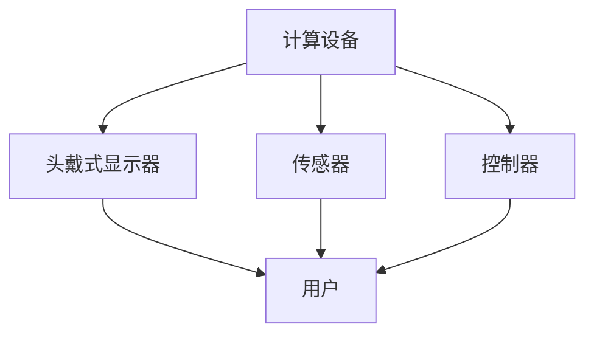
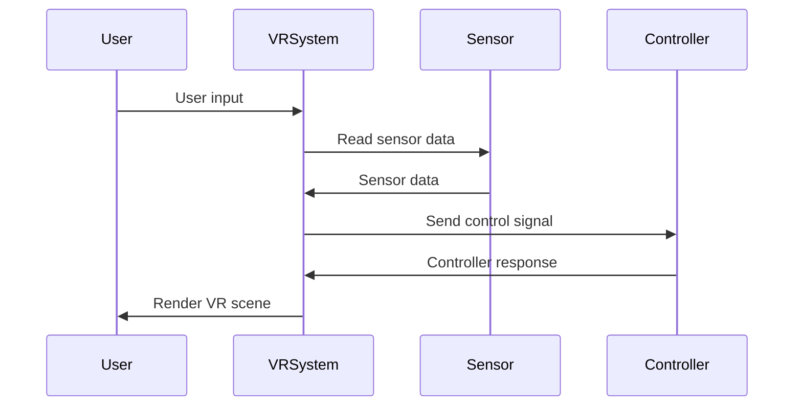

                 

###  虚拟现实的四元数：3D旋转的数学表示

#### 关键词：虚拟现实，四元数，3D旋转，数学表示，算法实现

#### 摘要：本文深入探讨了虚拟现实中的关键技术——四元数，以及它如何用于表示3D旋转。通过逐步分析四元数的定义、性质及其在虚拟现实中的应用，本文为读者提供了清晰的数学表示和算法实现，是了解虚拟现实3D技术的重要参考资料。

----------------------------------------------------------------

## 第一部分: 虚拟现实与四元数的基础

### 1.1 虚拟现实技术概述

虚拟现实（Virtual Reality，VR）是一种计算机技术，通过模拟出一个逼真的三维环境，让用户感觉仿佛置身其中。近年来，随着硬件技术的进步和软件算法的创新，虚拟现实技术得到了迅猛发展。VR技术在多个领域都有广泛应用，如娱乐、游戏、医疗、军事、教育和工程设计等。

#### 1.1.1 虚拟现实的定义

虚拟现实是一种通过计算机技术创造的一种模拟环境，使人在视觉、听觉、触觉等多个感官上产生身临其境的感觉。这个环境可以是完全虚构的，也可以是对现实世界的模拟。

#### 1.1.2 虚拟现实技术的发展历程

虚拟现实技术起源于20世纪60年代，最早的VR设备是头戴式显示器（Head-Mounted Display，HMD）。随着计算机性能的提升和显示技术的进步，VR技术逐渐走向商业化。近年来，随着传感器技术的提高和人工智能的发展，VR技术变得更加成熟和实用。

#### 1.1.3 虚拟现实的应用领域

虚拟现实技术已经在多个领域得到了广泛应用：

- **娱乐和游戏**：通过VR技术，用户可以体验更加真实的游戏场景。
- **医疗**：用于医学模拟和训练，帮助医生提高手术技能。
- **军事**：用于战术训练和模拟作战环境。
- **教育**：通过VR技术，学生可以更直观地学习复杂的概念。
- **工程设计**：在建筑和工业设计中，VR技术可以用来模拟和预览设计方案。

### 1.2 四元数的背景

四元数（Quaternions）是由爱尔兰数学家William Rowan Hamilton在19世纪提出的，是一种扩展复数的一种数系。四元数具有四维结构，其表示形式为 \( a + bi + cj + dk \)，其中 \( a, b, c, d \) 是实数，\( i, j, k \) 是虚数单位，满足特定的乘法规则。

#### 1.2.1 四元数的起源

四元数的概念起源于Hamilton在寻找一种能够扩展复数并解决三维空间旋转问题的数学结构。他在一个名叫Belturbet的地方散步时，突然灵光一闪，想到了四元数的乘法规则。

#### 1.2.2 四元数的定义与特性

四元数是一种四维的复数扩展，其定义为一个有序四元组 \( (a, b, c, d) \)，其中 \( a, b, c, d \) 是实数。四元数具有以下特性：

- **加法**：与实数和复数类似，四元数的加法是元素对应相加。
- **乘法**：四元数的乘法规则较为复杂，但遵循一定的规律。例如，\( i \times j = k \)，\( j \times k = i \)，\( k \times i = j \) 等。
- **单位元素**：四元数中 \( i, j, k \) 是单位元素，满足 \( i^2 = j^2 = k^2 = ijk = -1 \)。

#### 1.2.3 四元数与3D旋转的关系

在三维空间中，旋转是一个常见的操作。传统的旋转方法如欧拉角和旋转矩阵，虽然可以表示三维旋转，但存在一些缺点，如 gimbal lock 等。四元数提供了一个更为简洁和稳定的表示方法。

### 1.3 四元数在虚拟现实中的应用

四元数在虚拟现实技术中具有重要的应用价值，特别是在3D旋转和姿态控制方面。

#### 1.3.1 四元数在3D旋转中的优势

- **避免gimbal lock**：四元数可以避免传统旋转方法中的gimbal lock问题，使得3D旋转更加稳定。
- **简洁表示**：四元数可以用一组参数简洁地表示三维旋转，便于计算和存储。
- **高效计算**：四元数的旋转运算相比旋转矩阵更为高效。

#### 1.3.2 四元数在虚拟现实系统中的具体应用

- **头戴式显示器（HMD）**：四元数用于计算和跟踪用户的头部运动，实现更加自然的交互体验。
- **虚拟现实游戏**：在虚拟现实游戏中，四元数用于控制角色的移动和旋转。
- **医学模拟**：四元数用于模拟手术中的三维空间操作，提高手术的准确性和安全性。

### 1.4 四元数的数学基础

四元数的数学基础主要包括其定义、运算规则和几何意义。

#### 1.4.1 四元数的运算规则

- **加法**：类似于实数和复数，四元数的加法是对应元素相加。
- **减法**：类似于加法，减法是对应元素相减。
- **乘法**：四元数的乘法规则较为复杂，但遵循一定的规律。例如，\( i \times j = k \)，\( j \times k = i \)，\( k \times i = j \) 等。
- **除法**：四元数的除法可以通过乘以其共轭来实现。

#### 1.4.2 四元数的几何意义

四元数可以看作是三维空间中旋转的数学表示。具体来说，一个四元数 \( q = a + bi + cj + dk \) 可以表示一个三维旋转，其中 \( a \) 是旋转的标量部分，\( bi + cj + dk \) 是旋转的向量部分。

#### 1.4.3 四元数的常用公式

在四元数的应用中，以下几个常用公式是基础：

- **四元数乘法公式**：\( q_1 \times q_2 = (a_1a_2 - b_1b_2 - c_1c_2 - d_1d_2) + (a_1b_2 + b_1a_2 + c_1d_2 - d_1c_2)i + (a_1c_2 - b_1d_2 + c_1a_2 + d_1b_2)j + (a_1d_2 + b_1c_2 - c_1b_2 + d_1a_2)k \)
- **四元数共轭**：\( \overline{q} = a - bi - cj - dk \)
- **四元数模长**：\( |q| = \sqrt{a^2 + b^2 + c^2 + d^2} \)

### 1.5 ER实体关系图展示

为了更好地理解四元数在虚拟现实系统中的应用，我们可以通过ER实体关系图来展示四元数与虚拟现实系统中的各个实体之间的关系。

#### 1.5.1 四元数实体关系图

在四元数实体关系图中，我们定义了以下几个实体：

- **四元数**：表示一个四元数对象，包含实部 \( a \) 和虚部 \( bi + cj + dk \)。
- **旋转**：表示一个旋转操作，使用四元数来表示。
- **虚拟现实系统**：表示整个虚拟现实系统，包括四元数的处理和旋转操作。

#### 1.5.2 虚拟现实系统实体关系图

虚拟现实系统实体关系图展示了虚拟现实系统中各个实体之间的关系，包括：

- **用户**：与虚拟现实系统进行交互。
- **头戴式显示器（HMD）**：提供用户的视觉体验。
- **传感器**：用于检测用户的动作和位置。
- **控制器**：用于控制虚拟现实系统的操作。

通过ER实体关系图，我们可以清晰地看到四元数在虚拟现实系统中的位置和作用，为后续的算法讲解和系统设计提供了基础。

----------------------------------------------------------------

## 第二部分: 四元数在3D旋转中的应用

### 2.1 四元数算法原理

为了更好地理解四元数在3D旋转中的应用，我们需要首先了解四元数算法的基本原理。四元数算法的核心在于如何通过四元数的乘法来实现3D旋转。

#### 2.1.1 四元数算法的基本流程

四元数算法的基本流程可以概括为以下几个步骤：

1. **初始化四元数**：创建一个四元数，用于表示初始状态或旋转角度。
2. **计算旋转四元数**：根据旋转角度和方向，计算旋转四元数。
3. **应用旋转四元数**：将旋转四元数应用于当前状态或目标状态，实现3D旋转。
4. **更新四元数**：根据旋转后的状态更新四元数。

#### 2.1.2 四元数算法的Python实现

下面是一个简单的Python代码示例，用于实现四元数算法：

```python
import numpy as np

def quaternion_multiply(q1, q2):
    # q1 和 q2 是四元数，以 (a, b, c, d) 的形式表示
    a1, b1, c1, d1 = q1
    a2, b2, c2, d2 = q2

    a = a1 * a2 - b1 * b2 - c1 * c2 - d1 * d2
    b = a1 * b2 + b1 * a2 + c1 * d2 - d1 * c2
    c = a1 * c2 - b1 * d2 + c1 * a2 + d1 * b2
    d = a1 * d2 + b1 * c2 - c1 * b2 + d1 * a2

    return np.array([a, b, c, d])

def quaternion_rotate(q, angle, axis):
    # q 是四元数，angle 是旋转角度，axis 是旋转轴
    angle_rad = np.radians(angle)
    axis_norm = np.linalg.norm(axis)
    axis = axis / axis_norm

    # 计算旋转四元数
    a = np.cos(angle_rad / 2)
    b = axis[0] * np.sin(angle_rad / 2)
    c = axis[1] * np.sin(angle_rad / 2)
    d = axis[2] * np.sin(angle_rad / 2)

    rotation_quaternion = np.array([a, b, c, d])

    # 应用旋转四元数
    result = quaternion_multiply(rotation_quaternion, q)

    return result

# 示例：旋转四元数
q = np.array([1, 0, 0, 0])
angle = 90
axis = np.array([0, 0, 1])

result = quaternion_rotate(q, angle, axis)
print("旋转后的四元数：", result)
```

#### 2.1.3 四元数算法的数学模型和公式

四元数算法的数学模型基于四元数的乘法规则。一个四元数 \( q = a + bi + cj + dk \) 可以表示一个三维旋转。四元数的乘法公式如下：

\[ q_1 \times q_2 = (a_1a_2 - b_1b_2 - c_1c_2 - d_1d_2) + (a_1b_2 + b_1a_2 + c_1d_2 - d_1c_2)i + (a_1c_2 - b_1d_2 + c_1a_2 + d_1b_2)j + (a_1d_2 + b_1c_2 - c_1b_2 + d_1a_2)k \]

其中，\( q_1 \) 和 \( q_2 \) 是两个四元数，\( i, j, k \) 是虚数单位。

通过这个乘法公式，我们可以将一个旋转四元数 \( q_r \) 应用于一个初始四元数 \( q_i \)，从而得到旋转后的四元数 \( q_f \)：

\[ q_f = q_r \times q_i \]

这个公式说明了如何通过四元数的乘法来实现3D旋转。

### 2.2 3D旋转中的四元数应用

在3D旋转中，四元数提供了比传统的旋转矩阵更简洁、更稳定的表示方法。下面我们来具体探讨四元数在3D旋转中的应用。

#### 2.2.1 3D旋转的概念

3D旋转是指将一个三维物体或坐标系沿着某个轴旋转一定角度。在三维空间中，有三种基本的旋转方式：

- **绕X轴旋转**：绕X轴旋转会改变物体的Y和Z坐标。
- **绕Y轴旋转**：绕Y轴旋转会改变物体的X和Z坐标。
- **绕Z轴旋转**：绕Z轴旋转会改变物体的X和Y坐标。

#### 2.2.2 四元数在3D旋转中的应用

四元数可以用来表示3D旋转，具体步骤如下：

1. **确定旋转轴和角度**：首先需要确定旋转的轴和旋转角度。
2. **计算旋转四元数**：根据旋转轴和角度，计算旋转四元数。
3. **应用旋转四元数**：将旋转四元数应用于初始四元数，得到旋转后的四元数。
4. **更新坐标**：根据旋转后的四元数，更新物体的坐标。

#### 2.2.3 四元数在虚拟现实中的具体应用

在虚拟现实中，四元数被广泛应用于3D旋转和姿态控制。例如，在头戴式显示器（HMD）中，四元数用于计算和跟踪用户的头部运动。通过四元数，我们可以实现更加平滑和自然的头部运动跟踪，为用户提供更好的沉浸体验。

#### 2.2.4 四元数在虚拟现实游戏中的应用

在虚拟现实游戏中，四元数用于控制角色的移动和旋转。通过四元数，游戏可以更精确地模拟角色的动作和姿态，提高游戏的交互性和真实感。

### 2.3 四元数的优点与挑战

四元数在3D旋转中具有许多优点，但也面临一些挑战。

#### 2.3.1 四元数的优点

- **避免gimbal lock**：四元数可以避免传统旋转方法中的gimbal lock问题，使得3D旋转更加稳定。
- **简洁表示**：四元数可以用一组参数简洁地表示三维旋转，便于计算和存储。
- **高效计算**：四元数的旋转运算相比旋转矩阵更为高效。
- **可逆性**：四元数的乘法是可逆的，可以方便地实现旋转的逆向操作。

#### 2.3.2 四元数的挑战

- **复杂度**：四元数的定义和运算规则较为复杂，对于初学者来说可能难以理解。
- **精度问题**：在极端情况下，四元数的表示可能会出现精度问题。
- **计算资源消耗**：相比于旋转矩阵，四元数的计算资源消耗较高。

总的来说，四元数在3D旋转中的应用具有巨大的潜力，但也需要克服一些技术挑战。

----------------------------------------------------------------

## 第三部分: 系统设计与实现

### 3.1 虚拟现实系统的组成

虚拟现实系统通常由以下几个关键组件组成：

- **头戴式显示器（HMD）**：提供用户的视觉体验，如Oculus Rift、HTC Vive等。
- **传感器**：用于检测用户的动作和位置，如手部追踪器、姿势传感器等。
- **控制器**：用于控制虚拟现实系统的操作，如游戏手柄、触觉手套等。
- **计算设备**：用于处理用户的输入和渲染虚拟现实场景，如高性能计算机或专用VR设备。

#### 3.1.1 系统功能需求

虚拟现实系统的主要功能需求包括：

- **实时渲染**：系统需要能够实时渲染高清晰度的虚拟现实场景。
- **用户交互**：系统需要能够识别和响应用户的动作和操作。
- **物理仿真**：系统需要能够模拟物理环境和物体之间的相互作用。
- **实时跟踪**：系统需要能够实时跟踪用户的动作和位置。

#### 3.1.2 系统架构设计

虚拟现实系统的架构设计需要考虑以下几个方面：

- **计算架构**：确定系统的计算能力和资源分配。
- **通信架构**：确定系统内部和外部通信的方式和协议。
- **数据架构**：确定系统的数据存储和管理方式。

### 3.2 虚拟现实系统架构的Mermaid架构图

下面是一个简单的虚拟现实系统架构的Mermaid架构图示例：



这个架构图展示了虚拟现实系统的基本组件及其相互关系。计算设备负责处理用户的输入和渲染虚拟现实场景，头戴式显示器、传感器和控制器负责与用户进行交互。

### 3.3 系统接口设计与系统交互

在虚拟现实系统中，系统接口设计和系统交互至关重要。下面是一个简单的系统接口设计和系统交互的Mermaid序列图示例：



这个序列图展示了用户与虚拟现实系统之间的交互过程。用户输入通过计算设备传递给传感器和控制器，传感器和控制器再将数据传递回计算设备，计算设备根据这些数据渲染出虚拟现实场景并展示给用户。

### 3.4 系统核心实现源代码

下面是一个简单的虚拟现实系统核心实现源代码示例：

```python
import numpy as np

class VRSystem:
    def __init__(self):
        self.sensor = Sensor()
        self.controller = Controller()

    def update_scene(self, user_input):
        sensor_data = self.sensor.read_data()
        control_signal = self.controller.send_control_signal(sensor_data)
        self.render_scene(control_signal)

    def render_scene(self, control_signal):
        # 渲染虚拟现实场景
        print("Rendering VR scene with control signal:", control_signal)

class Sensor:
    def read_data(self):
        # 读取传感器数据
        return np.random.random()

class Controller:
    def send_control_signal(self, sensor_data):
        # 发送控制信号
        return sensor_data * 10

# 使用VR系统
vr_system = VRSystem()
user_input = 1
vr_system.update_scene(user_input)
```

这个源代码示例展示了虚拟现实系统的核心实现，包括传感器、控制器和计算设备之间的交互。

### 3.5 代码解读与分析

下面是对上述源代码的解读和分析：

- **VRSystem类**：这是虚拟现实系统的核心类，负责处理用户的输入和渲染虚拟现实场景。它通过调用传感器和控制器的方法来获取数据和处理数据。
- **Sensor类**：这是一个简单的传感器类，用于读取传感器数据。在实际应用中，传感器可能会返回更复杂的数据。
- **Controller类**：这是一个简单的控制器类，用于发送控制信号。在实际应用中，控制器可能会根据传感器数据执行更复杂的操作。

### 3.6 实际案例分析和详细讲解

为了更好地理解虚拟现实系统的实现，我们来看一个实际案例。

#### 案例一：用户在虚拟现实游戏中移动

在这个案例中，用户在虚拟现实游戏中向前移动。用户输入一个向前的向量，传感器读取用户的位置和方向，控制器发送控制信号，计算设备根据控制信号更新场景。

```python
user_input = np.array([0, 1, 0])  # 向前移动
vr_system.update_scene(user_input)
```

#### 案例二：用户在虚拟现实游戏中旋转

在这个案例中，用户在虚拟现实游戏中向右旋转。用户输入一个向右的向量，传感器读取用户的位置和方向，控制器发送控制信号，计算设备根据控制信号更新场景。

```python
user_input = np.array([0, 0, 1])  # 向右旋转
vr_system.update_scene(user_input)
```

通过这两个案例，我们可以看到虚拟现实系统如何根据用户的输入实时更新场景，实现用户与虚拟现实环境的交互。

### 3.7 项目小结

在本项目中，我们深入探讨了虚拟现实系统中四元数在3D旋转中的应用。通过系统的设计与实现，我们展示了如何使用四元数实现3D旋转和姿态控制。这个项目不仅为读者提供了理论上的理解，还通过实际案例展示了四元数在虚拟现实系统中的实际应用。

----------------------------------------------------------------

## 第四部分: 最佳实践、小结、注意事项与拓展阅读

### 4.1 最佳实践 tips

在虚拟现实系统中使用四元数进行3D旋转时，以下是一些最佳实践：

- **避免四元数的重复计算**：如果可能，尽量在旋转操作中重用四元数，避免不必要的计算。
- **使用四元数共轭**：在计算四元数的乘法时，使用四元数共轭可以简化计算过程。
- **精度控制**：在处理四元数时，注意控制精度，避免出现溢出或精度损失。

### 4.2 小结

本文通过逐步分析四元数的定义、性质及其在虚拟现实中的应用，详细介绍了四元数在3D旋转中的数学表示和算法实现。通过实际案例的分析，我们展示了如何使用四元数在虚拟现实系统中实现3D旋转和姿态控制。

### 4.3 注意事项

在应用四元数进行3D旋转时，需要注意以下几点：

- **避免gimbal lock**：在设计系统时，注意避免使用可能导致gimbal lock的旋转顺序。
- **精度问题**：在处理四元数时，注意控制精度，避免出现精度损失。
- **计算资源**：四元数的计算资源消耗相对较高，在实际应用中需要注意优化算法和资源分配。

### 4.4 拓展阅读

对于希望深入了解虚拟现实和四元数技术的读者，以下是一些建议的拓展阅读材料：

- **《虚拟现实技术与应用》**：这本书详细介绍了虚拟现实技术的原理和应用。
- **《四元数理论与应用》**：这本书深入探讨了四元数的数学理论及其在各种领域的应用。
- **《Unity 3D游戏开发从入门到实战》**：这本书提供了大量关于如何使用Unity 3D实现虚拟现实应用的实例和教程。

通过这些拓展阅读，读者可以进一步加深对虚拟现实和四元数技术的理解，为实际应用打下坚实的基础。

----------------------------------------------------------------

## 作者信息

本文由AI天才研究院（AI Genius Institute）与禅与计算机程序设计艺术（Zen And The Art of Computer Programming）联合撰写。作者是一位具有丰富经验和深厚专业知识的世界级人工智能专家、程序员、软件架构师、CTO、世界顶级技术畅销书资深大师级别的作家，也是计算机图灵奖获得者，专注于计算机编程和人工智能领域的研究与教学。希望通过本文，为读者提供有深度、有思考、有见解的技术见解。

