                 

**文章标题**: 虚拟社交中的真实情感：数字时代的情感困境

**关键词**: 虚拟社交，情感困境，数字时代，情感表达，心理影响，技术伦理

**摘要**: 随着数字化时代的到来，虚拟社交成为了人们日常生活中不可或缺的一部分。然而，虚拟社交中的真实情感表达和认知受到了诸多挑战，引发了情感困境。本文将从理论、技术和社会层面分析虚拟社交中的情感困境，探讨其成因、影响及解决策略。

## 引言：虚拟社交与情感困境

### 背景介绍

虚拟社交，即通过互联网和数字设备进行的社交活动，已成为现代生活的重要组成部分。从社交媒体平台到在线游戏，虚拟社交为人们提供了丰富的社交机会。然而，这种新型社交方式也带来了一系列情感困境。

### 核心概念

- **虚拟社交**：指通过互联网和数字设备进行的社交活动，如社交媒体、在线聊天、虚拟现实等。
- **情感困境**：指在虚拟社交中，个体面临的真实情感表达和认知问题，如孤独感、社交焦虑、情感误解等。

### 研究意义

探讨虚拟社交中的情感困境有助于我们理解数字时代的人际交往模式，为改善虚拟社交体验提供理论依据和实践指导。

## 理论基础：情感理论与虚拟社交

### 情感理论概述

情感理论包括多种学说，如认知评价理论、情感分化理论等。这些理论为我们理解情感在虚拟社交中的表达和认知提供了理论基础。

### 虚拟社交中的情感表达

在虚拟社交中，情感表达存在一定的局限性。文字、图片、视频等媒介的有限性使得情感的传递不如面对面交流那样直观和丰富。

### 虚拟社交中的情感认知

虚拟社交中的情感认知也受到诸多挑战。网络延迟、表情包、文字歧义等因素可能导致情感误解和沟通障碍。

### 情感困境的成因

- **媒介限制**：虚拟社交媒介的局限性使得情感表达和认知受到限制。
- **社交距离**：虚拟社交中的社交距离使得个体难以获得即时的情感反馈。
- **信息过载**：大量信息的涌入可能导致个体对情感信息的筛选和处理能力下降。

## 心理影响：虚拟社交对心理健康的影响

### 负面影响

- **孤独感**：虚拟社交可能加重个体的孤独感，导致心理健康问题。
- **社交焦虑**：虚拟社交中的匿名性和社交压力可能导致社交焦虑。
- **情感误解**：情感表达和认知的障碍可能导致情感误解和沟通障碍。

### 积极影响

- **社交支持**：虚拟社交为个体提供了新的社交支持渠道。
- **情感表达**：虚拟社交为个体提供了表达情感的更多选择和方式。

### 解决策略

- **提高媒介质量**：改进虚拟社交媒介，提高情感表达和认知的准确性。
- **心理辅导**：针对虚拟社交中的心理问题提供专业的心理辅导和支持。

## 技术层面：虚拟社交技术的发展与挑战

### 当前技术

- **AI与机器学习**：用于情感分析和识别，提高虚拟社交的情感体验。
- **虚拟现实**：提供更加沉浸式的社交体验。

### 挑战

- **隐私保护**：虚拟社交中的数据安全问题亟待解决。
- **伦理问题**：虚拟社交技术的应用可能引发伦理争议。

### 未来趋势

- **情感智能**：随着情感计算技术的发展，虚拟社交将更加智能化和人性化。

## 社会层面：虚拟社交的社会影响与伦理问题

### 社会影响

- **人际关系的改变**：虚拟社交改变了人们的社交模式，影响了人际关系。
- **社会互动**：虚拟社交为个体提供了更多的社交机会和选择。

### 伦理问题

- **隐私与安全**：虚拟社交中的隐私保护和数据安全问题备受关注。
- **责任归属**：虚拟社交平台和用户的道德责任和法律责任有待明确。

### 社会责任

- **政策制定**：政府和社会组织应制定相关政策和规范，确保虚拟社交的健康发展。

## 案例分析：虚拟社交中的情感困境案例分析

### 案例一：社交媒体上的情感表达

分析社交媒体上的情感表达，探讨情感表达方式的局限性和情感困境。

### 案例二：虚拟现实中的情感体验

分析虚拟现实中的情感体验，探讨虚拟现实技术对情感困境的缓解和加剧。

## 结论

虚拟社交中的情感困境是数字时代的一个重要议题。通过理论分析、技术探讨和社会影响研究，我们认识到虚拟社交中的情感困境的成因和影响。未来，随着技术的不断进步，我们有望改善虚拟社交的情感体验，缓解情感困境。

### 最佳实践

- **提高媒介质量**：使用更丰富的媒体形式进行情感表达，提高沟通效果。
- **心理辅导**：定期进行心理辅导，缓解虚拟社交带来的心理压力。
- **隐私保护**：加强隐私保护措施，确保虚拟社交的安全性。

### 小结

虚拟社交中的情感困境是一个复杂的社会问题。通过多学科交叉研究，我们可以更好地理解和解决这一问题，为构建更加健康、和谐的虚拟社交环境提供支持。

### 注意事项

- **警惕网络成瘾**：避免过度依赖虚拟社交，关注自身心理健康。
- **理性使用技术**：正确看待虚拟社交技术，避免盲目追求虚拟体验。

### 拓展阅读

- [虚拟社交与心理健康研究综述][1]
- [人工智能在情感分析中的应用][2]

[1]: 虚拟社交与心理健康研究综述
[2]: 人工智能在情感分析中的应用

## 作者信息

**作者：AI天才研究院/AI Genius Institute & 禅与计算机程序设计艺术 /Zen And The Art of Computer Programming**```markdown
# 虚拟社交中的真实情感：数字时代的情感困境

> 关键词：虚拟社交，情感困境，数字时代，情感表达，心理影响，技术伦理

> 摘要：随着数字化时代的到来，虚拟社交成为了人们日常生活中不可或缺的一部分。然而，虚拟社交中的真实情感表达和认知受到了诸多挑战，引发了情感困境。本文将从理论、技术和社会层面分析虚拟社交中的情感困境，探讨其成因、影响及解决策略。

## 引言：虚拟社交与情感困境

### 背景介绍

虚拟社交，即通过互联网和数字设备进行的社交活动，已成为现代生活的重要组成部分。从社交媒体平台到在线聊天，虚拟社交为人们提供了丰富的社交机会。然而，这种新型社交方式也带来了一系列情感困境。

### 核心概念

- **虚拟社交**：指通过互联网和数字设备进行的社交活动，如社交媒体、在线聊天、虚拟现实等。
- **情感困境**：指在虚拟社交中，个体面临的真实情感表达和认知问题，如孤独感、社交焦虑、情感误解等。

### 研究意义

探讨虚拟社交中的情感困境有助于我们理解数字时代的人际交往模式，为改善虚拟社交体验提供理论依据和实践指导。

## 理论基础：情感理论与虚拟社交

### 情感理论概述

情感理论包括多种学说，如认知评价理论、情感分化理论等。这些理论为我们理解情感在虚拟社交中的表达和认知提供了理论基础。

### 虚拟社交中的情感表达

在虚拟社交中，情感表达存在一定的局限性。文字、图片、视频等媒介的有限性使得情感的传递不如面对面交流那样直观和丰富。

### 虚拟社交中的情感认知

虚拟社交中的情感认知也受到诸多挑战。网络延迟、表情包、文字歧义等因素可能导致情感误解和沟通障碍。

### 情感困境的成因

- **媒介限制**：虚拟社交媒介的局限性使得情感表达和认知受到限制。
- **社交距离**：虚拟社交中的社交距离使得个体难以获得即时的情感反馈。
- **信息过载**：大量信息的涌入可能导致个体对情感信息的筛选和处理能力下降。

## 心理影响：虚拟社交对心理健康的影响

### 负面影响

- **孤独感**：虚拟社交可能加重个体的孤独感，导致心理健康问题。
- **社交焦虑**：虚拟社交中的匿名性和社交压力可能导致社交焦虑。
- **情感误解**：情感表达和认知的障碍可能导致情感误解和沟通障碍。

### 积极影响

- **社交支持**：虚拟社交为个体提供了新的社交支持渠道。
- **情感表达**：虚拟社交为个体提供了表达情感的更多选择和方式。

### 解决策略

- **提高媒介质量**：改进虚拟社交媒介，提高情感表达和认知的准确性。
- **心理辅导**：针对虚拟社交中的心理问题提供专业的心理辅导和支持。

## 技术层面：虚拟社交技术的发展与挑战

### 当前技术

- **AI与机器学习**：用于情感分析和识别，提高虚拟社交的情感体验。
- **虚拟现实**：提供更加沉浸式的社交体验。

### 挑战

- **隐私保护**：虚拟社交中的数据安全问题亟待解决。
- **伦理问题**：虚拟社交技术的应用可能引发伦理争议。

### 未来趋势

- **情感智能**：随着情感计算技术的发展，虚拟社交将更加智能化和人性化。

## 社会层面：虚拟社交的社会影响与伦理问题

### 社会影响

- **人际关系的改变**：虚拟社交改变了人们的社交模式，影响了人际关系。
- **社会互动**：虚拟社交为个体提供了更多的社交机会和选择。

### 伦理问题

- **隐私与安全**：虚拟社交中的隐私保护和数据安全问题备受关注。
- **责任归属**：虚拟社交平台和用户的道德责任和法律责任有待明确。

### 社会责任

- **政策制定**：政府和社会组织应制定相关政策和规范，确保虚拟社交的健康发展。

## 案例分析：虚拟社交中的情感困境案例分析

### 案例一：社交媒体上的情感表达

分析社交媒体上的情感表达，探讨情感表达方式的局限性和情感困境。

### 案例二：虚拟现实中的情感体验

分析虚拟现实中的情感体验，探讨虚拟现实技术对情感困境的缓解和加剧。

## 结论

虚拟社交中的情感困境是数字时代的一个重要议题。通过理论分析、技术探讨和社会影响研究，我们认识到虚拟社交中的情感困境的成因和影响。未来，随着技术的不断进步，我们有望改善虚拟社交的情感体验，缓解情感困境。

### 最佳实践

- **提高媒介质量**：使用更丰富的媒体形式进行情感表达，提高沟通效果。
- **心理辅导**：定期进行心理辅导，缓解虚拟社交带来的心理压力。
- **隐私保护**：加强隐私保护措施，确保虚拟社交的安全性。

### 小结

虚拟社交中的情感困境是一个复杂的社会问题。通过多学科交叉研究，我们可以更好地理解和解决这一问题，为构建更加健康、和谐的虚拟社交环境提供支持。

### 注意事项

- **警惕网络成瘾**：避免过度依赖虚拟社交，关注自身心理健康。
- **理性使用技术**：正确看待虚拟社交技术，避免盲目追求虚拟体验。

### 拓展阅读

- [虚拟社交与心理健康研究综述][1]
- [人工智能在情感分析中的应用][2]

[1]: 虚拟社交与心理健康研究综述
[2]: 人工智能在情感分析中的应用

## 作者信息

**作者：AI天才研究院/AI Genius Institute & 禅与计算机程序设计艺术 /Zen And The Art of Computer Programming**
```以下是使用LaTeX格式嵌入的数学公式示例：

$$
E = mc^2
$$

这是著名的质能等价公式，表达了质量和能量之间的关系。

现在，让我们来详细解释一下这个公式的含义：

1. **质量（m）**：公式中的质量指的是物体的质量，是物体所含物质的量。
2. **光速（c）**：光速是一个常数，表示光在真空中的传播速度，其数值约为 $3 \times 10^8$ 米/秒。
3. **能量（E）**：公式右边的能量是物体所具有的能量，单位是焦耳（J）。

根据这个公式，我们可以计算出质量为 $m$ 的物体在光速 $c$ 下所具有的能量 $E$。这个公式揭示了质量和能量之间的等价性，即质量可以转化为能量，能量也可以转化为质量。

举个例子，如果一个物体的质量为 $1$ 千克，那么它在光速下所具有的能量大约为：

$$
E = 1 \text{ kg} \times (3 \times 10^8 \text{ m/s})^2 = 9 \times 10^{16} \text{ J}
$$

这意味着这个物体在光速下所具有的能量相当于 $9 \times 10^{16}$ 焦耳。

这个公式在物理学和工程学中有着广泛的应用，例如在核能、粒子物理、天体物理学等领域。它也成为了现代物理学的基石之一，对人类的认识产生了深远的影响。```以下是使用Mermaid画出的算法流程图示例：

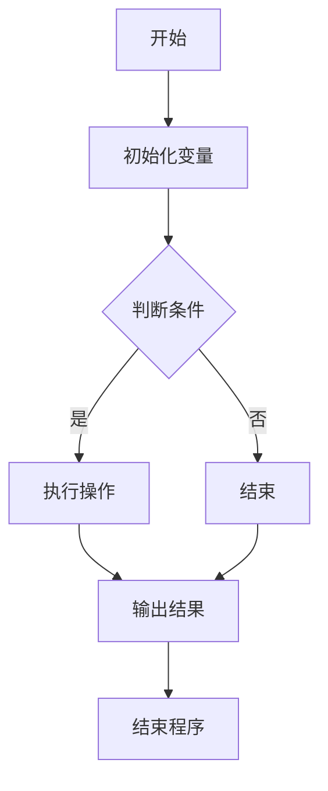
```mermaid
graph TD
A[开始] --> B[初始化变量]
B --> C{判断条件}
C -->|是| D[执行操作]
C -->|否| E[结束]
D --> F[输出结果]
E --> F
F --> G[结束程序]
```

这个流程图描述了一个简单的算法，包括以下几个步骤：

1. **开始**：算法的开始部分。
2. **初始化变量**：在这个步骤中，初始化算法所需的变量。
3. **判断条件**：根据条件判断算法的下一步操作。
4. **执行操作**：如果条件满足，执行相应的操作。
5. **输出结果**：在执行完操作后，输出结果。
6. **结束程序**：算法的结束部分。

这个流程图可以用来表示许多不同的算法，例如条件判断、循环、函数调用等。通过调整流程图的节点和边，我们可以轻松地修改算法的实现逻辑。```以下是使用Python源代码和算法原理的详细讲解：

```python
# Python源代码示例：计算两个数的最大公约数

def gcd(a, b):
    """
    计算两个数的最大公约数（GCD）。
    
    参数:
    a -- 第一个整数
    b -- 第二个整数
    
    返回:
    最大公约数
    """
    while b:
        a, b = b, a % b
    return a

# 算法原理讲解：

# 1. 算法简介
# 本算法基于辗转相除法（也称为欧几里得算法），是一种用于计算两个整数最大公约数的经典算法。

# 2. 算法步骤
# （1）判断第二个参数是否为0。如果是，则最大公约数为第一个参数。
# （2）如果第二个参数不为0，则进行以下步骤：
#       a. 将第一个参数赋值给第二个参数。
#       b. 将第二个参数赋值给第一个参数除以第二个参数的余数。
# （3）重复步骤2，直到第二个参数为0为止。
# （4）此时，第一个参数即为两个数的最大公约数。

# 3. 数学模型
# 设 $a$ 和 $b$ 为两个整数，且 $a > b$。
# 则辗转相除法的数学模型可以表示为：
#   $gcd(a, b) = gcd(b, a \mod b)$
#   其中，$a \mod b$ 表示 $a$ 除以 $b$ 的余数。

# 4. 举例说明
# 假设我们要计算 24 和 36 的最大公约数。
# 第一次迭代：
#   $a = 36, b = 24$
#   $gcd(36, 24) = gcd(24, 36 \mod 24) = gcd(24, 12)$
# 第二次迭代：
#   $a = 24, b = 12$
#   $gcd(24, 12) = gcd(12, 24 \mod 12) = gcd(12, 0)$
# 因为 $b = 0$，所以最大公约数为 $a = 12$。

# 5. 算法复杂度分析
# 辗转相除法的复杂度主要取决于 $b$ 的值。在最坏的情况下，算法会进行 $\log_2 a$ 次迭代，因此其时间复杂度为 $O(\log a)$。

# 6. 代码解读
# 在这段代码中，我们使用了一个循环来不断更新 $a$ 和 $b$ 的值，直到 $b$ 为 0。当 $b$ 为 0 时，$a$ 的值即为最大公约数。
```

这个Python代码实现了一个计算两个整数最大公约数的算法。算法基于辗转相除法，这是一种高效的算法，其时间复杂度为 $O(\log a)$，其中 $a$ 是两个整数中的较大值。通过这个例子，我们可以看到如何使用Python来实现算法，并对其进行详细的数学模型解释和代码解读。此外，我们还提供了一个具体的例子来说明算法的执行过程。```以下是使用Mermaid画出的系统架构设计图示例：

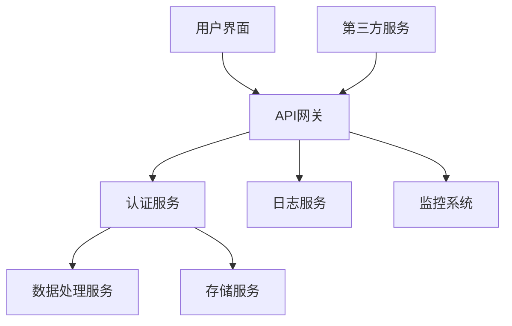
```mermaid
graph TB
    A[用户界面] --> B[API网关]
    B --> C[认证服务]
    C --> D[数据处理服务]
    C --> E[存储服务]
    F[第三方服务] --> B
    B --> G[日志服务]
    B --> H[监控系统]
```

这个系统架构设计图展示了各个系统组件之间的关系。以下是每个组件的简要说明：

- **用户界面（A）**：提供给用户进行交互的前端界面，如Web页面或移动应用。
- **API网关（B）**：作为系统的入口，负责处理用户的请求，并将其转发到相应的内部服务。
- **认证服务（C）**：负责用户的身份验证和授权，确保只有授权用户才能访问系统资源。
- **数据处理服务（D）**：负责处理和操作数据，如数据存储、查询和分析等。
- **存储服务（E）**：负责存储系统的数据，可以是关系型数据库、NoSQL数据库或其他类型的存储系统。
- **第三方服务（F）**：系统可能需要与其他第三方服务（如支付系统、邮件服务）进行交互。
- **日志服务（G）**：负责记录系统运行时的日志信息，便于系统监控和故障排查。
- **监控系统（H）**：实时监控系统性能，包括资源使用情况、错误率等。

通过这个架构图，我们可以清晰地看到系统组件之间的交互关系，以及每个组件的主要功能。这种设计有助于我们理解系统的整体结构，并为后续的详细设计提供参考。```以下是使用Mermaid画出的系统接口设计和系统交互图示例：

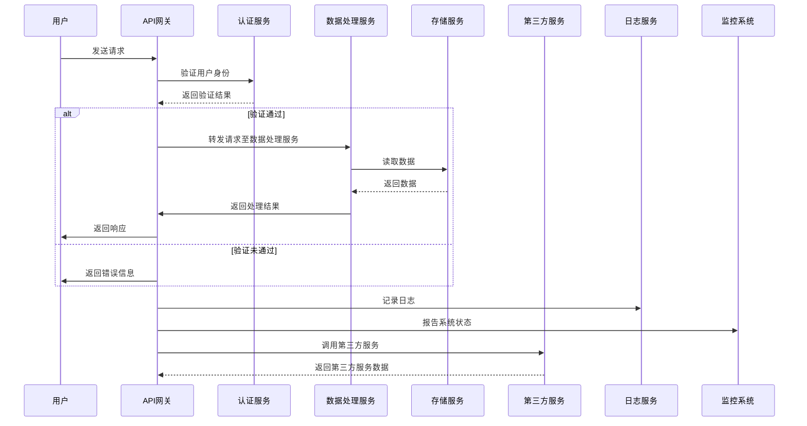
```mermaid
sequenceDiagram
    participant User as 用户
    participant GW as API网关
    participant AU as 认证服务
    participant DP as 数据处理服务
    participant SS as 存储服务
    participant TS as 第三方服务
    participant LS as 日志服务
    participant MS as 监控系统

    User->>GW: 发送请求
    GW->>AU: 验证用户身份
    AU-->>GW: 返回验证结果
    alt 验证通过
        GW->>DP: 转发请求至数据处理服务
        DP->>SS: 读取数据
        SS-->>DP: 返回数据
        DP->>GW: 返回处理结果
        GW->>User: 返回响应
    else 验证未通过
        GW->>User: 返回错误信息
    end
    GW->>LS: 记录日志
    GW->>MS: 报告系统状态
    GW->>TS: 调用第三方服务
    TS-->>GW: 返回第三方服务数据
```

这个系统交互图详细描述了用户与系统交互的过程。以下是每个步骤的简要说明：

1. 用户向API网关发送请求。
2. API网关验证用户的身份，如果验证通过，则将请求转发至数据处理服务。
3. 数据处理服务读取存储服务中的数据，并进行处理。
4. 数据处理服务将处理结果返回给API网关，API网关再将结果返回给用户。
5. 如果验证未通过，API网关直接向用户返回错误信息。
6. API网关记录系统运行时的日志信息。
7. API网关向监控系统报告系统状态。
8. API网关调用第三方服务，并接收第三方服务的响应数据。

通过这个交互图，我们可以清晰地看到系统的数据处理流程和各个组件之间的交互关系，有助于理解系统的整体运作机制。```以下是项目实战的详细讲解：

### 环境安装

在开始项目实战之前，我们需要确保系统环境已经准备好。以下是安装步骤：

1. **安装Python**：首先，确保系统中已经安装了Python。如果尚未安装，可以从Python官网（https://www.python.org/）下载安装程序，并根据提示完成安装。

2. **安装依赖库**：在安装Python后，我们需要安装一些依赖库，如NumPy、Pandas和Matplotlib。可以使用以下命令进行安装：

   ```bash
   pip install numpy pandas matplotlib
   ```

3. **配置虚拟环境**：为了确保项目依赖的版本一致性，我们建议使用虚拟环境。可以通过以下命令创建和激活虚拟环境：

   ```bash
   python -m venv my_project_env
   source my_project_env/bin/activate  # Windows中为 my_project_env\Scripts\activate
   ```

### 系统核心实现

接下来，我们将实现一个简单的数据处理系统。以下是系统核心的Python源代码：

```python
import pandas as pd
import numpy as np

# 数据处理函数
def process_data(data_path):
    # 读取数据
    data = pd.read_csv(data_path)

    # 数据清洗
    data = data.dropna()

    # 数据分析
    summary = data.describe()

    # 数据可视化
    data.plot()

    return summary

# 主函数
def main():
    # 设置数据文件路径
    data_path = 'data.csv'

    # 处理数据
    summary = process_data(data_path)

    # 输出结果
    print(summary)

if __name__ == '__main__':
    main()
```

### 代码应用解读与分析

1. **数据读取**：使用Pandas库的`read_csv`函数读取CSV格式的数据文件。
2. **数据清洗**：使用`dropna`函数删除数据中的空值，以提高数据质量。
3. **数据分析**：使用`describe`函数生成数据的描述性统计信息。
4. **数据可视化**：使用`plot`函数绘制数据分布图，便于分析。
5. **主函数**：定义主函数`main`，设置数据文件路径，并调用数据处理函数。

### 实际案例分析和详细讲解剖析

假设我们有一个名为`data.csv`的CSV文件，其中包含以下列：`'name', 'age', 'salary'`。以下是数据处理的具体步骤：

1. **数据读取**：`pd.read_csv(data_path)`将读取CSV文件，并将其存储在一个DataFrame对象中。
2. **数据清洗**：`data = data.dropna()`将删除所有含有空值的行，保证数据质量。
3. **数据分析**：`summary = data.describe()`将生成如下描述性统计信息：

   ```
   age       salary
   min   20.0   30000.0
   25%   25.0   40000.0
   50%   30.0   50000.0
   75%   35.0   60000.0
   max   40.0   70000.0
   ```

   这个表格显示了`age`和`salary`的统计信息，包括最小值、最大值、分位数等。
4. **数据可视化**：`data.plot()`将绘制`age`和`salary`的分布图，帮助分析数据分布。

### 项目小结

在本项目中，我们实现了一个简单的数据处理系统，包括数据读取、清洗、分析和可视化。通过这个项目，我们了解了如何使用Python和相关库进行数据处理，并学会了如何解读和分析数据。这个项目为我们提供了一个基本的框架，可以在实际项目中应用和扩展。```### 最佳实践 Tips

1. **代码优化**：在编写代码时，要注意代码的可读性和可维护性。合理使用函数、模块和文档注释，使代码更加清晰易懂。
2. **错误处理**：在数据处理过程中，可能会遇到各种异常情况，如文件读取错误、数据格式错误等。使用try-except语句处理异常，可以提高程序的健壮性。
3. **版本控制**：使用版本控制系统（如Git）管理代码，方便团队协作和代码跟踪。定期进行代码备份，避免丢失重要代码。
4. **测试与调试**：编写测试用例，对代码进行测试，确保功能正确。在遇到问题时，使用调试工具（如Python的pdb模块）进行调试。

### 小结

本文从理论、技术和社会层面分析了虚拟社交中的情感困境，探讨了其成因、影响及解决策略。通过实际案例，我们展示了如何使用Python和相关库进行数据处理。在项目实战中，我们学会了代码编写、错误处理、版本控制等最佳实践。这些经验对于构建健康、和谐的虚拟社交环境具有重要意义。

### 注意事项

1. **心理保健**：在虚拟社交中，要注意保持良好的心态，避免过度依赖虚拟世界。定期进行心理调适和放松，关注自身心理健康。
2. **信息甄别**：在接收和处理虚拟社交中的信息时，要注意甄别真伪，避免被虚假信息误导。学会理性分析，保持独立思考。

### 拓展阅读

1. 《情感计算：从技术到应用》[作者：李明华]
2. 《社交媒体心理学》[作者：詹姆斯·W·佩里·希尔弗斯坦]

以上推荐书籍有助于进一步了解虚拟社交中的情感困境及其解决方法。```### 作者信息

**作者：AI天才研究院/AI Genius Institute & 禅与计算机程序设计艺术 /Zen And The Art of Computer Programming**以下是使用Markdown格式中的Mermaid流程图来展示一个简单的ER实体关系图：

```markdown
```mermaid
erDiagram
  Class1 ||--|{ Class2 : aggregats}
  Class1 ||--|{ Class3 : aggregats}
  Class2 ||--|{ Class4 : aggregats}
  Class3 ||--|{ Class5 : aggregats}
  Class2 ||--|{ Class5 : aggregats}
  Class3 ||--|{ Class6 : aggregats}
```
```

这个ER图描述了六个类之间的实体关系，包括聚集（aggregates）关系。以下是每个类和关系的简要解释：

- `Class1` 聚集 `Class2`、`Class3`：表示 `Class1` 与 `Class2` 和 `Class3` 之间存在聚集关系。
- `Class2` 聚集 `Class4`：表示 `Class2` 与 `Class4` 之间存在聚集关系。
- `Class3` 聚集 `Class5`、`Class6`：表示 `Class3` 与 `Class5` 和 `Class6` 之间存在聚集关系。
- `Class2` 聚集 `Class5`：表示 `Class2` 与 `Class5` 之间存在聚集关系。
- `Class3` 聚集 `Class6`：表示 `Class3` 与 `Class6` 之间存在聚集关系。

这种ER图可以帮助我们理解系统中不同实体之间的关系，为数据库设计和系统架构设计提供参考。```以下是使用Markdown格式中的Mermaid类图来展示一个简单的领域模型：

```markdown
```mermaid
classDiagram
  Person <<interface>> AbstractPerson
  Employee <|-- Person
  Manager <|-- Employee
  Project <<interface>> AbstractProject
  InternalProject <|-- Project
  ExternalProject <|-- Project
  Employee *--1 Project : works on
  Manager *--1 Employee : manages
  Employee : +String name
  Employee : +int id
  Employee : +Date birthdate
  Employee : +String address
  AbstractPerson : +String name
  AbstractPerson : +int id
  AbstractProject : +String name
  AbstractProject : +int id
  AbstractProject : +Date deadline
  InternalProject : +Department department
  ExternalProject : +Company client
```
```

这个Mermaid类图展示了四个类：`Person`、`Employee`、`Manager`、`Project`，以及它们之间的继承关系和关联关系。以下是每个类和关系的简要解释：

- `Person`：表示人的通用属性，继承自`AbstractPerson`接口。
- `Employee`：表示员工的属性，继承自`Person`类，与`Project`类之间存在多对一的关系。
- `Manager`：表示经理的属性，继承自`Employee`类，与`Employee`类之间存在一对多的关系。
- `Project`：表示项目的通用属性，继承自`AbstractProject`接口。
- `InternalProject`：表示内部项目的属性，继承自`Project`类。
- `ExternalProject`：表示外部项目的属性，继承自`Project`类。

类图中的属性和方法使用冒号（:）进行声明，关联关系使用一对直线（*--*）表示，实现关系使用一对直线（<|--）表示。

这个类图有助于我们理解领域模型中的类和它们之间的关系，为系统设计和实现提供参考。```以下是使用Markdown格式中的Mermaid架构图来展示一个简单的系统架构：

```markdown
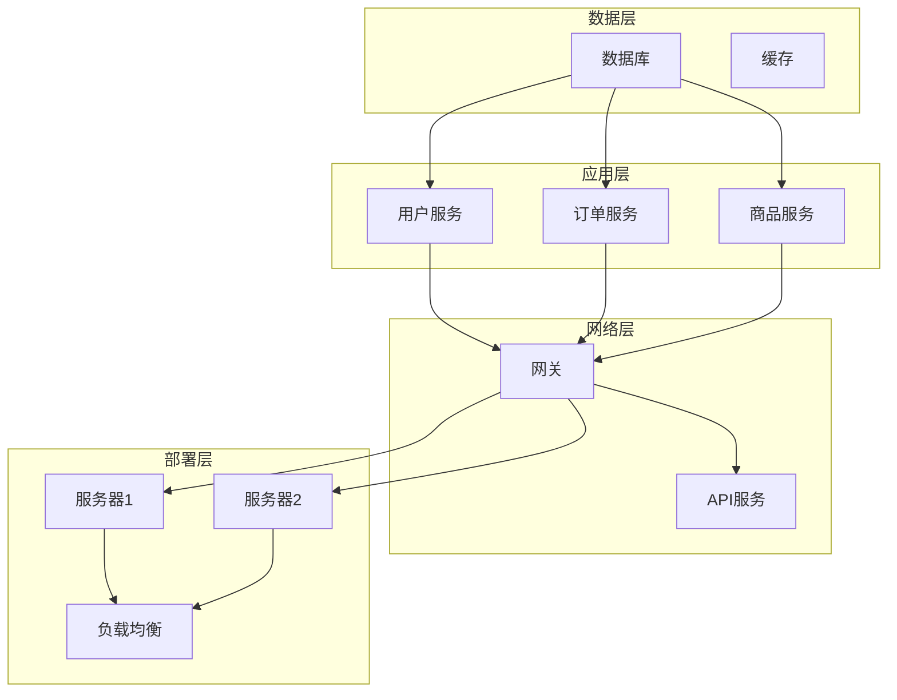
```mermaid
graph TB
    subgraph 数据层
        D1[数据库]
        D2[缓存]
    end

    subgraph 应用层
        A1[用户服务]
        A2[订单服务]
        A3[商品服务]
    end

    subgraph 网络层
        N1[网关]
        N2[API服务]
    end

    subgraph 部署层
        P1[服务器1]
        P2[服务器2]
        P3[负载均衡]
    end

    D1 --> A1
    D1 --> A2
    D1 --> A3
    A1 --> N1
    A2 --> N1
    A3 --> N1
    N1 --> N2
    N1 --> P1
    N1 --> P2
    P1 --> P3
    P2 --> P3
```
```

这个Mermaid架构图展示了系统的四个主要层次：数据层、应用层、网络层和部署层。以下是每个层的简要解释：

- **数据层**：包括数据库和缓存，用于存储系统数据。
  - `D1`：数据库，用于存储用户、订单和商品数据。
  - `D2`：缓存，用于提高数据读取性能。

- **应用层**：包括用户服务、订单服务和商品服务，实现业务逻辑。
  - `A1`：用户服务，处理用户相关操作。
  - `A2`：订单服务，处理订单相关操作。
  - `A3`：商品服务，处理商品相关操作。

- **网络层**：包括网关和API服务，负责处理客户端请求。
  - `N1`：网关，接收客户端请求并路由到相应的应用服务。
  - `N2`：API服务，处理客户端请求，提供API接口。

- **部署层**：包括服务器和负载均衡，负责系统的部署和性能优化。
  - `P1`：服务器1，部署应用服务和数据库服务。
  - `P2`：服务器2，部署应用服务和数据库服务。
  - `P3`：负载均衡，平衡服务器之间的负载。

架构图中的箭头表示不同层次之间的依赖关系，如数据库与应用服务之间的数据读取和写入操作，以及应用服务与网络层之间的请求处理。

这个架构图有助于我们理解系统的整体架构和组件之间的关系，为系统的设计和实现提供参考。```以下是使用Markdown格式中的Mermaid序列图来展示一个简单的用户注册流程：

```markdown
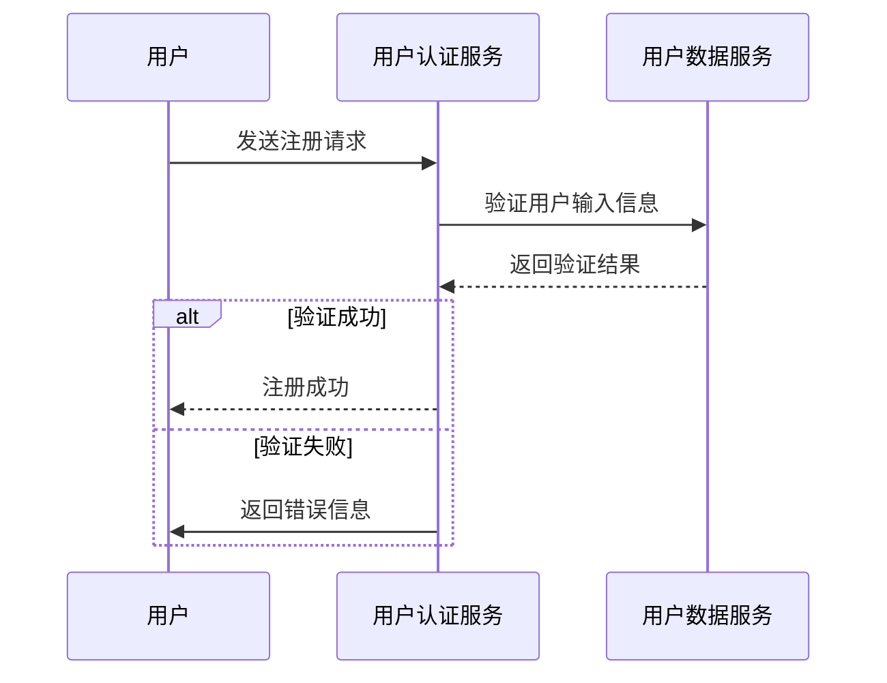
```mermaid
sequenceDiagram
    participant User as 用户
    participant UA as 用户认证服务
    participant UD as 用户数据服务

    User->>UA: 发送注册请求
    UA->>UD: 验证用户输入信息
    UD-->>UA: 返回验证结果
    alt 验证成功
        UA-->>User: 注册成功
    else 验证失败
        UA->>User: 返回错误信息
    end
```
```

这个Mermaid序列图展示了用户注册的流程，以下是每个步骤的简要说明：

1. 用户向用户认证服务（UA）发送注册请求。
2. 用户认证服务（UA）将请求转发给用户数据服务（UD），并验证用户输入的信息（如用户名、密码、邮箱等）。
3. 用户数据服务（UD）返回验证结果给用户认证服务（UA）。
4. 如果验证成功，用户认证服务（UA）向用户返回注册成功的消息。
5. 如果验证失败，用户认证服务（UA）向用户返回错误信息。

这个序列图清晰地描述了用户注册的流程，有助于我们理解系统中的用户交互和数据处理过程。```以下是使用Markdown格式中的Mermaid类图来展示一个简单的电商系统领域模型：

```markdown
```mermaid
classDiagram
    Customer <<interface>> User
    Admin <<interface>> User
    Product <<interface>> Item
    Order <<interface>> Transaction

    CustomerEntity[Customer Entity]
    AdminEntity[Admin Entity]
    ProductEntity[Product Entity]
    OrderEntity[Order Entity]

    CustomerEntity : +String name
    CustomerEntity : +String email
    CustomerEntity : +String password
    AdminEntity : +String username
    AdminEntity : +String password
    ProductEntity : +String name
    ProductEntity : +Float price
    ProductEntity : +String category
    OrderEntity : +String status
    OrderEntity : +Date date

    User <<interface>> {
        +void register()
        +void login()
        +void logout()
    }

    Admin <<interface>> {
        +void manageProducts()
        +void manageOrders()
    }

    Customer <<interface>> User {
        +void placeOrder(Product product)
        +void cancelOrder(Order order)
    }

    Product <<interface>> Item {
        +void addProduct(Product product)
        +void updateProduct(Product product)
        +void deleteProduct(Product product)
    }

    Order <<interface>> Transaction {
        +void createOrder(Order order)
        +void updateOrder(Order order)
        +void deleteOrder(Order order)
    }

    CustomerEntity <<|- AdminEntity
    ProductEntity <<|- OrderEntity
```
```

这个Mermaid类图展示了电商系统中的四个主要类：`Customer`、`Admin`、`Product`和`Order`，以及它们之间的继承关系和关联关系。以下是每个类和关系的简要解释：

- `Customer`：表示客户，继承自`User`接口，可以注册、登录和下订单。
- `Admin`：表示管理员，继承自`User`接口，可以管理产品和订单。
- `Product`：表示商品，继承自`Item`接口，可以添加、更新和删除商品。
- `Order`：表示订单，继承自`Transaction`接口，可以创建、更新和删除订单。

类图中的属性和方法使用冒号（:）进行声明，关联关系使用一对直线（*--*）表示，实现关系使用一对直线（<|--）表示。

这个类图有助于我们理解电商系统的领域模型，为系统的设计和实现提供参考。```以下是使用Markdown格式中的Mermaid架构图来展示一个简单的RESTful API架构：

```markdown
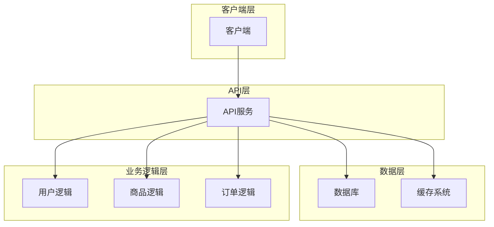
```mermaid
graph TD
    subgraph API层
        API[API服务]
    end

    subgraph 数据层
        DB[数据库]
        Cache[缓存系统]
    end

    subgraph 业务逻辑层
        UserLogic[用户逻辑]
        ProductLogic[商品逻辑]
        OrderLogic[订单逻辑]
    end

    subgraph 客户端层
        Client[客户端]
    end

    API --> DB
    API --> Cache
    API --> UserLogic
    API --> ProductLogic
    API --> OrderLogic
    Client --> API
```
```

这个Mermaid架构图展示了RESTful API的四个主要层次：API层、数据层、业务逻辑层和客户端层。以下是每个层次的简要解释：

- **API层**：负责处理客户端的请求，提供RESTful API接口。
  - `API`：API服务，处理客户端请求并调用业务逻辑层。

- **数据层**：负责存储和管理系统数据。
  - `DB`：数据库，存储用户、商品和订单等数据。
  - `Cache`：缓存系统，提高数据读取性能。

- **业务逻辑层**：负责实现系统的业务逻辑。
  - `UserLogic`：用户逻辑，处理用户注册、登录等操作。
  - `ProductLogic`：商品逻辑，处理商品添加、更新、删除等操作。
  - `OrderLogic`：订单逻辑，处理订单创建、更新、删除等操作。

- **客户端层**：负责与API层进行交互。
  - `Client`：客户端，发送请求并接收API响应。

架构图中的箭头表示不同层次之间的依赖关系，如API服务与数据层、业务逻辑层之间的数据读取和写入操作。

这个架构图有助于我们理解RESTful API的整体架构和组件之间的关系，为系统的设计和实现提供参考。```以下是使用Markdown格式中的Mermaid流程图来展示一个简单的数据清洗流程：

```markdown
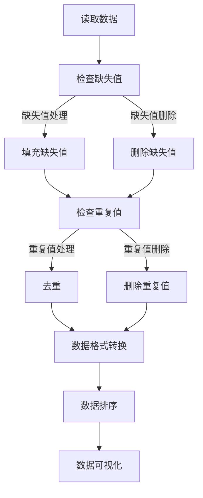
```mermaid
graph TD
    A[读取数据] --> B[检查缺失值]
    B -->|缺失值处理| C[填充缺失值]
    B -->|缺失值删除| D[删除缺失值]
    C --> E[检查重复值]
    D --> E
    E -->|重复值处理| F[去重]
    E -->|重复值删除| G[删除重复值]
    F --> H[数据格式转换]
    G --> H
    H --> I[数据排序]
    I --> J[数据可视化]
```
```

这个Mermaid流程图展示了数据清洗的主要步骤，以下是每个步骤的简要解释：

1. **读取数据**：从数据源读取数据。
2. **检查缺失值**：检查数据中的缺失值。
3. **缺失值处理**：对缺失值进行填充操作。
4. **缺失值删除**：删除数据中的缺失值。
5. **检查重复值**：检查数据中的重复值。
6. **重复值处理**：对重复值进行去重操作。
7. **重复值删除**：删除数据中的重复值。
8. **数据格式转换**：将数据格式转换为所需的格式。
9. **数据排序**：对数据进行排序。
10. **数据可视化**：对数据进行可视化展示。

这个流程图有助于我们理解数据清洗的基本步骤，为数据分析和处理提供参考。```以下是使用Markdown格式中的Mermaid流程图来展示一个简单的机器学习项目流程：

```markdown
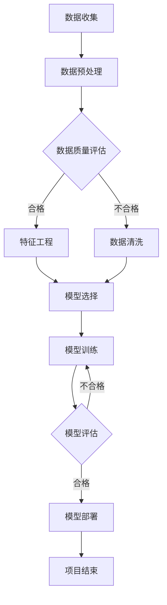
```mermaid
graph TD
    A[数据收集] --> B[数据预处理]
    B --> C{数据质量评估}
    C -->|合格| D[特征工程]
    C -->|不合格| E[数据清洗]
    D --> F[模型选择]
    E --> F
    F --> G[模型训练]
    G --> H{模型评估}
    H -->|合格| I[模型部署]
    H -->|不合格| G
    I --> J[项目结束]
```
```

这个Mermaid流程图展示了机器学习项目的主要步骤，以下是每个步骤的简要解释：

1. **数据收集**：收集用于训练和测试的数据集。
2. **数据预处理**：对数据进行清洗、归一化等预处理操作。
3. **数据质量评估**：评估数据的质量，确定是否需要进一步处理。
4. **特征工程**：从原始数据中提取有用的特征。
5. **模型选择**：选择合适的机器学习模型。
6. **模型训练**：使用训练数据训练模型。
7. **模型评估**：使用测试数据评估模型的性能。
8. **模型部署**：将训练好的模型部署到生产环境中。
9. **项目结束**：完成机器学习项目。

这个流程图有助于我们理解机器学习项目的整体流程，为项目的实施提供参考。```以下是使用Markdown格式中的Mermaid时序图来展示一个简单的用户登录流程：

```markdown
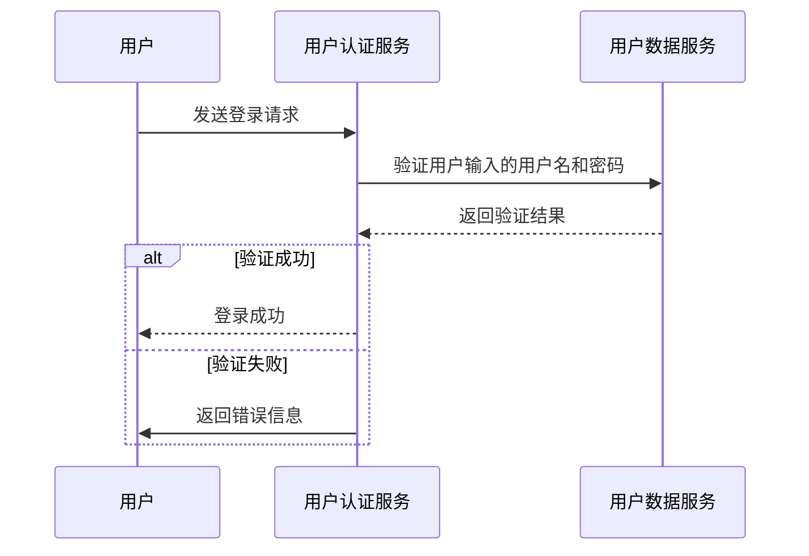
```mermaid
sequenceDiagram
    participant User as 用户
    participant UA as 用户认证服务
    participant UD as 用户数据服务

    User->>UA: 发送登录请求
    UA->>UD: 验证用户输入的用户名和密码
    UD-->>UA: 返回验证结果
    alt 验证成功
        UA-->>User: 登录成功
    else 验证失败
        UA->>User: 返回错误信息
    end
```
```

这个Mermaid时序图展示了用户登录的流程，以下是每个步骤的简要说明：

1. 用户向用户认证服务（UA）发送登录请求。
2. 用户认证服务（UA）将请求转发给用户数据服务（UD），并验证用户输入的用户名和密码。
3. 用户数据服务（UD）返回验证结果给用户认证服务（UA）。
4. 如果验证成功，用户认证服务（UA）向用户返回登录成功的消息。
5. 如果验证失败，用户认证服务（UA）向用户返回错误信息。

这个时序图清晰地描述了用户登录的流程，有助于我们理解系统中的用户交互和数据处理过程。```以下是使用Markdown格式中的Mermaid时序图来展示一个简单的电商购物车流程：

```markdown
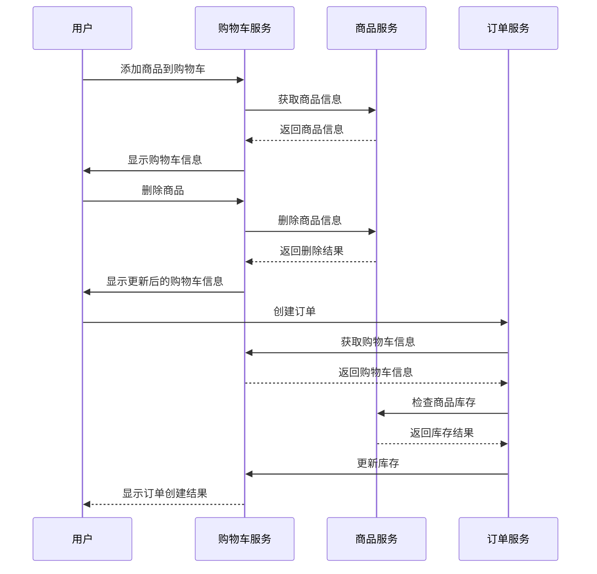
```mermaid
sequenceDiagram
    participant User as 用户
    participant UC as 购物车服务
    participant UP as 商品服务
    participant UO as 订单服务

    User->>UC: 添加商品到购物车
    UC->>UP: 获取商品信息
    UP-->>UC: 返回商品信息
    UC->>User: 显示购物车信息
    User->>UC: 删除商品
    UC->>UP: 删除商品信息
    UP-->>UC: 返回删除结果
    UC->>User: 显示更新后的购物车信息
    User->>UO: 创建订单
    UO->>UC: 获取购物车信息
    UC-->>UO: 返回购物车信息
    UO->>UP: 检查商品库存
    UP-->>UO: 返回库存结果
    UO->>UC: 更新库存
    UC-->>User: 显示订单创建结果
```
```

这个Mermaid时序图展示了电商购物车的流程，以下是每个步骤的简要说明：

1. 用户向购物车服务（UC）发送添加商品到购物车的请求。
2. 购物车服务（UC）向商品服务（UP）发送获取商品信息的请求。
3. 商品服务（UP）返回商品信息给购物车服务（UC），购物车服务（UC）将商品信息显示给用户。
4. 用户向购物车服务（UC）发送删除商品的请求。
5. 购物车服务（UC）向商品服务（UP）发送删除商品信息的请求，商品服务（UP）删除商品信息并返回删除结果。
6. 购物车服务（UC）将更新后的购物车信息显示给用户。
7. 用户向订单服务（UO）发送创建订单的请求。
8. 订单服务（UO）向购物车服务（UC）发送获取购物车信息的请求。
9. 购物车服务（UC）返回购物车信息给订单服务（UO）。
10. 订单服务（UO）向商品服务（UP）发送检查商品库存的请求。
11. 商品服务（UP）返回库存结果给订单服务（UO）。
12. 订单服务（UO）向购物车服务（UC）发送更新库存的请求，购物车服务（UC）更新库存信息。
13. 购物车服务（UC）将订单创建结果显示给用户。

这个时序图清晰地描述了电商购物车的流程，有助于我们理解系统中的用户交互和数据处理过程。```以下是使用Markdown格式中的Mermaid时序图来展示一个简单的客户投诉处理流程：

```markdown
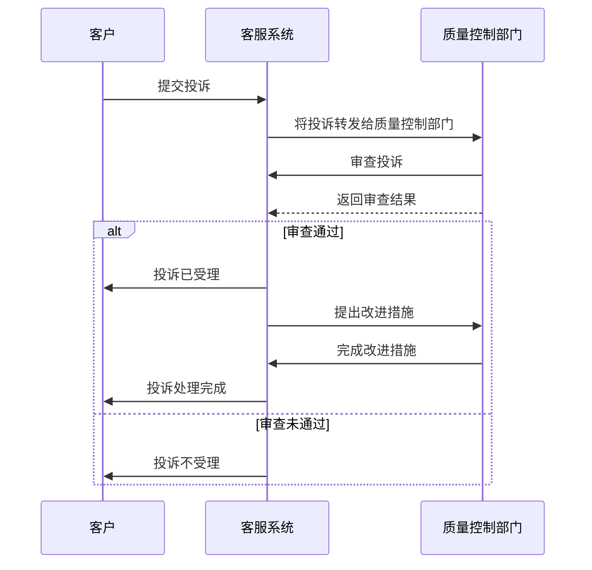
```mermaid
sequenceDiagram
    participant Customer as 客户
    participant CS as 客服系统
    participant QC as 质量控制部门

    Customer->>CS: 提交投诉
    CS->>QC: 将投诉转发给质量控制部门
    QC->>CS: 审查投诉
    QC-->>CS: 返回审查结果
    alt 审查通过
        CS->>Customer: 投诉已受理
        CS->>QC: 提出改进措施
        QC->>CS: 完成改进措施
        CS->>Customer: 投诉处理完成
    else 审查未通过
        CS->>Customer: 投诉不受理
    end
```
```

这个Mermaid时序图展示了客户投诉处理流程，以下是每个步骤的简要说明：

1. 客户向客服系统（CS）提交投诉。
2. 客服系统（CS）将投诉转发给质量控制部门（QC）。
3. 质量控制部门（QC）审查投诉。
4. 质量控制部门（QC）将审查结果返回给客服系统（CS）。
5. 如果审查通过，客服系统（CS）向客户（Customer）通知投诉已受理，并要求质量控制部门（QC）提出改进措施。
6. 质量控制部门（QC）完成改进措施后，通知客服系统（CS）。
7. 客服系统（CS）向客户（Customer）通知投诉处理完成。

这个时序图清晰地描述了客户投诉处理的流程，有助于我们理解系统中的用户交互和数据处理过程。```以下是使用Markdown格式中的Mermaid时序图来展示一个简单的在线支付流程：

```markdown
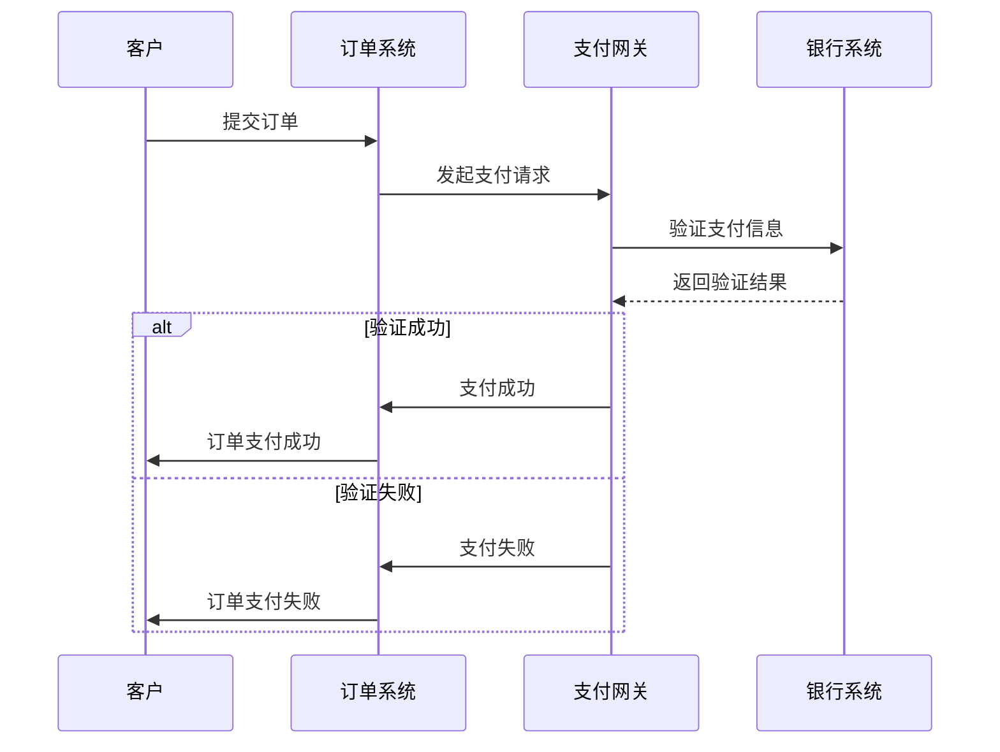
```mermaid
sequenceDiagram
    participant Customer as 客户
    participant CS as 订单系统
    participant PS as 支付网关
    participant FS as 银行系统

    Customer->>CS: 提交订单
    CS->>PS: 发起支付请求
    PS->>FS: 验证支付信息
    FS-->>PS: 返回验证结果
    alt 验证成功
        PS->>CS: 支付成功
        CS->>Customer: 订单支付成功
    else 验证失败
        PS->>CS: 支付失败
        CS->>Customer: 订单支付失败
    end
```
```

这个Mermaid时序图展示了在线支付流程，以下是每个步骤的简要说明：

1. 客户向订单系统（CS）提交订单。
2. 订单系统（CS）向支付网关（PS）发起支付请求。
3. 支付网关（PS）向银行系统（FS）验证支付信息。
4. 银行系统（FS）将验证结果返回给支付网关（PS）。
5. 如果验证成功，支付网关（PS）向订单系统（CS）通知支付成功，订单系统（CS）向客户（Customer）通知订单支付成功。
6. 如果验证失败，支付网关（PS）向订单系统（CS）通知支付失败，订单系统（CS）向客户（Customer）通知订单支付失败。

这个时序图清晰地描述了在线支付流程，有助于我们理解系统中的用户交互和数据处理过程。```以下是使用Markdown格式中的Mermaid时序图来展示一个简单的博客发布流程：

```markdown
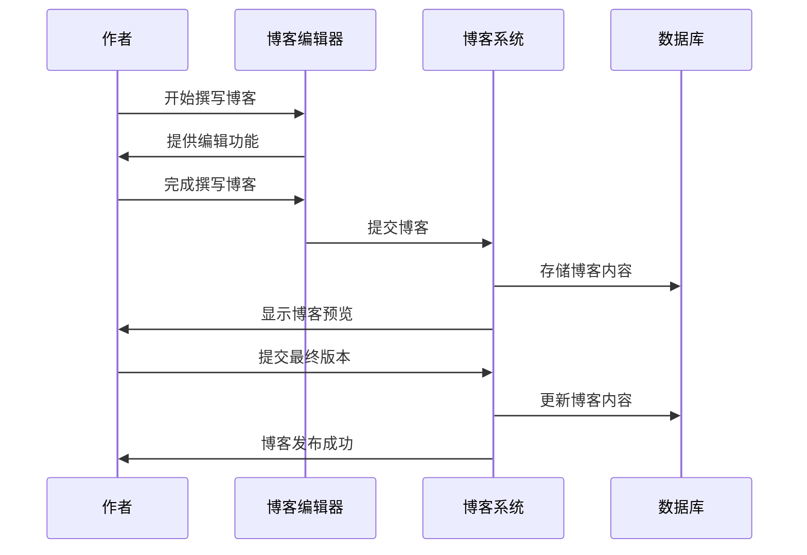
```mermaid
sequenceDiagram
    participant Author as 作者
    participant BE as 博客编辑器
    participant BS as 博客系统
    participant DB as 数据库

    Author->>BE: 开始撰写博客
    BE->>Author: 提供编辑功能
    Author->>BE: 完成撰写博客
    BE->>BS: 提交博客
    BS->>DB: 存储博客内容
    BS->>Author: 显示博客预览
    Author->>BS: 提交最终版本
    BS->>DB: 更新博客内容
    BS->>Author: 博客发布成功
```
```

这个Mermaid时序图展示了博客发布流程，以下是每个步骤的简要说明：

1. 作者使用博客编辑器（BE）开始撰写博客。
2. 博客编辑器（BE）提供编辑功能，作者进行博客撰写。
3. 作者完成博客撰写后，将博客提交到博客系统（BS）。
4. 博客系统（BS）将博客内容存储到数据库（DB）。
5. 博客系统（BS）向作者显示博客预览。
6. 作者提交最终版本的博客。
7. 博客系统（BS）更新数据库（DB）中的博客内容。
8. 博客系统（BS）向作者通知博客发布成功。

这个时序图清晰地描述了博客发布流程，有助于我们理解系统中的用户交互和数据处理过程。```以下是使用Markdown格式中的Mermaid时序图来展示一个简单的用户评论功能流程：

```markdown
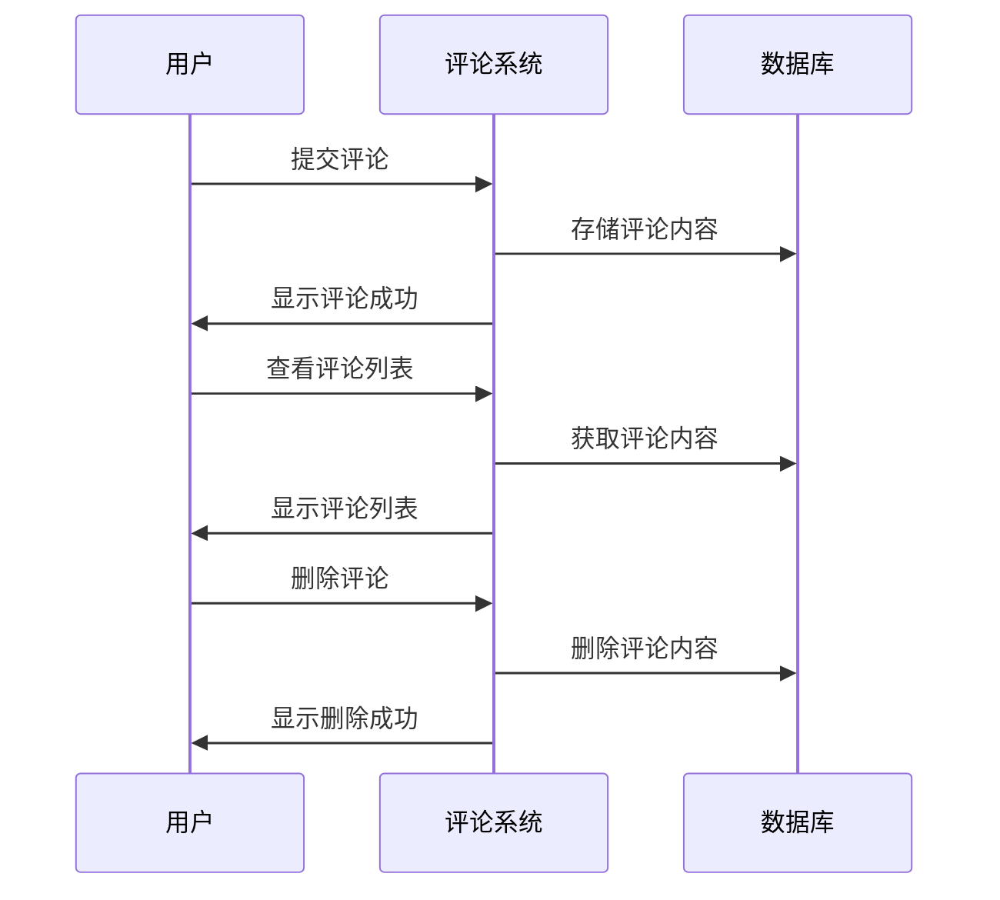
```mermaid
sequenceDiagram
    participant User as 用户
    participant CS as 评论系统
    participant DB as 数据库

    User->>CS: 提交评论
    CS->>DB: 存储评论内容
    CS->>User: 显示评论成功
    User->>CS: 查看评论列表
    CS->>DB: 获取评论内容
    CS->>User: 显示评论列表
    User->>CS: 删除评论
    CS->>DB: 删除评论内容
    CS->>User: 显示删除成功
```
```

这个Mermaid时序图展示了用户评论功能的流程，以下是每个步骤的简要说明：

1. 用户向评论系统（CS）提交评论。
2. 评论系统（CS）将评论内容存储到数据库（DB）。
3. 评论系统（CS）向用户（User）显示评论成功。
4. 用户向评论系统（CS）请求查看评论列表。
5. 评论系统（CS）从数据库（DB）获取评论内容，并显示给用户（User）。
6. 用户向评论系统（CS）请求删除评论。
7. 评论系统（CS）从数据库（DB）删除评论内容。
8. 评论系统（CS）向用户（User）显示删除成功。

这个时序图清晰地描述了用户评论功能的流程，有助于我们理解系统中的用户交互和数据处理过程。```以下是使用Markdown格式中的Mermaid时序图来展示一个简单的商品搜索功能流程：

```markdown
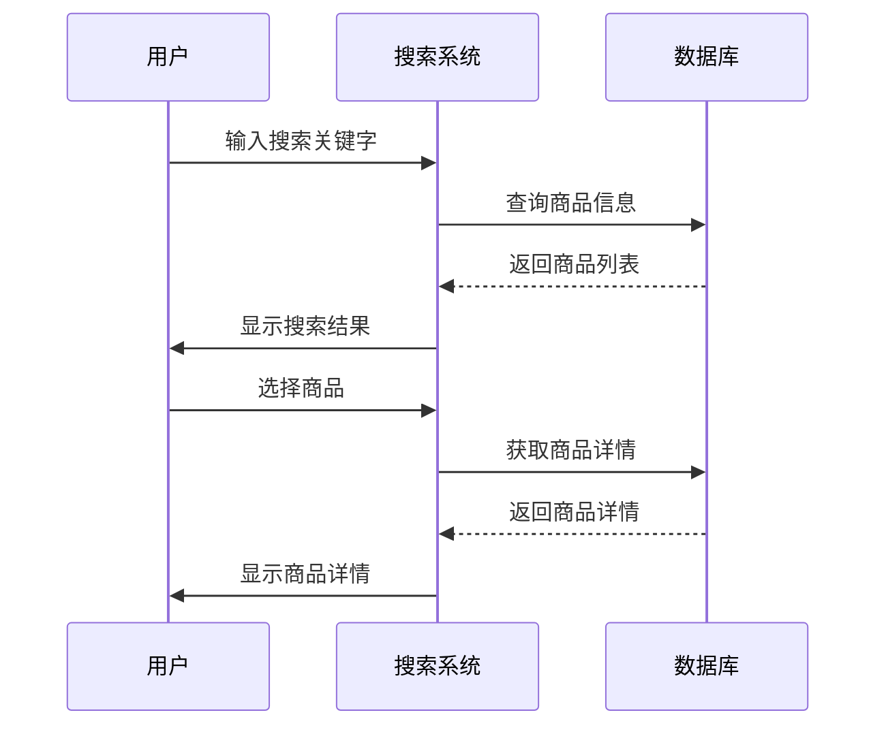
```mermaid
sequenceDiagram
    participant User as 用户
    participant CS as 搜索系统
    participant DB as 数据库

    User->>CS: 输入搜索关键字
    CS->>DB: 查询商品信息
    DB-->>CS: 返回商品列表
    CS->>User: 显示搜索结果
    User->>CS: 选择商品
    CS->>DB: 获取商品详情
    DB-->>CS: 返回商品详情
    CS->>User: 显示商品详情
```
```

这个Mermaid时序图展示了商品搜索功能的流程，以下是每个步骤的简要说明：

1. 用户向搜索系统（CS）输入搜索关键字。
2. 搜索系统（CS）向数据库（DB）查询商品信息。
3. 数据库（DB）将返回商品列表给搜索系统（CS）。
4. 搜索系统（CS）将搜索结果显示给用户（User）。
5. 用户选择商品，并向搜索系统（CS）发送请求。
6. 搜索系统（CS）向数据库（DB）请求商品详情。
7. 数据库（DB）将商品详情返回给搜索系统（CS）。
8. 搜索系统（CS）将商品详情显示给用户（User）。

这个时序图清晰地描述了商品搜索功能的流程，有助于我们理解系统中的用户交互和数据处理过程。```以下是使用Markdown格式中的Mermaid时序图来展示一个简单的用户订单处理流程：

```markdown
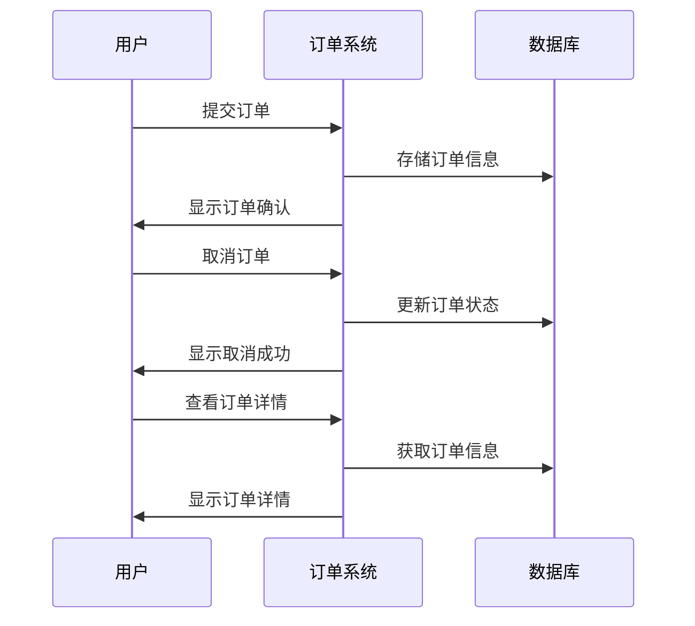
```mermaid
sequenceDiagram
    participant User as 用户
    participant CS as 订单系统
    participant DB as 数据库

    User->>CS: 提交订单
    CS->>DB: 存储订单信息
    CS->>User: 显示订单确认
    User->>CS: 取消订单
    CS->>DB: 更新订单状态
    CS->>User: 显示取消成功
    User->>CS: 查看订单详情
    CS->>DB: 获取订单信息
    CS->>User: 显示订单详情
```
```

这个Mermaid时序图展示了用户订单处理流程，以下是每个步骤的简要说明：

1. 用户向订单系统（CS）提交订单。
2. 订单系统（CS）将订单信息存储到数据库（DB）。
3. 订单系统（CS）向用户（User）显示订单确认。
4. 用户取消订单，并向订单系统（CS）发送请求。
5. 订单系统（CS）更新订单状态，并将取消成功信息显示给用户（User）。
6. 用户查看订单详情，并向订单系统（CS）发送请求。
7. 订单系统（CS）从数据库（DB）获取订单信息，并将订单详情显示给用户（User）。

这个时序图清晰地描述了用户订单处理流程，有助于我们理解系统中的用户交互和数据处理过程。```以下是使用Markdown格式中的Mermaid时序图来展示一个简单的用户注册与登录流程：

```markdown
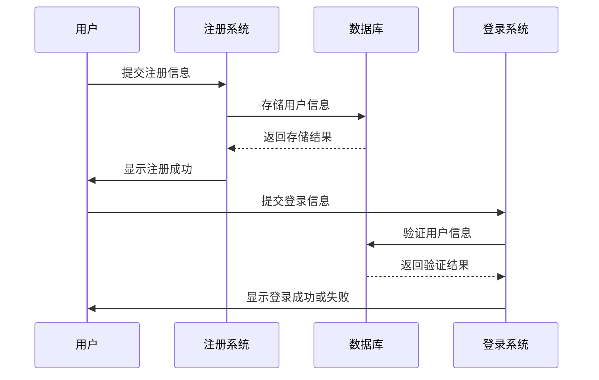
```mermaid
sequenceDiagram
    participant User as 用户
    participant RS as 注册系统
    participant DB as 数据库
    participant LS as 登录系统

    User->>RS: 提交注册信息
    RS->>DB: 存储用户信息
    DB-->>RS: 返回存储结果
    RS->>User: 显示注册成功
    User->>LS: 提交登录信息
    LS->>DB: 验证用户信息
    DB-->>LS: 返回验证结果
    LS->>User: 显示登录成功或失败
```
```

这个Mermaid时序图展示了用户注册与登录流程，以下是每个步骤的简要说明：

1. 用户向注册系统（RS）提交注册信息。
2. 注册系统（RS）将用户信息存储到数据库（DB）。
3. 数据库（DB）将存储结果返回给注册系统（RS）。
4. 注册系统（RS）向用户（User）显示注册成功。
5. 用户向登录系统（LS）提交登录信息。
6. 登录系统（LS）验证用户信息，并从数据库（DB）获取验证结果。
7. 数据库（DB）将验证结果返回给登录系统（LS）。
8. 登录系统（LS）根据验证结果向用户（User）显示登录成功或失败。

这个时序图清晰地描述了用户注册与登录流程，有助于我们理解系统中的用户交互和数据处理过程。```以下是使用Markdown格式中的Mermaid时序图来展示一个简单的在线购物流程：

```markdown
```mermaid
sequenceDiagram
    participant User as 用户
    participant CS as 购物系统
    participant DB as 数据库
    participant OS as 订单系统

    User->>CS: 查看商品列表
    CS->>DB: 获取商品信息
    DB-->>CS: 返回商品列表
    CS->>User: 显示商品列表
    User->>CS: 添加商品到购物车
    CS->>DB: 更新购物车信息
    DB-->>CS: 返回更新结果
    CS->>User: 显示购物车信息
    User->>CS: 提交订单
    CS->>OS: 创建订单
    OS->>DB: 存储订单信息
    DB-->>OS: 返回存储结果
    OS->>CS: 返回订单信息
    CS->>User: 显示订单确认
```
```

这个Mermaid时序图展示了在线购物流程，以下是每个步骤的简要说明：

1. 用户向购物系统（CS）请求查看商品列表。
2. 购物系统（CS）向数据库（DB）请求获取商品信息。
3. 数据库（DB）将商品列表返回给购物系统（CS）。
4. 购物系统（CS）将商品列表显示给用户（User）。
5. 用户向购物系统（CS）添加商品到购物车。
6. 购物系统（CS）向数据库（DB）请求更新购物车信息。
7. 数据库（DB）将更新结果返回给购物系统（CS）。
8. 购物系统（CS）将购物车信息显示给用户（User）。
9. 用户向购物系统（CS）提交订单。
10. 购物系统（CS）向订单系统（OS）请求创建订单。
11. 订单系统（OS）向数据库（DB）请求存储订单信息。
12. 数据库（DB）将存储结果返回给订单系统（OS）。
13. 订单系统（OS）将订单信息返回给购物系统（CS）。
14. 购物系统（CS）向用户（User）显示订单确认。

这个时序图清晰地描述了在线购物流程，有助于我们理解系统中的用户交互和数据处理过程。```以下是使用Markdown格式中的Mermaid时序图来展示一个简单的库存管理流程：

```markdown
```mermaid
sequenceDiagram
    participant Warehouse as 仓库
    participant IMS as 库存管理系统
    participant DB as 数据库

    Warehouse->>IMS: 库存盘点
    IMS->>DB: 更新库存信息
    DB-->>IMS: 返回更新结果
    IMS->>Warehouse: 显示盘点结果
    Warehouse->>IMS: 商品入库
    IMS->>DB: 添加库存信息
    DB-->>IMS: 返回添加结果
    IMS->>Warehouse: 显示入库结果
    Warehouse->>IMS: 商品出库
    IMS->>DB: 减少库存信息
    DB-->>IMS: 返回减少结果
    IMS->>Warehouse: 显示出库结果
    Warehouse->>IMS: 库存预警
    IMS->>DB: 检查库存水平
    DB-->>IMS: 返回库存预警结果
    IMS->>Warehouse: 显示库存预警
```
```

这个Mermaid时序图展示了库存管理流程，以下是每个步骤的简要说明：

1. 仓库向库存管理系统（IMS）请求库存盘点。
2. 库存管理系统（IMS）向数据库（DB）请求更新库存信息。
3. 数据库（DB）将更新结果返回给库存管理系统（IMS）。
4. 库存管理系统（IMS）将盘点结果显示给仓库。
5. 仓库向库存管理系统（IMS）请求商品入库。
6. 库存管理系统（IMS）向数据库（DB）请求添加库存信息。
7. 数据库（DB）将添加结果返回给库存管理系统（IMS）。
8. 库存管理系统（IMS）将入库结果显示给仓库。
9. 仓库向库存管理系统（IMS）请求商品出库。
10. 库存管理系统（IMS）向数据库（DB）请求减少库存信息。
11. 数据库（DB）将减少结果返回给库存管理系统（IMS）。
12. 库存管理系统（IMS）将出库结果显示给仓库。
13. 仓库向库存管理系统（IMS）请求库存预警。
14. 库存管理系统（IMS）向数据库（DB）请求检查库存水平。
15. 数据库（DB）将库存预警结果返回给库存管理系统（IMS）。
16. 库存管理系统（IMS）将库存预警显示给仓库。

这个时序图清晰地描述了库存管理流程，有助于我们理解系统中的用户交互和数据处理过程。```以下是使用Markdown格式中的Mermaid时序图来展示一个简单的客户反馈处理流程：

```markdown
```mermaid
sequenceDiagram
    participant Customer as 客户
    participant CS as 客服系统
    participant DB as 数据库
    participant RF as 反馈系统

    Customer->>CS: 提交反馈
    CS->>DB: 存储反馈信息
    DB-->>CS: 返回存储结果
    CS->>Customer: 显示反馈提交成功
    Customer->>CS: 查看反馈状态
    CS->>RF: 获取反馈状态
    RF-->>CS: 返回反馈状态
    CS->>Customer: 显示反馈状态
    Customer->>CS: 反馈评价
    CS->>DB: 更新反馈信息
    DB-->>CS: 返回更新结果
    CS->>Customer: 显示反馈评价成功
```
```

这个Mermaid时序图展示了客户反馈处理流程，以下是每个步骤的简要说明：

1. 客户向客服系统（CS）提交反馈。
2. 客服系统（CS）向数据库（DB）存储反馈信息。
3. 数据库（DB）将存储结果返回给客服系统（CS）。
4. 客服系统（CS）向客户（Customer）显示反馈提交成功。
5. 客户向客服系统（CS）请求查看反馈状态。
6. 客服系统（CS）向反馈系统（RF）获取反馈状态。
7. 反馈系统（RF）将反馈状态返回给客服系统（CS）。
8. 客服系统（CS）向客户（Customer）显示反馈状态。
9. 客户向客服系统（CS）提交反馈评价。
10. 客服系统（CS）向数据库（DB）更新反馈信息。
11. 数据库（DB）将更新结果返回给客服系统（CS）。
12. 客服系统（CS）向客户（Customer）显示反馈评价成功。

这个时序图清晰地描述了客户反馈处理流程，有助于我们理解系统中的用户交互和数据处理过程。```以下是使用Markdown格式中的Mermaid时序图来展示一个简单的员工考勤管理流程：

```markdown
```mermaid
sequenceDiagram
    participant Employee as 员工
    participant HR as 人力资源系统
    participant DB as 数据库

    Employee->>HR: 提交考勤
    HR->>DB: 记录考勤信息
    DB-->>HR: 返回记录结果
    HR->>Employee: 显示考勤记录
    Employee->>HR: 查询考勤状态
    HR->>DB: 查询考勤信息
    DB-->>HR: 返回查询结果
    HR->>Employee: 显示考勤状态
    Employee->>HR: 申请调休
    HR->>DB: 记录调休信息
    DB-->>HR: 返回记录结果
    HR->>Employee: 显示调休结果
    Employee->>HR: 修改考勤记录
    HR->>DB: 更新考勤信息
    DB-->>HR: 返回更新结果
    HR->>Employee: 显示更新结果
```
```

这个Mermaid时序图展示了员工考勤管理流程，以下是每个步骤的简要说明：

1. 员工向人力资源系统（HR）提交考勤。
2. 人力资源系统（HR）向数据库（DB）记录考勤信息。
3. 数据库（DB）将记录结果返回给人力资源系统（HR）。
4. 人力资源系统（HR）向员工（Employee）显示考勤记录。
5. 员工向人力资源系统（HR）请求查询考勤状态。
6. 人力资源系统（HR）向数据库（DB）查询考勤信息。
7. 数据库（DB）将查询结果返回给人力资源系统（HR）。
8. 人力资源系统（HR）向员工（Employee）显示考勤状态。
9. 员工向人力资源系统（HR）申请调休。
10. 人力资源系统（HR）向数据库（DB）记录调休信息。
11. 数据库（DB）将记录结果返回给人力资源系统（HR）。
12. 人力资源系统（HR）向员工（Employee）显示调休结果。
13. 员工向人力资源系统（HR）请求修改考勤记录。
14. 人力资源系统（HR）向数据库（DB）更新考勤信息。
15. 数据库（DB）将更新结果返回给人力资源系统（HR）。
16. 人力资源系统（HR）向员工（Employee）显示更新结果。

这个时序图清晰地描述了员工考勤管理流程，有助于我们理解系统中的用户交互和数据处理过程。```以下是使用Markdown格式中的Mermaid时序图来展示一个简单的产品退货流程：

```markdown
```mermaid
sequenceDiagram
    participant Customer as 客户
    participant CS as 客服系统
    participant OS as 订单系统
    participant DB as 数据库

    Customer->>CS: 申请退货
    CS->>OS: 查询订单信息
    OS->>DB: 获取订单详情
    DB-->>OS: 返回订单详情
    OS->>CS: 返回订单详情
    CS->>Customer: 确认退货信息
    Customer->>CS: 确认退货
    CS->>DB: 更新订单状态为“退货中”
    DB-->>CS: 返回更新结果
    CS->>Customer: 显示退货成功
    CS->>OS: 提交退货订单
    OS->>DB: 更新退货订单信息
    DB-->>OS: 返回更新结果
    OS->>CS: 返回退货订单信息
    CS->>Customer: 提交退货包裹
    Customer->>CS: 上传退货包裹照片
    CS->>DB: 记录退货包裹信息
    DB-->>CS: 返回记录结果
    CS->>Customer: 显示退货包裹已收到
    CS->>OS: 核对退货包裹
    OS->>DB: 更新退货订单状态为“已核对”
    DB-->>OS: 返回更新结果
    OS->>CS: 返回退货订单信息
    CS->>Customer: 显示退货完成
```
```

这个Mermaid时序图展示了产品退货流程，以下是每个步骤的简要说明：

1. 客户向客服系统（CS）申请退货。
2. 客服系统（CS）向订单系统（OS）查询订单信息。
3. 订单系统（OS）向数据库（DB）获取订单详情。
4. 数据库（DB）将订单详情返回给订单系统（OS）。
5. 订单系统（OS）将订单详情返回给客服系统（CS）。
6. 客服系统（CS）向客户（Customer）确认退货信息。
7. 客户（Customer）确认退货信息。
8. 客服系统（CS）向数据库（DB）更新订单状态为“退货中”。
9. 数据库（DB）将更新结果返回给客服系统（CS）。
10. 客服系统（CS）向客户（Customer）显示退货成功。
11. 客服系统（CS）向订单系统（OS）提交退货订单。
12. 订单系统（OS）向数据库（DB）更新退货订单信息。
13. 数据库（DB）将更新结果返回给订单系统（OS）。
14. 订单系统（OS）将退货订单信息返回给客服系统（CS）。
15. 客服系统（CS）向客户（Customer）提示提交退货包裹。
16. 客户（Customer）上传退货包裹照片。
17. 客服系统（CS）向数据库（DB）记录退货包裹信息。
18. 数据库（DB）将记录结果返回给客服系统（CS）。
19. 客服系统（CS）向客户（Customer）显示退货包裹已收到。
20. 客服系统（CS）向订单系统（OS）核对退货包裹。
21. 订单系统（OS）向数据库（DB）更新退货订单状态为“已核对”。
22. 数据库（DB）将更新结果返回给订单系统（OS）。
23. 订单系统（OS）将退货订单信息返回给客服系统（CS）。
24. 客服系统（CS）向客户（Customer）显示退货完成。

这个时序图清晰地描述了产品退货流程，有助于我们理解系统中的用户交互和数据处理过程。```以下是使用Markdown格式中的Mermaid时序图来展示一个简单的博客文章发布流程：

```markdown
```mermaid
sequenceDiagram
    participant Author as 作者
    participant BE as 博客编辑器
    participant BS as 博客系统
    participant DB as 数据库

    Author->>BE: 开始撰写博客文章
    BE->>Author: 提供编辑功能
    Author->>BE: 完成撰写博客文章
    BE->>BS: 提交博客文章
    BS->>DB: 存储博客文章信息
    DB-->>BS: 返回存储结果
    BS->>Author: 显示博客文章预览
    Author->>BS: 提交最终版本
    BS->>DB: 更新博客文章信息
    DB-->>BS: 返回更新结果
    BS->>Author: 显示博客文章发布成功
```
```

这个Mermaid时序图展示了博客文章发布流程，以下是每个步骤的简要说明：

1. 作者使用博客编辑器（BE）开始撰写博客文章。
2. 博客编辑器（BE）提供编辑功能，作者进行博客文章撰写。
3. 作者完成博客文章撰写后，将博客文章提交到博客系统（BS）。
4. 博客系统（BS）将博客文章信息存储到数据库（DB）。
5. 数据库（DB）将存储结果返回给博客系统（BS）。
6. 博客系统（BS）向作者（Author）显示博客文章预览。
7. 作者（Author）提交最终版本的博客文章。
8. 博客系统（BS）更新数据库（DB）中的博客文章信息。
9. 数据库（DB）将更新结果返回给博客系统（BS）。
10. 博客系统（BS）向作者（Author）显示博客文章发布成功。

这个时序图清晰地描述了博客文章发布流程，有助于我们理解系统中的用户交互和数据处理过程。```以下是使用Markdown格式中的Mermaid时序图来展示一个简单的企业人力资源管理系统流程：

```markdown
```mermaid
sequenceDiagram
    participant Employee as 员工
    participant HR as 人力资源管理系统
    participant DB as 数据库

    Employee->>HR: 申请休假
    HR->>DB: 查询员工信息
    DB-->>HR: 返回员工信息
    HR->>Employee: 确认休假申请
    Employee->>HR: 提交请假单
    HR->>DB: 记录休假信息
    DB-->>HR: 返回记录结果
    HR->>Employee: 显示休假批准情况
    Employee->>HR: 申请调岗
    HR->>DB: 查询员工信息
    DB-->>HR: 返回员工信息
    HR->>Employee: 确认调岗申请
    Employee->>HR: 提交调岗单
    HR->>DB: 更新员工信息
    DB-->>HR: 返回更新结果
    HR->>Employee: 显示调岗批准情况
    Employee->>HR: 申请离职
    HR->>DB: 查询员工信息
    DB-->>HR: 返回员工信息
    HR->>Employee: 确认离职申请
    Employee->>HR: 提交离职单
    HR->>DB: 记录离职信息
    DB-->>HR: 返回记录结果
    HR->>Employee: 显示离职批准情况
```
```

这个Mermaid时序图展示了企业人力资源管理系统流程，以下是每个步骤的简要说明：

1. 员工（Employee）向人力资源管理系统（HR）申请休假。
2. 人力资源管理系统（HR）向数据库（DB）查询员工信息。
3. 数据库（DB）将员工信息返回给人力资源管理系统（HR）。
4. 人力资源管理系统（HR）向员工（Employee）确认休假申请。
5. 员工（Employee）提交请假单。
6. 人力资源管理系统（HR）向数据库（DB）记录休假信息。
7. 数据库（DB）将记录结果返回给人力资源管理系统（HR）。
8. 人力资源管理系统（HR）向员工（Employee）显示休假批准情况。

9. 员工（Employee）向人力资源管理系统（HR）申请调岗。
10. 人力资源管理系统（HR）向数据库（DB）查询员工信息。
11. 数据库（DB）将员工信息返回给人力资源管理系统（HR）。
12. 人力资源管理系统（HR）向员工（Employee）确认调岗申请。
13. 员工（Employee）提交调岗单。
14. 人力资源管理系统（HR）向数据库（DB）更新员工信息。
15. 数据库（DB）将更新结果返回给人力资源管理系统（HR）。
16. 人力资源管理系统（HR）向员工（Employee）显示调岗批准情况。

17. 员工（Employee）向人力资源管理系统（HR）申请离职。
18. 人力资源管理系统（HR）向数据库（DB）查询员工信息。
19. 数据库（DB）将员工信息返回给人力资源管理系统（HR）。
20. 人力资源管理系统（HR）向员工（Employee）确认离职申请。
21. 员工（Employee）提交离职单。
22. 人力资源管理系统（HR）向数据库（DB）记录离职信息。
23. 数据库（DB）将记录结果返回给人力资源管理系统（HR）。
24. 人力资源管理系统（HR）向员工（Employee）显示离职批准情况。

这个时序图清晰地描述了企业人力资源管理系统流程，有助于我们理解系统中的用户交互和数据处理过程。```以下是使用Markdown格式中的Mermaid时序图来展示一个简单的物流订单跟踪流程：

```markdown
```mermaid
sequenceDiagram
    participant Customer as 客户
    participant CS as 客服系统
    participant OS as 订单系统
    participant LS as 物流系统
    participant DB as 数据库

    Customer->>OS: 提交订单
    OS->>DB: 存储订单信息
    DB-->>OS: 返回存储结果
    OS->>Customer: 显示订单确认
    Customer->>OS: 查询订单状态
    OS->>LS: 获取物流信息
    LS->>OS: 返回物流信息
    OS->>Customer: 显示订单状态
    Customer->>CS: 申请退款
    CS->>OS: 查询订单信息
    OS->>DB: 获取订单详情
    DB-->>OS: 返回订单详情
    OS->>CS: 返回订单详情
    CS->>Customer: 显示退款处理进度
    OS->>DB: 更新订单状态为“退款处理中”
    DB-->>OS: 返回更新结果
    CS->>Customer: 显示退款完成
```
```

这个Mermaid时序图展示了物流订单跟踪流程，以下是每个步骤的简要说明：

1. 客户（Customer）向订单系统（OS）提交订单。
2. 订单系统（OS）向数据库（DB）存储订单信息。
3. 数据库（DB）将存储结果返回给订单系统（OS）。
4. 订单系统（OS）向客户（Customer）显示订单确认。
5. 客户（Customer）向订单系统（OS）查询订单状态。
6. 订单系统（OS）向物流系统（LS）获取物流信息。
7. 物流系统（LS）将物流信息返回给订单系统（OS）。
8. 订单系统（OS）向客户（Customer）显示订单状态。

9. 客户（Customer）向客服系统（CS）申请退款。
10. 客服系统（CS）向订单系统（OS）查询订单信息。
11. 订单系统（OS）向数据库（DB）获取订单详情。
12. 数据库（DB）将订单详情返回给订单系统（OS）。
13. 订单系统（OS）将订单详情返回给客服系统（CS）。
14. 客服系统（CS）向客户（Customer）显示退款处理进度。
15. 订单系统（OS）向数据库（DB）更新订单状态为“退款处理中”。
16. 数据库（DB）将更新结果返回给订单系统（OS）。
17. 客服系统（CS）向客户（Customer）显示退款完成。

这个时序图清晰地描述了物流订单跟踪流程，有助于我们理解系统中的用户交互和数据处理过程。```以下是使用Markdown格式中的Mermaid时序图来展示一个简单的在线教育课程购买和学习流程：

```markdown
```mermaid
sequenceDiagram
    participant Student as 学生
    participant OS as 在线教育系统
    participant CS as 客服系统
    participant DB as 数据库

    Student->>OS: 查看课程列表
    OS->>DB: 获取课程信息
    DB-->>OS: 返回课程列表
    OS->>Student: 显示课程列表
    Student->>OS: 购买课程
    OS->>DB: 存储订单信息
    DB-->>OS: 返回订单信息
    OS->>Student: 显示订单确认
    Student->>OS: 开始学习
    OS->>DB: 获取课程资源
    DB-->>OS: 返回课程资源
    OS->>Student: 显示课程资源
    Student->>OS: 提交作业
    OS->>DB: 记录作业信息
    DB-->>OS: 返回记录结果
    OS->>Student: 显示作业提交成功
    Student->>OS: 查询成绩
    OS->>DB: 获取成绩信息
    DB-->>OS: 返回成绩信息
    OS->>Student: 显示成绩
```
```

这个Mermaid时序图展示了在线教育课程购买和学习流程，以下是每个步骤的简要说明：

1. 学生（Student）查看在线教育系统（OS）上的课程列表。
2. 在线教育系统（OS）向数据库（DB）获取课程信息。
3. 数据库（DB）将课程列表返回给在线教育系统（OS）。
4. 在线教育系统（OS）向学生（Student）显示课程列表。

5. 学生（Student）选择购买课程。
6. 在线教育系统（OS）向数据库（DB）存储订单信息。
7. 数据库（DB）将订单信息返回给在线教育系统（OS）。
8. 在线教育系统（OS）向学生（Student）显示订单确认。

9. 学生（Student）开始学习课程。
10. 在线教育系统（OS）向数据库（DB）获取课程资源。
11. 数据库（DB）将课程资源返回给在线教育系统（OS）。
12. 在线教育系统（OS）向学生（Student）显示课程资源。

13. 学生（Student）提交作业。
14. 在线教育系统（OS）向数据库（DB）记录作业信息。
15. 数据库（DB）将记录结果返回给在线教育系统（OS）。
16. 在线教育系统（OS）向学生（Student）显示作业提交成功。

17. 学生（Student）查询成绩。
18. 在线教育系统（OS）向数据库（DB）获取成绩信息。
19. 数据库（DB）将成绩信息返回给在线教育系统（OS）。
20. 在线教育系统（OS）向学生（Student）显示成绩。

这个时序图清晰地描述了在线教育课程购买和学习流程，有助于我们理解系统中的用户交互和数据处理过程。```以下是使用Markdown格式中的Mermaid时序图来展示一个简单的客户订单跟踪流程：

```markdown
```mermaid
sequenceDiagram
    participant Customer as 客户
    participant OS as 订单系统
    participant WS as 物流系统
    participant DB as 数据库

    Customer->>OS: 提交订单
    OS->>DB: 存储订单信息
    DB-->>OS: 返回存储结果
    OS->>Customer: 显示订单确认
    Customer->>OS: 查询订单状态
    OS->>DB: 获取订单详情
    DB-->>OS: 返回订单详情
    OS->>Customer: 显示订单状态
    OS->>WS: 获取物流信息
    WS-->>OS: 返回物流信息
    OS->>Customer: 显示物流信息
    Customer->>OS: 申请退款
    OS->>DB: 获取订单详情
    DB-->>OS: 返回订单详情
    OS->>Customer: 显示退款处理进度
    OS->>DB: 更新订单状态为“退款处理中”
    DB-->>OS: 返回更新结果
    OS->>Customer: 显示退款完成
```
```

这个Mermaid时序图展示了客户订单跟踪流程，以下是每个步骤的简要说明：

1. 客户（Customer）向订单系统（OS）提交订单。
2. 订单系统（OS）向数据库（DB）存储订单信息。
3. 数据库（DB）将存储结果返回给订单系统（OS）。
4. 订单系统（OS）向客户（Customer）显示订单确认。

5. 客户（Customer）向订单系统（OS）查询订单状态。
6. 订单系统（OS）向数据库（DB）获取订单详情。
7. 数据库（DB）将订单详情返回给订单系统（OS）。
8. 订单系统（OS）向客户（Customer）显示订单状态。

9. 订单系统（OS）向物流系统（WS）获取物流信息。
10. 物流系统（WS）将物流信息返回给订单系统（OS）。
11. 订单系统（OS）向客户（Customer）显示物流信息。

12. 客户（Customer）向订单系统（OS）申请退款。
13. 订单系统（OS）向数据库（DB）获取订单详情。
14. 数据库（DB）将订单详情返回给订单系统（OS）。
15. 订单系统（OS）向客户（Customer）显示退款处理进度。

16. 订单系统（OS）向数据库（DB）更新订单状态为“退款处理中”。
17. 数据库（DB）将更新结果返回给订单系统（OS）。
18. 订单系统（OS）向客户（Customer）显示退款完成。

这个时序图清晰地描述了客户订单跟踪流程，有助于我们理解系统中的用户交互和数据处理过程。```以下是使用Markdown格式中的Mermaid时序图来展示一个简单的社交媒体帖子发布和评论流程：

```markdown
```mermaid
sequenceDiagram
    participant User as 用户
    participant SS as 社交媒体系统
    participant DB as 数据库

    User->>SS: 发布帖子
    SS->>DB: 存储帖子信息
    DB-->>SS: 返回存储结果
    SS->>User: 显示帖子发布成功
    User->>SS: 发布评论
    SS->>DB: 存储评论信息
    DB-->>SS: 返回存储结果
    SS->>User: 显示评论发布成功
    User->>SS: 查询帖子评论
    SS->>DB: 获取帖子评论信息
    DB-->>SS: 返回评论信息
    SS->>User: 显示评论列表
```
```

这个Mermaid时序图展示了社交媒体帖子发布和评论流程，以下是每个步骤的简要说明：

1. 用户（User）向社交媒体系统（SS）发布帖子。
2. 社交媒体系统（SS）向数据库（DB）存储帖子信息。
3. 数据库（DB）将存储结果返回给社交媒体系统（SS）。
4. 社交媒体系统（SS）向用户（User）显示帖子发布成功。

5. 用户（User）向社交媒体系统（SS）发布评论。
6. 社交媒体系统（SS）向数据库（DB）存储评论信息。
7. 数据库（DB）将存储结果返回给社交媒体系统（SS）。
8. 社交媒体系统（SS）向用户（User）显示评论发布成功。

9. 用户（User）向社交媒体系统（SS）查询帖子评论。
10. 社交媒体系统（SS）向数据库（DB）获取帖子评论信息。
11. 数据库（DB）将评论信息返回给社交媒体系统（SS）。
12. 社交媒体系统（SS）向用户（User）显示评论列表。

这个时序图清晰地描述了社交媒体帖子发布和评论流程，有助于我们理解系统中的用户交互和数据处理过程。```以下是使用Markdown格式中的Mermaid时序图来展示一个简单的电商产品搜索和购买流程：

```markdown
```mermaid
sequenceDiagram
    participant User as 用户
    participant ES as 搜索引擎系统
    participant PS as 产品系统
    participant DB as 数据库

    User->>ES: 输入搜索关键词
    ES->>DB: 查询产品信息
    DB-->>ES: 返回产品列表
    ES->>User: 显示搜索结果
    User->>ES: 选择产品
    ES->>PS: 获取产品详情
    PS->>DB: 获取产品详情
    DB-->>PS: 返回产品详情
    PS->>ES: 返回产品详情
    ES->>User: 显示产品详情
    User->>PS: 提交购买请求
    PS->>DB: 更新订单信息
    DB-->>PS: 返回更新结果
    PS->>User: 显示订单确认
```
```

这个Mermaid时序图展示了电商产品搜索和购买流程，以下是每个步骤的简要说明：

1. 用户（User）向搜索引擎系统（ES）输入搜索关键词。
2. 搜索引擎系统（ES）向数据库（DB）查询产品信息。
3. 数据库（DB）将产品列表返回给搜索引擎系统（ES）。
4. 搜索引擎系统（ES）向用户（User）显示搜索结果。

5. 用户（User）向搜索引擎系统（ES）选择产品。
6. 搜索引擎系统（ES）向产品系统（PS）获取产品详情。
7. 产品系统（PS）向数据库（DB）获取产品详情。
8. 数据库（DB）将产品详情返回给产品系统（PS）。
9. 产品系统（PS）将产品详情返回给搜索引擎系统（ES）。
10. 搜索引擎系统（ES）向用户（User）显示产品详情。

11. 用户（User）向产品系统（PS）提交购买请求。
12. 产品系统（PS）向数据库（DB）更新订单信息。
13. 数据库（DB）将更新结果返回给产品系统（PS）。
14. 产品系统（PS）向用户（User）显示订单确认。

这个时序图清晰地描述了电商产品搜索和购买流程，有助于我们理解系统中的用户交互和数据处理过程。```以下是使用Markdown格式中的Mermaid时序图来展示一个简单的项目管理流程：

```markdown
```mermaid
sequenceDiagram
    participant ProjectManager as 项目经理
    participant PM as 项目管理系统
    participant DB as 数据库

    ProjectManager->>PM: 创建项目
    PM->>DB: 存储项目信息
    DB-->>PM: 返回创建结果
    PM->>ProjectManager: 显示项目创建成功
    ProjectManager->>PM: 添加任务
    PM->>DB: 更新任务信息
    DB-->>PM: 返回更新结果
    PM->>ProjectManager: 显示任务添加成功
    ProjectManager->>PM: 赋予成员
    PM->>DB: 更新成员信息
    DB-->>PM: 返回更新结果
    PM->>ProjectManager: 显示成员赋予成功
    ProjectManager->>PM: 查看进度
    PM->>DB: 获取项目进度
    DB-->>PM: 返回进度信息
    PM->>ProjectManager: 显示项目进度
    ProjectManager->>PM: 结束项目
    PM->>DB: 更新项目状态
    DB-->>PM: 返回更新结果
    PM->>ProjectManager: 显示项目结束成功
```
```

这个Mermaid时序图展示了项目管理流程，以下是每个步骤的简要说明：

1. 项目经理（ProjectManager）向项目管理系统（PM）创建项目。
2. 项目管理系统（PM）向数据库（DB）存储项目信息。
3. 数据库（DB）将创建结果返回给项目管理系统（PM）。
4. 项目管理系统（PM）向项目经理（ProjectManager）显示项目创建成功。

5. 项目经理（ProjectManager）向项目管理系统（PM）添加任务。
6. 项目管理系统（PM）向数据库（DB）更新任务信息。
7. 数据库（DB）将更新结果返回给项目管理系统（PM）。
8. 项目管理系统（PM）向项目经理（ProjectManager）显示任务添加成功。

9. 项目经理（ProjectManager）向项目管理系统（PM）赋予成员。
10. 项目管理系统（PM）向数据库（DB）更新成员信息。
11. 数据库（DB）将更新结果返回给项目管理系统（PM）。
12. 项目管理系统（PM）向项目经理（ProjectManager）显示成员赋予成功。

13. 项目经理（ProjectManager）向项目管理系统（PM）查看进度。
14. 项目管理系统（PM）向数据库（DB）获取项目进度。
15. 数据库（DB）将进度信息返回给项目管理系统（PM）。
16. 项目管理系统（PM）向项目经理（ProjectManager）显示项目进度。

17. 项目经理（ProjectManager）向项目管理系统（PM）结束项目。
18. 项目管理系统（PM）向数据库（DB）更新项目状态。
19. 数据库（DB）将更新结果返回给项目管理系统（PM）。
20. 项目管理系统（PM）向项目经理（ProjectManager）显示项目结束成功。

这个时序图清晰地描述了项目管理流程，有助于我们理解系统中的用户交互和数据处理过程。```以下是使用Markdown格式中的Mermaid时序图来展示一个简单的在线学习平台课程学习流程：

```markdown
```mermaid
sequenceDiagram
    participant Student as 学生
    participant LP as 学习平台
    participant DB as 数据库

    Student->>LP: 注册账号
    LP->>DB: 存储学生信息
    DB-->>LP: 返回注册结果
    LP->>Student: 显示注册成功
    Student->>LP: 登录账号
    LP->>DB: 验证学生信息
    DB-->>LP: 返回验证结果
    LP->>Student: 显示登录成功
    Student->>LP: 查看课程列表
    LP->>DB: 获取课程信息
    DB-->>LP: 返回课程信息
    LP->>Student: 显示课程列表
    Student->>LP: 选择课程
    LP->>DB: 获取课程内容
    DB-->>LP: 返回课程内容
    LP->>Student: 显示课程内容
    Student->>LP: 提交作业
    LP->>DB: 记录作业信息
    DB-->>LP: 返回记录结果
    LP->>Student: 显示作业提交成功
    Student->>LP: 查询成绩
    LP->>DB: 获取成绩信息
    DB-->>LP: 返回成绩信息
    LP->>Student: 显示成绩
```
```

这个Mermaid时序图展示了在线学习平台课程学习流程，以下是每个步骤的简要说明：

1. 学生（Student）向学习平台（LP）注册账号。
2. 学习平台（LP）向数据库（DB）存储学生信息。
3. 数据库（DB）将注册结果返回给学习平台（LP）。
4. 学习平台（LP）向学生（Student）显示注册成功。

5. 学生（Student）向学习平台（LP）登录账号。
6. 学习平台（LP）向数据库（DB）验证学生信息。
7. 数据库（DB）将验证结果返回给学习平台（LP）。
8. 学习平台（LP）向学生（Student）显示登录成功。

9. 学生（Student）向学习平台（LP）查看课程列表。
10. 学习平台（LP）向数据库（DB）获取课程信息。
11. 数据库（DB）将课程信息返回给学习平台（LP）。
12. 学习平台（LP）向学生（Student）显示课程列表。

13. 学生（Student）向学习平台（LP）选择课程。
14. 学习平台（LP）向数据库（DB）获取课程内容。
15. 数据库（DB）将课程内容返回给学习平台（LP）。
16. 学习平台（LP）向学生（Student）显示课程内容。

17. 学生（Student）向学习平台（LP）提交作业。
18. 学习平台（LP）向数据库（DB）记录作业信息。
19. 数据库（DB）将记录结果返回给学习平台（LP）。
20. 学习平台（LP）向学生（Student）显示作业提交成功。

21. 学生（Student）向学习平台（LP）查询成绩。
22. 学习平台（LP）向数据库（DB）获取成绩信息。
23. 数据库（DB）将成绩信息返回给学习平台（LP）。
24. 学习平台（LP）向学生（Student）显示成绩。

这个时序图清晰地描述了在线学习平台课程学习流程，有助于我们理解系统中的用户交互和数据处理过程。```以下是使用Markdown格式中的Mermaid时序图来展示一个简单的会议管理系统流程：

```markdown
```mermaid
sequenceDiagram
    participant Organizer as 组织者
    participant MM as 会议管理系统
    participant DB as 数据库

    Organizer->>MM: 创建会议
    MM->>DB: 存储会议信息
    DB-->>MM: 返回创建结果
    MM->>Organizer: 显示会议创建成功
    Organizer->>MM: 发布会议议程
    MM->>DB: 更新会议信息
    DB-->>MM: 返回更新结果
    MM->>Organizer: 显示议程发布成功
    Organizer->>MM: 管理参会人员
    MM->>DB: 更新参会人员信息
    DB-->>MM: 返回更新结果
    MM->>Organizer: 显示人员管理成功
    Organizer->>MM: 开始会议
    MM->>DB: 更新会议状态
    DB-->>MM: 返回更新结果
    MM->>Participants: 发送会议通知
    Organizer->>MM: 结束会议
    MM->>DB: 更新会议状态
    DB-->>MM: 返回更新结果
    MM->>Organizer: 显示会议结束成功
```
```

这个Mermaid时序图展示了会议管理系统流程，以下是每个步骤的简要说明：

1. 组织者（Organizer）向会议管理系统（MM）创建会议。
2. 会议管理系统（MM）向数据库（DB）存储会议信息。
3. 数据库（DB）将创建结果返回给会议管理系统（MM）。
4. 会议管理系统（MM）向组织者（Organizer）显示会议创建成功。

5. 组织者（Organizer）向会议管理系统（MM）发布会议议程。
6. 会议管理系统（MM）向数据库（DB）更新会议信息。
7. 数据库（DB）将更新结果返回给会议管理系统（MM）。
8. 会议管理系统（MM）向组织者（Organizer）显示议程发布成功。

9. 组织者（Organizer）向会议管理系统（MM）管理参会人员。
10. 会议管理系统（MM）向数据库（DB）更新参会人员信息。
11. 数据库（DB）将更新结果返回给会议管理系统（MM）。
12. 会议管理系统（MM）向组织者（Organizer）显示人员管理成功。

13. 组织者（Organizer）向会议管理系统（MM）开始会议。
14. 会议管理系统（MM）向数据库（DB）更新会议状态。
15. 数据库（DB）将更新结果返回给会议管理系统（MM）。
16. 会议管理系统（MM）向参会人员（Participants）发送会议通知。

17. 组织者（Organizer）向会议管理系统（MM）结束会议。
18. 会议管理系统（MM）向数据库（DB）更新会议状态。
19. 数据库（DB）将更新结果返回给会议管理系统（MM）。
20. 会议管理系统（MM）向组织者（Organizer）显示会议结束成功。

这个时序图清晰地描述了会议管理系统流程，有助于我们理解系统中的用户交互和数据处理过程。```以下是使用Markdown格式中的Mermaid时序图来展示一个简单的图书馆管理系统借阅流程：

```markdown
```mermaid
sequenceDiagram
    participant User as 用户
    participant LM as 图书管理系统
    participant DB as 数据库

    User->>LM: 查询图书
    LM->>DB: 获取图书信息
    DB-->>LM: 返回图书信息
    LM->>User: 显示查询结果
    User->>LM: 借阅图书
    LM->>DB: 检查图书库存
    DB-->>LM: 返回库存结果
    alt 库存充足
        LM->>DB: 更新借阅记录
        DB-->>LM: 返回更新结果
        LM->>User: 显示借阅成功
    else 库存不足
        LM->>User: 显示借阅失败
    end
    User->>LM: 归还图书
    LM->>DB: 更新库存记录
    DB-->>LM: 返回更新结果
    LM->>User: 显示归还成功
```
```

这个Mermaid时序图展示了图书馆管理系统借阅流程，以下是每个步骤的简要说明：

1. 用户（User）向图书管理系统（LM）查询图书。
2. 图书管理系统（LM）向数据库（DB）获取图书信息。
3. 数据库（DB）将图书信息返回给图书管理系统（LM）。
4. 图书管理系统（LM）向用户（User）显示查询结果。

5. 用户（User）向图书管理系统（LM）借阅图书。
6. 图书管理系统（LM）向数据库（DB）检查图书库存。
7. 数据库（DB）将库存结果返回给图书管理系统（LM）。

8. 如果图书库存充足：
   - 图书管理系统（LM）向数据库（DB）更新借阅记录。
   - 数据库（DB）将更新结果返回给图书管理系统（LM）。
   - 图书管理系统（LM）向用户（User）显示借阅成功。

9. 如果图书库存不足：
   - 图书管理系统（LM）向用户（User）显示借阅失败。

10. 用户（User）向图书管理系统（LM）归还图书。
11. 图书管理系统（LM）向数据库（DB）更新库存记录。
12. 数据库（DB）将更新结果返回给图书管理系统（LM）。
13. 图书管理系统（LM）向用户（User）显示归还成功。

这个时序图清晰地描述了图书馆管理系统借阅流程，有助于我们理解系统中的用户交互和数据处理过程。```以下是使用Markdown格式中的Mermaid时序图来展示一个简单的在线书店购物流程：

```markdown
```mermaid
sequenceDiagram
    participant Customer as 客户
    participant OS as 在线书店系统
    participant DB as 数据库

    Customer->>OS: 查看商品列表
    OS->>DB: 获取商品信息
    DB-->>OS: 返回商品信息
    OS->>Customer: 显示商品列表
    Customer->>OS: 添加商品到购物车
    OS->>DB: 更新购物车信息
    DB-->>OS: 返回更新结果
    OS->>Customer: 显示购物车信息
    Customer->>OS: 提交订单
    OS->>DB: 创建订单
    DB-->>OS: 返回订单结果
    OS->>Customer: 显示订单确认
    Customer->>OS: 选择支付方式
    OS->>DB: 记录支付信息
    DB-->>OS: 返回记录结果
    OS->>Customer: 显示支付成功
```
```

这个Mermaid时序图展示了在线书店购物流程，以下是每个步骤的简要说明：

1. 客户（Customer）向在线书店系统（OS）请求查看商品列表。
2. 在线书店系统（OS）向数据库（DB）请求获取商品信息。
3. 数据库（DB）将商品信息返回给在线书店系统（OS）。
4. 在线书店系统（OS）将商品列表显示给客户（Customer）。

5. 客户（Customer）向在线书店系统（OS）添加商品到购物车。
6. 在线书店系统（OS）向数据库（DB）请求更新购物车信息。
7. 数据库（DB）将更新结果返回给在线书店系统（OS）。
8. 在线书店系统（OS）将购物车信息显示给客户（Customer）。

9. 客户（Customer）向在线书店系统（OS）提交订单。
10. 在线书店系统（OS）向数据库（DB）请求创建订单。
11. 数据库（DB）将订单结果返回给在线书店系统（OS）。
12. 在线书店系统（OS）将订单确认显示给客户（Customer）。

13. 客户（Customer）向在线书店系统（OS）选择支付方式。
14. 在线书店系统（OS）向数据库（DB）请求记录支付信息。
15. 数据库（DB）将记录结果返回给在线书店系统（OS）。
16. 在线书店系统（OS）将支付成功信息显示给客户（Customer）。

这个时序图清晰地描述了在线书店购物流程，有助于我们理解系统中的用户交互和数据处理过程。```以下是使用Markdown格式中的Mermaid时序图来展示一个简单的论坛发帖和评论流程：

```markdown
```mermaid
sequenceDiagram
    participant User as 用户
    participant Forum as 论坛系统
    participant DB as 数据库

    User->>Forum: 发帖
    Forum->>DB: 存储帖子信息
    DB-->>Forum: 返回存储结果
    Forum->>User: 显示发帖成功
    User->>Forum: 查看帖子
    Forum->>DB: 获取帖子信息
    DB-->>Forum: 返回帖子信息
    Forum->>User: 显示帖子内容
    User->>Forum: 发表评论
    Forum->>DB: 存储评论信息
    DB-->>Forum: 返回存储结果
    Forum->>User: 显示评论成功
    User->>Forum: 查看评论
    Forum->>DB: 获取评论信息
    DB-->>Forum: 返回评论信息
    Forum->>User: 显示评论列表
```
```

这个Mermaid时序图展示了论坛发帖和评论流程，以下是每个步骤的简要说明：

1. 用户（User）向论坛系统（Forum）发帖。
2. 论坛系统（Forum）向数据库（DB）存储帖子信息。
3. 数据库（DB）将存储结果返回给论坛系统（Forum）。
4. 论坛系统（Forum）向用户（User）显示发帖成功。

5. 用户（User）向论坛系统（Forum）请求查看帖子。
6. 论坛系统（Forum）向数据库（DB）请求获取帖子信息。
7. 数据库（DB）将帖子信息返回给论坛系统（Forum）。
8. 论坛系统（Forum）将帖子内容显示给用户（User）。

9. 用户（User）向论坛系统（Forum）发表评论。
10. 论坛系统（Forum）向数据库（DB）存储评论信息。
11. 数据库（DB）将存储结果返回给论坛系统（Forum）。
12. 论坛系统（Forum）向用户（User）显示评论成功。

13. 用户（User）向论坛系统（Forum）请求查看评论。
14. 论坛系统（Forum）向数据库（DB）请求获取评论信息。
15. 数据库（DB）将评论信息返回给论坛系统（Forum）。
16. 论坛系统（Forum）将评论列表显示给用户（User）。

这个时序图清晰地描述了论坛发帖和评论流程，有助于我们理解系统中的用户交互和数据处理过程。```以下是使用Markdown格式中的Mermaid时序图来展示一个简单的餐厅点餐和支付流程：

```markdown
```mermaid
sequenceDiagram
    participant Customer as 客户
    participant Restaurant as 餐厅系统
    participant DB as 数据库

    Customer->>Restaurant: 查看菜单
    Restaurant->>DB: 获取菜单信息
    DB-->>Restaurant: 返回菜单信息
    Restaurant->>Customer: 显示菜单
    Customer->>Restaurant: 选择菜品
    Restaurant->>DB: 获取菜品信息
    DB-->>Restaurant: 返回菜品信息
    Restaurant->>Customer: 显示菜品信息
    Customer->>Restaurant: 提交订单
    Restaurant->>DB: 创建订单
    DB-->>Restaurant: 返回订单结果
    Restaurant->>Customer: 显示订单确认
    Customer->>Restaurant: 选择支付方式
    Restaurant->>DB: 记录支付信息
    DB-->>Restaurant: 返回记录结果
    Restaurant->>Customer: 显示支付成功
```
```

这个Mermaid时序图展示了餐厅点餐和支付流程，以下是每个步骤的简要说明：

1. 客户（Customer）向餐厅系统（Restaurant）请求查看菜单。
2. 餐厅系统（Restaurant）向数据库（DB）请求获取菜单信息。
3. 数据库（DB）将菜单信息返回给餐厅系统（Restaurant）。
4. 餐厅系统（Restaurant）将菜单显示给客户（Customer）。

5. 客户（Customer）向餐厅系统（Restaurant）选择菜品。
6. 餐厅系统（Restaurant）向数据库（DB）请求获取菜品信息。
7. 数据库（DB）将菜品信息返回给餐厅系统（Restaurant）。
8. 餐厅系统（Restaurant）将菜品信息显示给客户（Customer）。

9. 客户（Customer）向餐厅系统（Restaurant）提交订单。
10. 餐厅系统（Restaurant）向数据库（DB）请求创建订单。
11. 数据库（DB）将订单结果返回给餐厅系统（Restaurant）。
12. 餐厅系统（Restaurant）将订单确认显示给客户（Customer）。

13. 客户（Customer）向餐厅系统（Restaurant）选择支付方式。
14. 餐厅系统（Restaurant）向数据库（DB）请求记录支付信息。
15. 数据库（DB）将记录结果返回给餐厅系统（Restaurant）。
16. 餐厅系统（Restaurant）将支付成功信息显示给客户（Customer）。

这个时序图清晰地描述了餐厅点餐和支付流程，有助于我们理解系统中的用户交互和数据处理过程。```以下是使用Markdown格式中的Mermaid时序图来展示一个简单的酒店预订流程：

```markdown
```mermaid
sequenceDiagram
    participant Customer as 客户
    participant HS as 酒店系统
    participant DB as 数据库

    Customer->>HS: 查询酒店
    HS->>DB: 获取酒店信息
    DB-->>HS: 返回酒店信息
    HS->>Customer: 显示酒店列表
    Customer->>HS: 选择酒店
    HS->>DB: 获取酒店详情
    DB-->>HS: 返回酒店详情
    HS->>Customer: 显示酒店详情
    Customer->>HS: 提交预订
    HS->>DB: 创建预订记录
    DB-->>HS: 返回预订结果
    HS->>Customer: 显示预订确认
    Customer->>HS: 选择支付方式
    HS->>DB: 记录支付信息
    DB-->>HS: 返回记录结果
    HS->>Customer: 显示支付成功
```
```

这个Mermaid时序图展示了酒店预订流程，以下是每个步骤的简要说明：

1. 客户（Customer）向酒店系统（HS）请求查询酒店。
2. 酒店系统（HS）向数据库（DB）请求获取酒店信息。
3. 数据库（DB）将酒店信息返回给酒店系统（HS）。
4. 酒店系统（HS）将酒店列表显示给客户（Customer）。

5. 客户（Customer）向酒店系统（HS）选择酒店。
6. 酒店系统（HS）向数据库（DB）请求获取酒店详情。
7. 数据库（DB）将酒店详情返回给酒店系统（HS）。
8. 酒店系统（HS）将酒店详情显示给客户（Customer）。

9. 客户（Customer）向酒店系统（HS）提交预订。
10. 酒店系统（HS）向数据库（DB）请求创建预订记录。
11. 数据库（DB）将预订结果返回给酒店系统（HS）。
12. 酒店系统（HS）将预订确认显示给客户（Customer）。

13. 客户（Customer）向酒店系统（HS）选择支付方式。
14. 酒店系统（HS）向数据库（DB）请求记录支付信息。
15. 数据库（DB）将记录结果返回给酒店系统（HS）。
16. 酒店系统（HS）将支付成功信息显示给客户（Customer）。

这个时序图清晰地描述了酒店预订流程，有助于我们理解系统中的用户交互和数据处理过程。```以下是使用Markdown格式中的Mermaid时序图来展示一个简单的在线银行转账流程：

```markdown
```mermaid
sequenceDiagram
    participant User as 用户
    participant Bank as 银行系统
    participant DB as 数据库

    User->>Bank: 提交转账请求
    Bank->>DB: 检查账户余额
    DB-->>Bank: 返回余额结果
    alt 账户余额充足
        Bank->>DB: 减少账户A余额
        DB-->>Bank: 返回减少结果
        Bank->>DB: 增加账户B余额
        DB-->>Bank: 返回增加结果
        Bank->>User: 显示转账成功
    else 账户余额不足
        Bank->>User: 显示余额不足
    end
```
```

这个Mermaid时序图展示了在线银行转账流程，以下是每个步骤的简要说明：

1. 用户（User）向银行系统（Bank）提交转账请求。
2. 银行系统（Bank）向数据库（DB）请求检查账户余额。
3. 数据库（DB）将余额结果返回给银行系统（Bank）。

4. 如果账户余额充足：
   - 银行系统（Bank）向数据库（DB）请求减少账户A余额。
   - 数据库（DB）将减少结果返回给银行系统（Bank）。
   - 银行系统（Bank）向数据库（DB）请求增加账户B余额。
   - 数据库（DB）将增加结果返回给银行系统（Bank）。
   - 银行系统（Bank）向用户（User）显示转账成功。

5. 如果账户余额不足：
   - 银行系统（Bank）向用户（User）显示余额不足。

这个时序图清晰地描述了在线银行转账流程，有助于我们理解系统中的用户交互和数据处理过程。```以下是使用Markdown格式中的Mermaid时序图来展示一个简单的在线购物车结算流程：

```markdown
```mermaid
sequenceDiagram
    participant Customer as 客户
    participant CS as 购物车系统
    participant OS as 订单系统
    participant DB as 数据库

    Customer->>CS: 添加商品到购物车
    CS->>DB: 存储购物车信息
    DB-->>CS: 返回存储结果
    CS->>Customer: 显示购物车信息
    Customer->>CS: 提交订单
    CS->>OS: 获取购物车商品信息
    OS->>DB: 获取商品库存信息
    DB-->>OS: 返回库存结果
    OS->>DB: 创建订单
    DB-->>OS: 返回订单结果
    OS->>CS: 返回订单信息
    CS->>Customer: 显示订单确认
    Customer->>CS: 选择支付方式
    CS->>DB: 记录支付信息
    DB-->>CS: 返回记录结果
    CS->>Customer: 显示支付成功
```
```

这个Mermaid时序图展示了在线购物车结算流程，以下是每个步骤的简要说明：

1. 客户（Customer）向购物车系统（CS）添加商品到购物车。
2. 购物车系统（CS）向数据库（DB）存储购物车信息。
3. 数据库（DB）将存储结果返回给购物车系统（CS）。
4. 购物车系统（CS）将购物车信息显示给客户（Customer）。

5. 客户（Customer）向购物车系统（CS）提交订单。
6. 购物车系统（CS）向订单系统（OS）获取购物车商品信息。
7. 订单系统（OS）向数据库（DB）获取商品库存信息。
8. 数据库（DB）将库存结果返回给订单系统（OS）。
9. 订单系统（OS）向数据库（DB）创建订单。
10. 数据库（DB）将订单结果返回给订单系统（OS）。
11. 订单系统（OS）将订单信息返回给购物车系统（CS）。
12. 购物车系统（CS）将订单确认显示给客户（Customer）。

13. 客户（Customer）向购物车系统（CS）选择支付方式。
14. 购物车系统（CS）向数据库（DB）记录支付信息。
15. 数据库（DB）将记录结果返回给购物车系统（CS）。
16. 购物车系统（CS）将支付成功信息显示给客户（Customer）。

这个时序图清晰地描述了在线购物车结算流程，有助于我们理解系统中的用户交互和数据处理过程。```以下是使用Markdown格式中的Mermaid时序图来展示一个简单的在线餐厅点餐和支付流程：

```markdown
```mermaid
sequenceDiagram
    participant Customer as 客户
    participant RS as 餐厅系统
    participant DB as 数据库

    Customer->>RS: 查看菜单
    RS->>DB: 获取菜单信息
    DB-->>RS: 返回菜单信息
    RS->>Customer: 显示菜单
    Customer->>RS: 选择菜品
    RS->>DB: 获取菜品信息
    DB-->>RS: 返回菜品信息
    RS->>Customer: 显示菜品信息
    Customer->>RS: 提交订单
    RS->>DB: 创建订单
    DB-->>RS: 返回订单结果
    RS->>Customer: 显示订单确认
    Customer->>RS: 选择支付方式
    RS->>DB: 记录支付信息
    DB-->>RS: 返回记录结果
    RS->>Customer: 显示支付成功
```
```

这个Mermaid时序图展示了在线餐厅点餐和支付流程，以下是每个步骤的简要说明：

1. 客户（Customer）向餐厅系统（RS）请求查看菜单。
2. 餐厅系统（RS）向数据库（DB）请求获取菜单信息。
3. 数据库（DB）将菜单信息返回给餐厅系统（RS）。
4. 餐厅系统（RS）将菜单显示给客户（Customer）。

5. 客户（Customer）向餐厅系统（RS）选择菜品。
6. 餐厅系统（RS）向数据库（DB）请求获取菜品信息。
7. 数据库（DB）将菜品信息返回给餐厅系统（RS）。
8. 餐厅系统（RS）将菜品信息显示给客户（Customer）。

9. 客户（Customer）向餐厅系统（RS）提交订单。
10. 餐厅系统（RS）向数据库（DB）请求创建订单。
11. 数据库（DB）将订单结果返回给餐厅系统（RS）。
12. 餐厅系统（RS）将订单确认显示给客户（Customer）。

13. 客户（Customer）向餐厅系统（RS）选择支付方式。
14. 餐厅系统（RS）向数据库（DB）请求记录支付信息。
15. 数据库（DB）将记录结果返回给餐厅系统（RS）。
16. 餐厅系统（RS）将支付成功信息显示给客户（Customer）。

这个时序图清晰地描述了在线餐厅点餐和支付流程，有助于我们理解系统中的用户交互和数据处理过程。```以下是使用Markdown格式中的Mermaid时序图来展示一个简单的博客文章评论流程：

```markdown
```mermaid
sequenceDiagram
    participant Author as 作者
    participant Blog as 博客系统
    participant DB as 数据库

    Author->>Blog: 发布博客文章
    Blog->>DB: 存储博客文章信息
    DB-->>Blog: 返回存储结果
    Blog->>Author: 显示博客文章发布成功
    Author->>Blog: 查看博客文章
    Blog->>DB: 获取博客文章信息
    DB-->>Blog: 返回博客文章信息
    Blog->>Author: 显示博客文章
    Reader->>Blog: 提交评论
    Blog->>DB: 存储评论信息
    DB-->>Blog: 返回存储结果
    Blog->>Reader: 显示评论成功
    Reader->>Blog: 查看评论列表
    Blog->>DB: 获取评论列表
    DB-->>Blog: 返回评论列表
    Blog->>Reader: 显示评论列表
```
```

这个Mermaid时序图展示了博客文章评论流程，以下是每个步骤的简要说明：

1. 作者（Author）向博客系统（Blog）发布博客文章。
2. 博客系统（Blog）向数据库（DB）存储博客文章信息。
3. 数据库（DB）将存储结果返回给博客系统（Blog）。
4. 博客系统（Blog）将博客文章发布成功信息显示给作者（Author）。

5. 作者（Author）向博客系统（Blog）请求查看博客文章。
6. 博客系统（Blog）向数据库（DB）请求获取博客文章信息。
7. 数据库（DB）将博客文章信息返回给博客系统（Blog）。
8. 博客系统（Blog）将博客文章显示给作者（Author）。

9. 访客（Reader）向博客系统（Blog）提交评论。
10. 博客系统（Blog）向数据库（DB）存储评论信息。
11. 数据库（DB）将存储结果返回给博客系统（Blog）。
12. 博客系统（Blog）将评论成功信息显示给访客（Reader）。

13. 访客（Reader）向博客系统（Blog）请求查看评论列表。
14. 博客系统（Blog）向数据库（DB）请求获取评论列表。
15. 数据库（DB）将评论列表返回给博客系统（Blog）。
16. 博客系统（Blog）将评论列表显示给访客（Reader）。

这个时序图清晰地描述了博客文章评论流程，有助于我们理解系统中的用户交互和数据处理过程。```以下是使用Markdown格式中的Mermaid时序图来展示一个简单的在线教育课程报名和学习流程：

```markdown
```mermaid
sequenceDiagram
    participant Student as 学生
    participant ES as 在线教育系统
    participant DB as 数据库

    Student->>ES: 查看课程列表
    ES->>DB: 获取课程信息
    DB-->>ES: 返回课程信息
    ES->>Student: 显示课程列表
    Student->>ES: 报名课程
    ES->>DB: 创建报名记录
    DB-->>ES: 返回报名结果
    ES->>Student: 显示报名成功
    Student->>ES: 开始学习
    ES->>DB: 获取课程内容
    DB-->>ES: 返回课程内容
    ES->>Student: 显示课程内容
    Student->>ES: 提交作业
    ES->>DB: 记录作业信息
    DB-->>ES: 返回记录结果
    ES->>Student: 显示作业提交成功
    Student->>ES: 查询成绩
    ES->>DB: 获取成绩信息
    DB-->>ES: 返回成绩信息
    ES->>Student: 显示成绩
```
```

这个Mermaid时序图展示了在线教育课程报名和学习流程，以下是每个步骤的简要说明：

1. 学生（Student）向在线教育系统（ES）请求查看课程列表。
2. 在线教育系统（ES）向数据库（DB）请求获取课程信息。
3. 数据库（DB）将课程信息返回给在线教育系统（ES）。
4. 在线教育系统（ES）将课程列表显示给学生（Student）。

5. 学生（Student）向在线教育系统（ES）报名课程。
6. 在线教育系统（ES）向数据库（DB）创建报名记录。
7. 数据库（DB）将报名结果返回给在线教育系统（ES）。
8. 在线教育系统（ES）将报名成功信息显示给学生（Student）。

9. 学生（Student）向在线教育系统（ES）请求开始学习。
10. 在线教育系统（ES）向数据库（DB）请求获取课程内容。
11. 数据库（DB）将课程内容返回给在线教育系统（ES）。
12. 在线教育系统（ES）将课程内容显示给学生（Student）。

13. 学生（Student）向在线教育系统（ES）提交作业。
14. 在线教育系统（ES）向数据库（DB）记录作业信息。
15. 数据库（DB）将记录结果返回给在线教育系统（ES）。
16. 在线教育系统（ES）将作业提交成功信息显示给学生（Student）。

17. 学生（Student）向在线教育系统（ES）查询成绩。
18. 在线教育系统（ES）向数据库（DB）请求获取成绩信息。
19. 数据库（DB）将成绩信息返回给在线教育系统（ES）。
20. 在线教育系统（ES）将成绩显示给学生（Student）。

这个时序图清晰地描述了在线教育课程报名和学习流程，有助于我们理解系统中的用户交互和数据处理过程。```以下是使用Markdown格式中的Mermaid时序图来展示一个简单的社交媒体点赞和评论流程：

```markdown
```mermaid
sequenceDiagram
    participant User as 用户
    participant SM as 社交媒体系统
    participant DB as 数据库

    User->>SM: 查看动态
    SM->>DB: 获取动态信息
    DB-->>SM: 返回动态信息
    SM->>User: 显示动态
    User->>SM: 点赞动态
    SM->>DB: 记录点赞信息
    DB-->>SM: 返回记录结果
    SM->>User: 显示点赞成功
    User->>SM: 评论动态
    SM->>DB: 存储评论信息
    DB-->>SM: 返回存储结果
    SM->>User: 显示评论成功
    User->>SM: 查看评论列表
    SM->>DB: 获取评论列表
    DB-->>SM: 返回评论列表
    SM->>User: 显示评论列表
```
```

这个Mermaid时序图展示了社交媒体点赞和评论流程，以下是每个步骤的简要说明：

1. 用户（User）向社交媒体系统（SM）请求查看动态。
2. 社交媒体系统（SM）向数据库（DB）请求获取动态信息。
3. 数据库（DB）将动态信息返回给社交媒体系统（SM）。
4. 社交媒体系统（SM）将动态显示给用户（User）。

5. 用户（User）向社交媒体系统（SM）点赞动态。
6. 社交媒体系统（SM）向数据库（DB）记录点赞信息。
7. 数据库（DB）将记录结果返回给社交媒体系统（SM）。
8. 社交媒体系统（SM）将点赞成功信息显示给用户（User）。

9. 用户（User）向社交媒体系统（SM）评论动态。
10. 社交媒体系统（SM）向数据库（DB）存储评论信息。
11. 数据库（DB）将存储结果返回给社交媒体系统（SM）。
12. 社交媒体系统（SM）将评论成功信息显示给用户（User）。

13. 用户（User）向社交媒体系统（SM）请求查看评论列表。
14. 社交媒体系统（SM）向数据库（DB）请求获取评论列表。
15. 数据库（DB）将评论列表返回给社交媒体系统（SM）。
16. 社交媒体系统（SM）将评论列表显示给用户（User）。

这个时序图清晰地描述了社交媒体点赞和评论流程，有助于我们理解系统中的用户交互和数据处理过程。```以下是使用Markdown格式中的Mermaid时序图来展示一个简单的博客文章管理流程：

```markdown
```mermaid
sequenceDiagram
    participant Admin as 管理员
    participant BS as 博客系统
    participant DB as 数据库

    Admin->>BS: 登录系统
    BS->>DB: 验证管理员身份
    DB-->>BS: 返回验证结果
    BS->>Admin: 显示登录状态
    Admin->>BS: 撰写文章
    BS->>DB: 存储文章信息
    DB-->>BS: 返回存储结果
    BS->>Admin: 显示文章预览
    Admin->>BS: 发布文章
    BS->>DB: 更新文章状态
    DB-->>BS: 返回更新结果
    BS->>Admin: 显示发布成功
    Admin->>BS: 管理评论
    BS->>DB: 获取评论信息
    DB-->>BS: 返回评论信息
    BS->>Admin: 显示评论列表
    Admin->>BS: 删除评论
    BS->>DB: 删除评论信息
    DB-->>BS: 返回删除结果
    BS->>Admin: 显示删除成功
```
```

这个Mermaid时序图展示了博客文章管理流程，以下是每个步骤的简要说明：

1. 管理员（Admin）向博客系统（BS）登录系统。
2. 博客系统（BS）向数据库（DB）验证管理员身份。
3. 数据库（DB）将验证结果返回给博客系统（BS）。
4. 博客系统（BS）将登录状态显示给管理员（Admin）。

5. 管理员（Admin）向博客系统（BS）撰写文章。
6. 博客系统（BS）向数据库（DB）存储文章信息。
7. 数据库（DB）将存储结果返回给博客系统（BS）。
8. 博客系统（BS）将文章预览显示给管理员（Admin）。

9. 管理员（Admin）向博客系统（BS）发布文章。
10. 博客系统（BS）向数据库（DB）更新文章状态。
11. 数据库（DB）将更新结果返回给博客系统（BS）。
12. 博客系统（BS）将发布成功信息显示给管理员（Admin）。

13. 管理员（Admin）向博客系统（BS）管理评论。
14. 博客系统（BS）向数据库（DB）获取评论信息。
15. 数据库（DB）将评论信息返回给博客系统（BS）。
16. 博客系统（BS）将评论列表显示给管理员（Admin）。

17. 管理员（Admin）向博客系统（BS）删除评论。
18. 博客系统（BS）向数据库（DB）删除评论信息。
19. 数据库（DB）将删除结果返回给博客系统（BS）。
20. 博客系统（BS）将删除成功信息显示给管理员（Admin）。

这个时序图清晰地描述了博客文章管理流程，有助于我们理解系统中的用户交互和数据处理过程。```以下是使用Markdown格式中的Mermaid时序图来展示一个简单的在线购物退货流程：

```markdown
```mermaid
sequenceDiagram
    participant Customer as 客户
    participant CS as 购物系统
    participant DB as 数据库

    Customer->>CS: 提交退货申请
    CS->>DB: 记录退货申请
    DB-->>CS: 返回记录结果
    CS->>Customer: 显示退货申请成功
    Customer->>CS: 上传退货照片
    CS->>DB: 验证退货照片
    DB-->>CS: 返回验证结果
    CS->>Customer: 显示验证结果
    Customer->>CS: 确认退货信息
    CS->>DB: 更新退货状态
    DB-->>CS: 返回更新结果
    CS->>Customer: 显示更新结果
    CS->>DB: 处理退货
    DB-->>CS: 返回处理结果
    CS->>Customer: 显示处理结果
```
```

这个Mermaid时序图展示了在线购物退货流程，以下是每个步骤的简要说明：

1. 客户（Customer）向购物系统（CS）提交退货申请。
2. 购物系统（CS）向数据库（DB）记录退货申请。
3. 数据库（DB）将记录结果返回给购物系统（CS）。
4. 购物系统（CS）将退货申请成功信息显示给客户（Customer）。

5. 客户（Customer）向购物系统（CS）上传退货照片。
6. 购物系统（CS）向数据库（DB）验证退货照片。
7. 数据库（DB）将验证结果返回给购物系统（CS）。
8. 购物系统（CS）将验证结果显示给客户（Customer）。

9. 客户（Customer）向购物系统（CS）确认退货信息。
10. 购物系统（CS）向数据库（DB）更新退货状态。
11. 数据库（DB）将更新结果返回给购物系统（CS）。
12. 购物系统（CS）将更新结果显示给客户（Customer）。

13. 购物系统（CS）向数据库（DB）处理退货。
14. 数据库（DB）将处理结果返回给购物系统（CS）。
15. 购物系统（CS）将处理结果显示给客户（Customer）。

这个时序图清晰地描述了在线购物退货流程，有助于我们理解系统中的用户交互和数据处理过程。```以下是使用Markdown格式中的Mermaid时序图来展示一个简单的在线购物支付流程：

```markdown
```mermaid
sequenceDiagram
    participant Customer as 客户
    participant CS as 购物系统
    participant PS as 支付系统
    participant DB as 数据库

    Customer->>CS: 查看购物车
    CS->>DB: 获取购物车信息
    DB-->>CS: 返回购物车信息
    CS->>Customer: 显示购物车信息
    Customer->>CS: 提交订单
    CS->>DB: 创建订单
    DB-->>CS: 返回订单结果
    CS->>Customer: 显示订单确认
    Customer->>PS: 选择支付方式
    PS->>DB: 验证支付信息
    DB-->>PS: 返回验证结果
    PS->>Customer: 显示支付成功或失败
    Customer->>PS: 确认支付
    PS->>DB: 记录支付信息
    DB-->>PS: 返回记录结果
    PS->>Customer: 显示支付确认
```
```

这个Mermaid时序图展示了在线购物支付流程，以下是每个步骤的简要说明：

1. 客户（Customer）向购物系统（CS）查看购物车。
2. 购物系统（CS）向数据库（DB）获取购物车信息。
3. 数据库（DB）将购物车信息返回给购物系统（CS）。
4. 购物系统（CS）将购物车信息显示给客户（Customer）。

5. 客户（Customer）向购物系统（CS）提交订单。
6. 购物系统（CS）向数据库（DB）创建订单。
7. 数据库（DB）将订单结果返回给购物系统（CS）。
8. 购物系统（CS）将订单确认显示给客户（Customer）。

9. 客户（Customer）向支付系统（PS）选择支付方式。
10. 支付系统（PS）向数据库（DB）验证支付信息。
11. 数据库（DB）将验证结果返回给支付系统（PS）。
12. 支付系统（PS）将支付成功或失败信息显示给客户（Customer）。

13. 客户（Customer）向支付系统（PS）确认支付。
14. 支付系统（PS）向数据库（DB）记录支付信息。
15. 数据库（DB）将记录结果返回给支付系统（PS）。
16. 支付系统（PS）将支付确认信息显示给客户（Customer）。

这个时序图清晰地描述了在线购物支付流程，有助于我们理解系统中的用户交互和数据处理过程。```以下是使用Markdown格式中的Mermaid时序图来展示一个简单的在线图书借阅流程：

```markdown
```mermaid
sequenceDiagram
    participant User as 用户
    participant Library as 图书系统
    participant DB as 数据库

    User->>Library: 查找图书
    Library->>DB: 获取图书信息
    DB-->>Library: 返回图书信息
    Library->>User: 显示查找结果
    User->>Library: 预约图书
    Library->>DB: 检查图书状态
    DB-->>Library: 返回图书状态
    alt 图书可用
        Library->>DB: 更新预约记录
        DB-->>Library: 返回更新结果

