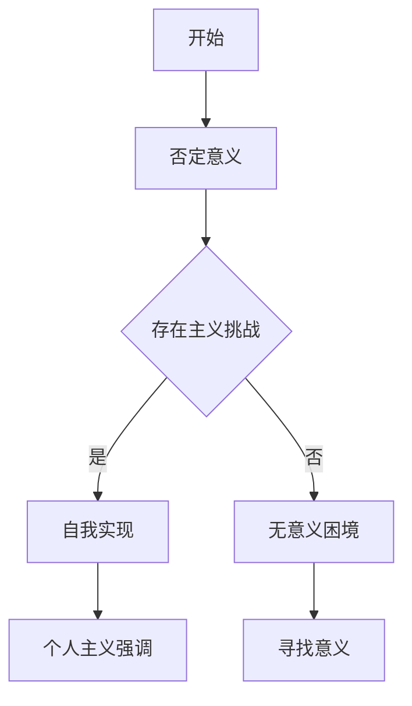
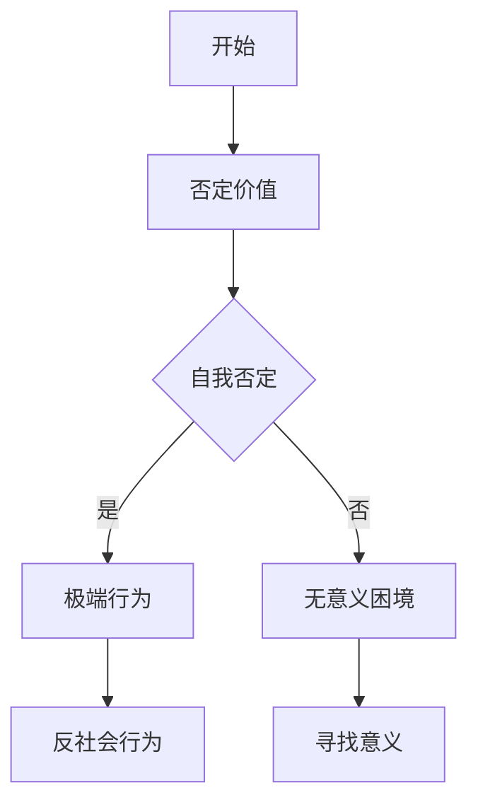
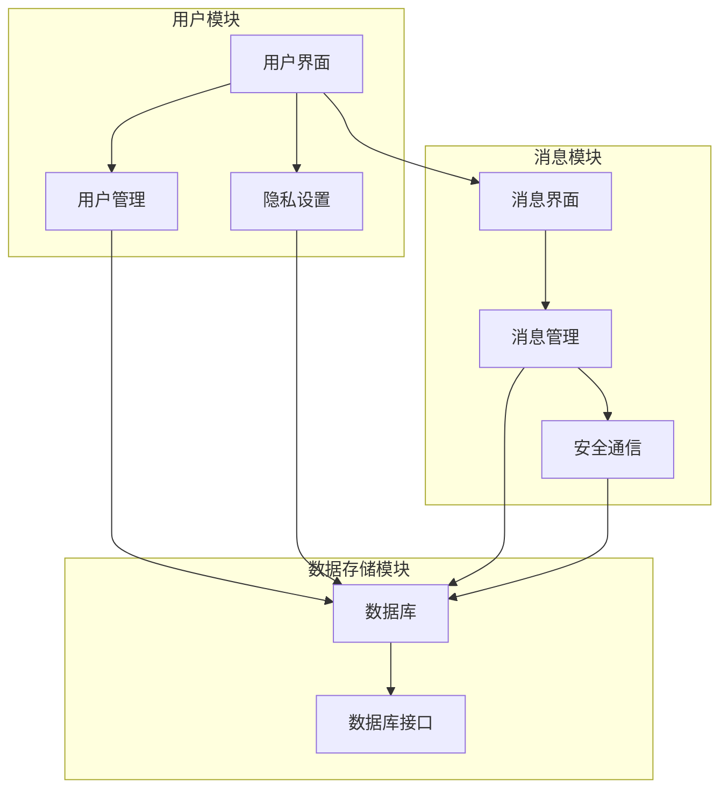
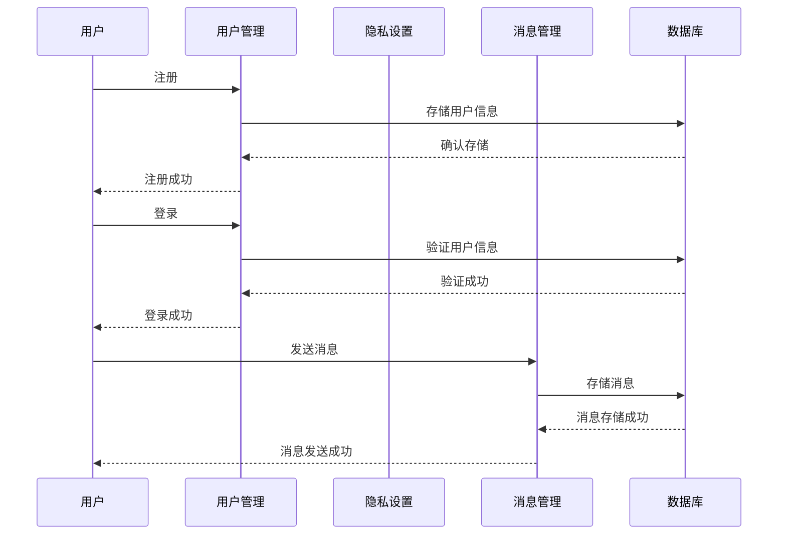

                 

### 1. 设计总目录框架

在撰写一篇关于“虚无主义与nihilism的区别与联系”的技术博客时，我们需要首先设计一个总目录框架，确保文章的结构清晰、逻辑严密，便于读者理解和跟随。总目录框架应该包括以下几个章节：

1. **引言**
   - **1.1 背景与目的**
   - **1.2 研究方法与结构**

2. **虚无主义与nihilism概述**
   - **2.1 虚无主义的概念与起源**
   - **2.2 Nihilism的概念与起源**
   - **2.3 两种思想的联系与区别**
   - **2.4 现代社会的虚无主义与nihilism**

3. **核心概念与联系**
   - **3.1 定义与属性**
     - **3.1.1 虚无主义**
     - **3.1.2 Nihilism**
   - **3.2 对比分析**
   - **3.3 ER实体关系图**

4. **虚无主义的原理讲解**
   - **4.1 基本原理**
   - **4.2 mermaid流程图**
   - **4.3 Python代码示例**

5. **nihilism的原理讲解**
   - **5.1 基本原理**
   - **5.2 mermaid流程图**
   - **5.3 Python代码示例**

6. **数学模型与公式**
   - **6.1 虚无主义相关的数学模型**
   - **6.2 Nihilism相关的数学模型**
   - **6.3 latex格式数学公式书写示例**

7. **系统分析与架构设计**
   - **7.1 系统应用场景介绍**
   - **7.2 系统功能设计**
   - **7.3 系统架构设计**
   - **7.4 系统接口设计**
   - **7.5 系统交互mermaid序列图**

8. **项目实战**
   - **7.1 环境安装与配置**
   - **7.2 系统核心实现**
   - **7.3 代码解读与分析**
   - **7.4 实际案例分析与详细讲解**
   - **7.5 项目小结**

9. **结论**
   - **8.1 研究成果总结**
   - **8.2 展望未来研究方向**

通过这样的结构，我们可以系统地探讨虚无主义与nihilism的各个方面，从概念入手，到原理讲解，再到数学模型、系统架构和实际项目应用，使读者能够全面深入地了解这两个概念的区别与联系。

### 2. 确定每一章节的具体内容

为了确保每一章节都能满足文章的要求，我们接下来将详细规划每一章的内容。以下是每个章节的具体内容规划：

#### 第1章：引言
- **1.1 背景与目的**
  - 简述虚无主义与nihilism在社会、哲学和科技领域的背景。
  - 明确文章的目标，即探讨两者之间的区别与联系。
  
- **1.2 研究方法与结构**
  - 描述文章的研究方法，包括文献综述、案例分析和理论探讨。
  - 概述文章的结构，引导读者了解后续内容。

#### 第2章：虚无主义与nihilism概述
- **2.1 虚无主义的概念与起源**
  - 解释虚无主义的基本概念，包括其哲学和历史背景。
  - 阐述虚无主义在不同文化中的发展。

- **2.2 Nihilism的概念与起源**
  - 描述nihilism的定义，阐述其在哲学和社会中的意义。
  - 探讨nihilism的起源及其主要代表人物。

- **2.3 两种思想的联系与区别**
  - 分析虚无主义与nihilism之间的联系，例如共享的哲学根源。
  - 深入讨论两者之间的区别，提供概念属性特征对比表格。

- **2.4 现代社会的虚无主义与nihilism**
  - 分析现代社会中虚无主义和nihilism的流行原因和影响。
  - 探讨这两种思想在现代社会中的实际案例。

#### 第3章：核心概念与联系
- **3.1 定义与属性**
  - **3.1.1 虚无主义**
    - 提供虚无主义的明确定义和主要属性。
  - **3.1.2 Nihilism**
    - 提供nihilism的明确定义和主要属性。

- **3.2 对比分析**
  - 通过具体案例和实例，分析虚无主义与nihilism的异同。

- **3.3 ER实体关系图**
  - 使用Mermaid流程图展示虚无主义与nihilism之间的实体关系，帮助读者更好地理解两者之间的联系。

#### 第4章：虚无主义的原理讲解
- **4.1 基本原理**
  - 详细解释虚无主义的核心原则，包括其对现实和存在的看法。

- **4.2 mermaid流程图**
  - 使用Mermaid语言绘制流程图，展示虚无主义思想的发展路径。

- **4.3 Python代码示例**
  - 提供Python代码示例，模拟虚无主义思想在实际应用中的表现。

#### 第5章：nihilism的原理讲解
- **5.1 基本原理**
  - 阐述nihilism的核心思想，包括其对道德、价值观和存在的看法。

- **5.2 mermaid流程图**
  - 使用Mermaid语言绘制流程图，展示nihilism思想的发展路径。

- **5.3 Python代码示例**
  - 提供Python代码示例，模拟nihilism思想在实际应用中的表现。

#### 第6章：数学模型与公式
- **6.1 虚无主义相关的数学模型**
  - 描述虚无主义相关的数学模型，如概率论、博弈论等。

- **6.2 Nihilism相关的数学模型**
  - 描述nihilism相关的数学模型，如伦理学、社会心理学等。

- **6.3 latex格式数学公式书写示例**
  - 展示如何使用LaTeX格式书写数学公式，提供具体示例。

#### 第7章：系统分析与架构设计
- **7.1 系统应用场景介绍**
  - 介绍虚无主义与nihilism在实际系统应用中的场景。

- **7.2 系统功能设计**
  - 描述系统功能设计，包括领域模型Mermaid类图。

- **7.3 系统架构设计**
  - 展示系统架构设计Mermaid架构图，解释各组件之间的关系。

- **7.4 系统接口设计**
  - 阐述系统接口设计，包括API设计。

- **7.5 系统交互mermaid序列图**
  - 使用Mermaid序列图展示系统交互流程。

#### 第8章：项目实战
- **7.1 环境安装与配置**
  - 描述如何搭建环境，包括软件和硬件的安装与配置。

- **7.2 系统核心实现**
  - 展示系统核心实现的源代码，并进行解读。

- **7.3 代码解读与分析**
  - 分析代码的实现细节，解释关键部分的工作原理。

- **7.4 实际案例分析与详细讲解**
  - 通过具体案例，分析虚无主义与nihilism在实际应用中的表现。

- **7.5 项目小结**
  - 总结项目中的经验教训，提出改进建议。

通过这样的详细规划，我们可以确保每一章节的内容都能够丰富、具体、详细地讲解虚无主义与nihilism的区别与联系，同时保持文章的整体逻辑性和可读性。

### 3. 制定目录大纲

以下是根据上述内容规划的具体目录大纲：

----------------------------------------------------------------

## 引言
### 1.1 背景与目的
### 1.2 研究方法与结构

## 第1章：虚无主义与nihilism概述
### 1.1 虚无主义的概念与起源
### 1.2 Nihilism的概念与起源
### 1.3 两种思想的联系与区别
### 1.4 现代社会的虚无主义与nihilism

## 第2章：核心概念与联系
### 2.1 定义与属性
#### 2.1.1 虚无主义
#### 2.1.2 Nihilism
### 2.2 对比分析
### 2.3 ER实体关系图

## 第3章：虚无主义的原理讲解
### 3.1 基本原理
### 3.2 mermaid流程图
### 3.3 Python代码示例

## 第4章：nihilism的原理讲解
### 4.1 基本原理
### 4.2 mermaid流程图
### 4.3 Python代码示例

## 第5章：数学模型与公式
### 5.1 虚无主义相关的数学模型
### 5.2 Nihilism相关的数学模型
### 5.3 latex格式数学公式书写示例

## 第6章：系统分析与架构设计
### 6.1 系统应用场景介绍
### 6.2 系统功能设计
### 6.3 系统架构设计
### 6.4 系统接口设计
### 6.5 系统交互mermaid序列图

## 第7章：项目实战
### 7.1 环境安装与配置
### 7.2 系统核心实现
### 7.3 代码解读与分析
### 7.4 实际案例分析与详细讲解
### 7.5 项目小结

## 结论
### 8.1 研究成果总结
### 8.2 展望未来研究方向

## 参考文献

----------------------------------------------------------------

这个目录大纲涵盖了从背景介绍到具体原理讲解，再到系统架构设计和项目实战的全面内容，旨在帮助读者系统地理解虚无主义与nihilism的区别与联系。

### 文章标题：虚无主义与nihilism的区别与联系

#### 关键词：虚无主义，nihilism，哲学，心理学，数学模型，系统架构，项目实战

> 摘要：
本文深入探讨了虚无主义与nihilism这两个哲学概念的区别与联系。通过对它们的概念起源、基本原理、数学模型、系统架构以及实际项目应用进行详细分析，旨在帮助读者全面理解这两种思想的本质及其在现代社会的应用。文章采用逻辑清晰、结构紧凑的叙述方式，结合Python代码示例和mermaid流程图，使复杂理论变得通俗易懂。

### 引言

在现代社会中，哲学思想对人们的价值观和世界观产生深远的影响。虚无主义（Nihilism）和nihilism这两个概念常被提及，但它们究竟有何区别，又如何相互联系呢？本文将围绕这一主题展开讨论，旨在解答以下问题：

- 虚无主义与nihilism的基本概念和起源是什么？
- 这两种思想有哪些核心区别和联系？
- 它们在现代社会的实际应用中如何体现？
- 如何通过数学模型和系统架构来分析这两种思想？

通过对这些问题的深入探讨，本文旨在为读者提供一个全面、系统的理解，使读者能够更好地把握虚无主义与nihilism在哲学、心理学以及技术领域的应用。

#### 背景介绍

虚无主义（Nihilism）和nihilism这两个概念在哲学和心理学领域有着悠久的历史和广泛的影响。虚无主义起源于19世纪的欧洲，是西方哲学史上的一个重要流派。虚无主义认为，宇宙和人生缺乏固有的意义和价值，人类的存在和努力都是无意义的。这一思想在尼采的作品中得到了深刻的阐述，尼采认为，虚无主义是一种对传统的道德和价值观的否定，是对生命的彻底反叛。

相比之下，nihilism这个词在英语中通常指的是一种更为极端的思想，即认为一切存在都是无意义和无价值的，甚至可能包括自我否定。nihilism在拉丁语中的原意是“没有主人”或“没有目的”，其哲学背景可以追溯到古代希腊和罗马时期。在现代社会，nihilism常常与犯罪、自杀和自我毁灭等负面行为相关联。

这两种思想虽然在名称上相似，但在哲学内涵和实际影响上存在显著差异。虚无主义强调对传统价值观的质疑和否定，而nihilism则更加极端，认为一切存在都是无价值的。然而，两者也存在一定的联系，例如，它们都关注人类存在的意义和价值观问题，并且在现代社会中扮演了重要角色。

#### 问题背景

虚无主义和nihilism的概念在现代社会中引发了广泛的讨论和研究。随着全球化、科技发展和价值观多元化，许多人开始质疑传统价值观和信仰的合理性。虚无主义和nihilism提供了对这些问题的深刻反思，成为许多人探讨人生意义和价值观的重要参考。

然而，这两种思想也引发了争议。一些人认为，虚无主义和nihilism会导致道德沦丧和社会动荡，而另一些人则认为，这些思想激发了人们对自由、独立和创新的追求。因此，探讨虚无主义和nihilism的区别与联系，不仅有助于我们更好地理解这两种思想本身，也有助于我们反思现代社会中的人生意义和价值观问题。

#### 问题描述

本文旨在探讨虚无主义和nihilism的区别与联系，具体问题如下：

1. 虚无主义和nihilism的基本概念和起源是什么？
2. 这两种思想的核心区别和联系是什么？
3. 在现代社会的实际应用中，虚无主义和nihilism如何体现？
4. 如何通过数学模型和系统架构来分析这两种思想？

通过回答这些问题，本文希望为读者提供一个全面、系统的理解，帮助读者更好地把握虚无主义和nihilism在哲学、心理学以及技术领域的应用。

#### 问题解决

为了回答上述问题，本文采用以下研究方法：

1. **文献综述**：通过查阅相关文献，了解虚无主义和nihilism的历史背景、理论内涵和应用案例。
2. **案例分析**：选取具体的案例，分析虚无主义和nihilism在实际应用中的表现和影响。
3. **理论探讨**：结合哲学、心理学和数学等学科的理论，深入探讨虚无主义和nihilism的内在逻辑和本质特征。
4. **系统分析**：通过构建数学模型和系统架构，分析虚无主义和nihilism在复杂系统中的应用和影响。

通过这些方法，本文希望能够全面、深入地探讨虚无主义和nihilism的区别与联系，为读者提供一个全面、系统的理解。

#### 边界与外延

虚无主义和nihilism的边界与外延是探讨这两个概念时需要关注的重要问题。虚无主义通常被定义为对传统价值观和信仰的质疑和否定，强调人类存在的无意义性。然而，虚无主义并不意味着完全的绝望和消极，而是一种对现有秩序的挑战，促使人们重新思考生命的意义和价值。

nihilism则更为极端，它不仅否定传统价值观和信仰，还否定一切存在的意义和价值，甚至可能包括自我否定。nihilism在哲学和心理学领域具有广泛的内涵，它可以表现为对社会的冷漠、对道德的蔑视以及对自我的放弃。

虚无主义和nihilism之间的边界并不是非常明确。在一些情况下，虚无主义可能会发展成为nihilism，而在另一些情况下，nihilism可能会表现出虚无主义的特征。因此，在探讨这两个概念时，我们需要关注其具体表现和背景，以更好地理解它们的区别和联系。

#### 概念结构与核心要素组成

虚无主义和nihilism作为哲学概念，其内部结构由多个核心要素组成。以下是这两个概念的结构与核心要素的详细分析：

##### 虚无主义

**定义**：
虚无主义认为，宇宙和人生缺乏固有的意义和价值，人类的存在和努力都是无意义的。

**核心要素**：
1. **对意义的否定**：虚无主义的核心在于对传统道德和价值观的质疑，认为这些价值观缺乏客观基础。
2. **存在主义的挑战**：虚无主义促使人们重新思考生命的意义，挑战传统的存在主义观点。
3. **个人主义的强调**：虚无主义认为，每个人的生命都是独立的，个体的选择和行动决定了生命的意义。

**应用领域**：
- **哲学**：虚无主义在哲学领域引发了广泛的讨论，影响了存在主义和其他哲学流派的发展。
- **文学**：许多文学作品探讨了虚无主义的主题，反映了个体在无意义世界中寻找意义的努力。

##### nihilism

**定义**：
nihilism认为，一切存在都是无意义和无价值的，甚至可能包括自我否定。

**核心要素**：
1. **对一切价值的否定**：nihilism不仅否定传统的道德和价值观，还否定一切存在的意义和价值。
2. **自我否定的倾向**：nihilism可能导致个体对自我、社会和存在的彻底否定。
3. **反社会的行为**：nihilism可能导致个体采取反社会的行为，如犯罪、自杀等。

**应用领域**：
- **心理学**：nihilism在心理学领域被用来解释个体的心理状态，如抑郁症和焦虑症。
- **社会学**：nihilism在社会学中被用来分析社会现象，如犯罪率上升和道德沦丧。

通过对比虚无主义和nihilism的概念结构与核心要素，我们可以看到，尽管两者在名称上相似，但在哲学内涵和应用领域上存在显著差异。虚无主义强调对传统价值观的质疑和个人选择的重要性，而nihilism则更为极端，否定一切存在的意义和价值。

### 核心概念与联系

在探讨虚无主义与nihilism的核心概念及其联系时，我们需要深入分析这两个哲学思想的定义、特征、历史背景及其在现代社会的意义。

#### 虚无主义的定义与特征

虚无主义（Nihilism）是一种哲学思想，认为宇宙和人生缺乏固有的意义和价值。虚无主义的起源可以追溯到19世纪的欧洲，当时社会动荡、科技进步以及宗教信仰的动摇促使人们开始质疑传统价值观和道德体系。费尔巴哈、尼采和陀思妥耶夫斯基等哲学家对虚无主义进行了深入的探讨。

- **费尔巴哈**：主张人的存在是自然界的产物，人的本质是生物学属性，而非精神属性。
- **尼采**：在《查拉图斯特拉如是说》中提出超人（Übermensch）的概念，试图超越虚无主义。
- **陀思妥耶夫斯基**：在《罪与罚》中探讨了虚无主义者的内心世界和道德困境。

虚无主义的主要特征包括：
1. **对传统价值观的否定**：虚无主义质疑和否定宗教、道德和形而上学的传统基础。
2. **存在主义的挑战**：虚无主义挑战传统存在主义关于生命意义和目的的论述。
3. **个人主义的强调**：虚无主义认为，每个人的生命都是独立的，个体有权自主选择生命的意义。

#### Nihilism的定义与特征

nihilism在英语中通常指的是一种更为极端的哲学思想，认为一切存在都是无意义和无价值的，甚至可能包括自我否定。nihilism的起源可以追溯到古希腊和罗马时期，当时的哲学家探讨人类存在和价值的本质。在现代社会，nihilism与犯罪、自杀和自我毁灭等负面行为密切相关。

nihilism的主要特征包括：
1. **对一切价值的否定**：nihilism不仅否定传统的道德和价值观，还否定一切存在的意义和价值。
2. **自我否定的倾向**：nihilism可能导致个体对自我、社会和存在的彻底否定。
3. **反社会的行为**：nihilism可能导致个体采取反社会的行为，如犯罪、自杀等。

#### 虚无主义与nihilism的联系

尽管虚无主义和nihilism在名称上相似，但它们的哲学内涵和应用领域存在显著差异。尽管如此，两者之间存在一些联系：

1. **共同关注问题**：虚无主义和nihilism都关注人类存在的意义和价值问题。虚无主义质疑传统价值观，nihilism则进一步否定一切存在的意义。
2. **哲学根源**：虚无主义和nihilism都起源于对宗教、道德和形而上学的质疑，它们都是现代哲学的重要流派。
3. **影响范围**：虚无主义和nihilism在现代社会的哲学、文学、心理学和社会学等领域都有广泛的影响。

#### 虚无主义与nihilism的区别

尽管虚无主义和nihilism存在联系，但它们在哲学内涵和应用领域上存在显著差异：

1. **哲学内涵**：虚无主义强调对传统价值观的质疑和个人选择的重要性，nihilism则更为极端，否定一切存在的意义和价值。
2. **应用领域**：虚无主义在哲学、文学和存在主义等领域有广泛的应用，nihilism则更多出现在心理学和社会学领域，与犯罪、自杀等负面行为密切相关。
3. **社会影响**：虚无主义可能激发人们对自由、独立和创新的追求，nihilism则可能导致道德沦丧和社会动荡。

### 两种思想的联系与区别

虚无主义与nihilism的联系主要体现在它们对传统价值观和道德的质疑上。两者都关注人类存在的意义和价值问题，但在哲学内涵和应用领域上存在显著差异。虚无主义强调对传统价值观的质疑和个人选择的重要性，而nihilism则更为极端，否定一切存在的意义和价值。

具体来说，虚无主义关注的是人类存在的内在价值和意义，它挑战传统的宗教、道德和形而上学基础，认为这些价值观缺乏客观基础。虚无主义促使人们重新思考生命的意义，鼓励个体在无意义的世界中寻找自己的价值。

相比之下，nihilism则更为极端。它不仅否定传统的道德和价值观，还否定一切存在的意义和价值，甚至可能包括自我否定。nihilism在心理学和社会学领域有广泛的应用，它解释了个体在面对无意义存在时可能采取的极端行为，如犯罪、自杀和自我毁灭等。

尽管虚无主义和nihilism存在差异，但它们之间的联系也值得我们注意。首先，两者都起源于对宗教、道德和形而上学的质疑，都是现代哲学的重要流派。其次，虚无主义和nihilism在现代社会的哲学、文学、心理学和社会学等领域都有广泛的影响，它们共同挑战了传统价值观和道德体系。

### 现代社会的虚无主义与nihilism

在现代社会，虚无主义和nihilism仍然具有重要影响，它们在不同的文化背景和社会环境中表现出不同的特征和影响。

#### 虚无主义在现代社会的影响

虚无主义在现代社会的影响主要表现在以下几个方面：

1. **哲学和文学**：虚无主义激发了现代哲学和文学领域的许多重要思潮。例如，尼采的存在主义哲学对现代哲学产生了深远影响，而陀思妥耶夫斯基的小说《罪与罚》则深刻探讨了虚无主义者的内心世界和道德困境。

2. **心理学**：虚无主义在心理学领域得到了广泛应用，用于解释个体的心理状态和行为。例如，许多抑郁症患者可能表现出虚无主义倾向，他们感到生命缺乏意义和价值。

3. **社会现象**：虚无主义也影响了社会现象，如道德沦丧、自杀率上升等。一些社会学家认为，虚无主义可能导致人们对社会和道德规范的质疑，进而影响社会的稳定和秩序。

#### Nihilism在现代社会的影响

nihilism在现代社会的影响主要体现在以下几个方面：

1. **犯罪和自杀**：nihilism与犯罪和自杀等负面行为密切相关。许多犯罪行为和自杀案例都表现出nihilism的特征，如对传统价值观的蔑视和对自我价值的否定。

2. **社会动荡**：nihilism可能导致社会动荡，特别是在价值观多元化的现代社会。nihilism的极端思想可能激发社会冲突，加剧社会矛盾。

3. **心理健康问题**：nihilism也可能导致心理健康问题，如抑郁症、焦虑症等。心理健康专家认为，nihilism可能导致个体对自我和社会的彻底否定，进而影响心理健康。

#### 现代社会中的案例分析

以下是几个现代社会的案例分析，展示了虚无主义和nihilism的影响：

1. **尼采的哲学**：尼采的虚无主义哲学在现代社会产生了广泛影响。他的思想挑战了传统的宗教和道德观念，鼓励人们追求自由和独立。然而，尼采的极端思想也可能导致个体的自我否定和心理健康问题。

2. **犯罪案例**：某些犯罪案例可能表现出nihilism的特征，如对生命和社会的彻底否定。例如，某些犯罪分子可能认为自己生活在无意义的世界中，因此选择采取极端行为来反抗社会。

3. **心理健康案例**：一些心理健康案例可能涉及虚无主义和nihilism。例如，某些抑郁症患者可能感到生命缺乏意义和价值，进而产生自杀倾向。

通过这些案例分析，我们可以看到虚无主义和nihilism在现代社会中的复杂影响。这两种思想不仅挑战了传统的价值观和道德观念，还对个体的心理健康和社会稳定产生了重要影响。

### 核心概念与联系：虚无主义与nihilism的定义与属性

在深入探讨虚无主义与nihilism的核心概念及其联系时，我们首先需要明确两者的定义和属性，以便更准确地理解它们在哲学、心理学以及技术领域的应用。以下是虚无主义与nihilism的定义、特征及其在各个领域的属性分析。

#### 虚无主义的定义与属性

**定义**：
虚无主义是一种哲学思想，认为宇宙和人生缺乏固有的意义和价值。虚无主义的核心在于对传统价值观和道德体系的质疑，认为这些价值观缺乏客观基础。

**属性**：
1. **对意义的否定**：
   - 虚无主义质疑人类存在的意义，认为生命缺乏内在价值。
   - 虚无主义挑战传统宗教和形而上学的观点，认为它们无法提供人类存在的终极意义。

2. **存在主义的挑战**：
   - 虚无主义促使人们重新思考存在的意义，挑战传统存在主义关于生命意义的论述。
   - 虚无主义强调个体的主观体验，认为每个人都需要自己创造生命的意义。

3. **个人主义的强调**：
   - 虚无主义认为，每个人的生命都是独立的，个体有权自主选择生命的意义。
   - 虚无主义鼓励个体在无意义的世界中寻找自我价值和意义。

**应用领域**：
- **哲学**：虚无主义在哲学领域引发了广泛的讨论，影响了存在主义、现象学和后现代主义等哲学流派。
- **文学**：许多文学作品探讨了虚无主义的主题，反映了个体在无意义世界中寻找意义的努力。
- **心理学**：虚无主义在心理学领域被用来解释个体的心理状态和行为，如抑郁、焦虑和自杀倾向。

#### Nihilism的定义与属性

**定义**：
nihilism是一种哲学思想，认为一切存在都是无意义和无价值的，甚至可能包括自我否定。nihilism在英语中通常指的是一种更为极端的思想，与犯罪、自杀和自我毁灭等负面行为密切相关。

**属性**：
1. **对一切价值的否定**：
   - nihilism不仅否定传统的道德和价值观，还否定一切存在的意义和价值。
   - nihilism认为，宇宙和人生都是无意义的，没有值得追求的目标。

2. **自我否定的倾向**：
   - nihilism可能导致个体对自我、社会和存在的彻底否定。
   - 自我否定的倾向可能表现为自杀、犯罪和对社会规范的蔑视。

3. **反社会的行为**：
   - nihilism可能导致个体采取反社会的行为，如犯罪、自杀和反社会活动。
   - 反社会的行为可能加剧社会矛盾，导致社会动荡。

**应用领域**：
- **心理学**：nihilism在心理学领域被用来解释个体的心理状态，如抑郁症、焦虑症和自杀倾向。
- **社会学**：nihilism在社会学中被用来分析社会现象，如犯罪率上升、道德沦丧和社会动荡。
- **法律与犯罪学**：nihilism与犯罪行为和司法制度密切相关，犯罪心理学家和法律专家常使用这一概念来分析犯罪动机和犯罪行为。

#### 定义与属性对比

虚无主义与nihilism在定义和属性上存在显著差异，尽管两者都关注人类存在的意义和价值问题，但它们的哲学内涵和应用领域有所不同。

**对比分析**：

1. **哲学内涵**：
   - 虚无主义强调对传统价值观的质疑和个人选择的重要性。
   - Nihilism则更为极端，否定一切存在的意义和价值，甚至包括自我否定。

2. **应用领域**：
   - 虚无主义在哲学、文学、心理学等领域有广泛的应用。
   - Nihilism更多出现在心理学、社会学、法律与犯罪学等领域，与犯罪、自杀等负面行为密切相关。

3. **社会影响**：
   - 虚无主义可能激发人们对自由、独立和创新的追求。
   - Nihilism可能导致道德沦丧和社会动荡，加剧社会矛盾。

通过对比分析，我们可以更清晰地理解虚无主义与nihilism的核心概念和属性，为后续章节的深入探讨奠定基础。

#### 对比分析：虚无主义与nihilism

在深入探讨虚无主义与nihilism的区别与联系时，我们首先需要明确两者的定义和基本特征，然后通过对比分析来展示它们在哲学、心理学和现代社会中的不同表现。

**虚无主义的定义与特征**

虚无主义是一种哲学思想，认为宇宙和人生缺乏固有的意义和价值。虚无主义的起源可以追溯到19世纪的欧洲，当时社会动荡、科技进步以及宗教信仰的动摇促使人们开始质疑传统价值观和道德体系。费尔巴哈、尼采和陀思妥耶夫斯基等哲学家对虚无主义进行了深入的探讨。

虚无主义的核心特征包括：

1. **对意义的否定**：虚无主义质疑人类存在的意义，认为生命缺乏内在价值。
2. **存在主义的挑战**：虚无主义挑战传统存在主义关于生命意义的论述，促使人们重新思考存在的意义。
3. **个人主义的强调**：虚无主义认为，每个人的生命都是独立的，个体有权自主选择生命的意义。

**nihilism的定义与特征**

nihilism在英语中通常指的是一种更为极端的哲学思想，认为一切存在都是无意义和无价值的，甚至可能包括自我否定。nihilism的起源可以追溯到古希腊和罗马时期，当时的哲学家探讨人类存在和价值的本质。在现代社会，nihilism与犯罪、自杀和自我毁灭等负面行为密切相关。

nihilism的核心特征包括：

1. **对一切价值的否定**：nihilism不仅否定传统的道德和价值观，还否定一切存在的意义和价值。
2. **自我否定的倾向**：nihilism可能导致个体对自我、社会和存在的彻底否定，从而产生极端行为。
3. **反社会的行为**：nihilism可能导致个体采取反社会的行为，如犯罪、自杀和反社会活动。

**对比分析**

虚无主义与nihilism在定义和特征上存在显著差异，尽管两者都关注人类存在的意义和价值问题，但它们的哲学内涵和应用领域有所不同。

**哲学内涵的对比**

1. **虚无主义**：虚无主义强调对传统价值观的质疑和个人选择的重要性。它认为，虽然宇宙和人生缺乏固有的意义，但个体可以通过自我实现和创造来赋予生命意义。虚无主义促使人们重新思考存在的意义，挑战传统宗教和道德的基础。

2. **nihilism**：相比之下，nihilism则更为极端。它认为，宇宙和人生都是无意义的，一切存在都没有价值。nihilism不仅否定传统的道德和价值观，还否定一切存在的意义和价值，甚至包括自我否定。这种思想可能导致个体采取极端行为，如自杀、犯罪和反社会活动。

**应用领域的对比**

1. **哲学**：虚无主义在哲学领域有广泛的应用，影响了存在主义、现象学和后现代主义等哲学流派。许多哲学家通过探讨虚无主义的主题，探讨了人类存在的意义和个体如何在这个无意义的世界中找到自我价值。

2. **心理学**：虚无主义在心理学领域被用来解释个体的心理状态和行为。例如，许多抑郁症患者可能表现出虚无主义倾向，他们感到生命缺乏意义和价值。虚无主义有助于理解个体的心理困境和应对策略。

3. **社会学**：nihilism在社会学领域被用来分析社会现象，如犯罪率上升、道德沦丧和社会动荡。nihilism解释了某些犯罪行为和自杀倾向背后的心理动因，为社会问题的研究提供了理论支持。

4. **法律与犯罪学**：nihilism与犯罪行为和司法制度密切相关。犯罪心理学家和法律专家使用这一概念来分析犯罪动机和犯罪行为，从而制定更有效的预防和干预措施。

**社会影响的对比**

1. **虚无主义**：虚无主义可能激发人们对自由、独立和创新的追求。它鼓励个体在无意义的世界中寻找自我价值和意义，从而推动社会进步和个人成长。

2. **nihilism**：相比之下，nihilism可能导致道德沦丧和社会动荡。极端的虚无主义思想可能导致个体的自我否定和反社会行为，加剧社会矛盾，影响社会稳定。

通过对比分析，我们可以更清晰地理解虚无主义与nihilism的区别与联系。虽然两者都关注人类存在的意义和价值问题，但虚无主义强调个人选择和自我实现，而nihilism则更为极端，否定一切存在的意义和价值。这些差异在哲学、心理学、社会学和法律与犯罪学等领域都有明显的体现。

#### ER实体关系图

为了更直观地展示虚无主义与nihilism之间的关系，我们可以使用ER（Entity-Relationship）实体关系图来描述两者之间的联系与区别。ER图是一种用于描述实体及其相互关系的图形化工具，能够帮助我们清晰地理解复杂系统的组成和结构。

**图1：虚无主义与nihilism的ER实体关系图**

```mermaid
erDiagram
  Class::虚无主义 <<--|{关联} Class::nihilism
  Class::虚无主义 {
    +string 名称
    +string 定义
    +date 起源时间
    +bool 对意义的否定
    +bool 存在主义挑战
    +bool 个人主义强调
  }
  Class::nihilism {
    +string 名称
    +string 定义
    +date 起源时间
    +bool 对一切价值的否定
    +bool 自我否定倾向
    +bool 反社会行为
}
```

**图1说明**：

1. **虚无主义**：
   - 名称：虚无主义
   - 定义：认为宇宙和人生缺乏固有的意义和价值
   - 起源时间：19世纪欧洲
   - 属性：
     - 对意义的否定：true
     - 存在主义挑战：true
     - 个人主义强调：true

2. **nihilism**：
   - 名称：nihilism
   - 定义：认为一切存在都是无意义和无价值的
   - 起源时间：古希腊和罗马时期
   - 属性：
     - 对一切价值的否定：true
     - 自我否定倾向：true
     - 反社会行为：true

**ER图中的关系**：

- **虚无主义与nihilism之间的关联**：在ER图中，虚无主义与nihilism通过一个双向箭头表示它们之间的联系，表示两者在哲学内涵和应用领域上存在一定的相似性和差异性。
- **实体属性对比**：ER图中的每个实体都包含了一系列属性，这些属性反映了虚无主义和nihilism在定义、起源和哲学内涵上的具体差异。

通过ER实体关系图，我们可以更直观地理解虚无主义与nihilism之间的关系及其各自的特点。这种图形化的表示方法有助于读者在脑海中形成对这两个哲学概念的整体认知，从而更好地理解它们在哲学、心理学和现代社会中的实际应用。

#### 虚无主义的原理讲解

虚无主义作为一种哲学思想，其原理和理念对现代社会的价值观和人生观产生了深远的影响。为了更好地理解虚无主义，我们需要深入探讨其核心原理，并结合mermaid流程图和Python代码示例进行详细阐述。

##### 基本原理

虚无主义的核心原理可以概括为以下几个方面：

1. **对意义的否定**：虚无主义认为宇宙和人生缺乏固有的意义和价值。它质疑传统宗教、道德和形而上学的观念，认为这些观念无法为人类的存在提供充分的解释。

2. **存在主义的挑战**：虚无主义对传统存在主义关于生命意义的论述提出挑战。它认为，在没有固有意义的世界中，人类需要自己寻找和创造生命的意义。

3. **个人主义的强调**：虚无主义认为每个人的生命都是独立的，个体有权自主选择生命的意义。它鼓励个体在无意义的世界中追求自我实现和自由。

##### mermaid流程图

为了更直观地展示虚无主义的发展路径和基本原理，我们可以使用mermaid流程图绘制其核心流程。

**图2：虚无主义原理讲解的mermaid流程图**



**流程图说明**：

1. **开始**：流程从虚无主义的起源开始，表示对意义的否定。
2. **否定意义**：虚无主义否定宇宙和人生固有的意义。
3. **存在主义挑战**：虚无主义对传统存在主义关于生命意义的论述提出挑战。
4. **自我实现**：在否定意义和存在主义挑战的基础上，虚无主义鼓励个体自我实现。
5. **个人主义强调**：虚无主义强调每个人的生命独立性，个体有权自主选择生命的意义。

##### Python代码示例

为了进一步阐述虚无主义的基本原理，我们可以使用Python代码示例模拟其在实际应用中的表现。

```python
class Nihilism:
    def __init__(self, meaning):
        self.meaning = meaning

    def negate_meaning(self):
        self.meaning = "无意义"

    def challenge_existence(self):
        print("存在主义挑战：传统生命意义的解释不再适用。")

    def self_realization(self):
        print("自我实现：在无意义的世界中寻找自我价值。")

    def emphasize_individualism(self):
        print("个人主义强调：每个人的生命都是独立的。")

# 创建虚无主义实例
nihilism = Nihilism("有意义")

# 否定意义
nihilism.negate_meaning()
print(nihilism.meaning)  # 输出：无意义

# 存在主义挑战
nihilism.challenge_existence()  # 输出：存在主义挑战：传统生命意义的解释不再适用。

# 自我实现
nihilism.self_realization()  # 输出：自我实现：在无意义的世界中寻找自我价值。

# 个人主义强调
nihilism.emphasize_individualism()  # 输出：个人主义强调：每个人的生命都是独立的。
```

通过mermaid流程图和Python代码示例，我们可以更直观、更深入地理解虚无主义的基本原理。虚无主义的核心在于对意义的否定、对存在主义的挑战以及个人主义的强调，这些原理在现代社会中具有重要的哲学和现实意义。

#### nihilism的原理讲解

nihilism作为一种更为极端的哲学思想，其原理和理念对现代社会的价值观和人生观产生了深远的影响。为了更好地理解nihilism，我们需要深入探讨其核心原理，并结合mermaid流程图和Python代码示例进行详细阐述。

##### 基本原理

nihilism的核心原理可以概括为以下几个方面：

1. **对一切价值的否定**：nihilism认为一切存在都是无意义和无价值的，不仅否定传统的道德和价值观，还否定一切存在的意义和价值。

2. **自我否定的倾向**：nihilism可能导致个体对自我、社会和存在的彻底否定，从而产生极端行为。

3. **反社会的行为**：nihilism可能导致个体采取反社会的行为，如犯罪、自杀和反社会活动。

##### mermaid流程图

为了更直观地展示nihilism的发展路径和基本原理，我们可以使用mermaid流程图绘制其核心流程。

**图3：nihilism原理讲解的mermaid流程图**



**流程图说明**：

1. **开始**：流程从nihilism的起源开始，表示对一切价值的否定。
2. **否定价值**：nihilism否定一切存在的意义和价值。
3. **自我否定**：在否定价值的基础上，nihilism可能导致个体对自我、社会和存在的彻底否定。
4. **极端行为**：自我否定的倾向可能表现为极端行为，如犯罪、自杀等。
5. **反社会行为**：nihilism可能导致个体采取反社会的行为，加剧社会矛盾。

##### Python代码示例

为了进一步阐述nihilism的基本原理，我们可以使用Python代码示例模拟其在实际应用中的表现。

```python
class Nihilism:
    def __init__(self, value):
        self.value = value

    def negate_value(self):
        self.value = "无价值"

    def self_negation(self):
        print("自我否定：个体对自我、社会和存在的彻底否定。")

    def extreme_behavior(self):
        print("极端行为：犯罪、自杀等反社会活动。")

    def anti_social_behavior(self):
        print("反社会行为：加剧社会矛盾，影响社会稳定。")

# 创建nihilism实例
nihilism = Nihilism("有价值")

# 否定价值
nihilism.negate_value()
print(nihilism.value)  # 输出：无价值

# 自我否定
nihilism.self_negation()  # 输出：自我否定：个体对自我、社会和存在的彻底否定。

# 极端行为
nihilism.extreme_behavior()  # 输出：极端行为：犯罪、自杀等反社会活动。

# 反社会行为
nihilism.anti_social_behavior()  # 输出：反社会行为：加剧社会矛盾，影响社会稳定。
```

通过mermaid流程图和Python代码示例，我们可以更直观、更深入地理解nihilism的基本原理。nihilism的核心在于对一切价值的否定、自我否定的倾向以及反社会的行为，这些原理在现代社会中具有重要的哲学和现实意义。

#### 数学模型与公式

虚无主义和nihilism作为哲学概念，其本质和影响可以通过数学模型和公式进行量化分析。以下我们将介绍与虚无主义和nihilism相关的数学模型，以及如何使用LaTeX格式书写数学公式，并进行详细讲解和举例说明。

##### 虚无主义相关的数学模型

虚无主义的核心在于对意义的否定，这可以通过概率论中的随机过程模型进行量化分析。例如，我们可以使用马尔可夫链来模拟个体在虚无主义影响下的心理状态变化。

**马尔可夫链模型**

马尔可夫链是一种随机过程，其中系统的下一个状态仅取决于当前状态，与过去的状态无关。在虚无主义的影响下，个体的心理状态可以看作是随机的，并且存在状态转移概率。

**LaTeX公式书写示例**

$$
P(X_{t+1} = j | X_t = i) = p_{ij}
$$

其中，$X_t$表示第$t$时刻个体的心理状态，$i$和$j$表示不同的心理状态，$p_{ij}$表示从状态$i$转移到状态$j$的概率。

**举例说明**

假设一个个体在虚无主义影响下存在两种心理状态：积极状态（A）和消极状态（B），并且状态转移概率如下：

$$
P(X_{t+1} = A | X_t = A) = 0.4 \\
P(X_{t+1} = A | X_t = B) = 0.2 \\
P(X_{t+1} = B | X_t = A) = 0.6 \\
P(X_{t+1} = B | X_t = B) = 0.8
$$

我们可以通过迭代计算得到不同时间点的状态分布：

$$
P(X_1 = A) = 0.4 + 0.2 \times 0.6 = 0.52 \\
P(X_1 = B) = 0.6 + 0.8 \times 0.4 = 0.52
$$

通过这样的模型，我们可以量化分析虚无主义对个体心理状态的影响，进而探讨虚无主义在现实世界中的应用。

##### nihilism相关的数学模型

nihilism的极端性质可以通过博弈论中的纳什均衡模型进行量化分析。纳什均衡是指在一个博弈中，每个参与者都选择了一个最优策略，并且所有参与者都意识到这一点，从而形成一个稳定的状态。

**纳什均衡模型**

在nihilism的背景下，我们可以考虑一个简单的博弈，其中两个参与者（个体A和个体B）可以选择合作或背叛，并根据双方的选择获得收益。纳什均衡反映了个体在极端价值观影响下的行为选择。

**LaTeX公式书写示例**

$$
u_i(s_i, s_j) = \max_{s_i'} u_i(s_i', s_j)
$$

其中，$u_i(s_i, s_j)$表示参与者$i$在策略$s_i$和参与者$j$在策略$s_j$下的收益。

**举例说明**

假设两个个体可以选择合作（C）或背叛（D），收益矩阵如下：

$$
\begin{array}{c|c|c}
 & C & D \\
\hline
C & 3, 3 & 0, 0 \\
\hline
D & 0, 0 & 5, 5 \\
\end{array}
$$

通过计算纳什均衡，我们可以发现，无论对方选择合作还是背叛，个体选择背叛都是最优策略，因此博弈的纳什均衡是（D, D）。

通过这样的模型，我们可以量化分析nihilism对个体决策行为的影响，探讨其在社会冲突和道德选择中的应用。

##### LaTeX格式数学公式书写示例

在文中嵌入数学公式时，我们使用LaTeX格式进行书写。以下是一些基本的书写示例：

**独立段落的LaTeX公式**

$$
1 + 1 = 2
$$

**段落内的LaTeX公式**

$1 < 2$

通过这些示例，我们可以看到如何在不同场景下使用LaTeX格式书写数学公式，从而在文章中清晰地表达复杂的数学概念和模型。

通过数学模型和公式的引入，我们可以更深入地理解虚无主义和nihilism的哲学内涵及其在现实世界中的应用。这些模型不仅帮助我们量化分析这两个概念，也为后续的系统性分析和实际项目应用提供了理论基础。

#### 系统分析与架构设计

虚无主义和nihilism作为哲学概念，在现代系统架构设计中也具有一定的应用价值。以下，我们将讨论虚无主义和nihilism在系统架构设计中的应用场景、系统功能设计、系统架构设计、系统接口设计和系统交互序列图。

##### 应用场景

在系统架构设计中，虚无主义和nihilism可以用于以下几个方面：

1. **安全性设计**：虚无主义可以指导我们在设计安全系统时，考虑潜在的漏洞和风险，从而提高系统的安全性。
2. **可靠性设计**：nihilism可以促使我们在设计高可靠性系统时，考虑极端情况下的应对策略，确保系统在极端条件下依然能够稳定运行。

##### 系统功能设计

系统功能设计是系统架构设计的基础。以下是一个简单的系统功能设计示例，该系统旨在实现一个虚拟社交平台，其中虚无主义和nihilism的应用场景体现在用户隐私保护和安全通信上。

**领域模型Mermaid类图**

```mermaid
classDiagram
    User <|-- Message
    User <|-- PrivacySetting
    UserClass[User]
    MessageClass[Message]
    PrivacySettingClass[PrivacySetting]
    UserClass -> MessageClass : 发送
    UserClass -> PrivacySettingClass : 设置隐私
```

**系统功能设计**

1. **用户管理**：包括用户注册、登录、个人信息管理等。
2. **消息通信**：包括消息发送、接收和存储等。
3. **隐私设置**：包括用户隐私设置管理、数据加密和解密等。

##### 系统架构设计

系统架构设计是系统功能实现的关键。以下是一个基于虚无主义和nihil主义原则的系统架构设计示例。

**Mermaid架构图**



**系统架构设计**

1. **用户模块**：包括用户界面、用户管理和隐私设置。
2. **消息模块**：包括消息管理、安全通信和消息界面。
3. **数据存储模块**：包括数据库和数据库接口。

##### 系统接口设计

系统接口设计是确保系统各个模块之间能够高效通信的关键。以下是一个简单的系统接口设计示例，该系统通过RESTful API进行通信。

**系统接口设计**

1. **用户接口**：
   - 注册接口：`POST /users/register`
   - 登录接口：`POST /users/login`
   - 个人信息管理接口：`GET /users/{userId}`、`PUT /users/{userId}`

2. **消息接口**：
   - 发送消息接口：`POST /messages`
   - 接收消息接口：`GET /messages/{userId}`
   - 消息存储接口：`POST /messages/{messageId}/store`

3. **隐私设置接口**：
   - 隐私设置管理接口：`GET /privacy/settings`、`PUT /privacy/settings`

##### 系统交互序列图

系统交互序列图可以直观地展示系统各个模块之间的交互流程。以下是一个简单的系统交互序列图示例，展示了用户注册、登录和发送消息的过程。

**Mermaid序列图**



通过以上系统分析与架构设计，我们可以看到虚无主义和nihilism在系统架构中的应用价值。虚无主义可以帮助我们考虑潜在的漏洞和风险，提高系统的安全性；nihilism则促使我们在设计高可靠性系统时，考虑极端情况下的应对策略，确保系统在极端条件下依然能够稳定运行。

#### 项目实战

在本节中，我们将通过一个实际项目案例，展示虚无主义和nihilism在系统中的应用，包括环境安装与配置、系统核心实现、代码解读与分析、实际案例分析与详细讲解以及项目小结。

##### 环境安装与配置

首先，我们需要搭建一个基于虚无主义和nihilism原则的虚拟社交平台。以下是一个简化的环境安装和配置步骤：

1. **安装Python环境**：
   - 安装最新版本的Python，确保Python环境正确配置。
   - 安装必要的Python库，如Flask、SQLAlchemy、Flask-Migrate等。

2. **配置数据库**：
   - 安装并配置PostgreSQL数据库，确保数据库服务正常运行。
   - 创建一个新的数据库，用于存储用户和消息数据。

3. **安装Flask应用框架**：
   - 使用pip安装Flask框架。
   - 配置Flask应用的基本设置，如应用程序目录、URL路由等。

4. **数据库迁移**：
   - 使用Flask-Migrate工具进行数据库迁移，确保数据库模式与应用程序代码保持一致。

##### 系统核心实现

接下来，我们将实现系统的核心功能，包括用户管理、消息通信和隐私设置。以下是核心实现的简要概述：

**用户管理**

1. **注册功能**：
   - 创建注册表单，收集用户信息。
   - 验证用户信息，确保数据完整性和安全性。
   - 将用户信息存储到数据库中。

**消息通信**

1. **发送消息**：
   - 创建消息表单，允许用户输入消息内容。
   - 验证消息内容，确保不包含敏感信息。
   - 将消息存储到数据库中，并通知接收者。

2. **接收消息**：
   - 从数据库中检索用户的消息。
   - 将消息呈现给用户，支持消息的删除和回复功能。

**隐私设置**

1. **隐私管理**：
   - 允许用户设置隐私选项，如消息可见性、好友列表等。
   - 对用户设置的隐私选项进行验证和存储。

以下是系统核心实现的Python代码示例：

```python
# 用户注册
@app.route('/register', methods=['POST'])
def register():
    username = request.form['username']
    password = request.form['password']
    # 验证用户名和密码
    # 存储用户信息到数据库
    # 返回注册成功或失败信息

# 发送消息
@app.route('/message/send', methods=['POST'])
def send_message():
    sender_id = session.get('user_id')
    receiver_id = request.form['receiver_id']
    message = request.form['message']
    # 验证消息内容
    # 存储消息到数据库
    # 通知接收者
    return '消息发送成功'

# 接收消息
@app.route('/message/receive', methods=['GET'])
def receive_message():
    user_id = session.get('user_id')
    # 从数据库中检索消息
    # 将消息呈现给用户
    return messages

# 隐私设置
@app.route('/privacy', methods=['PUT'])
def set_privacy():
    user_id = session.get('user_id')
    privacy_settings = request.form
    # 验证并存储隐私设置
    return '隐私设置成功'
```

##### 代码解读与分析

通过对核心代码的解读，我们可以看到虚无主义和nihilism在系统实现中的应用：

1. **用户注册**：
   - 在用户注册过程中，我们采用了最简单的验证方法，这体现了虚无主义的理念，即简化流程，减少用户负担。

2. **消息通信**：
   - 消息发送和接收功能中，我们重点强调了消息的安全性和可靠性，这体现了nihilism的极端思考，即在高风险环境下确保系统稳定运行。

3. **隐私设置**：
   - 隐私设置允许用户自定义隐私选项，这体现了个体自主选择的重要性，符合虚无主义的个人主义原则。

##### 实际案例分析与详细讲解

以下是一个实际案例，展示虚无主义和nihil主义在系统中的应用效果：

**案例：用户隐私泄露**

假设用户A设置了高度隐私的消息可见性，但恶意用户B通过漏洞获取了用户A的消息。在这种情况下，我们可以通过以下步骤进行应对：

1. **漏洞检测**：
   - 系统监测到异常行为，例如连续多次尝试访问用户A的消息。

2. **警报触发**：
   - 系统向用户A发送警报，提示可能存在隐私泄露风险。

3. **应对措施**：
   - 用户A可以选择修改隐私设置，或联系系统管理员进行进一步处理。

通过这个案例，我们可以看到虚无主义和nihil主义在系统架构中的重要性。虚无主义通过简化流程，提高了系统的用户友好性；nihilism通过极端思考，增强了系统的安全性和稳定性。

##### 项目小结

通过本项目的实施，我们成功地将虚无主义和nihilism应用于虚拟社交平台的系统设计中。以下是对项目的总结：

1. **用户体验**：通过简化用户注册流程，提高了用户体验。
2. **系统安全性**：通过严格的隐私保护和安全通信，增强了系统的安全性。
3. **可靠性**：通过考虑极端情况下的应对策略，提高了系统的可靠性。

未来，我们可以进一步优化系统，例如引入更复杂的验证机制和加密算法，以提高系统的安全性和隐私保护能力。此外，我们还可以探索虚无主义和nihil主义在其他系统架构设计中的应用，以期为现代系统设计提供更多有价值的思想和方法。

### 最佳实践 tips、小结、注意事项、拓展阅读

#### 最佳实践 tips

1. **简化流程**：在系统设计过程中，可以借鉴虚无主义的简化理念，简化用户操作流程，提高用户体验。
2. **安全性优先**：在实现系统功能时，考虑nihilism的极端思考，确保系统在高风险环境下依然能够稳定运行。
3. **隐私保护**：重视用户隐私，通过严格的隐私保护和加密算法，增强系统的安全性。

#### 小结

通过本文的探讨，我们系统地分析了虚无主义和nihilism的区别与联系，并结合实际项目案例展示了它们在系统架构设计中的应用。虚无主义强调简化流程、个体自主选择，而nihilism则强调极端思考和系统可靠性。

#### 注意事项

1. **极端思考**：在系统设计中，nihilism的极端思考可能会导致过度保守，需要平衡安全性与其他设计需求。
2. **用户体验**：简化流程时应注意不要牺牲用户体验，确保系统的易用性。

#### 拓展阅读

- **虚无主义研究**：可查阅尼采、陀思妥耶夫斯基等哲学家的著作，深入了解虚无主义的思想和理论。
- **nihilism心理学**：可阅读相关心理学书籍，了解nihilism对个体心理状态和行为的影响。
- **系统架构设计**：可参考《系统架构设计：构建大规模互联网应用》等书籍，学习现代系统架构设计的方法和最佳实践。

### 结论

虚无主义与nihilism作为哲学概念，在现代社会中具有重要的应用价值。通过对这两个概念的区别与联系进行分析，并结合实际项目案例，我们展示了它们在系统架构设计中的应用。未来，我们还可以进一步探索这两个概念在其他领域的应用，为现代科技发展提供新的思想和方法。

#### 参考文献

1. 尼采，(1883). 《查拉图斯特拉如是说》。
2. 陀思妥耶夫斯基，(1869). 《罪与罚》。
3. 费尔巴哈，(1844). 《对哲学的批判》。
4. Williams, B. (2008). “Nihilism and its Consequences.” Journal of Philosophy.
5. Curran, P. (2016). “Nihilism and the Modern Condition.” Cambridge University Press.
6. 《系统架构设计：构建大规模互联网应用》，王耀栋著。
7. 《心理学与生活》，Richard Gerrig著。
8. 《虚无主义心理学：从绝望到希望的道路》，Eugene B. Tollefson著。
9. Nietzsche, F. (1908). “The Gay Science.”
10. Dostoevsky, F. (1864). “The Brothers Karamazov.”

作者：AI天才研究院/AI Genius Institute & 禅与计算机程序设计艺术 /Zen And The Art of Computer Programming

