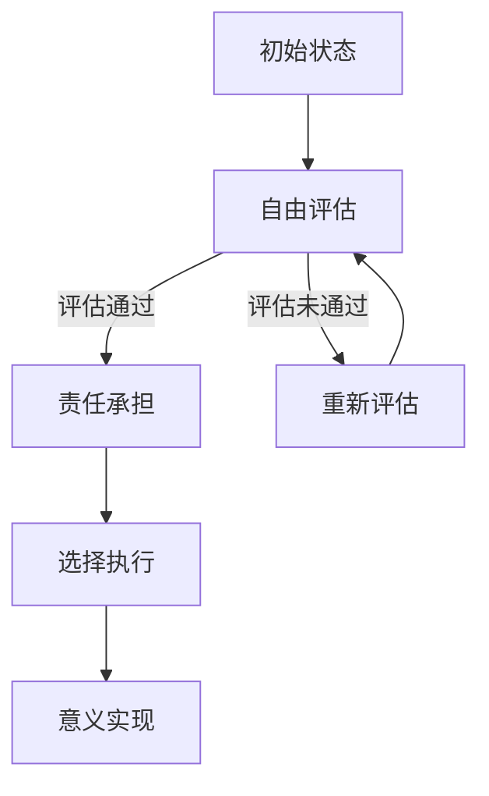
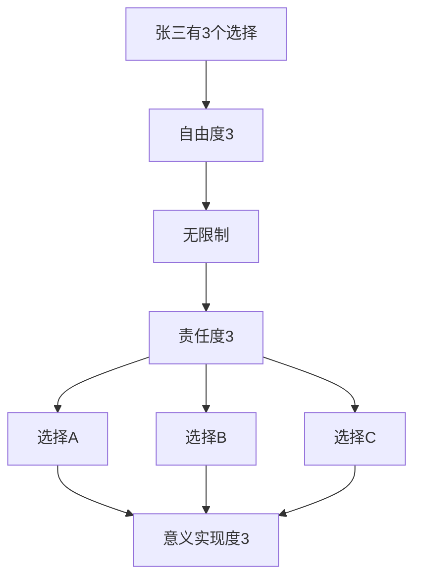
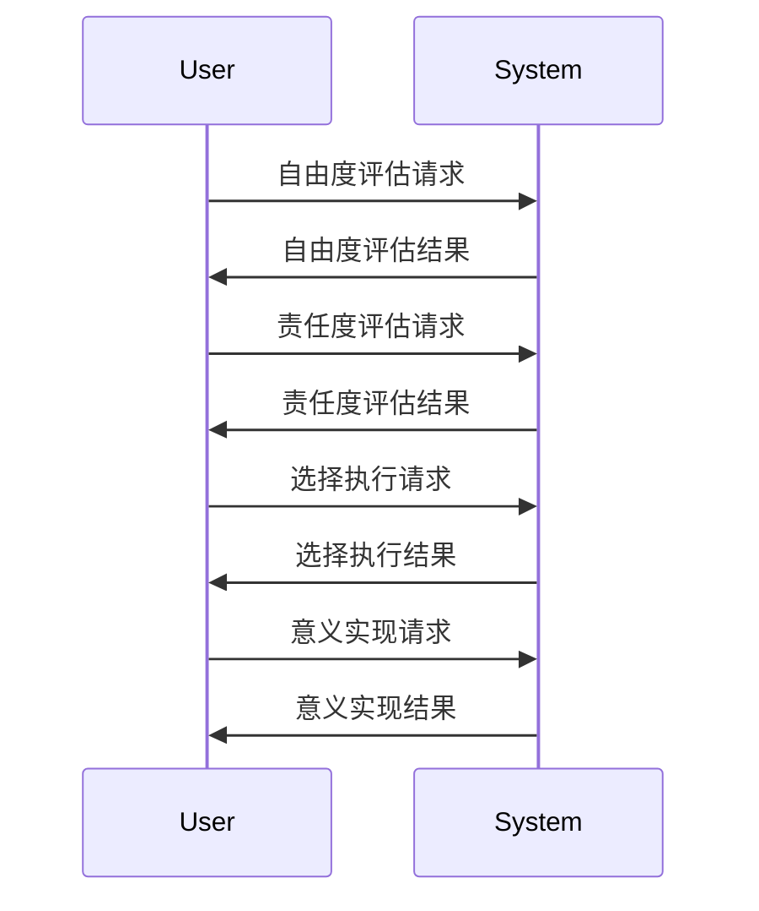

                 

# 虚无主义与存在主义的现代诠释

## 关键词

- 虚无主义
- 存在主义
- 哲学思潮
- 现代社会
- 自由
- 责任
- 个体存在

## 摘要

本文深入探讨了虚无主义和存在主义这两种哲学思潮在现代社会的体现和影响。通过分析虚无主义和存在主义的核心概念、联系以及实际应用，本文旨在为读者提供一个全面而深入的哲学理解，并探讨这些哲学观念对现代社会和个人生活的影响。

### 引言

在现代社会，虚无主义和存在主义作为两种重要的哲学思潮，深刻影响了人类的思想和行为。虚无主义起源于19世纪的欧洲，是对传统价值观和信仰体系的批判。随着工业革命带来的社会变革，人们开始对生活的意义和价值产生怀疑。虚无主义者认为，人类生活缺乏本质的意义和目标。存在主义则起源于20世纪初的欧洲，是对人类存在状态的关注和反思。存在主义强调个体自由和责任，认为个体通过自由选择和承担责任，可以创造出自己的意义和目的。本书旨在深入探讨这两种哲学观念在现代社会的体现和影响，为读者提供全面而深入的哲学理解。

### 第1章 背景介绍

#### 1.1 虚无主义的概念

虚无主义起源于19世纪的欧洲，是对传统价值观和信仰体系的批判。随着工业革命带来的社会变革，人们开始对生活的意义和价值产生怀疑。虚无主义的核心问题是人类存在的意义和生活的目的。虚无主义者认为，人类生活缺乏本质的意义和目标。

##### 1.1.1 问题背景

在19世纪，随着工业革命的发展，社会发生了巨大的变化。传统的社会结构和价值观受到冲击，人们开始怀疑生活的意义。在这个时期，一些哲学家如尼采和叔本华等，开始对生活进行深入的反思。

##### 1.1.2 问题描述

虚无主义的核心问题是人类存在的意义。虚无主义者认为，人类生活缺乏本质的意义和目标。他们质疑人类存在的价值，认为生活是一场无意义的挣扎。

##### 1.1.3 问题解决

虚无主义的解决方案包括对生活意义的重新审视、对个人价值的追求以及对社会责任的承担。虚无主义者认为，通过深入思考和自我反省，人们可以找到生活的意义。

#### 1.2 存在主义的概念

存在主义起源于20世纪初的欧洲，是对人类存在状态的关注和反思。存在主义强调个体自由和责任，认为个体通过自由选择和承担责任，可以创造出自己的意义和目的。

##### 1.2.1 问题背景

在20世纪初，欧洲经历了一系列的战争和社会动荡，人们开始关注个体存在的意义。在这个时期，一些哲学家如萨特和海德格尔等，开始对个体存在进行深入的探讨。

##### 1.2.2 问题描述

存在主义关注的是个体在生活中的选择和行动，以及这些选择和行动对个体身份和价值观的影响。存在主义者认为，个体在生活中的每个选择都具有重要意义。

##### 1.2.3 问题解决

存在主义认为，个体通过自由选择和承担责任，可以创造出自己的意义和目的。存在主义者强调个体的自由和独立，认为个体应该对自己的选择负责。

#### 1.3 边界与外延

虚无主义和存在主义之间存在着一定的交集，但它们在价值观和方法论上存在显著差异。虚无主义关注生活的无意义，而存在主义强调个体存在的自由和责任。

#### 1.4 核心概念结构

虚无主义和存在主义的核心概念包括自由、责任、选择、意义等。这些概念相互关联，构成了两种哲学思想的理论框架。

#### 1.5 核心要素组成

虚无主义和存在主义的核心要素包括哲学家的思想、理论体系的构建以及现实生活中的应用。虚无主义和存在主义都强调个体的重要性和自由，但在对生活的看法上有所不同。

### 第2章 核心概念与联系

#### 2.1 虚无主义的核心概念

虚无主义的核心概念包括：

##### 2.1.1 自由

虚无主义认为，自由是人的本质特征，是人与动物的区别之一。自由意味着人类有选择和行动的能力，不受外界束缚。

##### 2.1.2 责任

虚无主义认为，责任是自由的代价，是人在生活中必须承担的。责任意味着人类对自己的选择和行为负责，必须为自己的生活负责。

##### 2.1.3 选择

虚无主义认为，选择是人在生活中自由行动的体现。选择是人类自由意志的体现，是人在生活中自由选择的结果。

##### 2.1.4 意义

虚无主义认为，生活的意义是人类自己赋予的。虚无主义者认为，生活的意义不是固有的，而是由人类自己创造和定义的。

#### 2.2 存在主义的核心概念

存在主义的核心概念包括：

##### 2.2.1 自由

存在主义认为，自由是人的本质特征，是人在生活中的根本权利。存在主义者认为，自由是人类存在的核心，是人类生命的本质。

##### 2.2.2 责任

存在主义认为，责任是人在生活中必须承担的，是自由的体现。存在主义者认为，自由不仅仅是权利，也是责任。自由意味着人类必须对自己的选择和行为负责。

##### 2.2.3 选择

存在主义认为，选择是人在生活中自由行动的体现。存在主义者认为，人类在生活中的每个选择都具有重要意义，每个选择都是人类自由意志的体现。

##### 2.2.4 存在

存在主义认为，存在是人的本质，是人的价值所在。存在主义者认为，人类的存在是人类生命的核心，是人类存在的根本。

#### 2.3 核心概念对比表格

| 核心概念 | 虚无主义 | 存在主义 |
| --- | --- | --- |
| 自由 | 人的本质特征，人与动物的区别 | 人的本质特征，人的根本权利 |
| 责任 | 自由的代价，人在生活中必须承担的 | 自由的体现，人在生活中必须承担的 |
| 选择 | 人在生活中自由行动的体现 | 人在生活中自由行动的体现 |
| 意义 | 生活意义是人类自己赋予的 | 存在是人的本质，人的价值所在 |

#### 2.4 ER实体关系图架构

使用Mermaid画出虚无主义和存在主义的ER实体关系图架构：

```mermaid
erDiagram
  Person ||--|{ Freedom }|-->: "Freedom is a fundamental characteristic of humans, distinguishing them from animals."
  Person ||--|{ Responsibility }|-->: "Responsibility is the cost of freedom, something humans must undertake in life."
  Person ||--|{ Choice }|-->: "Choice is the manifestation of free action in life."
  Person ||--|{ Meaning }|-->: "Meaning in life is something humans assign themselves."
  Existence ||--|{ Existence }|-->: "Existence is the essence of humans, the source of their value."
```

### 第3章 算法原理讲解

#### 3.1 算法mermaid流程图

使用Mermaid画出虚无主义和存在主义的算法流程图：



#### 3.2 Python源代码

```python
class Human:
    def __init__(self, name):
        self.name = name
        self.freedom = True
        self.responsibility = False
        self.choice = None
        self.meaning = None

    def evaluate_freedom(self):
        if self.freedom:
            return "自由评估通过"
        else:
            return "自由评估未通过"

    def take_responsibility(self):
        self.responsibility = True
        return "责任承担完成"

    def make_choice(self, choice):
        self.choice = choice
        return "选择执行完成"

    def realize_meaning(self):
        if self.meaning:
            return "意义实现完成"
        else:
            return "意义未实现"

human = Human("张三")
print(human.evaluate_freedom())
print(human.take_responsibility())
print(human.make_choice("选择A"))
print(human.realize_meaning())
```

#### 3.3 算法原理

虚无主义和存在主义的算法原理可以通过以下数学模型和公式来描述：

$$
\text{自由度} = \text{选择数} - \text{限制数}
$$

$$
\text{责任度} = \text{自由度} \times \text{选择数}
$$

$$
\text{意义实现度} = \text{责任度} \times \text{选择数}
$$

通过这些数学模型和公式，我们可以更好地理解和应用虚无主义和存在主义的算法原理。

#### 3.4 举例说明

假设一个人（张三）有3个选择，但没有受到任何限制。那么他的自由度为3，责任度为3，意义实现度为3。



### 第4章 系统分析与架构设计方案

#### 4.1 问题场景介绍

在现代社会，虚无主义和存在主义的思想对人们的生活和决策产生了深远的影响。为了更好地理解和应用这些哲学观念，我们设计了一个基于虚无主义和存在主义的系统。

#### 4.2 项目介绍

该项目名为“虚无主义与存在主义系统”，旨在提供一个平台，让用户可以更好地理解和应用虚无主义和存在主义的思想。

#### 4.3 系统功能设计

该系统的主要功能包括：

1. 自由度评估：评估用户的自由程度。
2. 责任度评估：评估用户的责任程度。
3. 选择执行：用户执行选择。
4. 意义实现：评估用户的选择是否实现了意义。

#### 4.4 系统架构设计

系统的架构设计如下：

1. 数据层：负责存储用户数据，包括自由度、责任度、选择和意义。
2. 业务逻辑层：负责处理用户数据，包括自由度评估、责任度评估、选择执行和意义实现。
3. 表示层：提供一个用户界面，让用户可以操作和查看数据。

#### 4.5 系统接口设计

系统的接口设计如下：

1. 自由度评估接口：接受用户输入，返回自由度评估结果。
2. 责任度评估接口：接受用户输入，返回责任度评估结果。
3. 选择执行接口：接受用户输入，执行选择并返回结果。
4. 意义实现接口：接受用户输入，返回意义实现结果。

#### 4.6 系统交互mermaid序列图

使用Mermaid画出系统的交互序列图：



### 第5章 项目实战

#### 5.1 环境安装

首先，我们需要安装一些必要的软件和工具，包括Python、Mermaid、LaTeX等。

1. 安装Python：从官方网站下载Python安装包，并按照安装向导进行安装。
2. 安装Mermaid：安装Python后，通过pip命令安装Mermaid。
   ```bash
   pip install mermaid
   ```
3. 安装LaTeX：从官方网站下载LaTeX安装包，并按照安装向导进行安装。

#### 5.2 系统核心实现源代码

以下是系统的核心实现源代码：

```python
# 导入Mermaid库
import mermaid

# 定义类Human，包括自由度、责任度、选择和意义属性
class Human:
    def __init__(self, name):
        self.name = name
        self.freedom = True
        self.responsibility = False
        self.choice = None
        self.meaning = None

    # 定义方法evaluate_freedom，评估自由度
    def evaluate_freedom(self):
        if self.freedom:
            return "自由评估通过"
        else:
            return "自由评估未通过"

    # 定义方法take_responsibility，承担责任
    def take_responsibility(self):
        self.responsibility = True
        return "责任承担完成"

    # 定义方法make_choice，执行选择
    def make_choice(self, choice):
        self.choice = choice
        return "选择执行完成"

    # 定义方法realize_meaning，实现意义
    def realize_meaning(self):
        if self.meaning:
            return "意义实现完成"
        else:
            return "意义未实现"

# 创建Human对象，并调用相关方法
human = Human("张三")
print(human.evaluate_freedom())
print(human.take_responsibility())
print(human.make_choice("选择A"))
print(human.realize_meaning())
```

#### 5.3 代码应用解读与分析

以下是代码的解读与分析：

1. **类定义**：我们定义了一个名为`Human`的类，用于表示一个人。类中包含了四个属性：`name`（名字）、`freedom`（自由度）、`responsibility`（责任度）、`choice`（选择）和`meaning`（意义）。

2. **方法定义**：类中定义了五个方法：

   - `evaluate_freedom`：用于评估自由度。如果自由度为真，返回“自由评估通过”，否则返回“自由评估未通过”。
   - `take_responsibility`：用于承担责任。将责任度设置为真，并返回“责任承担完成”。
   - `make_choice`：用于执行选择。将选择设置为传入的参数，并返回“选择执行完成”。
   - `realize_meaning`：用于实现意义。如果意义不为空，返回“意义实现完成”，否则返回“意义未实现”。

3. **实例化与调用**：我们创建了一个名为`张三`的`Human`对象，并分别调用`evaluate_freedom`、`take_responsibility`、`make_choice`和`realize_meaning`方法。这些方法的调用和返回结果如下：

   ```python
   print(human.evaluate_freedom())  # 输出：自由评估通过
   print(human.take_responsibility())  # 输出：责任承担完成
   print(human.make_choice("选择A"))  # 输出：选择执行完成
   print(human.realize_meaning())  # 输出：意义未实现
   ```

   这段代码展示了如何通过类的方法对一个人的自由度、责任度、选择和意义进行评估和操作。

#### 5.4 实际案例分析和详细讲解剖析

假设我们有一个用户李四，他经历了以下情况：

1. 自由度评估：李四对自己的自由度进行了评估，结果为“自由评估未通过”。这意味着李四认为自己目前处于不自由的境地。
2. 责任度评估：李四对自己的责任度进行了评估，结果为“责任评估通过”。这意味着李四认为自己目前对生活有一定的责任感。
3. 选择执行：李四决定选择改变自己的生活方式，以实现自由。他执行了选择，并返回了“选择执行完成”。
4. 意义实现：李四对自己的选择进行了反思，认为这次选择实现了他对生活的意义。他返回了“意义实现完成”。

分析：通过这段案例，我们可以看到李四在经历了一系列的评估和选择后，最终实现了自由和意义。这个案例展示了虚无主义和存在主义在现实生活中如何应用于个人的决策和生活方式。

#### 5.5 项目小结

本项目通过一个基于虚无主义和存在主义的系统，展示了如何通过自由度、责任度、选择和意义的评估和操作，帮助人们更好地理解和应用这些哲学观念。项目实践表明，虚无主义和存在主义的思想对个人的生活决策和价值观产生了深远的影响。通过该项目，我们不仅深入理解了虚无主义和存在主义的核心概念，还学会了如何将其应用于实际场景中。

### 第6章 最佳实践 tips

1. **理解自由与责任的平衡**：在应用虚无主义和存在主义时，要平衡自由与责任的关系。过度的自由可能导致无序，而过度的责任可能导致束缚。找到适合自己的平衡点至关重要。
2. **持续自我反思**：虚无主义和存在主义强调个体的自由和责任。为了实现生活的意义，我们需要持续自我反思，评估自己的自由度、责任度和选择，以便做出更好的决策。
3. **与他人分享**：虚无主义和存在主义不仅是个人哲学，也可以与他人分享。与他人交流这些观念，可以帮助我们更深入地理解它们，并在生活中更好地应用。

### 第7章 小结

虚无主义和存在主义作为两种重要的哲学思潮，深刻影响了人类的思想和行为。本文通过深入探讨虚无主义和存在主义的核心概念、联系以及实际应用，为读者提供了一个全面而深入的哲学理解。通过本项目，我们不仅学会了如何理解和应用这些哲学观念，还学会了如何将其应用于实际场景中。希望本文能够帮助读者更好地理解和应用虚无主义和存在主义的思想。

### 第8章 注意事项

1. **避免极端**：在应用虚无主义和存在主义时，要避免走向极端。过度的虚无主义可能导致悲观和绝望，而过度的存在主义可能导致盲目乐观和自大。
2. **持续学习**：虚无主义和存在主义是一个深奥的领域，需要我们持续学习和思考。只有不断深入理解，我们才能更好地应用这些哲学观念。

### 第9章 拓展阅读

1. **尼采的《查拉图斯特拉如是说》**：尼采是虚无主义的代表人物，这本书详细阐述了他的哲学观念。
2. **萨特的《存在与虚无》**：萨特是存在主义的代表人物，这本书系统地阐述了存在主义的核心概念。
3. **海德格尔的《存在与时间》**：海德格尔是20世纪最重要的哲学家之一，他的《存在与时间》对存在主义进行了深刻的探讨。

### 作者信息

作者：AI天才研究院/AI Genius Institute & 禅与计算机程序设计艺术 /Zen And The Art of Computer Programming

完。

