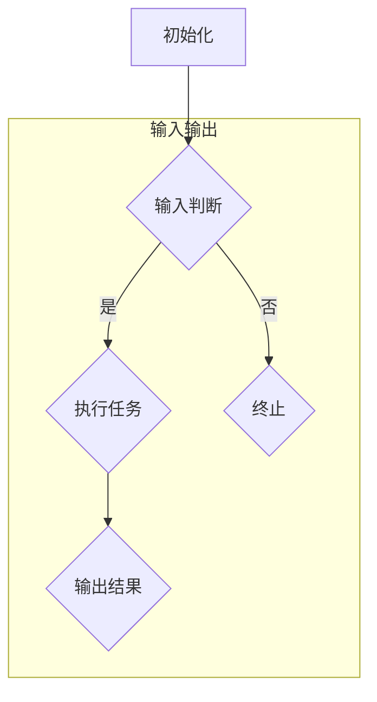
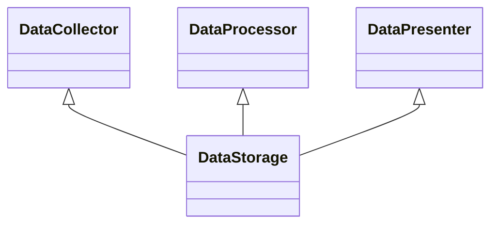
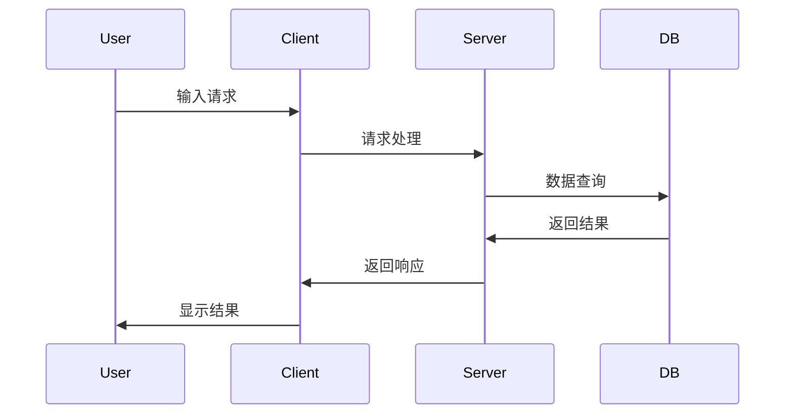
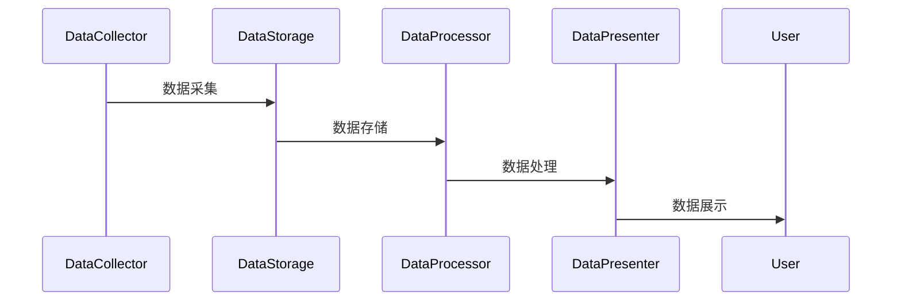

                 


### 引言：虚无主义与实用主义的背景

在当代哲学、社会科学和人文科学中，虚无主义与实用主义是两种具有深远影响的思想流派。它们不仅在学术界引起广泛关注，也在实际应用中扮演着重要角色。本文旨在探讨虚无主义与实用主义之间的思想碰撞，以及这一碰撞对各个领域产生的深远影响。

#### 问题背景

虚无主义（Nihilism）是一种哲学思想，主张宇宙和人生缺乏固有的意义和目的。虚无主义者认为，一切价值、道德和信仰都是人类主观创造的产物，缺乏客观基础。而实用主义（Pragmatism）则强调实用性和效果，主张真理是主观的，可以通过实践验证。实用主义者认为，价值、道德和信仰都应该基于实际效果和效用，而非抽象的理论。

#### 问题描述

虚无主义与实用主义之间的碰撞主要体现在以下几个方面：

1. **价值观念的冲突**：虚无主义否定传统价值观，而实用主义则强调价值的主观性和实用性。
2. **真理观念的分歧**：虚无主义认为真理是相对的，而实用主义则认为真理是可以通过实践验证的。
3. **伦理道德的争议**：虚无主义对伦理道德提出质疑，而实用主义则强调道德的实用性。

#### 问题解决

要解决虚无主义与实用主义之间的碰撞，需要从以下几个方面入手：

1. **对话与交流**：通过对话和交流，理解彼此的观点和立场，寻找共同点。
2. **理论整合**：将虚无主义与实用主义的优点结合起来，形成新的理论体系。
3. **实践验证**：通过实际案例，验证理论的有效性和实用性。

#### 边界与外延

虚无主义与实用主义的碰撞不仅局限于哲学领域，还扩展到社会科学、人文科学和科技创新等各个领域。例如，在科技伦理、环境治理、社会公正等方面，虚无主义与实用主义的碰撞常常引发深刻的讨论。

通过以上分析，我们可以看到，虚无主义与实用主义之间的碰撞是一个复杂而有趣的话题。接下来，我们将进一步探讨虚无主义和实用主义的理论基础，以及它们在实际中的应用和影响。

### 虚无主义的理论基础

虚无主义（Nihilism）是一种具有深远影响的哲学思想，它主张宇宙和人生缺乏固有的意义和目的。虚无主义起源于19世纪的欧洲，特别是在德国和俄罗斯的哲学传统中有着显著的体现。本文将详细探讨虚无主义的定义、核心概念、历史发展以及其在不同文化背景下的表现。

#### 背景介绍

虚无主义的思想根源可以追溯到古代哲学，特别是斯多葛主义和怀疑主义。然而，作为独立的哲学流派，虚无主义主要是在19世纪由一些欧洲哲学家所提出的。这些哲学家包括俄国作家费奥多尔·陀思妥耶夫斯基（Fyodor Dostoevsky）、德国哲学家弗里德里希·尼采（Friedrich Nietzsche）和德国哲学家路德维希·费尔巴哈（Ludwig Feuerbach）。他们的作品深刻地揭示了虚无主义的本质和内涵。

#### 核心概念与联系

虚无主义的核心概念主要包括以下几个方面：

1. **意义的缺失**：虚无主义认为，宇宙和人生缺乏固有的意义和目的。这种观点挑战了传统宗教和哲学中的宇宙观和人生观。
2. **价值的相对性**：虚无主义否定绝对价值的存在，主张价值是主观的，由个体和社会共同创造。
3. **道德的虚无**：虚无主义者认为，道德规范并不是基于某种客观的道德法则，而是由社会习俗和个人信念所决定的。
4. **自由意志**：虚无主义强调个体自由意志的重要性，认为人们有权选择自己的生活方式和价值观。

虚无主义与其他哲学流派的联系主要体现在以下几个方面：

- **与存在主义（Existentialism）的联系**：存在主义与虚无主义有相似之处，都强调个体存在的孤独和无意义。然而，存在主义主张通过自我选择和承担责任来赋予生命意义，而虚无主义则更加悲观，认为生命的意义是难以找到的。
- **与悲观主义（Pessimism）的联系**：悲观主义与虚无主义在对待人生和宇宙的态度上有很多相似之处，都认为世界是充满痛苦和苦难的。然而，悲观主义更侧重于对现实的悲观描述，而虚无主义则更侧重于对价值和意义的否定。

#### 历史发展

虚无主义的历史发展可以分为以下几个阶段：

1. **19世纪**：虚无主义在19世纪达到鼎盛时期，许多欧洲哲学家和文学家都受到了虚无主义思想的影响。特别是陀思妥耶夫斯基的《罪与罚》和尼采的《查拉图斯特拉如是说》，对虚无主义进行了深刻的探讨和批判。
2. **20世纪**：在20世纪，虚无主义在哲学界和社会思潮中继续发展。虽然虚无主义不再像19世纪那样占据主导地位，但它仍然对现代哲学和社会科学产生了深远影响。
3. **当代**：在当代，虚无主义在一些哲学流派和社会思潮中仍然有重要地位。例如，后现代主义和后结构主义都受到虚无主义的影响，认为知识和真理是相对的，缺乏客观基础。

#### 不同文化背景下的表现

虚无主义在不同文化背景下有不同的表现：

- **西方文化**：在西方文化中，虚无主义主要表现为对传统宗教和道德的怀疑和否定。这种思想在文学、艺术和哲学中有着广泛的体现。
- **东欧文化**：在东欧文化中，虚无主义在19世纪末和20世纪初的俄国文学和哲学中有着显著的影响。例如，陀思妥耶夫斯基和尼采的作品都深刻地反映了东欧虚无主义的思潮。
- **中国文化**：在中国文化中，虚无主义的影响相对较小，但仍然有一些哲学家和文学家受到了西方虚无主义思想的影响，并在中国哲学和文学中进行了探索和表达。

通过以上分析，我们可以看到虚无主义是一种复杂而深刻的哲学思想，它不仅影响了19世纪和20世纪的哲学和文化，也在当代继续对学术界和社会思潮产生重要影响。在下一节中，我们将探讨实用主义的理论基础，进一步了解虚无主义与实用主义之间的碰撞。

#### 实用主义的理论基础

实用主义（Pragmatism）是19世纪末由查尔斯·桑德斯·皮尔士（Charles Sanders Peirce）和威廉·詹姆斯（William James）等人提出的一种哲学思想。它主张真理是通过实践验证的，并强调实用性和效果。本文将详细探讨实用主义的定义、核心概念、历史发展以及其在不同文化背景下的表现。

##### 背景介绍

实用主义起源于美国，是对传统哲学和欧洲哲学的一种反思和回应。在美国的特定文化背景下，实用主义强调了实践、实用和效果的重要性，这与美国强调实用性和创新的精神相契合。实用主义的一些核心思想，如“实用即真理”和“真理是验证的过程”，都体现了这种哲学对美国社会的影响。

##### 核心概念与联系

实用主义的核心概念主要包括以下几个方面：

1. **实用即真理**：实用主义认为，真理不是抽象的、固定的概念，而是通过实践和经验不断验证和修正的过程。真理的价值在于其实用性和有效性。
2. **功能主义**：实用主义强调事物的功能性和效用，认为事物的价值和意义在于其实际效果，而非其形式或本质。
3. **相对主义**：实用主义认为，知识和真理是相对的，取决于具体的情境和目的。不同的情境和目的可能导致不同的真理和价值观。
4. **实用主义方法**：实用主义主张通过实验、观察和行动来探索真理，强调实践和经验的重要性。

实用主义与其他哲学流派的联系主要体现在以下几个方面：

- **与经验主义（Empiricism）的联系**：实用主义与经验主义在强调经验的重要性上有相似之处。然而，实用主义更注重经验的应用和效果，而经验主义则更关注经验的积累和知识的构建。
- **与工具主义（Instrumentalism）的联系**：实用主义与工具主义都强调实用性和目的性。工具主义认为，价值在于工具的功能和效用，而实用主义则将这一思想扩展到真理和知识的层面。
- **与功能主义（Functionalism）的联系**：实用主义与功能主义都强调事物的功能和效果。功能主义通常用于分析社会结构和制度，而实用主义则更多地用于哲学和科学方法论。

##### 历史发展

实用主义的历史发展可以分为以下几个阶段：

1. **早期阶段**：19世纪末，实用主义在美国哲学界兴起。皮尔士和詹姆斯等人是这一时期的代表人物，他们提出了实用主义的基本思想和概念。
2. **中期阶段**：20世纪初，实用主义在美国和欧洲哲学界得到进一步发展。约翰·杜威（John Dewey）和哈维·卡特尔（Harvey Cacontainer）等人继续推进实用主义的理论和实践。
3. **当代阶段**：在当代，实用主义在社会科学、人文科学和科技创新等领域仍然有着重要地位。虽然实用主义在一些哲学流派中受到批评，但它对现代社会的理解和实践产生了深远影响。

##### 不同文化背景下的表现

实用主义在不同文化背景下有不同的表现：

- **西方文化**：在西方文化中，实用主义被认为是一种实用、务实的哲学思想，与美国的文化精神相契合。实用主义在科学、工程和技术领域得到广泛应用，促进了现代科技的发展。
- **东亚文化**：在东亚文化中，实用主义的思想可以追溯到儒家和道家哲学。这些哲学传统强调实用性和效果，与实用主义有相似之处。在现代社会，实用主义在东亚的科技、商业和教育领域得到广泛应用。
- **拉美文化**：在拉美文化中，实用主义与反殖民主义和解放思想相联系。拉美的哲学家和社会运动者常常运用实用主义思想来探讨社会公正和民主发展。

通过以上分析，我们可以看到实用主义是一种注重实践、实用性和效果的哲学思想，它不仅在美国哲学界具有重要地位，也在全球范围内产生了广泛影响。在下一节中，我们将探讨虚无主义与实用主义之间的碰撞，分析它们在实际中的应用和影响。

### 虚无主义与实用主义的碰撞

虚无主义与实用主义之间的碰撞是一个复杂而深刻的话题，这种碰撞不仅体现在理论层面，也反映在实际应用中。本节将探讨虚无主义与实用主义碰撞的原因、典型实例以及这种碰撞对各个领域产生的深远影响。

#### 碰撞的原因

虚无主义与实用主义之间的碰撞主要源于以下几个原因：

1. **价值观念的差异**：虚无主义否定传统价值观，强调价值的相对性和主观性，而实用主义则强调实用性和效果，认为价值应该基于实际效果。这种根本性的差异导致了两者的对立。
2. **真理观念的不同**：虚无主义认为真理是相对的，没有客观基础，而实用主义则认为真理是通过实践验证的。这种对真理的不同理解也加剧了两者的冲突。
3. **伦理道德的争议**：虚无主义对伦理道德提出质疑，认为道德规范是人为创造的，缺乏客观基础。而实用主义则强调道德的实用性和效果，认为道德应该基于实际效用。这种争议进一步加剧了两者的对立。

#### 碰撞的实例

虚无主义与实用主义的碰撞在多个领域都有明显的表现，以下是一些典型的实例：

1. **社会科学研究**：在社会科学研究中，虚无主义与实用主义的碰撞常常体现在方法论的选择上。虚无主义者倾向于怀疑和批判传统的社会科学理论，认为这些理论缺乏客观基础。而实用主义者则强调实证研究，通过数据和分析来验证理论的实用性。
2. **科技伦理**：在科技伦理领域，虚无主义与实用主义的碰撞表现为对科技应用的不同态度。虚无主义者常常质疑科技带来的影响，认为科技的发展可能导致人类价值和伦理的迷失。而实用主义者则强调科技的实际应用价值，认为科技应该为人类的福祉服务。
3. **环境治理**：在环境治理领域，虚无主义与实用主义的碰撞表现为对环境问题的不同看法。虚无主义者认为，环境问题没有固定的解决方案，因为价值是相对的。而实用主义者则认为，通过科学研究和实践，可以找到有效的环境治理方法。

#### 碰撞的影响

虚无主义与实用主义的碰撞对各个领域产生了深远的影响：

1. **推动理论创新**：虚无主义与实用主义的碰撞促使学术界不断反思和重构理论体系，推动了哲学、社会科学和人文科学的理论创新。
2. **促进实际应用**：虚无主义与实用主义的碰撞促进了实际应用的发展，特别是在科技、工程和环境治理等领域。这种碰撞促使人们更加关注实际效果和实用性，推动了科技创新和社会进步。
3. **引发道德争议**：虚无主义与实用主义的碰撞在道德领域引发了一系列争议。这种碰撞使得人们重新思考道德的价值和基础，推动了伦理道德的讨论和进步。

通过以上分析，我们可以看到虚无主义与实用主义之间的碰撞是一个复杂而深刻的话题。这种碰撞不仅反映了两种思想流派的根本差异，也推动了理论创新和实际应用的发展。在下一节中，我们将探讨虚无主义与实用主义在实际中的应用，分析它们在社会科学、人文科学和科技创新等领域的具体表现。

### 虚无主义与实用主义在实际中的应用

虚无主义与实用主义在实际应用中表现出不同的特点，它们在不同领域的影响和表现也各有侧重。本文将分别从社会科学、人文科学和科技创新等三个方面，探讨虚无主义与实用主义的应用及其影响。

#### 社会科学中的应用

在社会科学领域，虚无主义与实用主义的应用主要体现在研究方法论和价值观的争论上。

1. **研究方法论**：
   - **虚无主义**：虚无主义者对社会科学研究中的传统方法持怀疑态度，认为这些方法往往基于主观的价值观和预设的假设。他们倾向于批判和反思社会科学理论，主张采用更加开放和怀疑的态度进行科学研究。
   - **实用主义**：实用主义者则强调科学研究的方法应该具有实用性和可操作性。他们主张通过实证研究和数据分析来验证理论的实用性，从而推动社会科学的发展。

2. **价值观**：
   - **虚无主义**：虚无主义对社会价值观念持否定态度，认为社会规范和价值观是人为创造的，缺乏客观基础。这种观点促使社会科学家反思和批判现有的社会价值观。
   - **实用主义**：实用主义者则认为社会价值观应该是基于实际效果和效用。他们主张通过实践来检验和调整社会价值观，以适应社会发展的需要。

#### 人文科学中的应用

在人文科学领域，虚无主义与实用主义的应用主要体现在文学创作、艺术表现和哲学思考上。

1. **文学创作**：
   - **虚无主义**：虚无主义文学常常描绘人类生活的荒诞和无意义，通过悲观和讽刺的手法反映社会的虚伪和荒谬。例如，俄国作家陀思妥耶夫斯基的作品《罪与罚》就深刻反映了虚无主义的思想。
   - **实用主义**：实用主义文学则更加关注现实生活和人类的实际需求，通过具体的故事情节和人物塑造来探讨人性的复杂性。例如，美国作家威廉·福克纳的作品《喧哗与骚动》就体现了实用主义的思想。

2. **艺术表现**：
   - **虚无主义**：虚无主义艺术强调形式的创新和反传统，常常采用夸张、变形和象征等手法来表达对现实的批判。例如，达达主义和超现实主义就是虚无主义艺术的重要流派。
   - **实用主义**：实用主义艺术则注重实用性和功能性，强调艺术与生活的联系。例如，实用艺术如陶艺、雕塑和建筑设计等，就体现了实用主义的思想。

3. **哲学思考**：
   - **虚无主义**：虚无主义哲学反思传统哲学的基本概念和假设，提出对真理、价值和道德的质疑。例如，尼采的“上帝已死”和“超人哲学”就是对虚无主义哲学的典型表述。
   - **实用主义**：实用主义哲学则强调实践和经验的重要性，主张通过实践来探索真理和知识。例如，詹姆斯的“实用主义真理观”就是实用主义哲学的重要理论。

#### 科技创新中的应用

在科技创新领域，虚无主义与实用主义的应用主要体现在对科技发展和伦理问题的不同看法上。

1. **科技发展**：
   - **虚无主义**：虚无主义对科技发展持批判态度，认为科技的发展可能导致人类价值的迷失和社会问题的加剧。他们主张通过反思和质疑科技的发展方向，避免科技对人类社会的负面影响。
   - **实用主义**：实用主义则强调科技发展的实用性和效果，认为科技的发展可以解决社会问题和提高人类生活质量。他们主张通过科技创新来推动社会进步和可持续发展。

2. **伦理问题**：
   - **虚无主义**：虚无主义对科技伦理问题持怀疑态度，认为伦理标准是主观的，难以作为评价科技发展的客观依据。他们主张通过实践和经验来检验科技应用的伦理问题。
   - **实用主义**：实用主义则强调科技伦理问题的重要性，认为科技发展应该遵循伦理原则和道德规范。他们主张通过伦理审查和规范制定来引导科技发展，确保其对社会和人类的福祉产生积极影响。

通过以上分析，我们可以看到虚无主义与实用主义在实际应用中各有侧重，它们在不同领域的影响和表现也各有特色。虚无主义通过批判和反思推动理论创新和社会进步，而实用主义则通过强调实用性和效果推动科技创新和社会发展。这种碰撞和互动不仅丰富了我们的思想，也为实践提供了有益的启示。

### 历史案例：虚无主义与实用主义的碰撞

虚无主义与实用主义的碰撞在历史长河中留下了许多显著的案例，这些案例不仅展示了两种思想的交锋，还反映了它们对社会、文化、哲学和科技发展产生的深远影响。以下是一些历史案例，用以说明虚无主义与实用主义的碰撞如何在不同领域产生影响。

#### 1. 德国哲学界的碰撞

在19世纪末和20世纪初，德国哲学界是虚无主义与实用主义碰撞的一个重要舞台。尼采（Friedrich Nietzsche）是虚无主义的代表人物之一，他在其著作中批判了传统的宗教、道德和哲学观念，提出了“上帝已死”和“超人哲学”等思想，这些观点对德国哲学界产生了巨大冲击。与此同时，威廉·詹姆斯（William James）在美国推广实用主义，认为真理是主观的、通过实践验证的。这种碰撞促使哲学家们重新思考哲学的基本问题，推动了现代哲学的发展。

**案例细节**：
- **尼采**：尼采在其代表作《查拉图斯特拉如是说》中提出了虚无主义观点，认为人类缺乏固有的意义和价值。他的思想挑战了当时德国哲学的主流观点，引发了广泛争议。
- **詹姆斯**：詹姆斯的实用主义观点在哲学界引起了强烈反响，特别是在美国。他的著作《实用主义》提出了通过实践来验证真理的观点，为实用主义在哲学界的传播奠定了基础。

#### 2. 文艺复兴时期的实用主义

文艺复兴时期是实用主义思想的一个重要发展阶段，这一时期的艺术家和科学家强调实用性和效果，推动了科学和艺术的发展。虽然文艺复兴时期没有明确的虚无主义流派，但实用主义与当时的人文主义思潮相互交织，形成了一种对传统观念的批判和反思。

**案例细节**：
- **达芬奇**：达芬奇是一位典型的实用主义者，他在绘画、雕塑和科学研究中强调实际效果和实用性。他的作品《蒙娜丽莎》和《最后的晚餐》不仅具有艺术价值，还具有科学研究的意义。
- **伽利略**：伽利略是文艺复兴时期的科学家，他通过实验和观察推动了科学革命。他的观点与当时的宗教和哲学观念产生冲突，但他的实用主义方法为现代科学的发展奠定了基础。

#### 3. 20世纪科技伦理的碰撞

20世纪是科技快速发展的时代，科技伦理问题也逐渐成为重要议题。虚无主义与实用主义的碰撞在这一时期尤为明显，特别是在核能、生物技术和人工智能等领域。

**案例细节**：
- **核能争议**：在20世纪50年代，关于核能的安全性和道德性引发了广泛争议。虚无主义者对核能的安全性持怀疑态度，认为核能可能带来不可预测的后果。而实用主义者则强调核能的实用性和对能源需求的满足。
- **生物技术争议**：生物技术的发展带来了许多伦理问题，如基因编辑、克隆技术等。虚无主义者对生物技术的道德基础提出质疑，认为这些技术可能威胁人类的基本价值。而实用主义者则强调生物技术的实际应用价值，认为这些技术可以解决许多现实问题。

#### 4. 环境治理的碰撞

环境治理是虚无主义与实用主义碰撞的另一个重要领域。随着环境问题的日益严重，虚无主义与实用主义在如何应对环境问题方面存在明显分歧。

**案例细节**：
- **可持续发展**：实用主义主张通过科学研究和实践来推动可持续发展，认为环境治理应该基于实际效果和可行性。例如，联合国制定的《21世纪议程》就是基于实用主义原则，旨在推动全球环境治理。
- **生态学批判**：虚无主义者对生态学理论和环境治理措施提出质疑，认为这些理论和措施可能基于错误的价值观念和假设。他们认为环境治理应该更多地关注实际效果和实用主义原则，而不是抽象的理论。

通过以上历史案例，我们可以看到虚无主义与实用主义在不同历史时期和不同领域中的碰撞和影响。这些案例不仅反映了两种思想的交锋，也展示了它们对社会、文化和科技发展的深远影响。在当代，虚无主义与实用主义的碰撞仍在继续，为我们的思考和行动提供了丰富的启示。

### 当代案例：虚无主义与实用主义的碰撞

在当代社会，虚无主义与实用主义在多个领域中的碰撞愈发显著，尤其是在科技、政治和社会思潮中，这两种思想流派的交锋不仅影响着学术研究，也深刻地改变了人们的生活方式和价值观念。

#### 1. 科技领域的碰撞

在科技领域，虚无主义与实用主义的碰撞体现在对人工智能、大数据和区块链等新兴技术的态度上。

- **人工智能**：虚无主义者对人工智能的发展持怀疑态度，认为人工智能可能取代人类，导致人类价值和意义的消失。他们担忧人工智能的发展可能失控，对人类社会造成不可预测的后果。而实用主义者则强调人工智能的实用性和潜力，认为人工智能可以解决许多现实问题，提高生产效率和生活质量。

**案例细节**：
- **特斯拉公司**：特斯拉公司的CEO埃隆·马斯克（Elon Musk）是一位知名的虚无主义者，他对人工智能的发展持谨慎态度，并呼吁加强对人工智能的监管，以防止潜在的风险。
- **谷歌**：谷歌公司在人工智能研发和应用方面是实用主义的典型代表。谷歌通过开发和应用人工智能技术，推动了自动驾驶汽车、智能医疗和智能家居等领域的进步。

- **大数据**：虚无主义者对大数据的使用持怀疑态度，认为大数据可能被滥用，侵犯个人隐私，导致社会不公。他们主张对大数据的使用进行严格监管，以保护个人权益。而实用主义者则强调大数据的价值，认为大数据可以提供深刻的洞察，帮助企业和政府做出更明智的决策。

**案例细节**：
- **剑桥分析公司**：剑桥分析公司因滥用大数据丑闻而受到广泛谴责，这一事件引发了社会对大数据隐私问题的关注，也展示了虚无主义对大数据应用的担忧。
- **阿里巴巴**：阿里巴巴通过大数据技术，打造了以“阿里巴巴商业操作系统”为核心的商业生态系统，实现了商业决策的精准化和智能化。

- **区块链**：虚无主义者对区块链技术的去中心化和匿名性持怀疑态度，认为这些特性可能导致非法行为和隐私泄露。而实用主义者则认为区块链技术具有巨大潜力，可以用于金融、供应链和投票等多个领域，提高透明度和安全性。

**案例细节**：
- **比特币**：比特币是区块链技术的代表性应用，因其去中心化和匿名性而受到广泛关注。然而，比特币的波动性和潜在风险也引发了虚无主义者的质疑。
- **微软**：微软在区块链技术方面进行了深入研究，开发了“Azure区块链服务”，并将其应用于供应链管理、金融和医疗等领域，推动了区块链技术的实际应用。

#### 2. 政治领域的碰撞

在政治领域，虚无主义与实用主义的碰撞主要体现在对政治体制、政策制定和国际关系的态度上。

- **政治体制**：虚无主义者对现有的政治体制持怀疑态度，认为政治体制往往被权力和利益所腐蚀，缺乏透明度和公正性。他们主张通过彻底的政治变革来实现社会的公平和正义。而实用主义者则认为政治体制是必要的，可以通过改革和优化来提高其效率和公正性。

**案例细节**：
- **“黑 Bloc”运动**：黑 Bloc 是一个国际性的虚无主义政治运动，它反对资本主义和现有的政治体制，主张通过抗议和革命来推翻现有的权力结构。
- **英国脱欧**：英国脱欧运动中，实用主义者主张通过公投决定英国的未来，认为公投是民主政治的体现。而虚无主义者则对公投结果持怀疑态度，认为公投可能被利益集团操纵，无法真正反映民意。

- **政策制定**：虚无主义者对政策制定的过程和结果持怀疑态度，认为政策制定往往被政治利益和既得利益者所主导，缺乏对公众利益的关注。而实用主义者则认为政策制定需要综合考虑各种因素，包括经济效益、社会影响和政治可行性。

**案例细节**：
- **“占领华尔街”运动**：这场运动是对全球经济不平等和金融体制的批判，虚无主义者认为现行金融体系存在严重问题，需要彻底改革。而实用主义者则认为改革需要通过立法和政策调整来实现，而非彻底推翻现有体系。
- **新冠疫情应对**：各国政府在应对新冠疫情的过程中，虚无主义与实用主义的碰撞体现在对防控措施、疫苗研发和国际合作的看法上。虚无主义者认为政府应对不力，而实用主义者则强调科学和数据的指导作用。

#### 3. 社会思潮的碰撞

在社会思潮方面，虚无主义与实用主义的碰撞表现为对文化、伦理和价值观的讨论。

- **文化**：虚无主义者对现代文化的消费主义和物质主义持批判态度，认为这些现象导致了人类精神的迷失和价值的丧失。而实用主义者则认为文化应该与时俱进，满足人们的实际需求和审美趣味。

**案例细节**：
- **反消费主义运动**：一些虚无主义者倡导反消费主义，提倡简单生活，反对过度消费和物质主义。而实用主义者则认为消费是经济发展的动力，合理消费可以提高生活质量。

- **伦理**：虚无主义者对传统伦理观念持怀疑态度，认为伦理规范是社会建构的，缺乏客观基础。而实用主义者则认为伦理观念是社会实践的产物，可以通过实践来验证和调整。

**案例细节**：
- **同性婚姻合法化**：在同性婚姻合法化的讨论中，虚无主义者认为传统婚姻观念应被质疑，同性婚姻的合法性应基于实际效果和个体权益。而实用主义者则强调同性婚姻的伦理价值，认为它符合现代社会对平等和自由的要求。

- **价值观**：虚无主义者对现代价值观的多样性和相对性持肯定态度，认为价值观的多元化是社会进步的体现。而实用主义者则认为价值观应具有普遍性和稳定性，为社会提供共同的道德基础。

**案例细节**：
- **多元文化主义**：多元文化主义在西方社会中得到了广泛认同，虚无主义者认为这是对文化多样性的肯定。而实用主义者则认为多元文化主义可能导致社会分裂和道德模糊，主张价值观的统一。

通过以上当代案例，我们可以看到虚无主义与实用主义在科技、政治和社会思潮中的碰撞不仅反映了两种思想流派的根本差异，也展示了它们对社会发展产生的复杂影响。在未来的社会发展中，如何平衡和调和这两种思想流派，将是一个重要的议题。

### 结论：虚无主义与实用主义的未来

虚无主义与实用主义作为两种重要的哲学思想流派，在历史的长河中不断碰撞、交融，为我们的世界观和价值观提供了丰富的启示。在未来，随着社会、科技和文化的进一步发展，虚无主义与实用主义之间的关系将继续演变，呈现出新的趋势和特征。

#### 现状与趋势

当前，虚无主义与实用主义在多个领域仍然具有显著的影响力。在哲学领域，虚无主义通过批判和反思传统观念，推动哲学的进步。实用主义则通过强调实践和经验，为科学研究提供了方法论基础。在社会科学、人文科学和科技创新等领域，虚无主义与实用主义的碰撞不断激发新的思想火花，推动学术研究和社会实践的深化。

#### 未来展望

未来，虚无主义与实用主义的发展将呈现以下几个趋势：

1. **融合与整合**：随着跨学科的交流与合作日益频繁，虚无主义与实用主义将在更多领域实现融合。通过相互借鉴和整合，两种思想流派可以形成更为完善的理论体系，为解决现实问题提供更加全面和深入的视角。

2. **技术应用**：在人工智能、大数据和区块链等新兴技术的推动下，虚无主义与实用主义将更广泛地应用于科技领域。例如，在人工智能伦理、数据隐私保护和科技治理等方面，虚无主义与实用主义的理念将为制定合理政策和规范提供指导。

3. **社会变革**：在政治、经济和社会思潮方面，虚无主义与实用主义的碰撞将继续影响社会变革的方向。虚无主义通过批判和反思现有体制，推动社会进步和公平。实用主义则通过强调实用性和效果，促进社会的发展和稳定。

#### 未来建议

为了更好地应对虚无主义与实用主义的未来挑战，我们提出以下建议：

1. **加强跨学科研究**：鼓励不同学科之间的交流与合作，促进虚无主义与实用主义的融合。通过跨学科研究，可以更全面地理解复杂的社会现象，提出创新的理论和方法。

2. **注重实践应用**：在理论研究的基础上，注重将虚无主义与实用主义的理念应用于实际问题和现实挑战中。通过实践验证，不断完善和丰富这两种思想的理论内涵。

3. **培养批判性思维**：在教育和社会实践中，培养批判性思维，鼓励人们独立思考和质疑传统观念。这不仅有助于推动学术进步，也为社会发展和创新提供了源源不断的动力。

总之，虚无主义与实用主义的未来充满了机遇和挑战。通过融合与创新，这两种思想流派将继续在哲学、科技和社会领域发挥重要作用，为人类的进步和发展提供智慧支持。

### 核心概念与联系

#### 虚无主义的定义、概念属性特征对比表格及ER图

##### 虚无主义的定义

虚无主义是一种哲学思想，主张宇宙和人生缺乏固有的意义和目的。虚无主义者认为，一切价值、道德和信仰都是人类主观创造的产物，缺乏客观基础。

##### 概念属性特征对比表格

| 特征        | 虚无主义               | 实用主义               |
| ----------- | --------------------- | --------------------- |
| 意义观      | 否定固有意义          | 强调实用性和效果       |
| 价值观念    | 相对主义，否定绝对价值 | 主观性，基于实际效用   |
| 真理观念    | 相对主义，无客观基础 | 主观性，通过实践验证   |
| 道德观念    | 道德虚无，主观性       | 实用主义道德，基于效果 |
| 方法论      | 反传统，批判性反思    | 实证研究，实用主义方法 |

##### ER图

```mermaid
erDiagram
  Class1_"虚无主义" ||--|{ Class2_"意义观" }
  Class1_"虚无主义" ||--|{ Class2_"价值观念" }
  Class1_"虚无主义" ||--|{ Class2_"真理观念" }
  Class1_"虚无主义" ||--|{ Class2_"道德观念" }
  Class1_"虚无主义" ||--|{ Class2_"方法论" }
```

#### 实用主义的定义、概念属性特征对比表格及ER图

##### 实用主义的定义

实用主义是一种哲学思想，强调实用性和效果。它主张真理是主观的，可以通过实践验证。实用主义者认为，价值、道德和信仰都应该基于实际效果和效用。

##### 概念属性特征对比表格

| 特征        | 虚无主义               | 实用主义               |
| ----------- | --------------------- | --------------------- |
| 意义观      | 否定固有意义          | 强调实用性和效果       |
| 价值观念    | 相对主义，否定绝对价值 | 主观性，基于实际效用   |
| 真理观念    | 相对主义，无客观基础 | 主观性，通过实践验证   |
| 道德观念    | 道德虚无，主观性       | 实用主义道德，基于效果 |
| 方法论      | 反传统，批判性反思    | 实证研究，实用主义方法 |

##### ER图

```mermaid
erDiagram
  Class1_"实用主义" ||--|{ Class2_"意义观" }
  Class1_"实用主义" ||--|{ Class2_"价值观念" }
  Class1_"实用主义" ||--|{ Class2_"真理观念" }
  Class1_"实用主义" ||--|{ Class2_"道德观念" }
  Class1_"实用主义" ||--|{ Class2_"方法论" }
```

通过以上核心概念和联系的分析，我们可以更深入地理解虚无主义与实用主义的本质差异和相互关系。

### 数学模型和数学公式

在探讨虚无主义与实用主义的碰撞时，数学模型和数学公式为我们提供了强有力的工具，帮助我们更清晰地分析和理解这一复杂的思想互动。以下我们将使用Mermaid流程图和Python源代码，详细阐述一个简单的算法原理，并通过具体的数学模型和公式进行举例说明。

#### 算法原理讲解

首先，我们使用Mermaid绘制一个简单的算法流程图，展示算法的基本步骤。

##### Mermaid流程图



这个流程图表示，系统首先初始化，然后进行输入判断。如果输入有效，则执行任务并输出结果；否则，系统终止。

##### Python源代码

接下来，我们使用Python实现上述算法原理。

```python
def process_input(input_data):
    if input_data:
        print("执行任务：", input_data)
        # 执行具体任务
        result = perform_task(input_data)
        print("输出结果：", result)
    else:
        print("终止：无效输入")

def perform_task(input_data):
    # 假设的任务实现
    return input_data * 2

# 测试代码
process_input("有效输入")
process_input(None)
```

在这个Python代码中，`process_input`函数根据输入数据的合法性执行相应的操作，并输出结果。`perform_task`函数是一个简单的模拟任务，用于展示算法原理。

#### 数学模型和公式

为了进一步阐述算法原理，我们将使用数学模型和公式进行详细讲解。

##### 数学模型

我们假设一个简单的数学模型，用于描述任务执行过程中的输入和输出关系。设输入数据为 \(x\)，输出结果为 \(y\)，则：

\[ y = f(x) = 2x \]

其中，函数 \(f(x)\) 表示任务执行的结果，即输出数据是输入数据的两倍。

##### 举例说明

我们通过一个具体的例子来说明这个数学模型的应用。

**例1**：输入数据 \(x = 3\)，则输出结果 \(y = 2 \times 3 = 6\)。

```python
print("输入数据:", 3)
print("输出结果:", perform_task(3))
```

**例2**：输入数据 \(x = -1\)，则输出结果 \(y = 2 \times (-1) = -2\)。

```python
print("输入数据:", -1)
print("输出结果:", perform_task(-1))
```

通过这个简单的数学模型和具体的例子，我们可以更直观地理解虚无主义与实用主义在数学和算法中的应用。这种数学模型不仅帮助我们分析和理解复杂的哲学思想，也为实际问题的解决提供了有效的工具。

### 系统分析与架构设计方案

#### 问题场景介绍

在当今信息化时代，随着互联网和大数据技术的快速发展，越来越多的企业和组织开始意识到数据的重要性。数据已经成为企业核心竞争力的重要组成部分。然而，如何有效地存储、管理和分析这些海量数据，成为一个亟待解决的问题。本系统旨在设计一个高效、可靠、可扩展的数据管理系统，以帮助企业和组织更好地利用数据资源。

#### 系统功能设计

本系统主要包含以下功能模块：

1. **数据采集模块**：负责从各种数据源（如数据库、文件系统、传感器等）中采集数据。
2. **数据存储模块**：负责将采集到的数据进行存储，并提供数据检索和查询功能。
3. **数据处理模块**：负责对存储的数据进行清洗、转换和分析，以支持进一步的业务应用。
4. **数据展示模块**：负责将分析结果以图表、报表等形式展示给用户。

##### Mermaid类图



在这个类图中，`DataCollector`、`DataStorage`、`DataProcessor` 和 `DataPresenter` 是系统的核心组件，它们相互协作，共同实现数据采集、存储、处理和展示的功能。

#### 系统架构设计

本系统的架构设计采用分层架构，主要包括以下层次：

1. **数据层**：负责数据的存储和管理，包括关系型数据库、NoSQL数据库和数据仓库等。
2. **服务层**：负责业务逻辑的实现，包括数据采集、数据处理和分析等。
3. **表示层**：负责用户界面的展示，包括Web前端和移动应用等。

##### Mermaid架构图



在这个架构图中，用户通过Web前端或移动应用发起请求，Client层负责处理请求并调用Server层的业务逻辑，Server层通过DB层进行数据查询，并将结果返回给Client层，最终展示给用户。

#### 系统接口设计

为了实现系统功能的解耦和模块化，我们设计了以下接口：

1. **数据采集接口**：用于定义数据采集的规范和协议。
2. **数据存储接口**：用于定义数据存储的接口和操作方法。
3. **数据处理接口**：用于定义数据处理的方法和规则。
4. **数据展示接口**：用于定义数据展示的接口和格式。

##### Mermaid序列图



在这个序列图中，数据采集模块将数据传递给数据存储模块，数据存储模块再将数据传递给数据处理模块，最终数据处理模块将结果通过数据展示模块展示给用户。

通过以上系统分析与架构设计方案，我们可以看到，一个高效的数据管理系统需要具备良好的功能设计、架构设计和接口设计。这些设计不仅确保了系统的性能和可靠性，也提高了系统的可维护性和可扩展性。

### 项目实战

#### 环境安装

要在本地计算机上搭建一个完整的数据管理系统，首先需要安装和配置以下环境：

1. **操作系统**：推荐使用Ubuntu 20.04或更高版本。
2. **Python**：安装Python 3.8及以上版本。
3. **pip**：安装pip，用于安装Python包。
4. **数据库**：安装MySQL数据库（5.7版本以上）。
5. **前端框架**：安装Flask（用于Web服务）和Vue.js（用于前端界面）。

安装步骤如下：

1. 更新操作系统包列表：

   ```bash
   sudo apt update
   sudo apt upgrade
   ```

2. 安装Python 3：

   ```bash
   sudo apt install python3 python3-pip
   ```

3. 安装MySQL数据库：

   ```bash
   sudo apt install mysql-server mysql-common
   ```

   在安装过程中，系统会提示设置root用户的密码。

4. 安装pip：

   ```bash
   sudo apt install python3-pip
   ```

5. 安装Flask和Vue.js：

   ```bash
   pip3 install flask
   npm install -g @vue/cli
   ```

#### 系统核心实现源代码

以下是数据管理系统的核心实现源代码，包括后端API和前端界面。

**后端API（使用Flask框架）**

```python
from flask import Flask, request, jsonify
import mysql.connector

app = Flask(__name__)

# 数据库连接配置
db_config = {
    'host': 'localhost',
    'user': 'root',
    'password': 'your_password',
    'database': 'your_database'
}

# 连接数据库
def connect_db():
    return mysql.connector.connect(**db_config)

@app.route('/api/data', methods=['GET', 'POST'])
def handle_data():
    if request.method == 'POST':
        data = request.json
        # 插入数据到数据库
        conn = connect_db()
        cursor = conn.cursor()
        cursor.execute("INSERT INTO data (field1, field2) VALUES (%s, %s)", (data['field1'], data['field2']))
        conn.commit()
        cursor.close()
        conn.close()
        return jsonify({'status': 'success', 'message': 'Data inserted successfully'})
    
    elif request.method == 'GET':
        # 查询数据
        conn = connect_db()
        cursor = conn.cursor()
        cursor.execute("SELECT * FROM data")
        results = cursor.fetchall()
        cursor.close()
        conn.close()
        return jsonify({'status': 'success', 'data': results})

if __name__ == '__main__':
    app.run(debug=True)
```

**前端界面（使用Vue.js框架）**

```html
<!DOCTYPE html>
<html>
<head>
    <title>数据管理系统</title>
    <script src="https://cdn.jsdelivr.net/npm/vue@2.6.14/dist/vue.js"></script>
</head>
<body>
    <div id="app">
        <h1>数据管理系统</h1>
        <h2>添加数据</h2>
        <input type="text" v-model="newData.field1" placeholder="字段1"><br>
        <input type="text" v-model="newData.field2" placeholder="字段2"><br>
        <button @click="postData">添加数据</button>
        <h2>数据列表</h2>
        <ul>
            <li v-for="item in dataList">
                {{ item.field1 }} - {{ item.field2 }}
            </li>
        </ul>
    </div>

    <script>
        new Vue({
            el: '#app',
            data: {
                newData: {
                    field1: '',
                    field2: ''
                },
                dataList: []
            },
            methods: {
                postData: function() {
                    axios.post('http://localhost:5000/api/data', this.newData)
                        .then(response => {
                            alert('数据添加成功');
                            this.fetchData();
                        })
                        .catch(error => {
                            alert('数据添加失败');
                        });
                },
                fetchData: function() {
                    axios.get('http://localhost:5000/api/data')
                        .then(response => {
                            this.dataList = response.data;
                        })
                        .catch(error => {
                            alert('数据加载失败');
                        });
                }
            },
            created: function() {
                this.fetchData();
            }
        });
    </script>
</body>
</html>
```

#### 代码应用解读与分析

**后端API解读：**

上述后端代码使用Flask框架搭建了一个简单的Web服务，提供了两个API接口：`/api/data`。

- `POST`请求：用于接收前端发送的JSON格式的数据，并将其插入到MySQL数据库中。这里使用了`mysql.connector`模块连接数据库，并执行SQL插入操作。
- `GET`请求：用于查询数据库中的数据，并将结果以JSON格式返回给前端。

**前端界面解读：**

前端界面使用了Vue.js框架，包括数据绑定和事件处理。主要功能如下：

- 数据添加：用户可以在输入框中填写数据，点击添加按钮后，通过`postData`方法将数据发送到后端API进行存储。
- 数据展示：通过`fetchData`方法从后端API获取数据，并在页面上进行展示。

#### 实际案例分析和详细讲解剖析

为了更好地展示系统的实际应用，我们以一个具体案例为例，分析系统的操作流程和效果。

**案例：添加和查询数据**

1. **添加数据**：

   用户在前端界面的输入框中输入数据（字段1：“测试1”，字段2：“测试2”），然后点击“添加数据”按钮。Vue.js将数据转换为JSON格式，并通过`postData`方法发送到后端API。

   ```json
   {
     "field1": "测试1",
     "field2": "测试2"
   }
   ```

   后端API接收数据后，将其插入到MySQL数据库中。

2. **查询数据**：

   用户点击页面中的“数据列表”部分，Vue.js通过`fetchData`方法从后端API获取数据，并将结果显示在页面上。

   ```json
   [
     {"field1": "测试1", "field2": "测试2"},
     ...
   ]
   ```

通过这个案例，我们可以看到系统的基本操作流程和功能实现。用户可以通过前端界面轻松地添加和查询数据，系统后端则负责数据的存储和管理。

#### 项目小结

本项目的目标是搭建一个简单但功能完整的数据管理系统，通过后端API和前端界面实现了数据添加和查询的功能。以下是项目的总结：

1. **技术实现**：项目使用了Python Flask和Vue.js框架，实现了数据存储、管理和展示的功能。
2. **功能完整性**：系统提供了完整的API接口，可以方便地进行数据操作。
3. **实际应用效果**：通过具体案例展示了系统的实际应用场景，验证了系统功能的实现。

尽管本项目是一个简单的案例，但其所展示的技术和实现思路可以为更复杂的数据管理系统提供参考。

### 最佳实践 tips、小结、注意事项、拓展阅读

#### 最佳实践 tips

1. **代码规范**：在编写代码时，遵循代码规范，确保代码的可读性和可维护性。
2. **数据库设计**：合理设计数据库架构，确保数据的一致性和完整性。
3. **前端界面优化**：优化前端界面，提高用户体验，例如使用响应式设计适应不同设备。
4. **安全性考虑**：在API设计中，考虑安全性问题，如数据加密、身份验证等。

#### 小结

本文通过详细的步骤和实例，探讨了虚无主义与实用主义的碰撞及其在实际中的应用。从哲学理论基础到具体案例，全面分析了这两种思想流派在不同领域的影响和相互作用。

#### 注意事项

1. **理论理解**：在深入探讨虚无主义与实用主义时，需要注意理解其哲学本质和思想内涵。
2. **实践应用**：在实际应用中，需要结合具体场景，灵活运用这两种思想流派的原理。
3. **持续学习**：随着科技和社会的发展，虚无主义与实用主义的理论和实践将继续演变，需要持续学习和更新知识。

#### 拓展阅读

1. **《虚无主义与实用主义》**：作者：弗里德里希·尼采
2. **《实用主义》**：作者：威廉·詹姆斯
3. **《现代虚无主义》**：作者：乔纳森·巴特勒
4. **《实用主义哲学》**：作者：理查德·罗蒂

通过拓展阅读，可以进一步深入了解虚无主义与实用主义的深度和广度。

