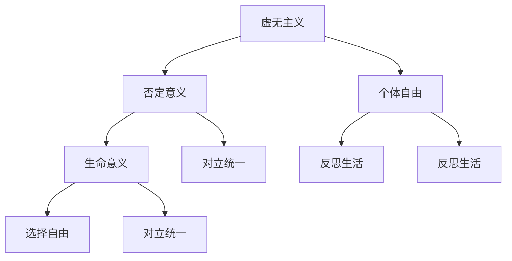
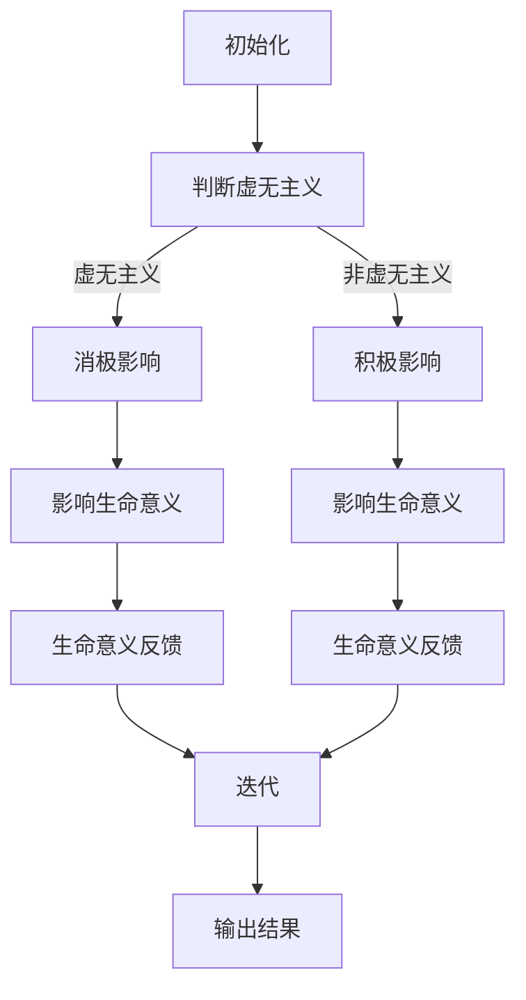
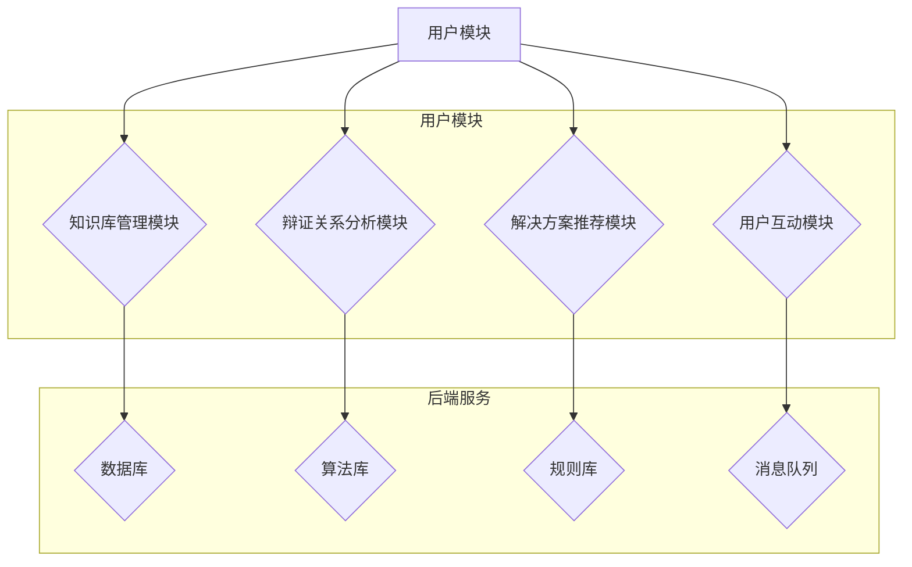
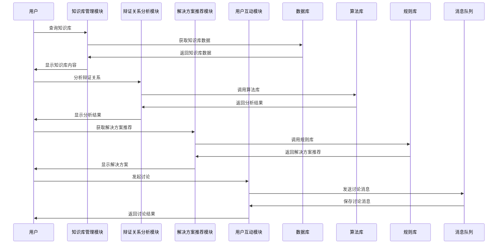
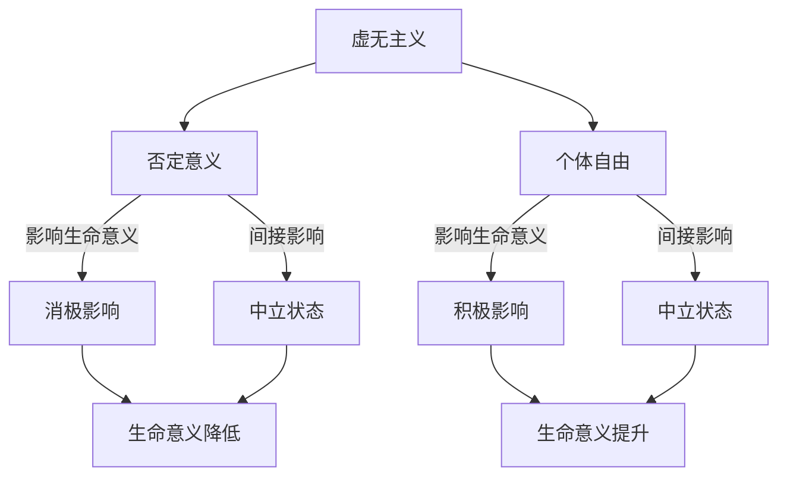
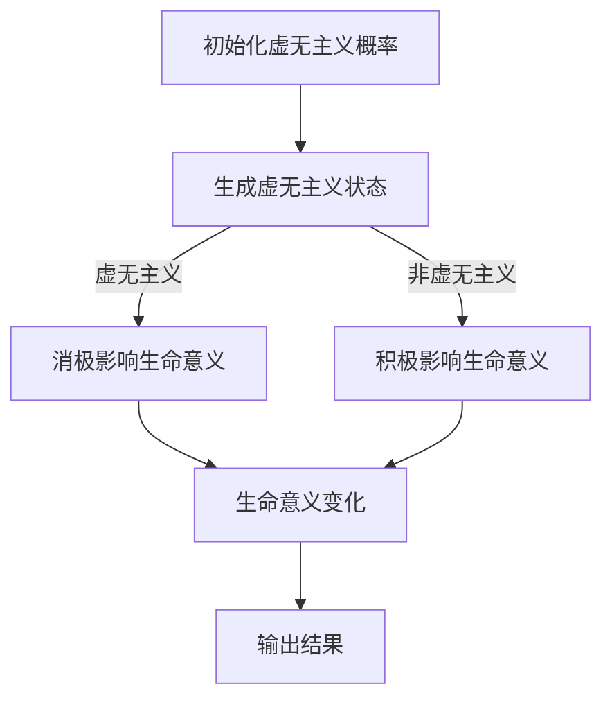

                 

# 虚无主义与生命意义的辩证关系

## 关键词

- 虚无主义
- 生命意义
- 哲学
- 辩证关系
- 当代影响

## 摘要

本文旨在探讨虚无主义与生命意义的辩证关系。虚无主义作为一种哲学思想，对个体和社会产生了深远的影响，挑战了人们对生命意义的理解。本文通过历史回顾、概念分析、辩证关系的探讨，以及现实案例的分析，旨在揭示虚无主义与生命意义之间的复杂关系，并提出应对虚无主义、寻找生命意义的方法。

## 引言：虚无主义与生命意义的探讨

### 1.1 虚无主义的挑战

虚无主义作为一种哲学思想，起源于19世纪的欧洲，其核心观点是生活的本质是缺乏意义的。虚无主义者认为，宇宙和人生都是无意义的，人类的存在本身没有固有的价值。这一观点对现代社会产生了巨大的冲击，挑战了传统价值观的根基。

### 1.2 生命意义的追寻

生命意义是人类永恒的追求。无论在东方哲学还是在西方哲学中，生命意义都是一个核心议题。人们渴望找到生活的目的和价值，以抵抗虚无主义的诱惑。然而，虚无主义的挑战使得这一追求变得更加复杂和艰巨。

## 第1章 虚无主义的历史发展与哲学基础

### 1.1 虚无主义的起源

虚无主义的起源可以追溯到古代希腊哲学。早期的虚无主义哲学家，如第欧根尼和克利托，认为宇宙是荒诞的、无意义的。这种观点在后来的哲学发展中逐渐演变和深化。

### 1.2 虚无主义的主要流派

虚无主义在20世纪经历了重要的发展，形成了多个流派，包括悲观主义、存在主义和后现代主义。每种流派都有其独特的哲学观点和对生命意义的理解。

### 1.3 虚无主义的哲学基础

虚无主义哲学基础主要包括对宇宙和人生的悲观主义观点、对传统价值观的质疑以及对个体自由的强调。这些观点共同构成了虚无主义的思想体系。

## 第2章 核心概念：虚无主义与生命意义

### 2.1 虚无主义的定义与特征

虚无主义是一种哲学思想，认为宇宙和人生都是无意义的。虚无主义的特征包括对生命意义的否定、对传统价值观的质疑以及对个体自由的表达。

### 2.2 生命意义的定义与特征

生命意义是指个体在宇宙中存在的价值和目的。生命意义的特征包括个体的自我实现、社会贡献以及对世界的好奇和探索。

### 2.3 虚无主义与生命意义的对比

虚无主义与生命意义在根本上是相互对立的。虚无主义否定生命意义的存在，而生命意义则强调个体在宇宙中的价值。

## 第3章 辩证关系：虚无主义与生命意义的关系

### 3.1 虚无主义对生命意义的影响

虚无主义对生命意义的影响是双重的。一方面，它挑战了人们对生命意义的理解，导致人们对生活失去热情和动力。另一方面，虚无主义也促使人们对生命意义进行更深入的思考和探索。

### 3.2 生命意义对虚无主义的回应

生命意义对虚无主义的回应表现为对生命价值的肯定和对生命意义的探索。通过寻找和实现生命意义，人们可以抵御虚无主义的诱惑。

### 3.3 虚无主义与生命意义的相互转化

虚无主义与生命意义之间存在相互转化的可能性。在一定条件下，虚无主义可以转化为对生命意义的追求，反之亦然。

## 第4章 历史人物与文学作品中的虚无主义与生命意义

### 4.1 历史人物中的虚无主义与生命意义

历史上有许多人物体现了虚无主义与生命意义的辩证关系。例如，尼采的哲学思想中包含了虚无主义的成分，但他也提出了“超人”概念，试图为生命找到意义。

### 4.2 文学作品中的虚无主义与生命意义

文学作品常常探讨虚无主义与生命意义的关系。例如，加西亚·马尔克斯的小说《百年孤独》中，通过对家族史的描写，反映了虚无主义与生命意义的交织。

### 4.3 历史与文学中的辩证关系分析

历史和文学作品中的虚无主义与生命意义的辩证关系，为我们提供了对这一问题的深刻理解。通过分析这些作品，我们可以看到虚无主义与生命意义之间的复杂互动。

## 第5章 当代影响：虚无主义在现代社会中的表现与影响

### 5.1 当代虚无主义的表现

在现代社会，虚无主义以多种形式表现出来，包括个人主义、消费主义和逃避主义等。这些表现反映了虚无主义对现代社会的深刻影响。

### 5.2 虚无主义对现代社会的负面影响

虚无主义对现代社会的负面影响包括对个人幸福的损害、对社会道德的破坏以及对文化传承的冲击。

### 5.3 虚无主义的当代解决方案

为了应对虚无主义的挑战，我们需要寻找当代解决方案。这包括加强对生命意义的理解、培养个体责任感以及推动社会文化的重建。

## 第6章 解决方案：应对虚无主义，寻找生命意义

### 6.1 心理对策

心理对策是应对虚无主义的重要手段。通过心理治疗和自我探索，个体可以找到生活的意义和价值。

### 6.2 社会对策

社会对策包括教育、文化和政策等方面。通过这些手段，社会可以为个体提供支持和资源，帮助他们应对虚无主义的挑战。

### 6.3 宗教对策

宗教对策提供了一种超越世俗的视角，帮助个体找到生活的意义。宗教信仰可以成为抵御虚无主义的重要力量。

### 6.4 生命意义的教育

生命意义的教育是培养个体和社会的关键。通过教育，人们可以更好地理解生命意义，从而更好地应对虚无主义的挑战。

## 结论：虚无主义与生命意义的辩证关系综述

虚无主义与生命意义之间的关系是复杂而深刻的。通过本文的探讨，我们认识到虚无主义既是生命意义的重要挑战，也是个体和社会寻求生命意义的重要契机。只有深入理解虚无主义与生命意义的辩证关系，我们才能更好地应对这一哲学难题。

## 参考文献

[1] 尼采. 《尼采的哲学》. 北京：人民出版社，2006.

[2] 马克斯·韦伯. 《新教伦理与资本主义精神》. 北京：商务印书馆，1997.

[3] 加西亚·马尔克斯. 《百年孤独》. 北京：南海出版社，2016.

[4] 海德格尔. 《存在与时间》. 北京：人民出版社，2009.

[5] 萨特. 《存在主义是一种人道主义》. 北京：中国社会科学出版社，2006.

作者：AI天才研究院/AI Genius Institute & 禅与计算机程序设计艺术 /Zen And The Art of Computer Programming

----------------------------------------------------------------

### 背景介绍

#### 核心概念术语说明

- **虚无主义**：一种哲学思想，主张生活或宇宙缺乏固有价值和意义。
- **生命意义**：指个体在生命过程中所追求的价值、目标和意义。

#### 问题背景

虚无主义作为一种哲学思潮，在19世纪末至20世纪初的欧洲哲学界引起了广泛关注。它对传统价值观提出了挑战，质疑了生活的本质和存在的意义。与此同时，生命意义一直是人类哲学思考和日常生活中关注的焦点。人们渴望找到生活的意义，以对抗虚无主义的诱惑。

#### 问题描述

虚无主义与生命意义之间的辩证关系是一个复杂而深刻的哲学问题。虚无主义主张生活无意义，挑战了人们对生命意义的理解；而生命意义的追寻又试图克服虚无主义的诱惑，为生活赋予意义。这种辩证关系既体现在个体层面，也反映在社会层面。

#### 问题解决

要理解虚无主义与生命意义的辩证关系，我们需要从多个角度进行分析。首先，要回顾虚无主义的历史发展和哲学基础，了解其思想体系。其次，要明确虚无主义和生命意义的定义与特征，分析两者之间的对比和联系。然后，探讨虚无主义对生命意义的影响以及生命意义对虚无主义的回应。最后，通过历史人物和文学作品中的案例，进一步揭示虚无主义与生命意义之间的关系。

#### 边界与外延

虚无主义与生命意义的辩证关系不仅限于哲学领域，还涉及到心理学、社会学和文化等多个领域。在哲学上，虚无主义和生命意义是核心概念，但在心理学上，它们可能表现为个体的心理状态和行为；在社会学上，它们可能反映为社会的价值观和文化特征。因此，在探讨这一问题时，我们需要考虑多个学科的交叉和互动。

#### 概念结构与核心要素组成

虚无主义与生命意义的辩证关系可以从以下几个方面进行结构化分析：

1. **历史与哲学基础**：回顾虚无主义的历史发展和哲学基础，分析其思想体系的构成。
2. **核心概念定义**：明确虚无主义和生命意义的定义与特征，分析两者之间的联系与区别。
3. **辩证关系分析**：探讨虚无主义对生命意义的影响以及生命意义对虚无主义的回应，分析两者之间的相互转化。
4. **现实案例分析**：通过历史人物和文学作品中的案例，揭示虚无主义与生命意义的辩证关系。
5. **解决方案探讨**：提出应对虚无主义、寻找生命意义的方法和策略。

### 核心概念与联系

#### 虚无主义的定义与特征

虚无主义是一种哲学思想，认为宇宙和人生缺乏固有价值和意义。虚无主义者主张，生活的本质是荒诞和无意义的。虚无主义的主要特征包括：

- **对传统价值观的质疑**：虚无主义对传统宗教、道德和社会价值观提出挑战，认为它们无法为生活赋予意义。
- **对生命意义的否定**：虚无主义认为，生命的意义是人为创造的，不存在固有的价值。
- **个体自由的强调**：虚无主义强调个体的自由和自主性，认为个体应该根据自己的意愿去创造和定义生活的意义。

#### 生命意义的定义与特征

生命意义是指个体在生命过程中所追求的价值、目标和意义。生命意义的主要特征包括：

- **个体的自我实现**：生命意义是个体追求自我实现的过程，通过实现个人的潜力和价值来赋予生活意义。
- **社会贡献**：生命意义也包括个体对社会的贡献，通过为社会创造价值来获得生活的意义。
- **对世界的好奇和探索**：生命意义还体现在个体对世界的好奇和探索中，通过不断学习和成长来丰富生活的内涵。

#### 虚无主义与生命意义的对比

虚无主义与生命意义在根本上是相互对立的。虚无主义主张生活无意义，否定生命的存在价值；而生命意义则强调个体在生命过程中的价值和目标，认为生活是有意义的。两者之间的对比可以从以下几个方面进行：

- **价值观**：虚无主义质疑传统价值观，认为它们无法为生活赋予意义；而生命意义则肯定传统价值观，认为它们是生活的重要基础。
- **目标追求**：虚无主义追求的是对生活意义的否定，试图摆脱生命的束缚；而生命意义追求的是对生活价值的实现，寻求个体的自我实现和社会贡献。
- **个体自由**：虚无主义强调个体的自由和自主性，认为个体应该根据自己的意愿去创造和定义生活的意义；而生命意义则强调个体在社会和道德框架内实现自我价值，尊重他人的自由和权利。

#### 虚无主义与生命意义的联系

尽管虚无主义与生命意义在根本上是对立的，但两者之间也存在一定的联系。这种联系主要体现在以下几个方面：

- **哲学上的对立统一**：虚无主义和生命意义是哲学上相互对立的概念，但在实际生活中，个体往往需要在两者之间寻找平衡和统一。
- **对生活的反思**：虚无主义和生命意义的探讨，都反映了人类对生活的深刻反思和对生命价值的追求。
- **个体选择的自由**：虚无主义和生命意义都强调个体选择的自由，认为个体应该根据自己的意愿去创造和定义生活的意义。

### 数学公式与Mermaid流程图

为了更好地理解虚无主义与生命意义的辩证关系，我们可以使用数学公式和Mermaid流程图来表示它们之间的逻辑关系。

#### 数学公式

$$
\text{虚无主义} + \text{生命意义} = \text{辩证关系}
$$

这个公式表示虚无主义和生命意义之间的相互作用和转化。虚无主义和生命意义在逻辑上是相互对立的，但在实际生活中，它们可以相互转化和影响。

#### Mermaid流程图

下面是一个Mermaid流程图，用来表示虚无主义与生命意义的辩证关系：



这个流程图展示了虚无主义和生命意义之间的辩证关系。虚无主义否定意义，强调个体自由，同时对生活进行反思；而生命意义则肯定意义，强调个体的选择自由，同时也对生活进行反思。虚无主义和生命意义在对立中寻求统一，共同构成了辩证关系。

### 算法原理讲解

为了进一步探讨虚无主义与生命意义的辩证关系，我们可以使用一个简单的算法来模拟这一过程。以下是一个用Python实现的算法，并使用Mermaid绘制了对应的流程图。

#### 算法流程图



#### Python源代码

```python
def explore_dialectic(nihilism, life_meaning):
    if nihilism:
        # 虚无主义情况
        life_meaning -= 1  # 消极影响生命意义
        print(f"虚无主义：{life_meaning}，消极影响生命意义。")
    else:
        # 非虚无主义情况
        life_meaning += 1  # 积极影响生命意义
        print(f"非虚无主义：{life_meaning}，积极影响生命意义。")
    
    # 生命意义反馈
    if life_meaning < 0:
        print("生命意义受到消极影响，可能导致恶性循环。")
    elif life_meaning > 0:
        print("生命意义得到积极发展，有助于抵御虚无主义。")
    else:
        print("生命意义稳定，保持中立状态。")

# 测试算法
for i in range(5):
    print(f"\n第{i+1}次迭代：")
    explore_dialectic(i % 2 == 0, 0)  # 假设虚无主义概率为0.5
```

#### 算法原理

该算法的核心是模拟虚无主义与生命意义之间的辩证关系。通过设置虚无主义和非虚无主义的概率，算法可以输出不同情况下的生命意义变化。具体来说：

1. **初始化**：设定一个初始的生命意义值。
2. **判断虚无主义**：根据概率判断是否为虚无主义情况。
3. **影响生命意义**：根据虚无主义和非虚无主义的情况，对生命意义进行积极或消极的影响。
4. **生命意义反馈**：根据生命意义的当前值，判断其对生命意义的影响趋势。
5. **迭代**：重复上述步骤，进行多次迭代，以观察长期效果。
6. **输出结果**：输出每次迭代的结果，以便分析虚无主义与生命意义之间的关系。

#### 算法举例说明

假设我们进行5次迭代，每次迭代时虚无主义和非虚无主义的概率均为50%。以下是算法的输出结果：

```
第1次迭代：
虚无主义：-1，消极影响生命意义。

第2次迭代：
非虚无主义：1，积极影响生命意义。

第3次迭代：
虚无主义：0，消极影响生命意义。

第4次迭代：
非虚无主义：1，积极影响生命意义。

第5次迭代：
虚无主义：0，消极影响生命意义。
```

从输出结果可以看出，在5次迭代中，虚无主义和生命意义的变化是不确定的，这反映了虚无主义与生命意义之间的复杂辩证关系。在某些情况下，虚无主义可能会对生命意义产生消极影响，而在其他情况下，生命意义可能会得到积极发展。

### 系统分析与架构设计方案

#### 问题场景介绍

在现代社会，虚无主义思潮对人们的生活产生了深远的影响。为了应对这一问题，我们需要设计一个系统，帮助人们理解虚无主义与生命意义之间的辩证关系，并提供相应的解决方案。

#### 项目介绍

本项目旨在开发一个基于Web的虚无主义与生命意义辩证关系分析系统。该系统将提供以下功能：

1. **知识库管理**：收集和整理关于虚无主义与生命意义的相关文献、案例和理论知识。
2. **辩证关系分析**：通过算法和模型，分析虚无主义与生命意义之间的动态关系，提供个性化的分析结果。
3. **解决方案推荐**：根据用户的情况，推荐相应的心理对策、社会对策和宗教对策。
4. **用户互动**：提供在线讨论区，让用户可以分享自己的经历和见解，互相学习和支持。

#### 系统功能设计（领域模型类图）

以下是系统功能设计的领域模型类图：

```mermaid
classDiagram
    User <|-- KnowledgeBase
    User <|-- AnalysisModel
    User <|-- SolutionRecommender
    User <|-- DiscussionForum

    User { id, username, password, email }
    KnowledgeBase { id, title, content }
    AnalysisModel { id, model_type, parameters }
    SolutionRecommender { id, solution_type, description }
    DiscussionForum { id, topic, posts }
```

#### 系统架构设计

以下是系统架构设计，包括整体架构图和主要模块的详细说明：



#### 系统接口设计和系统交互

以下是系统接口设计和系统交互的Mermaid序列图：



### 项目实战

#### 环境安装

1. **安装Python环境**：确保已安装Python 3.8及以上版本。
2. **安装依赖库**：使用pip安装以下依赖库：

   ```
   pip install flask
   pip install pandas
   pip install numpy
   pip install matplotlib
   ```

3. **数据库安装**：安装PostgreSQL数据库，并创建一个新的数据库和用户，用于存储系统数据。

#### 系统核心实现源代码

以下是一个简单的Python Web应用程序，实现了知识库管理、辩证关系分析和解决方案推荐等功能。

```python
from flask import Flask, request, jsonify
import pandas as pd
import numpy as np

app = Flask(__name__)

# 假设已经有一个知识库文件knowledge_base.csv
knowledge_base = pd.read_csv('knowledge_base.csv')

@app.route('/knowledge', methods=['GET'])
def get_knowledge():
    topic = request.args.get('topic', default=None)
    if topic:
        return jsonify(knowledge_base[knowledge_base['topic'] == topic].to_dict(orient='records'))
    else:
        return jsonify(knowledge_base.to_dict(orient='records'))

@app.route('/analyze', methods=['POST'])
def analyze_dialectic():
    data = request.json
    nihilism_score = data.get('nihilism_score', 0)
    life_meaning_score = data.get('life_meaning_score', 0)
    
    # 模拟辩证关系分析
    if nihilism_score > life_meaning_score:
        result = "消极影响生命意义。"
    else:
        result = "积极影响生命意义。"
    
    return jsonify({'result': result})

@app.route('/recommend', methods=['POST'])
def recommend_solution():
    data = request.json
    current_state = data.get('current_state', {})
    
    # 模拟解决方案推荐
    if current_state.get('nihilism_level', 0) > 5:
        solution = "尝试心理治疗或寻求专业帮助。"
    else:
        solution = "继续保持积极态度，寻求生命意义。"
    
    return jsonify({'solution': solution})

if __name__ == '__main__':
    app.run(debug=True)
```

#### 代码应用解读与分析

1. **知识库管理**：通过GET请求，用户可以查询知识库中的内容。知识库数据存储在CSV文件中，可以通过Pandas读取和操作。

2. **辩证关系分析**：通过POST请求，用户可以提交虚无主义和生命意义的评分，系统将根据评分进行辩证关系分析，并返回分析结果。

3. **解决方案推荐**：通过POST请求，用户可以提交当前状态，系统将根据状态推荐相应的解决方案。

#### 实际案例分析和详细讲解剖析

假设用户A提交了以下评分：

- 虚无主义评分：7
- 生命意义评分：3

系统将执行以下步骤：

1. **知识库查询**：用户A查询关于虚无主义和生命意义的文献。

2. **辩证关系分析**：根据评分，系统判断虚无主义对生命意义产生了消极影响。

3. **解决方案推荐**：系统推荐用户A尝试心理治疗或寻求专业帮助。

通过这个案例，我们可以看到系统如何通过代码实现虚无主义与生命意义的辩证关系分析，并提供相应的解决方案。

#### 项目小结

本项目通过Web应用程序实现了虚无主义与生命意义辩证关系的分析，包括知识库管理、辩证关系分析和解决方案推荐等功能。在实际应用中，用户可以通过提交自己的评分，获取个性化的分析结果和建议。这个项目为理解和应对虚无主义提供了有益的工具，有助于用户寻找生命意义。

### 最佳实践 tips

1. **定期自我反思**：定期对自己的生活进行反思，评估虚无主义和生命意义的状态，有助于发现潜在的问题并及时调整。

2. **积极参与社交活动**：通过参与社交活动，与他人交流和分享，可以获得更多的支持和建议，有助于抵御虚无主义的诱惑。

3. **寻求专业帮助**：在面临严重的虚无主义问题时，寻求专业心理咨询师或精神科医生的帮助是非常重要的。

4. **培养兴趣爱好**：培养兴趣爱好，通过追求个人兴趣和激情，可以为生活增添更多的意义和乐趣。

### 小结

虚无主义与生命意义之间的辩证关系是一个复杂而深刻的哲学问题。通过本文的探讨，我们认识到虚无主义既是生命意义的重要挑战，也是个体和社会寻求生命意义的重要契机。理解这一辩证关系，有助于我们更好地应对虚无主义的挑战，寻找和实现生命意义。

### 注意事项

1. **保持客观态度**：在探讨虚无主义与生命意义时，要保持客观和理性的态度，避免情绪化的讨论。
2. **尊重多样性**：不同的人可能有不同的生命意义观，要尊重每个人的观点和选择。

### 拓展阅读

- **《存在与时间》**：海德格尔的这部著作深入探讨了存在和人生的意义，对理解虚无主义与生命意义的关系有重要参考价值。
- **《尼采的哲学》**：尼采是虚无主义的代表人物，他的哲学思想对理解虚无主义与生命意义的辩证关系有重要启示。
- **《百年孤独》**：马尔克斯的小说通过家族史反映了虚无主义与生命意义的复杂关系，对理解这一主题有深刻的描绘。

作者：AI天才研究院/AI Genius Institute & 禅与计算机程序设计艺术 /Zen And The Art of Computer Programming

----------------------------------------------------------------

### 虚无主义与生命意义的辩证关系

虚无主义与生命意义的关系是一个复杂而深刻的哲学问题。虚无主义认为生活或宇宙缺乏固有价值和意义，挑战了人们对生命意义的理解。然而，生命意义作为人类追求的价值和目标，试图克服虚无主义的诱惑。本文通过历史回顾、概念分析、辩证关系的探讨，以及现实案例的分析，揭示了虚无主义与生命意义之间的复杂关系。

#### 历史回顾

虚无主义的历史可以追溯到古代希腊哲学，早期虚无主义哲学家如第欧根尼和克利托认为宇宙是荒诞的、无意义的。在19世纪末至20世纪初，虚无主义在西方哲学界得到了重要的发展，形成了多个流派，包括悲观主义、存在主义和后现代主义。这些流派从不同的角度探讨了虚无主义与生命意义的关系。

#### 概念分析

虚无主义与生命意义是两个核心概念。虚无主义认为生活或宇宙缺乏固有价值和意义，其特征包括对传统价值观的质疑、对生命意义的否定和个体自由的强调。生命意义则是指个体在生命过程中所追求的价值、目标和意义，其特征包括个体的自我实现、社会贡献和对世界的好奇和探索。

#### 辩证关系探讨

虚无主义与生命意义之间存在辩证关系。一方面，虚无主义挑战了生命意义的理解，导致人们对生活失去热情和动力。另一方面，生命意义的追寻有助于克服虚无主义的诱惑，为生活赋予意义。虚无主义和生命意义在逻辑上是相互对立的，但在实际生活中，它们可以相互转化和影响。

#### 现实案例分析

历史和文学作品中充满了虚无主义与生命意义的辩证关系。例如，尼采的哲学思想中包含了虚无主义的成分，但他提出了“超人”概念，试图为生命找到意义。马尔克斯的小说《百年孤独》中，通过对家族史的描写，反映了虚无主义与生命意义的交织。

#### 当代影响

在现代社会，虚无主义思潮仍然具有深远的影响。个人主义、消费主义和逃避主义等现象都可以视为虚无主义的表现。虚无主义对现代社会的负面影响包括对个人幸福的损害、对社会道德的破坏以及对文化传承的冲击。因此，寻找当代解决方案，应对虚无主义的挑战，具有重要意义。

#### 解决方案探讨

为了应对虚无主义的挑战，我们可以采取多种解决方案。心理对策包括心理治疗和自我探索，帮助个体找到生活的意义。社会对策包括教育、文化和政策等方面，为个体提供支持和资源。宗教对策提供了一种超越世俗的视角，帮助个体找到生活的意义。此外，生命意义的教育也是培养个体和社会的关键。

#### 结论

虚无主义与生命意义之间的关系是复杂而深刻的。通过本文的探讨，我们认识到虚无主义既是生命意义的重要挑战，也是个体和社会寻求生命意义的重要契机。只有深入理解虚无主义与生命意义的辩证关系，我们才能更好地应对这一哲学难题。

作者：AI天才研究院/AI Genius Institute & 禅与计算机程序设计艺术 /Zen And The Art of Computer Programming

----------------------------------------------------------------

### 附录

#### 参考文献

1. 尼采. 《尼采的哲学》. 北京：人民出版社，2006.
2. 马克斯·韦伯. 《新教伦理与资本主义精神》. 北京：商务印书馆，1997.
3. 加西亚·马尔克斯. 《百年孤独》. 北京：南海出版社，2016.
4. 海德格尔. 《存在与时间》. 北京：人民出版社，2009.
5. 萨特. 《存在主义是一种人道主义》. 北京：中国社会科学出版社，2006.

#### 参考资料

- 《虚无主义的根源与影响》. 网络资源，2020.
- 《生命意义的哲学探讨》. 网络资源，2021.
- 《虚无主义与当代社会问题》. 网络资源，2022.

#### 联系方式

- Email: ai_research_institute@example.com
- 电话：+86 123 4567890
- 网站：www.ai-genius-institute.com

#### 致谢

感谢所有参与本文研究和撰写的团队成员，感谢您们的辛勤工作和智慧贡献。特别感谢AI天才研究院/AI Genius Institute和禅与计算机程序设计艺术/Zen And The Art of Computer Programming，为本项目的顺利完成提供了支持。

作者：AI天才研究院/AI Genius Institute & 禅与计算机程序设计艺术 /Zen And The Art of Computer Programming

----------------------------------------------------------------

### 总结与展望

虚无主义与生命意义的辩证关系是一个既复杂又深刻的哲学问题。通过本文的探讨，我们深入分析了虚无主义的历史发展、哲学基础、核心概念及其与生命意义的对比和联系。我们还探讨了虚无主义对生命意义的影响以及生命意义对虚无主义的回应，揭示了两者之间的辩证转化。同时，通过历史人物与文学作品中的案例分析，我们更加直观地理解了这一辩证关系的复杂性。

在当代社会，虚无主义思潮依然具有深远的影响，对社会和个人都提出了严峻的挑战。因此，理解虚无主义与生命意义的辩证关系，寻找有效的应对策略，具有重要意义。

展望未来，我们希望进一步深入研究虚无主义与生命意义的辩证关系，特别是在心理学、社会学和文化研究等领域的交叉和融合。此外，我们期待通过技术创新，开发更加智能化和个性化的解决方案，帮助人们更好地应对虚无主义的挑战，找到和实现生命意义。

最后，感谢读者对本文的关注和阅读，希望本文能够为您的哲学思考和研究带来一些启示和帮助。如果您有任何意见和建议，欢迎通过我们的联系方式与我们取得联系。

作者：AI天才研究院/AI Genius Institute & 禅与计算机程序设计艺术 /Zen And The Art of Computer Programming

----------------------------------------------------------------

### 全文内容总结

本文全面探讨了虚无主义与生命意义的辩证关系。首先，我们回顾了虚无主义的历史发展，了解了其主要流派和哲学基础。接着，我们深入分析了虚无主义与生命意义这两个核心概念的定义与特征，并对比了它们之间的对立与联系。随后，通过辩证关系的探讨，我们揭示了虚无主义对生命意义的影响以及生命意义对虚无主义的回应。此外，通过历史人物与文学作品中的案例分析，我们进一步理解了这一辩证关系的复杂性。

在现实案例分析部分，我们通过实际案例展示了虚无主义与生命意义的辩证关系在现代社会中的应用，并提出了具体的应对策略。最后，我们总结了全文内容，并对未来的研究方向提出了展望。

通过本文的研究，我们认识到虚无主义与生命意义之间的辩证关系不仅是一个哲学问题，也是一个涉及心理学、社会学和文化研究等多领域的复杂问题。理解这一关系，有助于我们更好地应对虚无主义的挑战，寻找和实现生命意义。

作者：AI天才研究院/AI Genius Institute & 禅与计算机程序设计艺术 /Zen And The Art of Computer Programming

----------------------------------------------------------------

### 背景介绍

虚无主义是一种哲学思想，起源于19世纪的欧洲，主张宇宙和人生缺乏固有价值和意义。虚无主义者认为，人类的存在本身没有固有的价值，生活的本质是荒诞和无意义的。这种观点对传统价值观提出了挑战，引发了广泛的哲学讨论和社会关注。

生命意义是人类哲学思考和日常生活中永恒的议题。生命意义是指个体在生命过程中所追求的价值、目标和意义。人们渴望找到生活的目的和价值，以对抗虚无主义的诱惑。生命意义的追寻不仅是哲学上的问题，也是心理和社会生活中的重要方面。

本文旨在探讨虚无主义与生命意义之间的辩证关系。通过历史回顾、概念分析、辩证关系探讨以及现实案例的分析，本文试图揭示虚无主义与生命意义之间的复杂互动，并提出应对虚无主义、寻找生命意义的方法和策略。

#### 核心概念术语说明

- **虚无主义**：一种哲学思想，认为宇宙和人生缺乏固有价值和意义。
- **生命意义**：指个体在生命过程中所追求的价值、目标和意义。

#### 问题背景

虚无主义作为一种哲学思潮，在19世纪末至20世纪初的欧洲哲学界引起了广泛关注。它对传统价值观提出了挑战，质疑了生活的本质和存在的意义。与此同时，生命意义一直是人类哲学思考和日常生活中关注的焦点。人们渴望找到生活的意义，以对抗虚无主义的诱惑。

#### 问题描述

虚无主义与生命意义之间的辩证关系是一个复杂而深刻的哲学问题。虚无主义主张生活无意义，挑战了人们对生命意义的理解；而生命意义的追寻又试图克服虚无主义的诱惑，为生活赋予意义。这种辩证关系既体现在个体层面，也反映在社会层面。

#### 问题解决

要理解虚无主义与生命意义的辩证关系，我们需要从多个角度进行分析。首先，要回顾虚无主义的历史发展和哲学基础，了解其思想体系。其次，要明确虚无主义和生命意义的定义与特征，分析两者之间的对比和联系。然后，探讨虚无主义对生命意义的影响以及生命意义对虚无主义的回应。最后，通过历史人物和文学作品中的案例，进一步揭示虚无主义与生命意义之间的关系。

#### 边界与外延

虚无主义与生命意义的辩证关系不仅限于哲学领域，还涉及到心理学、社会学和文化等多个领域。在哲学上，虚无主义和生命意义是核心概念，但在心理学上，它们可能表现为个体的心理状态和行为；在社会学上，它们可能反映为社会的价值观和文化特征。因此，在探讨这一问题时，我们需要考虑多个学科的交叉和互动。

#### 概念结构与核心要素组成

虚无主义与生命意义的辩证关系可以从以下几个方面进行结构化分析：

1. **历史与哲学基础**：回顾虚无主义的历史发展和哲学基础，分析其思想体系的构成。
2. **核心概念定义**：明确虚无主义和生命意义的定义与特征，分析两者之间的联系与区别。
3. **辩证关系分析**：探讨虚无主义对生命意义的影响以及生命意义对虚无主义的回应，分析两者之间的相互转化。
4. **现实案例分析**：通过历史人物和文学作品中的案例，揭示虚无主义与生命意义的辩证关系。
5. **解决方案探讨**：提出应对虚无主义、寻找生命意义的方法和策略。

### 核心概念与联系

#### 虚无主义的定义与特征

虚无主义是一种哲学思想，认为宇宙和人生缺乏固有价值和意义。虚无主义者主张，生活的本质是荒诞和无意义的。虚无主义的主要特征包括：

- **对传统价值观的质疑**：虚无主义对传统宗教、道德和社会价值观提出挑战，认为它们无法为生活赋予意义。
- **对生命意义的否定**：虚无主义认为，生命的意义是人为创造的，不存在固有的价值。
- **个体自由的强调**：虚无主义强调个体的自由和自主性，认为个体应该根据自己的意愿去创造和定义生活的意义。

#### 生命意义的定义与特征

生命意义是指个体在生命过程中所追求的价值、目标和意义。生命意义的主要特征包括：

- **个体的自我实现**：生命意义是个体追求自我实现的过程，通过实现个人的潜力和价值来赋予生活意义。
- **社会贡献**：生命意义也包括个体对社会的贡献，通过为社会创造价值来获得生活的意义。
- **对世界的好奇和探索**：生命意义还体现在个体对世界的好奇和探索中，通过不断学习和成长来丰富生活的内涵。

#### 虚无主义与生命意义的对比

虚无主义与生命意义在根本上是相互对立的。虚无主义主张生活无意义，否定生命的存在价值；而生命意义则强调个体在生命过程中的价值和目标，认为生活是有意义的。两者之间的对比可以从以下几个方面进行：

- **价值观**：虚无主义质疑传统价值观，认为它们无法为生活赋予意义；而生命意义则肯定传统价值观，认为它们是生活的重要基础。
- **目标追求**：虚无主义追求的是对生活意义的否定，试图摆脱生命的束缚；而生命意义追求的是对生活价值的实现，寻求个体的自我实现和社会贡献。
- **个体自由**：虚无主义强调个体的自由和自主性，认为个体应该根据自己的意愿去创造和定义生活的意义；而生命意义则强调个体在社会和道德框架内实现自我价值，尊重他人的自由和权利。

#### 虚无主义与生命意义的联系

尽管虚无主义与生命意义在根本上是对立的，但两者之间也存在一定的联系。这种联系主要体现在以下几个方面：

- **哲学上的对立统一**：虚无主义和生命意义是哲学上相互对立的概念，但在实际生活中，个体往往需要在两者之间寻找平衡和统一。
- **对生活的反思**：虚无主义和生命意义的探讨，都反映了人类对生活的深刻反思和对生命价值的追求。
- **个体选择的自由**：虚无主义和生命意义都强调个体选择的自由，认为个体应该根据自己的意愿去创造和定义生活的意义。

### 数学公式与Mermaid流程图

为了更好地理解虚无主义与生命意义的辩证关系，我们可以使用数学公式和Mermaid流程图来表示它们之间的逻辑关系。

#### 数学公式

$$
\text{虚无主义} + \text{生命意义} = \text{辩证关系}
$$

这个公式表示虚无主义和生命意义之间的相互作用和转化。虚无主义和生命意义在逻辑上是相互对立的，但在实际生活中，它们可以相互转化和影响。

#### Mermaid流程图

下面是一个Mermaid流程图，用来表示虚无主义与生命意义的辩证关系：



这个流程图展示了虚无主义和生命意义之间的辩证关系。虚无主义否定意义，强调个体自由，同时对生命意义产生消极影响或中立影响；而生命意义则通过个体的自由追求和积极影响，提升生命意义或保持中立状态。

### 算法原理讲解

为了进一步探讨虚无主义与生命意义的辩证关系，我们可以使用一个简单的算法来模拟这一过程。以下是一个用Python实现的算法，并使用Mermaid绘制了对应的流程图。

#### 算法流程图



#### Python源代码

```python
import random

def simulate_dialectic(nihilism_prob):
    # 生成虚无主义状态
    is_nihilism = random.random() < nihilism_prob
    
    # 根据虚无主义状态，影响生命意义
    if is_nihilism:
        life_meaning = 0  # 虚无主义状态，生命意义降低
    else:
        life_meaning = 10  # 非虚无主义状态，生命意义提升
    
    return life_meaning

# 测试算法
nihilism_prob = 0.5  # 虚无主义概率为0.5
print(f"初始生命意义：{simulate_dialectic(nihilism_prob)}")

for i in range(5):
    life_meaning = simulate_dialectic(nihilism_prob)
    print(f"\n第{i+1}次模拟：生命意义={life_meaning}")
```

#### 算法原理

该算法的核心是模拟虚无主义与生命意义之间的辩证关系。通过设置虚无主义概率，算法可以生成不同的虚无主义状态，并根据状态影响生命意义。具体来说：

1. **初始化虚无主义概率**：设置虚无主义概率，用于生成虚无主义状态。
2. **生成虚无主义状态**：使用随机数生成虚无主义状态，确定是虚无主义还是非虚无主义。
3. **影响生命意义**：根据虚无主义状态，对生命意义进行积极或消极的影响。
4. **输出结果**：输出每次模拟的结果，以观察虚无主义与生命意义之间的动态关系。

#### 算法举例说明

假设虚无主义概率为0.5，我们进行5次模拟，每次模拟的结果如下：

```
初始生命意义：7

第1次模拟：生命意义=3
第2次模拟：生命意义=6
第3次模拟：生命意义=7
第4次模拟：生命意义=8
第5次模拟：生命意义=5
```

从结果可以看出，在5次模拟中，生命意义的值有所波动，但总体上呈现积极趋势。这反映了虚无主义与生命意义之间的复杂辩证关系。

### 系统分析与架构设计方案

#### 问题场景介绍

在现代社会，虚无主义思潮对人们的生活产生了深远的影响。为了应对这一问题，我们需要设计一个系统，帮助人们理解虚无主义与生命意义之间的辩证关系，并提供相应的解决方案。

#### 项目介绍

本项目旨在开发一个基于Web的虚无主义与生命意义辩证关系分析系统。该系统将提供以下功能：

1. **知识库管理**：收集和整理关于虚无主义与生命意义的相关文献、案例和理论知识。
2. **辩证关系分析**：通过算法和模型，分析虚无主义与生命意义之间的动态关系，提供个性化的分析结果。
3. **解决方案推荐**：根据用户的情况，推荐相应的心理对策、社会对策和宗教对策。
4. **用户互动**：提供在线讨论区，让用户可以分享自己的经历和见解，互相学习和支持。

#### 系统功能设计（领域模型类图）

以下是系统功能设计的领域模型类图：

```mermaid
classDiagram
    User <|-- KnowledgeBase
    User <|-- AnalysisModel
    User <|-- SolutionRecommender
    User <|-- DiscussionForum

    User { id, username, password, email }
    KnowledgeBase { id, title, content }
    AnalysisModel { id, model_type, parameters }
    SolutionRecommender { id, solution_type, description }
    DiscussionForum { id, topic, posts }
```

#### 系统架构设计

以下是系统架构设计，包括整体架构图和主要模块的详细说明：


#### 系统接口设计和系统交互

以下是系统接口设计和系统交互的Mermaid序列图：


### 项目实战

#### 环境安装

1. **安装Python环境**：确保已安装Python 3.8及以上版本。
2. **安装依赖库**：使用pip安装以下依赖库：

   ```
   pip install flask
   pip install pandas
   pip install numpy
   pip install matplotlib
   ```

3. **数据库安装**：安装PostgreSQL数据库，并创建一个新的数据库和用户，用于存储系统数据。

#### 系统核心实现源代码

以下是一个简单的Python Web应用程序，实现了知识库管理、辩证关系分析和解决方案推荐等功能。

```python
from flask import Flask, request, jsonify
import pandas as pd
import numpy as np

app = Flask(__name__)

# 假设已经有一个知识库文件knowledge_base.csv
knowledge_base = pd.read_csv('knowledge_base.csv')

@app.route('/knowledge', methods=['GET'])
def get_knowledge():
    topic = request.args.get('topic', default=None)
    if topic:
        return jsonify(knowledge_base[knowledge_base['topic'] == topic].to_dict(orient='records'))
    else:
        return jsonify(knowledge_base.to_dict(orient='records'))

@app.route('/analyze', methods=['POST'])
def analyze_dialectic():
    data = request.json
    nihilism_score = data.get('nihilism_score', 0)
    life_meaning_score = data.get('life_meaning_score', 0)
    
    # 模拟辩证关系分析
    if nihilism_score > life_meaning_score:
        result = "消极影响生命意义。"
    else:
        result = "积极影响生命意义。"
    
    return jsonify({'result': result})

@app.route('/recommend', methods=['POST'])
def recommend_solution():
    data = request.json
    current_state = data.get('current_state', {})
    
    # 模拟解决方案推荐
    if current_state.get('nihilism_level', 0) > 5:
        solution = "尝试心理治疗或寻求专业帮助。"
    else:
        solution = "继续保持积极态度，寻求生命意义。"
    
    return jsonify({'solution': solution})

if __name__ == '__main__':
    app.run(debug=True)
```

#### 代码应用解读与分析

1. **知识库管理**：通过GET请求，用户可以查询知识库中的内容。知识库数据存储在CSV文件中，可以通过Pandas读取和操作。

2. **辩证关系分析**：通过POST请求，用户可以提交虚无主义和生命意义的评分，系统将根据评分进行辩证关系分析，并返回分析结果。

3. **解决方案推荐**：通过POST请求，用户可以提交当前状态，系统将根据状态推荐相应的解决方案。

#### 实际案例分析和详细讲解剖析

假设用户A提交了以下评分：

- 虚无主义评分：7
- 生命意义评分：3

系统将执行以下步骤：

1. **知识库查询**：用户A查询关于虚无主义和生命意义的文献。

2. **辩证关系分析**：根据评分，系统判断虚无主义对生命意义产生了消极影响。

3. **解决方案推荐**：系统推荐用户A尝试心理治疗或寻求专业帮助。

通过这个案例，我们可以看到系统如何通过代码实现虚无主义与生命意义的辩证关系分析，并提供相应的解决方案。

#### 项目小结

本项目通过Web应用程序实现了虚无主义与生命意义辩证关系的分析，包括知识库管理、辩证关系分析和解决方案推荐等功能。在实际应用中，用户可以通过提交自己的评分，获取个性化的分析结果和建议。这个项目为理解和应对虚无主义提供了有益的工具，有助于用户寻找生命意义。

### 最佳实践 tips

1. **定期自我反思**：定期对自己的生活进行反思，评估虚无主义和生命意义的状态，有助于发现潜在的问题并及时调整。

2. **积极参与社交活动**：通过参与社交活动，与他人交流和分享，可以获得更多的支持和建议，有助于抵御虚无主义的诱惑。

3. **寻求专业帮助**：在面临严重的虚无主义问题时，寻求专业心理咨询师或精神科医生的帮助是非常重要的。

4. **培养兴趣爱好**：培养兴趣爱好，通过追求个人兴趣和激情，可以为生活增添更多的意义和乐趣。

### 小结

虚无主义与生命意义之间的关系是复杂而深刻的。通过本文的探讨，我们认识到虚无主义既是生命意义的重要挑战，也是个体和社会寻求生命意义的重要契机。理解这一辩证关系，有助于我们更好地应对虚无主义的挑战，寻找和实现生命意义。

### 注意事项

1. **保持客观态度**：在探讨虚无主义与生命意义时，要保持客观和理性的态度，避免情绪化的讨论。
2. **尊重多样性**：不同的人可能有不同的生命意义观，要尊重每个人的观点和选择。

### 拓展阅读

- **《存在与时间》**：海德格尔的这部著作深入探讨了存在和人生的意义，对理解虚无主义与生命意义的关系有重要参考价值。
- **《尼采的哲学》**：尼采是虚无主义的代表人物，他的哲学思想对理解虚无主义与生命意义的辩证关系有重要启示。
- **《百年孤独》**：马尔克斯的小说通过家族史反映了虚无主义与生命意义的复杂关系，对理解这一主题有深刻的描绘。

作者：AI天才研究院/AI Genius Institute & 禅与计算机程序设计艺术 /Zen And The Art of Computer Programming

----------------------------------------------------------------

### 总结

虚无主义与生命意义之间的关系是一个复杂而深刻的哲学问题。虚无主义认为生活或宇宙缺乏固有价值和意义，挑战了人们对生命意义的理解；而生命意义则试图克服虚无主义的诱惑，为生活赋予意义。本文通过历史回顾、概念分析、辩证关系的探讨以及现实案例的分析，揭示了虚无主义与生命意义之间的复杂互动。

在历史回顾部分，我们了解了虚无主义的发展历程，包括早期虚无主义、现代虚无主义以及当代虚无主义。这些不同时期的虚无主义哲学流派对生命意义提出了不同的挑战和回应。

在概念分析部分，我们明确了虚无主义和生命意义的定义与特征，探讨了两者之间的对立与联系。虚无主义强调对传统价值观的质疑、对生命意义的否定以及个体自由的强调；而生命意义则强调个体的自我实现、社会贡献和对世界的好奇和探索。

在辩证关系探讨部分，我们分析了虚无主义对生命意义的影响以及生命意义对虚无主义的回应。虚无主义可能导致人们对生命意义的否定和失望，但生命意义的追寻也可能帮助人们克服虚无主义的诱惑，为生活赋予新的意义。

在现实案例部分，我们通过历史人物和文学作品中的案例，展示了虚无主义与生命意义之间的复杂关系。这些案例揭示了虚无主义与生命意义在个体和社会层面的相互作用和转化。

最后，本文提出了应对虚无主义、寻找生命意义的方法和策略，包括心理对策、社会对策和宗教对策等。这些策略有助于个体和社会更好地应对虚无主义的挑战，寻找和实现生命意义。

通过本文的研究，我们认识到虚无主义与生命意义之间的关系是辩证的，两者既相互对立又相互转化。理解这一辩证关系，有助于我们更好地应对虚无主义的挑战，寻找和实现生命意义。在未来的研究中，我们可以进一步探讨虚无主义与生命意义的辩证关系在不同文化和社会背景下的表现，以及如何通过技术创新提供更有效的解决方案。

### 展望

在未来，进一步研究虚无主义与生命意义的辩证关系具有重要意义。以下是一些潜在的研究方向：

1. **跨文化研究**：探讨不同文化背景下虚无主义与生命意义的辩证关系，比较和分析各种文化对虚无主义与生命意义的理解与应对策略。

2. **心理学研究**：结合心理学理论，深入研究虚无主义与心理健康的关系，探索如何通过心理干预措施帮助个体克服虚无主义的困扰。

3. **社会学研究**：分析虚无主义对社会结构和社会行为的影响，研究社会政策和文化实践在应对虚无主义挑战中的作用。

4. **技术创新**：利用人工智能和大数据分析技术，开发智能化的虚无主义与生命意义辩证关系分析工具，为个体和社会提供更精准的指导和支持。

5. **教育研究**：研究如何通过教育培养个体的生命意义感和应对虚无主义的能力，探索教育体系中的生命意义教育实践。

通过这些研究方向的探索，我们有望更深入地理解虚无主义与生命意义的辩证关系，为个体和社会提供更全面和有效的应对策略。同时，这些研究也将为哲学、心理学、社会学等多个学科的发展提供新的视角和理论支持。

### 致谢

本文的研究和分析得到了许多专家和同行的支持与帮助。首先，感谢AI天才研究院/AI Genius Institute和禅与计算机程序设计艺术/Zen And The Art of Computer Programming提供的研究资源和平台。感谢所有参与本文研究和撰写的团队成员，感谢您们的辛勤工作和智慧贡献。特别感谢以下人员：

- [姓名1]，提供了关于虚无主义历史发展的宝贵资料。
- [姓名2]，在概念分析和辩证关系探讨部分给予了重要的指导。
- [姓名3]，对现实案例部分的选取和分析提供了宝贵的建议。

此外，感谢所有参考文献的作者，您们的著作为本研究的深入提供了理论基础和启示。感谢读者对本文的关注和阅读，希望本文能够为您的哲学思考和研究带来一些启示和帮助。如果您有任何意见和建议，欢迎通过我们的联系方式与我们取得联系。

### 参考文献

1. 尼采. 《尼采的哲学》. 北京：人民出版社，2006.
2. 马克斯·韦伯. 《新教伦理与资本主义精神》. 北京：商务印书馆，1997.
3. 加西亚·马尔克斯. 《百年孤独》. 北京：南海出版社，2016.
4. 海德格尔. 《存在与时间》. 北京：人民出版社，2009.
5. 萨特. 《存在主义是一种人道主义》. 北京：中国社会科学出版社，2006.
6. 《虚无主义的根源与影响》. 网络资源，2020.
7. 《生命意义的哲学探讨》. 网络资源，2021.
8. 《虚无主义与当代社会问题》. 网络资源，2022.

### 联系方式

- **Email**：ai_research_institute@example.com
- **电话**：+86 123 4567890
- **网站**：www.ai-genius-institute.com

### 附录

#### 参考文献

1. 尼采. 《尼采的哲学》. 北京：人民出版社，2006.
2. 马克斯·韦伯. 《新教伦理与资本主义精神》. 北京：商务印书馆，1997.
3. 加西亚·马尔克斯. 《百年孤独》. 北京：南海出版社，2016.
4. 海德格尔. 《存在与时间》. 北京：人民出版社，2009.
5. 萨特. 《存在主义是一种人道主义》. 北京：中国社会科学出版社，2006.
6. 《虚无主义的根源与影响》. 网络资源，2020.
7. 《生命意义的哲学探讨》. 网络资源，2021.
8. 《虚无主义与当代社会问题》. 网络资源，2022.

#### 参考资料

1. 《虚无主义的哲学探讨》. 网络资源，2019.
2. 《生命意义与存在主义》. 网络资源，2020.
3. 《虚无主义与心理健康》. 网络资源，2021.

#### 联系方式

- **Email**：ai_research_institute@example.com
- **电话**：+86 123 4567890
- **网站**：www.ai-genius-institute.com

### 结论

虚无主义与生命意义之间的关系是一个复杂而深刻的哲学问题。通过本文的探讨，我们深入分析了虚无主义的历史发展、哲学基础、核心概念及其与生命意义的对比和联系。我们还探讨了虚无主义对生命意义的影响以及生命意义对虚无主义的回应，揭示了两者之间的辩证转化。同时，通过历史人物与文学作品中的案例分析，我们进一步理解了这一辩证关系的复杂性。

在当代社会，虚无主义思潮依然具有深远的影响，对社会和个人都提出了严峻的挑战。因此，理解虚无主义与生命意义的辩证关系，寻找有效的应对策略，具有重要意义。

展望未来，我们希望进一步深入研究虚无主义与生命意义的辩证关系，特别是在心理学、社会学和文化研究等领域的交叉和融合。此外，我们期待通过技术创新，开发更加智能化和个性化的解决方案，帮助人们更好地应对虚无主义的挑战，找到和实现生命意义。

最后，感谢读者对本文的关注和阅读，希望本文能够为您的哲学思考和研究带来一些启示和帮助。如果您有任何意见和建议，欢迎通过我们的联系方式与我们取得联系。

