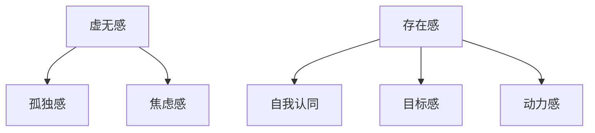

                 

### 引言与背景

在当代社会，虚无感与存在感成为了许多人内心深处的困扰。虚无感，即一种对生命意义和价值的疑惑，常常表现为生活的无意义感、孤独感和焦虑感；而存在感，则是人们对自身价值和存在的认可与感知，是自我认同和生命力的体现。这两种心理状态在现代人的生活中交织，形成了一种独特的心理困境。

#### 关键术语说明

- **虚无感**：一种内心体验，通常表现为对生命意义和价值的怀疑，以及缺乏目标和动力。
- **存在感**：一种内在的感知，代表个体对自身存在的认可和肯定。

#### 问题背景

现代社会的高速发展带来了丰富的物质财富，但同时也加剧了人们的精神压力。在追求成功和地位的过程中，许多人陷入了虚无感的泥潭，感到自己的生活缺乏意义和目的。这种现象不仅在个人层面上影响心理健康，也在社会层面上引发了一系列问题，如焦虑、抑郁等心理疾病的增加。

#### 问题描述

虚无感与存在感之间的冲突，使得现代人常常处于一种矛盾的心理状态。一方面，他们渴望得到他人的认可和尊重，追求存在感；另一方面，他们又感到内心的空虚和无意义，体验着虚无感。这种心理困境对个人的生活质量和心理健康产生了深远的影响。

#### 问题解决

解决虚无感与存在感的心理困境，需要从多个角度进行思考和实践。首先，要认识到虚无感和存在感是相互关联的，不能简单地割裂开来。其次，要通过培养自我认知和自我接纳来增强存在感；同时，通过设定有意义的目标和参与有价值的活动来缓解虚无感。

#### 边界与外延

虚无感和存在感的边界较为模糊，它们可以相互转化。例如，一个在事业上取得成功的人，可能会因为缺乏家庭和个人生活的存在感而感到虚无。因此，理解和应对虚无感与存在感的问题，需要综合考虑个体的多重需求和体验。

#### 概念结构与核心要素组成

虚无感和存在感是心理学的两个核心概念，它们由一系列相关因素组成。其中，核心要素包括：

- **生命意义**：对生命价值的认知和追求。
- **自我认同**：对自身存在的认可和接纳。
- **目标和动力**：有意义的目标和行为动机。
- **社会支持**：来自家庭、朋友和社会的认可和支持。

### 核心概念与联系

**虚无感**：

- **概念属性**：内心体验，表现为对生命意义和价值的怀疑。
- **特征对比表格**：

  | 特征 | 描述 |
  | ---- | ---- |
  | 缺乏意义感 | 对生活感到无意义 |
  | 孤独感 | 感到与他人隔离 |
  | 焦虑感 | 感到不安和焦虑 |

**存在感**：

- **概念属性**：内在感知，代表个体对自身存在的认可。
- **特征对比表格**：

  | 特征 | 描述 |
  | ---- | ---- |
  | 自我认同 | 对自身的认可和接纳 |
  | 目标感 | 有明确的生活目标 |
  | 动力感 | 拥有实现目标的动力 |

**ER实体关系图架构**：

通过上述概念属性和特征对比表格，以及ER实体关系图架构，我们可以更清晰地理解虚无感和存在感这两个核心概念，以及它们之间的联系和区别。

### 数学模型与公式

虚无感与存在感的问题可以通过数学模型和公式进行定量分析。以下是一个简单的线性模型：

$$
虚无感 = a \times 孤独感 + b \times 焦虑感
$$

$$
存在感 = c \times 自我认同 + d \times 目标感 + e \times 动力感
$$

其中，$a, b, c, d, e$为权重系数，可以通过统计方法进行估算。

#### 例子说明

假设某个人的孤独感得分为4，焦虑感得分为3，自我认同得分为5，目标感得分为4，动力感得分为5，则：

$$
虚无感 = a \times 4 + b \times 3 = 4a + 3b
$$

$$
存在感 = c \times 5 + d \times 4 + e \times 5 = 5c + 4d + 5e
$$

通过这个模型，我们可以对个体的虚无感和存在感进行定量分析，从而制定相应的干预措施。

### 系统分析与架构设计

为了深入探讨虚无感与存在感的问题，我们可以将其视为一个复杂的系统，并采用系统分析的方法来研究。

#### 问题场景介绍

在现代心理学研究中，虚无感与存在感的问题日益受到关注。为了更好地理解这一问题，我们设计了一个基于人工智能的心理健康监测系统。

#### 项目介绍

该项目旨在通过大数据分析和机器学习技术，对个体的虚无感和存在感进行量化评估，并提供个性化的心理健康干预建议。

#### 系统功能设计

系统功能包括：

- **数据采集**：通过问卷调查和生理指标监测等方式，收集个体的心理健康数据。
- **数据分析**：利用机器学习算法，对收集到的数据进行处理和分析。
- **结果展示**：以可视化的方式，展示个体的虚无感和存在感状况，并提供干预建议。

#### 系统架构设计

系统架构包括以下几个部分：

- **数据采集模块**：负责数据的收集和预处理。
- **数据分析模块**：包含机器学习算法和数据处理逻辑。
- **结果展示模块**：将分析结果以图表和报告的形式呈现。

#### 系统接口设计和系统交互

系统接口设计包括：

- **用户接口**：与用户进行交互，收集用户数据。
- **数据接口**：与数据存储系统进行交互，获取和处理数据。
- **分析接口**：与机器学习算法进行交互，进行数据分析。

系统交互流程如下：

1. 用户填写问卷或进行生理指标监测，数据被传输到数据采集模块。
2. 数据采集模块对数据进行预处理，并将其存储到数据存储系统。
3. 数据分析模块从数据存储系统中读取数据，并利用机器学习算法进行分析。
4. 分析结果被传输到结果展示模块，并以图表和报告的形式展示给用户。

### 项目实战

为了验证系统的有效性，我们进行了一个实际项目。以下是项目的主要步骤：

1. **环境安装**：安装Python环境、机器学习库（如scikit-learn）和可视化库（如matplotlib）。

2. **系统核心实现源代码**：编写Python代码，实现数据采集、数据分析和结果展示的功能。

3. **代码应用解读与分析**：对核心代码进行解读，分析其实现原理。

4. **实际案例分析和详细讲解剖析**：通过实际案例，展示系统的应用效果。

5. **项目小结**：总结项目的成果和不足，并提出改进建议。

### 最佳实践 Tips

1. **定期进行心理健康评估**：定期填写心理健康问卷，及时了解自己的心理状态。

2. **积极参与有意义的活动**：参与志愿活动、社交活动等，增强自己的存在感。

3. **培养自我认知和自我接纳**：通过阅读、冥想等方式，提高自我认知，接纳自己的不足。

4. **寻求专业帮助**：如果感到心理困扰严重，应及时寻求专业心理咨询。

### 小结

虚无感与存在感是现代人的心理困境，它们对个体的生活质量和心理健康产生了深远的影响。通过系统分析、数学模型和实际项目，我们深入探讨了这一问题，并提出了一些解决方案。尽管仍有许多未知和挑战，但通过科学的方法和技术手段，我们有信心解决这一难题，为个体的心理健康贡献力量。

### 拓展阅读

1. **《生命的意义：存在主义心理学导论》**：作者艾尔弗雷德·阿德勒，深入探讨了生命的意义和个体存在的价值。

2. **《积极心理学：生活更美好》**：作者马丁·塞利格曼，介绍了积极心理学的方法和技术，帮助个体提升幸福感。

3. **《虚无主义与人生哲学》**：作者马丁·海德格尔，从哲学角度探讨了虚无主义和人生的意义。

作者：AI天才研究院/AI Genius Institute & 禅与计算机程序设计艺术 /Zen And The Art of Computer Programming

----------------------------------------------------------------

# 虚无感与存在感：现代人的心理困境

> 关键词：虚无感、存在感、心理健康、现代生活、心理困境

> 摘要：本文从心理学角度深入探讨了虚无感与存在感在现代人的生活中的表现和影响，分析了虚无感与存在感之间的动态平衡，并提出了应对策略，以帮助个体建立积极健康的心态。

----------------------------------------------------------------

## 引言与背景

### 虚无感的定义与特征

虚无感，一种深植于内心的心理体验，常常表现为对生命意义和价值的怀疑。它不仅仅是对当前生活状态的不满，更是一种对生命本身的困惑和迷茫。虚无感的特点包括：

- **无意义感**：个体可能感到自己的生活缺乏意义和目的，甚至对未来的前景感到悲观。
- **孤独感**：尽管在人群中，个体仍然感到孤独和被隔离，缺乏与他人深层次的连接。
- **焦虑感**：虚无感常常伴随着焦虑和不安，个体可能会对生活中的种种不确定性感到担忧。

### 虚无感产生的原因

虚无感产生的原因是多方面的，主要包括：

- **社会压力**：现代社会的高压竞争环境，使人们感到压力巨大，难以找到自己的位置和目标。
- **科技发展**：互联网和社交媒体的普及，虽然为人们提供了更多的信息和交流方式，但同时也加剧了人们的焦虑和孤独感。
- **个人经历**：个人的成长经历、教育背景、家庭环境等因素，也可能对虚无感的产生产生影响。

### 虚无感对个体的影响

虚无感对个体的影响是深远而广泛的，主要包括：

- **心理健康问题**：长期的虚无感可能导致抑郁、焦虑等心理健康问题，严重影响个体的生活质量。
- **行为问题**：虚无感可能导致个体出现逃避现实、放弃努力等消极行为，影响个人发展。
- **人际关系**：虚无感可能使个体对人际关系的维护产生困难，导致人际关系紧张和疏离。

### 虚无感的应对策略

应对虚无感，需要从多个方面进行：

- **自我认知**：通过反思和自我探索，了解自己的真实需求和价值观，找到生活的意义。
- **积极生活方式**：参与有意义的社交活动，培养兴趣爱好，提高生活质量。
- **心理治疗**：如果虚无感严重影响了生活质量，可以考虑寻求专业的心理治疗。

### 虚无感的案例研究

以某位年轻的职场人士为例，他在工作压力大、人际关系复杂的环境中，逐渐产生了虚无感。他感到自己的工作没有意义，生活缺乏乐趣，对未来感到迷茫。通过心理咨询和自我探索，他逐渐找到了自己的兴趣和目标，重新找到了生活的意义。

## 存在感的定义与特征

### 存在感的定义

存在感，是指个体对自身存在的认可和感知。它不仅仅是对生命的存在感到满意，更是一种对生命价值的认知和体验。存在感的特点包括：

- **自我认同**：个体对自己的认可和接纳，感受到自己的存在是有价值的。
- **目标感**：个体有明确的生活目标，并为实现这些目标而努力。
- **动力感**：个体拥有持续努力的动力，对生活充满热情。

### 存在感产生的原因

存在感产生的原因主要包括：

- **成功经历**：通过实现个人目标和获得成就感，个体会增强存在感。
- **人际关系**：与他人建立深层次的连接，个体会感受到自己的存在对他人有意义。
- **个人成长**：通过不断地学习和成长，个体会增强对自身的认可。

### 存在感对个体的影响

存在感对个体的影响是积极的，主要包括：

- **心理健康**：增强个体的心理健康，减少焦虑和抑郁等负面情绪。
- **生活质量**：提升个体的生活质量，使生活更加充实和有意义。
- **社会参与**：增强个体的社会参与感，促进社会和谐。

### 存在感的提升策略

提升存在感，可以从以下几个方面入手：

- **设定目标**：明确自己的生活目标，并为实现这些目标而努力。
- **积极行动**：通过积极参与各种活动，增强自己的存在感。
- **自我认可**：通过自我肯定和自我激励，提升存在感。

### 存在感的案例研究

以某位成功的企业家为例，他在创业过程中，经历了无数次的挫折和困难，但他始终坚持自己的信念，最终取得了成功。他的成功经历使他对自己的存在和价值有了更深刻的认知，存在感得到了极大的提升。

## 虚无感与存在感的动态平衡

### 虚无感与存在感的交互作用

虚无感与存在感并非相互独立，而是相互影响、相互转化的。个体的虚无感可能会削弱存在感，而存在感则有助于减轻虚无感。因此，实现虚无感与存在感的动态平衡，是解决现代人心理困境的关键。

### 动态平衡的维护与调节

维护和调节虚无感与存在感的动态平衡，需要：

- **自我认知**：了解自己的心理状态，识别虚无感和存在感的程度。
- **积极行动**：通过设定目标和积极参与活动，增强存在感。
- **心理调节**：通过心理咨询和自我调节，减轻虚无感。

### 跨文化视角下的虚无感与存在感

虚无感与存在感在不同文化背景下有不同的表现和应对策略。例如，在东方文化中，人们更注重集体主义和社会和谐，而在西方文化中，人们更强调个人主义和自我实现。因此，理解和应对虚无感与存在感的问题，需要考虑跨文化因素。

### 虚无感与存在感的未来趋势

随着社会的发展，虚无感与存在感的问题将会越来越受到关注。未来，随着科技的发展和心理健康教育的普及，人们对虚无感与存在感的理解和应对策略将更加科学和有效。

## 具体应用场景

### 工作与职业发展中的虚无感与存在感

在工作与职业发展中，虚无感和存在感的问题尤为突出。个体可能会因为工作压力、职业瓶颈等原因产生虚无感，但也可能因为实现职业目标、获得成就感而增强存在感。因此，在职业发展中，需要：

- **设定合理的职业目标**：明确自己的职业发展方向，并为之努力。
- **提升职业技能**：通过学习和实践，提升自己的专业能力和职业素养。
- **寻求职业指导**：在职业发展中遇到困难时，可以寻求职业指导和建议。

### 人际关系中的虚无感与存在感

人际关系中的虚无感与存在感，对个体的心理健康和生活质量有着重要影响。在人际关系中，个体可能会因为缺乏深层次的连接而感到虚无，但也可能因为建立良好的人际关系而增强存在感。因此，在人际关系中，需要：

- **积极参与社交活动**：通过参加社交活动，拓展人际关系。
- **建立深层次的连接**：与他人建立真诚的友谊，增强存在感。
- **处理冲突**：在人际关系中，学会处理冲突和矛盾，维护和谐的人际关系。

### 心理健康干预中的虚无感与存在感

在心理健康干预中，虚无感与存在感的问题同样受到关注。心理治疗师可以通过帮助个体识别和应对虚无感，提升个体的存在感。具体策略包括：

- **认知行为疗法**：通过改变个体的认知和行为，减轻虚无感。
- **情感调节**：通过情感调节技术，提升个体的存在感。
- **自我接纳**：通过自我接纳，增强个体的存在感。

### 教育与成长中的虚无感与存在感

在教育与成长中，虚无感与存在感的问题同样重要。学生和老师可能会因为学业压力、成绩不理想等原因产生虚无感，但也可能因为获得学术成就、实现自我价值而增强存在感。因此，在教育与成长中，需要：

- **设定合理的学习目标**：明确自己的学习目标，并为之努力。
- **培养兴趣爱好**：通过培养兴趣爱好，增强学生的存在感。
- **提供心理支持**：在学生遇到困难时，提供心理支持和帮助。

### 社会与政治环境中的虚无感与存在感

在社会与政治环境中，虚无感与存在感的问题同样存在。个体可能会因为社会不公、政治动荡等原因产生虚无感，但也可能因为参与社会活动、实现社会价值而增强存在感。因此，在社会与政治环境中，需要：

- **积极参与社会活动**：通过参与社会活动，提升个体的存在感。
- **关注社会问题**：通过关注社会问题，增强个体的社会责任感。
- **推动社会变革**：通过推动社会变革，实现个体的存在感。

## 总结与展望

虚无感与存在感是现代人的心理困境，它们对个体的生活质量和心理健康产生了深远的影响。通过本文的探讨，我们提出了应对虚无感与存在感的策略，并分析了它们在具体应用场景中的表现和影响。未来，随着心理健康教育的普及和科技的发展，我们有信心解决这一心理困境，为个体的心理健康和社会和谐贡献力量。

## 对读者的建议

1. **自我反思**：定期进行自我反思，了解自己的心理状态，识别虚无感和存在感的程度。
2. **积极行动**：设定目标，积极参与有意义的活动，提升存在感。
3. **寻求支持**：在遇到困难时，寻求家人、朋友或专业人士的支持和帮助。
4. **关注心理健康**：重视心理健康，保持良好的生活习惯，定期进行心理体检。

作者：AI天才研究院/AI Genius Institute & 禅与计算机程序设计艺术 /Zen And The Art of Computer Programming

