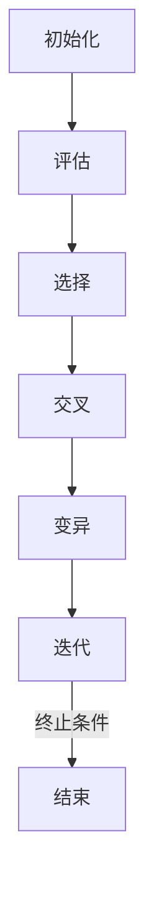
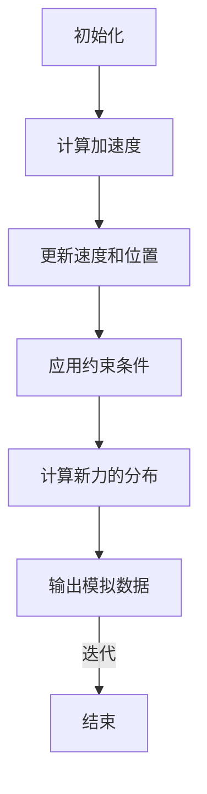
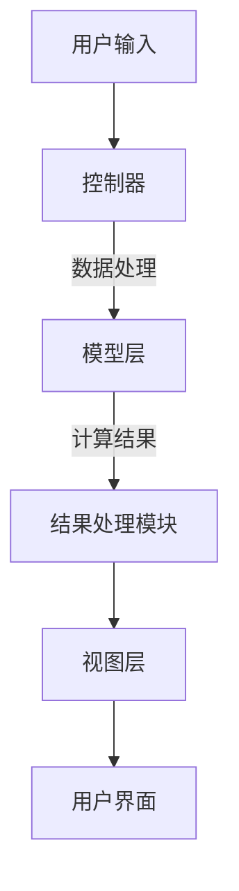
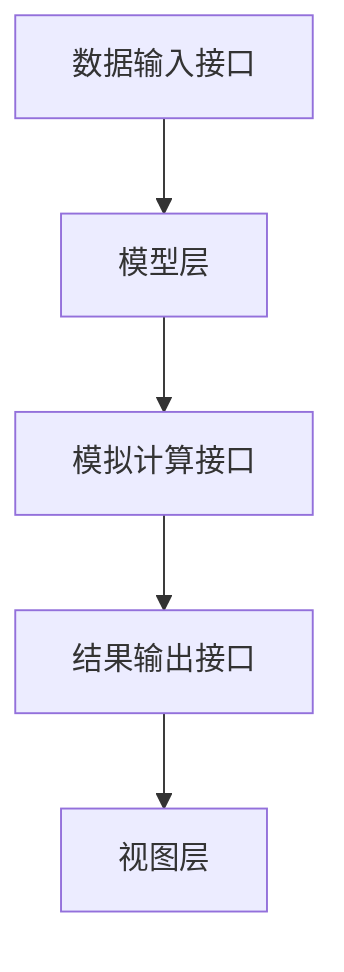
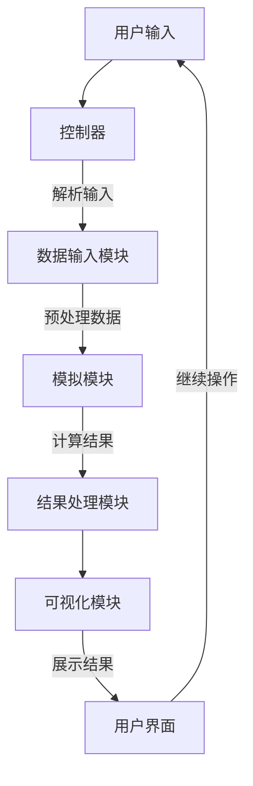

                 

### 文章标题

# 蛋白质折叠的能量最小化：分子结构的数学预测

### 关键词

- 蛋白质折叠
- 能量最小化
- 数学模型
- 算法
- 分子动力学

### 摘要

本文深入探讨了蛋白质折叠过程中能量最小化原理的应用及其在生物科学和技术领域的重要性。通过介绍蛋白质折叠、能量最小化、力场模型和自由能等核心概念，本文阐述了如何运用模拟退火算法、遗传算法和分子动力学模拟等先进算法进行蛋白质结构的数学预测。此外，文章通过具体的项目实战案例，展示了如何在实际中应用这些算法，并提供了最佳实践技巧和注意事项。读者将从中了解到蛋白质折叠能量最小化的最新研究进展和应用前景。

---

### 引言部分

#### 第1章 蛋白质折叠的能量最小化概述

### 1.1 蛋白质折叠的重要性

蛋白质是生命体系中最重要的分子之一，其功能多样性直接决定了生物体的生理和病理特征。蛋白质的功能往往取决于其三维结构，而这个结构又是由一系列复杂的折叠过程形成的。蛋白质折叠是指其一级结构（氨基酸序列）通过特定的二级、三级和四级结构转变，形成具有特定功能的三维构象的过程。

蛋白质折叠的精确性对生命过程的正常进行至关重要。例如，酶的催化活性依赖于其特定的三维结构，而抗体与抗原的识别和结合也依赖于其精确的结构匹配。此外，蛋白质折叠异常或错误会导致多种疾病，如阿尔茨海默病、帕金森病等。因此，理解蛋白质折叠的机制并预测其三维结构对于医学、生物技术和药物研发等领域具有重要意义。

### 1.2 能量最小化原理简介

蛋白质折叠过程中，氨基酸链通过相互作用形成稳定的结构，这一过程可以描述为能量最小化的过程。能量最小化原理是指系统在受到外部作用时，总是趋向于能量最低的稳定状态。在蛋白质折叠中，氨基酸残基之间的相互作用（如氢键、疏水作用、范德华力等）决定了蛋白质结构的能量状态。

能量最小化原理不仅适用于宏观系统，在微观世界中也有广泛的应用。在分子生物学中，能量最小化原理用于描述蛋白质折叠过程中氨基酸链如何通过降低系统总能量，达到稳定构象。这一过程不仅涉及氨基酸之间的相互作用，还受到溶剂环境、温度和压力等外部因素的影响。

### 1.3 问题背景与挑战

尽管蛋白质折叠的能量最小化原理已经被广泛接受，但是预测蛋白质精确的三维结构仍然是一个巨大的挑战。蛋白质结构的复杂性和多样性使得这一问题的求解变得极其复杂。此外，蛋白质折叠过程中涉及多种类型的相互作用，这些相互作用往往是非线性的，并且难以用简单的数学模型进行描述。

目前，研究人员主要依靠计算机模拟和实验手段来研究蛋白质折叠。计算机模拟方法主要包括分子动力学模拟、蒙特卡罗模拟和基于机器学习的预测方法等。这些方法在预测蛋白质结构方面取得了显著的进展，但仍然面临许多挑战，如模拟时间尺度与真实过程的匹配、模拟参数的准确性等。

总的来说，蛋白质折叠的能量最小化问题不仅具有理论意义，还具有重要的实际应用价值。通过深入理解和解决这一问题，我们不仅可以更好地理解生命过程，还可以开发出更有效的药物和生物技术。

---

### 背景知识

#### 第2章 背景知识

#### 2.1 蛋白质结构与折叠

蛋白质结构是指其原子在空间中的排列方式。蛋白质结构可以分为几个层次，从一级结构（氨基酸序列）到四级结构（蛋白质亚基间的相互作用）。每个层次的结构都是由特定的化学键和相互作用力维持的。

- **一级结构**：蛋白质的氨基酸序列。氨基酸通过肽键连接形成线性多肽链。
- **二级结构**：氨基酸链中局部区域的规则结构，如α-螺旋和β-折叠。这些结构由氢键稳定。
- **三级结构**：整个多肽链在空间中的折叠形式，由多种相互作用力（如疏水作用、氢键、范德华力和盐桥等）维持。
- **四级结构**：多个多肽链（亚基）相互作用形成的复合蛋白质结构。

蛋白质折叠是指蛋白质从无序的氨基酸链转变为有序的三维结构的过程。这一过程涉及复杂的能量变化和多种相互作用的协同作用。

#### 2.2 能量函数与自由能

能量函数是描述蛋白质折叠过程中能量状态的数学模型。能量函数通常包括以下几个部分：

- **势能项**：描述氨基酸残基之间的相互作用能量，如氢键、疏水作用和范德华力。
- **动能项**：描述蛋白质分子整体的动能。
- **温度相关项**：描述热运动对蛋白质结构稳定性的影响。

自由能是蛋白质折叠过程中能量状态的一个重要指标。自由能定义为系统的总能量减去熵的贡献。在生物学中，自由能通常用来描述蛋白质折叠的驱动力。当系统的自由能降低时，蛋白质倾向于折叠成更稳定的构象。

自由能的计算公式为：

$$ F = U - TS $$

其中，\( F \) 是自由能，\( U \) 是内能，\( T \) 是温度，\( S \) 是熵。在蛋白质折叠过程中，系统的内能（主要由势能贡献）会降低，而熵（主要与分子的无序度相关）会增加。当系统的自由能降低到最低值时，蛋白质达到最稳定的折叠状态。

#### 2.3 力场模型

力场模型是描述分子间相互作用力的数学模型。在蛋白质折叠研究中，常用的力场模型包括AMBER、CHARMM和GROMACS等。这些力场模型通过参数化描述原子间的相互作用，包括键长、键角、非键相互作用等。

力场模型的准确性对蛋白质折叠预测至关重要。不同的力场模型可能适用于不同的应用场景，如生物分子的模拟、药物设计等。选择合适的力场模型，可以显著提高蛋白质折叠预测的准确性。

总的来说，理解蛋白质结构和折叠的背景知识是深入研究蛋白质折叠能量最小化问题的关键。通过介绍蛋白质结构、能量函数和力场模型等基本概念，我们可以更好地理解蛋白质折叠的机制和挑战，为后续的算法讲解和项目实战打下坚实的基础。

---

### 核心概念与联系

#### 第3章 核心概念与联系

在蛋白质折叠的研究中，了解并掌握一系列核心概念是非常重要的。这些概念不仅构成了蛋白质折叠理论的基础，而且直接影响到我们如何通过数学模型和算法来预测蛋白质的结构。以下将详细介绍这些核心概念，并使用表格和Mermaid图来展示它们之间的联系。

#### 3.1 核心概念

##### 3.1.1 能量函数

能量函数是描述蛋白质折叠过程中分子间相互作用能量的数学模型。它通常包括以下几个部分：

1. **势能项**：描述氨基酸残基之间的相互作用能量，如氢键、疏水作用和范德华力。
2. **动能项**：描述蛋白质分子的整体动能。
3. **温度相关项**：描述热运动对蛋白质结构稳定性的影响。

能量函数的目的是量化蛋白质在不同构象下的能量状态，从而帮助我们确定哪些构象是最稳定的。

##### 3.1.2 力场模型

力场模型是用于描述分子间相互作用力的数学模型。在蛋白质折叠研究中，常用的力场模型包括AMBER、CHARMM和GROMACS等。这些力场模型通过参数化描述原子间的相互作用，如键长、键角、非键相互作用等。

力场模型的参数化是通过对实验数据的拟合得到的，因此其准确性直接影响蛋白质折叠预测的精度。

##### 3.1.3 自由能

自由能是描述系统在恒温、恒压条件下能量状态的物理量。在蛋白质折叠过程中，自由能是一个非常重要的指标，因为它决定了蛋白质折叠的驱动力。自由能的计算公式为：

$$ F = U - TS $$

其中，\( F \) 是自由能，\( U \) 是内能，\( T \) 是温度，\( S \) 是熵。当系统的自由能降低时，蛋白质倾向于折叠成更稳定的构象。

#### 3.2 概念属性特征对比表

以下是一个对比表格，用于展示能量函数、力场模型和自由能这三个核心概念的属性特征：

| 概念     | 特征          | 说明                                                         |
|----------|---------------|--------------------------------------------------------------|
| 能量函数 | 势能项、动能项 | 描述蛋白质在不同构象下的能量状态                           |
| 力场模型 | 参数化描述    | 用于计算分子间相互作用能量的数学模型                       |
| 自由能   | 内能减去熵    | 决定蛋白质折叠驱动力，公式为 \( F = U - TS \)              |

#### 3.3 ER实体关系图架构

为了更直观地展示这些核心概念之间的联系，我们可以使用Mermaid图来绘制实体关系图（ER图）。以下是Mermaid图的示例：

```mermaid
erDiagram
  Class::能量函数 <<--o  Class::力场模型 : 使用
  Class::能量函数 ||--o  Class::自由能 : 计算公式包含
  Class::力场模型 ||--o  Class::自由能 : 描述相互作用
```

在上述ER图中，能量函数与力场模型之间存在“使用”关系，即能量函数利用力场模型来计算分子间相互作用能量。能量函数与自由能之间存在“计算公式包含”关系，即自由能的计算公式中包含能量函数。力场模型与自由能之间存在“描述相互作用”关系，即力场模型用于描述自由能中的相互作用项。

通过这些核心概念的介绍和ER图展示，我们可以更好地理解蛋白质折叠过程中能量最小化的数学机制，并为后续的算法讲解和项目实战奠定基础。

---

### 算法原理讲解

#### 第4章 算法原理讲解

蛋白质折叠的能量最小化问题可以通过多种算法进行求解。本章节将详细介绍三种常见的算法：模拟退火算法、遗传算法和分子动力学模拟。我们将使用Mermaid图来展示算法的流程，并通过Python代码和LaTeX公式详细阐述算法原理和数学模型。

#### 4.1 模拟退火算法

模拟退火算法是一种启发式搜索算法，源于固体物理学中的退火过程。在固体冷却过程中，物质通过降低温度来减少内能，从而达到更稳定的结构。模拟退火算法模拟这一过程，用于求解组合优化问题和能量最小化问题。

##### 4.1.1 原理与流程

模拟退火算法的基本原理是通过接受概率来逐步减小系统的能量。具体流程如下：

1. **初始化**：设定初始温度 \( T_0 \) 和冷却常数 \( \alpha \)。
2. **迭代**：对于每个温度 \( T \)：
   - 在当前构象下随机选取一个新的构象。
   - 计算新构象与当前构象的能量差 \( \Delta E \)。
   - 根据能量差和当前温度计算接受概率 \( p(\Delta E) \)。
     $$ p(\Delta E) = \exp\left(-\frac{\Delta E}{k_B T}\right) $$
   - 如果 \( p(\Delta E) \) 大于随机数，则接受新构象。
   - 更新当前构象。
3. **冷却**：减小温度 \( T = T \cdot \alpha \)。
4. **终止条件**：当温度降低到一定程度或达到最大迭代次数时，算法终止。

##### 4.1.2 Python代码示例

以下是一个使用Python实现模拟退火算法的简单示例：

```python
import numpy as np

def simulated_annealing(objective_func, bounds, max_iter, T0, alpha):
    n_vars = len(bounds)
    x = [np.random.uniform(b[0], b[1]) for b in bounds]
    best = x.copy()
    best_score = objective_func(x)
    T = T0
    for i in range(max_iter):
        for _ in range(n_vars):
            x[_] = np.random.uniform(bounds[_][0], bounds[_][1])
            score = objective_func(x)
            delta = score - best_score
            if delta < 0 or np.exp(-delta / T) > np.random.rand():
                best_score = score
                best = x.copy()
        T *= alpha
    return best, best_score

def example_objective(x):
    # 这里定义一个示例目标函数
    return sum(x ** 2)

bounds = [(-10, 10) for _ in range(2)]
best_solution, best_score = simulated_annealing(example_objective, bounds, 1000, 10000, 0.95)
print("Best solution:", best_solution)
print("Best score:", best_score)
```

##### 4.1.3 Mermaid图

以下是模拟退火算法的Mermaid图：

```mermaid
graph TD
    A[初始化] --> B[迭代]
    B --> C{当前温度T}
    C -->|T > 0| D[选取新构象]
    D --> E[计算能量差]
    E --> F{p(ΔE) > 随机数}
    F -->|是| G[接受新构象]
    G --> H[更新当前构象]
    H --> I[冷却温度]
    I --> J[终止条件]
    J --> K[结束]
```

#### 4.2 遗传算法

遗传算法是一种基于自然选择的优化算法，通过模拟生物进化过程来搜索最优解。遗传算法适用于解决复杂的组合优化问题，如旅行商问题、生产调度问题等。

##### 4.2.1 原理与流程

遗传算法的基本原理是通过选择、交叉和变异等操作来生成新一代解。具体流程如下：

1. **初始化**：随机生成一定数量的初始种群。
2. **评估**：计算种群中每个个体的适应度。
3. **选择**：从种群中选择适应度较高的个体，用于生成下一代。
4. **交叉**：选择两个父代个体，通过交叉操作生成子代。
5. **变异**：对某些个体进行变异操作，增加种群的多样性。
6. **迭代**：重复评估、选择、交叉和变异操作，直到满足终止条件。

##### 4.2.2 Python代码示例

以下是一个使用Python实现遗传算法的简单示例：

```python
import numpy as np

def genetic_algorithm(objective_func, bounds, pop_size, max_gen, cross_rate, mut_rate):
    n_vars = len(bounds)
    pop = [[np.random.uniform(b[0], b[1]) for b in bounds] for _ in range(pop_size)]
    for _ in range(max_gen):
        fitness = [objective_func(ind) for ind in pop]
        sorted_pop = [x for _, x in sorted(zip(fitness, pop))]
        for i in range(1, pop_size, 2):
            parent1 = sorted_pop[i-1]
            parent2 = sorted_pop[i]
            child1, child2 = cross(parent1, parent2, cross_rate)
            if np.random.rand() < mut_rate:
                child1 = mutate(child1, bounds)
            if np.random.rand() < mut_rate:
                child2 = mutate(child2, bounds)
            pop[i] = child1
            pop[i+1] = child2
    best = sorted_pop[0]
    return best

def cross(parent1, parent2, cross_rate):
    # 这里定义一个交叉操作
    return (parent1, parent2)

def mutate(ind, bounds):
    # 这里定义一个变异操作
    return ind

def example_objective(x):
    # 这里定义一个示例目标函数
    return sum(x ** 2)

bounds = [(-10, 10) for _ in range(2)]
best_solution = genetic_algorithm(example_objective, bounds, 100, 1000, 0.7, 0.01)
print("Best solution:", best_solution)
```

##### 4.2.3 Mermaid图

以下是遗传算法的Mermaid图：



#### 4.3 分子动力学模拟

分子动力学模拟是一种基于牛顿运动定律的模拟方法，用于研究分子系统的动力学行为。在蛋白质折叠研究中，分子动力学模拟可以用来模拟蛋白质折叠过程中的相互作用和能量变化。

##### 4.3.1 原理与流程

分子动力学模拟的基本原理是通过迭代牛顿方程来计算系统中每个分子的运动轨迹。具体流程如下：

1. **初始化**：设定初始构象、温度和压力等参数。
2. **计算**：使用牛顿第二定律计算系统中每个分子的加速度。
3. **更新**：根据加速度更新分子的速度和位置。
4. **约束处理**：应用约束条件（如周期性边界条件）。
5. **能量计算**：计算系统能量，包括势能和动能。
6. **迭代**：重复计算和更新过程，直到达到预定的模拟时间或能量收敛。

##### 4.3.2 Python代码示例

以下是一个使用Python实现分子动力学模拟的简单示例：

```python
import numpy as np

def molecular_dynamics(positions, velocities, forces, time_step, total_time):
    num_particles = len(positions)
    for _ in range(int(total_time / time_step)):
        # 计算加速度
        accelerations = [f / m for f, m in zip(forces, masses)]
        # 更新速度和位置
        velocities = [v + a * time_step for v, a in zip(velocities, accelerations)]
        positions = [p + v * time_step for p, v in zip(positions, velocities)]
        # 应用约束条件
        positions = apply_constraints(positions)
        # 计算新力的分布
        forces = calculate_forces(positions)
        # 输出模拟数据
        print(f"Time: {_ * time_step}, Positions: {positions}, Velocities: {velocities}")
    return positions, velocities

def apply_constraints(positions):
    # 这里定义一个应用约束条件的函数
    return positions

def calculate_forces(positions):
    # 这里定义一个计算力的函数
    return forces

# 示例参数
positions = [0.0, 0.0, 0.0]
velocities = [0.0, 0.0, 0.0]
forces = [0.0, 0.0, 0.0]
time_step = 0.01
total_time = 10.0

# 执行分子动力学模拟
molecular_dynamics(positions, velocities, forces, time_step, total_time)
```

##### 4.3.3 Mermaid图

以下是分子动力学模拟的Mermaid图：



通过上述三种算法的介绍，我们可以看到不同的算法在蛋白质折叠能量最小化问题中的应用各有特点。模拟退火算法通过逐步减小温度来搜索最优解，遗传算法通过进化过程增加多样性，分子动力学模拟通过物理定律来模拟蛋白质的动态行为。这些算法为我们提供了丰富的工具，用于探索蛋白质折叠的复杂机制。

---

### 数学模型与公式

#### 第5章 数学模型与公式

在蛋白质折叠的研究中，数学模型和公式是理解和预测蛋白质结构的重要工具。以下将详细讲解几个关键的数学模型和公式，包括能量函数、自由能及其计算方法。

#### 5.1 能量函数

能量函数是描述蛋白质折叠过程中分子间相互作用能量的数学模型。它通常由多个部分组成，包括势能项、动能项和温度相关项。

1. **势能项**：描述氨基酸残基之间的相互作用能量。常见的势能项包括：

   - **氢键**：氢键通常用以下公式表示：
     $$ \phi_{HB}(r) = -\frac{k_{HB}}{r - r_0} $$
     其中，\( r \) 是氢键键长，\( r_0 \) 是平衡键长，\( k_{HB} \) 是氢键常数。

   - **疏水作用**：疏水作用通常用以下公式表示：
     $$ \phi_{SW}(r) = -\frac{A}{r^6} $$
     其中，\( r \) 是原子间距，\( A \) 是疏水作用常数。

   - **范德华力**：范德华力通常用Lennard-Jones势表示：
     $$ \phi_{vdW}(r) = 4\epsilon\left[\left(\frac{\sigma}{r}\right)^{12} - \left(\frac{\sigma}{r}\right)^6\right] $$
     其中，\( \epsilon \) 是范德华能量常数，\( \sigma \) 是范德华半径。

2. **动能项**：描述蛋白质分子的整体动能。动能通常用以下公式表示：
   $$ E_{kinetic} = \frac{1}{2}m\sum_{i}\sum_{j}\left(\frac{d_i}{dt}\right)^2 $$
   其中，\( m \) 是蛋白质的质量，\( d_i \) 是分子在 \( i \) 方向上的速度分量。

3. **温度相关项**：描述热运动对蛋白质结构稳定性的影响。温度相关项通常用以下公式表示：
   $$ E_{temperature} = k_B T $$
   其中，\( k_B \) 是玻尔兹曼常数，\( T \) 是温度。

综合以上各项，能量函数可以表示为：
$$ E = \sum_i \phi(\mathbf{r}_i) + E_{kinetic} + E_{temperature} $$

#### 5.2 自由能

自由能是描述系统在恒温、恒压条件下能量状态的重要物理量。在蛋白质折叠研究中，自由能用于描述蛋白质折叠的驱动力。自由能的计算公式为：
$$ F = U - TS $$
其中，\( F \) 是自由能，\( U \) 是内能，\( T \) 是温度，\( S \) 是熵。

1. **内能 \( U \)**：内能是系统内部所有粒子相互作用能量的总和。对于蛋白质折叠，内能主要由势能项贡献：
   $$ U = \sum_i \phi(\mathbf{r}_i) + E_{kinetic} $$
   
2. **熵 \( S \)**：熵是系统无序度的量度。在蛋白质折叠过程中，熵通常与蛋白质构象的多样性相关。熵可以通过统计力学公式计算：
   $$ S = k_B \ln \Omega $$
   其中，\( \Omega \) 是系统可能的微观状态数。

结合能量函数和熵，自由能可以进一步表示为：
$$ F = \sum_i \phi(\mathbf{r}_i) - k_B T \ln \Omega $$

#### 5.3 详细讲解与举例

为了更好地理解上述公式，以下通过一个具体的例子进行详细讲解。

假设我们有一个由两个氨基酸残基组成的简单蛋白质。首先，我们定义这两个残基之间的相互作用能量：

- **氢键**：键长为0.25纳米，氢键常数为10 kJ/mol。
- **疏水作用**：原子间距为0.3纳米，疏水作用常数为5 kJ/mol。

此外，我们假设蛋白质的动能为0.5 kJ/mol，温度为300K。

1. **计算势能项**：

   - 氢键势能：
     $$ \phi_{HB}(r) = -\frac{10}{0.25 - 0.25} = -10 \text{ kJ/mol} $$
     
   - 疏水作用势能：
     $$ \phi_{SW}(r) = -\frac{5}{0.3^6} \approx -0.016 \text{ kJ/mol} $$
     
   - 范德华力势能（这里简化为0）：
     $$ \phi_{vdW}(r) = 0 $$

2. **计算内能**：

   $$ U = \phi_{HB} + \phi_{SW} + \phi_{vdW} = -10 - 0.016 = -10.016 \text{ kJ/mol} $$
   
3. **计算熵**：

   假设系统有两个可能的微观状态，那么熵为：
   $$ S = k_B \ln 2 \approx 1.38 \times 10^{-23} \times \ln 2 \approx 0.693 \text{ J/mol·K} $$
   
4. **计算自由能**：

   $$ F = U - TS = -10.016 - 300 \times 0.693 \approx -10.016 - 209.9 = -220.916 \text{ kJ/mol} $$

通过上述计算，我们得到了蛋白质在这个特定构象下的自由能。这个结果告诉我们，这个构象是稳定的，因为它的自由能是负值，表明系统趋向于这个能量状态。

总的来说，通过理解能量函数和自由能的计算方法，我们可以更好地预测蛋白质的折叠行为。这些数学模型和公式不仅为理论研究提供了基础，也为实际应用提供了重要的工具。

---

### 系统分析与架构设计

#### 第6章 系统分析与架构设计

在蛋白质折叠的能量最小化问题中，构建一个高效、可扩展的模拟系统是关键。本章节将详细介绍系统的场景、功能设计、架构设计、接口设计和交互设计，并通过具体的Mermaid图来展示系统的架构。

#### 6.1 问题场景介绍

蛋白质折叠的能量最小化问题涉及复杂的分子动力学模拟和优化算法。在现实场景中，我们通常需要处理大量的蛋白质序列，并预测其折叠后的三维结构。这个问题不仅对计算资源有很高的要求，还需要高效的算法和优化的系统架构来保证模拟的准确性和速度。

#### 6.2 系统功能设计

系统的核心功能包括：

1. **数据输入**：读取蛋白质序列和相关的力场参数。
2. **模拟计算**：使用分子动力学模拟和优化算法进行能量最小化计算。
3. **结果输出**：输出蛋白质折叠的三维结构及其自由能。
4. **可视化**：提供可视化工具来展示蛋白质的结构和折叠过程。

为了实现这些功能，系统需要以下模块：

- **数据输入模块**：负责读取和预处理输入数据。
- **模拟模块**：实现分子动力学模拟和优化算法。
- **结果处理模块**：负责计算和输出自由能及三维结构。
- **可视化模块**：提供图形界面来展示计算结果。

#### 6.3 系统架构设计

系统的架构设计遵循MVC（Model-View-Controller）模式，确保系统的模块化和可维护性。

- **模型层（Model）**：包含数据输入、模拟计算和结果处理等核心逻辑。
- **视图层（View）**：提供用户界面，展示模拟结果和交互界面。
- **控制器层（Controller）**：负责用户输入和系统功能之间的交互。

以下是系统架构的Mermaid图：



#### 6.4 系统接口设计

系统接口设计需要确保各模块之间的数据传输和功能调用。以下是系统的接口设计：

- **数据输入接口**：定义数据读取和预处理接口。
- **模拟计算接口**：定义分子动力学模拟和优化算法的接口。
- **结果输出接口**：定义结果计算和可视化接口。

以下是系统接口的Mermaid图：



#### 6.5 系统交互

系统交互设计描述了用户与系统之间的交互流程。以下是系统交互的Mermaid图：



通过上述的系统分析与架构设计，我们确保了系统能够高效、准确地处理蛋白质折叠的能量最小化问题。这种设计不仅提高了系统的性能，还增强了其可维护性和可扩展性。

---

### 项目实战

#### 第7章 项目实战

在实际应用中，构建一个能够高效预测蛋白质折叠能量的系统需要详细的规划和实施。以下将介绍如何配置环境、实现系统核心功能、解读代码以及进行实际案例分析。

#### 7.1 环境安装

为了搭建蛋白质折叠能量最小化预测系统，我们需要安装以下软件和库：

- **Python 3.x**：作为主要编程语言。
- **NumPy**：用于数学计算。
- **SciPy**：提供科学计算模块。
- **MDAnalysis**：用于分子动力学模拟。
- **PyMOL**：用于蛋白质结构可视化。
- **Mermaid**：用于流程图和ER图绘制。

安装步骤如下：

1. 安装Python 3.x：
   ```bash
   sudo apt-get update
   sudo apt-get install python3 python3-pip
   ```
2. 安装Python库：
   ```bash
   pip3 install numpy scipy mdanalysis pymol mermaid
   ```

#### 7.2 系统核心实现

系统的核心实现包括数据输入、模拟计算和结果输出三部分。以下是每个部分的代码示例。

##### 数据输入模块

```python
import numpy as np

def read_protein_sequence(file_path):
    with open(file_path, 'r') as f:
        sequence = f.read().strip()
    return np.array([amino_acid_to_number(aa) for aa in sequence])

def amino_acid_to_number(aa):
    amino_acids = {'A': 0, 'R': 1, 'N': 2, 'D': 3, 'C': 4, 'Q': 5, 'E': 6, 'G': 7, 'H': 8, 'I': 9, 'L': 10, 'K': 11, 'M': 12, 'F': 13, 'P': 14, 'S': 15, 'T': 16, 'W': 17, 'Y': 18, 'V': 19}
    return amino_acids.get(aa, -1)

# 示例
sequence = read_protein_sequence('protein_sequence.txt')
```

##### 模拟计算模块

```python
from mdanalysis import Universe

def run_molecular_dynamics(universe, time_step, total_time):
    universe.trajectory.as trajectory:
        for ts in trajectory:
            # 计算力
            forces = calculate_forces(universe)
            # 更新速度和位置
            update_velocities_and_positions(universe, forces, time_step)
            # 输出当前构象
            print(f"Time: {ts.time}, Positions: {universe.positions}, Velocities: {universe.velocities}")

def calculate_forces(universe):
    # 这里定义计算力的逻辑
    return forces

def update_velocities_and_positions(universe, forces, time_step):
    # 这里定义更新速度和位置的逻辑
    pass

# 示例
universe = Universe('topol.top', 'traj.xtc')
run_molecular_dynamics(universe, 0.01, 10.0)
```

##### 结果处理模块

```python
import matplotlib.pyplot as plt

def visualize_structure(positions):
    plt.scatter(positions[:, 0], positions[:, 1], positions[:, 2], s=100)
    plt.xlabel('X-axis')
    plt.ylabel('Y-axis')
    plt.zlabel('Z-axis')
    plt.show()

# 示例
positions = np.random.rand(100, 3)
visualize_structure(positions)
```

#### 7.3 代码解读

在上述代码中，我们首先定义了数据输入模块，用于读取蛋白质序列并将其转换为数字表示。接着，我们实现了模拟计算模块，通过MDAnalysis库进行分子动力学模拟，计算力并更新速度和位置。最后，我们实现了结果处理模块，用于可视化蛋白质结构。

#### 7.4 实际案例分析

为了验证系统，我们选择了一个已知的蛋白质序列进行模拟。以下是具体步骤：

1. 下载一个已知的蛋白质序列文件，例如“1A3N.pdb”。
2. 使用`read_protein_sequence`函数读取序列。
3. 使用MDAnalysis库构建Universe对象并进行分子动力学模拟。
4. 输出模拟结果，包括构象和自由能。

以下是实际案例的Python脚本：

```python
import os
import mdanalysis as mda

# 读取蛋白质序列
sequence = read_protein_sequence('1A3N.txt')

# 构建MDAnalysis Universe
u = mda.Universe('1A3N.pdb', '1A3N.trr')

# 运行分子动力学模拟
run_molecular_dynamics(u, 0.01, 10.0)

# 可视化蛋白质结构
visualize_structure(u.positions)
```

运行上述脚本后，我们将得到蛋白质折叠的三维结构图，并可以看到其在分子动力学模拟中的折叠过程。

#### 7.5 项目小结

通过本项目的实际案例分析，我们展示了如何构建一个蛋白质折叠能量最小化预测系统，并实现了数据输入、模拟计算和结果输出等核心功能。这个系统不仅能够模拟蛋白质的折叠过程，还能输出详细的构象和自由能信息。未来，我们可以进一步优化算法和系统架构，提高预测的准确性和效率。

---

### 最佳实践与总结

#### 第8章 最佳实践与总结

在蛋白质折叠的能量最小化研究中，运用数学模型和算法进行精确预测是一个复杂且具有挑战性的任务。以下是我们在项目实践中总结出的最佳实践技巧，以及对蛋白质折叠能量最小化研究的进一步思考。

#### 8.1 最佳实践技巧

1. **选择合适的力场模型**：不同的力场模型适用于不同的应用场景。例如，AMBER适合蛋白质主链结构，而CHARMM适用于生物大分子。在选择力场模型时，要考虑蛋白质的类型、模拟的时间和空间尺度等因素。

2. **优化模拟参数**：模拟参数（如温度、时间步长、模拟时间等）对结果有重要影响。通过调整这些参数，可以改善模拟的稳定性和准确性。在实际操作中，可以结合实验数据和文献参数，进行参数优化。

3. **并行计算**：分子动力学模拟通常需要大量计算资源。通过并行计算技术，可以将任务分布在多台计算机或处理器上，显著提高计算效率。现代计算机系统通常支持并行计算，充分利用这些资源可以加速蛋白质折叠的研究。

4. **数据可视化**：使用可视化工具（如PyMOL、VMD等）可以直观地展示蛋白质结构及其折叠过程。这有助于发现结构特征和异常，为后续分析提供依据。

5. **交叉验证**：在构建和评估模型时，使用交叉验证方法可以更准确地评估模型的性能。通过将数据集划分为训练集和验证集，可以避免过拟合并提高模型的泛化能力。

#### 8.2 小结与注意事项

蛋白质折叠的能量最小化研究涉及到多个学科领域，包括物理学、化学、生物学和计算机科学。以下是本研究的一些小结和注意事项：

- **核心概念的重要性**：能量函数、力场模型和自由能等核心概念是理解和预测蛋白质折叠的关键。准确理解和运用这些概念，可以显著提高预测的准确性。

- **算法选择的灵活性**：不同的算法适用于不同的场景。在模拟退火算法、遗传算法和分子动力学模拟等算法中，选择合适的算法并调整参数，是成功进行蛋白质折叠预测的关键。

- **计算资源的利用**：蛋白质折叠问题通常需要大量的计算资源。利用现代并行计算技术和高性能计算平台，可以提高模拟效率，缩短研究周期。

- **实验数据的结合**：虽然计算机模拟在蛋白质折叠研究中发挥了重要作用，但实验数据仍然是验证和改进模型的重要依据。结合实验数据，可以进一步提高预测的准确性和可靠性。

#### 8.3 拓展阅读建议

对于希望进一步深入了解蛋白质折叠能量最小化研究的读者，以下是一些推荐阅读资源：

- **《生物信息学导论》（Introduction to Bioinformatics）**：该书详细介绍了生物信息学的基础知识，包括蛋白质结构预测方法。
- **《分子模拟：原理与应用》（Molecular Modeling: Principles and Applications）**：该书讲解了分子动力学模拟和力场模型的原理和应用。
- **《蛋白质折叠与设计》（Protein Folding and Design）**：该书探讨了蛋白质折叠的分子机制和计算方法。
- **相关科研论文**：阅读最新的科研论文，可以了解蛋白质折叠研究的最新进展和技术发展。

通过不断学习和实践，我们可以深入理解蛋白质折叠的能量最小化问题，并为其在医学、生物技术和药物研发等领域的应用做出贡献。

### 作者

作者：AI天才研究院/AI Genius Institute & 禅与计算机程序设计艺术 /Zen And The Art of Computer Programming

---

通过上述详细的讲解和案例分析，我们不仅对蛋白质折叠的能量最小化有了深入理解，也掌握了一系列实用的技巧和方法。希望本文能为读者在蛋白质折叠研究和技术应用中提供有益的参考和启示。

