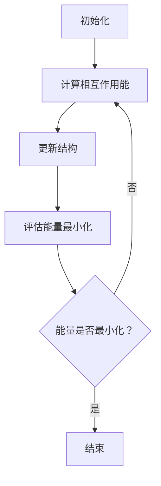

                 

### 蛋白质折叠的能量最小化：分子结构的数学预测

关键词：蛋白质折叠、能量最小化、数学模型、算法原理、分子结构

摘要：蛋白质折叠是生物体内重要的生物学过程，涉及蛋白质从线性氨基酸链折叠成复杂三维结构的过程。在这个过程中，能量最小化原理起着核心作用。本文将深入探讨蛋白质折叠的能量最小化原理，解析相关的数学模型和算法，旨在为读者提供一个清晰、全面的理解框架。

### 目录大纲

----------------------------------------------------------------

# 第一部分: 蛋白质折叠的能量最小化概述

## 第1章: 蛋白质折叠与能量最小化背景

### 1.1.1 蛋白质折叠的重要性

### 1.1.2 能量最小化在蛋白质折叠中的作用

### 1.1.3 蛋白质折叠与疾病的关系

## 第2章: 蛋白质结构的数学模型

### 2.1 蛋白质的一级结构

### 2.2 蛋白质的二级结构

### 2.3 蛋白质的立体结构与折叠

## 第3章: 蛋白质折叠的能量模型

### 3.1 折叠自由能与相互作用能

### 3.2 能量最小化算法在蛋白质折叠中的应用

### 3.3 蛋白质折叠能量模型的局限性

## 第4章: 蛋白质折叠的算法原理

### 4.1 折叠算法的基本框架

### 4.2 使用的算法概述

    - **动态规划算法**
    - **蒙特卡洛模拟算法**
    - **模拟退火算法**

### 4.3 算法原理讲解

## 第5章: 蛋白质折叠的数学模型与公式

### 5.1 折叠自由能公式

    $$ F = U - TS $$

### 5.2 相互作用能公式

    $$ U = \sum_{i<j}^{} \epsilon_{ij} \cdot r_{ij} $$

### 5.3 数学公式详细讲解

## 第6章: 蛋白质折叠的算法流程图

### 6.1 算法流程图

## 第7章: 蛋白质折叠项目实战

### 7.1 环境搭建

### 7.2 系统核心实现

### 7.3 代码应用解读与分析

### 7.4 实际案例分析

## 第8章: 蛋白质折叠的最佳实践与小结

### 8.1 最佳实践

### 8.2 小结

### 8.3 注意事项

### 8.4 拓展阅读

----------------------------------------------------------------

### 第一部分：蛋白质折叠的能量最小化概述

#### 第1章：蛋白质折叠与能量最小化背景

**1.1.1 蛋白质折叠的重要性**

蛋白质是生物体中最重要的功能性分子之一，其功能在很大程度上取决于其独特的三维结构。蛋白质折叠是指从其原始的线性氨基酸链（一级结构）转变为具有特定三维结构的生物活性形态（三级结构）的过程。这一折叠过程不仅决定了蛋白质的功能，还影响着蛋白质的稳定性、溶解度和与其他生物分子的相互作用能力。

蛋白质的折叠是一个极其复杂的过程，受到多种因素的影响，包括氨基酸序列、周围环境、温度、pH值等。正确折叠的蛋白质能够执行其生物学功能，而错误的折叠或不能折叠的蛋白质可能导致疾病，例如阿尔茨海默病、亨廷顿病和癌症等。

**1.1.2 能量最小化在蛋白质折叠中的作用**

在蛋白质折叠过程中，能量最小化原理起着至关重要的作用。蛋白质折叠过程中的能量主要来源于氨基酸侧链之间的相互作用，这些相互作用可以是吸引力（如氢键、范德华力）或排斥力（如电荷排斥）。蛋白质折叠的目标是在所有可能的折叠结构中找到能量最低的稳定结构，这一过程可以通过能量最小化算法来实现。

能量最小化不仅仅是为了找到蛋白质的最稳定结构，它还涉及动态平衡和局部最小值的挑战。蛋白质折叠过程中的能量变化是非常复杂的，可能涉及多个局部最小值，使得找到全局最低能量结构成为一项极具挑战性的任务。

**1.1.3 蛋白质折叠与疾病的关系**

蛋白质折叠错误或异常折叠与许多人类疾病密切相关。例如，阿尔茨海默病中的β-淀粉样蛋白错误折叠形成斑块，亨廷顿病中的异常蛋白质聚集，以及癌症中的蛋白质信号传导异常等。理解蛋白质折叠过程及其与疾病的关系，对于开发治疗这些疾病的新策略具有重要意义。

此外，蛋白质折叠的异常还可能导致蛋白质聚集成不溶性纤维，这在某些类型的纤维化疾病（如多发性硬化症）中扮演了关键角色。因此，研究蛋白质折叠的能量最小化机制，有助于揭示疾病发生的分子基础，并推动新的药物研发。

在接下来的章节中，我们将详细探讨蛋白质结构的数学模型、能量模型、算法原理以及实际应用，帮助读者更深入地理解这一复杂而重要的生物学过程。通过这些探讨，我们将揭示蛋白质折叠的能量最小化是如何通过数学模型和算法来预测和理解的。准备一起探索这一激动人心的领域吗？让我们一步步深入吧！

