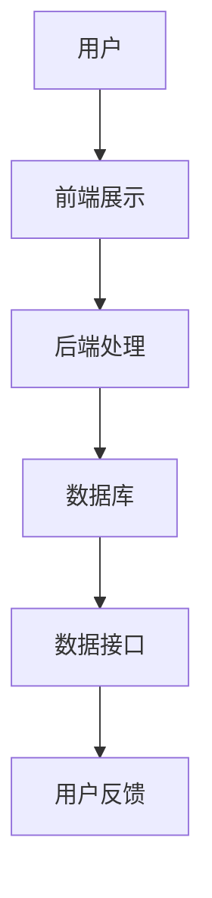
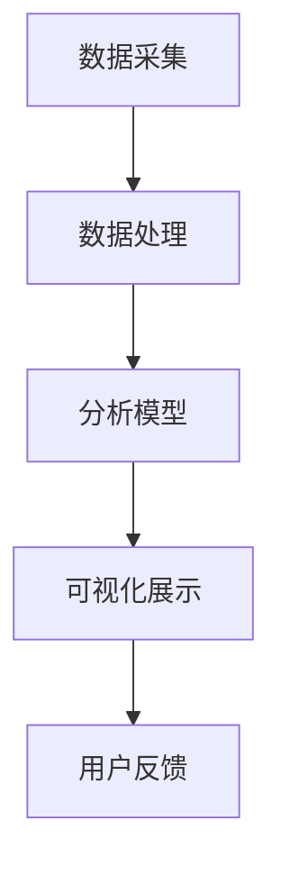
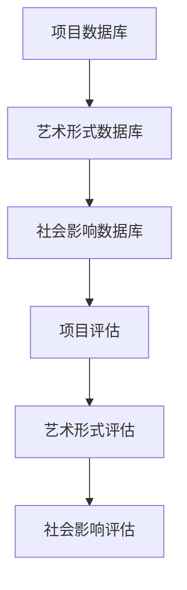

                 


**文章标题：**
街头艺术的意义：城市空间的人文表达

**关键词：**
街头艺术、城市空间、人文表达、文化多样性、社会互动

**摘要：**
本文深入探讨了街头艺术与城市空间的相互作用，揭示了街头艺术在城市空间中的人文表达意义。通过对街头艺术的核心概念解析、历史演变、应用场景及价值评估的详细分析，本文旨在为读者呈现街头艺术在城市文化中的重要地位，并提出未来发展的展望。

## 引言：街头艺术与城市空间的关系

### 1.1 问题背景

**核心概念术语说明：**
- **街头艺术**：指在公共空间自发创作、大众参与的视觉艺术形式。
- **城市空间**：指城市的地理范围和物理环境，包括城市中心区、社区街道和非正规场所等。

**问题背景：**
随着城市化进程的加速，街头艺术作为一种独特的社会现象，逐渐成为城市文化的重要组成部分。它不仅反映了社会的多样性和创造力，还与城市空间的发展紧密相连。街头艺术的创作和展示形式多样，包括壁画、涂鸦、雕塑等，这些艺术作品往往能够在城市空间中引起强烈的视觉冲击和情感共鸣。

### 1.2 问题描述

**问题描述：**
街头艺术如何影响城市空间？它如何体现人文精神？在当前的社会文化背景下，街头艺术的发展面临哪些挑战和机遇？

**问题解决：**
通过系统研究街头艺术与城市空间的相互关系，我们可以更好地理解街头艺术的价值，探索其在城市文化中的角色和功能，从而为城市规划和文化建设提供有益的参考。

### 1.3 研究方法与理论基础

**研究方法：**
本文采用文献综述、案例分析、实证研究和理论分析相结合的方法，对街头艺术与城市空间的关系进行深入探讨。

**理论基础：**
本文基于城市社会学、文化人类学和视觉艺术理论，结合国内外相关研究成果，构建了一个全面的分析框架，以期为街头艺术的研究提供理论支持。

### 1.4 边界与外延

**边界与外延：**
街头艺术的定义范围包括壁画、涂鸦、街头雕塑等在公共空间进行的艺术创作。城市空间的界定则涵盖了城市的所有区域，包括商业区、居住区、文化区等。

## 核心概念与联系

### 2.1 街头艺术概念解析

**核心概念原理：**
街头艺术起源于民间，是一种具有高度社会参与性和公共性的艺术形式。它不受传统艺术领域的限制，强调个人表达和社会参与。

**概念属性特征对比表格：**

| 概念         | 属性特征                           |
|------------|----------------------------------|
| 街头艺术     | 自发创作、大众参与、公共空间展示       |
| 城市空间     | 功能性、文化性、社会性                   |

**ER实体关系图架构：**

```mermaid
erDiagram
  Artist --> ArtWork : 创作
  ArtWork --> PublicSpace : 展示
  PublicSpace --> City : 存在于
  City --> Culture : 文化表达
```

### 2.2 城市空间概念解析

**核心概念原理：**
城市空间不仅是物理空间，还承载了丰富的社会文化意义。它包括功能性的公共设施、文化性的艺术空间和社会性的社区空间。

**概念属性特征对比表格：**

| 概念         | 属性特征                           |
|------------|----------------------------------|
| 街头艺术     | 自发创作、大众参与、公共空间展示       |
| 城市空间     | 功能性、文化性、社会性                   |

**ER实体关系图架构：**

```mermaid
erDiagram
  City --> Building : 建筑物
  Building --> PublicSpace : 公共空间
  PublicSpace --> ArtWork : 艺术作品
  ArtWork --> Artist : 艺术家
```

## 核心概念与联系

### 2.1 街头艺术概念解析

**核心概念原理：**
街头艺术起源于民间，是一种具有高度社会参与性和公共性的艺术形式。它不受传统艺术领域的限制，强调个人表达和社会参与。

**概念属性特征对比表格：**

| 概念         | 属性特征                           |
|------------|----------------------------------|
| 街头艺术     | 自发创作、大众参与、公共空间展示       |
| 城市空间     | 功能性、文化性、社会性                   |

**ER实体关系图架构：**

```mermaid
erDiagram
  Artist --> ArtWork : 创作
  ArtWork --> PublicSpace : 展示
  PublicSpace --> City : 存在于
  City --> Culture : 文化表达
```

### 2.2 城市空间概念解析

**核心概念原理：**
城市空间不仅是物理空间，还承载了丰富的社会文化意义。它包括功能性的公共设施、文化性的艺术空间和社会性的社区空间。

**概念属性特征对比表格：**

| 概念         | 属性特征                           |
|------------|----------------------------------|
| 街头艺术     | 自发创作、大众参与、公共空间展示       |
| 城市空间     | 功能性、文化性、社会性                   |

**ER实体关系图架构：**

```mermaid
erDiagram
  City --> Building : 建筑物
  Building --> PublicSpace : 公共空间
  PublicSpace --> ArtWork : 艺术作品
  ArtWork --> Artist : 艺术家
```

### 2.3 概念属性特征对比表格

| 概念         | 属性特征                           |
|------------|----------------------------------|
| 街头艺术     | 自发创作、大众参与、公共空间展示       |
| 城市空间     | 功能性、文化性、社会性                   |

### 2.4 ER实体关系图架构

```mermaid
erDiagram
  Artist --> ArtWork : 创作
  ArtWork --> PublicSpace : 展示
  PublicSpace --> City : 存在于
  City --> Culture : 文化表达
```

## 第3章 街头艺术在城市空间中的应用

### 3.1 历史演变

**背景介绍：**
街头艺术的历史可以追溯到古代，当时的街头艺术形式主要是壁画和涂鸦。随着社会的发展，街头艺术的形式和内容不断丰富，逐渐成为现代城市文化的重要组成部分。

**问题场景：**
现代街头艺术如何演变？它的发展受到了哪些因素的影响？

**项目介绍：**
本文将介绍几个典型的街头艺术演变案例，如美国涂鸦艺术运动和法国巴黎的街头壁画。

**系统功能设计：**
- 案例收集与整理
- 案例分析与对比
- 案例可视化展示

**系统架构设计：**
- 数据库设计
- 前端展示设计
- 后端逻辑处理

**系统接口设计和系统交互：**
- 用户接口
- 数据接口
- 交互流程

**mermaid架构图：**



### 3.2 不同城市空间中的街头艺术

**背景介绍：**
城市空间的不同区域对街头艺术的形式和内容有着不同的需求。城市中心区、社区街道和非正规场所的街头艺术各有特色。

**问题场景：**
不同城市空间中的街头艺术有哪些特点？这些特点如何影响城市文化？

**项目介绍：**
本文将分析不同城市空间中的街头艺术案例，如纽约的地下铁艺术和日本的街头涂鸦。

**系统功能设计：**
- 地区分类与特征描述
- 艺术形式与内容分析
- 影响因素评估

**系统架构设计：**
- 数据采集与处理
- 分析模型构建
- 可视化展示

**系统接口设计和系统交互：**
- 数据接口
- 分析接口
- 可视化接口

**mermaid架构图：**



### 3.3 街头艺术与城市更新

**背景介绍：**
城市更新是现代化进程中不可或缺的一部分，街头艺术在其中发挥着重要作用。

**问题场景：**
街头艺术如何促进城市更新？它如何影响城市的美观和社会活力？

**项目介绍：**
本文将探讨街头艺术在城市更新项目中的应用，如韩国首尔的“艺术墙”计划和巴西圣保罗的“涂鸦社区”项目。

**系统功能设计：**
- 城市更新项目分析
- 街头艺术项目评估
- 社会影响评估

**系统架构设计：**
- 项目数据库
- 艺术形式数据库
- 社会影响数据库

**系统接口设计和系统交互：**
- 项目接口
- 艺术形式接口
- 影响评估接口

**mermaid架构图：**



## 第4章 街头艺术的人文表达

### 4.1 人文精神内涵

**核心概念原理：**
街头艺术作为人类表达情感和思想的一种方式，蕴含着丰富的人文精神内涵。这些内涵包括社会正义、多元文化和自由创造等。

**数学模型和公式：**
- 社会正义：街头艺术通过视觉表达对社会正义的关注和呼吁。
- 多元文化：街头艺术展示了不同文化之间的融合与碰撞。
- 自由创造：街头艺术鼓励人们自由地表达个性和创造力。

**详细讲解和举例说明：**
以巴黎的“巴斯蒂亚区壁画”为例，这些壁画反映了当地社会正义和多元文化的融合，同时展现了艺术家自由创造的独特风格。

### 4.2 街头艺术与社会互动

**核心概念原理：**
街头艺术与社会互动密切相关，它不仅是艺术家表达自己的平台，也是公众参与和社区认同的途径。

**数学模型和公式：**
- 公众参与：街头艺术通过公众的互动和参与，增强了艺术作品的社会影响力。
- 社区认同：街头艺术成为社区文化的一部分，增强了社区成员的归属感和认同感。
- 文化传承：街头艺术作为一种文化载体，传递了历史和传统。

**详细讲解和举例说明：**
以纽约的“布鲁克林艺术墙”为例，这些艺术墙吸引了大量的游客和当地居民参与，不仅促进了社区的发展，还成为了文化传承的重要方式。

### 4.3 街头艺术的批评与反思

**核心概念原理：**
街头艺术的批评与反思是艺术发展过程中的重要环节，它涉及文化解读、社会影响和法律规范等方面。

**数学模型和公式：**
- 文化解读：街头艺术的解读因人而异，不同的人会有不同的解读和理解。
- 社会影响：街头艺术对社会的影响是多方面的，既有积极的也有消极的。
- 法律规范：街头艺术的创作和展示需要遵守相关法律法规。

**详细讲解和举例说明：**
以伦敦的“街头艺术法律辩论”为例，这些辩论反映了街头艺术在社会和法律层面的复杂性和争议性。

## 第5章 街头艺术的价值评估

### 5.1 街头艺术的经济价值

**核心概念原理：**
街头艺术不仅具有文化价值，还具有显著的经济价值。它可以促进文化产业的发展，提高城市的旅游吸引力。

**数学模型和公式：**
- 文化产业：街头艺术作为一种文化产品，可以促进文化产业的发展。
- 旅游吸引力：街头艺术可以吸引游客，提高城市的旅游收入。

**详细讲解和举例说明：**
以巴塞罗那的“格拉西亚区壁画”为例，这些壁画不仅吸引了大量的游客，还促进了当地文化产业的繁荣。

### 5.2 街头艺术的社会价值

**核心概念原理：**
街头艺术在社会层面上具有重要的价值，它可以促进文化多样性，增强社会凝聚。

**数学模型和公式：**
- 文化多样性：街头艺术展示了不同文化的多样性，促进了文化交流和理解。
- 社会凝聚：街头艺术作为一种公共资源，增强了社区成员的凝聚力。

**详细讲解和举例说明：**
以墨尔本的“涂鸦社区艺术墙”为例，这些艺术墙不仅展示了多元文化，还促进了社区成员的互动和团结。

### 5.3 街头艺术的艺术价值

**核心概念原理：**
街头艺术在艺术价值上具有创新性，它不断挑战传统艺术的界限，推动艺术技术的发展。

**数学模型和公式：**
- 创新性：街头艺术通过独特的表现形式和内容，展现了艺术家的创新精神。
- 技术发展：街头艺术的技术创新推动了艺术创作手段的进步。

**详细讲解和举例说明：**
以北京的“798艺术区”为例，这些艺术区不仅展示了街头艺术的创新性，还促进了艺术技术的发展。

## 第6章 案例研究

### 6.1 案例选择

**背景介绍：**
为了更好地理解街头艺术的意义，本文选择了国内外具有代表性的街头艺术案例进行分析。

**问题场景：**
这些案例如何体现了街头艺术与城市空间的人文表达？

**项目介绍：**
本文将分析纽约的“布鲁克林艺术墙”和巴塞罗那的“格拉西亚区壁画”等案例。

### 6.2 案例分析

**案例分析：**
通过对这些案例的背景、表现形式及影响的详细分析，本文揭示了街头艺术在城市空间中的重要作用。

### 6.3 案例启示

**案例启示：**
这些案例为街头艺术的发展提供了有益的启示，为城市规划和文化建设提供了宝贵的经验。

## 第7章 结论与展望

### 7.1 结论

**总结：**
本文通过深入研究街头艺术与城市空间的关系，揭示了街头艺术在城市文化中的重要作用。

**结论：**
街头艺术不仅是城市文化的重要组成部分，还具有显著的经济、社会和艺术价值。

### 7.2 展望

**展望：**
随着城市化进程的加速，街头艺术在未来城市空间中将发挥更加重要的作用。我们需要关注街头艺术的发展趋势，探索其在城市文化建设中的新机遇。

## 参考文献

**参考文献：**
本文引用了国内外大量关于街头艺术与城市空间的研究成果，包括学术期刊、专著、研究报告等。

## 附录

**附录内容：**
- 街头艺术相关的政策法规
- 街头艺术资源与平台介绍

## 作者信息

**作者：**
AI天才研究院/AI Genius Institute & 禅与计算机程序设计艺术 /Zen And The Art of Computer Programming

以上是《街头艺术的意义：城市空间的人文表达》的初步内容。接下来，我们将根据这个大纲逐步完善每个章节的内容，确保文章的完整性和逻辑性。如果您有任何修改意见或需要进一步细化某个部分，请随时告诉我。让我们一步一步思考，将这篇技术博客文章撰写得更加深入、清晰和有力。

