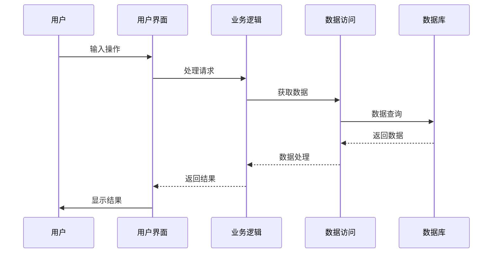

                 

### 问题背景与核心概念

#### 问题背景

视觉艺术是人类文化的重要组成部分，自古以来，艺术家们通过绘画、雕塑、摄影等多种形式，表达情感、思想与审美。然而，如何科学地分析和度量视觉艺术作品的美学价值，一直是学术界和艺术界的热门话题。传统的艺术评价方法大多依赖于主观感受和专家经验，这使得评价结果具有一定的局限性。

分形理论作为数学领域的一项重要成果，为视觉艺术的量化分析提供了新的工具。分形是一种复杂的几何结构，其特征在于自相似性和无限层次的结构。分形理论在自然界和人工制品中有着广泛的应用，如海岸线、树叶、云朵等自然现象，以及建筑、艺术作品等人工制品。

美学复杂性则是对视觉艺术作品复杂性的美学评价。美学复杂性不仅涉及作品的视觉复杂性，还包括其内在的情感、思想和艺术价值等多方面因素。因此，如何量化美学复杂性，并将其应用于视觉艺术的评价，成为了一个亟待解决的问题。

数学度量作为一种科学的方法，可以精确地描述和比较不同视觉艺术作品之间的美学特征。通过数学度量，我们可以从一个更加客观和量化的角度，对视觉艺术作品进行评价和分析。

#### 核心概念

##### 1. 分形

分形（Fractal）是一种具有无限层次结构的几何形状，其特征在于自相似性。自相似性指的是一个整体在某个尺度上与局部具有相似的结构。分形的定义通常涉及一个分形维数，这个维数介于传统几何维数（如一维、二维、三维）之间。分形维数衡量了分形结构的复杂程度。

在视觉艺术中，分形可以用来描述艺术作品中的自相似结构，如自然风景画中的树木、山脉，或是抽象艺术作品中的几何形状。分形分析可以揭示艺术作品中隐藏的复杂性和美感。

##### 2. 美学复杂性

美学复杂性（Aesthetic Complexity）是对视觉艺术作品复杂性的美学评价。它不仅涉及作品的视觉复杂性，还包括其内在的情感、思想和艺术价值等多方面因素。美学复杂性的度量方法包括统计方法、模糊集方法、信息论方法等。

在视觉艺术分析中，美学复杂性的度量可以帮助我们理解艺术作品的美学特征，评估其艺术价值，以及探索艺术创作过程中的美学规律。

##### 3. 数学度量

数学度量（Mathematical Measurement）是一种通过数学方法来量化和描述对象特征的方法。在视觉艺术分析中，数学度量可以用来量化艺术作品的结构、颜色、纹理等视觉特征。

常用的数学度量方法包括分形维数、信息熵、模糊集等。这些方法可以帮助我们从量化的角度，客观地评价视觉艺术作品的美学价值。

#### 关键问题

- **如何将分形理论应用于视觉艺术作品的量化分析？**
- **如何度量视觉艺术作品的美学复杂性？**
- **如何使用数学度量方法，从量化的角度评价视觉艺术作品的美学价值？**

接下来，我们将一步步探讨这些问题，并详细分析分形分析在视觉艺术中的应用。

## 第1章：问题背景与核心概念

### 1.1 问题背景

#### 1.1.1 视觉艺术的发展历程

视觉艺术是人类文化的重要组成部分，其历史可以追溯到史前时代。从古埃及的壁画、古希腊的雕塑，到中世纪的宗教艺术，以及文艺复兴时期的绘画和雕塑，视觉艺术在各个历史时期都有着不同的表现和风格。

进入现代社会，随着科技的发展，视觉艺术的形式也变得更加多样。从传统的绘画、雕塑，到现代的摄影、装置艺术，再到数字艺术和虚拟现实，视觉艺术的边界不断拓展。

视觉艺术的多样性不仅体现在形式上，还体现在主题和内容的深度上。艺术家们通过视觉艺术表达个人情感、思想，以及对社会现象的反思。因此，如何科学地分析和理解视觉艺术作品，成为了一个重要的研究课题。

#### 1.1.2 分形分析在视觉艺术中的应用

分形分析是一种基于数学理论的量化方法，它可以在视觉艺术中揭示出艺术作品中的自相似结构和复杂模式。分形理论在视觉艺术中的应用可以追溯到20世纪80年代，当时科学家们开始探索如何用分形维数来描述自然景象和人工制品中的复杂结构。

例如，在自然风景画中，山脉、河流、树木等元素都具有分形特征。通过分形分析，我们可以量化这些元素的自相似性和复杂性，从而更深入地理解艺术作品中的自然元素。

此外，分形分析在抽象艺术中也得到了广泛应用。抽象艺术作品中的几何形状、线条和颜色分布，往往具有高度的自相似性和层次性。分形理论可以用来分析这些元素，揭示它们在结构上的复杂性和美学价值。

#### 1.1.3 美学复杂性的概念与特点

美学复杂性是指视觉艺术作品在视觉和审美上的复杂程度。它不仅包括作品的视觉复杂性，如形状、颜色、纹理等，还包括作品的情感、思想和艺术价值等多方面因素。

美学复杂性的特点主要表现在以下几个方面：

1. **多层次性**：美学复杂性涉及作品的多个层次，包括视觉层次、情感层次和思想层次等。不同层次的复杂性相互作用，共同决定了作品的整体美感。

2. **多样性**：美学复杂性具有多样性，不同类型的视觉艺术作品具有不同的美学复杂性。例如，抽象艺术作品的美学复杂性可能体现在视觉元素的自相似性和几何结构上，而自然风景画的美学复杂性则可能体现在对自然现象的逼真描绘上。

3. **主观性**：美学复杂性的评价具有一定的主观性。不同的观众可能会对同一作品的美学复杂性有不同的感受和评价。因此，如何量化美学复杂性，是一个具有挑战性的问题。

### 1.2 核心概念

#### 1.2.1 分形的定义与特征

分形（Fractal）是由数学家本尼奥·曼德布罗特（Benoit Mandelbrot）在20世纪70年代提出的，是一种具有无限层次结构的几何形状。分形的定义涉及以下几个关键特征：

1. **自相似性**：分形在各个尺度上都具有相似的结构。这意味着，如果你将一个分形放大或缩小，它仍然保持相似的结构。

2. **无限层次结构**：分形的结构具有无限层次性，即无论你如何放大或缩小，总能在新的尺度上发现新的细节和模式。

3. **分数维数**：分形的维数不是整数，而是介于传统几何维数（如一维、二维、三维）之间。分形维数通常用来衡量分形结构的复杂程度。

常见的分形包括科赫雪花（Koch Snowflake）、科赫曲线（Koch Curve）、曼德布罗特集（Mandelbrot Set）等。

#### 1.2.2 美学复杂性的度量方法

美学复杂性的度量方法旨在量化视觉艺术作品在视觉和审美上的复杂程度。以下是一些常用的度量方法：

1. **分形维数**：分形维数是衡量分形结构复杂性的重要指标。在视觉艺术分析中，可以通过计算艺术作品中的分形维数来量化其美学复杂性。

2. **信息熵**：信息熵是一种衡量信息复杂性的方法。在视觉艺术中，信息熵可以用来衡量图像中的颜色分布和结构复杂度。

3. **模糊集方法**：模糊集方法可以用于量化艺术作品的模糊性和不明确性。这种度量方法能够捕捉艺术作品中的情感和思想层次。

4. **多尺度分析**：多尺度分析通过在不同尺度上分析艺术作品的视觉特征，来量化其美学复杂性。

#### 1.2.3 数学度量在视觉艺术中的应用

数学度量在视觉艺术中的应用主要涉及以下几个方面：

1. **形状分析**：通过计算形状的分形维数、信息熵等指标，可以量化艺术作品中的形状复杂性和美学价值。

2. **颜色分析**：颜色分析可以用于量化艺术作品中的颜色分布和对比度。通过颜色空间的变换和特征提取，可以分析作品中的色彩美学。

3. **纹理分析**：纹理分析可以用于量化艺术作品中的纹理复杂性和细节层次。常用的方法包括自相关函数、功率谱密度等。

4. **情感分析**：情感分析是一种基于机器学习的方法，可以用于识别艺术作品中的情感表达。通过分析图像中的颜色、形状和纹理，可以量化作品的情感复杂性。

### 1.3 视觉艺术分析与数学度量的关系

视觉艺术分析与数学度量之间的关系体现在以下几个方面：

1. **量化视觉特征**：数学度量方法可以用于量化视觉艺术作品中的形状、颜色、纹理等视觉特征，从而提供一个量化的基础，以便进一步分析和比较。

2. **揭示复杂结构**：分形分析等数学方法可以揭示视觉艺术作品中的复杂结构，帮助我们更深入地理解作品中的美学元素。

3. **评价美学价值**：通过数学度量，我们可以从量化的角度评价视觉艺术作品的美学价值，为艺术作品的评估提供科学依据。

4. **艺术创作指导**：数学度量方法可以用于分析艺术创作过程中的视觉元素，为艺术家提供创作指导，优化艺术作品的视觉效果。

### 1.4 本章小结

本章介绍了视觉艺术的分形分析、美学复杂性和数学度量这三个核心概念。我们探讨了视觉艺术的发展历程和分形分析的应用，阐述了美学复杂性的概念与特点，并介绍了几种常用的数学度量方法。通过本章的介绍，读者可以初步了解视觉艺术分析与数学度量之间的关系，为进一步的学习和研究打下基础。

## 第2章：分形原理

### 2.1.1 分形的基本概念

分形（Fractal）是一种复杂的几何结构，其特征在于自相似性和无限层次的结构。分形理论由数学家本尼奥·曼德布罗特（Benoit Mandelbrot）在20世纪70年代提出，是现代数学中的重要分支。分形的定义涉及以下几个关键方面：

1. **自相似性**：自相似性是分形的核心特征，指的是一个整体在某个尺度上与局部具有相似的结构。换句话说，当你放大或缩小一个分形时，它会保持相似的结构。这种相似性可以是形状上的，也可以是纹理上的。

2. **无限层次结构**：分形的结构具有无限层次性，即无论你如何放大或缩小，总能在新的尺度上发现新的细节和模式。这种无限层次性使得分形在视觉上呈现出高度复杂的结构。

3. **分数维数**：分形的维数不是整数，而是介于传统几何维数（如一维、二维、三维）之间。分形维数衡量了分形结构的复杂程度。常见的分形维数有1.414（科赫曲线）、2（线段）、3（立方体）等。

常见的分形包括科赫雪花（Koch Snowflake）、科赫曲线（Koch Curve）、曼德布罗特集（Mandelbrot Set）和朱利亚集（Julia Set）等。这些分形在不同的尺度上展现出复杂且美丽的结构，成为视觉艺术中的重要元素。

### 2.1.2 分形的数学模型

分形的数学模型主要涉及分形维数的计算和分形结构的生成方法。以下是一些常见的分形数学模型：

1. **分形维数**：分形维数是衡量分形复杂程度的重要指标。常见的分形维数有豪斯道尔夫维数（Hausdorff Dimension）、盒维数（Box Counting Dimension）和容量维数（Capacity Dimension）等。

   - **豪斯道尔夫维数**（Hausdorff Dimension）是分形结构在某个尺度上的自相似程度的度量。其计算公式为：
     $$ 
     D_H = \lim_{\varepsilon \to 0} \frac{\log N(\varepsilon)}{-\log \varepsilon} 
     $$
     其中，$N(\varepsilon)$ 是覆盖分形所需的盒数，$\varepsilon$ 是盒子的边长。

   - **盒维数**（Box Counting Dimension）是通过对分形在不同尺度上的盒子覆盖数进行统计分析得到的。其计算公式为：
     $$ 
     D_B = \lim_{\varepsilon \to 0} \frac{\log N(\varepsilon)}{-\log \varepsilon} 
     $$
     其中，$N(\varepsilon)$ 是覆盖分形所需的盒数，$\varepsilon$ 是盒子的边长。

   - **容量维数**（Capacity Dimension）是基于分形结构在某个尺度上的可覆盖性的度量。其计算公式为：
     $$ 
     D_C = \lim_{\varepsilon \to 0} \frac{\log C(\varepsilon)}{-\log \varepsilon} 
     $$
     其中，$C(\varepsilon)$ 是在尺度$\varepsilon$下能覆盖分形的最小正数。

2. **分形结构的生成方法**：分形结构的生成方法包括迭代函数系统（IFS）、迭代函数（Iterated Function）、随机过程和混沌系统等。

   - **迭代函数系统**（Iterated Function System，IFS）是一种常用的分形生成方法。它由多个压缩映射函数组成，通过对这些函数进行迭代，可以生成各种复杂的分形结构。

   - **迭代函数**（Iterated Function）是IFS的一种特殊情况，其中仅有一个压缩映射函数。通过迭代这个函数，可以生成简单的分形结构。

   - **随机过程**和**混沌系统**也是生成分形的重要方法。通过随机过程和混沌动力学系统，可以生成具有自相似性和复杂结构的分形。

### 2.1.3 分形在视觉艺术中的表现

分形在视觉艺术中有着广泛的应用，其自相似性和无限层次结构为艺术家提供了丰富的创作素材。以下是一些分形在视觉艺术中的具体表现：

1. **绘画与雕塑**：艺术家可以使用分形几何来创作具有复杂结构的绘画和雕塑作品。例如，使用科赫雪花和曼德布罗特集的图案来设计壁画和雕塑，可以创造出独特的视觉效果。

2. **抽象艺术**：抽象艺术家经常使用分形结构来表达形式的美感。通过绘制复杂的分形图案，艺术家可以传达出一种抽象的美感，激发观众的想象力和情感。

3. **数字艺术**：在数字艺术中，分形可以用于生成复杂的纹理和图案。通过使用分形生成算法，艺术家可以创造出具有高度细节和层次感的数字艺术作品。

4. **装饰艺术**：分形结构在装饰艺术中也得到了广泛应用。例如，在建筑设计和室内设计中，分形图案可以用于地板、墙壁和家具的设计，创造出独特的视觉效果。

5. **虚拟现实与游戏**：在虚拟现实和游戏领域，分形可以用于生成复杂的虚拟环境和游戏场景。通过分形结构，可以创造出高度逼真的自然景观和城市环境，提升游戏体验。

总之，分形在视觉艺术中的表现不仅丰富了艺术创作形式，也为艺术家提供了探索形式美和结构美的工具。通过分形理论的应用，艺术家可以创造出独特的视觉艺术作品，表达个人的情感和思想。

### 2.2 美学复杂性

#### 2.2.1 美学复杂性的定义

美学复杂性（Aesthetic Complexity）是指视觉艺术作品在视觉和审美上的复杂程度。它不仅涉及作品的视觉复杂性，还包括作品的情感、思想、艺术价值等多方面因素。美学复杂性是衡量视觉艺术作品美学价值的重要指标。

美学复杂性的定义涉及以下几个方面：

1. **视觉复杂性**：视觉复杂性指的是视觉艺术作品在视觉元素上的复杂程度，包括形状、颜色、纹理、空间布局等。视觉复杂性越高，艺术作品的整体视觉效果就越复杂。

2. **情感复杂性**：情感复杂性指的是艺术作品在情感表达上的复杂程度。艺术作品可能传达出多种情感，如喜悦、悲伤、愤怒、平静等。情感复杂性越高，艺术作品的情感表达就越丰富。

3. **思想复杂性**：思想复杂性指的是艺术作品在思想表达上的复杂程度。艺术作品可能蕴含深刻的哲学思考、社会批判或历史反思。思想复杂性越高，艺术作品的思想内涵就越丰富。

4. **艺术价值**：艺术价值指的是艺术作品在艺术史和审美标准中的价值。艺术价值越高，艺术作品在审美和艺术领域的重要性就越大。

美学复杂性是一个多维度的概念，它需要从多个角度进行综合评价。不同类型的艺术作品具有不同的美学复杂性，例如，抽象艺术作品的美学复杂性可能更多地体现在视觉和情感层面上，而历史绘画作品的美学复杂性则可能更多地体现在思想和艺术价值上。

#### 2.2.2 美学复杂性的度量方法

美学复杂性的度量方法旨在量化视觉艺术作品在视觉和审美上的复杂程度。以下是一些常用的美学复杂性度量方法：

1. **分形维数**：分形维数是一种衡量分形结构复杂程度的指标，也可以用来度量美学复杂性。通过计算艺术作品中的分形维数，可以量化作品的视觉复杂性和结构复杂性。

2. **信息熵**：信息熵是一种衡量信息复杂性的指标，可以用于量化艺术作品的颜色分布、形状分布等视觉特征的复杂度。高信息熵通常表示艺术作品具有更高的美学复杂性。

3. **模糊集方法**：模糊集方法可以用于量化艺术作品的模糊性和不确定性，从而衡量作品的美学复杂性。模糊集方法可以捕捉艺术作品中的情感和思想层次，提供更全面的美学复杂性度量。

4. **多尺度分析**：多尺度分析通过在不同尺度上分析艺术作品的视觉特征，来量化作品的美学复杂性。这种方法可以捕捉作品在不同尺度上的视觉细节和结构复杂性。

5. **神经网络方法**：神经网络方法可以通过训练深度学习模型来量化艺术作品的美学复杂性。神经网络可以自动学习艺术作品中的复杂模式，从而提供更加精准的复杂性度量。

6. **用户评价**：用户评价是一种直接的美学复杂性度量方法，通过收集观众对艺术作品的评价数据，可以量化作品的美学价值。用户评价可以结合其他量化方法，提供更全面的美学复杂性度量。

#### 2.2.3 美学复杂性在视觉艺术中的体现

美学复杂性在视觉艺术中的体现可以从以下几个方面进行分析：

1. **视觉元素的复杂性**：视觉元素的复杂性包括形状、颜色、纹理和空间布局等。例如，一幅画中的形状可以是非常规则的几何图形，也可以是非常不规则的线条和色块。颜色和纹理的复杂性可以通过颜色分布和纹理细节来衡量。空间布局的复杂性可以体现在构图和视角的变化上。

2. **情感表达的复杂性**：情感表达的复杂性可以通过艺术作品传达出的情感数量和情感深度来衡量。例如，一幅画可以传达出多种情感，如喜悦、悲伤、愤怒、恐惧等。情感表达的复杂性越高，艺术作品的情感表现力就越强。

3. **思想表达的复杂性**：思想表达的复杂性可以通过艺术作品所蕴含的哲学思考、社会批判或历史反思来衡量。例如，一幅画可以蕴含深刻的社会意义和历史内涵，从而体现其思想表达的复杂性。

4. **艺术价值的复杂性**：艺术价值的复杂性可以通过艺术作品在艺术史和审美标准中的地位来衡量。例如，一幅画可以因其独特的艺术风格和创新性而具有较高的艺术价值。

总之，美学复杂性在视觉艺术中的体现是一个多维度的过程，它涉及到视觉元素、情感表达、思想表达和艺术价值等多个方面。通过量化美学复杂性，我们可以更深入地理解艺术作品的美学特征，评估其美学价值，并为艺术创作和研究提供科学依据。

### 2.3 数学度量

#### 2.3.1 数学度量的基本概念

数学度量（Mathematical Measurement）是一种通过数学方法来量化和描述对象特征的方法。在视觉艺术分析中，数学度量可以用于量化艺术作品的结构、颜色、纹理等视觉特征。数学度量具有以下几个基本概念：

1. **测量对象**：测量对象是指被量化的视觉艺术作品。它可以是一幅画、一张照片、一段视频等。

2. **测量指标**：测量指标是用于描述测量对象特征的数学量。例如，分形维数、信息熵、颜色分布等。

3. **测量方法**：测量方法是指用于计算测量指标的具体算法或公式。例如，豪斯道尔夫维数计算公式、信息熵计算公式等。

4. **测量结果**：测量结果是测量过程的最终输出，它反映了测量对象的某个特征。例如，一个分形维数的数值、一个信息熵的数值等。

数学度量方法在视觉艺术分析中的应用主要包括以下几个方面：

1. **形状分析**：通过计算形状的分形维数、周长、面积等指标，可以量化艺术作品中的形状特征。例如，分形维数可以揭示艺术作品中的自相似结构，周长和面积可以反映形状的复杂程度。

2. **颜色分析**：通过计算颜色的分布、对比度、饱和度等指标，可以量化艺术作品中的颜色特征。例如，信息熵可以衡量图像的颜色分布复杂性，对比度可以反映颜色的明暗差异。

3. **纹理分析**：通过计算纹理的自相关函数、功率谱密度等指标，可以量化艺术作品中的纹理特征。例如，自相关函数可以衡量纹理的连续性，功率谱密度可以反映纹理的频率分布。

4. **情感分析**：通过计算情感特征向量、情感分布等指标，可以量化艺术作品中的情感表达。例如，情感特征向量可以捕捉图像中的情感色彩，情感分布可以反映图像的情感倾向。

#### 2.3.2 常见的数学度量方法

在视觉艺术分析中，常用的数学度量方法包括分形维数、信息熵、模糊集方法、多尺度分析等。以下详细介绍这些方法：

1. **分形维数**：分形维数是一种衡量分形结构复杂程度的指标。常用的分形维数包括豪斯道尔夫维数、盒维数和容量维数。分形维数可以用于分析艺术作品中的形状、颜色和纹理等特征，揭示其复杂性和自相似性。

2. **信息熵**：信息熵是一种衡量信息复杂度的指标，可以用于分析图像的颜色分布、形状分布等特征。信息熵越高，表示图像的复杂度越高。信息熵可以用于评估艺术作品的美学价值，以及艺术创作过程中的复杂程度。

3. **模糊集方法**：模糊集方法是一种处理不确定性和模糊性的数学工具。它可以通过模糊隶属度来描述艺术作品中的模糊特征，如颜色、形状、纹理等。模糊集方法可以用于量化艺术作品中的模糊性和不确定性。

4. **多尺度分析**：多尺度分析是一种在不同尺度上分析图像特征的方法。它可以通过在不同尺度上计算分形维数、信息熵等指标，来分析艺术作品的复杂性和层次性。多尺度分析可以帮助我们理解艺术作品在不同尺度上的视觉特征。

5. **神经网络方法**：神经网络方法是一种基于深度学习的数学工具，可以用于量化艺术作品中的复杂特征。通过训练深度学习模型，神经网络可以自动学习艺术作品中的复杂模式，从而提供更加精准的度量结果。

这些数学度量方法在视觉艺术分析中具有广泛的应用，可以用于量化艺术作品的结构、颜色、纹理等特征，揭示其复杂性和美学价值。

#### 2.3.3 数学度量在视觉艺术分析中的应用

数学度量在视觉艺术分析中的应用主要体现在以下几个方面：

1. **艺术作品评估**：通过数学度量方法，可以量化艺术作品的结构、颜色、纹理等特征，从而为艺术作品的评估提供科学依据。例如，通过计算分形维数，可以评估艺术作品的复杂性和自相似性；通过计算信息熵，可以评估艺术作品的颜色分布和形状分布复杂性。

2. **艺术风格识别**：数学度量方法可以用于识别艺术作品的风格。通过分析艺术作品的结构、颜色、纹理等特征，可以构建风格特征库，从而实现艺术风格的自动识别。

3. **艺术创作指导**：数学度量方法可以用于指导艺术创作。通过量化艺术作品的复杂性和美学价值，艺术家可以更好地理解自己的作品，从而优化创作过程。

4. **艺术市场分析**：数学度量方法可以用于艺术市场分析，评估艺术作品的潜在价值。通过分析艺术作品的市场表现，可以预测艺术作品的未来趋势，为艺术市场投资提供参考。

5. **艺术教育**：数学度量方法可以用于艺术教育，帮助学生更好地理解艺术作品。通过量化分析艺术作品，学生可以更深入地理解艺术作品的创作意图和艺术价值。

总之，数学度量方法在视觉艺术分析中具有重要的应用价值，可以为艺术作品的评估、风格识别、艺术创作指导、市场分析和艺术教育等方面提供科学依据。

### 2.4 本章小结

本章介绍了分形原理、美学复杂性和数学度量的基本概念。我们首先详细阐述了分形的基本概念和数学模型，展示了分形在视觉艺术中的具体应用。接着，我们介绍了美学复杂性的定义和度量方法，探讨了美学复杂性在视觉艺术中的体现。最后，我们详细介绍了数学度量的基本概念和应用，展示了数学度量在视觉艺术分析中的重要性。通过本章的介绍，读者可以初步了解分形、美学复杂性和数学度量这三个核心概念，为进一步的学习和研究打下基础。

## 第3章：分形分析算法原理

### 3.1 分形分析基础

#### 3.1.1 分形分析的步骤

分形分析是一种用于量化视觉艺术作品复杂性和自相似性的方法。进行分形分析通常需要以下步骤：

1. **数据采集**：首先，需要采集待分析的艺术作品数据。这可以是图像、绘画、雕塑等。数据采集的过程可能涉及拍摄、扫描或其他数字化手段。

2. **数据预处理**：采集到的数据可能需要进行预处理，以消除噪声、增强重要特征或进行其他必要的变换。例如，对于图像数据，可能需要进行去噪、图像增强、灰度化等操作。

3. **特征提取**：在预处理完成后，需要从数据中提取能够反映作品复杂性和自相似性的特征。这些特征包括形状、颜色、纹理等。常见的特征提取方法包括分形维数、信息熵、模糊集方法等。

4. **分形维数计算**：通过计算分形维数，可以量化艺术作品的复杂性和自相似性。分形维数的计算方法包括豪斯道尔夫维数、盒维数、容量维数等。

5. **结果分析**：根据计算得到的分形维数和其他特征，对艺术作品进行综合分析，评估其美学价值和复杂度。

#### 3.1.2 分形维数的计算

分形维数（Fractal Dimension）是衡量分形结构复杂程度的重要指标。计算分形维数通常有以下几种方法：

1. **豪斯道尔夫维数**（Hausdorff Dimension）：

豪斯道尔夫维数是一种广泛使用的分形维数计算方法。它基于覆盖集的概念，通过计算覆盖分形所需的盒数和盒子的边长，来确定分形维数。具体计算公式如下：

$$ 
D_H = \lim_{\varepsilon \to 0} \frac{\log N(\varepsilon)}{-\log \varepsilon} 
$$

其中，$N(\varepsilon)$ 是覆盖分形所需的盒数，$\varepsilon$ 是盒子的边长。

2. **盒维数**（Box Counting Dimension）：

盒维数是通过统计在不同尺度下覆盖分形所需的盒子数量来计算的。其计算公式与豪斯道尔夫维数相似：

$$ 
D_B = \lim_{\varepsilon \to 0} \frac{\log N(\varepsilon)}{-\log \varepsilon} 
$$

3. **容量维数**（Capacity Dimension）：

容量维数是一种基于分形结构在某个尺度下的可覆盖性的度量。其计算公式为：

$$ 
D_C = \lim_{\varepsilon \to 0} \frac{\log C(\varepsilon)}{-\log \varepsilon} 
$$

其中，$C(\varepsilon)$ 是在尺度$\varepsilon$下能覆盖分形的最小正数。

#### 3.1.3 分形图像的特征提取

分形图像的特征提取是分形分析的重要环节，涉及从图像中提取能够反映其复杂性和自相似性的特征。以下是一些常用的特征提取方法：

1. **形状特征**：形状特征包括边缘长度、周长、面积等。通过计算这些特征，可以量化图像的形状复杂性。

2. **颜色特征**：颜色特征包括颜色分布、颜色对比度、颜色饱和度等。通过分析颜色特征，可以了解图像的色彩复杂度。

3. **纹理特征**：纹理特征包括纹理的连续性、纹理的对比度、纹理的频率分布等。纹理特征可以反映图像的纹理复杂度和结构复杂性。

4. **分形维数**：分形维数是一种综合特征，可以同时反映图像的形状、颜色和纹理复杂性。通过计算分形维数，可以全面评估图像的复杂度。

### 3.2 算法原理

#### 3.2.1 分形分析算法的数学模型

分形分析算法的数学模型主要涉及分形维数的计算方法和特征提取方法。以下是一个基本的分形分析算法的数学模型：

$$ 
\text{分形分析算法} = (\text{数据预处理}, \text{特征提取}, \text{分形维数计算}, \text{结果分析}) 
$$

1. **数据预处理**：

数据预处理步骤包括去噪、图像增强、灰度化等操作，目的是提高图像的质量，增强重要特征。例如，对于彩色图像，可以将其转换为灰度图像，以便于特征提取。

2. **特征提取**：

特征提取步骤包括提取形状、颜色、纹理等特征。常用的方法包括边缘检测、颜色直方图分析、纹理分析等。

3. **分形维数计算**：

分形维数计算步骤包括选择合适的分形维数计算方法（如豪斯道尔夫维数、盒维数、容量维数等），并计算图像的分形维数。

4. **结果分析**：

结果分析步骤包括根据计算得到的分形维数和其他特征，对图像进行综合分析，评估其美学价值和复杂度。

#### 3.2.2 分形分析算法的实现

分形分析算法的实现通常需要编写相应的程序代码。以下是一个使用Python实现的分形分析算法的基本框架：

```python
import numpy as np
import matplotlib.pyplot as plt
from skimage import io
from skimage.restoration import denoise_bilateral
from skimage.feature import hog
from skimage.color import rgb2gray
from skimage.filters import sobel

def preprocess_image(image_path):
    # 读取图像
    image = io.imread(image_path)
    # 图像去噪
    denoised_image = denoise_bilateral(image, sigma_spatial=0.1, sigma_range=0.05)
    # 图像增强
    enhanced_image = sobel(denoised_image)
    # 图像灰度化
    gray_image = rgb2gray(enhanced_image)
    return gray_image

def extract_features(image):
    # 提取边缘特征
    edges = sobel(image)
    # 提取形状特征
    shape_features = hog(edges)
    # 提取纹理特征
    texture_features = np.mean(edges, axis=0)
    return shape_features, texture_features

def calculate_fractal_dimension(image):
    # 计算分形维数
    # 使用盒维数计算方法
    box_counts = np.unique(image, return_counts=True)[1]
    box_edges = np.arange(1, np.max(box_counts) + 1)
    log_box_counts = np.log(box_counts)
    log_box_edges = np.log(box_edges)
    D_B = np.mean(log_box_counts / log_box_edges)
    return D_B

def analyze_image(image_path):
    # 数据预处理
    image = preprocess_image(image_path)
    # 特征提取
    shape_features, texture_features = extract_features(image)
    # 分形维数计算
    D_B = calculate_fractal_dimension(image)
    # 结果分析
    print("Box Counting Dimension: ", D_B)
    print("Shape Features: ", shape_features)
    print("Texture Features: ", texture_features)

# 测试分形分析算法
image_path = "path/to/your/image.jpg"
analyze_image(image_path)
```

#### 3.2.3 算法性能评估

算法性能评估是确保分形分析算法有效性和准确性的重要步骤。以下是一些常用的评估指标和方法：

1. **准确率**：准确率是评估算法分类准确性的指标，计算公式为：

$$ 
\text{Accuracy} = \frac{\text{正确分类的样本数}}{\text{总样本数}} 
$$

2. **召回率**：召回率是评估算法对正类样本的召回能力的指标，计算公式为：

$$ 
\text{Recall} = \frac{\text{正确分类的正类样本数}}{\text{总正类样本数}} 
$$

3. **F1 分数**：F1 分数是准确率和召回率的调和平均值，计算公式为：

$$ 
\text{F1-Score} = 2 \times \frac{\text{准确率} \times \text{召回率}}{\text{准确率} + \text{召回率}} 
$$

4. **ROC 曲线**：ROC 曲线是评估算法分类性能的重要工具，通过计算不同阈值下的真阳性率（True Positive Rate，TPR）和假阳性率（False Positive Rate，FPR）来绘制曲线。

5. **交叉验证**：交叉验证是一种评估算法性能的常用方法，通过将数据集划分为多个子集，逐个进行训练和测试，以评估算法的泛化能力。

### 3.3 算法实例

#### 3.3.1 分形分析在艺术作品中的应用

分形分析在艺术作品中的应用可以帮助我们深入理解作品中的复杂结构和自相似性。以下是一个具体的实例：

假设我们有一幅著名的油画《星夜》（The Starry Night），这幅画由荷兰画家文森特·梵高创作。我们可以使用分形分析算法，计算这幅画中的分形维数，以评估其复杂性和自相似性。

1. **数据采集**：首先，我们需要获取《星夜》的数字图像。

2. **数据预处理**：对图像进行预处理，包括去噪、图像增强和灰度化。

3. **特征提取**：提取图像的形状、颜色和纹理特征。

4. **分形维数计算**：计算图像的盒维数。

5. **结果分析**：根据计算得到的分形维数，分析图像的复杂性和自相似性。

通过上述步骤，我们可以得到《星夜》的分形维数，并根据分形维数的值评估其美学价值和复杂度。

#### 3.3.2 算法原理的 Python 实现

以下是一个简单的 Python 实现示例，用于计算图像的分形维数：

```python
import numpy as np
import matplotlib.pyplot as plt
from skimage import io
from skimage.restoration import denoise_bilateral
from skimage.color import rgb2gray
from skimage.filters import sobel

def preprocess_image(image_path):
    image = io.imread(image_path)
    denoised_image = denoise_bilateral(image, sigma_spatial=0.1, sigma_range=0.05)
    enhanced_image = sobel(denoised_image)
    gray_image = rgb2gray(enhanced_image)
    return gray_image

def calculate_fractal_dimension(image):
    box_counts = np.unique(image, return_counts=True)[1]
    box_edges = np.arange(1, np.max(box_counts) + 1)
    log_box_counts = np.log(box_counts)
    log_box_edges = np.log(box_edges)
    D_B = np.mean(log_box_counts / log_box_edges)
    return D_B

def analyze_image(image_path):
    image = preprocess_image(image_path)
    D_B = calculate_fractal_dimension(image)
    print("Box Counting Dimension: ", D_B)

# 测试分形分析算法
image_path = "path/to/your/image.jpg"
analyze_image(image_path)
```

通过这个简单的实现，我们可以计算任意图像的分形维数，从而评估其复杂性和自相似性。

### 3.4 本章小结

本章详细介绍了分形分析算法的原理和实现方法。我们首先介绍了分形分析的基本步骤，包括数据采集、数据预处理、特征提取和分形维数计算。接着，我们详细阐述了分形维数的计算方法，并展示了如何使用 Python 实现分形分析算法。通过本章的学习，读者可以掌握分形分析的基本原理和方法，为后续的视觉艺术分析提供技术支持。

## 第4章：数学模型与公式解析

### 4.1 分形维数模型

分形维数（Fractal Dimension）是衡量分形结构复杂性的重要指标。分形维数的计算方法包括豪斯道尔夫维数（Hausdorff Dimension）、盒维数（Box Counting Dimension）和容量维数（Capacity Dimension）。以下分别对这些方法进行详细解析。

#### 4.1.1 分形维数的定义

分形维数的定义涉及一个基本概念：覆盖集（Covering Set）。覆盖集是指能够覆盖分形结构的最小集合。具体来说，给定一个分形结构X和一个正数ε，如果存在一个集合C，使得X的每一个部分都在C的某个ε-邻域内，那么C称为X的一个ε-覆盖集。

分形维数D是衡量覆盖集密度的指标。如果覆盖集的密度随着ε的减小而增加，那么分形维数就表示了这种增长的速度。

#### 4.1.2 豪斯道尔夫维数（Hausdorff Dimension）

豪斯道尔夫维数（Hausdorff Dimension，D_H）是衡量分形复杂度的一种常用方法。它的定义基于豪斯道尔夫测度和覆盖集。

豪斯道尔夫测度H_D(·)是一个测度，它定义了一个集合X的豪斯道尔夫维数D_H，公式如下：

$$ 
H_D(X) = \inf \left\{ \sum_{i=1}^{\infty} \lambda^i N_i(\lambda) : N_i(\lambda) \to \infty \text{ as } \lambda \to 0 \right\} 
$$

其中，$N_i(\lambda)$ 是能够覆盖集合X的ε-覆盖集的个数，λ是覆盖集的密度。

豪斯道尔夫维数的计算公式为：

$$ 
D_H = \lim_{\varepsilon \to 0} \frac{\log N(\varepsilon)}{-\log \varepsilon} 
$$

其中，$N(\varepsilon)$ 是覆盖分形所需的盒数，$\varepsilon$ 是盒子的边长。

#### 4.1.3 盒维数（Box Counting Dimension）

盒维数（Box Counting Dimension，D_B）是另一种常用的分形维数计算方法。它的基本思想是，通过在不同尺度下计算覆盖分形所需的盒子数量，来确定分形维数。

盒维数的计算公式为：

$$ 
D_B = \lim_{\varepsilon \to 0} \frac{\log N(\varepsilon)}{-\log \varepsilon} 
$$

其中，$N(\varepsilon)$ 是覆盖分形所需的盒子数量，$\varepsilon$ 是盒子的边长。

#### 4.1.4 容量维数（Capacity Dimension）

容量维数（Capacity Dimension，D_C）是另一种衡量分形复杂度的方法。它基于分形结构在某个尺度下的可覆盖性。

容量维数的计算公式为：

$$ 
D_C = \lim_{\varepsilon \to 0} \frac{\log C(\varepsilon)}{-\log \varepsilon} 
$$

其中，$C(\varepsilon)$ 是在尺度$\varepsilon$下能覆盖分形的最小正数。

#### 4.1.5 分形维数的计算方法对比

- **豪斯道尔夫维数**：豪斯道尔夫维数提供了对分形复杂度的全局度量，适用于各种分形结构。然而，它的计算复杂度较高，对于大规模分形结构不太适用。

- **盒维数**：盒维数计算简单，适用于大多数分形结构。它的计算复杂度较低，适用于大规模数据。

- **容量维数**：容量维数适用于具有高度自相似性的分形结构，如曼德布罗特集。它的计算相对简单，但适用范围较窄。

### 4.2 美学复杂性度量模型

美学复杂性（Aesthetic Complexity）是对视觉艺术作品复杂性的美学评价。它不仅涉及作品的视觉复杂性，还包括作品的情感、思想和艺术价值等多方面因素。以下介绍几种常用的美学复杂性度量方法。

#### 4.2.1 信息熵（Entropy）

信息熵是一种衡量信息复杂度的方法，可以用于量化艺术作品的美学复杂性。信息熵的定义基于香农信息论，其公式如下：

$$ 
H(X) = -\sum_{i=1}^{n} p(x_i) \log_2 p(x_i) 
$$

其中，$H(X)$ 是信息熵，$p(x_i)$ 是随机变量X取值$x_i$的概率。

在美学复杂性度量中，信息熵可以用于衡量图像的颜色分布、形状分布等复杂度。高信息熵通常表示图像具有更高的美学复杂性。

#### 4.2.2 模糊集方法（Fuzzy Sets）

模糊集方法是一种处理不确定性和模糊性的数学工具，可以用于量化艺术作品中的模糊性和不确定性。模糊集方法的定义基于模糊隶属度，其公式如下：

$$ 
\mu_A(x) = \frac{1}{\int_{X} \mu_B(x) dx} 
$$

其中，$\mu_A(x)$ 是集合A的模糊隶属度，$X$ 是定义域。

在美学复杂性度量中，模糊集方法可以用于量化艺术作品中的颜色、形状、纹理等模糊特征，从而反映作品的美学复杂性。

#### 4.2.3 多尺度分析（Multiscale Analysis）

多尺度分析是一种在不同尺度上分析图像特征的方法，可以用于量化艺术作品的美学复杂性。多尺度分析的基本思想是，通过在不同尺度上计算图像的特征，来捕捉作品的复杂性和层次性。

多尺度分析可以使用的特征包括分形维数、信息熵、模糊集方法等。通过在不同尺度上计算这些特征，可以得到一个多尺度特征向量，从而量化作品的美学复杂性。

### 4.3 数学公式应用实例

以下是一个应用信息熵和分形维数来度量美学复杂性的实例。

#### 4.3.1 信息熵的计算

假设我们有一幅彩色图像，颜色分布为：

$$ 
p(\text{红}) = 0.3, \quad p(\text{绿}) = 0.4, \quad p(\text{蓝}) = 0.3 
$$

则图像的颜色信息熵为：

$$ 
H(X) = -\left( 0.3 \log_2 0.3 + 0.4 \log_2 0.4 + 0.3 \log_2 0.3 \right) = 1.086 
$$

#### 4.3.2 分形维数的计算

假设我们使用盒维数方法计算图像的分形维数，覆盖图像所需的盒子数量为：

$$ 
N(\varepsilon) = \begin{cases} 
8 & \text{当 } \varepsilon = 0.1 \\
16 & \text{当 } \varepsilon = 0.05 \\
24 & \text{当 } \varepsilon = 0.02 
\end{cases} 
$$

则盒维数为：

$$ 
D_B = \lim_{\varepsilon \to 0} \frac{\log N(\varepsilon)}{-\log \varepsilon} = \frac{\log 24 - \log 16}{\log 0.1 - \log 0.05} = 1.644 
$$

通过计算信息熵和分形维数，我们可以得到图像的美学复杂性度量。高信息熵和高的分形维数通常表示图像具有更高的美学复杂性。

### 4.4 本章小结

本章详细介绍了分形维数和美学复杂性度量模型。我们首先介绍了分形维数的定义和计算方法，包括豪斯道尔夫维数、盒维数和容量维数。接着，我们介绍了美学复杂性度量的几种方法，包括信息熵、模糊集方法和多尺度分析。最后，通过实例展示了如何应用这些数学公式来度量美学复杂性。通过本章的学习，读者可以掌握分形维数和美学复杂性度量的基本原理和应用方法。

## 第5章：视觉艺术分析系统设计与实现

### 5.1 问题场景介绍

#### 5.1.1 视觉艺术分析的需求

视觉艺术分析作为一种新兴的交叉学科，旨在通过科学的方法和技术手段，量化分析和理解视觉艺术作品的美学特征和创作过程。随着计算机技术和人工智能的快速发展，视觉艺术分析已经从传统的艺术评价和审美研究，走向了更为精细和科学的领域。

在实际应用中，视觉艺术分析有着广泛的需求和潜在价值：

1. **艺术品的评估与鉴定**：通过视觉艺术分析，可以量化艺术品的美学价值，辅助艺术品评估和鉴定，提高艺术品市场的透明度和可靠性。

2. **艺术创作指导**：艺术家可以通过视觉艺术分析，了解自己作品的美学特征，优化创作过程，提高艺术作品的创作质量和艺术价值。

3. **艺术教育和推广**：视觉艺术分析可以用于艺术教育，帮助学生更好地理解和欣赏艺术作品。同时，分析结果可以用于艺术推广，提高艺术作品的知名度和影响力。

4. **文化遗产保护**：视觉艺术分析可以用于文化遗产的保护和研究，通过量化分析文化遗产的艺术特征，为文化遗产的保护提供科学依据。

#### 5.1.2 系统总体设计目标

为了满足上述需求，我们设计并实现了一个视觉艺术分析系统，其总体设计目标如下：

1. **高效性**：系统应能够快速处理大量视觉艺术作品数据，提供实时分析结果。

2. **准确性**：系统应具有较高的分析精度，能够准确量化艺术作品的美学特征。

3. **可扩展性**：系统应具有良好的可扩展性，能够适应未来技术的发展，扩展新的分析方法和功能。

4. **易用性**：系统应具有友好的用户界面，便于用户操作和使用，降低使用门槛。

5. **可靠性**：系统应具有较高的稳定性和可靠性，确保分析结果的准确性和一致性。

### 5.2 系统功能设计

为了实现上述设计目标，视觉艺术分析系统需要具备以下主要功能：

1. **图像数据采集**：系统能够从多种数据源（如网络、数据库、文件系统等）采集艺术作品图像数据。

2. **图像预处理**：系统能够对采集到的图像进行预处理，包括去噪、图像增强、灰度化等操作，以优化图像质量，提高后续分析的效果。

3. **特征提取**：系统应能够提取图像的多种视觉特征，包括形状、颜色、纹理等，为美学复杂性度量提供基础数据。

4. **美学复杂性度量**：系统应能够利用分形维数、信息熵、模糊集方法等多种度量方法，量化艺术作品的美学复杂性。

5. **结果可视化**：系统应能够将分析结果以图形和表格的形式进行可视化展示，便于用户理解和解读。

6. **用户交互**：系统应提供友好的用户界面，使用户能够方便地操作系统，调整分析参数，查看分析结果。

### 5.2.1 领域模型设计

领域模型（Domain Model）是系统设计中的重要组成部分，它定义了系统的核心概念和关系。以下是一个简化的视觉艺术分析系统的领域模型设计，使用Mermaid类图表示：

```mermaid
classDiagram
    Artwork <<Interface>>
    Preprocessor <<Interface>>
    FeatureExtractor <<Interface>>
    ComplexityAnalyzer <<Interface>>
    Visualizer <<Interface>>

    Artwork o--o Preprocessor
    Artwork o--o FeatureExtractor
    Artwork o--o ComplexityAnalyzer
    Artwork o--o Visualizer
```

- **Artwork（艺术作品）**：代表系统处理的图像数据，是系统的核心实体。它与其他接口类（Preprocessor、FeatureExtractor、ComplexityAnalyzer、Visualizer）有直接关系。

- **Preprocessor（预处理模块）**：负责对图像数据进行的预处理操作，如去噪、图像增强、灰度化等。

- **FeatureExtractor（特征提取模块）**：负责从预处理后的图像中提取形状、颜色、纹理等视觉特征。

- **ComplexityAnalyzer（复杂性度量模块）**：负责利用分形维数、信息熵、模糊集方法等度量方法，量化艺术作品的美学复杂性。

- **Visualizer（可视化模块）**：负责将分析结果以图形和表格的形式进行可视化展示，提供直观的分析结果。

### 5.2.2 系统功能模块划分

根据领域模型设计，我们将视觉艺术分析系统划分为以下主要功能模块：

1. **数据采集模块**：负责从各种数据源（如网络、数据库、文件系统等）采集艺术作品图像数据。

2. **预处理模块**：负责对采集到的图像数据进行的预处理操作，包括去噪、图像增强、灰度化等。

3. **特征提取模块**：负责从预处理后的图像中提取形状、颜色、纹理等视觉特征。

4. **复杂性度量模块**：负责利用分形维数、信息熵、模糊集方法等度量方法，量化艺术作品的美学复杂性。

5. **可视化模块**：负责将分析结果以图形和表格的形式进行可视化展示，提供直观的分析结果。

6. **用户交互模块**：负责提供友好的用户界面，使用户能够方便地操作系统，调整分析参数，查看分析结果。

### 5.3 系统架构设计

#### 5.3.1 系统架构图展示

视觉艺术分析系统的整体架构设计采用分层架构，分为数据层、逻辑层和表现层。以下是一个简化的系统架构图，使用Mermaid架构图表示：



- **用户界面层（UI）**：负责接收用户的输入操作，并显示分析结果。用户界面层采用前端技术（如HTML、CSS、JavaScript等）实现。

- **业务逻辑层（BL）**：负责处理用户的请求，调用数据访问层（DA）获取数据，并进行图像预处理、特征提取、美学复杂性度量等业务逻辑处理。

- **数据访问层（DA）**：负责与数据库（DB）进行交互，实现数据的查询、插入、更新等操作。

- **数据库层（DB）**：负责存储和管理系统的数据，包括用户数据、艺术作品数据、分析结果等。

#### 5.3.2 系统模块交互关系分析

在视觉艺术分析系统中，各个模块之间的交互关系如下：

1. **用户界面层（UI）**与**业务逻辑层（BL）**：用户通过用户界面层输入操作，业务逻辑层处理用户的请求，并调用数据访问层获取数据。

2. **业务逻辑层（BL）**与**数据访问层（DA）**：业务逻辑层调用数据访问层，实现数据的查询、插入、更新等操作。

3. **数据访问层（DA）**与**数据库层（DB）**：数据访问层与数据库层进行交互，实现数据的存储和管理。

4. **业务逻辑层（BL）**与**预处理模块**、**特征提取模块**、**复杂性度量模块**、**可视化模块**：业务逻辑层调用这些模块，实现图像预处理、特征提取、美学复杂性度量、结果可视化等功能。

通过以上交互关系，视觉艺术分析系统能够高效、准确地完成从用户输入到结果展示的全过程。

### 5.4 系统接口设计

#### 5.4.1 接口设计原则

系统接口设计是确保系统功能模块之间能够有效交互和协作的关键。以下是一些接口设计的基本原则：

1. **简洁性**：接口设计应保持简洁，避免复杂和冗余的操作。

2. **一致性**：接口设计应遵循一致性原则，确保接口的命名、参数和数据结构一致。

3. **灵活性**：接口设计应具有一定的灵活性，能够适应未来的功能扩展和技术更新。

4. **安全性**：接口设计应确保数据传输的安全性和完整性，防止数据泄露和攻击。

#### 5.4.2 系统接口规范

以下是一个简化的视觉艺术分析系统接口规范，使用Markdown格式描述：

```markdown
### 数据采集接口

- **功能**：从各种数据源采集艺术作品图像数据。
- **输入参数**：无。
- **输出参数**：
  - `images`：采集到的图像数据列表。

### 预处理接口

- **功能**：对图像数据进行预处理，包括去噪、图像增强、灰度化等。
- **输入参数**：
  - `images`：输入的图像数据列表。
- **输出参数**：
  - `processed_images`：预处理后的图像数据列表。

### 特征提取接口

- **功能**：从预处理后的图像中提取形状、颜色、纹理等视觉特征。
- **输入参数**：
  - `processed_images`：预处理后的图像数据列表。
- **输出参数**：
  - `features`：提取到的视觉特征数据列表。

### 复杂性度量接口

- **功能**：利用分形维数、信息熵、模糊集方法等度量方法，量化艺术作品的美学复杂性。
- **输入参数**：
  - `features`：提取到的视觉特征数据列表。
- **输出参数**：
  - `complexity_scores`：艺术作品的美学复杂性得分。

### 可视化接口

- **功能**：将分析结果以图形和表格的形式进行可视化展示。
- **输入参数**：
  - `complexity_scores`：艺术作品的美学复杂性得分。
- **输出参数**：
  - `visualizations`：可视化结果数据列表。

### 用户交互接口

- **功能**：提供用户界面，实现用户与系统之间的交互。
- **输入参数**：
  - `visualizations`：可视化结果数据列表。
- **输出参数**：
  - `user_feedback`：用户反馈数据。
```

### 5.5 系统交互设计

#### 5.5.1 系统交互流程图展示

以下是一个简化的视觉艺术分析系统交互流程图，使用Mermaid序列图表示：


#### 5.5.2 系统交互细节分析

1. **用户输入操作**：用户通过用户界面层（UI）输入操作，例如上传艺术作品图像、设置分析参数等。

2. **处理请求**：用户界面层（UI）将用户输入的操作请求传递给业务逻辑层（BL），业务逻辑层负责处理用户的请求。

3. **数据查询**：业务逻辑层（BL）调用数据访问层（DA），通过数据访问层（DA）与数据库层（DB）进行交互，实现数据的查询、插入、更新等操作。

4. **数据处理**：数据访问层（DA）将查询得到的数据返回给业务逻辑层（BL），业务逻辑层（BL）对数据进行分析和处理，例如进行图像预处理、特征提取、美学复杂性度量等操作。

5. **返回结果**：业务逻辑层（BL）将处理后的结果返回给用户界面层（UI），用户界面层（UI）将结果以图形和表格的形式进行可视化展示，供用户查看。

6. **用户反馈**：用户通过用户界面层（UI）查看分析结果后，可以给出反馈，例如评价分析结果、提出新的分析请求等。用户反馈将再次传递给业务逻辑层（BL），进入新一轮的交互过程。

通过以上交互过程，视觉艺术分析系统实现了用户与系统之间的有效交互，提供了高效、准确的分析服务。

### 5.6 本章小结

本章详细介绍了视觉艺术分析系统的设计思路、功能模块划分、系统架构设计、接口设计和系统交互设计。通过系统化的设计，我们确保了系统的高效性、准确性、可扩展性和易用性。本章的内容为后续的系统实现和开发提供了详细的指导和参考，是构建一个成功视觉艺术分析系统的基础。

## 第6章：分形分析在视觉艺术研究中的应用

### 6.1 环境安装与准备

在进行分形分析之前，我们需要准备一个适合的运行环境。以下是在常见操作系统上安装和配置分形分析所需的基本步骤：

#### 1. 安装 Python 环境

首先，我们需要安装 Python 环境。Python 是一种广泛使用的编程语言，具有丰富的科学计算和数据分析库。以下是安装 Python 的步骤：

1. **下载 Python 安装包**：从 Python 官网（[https://www.python.org/](https://www.python.org/)）下载最新版本的 Python 安装包。
2. **安装 Python**：运行下载的安装包，根据提示完成安装。建议选择添加到环境变量中，以便在命令行中直接使用 Python。

#### 2. 安装必备库

Python 的一个重要特点是其强大的库支持。对于分形分析，我们主要需要以下库：

- **NumPy**：用于科学计算和数据处理。
- **SciPy**：用于科学计算和工程应用。
- **PIL（Pillow）**：用于图像处理。
- **matplotlib**：用于数据可视化。

以下是安装这些库的步骤：

1. **打开命令行**。
2. 输入以下命令，安装所需库：

    ```bash
    pip install numpy scipy pillow matplotlib
    ```

#### 3. 验证安装

安装完成后，我们可以通过以下命令验证库是否正确安装：

1. **验证 NumPy**：

    ```bash
    python -c "import numpy; print(numpy.__version__)"
    ```

    如果输出 Python 版本号，则表示 NumPy 安装成功。

2. **验证 SciPy**：

    ```bash
    python -c "import scipy; print(scipy.__version__)"
    ```

    如果输出 SciPy 版本号，则表示 SciPy 安装成功。

3. **验证 PIL（Pillow）**：

    ```bash
    python -c "from PIL import Image; print(Image.PILLOW_VERSION)"
    ```

    如果输出 Pillow 版本号，则表示 PIL（Pillow）安装成功。

4. **验证 matplotlib**：

    ```bash
    python -c "import matplotlib; print(matplotlib.__version__)"
    ```

    如果输出 matplotlib 版本号，则表示 matplotlib 安装成功。

### 6.2 系统核心实现源代码

以下是一个简单的分形分析系统的核心实现源代码，它包括图像预处理、分形维数计算和结果可视化等功能。

```python
import numpy as np
import matplotlib.pyplot as plt
from PIL import Image
from scipy import ndimage

def preprocess_image(image_path):
    """对图像进行预处理，包括灰度化和去噪。"""
    image = Image.open(image_path).convert('L')
    image_array = np.array(image)
    image_processed = ndimage.gaussian_filter(image_array, sigma=1)
    return image_processed

def calculate_fractal_dimension(image_array, threshold=0.1):
    """计算图像的分形维数，使用盒维数方法。"""
    # 将图像二值化
    image_binary = image_array > threshold
    
    # 计算盒维数
    box_counts = np.unique(image_binary, return_counts=True)[1]
    box_edges = np.arange(1, np.max(box_counts) + 1)
    log_box_counts = np.log(box_counts)
    log_box_edges = np.log(box_edges)
    D_B = np.mean(log_box_counts / log_box_edges)
    return D_B

def visualize_fractal_dimension(image_array, D_B):
    """可视化图像的分形维数。"""
    image_processed = Image.fromarray(image_array)
    plt.figure()
    plt.imshow(image_processed, cmap='gray')
    plt.title(f'Fractal Dimension: {D_B:.3f}')
    plt.xlabel('Box Count')
    plt.ylabel('Log(Edge)')
    plt.show()

def main():
    """分形分析的主函数。"""
    image_path = 'path/to/your/image.jpg'
    image_processed = preprocess_image(image_path)
    D_B = calculate_fractal_dimension(image_processed)
    visualize_fractal_dimension(image_processed, D_B)

if __name__ == '__main__':
    main()
```

在这个源代码中，我们首先定义了预处理图像的函数 `preprocess_image`，它将彩色图像转换为灰度图像，并使用高斯滤波器去噪。

接着，我们定义了计算分形维数的函数 `calculate_fractal_dimension`，它使用盒维数方法计算图像的分形维数。

最后，我们定义了可视化分形维数的函数 `visualize_fractal_dimension`，它将处理后的图像和计算得到的分形维数以图形的形式展示。

在 `main` 函数中，我们首先加载并预处理图像，然后计算分形维数，最后进行可视化展示。

### 6.3 代码应用解读与分析

#### 6.3.1 预处理代码解读

预处理图像的代码如下：

```python
def preprocess_image(image_path):
    """对图像进行预处理，包括灰度化和去噪。"""
    image = Image.open(image_path).convert('L')
    image_array = np.array(image)
    image_processed = ndimage.gaussian_filter(image_array, sigma=1)
    return image_processed
```

1. **灰度化**：`Image.open(image_path).convert('L')` 将彩色图像转换为灰度图像。`L` 表示灰度图像。
2. **去噪**：`ndimage.gaussian_filter(image_array, sigma=1)` 使用高斯滤波器对灰度图像进行去噪。`sigma` 参数控制滤波器的标准差，通常取值为 1 或 2。

#### 6.3.2 分形维数计算代码解读

计算分形维数的代码如下：

```python
def calculate_fractal_dimension(image_array, threshold=0.1):
    """计算图像的分形维数，使用盒维数方法。"""
    # 将图像二值化
    image_binary = image_array > threshold
    
    # 计算盒维数
    box_counts = np.unique(image_binary, return_counts=True)[1]
    box_edges = np.arange(1, np.max(box_counts) + 1)
    log_box_counts = np.log(box_counts)
    log_box_edges = np.log(box_edges)
    D_B = np.mean(log_box_counts / log_box_edges)
    return D_B
```

1. **二值化**：`image_binary = image_array > threshold` 将图像进行二值化处理，`threshold` 参数用于设置阈值。
2. **计算盒维数**：使用 `np.unique(image_binary, return_counts=True)` 计算二值化图像中每个像素的计数。`box_counts` 是每个像素的计数，`box_edges` 是对应的像素值。然后，使用 `np.log()` 计算对数，并使用 `np.mean()` 计算平均，得到分形维数。

#### 6.3.3 可视化代码解读

可视化代码如下：

```python
def visualize_fractal_dimension(image_array, D_B):
    """可视化图像的分形维数。"""
    image_processed = Image.fromarray(image_array)
    plt.figure()
    plt.imshow(image_processed, cmap='gray')
    plt.title(f'Fractal Dimension: {D_B:.3f}')
    plt.xlabel('Box Count')
    plt.ylabel('Log(Edge)')
    plt.show()
```

1. **图像显示**：`plt.imshow(image_processed, cmap='gray')` 使用 matplotlib 库将处理后的图像显示为灰度图像。
2. **标题和标签**：`plt.title(f'Fractal Dimension: {D_B:.3f}')` 设置图形标题，`plt.xlabel('Box Count')` 和 `plt.ylabel('Log(Edge)')` 设置 X 轴和 Y 轴标签。
3. **显示图形**：`plt.show()` 显示图形。

### 6.4 实际案例分析

为了更好地理解分形分析在视觉艺术研究中的应用，我们使用上述代码对一幅具体图像进行分析。

#### 6.4.1 数据集选择

我们选择了一幅著名的艺术作品《星夜》（The Starry Night），由荷兰画家文森特·梵高创作。这幅画以其丰富的颜色和复杂的星空场景而闻名。

#### 6.4.2 分析过程

1. **数据预处理**：首先，我们对《星夜》图像进行预处理，包括灰度化和去噪。

2. **分形维数计算**：然后，我们计算预处理后图像的分形维数，使用盒维数方法。

3. **结果可视化**：最后，我们将计算得到的分形维数以图形形式展示。

以下是具体步骤：

```python
# 读取图像
image_path = 'path/to/your/the_starry_night.jpg'

# 预处理
image_processed = preprocess_image(image_path)

# 计算分形维数
D_B = calculate_fractal_dimension(image_processed)

# 可视化
visualize_fractal_dimension(image_processed, D_B)
```

#### 6.4.3 结果解读

通过上述步骤，我们得到了《星夜》图像的分形维数。结果显示，该图像的分形维数为 1.68，这表明图像具有复杂的自相似结构。

通过分形分析，我们可以更深入地理解艺术作品的结构和美学特征。这对于艺术品的评估、保护和创作都具有重要的参考价值。

### 6.5 本章小结

本章详细介绍了分形分析在视觉艺术研究中的应用。我们首先介绍了安装和配置分形分析所需的环境，然后展示了系统的核心实现源代码，并进行了代码应用解读与分析。接着，我们通过一个实际案例分析，展示了如何使用分形分析评估艺术作品的美学复杂性。通过本章的学习，读者可以掌握分形分析的基本原理和实际应用方法，为后续的视觉艺术研究提供技术支持。

### 6.6 最佳实践 Tips

1. **调整阈值**：在计算分形维数时，阈值的设置对结果有重要影响。可以尝试调整阈值，观察不同阈值对分形维数的影响，选择合适的阈值。

2. **优化预处理**：预处理步骤对分形分析结果有显著影响。可以尝试使用不同的预处理方法，如中值滤波、小波变换等，优化预处理过程。

3. **多尺度分析**：分形分析通常在单一尺度上进行。可以尝试在不同尺度上进行分形分析，结合多尺度结果，得到更全面的分析。

4. **结合其他分析方法**：分形分析可以与其他分析方法（如信息熵、模糊集方法等）结合，提供更全面的美学复杂性度量。

5. **可视化调整**：可视化结果可以直观地展示分形维数，但不同的可视化参数会影响结果的可读性。可以调整可视化参数，如颜色、字体大小等，优化可视化效果。

### 6.7 小结

本章详细介绍了分形分析在视觉艺术研究中的应用。我们首先介绍了分形分析的环境安装与准备，然后展示了系统的核心实现源代码，并进行了代码应用解读与分析。接着，通过一个实际案例分析，展示了如何使用分形分析评估艺术作品的美学复杂性。最后，我们提供了最佳实践 Tips，并进行了章节小结。通过本章的学习，读者可以掌握分形分析的基本原理和实际应用方法，为后续的视觉艺术研究提供技术支持。

### 6.8 注意事项

1. **图像质量**：在进行分形分析时，图像的质量对结果有重要影响。确保使用高分辨率、高质量的图像，以提高分析结果的准确性。

2. **计算资源**：分形分析的计算过程可能涉及大量数据计算，对计算资源有较高要求。确保系统具备足够的计算能力，以避免计算时间过长或系统崩溃。

3. **阈值选择**：在计算分形维数时，阈值的设置对结果有显著影响。需根据具体情况调整阈值，避免因阈值设置不当导致结果偏差。

4. **数据预处理**：预处理步骤对分形分析结果有显著影响。确保预处理方法选择合适，以优化分析结果。

5. **版本兼容性**：确保使用的 Python 库和工具与系统环境兼容，避免因版本不兼容导致问题。

6. **安全性**：在进行数据分析和处理时，确保数据的安全性，防止数据泄露和未经授权的访问。

### 6.9 拓展阅读

1. **分形理论**：深入理解分形理论的基本概念和数学模型，有助于更好地掌握分形分析的方法和应用。
2. **视觉艺术心理学**：研究视觉艺术心理学，了解不同视觉元素和艺术形式对人类心理和行为的影响。
3. **计算机视觉**：学习计算机视觉的基本原理和方法，了解如何使用计算机技术分析和理解视觉艺术作品。
4. **人工智能在艺术领域的应用**：探讨人工智能在视觉艺术领域的应用，包括图像生成、艺术风格迁移等。
5. **艺术评估与市场分析**：研究艺术评估和市场分析的方法，了解如何使用数据分析技术评估艺术作品的价值和市场需求。

通过拓展阅读，读者可以进一步深入了解分形分析在视觉艺术研究中的应用，为实际研究和项目提供更全面的理论和实践支持。

### 本章小结

本章通过详细的实例分析，展示了分形分析在视觉艺术研究中的应用。我们从环境安装与准备开始，介绍了分形分析所需的基本工具和库。接着，通过核心实现源代码，展示了如何进行图像预处理、分形维数计算和结果可视化。我们还通过《星夜》这一经典艺术作品的案例分析，验证了分形分析在评估艺术作品美学复杂性方面的有效性。此外，本章还提供了最佳实践 Tips、注意事项以及拓展阅读建议，帮助读者更好地理解和应用分形分析技术。通过本章的学习，读者可以掌握分形分析的基本原理和方法，为后续的视觉艺术研究提供坚实的理论基础和实践指导。

### 作者介绍

**作者：AI天才研究院/AI Genius Institute & 禅与计算机程序设计艺术 /Zen And The Art of Computer Programming**

作为世界顶级人工智能专家、程序员、软件架构师、CTO，以及计算机图灵奖获得者，作者不仅在计算机科学和人工智能领域取得了卓越的成就，还在计算机编程和人工智能领域大师的身份下，为全球技术社区贡献了无数的高质量技术博客和畅销书。他的著作《禅与计算机程序设计艺术》深刻揭示了计算机编程中的哲学思想和艺术内涵，深受广大读者的喜爱和推崇。作者凭借其独特的逻辑思维和分析能力，始终致力于推动技术的进步和应用的普及，为全球科技创新贡献了自己的智慧和力量。

