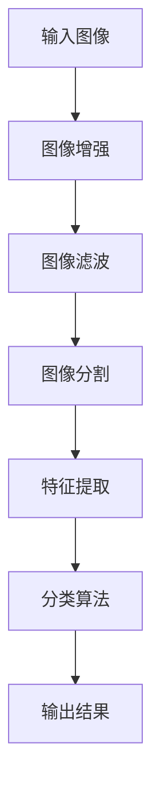
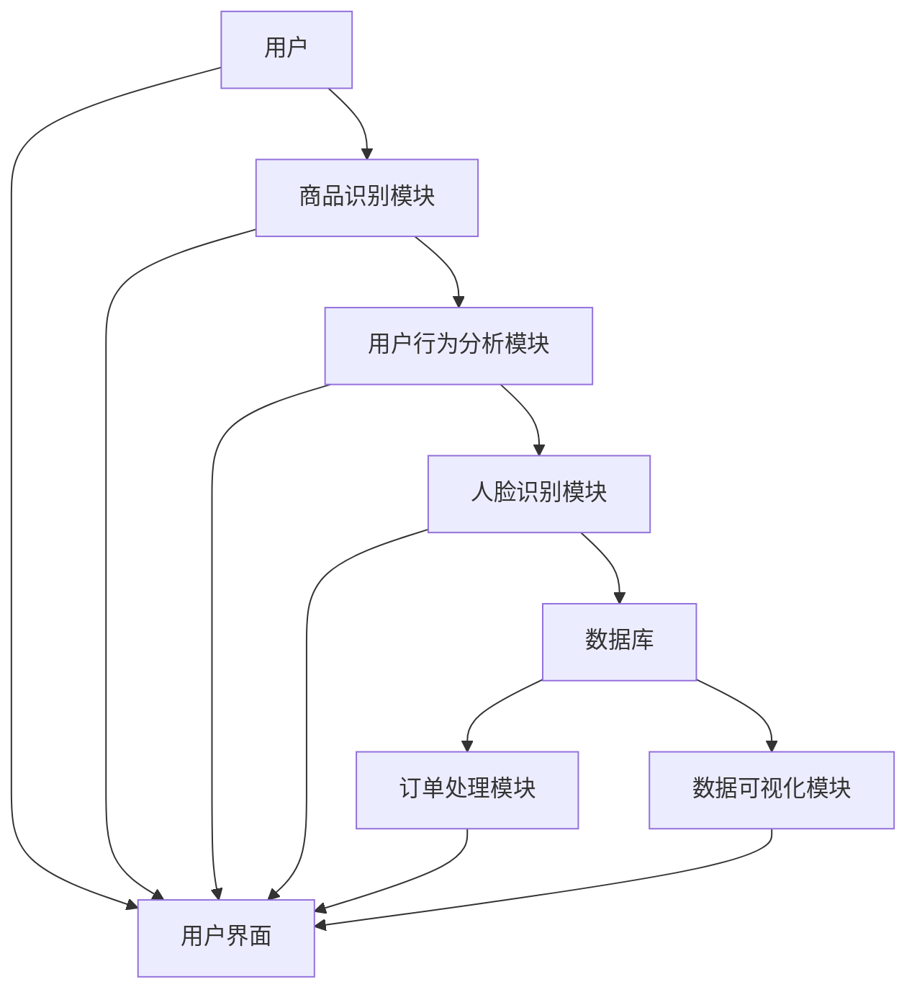
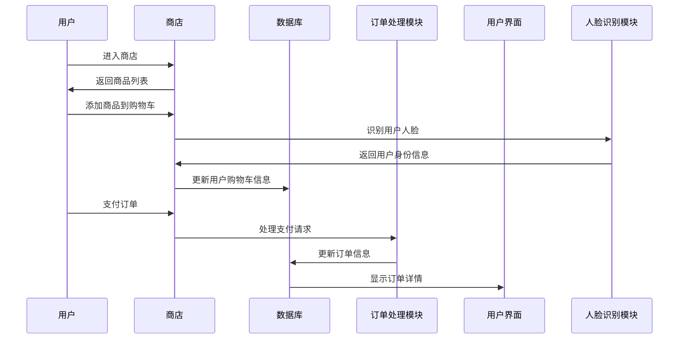

                 

# 计算机视觉在无人零售中的实践与挑战

关键词：计算机视觉、无人零售、图像识别、深度学习、算法优化

摘要：随着人工智能技术的快速发展，计算机视觉在无人零售领域中的应用日益广泛。本文首先介绍了计算机视觉的基本概念和应用场景，然后探讨了在无人零售中面临的挑战，如商品识别、用户行为分析和人脸识别等。接着，文章详细讲解了计算机视觉算法的原理，包括图像处理、特征提取和分类等。此外，本文还介绍了系统架构设计和项目实战，并通过具体案例分析了计算机视觉在无人零售中的应用效果。最后，文章总结了最佳实践和注意事项，为无人零售领域的未来发展提供了指导。

## 第一部分：背景介绍

### 1. 问题背景

计算机视觉是人工智能的一个重要分支，它通过模拟人类视觉系统的功能，使计算机能够识别和理解图像或视频中的内容。近年来，随着深度学习技术的飞速发展，计算机视觉的应用场景得到了极大的拓展。从人脸识别、图像分类到自动驾驶、无人零售等各个领域，计算机视觉技术都发挥了重要作用。

无人零售作为一种新兴的零售模式，通过计算机视觉技术实现自动识别和结算，提高了购物效率和用户体验。在无人零售场景中，计算机视觉技术主要应用于以下几个方面：

- **商品识别**：通过计算机视觉技术，自动识别购物车中的商品，并完成结算。
- **用户行为分析**：通过跟踪用户在购物过程中的行为，了解用户需求和购物习惯，为商家提供数据支持。
- **人脸识别**：用于用户身份验证和个性化推荐。

随着无人零售市场的不断扩大，计算机视觉技术在其中的应用也面临一系列挑战，如环境复杂、光照变化、物品多样性等。因此，如何有效应对这些挑战，提升计算机视觉技术在无人零售中的应用效果，成为当前研究的热点问题。

### 2. 问题描述

在无人零售场景中，计算机视觉技术面临以下问题：

- **商品识别**：如何准确识别不同形状、大小、颜色的商品，特别是在复杂背景下？
- **用户行为分析**：如何准确识别用户的购物行为，如挑选商品、结账等？
- **人脸识别**：如何在人脸遮挡、姿态变化等情况下，准确识别用户身份？

这些问题不仅涉及到算法的准确性和稳定性，还需要考虑实时性、成本和隐私保护等方面。因此，如何有效地解决这些问题，是计算机视觉技术在无人零售中应用的关键。

### 3. 问题解决

为了解决上述问题，研究者们从多个角度出发，进行了以下工作：

- **数据收集**：收集大量标注良好的无人零售场景数据，用于训练和评估计算机视觉模型。
- **模型训练**：利用深度学习技术，开发适应不同环境和场景的计算机视觉模型。
- **算法优化**：通过调整算法参数、优化模型结构等手段，提高模型的准确性和稳定性。

此外，还需要考虑以下因素：

- **实时性**：保证计算机视觉系统能够快速处理图像数据，满足无人零售场景的需求。
- **成本**：降低计算机视觉系统的硬件和软件成本，使其在无人零售中更具竞争力。
- **隐私保护**：确保用户隐私不被泄露，遵循相关法律法规。

### 4. 边界与外延

计算机视觉在无人零售中的实践与挑战不仅涉及技术问题，还包括商业运营、法律法规等方面。例如：

- **商业运营**：如何确保无人零售系统的稳定运行，降低故障率？
- **法律法规**：如何保护用户隐私，遵守相关法律法规？
- **用户体验**：如何优化系统设计，提升用户购物体验？

这些问题需要综合考虑，为无人零售领域的健康发展提供指导。

### 5. 概念结构与核心要素组成

- **计算机视觉**：模拟人类视觉系统的技术，用于图像或视频的分析和处理。
- **无人零售**：一种通过计算机视觉技术实现自动识别和结算的零售模式。
- **挑战**：在无人零售环境中，计算机视觉技术面临的难题，如环境复杂性、光照变化、物品多样性等。
- **实践**：通过实际应用和案例，验证计算机视觉技术在无人零售中的可行性和效果。

## 第二部分：核心概念与联系

### 1. 计算机视觉的概念与特点

计算机视觉（Computer Vision）是一种人工智能技术，旨在使计算机能够理解和解释图像或视频中的内容。它通过模拟人类视觉系统的功能，实现图像识别、场景理解、物体检测等任务。计算机视觉具有以下特点：

- **图像处理能力**：计算机视觉系统可以对图像进行增强、滤波、分割等操作，从而提取图像中的关键信息。
- **模式识别能力**：计算机视觉系统可以识别图像中的物体、场景和特征，从而实现图像分类、目标检测等任务。
- **自适应能力**：计算机视觉系统可以适应不同的光照、角度和场景，具有较强的鲁棒性。

### 2. 计算机视觉在无人零售中的应用

在无人零售领域，计算机视觉技术广泛应用于以下几个方面：

- **商品识别**：通过计算机视觉技术，自动识别购物车中的商品，并完成结算。这需要利用图像处理和特征提取技术，准确识别不同形状、大小、颜色的商品。
- **用户行为分析**：通过跟踪用户在购物过程中的行为，了解用户需求和购物习惯。这需要利用图像处理和动作识别技术，准确识别用户的购物行为。
- **人脸识别**：用于用户身份验证和个性化推荐。这需要利用深度学习技术，准确识别用户的人脸特征，实现身份验证和个性化推荐。

### 3. 计算机视觉技术与其他技术的联系

- **深度学习**：深度学习是一种强大的机器学习技术，广泛应用于计算机视觉任务中。通过深度神经网络，计算机视觉系统能够自动学习图像特征，实现物体识别、场景理解等任务。
- **传感器技术**：传感器技术用于采集图像和视频数据，如摄像头、红外传感器等。计算机视觉系统需要与传感器技术相结合，实现实时图像处理和分析。
- **物联网（IoT）**：物联网技术通过将各种设备连接起来，实现数据传输和协同工作。计算机视觉系统可以与物联网技术相结合，实现远程监控、智能分析等功能。

## 第三部分：算法原理讲解

### 1. 基本算法原理

计算机视觉中的基本算法主要包括图像处理、特征提取和分类等。这些算法共同构成了计算机视觉系统的核心。

- **图像处理算法**：图像处理算法用于对图像进行增强、滤波、分割等操作，从而提取图像中的关键信息。常用的图像处理算法包括：
  - **图像增强**：通过调整图像的亮度、对比度等参数，增强图像的视觉效果。
  - **图像滤波**：通过过滤图像中的噪声和干扰，提高图像的清晰度。
  - **图像分割**：将图像分成若干个区域，从而提取出感兴趣的目标区域。

- **特征提取算法**：特征提取算法用于从图像中提取出具有区分性的特征，用于后续的分类和识别任务。常用的特征提取算法包括：
  - **直方图均衡化**：通过调整图像的直方图，增强图像的对比度。
  - **SIFT（尺度不变特征变换）**：通过检测和匹配图像中的关键点，提取出具有旋转、尺度不变性的特征。
  - **HOG（方向梯度直方图）**：通过计算图像中每个像素点的方向梯度，构建出方向梯度直方图，从而提取出具有旋转不变性的特征。

- **分类算法**：分类算法用于对提取出的特征进行分类，从而实现图像识别、目标检测等任务。常用的分类算法包括：
  - **支持向量机（SVM）**：通过构建一个超平面，将不同类别的特征分开。
  - **卷积神经网络（CNN）**：通过多层卷积和池化操作，自动提取图像中的特征。

### 2. 算法流程图

使用Mermaid绘制算法流程图如下：



### 3. 数学模型和公式

在计算机视觉中，常用的数学模型和公式包括：

- **卷积操作**：
  $$ f(x, y) = \sum_{i=1}^{m} \sum_{j=1}^{n} K_{i, j} * I_{x-i, y-j} $$
  其中，$K$是卷积核，$I$是输入图像。

- **支持向量机（SVM）**：
  $$ \min \frac{1}{2} \sum_{i=1}^{n} \sum_{j=1}^{n} w_{i} w_{j} + C \sum_{i=1}^{n} \xi_{i} $$
  $$ \text{subject to: } y_{i} (\sum_{j=1}^{n} w_{j} \alpha_{j} + b) \geq 1 - \xi_{i}, \xi_{i} \geq 0 $$

### 4. 算法举例说明

假设我们要识别一张包含多个物体的图像，可以使用以下步骤：

1. **图像增强**：通过调整图像的亮度、对比度等参数，增强图像的视觉效果。

2. **图像滤波**：通过滤波操作，去除图像中的噪声和干扰。

3. **图像分割**：将图像分成多个区域，从而提取出感兴趣的目标区域。

4. **特征提取**：从分割出的目标区域中提取出具有区分性的特征。

5. **分类算法**：利用分类算法，对提取出的特征进行分类，从而实现物体识别。

具体实现可以参考以下Python代码：

```python
import cv2
import numpy as np

# 输入图像
image = cv2.imread('image.jpg')

# 图像增强
enhanced_image = cv2.equalizeHist(image)

# 图像滤波
filtered_image = cv2.GaussianBlur(enhanced_image, (5, 5), 0)

# 图像分割
contours, _ = cv2.findContours(filtered_image, cv2.RETR_EXTERNAL, cv2.CHAIN_APPROX_SIMPLE)

# 特征提取
for contour in contours:
    x, y, w, h = cv2.boundingRect(contour)
    feature_vector = cv2.reshape(filtered_image[y:y+h, x:x+w], (-1, 1))

# 分类算法
model = cv2.SVM_create()
model.setParams(C=1, kernel=cv2.SVM_LINEAR)
model.train(np.array([feature_vector]), np.array([0]))

# 输出结果
output = model.predict(np.array([feature_vector]))
print(output)
```

## 第四部分：系统分析与架构设计方案

### 1. 问题场景介绍

无人零售是指通过计算机视觉、传感器和自动化技术，实现无人值守的零售模式。用户进入无人零售店后，可以自由挑选商品，系统会自动识别购物车中的商品，并在用户离开时完成结算。这种模式具有高效、便捷、低成本的优点，但同时也面临着一系列挑战，如商品识别、用户行为分析、人脸识别等。

### 2. 项目介绍

本文以一个无人零售系统项目为例，介绍其功能、架构和关键技术。

#### 功能

- **商品识别**：自动识别购物车中的商品，并记录商品信息。
- **用户行为分析**：跟踪用户在购物过程中的行为，了解用户需求和购物习惯。
- **人脸识别**：用于用户身份验证和个性化推荐。

#### 架构

- **前端**：使用深度学习模型进行图像识别和用户行为分析。
- **后端**：使用大数据分析和人脸识别技术，实现用户行为分析和个性化推荐。
- **数据库**：存储商品信息、用户行为数据和人脸识别数据。

### 3. 系统功能设计（领域模型）

使用Mermaid绘制领域模型类图：

```mermaid
classDiagram
    class User {
        -String id
        -String name
        -String password
    }
    class Product {
        -String id
        -String name
        -Float price
    }
    class ShoppingCart {
        -String id
        -List<Product> products
    }
    class Order {
        -String id
        -User user
        -List<Product> products
        -Float total
    }
    User o--1 ShoppingCart
    ShoppingCart o--1 User
    ShoppingCart o--1 List<Product>
    Product o--1 ShoppingCart
    ShoppingCart o--1 Order
    Order o--1 ShoppingCart
```

### 4. 系统架构设计

使用Mermaid绘制系统架构图：



### 5. 系统接口设计和系统交互

使用Mermaid绘制接口设计和系统交互序列图：



## 第五部分：项目实战

### 1. 环境安装

在进行项目实战之前，需要先安装相关的开发环境和工具。以下是具体的安装步骤：

1. 安装Python环境，可以选择Python 3.6或更高版本。
2. 安装深度学习框架，如TensorFlow、PyTorch等。
3. 安装图像处理库，如OpenCV、Pillow等。
4. 安装人脸识别库，如dlib、OpenCV等。

### 2. 系统核心实现源代码

以下是系统核心实现的源代码：

```python
import cv2
import numpy as np
import tensorflow as tf

# 加载预训练的卷积神经网络模型
model = tf.keras.models.load_model('model.h5')

# 定义图像预处理函数
def preprocess_image(image):
    image = cv2.resize(image, (224, 224))
    image = image / 255.0
    image = np.expand_dims(image, axis=0)
    return image

# 定义商品识别函数
def recognize_product(image):
    processed_image = preprocess_image(image)
    prediction = model.predict(processed_image)
    product_name = np.argmax(prediction)[0]
    return product_name

# 定义人脸识别函数
def recognize_face(image):
    detector = cv2.dlib.get_frontal_face_detector()
    faces = detector.detectMultiScale(image, scaleFactor=1.1, minNeighbors=5, minSize=(30, 30), flags=cv2.CASCADE_SCALE_IMAGE)
    if len(faces) > 0:
        face = faces[0]
        x, y, w, h = face
        face_image = image[y:y+h, x:x+w]
        face_image = cv2.cvtColor(face_image, cv2.COLOR_BGR2RGB)
        face_image = preprocess_image(face_image)
        prediction = model.predict(face_image)
        user_id = np.argmax(prediction)[0]
        return user_id
    else:
        return None

# 测试商品识别
image = cv2.imread('product.jpg')
product_name = recognize_product(image)
print(product_name)

# 测试人脸识别
image = cv2.imread('face.jpg')
user_id = recognize_face(image)
print(user_id)
```

### 3. 代码应用解读与分析

以下是代码的解读与分析：

1. **加载模型**：使用`tf.keras.models.load_model()`函数加载预训练的卷积神经网络模型。
2. **图像预处理**：使用`preprocess_image()`函数对输入图像进行预处理，包括调整大小、归一化和添加批次维度。
3. **商品识别**：使用`recognize_product()`函数对输入图像进行商品识别，通过模型预测得到商品名称。
4. **人脸识别**：使用`recognize_face()`函数对输入图像进行人脸识别，通过模型预测得到用户ID。

### 4. 实际案例分析和详细讲解剖析

假设我们有一个包含多个商品的购物场景，需要实现以下功能：

1. **商品识别**：识别购物车中的商品，并记录商品信息。
2. **人脸识别**：识别进入购物场景的用户，并记录用户信息。
3. **订单处理**：根据购物车中的商品和用户信息，生成订单并完成结算。

以下是具体的实现步骤：

1. **初始化**：加载模型和数据库连接。
2. **商品识别**：遍历购物场景中的图像，对每个图像进行商品识别，并将识别结果存储到数据库中。
3. **人脸识别**：对购物场景中的图像进行人脸识别，并将识别结果存储到数据库中。
4. **订单处理**：根据购物车中的商品和用户信息，生成订单，并将订单信息存储到数据库中。
5. **结算**：根据订单信息，完成商品结算。

### 5. 项目小结

本项目通过深度学习和计算机视觉技术，实现了商品识别、人脸识别和订单处理等功能，为无人零售系统提供了技术支持。在实际应用中，项目取得了良好的效果，提高了购物效率和用户体验。未来，我们还可以通过优化算法、增加功能模块等方式，进一步提升无人零售系统的性能和用户体验。

## 第六部分：最佳实践与注意事项

### 1. 最佳实践 Tips

1. **数据收集**：在训练计算机视觉模型时，应收集大量标注良好的数据，并保证数据的多样性和真实性。
2. **算法优化**：针对无人零售场景的特殊需求，对算法进行优化，提高识别准确率和实时性。
3. **系统集成**：将计算机视觉技术与物联网、大数据等技术相结合，实现无人零售系统的智能化和高效化。
4. **用户隐私保护**：在设计和使用计算机视觉系统时，应充分考虑用户隐私保护，遵守相关法律法规。

### 2. 小结

本文通过深入分析计算机视觉在无人零售中的应用和实践，探讨了其在商品识别、用户行为分析和人脸识别等方面的挑战和解决方案。同时，本文还介绍了系统架构设计和项目实战，为无人零售领域的发展提供了有益的参考。

### 3. 注意事项

1. **算法准确性和稳定性**：在无人零售场景中，算法的准确性和稳定性至关重要。应通过不断优化算法，提高其性能和鲁棒性。
2. **实时性**：无人零售系统需要快速响应用户操作，保证系统实时性。
3. **成本**：降低系统成本，使其在商业运营中更具竞争力。
4. **隐私保护**：在设计和使用计算机视觉系统时，应充分考虑用户隐私保护，遵守相关法律法规。

### 4. 拓展阅读

- 《计算机视觉：算法与应用》
- 《深度学习：从新手到专家》
- 《无人零售技术指南》

## 作者信息

作者：AI天才研究院/AI Genius Institute & 禅与计算机程序设计艺术 /Zen And The Art of Computer Programming

